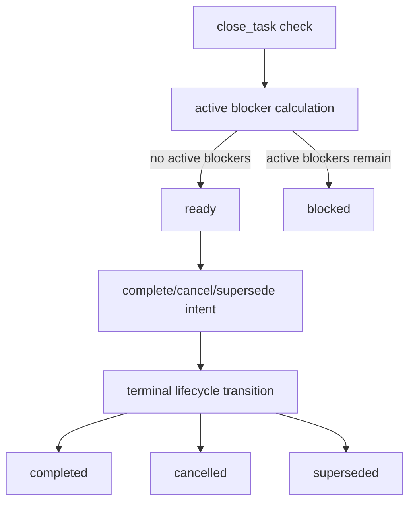

# Active MVP API

## What this document helps you do

Use this reference to look up the active current MVP API surface. It owns method-level request, response, state effect, storage owner, error, and security boundary summaries for the active method-name value set owned by [API Schema Core](schema-core.md#current-mvp-value-sets).

This document describes future Harness Server behavior for planning and review. No Harness runtime or server implementation exists in this repository today. Future API or schema candidates are cataloged in [Later Candidate Index](../../later/index.md), not in this active reference. Storage DDL and full shared schema bodies are owned outside this method reference.

## Main Idea

The active MVP API is a small local MCP surface for one user work loop. It can intake work, show status, update active scope, check proposed product writes against current Core state, record runs and evidence refs, ask and record user-owned judgment, and close only when active blockers allow it.

The API does not provide OS permissions, arbitrary-tool sandboxing, tamper-proof files, pre-tool blocking, or security isolation. `harness.prepare_write` returns a cooperative Harness record/check only.

Requirement shaping uses the active Task, Change Unit, `user_judgment`, evidence summary, and blocker paths. The API must not introduce separate active Discovery Brief, Question Queue, Assumption Register, or similar committed planning artifacts to move from a vague request to a safe first Change Unit.

<a id="active-mvp-method-behavior"></a>

## Active MVP Method Behavior

The exact active method-name value set is owned by [API Schema Core](schema-core.md#current-mvp-value-sets). This page owns the behavior of those current methods:

| Method | Active role |
|---|---|
| [`harness.intake`](#harnessintake) | Start, resume, or classify ordinary user work. |
| [`harness.status`](#harnessstatus) | Return current state summary, blockers, pending judgments, evidence summary, close state, and next safe actions. |
| [`harness.update_scope`](#harnessupdate_scope) | Update active Task scope and the active Change Unit after intake. |
| [`harness.prepare_write`](#harnessprepare_write) | Check a proposed product write against current scope, state, sensitive-action permission, baseline, and surface capability. |
| [`harness.record_run`](#harnessrecord_run) | Record shaping, direct, or implementation work plus compact evidence and artifact refs. |
| [`harness.request_user_judgment`](#harnessrequest_user_judgment) | Create one pending user-owned judgment request. |
| [`harness.record_user_judgment`](#harnessrecord_user_judgment) | Record the user's answer to an existing pending `UserJudgment`. |
| [`harness.close_task`](#harnessclose_task) | Check close readiness and close, cancel, or supersede only when blockers allow it. |

Method state effects are fixed by this matrix. "Event created",
"`tool_invocations` replay row created", and "`state_version` increments" mean a
new committed non-dry-run mutation. Idempotent replay returns the existing
committed response and does not create a second event, replay row, or version
increment. A committed blocked response has those effects only in rows whose
"Committed blocked response allowed" cell says yes.

| Method | Read-only or mutating | `dry_run` allowed | `idempotency_key` required | `expected_state_version` required | Committed blocked response allowed | Event created | `tool_invocations` replay row created | `state_version` increments |
|---|---|---|---|---|---|---|---|---|
| `harness.intake` | Mutating | Yes; never commits | Yes for non-dry-run | Yes for non-dry-run | Yes, when the method commits shaping/blocker state instead of a write-ready path | Yes, on commit | Yes, on first commit | Yes, on commit |
| `harness.status` | Read-only | Yes; no state distinction | No | No; may be `null` | No; blockers are computed response fields only | No | No | No |
| `harness.update_scope` | Mutating | Yes; never commits | Yes for non-dry-run | Yes for non-dry-run | Yes, only for method-owned blocker/current-row updates; no scope authority is created by an unsatisfied precondition | Yes, on commit | Yes, on first commit | Yes, on commit |
| `harness.prepare_write` | Mutating | Yes; never commits | Yes for non-dry-run | Yes for non-dry-run | Yes, for committed `blocked`, `approval_required`, or `decision_required` blocker updates; no consumable Write Authorization is created | Yes, on committed `allowed` or committed blocker update | Yes, on first committed `allowed` or committed blocker update | Yes, on committed `allowed` or committed blocker update |
| `harness.record_run` | Mutating | Yes; never commits | Yes for non-dry-run | Yes for non-dry-run | Yes, only when recording a compatible Run or run-related blocker state; rejected attempts are pre-commit failures | Yes, on commit | Yes, on first commit | Yes, on commit |
| `harness.request_user_judgment` | Mutating | Yes; never commits | Yes for non-dry-run | Yes for non-dry-run | No separate blocked-response commit; the method either commits the pending judgment path or fails pre-commit | Yes, on commit | Yes, on first commit | Yes, on commit |
| `harness.record_user_judgment` | Mutating | Yes; never commits | Yes for non-dry-run | Yes for non-dry-run | Yes, when the addressed judgment is committed as rejected, deferred, blocked, or otherwise blocker-producing | Yes, on commit | Yes, on first commit | Yes, on commit |
| `harness.close_task intent=check` | Read-only | Yes; no state distinction | No | No; may be `null` | No; close blockers are computed response fields only | No | No | No |
| `harness.close_task intent=complete/cancel/supersede` | Mutating | Yes; never commits | Yes for non-dry-run | Yes for non-dry-run | Yes, when close blockers are persisted while the Task remains open | Yes, on terminal commit or committed blocked close | Yes, on first terminal commit or committed blocked close | Yes, on terminal commit or committed blocked close |

<a id="shared-request-rules"></a>

## Shared Request Rules

All methods use [`ToolEnvelope`](schema-core.md#tool-envelope) and [`ToolResponseBase`](schema-core.md#common-response). Committed non-dry-run state-changing calls require a non-null `idempotency_key` and a current `expected_state_version`. `harness.status`, `harness.close_task intent=check`, and dry-run calls may use `idempotency_key: null` and `expected_state_version: null`.

When a method has a tool-specific `task_id`, Core resolves the primary Task in this order: tool-specific `task_id`, `ToolEnvelope.task_id`, then active Task. Task-scoped mutations compare `expected_state_version` with `tasks.state_version`; project-scoped mutations with no selected Task compare it with `project_state.state_version`.

Read-only calls may compute and return blockers, close blockers, next actions, and diagnostics, but those values are response fields only. They must not store blockers, append `task_events`, create `tool_invocations` replay rows, or increment `state_version`.

`dry_run=true` is never authoritative. It may return diagnostics, candidate blockers, or a would-change result, but it creates no current record, `task_events` row, artifact, Write Authorization, evidence summary, close state, `tool_invocations` replay row, or state-version increment.

Only committed non-dry-run mutations create `tool_invocations` replay rows. A replay with the same `idempotency_key` and same request hash returns the existing committed response. The same key with a different request hash returns `STATE_CONFLICT`. `dry_run` calls and pre-commit failures do not create or reserve replay rows.

Error codes, primary error precedence, idempotency, stale-state behavior, close blocker ordering, and user-facing error labels are owned by [API Errors](errors.md). Shared schemas and active value sets are owned by [API Schema Core](schema-core.md).

Local access classes are Harness API compatibility classes, not OS permission classes. Every class requires `surface_id` to name a `surfaces` row registered to the same `project_id`, and requires `surfaces.status=active` before the API can rely on that surface. State-changing classes also require `surfaces.local_access_posture=registered_local`. When applicable, `project_id`, `surface_id`, `task_id`, and `expected_state_version` must be mutually compatible before a read relies on protected state or a mutation commits.

| Access class | Covers | Minimum access conditions |
|---|---|---|
| `read_status` | `harness.status`, read-only status resources, and read-only close checks such as `harness.close_task intent=check`. | Registered same-project `surface_id`, `surfaces.status=active`, reachable Core/surface path for the requested read, and compatible `task_id` when a Task-scoped read is requested. A status read may return display-safe availability or mismatch diagnostics, but it must not invent state from stale text or expose protected Core detail when local access cannot be confirmed. |
| `core_mutation` | `harness.intake`, `harness.update_scope`, `harness.request_user_judgment`, `harness.record_user_judgment`, and terminal `harness.close_task` intents. | `read_status` conditions plus `surfaces.local_access_posture=registered_local`, non-null `idempotency_key` and current `expected_state_version` for non-dry-run commits, and compatible `project_id`, `surface_id`, `task_id`, and owner records when applicable. |
| `write_authorization` | `harness.prepare_write`. | `core_mutation` conditions plus active Task/Change Unit compatibility, scope, baseline, sensitive-action, and capability checks required for the intended attempt. |
| `run_recording` | `harness.record_run`. | `core_mutation` conditions plus compatible `task_id`, `change_unit_id`, `baseline_ref`, observed attempt facts, and a consumable active Write Authorization when the run records a product write. |
| `artifact_registration` | `ArtifactInput[]` accepted by `harness.record_run`. | `run_recording` conditions plus a documented `staged_file` handle from the active `stage_artifact` utility, or a compatible `existing_artifact` ref. Caller-supplied raw filesystem paths, raw secrets, tokens, full sensitive logs, `captured_artifact` handles, raw capture-adapter outputs, and native capture claims are not accepted as registration authority in the active MVP. |
| `artifact_read` | Local artifact metadata or content reads when an owner path exposes them from a registered `ArtifactRef`. | Registered same-project `surface_id`, `surfaces.status=active`, `surfaces.local_access_posture=registered_local` for content reads, a registered `ArtifactRef`, compatible `project_id`/`task_id`, required redaction and availability checks, and a matching owner relation in `artifact_links`. Raw artifact path reads are not granted by default. |

Use `MCP_UNAVAILABLE` when required MCP/Core or surface reachability itself is unavailable. Use `LOCAL_ACCESS_MISMATCH` when registered local access expectations do not match the reachable caller, path, or posture, including revoked local access. Use `CAPABILITY_INSUFFICIENT` when the surface is recognized but lacks the capability required for the access class, observation, capture, blocking/isolation claim, or active behavior.

<a id="harnessintake"></a>

## `harness.intake`

- **Owns:** Task start/resume/classification and the initial scope candidate for write-capable work.
- **Does not own:** Later active scope updates, later active Change Unit updates, product writes, evidence sufficiency, user judgment resolution, Write Authorization, final acceptance, residual-risk acceptance, or close.
- **When to call:** At the beginning of ordinary work, or when the caller needs to resume, supersede, or reject an existing active Task.
- **Request:**

```yaml
IntakeRequest:
  envelope: ToolEnvelope
  user_request: string
  requested_mode: advisor | direct | work | auto
  resume_policy: resume_active | create_new | supersede_active | reject_if_active
  acceptance_criteria: string[]
  constraints:
    allowed_paths: string[]
    non_goals: string[]
    sensitive_categories: string[]
  initial_context_refs: StateRecordRef[]
```

`requested_mode` is the caller's requested intake mode. `advisor` means advice, review, or planning without product writes. `direct` means a small direct change. `work` means tracked work. `auto` is input-only: it asks the server to classify `user_request` and resolve the Task to exactly one concrete mode, `advisor`, `direct`, or `work`, before persisting or displaying Task state.

- **Response:**

```yaml
IntakeResponse:
  base: ToolResponseBase
  task_ref: StateRecordRef
  change_unit_ref: StateRecordRef | null
  state: StateSummary
  next_actions: NextActionSummary[]
```

`IntakeResponse.state.mode` exposes the resolved concrete mode. It must not be `auto`; later status summaries must also expose the resolved mode rather than the intake request value.

- **State effect:** A committed non-dry-run call may create or resume `tasks`, set `project_state.active_task_id`, create an initial scope candidate in `change_units` for write-capable resolved `direct` or `work`, update blockers, append events, create a committed replay row, and increment the affected state clock. If the request is still not writable, the Task remains or becomes `lifecycle_phase=shaping` with the current goal summary, known scope/non-goals, one blocking question when necessary, and one next safe action represented through active Task, Change Unit, user-judgment, evidence, or blocker fields. If the request is already concrete enough for write-capable work, intake may establish enough initial scope for a ready path, but the first product write still requires `harness.prepare_write`. Later changes to the active goal, scope boundary, non-goals, acceptance criteria, autonomy boundary, baseline, or active Change Unit belong to `harness.update_scope`. The method name is not a persisted lifecycle value; created or resumed Tasks must use the active `Task.lifecycle_phase` value set from [API Schema Core](schema-core.md#current-mvp-value-sets). `dry_run` and pre-commit failure create none of these and do not increment `state_version`.
- **Errors:** `VALIDATION_FAILED`, `STATE_CONFLICT`, `MCP_UNAVAILABLE`, `LOCAL_ACCESS_MISMATCH`, `NO_ACTIVE_TASK`, `VALIDATOR_FAILED`.
- **Storage owner:** `project_state`, `tasks`, `change_units`, `blockers`, `task_events`, and `tool_invocations`.
- **Security boundary:** Intake records scope and the resolved concrete mode. It does not authorize local access, sensitive actions, product writes, or stronger guarantee levels.

<a id="harnessupdate_scope"></a>

## `harness.update_scope`

- **Owns:** Updating an active Task's goal summary, scope boundary, non-goals, acceptance criteria, autonomy boundary, baseline reference, and active Change Unit after intake.
- **Does not own:** Task start/classification, user judgment resolution, product writes, evidence, Write Authorization creation, Run recording, final acceptance, residual-risk acceptance, or close.
- **When to call:** After clarification changes active scope, after a resolved `judgment_kind=scope_decision` needs to be applied, or when the active Change Unit or baseline must be created or replaced before write compatibility can be checked.
- **Request:**

```yaml
UpdateScopeRequest:
  envelope: ToolEnvelope
  task_id: string
  goal_summary: string | null
  scope_boundary: string | null
  non_goals: string[] | null
  acceptance_criteria: string[] | null
  autonomy_boundary: string | null
  baseline_ref: string | null
  change_unit:
    operation: keep_active | create_active | replace_active
    scope_summary: string | null
    affected_areas: string[]
    affected_paths: string[]
    constraints: string[]
  related_scope_decision_refs: StateRecordRef[]
```

For top-level scope update fields, `null` means leave the current value unchanged; an empty array replaces that list with an empty list. `affected_areas` names product or repository areas when concrete paths are not yet safe to claim; `affected_paths` names allowed path candidates or exact intended paths when known. `create_active` and `replace_active` must provide enough non-null Change Unit scope to establish the new active boundary.

`related_scope_decision_refs` may link relevant resolved `user_judgment` records whose `judgment_kind=scope_decision`. Those refs explain why the scope changed; they do not mutate scope by themselves.

- **Response:**

```yaml
UpdateScopeResponse:
  base: ToolResponseBase
  task_ref: StateRecordRef
  change_unit_ref: StateRecordRef | null
  linked_scope_decision_refs: StateRecordRef[]
  stale_write_authorization_refs: StateRecordRef[]
  blocker_refs: StateRecordRef[]
  state: StateSummary
  next_actions: NextActionSummary[]
```

- **State effect:** A committed non-dry-run call may update active Task shaping fields, create or replace the active `change_units` row, update `tasks.active_change_unit_id`, link relevant `scope_decision` user-judgment refs, update blockers, append events, create a committed replay row, and increment the affected state clock. The update is the active path that turns a vague request into a writable first Change Unit once the current goal summary, active scope summary, allowed paths or affected areas, non-goals, acceptance criteria, Autonomy Boundary, required user-owned judgments, blocking question if any, next safe action, evidence expectation or gap, and close blockers are represented in owner state. When the updated Task, Change Unit, baseline, scope boundary, non-goals, acceptance criteria, or autonomy boundary no longer matches an active Write Authorization, Core marks that authorization `status=stale`; it does not consume, revoke, expire, or silently reuse it. `dry_run` and pre-commit failure create no current record, scope change, stale authorization, event, artifact, evidence summary, replay row, or state-version increment.
- **Errors:** `VALIDATION_FAILED`, `STATE_CONFLICT`, `NO_ACTIVE_TASK`, `NO_ACTIVE_CHANGE_UNIT`, `SCOPE_REQUIRED`, `SCOPE_VIOLATION`, `DECISION_REQUIRED`, `DECISION_UNRESOLVED`, `AUTONOMY_BOUNDARY_EXCEEDED`, `CAPABILITY_INSUFFICIENT`, `MCP_UNAVAILABLE`, `LOCAL_ACCESS_MISMATCH`, `BASELINE_STALE`, `VALIDATOR_FAILED`.
- **Storage owner:** `tasks`, `change_units`, `write_authorizations`, `blockers`, `task_events`, and `tool_invocations`.
- **Security boundary:** Scope updates change Harness records only. They do not create Write Authorization, grant OS permission, approve sensitive actions, record evidence, or close work. Any stale Write Authorization must be refreshed through `harness.prepare_write` before a product write can be recorded.

<a id="harnessstatus"></a>

## `harness.status`

- **Owns:** Read-only current-position output over Core state and refs.
- **Does not own:** State mutation, readable-view repair, write compatibility, evidence creation, user judgment resolution, final acceptance, residual-risk acceptance, or close.
- **When to call:** Before choosing the next action, after a state-changing call, or when the caller needs blockers, pending judgments, evidence summary, write-authority summary, close status, or guarantee display.
- **Request:**

```yaml
StatusRequest:
  envelope: ToolEnvelope
  include:
    task: boolean
    pending_user_judgments: boolean
    write_authority: boolean
    evidence: boolean
    close: boolean
    guarantees: boolean
```

- **Response:**

```yaml
StatusResponse:
  base: ToolResponseBase
  active_task: StateSummary | null
  status_card: string
  next_actions: NextActionSummary[]
  pending_user_judgments: StateRecordRef[]
  write_authority_summary: WriteAuthoritySummary | null
  evidence_summary: EvidenceSummary | null
  blocker_refs: StateRecordRef[]
  close_state: ready | blocked | closed | cancelled | superseded | none
  close_blockers: CloseBlocker[]
  guarantee_display: GuaranteeDisplay
```

- **State effect:** None. `harness.status` may compute blockers, close blockers, next actions, and diagnostics for the response, but it does not store them, append events, create `tool_invocations` replay rows, or increment `state_version`.
- **Shaping display:** Status must expose the current lifecycle position honestly. `shaping` means the request is not yet writable, `waiting_user` means one user-owned judgment is required before the next safe action, `ready` means write-capable work has an active Change Unit and can move toward pre-write checking, and `blocked` means an active blocker prevents progress. Read-only work may be ready for its next read-only action, but that does not imply write compatibility. The response should prefer one primary next safe action and one blocking question when a question is truly blocking; non-blocking curiosity questions do not become blockers.
- **Close-state boundary:** `none` is allowed only on `StatusResponse.close_state` when no active close state is available. `CloseTaskResponse.close_state` uses `ready`, `blocked`, `closed`, `cancelled`, or `superseded`.
- **Errors:** `MCP_UNAVAILABLE`, `LOCAL_ACCESS_MISMATCH`, `CAPABILITY_INSUFFICIENT`, `NO_ACTIVE_TASK`, `PROJECTION_STALE` when a requested readable view is stale or unavailable.
- **Storage owner:** Read-only over `project_state`, `tasks`, `change_units`, `user_judgments`, `write_authorizations`, `runs`, `evidence_summaries`, `artifacts`, `artifact_links`, and `blockers`.
- **Security boundary:** Without a promoted profile, status displays only the current MVP `GuaranteeDisplay.level` values `cooperative` or `detective`. `preventive` and `isolated` are later/profile-gated display names and are not current MVP schema values. Stale status text, chat, rendered views, and cached summaries are not authority.

<a id="harnessprepare_write"></a>

## `harness.prepare_write`

- **Owns:** The cooperative pre-write scope check and durable single-use Write Authorization when the proposed attempt is compatible.
- **Does not own:** OS permission, sandboxing, tamper-proof enforcement, pre-tool blocking, user judgment creation, evidence sufficiency, run recording, or close.
- **When to call:** Immediately before a product-file write or other write-capable action that must match current Task, Change Unit, baseline, sensitive-action permission, and surface capability.
- **Request:**

```yaml
PrepareWriteRequest:
  envelope: ToolEnvelope
  task_id: string | null
  change_unit_id: string | null
  intended_operation: string
  intended_paths: string[]
  product_file_write_intended: boolean
  sensitive_categories: string[]
  baseline_ref: string | null
```

- **Response:**

```yaml
PrepareWriteResponse:
  base: ToolResponseBase
  decision: allowed | blocked | approval_required | decision_required | state_conflict
  state: StateSummary | null
  write_authorization_ref: StateRecordRef | null
  write_authorization: WriteAuthorizationSummary | null
  authorization_effect: none | would_create | created | returned
  active_user_judgment_refs: StateRecordRef[]
  blocked_reasons: CloseBlocker[]
  user_judgment_candidate: UserJudgmentCandidate | null
  guarantee_display: GuaranteeDisplay
```

- **State effect:** A committed non-dry-run `decision=allowed` creates exactly one `write_authorizations.status=active` row, appends an event, creates a replay row, and increments the affected state clock for the active path-level `AuthorizedAttemptScope`. A committed `blocked`, `approval_required`, or `decision_required` response may update blockers, append an event, create a replay row, and increment the affected state clock, but it must not create a consumable authorization. `dry_run` and pre-commit failure create no current record, authorization, blocker row, event, artifact, evidence summary, replay row, or state-version increment.
- **Errors:** `VALIDATION_FAILED`, `STATE_CONFLICT`, `NO_ACTIVE_TASK`, `NO_ACTIVE_CHANGE_UNIT`, `SCOPE_REQUIRED`, `SCOPE_VIOLATION`, `DECISION_REQUIRED`, `AUTONOMY_BOUNDARY_EXCEEDED`, `APPROVAL_REQUIRED`, `APPROVAL_DENIED`, `APPROVAL_EXPIRED`, `CAPABILITY_INSUFFICIENT`, `MCP_UNAVAILABLE`, `LOCAL_ACCESS_MISMATCH`, `BASELINE_STALE`, `VALIDATOR_FAILED`.
- **Storage owner:** `write_authorizations`, `blockers`, `tasks` or `project_state` version clocks, `task_events`, and `tool_invocations`.
- **Security boundary:** `decision=allowed` means compatible with Harness records for this path-level product-write attempt. It does not mean the operating system will block incompatible writes or that arbitrary tools are isolated. Current-MVP requests that require command, network, secret-access, artifact-capture, pre-tool-blocking, or isolation guarantees must return `CAPABILITY_INSUFFICIENT` when the active surface lacks the capability, or `VALIDATION_FAILED` when the request shape or requested guarantee is invalid for the active profile. The active `PrepareWriteRequest` contains only the path-level fields listed above and does not encode command, network, or secret-observation scope.

<a id="harnessrecord_run"></a>

## `harness.record_run`

- **Owns:** Run recording, compatible Write Authorization consumption, artifact registration, compact evidence-summary updates, and run-related blockers.
- **Does not own:** New scope, user judgment resolution, final acceptance, residual-risk acceptance, separate assurance records, or close.
- **When to call:** After shaping work, a direct answer/result, or implementation work. Product-write runs must provide a compatible active Write Authorization from `harness.prepare_write`.
- **Request:**

```yaml
RecordRunRequest:
  envelope: ToolEnvelope
  task_id: string | null
  change_unit_id: string | null
  kind: shaping_update | implementation | direct
  run_id: string | null
  baseline_ref: string | null
  write_authorization_id: string | null
  summary: string
  observed_changes: ObservedChanges
  artifact_inputs: ArtifactInput[]
  evidence_updates: EvidenceCoverageItem[]
```

- **Response:**

```yaml
RecordRunResponse:
  base: ToolResponseBase
  run_summary: RunSummary
  registered_artifacts: ArtifactRef[]
  evidence_summary: EvidenceSummary | null
  blocker_refs: StateRecordRef[]
  state: StateSummary
```

- **State effect:** A compatible committed call may create `runs`, `artifacts`, `artifact_links`, and `evidence_summaries`, update run-related blockers, consume `write_authorizations.status=active`, append events, create a committed replay row, and increment the affected state clock. Product-write runs consume the active Write Authorization only when the stored authorization and observed changed paths are compatible. Rejected calls and pre-commit failures must not create a Run, register artifacts, update evidence, consume an invalid authorization, append events, create replay rows, or increment `state_version`.
- **Errors:** `VALIDATION_FAILED`, `STATE_CONFLICT`, `NO_ACTIVE_TASK`, `NO_ACTIVE_CHANGE_UNIT`, `WRITE_AUTHORIZATION_REQUIRED`, `WRITE_AUTHORIZATION_INVALID`, `SCOPE_VIOLATION`, `CAPABILITY_INSUFFICIENT`, `MCP_UNAVAILABLE`, `LOCAL_ACCESS_MISMATCH`, `BASELINE_STALE`, `ARTIFACT_MISSING`, `EVIDENCE_INSUFFICIENT`, `VALIDATOR_FAILED`.
- **Storage owner:** `runs`, `write_authorizations`, `artifacts`, `artifact_links`, `evidence_summaries`, `blockers`, `task_events`, and `tool_invocations`.
- **Security boundary:** A run can record what the surface observed. In the baseline `reference-local-mcp` profile, product-write compatibility is detective only for observed changed paths after the relevant capability check has passed, and a product-write Run consumes an active Write Authorization only on that path-level compatibility. The API must not mark command execution, network activity, secret access, artifact capture, blocking, or isolation facts verified when the active surface cannot observe them.

<a id="harnessrequest_user_judgment"></a>

## `harness.request_user_judgment`

- **Owns:** Creation of a pending `UserJudgment` for one focused user-owned decision.
- **Does not own:** The user's answer, active scope mutation, active Change Unit mutation, sensitive-action permission, Write Authorization, evidence, final acceptance, residual-risk acceptance, or close.
- **When to call:** When progress, write compatibility, acceptance, risk handling, or close depends on a user-owned judgment that cannot be inferred from existing records.
- **Request:**

```yaml
RequestUserJudgmentRequest:
  envelope: ToolEnvelope
  task_id: string | null
  change_unit_id: string | null
  judgment_kind: product_decision | technical_decision | scope_decision | sensitive_approval | final_acceptance | residual_risk_acceptance | cancellation
  presentation: short
  question: string
  options: UserJudgmentOption[]
  context: UserJudgmentContext
  affected_refs: StateRecordRef[]
  required_for: next_action | write | run | close | acceptance | risk
  expires_at: string | null
```

- **Response:**

```yaml
RequestUserJudgmentResponse:
  base: ToolResponseBase
  user_judgment_ref: StateRecordRef
  user_judgment: UserJudgment
  blocker_refs: StateRecordRef[]
  state: StateSummary
```

- **State effect:** A committed non-dry-run call creates one pending `user_judgments` row, may link or update affected blockers, appends an event, creates a replay row, and increments the affected state clock. A candidate returned by another method is not a pending judgment until this method commits. `dry_run` and pre-commit failure create no pending judgment, blocker update, event, replay row, or state-version increment.
- **Errors:** `VALIDATION_FAILED`, `STATE_CONFLICT`, `NO_ACTIVE_TASK`, `DECISION_REQUIRED`, `DECISION_UNRESOLVED`, `MCP_UNAVAILABLE`, `LOCAL_ACCESS_MISMATCH`, `CAPABILITY_INSUFFICIENT`, `VALIDATOR_FAILED`.
- **Storage owner:** `user_judgments`, `blockers`, `task_events`, and `tool_invocations`.
- **Security boundary:** The request presents a question. It grants no permission and resolves no gate until `harness.record_user_judgment` records a matching answer. A `scope_decision` answer still requires `harness.update_scope` before active scope or the active Change Unit changes.

<a id="harnessrecord_user_judgment"></a>

## `harness.record_user_judgment`

- **Owns:** Resolution, rejection, deferral, or blocking of an existing pending `UserJudgment`.
- **Does not own:** A broader decision than the pending `judgment_kind`, active scope mutation, active Change Unit mutation, product writes, evidence, Write Authorization, close, or any judgment not explicitly asked.
- **When to call:** After the user answers a specific pending `UserJudgment`.
- **Request:**

```yaml
RecordUserJudgmentRequest:
  envelope: ToolEnvelope
  user_judgment_id: string
  judgment_kind: product_decision | technical_decision | scope_decision | sensitive_approval | final_acceptance | residual_risk_acceptance | cancellation
  selected_option_id: string
  answer: RecordUserJudgmentPayload
  note: string | null
  accepted_risks: AcceptedRiskInput[]
```

`selected_option_id` and `note` are canonical request-level fields. `answer` must not repeat either one; `RecordUserJudgmentPayload` carries only decision-specific answer details.

- **Response:**

```yaml
RecordUserJudgmentResponse:
  base: ToolResponseBase
  user_judgment_ref: StateRecordRef
  user_judgment: UserJudgment
  updated_refs: StateRecordRef[]
  state: StateSummary
  next_actions: NextActionSummary[]
```

- **State effect:** A committed non-dry-run call updates `user_judgments.status`, records the request-level selected option, request note, and answer details, updates only covered blockers and judgment-dependent summaries, appends an event, creates a replay row, and increments the affected state clock. It does not directly mutate active Task scope fields or the active Change Unit. If a resolved `scope_decision` means scope must change, the response's next action points to `harness.update_scope`. It creates no standalone accepted-risk row in active MVP. `dry_run` and pre-commit failure create no judgment resolution, blocker update, event, replay row, or state-version increment.
- **Errors:** `VALIDATION_FAILED`, `STATE_CONFLICT`, `NO_ACTIVE_TASK`, `DECISION_UNRESOLVED`, `APPROVAL_DENIED`, `APPROVAL_EXPIRED`, `ACCEPTANCE_REQUIRED`, `RESIDUAL_RISK_NOT_VISIBLE`, `MCP_UNAVAILABLE`, `LOCAL_ACCESS_MISMATCH`, `VALIDATOR_FAILED`.
- **Storage owner:** `user_judgments`, `blockers`, `task_events`, and `tool_invocations`.
- **Security boundary:** Broad phrases such as "go ahead" or "looks good" do not become product decisions, sensitive-action approval, final acceptance, residual-risk acceptance, cancellation, or scope expansion unless the pending active judgment explicitly asked for that kind and the recorded answer matches it. Later-only judgment candidates are not active MVP judgment kinds.

<a id="harnessclose_task"></a>

## `harness.close_task`

- **Owns:** Active close-readiness check and terminal Task close/cancel/supersede when blockers allow it.
- **Does not own:** Evidence creation, user judgment creation, final acceptance creation, residual-risk acceptance creation, export, release handoff, projection/report freshness, or implementation validation beyond active blockers.
- **When to call:** When the caller needs to know whether work can close, or when the user intends to complete, cancel, or supersede the active Task.
- **Request:**

```yaml
CloseTaskRequest:
  envelope: ToolEnvelope
  task_id: string
  intent: check | complete | cancel | supersede
  close_reason: completed_self_checked | completed_with_risk_accepted | cancelled | superseded | null
  superseding_task_id: string | null
  user_note: string | null
```

- **Response:**

```yaml
CloseTaskResponse:
  base: ToolResponseBase
  close_state: ready | blocked | closed | cancelled | superseded
  state: StateSummary
  blockers: CloseBlocker[]
  evidence_summary: EvidenceSummary | null
  artifact_refs: ArtifactRef[]
  next_actions: NextActionSummary[]
```

Close concepts stay separate. `Task.lifecycle_phase` is the persisted lifecycle field; active values are `shaping`, `ready`, `executing`, `waiting_user`, `blocked`, `completed`, `cancelled`, and `superseded`. `CloseTaskResponse.close_state` is response-level close status with values `ready`, `blocked`, `closed`, `cancelled`, and `superseded`. `Task.close_reason` stores close detail as `none`, `completed_self_checked`, `completed_with_risk_accepted`, `cancelled`, or `superseded`. `Task.result` stores only the coarse outcome `none`, `advice_only`, `completed`, `cancelled`, or `superseded`; unsuccessful Runs, violations, blocked closes, and evidence gaps remain in Run status, `CloseBlocker`, evidence state, or current Task state.

The diagram below is a compact aid for the active `close_task` decision flow. `ready` and `blocked` are response-level `CloseTaskResponse.close_state` results before a terminal lifecycle update; `completed`, `cancelled`, and `superseded` are terminal `Task.lifecycle_phase` values.



- **Close-field mapping:** A committed non-dry-run `intent=complete` sets `lifecycle_phase=completed` and `result=completed` with `close_reason=completed_self_checked` or `completed_with_risk_accepted`. `intent=cancel` sets `lifecycle_phase=cancelled`, `close_reason=cancelled`, and `result=cancelled`. `intent=supersede` sets the old Task to `lifecycle_phase=superseded`, `close_reason=superseded`, and `result=superseded`.
- **Active-task pointer:** On committed `intent=supersede`, if the old Task is `project_state.active_task_id`, `superseding_task_id` must become `project_state.active_task_id` only when it names a valid open same-project Task; otherwise the active pointer must be cleared. The old superseded Task must not remain active.
- **State effect:** `intent=check` is read-only: it may compute close blockers, evidence summaries, artifact refs, and next actions for the response, but it stores no blockers, events, replay rows, or close state and does not increment `state_version`. A committed non-dry-run terminal close updates `tasks.lifecycle_phase`, `tasks.close_reason`, `tasks.result`, `tasks.closed_at`, affected `change_units`, blockers, project active-task state when needed, events, replay, and the affected state clock. A committed blocked close attempt may record blockers, append an event, create a replay row, and increment the affected state clock, but it must leave the Task open. `dry_run` and pre-commit failure create no close state, blocker row, event, replay row, or state-version increment.
- **Errors:** `VALIDATION_FAILED`, `STATE_CONFLICT`, `NO_ACTIVE_TASK`, `DECISION_REQUIRED`, `DECISION_UNRESOLVED`, `SCOPE_REQUIRED`, `SCOPE_VIOLATION`, `APPROVAL_REQUIRED`, `APPROVAL_DENIED`, `APPROVAL_EXPIRED`, `EVIDENCE_INSUFFICIENT`, `ARTIFACT_MISSING`, `ACCEPTANCE_REQUIRED`, `RESIDUAL_RISK_NOT_VISIBLE`, `CAPABILITY_INSUFFICIENT`, `MCP_UNAVAILABLE`, `LOCAL_ACCESS_MISMATCH`, `VALIDATOR_FAILED`.
- **Storage owner:** `tasks`, `change_units`, `blockers`, `runs`, `evidence_summaries`, `artifacts`, `artifact_links`, `user_judgments`, `task_events`, and `tool_invocations`.
- **Security boundary:** Close is a Core state transition, not a report. It cannot be inferred from chat, status text, final acceptance alone, residual-risk acceptance alone, evidence alone, or a rendered view.
