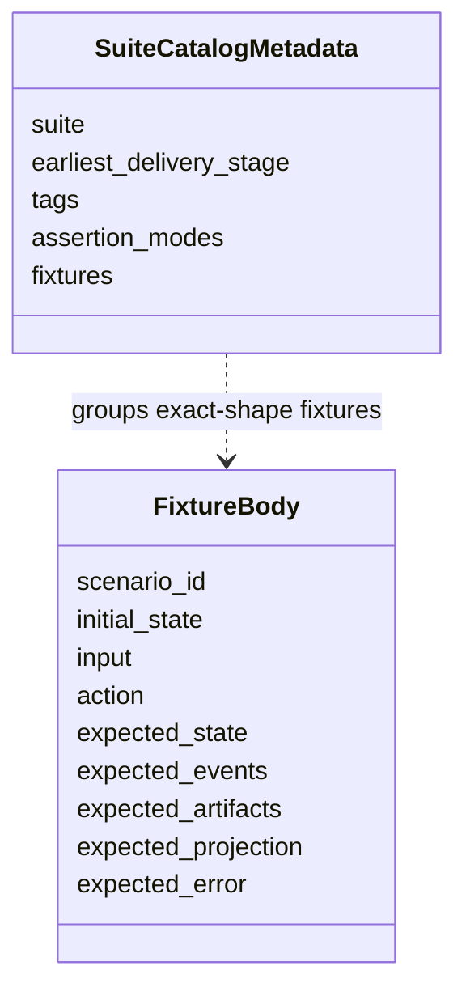
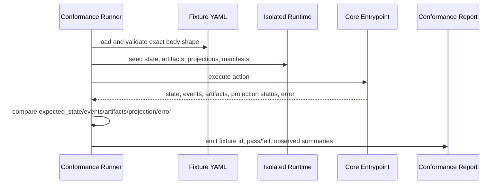

# Conformance Fixtures Reference

## What this document helps you do

Use this reference to look up the core conformance model for future Harness Server runtime tests: what conformance proves, the small v0.1 and v0.2 fixture sets, exact fixture body shape, runner execution behavior, fixture assertion semantics, current-phase status, and the boundary to the future fixture catalog.

This is a lookup document for conformance authors, implementers, and maintainers. It is not an operator procedure; use [Operations And Conformance Reference](operations-and-conformance.md) for operator entrypoints and the `harness conformance run` overview.

This is reference documentation for future conformance work. The current repository is documentation-only and contains no runnable Harness Server conformance tests; current phase and handoff status are tracked in [Implementation Overview](../build/implementation-overview.md#documentation-acceptance-status).

## Read this when

- You are writing or reviewing the future fixture-based conformance design.
- You need the exact fixture body fields, seed expansion limits, `ToolEnvelope` expansion convention, or runner isolation behavior.
- You need fixture assertion modes for state, events, artifacts, projections, errors, validators, close blockers, and redaction effects.
- You need the small v0.1 Core Authority Smoke fixture set, the v0.2 First User-Value Slice fixture set, the clarification-quality group, or the boundary between these sets and the future fixture catalog.

## Before you read

Use [Operations And Conformance Reference](operations-and-conformance.md#conformance-run) for the conformance run entrypoint, suite-selection overview, docs-maintenance profile boundary, and operator procedures. Use [MCP API And Schemas](mcp-api-and-schemas.md) for public request/response schemas, [Storage And DDL](storage-and-ddl.md) for storage layout and seed-loader owner values, [Kernel Reference](kernel.md) for state transition and stable event semantics, [Document Projection Reference](document-projection.md) for projection freshness, [Design Quality Policies](design-quality-policies.md) for policy validator behavior, and [Agent Integration Reference](agent-integration.md) for connector conformance overview.

## Main idea

Today this document is a future conformance design, not a set of runnable tests. It defines candidate fixture IDs and required behavior for later implementation planning; it does not create fixture files, runner code, generated outputs, runtime state, or a runnable Harness Server conformance suite. Do not create actual fixture files from these examples during the documentation-only phase.

Conformance has two conceptual layers: the core conformance model and small staged fixture sets in this file, and the [Future Fixture Catalog](future-fixture-catalog.md) for detailed later scenarios. The core model stays small enough to explain v0.1 Kernel Smoke and v0.2 user-facing value without making later catalog coverage look like an early implementation requirement.

After implementation begins, conformance will prove Harness behavior with executable fixtures. A passing runtime fixture will drive a Core or operator action and compare captured Core/API or operator results against structured expectations.

Assertion authority is layered:

- Prose scenario descriptions, comments, rendered Markdown, Journey Card prose, status text, close report prose, and agent summaries are explanatory only.
- Captured Core state, `task_events`, validator results, returned primary errors, and structured tool-specific blocker fields are authoritative for fixture pass/fail.
- Artifact reference, owner-link, hash, size, content-type, redaction, and file-integrity assertions are authoritative where the scenario depends on artifacts or evidence bytes.
- Projection output may be checked for freshness, source-state-version display, readability, and availability when projection support is in scope, but renderer output must not replace Core state, satisfy evidence, authorize writes, close work, accept results, accept risk, or become the source of conformance truth. v0.1 Core Authority Smoke does not require projection assertions beyond an empty or "no projection requirement" field.

## Reference scope

This document owns:

- conformance fixture body shape
- fixture seed shorthand limits and owner-record expansion expectations
- `ToolEnvelope` expansion convention for examples
- isolated fixture execution behavior
- fixture assertion semantics and comparison modes
- suite catalog metadata boundaries
- fixture profiles by behavior proved, the reduced v0.1/v0.2 fixture sets, and the reduced Kernel Smoke authoring queue
- current-phase status and the boundary between runtime conformance and docs-maintenance checks
- links to the future-oriented catalog without making its scenarios v0.1 or v0.2 requirements

## Not covered here

This reference does not own operator command procedures, docs-maintenance reporting, public MCP schemas, SQLite DDL, projection template bodies, policy contracts, or the detailed future scenario catalog. Those remain with their owning Reference documents. Suite metadata, examples, and catalog rows here do not add fixture-body fields, public request fields, storage rows, projection kinds, or runtime implementation readiness.

## Conformance Navigation Map

| If you are looking for... | Go to |
|---|---|
| The exact fixture body fields | [Conformance Fixture Format](#conformance-fixture-format) |
| How a runner loads, seeds, executes, captures, and compares | [Conformance Execution](#conformance-execution) |
| Default comparison modes for `expected_state`, `expected_events`, `expected_artifacts`, `expected_projection`, and `expected_error` | [Fixture Assertion Semantics](#fixture-assertion-semantics) |
| Small stage fixture sets | [v0.1 Core Authority Smoke Fixture Set](#v01-core-authority-smoke-fixture-set), [v0.2 First User-Value Slice Fixture Set](#v02-first-user-value-slice-fixture-set), and [Clarification Quality Fixture Group](#clarification-quality-fixture-group) |
| Suite intent and authoring order | [Conformance staging](operations-and-conformance.md#conformance-staging), [Kernel Smoke Authoring Queue](#kernel-smoke-authoring-queue), and [Future Fixture Catalog: Fixture Suites](future-fixture-catalog.md#fixture-suites) |
| Core model and current-phase boundary | [Core Conformance Model](#core-conformance-model) and [Fixture Current-Phase Status](#fixture-current-phase-status) |
| Future fixture examples by concern | [Future Fixture Catalog](future-fixture-catalog.md) |

## Core Conformance Model

The core conformance model defines what future runtime conformance proves and where assertion authority lives. A passing fixture proves behavior by driving one Core or operator action and comparing captured structured results with fixture expectations. It does not prove behavior by matching prose, generated Markdown, Journey Card text, status prose, close prose, or agent summaries.

Assertion types remain deliberately small:

- State assertions compare Core-owned records, `task_events`, validator results, returned primary errors, structured blockers, owner refs, and state-version behavior.
- Artifact assertions compare registered artifact identity, owner links, hash, size, content type, redaction state, availability, and file-integrity facts where the scenario depends on evidence bytes.
- Projection assertions compare freshness, enqueue or job status, source-state-version display, readability, and availability only when projection support is in scope. They never replace Core state or satisfy authority, evidence, close, acceptance, or risk judgments.
- Error assertions compare the API-owned primary `ErrorCode` and optional details according to public schema precedence.

State assertions answer "what did Core own after the action?" Artifact assertions answer "what evidence bytes or metadata were safely registered and linked?" Projection assertions answer "is a derived readable view current, stale, available, failed, or queued?" These are separate assertion locations, and projection output must not substitute for state or artifact proof.

## Fixture Profiles By Proven Behavior

Fixture profiles are grouped by the behavior they prove, not by how polished the rendered output is. The profile name does not add fixture-body fields, does not require a renderer to be authoritative, and does not imply fixture files exist in this documentation-only repository.

The hardened local reference target is an umbrella target reached through v0.3 Agency Assurance Pack and v0.4 Operations & Handoff Pack. It is not a fifth fixture profile and must not be used as a suite name.

| Profile | Stage name | Behavior proved | Out of scope for that profile |
|---|---|---|---|
| Core Authority Smoke fixtures, with Kernel Smoke as the authoring label | v0.1 Core Authority Smoke | Minimal authority loop only: project/Task/scope setup, in-scope `prepare_write` allow, out-of-scope write block from Harness authority state, durable single-use Write Authorization, compatible `record_run` consumption/linking, missing artifact/evidence blocker/status, and non-mutating status read. | First User-Value Slice value, profile-specific Decision Packet quality, full Evidence Manifest, projection renderer support, multiple projection kinds, residual-risk acceptance semantics, work acceptance semantics, Manual QA, detached verification, export/recover, release handoff, full conformance suite, future fixture catalog, higher guard guarantees, and broad operations. |
| First User-Value Slice fixtures | v0.2 First User-Value Slice | Ordinary requests become tracked work without Harness vocabulary; clarification quality, judgment separation, evidence blockers, residual-risk visibility, honest authority/fallback behavior, and derived-summary non-authority are visible through Core-owned state and structured responses. | Full agency assurance hardening, detached verification independence, full Manual QA matrix, stewardship policy suite, TDD/module/interface catalogs, export/recover, release handoff, and automation beyond the v0.2 user-value path. |
| Agency Assurance Pack fixtures | v0.3 Agency Assurance Pack | User-owned judgment, Approval, Write Authorization, Manual QA, verification, work acceptance, residual-risk acceptance, stewardship, design-quality, context-hygiene, TDD, and feedback-loop boundaries stay separate and fixture-proven through Core records. | Operator recovery/export completeness, release handoff, broad operations coverage, dashboard/hosted workflow UI, broad connector automation, and unproven preventive or isolated guarantee claims. |
| Operations & Handoff Pack / promoted-expansion fixtures | v0.4 Operations & Handoff Pack and v1+ Expansion | Export/recover, artifact integrity, release handoff, operator readiness, reconcile, broader conformance coverage, and any promoted future higher guarantee level or automation profile. | Any stronger security, isolation, preventive guard, browser-capture, remote/shared MCP, or automation claim until owner docs define the mechanism and fixtures prove the covered behavior. |

## Small Staged Fixture Sets

The fixture sets below are documentation/specification targets for future executable fixtures. They are intentionally short and testable so early conformance stays focused on Harness differentiation: local authority state, user-owned judgment routing, evidence and risk visibility, and honest guarantee wording. They are not fixture files today, and they do not require the broad future catalog to pass v0.1 or v0.2.

### v0.1 Core Authority Smoke Fixture Set

v0.1 fixtures prove only the first local authority loop. Each candidate must assert Core-owned state, events when stable owner events exist, artifact refs where relevant, and structured errors or blockers. Projection assertions default to no requirement.

| Fixture ID | Primary action | Required behavior assertion |
|---|---|---|
| `CORE-v01-project-task-scope-setup` | owner setup path, `harness.intake`, or validated seed path | One local project, one active Task, and one scoped work boundary exist in Core-owned state; setup alone creates no Write Authorization and no product-write Run. |
| `CORE-v01-prepare-write-in-scope-allowed` | `harness.prepare_write` | A compatible in-scope product-write request returns no primary error and creates one durable Write Authorization tied to the Task, scope/Change Unit, intended operation, and basis state version. |
| `CORE-v01-prepare-write-out-of-scope-blocked` | `harness.prepare_write` | An out-of-scope intended write is refused by Harness authority state with a structured blocker or `SCOPE_VIOLATION`-equivalent primary error; no Write Authorization, Run, artifact, projection job, or state-authorizing side effect is created. |
| `CORE-v01-write-authorization-single-use` | `harness.record_run` | The first compatible product-write Run may consume an unconsumed authorization; a second distinct Run using the same authorization is blocked with `WRITE_AUTHORIZATION_CONSUMED`, `WRITE_AUTHORIZATION_INVALID`, or owner-equivalent error, and no second consumption is recorded. |
| `CORE-v01-record-run-consumes-and-links-authorization` | `harness.record_run` | A compatible Run records observed work, links `consumed_by_run_id` or the owner-equivalent relation to the Write Authorization, and preserves the authorization basis instead of treating chat/tool output as authority. |
| `CORE-v01-missing-artifact-evidence-ref-blocker` | `harness.status`, narrow `harness.close_task` smoke, or owner blocker read | Missing required artifact/evidence support is reported as structured status/blocker state such as `ARTIFACT_MISSING` or `EVIDENCE_INSUFFICIENT`; rendered prose or Markdown cannot satisfy the missing ref. |
| `CORE-v01-status-read-no-mutation` | `harness.status` or `harness.next` read | Status returns current Task, scope, write-authority summary, evidence/artifact support, blockers, and state version without appending events, creating artifacts, enqueueing projections, authorizing writes, satisfying evidence, or closing work. |

### v0.2 First User-Value Slice Fixture Set

v0.2 fixtures prove user-visible Harness value without growing into the broad assurance or operations catalog. These candidates may use `harness.intake`, `harness.status`, `harness.next`, `harness.request_user_judgment`, `harness.record_user_judgment`, `harness.prepare_write`, `harness.record_run`, and `harness.close_task` where those methods are active for the stage.

| Fixture ID | Required behavior assertion |
|---|---|
| `MVP-v02-natural-language-starts-tracked-work` | Ordinary user language starts or resumes tracked work without requiring "Harness," `Task`, `Change Unit`, `Decision Packet`, or another startup phrase; the request alone does not authorize product writes. |
| `MVP-v02-codebase-answerable-facts-checked-before-question` | Current seeded repo/codebase refs, Harness state refs, or connector/session facts are used before asking the user to repeat facts that are already answerable; unresolved user-owned judgments still route to focused questions. |
| `MVP-v02-product-ux-and-architecture-judgments-separated` | Product/UX judgment and material technical architecture judgment are represented as separate user-owned routes or candidates, distinct from sensitive-action Approval, work acceptance, and residual-risk acceptance. |
| `MVP-v02-small-typo-direct-change-stays-light` | A small typo or direct change keeps a light procedural budget while still preserving scope, write authority where product writes apply, evidence/self-check support, and any relevant user-owned judgment. |
| `MVP-v02-ambiguous-feature-enters-clarification` | An ambiguous feature request enters clarification or Decision Packet routing instead of premature implementation or broad approval. |
| `MVP-v02-missing-user-judgment-blocks-write-or-close` | When a relevant product, UX, architecture, work-acceptance, or risk judgment is missing, affected write or close is blocked through structured Core/API results. |
| `MVP-v02-missing-evidence-blocks-close-when-required` | When the active profile requires evidence, missing evidence or artifact refs block close with structured status/blockers rather than report prose. |
| `MVP-v02-residual-risk-visible-before-acceptance-risk-close` | Known close-relevant residual risk is visible before successful work acceptance or risk-accepted close; hidden or stale risk blocks the relevant route. |
| `MVP-v02-ambiguous-go-ahead-does-not-resolve-route` | Ambiguous consent phrases such as "go ahead," "looks good," "좋아," or "진행해" do not resolve ambiguous user-judgment routes, waive evidence, accept residual risk, or authorize out-of-scope work. |
| `MVP-v02-mcp-core-unavailable-does-not-fabricate-authority` | If MCP/Core is unavailable, the surface reports inability to read or mutate authority state and does not fabricate Task state, Write Authorization, evidence, close readiness, approval, or acceptance. |
| `MVP-v02-projection-template-output-not-state` | Projection, template, status-card, or Markdown output remains derived; reading or editing it cannot create state, satisfy gates, authorize writes, attach evidence, accept work/risk, or close a Task. |
| `MVP-v02-detached-verification-not-claimed-unless-recorded` | Detached verification is not claimed unless the active profile requires it and a compatible recorded Eval or owner verification path exists; same-session review or prose alone does not upgrade assurance. |

### Clarification Quality Fixture Group

Clarification-quality fixtures belong to the First User-Value Slice path when they prove that Harness asks for user judgment without substituting for it. Deeper policy-specific Decision Packet coverage remains v0.3 unless a v0.2 path needs a minimal blocker.

| Fixture ID | Required behavior assertion |
|---|---|
| `CLARIFY-codebase-answerable-question-not-asked` | The system does not ask the user for facts already available in current seeded repo/codebase refs, Harness state refs, or connector/session facts. |
| `CLARIFY-unclear-requirements-not-one-superficial-question` | When requirements remain materially unclear, the system does not stop after one superficial question or proceed as if scope is settled. |
| `CLARIFY-no-long-questionnaire-dump` | Clarification does not dump a long questionnaire; it asks the smallest useful set for the next safe action. |
| `CLARIFY-blocking-vs-useful-questions-separated` | Blocking questions are separated from useful-but-not-blocking questions so the user can tell what prevents write or close. |
| `CLARIFY-user-owned-judgment-choices-and-consequences` | User-owned judgments present choices, consequences, and any recommended route without broad approval language substituting for the judgment. |
| `CLARIFY-product-and-technical-decisions-separated` | Product/UX decisions and material technical architecture decisions are separated when they ask the user to own different kinds of judgment. |

## Conformance Fixture Format

Future runtime conformance is fixture-based. A scenario table is not enough; each materialized test fixture must drive an action and assert state, events, artifacts, projection status when relevant, and errors.

Each fixture must include this shape:

```yaml
scenario_id: string
initial_state: object
input: object
action: string
expected_state: object
expected_events: object[]
expected_artifacts: object[]
expected_projection: object
expected_error: object | null
```

Fixture shape summary: suite metadata can group fixtures, but the fixture body keeps one exact action-and-expectation shape for future executable conformance.



Future fixture files and suite catalogs may carry metadata outside the fixture body. The fixture body itself uses only the fields above so conformance runners can compare behavior consistently. Do not add fixture-body fields for suite delivery stage, assertion mode, docs-maintenance result, prose status, or authoring notes; those belong in suite catalog metadata, docs-maintenance reports, or surrounding documentation.

Fixture body type notation follows the API [Schema notation convention](mcp-api-and-schemas.md#schema-notation-convention). All top-level fixture body fields above are required. Use `{}` or `[]` when the fixture intentionally supplies an empty object, object map, or array; omitting a required top-level field is an invalid fixture body, not "not asserted." For v0.1 Core Authority Smoke checks, `expected_projection` may be `{}` or an explicit no-requirement assertion because projection rendering is not a v0.1 exit criterion.

For an MCP tool action, future executable fixture `input` is the tool's public request payload as defined by the API docs. The runner must validate `input` against the request schema for `action`, including `envelope: ToolEnvelope` when that schema requires it. Examples in this document may omit `ToolEnvelope` only under this envelope-expansion convention: before validation, canonicalization, request hashing, or Core execution, the runner supplies a deterministic valid envelope from `initial_state`, suite defaults, and fixture metadata. The expanded request is what Core receives. This convention does not add fixture fields, change the fixture body shape, or create an alternate request schema.

Fixture shorthand is intentionally narrow. It is allowed for `initial_state` seeding, suite catalog metadata, and documented seed-loader expansion of compact examples such as `owner_records`, `stewardship_findings`, or feedback-loop shorthand. Future executable fixture files must map that shorthand to owner records, validator runs, residual risks, or other records owned by DDL/API docs. The shorthand must not create a second API or state model. Public mutation must not be encoded as scenario-only shorthand inside `input`; fixtures must use the public request branch for `record_run`, `record_eval`, `record_manual_qa`, `record_user_judgment`, or else seed owner records in `initial_state` when the scenario is about preexisting state. `close_task` fixture `input` is only `CloseTaskRequest` after any documented envelope expansion; evidence profiles, changed paths, artifact refs, acceptance-criteria support, self-check summaries, and Manual QA records must be seeded in `initial_state` or recorded by a preceding public mutation fixture. `StewardshipImpactSummary` assertions are derived display, not canonical current records, and should appear under `expected_state.derived` or projection assertions. `owner_records.feedback_loops` seeds canonical `feedback_loops` rows. Bare `FBL-*` values in example fields such as `feedback_loop_refs` map to `StateRecordRef { record_kind: feedback_loop, record_id: ... }` in future executable fixtures. Fixture bodies that exercise public mutation instead of seeded state must express definition changes as `FeedbackLoopUpdate` under `record_run.payload.shaping_update.feedback_loop_updates`, execution/status changes under `evidence_updates.feedback_loop_updates`, or Manual QA execution through `record_manual_qa.feedback_loop_ref`. When an example shows only `feedback_loop_id` and `status`, the fixture runner must derive or supply the remaining required `feedback_loops` storage fields from the surrounding Task, Change Unit, selected-loop, and evidence shorthand before inserting or building the corresponding `FeedbackLoopUpdate`. Accepted residual risk in fixture shorthand is state on seeded `residual_risk` records, not a standalone accepted-risk record. When fixture examples use bare `RISK-*` values in risk-ref arrays such as `visible_refs`, `accepted_refs`, `not_visible_refs`, `unaccepted_refs`, or `residual_risk_refs`, future executable fixtures must map them to `StateRecordRef { record_kind: residual_risk, record_id: ... }`. These bare IDs are fixture shorthand only, not DDL/API fields. Future executable staged-delivery fixtures must not require standalone `ARISK-*` records.

Future executable fixtures that seed `write_authorizations` must produce valid stored rows. Each seeded authorization row must include `basis_state_version` explicitly, or the runner must derive it from the seeded affected-scope state version for the row's Task before inserting into `state.sqlite`. This is a storage-loader derivation rule only; it does not add fixture top-level fields or change the fixture body shape. Partial `expected_state.write_authorization` assertions may omit `basis_state_version` unless the fixture is testing idempotent replay, stale detection, expiry, or audit behavior. `basis_state_version` is the allow-decision basis, not the resulting `ToolResponseBase.state_version`.

Suite catalog metadata is not passed to Core and is not part of a fixture body. It can group exact-shape fixtures by suite, delivery stage, and tags:

```yaml
suite: agency
earliest_delivery_stage: "v0.3 Agency Assurance Pack"
tags: [decision-gate, residual-risk, autonomy-boundary]
fixtures:
  - AGENCY-decision-packet-required-before-product-tradeoff-write
  - AGENCY-residual-risk-visible-before-acceptance
```

Runners may use this metadata to choose, order, or report suites. Core receives only the action and public `input` after any documented envelope expansion; metadata must not change seed expansion, fixture comparison semantics, tool request schemas, or expected owner records.

## Conformance Execution

Future `harness conformance run` will execute fixtures through the same Core entrypoints used by MCP tools and operator commands. It must not assert behavior by inspecting prose output alone.

Future runtime fixture execution semantics:

1. Load fixture YAML files and validate the exact fixture body shape.
2. Create a fresh isolated runtime home and temporary Product Repository for the fixture, unless the fixture explicitly targets an existing read-only sample. The runner must not reuse the developer's real Harness Runtime Home or Product Repository for state-changing fixture execution.
3. Seed `registry.sqlite`, `project.yaml`, `state.sqlite`, artifact files, projection files when the fixture requires them, and connector manifests from `initial_state`.
4. Execute `action` through Core. MCP tool actions use the public request schema; after any documented `ToolEnvelope` expansion, fixture `input` must be the same request payload a surface would send to that MCP tool. Operator actions such as `projection_refresh`, `doctor_surface`, `recover`, and `artifacts_check` use the operator semantics in [Operations And Conformance Reference](operations-and-conformance.md).
5. Capture resulting state summaries, appended owner events, validator results when emitted, artifact registry/file integrity, projection job status when relevant, reconcile items when relevant, and returned error code.
6. Compare the captured results with `expected_state`, `expected_events`, `expected_artifacts`, `expected_projection`, and `expected_error`; empty expected sections mean the fixture asserts no relevant effect for that section.
7. Report fixture id, pass/fail, observed state summary, observed events, artifact integrity result, projection freshness, and error comparison.

Runner sequence summary: a future runner loads an exact fixture body, seeds an isolated runtime, executes through Core, compares state/events/artifacts/projection/errors, and emits a report.



When a fixture action includes `expected_state_version`, the runner compares it according to the Core-resolved primary Task, not only `ToolEnvelope.task_id`. Task-scoped actions compare against the seeded or Core-resolved primary Task State Version; project-scoped actions with no resolved primary Task compare against the Project State Version. Captured response and `task_events` `state_version` values are compared as resulting affected-scope versions. Read-only fixtures may assert the unchanged version for the primary read scope. This clarifies comparison semantics without changing fixture body shape.

A stale `expected_state_version` fixture is a stale-authority test, not only a concurrent-write test. Exact idempotent replay is the exception: when a committed replay row exists and the canonical request hash matches, the fixture should assert the original committed response is returned and no current state-version freshness check is re-run. When no replay row exists and a state-changing action conflicts before commit, the fixture should assert that no current records changed, no `task_events` were appended, no artifacts were registered, no projection jobs were enqueued, and no `tool_invocations` replay row was created for the conflicting request unless an owner document explicitly defines a different recovery action. When the same key is reused with a changed canonical request hash, the fixture should assert `STATE_CONFLICT`, preserved original replay row, and no merged artifacts, events, projection jobs, response fields, or owner relations.

Fixture execution should be deterministic. Network access, wall-clock-sensitive expiry, and external tool output must be stubbed or represented as seeded fixture inputs unless a suite explicitly declares itself an integration smoke.

Isolation is part of the pass condition. A fixture may seed files into its temporary Product Repository and runtime home, execute one Core or operator action there, and compare the captured result. It must not depend on existing local runtime records, generated operational files, or prose reports from a previous run.

Seed validation happens before action execution, and captured-state validation happens after action execution. Both sides of the comparison use owner-defined state loaders and value sets rather than fixture-local string labels.

Conformance runners must seed and inspect JSON `TEXT` fields through the same Core storage loaders used by MCP tools and operator commands. A fixture with malformed JSON or schema-incompatible JSON in `initial_state` must surface invalid state, or a repairable state issue when the fixture action is a recovery path and safe reconstruction is possible. The runner must not skip shape validation by treating JSON fields as opaque strings, and this expectation does not change the fixture body shape.

Conformance runners must also seed and inspect status-like `TEXT` fields through the owner-bound hardening map in [Storage And DDL](storage-and-ddl.md#canonical-enum-hardening). Fixture seed loaders must validate both compact shorthand and expanded rows for fields with promoted owner values, including `project_surfaces.guarantee_level` when seeding registry/project surface state, `runs.kind`, `runs.status`, `write_authorizations.status`, `write_authorizations.guarantee_level`, `approvals.status`, `evidence_manifests.status`, `residual_risks.visibility_status`, `feedback_loops.loop_kind`, `feedback_loops.status`, `tdd_traces.status`, `validator_runs.status`, `validator_runs.guarantee_level`, `projection_jobs.projection_kind`, `projection_jobs.status`, `connector_manifests.status`, `baselines.status`, `change_units.status`, `tool_invocations.status`, `decision_requests.status`, `residual_risks.status`, `task_spine_entries.status`, `change_unit_dependencies.status`, `shared_designs.status`, `reconcile_items.status`, `domain_terms.status`, `module_map_items.status`, and `interface_contracts.review_status`. For `decision_requests.status`, validation applies only when the optional `decision_requests` table is retained or a fixture seeds `decision_requests` rows; minimal v0.1 Core Authority Smoke implementations may still omit the table. These promoted values are still owner-bound storage values, not scenario prose labels; for example, `runs.status: completed`, `runs.status: interrupted`, and `runs.status: violation` are valid only with the Storage And DDL compatibility meanings for committed Runs, while `shared_designs.status: active` is a current design basis and not work acceptance or approval. Executable fixtures must not seed unknown status values unless the scenario explicitly tests recovery from invalid state; expected-state status assertions compare captured owner values, not prose labels.

## Fixture Assertion Semantics

Fixture assertion modes are runner defaults or suite catalog metadata. They are not Core input, are not passed to MCP tools, and must not add fields to the fixture body. The fixture body remains exactly `scenario_id`, `initial_state`, `input`, `action`, `expected_state`, `expected_events`, `expected_artifacts`, `expected_projection`, and `expected_error`.

Within partial assertion objects, omission means "not asserted." A listed field with value `null` asserts that the captured field is present and equals JSON `null`. A listed array value `[]` asserts a present empty array. A listed object-map value `{}` asserts a present empty map when the owner schema says that field is a map. For structured objects under `partial_deep`, fixture authors should list at least one child field unless they are deliberately asserting only that the object exists.

These omission rules are assertion rules only. They do not make omitted fields valid in public MCP `input`; fixture `input` still validates against the owning public request schema after any documented envelope expansion.

Default comparison modes:

| Fixture field | Default assertion mode |
|---|---|
| `expected_state` | `partial_deep`; listed fields must match recursively and unlisted fields are not asserted. Suite metadata may set `expected_state: exact`. |
| `expected_events` | `contains_ordered` over the stable-catalog projection of captured `task_events`; listed stable events must appear in ascending `task_events.event_seq` order, with unrelated stable events allowed before, between, or after them. Suite metadata may set `expected_events: exact`. |
| `expected_artifacts` | `contains_by_identity`; each listed artifact must match a registered artifact with the same `artifact_id` and `kind`, then any other listed artifact fields are matched recursively. |
| `expected_projection` | `partial_by_kind`; each listed projection kind must satisfy the listed status assertion or partial object assertion for that kind. |
| `expected_error` | `expected_error: null` asserts that the action returned no error. When `expected_error` is an object, `expected_error.code` is required and matched exactly against the primary API `ErrorCode` in `ToolError.code`, meaning `ToolResponseBase.errors[0].code` when the response has errors, selected by API-owned [Primary Error Code Precedence](mcp-api-and-schemas.md#primary-error-code-precedence). It must not match an arbitrary secondary error, validator finding code, policy finding code, or local diagnostic label. `expected_error.details` is optional; when omitted, no details fields are asserted. When `details` is present, it is matched with `partial_deep` unless suite metadata sets `expected_error.details: exact`. |

Because `expected_events` defaults to `contains_ordered`, `expected_events: []` means the fixture requires no specific stable events; it does not by itself assert that the captured stable-event stream is empty. To assert no stable events, suite metadata must set `expected_events: exact` for that fixture or suite. Similarly, `expected_artifacts: []` and `expected_projection: {}` assert no required artifact or projection entries under their default modes; they do not ban captured artifacts or projection observations unless compatible exact-mode metadata says so.

`expected_events` comparisons are over the [Kernel Stable Event Catalog](kernel.md#stable-event-catalog) projection of captured `task_events`. API tool detail/audit event lists do not expand this set. Non-catalog detail or local-audit events captured in `task_events` must not make a normal staged-delivery fixture fail. When suite metadata sets `expected_events: exact`, exactness applies to the stable-event projection of the captured stream unless a future v1+/local suite explicitly opts into implementation-specific detail-event assertions. Validator IDs, Core check names, projection status shorthands, fixture seed shorthand, and scenario catalog IDs are not event names. Prose examples may mention non-catalog event names as illustrative or future extension ideas, but executable staged-delivery fixtures must not require them until the kernel catalog promotes them.

Conformance runners order captured `task_events` by `event_seq`. `state_version`, `created_at`, and `event_id` are not tie-breakers for `expected_events` ordering.

Fixture authors should use `VALIDATOR_FAILED` as `expected_error.code` only when API precedence selects the generic validator fallback; a more specific typed blocker such as `EVIDENCE_INSUFFICIENT`, `QA_REQUIRED`, `PROJECTION_STALE`, or `ARTIFACT_MISSING` remains primary when it applies.

`CloseTaskResponse.blockers[].code` is also an API `ErrorCode` value. Policy-specific or validator-specific finding codes belong under `expected_state.validators`, validator finding assertions, or equivalent expected validator output, not in `expected_error.code` or close blocker `code`. Fixtures that exercise blocked close must assert the structured blockers returned by Core, such as `CloseTaskResponse.blockers` or the captured equivalent under `expected_state.close_blockers`; matching report prose, Journey Card text, status text, or agent summaries alone cannot prove a close blocker.

Validator assertions nested under `expected_state.validators` are keyed by validator ID. Each listed validator ID must exist in the captured validator results and match the listed fields partially; unlisted validator IDs and unlisted validator fields are not asserted.

When fixtures assert design-quality severity, all relevant validator findings should remain visible under `expected_state.validators`, while fixtures assert the merged gate, write-blocker, close-blocker, waiver, or Decision Packet outcome produced by the policy-owned [Severity Composition Rule](design-quality-policies.md#severity-composition-rule). Fixtures must not add policy schemas or suppress lower-severity findings merely because a stronger merged blocker is also present.

Core check and precondition assertions nested under `expected_state.checks` are keyed by check/precondition name. These entries are compared against captured Core check output, blocked reasons, response summaries, or equivalent runner-observed check status. They are not validator IDs and must not be nested under `expected_state.validators` unless the MCP API or Storage And DDL explicitly promotes that ID to a stable ValidatorResult.

`expected_state.checks.projection_freshness` asserts the Core mechanical projection freshness check. `expected_state.validators.context_hygiene_check` asserts the stable ValidatorResult for higher-level context hygiene; that validator may consider projection freshness, but it is not the fixture assertion location for the mechanical check itself.

Fixtures that cover `secret_omitted` or `blocked` artifacts should assert the committed artifact `redaction_state` under `expected_artifacts` and the downstream state or display effect under the owning assertion location: evidence or QA state under `expected_state`, verification outcome under Eval-related state or error assertions, projection freshness/display availability under `expected_projection` or `expected_state.checks.projection_freshness`, and export or Release Handoff behavior through the existing fixture assertions captured from the operator action. Fixtures must not assert the omitted secret or PII value.

Detailed artifact redaction, blocked-input, integrity, and export non-leakage scenario rows are future catalog entries. See [Future Fixture Catalog: Artifact Redaction And Export Non-Leakage Catalog Entries](future-fixture-catalog.md#artifact-redaction-and-export-non-leakage-catalog-entries).

Allowed `expected_projection` status assertions:

| Assertion | Meaning |
|---|---|
| `enqueued` | A refresh job or equivalent projection outbox entry for the projection kind is pending after the action. |
| `current` | The projection kind is current for the committed state version and managed hash. |
| `stale` | The projection kind is stale because state, evidence, or managed content moved ahead of the rendered projection. |
| `failed` | The latest applicable projection refresh for the kind failed. |
| `skipped` | The latest applicable projection job for the kind was skipped, for example because it was superseded or blocked by managed-block drift. |
| `stale_or_enqueued` | Either `stale` or `enqueued` is acceptable. Use this when the scenario proves projection invalidation or enqueueing and the runner may observe either side of the refresh boundary. |
| `stale_or_failed` | Either `stale` or `failed` is acceptable. Use this when a render failure may be surfaced as failed freshness or as stale freshness with a failed job. |

Projection shorthand such as `TASK: stale_or_enqueued` is a scalar status assertion for the `TASK` projection kind. Object form may assert additional captured projection fields while still using `partial_by_kind`, for example `TASK: {status: current}`. These assertion operators are fixture-comparison semantics, not new projection DDL or API enum values unless the owning schema documents define them.

Projection assertions compare projection freshness, enqueue status, source-state-version display, and related job facts. They do not compare rendered Markdown as canonical state, and they do not let a failed render roll back or rewrite the captured Core state and events.

Suite catalogs may override assertion modes without changing fixtures:

```yaml
suite: core
assertion_modes:
  expected_state: exact
  expected_events: exact
  expected_error.details: exact
fixtures:
  - CORE-active-status-no-task
```

Future conformance must prove behavior through captured Core state, `task_events`, validator results, artifact registry/file integrity, projection job or freshness state, returned error codes, and structured tool-specific blocker fields when applicable. Matching rendered Markdown, Journey Card prose, status prose, close report prose, or agent prose alone cannot pass a fixture.

Fixture runners must use the same canonicalization rules as the reference implementation for `request_hash`, baseline `tree_hash`, and projection `managed_hash`. The detailed algorithms remain owned by the MCP API, Storage And DDL, and Document Projection docs; conformance fixtures assert deterministic behavior without redefining those source-of-truth boundaries.

## Fixture Current-Phase Status

This repository is documentation-only. No executable fixture files, executable fixture catalog files, generated projections, runtime state, databases, or Harness Server conformance tests are being created by this documentation batch.

Fixture examples and queues are future authoring plans. They become runnable only after documentation acceptance, a separate implementation-planning readiness decision, Harness Server implementation, and a deliberate fixture-materialization step. Documentation maintenance checks may report Markdown drift, but they are not runtime conformance and do not create Core fixture results.

## Catalog-Only Fixture Skeleton Guidance

Catalog skeleton guidance is for turning promoted future catalog families into exact-shape fixtures. It is not an executable fixture body, public request schema, DDL extension, runner design, or stage-exit requirement. Delivery-stage mapping belongs in suite catalog metadata, not in the fixture body. "Minimum seeded records" means owner records placed in `initial_state` after expansion and validation by Storage And DDL rules; public mutations still use the exact MCP request payload under `input`.

Detailed future catalog scenarios live in [Future Fixture Catalog](future-fixture-catalog.md).

## Kernel Smoke Authoring Queue

Use this queue as future authoring guidance for the [v0.1 Core Authority Smoke Fixture Set](#v01-core-authority-smoke-fixture-set). Kernel Smoke is the narrow authoring label for the first internal authority loop, not the first user-value slice, not a full conformance suite, and not the future fixture catalog. These rows do not imply executable fixture files already exist. They are a compact authoring order; a first implementation plan may materialize only the smallest subset that proves the one authority loop named by Build.

Kernel Smoke defaults to no projection requirement. A fixture may assert projection freshness or enqueue/failure facts only when the minimal owner path already produces those facts and they help prove the target behavior. Projection-template polish, detailed report templates, multiple projection kinds, browser QA capture, export/recover, reconcile, stewardship, context hygiene, full operations, and future guarantee-level fixtures stay outside v0.1 unless owner docs later promote a specific narrow path.

In the table, `None` means the existing fixture field stays empty or `expected_error: null`; it is not a new sentinel value.

| Queue | Fixture candidate | Intended Core or operator action | Minimum seeded records | Main expected state assertion | Expected stable event assertion | Expected artifact assertion | Expected projection assertion | Expected primary error |
|---|---|---|---|---|---|---|---|---|
| 1 | `CORE-v01-project-task-scope-setup` | Owner setup path, `harness.intake`, or validated seed path | Registered local project, or empty isolated runtime home if the setup action registers it | One local project, one active Task, and one scoped work boundary exist; setup alone creates no Write Authorization or product-write Run | Owner-promoted setup events only | None | No projection requirement | None |
| 2 | `CORE-v01-prepare-write-in-scope-allowed` | `harness.prepare_write` | Active Task, compatible scope, compatible baseline if required, compatible surface guarantee, no unresolved required judgment | One durable Write Authorization is created for the compatible Task, scope/Change Unit, intended operation, `basis_state_version`, status, and `consumed_by_run_id=null` | `prepare_write_allowed`, `write_authorization_created` only when stable events are promoted | None | No projection requirement; `TASK` stale/enqueued is allowed only if the owner path already invalidates projections | None |
| 3 | `CORE-v01-prepare-write-out-of-scope-blocked` | `harness.prepare_write` | Active Task with scoped boundary that excludes the requested path/tool/operation | Out-of-scope intended write is blocked by Harness authority state; no Write Authorization, Run, artifact, or state-authorizing side effect is created | No stable event for pre-commit rejection unless owner catalog promotes one | None | No projection job for pre-commit rejection | `SCOPE_VIOLATION` or owner-equivalent structured blocker/error |
| 4 | `CORE-v01-write-authorization-single-use` | `harness.record_run` | Active Task, compatible scope, compatible Write Authorization already consumed by a prior Run | Reuse of a consumed authorization is blocked; the original consumed relation remains unchanged and no second Run is committed | No stable event for pre-commit reuse rejection unless owner catalog promotes one | None | No projection job for pre-commit rejection | `WRITE_AUTHORIZATION_CONSUMED`, `WRITE_AUTHORIZATION_INVALID`, or owner-equivalent error |
| 5 | `CORE-v01-record-run-consumes-and-links-authorization` | `harness.record_run` with `kind=direct` or `kind=implementation` | Active Task, compatible scope, compatible unconsumed Write Authorization, baseline if required | Run commits once, records observed work, and links consumption to the supplied Write Authorization | `run_recorded`, `write_authorization_consumed` only when promoted | None unless the Run also registers an artifact | No projection requirement; `TASK` stale/enqueued is allowed if state changes | None |
| 6 | `CORE-v01-missing-artifact-evidence-ref-blocker` | `harness.status`, narrow `harness.close_task` smoke, or owner blocker read | Active Task whose current path requires artifact/evidence support but has no compatible ref | Missing artifact/evidence support is visible as structured blocker/status; report prose, Markdown, or tool text does not satisfy the ref | `close_blocked` only when a close-task smoke is the owner path and stable event is promoted | None | No projection requirement | `ARTIFACT_MISSING`, `EVIDENCE_INSUFFICIENT`, or owner-equivalent blocker/error |
| 7 | `CORE-v01-status-read-no-mutation` | `harness.status` or `harness.next` read | Active Task with current scope, write-authority summary, and artifact/evidence summary | Read returns current state, blockers, and state version without appending events, creating artifacts, enqueueing projections, authorizing writes, satisfying evidence, or closing work | None | None | No projection enqueue from read-only status/blocker output | None |

The queue above is intentionally small. v0.1 does not require a full conformance suite, broad catalog family coverage, work acceptance semantics, Manual QA, detached verification, export/recover, reconcile, stewardship, context hygiene, browser QA capture, or future guarantee-level checks.

## Future Fixture Catalog

Detailed scenario families have moved to [Future Fixture Catalog](future-fixture-catalog.md) so the early reference stays focused on the core conformance model. That catalog contains future-oriented entries for browser QA capture, cross-surface behavior, export non-leakage, context hygiene, reconcile, stewardship, full operations, advanced projection rendering, artifact redaction and integrity, and future guarantee-level fixtures.

Those catalog entries are design inventory only until a promoted owner path materializes exact-shape executable fixtures. They are not required for v0.1, do not expand v0.2 by themselves, and do not count as runtime conformance while this repository remains documentation-only.

## Metrics Boundary

Long-term operational metrics are derived analytics, not staged-delivery-critical state or conformance requirements. Keep metrics such as approval turnaround, verification latency, projection stale duration, same-session guard frequency, and surface fallback rate in the [roadmap](../roadmap.md) as read-only diagnostics until a future version promotes them with owner docs, fixtures or a conformance target, fallback behavior, relevant redaction/retention policy, no projection-as-canonical dependency, and implementation ownership.
