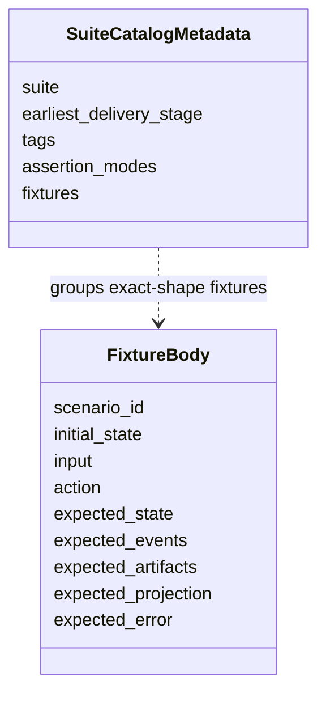
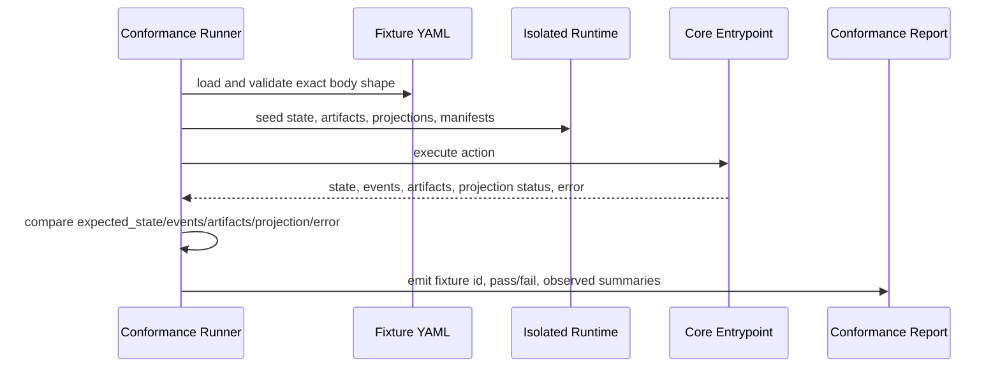
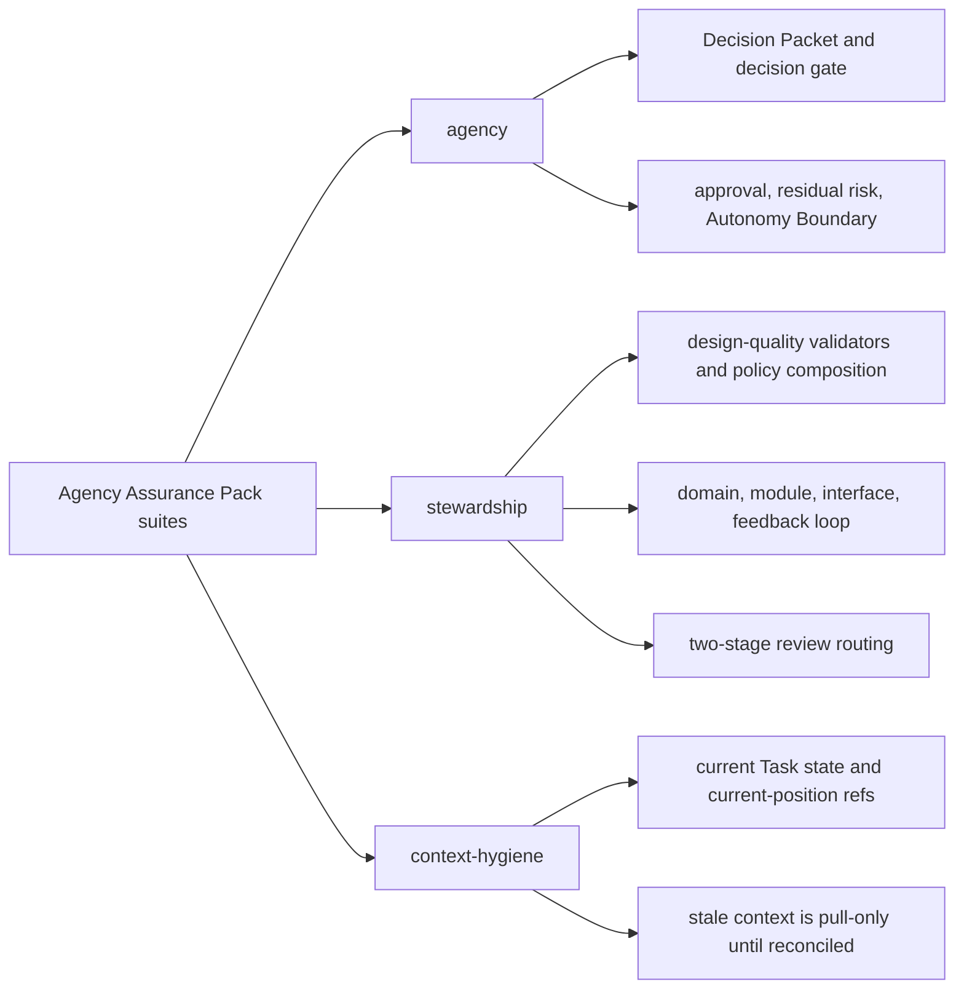

# Conformance Fixtures Reference

## What this document helps you do

Use this reference to look up the future conformance fixture design: exact fixture body shape, runner execution behavior, fixture assertion semantics, suite catalog metadata, Kernel Smoke authoring order, staged fixture coverage, examples, and catalog-only future candidates.

This is a lookup document for conformance authors, implementers, and maintainers. It is not an operator procedure; use [Operations And Conformance Reference](operations-and-conformance.md) for operator entrypoints and the `harness conformance run` overview.

This is reference documentation for future conformance work. It does not authorize runtime/server implementation, generated operational files, executable fixtures, fixture files, or runtime data before documentation acceptance and a separate implementation-planning readiness decision. The current repository is documentation-only and does not contain runnable Harness Server conformance tests. The first runnable target is v0.1 Core Authority Slice, with Kernel Smoke as its narrow conformance authoring profile. The first product MVP target is v0.2 User-Facing Harness MVP. v0.3 Agency Assurance Pack and v0.4 Operations & Handoff Pack harden agency assurance, operations, and handoff behavior, and v1+ Expansion remains roadmap scope unless owner docs promote and prove it.

## Read this when

- You are writing or reviewing the future fixture-based conformance design.
- You need the exact fixture body fields, seed expansion limits, `ToolEnvelope` expansion convention, or runner isolation behavior.
- You need fixture assertion modes for state, events, artifacts, projections, errors, validators, close blockers, and redaction effects.
- You need Core Authority Slice fixtures, User-Facing Harness MVP fixtures, Agency Assurance Pack fixtures, Operations & Handoff Pack or promoted-expansion fixtures, staged suite coverage, examples, or catalog-only future candidate guidance.

## Before you read

Use [Operations And Conformance Reference](operations-and-conformance.md#conformance-run) for the conformance run entrypoint, suite-selection overview, docs-maintenance profile boundary, and operator procedures. Use [MCP API And Schemas](mcp-api-and-schemas.md) for public request/response schemas, [Storage And DDL](storage-and-ddl.md) for storage layout and seed-loader owner values, [Kernel Reference](kernel.md) for state transition and stable event semantics, [Document Projection Reference](document-projection.md) for projection freshness, [Design Quality Policies](design-quality-policies.md) for policy validator behavior, and [Agent Integration Reference](agent-integration.md) for connector conformance overview.

## Main idea

Today this document is a future conformance design, not a set of runnable tests. Do not create actual fixture files from these examples during the documentation-only phase.

After implementation begins, conformance will prove Harness behavior with executable fixtures. A passing runtime fixture will drive a Core or operator action and compare captured Core/API or operator results against structured expectations.

Assertion authority is layered:

- Prose scenario descriptions, comments, rendered Markdown, Journey Card prose, status text, close report prose, and agent summaries are explanatory only.
- Captured Core state, `task_events`, validator results, returned primary errors, and structured tool-specific blocker fields are authoritative for fixture pass/fail.
- Artifact reference, owner-link, hash, size, content-type, redaction, and file-integrity assertions are authoritative where the scenario depends on artifacts or evidence bytes.
- Projection output may be checked for freshness, source-state-version display, readability, and availability, but renderer output must not replace Core state, satisfy evidence, authorize writes, close work, accept results, accept risk, or become the source of conformance truth.

## Reference scope

This document owns:

- conformance fixture body shape
- fixture seed shorthand limits and owner-record expansion expectations
- `ToolEnvelope` expansion convention for examples
- isolated fixture execution behavior
- fixture assertion semantics and comparison modes
- suite catalog metadata boundaries
- fixture profiles by behavior proved, Kernel Smoke authoring queue, and staged fixture coverage maps
- core, agency, connector, design-quality, stewardship, context-hygiene, and catalog-only fixture examples
- catalog-only future candidate guidance for fixture families

## Not covered here

This reference does not own operator command procedures, docs-maintenance reporting, public MCP schemas, SQLite DDL, projection template bodies, or policy contracts. Those remain with their owning Reference documents. Suite metadata, examples, and catalog rows here do not add fixture-body fields, public request fields, storage rows, projection kinds, or runtime implementation readiness.

## Conformance Navigation Map

| If you are looking for... | Go to |
|---|---|
| The exact fixture body fields | [Conformance Fixture Format](#conformance-fixture-format) |
| How a runner loads, seeds, executes, captures, and compares | [Conformance Execution](#conformance-execution) |
| Default comparison modes for `expected_state`, `expected_events`, `expected_artifacts`, `expected_projection`, and `expected_error` | [Fixture Assertion Semantics](#fixture-assertion-semantics) |
| Suite intent and authoring order | [Conformance staging](operations-and-conformance.md#conformance-staging), [Kernel Smoke Authoring Queue](#kernel-smoke-authoring-queue), and [Fixture Suites](#fixture-suites) |
| Future fixture examples by concern | [Fixture Example Map](#fixture-example-map) |

## Fixture Profiles By Proven Behavior

Fixture profiles are grouped by the behavior they prove, not by how polished the rendered output is. The profile name does not add fixture-body fields, does not require a renderer to be authoritative, and does not imply fixture files exist in this documentation-only repository.

The hardened local reference target is an umbrella target reached through v0.3 Agency Assurance Pack and v0.4 Operations & Handoff Pack. It is not a fifth fixture profile and must not be used as a suite name.

| Profile | Stage name | Behavior proved | Out of scope for that profile |
|---|---|---|---|
| Core Authority Slice fixtures, with Kernel Smoke as the authoring profile | v0.1 Core Authority Slice | Minimal authority loop only: one local project, one Task, one basic scope, `prepare_write` allow/block, one durable single-use Write Authorization, one compatible `record_run`, one artifact/evidence link, read-only status/next, and structured blockers. | User-facing MVP value, projection polish, detailed templates, residual-risk semantics, Manual QA, detached verification, export/recover, release handoff, higher guard guarantees, and broad operations. |
| user-facing MVP fixtures | v0.2 User-Facing Harness MVP | Ordinary user requests route into scope, user-owned judgment, evidence, close-readiness, final acceptance separation, residual-risk visibility, and readable derived summaries without requiring Harness vocabulary. | Full agency assurance hardening, detached verification independence, Manual QA matrix, stewardship policy suite, export/recover, release handoff, and automation beyond the MVP path. |
| Agency Assurance Pack fixtures | v0.3 Agency Assurance Pack | User-owned judgment, Approval, Write Authorization, Manual QA, verification, final acceptance, residual-risk acceptance, stewardship, design-quality, context-hygiene, TDD, and feedback-loop boundaries stay separate and fixture-proven through Core records. | Operator recovery/export completeness, release handoff, broad operations coverage, dashboard/hosted workflow UI, broad connector automation, and unproven preventive or isolated guarantee claims. |
| Operations & Handoff Pack / promoted-expansion fixtures | v0.4 Operations & Handoff Pack and v1+ Expansion | Export/recover, artifact integrity, release handoff, operator readiness, reconcile, broader conformance coverage, and any promoted future higher guarantee level or automation profile. | Any stronger security, isolation, preventive guard, browser-capture, remote/shared MCP, or automation claim until owner docs define the mechanism and fixtures prove the covered behavior. |

## Conformance Fixture Format

Future runtime conformance is fixture-based. A scenario table is not enough; each materialized test fixture must drive an action and assert state, events, artifacts, projections, and errors.

Each fixture must include this shape:

```yaml
scenario_id: string
initial_state: object
input: object
action: string
expected_state: object
expected_events: object[]
expected_artifacts: object[]
expected_projection: object
expected_error: object | null
```



Future fixture files and suite catalogs may carry metadata outside the fixture body. The fixture body itself uses only the fields above so conformance runners can compare behavior consistently. Do not add fixture-body fields for suite delivery stage, assertion mode, docs-maintenance result, prose status, or authoring notes; those belong in suite catalog metadata, docs-maintenance reports, or surrounding documentation.

Fixture body type notation follows the API [Schema notation convention](mcp-api-and-schemas.md#schema-notation-convention). All top-level fixture body fields above are required. Use `{}` or `[]` when the fixture intentionally supplies an empty object, object map, or array; omitting a required top-level field is an invalid fixture body, not "not asserted."

For an MCP tool action, future executable fixture `input` is the tool's public request payload as defined by the API docs. The runner must validate `input` against the request schema for `action`, including `envelope: ToolEnvelope` when that schema requires it. Examples in this document may omit `ToolEnvelope` only under this envelope-expansion convention: before validation, canonicalization, request hashing, or Core execution, the runner supplies a deterministic valid envelope from `initial_state`, suite defaults, and fixture metadata. The expanded request is what Core receives. This convention does not add fixture fields, change the fixture body shape, or create an alternate request schema.

Fixture shorthand is intentionally narrow. It is allowed for `initial_state` seeding, suite catalog metadata, and documented seed-loader expansion of compact examples such as `owner_records`, `stewardship_findings`, or feedback-loop shorthand. Future executable fixture files must map that shorthand to owner records, validator runs, residual risks, or other records owned by DDL/API docs. The shorthand must not create a second API or state model. Public mutation must not be encoded as scenario-only shorthand inside `input`; fixtures must use the public request branch for `record_run`, `record_eval`, `record_manual_qa`, `record_user_decision`, or else seed owner records in `initial_state` when the scenario is about preexisting state. `close_task` fixture `input` is only `CloseTaskRequest` after any documented envelope expansion; evidence profiles, changed paths, artifact refs, acceptance-criteria support, self-check summaries, and Manual QA records must be seeded in `initial_state` or recorded by a preceding public mutation fixture. `StewardshipImpactSummary` assertions are derived display, not canonical current records, and should appear under `expected_state.derived` or projection assertions. `owner_records.feedback_loops` seeds canonical `feedback_loops` rows. Bare `FBL-*` values in example fields such as `feedback_loop_refs` map to `StateRecordRef { record_kind: feedback_loop, record_id: ... }` in future executable fixtures. Fixture bodies that exercise public mutation instead of seeded state must express definition changes as `FeedbackLoopUpdate` under `record_run.payload.shaping_update.feedback_loop_updates`, execution/status changes under `evidence_updates.feedback_loop_updates`, or Manual QA execution through `record_manual_qa.feedback_loop_ref`. When an example shows only `feedback_loop_id` and `status`, the fixture runner must derive or supply the remaining required `feedback_loops` storage fields from the surrounding Task, Change Unit, selected-loop, and evidence shorthand before inserting or building the corresponding `FeedbackLoopUpdate`. Accepted residual risk in fixture shorthand is state on seeded `residual_risk` records, not a standalone accepted-risk record. When fixture examples use bare `RISK-*` values in risk-ref arrays such as `visible_refs`, `accepted_refs`, `not_visible_refs`, `unaccepted_refs`, or `residual_risk_refs`, future executable fixtures must map them to `StateRecordRef { record_kind: residual_risk, record_id: ... }`. These bare IDs are fixture shorthand only, not DDL/API fields. Future executable staged-delivery fixtures must not require standalone `ARISK-*` records.

Future executable fixtures that seed `write_authorizations` must produce valid stored rows. Each seeded authorization row must include `basis_state_version` explicitly, or the runner must derive it from the seeded affected-scope state version for the row's Task before inserting into `state.sqlite`. This is a storage-loader derivation rule only; it does not add fixture top-level fields or change the fixture body shape. Partial `expected_state.write_authorization` assertions may omit `basis_state_version` unless the fixture is testing idempotent replay, stale detection, expiry, or audit behavior. `basis_state_version` is the allow-decision basis, not the resulting `ToolResponseBase.state_version`.

Suite catalog metadata is not passed to Core and is not part of a fixture body. It can group exact-shape fixtures by suite, delivery stage, and tags:

```yaml
suite: agency
earliest_delivery_stage: "v0.3 Agency Assurance Pack"
tags: [decision-gate, residual-risk, autonomy-boundary]
fixtures:
  - AGENCY-decision-packet-required-before-product-tradeoff-write
  - AGENCY-residual-risk-visible-before-acceptance
```

Runners may use this metadata to choose, order, or report suites. Core receives only the action and public `input` after any documented envelope expansion; metadata must not change seed expansion, fixture comparison semantics, tool request schemas, or expected owner records.

## Conformance Execution

Future `harness conformance run` will execute fixtures through the same Core entrypoints used by MCP tools and operator commands. It must not assert behavior by inspecting prose output alone.

Future runtime fixture execution semantics:

1. Load fixture YAML files and validate the exact fixture body shape.
2. Create a fresh isolated runtime home and temporary Product Repository for the fixture, unless the fixture explicitly targets an existing read-only sample. The runner must not reuse the developer's real Harness Runtime Home or Product Repository for state-changing fixture execution.
3. Seed `registry.sqlite`, `project.yaml`, `state.sqlite`, artifact files, projection files, and connector manifests from `initial_state`.
4. Execute `action` through Core. MCP tool actions use the public request schema; after any documented `ToolEnvelope` expansion, fixture `input` must be the same request payload a surface would send to that MCP tool. Operator actions such as `projection_refresh`, `doctor_surface`, `recover`, and `artifacts_check` use the operator semantics in [Operations And Conformance Reference](operations-and-conformance.md).
5. Capture resulting state summaries, appended `task_events`, validator results, artifact registry/file integrity, projection job status, reconcile items, and returned error code.
6. Compare the captured results with `expected_state`, `expected_events`, `expected_artifacts`, `expected_projection`, and `expected_error`.
7. Report fixture id, pass/fail, observed state summary, observed events, artifact integrity result, projection freshness, and error comparison.



When a fixture action includes `expected_state_version`, the runner compares it according to the Core-resolved primary Task, not only `ToolEnvelope.task_id`. Task-scoped actions compare against the seeded or Core-resolved primary Task State Version; project-scoped actions with no resolved primary Task compare against the Project State Version. Captured response and `task_events` `state_version` values are compared as resulting affected-scope versions. Read-only fixtures may assert the unchanged version for the primary read scope. This clarifies comparison semantics without changing fixture body shape.

A stale `expected_state_version` fixture is a stale-authority test, not only a concurrent-write test. Exact idempotent replay is the exception: when a committed replay row exists and the canonical request hash matches, the fixture should assert the original committed response is returned and no current state-version freshness check is re-run. When no replay row exists and a state-changing action conflicts before commit, the fixture should assert that no current records changed, no `task_events` were appended, no artifacts were registered, no projection jobs were enqueued, and no `tool_invocations` replay row was created for the conflicting request unless an owner document explicitly defines a different recovery action. When the same key is reused with a changed canonical request hash, the fixture should assert `STATE_CONFLICT`, preserved original replay row, and no merged artifacts, events, projection jobs, response fields, or owner relations.

Fixture execution should be deterministic. Network access, wall-clock-sensitive expiry, and external tool output must be stubbed or represented as seeded fixture inputs unless a suite explicitly declares itself an integration smoke.

Isolation is part of the pass condition. A fixture may seed files into its temporary Product Repository and runtime home, execute one Core or operator action there, and compare the captured result. It must not depend on existing local runtime records, generated operational files, or prose reports from a previous run.

Seed validation happens before action execution, and captured-state validation happens after action execution. Both sides of the comparison use owner-defined state loaders and value sets rather than fixture-local string labels.

Conformance runners must seed and inspect JSON `TEXT` fields through the same Core storage loaders used by MCP tools and operator commands. A fixture with malformed JSON or schema-incompatible JSON in `initial_state` must surface invalid state, or a repairable state issue when the fixture action is a recovery path and safe reconstruction is possible. The runner must not skip shape validation by treating JSON fields as opaque strings, and this expectation does not change the fixture body shape.

Conformance runners must also seed and inspect status-like `TEXT` fields through the owner-bound hardening map in [Storage And DDL](storage-and-ddl.md#canonical-enum-hardening). Fixture seed loaders must validate both compact shorthand and expanded rows for fields with promoted owner values, including `project_surfaces.guarantee_level` when seeding registry/project surface state, `runs.kind`, `runs.status`, `write_authorizations.status`, `write_authorizations.guarantee_level`, `approvals.status`, `evidence_manifests.status`, `residual_risks.visibility_status`, `feedback_loops.loop_kind`, `feedback_loops.status`, `tdd_traces.status`, `validator_runs.status`, `validator_runs.guarantee_level`, `projection_jobs.projection_kind`, `projection_jobs.status`, `connector_manifests.status`, `baselines.status`, `change_units.status`, `tool_invocations.status`, `decision_requests.status`, `residual_risks.status`, `task_spine_entries.status`, `change_unit_dependencies.status`, `shared_designs.status`, `reconcile_items.status`, `domain_terms.status`, `module_map_items.status`, and `interface_contracts.review_status`. For `decision_requests.status`, validation applies only when the optional `decision_requests` table is retained or a fixture seeds `decision_requests` rows; minimal v0.1 Core Authority Slice implementations may still omit the table. These promoted values are still owner-bound storage values, not scenario prose labels; for example, `runs.status: completed`, `runs.status: interrupted`, and `runs.status: violation` are valid only with the Storage And DDL compatibility meanings for committed Runs, while `shared_designs.status: active` is a current design basis and not final acceptance or approval. Executable fixtures must not seed unknown status values unless the scenario explicitly tests recovery from invalid state; expected-state status assertions compare captured owner values, not prose labels.

## Fixture Assertion Semantics

Fixture assertion modes are runner defaults or suite catalog metadata. They are not Core input, are not passed to MCP tools, and must not add fields to the fixture body. The fixture body remains exactly `scenario_id`, `initial_state`, `input`, `action`, `expected_state`, `expected_events`, `expected_artifacts`, `expected_projection`, and `expected_error`.

Within partial assertion objects, omission means "not asserted." A listed field with value `null` asserts that the captured field is present and equals JSON `null`. A listed array value `[]` asserts a present empty array. A listed object-map value `{}` asserts a present empty map when the owner schema says that field is a map. For structured objects under `partial_deep`, fixture authors should list at least one child field unless they are deliberately asserting only that the object exists.

These omission rules are assertion rules only. They do not make omitted fields valid in public MCP `input`; fixture `input` still validates against the owning public request schema after any documented envelope expansion.

Default comparison modes:

| Fixture field | Default assertion mode |
|---|---|
| `expected_state` | `partial_deep`; listed fields must match recursively and unlisted fields are not asserted. Suite metadata may set `expected_state: exact`. |
| `expected_events` | `contains_ordered` over the stable-catalog projection of captured `task_events`; listed stable events must appear in ascending `task_events.event_seq` order, with unrelated stable events allowed before, between, or after them. Suite metadata may set `expected_events: exact`. |
| `expected_artifacts` | `contains_by_identity`; each listed artifact must match a registered artifact with the same `artifact_id` and `kind`, then any other listed artifact fields are matched recursively. |
| `expected_projection` | `partial_by_kind`; each listed projection kind must satisfy the listed status assertion or partial object assertion for that kind. |
| `expected_error` | `expected_error: null` asserts that the action returned no error. When `expected_error` is an object, `expected_error.code` is required and matched exactly against the primary API `ErrorCode` in `ToolError.code`, meaning `ToolResponseBase.errors[0].code` when the response has errors, selected by API-owned [Primary Error Code Precedence](mcp-api-and-schemas.md#primary-error-code-precedence). It must not match an arbitrary secondary error, validator finding code, policy finding code, or local diagnostic label. `expected_error.details` is optional; when omitted, no details fields are asserted. When `details` is present, it is matched with `partial_deep` unless suite metadata sets `expected_error.details: exact`. |

Because `expected_events` defaults to `contains_ordered`, `expected_events: []` means the fixture requires no specific stable events; it does not by itself assert that the captured stable-event stream is empty. To assert no stable events, suite metadata must set `expected_events: exact` for that fixture or suite. Similarly, `expected_artifacts: []` and `expected_projection: {}` assert no required artifact or projection entries under their default modes; they do not ban captured artifacts or projection observations unless compatible exact-mode metadata says so.

`expected_events` comparisons are over the [Kernel Stable Event Catalog](kernel.md#stable-event-catalog) projection of captured `task_events`. API tool detail/audit event lists do not expand this set. Non-catalog detail or local-audit events captured in `task_events` must not make a normal staged-delivery fixture fail. When suite metadata sets `expected_events: exact`, exactness applies to the stable-event projection of the captured stream unless a future v1+/local suite explicitly opts into implementation-specific detail-event assertions. Validator IDs, Core check names, projection status shorthands, fixture seed shorthand, and scenario catalog IDs are not event names. Prose examples may mention non-catalog event names as illustrative or future extension ideas, but executable staged-delivery fixtures must not require them until the kernel catalog promotes them.

Conformance runners order captured `task_events` by `event_seq`. `state_version`, `created_at`, and `event_id` are not tie-breakers for `expected_events` ordering.

Fixture authors should use `VALIDATOR_FAILED` as `expected_error.code` only when API precedence selects the generic validator fallback; a more specific typed blocker such as `EVIDENCE_INSUFFICIENT`, `QA_REQUIRED`, `PROJECTION_STALE`, or `ARTIFACT_MISSING` remains primary when it applies.

`CloseTaskResponse.blockers[].code` is also an API `ErrorCode` value. Policy-specific or validator-specific finding codes belong under `expected_state.validators`, validator finding assertions, or equivalent expected validator output, not in `expected_error.code` or close blocker `code`. Fixtures that exercise blocked close must assert the structured blockers returned by Core, such as `CloseTaskResponse.blockers` or the captured equivalent under `expected_state.close_blockers`; matching report prose, Journey Card text, status text, or agent summaries alone cannot prove a close blocker.

Validator assertions nested under `expected_state.validators` are keyed by validator ID. Each listed validator ID must exist in the captured validator results and match the listed fields partially; unlisted validator IDs and unlisted validator fields are not asserted.

When fixtures assert design-quality severity, all relevant validator findings should remain visible under `expected_state.validators`, while fixtures assert the merged gate, write-blocker, close-blocker, waiver, or Decision Packet outcome produced by the policy-owned [Severity Composition Rule](design-quality-policies.md#severity-composition-rule). Fixtures must not add policy schemas or suppress lower-severity findings merely because a stronger merged blocker is also present.

Core check and precondition assertions nested under `expected_state.checks` are keyed by check/precondition name. These entries are compared against captured Core check output, blocked reasons, response summaries, or equivalent runner-observed check status. They are not validator IDs and must not be nested under `expected_state.validators` unless the MCP API or Storage And DDL explicitly promotes that ID to a stable ValidatorResult.

`expected_state.checks.projection_freshness` asserts the Core mechanical projection freshness check. `expected_state.validators.context_hygiene_check` asserts the stable ValidatorResult for higher-level context hygiene; that validator may consider projection freshness, but it is not the fixture assertion location for the mechanical check itself.

Fixtures that cover `secret_omitted` or `blocked` artifacts should assert the committed artifact `redaction_state` under `expected_artifacts` and the downstream state or display effect under the owning assertion location: evidence or QA state under `expected_state`, verification outcome under Eval-related state or error assertions, projection freshness/display availability under `expected_projection` or `expected_state.checks.projection_freshness`, and export or Release Handoff behavior through the existing fixture assertions captured from the operator action. Fixtures must not assert the omitted secret or PII value.

Artifact redaction scenario guidance:

| Scenario ID | Action | Required assertions |
|---|---|---|
| `ARTIFACT-secret-omitted-supports-visible-evidence-only` | `record_run`, `record_manual_qa`, or `record_eval` | `expected_artifacts` includes the committed artifact with `redaction_state: secret_omitted`; evidence, QA, or Eval assertions credit only the visible nonsecret evidence; any claim requiring the omitted value remains unsupported, partial, blocked, or insufficient; projections and reports show omission notes or handles without asserting the omitted secret or PII value. |
| `ARTIFACT-blocked-notice-is-committed-but-unavailable-input` | `record_run`, `record_manual_qa`, `launch_verify`, or `artifacts_check` | `expected_artifacts` includes the committed artifact with `redaction_state: blocked`, and optional hash/size/content-type assertions match the metadata-only notice bytes; downstream evidence, QA, Eval, projection, export, or Release Handoff assertions show blocked, insufficient, unavailable input, or unresolved impact unless a replacement, waiver, Decision Packet outcome, accepted risk, or documented fallback is part of the scenario. |
| `ARTIFACT-staged-uri-untrusted-task-scope-required` | `record_run`, `record_manual_qa`, `record_eval`, or `artifacts_check` | An arbitrary caller-supplied `staged_uri`, absolute path, traversal path, symlink escape, repo-local path, or cross-Task artifact relation is not accepted as a committed artifact; no evidence, QA, Eval, projection, export, or Release Handoff claim is credited from it; committed artifact links resolve only to trusted staging/capture bytes and a same-Task owner relation, or to a completed same-Task projection job when `record_kind=projection`. |
| `ARTIFACT-integrity-mismatch-blocks-dependent-claims` | `artifacts_check`, `recover`, `export`, or `close_task` | A missing artifact file, hash mismatch, size mismatch, or owner-link mismatch is reported through artifact integrity results and dependent evidence, QA, Eval, projection, export, or close-readiness assertions become stale, blocked, or insufficient according to the owner path. The check does not silently rewrite artifact records, credit unverified bytes, leak blocked content, or repair close readiness without an existing recovery, replacement, or reconcile path. |
| `EXPORT-redaction-notes-do-not-leak-omitted-or-blocked-values` | `export` or Release Handoff report read | Export or Release Handoff assertions list artifact refs, redaction states, omission/block notes, and affected displays; raw omitted values and forbidden blocked payload bytes are not present in exported snapshots, raw-file copies, report text, or fixture assertions. |
| `EXPORT-secret-pii-omission-reported-not-silent` | `export` or Release Handoff report read | Secret or PII removal is visible as safe omission, redaction, or block metadata tied to affected artifact refs and evidence, QA, verification, projection, or Release Handoff displays; the export omits the sensitive values, does not widen access to staged or blocked content, and does not hide the fact that material was omitted or blocked. |

Allowed `expected_projection` status assertions:

| Assertion | Meaning |
|---|---|
| `enqueued` | A refresh job or equivalent projection outbox entry for the projection kind is pending after the action. |
| `current` | The projection kind is current for the committed state version and managed hash. |
| `stale` | The projection kind is stale because state, evidence, or managed content moved ahead of the rendered projection. |
| `failed` | The latest applicable projection refresh for the kind failed. |
| `skipped` | The latest applicable projection job for the kind was skipped, for example because it was superseded or blocked by managed-block drift. |
| `stale_or_enqueued` | Either `stale` or `enqueued` is acceptable. Use this when the scenario proves projection invalidation or enqueueing and the runner may observe either side of the refresh boundary. |
| `stale_or_failed` | Either `stale` or `failed` is acceptable. Use this when a render failure may be surfaced as failed freshness or as stale freshness with a failed job. |

Projection shorthand such as `TASK: stale_or_enqueued` is a scalar status assertion for the `TASK` projection kind. Object form may assert additional captured projection fields while still using `partial_by_kind`, for example `TASK: {status: current}`. These assertion operators are fixture-comparison semantics, not new projection DDL or API enum values unless the owning schema documents define them.

Projection assertions compare projection freshness, enqueue status, source-state-version display, and related job facts. They do not compare rendered Markdown as canonical state, and they do not let a failed render roll back or rewrite the captured Core state and events.

Suite catalogs may override assertion modes without changing fixtures:

```yaml
suite: core
assertion_modes:
  expected_state: exact
  expected_events: exact
  expected_error.details: exact
fixtures:
  - CORE-active-status-no-task
```

Future conformance must prove behavior through captured Core state, `task_events`, validator results, artifact registry/file integrity, projection job or freshness state, returned error codes, and structured tool-specific blocker fields when applicable. Matching rendered Markdown, Journey Card prose, status prose, close report prose, or agent prose alone cannot pass a fixture.

Fixture runners must use the same canonicalization rules as the reference implementation for `request_hash`, baseline `tree_hash`, and projection `managed_hash`. The detailed algorithms remain owned by the MCP API, Storage And DDL, and Document Projection docs; conformance fixtures assert deterministic behavior without redefining those source-of-truth boundaries.

## Agency, Stewardship, Context, And Design-Quality Suites

Agency, stewardship, context hygiene, and design-quality are v0.3 Agency Assurance Pack suites. They test state behavior through Core entrypoints such as `prepare_write`, `request_user_decision`, `record_user_decision`, `record_manual_qa`, `record_eval`, `close_task`, `next`, and operator actions that call Core. They must not pass by matching Journey Card, Decision Packet, residual-risk, review-stage, or status prose.

Required suite responsibilities:

| Suite | Required behavior |
|---|---|
| agency | Blocking user-owned judgment requires a compatible Decision Packet before affected write or close; decision request routing metadata is optional compatibility data and alone must not satisfy `decision_gate`; writes blocked on user-owned product or material technical trade-offs are held; sensitive-action Approval lifecycle keeps Approval, Decision Packet, and Write Authorization distinct; Manual QA, final acceptance, and residual-risk acceptance are separate user judgments with separate owner paths; AFK Autonomy Boundary stop conditions block public commitments; known close-relevant residual risk must be visible before any successful acceptance or close; if no known close-relevant risk exists, `ResidualRiskSummary.status=none` satisfies residual-risk visibility; risk-accepted close additionally requires accepted Residual Risk refs whose risks were visible before acceptance. |
| stewardship | Design-quality and codebase-stewardship validators affect `design_gate`, `decision_gate`, `qa_gate`, close blockers, and waiver eligibility through canonical owner records, refs, and policy-owned severity composition; shared design, public interface, module, domain-language, feedback-loop, TDD, Manual QA, and waiver checks route findings through existing owner paths instead of duplicating schemas or DDL; generated-file and managed-block drift stays in reconcile; Review Stage displays separate Spec Compliance Review from Code Quality / Stewardship Review without creating canonical records, `ProjectionKind` values, Approval, evidence, verification, QA, final acceptance, residual-risk acceptance, close, or Write Authorization. |
| context-hygiene | Current Task state, current-position refs, evidence refs, verification bundles, and freshness state are authoritative only when current; stale PRDs, stale projections, stale chat memory, closed issues, old design docs, and long logs are pull-only context until reconciled or refreshed; stale context cannot authorize writes, close, acceptance, verification, residual-risk acceptance, or current-state replacement. |
| design-quality | Policy-pack smoke coverage composes agency, stewardship, context-hygiene, and close-impact validators through existing ValidatorResult and gate behavior; fixtures assert the merged blocker, waiver, Decision Packet, Manual QA, or close outcome produced by owner policy composition while keeping individual findings visible. Design-quality coverage must not redefine kernel authority, create new gates, or hide lower-severity findings merely because a stronger blocker is also present. |

Status/next recommendations, including Role Lens recommendations, are fixture-observable only as read responses. Fixtures may assert `recommended_playbooks` when relevant, but must also prove no state event, gate satisfaction, projection enqueue, artifact, evidence, verification, QA, final acceptance, residual-risk acceptance, close, or assurance upgrade resulted from the recommendation itself. If a recommendation or role lens implies user-owned judgment, the expected behavior is a Decision Packet ref or Decision Packet request path, not a satisfied `decision_gate`. If it identifies validator, evidence, Manual QA, residual-risk, or release-handoff work, the expected behavior is a routed recommendation or candidate, not a committed owner record unless a later public mutation fixture records it through Core.

`browser-qa-candidate` recommendations are subject to the same read-only rule. A recommendation may name Browser QA Capture as useful for a `T6 QA Capture` surface, but the recommendation alone must not mutate state, enqueue projections, create artifacts, create or satisfy evidence, perform or record verification, record QA, waive QA or verification, accept residual risk, accept the result, close a Task, or upgrade assurance. If the surface does not support browser capture, the recommendation should name the fallback of human Manual QA notes and manually supplied artifacts rather than treating unsupported capture as a staged-delivery failure. Actual artifacts, Manual QA records, QA gate updates, Eval results, or close effects require a later public mutation through Core.



### Catalog-Only Fixture Skeleton Guidance

The guidance below is for turning catalog families into exact-shape fixtures. It is catalog-only skeleton guidance, not an executable fixture body, public request schema, DDL extension, or runner design. Delivery-stage mapping belongs in suite catalog metadata, not in the fixture body. "Minimum seeded records" means owner records placed in `initial_state` after expansion and validation by the Storage And DDL rules; public mutations still use the exact MCP request payload under `input`.

### Kernel Smoke Authoring Queue

Use this queue as the first authoring order for v0.1 Core Authority Slice fixture candidates. Kernel Smoke is the narrow conformance authoring profile for that internal runnable target, not for the product MVP. These rows are future authoring guidance and do not imply executable fixture files already exist. The order is for fixture authors, not a dependency between executable fixtures; each future executable fixture should remain isolated, seed its own minimum owner records in `initial_state`, use one public Core or operator action, and keep the exact fixture body shape unchanged.

Exact request and response schemas live in [MCP API And Schemas](mcp-api-and-schemas.md). Exact DDL and storage value sets live in [Storage And DDL](storage-and-ddl.md) and [Canonical enum hardening](storage-and-ddl.md#canonical-enum-hardening). Stable event names live in the [Kernel Stable Event Catalog](kernel.md#stable-event-catalog). Primary error selection lives in [Primary Error Code Precedence](mcp-api-and-schemas.md#primary-error-code-precedence). `ArtifactRef` is owned by [ArtifactRef](mcp-api-and-schemas.md#artifactref). `ProjectionKind` values and API-owned support classes are owned by [Shared schemas](mcp-api-and-schemas.md#shared-schemas).
Template implementation classes and freshness behavior are owned by [Document Projection](document-projection.md#template-implementation-classes) and [Freshness and failure rules](document-projection.md#freshness-and-failure-rules). Kernel Smoke may assert no projection requirement, projection freshness, or enqueue/failure facts when they prove the target behavior, but it must not require projection-template polish or detailed report templates.

In the table, `None` means the existing fixture field stays empty or `expected_error: null`; it is not a new sentinel value.

| Queue | Fixture candidate | Intended Core or operator action | Minimum seeded records | Main expected state assertion | Expected stable event assertion | Expected artifact assertion | Expected projection assertion | Expected primary error |
|---|---|---|---|---|---|---|---|---|
| 1 | `CORE-status-no-active-task` | `harness.status` | Registered project and reference surface; no active Task | `active_task=null`, idle/no-active status, no Write Authorization, and no state mutation | None | None | No projection enqueue; read freshness may be `unknown`, `current`, `stale`, or `failed` according to seeded projection state | None |
| 2 | `CORE-project-registration-reference-surface` | `connect`, project registration, or owner registration action | Empty or unregistered isolated runtime home and temporary Product Repository | One project and one reference surface are registered idempotently with honest guarantee level; no active Task is created by registration alone | Registration event only when the owner stable event catalog defines one | None | No projection requirement | None |
| 3 | `CORE-task-one-active-record` | `harness.intake`, task creation owner path, or validated seed path | Registered project and reference surface; no active Task | One active Task with lifecycle phase, state version, minimal gate/status state, and no Write Authorization created by Task creation alone | None for ordinary create unless the owner stable event catalog promotes one | None | No projection requirement; `TASK` enqueue is allowed only if the owner path already invalidates projections | None |
| 4 | `CORE-basic-scope-one-path` | `harness.record_run` with `kind=shaping_update` and scope/Change Unit update, or owner scope action | Active Task with current state version; no product-write Run | One active scope/Change Unit constrains the selected path/tool/command; scope does not create write authority by itself | `run_recorded` when a shaping Run is committed, or owner-promoted scope event if defined | None unless the shaping update registers a context artifact through `ArtifactInput` | No projection requirement; `TASK` stale/enqueued is allowed when state changes | None |
| 5 | `CORE-prepare-write-no-scope` | `harness.prepare_write` | Active write-capable Task with no active compatible scope | Scope gate or blocker reports missing scope; no Write Authorization row or ref | `prepare_write_blocked`; optionally `scope_required` only when Core emits it as the promoted stable event | None | No projection requirement; `TASK` stale/enqueued is allowed if blocker state commits | `NO_ACTIVE_CHANGE_UNIT` or owner-equivalent missing-scope error |
| 6 | `CORE-prepare-write-out-of-scope` | `harness.prepare_write` | Active Task, active scope, baseline if required; intended path/tool/command outside scope | No Write Authorization; scope check reports incompatible path/tool/command; existing scope remains authoritative | `prepare_write_blocked` | None | No projection requirement; `TASK` stale/enqueued is allowed if blocker state commits | `SCOPE_VIOLATION` |
| 7 | `CORE-prepare-write-allowed-creates-write-authorization` | `harness.prepare_write` | Active Task, active scope, compatible baseline, no unresolved seeded required judgment, compatible surface guarantee | Durable Write Authorization created with compatible Task, scope/Change Unit, intended operation, scope, `basis_state_version`, status, and `consumed_by_run_id=null` | `prepare_write_allowed`, `write_authorization_created` | None | No projection requirement; `TASK` stale/enqueued is allowed if state changes | None |
| 8 | `CORE-record-run-without-write-authorization-blocked` | `harness.record_run` with `kind=direct` or `kind=implementation` | Active Task, active scope, observed product-write path inside scope, no supplied Write Authorization | No Run committed for a pre-commit rejection; no authorization consumed; no artifact registered; evidence unchanged | None for pre-commit rejection | None | No projection job enqueued | `WRITE_AUTHORIZATION_REQUIRED` |
| 9 | `CORE-record-run-consumes-authorization-registers-artifact-evidence` | `harness.record_run` with `kind=direct` or `kind=implementation` | Active Task, active scope, compatible unconsumed Write Authorization, baseline, staged artifact or evidence input, one completion condition needing support | Run committed; Write Authorization consumed once; artifact/evidence ref linked to the Run or evidence relation; minimal evidence state reports supported, partial, or insufficient support | `run_recorded`, `write_authorization_consumed`, and evidence/artifact event only when promoted by owner catalog | Registered `ArtifactRef` or owner evidence ref with integrity/redaction metadata and a same-Task owner link | No projection requirement; `TASK` stale/enqueued is allowed if state changes | None |
| 10 | `CORE-record-run-consumed-authorization-reuse-blocked` | `harness.record_run` with `kind=direct` or `kind=implementation` | Active Task, active scope, consumed Write Authorization from a prior distinct Run | Second distinct Run is rejected; consumed authorization remains linked only to the first Run; no new artifact or evidence relation is committed | None for pre-commit rejection unless owner catalog promotes an attempted-reuse event | None | No projection job enqueued | `WRITE_AUTHORIZATION_CONSUMED`, `WRITE_AUTHORIZATION_INVALID`, or owner-equivalent authorization error |
| 11 | `CORE-status-next-read-only-current-state` | `harness.status` or `harness.next` | Active Task with current scope, write authority summary, evidence state, and optional blockers | Read returns current Task, scope, write authority, evidence, blockers, and safe next action; no state mutation, no gate satisfaction, no Write Authorization | None | None | No projection enqueue from read-only status/next | None |
| 12 | `CORE-close-or-status-structured-blocker` | `harness.close_task`, `harness.status`, or `harness.next` | Active Task with close-compatible scope; evidence absent/partial/insufficient, or a seeded required user judgment missing/unresolved | Task remains non-terminal; structured blocker points to evidence insufficiency or missing required judgment; no close state, final acceptance, residual-risk acceptance, or assurance upgrade is recorded | `close_requested`, `close_blocked` only when `close_task` commits blocker/status state | None unless existing evidence or judgment context uses committed artifacts | No projection requirement; `TASK` stale/enqueued is allowed if blocker/status state commits | `EVIDENCE_INSUFFICIENT`, `DECISION_REQUIRED`, `DECISION_UNRESOLVED`, or owner-equivalent structured blocker error |

All rows above belong to the Core Authority Slice fixture profile for v0.1 Core Authority Slice through Kernel Smoke. v0.2 User-Facing Harness MVP and later packs keep the same fixture body shape and extend coverage through the staged catalog families below, especially ordinary-language routing, procedural budget, Decision Packet quality, approval separation, residual-risk visibility, final acceptance, surface honesty, artifact redaction/export, stewardship/design-quality, context hygiene, reconcile, detached verification, and Manual QA.

Docs-maintenance rows are explicitly outside this runtime fixture queue. A docs-maintenance profile may have checklist rows or report labels, but it is not v0.1 Core Authority Slice, not User-Facing Harness MVP, not Agency Assurance Pack or operations runtime conformance, and not a Core fixture pass/fail input.

| Catalog family | Covers | Stage mapping | Likely Core or operator action | Minimum seeded records |
|---|---|---|---|---|
| Natural-language intake and plain-language routing | `INTAKE-natural-language-starts-without-startup-phrase`, `INTAKE-user-plain-language-maps-to-harness-records`, `INTAKE-tiny-direct-profile-no-authority-bypass`, `INTAKE-codebase-answerable-before-user-question` | v0.2 User-Facing Harness MVP for ordinary-language routing, intake/resume/read-only no-authority behavior, and tiny-direct-as-direct procedural budget; v0.3 Agency Assurance Pack for codebase-answerable-before-user-question routing | `intake`; read-only `status` or `next`; `prepare_write` only when proving ordinary text or tiny profile labeling does not authorize a write | Registered project and surface; either no active Task, or an active Task with current scope/Change Unit, Decision Packet, context refs, and projection freshness; optional current repo/codebase facts supplied as refs or connector/session facts |
| Decision Packet quality and approval separation | `AGENCY-decision-packet-quality-complete-context`, `AGENCY-approval-does-not-substitute-for-judgment-or-close`, `CONN-decision-packet-not-broad-approval`, QA/verification/residual-risk decision catalog rows | v0.2 User-Facing Harness MVP for user-facing missing-judgment blockers and acceptance/Approval/risk-acceptance distinction; v0.3 Agency Assurance Pack for full Decision Packet quality and approval separation | `prepare_write`, `request_user_decision`, `record_user_decision`, `record_manual_qa`, or `close_task` | Active Task and scope/Change Unit, current gates, relevant Decision Packets or absence of them, approvals when testing approval separation, residual risks, Evidence Manifest, Eval, Manual QA policy or records as applicable |
| Surface security, guard, freeze, and MCP access honesty | `CONN-guard-display-matches-capability`, `CONN-surface-capability-mismatch-holds-unsafe-write`, `CONN-cooperative-freeze-does-not-claim-prevention`, `CONN-mcp-unavailable-holds-product-runtime-code-writes`, `CONN-local-only-mcp-default-and-off-profile-remote-held`, `CONN-doctor-local-security-posture-severity`, `CONN-careful-mode-does-not-create-authority`, freeze and Autonomy Boundary rows | v0.3 Agency Assurance Pack for cooperative/detective honesty, capability mismatch, and MCP-unavailable hold; v0.4 Operations & Handoff Pack for doctor/security posture coverage; v1+ for preventive `T4` or remote/shared connector profiles that claim stronger blocking, and only when fixture coverage proves the covered pre-tool block or stronger access posture | `status`, `next`, `prepare_write`, `connect`, `serve mcp`, `doctor`, or operator diagnostic | Registered surface/capability profile with `guarantee_level`, required capability tier, MCP availability or off-profile facts, local security posture facts, active Task/scope/gates for write-capable cases, optional Autonomy Boundary or freeze-related owner records when the fixture asserts persistent state |
| Artifact trust, redaction, omission, integrity, and export non-leakage | `ARTIFACT-*`, `EXPORT-redaction-*`, `EXPORT-secret-pii-*`; Browser QA Capture rows only after promotion | v0.1 Core Authority Slice for one registered artifact/evidence link; v0.2 User-Facing Harness MVP for user-visible evidence sufficiency; v0.4 Operations & Handoff Pack for artifact integrity and export non-leakage; v1+ for Browser QA Capture | `record_run`, `record_manual_qa`, `record_eval`, `launch_verify`, `artifacts_check`, `recover`, `export`, or Release Handoff report read | Task-scoped owner record such as Run, Evidence Manifest, Eval, Manual QA record, Decision Packet, or completed projection job; committed artifact rows and `artifact_links`, or a staged artifact input under approved staging; `redaction_state` and integrity metadata; optional export/projection refs |
| Stewardship and design-quality catalog rows | `STEWARDSHIP-*` catalog rows, shared-design continuation, codebase-answerable stewardship facts, feedback-loop/TDD/public-interface rows, two-stage review display boundaries | v0.3 Agency Assurance Pack | `intake`, `next`, `prepare_write`, `request_user_decision`, `record_manual_qa`, `record_eval`, or `close_task` | Active Task and scope/Change Unit; Shared Design, domain terms, module map items, interface contracts, feedback loops, TDD traces, validator findings, residual risks, Manual QA policy, evidence refs, and routed owner refs as applicable |
| Context, projection, reconcile, and verification boundaries | `CONTEXT-HYGIENE-*`, `CORE-projection-stale-state-current-distinction`, `RECONCILE-managed-block-edit-routes-to-reconcile`, `CORE-same-session-self-review-not-detached-verification`, stale PRD/chat-memory and evaluator-bundle freshness rows | v0.2 User-Facing Harness MVP for current-state versus derived display and projection/card sufficiency; v0.3 Agency Assurance Pack for context-hygiene and same-session verification guard coverage; v0.4 Operations & Handoff Pack for reconcile operations | `status`, `next`, `projection_refresh`, `reconcile`, `record_eval`, `close_task`, `launch_verify`, or `prepare_write` | Current Task state version, projection jobs or freshness, stale context refs, Evidence Manifest/Eval/bundle refs, reconcile item or managed-block drift input, and active gates relevant to the block |
| Docs-maintenance separation | `docs-maintenance` profile and smoke categories | Separate docs-only operator profile; not v0.1 Core Authority Slice, User-Facing Harness MVP, Agency Assurance Pack, operations, or runtime fixture pass/fail | Explicitly selected docs-maintenance operator profile | Markdown documentation tree only; no Core runtime records, no fixture `initial_state` in `state.sqlite`, no artifacts or projection jobs |

Expected assertions should stay in the existing fixture fields:

| Catalog family | Expected state assertions | Expected error behavior | Expected events | Expected artifacts | Expected projection or freshness assertions |
|---|---|---|---|---|---|
| Natural-language intake and plain-language routing | Task created/resumed or read-only state returned; mode and lifecycle phase; tiny direct represented as `mode=direct`, not a new mode; proposed or active Change Unit/Decision Packet refs; no Write Authorization from natural language or tiny-profile labeling alone | Usually `expected_error: null`; `STATE_CONFLICT`, `NO_ACTIVE_TASK`, `PROJECTION_STALE`, `MCP_UNAVAILABLE`, or `CAPABILITY_INSUFFICIENT` only when the seeded state requires it | Normal create/resume detail events are non-stable; require only `task_superseded` when supersession is part of the scenario | Usually none | `TASK` enqueued for mutating `intake`; no projection enqueue for read-only `status`/`next`; read responses may assert projection freshness without making the projection authoritative |
| Decision Packet quality and approval separation | `decision_gate`, `approval_gate`, Decision Packet or candidate content, approval status, no Write Authorization until a later compatible `prepare_write`, structured close blockers and residual-risk visibility when relevant | `DECISION_REQUIRED`, `DECISION_UNRESOLVED`, `APPROVAL_REQUIRED`, `QA_REQUIRED`, `RESIDUAL_RISK_NOT_VISIBLE`, or `VALIDATOR_FAILED` according to API precedence | `prepare_write_blocked`, `decision_required`, `approval_required`, `close_requested`, `close_blocked`, or no stable event when the public mutation has no promoted stable event | Only committed decision-context artifacts if the scenario uses `ArtifactInput`; otherwise none | `TASK` enqueued for committed blocker/decision changes; `APR` only after committed approval-shaped Decision Packet or Approval update; optional `DEC` only when standalone Decision Packet projection is enabled |
| Surface security, guard, freeze, and MCP access honesty | Actual `guarantee_level`, required-versus-available capability result, held write or blocked decision, surface capability validator result, no authority created by careful/freeze labels, surface names, mode labels, endpoint reachability, or stale capability profiles | `MCP_UNAVAILABLE`, `CAPABILITY_INSUFFICIENT`, `AUTONOMY_BOUNDARY_EXCEEDED`, `DECISION_REQUIRED`, or `SCOPE_VIOLATION` as selected by API precedence | `prepare_write_blocked`, `capability_insufficient_detected`, `autonomy_boundary_exceeded`, `decision_required`, or no stable events for read-only display | None unless the scenario records detective evidence or a violation Run through a public mutation | No projection changes for read-only status/next; `TASK` enqueued or stale when committed blocker state changes; never assert preventive `T4` events unless fixture coverage proves pre-tool blocking for the covered operation |
| Artifact trust, redaction, omission, and export non-leakage | Artifact owner/link validation, evidence/QA/Eval/export effects, evidence or verification remains partial/blocked/insufficient when omitted or blocked bytes are required | `ARTIFACT_MISSING`, `EVIDENCE_INSUFFICIENT`, `VALIDATOR_FAILED`, or no error when safe visible evidence is sufficient | `run_recorded`, `evidence_manifest_updated`, `eval_recorded`, or no stable events for pre-commit artifact rejection; operator checks may report without appending events unless a documented recovery path commits state | Committed `ArtifactRef` rows with `redaction_state`, hash/size/content-type over safe bytes, and no omitted secret/PII or forbidden blocked payload in assertions | `TASK`, `EVIDENCE-MANIFEST`, `EVAL`, `MANUAL-QA`, or export/report freshness as applicable; blocked/omitted effects are asserted through projection/display availability, not raw value matching |
| Stewardship and design-quality catalog rows | `design_gate`, `decision_gate`, `qa_gate`, validator findings, Shared Design or feedback-loop/TDD state, refs to existing owner records that carry routed findings, stewardship-derived close blockers, no close readiness until owner records support it | `VALIDATOR_FAILED`, `DECISION_REQUIRED`, `QA_REQUIRED`, or more specific API errors where precedence selects them | `prepare_write_blocked`, `decision_required`, `close_requested`, `close_blocked`, or no stable events for read-only investigation | Usually none; design/context artifacts only when registered through `ArtifactInput` and linked to an owner | `TASK` enqueued for committed blocker or state changes; optional domain/module/interface projections when enabled; stale context stays pull-only until reconcile |
| Context, projection, reconcile, and verification boundaries | Current state remains authoritative; stale projection cannot authorize writes; reconcile item or verification independence finding appears under the owning state/check/validator assertion | `PROJECTION_STALE`, `RECONCILE_REQUIRED`, `VERIFY_NOT_DETACHED`, `EVIDENCE_INSUFFICIENT`, `VALIDATOR_FAILED`, or `SCOPE_VIOLATION` according to the action | `projection_refresh_failed`, `generated_file_drift_detected`, `reconcile_item_created`, `eval_recorded`, `verify_not_detached_detected`, `close_requested`, `close_blocked` as applicable | Existing bundle, projection, or evidence artifacts only as registered refs; no prose-only verification evidence | `expected_projection` asserts `current`, `stale`, `failed`, `skipped`, or enqueue shorthands; `expected_state.checks.projection_freshness` stays separate from `context_hygiene_check` |
| Docs-maintenance separation | Runtime effect is none: no Core state, gate, QA, final acceptance, close, artifact, projection, or implementation-readiness effect | Docs-maintenance `PASS`, `WARN`, and `FAIL` are report labels, not `ToolError.code` values | None | None | None; console or ephemeral docs report only unless a future owner defines stored operational output |

### Intake And Decision Catalog Entries

These are catalog entries, not fixture bodies. They cover ordinary user-language behavior and Decision Packet quality while preserving the exact fixture shape and the rule that future executable fixtures prove behavior through Core state, events, artifacts, projections, and errors.

| Scenario ID | Core action | Required assertions |
|---|---|---|
| `INTAKE-natural-language-starts-without-startup-phrase` | `intake`, `status`, or `next` | A user request whose shape should be tracked by Harness is recognized even when the user does not say "Harness," `Task`, `Change Unit`, `Decision Packet`, or any required startup phrase. An `intake` action may start or resume the intake path. A `next` read may recommend or route to the next safe intake action. A `status` read may report current or no-active state and show that intake is needed, but must not claim intake started or mutate state. The fixture asserts the current or proposed Task mode, scope, out-of-bounds area, next safe action, blockers, and guarantee display, and also asserts that the natural-language request alone does not authorize product writes or create a Write Authorization. |
| `INTAKE-user-plain-language-maps-to-harness-records` | `intake`, `prepare_write`, or `request_user_decision` | The user may use ordinary phrases such as "change the checkout flow" or "which option should we pick?" without naming `Change Unit` or `Decision Packet`; Core routes the request to the compatible Task, proposed or active Change Unit, Decision Packet ref or candidate, and current blockers. The fixture must not require exact Harness vocabulary in user text and must still assert the owner records, refs, gates, projections, and errors that result. |
| `INTAKE-tiny-direct-profile-no-authority-bypass` | `intake`, `status`, `next`, `prepare_write`, or `close_task` | A typo, single docs sentence, or obvious rename may be classified with the tiny direct profile only as `mode=direct`. Fixtures assert there is no `tiny` mode value, no Write Authorization from classification alone, no bypass of active scope or compatible `prepare_write` where product writes apply, no bypass of user-owned judgment or sensitive-action Approval, and no ability to use Tiny for auth, security, privacy, secrets, infra, public interface/API, UX workflow, schema, or multi-step work. If scope broadens or evidence beyond the tiny changed-path/self-check note is needed, the displayed next action escalates to ordinary Direct; if product judgment, architecture choice, public interface/API impact, UX workflow, sensitive category, schema, or multi-step delivery appears, it escalates to Work and uses Discovery or Shared Design when shaping is needed. |
| `INTAKE-codebase-answerable-before-user-question` | `intake` or `next` | Before asking the user, facts already present in seeded current context, explicit repo/codebase refs, Harness state refs, or connector/session-provided facts are used when they are current and safe to rely on. The fixture asserts those provided refs or facts are used instead of asking the user to repeat them; it does not require Core to perform unbounded repository, docs, or codebase search. Any remaining unresolved user-owned product or material technical judgment routes to a focused question or Decision Packet. |
| `AGENCY-decision-packet-quality-complete-context` | `request_user_decision`, `prepare_write`, or `next` | A Decision Packet or `DecisionPacketCandidate` for user-owned product or material technical judgment includes `judgment_domain`, `decision_profile`, the exact question, relevant scope, pending option labels or selected outcome, minimum current context, source/evidence refs, and affected refs. Full profiles such as product/UX or architecture trade-offs also include realistic options, trade-offs through benefits/costs/risks, recommendation, uncertainty, deferral consequence, affected gates or acceptance criteria, and residual-risk impact when relevant. A vague "continue?" prompt or broad approval request does not satisfy `decision_gate`. A packet may make one strong recommendation when it still shows rejected alternatives, no-op/defer/reduce-scope paths, or why other paths are unsafe or out of scope, so the user can make a real judgment. |
| `AGENCY-approval-does-not-substitute-for-judgment-or-close` | `prepare_write`, `record_user_decision`, or `close_task` | A granted sensitive-action Approval remains separate from product judgment, Decision Packet resolution, Write Authorization, evidence, verification, Manual QA, final acceptance, and residual-risk acceptance. Fixtures seed approval as granted and assert that missing compatible owner records still block affected writes or close, and that approval alone does not create Write Authorization, satisfy acceptance, produce detached verification, waive QA, accept risk, or close a Task. |
| `AGENCY-residual-risk-visible-before-acceptance-or-close` | `record_user_decision` or `close_task` | Known close-relevant residual risks must be visible to the user before acceptance and before any successful close. Fixtures assert hidden, stale, or not-yet-visible risks block acceptance or close; `ResidualRiskSummary.status=none` is valid only when no known close-relevant risk exists; risk-accepted close cites accepted Residual Risk refs that were visible before acceptance. |
| `AGENCY-approval-qa-acceptance-risk-judgments-distinct` | `record_user_decision`, `record_manual_qa`, `record_eval`, or `close_task` | Sensitive-action Approval, Manual QA judgment or waiver, final acceptance, verification waiver, and residual-risk acceptance remain distinct owner judgments. A fixture may seed one as satisfied and assert the others still block when their owner records are missing or incompatible; no broad approval or QA pass may imply final acceptance, risk acceptance, detached verification, or close. |

## Staged Fixture Coverage

The future evidence, verification, connector, stewardship, and operations rules should be covered by fixtures with the required shape after their stage is in implementation scope. Suite catalogs may map scenario IDs to the earliest delivery stage where the behavior must be implemented, but delivery-stage metadata is not part of the fixture body.

The YAML blocks below are future fixture examples for planning. They are not fixture files in the current repository and are not evidence that runnable Harness Server conformance tests already exist. Use them to show assertion shape and owner boundaries; do not make detailed templates or renderer output mandatory unless they prove the target behavior.

```yaml
scenario_id: CORE-evidence-direct-docs-only-sufficient
initial_state:
  active_task:
    task_id: TASK-DOCS-001
    mode: direct
    lifecycle_phase: executing
    acceptance_criteria: ["AC-01 typo corrected"]
    gates:
      scope_gate: passed
      evidence_gate: sufficient
      verification_gate: not_required
  runs:
    - run_id: RUN-DOCS-001
      kind: direct
      status: completed
      summary: "Rendered Markdown heading and checked typo fix."
      observed_changes:
        changed_paths: ["docs/help.md"]
      artifact_refs: [ART-DIFF-001]
  evidence_manifests:
    - evidence_manifest_id: EM-DOCS-001
      status: sufficient
      criteria:
        AC-01:
          status: supported
          refs: [ART-DIFF-001]
      changed_files: ["docs/help.md"]
      supporting_refs: [RUN-DOCS-001, ART-DIFF-001]
  artifacts:
    - artifact_id: ART-DIFF-001
      kind: diff
input:
  task_id: TASK-DOCS-001
  intent: complete
  requested_close_reason: completed_self_checked
  user_note: "Self-check recorded in RUN-DOCS-001."
  superseded_by_task_id: null
action: close_task
expected_state:
  lifecycle_phase: completed
  result: passed
  close_reason: completed_self_checked
  assurance_level: self_checked
  gates:
    evidence_gate: sufficient
  residual_risk_summary:
    status: none
    close_relevant_count: 0
expected_events:
  - close_requested
  - task_closed
expected_artifacts:
  - artifact_id: ART-DIFF-001
    kind: diff
expected_projection:
  TASK: enqueued
expected_error: null
```

```yaml
scenario_id: CORE-evidence-work-ac-missing-blocks-close
initial_state:
  active_task:
    task_id: TASK-WORK-AC-001
    mode: work
    lifecycle_phase: verifying
    acceptance_criteria: ["AC-01 saves profile", "AC-02 shows validation error"]
    gates:
      scope_gate: passed
      approval_gate: not_required
      evidence_gate: partial
      verification_gate: pending
  evidence_manifests:
    - evidence_manifest_id: EM-WORK-AC-001
      status: partial
      criteria:
        AC-01:
          status: supported
          refs: [ART-TEST-001]
        AC-02:
          status: unsupported
          refs: []
      supporting_refs: [ART-TEST-001]
  artifacts:
    - artifact_id: ART-TEST-001
      kind: log
input:
  task_id: TASK-WORK-AC-001
  intent: complete
  requested_close_reason: completed_verified
  user_note: null
  superseded_by_task_id: null
action: close_task
expected_state:
  lifecycle_phase: blocked
  gates:
    evidence_gate: partial
expected_events:
  - close_requested
  - close_blocked
expected_artifacts:
  - artifact_id: ART-TEST-001
    kind: log
expected_projection:
  TASK: enqueued
expected_error:
  code: EVIDENCE_INSUFFICIENT
```

```yaml
scenario_id: CORE-evidence-ui-manual-qa-pending-blocks-close
initial_state:
  active_task:
    task_id: TASK-UI-QA-001
    mode: work
    lifecycle_phase: qa
    acceptance_criteria: ["AC-01 button copy updated"]
    gates:
      scope_gate: passed
      evidence_gate: sufficient
      verification_gate: passed
      qa_gate: pending
  manual_qa_records: []
input:
  task_id: TASK-UI-QA-001
  intent: complete
  requested_close_reason: completed_verified
  user_note: null
  superseded_by_task_id: null
action: close_task
expected_state:
  lifecycle_phase: qa
  gates:
    qa_gate: pending
expected_events:
  - close_requested
  - close_blocked
expected_artifacts: []
expected_projection:
  TASK: enqueued
expected_error:
  code: QA_REQUIRED
```

```yaml
scenario_id: CORE-verify-manual-bundle-detached-passed
initial_state:
  active_task:
    task_id: TASK-VERIFY-BUNDLE-001
    mode: work
    lifecycle_phase: verifying
    active_change_unit_id: CU-VERIFY-BUNDLE-001
    gates:
      evidence_gate: sufficient
      verification_gate: pending
  active_change_unit:
    change_unit_id: CU-VERIFY-BUNDLE-001
    allowed_paths: ["src/profile/editor.ts"]
  runs:
    - run_id: RUN-VERIFY-BUNDLE-TARGET-001
      kind: implementation
      status: completed
      artifact_refs: [ART-DIFF-001, ART-TEST-001]
  evidence_manifests:
    - evidence_manifest_id: EM-VERIFY-BUNDLE-001
      status: sufficient
      supporting_refs: [RUN-VERIFY-BUNDLE-TARGET-001, ART-DIFF-001, ART-TEST-001]
  artifacts:
    - artifact_id: ART-BUNDLE-001
      kind: bundle
    - artifact_id: ART-DIFF-001
      kind: diff
    - artifact_id: ART-TEST-001
      kind: log
input:
  task_id: TASK-VERIFY-BUNDLE-001
  change_unit_id: CU-VERIFY-BUNDLE-001
  evaluator_run_id: null
  target_run_id: RUN-VERIFY-BUNDLE-TARGET-001
  verdict: passed
  checks_performed:
    - check_id: manual-bundle-review
      result: passed
      summary: "Reviewed the task summary, acceptance criteria, Change Unit scope, approval scope, diff, test log, evidence manifest, and known risks from the manual bundle."
  evidence_reviewed:
    state_refs:
      - record_kind: task
        record_id: TASK-VERIFY-BUNDLE-001
        projection_path: null
      - record_kind: change_unit
        record_id: CU-VERIFY-BUNDLE-001
        projection_path: null
      - record_kind: run
        record_id: RUN-VERIFY-BUNDLE-TARGET-001
        projection_path: null
      - record_kind: evidence_manifest
        record_id: EM-VERIFY-BUNDLE-001
        projection_path: null
    artifact_refs:
      - artifact_id: ART-BUNDLE-001
        kind: bundle
        uri: harness-artifact://PROJECT-VERIFY/ART-BUNDLE-001
        sha256: bbbbbbbbbbbbbbbbbbbbbbbbbbbbbbbbbbbbbbbbbbbbbbbbbbbbbbbbbbbbbbbb
        size_bytes: 4096
        content_type: application/json
        redaction_state: none
        task_id: TASK-VERIFY-BUNDLE-001
        run_id: RUN-VERIFY-BUNDLE-TARGET-001
        created_at: "2026-05-10T00:00:00Z"
        produced_by: harness
        retention_class: task
      - artifact_id: ART-DIFF-001
        kind: diff
        uri: harness-artifact://PROJECT-VERIFY/ART-DIFF-001
        sha256: dddddddddddddddddddddddddddddddddddddddddddddddddddddddddddddddd
        size_bytes: 2048
        content_type: text/x-diff
        redaction_state: none
        task_id: TASK-VERIFY-BUNDLE-001
        run_id: RUN-VERIFY-BUNDLE-TARGET-001
        created_at: "2026-05-10T00:00:00Z"
        produced_by: lead_agent
        retention_class: task
      - artifact_id: ART-TEST-001
        kind: log
        uri: harness-artifact://PROJECT-VERIFY/ART-TEST-001
        sha256: 7777777777777777777777777777777777777777777777777777777777777777
        size_bytes: 3072
        content_type: text/plain
        redaction_state: none
        task_id: TASK-VERIFY-BUNDLE-001
        run_id: RUN-VERIFY-BUNDLE-TARGET-001
        created_at: "2026-05-10T00:00:00Z"
        produced_by: lead_agent
        retention_class: task
  independence:
    context: manual_bundle
    write_capable: false
    baseline_reverified: true
    evaluator_surface_id: SURFACE-EVAL-MANUAL-BUNDLE-001
    parent_run_id: null
  blockers: []
  artifact_inputs:
    - input_id: ART-IN-BUNDLE-001
      source_kind: existing_artifact
      existing_artifact_ref:
        artifact_id: ART-BUNDLE-001
        kind: bundle
        uri: harness-artifact://PROJECT-VERIFY/ART-BUNDLE-001
        sha256: bbbbbbbbbbbbbbbbbbbbbbbbbbbbbbbbbbbbbbbbbbbbbbbbbbbbbbbbbbbbbbbb
        size_bytes: 4096
        content_type: application/json
        redaction_state: none
        task_id: TASK-VERIFY-BUNDLE-001
        run_id: RUN-VERIFY-BUNDLE-TARGET-001
        created_at: "2026-05-10T00:00:00Z"
        produced_by: harness
        retention_class: task
      staged: null
      kind: bundle
      redaction_state: none
      produced_by: harness
      retention_class: task
      relation:
        task_id: TASK-VERIFY-BUNDLE-001
        run_id: null
        record_kind: eval
        record_id_hint: EVAL-VERIFY-BUNDLE-001
      description: "Manual verification bundle reviewed by the evaluator."
action: record_eval
expected_state:
  lifecycle_phase: verifying
  assurance_level: detached_verified
  gates:
    verification_gate: passed
expected_events:
  - eval_recorded
  - verification_passed
expected_artifacts:
  - artifact_id: ART-BUNDLE-001
    kind: bundle
expected_projection:
  EVAL: enqueued
  TASK: enqueued
expected_error: null
```

```yaml
scenario_id: CORE-verify-subagent-context-not-detached-by-default
initial_state:
  active_task:
    task_id: TASK-VERIFY-SUBAGENT-001
    mode: work
    lifecycle_phase: verifying
    gates:
      verification_gate: pending
  evidence_manifests:
    - evidence_manifest_id: EM-VERIFY-SUBAGENT-001
      status: sufficient
      supporting_refs: [RUN-VERIFY-SUBAGENT-TARGET-001]
  runs:
    - run_id: RUN-VERIFY-SUBAGENT-TARGET-001
      kind: implementation
      status: completed
input:
  task_id: TASK-VERIFY-SUBAGENT-001
  change_unit_id: null
  evaluator_run_id: null
  target_run_id: RUN-VERIFY-SUBAGENT-TARGET-001
  verdict: passed
  checks_performed:
    - check_id: inherited-subagent-context
      result: passed
      summary: "Evidence checks passed, but the evaluator inherited subagent context from the parent run and did not satisfy a detached verification profile."
  evidence_reviewed:
    state_refs:
      - record_kind: run
        record_id: RUN-VERIFY-SUBAGENT-TARGET-001
        projection_path: null
      - record_kind: evidence_manifest
        record_id: EM-VERIFY-SUBAGENT-001
        projection_path: null
    artifact_refs: []
  independence:
    context: subagent_context
    write_capable: false
    baseline_reverified: false
    evaluator_surface_id: SURFACE-EVAL-SUBAGENT-001
    parent_run_id: RUN-VERIFY-SUBAGENT-TARGET-001
  blockers: []
  artifact_inputs: []
action: record_eval
expected_state:
  lifecycle_phase: verifying
  assurance_level: none
  gates:
    verification_gate: pending
expected_events:
  - eval_recorded
  - verify_not_detached_detected
expected_artifacts: []
expected_projection:
  EVAL: enqueued
  TASK: enqueued
expected_error:
  code: VERIFY_NOT_DETACHED
```

```yaml
scenario_id: CORE-verify-waiver-risk-accepted-visible-succeeds
initial_state:
  active_task:
    task_id: TASK-VERIFY-RISK-001
    mode: work
    lifecycle_phase: waiting_user
    assurance_level: self_checked
    gates:
      scope_gate: passed
      decision_gate: resolved
      evidence_gate: sufficient
      verification_gate: waived_by_user
      qa_gate: not_required
      acceptance_gate: accepted
  residual_risks:
    - risk_id: RISK-VERIFY-001
      close_relevant: true
      visibility: visible
      accepted: true
  decision_packets:
    - decision_packet_id: DEC-VERIFY-WAIVER-001
      decision_kind: verification_waiver
      decision_profile: waiver
      judgment_domain: qa_acceptance
      status: resolved
    - decision_packet_id: DEC-RISK-ACCEPT-001
      decision_kind: residual_risk_acceptance
      decision_profile: residual_risk_acceptance
      judgment_domain: residual_risk
      status: resolved
      residual_risk_refs: [RISK-VERIFY-001]
input:
  task_id: TASK-VERIFY-RISK-001
  intent: complete
  requested_close_reason: completed_with_risk_accepted
  user_note: "User accepts remaining verification risk for urgent local-only fix."
  superseded_by_task_id: null
action: close_task
expected_state:
  lifecycle_phase: completed
  result: passed
  close_reason: completed_with_risk_accepted
  assurance_level: self_checked
  residual_risk_summary:
    status: accepted
    accepted_refs: [RISK-VERIFY-001]
expected_events:
  - close_requested
  - risk_accepted_close_recorded
  - task_closed
expected_artifacts: []
expected_projection:
  TASK: enqueued
expected_error: null
```

```yaml
scenario_id: CORE-verify-waiver-risk-accepted-hidden-blocks-close
initial_state:
  active_task:
    task_id: TASK-VERIFY-RISK-HIDDEN-001
    mode: work
    lifecycle_phase: waiting_user
    assurance_level: self_checked
    gates:
      scope_gate: passed
      evidence_gate: sufficient
      verification_gate: waived_by_user
      qa_gate: not_required
      acceptance_gate: accepted
  residual_risks:
    - risk_id: RISK-VERIFY-HIDDEN-001
      close_relevant: true
      visibility: not_visible
      accepted: false
  decision_packets:
    - decision_packet_id: DEC-VERIFY-WAIVER-002
      decision_kind: verification_waiver
      decision_profile: waiver
      judgment_domain: qa_acceptance
      status: resolved
input:
  task_id: TASK-VERIFY-RISK-HIDDEN-001
  intent: complete
  requested_close_reason: completed_with_risk_accepted
  user_note: "User accepts remaining verification risk for urgent local-only fix."
  superseded_by_task_id: null
action: close_task
expected_state:
  lifecycle_phase: waiting_user
  assurance_level: self_checked
  gates:
    verification_gate: waived_by_user
    acceptance_gate: accepted
  residual_risk_summary:
    status: not_visible
    not_visible_refs: [RISK-VERIFY-HIDDEN-001]
expected_events:
  - close_requested
  - close_blocked
expected_artifacts: []
expected_projection:
  TASK: enqueued
expected_error:
  code: RESIDUAL_RISK_NOT_VISIBLE
```

```yaml
scenario_id: CONN-cooperative-guarantee-display
initial_state:
  surface:
    surface_id: SURF-0001
    guarantee_level: cooperative
    changed_path_detection: validator
  active_task:
    mode: direct
    lifecycle_phase: ready
input:
  include:
    task: false
    gates: false
    projections: false
    pending_decisions: false
    guarantees: true
    journey_card: false
    decision_packets: false
    autonomy_boundary: false
    write_authority: false
    residual_risk: false
action: status
expected_state:
  guarantee_display:
    level: cooperative
    notes:
      - "This surface is expected to follow Harness decisions, but Harness may not physically block an out-of-scope write before it happens. Changed-path validation can detect violations afterward."
expected_events: []
expected_artifacts: []
expected_projection: {}
expected_error: null
```

```yaml
scenario_id: CONN-mcp-unavailable-write-hold
initial_state:
  surface:
    guarantee_level: cooperative
    mcp_available: false
  active_task:
    task_id: TASK-MCP-HOLD-001
    mode: direct
    lifecycle_phase: ready
    active_change_unit_id: CU-MCP-HOLD-001
    gates:
      scope_gate: passed
  active_change_unit:
    change_unit_id: CU-MCP-HOLD-001
    allowed_paths: ["src/profile/ProfileForm.tsx"]
    allowed_tools: ["edit"]
input:
  task_id: TASK-MCP-HOLD-001
  change_unit_id: CU-MCP-HOLD-001
  intended_operation: "Edit the profile form through a cooperative surface while MCP is unavailable."
  intended_paths: ["src/profile/ProfileForm.tsx"]
  intended_tools: ["edit"]
  intended_commands: []
  intended_network: []
  intended_secrets: []
  sensitive_categories: []
  baseline_ref: BASE-MCP-HOLD-001
action: prepare_write
expected_state:
  lifecycle_phase: blocked
  write_held: true
  write_decision: blocked
  validators:
    surface_capability_check:
      status: blocked
expected_events:
  - prepare_write_blocked
  - capability_insufficient_detected
expected_artifacts: []
expected_projection:
  TASK: enqueued
expected_error:
  code: MCP_UNAVAILABLE
  details:
    mcp_unavailable_kind: surface_mcp_unavailable
```

## Fixture Example Map

| Example section | Use it for... |
|---|---|
| [Core Fixture Examples](#core-fixture-examples) | Task state, Change Unit scope, `prepare_write`, Write Authorization, `record_run`, projection basics, close blockers, and MCP/Core boundary cases |
| [Agency Fixture Examples](#agency-fixture-examples) | Decision Packets, user-owned judgment, residual-risk visibility, acceptance, autonomy boundary, and sensitive-action Approval separation |
| [Connector Fixture Examples](#connector-fixture-examples) | connector capability, MCP availability, generated files, guard/freeze, and connector agency catalog entries |
| [Design-Quality Fixture Examples](#design-quality-fixture-examples) | design policy validators, Manual QA, TDD, feedback loops, and shared design requirements |
| [Stewardship Fixture Examples](#stewardship-fixture-examples) | codebase stewardship, domain language, module/interface review, and managed-block drift |
| [Context Hygiene Fixture Examples](#context-hygiene-fixture-examples) | stale context, projection freshness, compact status, and context discipline |
| [Fixture Suites](#fixture-suites) | final suite grouping and metric boundaries |

## Core Fixture Examples

`prepare_write` allowed examples expect the Task to move from `ready` to `executing` because the kernel transition table owns and defines that transition.

Approval lifecycle coverage should be materialized as separate exact-shape fixtures or as suite catalog sequencing, not by adding fixture body fields. These fixtures assert owner-defined observable effects from [Kernel `prepare_write` State Logic](kernel.md#prepare_write), [`harness.prepare_write`](mcp-api-and-schemas.md#harnessprepare_write), and the [APR Template source records](templates/approval.md#source-records), rather than redefining the lifecycle.

Fixture authors should keep these observable assertions:

- the first uncovered sensitive `prepare_write` returns `approval_required`, includes an approval candidate, returns no Write Authorization, and sets or keeps `approval_gate=required` when blocker state is committed
- committed blocker state may enqueue `TASK`, but the non-mutating candidate must not enqueue `APR`
- dry-run or candidate-display-only paths must not assert committed `TASK` changes unless blocker state was actually committed
- `request_user_decision(decision_kind=approval)` creates the approval-shaped Decision Packet plus pending Approval state, sets `approval_gate=pending`, and enqueues `APR`
- `record_user_decision` updates Approval/Decision Packet state and `approval_gate`, may enqueue `APR`, but still creates no Write Authorization
- only a later compatible `prepare_write` retry with a fresh idempotency key and current `expected_state_version` may create the Write Authorization

UI or status assertions for the first payload must call it candidate display, not an `APR` projection.

```yaml
scenario_id: CORE-prepare-write-no-change-unit
initial_state:
  active_task:
    task_id: TASK-NO-CU-001
    mode: work
    lifecycle_phase: ready
    active_change_unit: null
input:
  task_id: TASK-NO-CU-001
  change_unit_id: null
  intended_operation: "Edit login without an active Change Unit."
  intended_paths: ["src/auth/login.ts"]
  intended_tools: ["edit"]
  intended_commands: []
  intended_network: []
  intended_secrets: []
  sensitive_categories: []
  baseline_ref: null
action: prepare_write
expected_state:
  lifecycle_phase: blocked
  gates:
    scope_gate: blocked
expected_events:
  - prepare_write_blocked
expected_artifacts: []
expected_projection:
  TASK: stale_or_enqueued
expected_error:
  code: NO_ACTIVE_CHANGE_UNIT
```

```yaml
scenario_id: CORE-prepare-write-allowed-creates-write-authorization
initial_state:
  active_task:
    task_id: TASK-WRITE-001
    mode: direct
    lifecycle_phase: ready
    active_change_unit_id: CU-WRITE-001
    gates:
      scope_gate: passed
      decision_gate: not_required
      approval_gate: not_required
      design_gate: passed
  active_change_unit:
    change_unit_id: CU-WRITE-001
    allowed_paths: ["src/a.ts"]
    allowed_tools: ["edit"]
    allowed_commands: []
    baseline_ref: BASE-WRITE-001
input:
  task_id: TASK-WRITE-001
  change_unit_id: CU-WRITE-001
  intended_operation: "Edit the scoped direct file."
  intended_paths: ["src/a.ts"]
  intended_tools: ["edit"]
  intended_commands: []
  intended_network: []
  intended_secrets: []
  sensitive_categories: []
  baseline_ref: BASE-WRITE-001
action: prepare_write
expected_state:
  lifecycle_phase: executing
  gates:
    scope_gate: passed
    decision_gate: not_required
    approval_gate: not_required
  write_decision: allowed
  write_authorization_ref:
    record_kind: write_authorization
    record_id: WA-WRITE-001
  write_authorization:
    write_authorization_id: WA-WRITE-001
    status: allowed
    change_unit_id: CU-WRITE-001
    intended_paths: ["src/a.ts"]
    consumed_by_run_id: null
  checks:
    scope_coverage: passed
    changed_paths_intent: passed
expected_events:
  - prepare_write_allowed
  - write_authorization_created
expected_artifacts: []
expected_projection:
  TASK: enqueued
expected_error: null
```

```yaml
scenario_id: CORE-record-run-without-write-authorization-blocked
initial_state:
  active_task:
    task_id: TASK-WRITE-002
    mode: direct
    lifecycle_phase: executing
    active_change_unit_id: CU-WRITE-002
    gates:
      scope_gate: passed
      evidence_gate: none
  active_change_unit:
    change_unit_id: CU-WRITE-002
    allowed_paths: ["src/a.ts"]
    allowed_tools: ["edit"]
    baseline_ref: BASE-WRITE-002
input:
  kind: direct
  task_id: TASK-WRITE-002
  change_unit_id: CU-WRITE-002
  run_id: null
  baseline_ref: BASE-WRITE-002
  write_authorization_id: null
  summary: "Direct edit was attempted without a prepare_write authorization."
  artifact_inputs: []
  payload:
    direct:
      observed_changes:
        changed_paths: ["src/a.ts"]
        created_paths: []
        deleted_paths: []
      command_results: []
      evidence_updates:
        acceptance_criteria: []
        feedback_loop_updates: []
      self_check_summary: "Self-check cannot count because Write Authorization is missing."
      escalation:
        value: none
        reason: null
action: record_run
expected_state:
  lifecycle_phase: executing
  gates:
    scope_gate: passed
    evidence_gate: none
  run_recorded: false
  write_authorization_ref: null
  checks:
    changed_paths: blocked
    scope_coverage: passed
expected_events: []
expected_artifacts: []
expected_projection: {}
expected_error:
  code: WRITE_AUTHORIZATION_REQUIRED
```

This fixture intentionally has `run_recorded: false`, no stable events, no artifacts, and no projection changes. The corresponding `RecordRunResponse.run_id` is `null`; no fabricated Run ID is required or allowed.

```yaml
scenario_id: CORE-record-run-observed-path-outside-authorization-blocks-or-stales
initial_state:
  active_task:
    task_id: TASK-WRITE-003
    mode: work
    lifecycle_phase: executing
    active_change_unit_id: CU-WRITE-003
    gates:
      scope_gate: passed
      approval_gate: not_required
      evidence_gate: partial
  active_change_unit:
    change_unit_id: CU-WRITE-003
    allowed_paths: ["src/a.ts"]
    allowed_tools: ["edit"]
    baseline_ref: BASE-WRITE-003
  write_authorizations:
    - write_authorization_id: WA-WRITE-003
      status: allowed
      change_unit_id: CU-WRITE-003
      basis_state_version: 1
      intended_paths: ["src/a.ts"]
      consumed_by_run_id: null
input:
  kind: implementation
  task_id: TASK-WRITE-003
  change_unit_id: CU-WRITE-003
  run_id: RUN-WRITE-003
  baseline_ref: BASE-WRITE-003
  write_authorization_id: WA-WRITE-003
  summary: "Implementation touched an observed path outside the authorization."
  artifact_inputs: []
  payload:
    implementation:
      observed_changes:
        changed_paths: ["src/a.ts", "src/b.ts"]
        created_paths: []
        deleted_paths: []
      command_results: []
      evidence_updates:
        acceptance_criteria: []
        feedback_loop_updates: []
      tdd_trace_update: null
action: record_run
expected_state:
  lifecycle_phase: blocked
  gates:
    scope_gate: blocked
    evidence_gate: stale
  close_readiness: blocked
  projection_status: stale
  run_recorded: true
  run:
    run_id: RUN-WRITE-003
    kind: implementation
    status: violation
    write_authorization_id: null
    observed_changes:
      changed_paths: ["src/a.ts", "src/b.ts"]
    violation_payload:
      attempted_write_authorization_id: WA-WRITE-003
    evidence_sufficiency_allowed: false
  write_authorization:
    write_authorization_id: WA-WRITE-003
    status: stale
    consumed_by_run_id: null
  observed_change_violation:
    outside_authorized_paths: ["src/b.ts"]
  checks:
    changed_paths: blocked
    scope_coverage: blocked
expected_events:
  - run_recorded
  - write_authorization_violation_detected
  - write_authorization_staled
  - scope_violation_detected
expected_artifacts: []
expected_projection:
  TASK: enqueued
expected_error:
  code: SCOPE_VIOLATION
```

```yaml
scenario_id: CORE-record-run-consumed-write-authorization-invalid
initial_state:
  active_task:
    task_id: TASK-WRITE-004
    mode: direct
    lifecycle_phase: executing
    active_change_unit_id: CU-WRITE-004
    gates:
      scope_gate: passed
      evidence_gate: none
  active_change_unit:
    change_unit_id: CU-WRITE-004
    allowed_paths: ["src/a.ts"]
    allowed_tools: ["edit"]
    baseline_ref: BASE-WRITE-004
  write_authorizations:
    - write_authorization_id: WA-WRITE-004
      status: consumed
      change_unit_id: CU-WRITE-004
      basis_state_version: 1
      intended_paths: ["src/a.ts"]
      consumed_by_run_id: RUN-WRITE-PREV-004
input:
  kind: direct
  task_id: TASK-WRITE-004
  change_unit_id: CU-WRITE-004
  run_id: null
  baseline_ref: BASE-WRITE-004
  write_authorization_id: WA-WRITE-004
  summary: "Direct run tried to reuse a consumed Write Authorization."
  artifact_inputs: []
  payload:
    direct:
      observed_changes:
        changed_paths: ["src/a.ts"]
        created_paths: []
        deleted_paths: []
      command_results: []
      evidence_updates:
        acceptance_criteria: []
        feedback_loop_updates: []
      self_check_summary: "Path scope matches, but the authorization is already consumed."
      escalation:
        value: none
        reason: null
action: record_run
expected_state:
  lifecycle_phase: executing
  gates:
    scope_gate: passed
    evidence_gate: none
  run_recorded: false
  write_authorization:
    write_authorization_id: WA-WRITE-004
    status: consumed
    consumed_by_run_id: RUN-WRITE-PREV-004
  checks:
    changed_paths: passed
    scope_coverage: passed
  invalid_authorization_reason: already_consumed
expected_events: []
expected_artifacts: []
expected_projection: {}
expected_error:
  code: WRITE_AUTHORIZATION_INVALID
```

```yaml
scenario_id: CORE-same-session-verify-not-detached
initial_state:
  active_task:
    task_id: TASK-SAME-SESSION-VERIFY-001
    mode: work
    lifecycle_phase: verifying
    gates:
      verification_gate: pending
  runs:
    - run_id: RUN-SAME-SESSION-TARGET-001
      kind: implementation
      status: completed
input:
  task_id: TASK-SAME-SESSION-VERIFY-001
  change_unit_id: null
  evaluator_run_id: null
  target_run_id: RUN-SAME-SESSION-TARGET-001
  verdict: passed
  checks_performed:
    - check_id: same-session-review
      result: passed
      summary: "The same session reviewed its own target run; checks passed but the evaluator is not detached."
  evidence_reviewed:
    state_refs:
      - record_kind: run
        record_id: RUN-SAME-SESSION-TARGET-001
        projection_path: null
    artifact_refs: []
  independence:
    context: same_session
    write_capable: true
    baseline_reverified: false
    evaluator_surface_id: SURFACE-SAME-SESSION-001
    parent_run_id: RUN-SAME-SESSION-TARGET-001
  blockers: []
  artifact_inputs: []
action: record_eval
expected_state:
  assurance_level: none
  gates:
    verification_gate: pending
expected_events:
  - eval_recorded
  - verify_not_detached_detected
expected_artifacts: []
expected_projection:
  EVAL: enqueued
  TASK: enqueued
expected_error:
  code: VERIFY_NOT_DETACHED
```

```yaml
scenario_id: CORE-projection-failure-state-current
initial_state:
  active_task:
    mode: direct
    lifecycle_phase: completed
    result: passed
    projection_status: current
input:
  projection_kind: TASK
  render_error: permission_denied
action: projection_refresh
expected_state:
  lifecycle_phase: completed
  result: passed
  projection_status: failed
expected_events:
  - projection_refresh_failed
expected_artifacts: []
expected_projection:
  TASK: failed
expected_error:
  code: PROJECTION_STALE
```

## Agency Fixture Examples

```yaml
scenario_id: AGENCY-decision-packet-required-before-product-tradeoff-write
initial_state:
  active_task:
    task_id: TASK-TRADEOFF-001
    mode: work
    lifecycle_phase: ready
    active_change_unit_id: CU-TRADEOFF-001
    gates:
      scope_gate: passed
      decision_gate: not_required
      approval_gate: not_required
      design_gate: passed
  active_change_unit:
    change_unit_id: CU-TRADEOFF-001
    allowed_paths: ["src/pricing/checkout.ts"]
    baseline_ref: BASE-TRADEOFF-001
    autonomy_boundary:
      status: active
      what_agent_may_do: ["Implement the selected checkout discount behavior."]
      what_requires_user_judgment: ["Choose the revenue versus conversion trade-off."]
    blocking_decision_requirements:
      - decision_kind: product_tradeoff
        decision_profile: product_ux_tradeoff
        judgment_domain: product_ux
        status: absent
        affected_paths: ["src/pricing/checkout.ts"]
        topic: revenue_vs_conversion
        options_known: true
input:
  task_id: TASK-TRADEOFF-001
  change_unit_id: CU-TRADEOFF-001
  intended_operation: "Change checkout discount precedence from margin-safe to conversion-optimized."
  intended_paths: ["src/pricing/checkout.ts"]
  intended_tools: ["edit"]
  intended_commands: []
  intended_network: []
  intended_secrets: []
  sensitive_categories: []
  baseline_ref: BASE-TRADEOFF-001
action: prepare_write
expected_state:
  lifecycle_phase: waiting_user
  gates:
    decision_gate: required
  write_decision: decision_required
  decision_packet_candidate:
    decision_kind: product_tradeoff
    decision_profile: product_ux_tradeoff
    judgment_domain: product_ux
    affected_gates: [decision_gate]
expected_events:
  - prepare_write_blocked
  - decision_required
expected_artifacts: []
expected_projection:
  TASK: enqueued
expected_error:
  code: DECISION_REQUIRED
```

```yaml
scenario_id: AGENCY-residual-risk-visible-before-acceptance
initial_state:
  active_task:
    mode: work
    lifecycle_phase: waiting_user
    gates:
      evidence_gate: sufficient
      verification_gate: passed
      qa_gate: passed
      acceptance_gate: pending
  residual_risks:
    - risk_id: RISK-ACCEPT-001
      close_relevant: true
      visibility: not_visible
      accepted: false
  decision_packets:
    - decision_packet_id: DEC-ACCEPT-001
      decision_kind: acceptance
      decision_profile: acceptance
      judgment_domain: qa_acceptance
      status: pending_user
      user_context:
        minimum_context: ["acceptance criteria", "evidence summary"]
input:
  decision_packet_id: DEC-ACCEPT-001
  decision_kind: acceptance
  selected_option_id: accept
  decision:
    acceptance:
      value: accepted
  note: "Acceptance attempted before close-relevant residual risk was visible."
  waiver_reason: null
  accepted_risks: []
action: record_user_decision
expected_state:
  lifecycle_phase: waiting_user
  gates:
    acceptance_gate: pending
  residual_risk_summary:
    status: not_visible
    not_visible_refs: [RISK-ACCEPT-001]
  decision_packets:
    DEC-ACCEPT-001: pending_user
expected_events: []
expected_artifacts: []
expected_projection: {}
expected_error:
  code: RESIDUAL_RISK_NOT_VISIBLE
```

```yaml
scenario_id: AGENCY-acceptance-no-known-residual-risk-none-succeeds
initial_state:
  active_task:
    mode: work
    lifecycle_phase: waiting_user
    gates:
      evidence_gate: sufficient
      verification_gate: passed
      qa_gate: passed
      acceptance_gate: pending
  residual_risks: []
  decision_packets:
    - decision_packet_id: DEC-ACCEPT-NONE-001
      decision_kind: acceptance
      decision_profile: acceptance
      judgment_domain: qa_acceptance
      status: pending_user
      user_context:
        minimum_context: ["acceptance criteria", "evidence summary", "ResidualRiskSummary.status=none"]
input:
  decision_packet_id: DEC-ACCEPT-NONE-001
  decision_kind: acceptance
  selected_option_id: accept
  decision:
    acceptance:
      value: accepted
  note: "Acceptance recorded after confirming no known close-relevant residual risk."
  waiver_reason: null
  accepted_risks: []
action: record_user_decision
expected_state:
  lifecycle_phase: waiting_user
  gates:
    acceptance_gate: accepted
  residual_risk_summary:
    status: none
    close_relevant_count: 0
  decision_packets:
    DEC-ACCEPT-NONE-001: resolved
expected_events: []
expected_artifacts: []
expected_projection:
  TASK: enqueued
expected_error: null
```

```yaml
scenario_id: AGENCY-close-hidden-residual-risk-blocks-close
initial_state:
  active_task:
    task_id: TASK-CLOSE-HIDDEN-RISK-001
    mode: work
    lifecycle_phase: waiting_user
    assurance_level: detached_verified
    gates:
      scope_gate: passed
      decision_gate: resolved
      approval_gate: not_required
      design_gate: passed
      evidence_gate: sufficient
      verification_gate: passed
      qa_gate: passed
      acceptance_gate: accepted
  residual_risks:
    - risk_id: RISK-CLOSE-HIDDEN-001
      close_relevant: true
      visibility: not_visible
      accepted: false
input:
  task_id: TASK-CLOSE-HIDDEN-RISK-001
  intent: complete
  requested_close_reason: completed_verified
  user_note: null
  superseded_by_task_id: null
action: close_task
expected_state:
  lifecycle_phase: waiting_user
  result: none
  assurance_level: detached_verified
  gates:
    evidence_gate: sufficient
    verification_gate: passed
    qa_gate: passed
    acceptance_gate: accepted
  residual_risk_summary:
    status: not_visible
    not_visible_refs: [RISK-CLOSE-HIDDEN-001]
expected_events:
  - close_requested
  - close_blocked
expected_artifacts: []
expected_projection:
  TASK: enqueued
expected_error:
  code: RESIDUAL_RISK_NOT_VISIBLE
```

```yaml
scenario_id: AGENCY-afk-boundary-blocks-public-api-change
initial_state:
  active_task:
    task_id: TASK-API-001
    mode: work
    lifecycle_phase: ready
    active_change_unit_id: CU-API-001
    gates:
      scope_gate: passed
      decision_gate: not_required
      approval_gate: granted
      design_gate: passed
  active_change_unit:
    change_unit_id: CU-API-001
    allowed_paths: ["src/api/public.ts"]
    sensitive_categories: ["public_api_change"]
    autonomy_boundary:
      autonomy_profile: afk_eligible
      status: active
      what_agent_may_do: ["Refactor internal handler code."]
      stop_conditions: ["public_api_change"]
  approvals:
    - approval_id: APR-API-001
      sensitive_categories: ["public_api_change"]
      allowed_paths: ["src/api/public.ts"]
      status: granted
input:
  task_id: TASK-API-001
  change_unit_id: CU-API-001
  intended_operation: "Add a response field to the public API while the user is AFK."
  intended_paths: ["src/api/public.ts"]
  intended_tools: ["edit"]
  intended_commands: []
  intended_network: []
  intended_secrets: []
  sensitive_categories: ["public_api_change"]
  baseline_ref: BASE-API-001
action: prepare_write
expected_state:
  lifecycle_phase: waiting_user
  gates:
    decision_gate: required
    approval_gate: granted
  autonomy_boundary_summary:
    status: exceeded
    triggered_stop_conditions: ["public_api_change"]
  write_decision: decision_required
expected_events:
  - prepare_write_blocked
  - autonomy_boundary_exceeded
  - decision_required
expected_artifacts: []
expected_projection:
  TASK: enqueued
expected_error:
  code: AUTONOMY_BOUNDARY_EXCEEDED
```

## Connector Fixture Examples

```yaml
scenario_id: CONN-generated-file-drift-reconcile
initial_state:
  connector_manifest:
    status: current
input:
  changed_generated_path: ".harness/agent/generated/rules.md"
action: doctor_surface
expected_state:
  reconcile_required: true
expected_events:
  - generated_file_drift_detected
  - reconcile_item_created
expected_artifacts: []
expected_projection: {}
expected_error:
  code: RECONCILE_REQUIRED
```

This example represents generated/managed manifest drift coverage. Connector conformance also checks stale capability profile detection and profile freshness reporting without adding fixture-only manifest fields here.

```yaml
scenario_id: CONN-current-position-context-before-significant-resume
initial_state:
  surface:
    guarantee_level: cooperative
  active_task:
    task_id: TASK-RESUME-001
    state_version: 42
    mode: work
    lifecycle_phase: executing
    active_change_unit_id: CU-RESUME-001
    gates:
      scope_gate: passed
      decision_gate: pending
      approval_gate: not_required
      evidence_gate: partial
  active_change_unit:
    change_unit_id: CU-RESUME-001
    allowed_paths: ["src/resume/current.ts"]
  current_position_refs:
    summary_ref:
      record_kind: projection
      record_id: STATUS-CONTEXT-RESUME-001
    continuity_refs:
      - record_kind: journey_spine_entry
        record_id: JSE-RESUME-001
  evidence_refs:
    state_refs:
      - record_kind: evidence_manifest
        record_id: EVIDENCE-RESUME-001
    artifact_refs:
      - artifact_id: ART-DIFF-RESUME-001
        kind: diff
  decision_packets:
    - decision_packet_id: DEC-RESUME-001
      decision_kind: product_tradeoff
      decision_profile: product_ux_tradeoff
      judgment_domain: product_ux
      status: pending_user
  residual_risks:
    - risk_id: RISK-RESUME-001
      close_relevant: true
      visibility: visible
      accepted: false
  projection_freshness:
    status: current
  resume_context:
    kind: significant
input:
  task_id: TASK-RESUME-001
  focus: implementation
  include_instruction_bundle: true
action: next
expected_state:
  state_version: 42
  no_state_mutation: true
  next_response:
    state:
      lifecycle_phase: executing
    judgment_context:
      current_position_context:
        task_id: TASK-RESUME-001
        active_change_unit_ref:
          record_kind: change_unit
          record_id: CU-RESUME-001
        write_authority_summary:
          active_change_unit_ref:
            record_kind: change_unit
            record_id: CU-RESUME-001
          write_authorization_ref: null
          approval_status: not_required
          guarantee_display:
            level: cooperative
            notes: []
          note: "Autonomy Boundary is judgment latitude, not write authority."
        active_decision_packet_refs:
          - record_kind: decision_packet
            record_id: DEC-RESUME-001
        residual_risk_summary:
          status: visible
          close_relevant_count: 1
          visible_refs:
            - record_kind: residual_risk
              record_id: RISK-RESUME-001
          unaccepted_refs:
            - record_kind: residual_risk
              record_id: RISK-RESUME-001
        projection_freshness:
          status: current
      evidence_refs:
        state_refs:
          - record_kind: evidence_manifest
            record_id: EVIDENCE-RESUME-001
        artifact_refs:
          - artifact_id: ART-DIFF-RESUME-001
      active_decision_packet_refs:
        - record_kind: decision_packet
          record_id: DEC-RESUME-001
    instruction_bundle:
      relevant_refs:
        - record_kind: journey_spine_entry
          record_id: JSE-RESUME-001
        - record_kind: evidence_manifest
          record_id: EVIDENCE-RESUME-001
      artifact_refs:
        - artifact_id: ART-DIFF-RESUME-001
    pending_decisions:
      - record_kind: decision_packet
        record_id: DEC-RESUME-001
expected_events: []
expected_artifacts: []
expected_projection: {}
expected_error: null
```

```yaml
scenario_id: CONN-decision-packet-not-broad-approval
initial_state:
  active_task:
    task_id: TASK-CONN-DEC-001
    mode: work
    lifecycle_phase: ready
    active_change_unit_id: CU-CONN-DEC-001
    gates:
      scope_gate: passed
      decision_gate: not_required
      approval_gate: not_required
  active_change_unit:
    change_unit_id: CU-CONN-DEC-001
    allowed_paths: ["src/pricing/discount.ts"]
    baseline_ref: BASE-CONN-DEC-001
    autonomy_boundary:
      status: active
      what_agent_may_do: ["Implement the already selected pricing rule."]
      what_requires_user_judgment: ["Choose a margin versus conversion trade-off."]
    blocking_decision_requirements:
      - decision_kind: product_tradeoff
        decision_profile: product_ux_tradeoff
        judgment_domain: product_ux
        broad_approval_requested: false
input:
  task_id: TASK-CONN-DEC-001
  change_unit_id: CU-CONN-DEC-001
  intended_operation: "Choose and implement a new discount priority."
  intended_paths: ["src/pricing/discount.ts"]
  intended_tools: ["edit"]
  intended_commands: []
  intended_network: []
  intended_secrets: []
  sensitive_categories: []
  baseline_ref: BASE-CONN-DEC-001
action: prepare_write
expected_state:
  lifecycle_phase: waiting_user
  gates:
    decision_gate: required
    approval_gate: not_required
  write_decision: decision_required
  approval_request_candidate: null
  write_authorization_ref: null
  decision_packet_candidate:
    decision_kind: product_tradeoff
    decision_profile: product_ux_tradeoff
    judgment_domain: product_ux
    affected_gates: [decision_gate]
  validators:
    decision_quality_check:
      status: blocked
expected_events:
  - prepare_write_blocked
  - decision_required
expected_artifacts: []
expected_projection:
  TASK: enqueued
expected_error:
  code: DECISION_REQUIRED
```

```yaml
scenario_id: CONN-autonomy-boundary-breach-stops-or-routes-to-decision
initial_state:
  active_task:
    task_id: TASK-CONN-AB-001
    mode: work
    lifecycle_phase: ready
    active_change_unit_id: CU-CONN-AB-001
    gates:
      scope_gate: passed
      decision_gate: not_required
      approval_gate: not_required
  active_change_unit:
    change_unit_id: CU-CONN-AB-001
    allowed_paths: ["src/onboarding/copy.ts"]
    baseline_ref: BASE-CONN-AB-001
    autonomy_boundary:
      autonomy_profile: afk_eligible
      status: active
      what_agent_may_do: ["Edit onboarding copy within the approved tone."]
      what_requires_user_judgment: ["Change the onboarding promise or product positioning."]
      stop_conditions: ["product_positioning_change"]
input:
  task_id: TASK-CONN-AB-001
  change_unit_id: CU-CONN-AB-001
  intended_operation: "Change the onboarding promise from guided setup to automatic migration."
  intended_paths: ["src/onboarding/copy.ts"]
  intended_tools: ["edit"]
  intended_commands: []
  intended_network: []
  intended_secrets: []
  sensitive_categories: []
  baseline_ref: BASE-CONN-AB-001
action: prepare_write
expected_state:
  lifecycle_phase: waiting_user
  gates:
    decision_gate: required
  autonomy_boundary_summary:
    status: exceeded
    triggered_stop_conditions: ["product_positioning_change"]
  write_decision: decision_required
  write_held: true
  decision_packet_candidate:
    decision_kind: autonomy_boundary
    decision_profile: mixed
    judgment_domain: scope_autonomy
    affected_gates: [decision_gate]
  validators:
    autonomy_boundary_check:
      status: blocked
expected_events:
  - prepare_write_blocked
  - autonomy_boundary_exceeded
  - decision_required
expected_artifacts: []
expected_projection:
  TASK: enqueued
expected_error:
  code: AUTONOMY_BOUNDARY_EXCEEDED
```

### Connector Agency Catalog Entries

These are catalog entries, not fixture bodies. The concrete fixture examples above materialize the highest-priority entries with the exact fixture shape and assert Core state, events, projection refs, and errors rather than rendered prose.

| Scenario ID | Core action | Required assertions |
|---|---|---|
| `CONN-current-position-context-before-significant-resume` | `next` | `next` returns current Task state version, compact current-position context or continuity refs, active Change Unit ref, pending Decision Packet refs, residual-risk summary, and projection freshness before returning a significant resume instruction bundle; no state events are appended for the read. |
| `CONN-recommended-playbooks-read-only-guidance` | `next` | `next` may return `recommended_playbooks` for the current stage, but the read appends no state events, enqueues no projections, creates no artifacts or evidence, does not change any gate, and does not authorize writes. Any playbook that would require user-owned judgment routes to an existing Decision Packet or Decision Packet request path. |
| `CONN-role-lens-non-authoritative-routing` | `next` | `next` may recommend role-lens playbooks such as `product-review`, `eng-review`, `design-review`, `security-review`, `qa-review`, or `release-handoff`; the read does not mutate state, satisfy gates, authorize writes, create evidence, perform or record verification, record QA, waive QA or verification, accept residual risk, accept the result, close a Task, or upgrade assurance. Lens outputs that need action are represented as existing Decision Packet refs, `DecisionPacketCandidate` routes, validator/evidence/Manual QA/residual-risk candidates, release-handoff input, or a recommended next playbook. |
| `CONN-freeze-narrows-current-boundary` | `prepare_write` or `next` | A freeze request is reflected as display guidance, a held write, a stricter next action, post-action validation when a detective profile supports it, or a `prepare_write` block/hold when existing scope is incompatible. If the fixture asserts a persistent Change Unit, allowed-path, Autonomy Boundary, AFK stop-condition, or related owner-record update, that update must occur through the existing Core state-changing path, Decision Packet route, or owner-record update path; the freeze label does not mutate owner records by itself and does not claim prevention without fixture-proven pre-tool blocking for the covered operation. |
| `CONN-guard-display-matches-capability` | `status` or `prepare_write` | Guard display reports the connected profile's actual `guarantee_level` and limitation notes. Cooperative guard does not claim prevention; detective guard requires changed-path/log/artifact validation assertions; preventive guard is not required for staged delivery unless a fixture-proven pre-tool blocking path exists for the covered operations. |
| `CONN-surface-capability-mismatch-holds-unsafe-write` | `status`, `prepare_write`, or `doctor` | When required capability such as MCP access, artifact capture, QA capture, redaction, isolation, or pre-tool guard coverage is missing, stale, or weaker than the connected profile claims, fixtures assert `surface_capability_check` or equivalent blocked reason, honest reduced guarantee display, no Write Authorization for the unsafe path, and `CAPABILITY_INSUFFICIENT` or `MCP_UNAVAILABLE` according to API precedence. The mismatch does not create approval, evidence, QA, verification, final acceptance, residual-risk acceptance, close readiness, or a stronger guarantee by label. |
| `CONN-cooperative-freeze-does-not-claim-prevention` | `status`, `next`, or `prepare_write` | A cooperative guard or freeze reports that product/runtime/code writes are held by instruction or routed to stricter `prepare_write` checks, not that the surface prevented execution before it happened. The fixture asserts the actual guarantee level, no preventive `T4` claim or pre-tool block event unless fixture coverage proves one for the covered operation, and changed-path/log/artifact validation only as detective or after-the-fact coverage. |
| `CONN-mcp-unavailable-holds-product-runtime-code-writes` | `prepare_write`, `next`, `status`, or operator diagnostic | `MCP_SERVER_UNAVAILABLE` or `SURFACE_MCP_UNAVAILABLE` is surfaced through the API-owned `MCP_UNAVAILABLE` or `CAPABILITY_INSUFFICIENT` path with diagnostic details where available; no authoritative Core state-change claim, Write Authorization, projection repair, approval, gate update, evidence, QA, final acceptance, risk acceptance, or close is recorded from the unavailable path; product/runtime/code writes remain held until MCP or a capable surface is available. |
| `CONN-local-only-mcp-default-and-off-profile-remote-held` | `connect`, `serve mcp`, `status`, or `prepare_write` | The default connector profile reports local-only MCP exposure. A non-loopback bind, forwarded/tunneled endpoint, unauthenticated shared endpoint, weak socket/config permission, or remote caller outside the profile is reported as off-profile with reduced guarantee; state-changing, write-capable, or close-relevant paths hold, fail, or return `MCP_UNAVAILABLE`/`CAPABILITY_INSUFFICIENT` according to the API-owned taxonomy. The fixture asserts Core still validates `project_id`, `task_id`, `surface_id`, `run_id`, and `actor_kind` claims and that remote reachability alone creates no authority. |
| `CONN-doctor-local-security-posture-severity` | `doctor`, `connect`, `serve mcp`, or `artifacts_check` | Doctor reports `OK`, `WARN`, `FAIL`, or `MANUAL` consistently for Runtime Home permissions, artifact directory exposure, non-loopback/forwarded/tunneled MCP reachability, stale MCP config or capability profile, and broad local file access risk. Fixtures assert the affected category, observed posture facts, reduced guarantee when applicable, no raw secret/PII or blocked payload leakage, and no weak local exposure reported as `OK`. |
| `CONN-careful-mode-does-not-create-authority` | `next` or `prepare_write` | Careful mode may narrow scope posture, increase status refresh, require stricter `prepare_write`, ask more user-owned questions, or hold writes when existing checks fail. It must not create a new authority tier, mutate owner records by itself, upgrade guarantee level, grant Approval, satisfy Decision Packets, create Write Authorization, perform verification, record QA, accept residual risk, accept the result, close a Task, or upgrade assurance. If the scenario asserts persistent state changes, they must happen through existing Core state-changing paths, Decision Packet routes, or owner-record update paths. |
| `CONN-generated-file-drift-is-reconcile-only` | `doctor`, `projection_refresh`, or `reconcile` | Connector-generated file or managed instruction-block drift is detected from the connector manifest or managed hash and routed to reconcile. Fixtures assert safe non-overwrite behavior, no owner-record mutation from the drift report alone, no projection repair from edited generated text alone, and accepted changes only through an existing Core state-changing or reconcile decision path. |
| `CONN-decision-packet-not-broad-approval` | `prepare_write` | User-owned product or material technical judgment outside the active Decision Packet returns `decision_required` with a `decision_packet_candidate`; any decision request metadata is optional routing/replay compatibility data and cannot satisfy `decision_gate` without a compatible Decision Packet; it does not return `approval_required`, does not create a broad approval candidate, and does not set `approval_gate=granted`. |
| `CONN-autonomy-boundary-breach-stops-or-routes-to-decision` | `prepare_write` | Exceeding the active Autonomy Boundary returns `blocked` or `decision_required`, appends `autonomy_boundary_exceeded`, keeps the write held, and either references an existing compatible Decision Packet or returns a candidate decision packet. |

## Design-Quality Fixture Examples

```yaml
scenario_id: DESIGN-horizontal-feature-without-exception
initial_state:
  active_task:
    task_id: TASK-DESIGN-HORIZONTAL-001
    mode: work
    lifecycle_phase: ready
    active_change_unit_id: CU-DESIGN-HORIZONTAL-001
    gates:
      scope_gate: passed
      design_gate: pending
  active_change_unit:
    change_unit_id: CU-DESIGN-HORIZONTAL-001
    slice_type: horizontal-exception
    horizontal_exception_reason: null
    allowed_paths: ["src/shared/crossCutting.ts"]
    baseline_ref: BASE-DESIGN-HORIZONTAL-001
input:
  task_id: TASK-DESIGN-HORIZONTAL-001
  change_unit_id: CU-DESIGN-HORIZONTAL-001
  intended_operation: "Apply a horizontal exception without the required exception reason."
  intended_paths: ["src/shared/crossCutting.ts"]
  intended_tools: ["edit"]
  intended_commands: []
  intended_network: []
  intended_secrets: []
  sensitive_categories: []
  baseline_ref: BASE-DESIGN-HORIZONTAL-001
action: prepare_write
expected_state:
  lifecycle_phase: blocked
  gates:
    design_gate: partial
  write_decision: blocked
  validators:
    codebase_stewardship_check:
      status: blocked
expected_events:
  - prepare_write_blocked
expected_artifacts: []
expected_projection:
  TASK: enqueued
expected_error:
  code: VALIDATOR_FAILED
```

```yaml
scenario_id: DESIGN-manual-qa-required-missing
initial_state:
  active_task:
    task_id: TASK-DESIGN-QA-001
    mode: work
    lifecycle_phase: qa
    gates:
      qa_gate: pending
  manual_qa_records: []
input:
  task_id: TASK-DESIGN-QA-001
  intent: complete
  requested_close_reason: completed_verified
  user_note: null
  superseded_by_task_id: null
action: close_task
expected_state:
  lifecycle_phase: qa
  gates:
    qa_gate: pending
expected_events:
  - close_requested
  - close_blocked
expected_artifacts: []
expected_projection:
  TASK: enqueued
expected_error:
  code: QA_REQUIRED
```

```yaml
scenario_id: DESIGN-two-stage-review-critical-spec-finding-blocks-close
initial_state:
  active_task:
    task_id: TASK-REVIEW-SPEC-001
    mode: work
    lifecycle_phase: verifying
    active_change_unit_id: CU-REVIEW-SPEC-001
    acceptance_criteria:
      - criteria_id: AC-LOGIN-001
        statement: "Locked-account login returns the documented error state."
      - criteria_id: AC-LOGIN-002
        statement: "Successful login remains unchanged."
    gates:
      scope_gate: passed
      decision_gate: not_required
      approval_gate: not_required
      design_gate: passed
      evidence_gate: partial
      verification_gate: passed
      qa_gate: not_required
      acceptance_gate: accepted
  active_change_unit:
    change_unit_id: CU-REVIEW-SPEC-001
    completion_conditions:
      - "All login acceptance criteria have evidence."
    allowed_paths: ["src/auth/login.ts", "test/auth/login.test.ts"]
  runs:
    - run_id: RUN-REVIEW-SPEC-001
      kind: implementation
      status: completed
      summary: "Same-session review found AC-LOGIN-001 still missing evidence; no stewardship blocker was found."
  validator_results:
    codebase_stewardship_check:
      status: passed
    context_hygiene_check:
      status: passed
  evals:
    - eval_id: EVAL-REVIEW-SPEC-001
      verdict: passed
      independence_qualifier: manual_bundle
      target_run_id: RUN-REVIEW-SPEC-001
  evidence_manifests:
    - evidence_manifest_id: EM-REVIEW-SPEC-001
      status: partial
      coverage:
        AC-LOGIN-001: missing
        AC-LOGIN-002: covered
input:
  task_id: TASK-REVIEW-SPEC-001
  intent: complete
  requested_close_reason: completed_verified
  user_note: null
  superseded_by_task_id: null
action: close_task
expected_state:
  lifecycle_phase: verifying
  gates:
    evidence_gate: partial
    design_gate: passed
    verification_gate: passed
  close_blockers:
    - code: EVIDENCE_INSUFFICIENT
      related_refs:
        - record_kind: evidence_manifest
          record_id: EM-REVIEW-SPEC-001
        - record_kind: run
          record_id: RUN-REVIEW-SPEC-001
expected_events:
  - close_requested
  - close_blocked
expected_artifacts: []
expected_projection:
  TASK:
    status: enqueued
    review_stages:
      display_only: true
      canonical_state_record_created: false
      spec_compliance_review:
        status: failed
        finding_code: ACCEPTANCE_CRITERION_UNCOVERED
        acceptance_criteria_refs: [AC-LOGIN-001]
        routed_to: close_blocker
      code_quality_stewardship_review:
        status: passed
      authority_boundary:
        satisfies_gates: false
        authorizes_writes: false
        accepts_risk: false
        closes_task: false
        creates_detached_assurance: false
expected_error:
  code: EVIDENCE_INSUFFICIENT
```

```yaml
scenario_id: DESIGN-tdd-required-non-test-write-blocked-before-red
initial_state:
  active_task:
    task_id: TASK-TDD-RED-001
    mode: work
    lifecycle_phase: ready
    active_change_unit_id: CU-TDD-RED-001
    gates:
      scope_gate: passed
      approval_gate: not_required
      decision_gate: not_required
      design_gate: pending
  active_change_unit:
    change_unit_id: CU-TDD-RED-001
    allowed_paths: ["src/auth/login.ts", "test/auth/login.test.ts"]
    baseline_ref: BASE-TDD-RED-001
    stewardship_refs:
      feedback_loop_refs: [FBL-TDD-RED-001]
      tdd_trace_refs: [TDD-RED-001]
  tdd_policy:
    required: true
    behavior_slice: "Reject locked account login."
    red_evidence_required_before_non_test_write: true
  owner_records:
    feedback_loops:
      - feedback_loop_id: FBL-TDD-RED-001
        loop_kind: tdd
        planned_loop: "Add failing locked-account login test, implement, then pass."
        status: defined
        tdd_trace_refs: [TDD-RED-001]
    tdd_traces:
      - tdd_trace_id: TDD-RED-001
        status: required
        red_refs: []
        green_refs: []
        refactor_refs: []
        non_tdd_justification: null
input:
  task_id: TASK-TDD-RED-001
  change_unit_id: CU-TDD-RED-001
  intended_operation: "Implement locked-account login handling before recording the RED test."
  intended_paths: ["src/auth/login.ts"]
  intended_tools: ["edit"]
  intended_commands: []
  intended_network: []
  intended_secrets: []
  sensitive_categories: []
  baseline_ref: BASE-TDD-RED-001
action: prepare_write
expected_state:
  lifecycle_phase: blocked
  gates:
    design_gate: partial
  write_decision: blocked
  validators:
    feedback_loop_check:
      status: passed
    tdd_trace_required:
      status: blocked
      findings:
        - code: TDD_RED_REQUIRED_BEFORE_NON_TEST_WRITE
          severity: blocker
  evidence_manifest_coverage:
    tdd_trace: missing_red
expected_events:
  - prepare_write_blocked
expected_artifacts: []
expected_projection:
  TASK: enqueued
expected_error:
  code: VALIDATOR_FAILED
```

## Stewardship Fixture Examples

```yaml
scenario_id: STEWARDSHIP-qa-waiver-reason-required
initial_state:
  active_task:
    task_id: TASK-QA-WAIVER-001
    mode: work
    lifecycle_phase: qa
    gates:
      qa_gate: pending
      decision_gate: not_required
  manual_qa_policy:
    required: true
    waiver_decision_packet_required: false
    waiver_reason_required: true
input:
  task_id: TASK-QA-WAIVER-001
  change_unit_id: null
  qa_profile: ui_quality
  performed_by: user
  result: waived
  findings: []
  artifact_inputs: []
  waiver_reason: null
  waiver_decision_packet_ref: null
  feedback_loop_ref: null
  next_action: waive
action: record_manual_qa
expected_state:
  lifecycle_phase: qa
  gates:
    qa_gate: pending
    decision_gate: not_required
  manual_qa_record_created: false
  checks:
    qa_waiver_reason: blocked
expected_events: []
expected_artifacts: []
expected_projection: {}
expected_error:
  code: QA_REQUIRED
```

```yaml
scenario_id: STEWARDSHIP-qa-waiver-product-risk-requires-decision-packet
initial_state:
  active_task:
    task_id: TASK-QA-WAIVER-RISK-001
    mode: work
    lifecycle_phase: qa
    gates:
      qa_gate: pending
      decision_gate: not_required
  manual_qa_policy:
    required: true
    waiver_decision_packet_required: true
    waiver_reason_required: true
    product_or_user_risk: true
input:
  task_id: TASK-QA-WAIVER-RISK-001
  change_unit_id: null
  qa_profile: workflow
  performed_by: user
  result: waived
  findings: []
  artifact_inputs: []
  waiver_reason: "Known workflow risk accepted for a time-sensitive release."
  waiver_decision_packet_ref: null
  feedback_loop_ref: null
  next_action: waive
action: record_manual_qa
expected_state:
  lifecycle_phase: qa
  gates:
    qa_gate: pending
    decision_gate: required
  manual_qa_record_created: false
  validators:
    decision_quality_check:
      status: blocked
  checks:
    qa_waiver_reason: passed
expected_events: []
expected_artifacts: []
expected_projection: {}
expected_error:
  code: DECISION_REQUIRED
```

```yaml
scenario_id: STEWARDSHIP-public-interface-change-requires-module-interface-review
initial_state:
  active_task:
    task_id: TASK-PUBLIC-IFACE-001
    mode: work
    lifecycle_phase: ready
    active_change_unit_id: CU-PUBLIC-IFACE-001
    gates:
      scope_gate: passed
      approval_gate: granted
      decision_gate: resolved
      design_gate: passed
  active_change_unit:
    change_unit_id: CU-PUBLIC-IFACE-001
    allowed_paths: ["src/api/public.ts"]
    sensitive_categories: ["public_api_change"]
    baseline_ref: BASE-PUBLIC-API-001
    stewardship_refs:
      domain_terms: [TERM-API-RESOURCE-001]
      module_map_items: []
      interface_contracts: []
      feedback_loop_refs: [FBL-PUBLIC-API-001]
  approvals:
    - approval_id: APR-PUBLIC-API-001
      sensitive_categories: ["public_api_change"]
      allowed_paths: ["src/api/public.ts"]
      status: granted
  decision_packets:
    - decision_packet_id: DEC-PUBLIC-API-001
      decision_kind: architecture_choice
      decision_profile: architecture_tradeoff
      judgment_domain: technical_architecture
      topic: public_interface_commitment
      status: resolved
  owner_records:
    domain_terms:
      - domain_term_id: TERM-API-RESOURCE-001
        status: active
    module_map_items: []
    interface_contracts: []
    feedback_loops:
      - feedback_loop_id: FBL-PUBLIC-API-001
        status: defined
input:
  task_id: TASK-PUBLIC-IFACE-001
  change_unit_id: CU-PUBLIC-IFACE-001
  intended_operation: "Change exported response fields on the public API."
  intended_paths: ["src/api/public.ts"]
  intended_tools: ["edit"]
  intended_commands: []
  intended_network: []
  intended_secrets: []
  sensitive_categories: ["public_api_change"]
  baseline_ref: BASE-PUBLIC-API-001
action: prepare_write
expected_state:
  lifecycle_phase: blocked
  gates:
    approval_gate: granted
    decision_gate: resolved
    design_gate: partial
  write_decision: blocked
  checks:
    approval_scope: passed
  validators:
    codebase_stewardship_check:
      status: blocked
      findings:
        - code: MODULE_INTERFACE_REVIEW_REQUIRED
          severity: blocker
        - code: INTERFACE_CONTRACT_REVIEW_REQUIRED
          severity: blocker
  derived:
    stewardship_impact:
      domain_language_impact: none
      module_boundary_impact: unresolved
      interface_contract_impact: unresolved
      feedback_loop_status: defined
      future_change_risk: unresolved
      close_impact: blocks_close
expected_events:
  - prepare_write_blocked
expected_artifacts: []
expected_projection:
  TASK: enqueued
expected_error:
  code: VALIDATOR_FAILED
```

```yaml
scenario_id: STEWARDSHIP-domain-language-conflict-marks-design-stale-or-partial
initial_state:
  active_task:
    task_id: TASK-DOMAIN-TERM-001
    mode: work
    lifecycle_phase: ready
    active_change_unit_id: CU-DOMAIN-TERM-001
    gates:
      scope_gate: passed
      approval_gate: not_required
      decision_gate: not_required
      design_gate: passed
  active_change_unit:
    change_unit_id: CU-DOMAIN-TERM-001
    allowed_paths: ["src/billing/customer.ts"]
    baseline_ref: BASE-DOMAIN-TERM-001
    stewardship_refs:
      domain_terms: [TERM-CUSTOMER-001, TERM-CUSTOMER-002]
      module_map_items: [MOD-BILLING-001]
      interface_contracts: []
      feedback_loop_refs: [FBL-BILLING-001]
  owner_records:
    domain_terms:
      - domain_term_id: TERM-CUSTOMER-001
        term: Customer
        meaning_id: account_identity
        status: active
      - domain_term_id: TERM-CUSTOMER-002
        term: Customer
        meaning_id: billing_contact
        status: conflict
    module_map_items:
      - module_map_item_id: MOD-BILLING-001
        status: active
    feedback_loops:
      - feedback_loop_id: FBL-BILLING-001
        status: defined
  context_refs:
    - record_kind: projection
      record_id: NOTE-STALE-001
      freshness: stale
      claims:
        proposed_local_term:
          term: Customer
          meaning_id: billing_contact
input:
  task_id: TASK-DOMAIN-TERM-001
  change_unit_id: CU-DOMAIN-TERM-001
  intended_operation: "Use Customer in billing code based on an unreconciled note."
  intended_paths: ["src/billing/customer.ts"]
  intended_tools: ["edit"]
  intended_commands: []
  intended_network: []
  intended_secrets: []
  sensitive_categories: []
  baseline_ref: BASE-DOMAIN-TERM-001
action: prepare_write
expected_state:
  lifecycle_phase: blocked
  gates:
    design_gate: stale
  write_decision: blocked
  validators:
    codebase_stewardship_check:
      status: failed
      findings:
        - code: DOMAIN_LANGUAGE_CONFLICT
          severity: error
  canonical_terms_unchanged:
    - TERM-CUSTOMER-001
    - TERM-CUSTOMER-002
  derived:
    stewardship_impact:
      domain_language_impact: conflict
      module_boundary_impact: local
      interface_contract_impact: none
      feedback_loop_status: defined
      future_change_risk: visible
      close_impact: blocks_close
expected_events:
  - prepare_write_blocked
expected_artifacts: []
expected_projection:
  TASK: enqueued
  DOMAIN-LANGUAGE: stale_or_enqueued
expected_error:
  code: VALIDATOR_FAILED
```

```yaml
scenario_id: STEWARDSHIP-close-blocked-by-public-interface-future-change-risk
initial_state:
  active_task:
    task_id: TASK-PUBLIC-RISK-001
    mode: work
    lifecycle_phase: verifying
    active_change_unit_id: CU-PUBLIC-RISK-001
    gates:
      scope_gate: passed
      approval_gate: granted
      decision_gate: resolved
      design_gate: passed
      evidence_gate: sufficient
      verification_gate: passed
      qa_gate: not_required
      acceptance_gate: accepted
  active_change_unit:
    change_unit_id: CU-PUBLIC-RISK-001
    allowed_paths: ["src/reports/publicExport.ts"]
    stewardship_refs:
      domain_terms: [TERM-REPORT-001]
      module_map_items: [MOD-REPORTS-001]
      interface_contracts: [IFACE-PUBLIC-EXPORT-001]
      feedback_loop_refs: [FBL-REPORTS-001]
  owner_records:
    domain_terms:
      - domain_term_id: TERM-REPORT-001
        status: active
    module_map_items:
      - module_map_item_id: MOD-REPORTS-001
        public_boundary: true
    interface_contracts:
      - interface_contract_id: IFACE-PUBLIC-EXPORT-001
        compatibility_impact: breaking
        review_status: reviewed
    feedback_loops:
      - feedback_loop_id: FBL-REPORTS-001
        status: defined
  stewardship_findings:
    - finding_id: STEW-FIND-PUBLIC-RISK-001
      kind: future_change_risk
      close_relevant: true
      status: unresolved
      refs: [MOD-REPORTS-001, IFACE-PUBLIC-EXPORT-001]
  residual_risks:
    - risk_id: RISK-PUBLIC-FUTURE-001
      close_relevant: true
      visibility: visible
      accepted: false
      source_refs: [STEW-FIND-PUBLIC-RISK-001, IFACE-PUBLIC-EXPORT-001]
input:
  task_id: TASK-PUBLIC-RISK-001
  intent: complete
  requested_close_reason: completed_verified
  user_note: null
  superseded_by_task_id: null
action: close_task
expected_state:
  lifecycle_phase: waiting_user
  result: none
  gates:
    decision_gate: required
    design_gate: partial
    evidence_gate: sufficient
    verification_gate: passed
    acceptance_gate: accepted
  validators:
    codebase_stewardship_check:
      status: blocked
      findings:
        - code: STEWARDSHIP_FUTURE_CHANGE_RISK
          severity: blocker
    residual_risk_visibility_check:
      status: passed
  residual_risk_summary:
    status: visible
    visible_refs: [RISK-PUBLIC-FUTURE-001]
  close_blockers:
    - code: DECISION_REQUIRED
      related_refs:
        - record_kind: residual_risk
          record_id: RISK-PUBLIC-FUTURE-001
        - record_kind: interface_contract
          record_id: IFACE-PUBLIC-EXPORT-001
  decision_packet_candidate:
    decision_kind: residual_risk_acceptance
    decision_profile: residual_risk_acceptance
    judgment_domain: residual_risk
    topic: public_interface_future_change_risk
    affected_gates: [decision_gate, design_gate]
    residual_risk_refs: [RISK-PUBLIC-FUTURE-001]
    finding_refs: [STEW-FIND-PUBLIC-RISK-001]
  derived:
    stewardship_impact:
      domain_language_impact: none
      module_boundary_impact: public_boundary
      interface_contract_impact: breaking
      feedback_loop_status: defined
      future_change_risk: visible
      close_impact: requires_decision
expected_events:
  - close_requested
  - close_blocked
expected_artifacts: []
expected_projection:
  TASK: enqueued
expected_error:
  code: DECISION_REQUIRED
```

### Stewardship Catalog Entries

These remaining catalog entries are not fixture bodies. Each materialized fixture must drive the named Core action and assert validator results, gate changes, events, projections, and error code.

The intake codebase-answerable entry covers general session behavior. The stewardship-specific entry below is limited to design-quality and stewardship facts that affect policy findings, gates, or close blockers.

| Scenario ID | Core action | Required assertions |
|---|---|---|
| `STEWARDSHIP-shared-design-required-for-ambiguous-work` | `prepare_write` | Ambiguous `work` without a Shared Design record keeps or sets `design_gate=pending` or `partial`, reports `shared_design_alignment` failed or blocked with a shared-design finding, and returns `VALIDATOR_FAILED` or `DECISION_REQUIRED` according to whether user judgment can resolve it. |
| `STEWARDSHIP-shared-design-continues-while-key-unknowns-remain` | `intake`, `request_user_decision`, or `prepare_write` | Shared Design shaping does not stop after one shallow question when key unknowns remain. Fixtures seed unresolved goal, non-goal, acceptance criteria, affected flow, module/interface, sensitive category, verification, Manual QA, or risk fields and assert `design_gate=pending` or `partial`, visible unresolved findings or Decision Packet candidates, and no Write Authorization or close readiness until inspectable facts are separated from user-owned decisions and enough current context exists to propose safe next work, a smaller scope, or a work split. |
| `STEWARDSHIP-codebase-answerable-question-investigated-first` | `intake`, `next`, or `prepare_write` | When design-quality or stewardship-relevant facts such as module ownership, domain language, public interface impact, affected paths, or test/QA affordances are available from seeded current context, explicit repo/codebase refs, Harness state refs, or connector/session-provided facts, fixtures assert those sources are referenced before asking the user. User questions are reserved for unresolved product judgment or material technical trade-offs, not for stewardship facts already available in current context or refs. |
| `STEWARDSHIP-feedback-loop-required-before-behavior-write` | `prepare_write` | Behavior-affecting write without a feedback-loop record keeps the write held, reports `feedback_loop_check` blocked, keeps `design_gate=pending` or `partial`, and does not rely on agent prose claiming a check will happen later. |
| `STEWARDSHIP-findings-route-to-owner-paths` | `record_run`, `record_eval`, `record_manual_qa`, `prepare_write`, or `close_task` | Findings from Run/Eval/Manual QA/design-quality review are asserted through existing owner paths instead of chat-only prose: Evidence Manifest support or gaps, Decision Packet candidates or refs, Change Unit update or follow-up refs, Feedback Loop or TDD Trace updates, Manual QA or Eval records, Residual Risk candidates or refs, validator results, `qa_gate`/`verification_gate`/`design_gate` effects, or structured close blockers. Fixtures must not require a new finding schema or table. |
| `STEWARDSHIP-generated-file-drift-routes-through-reconcile` | `projection_refresh`, `doctor`, or `reconcile` | Generated-file or managed-block drift discovered during stewardship review is a reconcile concern, not a new stewardship state store. Fixtures assert the drift finding or reconcile item, unchanged owner records until an accepted reconcile decision applies through Core, and no silent overwrite of the managed file or block. |
| `STEWARDSHIP-tdd-required-test-path-write-can-create-red-check` | `prepare_write` | When `tdd_trace_required` applies and the intended write is limited to the scoped test path that creates the failing RED check described by the RED target or plan, `prepare_write` may allow the write if all other scope, baseline, approval, autonomy, decision, and capability checks pass; the fixture must still assert the RED target or plan does not satisfy Evidence Manifest coverage and no GREEN evidence is credited until a later run records it. |
| `STEWARDSHIP-two-stage-review-display-is-not-authority` | `close_task` | Review Stage display text may summarize passed or failed findings, but close depends on canonical gates, evidence, residual-risk visibility, QA, final acceptance, and close blockers; a passed display alone cannot close, accept risk, create Approval, create evidence, satisfy QA or verification, create Write Authorization, or create detached assurance. |

## Context Hygiene Fixture Examples

```yaml
scenario_id: CONTEXT-HYGIENE-stale-prd-not-treated-as-current-state
initial_state:
  active_task:
    task_id: TASK-SEARCH-001
    mode: work
    lifecycle_phase: ready
    active_change_unit_id: CU-SEARCH-001
    acceptance_criteria:
      - criteria_id: AC-01
        statement: "Server-side search filters archived records."
    gates:
      scope_gate: passed
      design_gate: passed
  active_change_unit:
    change_unit_id: CU-SEARCH-001
    allowed_paths: ["src/search/serverFilter.ts"]
    baseline_ref: BASE-CURRENT
  context_refs:
    - record_kind: projection
      record_id: PRD-2025-OLD
      label: "stale search PRD"
      freshness: stale
      claims:
        acceptance_criteria:
          - "Client-side search filters archived records."
        allowed_paths: ["src/search/clientFilter.ts"]
input:
  task_id: TASK-SEARCH-001
  change_unit_id: CU-SEARCH-001
  intended_operation: "Implement the stale PRD client-side filter."
  intended_paths: ["src/search/clientFilter.ts"]
  intended_tools: ["edit"]
  intended_commands: []
  intended_network: []
  intended_secrets: []
  sensitive_categories: []
  baseline_ref: BASE-CURRENT
action: prepare_write
expected_state:
  lifecycle_phase: blocked
  gates:
    scope_gate: blocked
  write_decision: blocked
  canonical_acceptance_criteria:
    - criteria_id: AC-01
      statement: "Server-side search filters archived records."
  context_hygiene:
    stale_refs: [PRD-2025-OLD]
    stale_refs_treated_as: pull_only
  validators:
    context_hygiene_check:
      status: failed
  checks:
    scope_coverage: blocked
expected_events:
  - prepare_write_blocked
  - scope_required
expected_artifacts: []
expected_projection:
  TASK: enqueued
expected_error:
  code: SCOPE_VIOLATION
```

```yaml
scenario_id: CONTEXT-HYGIENE-resume-uses-current-state-not-chat-memory
initial_state:
  active_task:
    task_id: TASK-CONTEXT-001
    state_version: 88
    mode: work
    lifecycle_phase: verifying
    active_change_unit_id: CU-CONTEXT-001
    acceptance_criteria:
      - criteria_id: AC-CURRENT-001
        statement: "Server-side export preserves account filters."
    gates:
      scope_gate: passed
      decision_gate: pending
      evidence_gate: sufficient
      verification_gate: pending
  active_change_unit:
    change_unit_id: CU-CONTEXT-001
    allowed_paths: ["src/export/serverExport.ts"]
    baseline_ref: BASE-CURRENT-CTX
  journey_refs:
    journey_card_ref:
      record_kind: projection
      record_id: JOURNEY-CARD-CONTEXT-001
    journey_spine_entry_refs:
      - record_kind: journey_spine_entry
        record_id: JSE-CONTEXT-001
  evidence_refs:
    state_refs:
      - record_kind: evidence_manifest
        record_id: EVIDENCE-CONTEXT-001
      - record_kind: run
        record_id: RUN-CONTEXT-001
    artifact_refs:
      - artifact_id: ART-CONTEXT-TEST-001
        kind: log
  decision_packets:
    - decision_packet_id: DEC-CONTEXT-001
      decision_kind: verification_waiver
      decision_profile: waiver
      judgment_domain: qa_acceptance
      status: pending_user
  projection_freshness:
    status: stale
    stale_refs:
      - record_kind: projection
        record_id: TASK-PROJECTION-OLD-001
  chat_memory_claims:
    - claim_id: CHAT-MEM-OLD-001
      freshness: stale
      claims:
        lifecycle_phase: executing
        active_change_unit_id: CU-OLD-CHAT-001
        allowed_paths: ["src/export/clientExport.ts"]
        evidence_gate: partial
input:
  task_id: TASK-CONTEXT-001
  focus: verification
  include_instruction_bundle: true
action: next
expected_state:
  state_version: 88
  no_state_mutation: true
  current_state_authority: current_task_record
  next_response:
    state:
      lifecycle_phase: verifying
      gates:
        evidence_gate: sufficient
        verification_gate: pending
    judgment_context:
      task_ref:
        record_kind: task
        record_id: TASK-CONTEXT-001
      journey_card:
        task_id: TASK-CONTEXT-001
        projection_freshness:
          status: stale
      relevant_refs:
        - record_kind: journey_spine_entry
          record_id: JSE-CONTEXT-001
        - record_kind: change_unit
          record_id: CU-CONTEXT-001
      evidence_refs:
        state_refs:
          - record_kind: evidence_manifest
            record_id: EVIDENCE-CONTEXT-001
          - record_kind: run
            record_id: RUN-CONTEXT-001
        artifact_refs:
          - artifact_id: ART-CONTEXT-TEST-001
      active_decision_packet_refs:
        - record_kind: decision_packet
          record_id: DEC-CONTEXT-001
      stale_or_missing_refs:
        - record_kind: projection
          record_id: TASK-PROJECTION-OLD-001
    instruction_bundle:
      relevant_refs:
        - record_kind: change_unit
          record_id: CU-CONTEXT-001
        - record_kind: evidence_manifest
          record_id: EVIDENCE-CONTEXT-001
      artifact_refs:
        - artifact_id: ART-CONTEXT-TEST-001
    pending_decisions:
      - record_kind: decision_packet
        record_id: DEC-CONTEXT-001
  context_hygiene:
    stale_chat_claim_refs: [CHAT-MEM-OLD-001]
    stale_chat_claim_treated_as: pull_only_non_authoritative
    did_not_replace_current_task_state: true
    did_not_satisfy_gates: true
  validators:
    context_hygiene_check:
      status: warning
expected_events: []
expected_artifacts: []
expected_projection: {}
expected_error: null
```

### Context Hygiene Catalog Entries

These catalog entries are not fixture bodies. Materialized fixtures, including the resume fixture above, prove behavior through Core responses and captured state, not by matching resume, status, or evaluator prose.

| Scenario ID | Core action | Required assertions |
|---|---|---|
| `CONTEXT-HYGIENE-stale-task-projection-cannot-authorize-write` | `prepare_write` | A stale `TASK` projection that lists broader paths or older acceptance criteria cannot authorize the write; current Change Unit scope and current Task state win, `context_hygiene_check` fails or warns, and the write returns `SCOPE_VIOLATION`, `BASELINE_STALE`, or `PROJECTION_STALE` according to the seeded state. |
| `CONTEXT-HYGIENE-stale-prd-remains-pull-only` | `prepare_write`, `next`, or `request_user_decision` | A stale PRD, old design doc, closed issue, or long-log summary may point to refs that should be inspected, but it cannot replace current acceptance criteria, Change Unit scope, product judgment, or gate state. Fixtures assert the stale ref is reported as pull-only context and affected writes, acceptance, or close remain blocked until the owner path reconciles or supersedes it. |
| `CONTEXT-HYGIENE-resume-uses-current-state-not-chat-memory` | `next` | Resume reads current state, current-position refs, evidence refs, active Decision Packets, and projection freshness from Core; stale chat-memory claims are treated as non-authoritative input and do not mutate state or satisfy gates. |
| `CONTEXT-HYGIENE-compact-context-loads-by-phase` | `status`, `next`, `prepare_write`, `record_run`, `launch_verify`, or `close_task` | Agent context uses the compact always-on rules and the current session start, requirements clarification/discovery, decision request, prepare-write, run/evidence, close-readiness, error/recovery, or verification bundle material instead of a full documentation or task-history dump. Fixtures assert pushed context is refs-first, current, and profile-relevant; larger Reference docs, schemas, historical records, and raw artifacts remain pull-on-demand and do not create new gates or authority. |
| `CONTEXT-HYGIENE-retrieved-indexed-context-non-authority` | `prepare_write`, `request_user_decision`, `record_run`, `record_eval`, `record_manual_qa`, or `close_task` | Retrieved, indexed, remembered, or summarized context may provide refs or source-linked excerpts, but cannot authorize writes, create Write Authorization, resolve Decision Packets, grant Approval, satisfy gates, create evidence, perform or record verification, record QA, waive QA or verification, accept results, accept residual risk, update projection freshness, or close Tasks. Context Index remains a read-only v1+ Expansion candidate unless separately promoted. |
| `CONTEXT-HYGIENE-evaluator-bundle-freshness-required` | `launch_verify` or `record_eval` | An evaluator bundle must be fresh enough for the asserted verification: current acceptance criteria, changed files, baseline, approval scope, relevant Decision Packets, residual-risk summary, evidence refs, Manual QA requirement, and forbidden patterns are checked as applicable. Stale or missing bundle material cannot set detached verification passed; `verification_gate` remains pending or blocked and the fixture returns `EVIDENCE_INSUFFICIENT`, `VERIFY_NOT_DETACHED`, or `VALIDATOR_FAILED` according to API precedence. |

### Core, Projection, Reconcile, And Verification Boundary Catalog Entries

These catalog entries are not fixture bodies. They make projection, reconcile, and verification/assurance boundaries observable without making rendered Markdown or self-review prose authoritative.

| Scenario ID | Core or operator action | Required assertions |
|---|---|---|
| `CORE-projection-stale-state-current-distinction` | `status`, `next`, `close_task`, or `projection_refresh` | Current Task state remains readable and authoritative while a `TASK` projection is `stale` or latest refresh is `failed`; the fixture separately asserts current state version, projection `source_state_version` or job status, and any `PROJECTION_STALE` or projection-failure reporting. Close/readiness output cannot infer readiness from stale Markdown. The projection problem does not roll back Core state, mark the Task result failed, replace current state, satisfy gates, or authorize writes. |
| `RECONCILE-managed-block-edit-routes-to-reconcile` | `projection_refresh` or `reconcile` | Human edits inside a managed block or generated/managed manifest drift produce a reconcile item and leave canonical state unchanged until an explicit reconcile decision is recorded; accepted proposals apply only through a Core state-changing action and appended `state.sqlite.task_events` row, while rejected, deferred, or note outcomes leave owner records unchanged. Projection output is skipped, stale, failed, or refreshed according to the reconcile outcome, and fixture assertions compare the reconcile item, projection status, events, and error rather than edited Markdown text alone. |
| `CORE-same-session-self-review-not-detached-verification` | `record_eval` or `close_task` | This is the same-session verification guard. A same-session self-review, same chat transcript, or non-independent bundle can be useful context but cannot set detached verification passed or upgrade assurance. Fixtures assert the same-session violation or independence finding, keep `verification_gate` pending or blocked when detached verification is required, and keep close blocked unless another valid Eval path, waiver, or accepted risk resolves the requirement. |

### v1+ Expansion Browser QA Capture Candidate Entries

These catalog entries are future candidates, not v0.1 Core Authority Slice, v0.2 User-Facing Harness MVP, v0.3 Agency Assurance Pack, v0.4 Operations & Handoff Pack, or Kernel Smoke requirements. They become executable only after the Browser QA Capture capability profile, redaction and secret/PII policy, test environment, artifact retention, fixture or conformance target, fallback semantics, and no projection-as-canonical dependency are defined.

Agency Assurance Pack / Operations & Handoff Pack staged Manual QA coverage remains the existing Manual QA record or valid QA waiver, `qa_gate` behavior, and registered artifact refs supplied through Core owner paths. Automated Browser QA Capture is useful capture assistance after promotion, but it is not required to satisfy staged Manual QA or artifact coverage.

| Scenario ID | Core action | Required assertions |
|---|---|---|
| `BROWSER-QA-capture-artifacts-attach-to-manual-qa` | `record_manual_qa` | A capable `T6 QA Capture` profile registers supported screenshot, `qa_capture`, log or console log, network trace, accessibility snapshot, or workflow recording artifacts; links them to the Manual QA record or Feedback Loop execution; applies redaction and retention policy; and updates `qa_gate` only through normal Manual QA result semantics. These artifacts support the human QA record; they are not the human judgment. |
| `BROWSER-QA-capture-not-final-acceptance-or-detached-verification` | `record_manual_qa` or `record_eval` | Browser QA artifacts can support evidence, but they do not record final acceptance, do not replace human Manual QA judgment where required, and do not set `assurance_level=detached_verified` unless a separate Eval path satisfies independence requirements. |
| `BROWSER-QA-unsupported-surface-falls-back-to-human-notes` | `record_manual_qa` or `next` | A surface without browser capture capability reports the missing `T6` capability, recommends human Manual QA notes and manually supplied artifacts, and does not fail Kernel Smoke, User-Facing Harness MVP, Agency Assurance Pack, or operations conformance solely because automated browser capture is unavailable. |

## Fixture Suites

Future suite families group under the fixture profiles above:

- core: active status, advisor close, direct close including tiny direct as a Direct profile, write gate, Write Authorization creation/required/invalid coverage, Approval required and Approval lifecycle retry, evidence insufficient, artifact integrity effects on evidence/close readiness, same-session verification guard, QA required, acceptance required, residual-risk visibility before acceptance or close, projection failure separation, current-state versus stale-projection distinction, stale projection write guard
- connector: natural-language intake without a startup phrase, plain-language routing to Harness records, capability profile, connector profile freshness, stale capability profile detection, surface capability mismatch, local security posture severity for doctor/connect/serve-mcp/artifact checks, MCP unavailable hold, generated/managed manifest drift, changed-path detection, artifact capture, manual artifact capture fallback when native capture is unavailable, fallback guarantee display that does not upgrade cooperative, detective, or manual fallback behavior to preventive or isolated, compact current-position context before significant resume, Decision Packet not broad approval, Autonomy Boundary breach routing, stale chat or PRD context pull-only behavior
- artifact-redaction: registered artifact boundary, `staged_uri` untrusted handling, task-scoped artifact relation validation, `secret_omitted` evidence sufficiency limits, committed `blocked` metadata-only notices, downstream display/evidence effects, artifact integrity checks, secret/PII omission reporting, and export/Release Handoff non-leakage
- connector guard/freeze: cooperative/detective freeze and guard display, careful-mode non-authority behavior, capability mismatch honesty, MCP-unavailable hold wording, and changed-path/log/artifact detective coverage; preventive `T4` pre-tool blocking only when a surface-specific fixture proves the hook, wrapper, sidecar, or permission layer can block the covered operation before execution
- agency: Decision Packet required for blocking user-owned judgment, Decision Packet quality with profile-appropriate options or chosen outcome and full-profile trade-offs/recommendation/uncertainty/deferral/residual-risk impact when required, user-owned product or material technical trade-off write guard, AFK Autonomy Boundary stop conditions, known close-relevant residual-risk visibility before any successful acceptance or close, `ResidualRiskSummary.status=none` for no known close-relevant risk, accepted Residual Risk refs whose risks were visible before acceptance for risk-accepted close, distinct Approval, Manual QA, verification waiver, acceptance, and residual-risk acceptance judgments
- stewardship: shared design required, shared design continuation while key unknowns remain, codebase-answerable investigation before user questions, codebase stewardship close blockers, domain language conflicts, vertical slice or exception, feedback loop and TDD trace required, waived, or advisory, finding routing through existing owner paths, public interface module/interface review, public interface stewardship close blocker, generated-file or managed-block drift routed to reconcile, two-stage review display and close-blocker routing, Manual QA policy and waiver checks
- context-hygiene: current-state bundle, compact profile-based context loading, stale projection and stale PRD handling, stale `TASK` projection write guard, stale chat memory and retrieved/indexed context pull-only behavior, evaluator bundle freshness, resume from current state rather than chat memory
- design-quality: policy-pack smoke coverage that composes agency, stewardship, context-hygiene, and close-impact validators without redefining kernel authority, duplicating validator IDs, hiding lower-severity findings, or adding new gates

v1+ Expansion candidate suites:

- browser-qa-capture: outside staged delivery until promoted; catalog-only future candidates for declared `T6 QA Capture` support, redaction and retention policy, browser test environment, capture artifact mapping, Manual QA attachment, detached-verification boundary, final-acceptance boundary, and unsupported-surface fallback

Future conformance output must include fixture id, pass/fail, observed state summary, observed events, artifact integrity result, projection freshness, and error code comparison.

## Metrics Boundary

Long-term operational metrics are derived analytics, not staged-delivery-critical state or conformance requirements. Keep metrics such as approval turnaround, verification latency, projection stale duration, same-session guard frequency, and surface fallback rate in the [roadmap](../roadmap.md) as read-only diagnostics until a future version promotes them with owner docs, fixtures or a conformance target, fallback behavior, relevant redaction/retention policy, no projection-as-canonical dependency, and implementation ownership.
