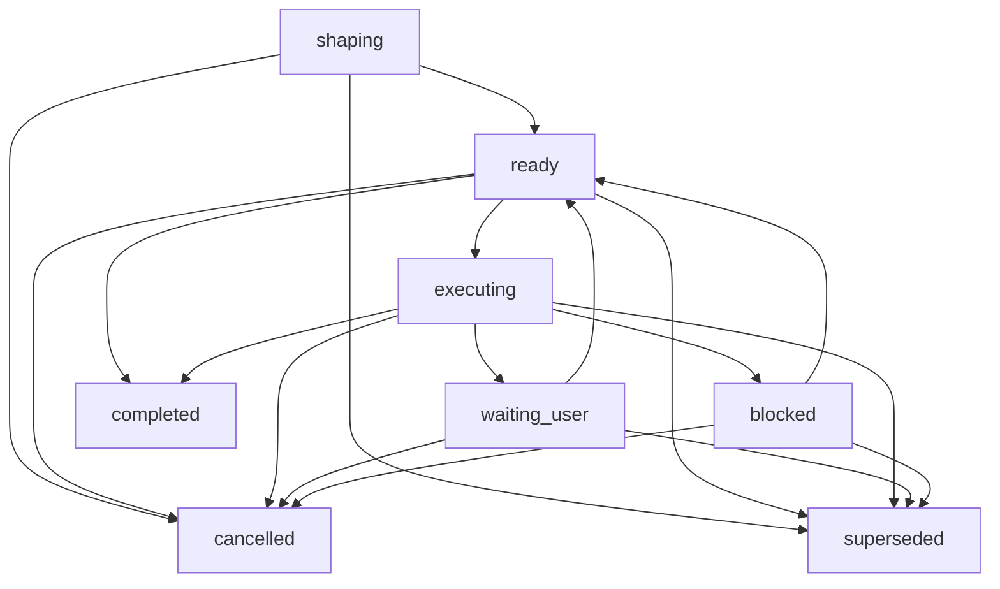

# Core Model Reference

This reference defines the future Harness Core authority model. It is source documentation only: this repository still has no Harness runtime or server implementation, and the current documentation is not implementation-complete unless the maintainer-owned status says so in [MVP Plan](../build/mvp-plan.md#documentation-acceptance-status).

Core is the local authority record for task scope, user-owned judgment, evidence, non-gating verification expectations, close readiness, and residual risk. It has authority over Harness records and Harness state transitions. Verification and Manual QA are conceptual boundaries in the current MVP, not active gates unless a future owner promotes them. Core does not grant OS permissions, sandbox arbitrary tools, make files tamper-proof, or provide isolation unless another owner documents and proves that exact mechanism.

## 1. Owns / Does not own

This document owns:

- Core invariants and authority boundaries.
- Entity relationship semantics where they affect state, write compatibility, gate behavior, or close.
- User-owned judgment boundaries and non-substitution rules.
- Gate meaning, blocker meaning, lifecycle principles, and state-transition principles.
- `update_scope`, `prepare_write`, Write Authorization, `record_run`, `close_task`, reserved waiver boundaries, residual-risk visibility, and close honesty.
- Cross-owner authority links where Core, API, Storage, Projection, Security, and Later material must stay separate.

This document does not own:

- Public MCP request or response shapes. Use [MVP API](api/mvp-api.md), [API Schema Core](api/schema-core.md), and [API Errors](api/errors.md).
- Exact active method-name, enum, and schema value sets. Use [API Schema Core](api/schema-core.md#current-mvp-value-sets).
- Storage tables, DDL, runtime home layout, locks, migrations, or persisted JSON layout. Use [Storage](storage.md).
- Rendered projection bodies or template text. Use [Projection And Templates Reference](projection-and-templates.md).
- Connector capability profiles or surface recipes. Use [Agent Integration Reference](agent-integration.md).
- Security guarantee vocabulary beyond Core authority consequences. Use [Security Reference](security.md).
- Later candidate catalogs. Use [Later](../later/index.md) until an owner promotes material into active scope.

Exact API request fields and storage table definitions may be named here only by reference. Core state values are discussed only when needed to explain authority and transition meaning.

## 2. Kernel invariants

1. Core-owned state is canonical for Harness operations; chat, reports, generated Markdown, status cards, projections, and template output are derived or contextual.
2. Harness governs Harness records and state transitions, not OS permissions, arbitrary-tool control or sandboxing, tamper-proof storage, default pre-tool blocking, or security isolation.
3. Product writes require explicit compatible scope before `prepare_write` can return an allowed compatibility result.
4. After intake, active Task scope and active Change Unit changes go through `harness.update_scope`; `scope_decision` user judgments may be linked as refs but do not mutate active scope by themselves.
5. A non-dry-run allowed `prepare_write` path is the only Core path that creates a consumable Write Authorization.
6. A Write Authorization is single-use for one compatible attempt. It is not reusable scope and not OS permission.
7. `record_run` records what happened and consumes the compatible Write Authorization; it cannot retroactively authorize work that lacked scope, user judgment, sensitive-action approval, or Write Authorization.
8. User-owned judgment cannot be replaced by agent inference, broad consent, generated prose, evidence, or projection text.
9. The only active current MVP judgment routes are `product_decision`, `technical_decision`, `scope_decision`, `sensitive_approval`, `final_acceptance`, `residual_risk_acceptance`, and `cancellation`.
10. Verification and Manual QA are not active current MVP gates; evidence, future verification or Manual QA routes, final acceptance, residual-risk visibility, residual-risk acceptance, and close readiness do not substitute for one another.
11. `close_task` must return blockers instead of a successful close while close-relevant blockers remain; known residual risk must be visible before a successful close path depends on it.
12. Active current MVP scope and later candidate material stay separate. A later candidate becomes active only when its owner promotes it with scope, fallback behavior, and proof expectations.

## 3. Entity model

These entities define authority relationships, not storage tables or API bodies.

- Task: the user-value unit whose state records current concrete mode, scope relationship, blockers, judgment needs, evidence status, close readiness, acceptance state, residual-risk state, and latest run relationship. The active concrete task-mode values are owned by [API Schema Core](api/schema-core.md#current-mvp-value-sets); intake `auto` is classification input only, not Task state.
- Change Unit: the active scoped work boundary for write-capable work. Product writes must be covered by a compatible active Change Unit. After intake, `harness.update_scope` is the active path that may create or replace the active Change Unit.
- Autonomy Boundary: the latitude an agent has inside a Change Unit. It is not scope, sensitive-action approval, evidence, final acceptance, or residual-risk acceptance.
- `user_judgment`: the canonical record family for choices the user owns. It feeds decision compatibility but does not create evidence, Write Authorization, scope mutation, Change Unit mutation, or close by itself.
- Write Authorization: the durable single-use Core record created only by compatible non-dry-run `prepare_write`. Its lifecycle can be active, consumed, stale, expired, or revoked. `allowed` is a `prepare_write` decision, not a durable authorization status; `blocked` is not an authorization status.
- Run: an execution or observation record. Product-write Runs must consume compatible active Write Authorization. Read-only or shaping-only Runs do not make later writes compatible.
- Evidence summary: the active compact Core evidence path for close-relevant claims, Runs, blockers, user judgments, and `ArtifactRef` values. A full Evidence Manifest is not active unless an owner enables it.
- `ArtifactRef`: the durable evidence reference shape owned by API/Storage. Core treats it as evidence-eligible only when it is registered, integrity-aware, redaction-aware, and linked to an owner record.
- Blocker: a structured reason progress, write, or close cannot proceed honestly.
- Residual-risk summary: the active compact visibility path for known remaining uncertainty, unchecked conditions, limits, or trade-offs. Rich residual-risk records are later candidate material until promoted.
- Projection and templates: derived displays from Core state and refs. They do not become authority by being readable or edited.

Discovery and requirement shaping persist through Task, `harness.update_scope`/Change Unit, and `user_judgment` owner paths. Separate shaping briefs, design displays, journey or reconcile records, rich risk records, Eval records, future Manual QA records, and full evidence manifests are not active current MVP Core state unless an owner explicitly promotes them.

The minimum active shaping information is the compact state needed to turn an ordinary request into one safe next step. It is not a new artifact. It is represented through:

- Task state for the current goal summary, task mode, lifecycle phase, one blocking question when necessary, one next safe action, and the active Change Unit pointer.
- Task or Change Unit scope fields for the active scope summary, allowed paths or affected areas, non-goals, acceptance criteria, Autonomy Boundary, baseline reference, and constraints.
- `user_judgment` records or candidates for required user-owned judgments.
- Evidence summary and blocker records for evidence expectations, evidence gaps, active blockers, and close blockers.

If any required shaping item is unknown, stale, unavailable, or disputed, Core must expose that as `unknown`, a pending user-owned judgment, a blocker, or the next safe action. It must not create a separate active `Discovery Brief`, `Question Queue`, `Assumption Register`, or similar committed planning artifact to make the request look writable.

Findings from commands, Runs, reviews, validators, diagnostics, or future QA/verification workflows affect Core only when routed through an active owner path such as blocker, evidence summary, user judgment, `harness.update_scope`, or close blocker. A finding left in chat or report prose is not state.

## 4. User-owned judgment boundaries

User-owned judgment is the boundary where Harness must ask or preserve the user's choice instead of inferring it. The exact `UserJudgment` schema and API fields live in [API Schema Core](api/schema-core.md) and [MVP API](api/mvp-api.md); this section owns the meaning of the boundaries.

The only active current MVP values for `UserJudgment.judgment_kind` are:

- `product_decision`: product behavior, UX, wording, release-facing promise, or user value.
- `technical_decision`: architecture, dependency, migration, public interface, compatibility, security/privacy, or material technical direction.
- `scope_decision`: scope expansion, non-goal removal, Change Unit boundary, or Autonomy Boundary change.
- `sensitive_approval`: permission for a named sensitive step inside a bounded scope.
- `final_acceptance`: the user's result judgment when the path requires acceptance.
- `residual_risk_acceptance`: acceptance of a named visible residual risk for the requested close.
- `cancellation`: stopping the Task without a successful result.

Other judgment candidates stay catalog-only in [Later](../later/index.md) until a future owner promotes them. They are not active current MVP `UserJudgment.judgment_kind` values.

Ambiguous consent is narrow. "Go ahead", "looks good", or similar broad approval cannot silently satisfy another judgment kind. One user reply may satisfy multiple judgment routes only when the prompt explicitly asked those distinct questions and Core records each compatible judgment with its affected object, scope, consequence, and close or write impact.

`harness.record_user_judgment` records the resolution of a pending `UserJudgment`, including a `judgment_kind=scope_decision` answer. It preserves the user's scope choice, but it does not directly update the active Task scope fields or active Change Unit; the next state-changing action for that effect is `harness.update_scope`, linked to the resolved judgment where relevant.

## 5. Non-substitution rules

Core must preserve these separations:

- Chat, generated Markdown, projection prose, or report text does not substitute for Core state.
- Evidence, logs, screenshots, artifacts, or test output do not substitute for final acceptance, future Manual QA, future verification, or residual-risk acceptance.
- QA is not final acceptance; a future quality-review waiver path would not be QA evidence or a QA pass.
- A future missing-check risk path would not be verification, detached verification, or assurance upgrade.
- Sensitive-action approval does not decide product direction, technical direction, scope, correctness, evidence, QA, final acceptance, residual-risk acceptance, or Write Authorization.
- Product judgment, technical judgment, and scope judgment do not substitute for one another.
- Final acceptance does not create evidence, erase evidence gaps, satisfy QA, prove verification, grant sensitive-action approval, change scope, accept residual risk, or override blockers.
- Residual-risk acceptance does not verify work, make a no-risk close, satisfy evidence, satisfy QA, or imply final acceptance.
- A stale or failed projection does not block or allow close by itself; the current Core close state and blockers do.

These rules apply even when a user-facing surface compresses the display. Compact output can be friendly, but it must not collapse authority boundaries.

## 6. Active Gates And Reserved Gate Names

Gates are Core compatibility summaries for progress, write, Run recording, and close. In the current MVP, the only active gate status fields exposed in public schemas are the `StateSummary.gates.*` fields owned by [API Schema Core](api/schema-core.md#current-mvp-value-sets). A gate name in planning prose does not create an active schema field, storage record, validator, close blocker category, or close requirement.

- Scope Gate: whether active scope covers the requested write or close-relevant work. Its active status values are `not_required`, `required`, `pending`, `passed`, `failed`, and `blocked`.
- Decision Gate: whether unresolved user-owned judgment blocks progress, write, or close. Its active status values are `not_required`, `required`, `pending`, `resolved`, `deferred`, and `blocked`. It does not replace sensitive-action approval, evidence, future verification or QA routes, final acceptance, or residual-risk acceptance.
- Approval Gate: whether scoped sensitive-action approval is required, pending, granted, denied, or expired. Its active status values are `not_required`, `required`, `pending`, `granted`, `denied`, and `expired`. It is permission for the sensitive action only.
- Evidence Gate: whether close-relevant evidence is not required, missing, partial, sufficient, stale, or blocked. Its active status values are `not_required`, `none`, `partial`, `sufficient`, `stale`, and `blocked`.
- Acceptance Gate: whether final acceptance is not required, required, pending, accepted, or rejected after the close basis is visible. Its active status values are `not_required`, `required`, `pending`, `accepted`, and `rejected`.
- Capability Boundary: surface capability affects blockers, validator findings, and guarantee display, but it is not a gate that creates authority. Missing capability must narrow the claim, hold the action through the owner path, or produce `CloseBlocker.category=surface_capability` rather than pretending verification or prevention happened.

Reserved gate names stay catalog-only in [Later](../later/index.md) until promoted:

- Design Gate is a later/reserved gate name. Design Quality is not an active current MVP gate, and the active MVP has no independent design-policy close gate. Design-quality observations affect close only when they fit an active owner path such as product, technical, or scope judgment; evidence; residual-risk visibility; surface capability; or an active `CloseBlocker.category`.
- Verification Gate is a later/reserved concept. The active MVP has no detached verification workflow and no verification close gate. A future owner must promote exact fields, requiredness, fallback behavior, and proof expectations before it affects active close semantics.
- QA Gate is a later/reserved concept. The active MVP has no Manual QA workflow and no Manual QA close gate. A future owner must promote exact fields, waiver behavior, artifact handling, and proof expectations before it affects active close semantics.

Gate state exposure in public responses is owned by [API Schema Core](api/schema-core.md) and method owners. Core owns the compatibility meaning and the rule that stale gate summaries must be recomputed before write or close relies on them.

## 7. Task lifecycle

The lifecycle is a Core state-transition discipline, not a display script. Active fixture and schema owners may expose exact values, but the Core principles are:

- `Task.lifecycle_phase` is the persisted lifecycle field. The active value set is `shaping`, `ready`, `executing`, `waiting_user`, `blocked`, `completed`, `cancelled`, and `superseded`.
- `completed`, `cancelled`, and `superseded` are terminal lifecycle values. `intake` is an API method/start handling step, not a persisted lifecycle phase.
- `Task.mode` is concrete task state. It can be `advisor`, `direct`, or `work`; `auto` is only an intake classification request and must be resolved before `tasks.mode` or `StateSummary.mode` is stored or displayed.
- A Task can be shaped, made ready, executed, wait for user judgment, become blocked, complete, cancel, or be superseded only through owner paths.
- Advice/read-only work must not produce product-file writes. Write-capable direct and tracked work must pass through compatible scope and the Write Authorization path.
- A product write path moves through scope establishment or `harness.update_scope`, user-judgment and sensitive-action checks when applicable, `prepare_write`, one compatible product-write Run, `record_run`, evidence/blocker update, and `close_task`.
- `close_ready` is derived. It is not a lifecycle phase and does not move a Task to completed; only `close_task` can do that.
- Idempotency replay must not duplicate state transitions, events, Write Authorizations, Runs, artifacts, evidence updates, or close effects.
- Dry-run calls describe possible outcomes but create no authoritative state, no consumable Write Authorization, no artifact, no close state, and no replay row.

Open lifecycle values have these active meanings:

- `shaping`: the request is not yet writable. Core has a Task, but the minimum shaping information is still incomplete, ambiguous, stale, or not yet represented as an active Change Unit for write-capable work.
- `ready`: the Task has enough current scope to proceed. For write-capable work, this means there is an active Change Unit and the next safe action may move toward `prepare_write`; it is still not Write Authorization.
- `executing`: the Task is in an active work or observation step whose result must be recorded through the owner path before close can rely on it.
- `waiting_user`: progress is waiting on a specific user-owned judgment before the next safe action. Non-blocking curiosity questions may be parked for later, but they are not active blockers and do not require `waiting_user`.
- `blocked`: a system, scope, capability, evidence, recovery, close, or other active blocker prevents honest progress until the named unblocker is addressed.

The diagram below is a compact aid for the active lifecycle transitions above. It does not add lifecycle values or replace the rules in this section.

Stable event names are append-only history labels for Core changes, not authority by themselves. The catalog should cover Task lifecycle updates, scope updates, Change Unit replacement, `prepare_write` decisions, Write Authorization creation/consumption/staling/expiry/revocation, Run recording, user judgment updates, gate recompute, evidence updates, blocker updates, residual-risk visibility or acceptance, close attempts, and close success, cancellation, or supersession. Waiver event names are reserved for owner-promoted later paths. Exact event payloads and persistence are owned by API and Storage.

## 8. update_scope authority

`harness.update_scope` is the active Core path for changing an active Task's goal summary, scope boundary, non-goals, acceptance criteria, Autonomy Boundary, baseline reference, or active Change Unit after intake.

It may create or replace the active Change Unit for the active Task. Replacing the active Change Unit makes the previous Change Unit no longer active for future write compatibility. If the scope, baseline, Autonomy Boundary, acceptance basis, or active Change Unit changes so an active Write Authorization no longer matches current Core state, Core marks that Write Authorization stale. Staling preserves the record for audit and replay; it is not consumption, expiry, revocation, or authorization reuse.

`harness.update_scope` may link to relevant resolved `scope_decision` user judgments through reference fields. Those refs explain the user-owned basis for the change, but the `user_judgment` record does not mutate active scope by itself.

`harness.update_scope` does not start a Task, resolve a user judgment, authorize a product write, consume a Write Authorization, record evidence, create final acceptance, accept residual risk, or close work.

## 9. prepare_write authority

`prepare_write` is the unique pre-write compatibility decision point for product-file writes. In the current MVP it checks a path-level intended operation against active Task, Change Unit, scope, baseline, Autonomy Boundary, required user-owned judgment, sensitive-action approval, surface capability, and other active owner-path preconditions.

Only a compatible non-dry-run allowed path creates a consumable Write Authorization. Dry-run responses and `state_conflict` create no replay row, evidence record, close state, or Harness write-compatibility record. A committed `blocked`, `approval_required`, or `decision_required` response may persist method-owned blockers, events, replay, and state-version effects only as allowed by the API method matrix, but it must not create a consumable authorization row, evidence record, close state, or Harness write-compatibility record.

Write Authorization is a cooperative Harness record. It can tell a connected agent or surface that the intended write is compatible with current Harness state; it does not grant OS permission, enforce a sandbox, prevent arbitrary tools, make storage tamper-proof, or isolate the operation.

When MCP or the connected surface cannot perform the needed cooperative check, the honest result is a hold, blocker, degraded guarantee display, or capability error. Preventive or isolated wording is later/profile-gated and stays unavailable unless a future owner promotes and proves that exact boundary for the covered operation.

Current-MVP `prepare_write` must reject or block requests that require command observation, network observation, secret-access observation, artifact capture, pre-tool blocking, or isolation that the active surface cannot provide. Use `CAPABILITY_INSUFFICIENT` when a recognized active surface lacks the requested capability, and `VALIDATION_FAILED` when the request shape or requested guarantee is invalid for the active profile. Do not encode unsupported observations into an active Write Authorization.

## 10. record_run authority

`record_run` records execution or observation. It is not a second chance to authorize a write.

For a product-write Run, Core must load a compatible active Write Authorization, compare the observed changed paths against the stored path-level authorized attempt and current state to the extent the surface can honestly observe it, and consume the authorization exactly once when compatible. Missing, stale, expired, revoked, consumed, incompatible, or insufficiently observable authorization cannot be recorded as successful consumption. Under the baseline `reference-local-mcp` profile, the `detective` label is justified only by changed-path observation after the relevant capability check has passed. Command, network, secret-access, artifact-capture, blocking, or isolation compatibility must not be marked verified under the baseline profile.

`record_run` may register or link `ArtifactRef` values only through owner-approved artifact paths. Raw secrets, tokens, forbidden sensitive logs, arbitrary caller paths, or untrusted bytes must be rejected, redacted, represented as omitted/blocked, or routed through an approved safe handle rather than stored to make evidence look complete.

Read-only and shaping-only Runs may be recorded without Write Authorization only when they do not report product-file changes. A violation or audit record may document an observed problem when an active owner path supports it, but it does not satisfy completion evidence, final acceptance, residual-risk acceptance, close readiness, QA, or verification until repaired through the relevant owner records.

## 11. close_task authority

`close_task` is the single completion decision point. Agent summaries, final reports, acceptance-looking chat, projections, Evals, QA notes, and evidence displays may inform close, but they do not close a Task by themselves.

For a successful close, Core must confirm the close intent against current Task state, open Runs, scope, user-owned judgments, sensitive-action approval when applicable, Write Authorization and Run compatibility, baseline and surface capability when relevant, required evidence sufficiency, close-relevant artifact availability, final acceptance when required, residual-risk visibility when close-relevant risk exists, residual-risk acceptance when the active close path requires acceptance, recovery constraints, and cancellation or supersession conflicts.

Close-related fields are separate contracts:

| Concept | Core meaning |
|---|---|
| `Task.lifecycle_phase` | Persisted lifecycle position: `shaping`, `ready`, `executing`, `waiting_user`, `blocked`, `completed`, `cancelled`, `superseded`. |
| `CloseTaskResponse.close_state` | Response-level close status: `ready`, `blocked`, `closed`, `cancelled`, `superseded`. It is not the persisted lifecycle field. |
| `Task.close_reason` | Persisted close detail: `none`, `completed_self_checked`, `completed_with_risk_accepted`, `cancelled`, `superseded`. |
| `Task.result` | Coarse task outcome: `none`, `advice_only`, `completed`, `cancelled`, `superseded`. A failed Run, violation, blocked close, or evidence gap stays in Run status, `CloseBlocker`, evidence state, or current Task state, not a terminal Task result. |

MVP close must keep later assurance and design-policy material out of active response semantics. Design-policy gates, verification gates, QA gates, detached verification, verified-completion fields, detailed Manual QA close fields, full Evidence Manifest behavior, and assurance display detail are later candidate behavior unless their owners explicitly activate them.

`close_task` must return blockers instead of pretending close is complete when required task/scope correctness, user-owned judgment, sensitive-action approval, Write Authorization or Run compatibility, evidence, artifact availability, final acceptance, residual-risk visibility, residual-risk acceptance, cancellation/supersession handling, surface capability, baseline, or recovery conditions remain unresolved. A public response may choose one primary error, but secondary close blockers and refs must remain visible enough for the next safe action.

Cancellation and supersession are honest terminal paths, not successful completion. Risk-accepted close is successful close with named accepted risk; it is not verified close and not no-risk close.

`harness.close_task` with `intent=supersede` moves the old Task to `lifecycle_phase=superseded`, `close_reason=superseded`, and `result=superseded`. If the superseded Task is `project_state.active_task_id`, Core must set `project_state.active_task_id` to `superseding_task_id` only when it names a valid open same-project Task; otherwise it must clear the active pointer. It must not leave the superseded Task active.

## 12. Blockers

Blockers are structured reasons a transition cannot proceed honestly. They can block progress, a write, Run recording, or close. They should name the affected Task or Change Unit when available, the active category, the missing or incompatible condition, related refs, and the next safe action.

Close readiness uses only the active `CloseBlocker.category` values owned by [API Schema Core](api/schema-core.md#current-mvp-value-sets):

| Active category | Core meaning |
|---|---|
| `task` | Missing, incompatible, already terminal, or otherwise unusable Task state. |
| `open_run` | A Run is still open, unsafe, incompatible, or not recorded in a way close can rely on. |
| `scope` | Missing active scope, out-of-scope work, or an active Change Unit mismatch. |
| `user_judgment` | A required product, technical, scope, or other active user-owned judgment is unresolved. |
| `sensitive_approval` | A required sensitive-action approval is missing, denied, expired, or incompatible with the attempted action. |
| `write_compatibility` | Required Write Authorization or product-write Run compatibility is missing, stale, invalid, consumed, or incompatible. |
| `baseline` | The baseline needed for compatibility or close is stale, missing, or mismatched. |
| `surface_capability` | The connected surface cannot honestly support the required active capability or guarantee display. |
| `evidence` | Required evidence summary is `none`, `partial`, `stale`, or `blocked` instead of sufficient for the close path. |
| `artifact_availability` | A close-relevant artifact is missing, unavailable, integrity-failed, or cannot support close after required redaction handling. |
| `final_acceptance` | Required final acceptance is missing, rejected, stale, or not tied to the visible close basis. |
| `residual_risk_visibility` | Close-relevant residual risk is not visible enough for the user to judge. |
| `residual_risk_acceptance` | A visible close-relevant residual risk still requires compatible user acceptance. |
| `cancellation` | Cancellation intent or cancellation state conflicts with the requested transition. |
| `supersession` | Supersession intent, replacement Task validity, or active-task pointer handling conflicts with the requested transition. |
| `recovery` | Recovery, replay, corruption, local access, or other repair constraints must be addressed before the transition. |

Conceptual issues such as design quality, future verification, future Manual QA, waiver handling, or Autonomy Boundary mismatch must map to one of those active categories when they are close-relevant. They do not create extra current MVP close blocker categories or independent close gates.

Invalid state combinations must become blockers, rejections, or repair paths. They must not be papered over by projection prose, broad approval, a waiver that does not apply, or a close result that hides the conflict.

## 13. Waivers

A waiver is a scoped exception to a named requirement where policy allows it. It must preserve what requirement was skipped, the affected Task and Change Unit, the reason, actor, timing, affected gate or close impact, expiry or required next action when needed, and any close-relevant residual risk.

The current MVP has no standalone design-policy waiver, quality-review waiver, or missing-check risk-acceptance route. Potential later waiver or risk-acceptance paths remain narrow catalog material until promoted by an owner with exact scope, non-substitution rules, close impact, and recording behavior.

Not allowed:

- Scope waiver for product writes.
- Sensitive-action approval waiver.
- Evidence waiver where evidence is required for completion.
- Final acceptance waiver where acceptance is required.
- Residual-risk visibility waiver.

Decision deferral is not waiver. A future quality-review waiver would not be a QA pass. A future missing-check risk acceptance would not be verification. A waiver can unblock only the requirement it names and only through the owner path that permits it.

## 14. Residual risk

Residual risk is known remaining uncertainty, an unchecked condition, limitation, or trade-off that matters to close. Known close-relevant residual risk must be visible before successful close. If close depends on accepting that risk, Core requires a compatible residual-risk acceptance `user_judgment` tied to the visible risk and related refs.

Residual-risk acceptance does not verify the work, satisfy evidence, satisfy QA, grant sensitive-action approval, create final acceptance, or make the result no-risk. It records that the user accepts a named visible risk for the requested close.

The active current path uses compact residual-risk summary, blockers, evidence refs, and `user_judgment` refs. Rich residual-risk records, review workflows, handoff reports, and later assurance displays remain later candidate material until promoted.

## 15. Cross-owner links

Use these owners when Core authority touches another contract:

- Public API method behavior, request/response shapes, active method-name and schema value sets, envelopes, state conflicts, and errors: [MVP API](api/mvp-api.md), [API Schema Core](api/schema-core.md), and [API Errors](api/errors.md).
- Storage tables, DDL, runtime home layout, locks, migrations, artifact storage, and enum hardening: [Storage](storage.md).
- Projection freshness, readable views, managed blocks, human-editable sections, and active rendered template bodies: [Projection And Templates Reference](projection-and-templates.md).
- Security guarantee language, cooperative/detective/preventive/isolated labels, and local access posture: [Security Reference](security.md).
- Runtime boundary placement and Core-only mutation authority: [Runtime Boundaries Reference](runtime-boundaries.md).
- Design-quality boundary and non-gate routing: [Design Quality](design-quality.md).
- Connector capability profiles and surface-specific fallback behavior: [Agent Integration Reference](agent-integration.md).
- Conformance examples, future fixture boundaries, and operations entrypoint candidates: [Conformance Reference](conformance.md), [Later Candidate Index: Future Fixture Families](../later/index.md#future-fixture-families), and [Later Candidate Index: Operations Candidates](../later/index.md#operations-candidates).

If another document needs an exact schema, DDL table, rendered template body, or later candidate catalog, it must link to the owner instead of redefining it here.
