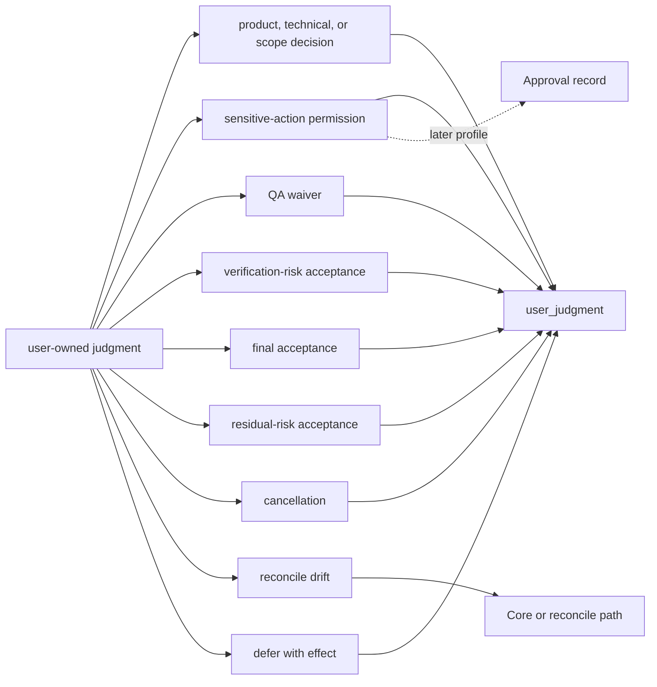
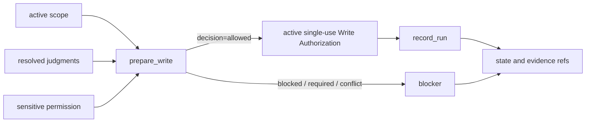
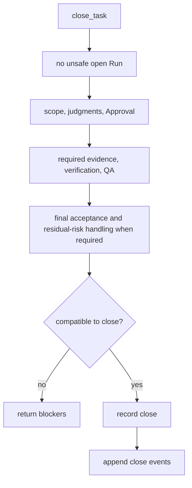

# Core Model Reference

## What this document helps you do

Use this reference to check the future Harness Core model contract for Core authority, work shape, pre-write scope checks and internal Write Authorization records, user judgment routing, evidence, verification, QA, final acceptance, residual-risk visibility, residual-risk acceptance, and close behavior.

This is reference documentation for a future local Harness Server. No Harness runtime or server implementation exists in this repository today. Current repository phase and implementation handoff status are tracked in [Implementation Overview](../build/implementation-overview.md#documentation-acceptance-status).

## Read this when

- You need the invariants that all future Kernel behavior must preserve.
- You are deciding whether a Task can read, write, wait for the user, or close.
- You need to separate scope, pre-write scope checks, user judgment, evidence, verification, QA, final acceptance, residual-risk visibility, and residual-risk acceptance.
- You are reviewing API, storage, projection, or conformance docs for consistency with Kernel authority.

## Before you read

Read [Concepts](../learn/concepts.md) or [Harness in One Task](../learn/one-task.md) first if you want examples before exact rules. Active MVP-1 public methods are owned by [MVP API](api/mvp-api.md), shared API shapes by [API Schema Core](api/schema-core.md), and API errors by [API Errors](api/errors.md). Storage tables are owned by [Storage](storage.md). Connector capability wording is owned by [Agent Integration Reference](agent-integration.md).

## Main idea

Harness is a local authority-record and user-judgment-routing layer. The Kernel makes Core-owned local state, not chat or Markdown, the operational authority for product work. It keeps scope, pre-write scope checks and internal Write Authorization records, user-owned judgments, evidence, verification, QA, final acceptance, residual-risk visibility, residual-risk acceptance, and close readiness in separate routes so one kind of support cannot silently replace another.

The active stage and profile decide which gates are required for a specific operation. A field or gate appearing in this reference does not make the full future behavior required for Engineering Checkpoint, MVP-1, or a small direct change.

## Contract map

| If you need... | Start here | Related owner |
|---|---|---|
| Core invariants | [Kernel invariants](#kernel-invariants) | This document. |
| Work shape and mode meaning | [Work modes](#work-modes) | API enum values stay in [API Schema Core](api/schema-core.md#shared-schemas). |
| User judgment types and routes | [Judgment route boundaries](#judgment-route-boundaries), [User Judgment](#user-judgment), [Decision Gate](#decision-gate) | Public request fields stay in [`harness.request_user_judgment`](api/mvp-api.md#harnessrequest_user_judgment). |
| Entity relationship semantics | [Entity model](#entity-model) | Physical tables stay in [Storage](storage.md). |
| Gate meaning | [Gates](#gates), [Gate Rule Map](#gate-rule-map) | Public blockers and errors stay in [API Errors](api/errors.md#primary-error-code-precedence). |
| Pre-write scope checks / Write Authorization | [`prepare_write`](#prepare_write), [Write Authorization](#write-authorization), [`record_run`](#record_run) | Public request/response shape stays in [`harness.prepare_write`](api/mvp-api.md#harnessprepare_write) and [`harness.record_run`](api/mvp-api.md#harnessrecord_run). |
| Close semantics | [`close_task`](#close_task), [Close matrix by work shape and active profile](#close-matrix-by-work-shape-and-active-profile), [Close result semantics](#close-result-semantics) | Public close response shape stays in [`harness.close_task`](api/mvp-api.md#harnessclose_task). |
| Waivers and invalid combinations | [Waiver semantics](#waiver-semantics), [Invalid state combinations](#invalid-state-combinations) | Design-policy details stay in [Design Quality Policies](design-quality-policies.md). |

## Kernel invariants

These are the small Core invariants the rest of the Kernel contract serves:

1. Core-owned local state is the authority for operations.
2. Chat, Markdown projections, generated documents, reports, and cards are not authority.
3. Scope boundaries must be explicit before a product write can pass the pre-write scope check.
4. Product-file writes require a compatible internal Write Authorization record for the exact write attempt.
5. State-changing Core tools must be protected by idempotency and affected-scope `expected_state_version` checks; dry-run results are non-authoritative.
6. User-owned judgments cannot be silently replaced by agent judgment.
7. Sensitive-action approval, final acceptance, QA waiver, verification-risk acceptance, and residual-risk acceptance are separate routes.
8. Evidence, verification, Manual QA, final acceptance, residual-risk visibility, and residual-risk acceptance do not substitute for one another.
9. Close must expose blockers and residual risk instead of collapsing them into a single "done" flag.
10. The active stage and profile determine which gates are required for the requested operation.

## Kernel in 10 sentences

1. The Kernel is the future Core state contract for local AI-assisted product work.
2. It keeps the active Task, scope, pre-write scope-check status, judgment records, evidence refs, close blockers, and residual risk outside the chat transcript.
3. Advice/read-only work can answer without product writes.
4. Small direct changes may stay lightweight, but product-file writes still require compatible scope and a compatible pre-write scope check.
5. Tracked work keeps scope, blockers, evidence, user judgment, and close readiness visible until the Task can close.
6. `prepare_write` is the product-write pre-write scope-check and compatibility decision point.
7. `record_run` records what happened and consumes the compatible internal Write Authorization record for product-write Runs.
8. `user_judgment` records preserve user-owned judgment. In minimum MVP-1, a sensitive-action approval judgment can record scoped sensitive-action permission; later Approval records add a hardened committed lifecycle.
9. `close_task` is the completion decision point and checks only the gates required by the active profile and close intent.
10. Projections help humans read state, but Core state, events, and registered artifact refs remain the authority.

## The four questions the kernel answers

1. What Task is active?

   The active Task is the current unit of user value. It carries mode, lifecycle phase, active scope, current blockers, evidence and artifact refs, user-judgment state, close readiness, acceptance state, residual-risk state, and projection freshness when projection support is enabled.

2. What work is compatible with current scope now?

   Compatible work is computed from the active Task, work shape, active Change Unit, scope, Autonomy Boundary, baseline freshness, sensitive-action permission, user-owned judgments, applicable policy, surface capability, and the requested operation.

3. What user judgment is still blocking progress?

   Blocking user-owned judgment is represented by `user_judgment` state and the aggregate `decision_gate`. Sensitive-action permission is represented separately by `approval_gate`; in minimum MVP-1 the gate may derive from a sensitive-action approval user judgment, and in later profiles it may derive from committed Approval state.

4. Can this Task close?

   `close_task` checks the close intent against open Run state, scope, required decisions, sensitive-action permission, evidence, verification when required, Manual QA when required, residual-risk visibility and residual-risk acceptance when required, final acceptance when required, projection freshness when relevant, and artifact availability.

## Work modes

The stored Task `mode` values remain:

```text
advisor | direct | work
```

User-facing surfaces should lead with the plain work shapes below. These labels do not add enum values, schema fields, record types, projection kinds, gates, or authority paths.

| Plain work shape | Internal mode | Kernel implication |
|---|---|---|
| Advice/read-only | `advisor` | Product-file write is not a valid outcome. Scope can be informal unless the advice is converted into product work. Evidence, verification, QA, final acceptance, residual-risk visibility, and residual-risk acceptance are normally not required unless the user request, policy, or active profile requires them. |
| Small direct change | `direct` | Product-file writes can proceed only through explicit scope and compatible `prepare_write` / internal Write Authorization record. The Change Unit may be minimal when the request is obvious. Evidence may be lightweight. User judgment records, Manual QA, detached verification, final acceptance, and residual-risk acceptance are not created as ceremony; they apply only when triggered by the active profile, task type, user request, sensitive/security/criticality profile, detected risk, or explicit requirement. |
| Tracked work | `work` | Used for structured, multi-step, risky, user-facing, public-interface, security/privacy, architecture, or otherwise non-trivial work. It keeps scope, user judgment, evidence, close blockers, final acceptance, residual-risk visibility, and residual-risk acceptance visible. It does not automatically require every future gate; the active profile decides which gates are required. |

Small direct changes must stay small. Escalate the same Task to tracked work when scope becomes unclear, changed paths exceed the active scope, multiple product areas or subsystems are involved, Product decision or Technical decision appears, public API or module contract impact appears, security/privacy impact appears, a sensitive action appears, evidence expectations grow, QA or verification becomes required, residual risk becomes non-trivial, or multi-step delivery is needed.

The tiny direct profile is only a display/profile choice inside `mode=direct`. It is appropriate for a typo, one docs sentence with no meaning change, or an obvious rename. It must not bypass scope, pre-write scope checking, sensitive-action permission, user-owned judgment, evidence requirements that actually apply, residual-risk visibility, or close rules.

## Judgment route boundaries

Harness separates what the user is judging from the internal owner path that records it. User-facing docs should not expose a field taxonomy as if the user must reason about it. The user sees one focused question, the prompt names the concrete judgment, and the record stores enough context for the owner path to validate the answer.

### User-facing display types

| Display type | Use when the user owns... | Internal `judgment_kind` |
|---|---|---|
| Product decision | Product behavior, UX, wording, interaction, taste, user value, or release-facing promise. | `product_decision` |
| Technical decision | Public API, module boundary, dependency, migration, compatibility, security/privacy trade-off, or material implementation direction. | `technical_decision` |
| Scope decision | Scope expansion, non-goal removal, Change Unit boundary change, or Autonomy Boundary change. | `scope_decision` |
| Sensitive action approval | Permission for a named sensitive step inside a bounded scope. | `sensitive_approval` |
| QA waiver | Whether a policy-allowed Manual QA requirement is waived through a visible risk path. | `qa_waiver` |
| Verification risk acceptance | Whether the user accepts the risk created by waived or missing required verification. | `verification_risk_acceptance` |
| Final acceptance | Whether the user accepts the result when final acceptance is required. | `final_acceptance` |
| Residual risk acceptance | Whether a visible close-relevant remaining risk is acceptable for this close. | `residual_risk_acceptance` |
| Cancellation | Whether the Task should stop without a passed result. | `cancellation` |

### Internal routes

| Route | Kernel meaning | Must not be treated as |
|---|---|---|
| `choose` | The user chooses among product, technical, security/privacy, or scope/autonomy options. | Sensitive-action permission, pre-write scope-check compatibility, final acceptance, waiver, cancellation, or residual-risk acceptance. |
| `defer` | The user intentionally defers a user-owned judgment, with recorded effect on progress, close, risk, and follow-up. | Resolution, waiver, acceptance, or permission to hide the blocker. |
| `approve-sensitive-action` | The user grants scoped sensitive-action permission through a sensitive-action approval user judgment; later Approval profiles may also commit an Approval record. | Product direction, technical direction, correctness proof, final acceptance, residual-risk acceptance, QA, verification, evidence, or Write Authorization. |
| `waive` | The user or policy waives a named QA requirement when waiver is allowed. | The skipped QA itself, QA evidence, assurance upgrade, final acceptance, unrelated residual-risk acceptance, or generic consent. |
| `accept-verification-risk` | The user accepts the named risk created by waived or missing required verification. | Detached verification, `completed_verified`, QA pass, evidence sufficiency, final acceptance, or no-risk close. |
| `accept-result` | The user accepts the result when final acceptance is required, after the close basis is visible. | Evidence, QA, verification, sensitive-action permission, waiver, residual-risk acceptance, scope change, or a new pre-write scope check. |
| `accept-risk` | The user accepts a named visible close-relevant Residual Risk for the requested close. | No-risk close, detached verification, QA pass, evidence sufficiency, final acceptance, or sensitive-action permission. |
| `cancel` | The user stops the Task without a passed result. | Successful completion, final acceptance, residual-risk acceptance, or evidence sufficiency. |
| `reconcile` | The user or operator resolves human-editable or generated/projection drift into accepted state, note, rejection, decision request, or deferral. | Direct state mutation from Markdown, report prose, or chat. |

This route map is the design contract for user-owned judgment. The route verb is internal owner-path metadata; broad approval is intentionally absent from the user-facing model.



Each route remains separate after recording: sensitive approval does not choose product direction, QA waiver does not perform the skipped QA, verification-risk acceptance does not create detached verification, final acceptance does not accept residual risk, and reconcile does not turn Markdown into state without a Core path.

### Display depth

These values describe presentation detail. They do not revive `display_depth` as a schema field; new examples should use `presentation=short` or `presentation=full`.

| Display depth | Use for | Minimum display |
|---|---|---|
| `simple` | A narrow unblocker with low consequence. | Exact question, scope, options or requested outcome, what the answer does not settle. |
| `tradeoff` | Product or technical choices with meaningful consequences. | Options, recommendation when available, uncertainty, deferral effect, affected scope and criteria. |
| `high-risk` | Security/privacy, sensitive categories, public API, migration, dependency, or costly rollback. | Trade-offs plus risk, evidence refs when available, approval boundary when relevant, rollback/follow-up effect. |
| `close-affecting` | Final acceptance, waiver, residual-risk acceptance, or a decision whose deferral affects close. | Close basis, blockers, residual-risk visibility, affected gates, required refs, and the exact close impact. |

### Canonical schema direction

- `user_judgment` is the canonical record family.
- `harness.request_user_judgment` is the canonical request action, and `harness.record_user_judgment` records the compatible user answer.
- `judgment_kind` stores the compact internal type: `product_decision`, `technical_decision`, `scope_decision`, `sensitive_approval`, `qa_waiver`, `verification_risk_acceptance`, `final_acceptance`, `residual_risk_acceptance`, or `cancellation`.
- User-facing display is limited to Product decision, Technical decision, Scope decision, Sensitive action approval, QA waiver, Verification risk acceptance, Final acceptance, Residual risk acceptance, and Cancellation.
- `presentation=short` is the default for small unblockers and one-screen prompts.
- `presentation=full` is full-format Decision Packet-style presentation for complex, high-risk, or close-affecting judgments.
- `display_label` is the user-facing label. Allowed labels are Product decision, Technical decision, Scope decision, Sensitive action approval, QA waiver, Verification risk acceptance, Final acceptance, Residual risk acceptance, and Cancellation.
- Route-like and depth-like details are validation or presentation metadata, not separate concepts users must learn.
- `affected_gates`, owner refs, and the user judgment status determine what the judgment can influence.

`request_user_decision`, `record_user_decision`, `judgment_domain`, `decision_kind`, `decision_profile`, `judgment_category`, `judgment_route`, and `display_depth` are compatibility or legacy terms. New examples, fixtures, and public docs should prefer the canonical names above.

Ambiguous consent is deliberately narrow. Phrases such as "yes, do it," "proceed," "go ahead," "looks good," "좋아," or "진행해" do not by themselves grant sensitive-action permission, choose product or technical direction, change scope, accept the result, accept residual risk, waive QA, accept verification risk, cancel work, or convert deferral into a chosen option. A single user reply may satisfy multiple routes only when the request made those routes explicit, the reply is compatible with each route, and the recorded payload names the matching `judgment_kind`, affected object, scope, user intent, consequence, and affected close/write impact for each route. Otherwise Core or the agent must clarify.

## Evidence, verification, QA, final acceptance, and risk

These concepts support close, but they are not synonyms for "done":

| Concept | Kernel meaning |
|---|---|
| Evidence | Records or refs that support what was done or observed. Evidence can support a claim only when mapped to the relevant criterion, condition, or owner record. |
| Verification | A technical check of claims. Detached verification requires an Eval with a valid independence boundary and current inputs, but detached verification is required only when the active profile or explicit requirement says so. |
| Manual QA | Human inspection of behavior, UX, copy, accessibility interpretation, product taste, visual output, or environment-dependent outcome. Screenshots and browser logs can support QA, but they are not the human QA judgment. |
| Final acceptance | The user's result judgment when the active path requires acceptance. It is recorded only after close-relevant evidence, verification, QA status, scope, sensitive-action permission, and residual risk are visible or confirmed absent. |
| Residual risk | Known remaining uncertainty, unchecked condition, limitation, or trade-off. Residual-risk acceptance explicitly records the user's acceptance of named visible risk for the requested close. |

Does-not-substitute table:

| This | Does not substitute for |
|---|---|
| Chat text, generated Markdown, or report prose | Core state, evidence, decisions, Approval, close blockers, or pre-write scope-check records. |
| Evidence, logs, screenshots, or artifact refs | Manual QA, verification, final acceptance, or residual-risk acceptance. |
| Test pass, build pass, browser smoke, or self-check | Final acceptance, required Manual QA, or detached verification without a qualifying Eval. |
| Broad approval or "yes, do it" | Product decision, technical decision, scope decision, sensitive approval, QA waiver, verification-risk acceptance, final acceptance, residual-risk acceptance, cancellation, or Write Authorization unless the prompt, `judgment_kind`, affected object, scope, and recorded user intent match. |
| Sensitive approval | Product decision, technical decision, scope decision, correctness, evidence, QA, verification, final acceptance, residual-risk acceptance, or Write Authorization. |
| Product decision | Sensitive approval, technical decision, scope decision, final acceptance, QA waiver, verification-risk acceptance, or residual-risk acceptance. |
| Technical decision | Sensitive approval, product decision, scope decision, final acceptance, QA waiver, verification-risk acceptance, or residual-risk acceptance. Final acceptance cannot imply a missing technical decision. |
| Final acceptance | Evidence sufficiency, QA, verification, sensitive approval, scope decision, waiver, residual-risk visibility, residual-risk acceptance, or more pre-write scope-check compatibility. |
| Residual-risk acceptance | Verification, detached verification, Manual QA, evidence sufficiency, no-risk close, final acceptance, or sensitive approval. |
| QA waiver | QA pass, QA evidence, verification, evidence sufficiency, final acceptance, or acceptance of unrelated risk. It records only a waiver/risk path when policy allows it. |
| Verification-risk acceptance | Detached verification, `completed_verified`, Manual QA, final acceptance, or assurance upgrade. |

Stage/profile support:

| Stage/profile | What it can represent |
|---|---|
| Engineering Checkpoint / Kernel Smoke | The narrow internal authority loop: local project registration, active Task, active Change Unit or scoped work boundary, `prepare_write`, one single-use Write Authorization, one compatible Run, one artifact/evidence ref, one structured status/blocker response, and a narrow close-blocker check. Verification, Manual QA, final acceptance, residual-risk acceptance, full Evidence Manifest, and profile-specific full-format user judgment presentation are not Engineering Checkpoint requirements unless the named smoke path explicitly includes them. |
| MVP-1 User Work Loop | User-facing compact outputs for current state, scope, pending user judgments, evidence summary, close readiness, final acceptance when required, residual-risk visibility when close-relevant risk exists, why work is blocked, and what the agent can safely do next. Agent-facing context is a separate compact refs packet. MVP-1 must not imply detached verification is always required. |
| Later assurance and operations profiles | Detached verification independence, richer Manual QA, stewardship, feedback-loop/TDD policy, projection/reconcile operations, export/recover, and handoff behavior. These are blockers only when the active profile or owner doc enables them. |

Active MVP-1 evidence uses a Core-owned `evidence_summary`, not full Evidence Manifest report prose. Its minimum summary states are `not_required`, `none`, `partial`, `sufficient`, `stale`, and `blocked`. When item-level or criterion-level coverage is needed, the minimum coverage states are `supported`, `unsupported`, `partial`, `not_applicable`, `stale`, and `blocked`.

`evidence_summary.status=sufficient` means every close-relevant required criterion, condition, or completion claim has compatible current support and any referenced artifacts are available enough for the claim. `none` means evidence is required but no compatible support is recorded. `partial` means some required support exists but coverage is incomplete. `stale` means prior support no longer matches current state, baseline, scope, or artifact integrity. `blocked` means Core cannot inspect, link, or trust required support until a named blocker is resolved. `not_required` is valid only when the active path does not require recorded evidence.

The MVP-1 `evidence_summary` may cite Runs, blockers, user judgments, and `ArtifactRef` values. It does not create detached verification, Manual QA, final acceptance, residual-risk acceptance, or close by itself.

## Reference scope

This document owns:

- Core invariants and non-substitution rules
- work mode semantics
- entity relationship meaning where it affects authority, write, gate, or close decisions
- gate meaning and close semantics
- `prepare_write`, Write Authorization, `record_run`, and `close_task` state logic
- waiver meaning and invalid state combinations

## Not covered here

This document does not own:

- full public MCP request/response schemas; see [MVP API](api/mvp-api.md), [API Schema Core](api/schema-core.md), [API Errors](api/errors.md), and [API Schema Later](api/schema-later.md)
- SQLite DDL and storage layout; see [Storage](storage.md)
- full projection template bodies
- document projection rules; see [Projection And Templates Reference](projection-and-templates.md)
- detailed design-quality policy tables; see [Design Quality Policies](design-quality-policies.md)
- connector capability profiles; see [Agent Integration Reference](agent-integration.md)
- operator command syntax; see [Operations And Conformance Reference](operations-and-conformance.md)
- fixture catalogs for later profiles

## Entity model

These entity notes define relationship semantics only. They do not add tables, fields, DDL, or API bodies.

### Task

A Task is the user value unit. It carries current mode, lifecycle phase, result, close reason, assurance level, active Change Unit, gate states, user judgment refs, evidence and artifact refs, residual-risk state, acceptance state, latest Run state, and projection freshness when enabled.

### Change Unit

A Change Unit is the scoped work boundary for product-file writes. It answers what work surface may change, which paths/tools/commands/network/secret access are in scope, what is out of scope, what sensitive categories apply, what evidence and QA expectations apply, and what completion conditions matter.

Every product-file write requires an active Change Unit whose scope covers the intended write. Core creates a compatible record for a specific product-write attempt only through `prepare_write`.

### Autonomy Boundary

An Autonomy Boundary is the judgment latitude inside a Change Unit. Scope says where and what may change; Autonomy Boundary says which choices the agent may make without another user judgment.

The Autonomy Boundary is not scope, Approval, a pre-write scope check, evidence, verification, QA, final acceptance, or residual-risk acceptance. It must not be read as permission to change the goal, expand scope, choose user-owned product direction, choose material technical direction, or accept residual risk for the user.

<a id="decision-packet"></a>

### User Judgment

`user_judgment` is the canonical record family for user-owned judgment. Each record stores the exact question, `judgment_kind`, `presentation`, `display_label`, status, options or selected outcome, affected Task/Change Unit/write/close scope, affected object refs, related refs, recommendation/rationale/uncertainty, what happens if the user does not decide, why the agent cannot decide on the user's behalf, and route-specific context for sensitive approval, QA waiver, verification-risk acceptance, final acceptance, residual-risk acceptance, cancellation, or reconcile.

User judgment records feed `decision_gate`. Blocking user-owned judgment cannot be satisfied by chat text, broad approval, or projection prose alone. The recorded `user_judgment` and its resolution, deferral, rejection, blocked state, or supersession are the authority for that judgment.

User judgment status is record-level:

```text
proposed | pending_user | resolved | deferred | rejected | blocked | superseded
```

Resolving a user judgment records user-owned judgment. It creates sensitive-action permission only when the judgment is a sensitive-action approval with compatible `approval_scope`; later Approval profiles may also require the linked Approval path. It does not create Write Authorization, does not create evidence, and does not close a Task by itself.

#### User judgment lifecycle map

The lifecycle is intentionally small: draft or detect a needed judgment, ask the user when needed, record the compatible response, and preserve deferral, rejection, blocked, or superseded outcomes. Exact public fields are owned by [`harness.request_user_judgment`](api/mvp-api.md#harnessrequest_user_judgment) and [`harness.record_user_judgment`](api/mvp-api.md#harnessrecord_user_judgment). "Decision Packet" is the legacy or full-format presentation label for a complex user judgment prompt; it is not the canonical record family.

### Journey Spine

Journey Spine is later/diagnostic derived continuity over Task state, Change Units, Runs, user judgments, Approvals, evidence, verification, QA, acceptance state, residual risk, close events, artifact refs, and `state.sqlite.task_events`. It is not a separate source of truth and is not required for MVP-1 storage.

### Journey Spine Entry

A Journey Spine Entry is a later/diagnostic durable continuity annotation only when the note cannot be reconstructed from existing state and events. It supplements owner records; it does not replace Task, Change Unit, Run, user judgment, evidence, verification, QA, risk, acceptance, close, or artifact state.

### Run

A Run is an execution or observation attempt. It records actor, surface, mode, Change Unit, baseline, intended operation, observed changes, command results, artifact refs, and summary. Implementation and direct product-write Runs must consume a compatible internal Write Authorization record. Read-only or shaping-only Runs do not make product-file writes compatible.

### Approval

Approval is scoped sensitive-action permission. In minimum MVP-1 it can be represented by a resolved sensitive-action approval user judgment with `approval_scope`. In later Approval/Assurance Profiles it can also be represented by a committed Approval record. It can cover paths, tools, commands, network targets, secret scope, sensitive categories, baseline, expiry, and user judgment for that sensitive action.

Approval does not prove correctness, choose product direction, choose technical architecture, create evidence, satisfy QA, verify work, accept a result, accept residual risk, or authorize a product write by itself.

### Write Authorization

A Write Authorization is the durable single-use state record created only by a non-dry-run `prepare_write.decision=allowed` for an exact product-file write compatible with current Core records. It records the Task, Change Unit, `basis_state_version` used for the allow decision, intended operation, intended write surface, relevant sensitive-action coverage and decisions, guarantee level, lifecycle status, and consumption by a compatible Run. `basis_state_version` is the compatibility basis, not necessarily the resulting `ToolResponseBase.state_version`. It is a Harness-level cooperative record/check, not OS permission, sandboxing, tamper-proof storage, preventive blocking, or isolation.

Write Authorization status is record-level:

```text
active | consumed | expired | stale | revoked
```

`allowed` is a `prepare_write` decision, not a durable lifecycle status. `blocked` is not a Write Authorization lifecycle status. A dry-run allowed result is a candidate decision only. A `blocked`, `approval_required`, `decision_required`, or `state_conflict` result creates no consumable authorization row; Core represents it through `prepare_write.decision`, blockers, validator findings, or errors.

`active` means a consumable authorization row exists and has not been consumed, expired, revoked, or marked stale. `consumed` means exactly one committed compatible implementation or direct `record_run` consumed it. `stale` means the compatibility basis changed before consumption. `expired` means expiry conditions elapsed before consumption. `revoked` means Core, policy, or explicit user decision revoked it before consumption.

A Write Authorization is not reusable scope. It records compatibility for one exact write attempt under the current compatibility basis and is consumed by one compatible implementation or direct `record_run`, except for idempotent replay of the same committed request.

### Evidence Manifest

An Evidence Manifest maps claims, criteria, or completion conditions to supporting refs. It may reference Runs, artifacts, Evals, Manual QA records, design records, or other owner records. Evidence sufficiency is criteria-based, not artifact-count-based.

### Eval

An Eval is a verification result record. It records target, verdict, checks performed, evidence reviewed, independence qualifier, baseline relationship, input freshness, blockers, and artifact refs. A passed Eval upgrades assurance only when the active profile requires or allows detached verification and the independence/freshness rules are satisfied.

### Manual QA

Manual QA is a human inspection record. Automated checks and capture artifacts can support it but do not become Manual QA by themselves. Manual QA is required only when the active profile, policy, user request, task type, changed surface, or detected risk makes it required.

### Finding routing

Findings from commands, Runs, Evals, QA, reviews, validators, or diagnostics are not a separate authority path. They affect state only when routed through existing owner records: Evidence Manifest, user judgment, Change Unit, Approval, Eval, Manual QA, Residual Risk, Reconcile Item, structured close blocker, or another enabled owner path.

### Residual Risk

Residual Risk is a close-relevant state record for known remaining uncertainty, limitation, unchecked condition, or trade-off. It records source refs, affected scope, visibility, accepted-risk metadata when accepted, follow-up, and close impact.

Residual Risk records make risk visible. They do not verify work, replace evidence, waive QA, grant Approval, imply final acceptance, or close a Task.

### Artifact

An Artifact is a durable evidence file or bundle with integrity metadata, such as a diff, log, screenshot, manifest, bundle, or export component. Artifact refs are distinct from Markdown reports and state records.

An `ArtifactRef` is evidence-eligible only after Core registers it from an allowed source, resolves the Task or equivalent owner scope, records the relation owner, and preserves current `sha256`, `size_bytes`, `content_type`, `redaction_state`, `produced_by`, and `retention_class` metadata. Raw secrets, tokens, and full sensitive logs must not be stored to make evidence look complete; use redaction, `secret_omitted`, `blocked`, safe handles, or an owner-approved note instead.

### Reconcile Item

A Reconcile Item is the candidate record for human-editable or generated/projection drift. Reconcile may merge, reject, convert to note, create a user judgment, or defer. Markdown or generated text becomes state only through the accepted reconcile/owner path.

### Design Support Records

Shared Design, Domain Term, Module Map Item, Interface Contract, Feedback Loop, and TDD Trace records can support scope, evidence, and design policy when their profiles are enabled. Their policy details are owned by [Design Quality Policies](design-quality-policies.md), and their storage shape is owned by [Storage](storage.md).

## Boundaries and non-substitutions

- Chat text is not state.
- Generated Markdown is not canonical state.
- Human-edited projections are input until reconciled.
- Registered artifact files or safe metadata notices can support evidence only through `ArtifactRef`, owner relation, and integrity/redaction metadata; Markdown that links to them is a readable projection.
- Review displays and future Review Stages are procedure or display unless routed through owner records.
- Autonomy Boundary records judgment latitude only; it is not scope or a pre-write scope check.
- Sensitive-action approval and other user judgments are separate.
- Write Authorization is a single-use cooperative record for one compatible attempt, not reusable scope or OS permission.
- Evidence sufficiency is not inferred from prose alone.
- Eval verdict alone does not create `detached_verified`.
- Evidence does not substitute for Manual QA, and QA waiver does not create verification evidence.
- Test pass does not automatically mean final acceptance, required Manual QA, or detached verification.
- Manual QA does not imply final acceptance.
- Final acceptance does not erase residual risk.
- Residual-risk acceptance does not verify implementation or create a no-risk close.
- Verification-risk acceptance, QA waiver, decision deferral, and residual-risk acceptance are separate concepts with separate close impact.
- Capability affects blockers and guarantee display, but it is not a first-class Kernel gate.

## Gates

Gates are canonical Kernel fields used by future status, write, run, and close decisions. A gate can exist in the reference model without being required for every stage or every Task.

The active profile controls requiredness. Engineering Checkpoint proves the narrow authority loop. MVP-1 shows user-facing judgment, evidence summary, close readiness, final acceptance when required, and residual-risk visibility when relevant. Later assurance profiles can require detached verification, Manual QA, stewardship, feedback-loop/TDD, operations, or export/recover behavior.

### Close Readiness Separation

Close readiness must not be represented as one "done" bit. Keep these dimensions separate:

| Dimension | Meaning |
|---|---|
| Close state | Whether close is blocked, ready for the requested intent, completed, cancelled, or superseded. |
| Close reason | Why the Task closed, such as `completed_self_checked`, `completed_verified`, `completed_with_risk_accepted`, `cancelled`, or `superseded`. |
| Assurance level | What technical checking level is supported: `none`, `self_checked`, or `detached_verified`. |
| Residual risk state | Whether close-relevant risk is absent, not visible, visible, accepted, or blocked. |
| Acceptance state | Whether final acceptance is not required, pending, accepted, rejected, or blocked. |

### Gate Rule Map

| Gate or boundary | Decides... |
|---|---|
| [Scope Gate](#scope-gate) | Whether active scope covers the requested write or close-relevant work. |
| [Decision Gate](#decision-gate) | Whether user-owned judgment blocks progress, write, or close. |
| [Approval Gate](#approval-gate) | Whether sensitive-action permission is missing, pending, granted, denied, expired, or drifted. |
| [Design Gate](#design-gate) | Whether enabled design-quality policy routes a finding, and whether it reaches a Core-backed blocker. |
| [Evidence Gate](#evidence-gate) | Whether required evidence is absent, partial, sufficient, stale, or blocked. |
| [Verification Gate](#verification-gate) | Whether required verification has passed, is pending, failed, waived, or blocked. |
| [QA Gate](#qa-gate) | Whether required Manual QA passed, failed, was waived, or remains pending. |
| [Acceptance Gate](#acceptance-gate) | Whether final acceptance and residual-risk visibility/acceptance allow the requested close when applicable. |
| [Capability Boundary](#capability-boundary) | How surface capability affects blockers and guarantee display without becoming a gate. |

### Scope Gate

```text
not_required | required | pending | passed | failed | blocked
```

`scope_gate` applies to write-capable product work. Advice/read-only work normally uses `not_required`. Direct and tracked product writes require compatible scope before `prepare_write` can allow a write.

### Decision Gate

```text
not_required | required | pending | resolved | deferred | blocked
```

`decision_gate` is the aggregate state for user-owned judgment. It does not replace scope, Approval, evidence, verification, QA, final acceptance, or residual-risk acceptance.

#### Decision Gate Aggregate Recompute

`decision_gate` is recomputed from relevant user judgments and currently detected user-owned judgment needs. Recompute precedence is:

1. `blocked` when any relevant judgment is incompatible, rejected without replacement, expired, or blocked.
2. `pending` when any relevant user judgment waits for the user.
3. `required` when a blocking user-owned judgment is detected and no compatible user judgment exists.
4. `deferred` when all relevant blockers are explicitly deferred and the deferral covers the current operation or close intent, with residual-risk/follow-up visibility where needed.
5. `resolved` when all relevant blocking judgments are resolved or superseded by compatible replacement state.
6. `not_required` when no user-owned judgment blocks the current operation or close intent.

A stored gate value that disagrees with recomputation is stale and must be repaired before write or close relies on it.

### Approval Gate

```text
not_required | required | pending | granted | denied | expired
```

`approval_gate` applies only when sensitive categories are present. The gate can summarize whether sensitive-action permission is needed, pending, granted, denied, or expired. In minimum MVP-1, `granted` means a compatible resolved sensitive-action approval user judgment covers the sensitive scope. In later Approval profiles, it may derive from committed Approval records. It is not Write Authorization, product decision, evidence, verification, QA, final acceptance, or residual-risk acceptance.

### Design Gate

```text
not_required | required | pending | passed | partial | waived | stale | blocked
```

`design_gate` applies only when an enabled design-quality policy makes it applicable. Detailed design validators are later-profile material unless the active profile explicitly enables them.

For active MVP, design-quality policy blocks write or close by default only for the small Core-backed set owned by [Design Quality Policies: Active MVP blocking set](design-quality-policies.md#active-mvp-blocking-set): Autonomy Boundary exceeded, unresolved user judgment, missing active scope, missing required evidence, stale context affecting write or close, or surface capability insufficient for the claimed guarantee. Full domain-language consistency, full module/interface review, full TDD trace, full codebase stewardship, full feedback-loop audit, detailed Manual QA policy, and detached verification profile are routed candidate or advisory/later by default.

### Evidence Gate

```text
not_required | none | partial | sufficient | stale | blocked
```

`evidence_gate` is derived from the Core-owned `evidence_summary`. When evidence is required, successful close needs `evidence_gate=sufficient`. `not_required` must not be used when evidence is required but missing, stale, blocked, or only partially covered.

The active MVP-1 evidence path is compact: Core keeps enough summary state, coverage refs, supporting Run refs, supporting `ArtifactRef` links, and gap blockers to decide status and close. Full Evidence Manifest tables, detailed criteria matrices, detached Eval outputs, and full Manual QA evidence matrices are later/profile material unless an owner profile explicitly activates them.

Critical or close-relevant artifact support is current only when the Core-owned evidence summary and the supporting artifact refs agree with storage integrity and owner-link metadata. Missing artifact bytes, absent `sha256` / `size_bytes` / `content_type` / `redaction_state` metadata, an unresolved relation owner, or an integrity finding such as `hash_mismatch` makes the affected coverage `stale` or `blocked`. If the affected coverage is required for close, `evidence_gate=sufficient` is unavailable and close is blocked.

### Evidence Sufficiency Profiles

Evidence sufficiency is judged by coverage of the relevant criteria, conditions, and claims. Advice may need no recorded evidence. Small direct changes can often use a changed-path list, patch summary or diff ref, and self-check summary. Tracked work usually needs evidence mapped to each close-relevant criterion. UI/UX, sensitive, QA, and verification-required paths add only the owner refs required by the active profile.

### Verification Gate

```text
not_required | required | pending | passed | failed | waived_by_user | blocked
```

Verification is required only when the active profile, user request, task type, security/criticality profile, or explicit requirement says it is required. Tracked work does not automatically require detached verification.

`verification_gate=waived_by_user` is valid only when a required verification path is intentionally skipped through the waiver route. It does not create detached verification, `completed_verified`, Manual QA, final acceptance, or assurance upgrade. When the waived gap is close-relevant, close needs the residual-risk accepted path.

### Verification Independence Profiles

Detailed independence profiles, evaluator bundles, same-session guards, and cross-surface verification rules are later-profile assurance material. The Kernel invariant is simpler: self-check is not detached verification, and `assurance_level=detached_verified` requires a qualifying Eval with valid independence and current inputs when detached verification is claimed.

### QA Gate

```text
not_required | required | pending | passed | failed | waived
```

`qa_gate` applies only when Manual QA is required by an active profile, explicit user request, owner-promoted policy path, or active task/close criterion. Browser captures, screenshots, logs, and automated checks can support QA context but do not become the human QA judgment. Detailed Manual QA policy is later/profile by default and is not an automatic active MVP close blocker.

### Acceptance Gate

```text
not_required | required | pending | accepted | rejected
```

`acceptance_gate` records final acceptance when required. Acceptance can be recorded only after the close basis is visible: evidence status, verification status when applicable, Manual QA status when applicable, and residual-risk visibility or confirmed absence.

Residual-risk visibility is separate. If no known close-relevant risk exists, `ResidualRiskSummary.status=none` satisfies visibility. If known close-relevant risk exists, it must be visible before final acceptance or successful close. In MVP-1, a risk-accepted close records the acceptance through a residual-risk acceptance `user_judgment` and the relevant blocker/evidence refs; rich Residual Risk refs are later/profile-promoted.

### Capability Boundary

Capability is not a first-class Kernel gate. Surface capability can affect blocked reasons, validator results, and guarantee display. Cooperative and detective surfaces must not claim preventive blocking unless a proven guard covers the operation.

## Lifecycle and transitions

The Kernel uses lifecycle fields plus gates. Compact display states are derived from these canonical fields.

### Mode

```text
advisor | direct | work
```

### Lifecycle Phase

```text
intake | shaping | ready | executing | verifying | qa |
waiting_user | blocked | completed | cancelled
```

### Result

```text
none | advice_only | passed | failed | cancelled
```

### Close Reason

```text
none | completed_verified | completed_self_checked |
completed_with_risk_accepted | cancelled | superseded
```

### Assurance Level

```text
none | self_checked | detached_verified
```

Assurance summarizes technical checking support. It is not Approval, QA, final acceptance, or residual-risk acceptance.

| Display phrase | Meaning |
|---|---|
| self-checked | The implementing path checked its own result. This is not detached verification. |
| detached candidate | A verification path might qualify, but detached assurance is not earned yet. |
| detached verified | A qualifying Eval passed with valid independence and current inputs. |
| waived with accepted risk | Required verification was skipped through waiver and the close depends on accepted residual risk. This is not detached verification. |

### Compatibility matrix

Compatibility is profile-driven. A mode or close reason is compatible only when the required gates for the active profile and close intent are satisfied.

### Mode Compatibility

| Mode | Product writes | Default close posture |
|---|---|---|
| `advisor` | No. | Advice/read-only result, usually no assurance. |
| `direct` | Yes, after compatible scope and internal Write Authorization record. | Self-checked unless a required profile adds QA, verification, final acceptance, or residual-risk handling. |
| `work` | Yes, after compatible scope and internal Write Authorization record. | Profile-driven close. Evidence and blockers are visible; detached verification is required only when the active profile or explicit requirement requires it. |

### Decision Gate Compatibility

Resolved user judgments are compatible only for the scope, baseline, operation, and close intent they cover. Deferred judgments are compatible only when the deferral explicitly covers the current operation and any residual risk or follow-up is visible.

### Completion Compatibility

Successful close requires no open Run, compatible scope, and every close-relevant required gate satisfied, not required, or validly waived according to its own rules.

### Transition table

This reference does not duplicate a full state machine table. The invariant is that write-capable transitions route through `prepare_write` and `record_run`, user-owned judgment routes through `user_judgment` records and Approvals as applicable, and completion routes through `close_task`.

#### Stable Event Catalog

Stable event names are append-only state history labels, not authority by themselves. Storage and API docs own exact payload shapes. Event names should describe state changes such as Task lifecycle updates, `prepare_write` decisions, Write Authorization creation/consumption/staling, Run recording, user judgment updates, Approval updates, gate recompute, evidence updates, residual-risk visibility or acceptance, waiver recording, close attempts, close success, projection freshness changes, and reconcile outcomes.

### Intake to `prepare_write` sequence

The user-facing write path is:

1. Resolve or create an active Task.
2. Establish a scoped active Change Unit for write-capable work.
3. Separate user-owned judgments and sensitive-action needs.
4. Call `prepare_write` for the exact intended operation.
5. If compatible, use the returned Write Authorization record for one compatible product-write Run.
6. Record the Run, artifacts, evidence refs, and any blockers through `record_run`.

This intake-to-run sequence is the reader-facing summary. The Core transition order inside `prepare_write` and `record_run` is stricter and is owned by the sections below. Scope, required user judgment, and sensitive-action permission are inputs to `prepare_write`; only a compatible non-dry-run `prepare_write` creates a single-use Write Authorization record, and `record_run` records what happened rather than making it compatible retroactively.



<a id="prepare_write"></a>

## prepare_write

`prepare_write` is the unique product-write pre-write scope-check and compatibility decision point. Approval, user judgment resolution, `record_run`, `close_task`, reports, projections, and agent prose can provide inputs or context, but none of them create a consumable Write Authorization record or make a product-file write compatible by themselves.

It returns one of these state-level decisions:

```text
allowed | blocked | approval_required | decision_required | state_conflict
```

The Core transition order is:

1. Validate the request envelope.
2. Validate the idempotency key and replay state. Exact committed replay returns the original response before any new state-version check, event, or authorization creation; same-key/different-hash replay returns `STATE_CONFLICT`.
3. Resolve the primary Task in the canonical order: tool-specific `task_id`, envelope `task_id`, then active Task resolution.
4. Check `expected_state_version` against `tasks.state_version` for a task-scoped mutation, or against `project_state.state_version` when no primary Task exists.
5. Resolve the active Change Unit.
6. Check intended operation, path, tool, command, network, secret, and sensitive category compatibility against scope.
7. Check baseline freshness.
8. Check sensitive-action approval or permission when sensitive categories apply.
9. Check blocking user judgment and decision-gate requirements.
10. Check the Autonomy Boundary. If the operation exceeds agent latitude, request user judgment when judgment can resolve it.
11. Check connected surface capability.
12. Check active design-policy preconditions.
13. Calculate `prepare_write.decision`.
14. If `dry_run=false` and `decision=allowed`, create `write_authorizations.status=active` for this exact attempt.
15. If `dry_run=false`, append the task event for the committed decision and any committed blocker or authorization state.
16. Return the response.

`dry_run=true` validates and returns the decision or candidates, but creates no authoritative row: no current record, `task_events` row, artifact, consumable Write Authorization, projection job, or idempotency replay row.

A replayed `prepare_write` with the same idempotency key and canonical request hash returns the original committed response. It must not create a second Write Authorization, advance the affected-scope state clock, or append a duplicate event.

`blocked`, `approval_required`, `decision_required`, and `state_conflict` results must not create a consumable Write Authorization row. `approval_required` means sensitive-action permission is missing or unusable; it must not be converted into broad approval or product decision. `decision_required` means user-owned judgment is needed; it must not be converted into sensitive-action permission.

If MCP is unavailable on a cooperative-only surface, product writes are held by instruction. Preventive or isolated claims require a proven guard or documented separation boundary for the covered operation.

External side effects keep the same authority meaning. Before execution, `prepare_write` evaluates the intended side effect. After execution, `record_run` records what happened. `record_run` cannot retroactively make an effect compatible when it lacked compatible scope, Approval, user judgment coverage, or Write Authorization.

<a id="record_run"></a>

## record_run

`record_run` is the Run, artifact, and evidence recording point. It is not a pre-write scope-check decision point and cannot retroactively make product-file writes compatible.

The Core transition order is:

1. Validate the request envelope.
2. Check idempotency replay state. Exact committed replay returns the original response before any new state-version check, authorization consumption, Run creation, artifact registration, gate/blocker update, projection enqueue, or event append; same-key/different-hash replay returns `STATE_CONFLICT`.
3. Resolve the primary Task in the canonical order: tool-specific `task_id`, envelope `task_id`, then active Task resolution.
4. Check `expected_state_version` against `tasks.state_version` for a task-scoped mutation, or against `project_state.state_version` when no primary Task exists.
5. Check the Run kind.
6. Detect whether the Run reports a product write.
7. If a product write exists, require a compatible active Write Authorization.
8. Validate observed changed paths, commands, tools, and secret access against the authorization and active scope.
9. If compatible, consume the authorization.
10. Create the Run record.
11. Register or link `ArtifactRef` records only from Harness staging, an approved capture adapter, or an existing committed artifact ref; reject caller-supplied arbitrary absolute paths and forbidden raw secret or full sensitive-log payloads.
12. Update the evidence summary or evidence refs required by the active path.
13. Update blockers and gates affected by the recorded Run.
14. Append the task event.
15. Return the response.

Implementation and direct Runs that report product-file writes must consume a compatible Write Authorization whose lifecycle status is `active`. Core verifies observed changed paths and other observed side effects against both the consumed Write Authorization and the active Change Unit when those observations are available.

Out-of-scope changes, missing Write Authorization, expired Write Authorization, stale Write Authorization, revoked Write Authorization, consumed Write Authorization, or incompatible Write Authorization become rejection, violation, recovery, or stale/blocker state according to the case. Core must not record an invalid authorization as successfully consumed. A violation or audit Run may be recorded when the active contract supports recording observed behavior, but it does not count as completion evidence and does not satisfy evidence sufficiency, verification, QA, final acceptance, residual-risk acceptance, or close readiness for the affected scope until repaired through the relevant owner records. Attempted authorization refs may appear only in validator findings, violation payloads, or event payloads.

Read-only and shaping-only Runs may be recorded without Write Authorization only when they do not report product-file changes.

For `dry_run=true`, `record_run` validates the request and reports the planned or blocked effects without consuming authorization, creating a Run, registering artifacts, updating evidence or blockers/gates, appending `task_events`, enqueueing projection jobs, or creating an idempotency replay row.

A replayed committed `record_run` with the same idempotency key and canonical request hash returns the original committed response. It must not consume the Write Authorization twice, create a second Run, register duplicate artifacts, advance the affected-scope state clock, or append a duplicate event.

<a id="close_task"></a>

## close_task

`close_task` is the single completion decision point. Agent summaries, Eval reports, QA notes, acceptance messages, projections, and final reports may provide inputs, but they do not close the Task by themselves.

Close readiness is profile-driven. Detached verification is required only when the active profile, user request, task type, security/criticality profile, or explicit requirement says it is required. A verification-risk acceptance is needed only when required verification is intentionally skipped. If verification was not required, there is nothing to waive.

For `intent=complete`, Core can return successful close only when all of these close-relevant conditions hold:

- The Task lifecycle/result is compatible with the requested close intent and is not already terminal in a conflicting way.
- No active Run remains unresolved in a close-relevant way.
- Required user judgment is resolved or compatibly deferred; unresolved, rejected, blocked, stale, or incompatible judgment blocks close.
- If evidence is required, `evidence_gate=sufficient`.
- If final acceptance is required, a compatible `judgment_kind=final_acceptance` `user_judgment` is recorded after close basis visibility.
- Close-relevant residual risk is visible before close; if the requested close is `completed_with_risk_accepted` or the close path depends on accepted risk, a compatible residual-risk acceptance `user_judgment` is required.
- Stale, blocked, missing, or invalid Write Authorization facts do not become close success or close failure by themselves. Their effects route through the current Run, scope, artifact, evidence, or blocker records they affect.
- Projection freshness is not canonical state. A stale or failed close display must not be used as the close basis; close display must be rendered from the current Core close result or must show that current readable context is unavailable.

The decision algorithm checks the close intent and required gates:

1. Resolve the active Task and requested close intent.
2. For cancellation or supersession, ensure no write is in an unsafe in-progress state, then close with the matching reason.
3. Reject completion if an active Run remains unresolved in a close-relevant way.
4. Check active Change Unit completion, deferral, or supersession according to the active profile.
5. Check scope.
6. Check blocking user judgments and `decision_gate`.
7. Check sensitive-action permission when sensitive categories applied.
8. Check enabled design policy only through the active impact routing; active MVP blocks only on the small Core-backed design-quality set.
9. Check evidence when evidence is required.
10. Check verification only when verification is required.
11. Check Manual QA only when Manual QA is required.
12. Check residual-risk visibility; if risk-accepted close is requested or required, check a residual-risk acceptance `user_judgment` plus the relevant blocker/evidence refs. Rich Residual Risk refs apply only when that profile is active.
13. Check final acceptance only when final acceptance is required.
14. Check artifact availability for close-relevant evidence refs.
15. Assign result, close reason, assurance level, residual-risk state, and acceptance state as separate facts.
16. Report projection freshness when projection support is enabled, without using projection text as canonical state.
17. Append close events and enqueue projection refresh when projection support is enabled.

This close-decision flow is a design-contract summary. Verification, Manual QA, final acceptance, and residual-risk acceptance are checked only when the active profile, task, user request, or explicit requirement makes them relevant; they are not always-required detached steps.



Structured close blockers must name the category that blocks close, such as open Run, scope, user-owned judgment, sensitive-action permission, design policy, evidence, verification, Manual QA, residual-risk visibility, residual-risk acceptance, final acceptance, projection freshness, or artifact availability. Public responses may choose one primary error code, but secondary blockers and refs must remain visible.

### Close matrix by work shape and active profile

| Work shape and profile | Required before ordinary successful close | Verification treatment | Close result |
|---|---|---|---|
| Advice/read-only | The requested advice, explanation, review, or comparison is complete. Required source refs are shown if the user or profile asked for them. | Normally `not_required`. No waiver is needed when verification was not required. | `result=advice_only`, `assurance_level=none`, usually `close_reason=completed_self_checked`. |
| Small direct change | No open Run; active scope covered any product writes; compatible Write Authorization was consumed for writes; lightweight evidence or self-check supports the narrow completion claim; required user judgments, Approval, QA, final acceptance, or residual-risk handling are satisfied if triggered. | Normally `not_required`. Optional qualifying Eval may support `detached_verified`; required verification follows the required-verification row. | Usually `result=passed`, `assurance_level=self_checked`, `close_reason=completed_self_checked`. |
| Tracked work with no required detached verification | No open Run; Change Unit is complete, explicitly deferred, or superseded; scope, required user judgments, Approval, evidence, QA when required, residual-risk visibility, and final acceptance when required are satisfied. | `verification_gate=not_required` or non-detached self-check evidence is shown as applicable. No verification-risk acceptance is needed. | `result=passed`, `assurance_level=self_checked` when checked by the implementing path, `close_reason=completed_self_checked`. |
| Tracked work with required detached verification | All tracked-work requirements above plus `verification_gate=passed` from a qualifying Eval with valid independence and current inputs. | If required verification is intentionally skipped, record a verification-risk acceptance and use the risk-accepted path; do not call it verified. | With passed verification: `result=passed`, `assurance_level=detached_verified`, `close_reason=completed_verified`. |
| Tracked work with residual risk acceptance required | All other required gates for the active profile are satisfied, close-relevant residual risk is visible, and a compatible residual-risk acceptance `user_judgment` records the accepted risk with related blocker/evidence refs. | Verification may be not required, passed, or waived only if the required verification-risk acceptance path is satisfied. | `result=passed`, `close_reason=completed_with_risk_accepted`, `assurance_level=none` or `self_checked`; do not display as `detached_verified`. |

### Close result semantics

`completed_self_checked` means the result was checked by the implementing path or detached verification was not required.

`completed_verified` means detached verification was required or requested for the close path and actually passed with valid independence and current inputs.

`completed_with_risk_accepted` means the user accepted visible close-relevant residual risk, including verification risk when required verification was waived. This is successful close with explicit accepted risk, not verified close.

`cancelled` means the Task stopped without a passed result.

`superseded` means another Task or Change Unit replaces this one. Supersession does not imply success.

## Waiver semantics

Waivers are scoped exceptions to named requirements. A waiver must record the requirement, Task and Change Unit, skipped check or surface, reason, actor, time, expiry or follow-up when needed, affected gate or close impact, and any close-relevant residual risk that must be visible or accepted.

Allowed waivers:

- `design_gate=waived` when design policy allows it.
- `verification_gate=waived_by_user` only when a required verification path is intentionally skipped.
- `qa_gate=waived` when required Manual QA is validly waived.

Not allowed:

- scope waiver for product writes
- Approval waiver for sensitive changes
- evidence waiver where evidence is required for completion
- final acceptance waiver where acceptance is required

Verification-risk acceptance is not detached verification. If the waived verification gap is close-relevant, close requires visible residual risk plus a compatible residual-risk acceptance `user_judgment` and uses `completed_with_risk_accepted`. QA waiver is not Manual QA pass, verification, final acceptance, or assurance upgrade. Decision deferral is not waiver.

## Invariant enforcement mapping

| Kernel invariant | Enforcement points |
|---|---|
| Core state is authority. | State-changing actions create Core records and events; projections and chat cannot mutate state without an owner path. |
| Product writes require explicit scope and a compatible pre-write scope check. | `prepare_write` blocks missing scope and creates an active single-use Write Authorization record only when `dry_run=false` and `decision=allowed`; `record_run` consumes the active row. |
| User-owned judgment cannot be replaced by agent judgment. | User judgment records and `decision_gate` block affected writes or close until compatible resolution, compatible deferral, or required residual-risk handling is recorded. |
| Sensitive-action approval is separate. | Sensitive-action approval user judgments, later Approval records, and `approval_gate` cover sensitive permission only. |
| Evidence, verification, QA, final acceptance, residual-risk visibility, and residual-risk acceptance stay separate. | Separate gates, refs, and close blockers prevent substitution. |
| Close exposes blockers and residual risk. | `close_task` returns structured blockers and separate close reason, assurance, acceptance, and residual-risk state. |
| Active profile determines required gates. | Gate checks apply only when required by stage/profile, user request, task type, security/criticality profile, policy, or explicit requirement. |
| Projections cannot override state. | Projection edits route through reconcile and projection freshness affects display, not authority by itself. |

## Later-profile and appendix material

The following are later-profile or appendix material unless an active owner profile explicitly enables them:

- detailed verification independence profile catalog
- same-session verification guard fixture details
- full Manual QA matrix
- advanced validator catalogs
- stewardship, feedback-loop, and TDD policy enforcement
- Browser QA Capture automation
- Cross-Surface Verification automation
- diagnostic machinery beyond public blockers and guarantee display
- projection/reconcile operations
- export/recover and release handoff
- broad conformance fixture catalogs

These capabilities may read or support Core state after promotion. They must not become authority merely because a UI, projection, report, or future fixture mentions them.

## Edge cases

### Invalid state combinations

The following combinations are invalid or require repair:

| Invalid combination | Required handling |
|---|---|
| Product write attempted with no active Task, no active Change Unit, out-of-scope path/tool/command/network/secret, or incompatible Autonomy Boundary | Block `prepare_write`; request scope or user judgment when appropriate. |
| Product write attempted in `advisor` mode | Block `prepare_write`. |
| Product write attempted without required sensitive-action permission | Return `approval_required`; do not create Write Authorization. |
| Product write attempted with unresolved user-owned judgment | Return `decision_required`; do not create Write Authorization. |
| Implementation/direct Run recorded without compatible unconsumed Write Authorization | Reject or record violation/recovery state without treating authority as consumed. |
| Sensitive approval used as product, technical, or scope decision | Reject or repair through a compatible `UserJudgment`. |
| Generic "yes, do it" or "go ahead" used to satisfy incompatible routes | Clarify or split routes before recording state; the prompt, `judgment_kind`, affected object, scope, and recorded user intent must match. |
| Required evidence missing but `evidence_gate=not_required` | Recompute and repair. |
| Required verification skipped without verification-risk acceptance when that risk path is required | Keep verification pending/blocked. |
| Verification-risk acceptance treated as `detached_verified` or `completed_verified` | Reject or repair to risk-accepted close requirements. |
| Required Manual QA missing or failed | Block close unless valid waiver applies. |
| QA waiver treated as QA evidence or QA pass | Reject or repair; record only the allowed waiver/risk path. |
| Final acceptance recorded before residual-risk visibility | Reject or repair; show residual risk or confirmed absence first. |
| Residual-risk accepted close with hidden or unaccepted close-relevant risk | Block close until risk is visible and accepted. |
| Projection prose used as canonical state | Create reconcile item or reject as state mutation. |
| Future-profile validator treated as current Engineering Checkpoint / MVP-1 requirement without active profile | Qualify it as later-profile or disable it for the current profile. |

### Close eligibility

`close_ready` is not a `lifecycle_phase`. It is a derived condition meaning the Task has no open Run and every close-relevant required gate is compatible with the requested close intent. Only `close_task` moves a Task to `lifecycle_phase=completed`.

Close displays should show separate category lines for evidence, verification, Manual QA, final acceptance, residual-risk visibility, residual-risk acceptance, sensitive approval, and projection freshness when those categories apply. A display may say a category is `not_required`, but it must not replace pending, waived, failed, blocked, stale, or accepted-with-risk categories with a single "done" line.
