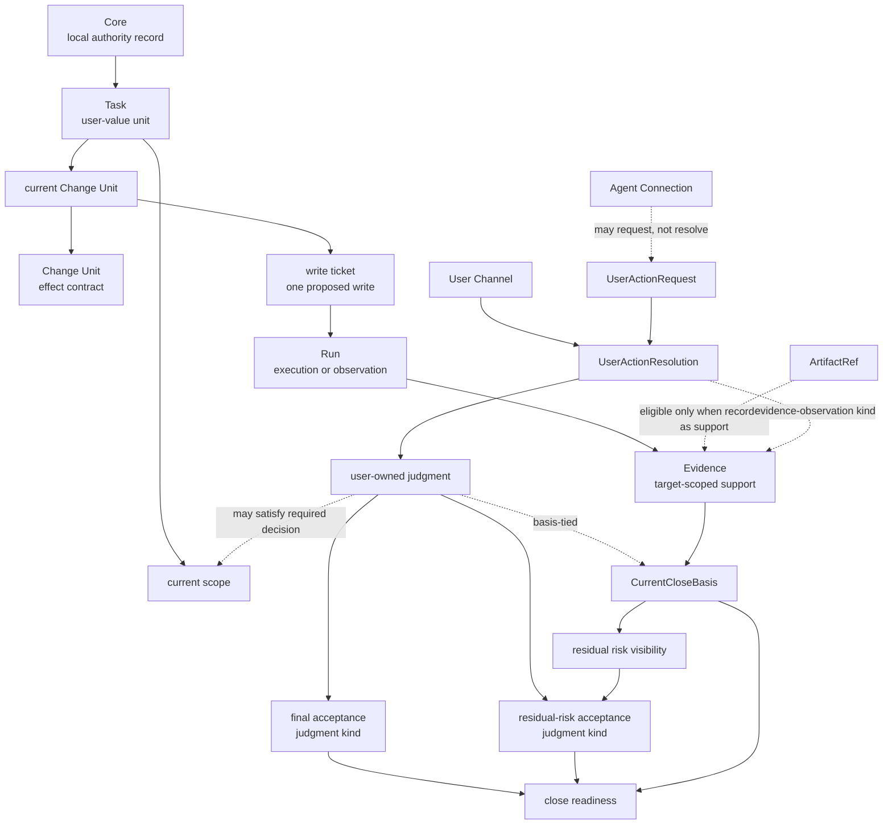
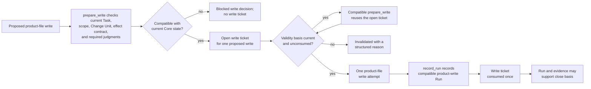

# Core model reference

This reference owns the Core authority model for Volicord state. It defines the
relationships among Core, a `Task`, a Change Unit, a Change Unit effect
contract, user-owned judgment, evidence, artifact references, write tickets,
close readiness, blockers, acceptance, and residual risk.

Core is the local authority record for Volicord state. It is not chat memory, generated Markdown, a status report, a tutorial, a storage layout, or an API response shape.

## 1. Owner boundary

This document owns:

- authority relationships among Core concepts
- non-substitution rules for judgment, evidence, acceptance, risk, write ticket, and close
- the product meaning of `Task`, Change Unit, Change Unit effect contract, user-owned judgment, evidence, close readiness, blockers, write ticket, final acceptance, and residual-risk acceptance
- conceptual lifecycle and authority-check boundaries

This document does not own:

- API request fields, response branches, schema shapes, exact value sets, or method behavior
- storage records, DDL, state-version effects, artifact bytes, locks, schema initialization, or persistence layout
- rendered projection bodies, template text, display labels, or user workflow instructions
- security guarantee wording, access-boundary claims, or out-of-scope capability catalogs

When this page names an exact identifier, it names the authority concept only. The linked owner documents define wire shape, method behavior, storage effect, display text, security wording, and exact values.

## 2. Authority invariants

Core-owned state is authority.

- Core state is the local record Volicord authority checks use to decide current scope, required judgment, evidence support, write compatibility, blockers, close readiness, and residual risk.
- Chat, reports, generated Markdown, projections, template output, and summaries can describe Core state, but they do not replace it.

Volicord governs Volicord records.

- Core authority applies to Volicord records and Volicord state transitions.
- It is not a general security-control layer and does not claim OS-level enforcement.

Scope bounds work.

- A `Task` defines the user-value unit. A Change Unit defines the current write-capable work boundary inside that `Task`.
- A Task's durable `work_phase` distinguishes shaping from implementation
  without fragmenting one user outcome. A predecessor edge connects deliberate
  follow-up Tasks without making predecessor authority current.
- Product-file writes, evidence claims, final acceptance, and close claims must stay compatible with the current scope and current Change Unit.
- A Change Unit effect contract can further constrain compatible effects, paths, expected outputs, invariants, evidence expectations, or sensitive-action expectations for the current Change Unit.
- A resolved scope judgment does not silently mutate current scope; current scope must be updated through the scope owner-defined transition.

User-owned judgment stays user-owned.

- Core must ask for or preserve a user-owned judgment instead of inferring it from agent confidence, broad approval, evidence, display text, or a generated summary.
- One user answer can satisfy multiple authority needs only when those distinct questions were made visible and the recorded judgment remains compatible with each affected object, scope, consequence, and close or write impact.
- A recorded response is not automatically approval. Judgment lifecycle status and resolution outcome are separate: `status=resolved` means an answer was recorded, while only `resolution_outcome=accepted` can satisfy an authority-bearing requirement.

Write ticket is narrow.

- A write ticket records authorized write intent for one state-bound product-file change or one exact approval-bound non-product action under effective `sensitive` control. Repeating `prepare_write` may reuse the same compatible unconsumed ticket; sensitive reuse also requires the exact operation and approval-resolution identity, and reuse does not widen paths, approvals, or authority.
- Ticket validity depends on the current Task, Change Unit, `scope_revision`, baseline, workspace binding, normalized current project write-authority fingerprint, approval basis, explicit revocation state, and an optional policy-selected idle timeout. An active ticket with a missing or different policy binding is unusable and must be reissued; consumed historical tickets remain inspectable. An unrelated `state_version` change is not an invalidation condition.
- It is not reusable scope, ordinary write approval, command approval, shell permission, sensitive-action approval, user-owned judgment, OS permission, deployment approval, final acceptance, residual-risk acceptance, evidence, or proof that the write occurred.

Runs and evidence record support, not authority substitutes.

- A Run records execution or observation. Evidence records support only the claims, scope, and context they actually record.
- A Run, log, screenshot, artifact, or `ArtifactRef` does not retroactively create missing scope, missing judgment, missing approval, or missing write ticket.

Close must stay honest.

- Close readiness asks whether the current `Task` can close without hiding unresolved owner-defined requirements.
- If close-relevant blockers remain, Core must expose blockers instead of treating the `Task` as successfully complete.

Acceptance and risk acceptance are specific.

- Final acceptance is the user's judgment of the visible close basis.
- Whether final acceptance is required is derived from the Task's effective
  control level, its recorded acceptance policy, and the authoritative project
  workflow policy. It is never an agent-selected close waiver.
- Residual-risk acceptance is the user's acceptance of named visible residual risk for the requested close.
- Neither fills evidence gaps, changes scope, grants write authority, proves verification, or makes the result risk-free.

Scope and close-basis revisions are internal current-state coordinates.

- Every `Task` has a `scope_revision` and a `close_basis_revision`.
- Material current-scope or current Change Unit changes increment `scope_revision`; semantically identical normalized updates do not.
- A committed Run recording increments `close_basis_revision`. A material scope change also invalidates the current close basis and increments `close_basis_revision`.
- Recording a user-owned judgment does not increment either revision.
- Callers do not choose these revisions, and a revision value is not authority by itself.

Project time is Core-owned.

- The canonical Core UTC clock is project-scoped and non-decreasing. Temporal
  authority checks must not substitute a host clock, caller timestamp, or
  observation timestamp for it.
- After common preflight, one prepared Core operation samples current project
  time exactly once and reuses that `operation_now` for all current-time
  decisions and owner-defined semantic operation timestamps. This prevents one
  operation from changing meaning merely because time advanced between checks.
- The canonical UTC clock and `project_state.state_version` are distinct.
  `state_version` orders authority-state transitions and supplies conflict
  coordinates; project time supplies temporal-authority ordering. Neither is a
  substitute for the other.
- Owner-verified `occurred_at`, `observed_at`, `started_at`, and similar values
  can preserve source observation facts. They do not move the canonical clock
  backward or become its input merely because Core records them.
- A custom or injected Clock may replace the live-time source but cannot bypass
  the persisted project floor or a later sample already accepted by the same
  Store handle. Core's service boundary preserves those lower bounds.
- Derived deadlines require checked addition and a representable canonical UTC
  timestamp. An overflow is a rejected operation, not an infinite or wrapped
  deadline.

[Storage Versioning](storage-versioning.md#canonical-core-utc-clock) owns the
persisted floor, commit-time, bootstrap, and no-effect rules.

### Concept relationship map

This map shows which Core concepts depend on, qualify, or remain separate from
each other. Arrows show conceptual authority dependency, containment, or
eligibility; they do not show execution order, storage ownership, API shape, or
automatic sufficiency. Solid arrows mark direct concept relationships. Dotted
arrows mark conditional eligibility or request boundaries.

```mermaid
flowchart TD
    Core["Core<br/>local authority record"] --> Task["Task<br/>user-value unit"]
    Task --> Scope["current scope"]
    Task --> ChangeUnit["current Change Unit"]
    ChangeUnit --> EffectContract["Change Unit<br/>effect contract"]
    ChangeUnit --> WriteTicket["write ticket<br/>one proposed write"]
    WriteTicket --> Run["Run<br/>execution or observation"]
    Run --> Evidence["Evidence<br/>target-scoped support"]
    ArtifactRef["ArtifactRef"] -. "eligible only when recorded as support" .-> Evidence
    AgentConnection["Agent Connection"] -. "may request, not resolve" .-> UserAction["UserActionRequest"]
    UserChannel["User Channel"] --> Resolution["UserActionResolution"]
    UserAction --> Resolution
    Resolution --> Judgment["user-owned judgment"]
    Resolution -. "evidence-observation kind" .-> Evidence
    Judgment -. "may satisfy required decision" .-> Scope
    Judgment -. "basis-tied" .-> CloseBasis["CurrentCloseBasis"]
    Evidence --> CloseBasis
    Judgment --> FinalAcceptance["final acceptance<br/>judgment kind"]
    Judgment --> RiskAcceptance["residual-risk acceptance<br/>judgment kind"]
    CloseBasis --> ResidualRisk["residual risk visibility"]
    ResidualRisk --> RiskAcceptance
    FinalAcceptance --> CloseReadiness
    RiskAcceptance --> CloseReadiness
    CloseBasis --> CloseReadiness["close readiness"]
```

Read the map with the owner boundary above. An artifact is not evidence unless
the relevant owners allow and record that use. Final acceptance and
residual-risk acceptance are judgment-shaped user action resolutions, evidence
observation stays separate, and close readiness remains
decision support rather than proof of correctness.

## 3. Core Concepts

### Core

Core is the local authority record for Volicord state within a project. It records current authority state and applies changes through owner-defined transitions.

Core authority is about Volicord records. Security guarantee levels, local connection posture, and stronger isolation non-claims belong to [Security](security.md).

### `Task`

A `Task` is the user-value unit being shaped, executed, blocked, or closed.

A `Task` owns the main work path for scope, Change Units, required judgments, verification criteria, evidence support, close readiness, final outcome, and residual risk. Exact lifecycle values and state fields belong to the API state and value-set owners.

Its `work_phase` keeps long-lived outcome and current delivery step separate.
Its optional lineage records one predecessor, a relation and creation reason,
and explicit carry-forward dispositions. Applied scope-like material is
revalidated as new Task input; decisions, limitations, obligations, and risks
remain reference-only unless a current owner-defined transition establishes new
authority.

Its `acceptance_policy` and reason own whether the final-acceptance check is
required, not required under the effective control-level policy, or evaluated
from current close policy.

Every `Task` also records `requested_control_level`, `effective_control_level`,
and `control_level_reason`. `requested_control_level` is one of `auto`,
`observe`, `light`, `tracked`, or `sensitive`; the effective value is one of
`observe`, `light`, `tracked`, or `sensitive`. These values are distinct from
the Record integration profile used by Agent Connections.

Core resolves control as follows:

- `advisor` permits only `observe`.
- `direct` starts from the authoritative project-policy default; `work` starts
  from at least `tracked`.
- The project minimum wins over a lower caller request. `light` is available
  only when project policy explicitly enables it and authorizes the affected
  normalized repository-relative path prefixes. Each prefix means the exact
  path or a descendant; wildcard and glob grammar is not supported. Absolute,
  empty, `..`-containing, or otherwise ambiguous entries are invalid, an empty
  allowed-prefix set authorizes no product-file write, and a denied prefix
  always wins.
- A sensitive category, denied or protected path, secret access, external
  transmission, destructive operation, or another owner-defined sensitive
  effect raises the effective level to `sensitive`.
- Core never automatically lowers an active Task. Relaxed minimum levels apply
  automatically to new Tasks, while an active Task keeps its stronger persisted
  requirements. Every normalized write-authority change marks an active Task
  for reevaluation, even when control and final-acceptance ranks do not rise.
  Core reevaluates current policy and raises the Task when needed before the
  next write-compatible operation.
- The durable mark is the closed `policy_control_reevaluation` member of
  `tasks.metadata_json`: `{policy_version, policy_fingerprint,
  required_effective_control_level, required_acceptance_policy?, marked_at}`.
  The optional acceptance requirement is one of `not_required`,
  `policy_dependent`, or `required`. A later policy application merges both
  requirements upward by their ranks and never replaces a stronger pending
  requirement with a weaker one. The Store clears the mark only in the same
  transaction that reevaluates current policy and satisfies both marked levels.
  It is not a second policy authority or permission to write. When normalized
  write authority changes, the policy commit atomically invalidates with
  `explicit_revoke` every active ticket with a missing or different binding and
  every active ticket for the marked Task; Core treats any remaining active
  ticket with a missing binding as unusable and requires `volicord.prepare_write`.
  A normalized-equivalent write authority preserves compatible tickets.
  Status, Intake resume, UpdateScope, RecordRun, and CloseTask resolve the
  strongest persisted, current-policy, and marked requirements consistently.

### Change Unit

A Change Unit is the currently applied work boundary for write-capable work inside a `Task`.

It defines what the current work may change and what must stay outside the current work. It is not final acceptance, evidence, broad approval, or permission to widen scope silently.

### Change Unit effect contract

A Change Unit effect contract is optional Core state attached to a current Change Unit. It expresses additional allowed effects, forbidden effects, allowed paths, expected outputs, invariants, evidence expectations, and sensitive-action expectations.

For product-file writes, the effect contract can narrow what `prepare_write` may mark compatible when it restricts product-file effects or paths. It is not a workflow engine, methodology phase, command interceptor, network blocker, OS sandbox, secret-control mechanism, user-owned judgment, sensitive-action approval, evidence, write ticket, final acceptance, close readiness, or residual-risk acceptance.

### Autonomy Boundary

An Autonomy Boundary is the agent latitude inside the current Change Unit.

It does not allow scope expansion, sensitive-action approval, user-owned judgment, or write-ticket authority by inference.

### User-owned judgment

User-owned judgment is the boundary where the user owns the decision. Core may record the judgment, but it must not invent it.

User-owned judgment can concern product direction, technical direction, scope, a sensitive step, final acceptance, residual-risk acceptance, or cancellation. Exact judgment schema fields and value names belong to API schema and value-set owners.

### Task mode, work phase, and Run compatibility

The concrete `Task.mode` and `work_phase` jointly limit which Run kind can
represent the current step:

| `Task.mode` | `work_phase` | Compatible Run kind |
|---|---|---|
| `advisor` | `shaping` | `shaping_update` |
| `direct` | `implementation` | `direct` |
| `work` | `shaping` | `shaping_update` |
| `work` | `implementation` | `implementation` |

`advisor` is read-only with respect to Product Repository file effects. It does not authorize product-file writes or write-ticket issuance, while a compatible `shaping_update` call to `record_run` still commits the Run and any method-owned Core evidence state. A successful `intent=complete` terminal transition records `Task.result=advice_only` for `advisor`; the same successful completion path records `Task.result=completed` for `direct` and `work`. Mode compatibility does not by itself satisfy or waive evidence, final-acceptance, residual-risk, or other close-readiness requirements.

### Run

A Run records an execution or observation with the available context and references.

It can support evidence and close-readiness review. It cannot approve missing preconditions after the fact.

### Evidence

Evidence is recorded support for a stable evidence target at a specific scope.

An evidence target is either a Core-generated `AcceptanceCriterionId` for one
current or retired `Task` acceptance criterion, or a caller-assigned
Task-scoped `EvidenceClaimId` whose supplemental claim statement is immutable.
Updating a current criterion statement or evidence requirement while retaining
its ID keeps the criterion identity, but the resulting scope revision makes
coverage from the earlier scope stale.
Display text is not target identity. Evidence can show that a named test ran, a
named output was observed, or a recorded artifact supports the selected target.
It is not broad correctness, final acceptance, residual-risk acceptance, or
separate QA or verification unless the relevant owners define that path.

### `ArtifactRef`

`ArtifactRef` is a public pointer to a registered persistent artifact.

Core may treat an artifact reference as evidence-eligible only when the artifact owners allow that use. The reference itself does not prove readable bytes, content sufficiency, safety, or integrity beyond the facts recorded by artifact owners.

### Write ticket

Write ticket is the named durable Core authority record for authorized write intent for one proposed product-file change or one exact approval-bound non-product action under effective `sensitive` control.

It depends on current Core state, current scope, current Change Unit compatibility, required user-owned judgments, and write-ticket compatibility rules.

Its exact method behavior, API shape, storage effect, and stale-state handling belong to their owners.

### Blocker

A blocker is a structured reason that progress, write preparation, Run recording, or close cannot proceed honestly.

A close blocker is the close-relevant form: it prevents honest close readiness until the responsible owner-defined authority condition is resolved. A blocker is not projection prose, broad approval, storage proof by itself, or a successful-looking close.

### Close readiness

Close readiness is the Core authority concept for whether the current `Task`
can close honestly.

It is a record-based readiness decision, not proof that the product result is objectively correct.

It combines the current work boundary with judgment, write, Run, evidence,
artifact, blocker, acceptance, residual-risk, recovery, and project-continuity
facts. Section 10 lists the close inputs in detail.

### Authority receipt

An authority receipt is a compact Core-generated view of one freshly read
project state version. It binds the current `Task` and Change Unit, scope
revision, latest Run and observed product-file-write fact, evidence gate, full
close-blocker set, `completion_claim_allowed`, and next actor/action. The
completion field is true only when the current Task has a valid completion
basis and the full close-readiness evaluation has no blocker; it is false when
there is no current Task or authority state cannot be refreshed. It lets a host report recorded state
without reconstructing authority in prose. A receipt is derived state: it does
not itself commit, accept, close, or prove correctness, and a host must refresh
it after a mutation before making a completion or blocked claim.

### Current close basis

`CurrentCloseBasis` is the current result and risk state used for close-readiness
decisions. It contains:

- the current `Task`, current Change Unit, `scope_revision`,
  `close_basis_revision`, and baseline
- the result summary, result references, and evidence-summary reference
- residual risks, sensitive categories, sensitive-action requirements, and
  recovery constraints
- the source Run reference and update time

`CurrentCloseBasis` is pre-close authority input. A successful terminal close may produce a terminal close summary, but that terminal summary is not the current pre-close basis and must not be used to recreate one for an open `Task`.

### Final acceptance

Final acceptance is a user-owned judgment that the visible close basis is acceptable for the requested close.

It does not create evidence, approve sensitive action, change scope, accept residual risk, waive blockers, or prove verification.

### Residual risk

Residual risk is known remaining uncertainty, an unchecked condition, limitation, or trade-off that matters to close.

Residual-risk acceptance applies only to the named visible risk for the requested close. Each current residual risk has an opaque Core-generated `risk_id`; display text is not authoritative identity. Residual-risk acceptance does not cover all unknowns, replace evidence, replace final acceptance, or make the result risk-free.

### Project continuity record

A project continuity record is durable project-level context that can preserve an important decision, obligation, known limit, accepted residual risk, or constraint after the source `Task` closes.

It helps future work notice prior commitments and limits. It does not make a previous `Task`, Change Unit, close basis, acceptance, residual-risk acceptance, evidence set, or write ticket current again.

Current authority for a future operation still comes from the current `Task`, current Change Unit, current scope and close-basis revisions, compatible user-owned judgments, current evidence and artifact facts, current blockers, and method-specific owner rules.

### Derived display

Projection output, template output, status cards, summaries, and reports are derived display. They can help a reader see Core state, but they do not become Core authority, evidence, acceptance, or risk acceptance.

## 4. User actions and user-owned judgment

Core preserves the boundary between what the agent may decide and what the user must decide.

Every supported user-owned act uses one Core-owned `UserActionRequest` and at
most one immutable `UserActionResolution`. The closed kinds are the seven
judgment kinds below and `evidence_observation`. A shared lifecycle does not
collapse their meanings: judgment options can carry decision authority, while
an evidence-observation resolution carries only target relevance for exact
stored artifacts and current basis.

A judgment is user-owned when it changes or accepts a user-visible product outcome, a material technical direction, current scope, a named sensitive step, final acceptance, residual risk, or cancellation.

Product decisions include user-visible behavior, user flow, copy, UX, accessibility, release promises, product trade-offs, and user value.

Technical decisions include architecture, dependency or external service introduction, authentication direction, migration, public interface changes, compatibility breaks, data retention, privacy, security, and other costly-to-reverse technical directions.

Scope decisions include scope expansion, non-goal removal, Change Unit boundary changes, and Autonomy Boundary changes.

Sensitive-action approval is permission for a named sensitive step inside a bounded `SensitiveActionScope`. It is not write ticket, security authority, product correctness, or final acceptance.

Final acceptance is the user's result judgment for the visible close basis.

Residual-risk acceptance is the user's acceptance of a named visible residual risk for the requested close.

Cancellation is a user-owned decision to stop the `Task` without a successful completed result.

Authority-bearing judgment kinds are scope decision, sensitive approval, final
acceptance, residual-risk acceptance, and cancellation. These judgments require
a selected Core-created authority option, a stored `machine_action` that maps
to `resolution_outcome=accepted`, a compatible current basis, and
`resolved_by_actor_source=local_user` provenance recorded through the
`User Channel`.

Rejected or deferred outcomes remain durable user decisions. They do not
approve, accept, authorize, waive, or close anything. A resolved judgment is
invalid owner state when it lacks a machine-readable action or outcome,
resolution payload, timestamp, compatible basis, or required `User Channel`
provenance. Invalid owner state cannot satisfy a current authority requirement.

Agent Connections may create a user-action request through
`volicord.request_user_action`, but they cannot resolve any user action.
`volicord.resolve_user_action` is the only resolution transition and requires
verified `local_user` provenance through the `User Channel`.

For authority-bearing prompts, callers do not define visible-label-to-machine-outcome mappings. Core creates the canonical authority options: `machine_action=accept` maps to `resolution_outcome=accepted`, `machine_action=reject` maps to `resolution_outcome=rejected`, and `machine_action=defer` maps to `resolution_outcome=deferred` only where the method or semantic owner permits deferral. `blocked` is not a judgment resolution outcome. Core also creates localized labels and consequences; labels, explanatory text, free-form notes, or answer-payload prose are display-only and must not invert the selected option's machine-readable action or outcome.

Core creates one basis snapshot and one closed capture form for each stored
user-action request. A choice basis ties the request to the current `Task`,
Change Unit when applicable, `scope_revision`, close-basis revision when
applicable, baseline, result references, named residual-risk IDs,
sensitive-action scope when applicable, and creation state version. An
evidence-observation basis additionally binds the current target candidates and
exact canonical artifact candidates. Callers do not submit revisions,
canonical basis coordinates, or capture time.

One canonical evaluator derives effective request status from immutable
resolution presence, basis compatibility, and the operation's one canonical
Core-time sample. An unanswered
incompatible request is `superseded`; a resolved request becomes `stale` when
its basis no longer matches; only an otherwise-pending request can be
`expired`. Reads do not persist a state change merely to observe time-based
expiry.

User-action compatibility:

- Final acceptance must match the current `Task`, current Change Unit, `scope_revision`, `close_basis_revision`, baseline, and result references.
- Residual-risk acceptance must match the current `close_basis_revision` and exact current `risk_id` values.
- Sensitive-action approval must match the current `scope_revision`, current Change Unit, operation, normalized paths (an empty set for an exact non-product action), sensitive categories, baseline, and Change Unit-linked sensitive action requirement. An effective `sensitive` Task cannot close until a consumed ticket has preserved that exact requirement; Task control alone is not an approval basis.
- Scope decision authority for a scope update must have `judgment_kind=scope_decision`, `status=resolved`, `machine_action=accept`, `resolution_outcome=accepted`, a current basis, `required_for` that includes scope update, `actor_source=local_user` from the `User Channel`, and compatible `Task`, Change Unit, `scope_revision`, and affected refs. Rejected, deferred, stale, superseded, expired, judgments with invalid basis state, or agent-recorded scope decisions do not authorize a scope transition.
- Cancellation authority must have `machine_action=accept`, `resolution_outcome=accepted`, and match the current `Task`, current scope revision, current Change Unit, and `actor_source=local_user` from the `User Channel`. Rejected, deferred, stale, superseded, judgments with invalid basis state, or agent-recorded cancellation judgments do not permit cancellation.
- A scope decision records the user's decision but does not mutate current scope by itself.
- A stale, superseded, or expired request cannot be resolved successfully.
- Scope changes and Run changes do not delete historical requests or
  resolutions; they make incompatible resolutions ineligible for current
  close, write, evidence, or sensitive-approval requirements.

Requests without a stored basis or closed capture form are invalid owner state.
One request can have at most one immutable resolution, and replay or concurrent
submission cannot fork that result.

For `evidence_observation`, the user chooses one stored target candidate, a
non-empty subset of stored artifact candidates, and `supported` or
`contradicted`. Core records current capture time. The resolution does not
create a Run, update evidence coverage, prove artifact origin, or become final
acceptance. A later `record_run` must reference its exact resolution ref and
selected artifacts.

Pending-user-action relevance:

- A pending user-action request blocks an operation only when it is current and pending, its `required_for` operation target includes that operation, its action kind is relevant to that operation, and its `Task`, Change Unit, affected refs, and basis are compatible.
- Sensitive approval questions block only when they overlap the current sensitive action requirement.
- Informational requests do not block write, Run recording, or close by themselves.
- A current non-terminal `Task` uses the `waiting_user` lifecycle phase while it has an effective pending user-action request with a current compatible basis and at least one non-informational `required_for` target that still needs user input. A non-current `Task` is not moved to `waiting_user` by this rule.
- This waiting rule is separate from the authority-option classification above: `product_decision` and `technical_decision` requests also keep the `Task` waiting when they have a current compatible basis and a non-informational `required_for` target.
- Informational requests and requests with stale, superseded, expired, or resolved effective status do not put or keep a `Task` in `waiting_user`; any other current compatible pending request that meets this rule still does.
- When the last request that keeps the current `Task` waiting is resolved or made non-current, the lifecycle returns to `ready` when a current Change Unit exists and to `shaping` otherwise. Terminal lifecycle phases take precedence and are never reopened by user-action lifecycle maintenance.

Agent latitude:

- Inside accepted scope and acceptance criteria, the agent may choose ordinary implementation details that do not change product behavior, material technical direction, scope, security or privacy posture, compatibility, or costly-to-reverse architecture.
- The agent may treat "go ahead", "looks good", or similar broad language as another judgment kind only when the prompt made that distinct judgment visible and Core records it compatibly.
- The agent must not treat broad language alone as another judgment kind.

## 5. Non-substitution rules

Generated text does not substitute for Core state.

- Chat, reports, generated Markdown, projection prose, status cards, and template bodies are not authority records.

Evidence does not substitute for user judgment.

- Evidence, logs, screenshots, artifacts, `ArtifactRef` values, and Run records do not replace final acceptance, residual-risk acceptance, sensitive-action approval, scope decisions, or other user-owned judgments.

User judgment does not substitute for evidence.

- Final acceptance, residual-risk acceptance, sensitive-action approval, and broad approval do not create missing evidence, prove correctness, satisfy separate verification, or make a close blocker disappear.

Recorded judgment status does not substitute for accepted outcome.

- `status=resolved` records that an answer exists. It does not by itself create final acceptance, residual-risk acceptance, sensitive approval, cancellation authority, or any other approval.

Sensitive-action approval does not substitute for write ticket.

- Sensitive-action approval authorizes the named sensitive step the user was asked about. It does not authorize product-file writes, commands, hosts, network, secrets, deployments, destructive operations, or final acceptance.

Change Unit effect contracts do not substitute for authority records.

- An effect contract can constrain compatible Core write-ticket decisions for the current Change Unit. It does not create user-owned judgment, sensitive-action approval, evidence, write ticket, final acceptance, close readiness, residual-risk acceptance, command interception, network blocking, OS sandboxing, or secret isolation.

Write ticket does not substitute for acceptance.

- A write ticket records one bounded product-file write intent or, for an effective `sensitive` Task, one exact approval-bound non-product action intent inside Volicord state. It does not prove the effect occurred, record evidence, accept the result, accept risk, close the `Task`, grant system access, or prevent filesystem or external effects.
- Conversely, final acceptance recorded after work does not supply a missing
  pre-write sensitive-action approval or write ticket and cannot retroactively
  authorize the write.

Blocker data does not substitute across authority questions.

- A prepare-write decision reason and a close blocker answer different authority questions.
- `CloseReadinessBlocker` is an API data representation for close blocking reasons. It is not the whole close-readiness concept and does not prove persistence by itself.

A waiver or accepted risk does not create automatic success.

- A waiver can matter only for the named requirement and only where the responsible owner allows it.
- Accepted risk does not replace evidence, final acceptance, verification, or remaining requirements for close.

## 6. Task lifecycle

The lifecycle here is conceptual authority meaning, not an API state table.

| Area | Authority meaning |
|---|---|
| Intake and shaping | User intent becomes a concrete goal, scope boundary, non-goals, acceptance criteria, Autonomy Boundary, and first safe Change Unit when the relevant owners define support. |
| Work phase | Advisor and ordinary work begin in shaping; direct work begins in implementation. Creating or replacing the current Change Unit advances ordinary work to implementation. Core rejects a Run kind or write preparation that does not match the current phase. |
| Lineage and carry-forward | A new Task may name one predecessor and explicitly select compatible material. Applied material is validated as new input; reference-only context never revives predecessor authority. |
| Scope update | Accepted scope or Change Unit changes become currently applied only through the scope owner-defined transition. A judgment record alone does not mutate current scope. |
| Execution and observation | Runs record actions and observations. Product-file writes must be compatible with current scope and a write ticket; read-only work does not create compatibility for subsequent writes. |
| Waiting or blocked | A current non-terminal `Task` is `waiting_user` while a current compatible pending user-action request with a non-informational operation target requires a user answer. When the last such request is resolved or made non-current, the `Task` returns to `ready` if it has a current Change Unit and to `shaping` otherwise. Other missing, stale, incompatible, or unsafe-to-bypass authority data remains visible through owner-defined blocker state rather than being hidden. |
| Close attempt | Core evaluates whether the current state can close honestly. A final chat summary or generated report is not enough by itself. |
| Terminal outcome | Completion, cancellation, or supersession ends the `Task` path. Cancellation and supersession are terminal, but they are not successful completion and do not satisfy completion evidence, acceptance, or risk requirements. |

## 7. Authority checks

Authority checks summarize whether a Core action or close claim can proceed honestly. Public fields, exact values, response branches, and method behavior belong to API owners.

| Check area | Authority meaning |
|---|---|
| Agent session | An Agent Connection call requires a current validated managed-host runtime/project session. Its Connection must match `ActorSource::AgentConnection`, its project must match the project-scoped operation, its integration revisions must be current, and the Connection mode must allow the operation category. This proves locally observed cooperative session ownership and project authorization, not binary, actor, or human identity. |
| Scope | The requested work, write, evidence claim, or close claim must fit the current `Task` scope and current Change Unit. |
| Task control | The effective control level must be current for the authoritative project policy. A changed normalized write-authority fingerprint marks the active Task for reevaluation and makes missing or mismatched active ticket bindings stale even when the control and final-acceptance ranks do not rise. A stricter policy can also raise the active Task before its next write, while policy relaxation never lowers it automatically. |
| Workspace | For a Git-bound Change Unit, write preparation must match the recorded common directory, worktree identity, branch or detached HEAD, HEAD SHA, and workspace fingerprint. A mismatch requires explicit retarget/rebaseline. |
| Change Unit effect contract | When present, requested product-file write effects and paths must fit the current Change Unit effect contract before a write ticket can be issued. |
| User-owned judgment | Required product, technical, scope, sensitive-action, final-acceptance, residual-risk, or cancellation judgment must be resolved by the user with the required stored outcome and compatible with the affected object and consequence. |
| Sensitive action | A named sensitive step must have its own compatible user approval when that approval is required. |
| Write compatibility | A product-file write attempt, and an exact non-product action under effective `sensitive` control, must be compatible with current scope and an open write ticket bound to the current normalized project write authority. |
| Run and evidence | Recorded Runs, evidence summaries, and evidence-eligible artifacts must support the claims they are used for. |
| Final acceptance | Effective control and the Task-owned acceptance policy determine whether final acceptance is required; when required, it must be tied to the visible close basis. |
| Residual risk | Known close-relevant residual risk must be visible, and required risk acceptance must be compatible with the requested close. |
| Close readiness | All close-relevant owner-defined requirements must support an honest terminal transition; remaining blockers keep the `Task` open. |

Separate QA and external verification workflows are not separate baseline authority records unless [Scope](scope.md) and the affected owners define them as supported.

## 8. Write ticket

A write ticket is a durable Core authority record for authorized write intent for one proposed product-file change or one exact approval-bound non-product action under effective `sensitive` control.

It has these compatibility properties:

- Scope-limited: it covers only its authorized path set and effect basis, not a broader project area.
- State-bound: its validity basis is the exact Task, current Change Unit,
  `scope_revision`, baseline, workspace binding, current normalized project
  write-authority fingerprint, and approval-basis refs. Its issuance
  `basis_state_version` is audit ordering only. A missing or mismatched binding
  makes an active ticket unusable without hiding consumed history.
- Policy-bound: the fingerprint is the `sha256:`-prefixed canonical-JSON SHA-256
  of exactly
  `{schema:"volicord.write_authority",default_direct_control,default_work_control,light:{enabled,max_intended_paths,allowed_path_patterns,denied_path_patterns,final_acceptance},write_ticket:{idle_timeout_minutes}}`.
  The two pattern arrays are sorted and deduplicated first. This normalized
  fingerprint is narrower than the whole canonical-policy
  `policy_fingerprint`; every other policy field is excluded.
- Reusable before consumption: a compatible active ticket may satisfy a later
  `prepare_write` when it covers every newly intended path and has the same or
  stronger sensitive basis. Sensitive reuse also requires the exact normalized
  operation and matching approval-resolution identity. Reuse does not create
  another ticket.
- Effect-contract-bound when present: it is created only when the proposed product-file change fits the current Change Unit effect contract.
- Single-use: one compatible product-write Run or exact approval-bound
  non-product sensitive Run consumes it once.
- Explicitly invalidated: Task close or replacement, Change Unit or scope
  revision change, baseline or relevant workspace change, approval-basis
  revocation/expiry/replacement, a normalized write-authority change, explicit
  revoke, or the policy's optional idle timeout invalidates it with a structured
  reason. There is no default timeout. Canonically different policy input with
  normalized-equivalent write authority does not invalidate it solely because
  policy apply ran.
- Unrelated reads, evidence recording, diagnostics, user actions, blocked
  prepare-write attempts, and unrelated global state changes do not invalidate
  it.
- Cooperative: it tells an Agent Connection what is authorized inside Volicord state; it does not claim OS-level prevention, filesystem interception, or sandboxing.

This lifecycle diagram shows authority eligibility for a write ticket. Arrows
are conceptual transitions and invalidation paths, not exact API response
branches, storage rows, hook behavior, or filesystem enforcement.

```mermaid
flowchart LR
  proposed["Proposed product-file write"]
  prepare["prepare_write checks current Task,<br/>scope, Change Unit, effect contract,<br/>and required judgments"]
  compatible{"Compatible with<br/>current Core state?"}
  blocked["Blocked write decision;<br/>no write ticket"]
  open["Open write ticket<br/>for one proposed write"]
  still{"Validity basis current<br/>and unconsumed?"}
  reused["Compatible prepare_write<br/>reuses the open ticket"]
  invalid["Invalidated with a<br/>structured reason"]
  attempt["One product-file<br/>write attempt"]
  run["record_run records<br/>compatible product-write Run"]
  consumed["Write ticket<br/>consumed once"]
  evidence["Run and evidence may<br/>support close basis"]

  proposed --> prepare --> compatible
  compatible -- no --> blocked
  compatible -- yes --> open --> still
  still -- no --> invalid
  still -- yes --> reused --> still
  still -- yes --> attempt --> run --> consumed --> evidence
```

It does not approve commands, dependencies, sensitive actions, deployments,
destructive actions, or access to a shell, OS, host, network, secret, or system.
It is also not ordinary write approval, user-owned judgment, evidence, final
acceptance, residual-risk acceptance, proof that a write happened, or `Task`
close.

The prepare-write, record-run, API state schema, storage, and security owners define the method behavior, public shapes, storage effects, replay and stale-state behavior, and guarantee wording.

`observe` Tasks require `acceptance_policy=not_required` and cannot record a
product-file write. `light` permits `policy_dependent`, and permits
`not_required` only when authoritative project policy explicitly allows it.
`tracked` requires final acceptance in the baseline policy. `sensitive` always
requires both its compatible sensitive-action approval and final acceptance.

A `light` Task with `policy_dependent` may complete without final acceptance
only when policy explicitly allows low-risk automatic completion, required
evidence is sufficient, no user action or acceptance-requiring residual risk is
pending, no sensitive/secret/external-network effect exists, no confirmed
Unrecorded Change exists, actual paths fit the consumed ticket, scope has not
expanded since the first write, the Change Unit and baseline remain unchanged,
and no Run or verification failure remains unresolved. Failure of any condition
keeps the applicable close blocker; it never creates an inferred user answer.

## 9. Evidence and Run authority

Evidence authority is scoped to recorded target identity.

Run authority:

- A Run can establish that an execution or observation was recorded with the available context and references.
- A Run cannot establish that a missing write ticket, missing judgment, missing approval, or missing compatibility record existed retroactively.

Evidence authority:

- Each acceptance criterion has a stable Core-generated `AcceptanceCriterionId`,
  an editable statement, and an `EvidenceRequirement` of `required`, `optional`,
  or `not_required`. Replacing the current criterion set preserves explicitly
  selected IDs from the same `Task`, generates IDs for new entries, and retires omitted
  entries. A retired criterion is history, not current close authority.
- Supplemental evidence uses a caller-assigned Task-scoped `EvidenceClaimId`
  and immutable statement. It can preserve useful support but never becomes a
  required close criterion by caller assertion.
- Evidence can establish that recorded support exists for the selected target,
  gap, Run, observation, or artifact.
- Only current acceptance criteria whose `EvidenceRequirement=required` can
  block close for missing, stale, contradicted, partial, unsupported, or
  provenance-insufficient evidence. `optional`, `not_required`, supplemental,
  and retired targets remain non-authoritative for close.
- Core derives one `EvidenceGateSummary` from the active criterion requirements
  and coverage plus canonical observation freshness, provenance, artifact
  availability, and evidence-related close blockers. Close policy, status and
  close results, nested `StateSummary`, and `SummaryCard` reuse that projection;
  none is a second evidence-sufficiency evaluator. The summary is not a durable
  authority record and adds no storage table or `AuthorityReceipt`.
- A required criterion cannot be recorded as `not_applicable`. Close evidence
  support requires target-matching observation provenance that remains current
  for the close basis when the close owner requires evidence. Coverage without
  current observation provenance is not sufficient by itself.
- Evidence assurance is Core-derived rather than caller-granted. A valid
  request-side `source_kind` / `assurance_level` pair is only a provenance claim.
  The baseline direct `record_run` path downgrades unanchored external-tool,
  connection, user, and caller-declared reuse claims to a cooperative agent
  report. It derives an authority-backed observer from the producer record and
  otherwise uses the verified invocation.
- Evidence evaluates byte integrity, producer provenance, Task/scope/baseline
  freshness, target identity, and claim relevance as separate axes. Strong
  evidence requires every applicable axis; artifact integrity alone is never
  producer or relevance proof.
- The common `user_only` `volicord.resolve_user_action` transition records an
  immutable `evidence_observation` `UserActionResolution` only for a pending
  Core-derived capture form. It binds local-user provenance and supported or
  contradicted relevance to the exact selected current artifacts and basis. It
  is evidence, not a judgment resolution or final acceptance.
- Verified command, tool, and registered-connection evidence uses one
  authority chain: `volicord.prepare_evidence_capture` creates an expiring
  current-basis `EvidenceCaptureIntent`; only a registered source can create
  its immutable durable source-fact receipt and transient staged bytes; and only `volicord.record_run` can promote
  the receipt and atomically create the immutable producer and its one-to-one
  observation. Agent input cannot create or replace the receipt or producer.
  Raw source payloads, descriptive tool fields, artifact integrity, and
  `SourceRef` remain insufficient anchors by themselves.
- Producer provenance and claim relevance are separate authority axes. A
  producer is current only when its intent and receipt agree on project,
  Task, current Change Unit, scope revision, baseline, target, workspace,
  requesting connection, input digest, complete output digest, and expected
  outcome. A complete outcome matching the stored expectation creates strong producer provenance but
  leaves claim relevance `unassessed`; it does not by itself satisfy a required
  criterion. A complete mismatch with the stored expectation is `contradicted`. Only a separate
  owner-defined relevance authority can establish `supported`. Missing, stale,
  corrupt, cross-context, or reused explicit intent authority is rejected
  rather than downgraded. Unanchored external-tool and connection claims
  continue to downgrade to cooperative reports.
- The verified command runner establishes only that Volicord executed and
  captured the digest-bound invocation. Registered source observations do not
  establish cryptographic attestation, actor proof, OS isolation, command
  approval, sandboxing, test sufficiency, or broad correctness.
- Reused strong evidence must retain exactly one original observation identity
  and remain compatible with the target, Task, Change Unit, source Run, scope
  revision, baseline, inherited assurance, exact outputs, producer anchor, and
  separate relevance assessment. Close and reuse evaluation strict-decode and
  recursively recheck the whole chain and current bytes.
- `unverified_claim` and cooperative agent reports can be retained as evidence records, but they do not satisfy required close evidence when stronger provenance is required.
- A user observation is evidence provenance, not final acceptance or another user-owned judgment.
- A `SourceRef` can preserve reported file, Git, command, external-resource, or user-context provenance inside a Task or evidence observation. It is not a Core state ref and does not establish scope, approval, evidence sufficiency, final acceptance, residual-risk acceptance, close readiness, or a guarantee. Core does not resolve or execute the referenced source when recording it.
- Evidence cannot establish unrecorded behavior, broad correctness, final acceptance, residual-risk acceptance, or a no-risk result.

`ArtifactRef` authority:

- An `ArtifactRef` can identify a registered artifact available for evidence use when artifact owners allow that use.
- An `ArtifactRef` cannot by itself establish that artifact content is safe, sufficient, readable, or unredacted beyond recorded artifact-owner facts.

Display authority:

- A projection, template, report, or status card can establish that a display was derived from available state and references.
- The display itself is not Core authority, evidence, acceptance, or residual-risk acceptance.

## 10. Close readiness

Close readiness is the Core authority concept for whether the current `Task` can close honestly.

Close readiness considers:

- `Task` lifecycle eligibility for the requested terminal path
- current scope, current Change Unit, and active acceptance-criterion requirements
- required user-owned judgments
- required sensitive-action approval
- write and Run compatibility
- evidence sufficiency and evidence-observation provenance for the close basis
- close-relevant artifact availability
- unresolved blockers
- required final acceptance
- residual-risk visibility and required residual-risk acceptance
- recovery, repair, corruption, reconciliation, or other constraints that would make close dishonest

Close readiness uses `CurrentCloseBasis` as the current close input. It does not use a terminal close summary as the current pre-close basis.

Close-basis authority:

- Caller-supplied close-basis result and risk refs must be accepted only from owner-allowed result/evidence kinds and must exist, belong to the same project and `Task`, and be canonicalized by Core.
- Baseline allowed caller-supplied result/evidence kinds are Run, Artifact, EvidenceSummary, and ChangeUnit unless an owner explicitly adds another kind.
- ProjectState, write ticket, UserActionRequest, UserActionResolution, Blocker, TaskEvent, AgentConnection, and Task are not caller-supplied result refs unless an owner explicitly adds them.
- Artifact refs used for close evidence must be linked to the `Task` and have current-byte verified integrity at use time. Evidence refs must identify the current `Task` evidence summary. Run refs must identify a recorded current Run compatible with the current `Task`, current Change Unit, current scope revision, and compatible baseline. Historical Runs are audit records unless a current Run explicitly reuses their verified artifacts or evidence and records that reuse.
- Evidence observation refs used for close evidence must match the required
  `AcceptanceCriterionId` and remain current for the `Task`, Change Unit, source
  Run, and close-basis evidence summary. Stale, provenance-free, or
  weak-provenance coverage does not satisfy close readiness by coverage label
  alone.
- Core stores canonical refs and never treats caller-supplied state-version metadata as authority. Core may add the current Run, current Change Unit, and current EvidenceSummary refs.
- Sensitive action requirements in the current close basis are derived by Core from committed Runs and consumed write-ticket compatibility records. Category-only caller input cannot establish or erase a requirement.

The current close basis changes through owner-defined transitions:

- A committed `record_run` increments `close_basis_revision` and either establishes a new current close basis from its close assessment or records that no current close basis is established.
- A material scope or current Change Unit change increments `scope_revision`, invalidates the current close basis, and increments `close_basis_revision`.
- Recording a user-owned resolution may make a requirement satisfied, stale, or rejected, but it does not increment `scope_revision` or `close_basis_revision`.

Residual-risk identity for close readiness uses opaque `risk_id` values from the current close basis. Risk summary or consequence text can explain the risk to the user, but text matching is not authority.

Cancellation path:

- `intent=cancel` requires a current accepted cancellation judgment with `machine_action=accept`, `resolution_outcome=accepted`, bound to the `Task`, current scope revision, current Change Unit, and `actor_source=local_user` from the `User Channel`.
- Cancellation does not require completion-only evidence, final acceptance, or residual-risk acceptance.
- Missing or incompatible cancellation authority is a close-readiness blocker for cancellation, not fabricated acceptance.

Close readiness is not:

- `CloseReadinessBlocker`
- `intent=complete`
- user acceptance alone
- evidence alone
- a generated close summary
- an API preflight rejection

Close blockers:

- A close blocker is a close-relevant reason that prevents honest close readiness.
- If a close blocker remains, the `Task` stays open until the responsible owner-defined requirement is resolved.
- `CloseReadinessBlocker` is the API data representation for close blockers, not the whole close-readiness concept.

Close transition:

- When no close blocker remains and the method owner permits the requested terminal path, the terminal transition may proceed through API-owned method behavior.
- Rejected requests before close-readiness evaluation, stale state, invocation-context failures, and public error precedence belong to API and error owners.

## 11. Blockers, waivers, and residual risk

Blockers preserve honesty.

- A blocker identifies the owner-defined requirement that must be handled before progress, write, Run recording, or close can proceed honestly.
- A blocker must not be hidden by broad approval, projection prose, a generated success summary, or unrelated evidence.

Waivers are narrow.

- A waiver is a scoped exception to one named requirement where the responsible owner allows it.
- A waiver does not create scope, sensitive-action approval, required evidence, final acceptance, residual-risk visibility, QA evidence, verification, or an assurance upgrade.

Residual risk must be visible before it can be accepted.

- Known close-relevant residual risk must be visible enough for the user to judge before successful close depends on accepting it.
- Residual-risk acceptance applies to the named visible risk for the requested close, not to every unknown.
- The supported baseline path uses compact residual-risk visibility, blockers, evidence references, artifact references, and user-judgment references. Rich risk workflows remain outside the baseline unless the scope and semantic owners promote them.

## 12. Related owners

Use this table for owner routing. Do not copy the linked contracts into this page.

| Topic | Owner |
|---|---|
| API method list and method routing | [API Methods](api/methods.md) |
| Method behavior | Method owner documents listed by [API Methods](api/methods.md) |
| Common API envelopes and response branches | [API Schema Core](api/schema-core.md) |
| State-shaped API data, including `ShapingReadiness`, `CloseReadinessBlocker`, `WriteDecisionReason`, and project continuity shapes | [API State Schemas](api/schema-state.md) and [API Value Sets](api/schema-value-sets.md) |
| User judgment schema shapes, `SensitiveActionScope`, and accepted-risk input shapes | [API Judgment Schemas](api/schema-judgment.md) |
| Artifact refs, artifact input shapes, staging handles, and artifact schema rules | [API Artifact Schemas](api/schema-artifacts.md) |
| Public error code meanings, error routing, and error precedence | [API error codes](api/error-codes.md), [API error routing](api/error-routing.md), and [API error precedence](api/error-precedence.md) |
| Storage records, storage effects, state-version and canonical-time effects, and persistence layout | [Storage Records](storage-records.md), [Storage Effects](storage-effects.md), and [Storage Versioning](storage-versioning.md) |
| Artifact storage lifecycle and body-read rules | [Artifact Storage](storage-artifacts.md) |
| Projection authority and derived display boundaries | [Projection Authority Reference](projection-and-templates.md) |
| Template bodies and rendered display wording | [Template Bodies](template-bodies.md) |
| Security guarantees and access-boundary wording | [Security](security.md) |
| Baseline and out-of-scope capability boundaries | [Scope](scope.md) |
| Runtime and repository separation | [Runtime Boundaries](runtime-boundaries.md) |
| Agent Connection, Connection Projects, and current connection context boundaries | [Agent Connection Reference](agent-connection.md) |
| `operation_category` and security non-guarantees for local connections | [Security](security.md) |
