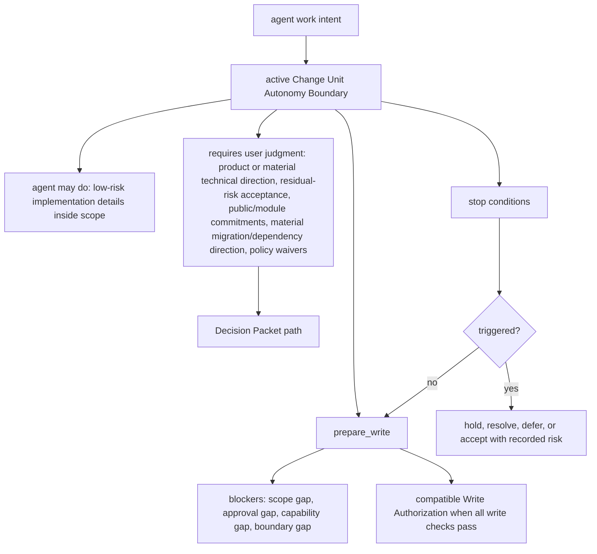
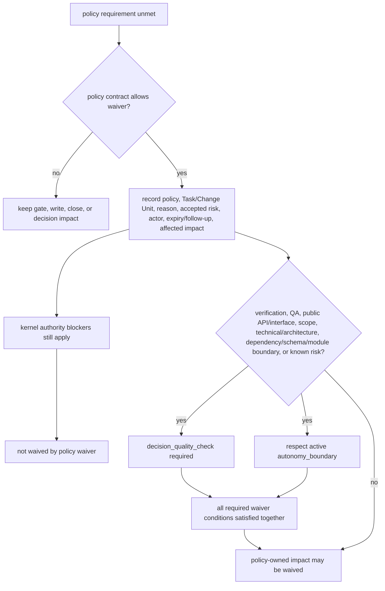

# Design Quality Policies

## What this document helps you do

Use this reference to decide when a design-quality policy applies, what record or evidence it expects, which stable validator reports it, and how an unmet requirement can affect write gates or close.

These policies help AI-assisted work stay aligned with product design, domain language, module boundaries, testing discipline, human QA, and context hygiene without turning every quality preference into a kernel rule.

This is reference documentation for future Harness behavior. Current repository phase and implementation handoff status are tracked in [Implementation Overview](../build/implementation-overview.md#documentation-acceptance-status).

This document does not define MCP schemas, SQLite DDL, state transition tables, runtime behavior, server behavior, or full projection templates.

## Read this when

- You are shaping work and need to know which design-quality records matter.
- You are writing or reviewing conformance fixtures that assert design-quality validator results.
- You need to understand why a task has `design_gate`, `decision_gate`, or `qa_gate` impact.
- You are deciding whether a policy waiver is allowed.
- You are reviewing close blockers, Decision Packet needs, Manual QA requirements, or stewardship findings.

## Before you read

Use [Kernel Reference](kernel.md) for lifecycle, gates, and close semantics; [MCP API And Schemas](mcp-api-and-schemas.md) for public request/response shapes and `ValidatorResult`; and [Conformance Fixtures Reference](conformance-fixtures.md#fixture-assertion-semantics) for fixture assertion semantics.

## Main idea

Design-quality policies make stewardship, product-design, and context-quality expectations visible through existing Harness owner paths. They can affect findings, gate impact, blockers, evidence needs, and Decision Packet routing, but they do not create new kernel transitions, schemas, or substitute authority.

## Policies in plain language

| Policy area | Plain-language question |
|---|---|
| `shared_design` | Has requirements clarification / Discovery or another shaping path separated inspectable facts from user-owned decisions and recorded enough goal, user value, scope, non-goals, acceptance criteria, assumptions, product, technical, security/privacy, QA, operational, follow-up risk, remaining uncertainty, and safe-next-work or work-splitting context to propose safe next work? |
| `decision_quality` | Is this a product, design, technical, architecture, waiver, or risk choice that needs a Decision Packet or an existing waiver, Residual Risk, QA, or acceptance record? |
| `autonomy_boundary` | What may the agent do alone, and where must it stop for user judgment? |
| `vertical_slice` | Is the work shaped as a thin end-to-end slice, or is a horizontal exception recorded? |
| `feedback_loop` | How will the agent learn whether the change works before and after writing? |
| `tdd_trace` | When TDD is required or best fit, is RED, GREEN, and related check evidence recorded? |
| `domain_language` | Are product terms and code terms still aligned? |
| `deep_module_interface` | Are module roles, public interfaces, compatibility, and callers understood? |
| `codebase_stewardship` | Does local task completion hide future maintenance, testability, domain, or boundary damage? |
| `manual_qa` | Does a human need to inspect UX, workflow, copy, accessibility, visual output, or product taste? |
| `context_hygiene` | Is the agent using current, focused, phase-appropriate context instead of stale chat, old documents, full docs dumps, or over-broad retrieved context? |
| `two_stage_review_display` | Are spec compliance and code stewardship shown separately without creating new gates? |

## Reference scope

This document owns:

- design-quality policy contracts
- policy-to-validator mapping
- stable design-quality validator IDs
- severity composition rule
- policy waiver semantics
- policy evidence expectations
- policy close impact
- two-stage review display relationship to policy validators and owner records
- when design-quality policies affect `decision_gate`, `design_gate`, `qa_gate`, evidence sufficiency, `prepare_write` blockers, or close blockers

## Not covered here

This document does not own:

- kernel lifecycle transitions; see [Kernel Reference](kernel.md)
- gate enum definitions; see [Kernel Reference](kernel.md) and [MCP API And Schemas](mcp-api-and-schemas.md)
- public MCP request/response schemas; see [MCP API And Schemas](mcp-api-and-schemas.md)
- SQLite DDL or storage layout; see [Storage And DDL](storage-and-ddl.md)
- projection template bodies; see [Document Projection Reference](document-projection.md) and [Template Reference](templates/README.md)
- operator command semantics; see [Operations And Conformance Reference](operations-and-conformance.md)
- connector capability profiles; see [Agent Integration Reference](agent-integration.md)
- surface recipes; see [Surface Cookbook](surface-cookbook.md)
- user-facing session procedure

## How policies affect gates without becoming kernel invariants

The kernel owns lifecycle, gate transitions, close semantics, blocker mechanics, state transitions, `prepare_write`, and `close_task`.

Design-quality policies are policy contracts layered on top of that kernel. A policy can say when `decision_gate`, `design_gate`, `qa_gate`, evidence sufficiency, `prepare_write` blockers, or close blockers may be affected. It does not create a new kernel transition, a new canonical source of truth, or a substitute for scope, sensitive-action Approval, evidence, verification, final acceptance, or residual-risk rules.

Keep the authority paths distinct. Product judgment and material technical judgment route through Decision Packets when they block progress, writes, waivers, acceptance, or close. Policy validators report design-quality findings and gate impact. Kernel authority still decides whether state changes, product writes, final acceptance, residual-risk acceptance, or close may proceed.

Policy waivers are also limited. They can satisfy a design-quality requirement only where the policy contract allows it. They do not waive product-write scope, sensitive-action Approval, required evidence coverage, required acceptance, or verification independence.

### Close-support boundaries

Design-quality policies may create findings, evidence needs, QA requirements, verification needs, residual-risk candidates, Decision Packet needs, or close blockers, but each category stays on its owner path. The exact non-substitution contract for evidence, verification, Manual QA, final acceptance, and residual risk is owned by [Kernel Reference: Evidence, verification, QA, final acceptance, and risk](kernel.md#evidence-verification-qa-final-acceptance-and-risk).

For policy authors, the local rule is simple: route the finding to the existing owner record or blocker, then link the kernel rule when the reader needs the precise close-support boundary. Passing tests, a QA waiver, final acceptance, and residual-risk acceptance may affect policy outcomes only through their owner paths; policy prose must not treat one as a substitute for another.

## Two-stage review model

Review guidance is displayed in two stages so agents and users can separate "did we build the requested thing?" from "is the implementation maintainable?" The stages are managed procedure and display, not new kernel gates, schemas, canonical records, `ProjectionKind` values, sensitive-action Approval, evidence, verification, QA, final acceptance, residual-risk acceptance, close, or Write Authorization.

| Stage | Question | Typical coverage |
|---|---|---|
| Spec Compliance Review | Did the work satisfy the requested task under the current Harness authority? | Acceptance criteria coverage, Change Unit completion conditions, scope and Write Authority compatibility, Decision Packet compatibility, evidence coverage, and residual-risk visibility. |
| Code Quality / Stewardship Review | Is the implementation maintainable inside this codebase? | Domain language, module/interface boundary, vertical slice shape, feedback loop or TDD trace, codebase stewardship, context hygiene, and follow-up risk. |

Review stages may summarize validator results, evidence gaps, Decision Packet candidates, Change Unit update recommendations, Eval or verification needs, Manual QA needs, residual-risk candidates, Approval needs, close blockers, and follow-up work. Role Lens or recommended playbook labels may select this review posture, but they do not create another authority path. Review displays do not by themselves satisfy evidence, QA, verification, final acceptance, residual-risk visibility, residual-risk acceptance, Approval, scope, close, or Write Authorization, and they do not directly block close without an underlying owner path.

Same-session review is not detached verification. A passed two-stage review may support `self_checked` confidence and may route findings through existing state paths, but it must not produce `assurance_level=detached_verified`. Detached verification still requires a valid independence boundary and Eval path.

## Finding routing

Findings from Runs, Eval records, Manual QA, design-quality validators, same-session review displays, operator diagnostics, or conformance examples must not disappear into chat or report prose. A finding becomes close-relevant only through an existing owner path, such as an Evidence Manifest gap or support row, Decision Packet candidate or record, Change Unit scope/completion/Autonomy Boundary update, Feedback Loop or TDD Trace update, Manual QA or Eval result, Residual Risk candidate or record, structured close blocker, reconcile item, or follow-up Task/Change Unit/Journey Spine Entry when the owner docs already define that route.

This section does not create a finding schema, DDL table, gate, validator ID, or authority path. It names how policy findings are routed back to the existing records owned by Kernel, MCP API, Storage, Document Projection, and Operations.

| Finding source | Route through existing owner paths |
|---|---|
| Run or selected feedback-loop execution | Attach logs/artifacts to the Run and Feedback Loop execution, update Evidence Manifest coverage, and route failed or missing checks to a design/evidence blocker, rework Change Unit, residual-risk candidate, or close blocker when applicable. |
| Eval or verification review | Record the Eval verdict, reviewed refs, independence/freshness blockers, and artifact refs; route missing reviewed evidence to Evidence Manifest coverage, invalid independence to verification gate or close blocker, and user-owned waiver/risk choices to Decision Packet and Residual Risk paths. |
| Manual QA | Record Manual QA result, findings, evidence refs, waiver reason, and `qa_gate` effect; route failed or waived human-inspection risk to rework, Decision Packet, Residual Risk, close blocker, or follow-up work as policy requires. |
| Design-quality or stewardship review | Record validator results and owner refs; route design-quality gaps through `design_gate` or evidence sufficiency as applicable, product or material technical judgment through Decision Packets and `decision_gate`, Manual QA findings through Manual QA records and `qa_gate`, scope/completion/autonomy gaps to Change Unit update recommendations, stale or missing support to evidence/reconcile paths, and close-relevant risk to Residual Risk candidates or structured close blockers. |
| Operator or conformance finding | Assert the finding through existing state, events, artifacts, projection freshness, errors, reconcile/recover paths, or docs-maintenance report labels. Docs-maintenance findings keep runtime effect `none`. |

## Policy contract shape

Each policy uses the same fields:

| Field | Meaning |
|---|---|
| `name` | Stable policy name. |
| `applies_when` | Conditions that make the policy relevant. |
| `default_requirement` | What should happen by default when it applies. |
| `allowed_waiver` | Who may waive it and what must be recorded. |
| `required_record` | Canonical state record or record family that stores the result. |
| `validator` | Validator that reports compliance, warning, failure, or blocker. |
| `evidence` | Evidence or projection refs expected by the policy. |
| `close_impact` | How unmet requirements affect close or gates. |

Policy validators return the validator result schema owned by the MCP API document.

The table above is the source of truth for field names. The field order helps readers scan from applicability through the requirement, waiver, record, validator, evidence, and close impact.

## Policy contracts

### Shared Design (`shared_design`)

Requirements clarification is the agent's conditional Shared Design intake posture before implementation planning and write authority. `Discovery` is the stable internal name for that posture, not a user command. It is used when clarification is needed, not as mandatory ceremony for every task. It may be triggered by ordinary prompts such as "clarify the plan before implementation" or "ask what you need before changing code." It may ask multiple targeted questions and keep a Question Queue, but the stop condition is not merely identifying a First Safe Change Unit Candidate. Shaping can pause or proceed when the agent has separated facts it can inspect from decisions the user must make; goals, non-goals, acceptance criteria, and major judgment candidates are clear enough; safe next work, a smaller scope, or a work split can be proposed without hiding unresolved user-owned judgment; and remaining uncertainty is explicit. It routes outputs into Shared Design, Decision Packet candidates, and Change Unit shaping; it is not a standalone schema, canonical record field list, approval, sensitive-action Approval, Write Authorization, evidence, verification, QA, final acceptance, residual-risk acceptance, close, scope authority, or a new authority path.

The tiny direct profile is below the Shared Design threshold only when the edit is a typo, single docs sentence, or obvious rename with no meaning, product, technical, security, privacy, public-interface, UX workflow, or sensitive-category judgment. Tiny direct is still `mode=direct`; it is not a waiver of scope, Approval, evidence, or security boundaries.

Use this when:

- The request is ambiguous or safe next work is not obvious.
- Scope, non-scope, acceptance criteria, or user value needs alignment.
- Affected product areas, user-facing screens or flows, modules, interfaces, sensitive categories, verification expectations, Manual QA expectations, user-owned product or material technical trade-offs, or known product, implementation, verification, QA, or follow-up risks need shaping before writes.
- Public interface, schema, auth, UX, or workflow behavior may change.
- A `work` task needs shaping before implementation.

Example: A user says, "We need better onboarding for new workspace owners. Inspect what exists, separate product choices from facts, and ask only what the repo cannot answer." Before writing, record the goal, user value, non-goals, acceptance criteria, repo/docs/state facts the agent can inspect, user-owned product/UX choices such as inline checklist versus modal setup prompt, QA expectations for the flow, rejected options, remaining uncertainty, and a safe next-work candidate or split. If product writes are near, that candidate can later become a First Safe Change Unit Candidate.

Example: A user says, "I want to replace our login approach, but I do not know whether sessions, magic links, or OAuth/OIDC fit best. Inspect the current auth shape first." Before writing, inspect existing user/session/auth docs and code, then separate user-owned authentication architecture choices such as local email/password sessions, magic links, or OAuth/OIDC; security/privacy choices such as account enumeration, redaction, rate limits, and session lifetime; verification and Manual QA expectations; remaining uncertainty; and the safe next-work candidate or work split.

Phrases such as "safe next-work candidate" and "work split" are proposal/support phrases, not standalone schemas, canonical record types, gate values, projection kinds, or authority paths. When product writes are near, one proposal may be expressed as a First Safe Change Unit Candidate for Change Unit shaping.

Shared Design is a recorded shared understanding, not final approval, sensitive-action Approval, final acceptance, residual-risk acceptance, QA judgment, or Write Authorization. It can expose decisions that require a Decision Packet, and it can support `design_gate` readiness, but it does not settle user-owned judgment by itself.

| Field | Contract |
|---|---|
| `name` | `shared_design` |
| `applies_when` | Work request is ambiguous, scope/non-scope is unclear, user value needs alignment, affected product areas, user-facing screens or flows, modules, interfaces, sensitive categories, verification or Manual QA expectations, user-owned product or material technical trade-offs, or known product, implementation, verification, QA, operational, or follow-up risks need shaping, public interface/schema/auth/security/privacy/UX/workflow is affected, or a `work` task needs shaping. Tiny direct must leave the tiny path as soon as any of those signals appear. It may escalate to ordinary Direct when the work remains narrow but needs evidence beyond the tiny changed-path/self-check note. It must route to Work and use requirements clarification or Shared Design when needed, when user-owned judgment, sensitive categories, security/privacy, public interface/API impact, UX workflow, schema, or multi-step delivery appears. |
| `default_requirement` | Record the shared understanding in a Discovery Brief or equivalent Shared Design support: goal, user value, scope, non-goals, acceptance criteria, affected product areas, user-facing screens or flows, modules, interfaces, sensitive categories, facts the agent can inspect from repo/codebase/docs/Harness state, judgments only the user can make, separated product/UX judgment candidates, technical architecture judgment candidates, security/privacy judgment candidates, QA and verification expectations, operational and scope judgments, known product, implementation, verification, QA, operational, or follow-up risks, blocking decisions, assumptions, rejected options, remaining uncertainty, domain-language impact, module/interface impact, and safe next-work candidate or work split. If product writes are near, include or derive a First Safe Change Unit Candidate as support for Change Unit shaping. Inspect before asking: use repo, codebase, docs, and Harness state that are available and current for answers the agent can discover safely; if a source is unavailable or stale, record that uncertainty rather than treating it as authority. Classify open questions as blocking, useful-but-not-blocking, or codebase-answerable. Ask the user only for decisions the current codebase, docs, Harness state, or safe inspection cannot answer. Clarify: multiple rounds may be needed; ask targeted questions grouped by decision area rather than a long questionnaire, usually starting with the most blocking area; each user-owned judgment prompt must include profile-appropriate options or chosen outcome, and full trade-off prompts include recommendation, uncertainty, and deferral consequence, including what can continue if deferred or why nothing should continue until the decision is made. Separate agent assumptions from choices, approvals, QA judgment, final acceptance, residual-risk acceptance, or public commitments that need user judgment. Do not harden implementation planning until inspectable facts and user-owned decisions are separated; goals, non-goals, acceptance criteria, and major judgment candidates are clear enough; remaining uncertainty is explicit; and enough scoped information exists to propose safe next work or a work split. Stop, pause, or proceed with implementation planning only when safe next work, a smaller scope, or a work split can be proposed without hiding unresolved user judgment. |
| `allowed_waiver` | Allowed for tiny direct or small obvious `direct` work, docs-only edits, or emergency fixes when the user/operator records a reason and a follow-up if design risk remains. The waiver does not bypass user-owned judgment, sensitive-action Approval, security/privacy boundaries, or close-relevant residual risk. |
| `required_record` | Shared Design record, Task shaping fields, decision records, and optionally `DESIGN` or `DEC` projections. Discovery Brief, Question Queue, Assumption Register, and First Safe Change Unit Candidate are support/projection concepts unless an existing owner path records the underlying fact. |
| `validator` | `shared_design_alignment` |
| `evidence` | Shared Design refs, Task shaping refs, acceptance criteria, decision refs, rejected option refs, product-area, user-facing-flow, module, interface, and sensitive-category notes, verification or Manual QA expectation refs, risk notes, risk candidates, residual-risk refs where applicable, and domain/module/interface impact refs. Discovery Brief, Question Queue, Assumption Register, and First Safe Change Unit Candidate remain shaping support or projections; by themselves they do not satisfy the Harness Evidence Manifest or close evidence. |
| `close_impact` | If required and absent, set or keep `design_gate=pending` or `partial`. If risk is high and no waiver exists, block close. A valid waiver may allow `design_gate=waived`. |

### Decision Quality (`decision_quality`)

Use this when:

- A choice changes user-owned product direction, material technical direction with cost, compatibility, security, maintenance, migration, interface, dependency, or risk impact, scope, architecture, schema/data model, public API, module boundary, or compatibility.
- A domain-language conflict changes product meaning, public documentation, caller expectations, acceptance criteria, API naming, or module responsibility.
- A waiver accepts known risk, including QA or verification waiver risk.
- A horizontal exception is a design, technical, or architecture choice.
- The agent has a recommendation but the user owns the judgment.

Example: A breaking API change looks simpler. Use a full trade-off profile and record the options, trade-offs, compatibility risk, recommendation, and user decision before acting on it.

Reusable Decision Packet examples:

- `decision_kind=product_tradeoff`: failed-login feedback uses inline message, toast, or modal/layer. Record the user-flow, interruption, accessibility, copy, and product-risk trade-offs. A similar packet can cover whether a blocking form problem should use inline error text, a toast, or a modal/layer.
- `decision_kind=product_tradeoff`: a product taste choice changes how opinionated the experience feels, such as an empty state that invites setup now versus a quieter page that waits for data. Record the product intent, user segment, clarity, interruption, Manual QA need, recommendation, uncertainty, and deferral effect, including what can continue if deferred or why nothing should continue until the decision is made.
- `decision_kind=architecture_choice`: session auth, token auth, or social login. Record revocation, CSRF/XSS exposure, client compatibility, operational complexity, migration path, and why the recommendation fits the Task.
- `decision_kind=architecture_choice`: dependency addition, schema migration, public API/interface change, or module boundary change. Record alternatives, blast radius, compatibility, rollback or migration cost, test boundary, future maintenance cost, recommendation, and deferral effect.
- `decision_kind=product_tradeoff` or `decision_kind=architecture_choice`: domain-language conflict such as "Account" versus "Profile" in product copy, API names, and storage-facing code. Record the user-facing meaning, code impact, compatibility or migration cost, documentation promise, recommendation, and deferral effect.
- `decision_kind=approval`: auth, permission, secret, or data-export action. The Approval boundary may authorize the sensitive step, but product or security judgment still needs a separate compatible Decision Packet when roles, exported fields, redaction, audit logging, retention, rollback, or user notice remain undecided.
- `decision_kind=qa_waiver` or `decision_kind=verification_waiver`: skipped QA or verification. Record what is not checked, why the waiver is proportionate, the accepted user/product/technical risk, and the smallest credible follow-up.
- `decision_kind=residual_risk_acceptance`: close with known remaining risk. Record the visible limitation, evidence already present, why close can still proceed, visible residual-risk refs, and follow-up.

Sensitive category labels such as `secret_access`, `data_export`, or `policy_override` identify approval risk; they do not choose the Decision Packet kind or settle the user-owned judgment by themselves. Category examples are owned by [MCP API And Schemas](mcp-api-and-schemas.md#sensitive-categories).

| Field | Contract |
|---|---|
| `name` | `decision_quality` |
| `applies_when` | Design choices, user-owned product trade-offs, product taste calls, material technical choices, domain-language conflicts that affect product meaning, public documentation, caller expectations, acceptance criteria, API naming, or module responsibility, Manual QA need when it depends on user-owned product, UX, accessibility, release-risk, or product-taste judgment, Manual QA waiver choices, scope expansion, dependency additions with durable impact, schema/data-model migrations, public API/interface changes, module boundary changes, architecture choices, horizontal exceptions, verification waiver, QA waiver, or acceptance with known risk. |
| `default_requirement` | Record a Decision Packet before the decision is acted on. Use `minimal_decision` only for trivial, bounded choices where detailed trade-off fields would not improve judgment; otherwise use the relevant full profile and capture context, options considered, trade-offs, recommendation, uncertainty, reversibility, evidence refs, deferral consequence, and residual risk. Keep agent recommendation distinct from user judgment or residual-risk acceptance. For `decision_kind=approval`, evaluate the clarity of the sensitive-action scope and boundary; do not treat Approval-shaped context as resolving product, technical, security, QA, verification, final acceptance, or residual-risk judgment. |
| `allowed_waiver` | Allowed only for trivial reversible choices, including tiny direct edits, with no public interface, product, material technical, architecture, maintenance, verification, QA, sensitive-category, security/privacy, or known-risk impact. Waiver must record why a Decision Packet would not improve judgment. |
| `required_record` | Decision Packet records and optionally `DEC` projection when rendered. |
| `validator` | `decision_quality_check` |
| `evidence` | Decision Packet refs, option refs, evidence manifest refs, risk/waiver refs, residual-risk state refs when residual-risk acceptance is involved, and final acceptance refs when user judgment is required. |
| `close_impact` | Missing required decision quality for blocking user-owned judgment sets or keeps `decision_gate=required`, `pending`, or `blocked`. Keep `design_gate` impact only when the decision affects design quality. Unresolved user judgment, invalid deferral, or unaccepted residual risk blocks affected writes or close. Valid recorded acceptance may allow close with residual risk preserved in state refs. |

### Autonomy Boundary (`autonomy_boundary`)

Use this when:

- The agent may proceed on covered implementation details but must stop on user-owned product judgment or material technical judgment.
- A task has ambiguous authority, user constraints, sensitive actions, external side effects, or irreversible edits.
- Scope expansion, public commitment, or known stop conditions may appear.
- The active Change Unit needs a clear "agent may do" and "ask first" boundary.

Example: The agent may refactor local helper names inside scope, but must stop before changing the public CLI flag contract or accepting risk on behalf of the user.

| Field | Contract |
|---|---|
| `name` | `autonomy_boundary` |
| `applies_when` | Agent is shaping or executing work with ambiguous authority, user constraints, external side effects, irreversible edits, scope expansion, sensitive action, user-owned product judgment or material technical judgment, public API/module contract commitments, material dependency or migration direction, security or privacy trade-offs, residual-risk acceptance, or known stop conditions. |
| `default_requirement` | Record what the agent may do without user input, what requires user judgment, and stop conditions. The canonical boundary is on the active Change Unit; Task or Shared Design may carry shaping/proposed boundary refs before a Change Unit exists. The boundary should let the agent proceed on low-risk implementation details while pausing on user-owned product direction, material technical direction, residual-risk acceptance, public interface/module commitments, material dependency/migration direction, security or privacy trade-offs, or policy waivers that require human judgment. Autonomy Boundary is not a scope grant and does not authorize paths, tools, commands, network, secrets, or sensitive categories outside the active Change Unit. |
| `allowed_waiver` | Allowed for tiny direct or narrow `direct` work where authority is obvious from the request and no stop condition can reasonably be triggered. Waiver must record why no autonomy boundary is needed and must not cover scope expansion, sensitive actions, security/privacy trade-offs, or user-owned judgment. |
| `required_record` | Canonical Autonomy Boundary record on the active Change Unit; Task or Shared Design shaping/proposed boundary refs before a Change Unit exists; Decision Packet records for user-judgment items; and stop-condition refs when triggered. |
| `validator` | `autonomy_boundary_check` |
| `evidence` | User request refs, task constraints, policy refs, Decision Packet refs, stop-condition events, user response refs. |
| `close_impact` | At `prepare_write`, triggered stop conditions or boundary gaps block the write. User-owned judgment gaps should request or reference a Decision Packet and affect `decision_gate`; design-quality gaps may affect `design_gate`. Scope, sensitive-action Approval, and capability gaps remain visible as their own blockers. Unresolved stop conditions can block close until resolved, deferred, or accepted with recorded risk. |

### Vertical Slice (`vertical_slice`)

Use this when:

- The task adds or changes a feature, user-visible behavior, workflow, or integration path.
- A medium or large `work` task needs a small end-to-end delivery shape.
- A horizontal enabling slice is proposed and needs a recorded exception.
- Follow-up vertical risk must stay visible.

Example: For a notification feature, prefer a slice from trigger through domain logic and persistence to observable output and test evidence, even if the UI is minimal.

| Field | Contract |
|---|---|
| `name` | `vertical_slice` |
| `applies_when` | Feature work, user-visible behavior, workflow change, integration behavior, or medium/large `work` task. |
| `default_requirement` | Prefer a thin end-to-end Change Unit that connects trigger/input, domain logic, persistence or state, API/caller boundary, observable output, test evidence, and optional Manual QA. |
| `allowed_waiver` | Horizontal/enabling Change Units are allowed when scaffold, test harness, deep module boundary, migration safety, or public interface decisions must come first. The Change Unit must record `horizontal_exception_reason`, link a Decision Packet when the exception is a design or architecture choice, and record a follow-up vertical Change Unit unless no meaningful end-to-end path exists yet; if not applicable, record why. |
| `required_record` | Change Unit fields: `slice_type`, end-to-end path, completion conditions, follow-up vertical Change Unit, and validator results. |
| `validator` | `vertical_slice_shape` |
| `evidence` | Change Unit record, run summary, evidence manifest, tests, Manual QA refs if user-visible. |
| `close_impact` | If vertical slice is required and neither satisfied nor waived, set `design_gate=partial` or `blocked`. A justified horizontal exception may allow close only when the follow-up risk is recorded. |

### Feedback Loop (`feedback_loop`)

Use this when:

- Implementation is about to start.
- A behavior-affecting write needs a credible check path.
- TDD is waived and an alternate loop must carry confidence.
- Manual QA, browser smoke, tests, typecheck, lint, or build output should become evidence.

Example: Before changing parser behavior, define a small loop: failing parser fixture, implementation, passing fixture, and evidence manifest refs.

| Field | Contract |
|---|---|
| `name` | `feedback_loop` |
| `applies_when` | Before implementation starts, before a behavior-affecting write, when TDD is waived, when Manual QA is expected, or when the agent needs a credible way to learn whether the change works. |
| `default_requirement` | Define the feedback loop before implementation: test, typecheck, lint, build, browser smoke, Manual QA, or an explicit alternate loop. The selected loop should be the smallest credible loop for the risk. When TDD is required for a Change Unit or behavior slice, define the loop and the intended RED check before non-test implementation begins. TDD trace is one implementation of this policy, not the only implementation. Findings from the loop must route back to Evidence Manifest coverage, Decision Packet candidates, Change Unit updates, Residual Risk candidates, Manual QA or Eval records, close blockers, or follow-up work where applicable. |
| `allowed_waiver` | Allowed for docs-only edits, comments, formatting, or advisory work with no implementation or product behavior impact. Waiver must record why no executable, browser, Manual QA, or alternate loop is useful. |
| `required_record` | A canonical `feedback_loops` record referenced with `record_kind=feedback_loop`, selected-loop refs, validator results, refs to existing owner records that carry routed findings when findings exist, `tdd_traces` when TDD is selected, Manual QA record when Manual QA is selected and performed, `qa_gate=pending` when required QA has no satisfying record yet, and evidence manifest refs when executed. |
| `validator` | `feedback_loop_check` |
| `evidence` | Feedback Loop refs, planned loop refs, test/typecheck/lint/build/browser smoke logs, Manual QA refs, alternate-loop justification, TDD trace refs when used, and existing owner refs for findings that affect evidence, decisions, scope, risk, close blockers, or follow-up work. |
| `close_impact` | Missing feedback loop definition keeps `design_gate=pending` or `partial`. Missing execution evidence can make evidence insufficient. Manual QA loop failures affect `qa_gate` through the Manual QA policy. Missing required TDD RED/GREEN/refactor coverage is handled through `tdd_trace_required` and can also make evidence manifest coverage insufficient. |

Public mutation path: selected-loop definitions and waivers are recorded with `FeedbackLoopUpdate` during `record_run(kind=shaping_update)`. Execution refs and status are updated with `EvidenceUpdates.feedback_loop_updates` during implementation/direct runs, or with `record_manual_qa.feedback_loop_ref` when Manual QA is the selected loop.

### TDD Trace (`tdd_trace`)

Use this when:

- The change touches domain logic, service behavior, parser/validator behavior, state transitions, or edge-heavy internals.
- A bug fix needs a failing check before implementation.
- TDD is selected by policy, task, Change Unit, user, or operator.
- RED and GREEN evidence should prove the behavior path rather than just describe it.

Example: For a state transition bug, record a failing transition test before non-test implementation, then record the passing test and any refactor/check evidence.

Requirement levels:

| Level | Meaning |
|---|---|
| Required | `tdd_trace_required` applies because policy, the Task, Change Unit, behavior slice, user, or operator requires it. Non-test implementation needs actual RED evidence first, unless a valid TDD waiver exists. |
| Selected | TDD is chosen as the Feedback Loop even when not otherwise required. Record the TDD Trace because it is the selected loop. |
| Waived | TDD was required or selected, but a non-TDD justification and alternate credible Feedback Loop were recorded before the waiver affects implementation or close. A waiver does not prove behavior. |
| Advisory | TDD is recommended by the shape of work but not marked required or selected. No TDD waiver is needed if the selected Feedback Loop is otherwise credible; do not report `tdd_trace_required` as failed solely from advisory guidance. |

| Field | Contract |
|---|---|
| `name` | `tdd_trace` |
| `applies_when` | Domain logic, service module, bug fix, parser/validator, state transition, deep module internals, or edge-case-heavy behavior. Recommended for API/caller boundaries and integration behavior. |
| `default_requirement` | Use TDD as the selected feedback loop when it is the best fit or when the Change Unit, behavior slice, policy, or user/operator marks `tdd_trace_required`. Normal execution order is: define the feedback loop and RED target, write or run the RED check, record actual RED evidence, perform non-test implementation only after actual RED evidence exists or a valid waiver exists, record GREEN evidence, record refactor/check evidence when relevant, and link the TDD trace to Evidence Manifest coverage. |
| `allowed_waiver` | Allowed for docs, typos, throwaway prototypes, exploratory UI prototypes, initial scaffolds, or when the user/operator records a non-TDD justification and alternate feedback loop. A waiver must name why TDD is not useful or proportionate for this slice and must reference or define the alternate loop that will provide credible feedback. |
| `required_record` | `tdd_traces` records and `TDD-TRACE` projection when rendered. |
| `validator` | `tdd_trace_required` |
| `evidence` | Actual failing test artifact/log/result or another explicit policy-recognized failing-check evidence, passing test log, refactor check log when relevant, diff refs, Evidence Manifest coverage refs, non-TDD justification and alternate feedback loop when waived. RED targets or RED plans are planning records, not evidence. |
| `close_impact` | Missing required TDD trace makes `design_gate=partial` and may make evidence insufficient. Missing RED evidence before non-test implementation can block `prepare_write`. Missing GREEN or relevant refactor/check evidence can block close through evidence sufficiency or design-quality blockers. A valid non-TDD justification may satisfy design policy but does not by itself prove behavior. |

TDD execution loop:

1. Define the selected feedback loop before implementation. For required TDD, the Feedback Loop record should identify the behavior slice or acceptance criterion, the RED target or plan, and the expected GREEN check.
2. Record RED evidence before non-test implementation writes. RED evidence means an actual failing test artifact/log/result or another explicit policy-recognized failing-check evidence. A RED target or plan does not satisfy this precondition and does not satisfy Evidence Manifest coverage.
3. Allow test-path writes that create the RED check when active Change Unit scope, baseline, sensitive-action Approval, Autonomy Boundary, and other gates allow. A RED target or plan may support this scoped test-path write. These writes are still product writes when they touch product files, but the `tdd_trace_required` policy should not block them merely because actual RED evidence is not recorded yet.
4. Block non-test implementation writes when TDD is required and neither RED evidence nor a valid TDD waiver exists. `prepare_write` may return a design-policy blocker with `tdd_trace_required` failed or blocked; public error selection still follows API precedence.
5. Record GREEN evidence after implementation, then record refactor/check evidence when a refactor step is performed or when the slice risk requires an additional check.
6. Link the TDD trace, Feedback Loop, run logs, and artifacts to Evidence Manifest acceptance-criteria and changed-file coverage.

This is policy and write-check behavior, not a Kernel Authority Invariant. Kernel authority still comes from active Task, active Change Unit scope, `prepare_write`, Write Authorization, approvals, Decision Packets, evidence, verification, QA, final acceptance, and close semantics in the owner documents.

### Domain Language (`domain_language`)

Use this when:

- A new product term appears or an existing term gets a new meaning.
- Product language and code language diverge.
- Multiple names refer to one concept.
- A reviewer or evaluator finds terminology drift.
- A term conflict affects product behavior, public docs, API or interface naming, acceptance criteria, or module responsibility.

Example: If the product calls a concept "Journey Card" but code introduces `sessionSummary`, record or update the term boundary before the mismatch spreads.

| Field | Contract |
|---|---|
| `name` | `domain_language` |
| `applies_when` | New product term appears, an existing term is used with a new meaning, code and product language diverge, multiple names refer to one concept, or reviewer/evaluator finds a term mismatch. |
| `default_requirement` | Record or update affected terms with meaning, code representation, "not this" boundary, related terms, source, and status. Implementation agents pull only task-relevant terms; reviewers/evaluators receive relevant terms and any active terminology uncertainty. If the term choice requires user-owned product judgment or material technical judgment, route that judgment through `decision_quality`; the term record captures the chosen language after the decision path allows it. |
| `allowed_waiver` | Allowed when the work has no domain term impact or the term is intentionally local/temporary. Waiver must record why no canonical term update is needed. |
| `required_record` | `domain_terms` records referenced with `record_kind=domain_term`; `DOMAIN-LANGUAGE` is only a projection/proposal surface. |
| `validator` | `domain_language_consistency` |
| `evidence` | Domain term refs, code refs, test naming refs, reconcile item refs for proposals. |
| `close_impact` | If required terms are missing or conflicting, mark `design_gate=partial` or `stale`; block close when the mismatch affects acceptance criteria, public behavior, public documentation or caller expectations, module responsibility, or verification confidence. If the mismatch depends on user-owned judgment, keep or set the relevant `decision_gate` impact until the Decision Packet route is compatible. |

### Deep Module / Interface (`deep_module_interface`)

Use this when:

- A public interface, module boundary, schema, data model, auth boundary, or compatibility contract may change.
- A deep module hides complexity behind a simpler public surface.
- Caller impact, boundary tests, or dependency direction need review.
- A shallow-module risk may make future changes harder.

Example: Before changing an evidence manifest schema, record the interface contract, impacted callers, compatibility risk, and boundary tests.

| Field | Contract |
|---|---|
| `name` | `deep_module_interface` |
| `applies_when` | Public interface changes, module boundary changes, schema/data model changes, auth/security boundaries, compatibility impact, deep module internals, or shallow-module risk. |
| `default_requirement` | Identify affected modules, current role, proposed public interface, internal complexity hidden behind the interface, module-local watchpoints, callers impacted, compatibility impact, and test boundary. Prefer small simple public interfaces with enough internal capability behind them. Use Decision Packets for public interface, compatibility, architecture, or module-responsibility choices that require user-owned product or material technical judgment. |
| `allowed_waiver` | Allowed for localized internal changes with no public boundary impact, no dependency direction change, and low compatibility risk. Must record why module/interface review is unnecessary. |
| `required_record` | `module_map_items` and `interface_contracts` records referenced with `record_kind=module_map_item` and `record_kind=interface_contract`, decision records, and optionally `MODULE-MAP` / `INTERFACE-CONTRACT` projections. |
| `validator` | `module_interface_review` |
| `evidence` | Module map item refs, including module-local watchpoints when relevant; interface contract refs, caller impact list, boundary tests, design decisions, compatibility notes. |
| `close_impact` | Missing required review keeps `design_gate=pending` or `partial`; public interface, module boundary, caller-impact, or compatibility risk without review can block close or require explicit residual-risk acceptance. If the boundary choice is still user-owned, keep or set the relevant `decision_gate` impact. |

#### Domain and boundary routing examples

These examples route through existing policy, Decision Packet, gate, evidence, and close paths. They do not create new schemas, DDL, validator IDs, gates, or authority records.

| Concern | Existing route | Gate or close effect |
|---|---|---|
| A local code name drifts from a stable product term, but the meaning is clear and no public contract changes. | Update or reference `domain_terms`; `domain_language_consistency` may report a warning or `design_gate=partial` until reconciled. | Usually no Decision Packet. Close blocks only if the mismatch affects acceptance criteria or verification confidence. |
| "Account" and "Profile" conflict across product copy, API names, and docs, and the choice changes what users or callers can rely on. | Use `domain_language_consistency` for the term conflict and `decision_quality_check` for the user-owned product or material technical choice. Record the compatible Decision Packet before acting on the chosen meaning. | `design_gate` stays partial or stale while the term conflict is unresolved; `decision_gate` stays required, pending, or blocked while the user-owned choice is unresolved; close can block if the conflict affects public behavior, docs, acceptance, or verification confidence. |
| A compatible public interface extension has clear caller impact, boundary tests, and no user-owned trade-off. | Record or update `interface_contracts` and related `module_map_items`; `module_interface_review` carries the design-quality impact. | `design_gate` may be pending or partial until review and evidence exist. No Decision Packet is needed unless compatibility, public commitment, or material technical judgment becomes user-owned. |
| A breaking interface cleanup or module-responsibility move is simpler but shifts caller obligations or future architecture direction. | Use `module_interface_review` and `decision_quality_check`; record affected callers, compatibility, migration or rollback cost, boundary tests, and a Decision Packet for the breaking or architecture choice. | Affected writes are blocked until the decision route, scope, sensitive-action Approval when applicable, and policy requirements are compatible. Close can block on unresolved interface review, missing evidence, unaccepted residual risk, or unresolved Decision Packet state. |

### Codebase Stewardship (`codebase_stewardship`)

Use this when:

- Work touches durable code structure, domain concepts, ownership, interfaces, architecture, or testing strategy.
- A local fix could increase future-change cost.
- Drift appears between owner records and implementation reality.
- Review needs a focused stewardship summary instead of a generic code-review checklist.

Example: A task passes tests but spreads a domain concept across three modules with inconsistent names. Record the affected owner refs and reconcile the drift instead of treating the task as cleanly done.

| Field | Contract |
|---|---|
| `name` | `codebase_stewardship` |
| `applies_when` | Work touches durable code structure, domain concepts, module ownership, interface contracts, architecture direction, deep-module boundaries, testing strategy, or cross-cutting exceptions. |
| `default_requirement` | Group the stewardship view for the Change Unit: domain language, module map, interface contracts, TDD/feedback loops, architecture watchpoints, and deep-module boundaries. Module-local watchpoints live on `module_map_items`; Task/Change Unit watchpoints cover delivery-level stewardship risks. Stewardship review is not a general code review checklist. It prevents local task completion from hiding degradation in domain language, module boundary, interface contract, feedback loop, testability, maintainability, or future-change cost. Use owner records as source of truth, record only task-relevant refs, and create reconcile items for drift instead of duplicating schemas or DDL. |
| `allowed_waiver` | Allowed for isolated docs, comments, formatting, or leaf edits with no durable structure, domain, interface, or feedback-loop impact. Waiver must record why stewardship review is unnecessary. |
| `required_record` | Task or Change Unit stewardship refs, `domain_terms`, `module_map_items` records with module-local watchpoints when relevant, `interface_contracts` records, `feedback_loops` records, `tdd_traces` refs when TDD is used, decision records, Task/Change Unit watchpoints, Journey Spine Entry refs, and reconcile items for drift. Dedicated architecture watchpoint refs may be used only if a later DDL batch defines them. Canonical design-support refs use `record_kind=domain_term`, `record_kind=module_map_item`, `record_kind=interface_contract`, and `record_kind=feedback_loop`; Markdown projection refs are optional display/proposal refs. |
| `validator` | `codebase_stewardship_check` |
| `evidence` | Domain term refs, module map item refs including module-local watchpoints, interface contract refs, feedback loop refs, TDD trace refs when used, Task/Change Unit watchpoints, Journey Spine Entry refs, deep-module notes, reconcile item refs, and dedicated architecture watchpoint refs only if later defined. |
| `close_impact` | Missing required stewardship review keeps `design_gate=pending`, `partial`, or `stale`; unresolved drift can block close when it affects public behavior, module boundaries, acceptance criteria, or verification confidence. |

#### StewardshipImpactSummary display shape

`StewardshipImpactSummary` is a derived display/summary shape for the Design Stewardship Default and the `codebase_stewardship` policy contract. It is not a Kernel Authority Invariant. It is a derived display, not a canonical current record. It is derived from owner records, validator results, and refs; it does not create a new canonical source of truth.

Domain terms, module map items, interface contracts, Feedback Loop records, TDD Trace records when TDD is selected, residual risk, and Decision Packets remain the owner records. The summary renders compact close-relevant status and refs back to those owners.

Read the display shape in two parts: owner records, validator results, and Task/Change Unit refs are inputs; the fields below are the derived display values. The summary may point back to owners, but it does not replace them.

| Field | Values |
|---|---|
| `domain_language_impact` | `none` \| `updated` \| `conflict` \| `unresolved` |
| `module_boundary_impact` | `none` \| `local` \| `public_boundary` \| `unresolved` |
| `interface_contract_impact` | `none` \| `compatible` \| `breaking` \| `unresolved` |
| `feedback_loop_status` | `defined` \| `missing` \| `waived` |
| `future_change_risk` | `none` \| `visible` \| `accepted` \| `unresolved` |
| `close_impact` | `none` \| `blocks_close` \| `requires_decision` \| `residual_risk` |

`feedback_loop_status` is derived from referenced `feedback_loops` rows and validator results. A referenced `tdd_traces` row can satisfy execution evidence when TDD is selected, but it is not the canonical owner of the selected loop.

### Manual QA (`manual_qa`)

Use this when:

- The change affects UI, UX flow, copy, error messages, accessibility, visual output, or browser-only behavior.
- A critical flow such as onboarding, checkout, auth, or billing needs inspection.
- Product taste judgment is required.
- Automated checks cannot see the user experience well enough.

Example: A settings page copy change passes tests, but a person still needs to inspect the real screen for clarity, layout, accessibility, and product tone.

| Field | Contract |
|---|---|
| `name` | `manual_qa` |
| `applies_when` | UI change, UX flow change, copy/error message change, onboarding/checkout/auth/billing or other critical flow, accessibility impact, visual output, browser-only behavior, or any result that needs product taste judgment. |
| `default_requirement` | Record a Manual QA profile, setup, checklist, result, findings, evidence refs, performer, product taste judgment when relevant, and next action. Profiles include `ui_quality`, `workflow`, `copy`, `accessibility`, `browser_smoke`, and `performance_smoke`. |
| `allowed_waiver` | Allowed when the user/operator explicitly waives QA and records a waiver reason. QA waiver requires decision quality when accepting known product or user risk. Not appropriate when legal, safety, privacy, or high-impact user harm requires inspection. |
| `required_record` | `manual_qa_records`; `qa_gate` is the canonical aggregate gate. |
| `validator` | `manual_qa_required` |
| `evidence` | Manual QA record refs, screenshot refs, notes, browser log refs, walkthrough refs, and finding refs. These refs support the human inspection record; they do not become automated verification, detached assurance, or final acceptance. |
| `close_impact` | If Manual QA is required, `qa_gate=pending` or `failed` blocks successful close even when tests pass. `qa_gate=waived` requires a waiver reason and, when user/product risk is involved, the compatible QA waiver Decision Packet and residual-risk handling. QA failed should create rework, block close, or require an explicit follow-up path. |

### Context Hygiene (`context_hygiene`)

Use this when:

- Work resumes after interruption or after related docs, issues, records, or code paths changed.
- The agent may be relying on stale chat, stale PRDs, old design docs, full documentation dumps, over-broad retrieved context, or moved code paths.
- An evaluator or reviewer needs a focused current-state bundle.
- Projection freshness, reconcile items, or acceptance criteria changed.

Example: A task resumes after a week. Read current status or current-position context first, using Journey Card only when that projection/profile is enabled and fresh. Then choose the active session start, requirements clarification/discovery, decision request, prepare-write, run/evidence, close-readiness, or error/recovery context profile, and show refs-first summaries for the current Task/current-position context/Change Unit/Decision Packet/Write Authority/Evidence/Residual Risk/Gate/Projection freshness only where that profile needs them. Pull old PRDs, old projections, logs, screenshots, diffs, raw artifacts, or module maps only if the next safe action needs inspection, and mark stale inputs.

Retrieved, indexed, remembered, or summarized context is a context-hygiene input, not an authority source. It may point the agent to compact status, pull refs, or source excerpts, but the underlying owner records still control any write authority, gates, evidence, verification, QA, final acceptance, residual-risk acceptance, projection freshness, implementation readiness, and close effect. The full Context Index and retrieved-context boundary is owned by [Roadmap: Context Index](../roadmap.md#context-index), with connector handling in [Agent Integration](agent-integration.md#context-pushpull-principles).

| Field | Contract |
|---|---|
| `name` | `context_hygiene` |
| `applies_when` | Work resumes after interruption, old PRDs/design docs/issues exist, code paths have moved, acceptance criteria changed, module/interface/domain records changed, projection `source_state_version` or freshness is unknown/stale, or evaluator/reviewer needs a focused bundle. |
| `default_requirement` | Use a compact always-on rule set of ten items or fewer, read current status or current-position context first, use Journey Card only when that projection/profile is enabled and fresh, and choose the active session start, requirements clarification/discovery, decision request, prepare-write, run/evidence, close-readiness, or error/recovery context profile. Use refs-first summaries for current Task, current-position context, Change Unit, Decision Packet, Write Authority, Evidence, Residual Risk, Gate, and Projection freshness where profile-relevant. Keep larger Reference docs, schemas, historical records, older PRDs/designs, old projections, logs, screenshots, diffs, raw artifacts, module maps, interface contracts, domain records, coding standards, and TDD guidance pull-on-demand. Retrieved, indexed, remembered, or summarized context remains pull-only and non-authoritative. Mark stale docs, warn on projection freshness drift, and avoid treating chat, retrieved context, indexed context, summarized context, or remembered recommendations as state or authority. |
| `allowed_waiver` | Allowed for short advisor-only work where no product state, design state, or evidence state is being changed. |
| `required_record` | Source records used to render the envelope or context profile come from existing owners such as current Task state, acceptance criteria, Change Unit, Autonomy Boundary, Decision Packets, gate states, Write Authority summary, approval status, surface capability/guarantee summary, projection freshness and `source_state_version` when known, Evidence Manifest, Run, Eval, Manual QA, ArtifactRef, report, residual-risk, reconcile items, and validator results. The compact envelope and context profile are rendered/derived context display, not a canonical record, schema field, DDL value, authority input, gate, evidence, verification, QA, final acceptance, residual-risk acceptance, close, or storage object. |
| `validator` | `context_hygiene_check` |
| `evidence` | Current projection refs, freshness state, `source_state_version`, stale refs, retrieved/indexed context freshness notes, missing profile-relevant context material, reconcile item refs, and evaluator bundle contents. Stale or over-broad critical context is reported as a context-hygiene finding; the finding itself is not evidence unless an existing owner path records supporting refs. |
| `close_impact` | Stale or over-broad critical context, stale projection freshness, stale retrieved/indexed context, or missing profile-relevant context material may warn, mark stale, or block write/close only through existing owner paths and gates. It can block write or close when the agent cannot safely determine scope, evidence, current acceptance criteria, or whether the readable projection matches canonical state. |

### Two-stage Review Display

Use this when:

- A user needs to see spec compliance separately from maintainability.
- A same-session review should route findings without claiming detached verification.
- Review output needs to summarize existing policy validators without adding new validator IDs.
- Close readiness needs a readable split between "requested thing satisfied" and "codebase stewardship acceptable."
- Role Lens or recommended playbook output needs to stay display-only while still pointing to the next real path.

Example: A final review can pass Spec Compliance because acceptance criteria and evidence are covered, while Code Quality / Stewardship still reports a `domain_language_consistency` warning and a follow-up Change Unit recommendation.

| Field | Contract |
|---|---|
| `name` | `two_stage_review_display` |
| `applies_when` | Review guidance is shown for spec compliance, code quality, stewardship, evidence gaps, Decision Packet candidates, residual-risk candidates, close blockers, or follow-up work. |
| `default_requirement` | Display Spec Compliance Review and Code Quality / Stewardship Review separately. Treat Role Lens and playbook labels such as `product-review`, `eng-review`, `design-review`, `security-review`, `qa-review`, and `release-handoff` as review posture only. Summarize relevant owner records, validator results, evidence gaps, Decision Packet candidates, Change Unit update recommendations, residual-risk candidates, Approval needs, Manual QA needs, Eval or verification needs, close blockers, and follow-up work without creating new gates, schemas, canonical records, `ProjectionKind` values, approvals, evidence, verification, QA, final acceptance, residual-risk acceptance, close, Write Authorization, or assurance upgrades. |
| `allowed_waiver` | Display may be omitted for narrow direct/advisor work where no review display is useful. Omission waives only the display; it does not waive underlying policy or state requirements, including Decision Packet needs, evidence, QA, verification, final acceptance, residual-risk visibility, residual-risk acceptance, scope, Approval, Write Authorization, or close. |
| `required_record` | Existing owner records, validator results, evidence refs, Decision Packet refs, Eval or verification refs, Manual QA refs, Approval refs, residual-risk refs, close blocker refs, and follow-up Task/Change Unit refs where applicable. The review display itself is derived display, not canonical state. |
| `validator` | No standalone validator ID. Spec Compliance Review reads acceptance/evidence state plus `shared_design_alignment`, `decision_quality_check`, `autonomy_boundary_check`, `feedback_loop_check`, `tdd_trace_required`, `manual_qa_required`, `context_hygiene_check`, and close-related residual-risk checks where applicable. Code Quality / Stewardship Review reads `domain_language_consistency`, `vertical_slice_shape`, `module_interface_review`, `codebase_stewardship_check`, `feedback_loop_check`, `tdd_trace_required`, and `context_hygiene_check`. |
| `evidence` | Existing validator result refs, evidence manifest refs, run/eval/manual QA refs, owner-record refs, Approval refs, residual-risk refs, close blocker refs, and follow-up refs. |
| `close_impact` | Review display does not by itself satisfy or block close. Underlying policy validators, evidence sufficiency, QA, verification, final acceptance, residual-risk visibility, residual-risk acceptance, Approval, scope, close blockers, and Write Authorization determine the actual close impact through their owner paths. |

Review display findings route to existing paths: `design_gate`, `decision_gate`, `qa_gate`, evidence sufficiency, Decision Packet, Eval or verification, Manual QA, residual risk, Approval, Change Unit update recommendation, follow-up work, or structured close blocker. They are not new canonical records. Same-session review content is self-check or stewardship signal unless a qualifying independent Eval or verification record provides detached assurance.

## Waiver rules

Waivers must be explicit, scoped, and recorded. A policy waiver must include:

- policy name
- Task and Change Unit
- reason
- accepted risk
- actor who waived
- expiry or follow-up when needed
- affected gate or close impact

Policy waivers can satisfy a design-quality requirement only where the policy contract allows it. They do not waive product-write scope, sensitive-action Approval, required evidence coverage, required acceptance, or any other kernel blocker. Verification waivers are owned by the kernel close semantics and must not produce `assurance_level=detached_verified`.

Waivers that involve verification, QA, public API/interface commitment, scope expansion, technical/architecture direction, dependency direction, schema/data-model migration, module boundary change, or acceptance with known risk should also satisfy `decision_quality` and respect any active `autonomy_boundary`.

## Reference severity defaults

This matrix is the default reference severity router for policy validators. It tells the reference runner which findings are advisory and which findings affect gates for common task shapes. It does not weaken `applies_when`, `default_requirement`, `allowed_waiver`, or `close_impact`; if a policy contract applies more strongly than this matrix, the policy contract wins.

Default impact vocabulary:

- `not_required`: the policy need not emit a finding unless its `applies_when` is independently true.
- `warning`: emit a visible validator finding, but do not block write or close by default.
- `design_gate=pending` or `design_gate=partial`: shaping, owner records, evidence, or waiver is incomplete. `prepare_write` blocks only when this matrix or the policy contract says the gap is write-blocking.
- `blocking before write`: `prepare_write` must not authorize affected product writes while the issue is unresolved. Creating or routing to a Decision Packet or Approval request only records the blocker path; it does not authorize the write. Authorization requires the issue to be resolved or validly waived, any relevant Decision Packet to be resolved or otherwise compatible for the affected operation, and any required sensitive-action Approval to be granted before a later compatible `prepare_write` creates Write Authorization.
- `close blocker`: successful close waits for a pass or compatible waiver. Accepted residual risk helps only where the kernel and the relevant policy contract allow a risk-accepted close path; it never replaces evidence sufficiency, required QA, sensitive-action Approval, or final acceptance.
- `Decision Packet required`: use the Decision Packet state path and set or keep `decision_gate=required`, `pending`, or `blocked` as applicable.

This is policy impact vocabulary, not the API `ValidatorResult.findings.severity` enum. Validator findings still use `info`, `warning`, `error`, or `blocker`; merged policy impact is exposed through gates, blocked reasons, close blockers, Decision Packet needs, waiver eligibility, or fixture-observed derived state.

### Severity composition rule

When more than one task shape, policy contract, or validator finding applies, policy evaluators compose impacts by keeping the strongest applicable impact for the same affected concern, not the weakest. "Same affected concern" is not the whole Task and not merely the same validator ID. It means the same policy-relevant target, including the affected gate, check, or blocker target; affected operation phase; affected scope or record refs; and close, write, or decision concern. Different concerns are preserved by union; only competing impacts for the same concern use the strongest-impact rule. The default policy-impact order is:

`not_required` < `warning` < gate impact such as `design_gate=pending`, `design_gate=partial`, `design_gate=stale`, or `qa_gate=pending` < `blocking before write` < `close blocker` < `Decision Packet required`.

Read this order from weakest to strongest. It is the complete ordering for competing impacts on the same affected concern.

This order decides whether a weaker default can be ignored for the same concern. It does not collapse different affected gates. If one finding affects `design_gate` and another affects `qa_gate`, `decision_gate`, evidence sufficiency, or residual-risk visibility, the merged result keeps all affected gates, blockers, and refs. `Decision Packet required` is a judgment-routing impact, not a replacement for write blockers, close blockers, evidence sufficiency, required QA, required sensitive-action Approval, or residual-risk visibility. A Decision Packet may resolve the user-judgment part of a finding, while any independent write blocker or close blocker remains until its own policy or kernel condition is satisfied.

Validators should report all relevant findings. The composition rule decides the merged gate, write-blocker, close-blocker, waiver, and Decision Packet impact; it must not hide weaker findings from validator results, evidence, status, or conformance output. Primary public `ToolError` selection remains owned by API [Primary Error Code Precedence](mcp-api-and-schemas.md#primary-error-code-precedence); this policy rule does not redefine error-code precedence or suppress secondary errors.

Severity can be raised above the matrix default by explicit user request, sensitive category, public commitment, public API/interface or schema impact, acceptance with known risk, residual-risk visibility, stale critical context, or a conformance fixture that asserts the case as blocking. Severity can be lowered only through an allowed waiver recorded under the relevant policy contract, and only for policy-owned impacts that the contract permits waiving. Policy waivers do not lower Kernel Authority blockers such as missing scope, missing sensitive-action Approval, required evidence insufficiency, required acceptance, or Write Authorization requirements. They also do not change API primary error precedence. This rule affects policy-contract interpretation, validators, gates, write blockers, close blockers, and Decision Packet needs; it does not make Design Stewardship Defaults into Kernel Authority Invariants.

| Task shape | Warning or `not_required` default | Gate/write default | Close/decision default |
|---|---|---|---|
| Direct docs-only | `vertical_slice_shape`, `tdd_trace_required`, `manual_qa_required`, `module_interface_review`, and `codebase_stewardship_check` are `not_required` unless the docs change product commitments, policy contracts, domain terms, public behavior, or interface meaning. `context_hygiene_check` and `domain_language_consistency` may warn for stale projections or terminology drift. | No design-quality write blocker by default. `shared_design_alignment` becomes `design_gate=pending` for ambiguous scope or design/policy contract edits. `autonomy_boundary_check` or `decision_quality_check` blocks only when user judgment, sensitive content, public commitment, or residual risk is involved. | No close blocker by default. Close can block if docs drift affects acceptance, verification confidence, public commitment, or required projection freshness. `Decision Packet required` for policy commitment changes, public commitments, or known residual-risk acceptance. |
| Direct code | `shared_design_alignment`, `vertical_slice_shape`, and `manual_qa_required` are `not_required` for obvious leaf/internal edits. `codebase_stewardship_check` may warn for minor maintainability concerns. | `feedback_loop_check` is `design_gate=pending` before behavior-affecting writes. `tdd_trace_required`, `domain_language_consistency`, and `module_interface_review` become `design_gate=partial` only when their policy contracts apply. `autonomy_boundary_check` blocks scope or authority gaps; `feedback_loop_check` blocks when no credible loop exists for a behavior-affecting write. | Missing run evidence, required TDD/domain/interface records, or unresolved behavior risk can become a `close blocker` when acceptance or verification confidence is affected. `Decision Packet required` for user-owned judgment, waiver with known risk, or scope expansion. |
| Ordinary work feature | `manual_qa_required` is `not_required` unless the feature is user-visible, workflow-affecting, or browser/product-taste dependent. `tdd_trace_required` may warn unless domain logic, service behavior, bug repair, state transition, or edge-heavy behavior is involved. | `shared_design_alignment`, `vertical_slice_shape`, `feedback_loop_check`, and `codebase_stewardship_check` default to `design_gate=pending` or `design_gate=partial` until records exist. `domain_language_consistency` and `module_interface_review` join the design gate when their contracts apply. Missing Autonomy Boundary, unresolved decisions, or missing feedback loop can be `blocking before write`. | Required vertical-slice, feedback, stewardship, and evidence gaps can be `close blocker`. `Decision Packet required` for scope expansion, horizontal exception, user-owned product or material technical trade-off, or residual-risk acceptance. |
| UI/UX/copy work | `tdd_trace_required` is `not_required` by default when an alternate credible loop exists. `module_interface_review` is a warning unless schema, auth, public interface, or compatibility is touched. | `shared_design_alignment`, `feedback_loop_check`, and copy-relevant `domain_language_consistency` default to `design_gate=pending` or `design_gate=partial`. `manual_qa_required` selects the QA path and may set `qa_gate=pending`. `autonomy_boundary_check` blocks unclear product-taste authority or stop conditions. | `manual_qa_required` sets `qa_gate=pending` or `failed`; that is a `close blocker` unless validly waived. `Decision Packet required` for material UX/copy trade-offs, QA waiver with known user/product risk, or public commitments. |
| Sensitive work | Unrelated policies remain `not_required`, but applicable policies are not warning-only once the sensitive category affects scope, sensitive-action Approval, user harm, privacy, legal, safety, security, secrets, irreversible action, or external side effects. | Applicable design policies start at `design_gate=pending` until records, Approvals, and waivers exist. `autonomy_boundary_check`, `decision_quality_check`, Approval/scope Core checks, and any required `feedback_loop_check` or `manual_qa_required` are `blocking before write` for the affected sensitive path. | Evidence, QA, residual-risk visibility, unresolved Approval, or unaccepted risk is a `close blocker`. `Decision Packet required` for Approval context, user-owned judgment, waiver, or residual-risk acceptance. |
| Public API/interface work | `manual_qa_required` is `not_required` unless UI/workflow docs or browser-visible behavior are affected. `tdd_trace_required` may warn unless behavior, domain, compatibility, or edge-heavy logic is involved. | `shared_design_alignment`, `module_interface_review`, `feedback_loop_check`, `codebase_stewardship_check`, and relevant `domain_language_consistency` default to `design_gate=pending` or `design_gate=partial`. `decision_quality_check`, `module_interface_review`, and `autonomy_boundary_check` are `blocking before write` for public commitments, compatibility risk, breaking change, or boundary ambiguity. | Unresolved compatibility, interface review, public commitment, or evidence gap is a `close blocker`. `Decision Packet required` for breaking, irreversible, compatibility, or residual-risk choices. |
| Broad structural/refactor work | `manual_qa_required` is `not_required` unless user-visible behavior is affected. `tdd_trace_required` may use an alternate loop only with justification and evidence. | `shared_design_alignment`, `vertical_slice_shape` or a recorded horizontal exception, `module_interface_review`, `codebase_stewardship_check`, `feedback_loop_check`, and relevant `domain_language_consistency` default to `design_gate=pending` or `design_gate=partial`. `decision_quality_check` and `autonomy_boundary_check` are `blocking before write` for architecture direction, dependency direction, scope expansion, or unclear authority. | Stewardship drift, missing follow-up vertical slice, missing evidence, unresolved module/interface risk, or unaccepted residual risk can be a `close blocker`. `Decision Packet required` for architecture choices, horizontal exceptions, and accepted residual risk. |

## Policy-to-validator mapping

| Policy | Validator | Primary gate or state impact |
|---|---|---|
| `shared_design` | `shared_design_alignment` | `design_gate` pending/partial/passed/waived |
| `decision_quality` | `decision_quality_check` | `decision_gate` required/pending/blocked/resolved; `design_gate` where applicable |
| `autonomy_boundary` | `autonomy_boundary_check` | `prepare_write` blockers, `decision_gate`, `design_gate` |
| `domain_language` | `domain_language_consistency` | `design_gate` partial/stale/passed |
| `vertical_slice` | `vertical_slice_shape` | `design_gate` partial/blocked/passed |
| `feedback_loop` | `feedback_loop_check` | `design_gate` and evidence sufficiency |
| `tdd_trace` | `tdd_trace_required` | `design_gate` and evidence sufficiency |
| `deep_module_interface` | `module_interface_review` | `design_gate` partial/blocked/passed |
| `codebase_stewardship` | `codebase_stewardship_check` | `design_gate` pending/partial/stale/passed and close blockers |
| `manual_qa` | `manual_qa_required` | `qa_gate` pending/passed/failed/waived |
| `context_hygiene` | `context_hygiene_check` | projection freshness, reconcile, evidence/design stale |

Review-stage displays compose these existing policy validators; they do not introduce new validator IDs or `ProjectionKind` values.

| Review stage | Validator relationship | Possible routed outcomes |
|---|---|---|
| Spec Compliance Review | Reads acceptance/evidence state plus `shared_design_alignment`, `decision_quality_check`, `autonomy_boundary_check`, `feedback_loop_check`, `tdd_trace_required`, `manual_qa_required`, `context_hygiene_check`, and close-related residual-risk checks where applicable. | Validator result refs, evidence gaps, Decision Packet candidates, Eval or verification needs, Manual QA needs, Approval needs, Change Unit update recommendations, residual-risk candidates, or close blockers. |
| Code Quality / Stewardship Review | Reads `domain_language_consistency`, `vertical_slice_shape`, `module_interface_review`, `codebase_stewardship_check`, `feedback_loop_check`, `tdd_trace_required`, and `context_hygiene_check`. | Stewardship validator findings, reconcile items, owner-record update recommendations, Eval or verification needs, Manual QA needs where relevant, Approval needs where relevant, follow-up Change Unit recommendations, residual-risk candidates, or close blockers. |

Staged delivery may implement minimal validators first, but it should use the reference severity defaults as the task-shape router for warning versus blocker behavior and keep validator IDs stable so conformance fixtures can grow without changing policy names.
