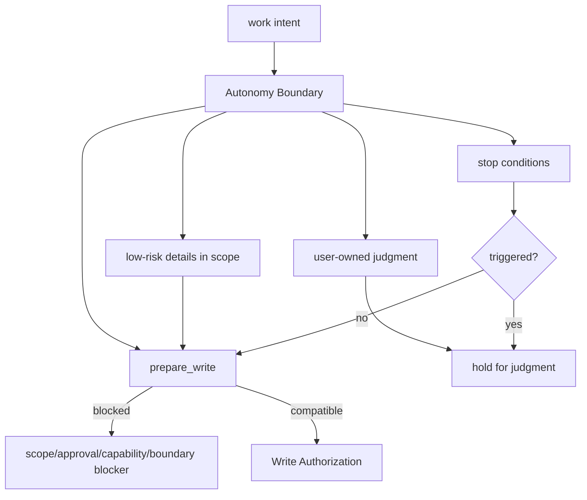
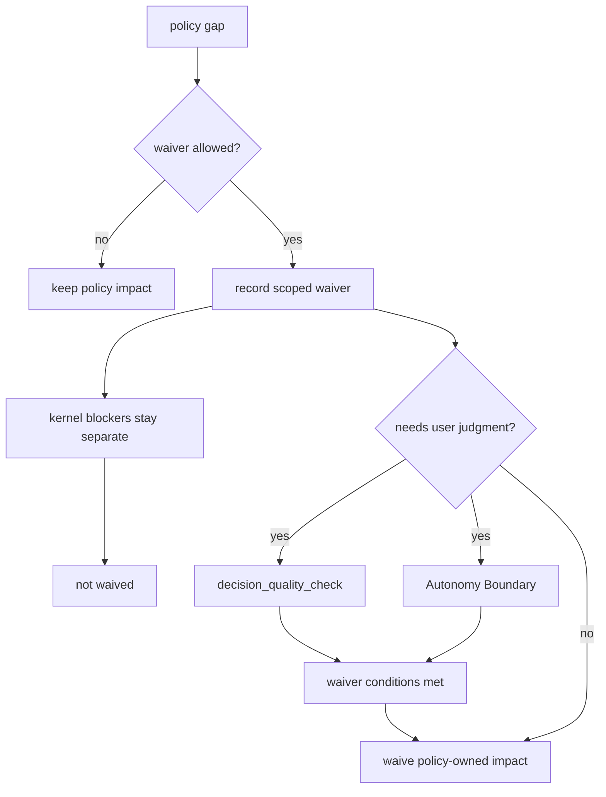

# Design Quality Policies

## What this document helps you do

Use this reference to decide when a design-quality policy applies, what record or evidence it expects, which stable validator reports it, and how an unmet requirement can affect write gates or close.

These policies help AI-assisted work stay aligned with product design, domain language, module boundaries, testing discipline, human QA, and context hygiene without turning every quality preference into a kernel rule.

This is reference documentation for future Harness behavior. Current repository phase and implementation handoff status are tracked in [Implementation Overview](../build/implementation-overview.md#documentation-acceptance-status).

This document does not define MCP schemas, SQLite DDL, state transition tables, runtime behavior, server behavior, or full projection templates.

## Read this when

- You are shaping work and need to know which design-quality records matter.
- You are writing or reviewing conformance fixtures that assert design-quality validator results.
- You need to understand why a design-quality finding affects `design_gate`, `decision_gate`, evidence, or a later/profile `qa_gate`.
- You are deciding whether a policy waiver is allowed.
- You are reviewing close blockers, user judgment needs, Manual QA boundaries, or stewardship findings.

## Before you read

Use [Core Model Reference](core-model.md) for lifecycle, gates, and close semantics; [MVP API](api/mvp-api.md) and [API Schema Core](api/schema-core.md) for public request/response shapes and `ValidatorResult`; and [Conformance Fixtures Reference](conformance-fixtures.md#fixture-assertion-semantics) for fixture assertion semantics.

## Main idea

Design-quality policies make stewardship, product-design, and context-quality expectations visible through existing Harness owner paths. They can route findings to a Core blocker, focused user judgment, evidence request, residual-risk marker, advisory next action, or no action, but they do not create new kernel transitions, schemas, or substitute authority.

Active MVP policy handling is intentionally small. Default blocking is limited to conditions that protect scope, user-owned judgment, evidence, stale authority context, and honest guarantee display. The broader policy catalog stays useful as routed candidate or advisory/later material until an owner profile explicitly promotes a narrower behavior.

## Impact classes and allowed routes

Every design-quality finding must be classified into exactly one impact class:

| Impact class | Meaning | Allowed routes |
|---|---|---|
| Core blocking | The finding may block a write or close only because an existing Core gate, blocker, or API error path is affected. | `block write`, `block close`, or the focused unblocker action exposed by that Core blocker: `ask one focused user judgment`, `request evidence`, or `mark residual risk`. A Core gate/blocker/error ref and one next action are required. |
| Routed candidate | The finding needs one focused follow-up but is not automatically blocking. | `ask one focused user judgment`, `request evidence`, `mark residual risk`, or `show advisory next action`. |
| Advisory/later | The finding is advice, a later/profile candidate, or a catalog item outside active MVP authority. | `show advisory next action` or `no action`. |

Every finding must route to exactly one of these actions:

```text
block write | block close | ask one focused user judgment |
request evidence | mark residual risk | show advisory next action | no action
```

One blocker must produce one next action. A policy finding must not create an open-ended review loop, a checklist that must be exhausted before ordinary work can continue, or a chain of follow-up questions when one focused judgment, one evidence request, one residual-risk marker, or one advisory next action is enough.

### Active MVP blocking set

In active MVP, design-quality findings may block write or close by default only for these conditions:

| Default blocking condition | Core owner path |
|---|---|
| Autonomy boundary exceeded | `autonomy_boundary_check` through `prepare_write`, `decision_gate`, or close blocker when the exceeded boundary affects the requested operation. |
| Unresolved user judgment | `decision_quality_check` and `decision_gate`, including focused `user_judgment` request/record paths. |
| Missing active scope | Core scope gate or `NO_ACTIVE_CHANGE_UNIT` / `SCOPE_REQUIRED` / `SCOPE_VIOLATION`; design policy may point to the gap but does not own it. |
| Missing required evidence | Core `evidence_summary`, `evidence_gate`, `EVIDENCE_INSUFFICIENT`, or artifact availability blocker. |
| Stale context affecting write or close | `context_hygiene_check` only when stale state, baseline, projection, or source refs make scope, evidence, acceptance criteria, or close basis unsafe to rely on. |
| Surface capability insufficient for claimed guarantee | Capability boundary, `CAPABILITY_INSUFFICIENT`, or guarantee display when the connected surface cannot support the claimed operation or guarantee level. |

Everything else is routed candidate or advisory/later by default in active MVP. In particular, full domain-language consistency, full module/interface review, full TDD trace, full codebase-stewardship suite, full feedback-loop audit, detailed Manual QA policy, and detached verification profile do not automatically block MVP write or close. They may still surface focused judgments, evidence requests, residual-risk markers, or advisory next actions when a concrete owner path needs them.

## Policies in plain language

| Policy area | Plain-language question |
|---|---|
| `shared_design` | Has requirements clarification / Discovery or another shaping path checked answerable facts from available repo/docs/current state, classified the work shape, separated missing information into blocking questions and useful non-blocking questions, identified user-owned judgments, and recorded enough goal, user value, scope, non-goals, acceptance criteria, assumptions, product, technical, security/privacy, QA, operational, follow-up risk, remaining uncertainty, and safe-next-work or work-splitting context to propose safe next work? |
| `decision_quality` | Is this a product, design, technical, architecture, waiver, or risk choice that needs a user judgment or an existing waiver, Residual Risk, QA, or acceptance record? |
| `autonomy_boundary` | What may the agent do alone, and where must it stop for user judgment? |
| `vertical_slice` | Is the work shaped as a thin end-to-end slice, or is a horizontal exception recorded? |
| `feedback_loop` | How will the agent learn whether the change works before and after writing? |
| `tdd_trace` | When TDD is selected or required by an active owner path, is RED, GREEN, and related check evidence recorded? |
| `domain_language` | Are product terms and code terms still aligned? |
| `deep_module_interface` | Are module roles, public interfaces, compatibility, and callers understood? |
| `codebase_stewardship` | Does local task completion hide future maintenance, testability, domain, or boundary damage? |
| `manual_qa` | Does a human need to inspect UX, workflow, copy, accessibility, visual output, or product taste? |
| `context_hygiene` | Is the agent using current, focused, phase-appropriate context instead of stale chat, old documents, full docs dumps, or over-broad retrieved context? |
| `two_stage_review_display` | Are spec compliance and code stewardship shown separately without creating new gates? |

## Reference scope

This document owns:

- design-quality policy contracts
- policy-to-validator mapping
- stable design-quality validator IDs
- impact-class and routed-action composition rule
- policy waiver semantics
- policy evidence expectations
- policy close impact
- two-stage review display relationship to policy validators and owner records
- when design-quality policies affect `decision_gate`, `design_gate`, evidence sufficiency, `prepare_write` blockers, close blockers, or later/profile `qa_gate`

## Not covered here

This document does not own:

- kernel lifecycle transitions; see [Core Model Reference](core-model.md)
- gate enum definitions; see [Core Model Reference](core-model.md) and [API Schema Core](api/schema-core.md)
- public MCP request/response schemas; see [MVP API](api/mvp-api.md) and [API Schema Core](api/schema-core.md)
- SQLite DDL or storage layout; see [Storage](storage.md)
- projection template bodies; see [Projection And Templates Reference](projection-and-templates.md) and [Template Reference](templates/README.md)
- operator command semantics; see [Operations And Conformance Reference](operations-and-conformance.md)
- connector capability profiles; see [Agent Integration Reference](agent-integration.md)
- surface recipes; see [Surface Cookbook](surface-cookbook.md)
- user-facing session procedure

## How policies affect gates without becoming kernel invariants

The kernel owns lifecycle, gate transitions, close semantics, blocker mechanics, state transitions, `prepare_write`, and `close_task`.

Design-quality policies are policy contracts layered on top of that kernel. A policy can say when `decision_gate`, `design_gate`, evidence sufficiency, `prepare_write` blockers, or close blockers may be affected, and later profiles may also connect policy to `qa_gate` or richer assurance gates. It does not create a new kernel transition, a new canonical source of truth, or a substitute for scope, sensitive-action Approval, evidence, verification, final acceptance, or residual-risk rules.

Keep the authority paths distinct. Product decision and material technical decision route through user judgments when they block progress, writes, waivers, final acceptance, or close. Policy validators report design-quality findings, their impact class, and the single routed action. Kernel authority still decides whether state changes, product writes, final acceptance, residual-risk acceptance, or close may proceed.

Policy waivers are also limited. They can satisfy a design-quality requirement only where the policy contract allows it. They do not waive product-write scope, sensitive-action Approval, required evidence coverage, required final acceptance, or verification independence.

### Close-support boundaries

Design-quality policies may create findings, evidence needs, residual-risk candidates, user judgment needs, advisory next actions, and close blockers when a Core owner path supports the blocker. Later profiles may add detailed QA or verification requirements. Each category stays on its owner path. The exact non-substitution contract for evidence, verification, Manual QA, final acceptance, and residual risk is owned by [Core Model Reference: Evidence, verification, QA, final acceptance, and risk](core-model.md#evidence-verification-qa-final-acceptance-and-risk).

For policy authors, the local rule is simple: choose the impact class, choose exactly one routed action, route the finding to the existing owner record or blocker, and link the kernel rule when the reader needs the precise close-support boundary. Passing tests, a QA waiver, final acceptance, and residual-risk acceptance may affect policy outcomes only through their owner paths; policy prose must not treat one as a substitute for another.

## Two-stage review model

Review guidance is displayed in two stages so agents and users can separate "did we build the requested thing?" from "is the implementation maintainable?" The stages are managed procedure and display, not new kernel gates, schemas, canonical records, `ProjectionKind` values, sensitive-action Approval, evidence, verification, QA, final acceptance, residual-risk acceptance, close, or Write Authorization.

| Stage | Question | Typical coverage |
|---|---|---|
| Spec Compliance Review | Did the work satisfy the requested task under the current Harness authority? | Acceptance criteria coverage, Change Unit completion conditions, scope and Write Authority compatibility, user judgment compatibility, evidence coverage, and residual-risk visibility. |
| Code Quality / Stewardship Review | Is the implementation maintainable inside this codebase? | Domain language, module/interface boundary, vertical slice shape, feedback loop or TDD trace, codebase stewardship, context hygiene, and follow-up risk. |

Review stages may summarize validator results, evidence gaps, user judgment candidates, Change Unit update recommendations, Eval or verification needs, Manual QA needs, residual-risk candidates, sensitive-action permission needs, later Approval needs when that profile is active, close blockers, and follow-up work. Role Lens or recommended playbook labels may select this review posture, but they do not create another authority path. Review displays do not by themselves satisfy evidence, QA, verification, final acceptance, residual-risk visibility, residual-risk acceptance, sensitive-action permission / Approval, scope, close, or Write Authorization, and they do not directly block close without an underlying owner path.

Same-session review is not detached verification. A passed two-stage review may support `self_checked` confidence and may route findings through existing state paths, but it must not produce `assurance_level=detached_verified`. Detached verification still requires a valid independence boundary and Eval path.

## Finding routing

Findings from Runs, Eval records, Manual QA, design-quality validators, same-session review displays, operator diagnostics, or conformance examples must not disappear into chat or report prose. A finding becomes close-relevant only through an existing owner path, such as Core evidence summary or Evidence Manifest coverage when active, user judgment candidate or record, Change Unit scope/completion/Autonomy Boundary update, Residual Risk candidate or record, structured close blocker, reconcile item, or follow-up Task/Change Unit when the owner docs already define that route. Feedback Loop, TDD Trace, Manual QA, Eval, Journey, and full stewardship routes are later/profile unless the active owner profile explicitly enables them.

This section does not create a finding schema, DDL table, gate, validator ID, or authority path. It names how policy findings are routed back to existing records owned by [Core Model Reference](core-model.md), [MVP API](api/mvp-api.md), [API Schema Core](api/schema-core.md), [Storage](storage.md), [Projection And Templates Reference](projection-and-templates.md), and [Operations And Conformance Reference](operations-and-conformance.md).

| Finding source | Route through existing owner paths |
|---|---|
| Run or selected feedback-loop execution | Attach logs/artifacts to the Run and evidence summary path; in active MVP, route failed or missing checks to `request evidence`, `mark residual risk`, `show advisory next action`, or a Core evidence blocker when required evidence is missing. Full Feedback Loop execution/audit routing is later/profile unless enabled. |
| Eval or verification review | In active MVP, treat same-session review or optional verification as self-check/advisory unless required evidence or a user-requested verification route is active. Detached verification, Eval independence, and verification-gate blockers are later/profile unless enabled. |
| Manual QA | In active MVP, route human-inspection concerns to `show advisory next action`, `request evidence`, `ask one focused user judgment` for a QA waiver/risk choice, or `mark residual risk`. Detailed Manual QA records and automatic `qa_gate` close blockers are later/profile unless enabled or explicitly required by the active owner path. |
| Design-quality or stewardship review | Record validator results and owner refs; route each finding to exactly one allowed action. Active MVP blocks only for the six blocking conditions listed above. Full domain-language, module/interface, TDD, feedback-loop, codebase-stewardship, and review-display findings are routed candidate or advisory/later by default. |
| Operator or conformance finding | Runtime findings route through existing state, events, artifacts, projection freshness, errors, or reconcile/recover paths. Docs-maintenance findings use separate read-only report labels, keep runtime effect `none`, and do not become runtime conformance assertions. |

## Policy contract shape

Each policy uses the same fields:

| Field | Meaning |
|---|---|
| `name` | Stable policy name. |
| `applies_when` | Conditions that make the policy relevant. |
| `default_requirement` | What should happen by default when it applies. |
| `allowed_waiver` | Who may waive it and what must be recorded. |
| `required_record` | Canonical state record or record family that stores the result. |
| `validator` | Validator that reports compliance, warning, failure, or blocker. |
| `evidence` | Evidence or projection refs expected by the policy. |
| `close_impact` | How unmet requirements affect close or gates. |

Policy validators return the `ValidatorResult` schema owned by [API Schema Core](api/schema-core.md#validatorresult) and the later-profile stable ID set owned by [API Schema Later](api/schema-later.md#validatorresult-stable-ids).

Policy validator findings must also carry or derive an impact class and routed action from [Impact classes and allowed routes](#impact-classes-and-allowed-routes). The policy contract may describe possible close impact, but active MVP blocking still requires one of the [active MVP blocking conditions](#active-mvp-blocking-set) and a Core owner path.

The table above is the source of truth for field names. The field order helps readers scan from applicability through the requirement, waiver, record, validator, evidence, and close impact.

## Policy contracts

<a id="shared-design-shared_design"></a>

### Shared Design (`shared_design`)

Requirements clarification is the agent's conditional Shared Design intake posture before implementation planning and write authority. `Discovery` is the stable internal name for that posture, not a user command. It is used when clarification is needed, not as mandatory ceremony for every task. It may be triggered by ordinary prompts such as "clarify the plan before implementation" or "ask what you need before changing code." The flow is: user request, check what available repository, docs, and current Harness state can answer, classify the work shape, identify missing information, separate blocking questions from useful non-blocking questions, identify user-owned judgments, present options, consequences, uncertainty, and a recommendation when a user judgment is required, then propose the next safe action. It may ask multiple targeted questions and keep a Question Queue, but it must not become a long intake form and the stop condition is not merely identifying a First Safe Change Unit Candidate. Shaping can pause or proceed when answerable facts and user-owned judgments are separated; goals, non-goals, acceptance criteria, and major judgment candidates are clear enough; safe next work, a smaller scope, or a work split can be proposed without hiding unresolved user-owned judgment; and remaining uncertainty is explicit. It routes outputs into Shared Design, user judgment candidates, and Change Unit shaping; it is not a standalone schema, canonical record field list, approval, sensitive-action Approval, Write Authorization, evidence, verification, QA, final acceptance, residual-risk acceptance, close, scope authority, or a new authority path.

The tiny direct profile is below the Shared Design threshold only when the edit is a typo, single docs sentence, or obvious rename with no meaning, product, technical, security, privacy, public-interface, UX workflow, or sensitive-category judgment. Tiny direct is still `mode=direct`; it is not a waiver of scope, Approval, evidence, or security boundaries.

Use this when:

- The request is ambiguous or safe next work is not obvious.
- Scope, non-scope, acceptance criteria, or user value needs alignment.
- Affected product areas, user-facing screens or flows, modules, interfaces, sensitive categories, verification expectations, Manual QA expectations, user-owned product or material technical trade-offs, or known product, implementation, verification, QA, or follow-up risks need shaping before writes.
- Public interface, schema, auth, UX, or workflow behavior may change.
- A `work` task needs shaping before implementation.

Example: A user says, "We need better onboarding for new workspace owners. Inspect what exists, separate product choices from facts, and ask only what the repo cannot answer." Before writing, record the goal, user value, non-goals, acceptance criteria, repo/docs/state facts the agent can inspect, user-owned product choices such as inline checklist versus modal setup prompt, QA expectations for the flow, rejected options, remaining uncertainty, and a safe next-work candidate or split. If product writes are near, that candidate can later become a First Safe Change Unit Candidate.

Example: A user says, "I want to replace our login approach, but I do not know whether sessions, magic links, or OAuth/OIDC fit best. Inspect the current auth shape first." Before writing, inspect existing user/session/auth docs and code, then separate user-owned Technical decision such as local email/password sessions, magic links, OAuth/OIDC, account enumeration, redaction, rate limits, and session lifetime; verification and Manual QA expectations; remaining uncertainty; and the safe next-work candidate or work split.

Phrases such as "safe next-work candidate" and "work split" are proposal/support phrases, not standalone schemas, canonical record types, gate values, projection kinds, or authority paths. When product writes are near, one proposal may be expressed as a First Safe Change Unit Candidate for Change Unit shaping.

Shared Design is a recorded shared understanding, not broad approval, sensitive-action Approval, final acceptance, residual-risk acceptance, QA judgment, or Write Authorization. It can expose decisions that require a user judgment, and it can support `design_gate` readiness, but it does not settle user-owned judgment by itself.

| Field | Contract |
|---|---|
| `name` | `shared_design` |
| `applies_when` | Work request is ambiguous, scope/non-scope is unclear, user value needs alignment, affected product areas, user-facing screens or flows, modules, interfaces, sensitive categories, verification or Manual QA expectations, user-owned product or material technical trade-offs, or known product, implementation, verification, QA, operational, or follow-up risks need shaping, public interface/schema/auth/security/privacy/UX/workflow is affected, or a `work` task needs shaping. Tiny direct must leave the tiny path as soon as any of those signals appear. It may escalate to ordinary Direct when the work remains narrow but needs evidence beyond the tiny changed-path/self-check note. It must route to Work and use requirements clarification or Shared Design when needed, when user-owned judgment, sensitive categories, security/privacy, public interface/API impact, UX workflow, schema, or multi-step delivery appears. |
| `default_requirement` | Record the shared understanding in a Discovery Brief or equivalent Shared Design support: goal, user value, scope, non-goals, acceptance criteria, affected product areas, user-facing screens or flows, modules, interfaces, sensitive categories, answerable facts inspected from repo/codebase/docs/Harness state, missing information, judgments only the user can make, separated Product decision candidates, Technical decision candidates with security/privacy considerations when relevant, QA and verification expectations, operational and scope considerations, known product, implementation, verification, QA, operational, or follow-up risks, blocking judgments or questions, useful non-blocking questions, assumptions, rejected options, remaining uncertainty, domain-language impact, module/interface impact, and safe next-work candidate or work split. If product writes are near, include or derive a First Safe Change Unit Candidate as support for Change Unit shaping. Inspect before asking: use repo, codebase, docs, and Harness state that are available and current for answerable facts the agent can discover safely; if a source is unavailable or stale, record that uncertainty rather than treating it as authority. Classify open items as answerable facts to inspect, blocking questions, or useful non-blocking questions. Ask the user only for judgments the current codebase, docs, Harness state, or safe inspection cannot answer. Clarify: multiple rounds may be needed; ask targeted questions grouped by judgment area rather than a long questionnaire, usually starting with the most blocking area; each user-owned judgment prompt must include `presentation`-appropriate options or chosen outcome, and trade-off prompts include recommendation, uncertainty, and deferral consequence, including what can continue if deferred or why nothing should continue until the judgment is made. Separate agent assumptions from choices, sensitive-action permission, QA judgment, final acceptance, residual-risk acceptance, or public commitments that need user judgment. Do not harden implementation planning until answerable facts and user-owned judgments are separated; goals, non-goals, acceptance criteria, and major judgment candidates are clear enough; remaining uncertainty is explicit; and enough scoped information exists to propose safe next work or a work split. Stop, pause, or proceed with implementation planning only when safe next work, a smaller scope, or a work split can be proposed without hiding unresolved user judgment. |
| `allowed_waiver` | Allowed for tiny direct or small obvious `direct` work, docs-only edits, or emergency fixes when the user/operator records a reason and a follow-up if design risk remains. The waiver does not bypass user-owned judgment, sensitive-action Approval, security/privacy boundaries, or close-relevant residual risk. |
| `required_record` | Shared Design record, Task shaping fields, user judgment records, and optionally `DESIGN` or `DEC` projections. Discovery Brief, Question Queue, Assumption Register, and First Safe Change Unit Candidate are support/projection concepts unless an existing owner path records the underlying fact. |
| `validator` | `shared_design_alignment` |
| `evidence` | Shared Design refs, Task shaping refs, acceptance criteria, user judgment refs, rejected option refs, product-area, user-facing-flow, module, interface, and sensitive-category notes, verification or Manual QA expectation refs, risk notes, risk candidates, residual-risk refs where applicable, and domain/module/interface impact refs. Discovery Brief, Question Queue, Assumption Register, and First Safe Change Unit Candidate remain shaping support or projections; by themselves they do not satisfy the Harness Evidence Manifest or close evidence. |
| `close_impact` | Active MVP default: routed candidate. If required Shared Design support is absent, show one advisory next action, ask one focused user judgment, or request evidence. It may block write or close only when the gap is also missing active scope, unresolved user judgment, missing required evidence, stale context affecting write/close, or surface capability insufficient for the claimed guarantee. A valid waiver may allow `design_gate=waived` for policy-owned impact only. |

### Decision Quality (`decision_quality`)

Use this when:

- A choice changes user-owned product direction, material technical direction with cost, compatibility, security, maintenance, migration, interface, dependency, or risk impact, scope, architecture, schema/data model, public API, module boundary, or compatibility.
- A domain-language conflict changes product meaning, public documentation, caller expectations, acceptance criteria, API naming, or module responsibility.
- A waiver accepts known risk, including QA waiver or verification-risk acceptance risk.
- A horizontal exception is a design, technical, or architecture choice.
- The agent has a recommendation but the user owns the judgment.

Example: A breaking API change looks simpler. Use `presentation=full` with `judgment_kind=technical_decision` when compact context is not enough, and record the choices, trade-offs, compatibility risk, recommendation, rationale, uncertainty, affected scope, and user judgment before acting on it.

Reusable user judgment examples:

- `judgment_kind=product_decision`, `presentation=full`, `display_label=Product decision`: failed-login feedback uses inline message, toast, or modal/layer. Record the user-flow, interruption, accessibility, copy, and product-risk trade-offs. A similar judgment can cover whether a blocking form problem should use inline error text, a toast, or a modal/layer.
- `judgment_kind=product_decision`, `presentation=full`, `display_label=Product decision`: a product taste choice changes how opinionated the experience feels, such as an empty state that invites setup now versus a quieter page that waits for data. Record the product intent, user segment, clarity, interruption, Manual QA need, recommendation, uncertainty, and deferral effect, including what can continue if deferred or why nothing should continue until the judgment is made.
- `judgment_kind=technical_decision`, `presentation=full`, `display_label=Technical decision`: session auth, token auth, or social login. Record revocation, CSRF/XSS exposure, client compatibility, operational complexity, migration path, and why the recommendation fits the Task.
- `judgment_kind=technical_decision`, `presentation=full`, `display_label=Technical decision`: dependency addition, schema migration, public API/interface change, or module boundary change. Record alternatives, blast radius, compatibility, rollback or migration cost, test boundary, future maintenance cost, recommendation, and deferral effect.
- `judgment_kind=product_decision` or `technical_decision`, `presentation=full`: domain-language conflict such as "Account" versus "Profile" in product copy, API names, and storage-facing code. Record the user-facing meaning, code impact, compatibility or migration cost, documentation promise, recommendation, and deferral effect.
- `judgment_kind=scope_decision`, `presentation=full`, `display_label=Scope decision`: scope expansion, non-goal removal, Change Unit boundary change, or Autonomy Boundary change. Record what becomes in scope, what remains out of scope, why the agent cannot infer this from prior broad approval, and what writes or close path are affected.
- `judgment_kind=sensitive_approval`, `presentation=full`, `display_label=Sensitive action approval`: auth, permission, secret, or data-export action. The Approval boundary may authorize the sensitive step, but product, technical, scope, security, QA, verification, final-acceptance, or residual-risk judgment still needs a separate compatible user judgment when roles, exported fields, redaction, audit logging, retention, rollback, or user notice remain undecided.
- `judgment_kind=qa_waiver`, `presentation=full`, `display_label=QA waiver`: skipped Manual QA when policy allows a waiver. Record what was not inspected, why the waiver is allowed, the visible risk path, and why the waiver does not create QA evidence or a passed QA result.
- `judgment_kind=verification_risk_acceptance`, `presentation=full`, `display_label=Verification risk acceptance`: required verification is waived or unavailable. Record what verification is missing, the risk accepted, why the result must not be displayed as `detached_verified`, and the smallest credible follow-up.
- `judgment_kind=residual_risk_acceptance`, `presentation=full`, `display_label=Residual risk acceptance`: close with known remaining risk. Record the visible limitation, evidence already present, why close can still proceed, visible residual-risk refs, and follow-up.

Sensitive category labels such as `secret_access`, `data_export`, or `policy_override` identify approval risk; they do not choose the user judgment type or settle the user-owned judgment by themselves. Category examples are owned by [API Schema Core](api/schema-core.md#sensitive-categories).

| Field | Contract |
|---|---|
| `name` | `decision_quality` |
| `applies_when` | Design choices, user-owned product trade-offs, product taste calls, material technical choices, domain-language conflicts that affect product meaning, public documentation, caller expectations, acceptance criteria, API naming, or module responsibility, Manual QA need when it depends on user-owned product, UX, accessibility, release-risk, or product-taste judgment, Manual QA waiver choices, scope expansion, dependency additions with durable impact, schema/data-model migrations, public API/interface changes, module boundary changes, architecture choices, horizontal exceptions, verification-risk acceptance, QA waiver, or acceptance with known risk. |
| `default_requirement` | Record a user judgment before the judgment is acted on. Use `presentation=short` only for trivial, bounded choices where detailed trade-off fields would not improve judgment; otherwise use `presentation=full` and capture context, choices considered, trade-offs, recommendation, rationale, uncertainty, reversibility, evidence refs, no-decision consequence, and residual risk. Keep agent recommendation distinct from user judgment or residual-risk acceptance. For `judgment_kind=sensitive_approval`, evaluate the clarity of the sensitive-action scope and boundary; do not treat sensitive-action approval context as resolving product, technical, scope, security, QA, verification, final-acceptance, or residual-risk judgment. |
| `allowed_waiver` | Allowed only for trivial reversible choices, including tiny direct edits, with no public interface, product, material technical, architecture, maintenance, verification, QA, sensitive-category, security/privacy, or known-risk impact. Waiver must record why a user judgment would not improve judgment. |
| `required_record` | User judgment records and optionally `DEC` projection when rendered. |
| `validator` | `decision_quality_check` |
| `evidence` | User judgment refs, option refs, evidence manifest refs, risk/waiver refs, residual-risk state refs when residual-risk acceptance is involved, and final-acceptance refs when user judgment is required. |
| `close_impact` | Active MVP default: Core blocking only for unresolved user judgment, invalid deferral affecting the current operation, or missing required residual-risk acceptance. Set or keep `decision_gate=required`, `pending`, or `blocked` through the user judgment owner path. Non-blocking decision-quality concerns ask one focused user judgment or show one advisory next action. Valid recorded final acceptance may allow close only for the final-acceptance route; it does not replace residual-risk acceptance. |

<a id="autonomy-boundary-autonomy_boundary"></a>

### Autonomy Boundary (`autonomy_boundary`)

Use this when:

- The agent may proceed on covered implementation details but must stop on user-owned product decision or material technical decision.
- A task has ambiguous authority, user constraints, sensitive actions, external side effects, or irreversible edits.
- Scope expansion, public commitment, or known stop conditions may appear.
- The active Change Unit needs a clear "agent may do" and "ask first" boundary.

Example: The agent may refactor local helper names inside scope, but must stop before changing the public CLI flag contract or accepting risk on behalf of the user.

| Field | Contract |
|---|---|
| `name` | `autonomy_boundary` |
| `applies_when` | Agent is shaping or executing work with ambiguous authority, user constraints, external side effects, irreversible edits, scope expansion, sensitive action, user-owned product decision or material technical decision, public API/module contract commitments, material dependency or migration direction, security or privacy trade-offs, residual-risk acceptance, or known stop conditions. |
| `default_requirement` | Record what the agent may do without user input, what requires user judgment, and stop conditions. The canonical boundary is on the active Change Unit; Task or Shared Design may carry shaping/proposed boundary refs before a Change Unit exists. The boundary should let the agent proceed on low-risk implementation details while pausing on user-owned product direction, material technical direction, residual-risk acceptance, public interface/module commitments, material dependency/migration direction, security or privacy trade-offs, or policy waivers that require human judgment. Autonomy Boundary is not a scope grant and does not authorize paths, tools, commands, network, secrets, or sensitive categories outside the active Change Unit. |
| `allowed_waiver` | Allowed for tiny direct or narrow `direct` work where authority is obvious from the request and no stop condition can reasonably be triggered. Waiver must record why no autonomy boundary is needed and must not cover scope expansion, sensitive actions, security/privacy trade-offs, or user-owned judgment. |
| `required_record` | Canonical Autonomy Boundary record on the active Change Unit; Task or Shared Design shaping/proposed boundary refs before a Change Unit exists; user judgment records for user-judgment items; and stop-condition refs when triggered. |
| `validator` | `autonomy_boundary_check` |
| `evidence` | User request refs, task constraints, policy refs, user judgment refs, stop-condition events, user response refs. |
| `close_impact` | Active MVP default: Core blocking when the intended operation exceeds the Autonomy Boundary for write or close. At `prepare_write`, triggered stop conditions or boundary gaps block the affected write and route to one next action: narrow scope, ask one focused user judgment, request evidence, or mark residual risk. Scope, sensitive-action Approval, and capability gaps remain visible as their own blockers. |

Autonomy Boundary summary: the boundary separates low-risk implementation latitude from user-owned judgment, stop conditions, and `prepare_write` blockers; it does not grant write authority by itself.



### Vertical Slice (`vertical_slice`)

Use this when:

- The task adds or changes a feature, user-visible behavior, workflow, or integration path.
- A medium or large `work` task needs a small end-to-end delivery shape.
- A horizontal enabling slice is proposed and needs a recorded exception.
- Follow-up vertical risk must stay visible.

Example: For a notification feature, prefer a slice from trigger through domain logic and persistence to observable output and test evidence, even if the UI is minimal.

| Field | Contract |
|---|---|
| `name` | `vertical_slice` |
| `applies_when` | Feature work, user-visible behavior, workflow change, integration behavior, or medium/large `work` task. |
| `default_requirement` | Prefer a thin end-to-end Change Unit that connects trigger/input, domain logic, persistence or state, API/caller boundary, observable output, test evidence, and optional Manual QA. |
| `allowed_waiver` | Horizontal/enabling Change Units are allowed when scaffold, test harness, deep module boundary, migration safety, or public interface decisions must come first. The Change Unit must record `horizontal_exception_reason`, link a user judgment when the exception is a design or architecture choice, and record a follow-up vertical Change Unit unless no meaningful end-to-end path exists yet; if not applicable, record why. |
| `required_record` | Change Unit fields: `slice_type`, end-to-end path, completion conditions, follow-up vertical Change Unit, and validator results. |
| `validator` | `vertical_slice_shape` |
| `evidence` | Change Unit record, run summary, evidence manifest, tests, Manual QA refs if user-visible. |
| `close_impact` | Active MVP default: routed candidate or advisory/later. Missing vertical-slice shape shows an advisory next action or marks residual risk; it does not automatically block write or close. It becomes Core blocking only if it exposes missing active scope, unresolved user judgment, missing required evidence, or close-relevant residual risk that the active close path requires to be visible/accepted. |

### Feedback Loop (`feedback_loop`)

Use this when:

- Implementation is about to start.
- A behavior-affecting write needs a credible check path.
- TDD is waived and an alternate loop must carry confidence.
- Manual QA, browser smoke, tests, typecheck, lint, or build output should become evidence.

Example: Before changing parser behavior, define a small loop: failing parser fixture, implementation, passing fixture, and evidence summary, Run, or ArtifactRefs; use Evidence Manifest refs only when the full evidence profile is active.

| Field | Contract |
|---|---|
| `name` | `feedback_loop` |
| `applies_when` | Before implementation starts, before a behavior-affecting write, when TDD is waived, when Manual QA is expected, or when the agent needs a credible way to learn whether the change works. |
| `default_requirement` | Define the feedback loop before implementation: test, typecheck, lint, build, browser smoke, Manual QA, or an explicit alternate loop. The selected loop should be the smallest credible loop for the risk. When an active owner path requires TDD for a Change Unit or behavior slice, define the loop and the intended RED check before non-test implementation begins. TDD trace is one implementation of this policy, not the only implementation. Findings from the loop must route to exactly one allowed action and the corresponding active owner path, such as evidence summary, user judgment candidate, Change Unit update, Residual Risk candidate, close blocker, or follow-up work where applicable. Full Feedback Loop audit routing to Manual QA or Eval records is later/profile unless enabled. |
| `allowed_waiver` | Allowed for docs-only edits, comments, formatting, or advisory work with no implementation or product behavior impact. Waiver must record why no executable, browser, Manual QA, or alternate loop is useful. |
| `required_record` | A canonical `feedback_loops` record referenced with `record_kind=feedback_loop`, selected-loop refs, validator results, refs to existing owner records that carry routed findings when findings exist, `tdd_traces` when TDD is selected, Manual QA record when Manual QA is selected and performed under an active Manual QA path, later/profile `qa_gate=pending` when required QA has no satisfying record yet, and evidence refs when executed. |
| `validator` | `feedback_loop_check` |
| `evidence` | Feedback Loop refs, planned loop refs, test/typecheck/lint/build/browser smoke logs, Manual QA refs when active, alternate-loop justification, TDD trace refs when used, and existing owner refs for findings that affect evidence, decisions, scope, risk, close blockers, or follow-up work. |
| `close_impact` | Active MVP default: routed candidate. Missing feedback-loop definition shows an advisory next action or requests evidence. It blocks write or close only when the missing loop means required evidence is missing, stale, or blocked under the Core evidence path. Full feedback-loop audits and loop-completeness blockers are later/profile unless enabled. |

Public mutation path: selected-loop definitions and waivers are recorded with `FeedbackLoopUpdate` during `record_run(kind=shaping_update)`. Execution refs and status are updated with `EvidenceUpdates.feedback_loop_updates` during implementation/direct runs, or with `record_manual_qa.feedback_loop_ref` when Manual QA is the selected loop.

### TDD Trace (`tdd_trace`)

Use this when:

- The change touches domain logic, service behavior, parser/validator behavior, state transitions, or edge-heavy internals.
- A bug fix needs a failing check before implementation.
- TDD is selected by policy, task, Change Unit, user, or operator.
- RED and GREEN evidence should prove the behavior path rather than just describe it.

Example: For a state transition bug, record a failing transition test before non-test implementation, then record the passing test and any refactor/check evidence.

Requirement levels:

| Level | Meaning |
|---|---|
| Required | `tdd_trace_required` applies because policy, the Task, Change Unit, behavior slice, user, or operator requires it. Non-test implementation needs actual RED evidence first, unless a valid TDD waiver exists. |
| Selected | TDD is chosen as the Feedback Loop even when not otherwise required. Record the TDD Trace because it is the selected loop. |
| Waived | TDD was required or selected, but a non-TDD justification and alternate credible Feedback Loop were recorded before the waiver affects implementation or close. A waiver does not prove behavior. |
| Advisory | TDD is recommended by the shape of work but not marked required or selected. No TDD waiver is needed if the selected Feedback Loop is otherwise credible; do not report `tdd_trace_required` as failed solely from advisory guidance. |

| Field | Contract |
|---|---|
| `name` | `tdd_trace` |
| `applies_when` | Domain logic, service module, bug fix, parser/validator, state transition, deep module internals, or edge-case-heavy behavior. Recommended for API/caller boundaries and integration behavior. |
| `default_requirement` | Use TDD as the selected feedback loop when it is the best fit and proportionate, or when the Change Unit, behavior slice, active policy/profile, user, or operator marks `tdd_trace_required`. Normal execution order for an enabled required-TDD path is: define the feedback loop and RED target, write or run the RED check, record actual RED evidence, perform non-test implementation only after actual RED evidence exists or a valid waiver exists, record GREEN evidence, record refactor/check evidence when relevant, and link the TDD trace to evidence coverage. |
| `allowed_waiver` | Allowed for docs, typos, throwaway prototypes, exploratory UI prototypes, initial scaffolds, or when the user/operator records a non-TDD justification and alternate feedback loop. A waiver must name why TDD is not useful or proportionate for this slice and must reference or define the alternate loop that will provide credible feedback. |
| `required_record` | `tdd_traces` records and `TDD-TRACE` projection when rendered. |
| `validator` | `tdd_trace_required` |
| `evidence` | Actual failing test artifact/log/result or another explicit policy-recognized failing-check evidence, passing test log, refactor check log when relevant, diff refs, Evidence Manifest coverage refs, non-TDD justification and alternate feedback loop when waived. RED targets or RED plans are planning records, not evidence. |
| `close_impact` | Active MVP default: advisory/later unless the user, active profile, or owner path explicitly selects TDD as required evidence. Missing TDD Trace may request evidence or show an advisory next action; it blocks write or close only when required evidence is missing under the Core evidence path. Full RED/GREEN/refactor trace enforcement is later/profile unless enabled. |

TDD execution loop:

1. Define the selected feedback loop before implementation. For required TDD, the Feedback Loop record should identify the behavior slice or acceptance criterion, the RED target or plan, and the expected GREEN check.
2. Record RED evidence before non-test implementation writes. RED evidence means an actual failing test artifact/log/result or another explicit policy-recognized failing-check evidence. A RED target or plan does not satisfy this precondition and does not satisfy Evidence Manifest coverage.
3. Allow test-path writes that create the RED check when active Change Unit scope, baseline, sensitive-action Approval, Autonomy Boundary, and other gates allow. A RED target or plan may support this scoped test-path write. These writes are still product writes when they touch product files, but the `tdd_trace_required` policy should not block them merely because actual RED evidence is not recorded yet.
4. When an active owner path explicitly requires TDD as write-precondition evidence, block non-test implementation writes if neither RED evidence nor a valid TDD waiver exists. In active MVP, TDD is not a default write blocker; absent TDD normally routes to evidence request or advisory next action unless the Core evidence path requires it. `prepare_write` may return a design-policy blocker with `tdd_trace_required` failed or blocked only for the enabled required-TDD path; public error selection still follows API precedence.
5. Record GREEN evidence after implementation, then record refactor/check evidence when a refactor step is performed or when the slice risk requires an additional check.
6. Link the TDD trace, Feedback Loop, run logs, and artifacts to Evidence Manifest acceptance-criteria and changed-file coverage.

This is policy and write-check behavior, not a Kernel Authority Invariant. Kernel authority still comes from active Task, active Change Unit scope, `prepare_write`, Write Authorization, sensitive-action permission, user judgments, evidence, verification, QA, final acceptance, and close semantics in the owner documents.

### Domain Language (`domain_language`)

Use this when:

- A new product term appears or an existing term gets a new meaning.
- Product language and code language diverge.
- Multiple names refer to one concept.
- A reviewer or evaluator finds terminology drift.
- A term conflict affects product behavior, public docs, API or interface naming, acceptance criteria, or module responsibility.

Example: If the product calls a concept "Journey Card" but code introduces `sessionSummary`, record or update the term boundary before the mismatch spreads.

| Field | Contract |
|---|---|
| `name` | `domain_language` |
| `applies_when` | New product term appears, an existing term is used with a new meaning, code and product language diverge, multiple names refer to one concept, or reviewer/evaluator finds a term mismatch. |
| `default_requirement` | Record or update affected terms with meaning, code representation, "not this" boundary, related terms, source, and status. Implementation agents pull only task-relevant terms; reviewers/evaluators receive relevant terms and any active terminology uncertainty. If the term choice requires user-owned product decision or material technical decision, route that judgment through `decision_quality`; the term record captures the chosen language after the decision path allows it. |
| `allowed_waiver` | Allowed when the work has no domain term impact or the term is intentionally local/temporary. Waiver must record why no canonical term update is needed. |
| `required_record` | `domain_terms` records referenced with `record_kind=domain_term`; `DOMAIN-LANGUAGE` is only a projection/proposal surface. |
| `validator` | `domain_language_consistency` |
| `evidence` | Domain term refs, code refs, test naming refs, reconcile item refs for proposals. |
| `close_impact` | Active MVP default: routed candidate or advisory/later. Full domain-language consistency is not an automatic write or close blocker. A term conflict may ask one focused user judgment, request evidence, mark residual risk, or show an advisory next action. It blocks write or close only when the conflict is also unresolved user judgment, missing required evidence, stale context affecting write/close, or an active public-scope commitment that Core represents through scope/decision/evidence blockers. |

### Deep Module / Interface (`deep_module_interface`)

Use this when:

- A public interface, module boundary, schema, data model, auth boundary, or compatibility contract may change.
- A deep module hides complexity behind a simpler public surface.
- Caller impact, boundary tests, or dependency direction need review.
- A shallow-module risk may make future changes harder.

Example: Before changing an evidence manifest schema, record the interface contract, impacted callers, compatibility risk, and boundary tests.

| Field | Contract |
|---|---|
| `name` | `deep_module_interface` |
| `applies_when` | Public interface changes, module boundary changes, schema/data model changes, auth/security boundaries, compatibility impact, deep module internals, or shallow-module risk. |
| `default_requirement` | Identify affected modules, current role, proposed public interface, internal complexity hidden behind the interface, module-local watchpoints, callers impacted, compatibility impact, and test boundary. Prefer small simple public interfaces with enough internal capability behind them. Use user judgments for public interface, compatibility, architecture, or module-responsibility choices that require user-owned product or material technical decision. |
| `allowed_waiver` | Allowed for localized internal changes with no public boundary impact, no dependency direction change, and low compatibility risk. Must record why module/interface review is unnecessary. |
| `required_record` | `module_map_items` and `interface_contracts` records referenced with `record_kind=module_map_item` and `record_kind=interface_contract`, decision records, and optionally `MODULE-MAP` / `INTERFACE-CONTRACT` projections. |
| `validator` | `module_interface_review` |
| `evidence` | Module map item refs, including module-local watchpoints when relevant; interface contract refs, caller impact list, boundary tests, design decisions, compatibility notes. |
| `close_impact` | Active MVP default: routed candidate or advisory/later. Full module/interface review is not an automatic write or close blocker. Boundary concerns may ask one focused user judgment, request evidence, mark residual risk, or show an advisory next action. They block write or close only when Core already has missing scope, unresolved user judgment, missing required evidence, stale context, or surface capability insufficiency for the claimed guarantee. |

#### Domain and boundary routing examples

These examples route through existing policy, user judgment, gate, evidence, and close paths. They do not create new schemas, DDL, validator IDs, gates, or authority records.

| Concern | Existing route | Gate or close effect |
|---|---|---|
| A local code name drifts from a stable product term, but the meaning is clear and no public contract changes. | Update or reference `domain_terms`; `domain_language_consistency` reports advisory/later or routed-candidate guidance. | Usually `show advisory next action` or `no action`; no default MVP blocker. |
| "Account" and "Profile" conflict across product copy, API names, and docs, and the choice changes what users or callers can rely on. | Use `domain_language_consistency` for the term conflict and `decision_quality_check` for the user-owned product or material technical choice. Ask one focused judgment before acting on the chosen meaning. | `ask one focused user judgment`; write or close blocks only through unresolved `decision_gate`, missing scope, or missing required evidence. |
| A compatible public interface extension has clear caller impact, boundary tests, and no user-owned trade-off. | Record or update `interface_contracts` and related `module_map_items` when that profile is active; otherwise summarize the impact and evidence. | `request evidence` or `show advisory next action`; no user judgment unless compatibility, public commitment, or material technical decision becomes user-owned. |
| A breaking interface cleanup or module-responsibility move is simpler but shifts caller obligations or future architecture direction. | Use `module_interface_review` and `decision_quality_check`; record affected callers, compatibility, migration or rollback cost, boundary tests, and a user judgment for the breaking or architecture choice. | `ask one focused user judgment`; affected writes block only through `decision_gate`, scope, sensitive-action Approval when applicable, required evidence, or capability blockers. |

### Codebase Stewardship (`codebase_stewardship`)

Use this when:

- Work touches durable code structure, domain concepts, ownership, interfaces, architecture, or testing strategy.
- A local fix could increase future-change cost.
- Drift appears between owner records and implementation reality.
- Review needs a focused stewardship summary instead of a generic code-review checklist.

Example: A task passes tests but spreads a domain concept across three modules with inconsistent names. Record the affected owner refs and reconcile the drift instead of treating the task as cleanly done.

| Field | Contract |
|---|---|
| `name` | `codebase_stewardship` |
| `applies_when` | Work touches durable code structure, domain concepts, module ownership, interface contracts, architecture direction, deep-module boundaries, testing strategy, or cross-cutting exceptions. |
| `default_requirement` | Group the stewardship view for the Change Unit: domain language, module map, interface contracts, TDD/feedback loops, architecture watchpoints, and deep-module boundaries. Module-local watchpoints live on `module_map_items`; Task/Change Unit watchpoints cover delivery-level stewardship risks. Stewardship review is not a general code review checklist. It prevents local task completion from hiding degradation in domain language, module boundary, interface contract, feedback loop, testability, maintainability, or future-change cost. Use owner records as source of truth, record only task-relevant refs, and create reconcile items for drift instead of duplicating schemas or DDL. |
| `allowed_waiver` | Allowed for isolated docs, comments, formatting, or leaf edits with no durable structure, domain, interface, or feedback-loop impact. Waiver must record why stewardship review is unnecessary. |
| `required_record` | Task or Change Unit stewardship refs, `domain_terms`, `module_map_items` records with module-local watchpoints when relevant, `interface_contracts` records, `feedback_loops` records, `tdd_traces` refs when TDD is used, decision records, Task/Change Unit watchpoints, Journey Spine Entry refs, and reconcile items for drift. Dedicated architecture watchpoint refs may be used only if a later DDL batch defines them. Canonical design-support refs use `record_kind=domain_term`, `record_kind=module_map_item`, `record_kind=interface_contract`, and `record_kind=feedback_loop`; Markdown projection refs are optional display/proposal refs. |
| `validator` | `codebase_stewardship_check` |
| `evidence` | Domain term refs, module map item refs including module-local watchpoints, interface contract refs, feedback loop refs, TDD trace refs when used, Task/Change Unit watchpoints, Journey Spine Entry refs, deep-module notes, reconcile item refs, and dedicated architecture watchpoint refs only if later defined. |
| `close_impact` | Active MVP default: advisory/later. Full codebase-stewardship review is not an automatic write or close blocker. Stewardship findings route to one advisory next action, one evidence request, one focused user judgment, or residual-risk marking. They block only when they expose one of the active MVP blocking conditions. |

#### StewardshipImpactSummary display shape

`StewardshipImpactSummary` is a derived display/summary shape for the Design Stewardship Default and the `codebase_stewardship` policy contract. It is not a Kernel Authority Invariant. It is a derived display, not a canonical current record. It is derived from owner records, validator results, and refs; it does not create a new canonical source of truth.

Domain terms, module map items, interface contracts, Feedback Loop records, TDD Trace records when TDD is selected, residual risk, and user judgments remain the owner records. The summary renders compact close-relevant status and refs back to those owners.

Read the display shape in two parts: owner records, validator results, and Task/Change Unit refs are inputs; the fields below are the derived display values. The summary may point back to owners, but it does not replace them.

| Field | Values |
|---|---|
| `domain_language_impact` | `none` \| `updated` \| `conflict` \| `unresolved` |
| `module_boundary_impact` | `none` \| `local` \| `public_boundary` \| `unresolved` |
| `interface_contract_impact` | `none` \| `compatible` \| `breaking` \| `unresolved` |
| `feedback_loop_status` | `defined` \| `missing` \| `waived` |
| `future_change_risk` | `none` \| `visible` \| `accepted` \| `unresolved` |
| `close_impact` | `none` \| `blocks_close` \| `requires_decision` \| `residual_risk` |

`feedback_loop_status` is derived from referenced `feedback_loops` rows and validator results. A referenced `tdd_traces` row can satisfy execution evidence when TDD is selected, but it is not the canonical owner of the selected loop.

<a id="manual-qa-manual_qa"></a>

### Manual QA (`manual_qa`)

Use this when:

- The change affects UI, UX flow, copy, error messages, accessibility, visual output, or browser-only behavior.
- A critical flow such as onboarding, checkout, auth, or billing needs inspection.
- Product taste judgment is required.
- Automated checks cannot see the user experience well enough.

Example: A settings page copy change passes tests, but a person still needs to inspect the real screen for clarity, layout, accessibility, and product tone.

| Field | Contract |
|---|---|
| `name` | `manual_qa` |
| `applies_when` | UI change, UX flow change, copy/error message change, onboarding/checkout/auth/billing or other critical flow, accessibility impact, visual output, browser-only behavior, or any result that needs product taste judgment. |
| `default_requirement` | Record a Manual QA profile, setup, checklist, result, findings, evidence refs, performer, product taste judgment when relevant, and next action. Profiles include `ui_quality`, `workflow`, `copy`, `accessibility`, `browser_smoke`, and `performance_smoke`. |
| `allowed_waiver` | Allowed when the user/operator explicitly waives QA and records a waiver reason. QA waiver requires decision quality when accepting known product or user risk. Not appropriate when legal, safety, privacy, or high-impact user harm requires inspection. |
| `required_record` | `manual_qa_records`; `qa_gate` is the canonical aggregate gate. |
| `validator` | `manual_qa_required` |
| `evidence` | Manual QA record refs, screenshot refs, notes, browser log refs, walkthrough refs, and finding refs. These refs support the human inspection record; they do not become automated verification, detached assurance, or final acceptance. |
| `close_impact` | Active MVP default: routed candidate or advisory/later. Detailed Manual QA policy is not an automatic close blocker. Human-inspection concerns may request evidence, ask one focused QA waiver/risk judgment, mark residual risk, or show an advisory next action. `qa_gate` blocks close only when an active profile, user request, or owner-promoted path explicitly requires Manual QA for the close. |

### Context Hygiene (`context_hygiene`)

Use this when:

- Work resumes after interruption or after related docs, issues, records, or code paths changed.
- The agent may be relying on stale chat, stale PRDs, old design docs, full documentation dumps, over-broad retrieved context, or moved code paths.
- An evaluator or reviewer needs a focused current-state bundle.
- Projection freshness, reconcile items, or acceptance criteria changed.

Example: A task resumes after a week. Read current status or current-position context first, using Journey Card only when that projection/profile is enabled and fresh. Then choose the active planning/clarification, write preparation, execution/run recording, evidence review, close readiness, user judgment request, or recovery/error context profile, and show refs-first summaries only where that profile needs them. The always-on envelope stays limited to current Task summary, work shape, scope/non-goals, pending user judgments, active blockers, next safe actions, evidence gaps, close blockers, residual-risk summary, guarantee level, and source refs/freshness. Pull old PRDs, old projections, logs, screenshots, diffs, registered artifact files, module maps, full artifact contents, or future catalog material only if the next safe action needs inspection, and mark stale inputs.

Retrieved, indexed, remembered, or summarized context is a context-hygiene input, not an authority source. It may point the agent to compact status, pull refs, or source excerpts, but the underlying owner records still control any write authority, gates, evidence, verification, QA, final acceptance, residual-risk acceptance, projection freshness, implementation readiness, and close effect. Context Index remains a roadmap candidate; see [Roadmap: Candidate Inventory](../roadmap.md#candidate-inventory), with connector handling in [Agent Integration](agent-integration.md#context-pushpull-principles).

| Field | Contract |
|---|---|
| `name` | `context_hygiene` |
| `applies_when` | Work resumes after interruption, old PRDs/design docs/issues exist, code paths have moved, acceptance criteria changed, module/interface/domain records changed, projection `source_state_version` or freshness is unknown/stale, or evaluator/reviewer needs a focused bundle. |
| `default_requirement` | Use a compact always-on envelope of one screen or less, read current status or current-position context first, use Journey Card only when that projection/profile is enabled and fresh, and choose the active planning/clarification, write preparation, execution/run recording, evidence review, close readiness, user judgment request, or recovery/error context profile. The always-on envelope carries only current Task summary, work shape, scope/non-goals, pending user judgments, active blockers, next safe actions, evidence gaps, close blockers, residual-risk summary, guarantee level, and source refs/freshness. Keep larger Reference docs, schemas, DDL, historical records, older PRDs/designs, old projections, logs, screenshots, diffs, registered artifact files, full artifact contents, module maps, interface contracts, domain records, coding standards, TDD guidance, unrelated templates, and future catalog material pull-on-demand. Retrieved, indexed, remembered, or summarized context remains pull-only and non-authoritative. Mark stale docs, warn on projection freshness drift, and avoid treating chat, retrieved context, indexed context, summarized context, or remembered recommendations as state or authority. |
| `allowed_waiver` | Allowed for short advisor-only work where no product state, design state, or evidence state is being changed. |
| `required_record` | Source records used to render the envelope or context profile come from existing owners such as current Task state, acceptance criteria, Change Unit, Autonomy Boundary, user judgments, gate states, Write Authority summary, approval status, surface capability/guarantee summary, projection freshness and `source_state_version` when known, Evidence Manifest, Run, Eval, Manual QA, ArtifactRef, report, residual-risk, reconcile items, and validator results. The compact envelope and context profile are rendered/derived context display, not a canonical record, schema field, DDL value, authority input, gate, evidence, verification, QA, final acceptance, residual-risk acceptance, close, or storage object. |
| `validator` | `context_hygiene_check` |
| `evidence` | Current projection refs, freshness state, `source_state_version`, stale refs, retrieved/indexed context freshness notes, missing profile-relevant context material, reconcile item refs, and evaluator bundle contents. Stale or over-broad critical context is reported as a context-hygiene finding; the finding itself is not evidence unless an existing owner path records supporting refs. |
| `close_impact` | Active MVP default: Core blocking only when stale context affects write or close. Stale or over-broad critical context, stale projection freshness, stale retrieved/indexed context, or missing profile-relevant context material may warn, mark stale, request evidence, or show an advisory next action. It blocks write or close only when the agent cannot safely determine scope, required evidence, current acceptance criteria, close basis, or whether the readable projection matches canonical state. |

### Two-stage Review Display

Use this when:

- A user needs to see spec compliance separately from maintainability.
- A same-session review should route findings without claiming detached verification.
- Review output needs to summarize existing policy validators without adding new validator IDs.
- Close readiness needs a readable split between "requested thing satisfied" and "codebase stewardship acceptable."
- Role Lens or recommended playbook output needs to stay display-only while still pointing to the next real path.

Example: A final review can pass Spec Compliance because acceptance criteria and evidence are covered, while Code Quality / Stewardship still reports a `domain_language_consistency` warning and a follow-up Change Unit recommendation.

| Field | Contract |
|---|---|
| `name` | `two_stage_review_display` |
| `applies_when` | Review guidance is shown for spec compliance, code quality, stewardship, evidence gaps, user judgment candidates, residual-risk candidates, close blockers, or follow-up work. |
| `default_requirement` | Display Spec Compliance Review and Code Quality / Stewardship Review separately. Treat Role Lens and playbook labels such as `product-review`, `eng-review`, `design-review`, `security-review`, `qa-review`, and `release-handoff` as review posture only. Summarize relevant owner records, validator results, evidence gaps, user judgment candidates, Change Unit update recommendations, residual-risk candidates, sensitive-action permission needs, Manual QA needs, Eval or verification needs, close blockers, and follow-up work without creating new gates, schemas, canonical records, `ProjectionKind` values, sensitive-action permission, evidence, verification, QA, final acceptance, residual-risk acceptance, close, Write Authorization, or assurance upgrades. |
| `allowed_waiver` | Display may be omitted for narrow direct/advisor work where no review display is useful. Omission waives only the display; it does not waive underlying policy or state requirements, including user judgment needs, evidence, QA, verification, final acceptance, residual-risk visibility, residual-risk acceptance, scope, sensitive-action permission / Approval, Write Authorization, or close. |
| `required_record` | Existing owner records, validator results, evidence refs, user judgment refs, sensitive-action approval user judgment refs, Eval or verification refs, Manual QA refs, later Approval refs when active, residual-risk refs, close blocker refs, and follow-up Task/Change Unit refs where applicable. The review display itself is derived display, not canonical state. |
| `validator` | No standalone validator ID. Spec Compliance Review reads acceptance/evidence state plus `shared_design_alignment`, `decision_quality_check`, `autonomy_boundary_check`, `feedback_loop_check`, `tdd_trace_required`, `manual_qa_required`, `context_hygiene_check`, and close-related residual-risk checks where applicable. Code Quality / Stewardship Review reads `domain_language_consistency`, `vertical_slice_shape`, `module_interface_review`, `codebase_stewardship_check`, `feedback_loop_check`, `tdd_trace_required`, and `context_hygiene_check`. |
| `evidence` | Existing validator result refs, `evidence_ref` refs and derived evidence summaries, Run refs, ArtifactRefs, Evidence Manifest refs when the full evidence profile is active, eval/manual QA refs, owner-record refs, sensitive-action approval user judgment refs, later Approval refs when active, residual-risk refs, close blocker refs, and follow-up refs. |
| `close_impact` | Review display does not by itself satisfy or block close. Underlying Core-backed routes determine actual impact: scope, unresolved user judgment, required evidence, stale close context, capability for a claimed guarantee, QA/verification/final acceptance/residual-risk paths only when active, sensitive-action permission / Approval, close blockers, and Write Authorization. |

Review display findings route to existing paths and one allowed action: block write, block close, ask one focused user judgment, request evidence, mark residual risk, show advisory next action, or no action. They are not new canonical records. Same-session review content is self-check or stewardship signal unless a qualifying independent Eval or verification record provides detached assurance. Full review displays stay later/profile unless an active owner path promotes them.

## Waiver rules

Waivers must be explicit, scoped, and recorded. A policy waiver must include:

- policy name
- Task and Change Unit
- reason
- accepted risk
- actor who waived
- expiry or follow-up when needed
- affected gate or close impact

Policy waivers can satisfy a design-quality requirement only where the policy contract allows it. They do not waive product-write scope, sensitive-action Approval, required evidence coverage, required final acceptance, or any other kernel blocker. Verification-risk acceptances are owned by the kernel close semantics and must not produce `assurance_level=detached_verified`.

Waivers that involve verification, QA, public API/interface commitment, scope expansion, technical/architecture direction, dependency direction, schema/data-model migration, module boundary change, final acceptance with known risk, or residual-risk acceptance should also satisfy `decision_quality` and respect any active `autonomy_boundary`.

Policy waiver summary: a policy waiver can affect only the policy-owned impact that allows waiver; kernel blockers, decision quality, and Autonomy Boundary requirements remain separate.



## Active MVP impact defaults

This section is the default router for active MVP design-quality findings. It supersedes broad task-shape matrices for MVP behavior. Later profiles may add stricter requirements only when an owner promotes the behavior with scope, fallback behavior, and proof expectations.

Default routing:

| Finding kind | Active MVP impact class | Default routed action |
|---|---|---|
| Autonomy boundary exceeded | Core blocking | `block write` or `block close`, then ask one focused user judgment or narrow scope. |
| Unresolved user judgment | Core blocking | `ask one focused user judgment`; block only the dependent write or close through `decision_gate`. |
| Missing active scope | Core blocking | `block write`; narrow scope or ask one focused scope judgment. |
| Missing required evidence | Core blocking | `request evidence`; block close when the Core evidence path requires that evidence. |
| Stale context affecting write or close | Core blocking | `block write` or `block close`; refresh/reconcile the stale source, then retry the dependent write or close. |
| Surface capability insufficient for claimed guarantee | Core blocking | `block write` or `block close`; move to a capable surface, reduce the guarantee claim, or choose a supported path. |
| Product, technical, scope, waiver, acceptance, or risk trade-off | Routed candidate unless already unresolved and blocking | `ask one focused user judgment`. |
| Evidence/check concern that is not required by Core | Routed candidate | `request evidence` or `show advisory next action`. |
| Known limitation or risk that does not independently block | Routed candidate | `mark residual risk`. |
| Full domain-language consistency | Advisory/later by default | `show advisory next action` or `no action`. |
| Full module/interface review | Advisory/later by default | `show advisory next action`, `request evidence`, or `ask one focused user judgment` only for a concrete owner-owned choice. |
| Full TDD trace | Advisory/later by default | `show advisory next action` or `request evidence` only when the active evidence path needs it. |
| Full codebase-stewardship suite | Advisory/later by default | `show advisory next action` or `mark residual risk`. |
| Full feedback-loop audit | Advisory/later by default | `show advisory next action` or `request evidence`. |
| Detailed Manual QA policy | Advisory/later by default | `show advisory next action`, `request evidence`, `ask one focused QA waiver/risk judgment`, or `mark residual risk`; no default MVP close block. |
| Detached verification profile | Advisory/later by default | `show advisory next action`; do not claim `detached_verified` unless an active owner path records qualifying verification. |

The default API `ValidatorResult.findings.severity` enum remains `info`, `warning`, `error`, or `blocker`. The impact class and routed action are policy interpretation over validator results; they do not add error codes, gates, schemas, or fixture fields.

### Severity composition rule

When more than one policy contract or validator finding applies to the same affected concern, compose the result by keeping the strongest action for that same concern while preserving separate concerns. "Same affected concern" means the same affected operation phase, scope or record refs, gate/check/blocker target, and write/close/judgment/evidence/risk concern.

The action order for the same affected concern is:

```text
no action < show advisory next action < mark residual risk <
request evidence < ask one focused user judgment < block close < block write
```

This order does not turn advisory/later catalog findings into blockers. A stronger action is valid only when that action is allowed by the finding's impact class and the active owner path. For example, a full TDD trace finding can remain visible as advisory even if a separate missing-required-evidence finding blocks close. The TDD finding must not inherit the evidence blocker unless the active Core evidence path names that TDD evidence as required.

Validators should report all relevant findings. The composition rule decides the merged impact class and routed action for each affected concern; it must not hide weaker findings from validator results, status, evidence summaries, or conformance output. Primary public `ToolError` selection remains owned by API [Primary Error Code Precedence](api/errors.md#primary-error-code-precedence); this policy rule does not redefine error-code precedence or suppress secondary errors.

Impact can be raised to Core blocking only by an active Core-backed condition: autonomy boundary exceeded, unresolved user judgment, missing active scope, missing required evidence, stale context affecting write/close, or surface capability insufficient for the claimed guarantee. Impact can be lowered only through an allowed waiver recorded under the relevant policy contract, and only for policy-owned impacts the contract permits waiving. Policy waivers do not lower Kernel Authority blockers such as missing scope, missing sensitive-action Approval, required evidence insufficiency, required final acceptance, residual-risk acceptance when required, or Write Authorization requirements.

## Policy-to-validator mapping

| Policy | Validator | Active MVP default impact |
|---|---|---|
| `shared_design` | `shared_design_alignment` | Routed candidate by default; Core blocking only through missing scope, unresolved judgment, missing required evidence, stale context, or capability insufficiency. |
| `decision_quality` | `decision_quality_check` | Routed candidate until a required user judgment is unresolved; then `decision_gate` owns the Core blocking impact. |
| `autonomy_boundary` | `autonomy_boundary_check` | Core blocking when exceeded for the affected write or close; otherwise routed candidate. |
| `domain_language` | `domain_language_consistency` | Advisory/later by default; routed candidate only for a concrete user judgment, evidence request, or residual-risk marker. |
| `vertical_slice` | `vertical_slice_shape` | Advisory/later or routed candidate; no default MVP blocker. |
| `feedback_loop` | `feedback_loop_check` | Routed candidate by default; Core blocking only when required evidence is missing. |
| `tdd_trace` | `tdd_trace_required` | Advisory/later by default; routed evidence request only when active evidence path requires TDD evidence. |
| `deep_module_interface` | `module_interface_review` | Advisory/later by default; routed candidate for concrete public-boundary judgment, evidence, or risk. |
| `codebase_stewardship` | `codebase_stewardship_check` | Advisory/later by default; routed candidate for one next action or residual-risk marker. |
| `manual_qa` | `manual_qa_required` | Advisory/later by default; routed candidate unless Manual QA is explicitly required by active owner path/profile/user request. |
| `context_hygiene` | `context_hygiene_check` | Routed candidate by default; Core blocking when stale context affects write or close. |

Review-stage displays compose these existing policy validators; they do not introduce new validator IDs or `ProjectionKind` values.

| Review stage | Validator relationship | Possible routed outcomes |
|---|---|---|
| Spec Compliance Review | Reads acceptance/evidence state plus `shared_design_alignment`, `decision_quality_check`, `autonomy_boundary_check`, `feedback_loop_check`, `tdd_trace_required`, `manual_qa_required`, `context_hygiene_check`, and close-related residual-risk checks where applicable. | Core blockers only for the active MVP blocking set; otherwise one focused user judgment, evidence request, residual-risk marker, advisory next action, or no action. |
| Code Quality / Stewardship Review | Reads `domain_language_consistency`, `vertical_slice_shape`, `module_interface_review`, `codebase_stewardship_check`, `feedback_loop_check`, `tdd_trace_required`, and `context_hygiene_check`. | Advisory/later by default; may route one concrete judgment, evidence request, residual-risk marker, or next action without creating default MVP blockers. |

Staged delivery may implement minimal validators first, but it should use [Active MVP impact defaults](#active-mvp-impact-defaults) as the warning-versus-blocker router and keep validator IDs stable so conformance fixtures can grow without changing policy names.
