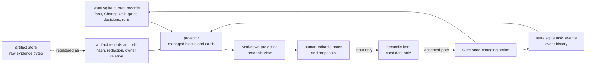

# Document Projection Reference

## What this document helps you do

Use this reference to check how Harness renders readable derived views from Core-owned state records and artifact references.

It defines projection authority boundaries, managed block behavior, human-editable sections, artifact reference rendering, output tiers, template implementation classes, and projection freshness rules. It does not define canonical kernel state, MCP request/response schemas, SQLite DDL, design-quality policy requirements, or full template bodies. Full template bodies and display card shapes live in the [Template Reference](templates/README.md).

This is reference documentation. It does not authorize runtime/server implementation, generated operational files, executable fixtures, or runtime data before the documentation set is accepted for implementation planning. The first runnable target is v0.1 Core Authority Slice, with Kernel Smoke as its narrow conformance authoring profile. The first product MVP target is v0.2 User-Facing Harness MVP. v0.3 and v0.4 harden assurance, stewardship, operations, and handoff behavior, and v1+ Expansion remains roadmap scope unless owner docs promote and prove it.

## Read this when

- You need to implement or review Markdown projection behavior.
- You are confirming that a report, status card, or Journey Card is not canonical state.
- You are deciding how a human edit to projected Markdown can become state.
- You need to separate user-readable summaries, agent compact context, and reference or diagnostic projections.
- You are diagnosing stale, failed, or drifted projections.

## Before you read

Use [Kernel Reference](kernel.md) for canonical state and gate authority, [MCP API And Schemas](mcp-api-and-schemas.md) for `ProjectionKind` and projection refs, [Storage And DDL](storage-and-ddl.md) for projection job storage, and [Template Reference](templates/README.md) for full rendered bodies and display cards.

## Main idea

Projections are readable derived views. They are generated from Core-owned state and artifact references, can display current state, refs, freshness, and proposed edits, and do not replace Core-owned state. Human edits to projections are not state changes unless a future Core/reconcile path accepts them through a state-changing action.

## Projection in plain language

A Harness projection is a readable view of work that already exists in canonical state or artifact storage. The projector reads `state.sqlite` records, `state.sqlite.task_events`, and registered artifact references, then renders Markdown such as `TASK`, `APR`, `RUN-SUMMARY`, `EVIDENCE-MANIFEST`, `EVAL`, `DIRECT-RESULT`, and other report projections.

Markdown helps humans understand the work, resume context, inspect evidence, and propose corrections. Markdown does not own the work. A report can summarize a gate, link evidence, display a Write Authorization ref, or show a Decision Packet, but the report text is not the gate, evidence, authorization, or decision.

Projection is also a privacy boundary. The projector renders artifact refs, integrity metadata, redaction state, and notes about redaction, omission, or blocking; it must not expand `secret_omitted` or `blocked` artifacts into Markdown body text.

## Output tiers

Harness keeps three derived-output tiers separate:

| Tier | Purpose | Early implementation rule |
|---|---|---|
| User-readable outputs | Short summaries that let the user understand the current work: status, judgment request, evidence summary, and close readiness or blocker summary. | Required for the user-facing MVP, but may be rendered as status/next text, compact cards, or minimal `TASK` sections rather than many separate Markdown files. |
| Agent compact context | The smallest current state needed for the next safe step: role or surface posture, current phase, current Task summary, active blockers, pending user-owned judgments, next allowed action, and freshness. | Keep it compact and current; do not embed long history, logs, traces, screenshots, full projection bodies, full schemas, or reference docs. |
| Reference/diagnostic outputs | Detailed manifests, run summaries, Journey Card or Journey Spine views, TDD traces, Module Map and Interface Contract projections, detailed Eval reports, export bundles, maps, traces, and operator reports. | Pull-on-demand or later-profile scope. These outputs remain derived views and must not become mandatory for the first runnable slice or the minimum user-facing MVP unless an owner profile explicitly promotes them. |

Agent compact context may use projections as a readable summary only when their `source_state_version` and freshness are suitable for the next action. If state matters and the projection is stale, failed, unknown, or too broad, retrieve current Core state or a state-derived compact context instead. Do not turn Markdown projections, Journey Cards, status cards, old reports, or generated summaries into always-on prompt payloads or authority. They can point to current refs to inspect; they cannot authorize writes, satisfy gates, create evidence, perform verification, record Manual QA, accept results, accept residual risk, or close a Task.

### Minimum user-facing MVP output set

The minimum user-facing MVP output set is:

- current work status
- judgment request
- evidence summary
- close readiness / blocker summary

Those outputs may reuse template shapes, but template variety must not inflate implementation scope. A single compact status/next surface plus a clear judgment-request display can satisfy the MVP display path when it is derived from Core state and refs.

The strict boundary is:

| Item | What it is | Authority |
|---|---|---|
| Raw artifact | Durable evidence file such as a diff, log, screenshot, checkpoint, bundle, or manifest file | artifact store |
| State record | Canonical structured record such as Task, Change Unit, Decision Packet, Journey Spine Entry, Residual Risk, Run, Approval, Write Authorization, Eval, Manual QA record, Evidence Manifest, Artifact record, or Reconcile Item | `state.sqlite` |
| Markdown report | Human-readable projection from records and artifact refs | projector output |

A Markdown report can link to evidence and summarize state, but it is neither the raw artifact nor the state record.

### Projection, state, and artifact authority map

This diagram shows the authority boundary that generated Markdown must preserve. Notice that state records and artifact refs feed projection, while human edits to Markdown return only as reconcile input until Core accepts a state-changing action.



Strict projection behavior is owned by this reference, especially the [Document authority matrix](#document-authority-matrix), [Managed block rules](#managed-block-rules), and [Freshness and failure rules](#freshness-and-failure-rules). Canonical state and gates are owned by [Kernel Reference](kernel.md), artifact relation storage is owned by [Storage And DDL](storage-and-ddl.md), and public projection refs are owned by [MCP API And Schemas](mcp-api-and-schemas.md). The diagram summarizes authority direction only.

Generated reports should make this visible without requiring the reader to know this reference first. In examples and templates, `source_state_version` names the state clock used for the render, `projection_version` or projection status names the rendered view, `updated_at` names when the view was produced, and freshness lines say whether the view still matches its source records. None of those fields make Markdown the owner of Task state, gates, approvals, evidence, verification, Manual QA, Decision Packets, final acceptance, residual-risk visibility, and residual-risk acceptance.

Freshness display is diagnostic and operationally relevant, but it is still display. A stale or failed projection can block close/readiness views that require current readable context or can cause an action to report `PROJECTION_STALE` through the owning API path, but it must not roll back committed Core state, change gate values, mark a Task failed, or make an old report authoritative.

## Reference scope

This document owns:

- projection principles
- document authority matrix
- managed block rules
- human-editable section rules
- artifact reference rendering rules
- output tiers and template implementation classes
- projection source-record rules
- projection freshness and failure rules
- source-state-version and managed-hash interpretation at the projection-rule level

## Not covered here

This document does not own:

- canonical kernel state and transition rules; see [Kernel Reference](kernel.md)
- public MCP request/response schemas; see [MCP API And Schemas](mcp-api-and-schemas.md)
- SQLite DDL and storage layout; see [Storage And DDL](storage-and-ddl.md)
- design-quality policy contracts; see [Design Quality Policies](design-quality-policies.md)
- operator command semantics; see [Operations And Conformance Reference](operations-and-conformance.md)
- conformance fixture assertion semantics; see [Conformance Fixtures Reference](conformance-fixtures.md#fixture-assertion-semantics)
- connector capability profiles; see [Agent Integration Reference](agent-integration.md)
- surface recipes; see [Surface Cookbook](surface-cookbook.md)
- full template bodies and display card shapes; see [Template Reference](templates/README.md)

## One generated TASK example

This is intentionally tiny. The full rendered shape lives in the [TASK template](templates/task.md).

```md
---
doc_type: task
task_id: TASK-0001
display_state: executing
projection_version: 7
source_state_version: 42
updated_at: 2026-05-06T09:30:15+09:00
---

# TASK-0001 Add Import Preview

> Projection view: rendered from `state.sqlite` `source_state_version` 42 at `updated_at`. `projection_version` describes the view, not Task state. Managed edits become drift/reconcile candidates; user proposals become state only through Core and `state.sqlite.task_events`.

<!-- HARNESS:BEGIN managed -->
## Current Summary
- mode: work
- lifecycle phase: executing
- next action: record evidence for CU-01
- evidence gate: partial
- verification gate: pending
- Manual QA: pending
- active change unit: CU-01
- projection freshness: current

## Evidence And Reports
- Run Summary: RUN-20260506-093015-LEAD-01
- Diff: DIFF-0001 (`artifact_id=ART-0001`, sha256:abc123..., redaction:none)
<!-- HARNESS:END managed -->

## User Notes and Proposals
<!-- Human-editable: notes and proposals here are input for reconcile, not state changes by themselves. -->
-
```

## What humans may edit

Humans may edit explicitly human-editable sections, such as:

```md
## User Notes and Proposals
-
```

Human-editable text is input. It can contain notes, questions, corrections, and proposals. The state-changing path is explicit: proposal -> `reconcile_items` candidate -> explicit reconcile outcome -> accepted Core state-changing action with an appended `state.sqlite.task_events` row, or rejection, defer, or conversion to a note. Until that path records an accepted Core outcome, the proposal is not Task state, Domain Language, Module Map, Interface Contract, Manual QA state, acceptance, or evidence.

Human-editable proposals may target Task summary, acceptance criteria, Domain Language, Module Map, Interface Contract, Manual QA notes, or other state-backed records, but the proposal itself is not the target record.

## What humans may not edit into state directly

Humans may not directly edit the following projection text into canonical state:

- managed block content
- front matter fields such as `source_state_version`
- current gate values, lifecycle phase, result, close reason, or assurance level
- approval, verification, Manual QA, final acceptance, or residual-risk status
- Decision Packet, Journey Card, Journey Spine, Autonomy Boundary, Write Authority Summary, Implementation Micro-Plan, Change Unit DAG, Residual Risk, Stewardship Impact, Review Stage, or Write Authorization display text
- artifact reference identity, hash, redaction state, or artifact availability
- status cards, Journey Cards, or other generated display surfaces
- template bodies

Direct edits inside managed blocks are drift, not accepted state. Direct edits to displayed authority text do not authorize writes, resolve decisions, satisfy evidence, replace verification or Manual QA, accept residual risk, upgrade assurance, close work, or mutate owner records.

## Projection principles

1. Projection is a readable derived view, not source-of-truth.
2. Canonical operational state is `state.sqlite` current records plus `state.sqlite.task_events`.
3. Raw evidence is canonical in the artifact store.
4. Markdown reports are rendered from Core state records and artifact references.
5. Markdown reports are not raw artifacts by default.
6. Front matter carries only identity, projection version or status, `source_state_version`, and timestamp/freshness metadata.
7. Managed blocks are generated by the projector and may be regenerated.
8. Human-editable sections are input surfaces for notes and proposals.
9. Accepted human edits become state only through reconcile and a Core state-changing action that appends `state.sqlite.task_events`; rejected, deferred, or note outcomes do not mutate owner records.
10. Large logs, diffs, traces, screenshots, bundles, checkpoints, and sensitive artifacts are linked by artifact refs instead of embedded.
11. Projection failure or staleness never rolls back committed Core state, rewrites `state.sqlite.task_events`, or changes the underlying task result.
12. User-facing cards may use friendly labels, but canonical gate names remain the kernel fields.
13. Decision Packet, Journey Card, Journey Spine, Autonomy Boundary, Write Authority Summary, Implementation Micro-Plan, Change Unit DAG, Residual Risk, Stewardship Impact, and Review Stage displays are non-canonical projections from owner records and artifact refs.

Projection and report surfaces may display current records, refs, and advisory next actions. They must not authorize writes, create Write Authorization, satisfy gates, create evidence, perform or record verification, record Manual QA, grant Approval, waive QA or verification, record final acceptance, record residual-risk acceptance, refresh projections by assertion alone, declare implementation readiness, close Tasks, or mutate owner records. Any such effect must come from the owner Core/MCP path named in the matrix below.

Close/readiness displays must keep evidence, verification, Manual QA, final acceptance, residual-risk visibility, and residual-risk acceptance on separate lines when those categories are relevant. A projection may summarize a test pass, Eval, QA waiver, acceptance Decision Packet, or accepted Residual Risk ref, but it must not render one of those as another category or as a single all-purpose "done" flag.

## Document authority matrix

| Fact or surface | Canonical source | Projection or display surface | Update path |
|---|---|---|---|
| Current Task state | `state.sqlite.tasks`, `task_gates`, and `state.sqlite.task_events` | `TASK` Current Summary and status card | Core transition, then projector |
| Task continuity | `state.sqlite` Task, Change Unit, Run, Evidence Manifest, Eval, Manual QA, Decision Packet, Approval, Residual Risk, `task_gates.acceptance_gate`, acceptance Decision Packet user-decision state, close events, artifact refs, `task_spine_entries` / public `journey_spine_entry` records when needed, and `state.sqlite.task_events` | `TASK` Journey Spine | Core transition or reconcile, Journey reconstruction, then projector |
| Decision Packet | `state.sqlite.decision_packets` including `decision_kind` and `judgment_domain`, related `decision_gate` state, decision events, related approval or reconcile records, artifact refs, and linked `state.sqlite.residual_risks` when applicable | `TASK` Pending Decisions, Journey Card decision line, status/next responses, judgment-context resources, and decision-packet resources; optional `DEC` when standalone projection is enabled | `request_user_decision` / `record_user_decision`, then projector |
| Journey Spine | `state.sqlite` Task, Change Unit, Run, Decision Packet, Approval, Evidence Manifest, Eval, Manual QA, Residual Risk, `task_gates.acceptance_gate`, acceptance Decision Packet user-decision state, close events, artifact refs, `task_spine_entries` / public `journey_spine_entry` records when needed, and `state.sqlite.task_events` | `TASK` Journey Spine section, resume views, Journey Spine-oriented cards | Core transition or reconcile, Journey reconstruction, then projector |
| Journey Card | current `state.sqlite` Task state, gates, active Change Unit, Autonomy Boundary summary, active Decision Packet refs, residual-risk summary, latest evidence/eval/QA/report refs, and projection freshness | `JOURNEY-CARD`, status card, `harness.status` card text, `harness.next` current-position text, significant resume output | Read or projection refresh from current state; never direct card edit |
| Autonomy Boundary | active `state.sqlite.change_units` Autonomy Boundary fields plus related Decision Packet resolutions and events | `TASK` Autonomy Boundary, Change Unit block, Journey Card autonomy line, optional related `DEC` when standalone projection is enabled | shaping update or user Decision Packet resolution, then projector |
| Write Authorization | `state.sqlite.write_authorizations` plus related Task, Change Unit, approval, Decision Packet, baseline, and consumed Run refs | `TASK` Write Authority Summary, Journey Card Write Authority Summary line, `RUN-SUMMARY` relation | `prepare_write` creates it; idempotent replay returns the already committed response; `record_run` consumes the authorization, then projector |
| Implementation Micro-Plan | current `state.sqlite` Task state and gates, active Change Unit scope and Autonomy Boundary, Change Unit dependency summary, selected feedback-loop records, TDD traces when selected, expected evidence needs, Decision Packet blockers, and latest report refs | `TASK` Implementation Micro-Plan managed section | Accepted reconcile outcome or Core state-changing action updates owner records, then projector |
| Change Unit DAG | `state.sqlite.change_units`, `state.sqlite.change_unit_dependencies`, dependency-related events, and active Task state | `TASK` Change Unit Dependencies / DAG summary | shaping update or reconcile, then projector |
| Residual Risk | `state.sqlite.residual_risks`, accepted-risk metadata and residual-risk refs, related Decision Packets, evidence/QA/eval refs, and artifact refs | `TASK` Residual Risk, optional `DEC` accepted-risk context when standalone projection is enabled, Journey Card residual-risk line | Core transition from decision, evidence, QA, Eval, reconcile, or close flow, then projector |
| Stewardship Impact Summary | `domain_terms`, `module_map_items`, `interface_contracts`, `feedback_loops`, TDD records when TDD is selected, `state.sqlite.residual_risks`, `state.sqlite.decision_packets`, policy validator results, and related refs | `TASK` Stewardship Impact and status/resume stewardship displays | Owner record update, validator result, reconcile, or close flow, then projector |
| Review Stages | Task, Change Unit, gate state, Evidence Manifest, validator results, Manual QA, Eval, Approval, Residual Risk, stewardship owner refs, and structured blocker refs | `TASK` and `RUN-SUMMARY` sections named Spec Compliance Review and Code Quality / Stewardship Review | Existing owner-record update, validator result, Decision Packet, evidence, Manual QA, Eval, residual-risk, close-blocker, Change Unit, or follow-up path, then projector |
| User Notes | human-editable input -> `reconcile_items` -> accepted Core state-changing action and `state.sqlite.task_events`, or rejected/deferred/note outcome | `TASK` User Notes and Proposals | human edit, reconcile decision, Core event |
| Shared Design | shared design records and events | `TASK` summary, `DESIGN`, optional `DEC` when standalone projection is enabled | Core transition or reconcile, then projector |
| Domain Language | `domain_terms` table | `DOMAIN-LANGUAGE` projection | Core transition or reconcile, then projector |
| Module Map | `module_map_items` table | `MODULE-MAP` projection | Core transition or reconcile, then projector |
| Interface Contract | `interface_contracts` table | `INTERFACE-CONTRACT` projection | Core transition or reconcile, then projector |
| Feedback Loop | `feedback_loops` table plus refs to runs, artifacts, TDD traces, Manual QA, and evidence manifests | `TASK` Stewardship Impact and Evidence Manifest design-quality coverage; no standalone Feedback Loop projection in the current reference catalog | `FeedbackLoopUpdate` through `record_run` shaping or evidence update, `record_manual_qa` via `feedback_loop_ref`, or reconcile, then projector |
| Approval | `approvals`, approval-shaped Decision Packet, optional decision request routing/replay record if implementation keeps one, and events; never `approval_request_candidate` alone | `APR` projection and approval card | `request_user_decision(decision_kind=approval)` creates the pending Approval record, `record_user_decision` updates the approval decision, then projector |
| Run summary | `runs` table plus artifact refs | `RUN-SUMMARY` projection | `record_run`, then projector |
| Direct result | direct run record plus artifact refs | `DIRECT-RESULT` projection | `record_run` / `close_task`, then projector |
| Evidence coverage | `evidence_manifests` plus artifact refs | `EVIDENCE-MANIFEST` projection | evidence module update, then projector |
| Verification verdict | `evals` plus artifact refs | `EVAL` projection and verification card | `record_eval`, then projector |
| TDD trace | `tdd_traces` plus artifact refs | `TDD-TRACE` projection | `record_run` or reconcile, then projector |
| Manual QA | `manual_qa_records` plus artifact refs when a record exists; `qa_gate` is canonical gate for pending or satisfied QA | `MANUAL-QA` projection and QA card | `record_manual_qa`, then projector |
| Raw evidence | artifact store plus `artifacts` records | artifact references in reports | artifact registry |
| Projection freshness | `projection_jobs.source_state_version`, `projection_jobs.projection_version`, job status, managed hashes, artifact records | front matter mirror, status card, operations output | projector and recovery tools |

Decision Packet projections and cards render the schema-owned `judgment_domain` as the user-facing judgment grouping. Templates may translate enum values into friendly labels, but they must keep `decision_kind` as the lifecycle/gate route and `judgment_domain` as display grouping. `judgment_domain` is not a `ProjectionKind`, gate, close aggregation input, approval substitute, waiver substitute, or residual-risk acceptance rule.

Required authority statements:

- User Notes: human-editable input -> `reconcile_items` -> accepted Core state-changing action and `state.sqlite.task_events`, or rejected/deferred/note outcome
- Domain Language: `domain_terms` table -> `DOMAIN-LANGUAGE` projection; public refs to canonical term rows use `StateRecordRef.record_kind=domain_term`
- Module Map: `module_map_items` table -> `MODULE-MAP` projection; public refs to canonical module rows use `StateRecordRef.record_kind=module_map_item`
- Interface Contract: `interface_contracts` table -> `INTERFACE-CONTRACT` projection; public refs to canonical contract rows use `StateRecordRef.record_kind=interface_contract`
- Feedback Loop: `feedback_loops` table -> `TASK` and Evidence Manifest display; public refs to canonical feedback-loop rows use `StateRecordRef.record_kind=feedback_loop`; TDD Trace refs remain separate execution evidence refs
- Decision Packet: `state.sqlite.decision_packets` including `judgment_domain` and related refs -> `TASK` Pending Decisions, status/next responses, judgment-context resources, and decision-packet resources; optional `DEC` projection when standalone projection is enabled
- Journey Spine: reconstructed from owner records, artifact refs, `task_spine_entries` / public `journey_spine_entry` records when needed, and `state.sqlite.task_events`; it is not its own authority record
- Journey Card: derived display from current state and refs; it is never canonical state
- Autonomy Boundary: active `state.sqlite.change_units` boundary fields -> projection surfaces; it is judgment latitude, not scope authority
- Write Authority Summary: derived display from active scope, approval, Write Authorization, baseline, and guarantee refs; it is never canonical state and cannot authorize work
- Write Authorization: `state.sqlite.write_authorizations` records a specific allowed write attempt; it is not scope, approval, evidence, verification, QA, final acceptance, or residual-risk acceptance
- Implementation Micro-Plan: current Task and Change Unit owner records plus related refs -> `TASK` managed execution-aid section; it is not canonical state, not a new `ProjectionKind`, not scope authority, not approval, and not Write Authorization
- Approval: `approvals` plus the approval-shaped Decision Packet -> `APR` projection only after the Approval record exists or changes; an `approval_request_candidate` from `prepare_write` may appear as candidate display, but it is not an `APR` source
- Change Unit DAG: `state.sqlite.change_unit_dependencies` and Change Unit refs -> dependency projection; it is not a scheduler or authorization surface
- Residual Risk: `state.sqlite.residual_risks` including accepted-risk metadata/refs -> residual-risk displays
- Stewardship Impact Summary: derived from owner records, validator results, and refs -> `StewardshipImpactSummary` display; it is not a canonical record
- Review Stages: Task, Change Unit, gates, evidence, validator results, residual-risk refs, and stewardship owner refs -> managed `TASK` or `RUN-SUMMARY` display sections named Spec Compliance Review and Code Quality / Stewardship Review; they are not canonical records; they are not new `ProjectionKind` values, Approval, evidence, verification, QA, final acceptance, residual-risk acceptance, close, Write Authorization, or detached verification

## Managed block rules

Managed blocks are the only Markdown areas the projector may overwrite:

```md
<!-- HARNESS:BEGIN managed -->
...
<!-- HARNESS:END managed -->
```

Rules:

- Managed block content is generated from committed state records and artifact refs.
- The projector records `projection_jobs.source_state_version`, projection version, rendered timestamp, and managed hash. Front matter mirrors the recorded source state version for operators.
- The managed hash is computed from the projector-owned managed block body, excluding the `HARNESS:BEGIN` and `HARNESS:END` marker lines, after normalizing line endings to LF and preserving meaningful whitespace required by the projector rules.
- If the managed block hash differs from the last projected hash before rendering, the projector creates or updates a reconcile item.
- The managed hash is used only for drift detection; it never makes the rendered Markdown canonical state.
- The projector does not silently treat a direct edit inside a managed block as accepted state.
- Re-rendering a managed block must preserve unrelated human-editable sections.
- A failed render marks projection freshness `failed` or `stale`; it does not roll back state.
- Rendered templates should include a short projection boundary notice near the top or in the managed summary so readers can tell that the report is a view, managed blocks are projector-owned, and human-editable sections are proposal input.

Front matter stays diagnostic and compact. It may identify the rendered object, show the projection version or status, mirror `source_state_version`, and include the rendered timestamp. It must not contain large state summaries, evidence bodies, gate rollups, or artifact inventories.

`projection_version` is the projection/template/job version. It is not a state clock and must not be used as the source-state freshness basis. `source_state_version` is the affected-scope state clock value used as the render source: the Task State Version when the projection is task-scoped, otherwise the Project State Version or extension-defined owner state clock.

The canonical per-projection value is `projection_jobs.source_state_version` for the successful render job. Front matter `source_state_version` only mirrors that value for operator diagnosis.

Do not collapse display problems into one status:

- A stale projection means the readable Markdown or card may lag behind the owner records or artifact refs.
- Stale state, stale baseline, or stale evidence means the underlying state or evidence inputs have moved or are no longer sufficient; the projection may be current while still displaying that blocker.
- MCP unavailable means the surface or caller cannot reach the required Harness/Core capability. If Core cannot be reached, no authoritative Core state mutation, projection repair, approval, close, or gate update can be claimed from the display alone.

## Human-editable section rules

- Human-editable text is input, not canonical state.
- Reconcile reads the edit and creates a `reconcile_items` candidate when state may need to change.
- Accepted proposals become state only through a Core transition and appended `state.sqlite.task_events` row.
- Rejected proposals remain notes or rejected reconcile items.
- The projector must preserve human-editable content across refreshes.
- Human-editable proposals may target Task summary, acceptance criteria, Domain Language, Module Map, Interface Contract, Manual QA notes, or other state-backed records, but the proposal itself is not the target record.

## Embedding vs referencing

User-readable outputs should embed only concise summaries and safe labels. Large logs, diffs, traces, screenshots, recordings, checkpoints, bundles, export components, and sensitive artifacts should be referenced by `ArtifactRef` or `StateRecordRef`, not pasted into readable Markdown.

Reference/diagnostic outputs may list richer artifact inventories, hashes, retention state, and availability notes, but they still reference large or sensitive bytes instead of reconstructing them. A projection may say what a ref supports and whether the input is redacted, omitted, blocked, stale, or missing; it must not inline omitted secret/PII values, blocked payload bytes, or unbounded raw evidence.

## Artifact reference rendering

Markdown reports render artifact references compactly and consistently. The payload shape is owned by the MCP API document; projection owns only presentation rules.

Recommended display:

```text
- Diff: DIFF-0001 (`artifact_id=ART-0001`, sha256:abc123..., redaction:none)
- Test log: LOG-0002 (`artifact_id=ART-0002`, sha256:def456..., redaction:redacted)
- Bundle: BUNDLE-0001 (`artifact_id=ART-0003`, sha256:789abc..., redaction:secret_omitted)
- Browser trace: TRACE-0004 (`artifact_id=ART-0004`, sha256:012def..., redaction:blocked)
```

Rules:

- Every artifact ref must resolve to an artifact record.
- Every raw artifact ref must carry integrity metadata and redaction state.
- Large or sensitive evidence is linked, not pasted into Markdown.
- User-visible artifact lines should show the ref identity, owner or supporting record when useful, hash or short hash, size when useful, redaction state, retention class or availability, and any omission/block note needed to understand evidence impact.
- `secret_omitted` artifacts are displayed as refs plus omission notes or handles. They may support visible nonsecret claims, but projection text must not imply that omitted values were inspected or proven.
- `blocked` artifacts are displayed as refs plus block notes. The displayed hash, size, and content type describe the committed metadata-only notice bytes, not the forbidden raw payload. The projector must not reconstruct, inline, summarize, or export omitted or blocked raw values.
- A `blocked` artifact display means the raw capture is unavailable. Evidence, QA, verification, Release Handoff, and export displays must surface that block as blocked, insufficient, unavailable input, or unresolved until a replacement, waiver, Decision Packet outcome, accepted risk, or documented fallback resolves the path.
- Missing or hash-mismatched artifacts mark related evidence, projection freshness, export display, or close-readiness views stale or blocked. User-visible reports should point to the affected ref and the `artifacts check` or recovery path; they should not paste report prose as replacement evidence.
- State record refs use record identity and optional projection path; for `record_kind=projection`, identity is `projection_jobs.projection_job_id` and the path is only a locator. They are not rendered as raw artifact refs.
- `artifact_links.record_kind` must resolve to an existing same-Task state owner or projection ref. Current Task-scoped artifact links remain Task-scoped; `record_kind=projection` resolves to a completed `projection_jobs` row with the same `task_id`, and the link's `record_id` is `projection_jobs.projection_job_id`, while path display uses `StateRecordRef.projection_path` or `projection_jobs.output_path`. Project-level owner rows and project-level projection jobs use state or projection job freshness/output metadata unless a future extension adds project-scoped artifact linking. `EXPORT` is a `ProjectionKind` only; export snapshots and components remain artifacts linked to their owner records or to `record_kind=projection`, not to `record_kind=export`.

## Template implementation classes

The template catalog is intentionally broader than the early implementation set. Template classes stage rendered shapes without changing projection authority:

| Class | Templates or output shapes | Rule |
|---|---|---|
| Required for first runnable kernel slice | Minimal [Compact Status Card](templates/compact-status-card.md) or equivalent status/next/blocker response shape | Required as read-only output from current Core state. It does not require a persisted Markdown projection job. |
| Required for user-facing MVP | Minimal [TASK](templates/task.md) continuity summary and [Decision Packet](templates/decision-packet.md) display/card shape for judgment requests, not the standalone `DEC` `ProjectionKind` | Required only to the extent needed to show current status, judgment request, evidence summary, and close readiness/blockers. Standalone persisted `DEC` Markdown remains optional unless the standalone Decision Packet projection feature is enabled. |
| Optional early | [APR](templates/approval.md), [Approval Card](templates/approval-card.md), [DIRECT-RESULT](templates/direct-result.md), [MANUAL-QA](templates/manual-qa.md), [Manual QA Card](templates/manual-qa-card.md), [Verification Result Card](templates/verification-result-card.md) | Useful when the corresponding approval, direct-work, Manual QA, or verification profile is active; not first-slice requirements. |
| Future / diagnostic | [RUN-SUMMARY](templates/run-summary.md), [EVIDENCE-MANIFEST](templates/evidence-manifest.md), [EVAL](templates/eval.md), [TDD-TRACE](templates/tdd-trace.md), [DOMAIN-LANGUAGE](templates/domain-language.md), [MODULE-MAP](templates/module-map.md), [INTERFACE-CONTRACT](templates/interface-contract.md), [DESIGN](templates/design.md), [EXPORT](templates/export.md), [JOURNEY-CARD](templates/journey-card.md) | Detailed reference, diagnostic, handoff, stewardship, map, trace, or export views. Keep them available for v0.3, v0.4, operations, handoff, or other owner-promoted later profiles without making them mandatory early scope. |

`Future / diagnostic` means later-profile or diagnostic scope, not automatically v1+ only.

No template class makes a projection canonical state or creates evidence, QA, verification, final acceptance, residual-risk acceptance, close authority, or Write Authorization. If a source record does not exist, the projector must not invent placeholder state to satisfy template completeness.

The `EXPORT` template is an optional projection output. It does not introduce an `export` state record for artifact links. Export projections list artifact refs, hashes, redaction states, and redaction/omission/block notes; they do not embed large or sensitive artifact bodies by default.

Persisted `JOURNEY-CARD` Markdown, Journey Spine output, Run Summary, TDD Trace, Module Map, Interface Contract, export bundles, and detailed Evaluation views are not mandatory early scope. Current-position context for status, next, and resume can be satisfied by compact user-readable or agent compact context outputs.

Required Decision Packet visibility is provided through status/next responses, judgment-context resources, decision-packet resources, and minimal `TASK` or card displays. That requirement is for the Decision Packet judgment-request display shape, not the standalone `DEC` `ProjectionKind`. Standalone `DEC` Markdown is optional unless the standalone Decision Packet projection feature is enabled.

Decision Packet record IDs use `DEC-*`. `DEC` as a `projection_kind` is only the projection kind label; when a standalone projection needs its own identity, use a separate `projection_id` such as `DEC-PROJ-0001`.

Display card shapes live in the [Template Reference](templates/README.md): [Compact Status Card](templates/compact-status-card.md), [Approval Card](templates/approval-card.md), [Verification Result Card](templates/verification-result-card.md), and [Manual QA Card](templates/manual-qa-card.md).

## Freshness and failure rules

Projection freshness is computed from the current owner or affected-scope state clock, canonical `projection_jobs.source_state_version`, projection job state, managed hashes, artifact availability, and known stale triggers. Front matter `source_state_version` mirrors the canonical value from the last successful render so operators can diagnose stale projections without treating the Markdown as canonical.

Close/readiness displays must distinguish three facts: the current Core state version, the projection source version or failed job status, and whether the readable view is current enough for the requested operation. They must not infer readiness from stale Markdown, and they must not treat a failed projection as a rollback or mutation of the current Task, Run, evidence, Eval, QA, Approval, Decision Packet, or residual-risk state.

| Projection | Generated when | Stale when |
|---|---|---|
| `TASK` | Task created, resumed, changed, or refreshed | current `tasks.state_version > projection_jobs.source_state_version` for the `TASK` projection, managed block drift, unresolved reconcile required, stewardship owner refs or design-quality validator results changed |
| `APR` | committed approval request is created by `request_user_decision(decision_kind=approval)`, or approval decision changes through `record_user_decision` | approval-shaped Decision Packet, linked Approval record status, scope, baseline, expiry, or decision note changes |
| `RUN-SUMMARY` | `record_run` commits a Run, including `runs.status=completed`, `interrupted`, `blocked`, or `violation` | run relation changes, artifact ref missing, artifact integrity fails |
| `EVIDENCE-MANIFEST` | evidence coverage changes | baseline drift, changed files modified, required evidence missing/stale, Approval expired |
| `EVAL` | verification result recorded | baseline changes after Eval, evidence becomes stale, independence relation invalidated |
| `DIRECT-RESULT` | direct run closes or escalates | changed file drift, escalation state changes, artifact ref missing |
| `EXPORT` | export/report projection is generated, including a Release Handoff profile when enabled | any included Task/gate/Change Unit/Decision Packet/Residual Risk/evidence/verification/Manual QA/artifact/projection/redaction/checklist source changes or becomes unavailable |
| `DEC` | standalone Decision Packet projection is enabled and a Decision Packet is created, requested, resolved, deferred, rejected, blocked, or superseded | packet status, affected scope, current-state context, related approval/reconcile state, residual-risk refs, or evidence refs change |
| `JOURNEY-CARD` | card is rendered or persisted as a projection; `harness.status` and `harness.next` may also return it ephemerally without a projection job | any displayed Task/gate/Change Unit/Autonomy Boundary/Write Authorization/approval/baseline/guarantee/Decision Packet/Residual Risk/evidence/report/freshness source moves ahead of the rendered card |
| `DOMAIN-LANGUAGE` | domain terms change | term conflict, accepted term record changes, related code representation moves |
| `MODULE-MAP` | module map records change | module path, public interface, dependency direction, internal complexity, test boundary, owner decision, or watchpoint changes |
| `INTERFACE-CONTRACT` | interface contract records change | linked interface, caller, compatibility impact, or boundary tests change |
| `TDD-TRACE` | trace recorded or updated | red/green log missing, baseline drift, linked test file changes |
| `MANUAL-QA` | QA record created or updated | linked UI/code changes, required capture missing, finding unresolved |

Freshness states:

| State | Meaning |
|---|---|
| `current` | projected content matches the committed state version recorded in canonical `projection_jobs.source_state_version` and the managed hash |
| `stale` | state or referenced evidence moved ahead of the projection |
| `failed` | projector attempted refresh and failed |
| `unknown` | freshness cannot be computed, usually during recovery or migration |

Projection staleness can block actions that require current readable context, including close/readiness checks that rely on current report views, but it does not change lifecycle result, gate values, or assurance by itself. Projection failure or staleness never changes the underlying task result and never rolls back committed Core state.
