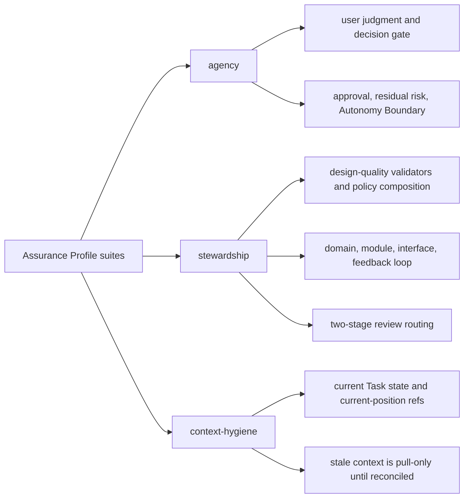

# Future Fixture Catalog

## What this document helps you do

Use this appendix to review the future fixture catalog separately from the small core conformance model. It collects detailed candidate scenarios for browser QA, cross-surface behavior, export non-leakage, context hygiene, reconcile, stewardship, operations, advanced projection rendering, and future guarantee-level checks.

This is future design documentation only. The current repository is documentation-only and contains no runnable Harness Server conformance tests; current phase and handoff status are tracked in [Implementation Overview](../build/implementation-overview.md#documentation-acceptance-status).

## Catalog Boundary

The core conformance model, exact fixture body, execution rules, assertion semantics, and narrow Engineering Checkpoint Kernel Smoke authoring order stay in [Conformance Fixtures Reference](conformance-fixtures.md). This catalog is deliberately downstream of that model. Catalog rows are not fixture bodies, not public API schemas, not DDL, not stage exits, and not proof that fixtures already run.

Future catalog scenarios become executable only after an owner promotes the behavior, identifies the delivery stage or local suite, and materializes exact-shape fixtures that prove Core-owned state and artifact assertions. Projection output may be checked for freshness, readability, and availability, but it must not replace Core state or become conformance truth.

## Catalog-Only Future Families

The families below are intentionally parked in this catalog. They are not required for Engineering Checkpoint or MVP-1 User Work Loop, and the catalog listing alone does not make them stage-required later. A future owner must promote the exact behavior, stage, fallback, security wording, and exact-shape fixtures before any row becomes executable conformance.

| Future family | Catalog boundary |
|---|---|
| Full Manual QA | Full policy matrix, browser/manual capture expansion, QA waiver detail, and QA dashboards stay future or Assurance Profile or later owner-profile scope. MVP-1 may show a missing-QA or evidence blocker only when a minimal active profile requires it. |
| Eval systems and detached verification automation | Cross-surface/evaluator orchestration, Eval detail reports, same-session independence hardening, and assurance upgrades stay future or Assurance Profile or later owner-profile scope. MVP-1 only requires honest non-claiming unless a compatible verification record actually exists. |
| TDD trace and feedback-loop policy | RED/GREEN trace, feedback-loop execution policy, and policy-specific test-path fixtures stay future or Assurance Profile or later owner-profile scope. |
| Module map and interface contract | Domain/module/interface stewardship fixtures stay future catalog candidates until owner docs promote exact records and validators. |
| Journey, Spine, and detailed report projections | Journey Card, Journey Spine, Run Summary, detailed Evidence Manifest, detailed Eval, and polished report projections are derived-output candidates; they do not become state or MVP-required projection kinds. |
| Export, recover, release handoff, and artifact-integrity operations | Operations fixtures for export/recover, release handoff, retention, redaction export, and artifact checks stay Operations Profile or later or promoted owner-profile scope. |
| Dashboard, team workflow, and orchestration fixtures | Hosted UI, dashboard, shared/team workflow, permission, parallel-lane, and orchestration fixtures stay roadmap candidates until promoted. |
| Advanced connector and security fixtures | Broad connector ecosystems, remote/shared MCP, browser capture automation, preventive guards, isolated profiles, hooks, sidecars, and higher security claims require owner-defined mechanisms and fixture proof for the covered operation before promotion. |

## Artifact Redaction And Export Non-Leakage Catalog Entries

These catalog rows are future scenario guidance. They become executable only when a promoted owner path materializes exact-shape fixtures that assert artifact metadata, owner links, redaction state, integrity, and downstream state effects without exposing omitted secret or PII values.


| Scenario ID | Action | Required assertions |
|---|---|---|
| `ARTIFACT-secret-omitted-supports-visible-evidence-only` | `record_run`, `record_manual_qa`, or `record_eval` | `expected_artifacts` includes the committed artifact with `redaction_state: secret_omitted`; evidence, QA, or Eval assertions credit only the visible nonsecret evidence; any claim requiring the omitted value remains unsupported, partial, blocked, or insufficient; projections and reports show omission notes or handles without asserting the omitted secret or PII value. |
| `ARTIFACT-blocked-notice-is-committed-but-unavailable-input` | `record_run`, `record_manual_qa`, `launch_verify`, or `artifacts_check` | `expected_artifacts` includes the committed artifact with `redaction_state: blocked`, and optional hash/size/content-type assertions match the metadata-only notice bytes; downstream evidence, QA, Eval, projection, export, or Release Handoff assertions show blocked, insufficient, unavailable input, or unresolved impact unless a replacement, waiver, user judgment outcome, accepted risk, or documented fallback is part of the scenario. |
| `ARTIFACT-staged-uri-untrusted-task-scope-required` | `record_run`, `record_manual_qa`, `record_eval`, or `artifacts_check` | An arbitrary caller-supplied `staged_uri`, absolute path, traversal path, symlink escape, repo-local path, or cross-Task artifact relation is not accepted as a committed artifact; no evidence, QA, Eval, projection, export, or Release Handoff claim is credited from it; committed artifact links resolve only to trusted staging/capture bytes and a same-Task owner relation, or to a completed same-Task projection job when `record_kind=projection`. |
| `ARTIFACT-integrity-mismatch-blocks-dependent-claims` | `artifacts_check`, `recover`, `export`, or `close_task` | A missing artifact file, hash mismatch, size mismatch, or owner-link mismatch is reported through artifact integrity results and dependent evidence, QA, Eval, projection, export, or close-readiness assertions become stale, blocked, or insufficient according to the owner path. The check does not silently rewrite artifact records, credit unverified bytes, leak blocked content, or repair close readiness without an existing recovery, replacement, or reconcile path. |
| `EXPORT-redaction-notes-do-not-leak-omitted-or-blocked-values` | `export` or Release Handoff report read | Export or Release Handoff assertions list artifact refs, redaction states, omission/block notes, and affected displays; raw omitted values and forbidden blocked payload bytes are not present in exported snapshots, raw-file copies, report text, or fixture assertions. |
| `EXPORT-secret-pii-omission-reported-not-silent` | `export` or Release Handoff report read | Secret or PII removal is visible as safe omission, redaction, or block metadata tied to affected artifact refs and evidence, QA, verification, projection, or Release Handoff displays; the export omits the sensitive values, does not widen access to staged or blocked content, and does not hide the fact that material was omitted or blocked. |

## Agency, Stewardship, Context, And Design-Quality Suites

Agency, stewardship, context hygiene, and design-quality are Assurance Profile suites. They test state behavior through Core entrypoints such as `prepare_write`, `request_user_judgment`, `record_user_judgment`, `record_manual_qa`, `record_eval`, `close_task`, `next`, and operator actions that call Core. They must not pass by matching Journey Card, user judgment, residual-risk, review-stage, or status prose.

Catalog suite responsibilities after owner promotion:

| Suite | Catalog behavior after owner promotion |
|---|---|
| agency | Blocking user-owned judgment requires a compatible user judgment before affected write or close; judgment request routing metadata is optional compatibility data and alone must not satisfy `decision_gate`; writes blocked on user-owned product or material technical trade-offs are held; sensitive-action permission and later Approval-profile lifecycle keep Approval, user judgment, and Write Authorization distinct; Manual QA, work acceptance, and residual-risk acceptance are separate user judgments with separate owner paths; AFK Autonomy Boundary stop conditions block public commitments; known close-relevant residual risk must be visible before any successful work acceptance or close; if no known close-relevant risk exists, `ResidualRiskSummary.status=none` satisfies residual-risk visibility; risk-accepted close additionally requires accepted Residual Risk refs whose risks were visible before acceptance. |
| stewardship | Design-quality and codebase-stewardship validators affect `design_gate`, `decision_gate`, `qa_gate`, close blockers, and waiver eligibility through canonical owner records, refs, and policy-owned severity composition; shared design, public interface, module, domain-language, feedback-loop, TDD, Manual QA, and waiver checks route findings through existing owner paths instead of duplicating schemas or DDL; generated-file and managed-block drift stays in reconcile; Review Stage displays separate Spec Compliance Review from Code Quality / Stewardship Review without creating canonical records, `ProjectionKind` values, Approval, evidence, verification, QA, work acceptance, residual-risk acceptance, close, or Write Authorization. |
| context-hygiene | Current Task state, current-position refs, evidence refs, verification bundles, and freshness state are authoritative only when current; stale PRDs, stale projections, stale chat memory, closed issues, old design docs, and long logs are pull-only context until reconciled or refreshed; stale context cannot authorize writes, close, acceptance, verification, residual-risk acceptance, or current-state replacement. |
| design-quality | Policy-pack smoke coverage composes agency, stewardship, context-hygiene, and close-impact validators through existing ValidatorResult and gate behavior; fixtures assert the merged blocker, waiver, user judgment, Manual QA, or close outcome produced by owner policy composition while keeping individual findings visible. Design-quality coverage must not redefine kernel authority, create new gates, or hide lower-severity findings merely because a stronger blocker is also present. |

Status/next recommendations, including Role Lens recommendations, are fixture-observable only as read responses. Fixtures may assert `recommended_playbooks` when relevant, but must also prove no state event, gate satisfaction, projection enqueue, artifact, evidence, verification, QA, work acceptance, residual-risk acceptance, close, or assurance upgrade resulted from the recommendation itself. If a recommendation or role lens implies user-owned judgment, the expected behavior is a user judgment ref or user judgment request path, not a satisfied `decision_gate`. If it identifies validator, evidence, Manual QA, residual-risk, or release-handoff work, the expected behavior is a routed recommendation or candidate, not a committed owner record unless a later public mutation fixture records it through Core.

`browser-qa-candidate` recommendations are subject to the same read-only rule. A recommendation may name Browser QA Capture as useful for a `T6 QA Capture` surface, but the recommendation alone must not mutate state, enqueue projections, create artifacts, create or satisfy evidence, perform or record verification, record QA, waive QA or verification, accept residual risk, accept the result, close a Task, or upgrade assurance. If the surface does not support browser capture, the recommendation should name the fallback of human Manual QA notes and manually supplied artifacts rather than treating unsupported capture as a staged-delivery failure. Actual artifacts, Manual QA records, QA gate updates, Eval results, or close effects require a later public mutation through Core.

Future suite map summary: these are catalog-only Assurance Profile suite families and concerns; they are not runnable fixtures or early MVP requirements by being listed here.



### Catalog-Only Fixture Skeleton Guidance

The guidance below is for turning catalog families into exact-shape fixtures. It is catalog-only skeleton guidance, not an executable fixture body, public request schema, DDL extension, or runner design. Delivery-stage mapping belongs in suite catalog metadata, not in the fixture body. "Minimum seeded records" means owner records placed in `initial_state` after expansion and validation by the Storage And DDL rules; public mutations still use the exact MCP request payload under `input`.

### Later-Profile Fixture Shorthand Notes

These notes are catalog-only future guidance. They are not stage-required for Engineering Checkpoint or MVP-1 User Work Loop, not an executable runner contract in this documentation-only repository, and not a second API. A future owner may use them only after promoting the relevant later profile and materializing exact-shape fixtures whose public mutations still validate against public request schemas.

Later-profile catalog examples may use compact `initial_state` or suite metadata shorthand such as `owner_records`, `stewardship_findings`, selected-loop shorthand, full Manual QA/Eval owner records, TDD Trace records, or accepted residual risk state. Before any fixture becomes executable, that shorthand must expand to owner records, validator runs, residual-risk records, or other state explicitly owned by DDL/API docs. It must not create fixture-only storage rows or alternate request payload branches.

Public mutation examples still use the documented public request branch. `close_task` `input` remains `CloseTaskRequest` after any `ToolEnvelope` expansion; evidence profiles, changed paths, artifact refs, acceptance-criteria support, self-check summaries, full Manual QA records, Eval records, and risk-acceptance state are seeded in `initial_state` or recorded by a preceding public mutation fixture such as `record_run`, `record_eval`, `record_manual_qa`, or `record_user_judgment`.

For later feedback-loop and TDD examples, shorthand such as bare `FBL-*` refs may appear only in catalog examples. Future executable fixtures must map it to `StateRecordRef { record_kind: feedback_loop, record_id: ... }` and store or mutate the underlying owner records through documented schemas. Public mutation fixtures express definition changes as `FeedbackLoopUpdate` under `record_run.payload.shaping_update.feedback_loop_updates`, execution/status changes under `evidence_updates.feedback_loop_updates`, and Manual QA execution through the public `record_manual_qa` request branch. If a catalog row lists only a loop id and status, the future seed loader must supply the required owner fields from the surrounding Task, Change Unit, selected-loop, and evidence context before insertion or public request construction.

Accepted-risk shorthand is later-profile state on seeded `residual_risk` records, not a standalone accepted-risk record. Bare `RISK-*` values in catalog examples such as `visible_refs`, `accepted_refs`, `not_visible_refs`, `unaccepted_refs`, or `residual_risk_refs` must map to `StateRecordRef { record_kind: residual_risk, record_id: ... }` before execution. Future staged-delivery fixtures must not require standalone `ARISK-*` records.

### Intake And Decision Catalog Entries

These are catalog entries, not fixture bodies. They cover ordinary user-language behavior and user judgment quality while preserving the exact fixture shape and the rule that future executable fixtures prove behavior through Core state, events, artifacts, projections, and errors.

| Scenario ID | Core action | Required assertions |
|---|---|---|
| `INTAKE-natural-language-starts-without-startup-phrase` | `intake`, `status`, or `next` | A user request whose shape should be tracked by Harness is recognized even when the user does not say "Harness," `Task`, `Change Unit`, `user judgment`, or any required startup phrase. An `intake` action may start or resume the intake path. A `next` read may recommend or route to the next safe intake action. A `status` read may report current or no-active state and show that intake is needed, but must not claim intake started or mutate state. The fixture asserts the current or proposed Task mode, scope, out-of-bounds area, next safe action, blockers, and guarantee display, and also asserts that the natural-language request alone does not authorize product writes or create a Write Authorization. |
| `INTAKE-user-plain-language-maps-to-harness-records` | `intake`, `prepare_write`, or `request_user_judgment` | The user may use ordinary phrases such as "change the checkout flow" or "which option should we pick?" without naming `Change Unit` or `user judgment`; Core routes the request to the compatible Task, proposed or active Change Unit, user judgment ref or candidate, and current blockers. The fixture must not require exact Harness vocabulary in user text and must still assert the owner records, refs, gates, projections, and errors that result. |
| `INTAKE-tiny-direct-profile-no-authority-bypass` | `intake`, `status`, `next`, `prepare_write`, or `close_task` | A typo, single docs sentence, or obvious rename may be classified with the tiny direct profile only as `mode=direct`. Fixtures assert there is no `tiny` mode value, no Write Authorization from classification alone, no bypass of active scope or compatible `prepare_write` where product writes apply, no bypass of user-owned judgment or sensitive-action permission / Approval, and no ability to use Tiny for auth, security, privacy, secrets, infra, public interface/API, UX workflow, schema, or multi-step work. If scope broadens or evidence beyond the tiny changed-path/self-check note is needed, the displayed next action escalates to ordinary Direct; if product judgment, architecture choice, public interface/API impact, UX workflow, sensitive category, schema, or multi-step delivery appears, it escalates to Work and uses Discovery or Shared Design when shaping is needed. |
| `INTAKE-codebase-answerable-before-user-question` | `intake` or `next` | Before asking the user, facts already present in seeded current context, explicit repo/codebase refs, Harness state refs, or connector/session-provided facts are used when they are current and safe to rely on. The fixture asserts those provided refs or facts are used instead of asking the user to repeat them; it does not require Core to perform unbounded repository, docs, or codebase search. Any remaining unresolved user-owned product or material technical judgment routes to a focused question or user judgment. |
| `AGENCY-user-judgment-quality-complete-context` | `request_user_judgment`, `prepare_write`, or `next` | A user judgment or `UserJudgmentCandidate` for user-owned product or material technical judgment includes `judgment_type`, `presentation`, `display_label`, the exact question, relevant scope, pending option labels or selected outcome, minimum current context, source/evidence refs, and affected refs. `presentation=full` also includes realistic options, trade-offs through benefits/costs/risks, recommendation, uncertainty, deferral consequence, affected gates or acceptance criteria, and residual-risk impact when relevant. A vague "continue?" prompt or broad approval request does not satisfy `decision_gate`. A full-format judgment request may make one strong recommendation when it still shows rejected alternatives, no-op/defer/reduce-scope paths, or why other paths are unsafe or out of scope, so the user can make a real judgment. |
| `AGENCY-approval-does-not-substitute-for-judgment-or-close` | `prepare_write`, `record_user_judgment`, or `close_task` | Granted sensitive-action permission remains separate from product judgment, user judgment resolution, Write Authorization, evidence, verification, Manual QA, work acceptance, and residual-risk acceptance. Minimum MVP-1 may represent the grant through a resolved sensitive-action approval user judgment; later Approval profiles may seed a committed Approval as granted. Fixtures assert that missing compatible owner records still block affected writes or close, and that permission or approval alone does not create Write Authorization, satisfy work acceptance, produce detached verification, waive QA, accept risk, or close a Task. |
| `AGENCY-residual-risk-visible-before-acceptance-or-close` | `record_user_judgment` or `close_task` | Known close-relevant residual risks must be visible to the user before acceptance and before any successful close. Fixtures assert hidden, stale, or not-yet-visible risks block acceptance or close; `ResidualRiskSummary.status=none` is valid only when no known close-relevant risk exists; risk-accepted close cites accepted Residual Risk refs that were visible before acceptance. |
| `AGENCY-approval-qa-acceptance-risk-judgments-distinct` | `record_user_judgment`, `record_manual_qa`, `record_eval`, or `close_task` | Sensitive-action permission / Approval, Manual QA judgment or waiver, work acceptance, verification waiver, and residual-risk acceptance remain distinct owner judgments. A fixture may seed one as satisfied and assert the others still block when their owner records are missing or incompatible; no broad approval or QA pass may imply work acceptance, risk acceptance, detached verification, or close. |

## Staged Fixture Coverage

The rows below are future catalog candidates for evidence, verification, connector, stewardship, projection, reconcile, operations, and assurance behavior. They become executable requirements only after owner docs promote the relevant behavior into an implementation stage or local suite. Suite catalogs may map scenario IDs to candidate stages for planning, but that metadata is not part of the fixture body and does not create Engineering Checkpoint or MVP-1 exit criteria by itself.

The YAML blocks below are future fixture examples for planning. They are not fixture files in the current repository and are not evidence that runnable Harness Server conformance tests already exist. Use them to show assertion shape and owner boundaries; do not make detailed templates, renderer output, or broad scenario coverage mandatory unless a promoted owner path needs them to prove the target behavior.

```yaml
scenario_id: CORE-evidence-direct-docs-only-sufficient
initial_state:
  active_task:
    task_id: TASK-DOCS-001
    mode: direct
    lifecycle_phase: executing
    acceptance_criteria: ["AC-01 typo corrected"]
    gates:
      scope_gate: passed
      evidence_gate: sufficient
      verification_gate: not_required
  runs:
    - run_id: RUN-DOCS-001
      kind: direct
      status: completed
      summary: "Rendered Markdown heading and checked typo fix."
      observed_changes:
        changed_paths: ["docs/help.md"]
      artifact_refs: [ART-DIFF-001]
  evidence_manifests:
    - evidence_manifest_id: EM-DOCS-001
      status: sufficient
      criteria:
        AC-01:
          status: supported
          refs: [ART-DIFF-001]
      changed_files: ["docs/help.md"]
      supporting_refs: [RUN-DOCS-001, ART-DIFF-001]
  artifacts:
    - artifact_id: ART-DIFF-001
      kind: diff
input:
  task_id: TASK-DOCS-001
  intent: complete
  requested_close_reason: completed_self_checked
  user_note: "Self-check recorded in RUN-DOCS-001."
  superseded_by_task_id: null
action: close_task
expected_state:
  lifecycle_phase: completed
  result: passed
  close_reason: completed_self_checked
  assurance_level: self_checked
  gates:
    evidence_gate: sufficient
  residual_risk_summary:
    status: none
    close_relevant_count: 0
expected_events:
  - close_requested
  - task_closed
expected_artifacts:
  - artifact_id: ART-DIFF-001
    kind: diff
expected_projection:
  TASK: enqueued
expected_error: null
```

```yaml
scenario_id: CORE-evidence-work-ac-missing-blocks-close
initial_state:
  active_task:
    task_id: TASK-WORK-AC-001
    mode: work
    lifecycle_phase: verifying
    acceptance_criteria: ["AC-01 saves profile", "AC-02 shows validation error"]
    gates:
      scope_gate: passed
      approval_gate: not_required
      evidence_gate: partial
      verification_gate: pending
  evidence_manifests:
    - evidence_manifest_id: EM-WORK-AC-001
      status: partial
      criteria:
        AC-01:
          status: supported
          refs: [ART-TEST-001]
        AC-02:
          status: unsupported
          refs: []
      supporting_refs: [ART-TEST-001]
  artifacts:
    - artifact_id: ART-TEST-001
      kind: log
input:
  task_id: TASK-WORK-AC-001
  intent: complete
  requested_close_reason: completed_verified
  user_note: null
  superseded_by_task_id: null
action: close_task
expected_state:
  lifecycle_phase: blocked
  gates:
    evidence_gate: partial
expected_events:
  - close_requested
  - close_blocked
expected_artifacts:
  - artifact_id: ART-TEST-001
    kind: log
expected_projection:
  TASK: enqueued
expected_error:
  code: EVIDENCE_INSUFFICIENT
```

```yaml
scenario_id: CORE-evidence-ui-manual-qa-pending-blocks-close
initial_state:
  active_task:
    task_id: TASK-UI-QA-001
    mode: work
    lifecycle_phase: qa
    acceptance_criteria: ["AC-01 button copy updated"]
    gates:
      scope_gate: passed
      evidence_gate: sufficient
      verification_gate: passed
      qa_gate: pending
  manual_qa_records: []
input:
  task_id: TASK-UI-QA-001
  intent: complete
  requested_close_reason: completed_verified
  user_note: null
  superseded_by_task_id: null
action: close_task
expected_state:
  lifecycle_phase: qa
  gates:
    qa_gate: pending
expected_events:
  - close_requested
  - close_blocked
expected_artifacts: []
expected_projection:
  TASK: enqueued
expected_error:
  code: QA_REQUIRED
```

```yaml
scenario_id: CORE-verify-manual-bundle-detached-passed
initial_state:
  active_task:
    task_id: TASK-VERIFY-BUNDLE-001
    mode: work
    lifecycle_phase: verifying
    active_change_unit_id: CU-VERIFY-BUNDLE-001
    gates:
      evidence_gate: sufficient
      verification_gate: pending
  active_change_unit:
    change_unit_id: CU-VERIFY-BUNDLE-001
    allowed_paths: ["src/profile/editor.ts"]
  runs:
    - run_id: RUN-VERIFY-BUNDLE-TARGET-001
      kind: implementation
      status: completed
      artifact_refs: [ART-DIFF-001, ART-TEST-001]
  evidence_manifests:
    - evidence_manifest_id: EM-VERIFY-BUNDLE-001
      status: sufficient
      supporting_refs: [RUN-VERIFY-BUNDLE-TARGET-001, ART-DIFF-001, ART-TEST-001]
  artifacts:
    - artifact_id: ART-BUNDLE-001
      kind: bundle
    - artifact_id: ART-DIFF-001
      kind: diff
    - artifact_id: ART-TEST-001
      kind: log
input:
  task_id: TASK-VERIFY-BUNDLE-001
  change_unit_id: CU-VERIFY-BUNDLE-001
  evaluator_run_id: null
  target_run_id: RUN-VERIFY-BUNDLE-TARGET-001
  verdict: passed
  checks_performed:
    - check_id: manual-bundle-review
      result: passed
      summary: "Reviewed the task summary, acceptance criteria, Change Unit scope, approval scope, diff, test log, evidence manifest, and known risks from the manual bundle."
  evidence_reviewed:
    state_refs:
      - record_kind: task
        record_id: TASK-VERIFY-BUNDLE-001
        projection_path: null
      - record_kind: change_unit
        record_id: CU-VERIFY-BUNDLE-001
        projection_path: null
      - record_kind: run
        record_id: RUN-VERIFY-BUNDLE-TARGET-001
        projection_path: null
      - record_kind: evidence_manifest
        record_id: EM-VERIFY-BUNDLE-001
        projection_path: null
    artifact_refs:
      - artifact_id: ART-BUNDLE-001
        kind: bundle
        uri: harness-artifact://PROJECT-VERIFY/ART-BUNDLE-001
        sha256: bbbbbbbbbbbbbbbbbbbbbbbbbbbbbbbbbbbbbbbbbbbbbbbbbbbbbbbbbbbbbbbb
        size_bytes: 4096
        content_type: application/json
        redaction_state: none
        task_id: TASK-VERIFY-BUNDLE-001
        run_id: RUN-VERIFY-BUNDLE-TARGET-001
        created_at: "2026-05-10T00:00:00Z"
        produced_by: harness
        retention_class: task
      - artifact_id: ART-DIFF-001
        kind: diff
        uri: harness-artifact://PROJECT-VERIFY/ART-DIFF-001
        sha256: dddddddddddddddddddddddddddddddddddddddddddddddddddddddddddddddd
        size_bytes: 2048
        content_type: text/x-diff
        redaction_state: none
        task_id: TASK-VERIFY-BUNDLE-001
        run_id: RUN-VERIFY-BUNDLE-TARGET-001
        created_at: "2026-05-10T00:00:00Z"
        produced_by: lead_agent
        retention_class: task
      - artifact_id: ART-TEST-001
        kind: log
        uri: harness-artifact://PROJECT-VERIFY/ART-TEST-001
        sha256: 7777777777777777777777777777777777777777777777777777777777777777
        size_bytes: 3072
        content_type: text/plain
        redaction_state: none
        task_id: TASK-VERIFY-BUNDLE-001
        run_id: RUN-VERIFY-BUNDLE-TARGET-001
        created_at: "2026-05-10T00:00:00Z"
        produced_by: lead_agent
        retention_class: task
  independence:
    context: manual_bundle
    write_capable: false
    baseline_reverified: true
    evaluator_surface_id: SURFACE-EVAL-MANUAL-BUNDLE-001
    parent_run_id: null
  blockers: []
  artifact_inputs:
    - input_id: ART-IN-BUNDLE-001
      source_kind: existing_artifact
      existing_artifact_ref:
        artifact_id: ART-BUNDLE-001
        kind: bundle
        uri: harness-artifact://PROJECT-VERIFY/ART-BUNDLE-001
        sha256: bbbbbbbbbbbbbbbbbbbbbbbbbbbbbbbbbbbbbbbbbbbbbbbbbbbbbbbbbbbbbbbb
        size_bytes: 4096
        content_type: application/json
        redaction_state: none
        task_id: TASK-VERIFY-BUNDLE-001
        run_id: RUN-VERIFY-BUNDLE-TARGET-001
        created_at: "2026-05-10T00:00:00Z"
        produced_by: harness
        retention_class: task
      staged: null
      kind: bundle
      redaction_state: none
      produced_by: harness
      retention_class: task
      relation:
        task_id: TASK-VERIFY-BUNDLE-001
        run_id: null
        record_kind: eval
        record_id_hint: EVAL-VERIFY-BUNDLE-001
      description: "Manual verification bundle reviewed by the evaluator."
action: record_eval
expected_state:
  lifecycle_phase: verifying
  assurance_level: detached_verified
  gates:
    verification_gate: passed
expected_events:
  - eval_recorded
  - verification_passed
expected_artifacts:
  - artifact_id: ART-BUNDLE-001
    kind: bundle
expected_projection:
  EVAL: enqueued
  TASK: enqueued
expected_error: null
```

```yaml
scenario_id: CORE-verify-subagent-context-not-detached-by-default
initial_state:
  active_task:
    task_id: TASK-VERIFY-SUBAGENT-001
    mode: work
    lifecycle_phase: verifying
    gates:
      verification_gate: pending
  evidence_manifests:
    - evidence_manifest_id: EM-VERIFY-SUBAGENT-001
      status: sufficient
      supporting_refs: [RUN-VERIFY-SUBAGENT-TARGET-001]
  runs:
    - run_id: RUN-VERIFY-SUBAGENT-TARGET-001
      kind: implementation
      status: completed
input:
  task_id: TASK-VERIFY-SUBAGENT-001
  change_unit_id: null
  evaluator_run_id: null
  target_run_id: RUN-VERIFY-SUBAGENT-TARGET-001
  verdict: passed
  checks_performed:
    - check_id: inherited-subagent-context
      result: passed
      summary: "Evidence checks passed, but the evaluator inherited subagent context from the parent run and did not satisfy a detached verification profile."
  evidence_reviewed:
    state_refs:
      - record_kind: run
        record_id: RUN-VERIFY-SUBAGENT-TARGET-001
        projection_path: null
      - record_kind: evidence_manifest
        record_id: EM-VERIFY-SUBAGENT-001
        projection_path: null
    artifact_refs: []
  independence:
    context: subagent_context
    write_capable: false
    baseline_reverified: false
    evaluator_surface_id: SURFACE-EVAL-SUBAGENT-001
    parent_run_id: RUN-VERIFY-SUBAGENT-TARGET-001
  blockers: []
  artifact_inputs: []
action: record_eval
expected_state:
  lifecycle_phase: verifying
  assurance_level: none
  gates:
    verification_gate: pending
expected_events:
  - eval_recorded
  - verify_not_detached_detected
expected_artifacts: []
expected_projection:
  EVAL: enqueued
  TASK: enqueued
expected_error:
  code: VERIFY_NOT_DETACHED
```

```yaml
scenario_id: CORE-verify-waiver-risk-accepted-visible-succeeds
initial_state:
  active_task:
    task_id: TASK-VERIFY-RISK-001
    mode: work
    lifecycle_phase: waiting_user
    assurance_level: self_checked
    gates:
      scope_gate: passed
      decision_gate: resolved
      evidence_gate: sufficient
      verification_gate: waived_by_user
      qa_gate: not_required
      acceptance_gate: accepted
  residual_risks:
    - risk_id: RISK-VERIFY-001
      close_relevant: true
      visibility: visible
      accepted: true
  user_judgments:
    - user_judgment_id: UJ-VERIFY-WAIVER-001
      judgment_type: technical_choice
      presentation: full
      display_label: Technical judgment
      status: resolved
    - user_judgment_id: UJ-RISK-ACCEPT-001
      judgment_type: residual_risk_acceptance
      presentation: full
      display_label: Residual risk acceptance
      status: resolved
      residual_risk_refs: [RISK-VERIFY-001]
input:
  task_id: TASK-VERIFY-RISK-001
  intent: complete
  requested_close_reason: completed_with_risk_accepted
  user_note: "User accepts remaining verification risk for urgent local-only fix."
  superseded_by_task_id: null
action: close_task
expected_state:
  lifecycle_phase: completed
  result: passed
  close_reason: completed_with_risk_accepted
  assurance_level: self_checked
  residual_risk_summary:
    status: accepted
    accepted_refs: [RISK-VERIFY-001]
expected_events:
  - close_requested
  - risk_accepted_close_recorded
  - task_closed
expected_artifacts: []
expected_projection:
  TASK: enqueued
expected_error: null
```

```yaml
scenario_id: CORE-verify-waiver-risk-accepted-hidden-blocks-close
initial_state:
  active_task:
    task_id: TASK-VERIFY-RISK-HIDDEN-001
    mode: work
    lifecycle_phase: waiting_user
    assurance_level: self_checked
    gates:
      scope_gate: passed
      evidence_gate: sufficient
      verification_gate: waived_by_user
      qa_gate: not_required
      acceptance_gate: accepted
  residual_risks:
    - risk_id: RISK-VERIFY-HIDDEN-001
      close_relevant: true
      visibility: not_visible
      accepted: false
  user_judgments:
    - user_judgment_id: UJ-VERIFY-WAIVER-002
      judgment_type: technical_choice
      presentation: full
      display_label: Technical judgment
      status: resolved
input:
  task_id: TASK-VERIFY-RISK-HIDDEN-001
  intent: complete
  requested_close_reason: completed_with_risk_accepted
  user_note: "User accepts remaining verification risk for urgent local-only fix."
  superseded_by_task_id: null
action: close_task
expected_state:
  lifecycle_phase: waiting_user
  assurance_level: self_checked
  gates:
    verification_gate: waived_by_user
    acceptance_gate: accepted
  residual_risk_summary:
    status: not_visible
    not_visible_refs: [RISK-VERIFY-HIDDEN-001]
expected_events:
  - close_requested
  - close_blocked
expected_artifacts: []
expected_projection:
  TASK: enqueued
expected_error:
  code: RESIDUAL_RISK_NOT_VISIBLE
```

```yaml
scenario_id: CONN-cooperative-guarantee-display
initial_state:
  surface:
    surface_id: SURF-0001
    guarantee_level: cooperative
    changed_path_detection: validator
  active_task:
    mode: direct
    lifecycle_phase: ready
input:
  include:
    task: false
    gates: false
    projections: false
    pending_user_judgments: false
    guarantees: true
    journey_card: false
    user_judgments: false
    autonomy_boundary: false
    write_authority: false
    residual_risk: false
action: status
expected_state:
  guarantee_display:
    level: cooperative
    notes:
      - "This surface is expected to follow Harness decisions, but Harness may not physically block an out-of-scope write before it happens. Changed-path validation can detect violations afterward."
expected_events: []
expected_artifacts: []
expected_projection: {}
expected_error: null
```

```yaml
scenario_id: CONN-mcp-unavailable-write-hold
initial_state:
  surface:
    guarantee_level: cooperative
    mcp_available: false
  active_task:
    task_id: TASK-MCP-HOLD-001
    mode: direct
    lifecycle_phase: ready
    active_change_unit_id: CU-MCP-HOLD-001
    gates:
      scope_gate: passed
  active_change_unit:
    change_unit_id: CU-MCP-HOLD-001
    allowed_paths: ["src/profile/ProfileForm.tsx"]
    allowed_tools: ["edit"]
input:
  task_id: TASK-MCP-HOLD-001
  change_unit_id: CU-MCP-HOLD-001
  intended_operation: "Edit the profile form through a cooperative surface while MCP is unavailable."
  intended_paths: ["src/profile/ProfileForm.tsx"]
  intended_tools: ["edit"]
  intended_commands: []
  intended_network: []
  intended_secrets: []
  sensitive_categories: []
  baseline_ref: BASE-MCP-HOLD-001
action: prepare_write
expected_state:
  lifecycle_phase: blocked
  write_held: true
  write_decision: blocked
  validators:
    surface_capability_check:
      status: blocked
expected_events:
  - prepare_write_blocked
  - capability_insufficient_detected
expected_artifacts: []
expected_projection:
  TASK: enqueued
expected_error:
  code: MCP_UNAVAILABLE
  details:
    mcp_unavailable_kind: surface_mcp_unavailable
```

## Fixture Example Map

| Example section | Use it for... |
|---|---|
| [Core Fixture Examples](#core-fixture-examples) | Task state, Change Unit scope, `prepare_write`, Write Authorization, `record_run`, projection basics, close blockers, and MCP/Core boundary cases |
| [Agency Fixture Examples](#agency-fixture-examples) | user judgments, user-owned judgment, residual-risk visibility, acceptance, autonomy boundary, and sensitive-action Approval separation |
| [Connector Fixture Examples](#connector-fixture-examples) | connector capability, MCP availability, generated files, guard/freeze, and connector agency catalog entries |
| [Design-Quality Fixture Examples](#design-quality-fixture-examples) | design policy validators, Manual QA, TDD, feedback loops, and shared design requirements |
| [Stewardship Fixture Examples](#stewardship-fixture-examples) | codebase stewardship, domain language, module/interface review, and managed-block drift |
| [Context Hygiene Fixture Examples](#context-hygiene-fixture-examples) | stale context, projection freshness, compact status, and context discipline |
| [Fixture Suites](#fixture-suites) | final suite grouping and metric boundaries |

## Core Fixture Examples

The examples below are future exact-shape examples for Core behavior broadly. They may exceed the minimal Engineering Checkpoint Kernel Smoke subset; use the [Kernel Smoke Authoring Queue](conformance-fixtures.md#kernel-smoke-authoring-queue) and Build scope when deciding what the first Engineering Checkpoint must prove.

`prepare_write` allowed examples expect the Task to move from `ready` to `executing` because the kernel transition table owns and defines that transition.

Sensitive-action approval coverage should be materialized as separate exact-shape fixtures or as suite catalog sequencing, not by adding fixture body fields. Minimum MVP-1 fixtures assert the sensitive-action approval user judgment route from [Kernel `prepare_write` State Logic](kernel.md#prepare_write) and [`harness.prepare_write`](api/mvp-api.md#harnessprepare_write). Later Approval-profile fixtures may additionally assert [APR Template source records](templates/approval.md#source-records). Do not redefine the lifecycle inside fixture bodies.

Fixture authors should keep these observable assertions:

- the first uncovered sensitive `prepare_write` returns `approval_required`, includes an approval candidate, returns no Write Authorization, and sets or keeps `approval_gate=required` when blocker state is committed
- committed blocker state may enqueue `TASK`, but the non-mutating candidate must not enqueue `APR`
- dry-run or candidate-display-only paths must not assert committed `TASK` changes unless blocker state was actually committed
- in minimum MVP-1, `request_user_judgment(judgment_type=sensitive_action_approval)` creates the sensitive-action approval user judgment, sets or keeps `approval_gate=pending`, returns `approval_id=null`, and does not enqueue `APR`
- in minimum MVP-1, `record_user_judgment` updates user judgment state and `approval_gate`, still creates no Write Authorization, and does not enqueue `APR`
- later Approval-profile fixtures may additionally assert committed Approval record creation/update, non-null `approval_id`, `approval_refs`, and `APR` projection jobs
- only a later compatible `prepare_write` retry with a fresh idempotency key and current `expected_state_version` may create the Write Authorization

UI or status assertions for the first payload must call it candidate display, not an `APR` projection.

```yaml
scenario_id: CORE-prepare-write-no-change-unit
initial_state:
  active_task:
    task_id: TASK-NO-CU-001
    mode: work
    lifecycle_phase: ready
    active_change_unit: null
input:
  task_id: TASK-NO-CU-001
  change_unit_id: null
  intended_operation: "Edit login without an active Change Unit."
  intended_paths: ["src/auth/login.ts"]
  intended_tools: ["edit"]
  intended_commands: []
  intended_network: []
  intended_secrets: []
  sensitive_categories: []
  baseline_ref: null
action: prepare_write
expected_state:
  lifecycle_phase: blocked
  gates:
    scope_gate: blocked
expected_events:
  - prepare_write_blocked
expected_artifacts: []
expected_projection:
  TASK: stale_or_enqueued
expected_error:
  code: NO_ACTIVE_CHANGE_UNIT
```

```yaml
scenario_id: CORE-prepare-write-allowed-creates-write-authorization
initial_state:
  active_task:
    task_id: TASK-WRITE-001
    mode: direct
    lifecycle_phase: ready
    active_change_unit_id: CU-WRITE-001
    gates:
      scope_gate: passed
      decision_gate: not_required
      approval_gate: not_required
      design_gate: passed
  active_change_unit:
    change_unit_id: CU-WRITE-001
    allowed_paths: ["src/a.ts"]
    allowed_tools: ["edit"]
    allowed_commands: []
    baseline_ref: BASE-WRITE-001
input:
  task_id: TASK-WRITE-001
  change_unit_id: CU-WRITE-001
  intended_operation: "Edit the scoped direct file."
  intended_paths: ["src/a.ts"]
  intended_tools: ["edit"]
  intended_commands: []
  intended_network: []
  intended_secrets: []
  sensitive_categories: []
  baseline_ref: BASE-WRITE-001
action: prepare_write
expected_state:
  lifecycle_phase: executing
  gates:
    scope_gate: passed
    decision_gate: not_required
    approval_gate: not_required
  write_decision: allowed
  write_authorization_ref:
    record_kind: write_authorization
    record_id: WA-WRITE-001
  write_authorization:
    write_authorization_id: WA-WRITE-001
    status: allowed
    change_unit_id: CU-WRITE-001
    intended_paths: ["src/a.ts"]
    consumed_by_run_id: null
  checks:
    scope_coverage: passed
    changed_paths_intent: passed
expected_events:
  - prepare_write_allowed
  - write_authorization_created
expected_artifacts: []
expected_projection:
  TASK: enqueued
expected_error: null
```

```yaml
scenario_id: CORE-record-run-without-write-authorization-blocked
initial_state:
  active_task:
    task_id: TASK-WRITE-002
    mode: direct
    lifecycle_phase: executing
    active_change_unit_id: CU-WRITE-002
    gates:
      scope_gate: passed
      evidence_gate: none
  active_change_unit:
    change_unit_id: CU-WRITE-002
    allowed_paths: ["src/a.ts"]
    allowed_tools: ["edit"]
    baseline_ref: BASE-WRITE-002
input:
  kind: direct
  task_id: TASK-WRITE-002
  change_unit_id: CU-WRITE-002
  run_id: null
  baseline_ref: BASE-WRITE-002
  write_authorization_id: null
  summary: "Direct edit was attempted without a prepare_write authorization."
  artifact_inputs: []
  payload:
    direct:
      observed_changes:
        changed_paths: ["src/a.ts"]
        created_paths: []
        deleted_paths: []
      command_results: []
      evidence_updates:
        acceptance_criteria: []
        feedback_loop_updates: []
      self_check_summary: "Self-check cannot count because Write Authorization is missing."
      escalation:
        value: none
        reason: null
action: record_run
expected_state:
  lifecycle_phase: executing
  gates:
    scope_gate: passed
    evidence_gate: none
  run_recorded: false
  write_authorization_ref: null
  checks:
    changed_paths: blocked
    scope_coverage: passed
expected_events: []
expected_artifacts: []
expected_projection: {}
expected_error:
  code: WRITE_AUTHORIZATION_REQUIRED
```

This fixture intentionally has `run_recorded: false`, no stable events, no artifacts, and no projection changes. The corresponding `RecordRunResponse.run_id` is `null`; no fabricated Run ID is required or allowed.

```yaml
scenario_id: CORE-record-run-observed-path-outside-authorization-blocks-or-stales
initial_state:
  active_task:
    task_id: TASK-WRITE-003
    mode: work
    lifecycle_phase: executing
    active_change_unit_id: CU-WRITE-003
    gates:
      scope_gate: passed
      approval_gate: not_required
      evidence_gate: partial
  active_change_unit:
    change_unit_id: CU-WRITE-003
    allowed_paths: ["src/a.ts"]
    allowed_tools: ["edit"]
    baseline_ref: BASE-WRITE-003
  write_authorizations:
    - write_authorization_id: WA-WRITE-003
      status: allowed
      change_unit_id: CU-WRITE-003
      basis_state_version: 1
      intended_paths: ["src/a.ts"]
      consumed_by_run_id: null
input:
  kind: implementation
  task_id: TASK-WRITE-003
  change_unit_id: CU-WRITE-003
  run_id: RUN-WRITE-003
  baseline_ref: BASE-WRITE-003
  write_authorization_id: WA-WRITE-003
  summary: "Implementation touched an observed path outside the authorization."
  artifact_inputs: []
  payload:
    implementation:
      observed_changes:
        changed_paths: ["src/a.ts", "src/b.ts"]
        created_paths: []
        deleted_paths: []
      command_results: []
      evidence_updates:
        acceptance_criteria: []
        feedback_loop_updates: []
      tdd_trace_update: null
action: record_run
expected_state:
  lifecycle_phase: blocked
  gates:
    scope_gate: blocked
    evidence_gate: stale
  close_readiness: blocked
  projection_status: stale
  run_recorded: true
  run:
    run_id: RUN-WRITE-003
    kind: implementation
    status: violation
    write_authorization_id: null
    observed_changes:
      changed_paths: ["src/a.ts", "src/b.ts"]
    violation_payload:
      attempted_write_authorization_id: WA-WRITE-003
    evidence_sufficiency_allowed: false
  write_authorization:
    write_authorization_id: WA-WRITE-003
    status: stale
    consumed_by_run_id: null
  observed_change_violation:
    outside_authorized_paths: ["src/b.ts"]
  checks:
    changed_paths: blocked
    scope_coverage: blocked
expected_events:
  - run_recorded
  - write_authorization_violation_detected
  - write_authorization_staled
  - scope_violation_detected
expected_artifacts: []
expected_projection:
  TASK: enqueued
expected_error:
  code: SCOPE_VIOLATION
```

```yaml
scenario_id: CORE-record-run-consumed-write-authorization-invalid
initial_state:
  active_task:
    task_id: TASK-WRITE-004
    mode: direct
    lifecycle_phase: executing
    active_change_unit_id: CU-WRITE-004
    gates:
      scope_gate: passed
      evidence_gate: none
  active_change_unit:
    change_unit_id: CU-WRITE-004
    allowed_paths: ["src/a.ts"]
    allowed_tools: ["edit"]
    baseline_ref: BASE-WRITE-004
  write_authorizations:
    - write_authorization_id: WA-WRITE-004
      status: consumed
      change_unit_id: CU-WRITE-004
      basis_state_version: 1
      intended_paths: ["src/a.ts"]
      consumed_by_run_id: RUN-WRITE-PREV-004
input:
  kind: direct
  task_id: TASK-WRITE-004
  change_unit_id: CU-WRITE-004
  run_id: null
  baseline_ref: BASE-WRITE-004
  write_authorization_id: WA-WRITE-004
  summary: "Direct run tried to reuse a consumed Write Authorization."
  artifact_inputs: []
  payload:
    direct:
      observed_changes:
        changed_paths: ["src/a.ts"]
        created_paths: []
        deleted_paths: []
      command_results: []
      evidence_updates:
        acceptance_criteria: []
        feedback_loop_updates: []
      self_check_summary: "Path scope matches, but the authorization is already consumed."
      escalation:
        value: none
        reason: null
action: record_run
expected_state:
  lifecycle_phase: executing
  gates:
    scope_gate: passed
    evidence_gate: none
  run_recorded: false
  write_authorization:
    write_authorization_id: WA-WRITE-004
    status: consumed
    consumed_by_run_id: RUN-WRITE-PREV-004
  checks:
    changed_paths: passed
    scope_coverage: passed
  invalid_authorization_reason: already_consumed
expected_events: []
expected_artifacts: []
expected_projection: {}
expected_error:
  code: WRITE_AUTHORIZATION_INVALID
```

```yaml
scenario_id: CORE-same-session-verify-not-detached
initial_state:
  active_task:
    task_id: TASK-SAME-SESSION-VERIFY-001
    mode: work
    lifecycle_phase: verifying
    gates:
      verification_gate: pending
  runs:
    - run_id: RUN-SAME-SESSION-TARGET-001
      kind: implementation
      status: completed
input:
  task_id: TASK-SAME-SESSION-VERIFY-001
  change_unit_id: null
  evaluator_run_id: null
  target_run_id: RUN-SAME-SESSION-TARGET-001
  verdict: passed
  checks_performed:
    - check_id: same-session-review
      result: passed
      summary: "The same session reviewed its own target run; checks passed but the evaluator is not detached."
  evidence_reviewed:
    state_refs:
      - record_kind: run
        record_id: RUN-SAME-SESSION-TARGET-001
        projection_path: null
    artifact_refs: []
  independence:
    context: same_session
    write_capable: true
    baseline_reverified: false
    evaluator_surface_id: SURFACE-SAME-SESSION-001
    parent_run_id: RUN-SAME-SESSION-TARGET-001
  blockers: []
  artifact_inputs: []
action: record_eval
expected_state:
  assurance_level: none
  gates:
    verification_gate: pending
expected_events:
  - eval_recorded
  - verify_not_detached_detected
expected_artifacts: []
expected_projection:
  EVAL: enqueued
  TASK: enqueued
expected_error:
  code: VERIFY_NOT_DETACHED
```

```yaml
scenario_id: CORE-projection-failure-state-current
initial_state:
  active_task:
    mode: direct
    lifecycle_phase: completed
    result: passed
    projection_status: current
input:
  projection_kind: TASK
  render_error: permission_denied
action: projection_refresh
expected_state:
  lifecycle_phase: completed
  result: passed
  projection_status: failed
expected_events:
  - projection_refresh_failed
expected_artifacts: []
expected_projection:
  TASK: failed
expected_error:
  code: PROJECTION_STALE
```

## Agency Fixture Examples

```yaml
scenario_id: AGENCY-user-judgment-required-before-product-tradeoff-write
initial_state:
  active_task:
    task_id: TASK-TRADEOFF-001
    mode: work
    lifecycle_phase: ready
    active_change_unit_id: CU-TRADEOFF-001
    gates:
      scope_gate: passed
      decision_gate: not_required
      approval_gate: not_required
      design_gate: passed
  active_change_unit:
    change_unit_id: CU-TRADEOFF-001
    allowed_paths: ["src/pricing/checkout.ts"]
    baseline_ref: BASE-TRADEOFF-001
    autonomy_boundary:
      status: active
      what_agent_may_do: ["Implement the selected checkout discount behavior."]
      what_requires_user_judgment: ["Choose the revenue versus conversion trade-off."]
    blocking_decision_requirements:
      - judgment_type: product_choice
        presentation: full
        display_label: Product/UX judgment
        status: absent
        affected_paths: ["src/pricing/checkout.ts"]
        topic: revenue_vs_conversion
        options_known: true
input:
  task_id: TASK-TRADEOFF-001
  change_unit_id: CU-TRADEOFF-001
  intended_operation: "Change checkout discount precedence from margin-safe to conversion-optimized."
  intended_paths: ["src/pricing/checkout.ts"]
  intended_tools: ["edit"]
  intended_commands: []
  intended_network: []
  intended_secrets: []
  sensitive_categories: []
  baseline_ref: BASE-TRADEOFF-001
action: prepare_write
expected_state:
  lifecycle_phase: waiting_user
  gates:
    decision_gate: required
  write_decision: decision_required
  user_judgment_candidate:
    judgment_type: product_choice
    presentation: full
    display_label: Product/UX judgment
    affected_gates: [decision_gate]
expected_events:
  - prepare_write_blocked
  - decision_required
expected_artifacts: []
expected_projection:
  TASK: enqueued
expected_error:
  code: DECISION_REQUIRED
```

```yaml
scenario_id: AGENCY-residual-risk-visible-before-acceptance
initial_state:
  active_task:
    mode: work
    lifecycle_phase: waiting_user
    gates:
      evidence_gate: sufficient
      verification_gate: passed
      qa_gate: passed
      acceptance_gate: pending
  residual_risks:
    - risk_id: RISK-ACCEPT-001
      close_relevant: true
      visibility: not_visible
      accepted: false
  user_judgments:
    - user_judgment_id: UJ-ACCEPT-001
      judgment_type: work_acceptance
      presentation: full
      display_label: Work acceptance
      status: pending_user
      user_context:
        minimum_context: ["acceptance criteria", "evidence summary"]
input:
  user_judgment_id: UJ-ACCEPT-001
  judgment_type: work_acceptance
  selected_option_id: accept
  judgment:
    value: accepted
    value_note: null
  note: "Acceptance attempted before close-relevant residual risk was visible."
  waiver_reason: null
  accepted_risks: []
action: record_user_judgment
expected_state:
  lifecycle_phase: waiting_user
  gates:
    acceptance_gate: pending
  residual_risk_summary:
    status: not_visible
    not_visible_refs: [RISK-ACCEPT-001]
  user_judgments:
    UJ-ACCEPT-001: pending_user
expected_events: []
expected_artifacts: []
expected_projection: {}
expected_error:
  code: RESIDUAL_RISK_NOT_VISIBLE
```

```yaml
scenario_id: AGENCY-acceptance-no-known-residual-risk-none-succeeds
initial_state:
  active_task:
    mode: work
    lifecycle_phase: waiting_user
    gates:
      evidence_gate: sufficient
      verification_gate: passed
      qa_gate: passed
      acceptance_gate: pending
  residual_risks: []
  user_judgments:
    - user_judgment_id: UJ-ACCEPT-NONE-001
      judgment_type: work_acceptance
      presentation: full
      display_label: Work acceptance
      status: pending_user
      user_context:
        minimum_context: ["acceptance criteria", "evidence summary", "ResidualRiskSummary.status=none"]
input:
  user_judgment_id: UJ-ACCEPT-NONE-001
  judgment_type: work_acceptance
  selected_option_id: accept
  judgment:
    value: accepted
    value_note: null
  note: "Acceptance recorded after confirming no known close-relevant residual risk."
  waiver_reason: null
  accepted_risks: []
action: record_user_judgment
expected_state:
  lifecycle_phase: waiting_user
  gates:
    acceptance_gate: accepted
  residual_risk_summary:
    status: none
    close_relevant_count: 0
  user_judgments:
    UJ-ACCEPT-NONE-001: resolved
expected_events: []
expected_artifacts: []
expected_projection:
  TASK: enqueued
expected_error: null
```

```yaml
scenario_id: AGENCY-close-hidden-residual-risk-blocks-close
initial_state:
  active_task:
    task_id: TASK-CLOSE-HIDDEN-RISK-001
    mode: work
    lifecycle_phase: waiting_user
    assurance_level: detached_verified
    gates:
      scope_gate: passed
      decision_gate: resolved
      approval_gate: not_required
      design_gate: passed
      evidence_gate: sufficient
      verification_gate: passed
      qa_gate: passed
      acceptance_gate: accepted
  residual_risks:
    - risk_id: RISK-CLOSE-HIDDEN-001
      close_relevant: true
      visibility: not_visible
      accepted: false
input:
  task_id: TASK-CLOSE-HIDDEN-RISK-001
  intent: complete
  requested_close_reason: completed_verified
  user_note: null
  superseded_by_task_id: null
action: close_task
expected_state:
  lifecycle_phase: waiting_user
  result: none
  assurance_level: detached_verified
  gates:
    evidence_gate: sufficient
    verification_gate: passed
    qa_gate: passed
    acceptance_gate: accepted
  residual_risk_summary:
    status: not_visible
    not_visible_refs: [RISK-CLOSE-HIDDEN-001]
expected_events:
  - close_requested
  - close_blocked
expected_artifacts: []
expected_projection:
  TASK: enqueued
expected_error:
  code: RESIDUAL_RISK_NOT_VISIBLE
```

```yaml
scenario_id: AGENCY-afk-boundary-blocks-public-api-change
initial_state:
  active_task:
    task_id: TASK-API-001
    mode: work
    lifecycle_phase: ready
    active_change_unit_id: CU-API-001
    gates:
      scope_gate: passed
      decision_gate: not_required
      approval_gate: granted
      design_gate: passed
  active_change_unit:
    change_unit_id: CU-API-001
    allowed_paths: ["src/api/public.ts"]
    sensitive_categories: ["public_api_change"]
    autonomy_boundary:
      autonomy_profile: afk_eligible
      status: active
      what_agent_may_do: ["Refactor internal handler code."]
      stop_conditions: ["public_api_change"]
  user_judgments:
    - user_judgment_id: UJ-API-APPROVAL-001
      judgment_type: sensitive_action_approval
      presentation: full
      display_label: Sensitive action approval
      status: resolved
      judgment_payload:
        approval_scope:
          sensitive_categories: ["public_api_change"]
          allowed_paths: ["src/api/public.ts"]
          baseline_ref: BASE-API-001
      result: granted
input:
  task_id: TASK-API-001
  change_unit_id: CU-API-001
  intended_operation: "Add a response field to the public API while the user is AFK."
  intended_paths: ["src/api/public.ts"]
  intended_tools: ["edit"]
  intended_commands: []
  intended_network: []
  intended_secrets: []
  sensitive_categories: ["public_api_change"]
  baseline_ref: BASE-API-001
action: prepare_write
expected_state:
  lifecycle_phase: waiting_user
  gates:
    decision_gate: required
    approval_gate: granted
  autonomy_boundary_summary:
    status: exceeded
    triggered_stop_conditions: ["public_api_change"]
  write_decision: decision_required
expected_events:
  - prepare_write_blocked
  - autonomy_boundary_exceeded
  - decision_required
expected_artifacts: []
expected_projection:
  TASK: enqueued
expected_error:
  code: AUTONOMY_BOUNDARY_EXCEEDED
```

## Connector Fixture Examples

```yaml
scenario_id: CONN-generated-file-drift-reconcile
initial_state:
  connector_manifest:
    status: current
input:
  changed_generated_path: ".harness/agent/generated/rules.md"
action: doctor_surface
expected_state:
  reconcile_required: true
expected_events:
  - generated_file_drift_detected
  - reconcile_item_created
expected_artifacts: []
expected_projection: {}
expected_error:
  code: RECONCILE_REQUIRED
```

This example represents generated/managed manifest drift coverage. Connector conformance also checks stale capability profile detection and profile freshness reporting without adding fixture-only manifest fields here.

```yaml
scenario_id: CONN-current-position-context-before-significant-resume
initial_state:
  surface:
    guarantee_level: cooperative
  active_task:
    task_id: TASK-RESUME-001
    state_version: 42
    mode: work
    lifecycle_phase: executing
    active_change_unit_id: CU-RESUME-001
    gates:
      scope_gate: passed
      decision_gate: pending
      approval_gate: not_required
      evidence_gate: partial
  active_change_unit:
    change_unit_id: CU-RESUME-001
    allowed_paths: ["src/resume/current.ts"]
  current_position_refs:
    summary_ref:
      record_kind: projection
      record_id: STATUS-CONTEXT-RESUME-001
    continuity_refs:
      - record_kind: journey_spine_entry
        record_id: JSE-RESUME-001
  evidence_refs:
    state_refs:
      - record_kind: evidence_manifest
        record_id: EVIDENCE-RESUME-001
    artifact_refs:
      - artifact_id: ART-DIFF-RESUME-001
        kind: diff
  user_judgments:
    - user_judgment_id: UJ-RESUME-001
      judgment_type: product_choice
      presentation: full
      display_label: Product/UX judgment
      status: pending_user
  residual_risks:
    - risk_id: RISK-RESUME-001
      close_relevant: true
      visibility: visible
      accepted: false
  projection_freshness:
    status: current
  resume_context:
    kind: significant
input:
  task_id: TASK-RESUME-001
  focus: implementation
  include_instruction_bundle: true
action: next
expected_state:
  state_version: 42
  no_state_mutation: true
  next_response:
    state:
      lifecycle_phase: executing
    judgment_context:
      current_position_context:
        task_id: TASK-RESUME-001
        active_change_unit_ref:
          record_kind: change_unit
          record_id: CU-RESUME-001
        write_authority_summary:
          active_change_unit_ref:
            record_kind: change_unit
            record_id: CU-RESUME-001
          write_authorization_ref: null
          approval_status: not_required
          guarantee_display:
            level: cooperative
            notes: []
          note: "Autonomy Boundary is judgment latitude, not write authority."
        active_user_judgment_refs:
          - record_kind: user_judgment
            record_id: UJ-RESUME-001
        residual_risk_summary:
          status: visible
          close_relevant_count: 1
          visible_refs:
            - record_kind: residual_risk
              record_id: RISK-RESUME-001
          unaccepted_refs:
            - record_kind: residual_risk
              record_id: RISK-RESUME-001
        projection_freshness:
          status: current
      evidence_refs:
        state_refs:
          - record_kind: evidence_manifest
            record_id: EVIDENCE-RESUME-001
        artifact_refs:
          - artifact_id: ART-DIFF-RESUME-001
      active_user_judgment_refs:
        - record_kind: user_judgment
          record_id: UJ-RESUME-001
    instruction_bundle:
      relevant_refs:
        - record_kind: journey_spine_entry
          record_id: JSE-RESUME-001
        - record_kind: evidence_manifest
          record_id: EVIDENCE-RESUME-001
      artifact_refs:
        - artifact_id: ART-DIFF-RESUME-001
    pending_user_judgments:
      - record_kind: user_judgment
        record_id: UJ-RESUME-001
expected_events: []
expected_artifacts: []
expected_projection: {}
expected_error: null
```

```yaml
scenario_id: CONN-user-judgment-not-broad-approval
initial_state:
  active_task:
    task_id: TASK-CONN-UJ-001
    mode: work
    lifecycle_phase: ready
    active_change_unit_id: CU-CONN-UJ-001
    gates:
      scope_gate: passed
      decision_gate: not_required
      approval_gate: not_required
  active_change_unit:
    change_unit_id: CU-CONN-UJ-001
    allowed_paths: ["src/pricing/discount.ts"]
    baseline_ref: BASE-CONN-UJ-001
    autonomy_boundary:
      status: active
      what_agent_may_do: ["Implement the already selected pricing rule."]
      what_requires_user_judgment: ["Choose a margin versus conversion trade-off."]
    blocking_decision_requirements:
      - judgment_type: product_choice
        presentation: full
        display_label: Product/UX judgment
        broad_approval_requested: false
input:
  task_id: TASK-CONN-UJ-001
  change_unit_id: CU-CONN-UJ-001
  intended_operation: "Choose and implement a new discount priority."
  intended_paths: ["src/pricing/discount.ts"]
  intended_tools: ["edit"]
  intended_commands: []
  intended_network: []
  intended_secrets: []
  sensitive_categories: []
  baseline_ref: BASE-CONN-UJ-001
action: prepare_write
expected_state:
  lifecycle_phase: waiting_user
  gates:
    decision_gate: required
    approval_gate: not_required
  write_decision: decision_required
  approval_request_candidate: null
  write_authorization_ref: null
  user_judgment_candidate:
    judgment_type: product_choice
    presentation: full
    display_label: Product/UX judgment
    affected_gates: [decision_gate]
  validators:
    decision_quality_check:
      status: blocked
expected_events:
  - prepare_write_blocked
  - decision_required
expected_artifacts: []
expected_projection:
  TASK: enqueued
expected_error:
  code: DECISION_REQUIRED
```

```yaml
scenario_id: CONN-autonomy-boundary-breach-stops-or-routes-to-decision
initial_state:
  active_task:
    task_id: TASK-CONN-AB-001
    mode: work
    lifecycle_phase: ready
    active_change_unit_id: CU-CONN-AB-001
    gates:
      scope_gate: passed
      decision_gate: not_required
      approval_gate: not_required
  active_change_unit:
    change_unit_id: CU-CONN-AB-001
    allowed_paths: ["src/onboarding/copy.ts"]
    baseline_ref: BASE-CONN-AB-001
    autonomy_boundary:
      autonomy_profile: afk_eligible
      status: active
      what_agent_may_do: ["Edit onboarding copy within the approved tone."]
      what_requires_user_judgment: ["Change the onboarding promise or product positioning."]
      stop_conditions: ["product_positioning_change"]
input:
  task_id: TASK-CONN-AB-001
  change_unit_id: CU-CONN-AB-001
  intended_operation: "Change the onboarding promise from guided setup to automatic migration."
  intended_paths: ["src/onboarding/copy.ts"]
  intended_tools: ["edit"]
  intended_commands: []
  intended_network: []
  intended_secrets: []
  sensitive_categories: []
  baseline_ref: BASE-CONN-AB-001
action: prepare_write
expected_state:
  lifecycle_phase: waiting_user
  gates:
    decision_gate: required
  autonomy_boundary_summary:
    status: exceeded
    triggered_stop_conditions: ["product_positioning_change"]
  write_decision: decision_required
  write_held: true
  user_judgment_candidate:
    judgment_type: technical_choice
    presentation: full
    display_label: Technical judgment
    affected_gates: [decision_gate]
  validators:
    autonomy_boundary_check:
      status: blocked
expected_events:
  - prepare_write_blocked
  - autonomy_boundary_exceeded
  - decision_required
expected_artifacts: []
expected_projection:
  TASK: enqueued
expected_error:
  code: AUTONOMY_BOUNDARY_EXCEEDED
```

### Connector Agency Catalog Entries

These are catalog entries, not fixture bodies. The concrete fixture examples above materialize the highest-priority entries with the exact fixture shape and assert Core state, events, projection refs, and errors rather than rendered prose.

| Scenario ID | Core action | Required assertions |
|---|---|---|
| `CONN-current-position-context-before-significant-resume` | `next` | `next` returns current Task state version, compact current-position context or continuity refs, active Change Unit ref, pending user judgment refs, residual-risk summary, and projection freshness before returning a significant resume instruction bundle; no state events are appended for the read. |
| `CONN-recommended-playbooks-read-only-guidance` | `next` | `next` may return `recommended_playbooks` for the current stage, but the read appends no state events, enqueues no projections, creates no artifacts or evidence, does not change any gate, and does not authorize writes. Any playbook that would require user-owned judgment routes to an existing user judgment or user judgment request path. |
| `CONN-role-lens-non-authoritative-routing` | `next` | `next` may recommend role-lens playbooks such as `product-review`, `eng-review`, `design-review`, `security-review`, `qa-review`, or `release-handoff`; the read does not mutate state, satisfy gates, authorize writes, create evidence, perform or record verification, record QA, waive QA or verification, accept residual risk, accept the result, close a Task, or upgrade assurance. Lens outputs that need action are represented as existing user judgment refs, `UserJudgmentCandidate` routes, validator/evidence/Manual QA/residual-risk candidates, release-handoff input, or a recommended next playbook. |
| `CONN-freeze-narrows-current-boundary` | `prepare_write` or `next` | A freeze request is reflected as display guidance, a held write, a stricter next action, post-action validation when a detective profile supports it, or a `prepare_write` block/hold when existing scope is incompatible. If the fixture asserts a persistent Change Unit, allowed-path, Autonomy Boundary, AFK stop-condition, or related owner-record update, that update must occur through the existing Core state-changing path, user judgment route, or owner-record update path; the freeze label does not mutate owner records by itself and does not claim prevention without fixture-proven pre-tool blocking for the covered operation. |
| `CONN-guard-display-matches-capability` | `status` or `prepare_write` | Guard display reports the connected profile's actual `guarantee_level` and limitation notes. Cooperative guard does not claim prevention; detective guard requires changed-path/log/artifact validation assertions; preventive guard is not required for staged delivery unless a fixture-proven pre-tool blocking path exists for the covered operations. |
| `CONN-surface-capability-mismatch-holds-unsafe-write` | `status`, `prepare_write`, or `doctor` | When required capability such as MCP access, artifact capture, QA capture, redaction, isolation, or pre-tool guard coverage is missing, stale, or weaker than the connected profile claims, fixtures assert `surface_capability_check` or equivalent blocked reason, honest reduced guarantee display, no Write Authorization for the unsafe path, and `CAPABILITY_INSUFFICIENT` or `MCP_UNAVAILABLE` according to API precedence. The mismatch does not create approval, evidence, QA, verification, work acceptance, residual-risk acceptance, close readiness, or a stronger guarantee by label. |
| `CONN-cooperative-freeze-does-not-claim-prevention` | `status`, `next`, or `prepare_write` | A cooperative guard or freeze reports that product/runtime/code writes are held by instruction or routed to stricter `prepare_write` checks, not that the surface prevented execution before it happened. The fixture asserts the actual guarantee level, no preventive `T4` claim or pre-tool block event unless fixture coverage proves one for the covered operation, and changed-path/log/artifact validation only as detective or after-the-fact coverage. |
| `CONN-mcp-unavailable-holds-product-runtime-code-writes` | `prepare_write`, `next`, `status`, or operator diagnostic | `MCP_SERVER_UNAVAILABLE` or `SURFACE_MCP_UNAVAILABLE` is surfaced through the API-owned `MCP_UNAVAILABLE` or `CAPABILITY_INSUFFICIENT` path with diagnostic details where available; no authoritative Core state-change claim, Write Authorization, projection repair, approval, gate update, evidence, QA, work acceptance, risk acceptance, or close is recorded from the unavailable path; product/runtime/code writes remain held until MCP or a capable surface is available. |
| `CONN-local-only-mcp-default-and-off-profile-remote-held` | `connect`, `serve mcp`, `status`, or `prepare_write` | The default connector profile reports local-only MCP exposure. A non-loopback bind, forwarded/tunneled endpoint, unauthenticated shared endpoint, weak socket/config permission, or remote caller outside the profile is reported as off-profile with reduced guarantee; state-changing, write-capable, or close-relevant paths hold, fail, or return `MCP_UNAVAILABLE`/`CAPABILITY_INSUFFICIENT` according to the API-owned taxonomy. The fixture asserts Core still validates `project_id`, `task_id`, `surface_id`, `run_id`, and `actor_kind` claims and that remote reachability alone creates no authority. |
| `CONN-doctor-local-security-posture-severity` | `doctor`, `connect`, `serve mcp`, or `artifacts_check` | Doctor reports `OK`, `WARN`, `FAIL`, or `MANUAL` consistently for Runtime Home permissions, artifact directory exposure, non-loopback/forwarded/tunneled MCP reachability, stale MCP config or capability profile, and broad local file access risk. Fixtures assert the affected category, observed posture facts, reduced guarantee when applicable, no raw secret/PII or blocked payload leakage, and no weak local exposure reported as `OK`. |
| `CONN-careful-mode-does-not-create-authority` | `next` or `prepare_write` | Careful mode may narrow scope posture, increase status refresh, require stricter `prepare_write`, ask more user-owned questions, or hold writes when existing checks fail. It must not create a new authority tier, mutate owner records by itself, upgrade guarantee level, grant Approval, satisfy user judgments, create Write Authorization, perform verification, record QA, accept residual risk, accept the result, close a Task, or upgrade assurance. If the scenario asserts persistent state changes, they must happen through existing Core state-changing paths, user judgment routes, or owner-record update paths. |
| `CONN-generated-file-drift-is-reconcile-only` | `doctor`, `projection_refresh`, or `reconcile` | Connector-generated file or managed instruction-block drift is detected from the connector manifest or managed hash and routed to reconcile. Fixtures assert safe non-overwrite behavior, no owner-record mutation from the drift report alone, no projection repair from edited generated text alone, and accepted changes only through an existing Core state-changing or reconcile decision path. |
| `CONN-user-judgment-not-broad-approval` | `prepare_write` | User-owned product or material technical judgment outside the active user judgment returns `decision_required` with a `user_judgment_candidate`; any decision request metadata is optional routing/replay compatibility data and cannot satisfy `decision_gate` without a compatible user judgment; it does not return `approval_required`, does not create a broad approval candidate, and does not set `approval_gate=granted`. |
| `CONN-autonomy-boundary-breach-stops-or-routes-to-decision` | `prepare_write` | Exceeding the active Autonomy Boundary returns `blocked` or `decision_required`, appends `autonomy_boundary_exceeded`, keeps the write held, and either references an existing compatible user judgment or returns a candidate decision packet. |

## Design-Quality Fixture Examples

```yaml
scenario_id: DESIGN-horizontal-feature-without-exception
initial_state:
  active_task:
    task_id: TASK-DESIGN-HORIZONTAL-001
    mode: work
    lifecycle_phase: ready
    active_change_unit_id: CU-DESIGN-HORIZONTAL-001
    gates:
      scope_gate: passed
      design_gate: pending
  active_change_unit:
    change_unit_id: CU-DESIGN-HORIZONTAL-001
    slice_type: horizontal-exception
    horizontal_exception_reason: null
    allowed_paths: ["src/shared/crossCutting.ts"]
    baseline_ref: BASE-DESIGN-HORIZONTAL-001
input:
  task_id: TASK-DESIGN-HORIZONTAL-001
  change_unit_id: CU-DESIGN-HORIZONTAL-001
  intended_operation: "Apply a horizontal exception without the required exception reason."
  intended_paths: ["src/shared/crossCutting.ts"]
  intended_tools: ["edit"]
  intended_commands: []
  intended_network: []
  intended_secrets: []
  sensitive_categories: []
  baseline_ref: BASE-DESIGN-HORIZONTAL-001
action: prepare_write
expected_state:
  lifecycle_phase: blocked
  gates:
    design_gate: partial
  write_decision: blocked
  validators:
    codebase_stewardship_check:
      status: blocked
expected_events:
  - prepare_write_blocked
expected_artifacts: []
expected_projection:
  TASK: enqueued
expected_error:
  code: VALIDATOR_FAILED
```

```yaml
scenario_id: DESIGN-manual-qa-required-missing
initial_state:
  active_task:
    task_id: TASK-DESIGN-QA-001
    mode: work
    lifecycle_phase: qa
    gates:
      qa_gate: pending
  manual_qa_records: []
input:
  task_id: TASK-DESIGN-QA-001
  intent: complete
  requested_close_reason: completed_verified
  user_note: null
  superseded_by_task_id: null
action: close_task
expected_state:
  lifecycle_phase: qa
  gates:
    qa_gate: pending
expected_events:
  - close_requested
  - close_blocked
expected_artifacts: []
expected_projection:
  TASK: enqueued
expected_error:
  code: QA_REQUIRED
```

```yaml
scenario_id: DESIGN-two-stage-review-critical-spec-finding-blocks-close
initial_state:
  active_task:
    task_id: TASK-REVIEW-SPEC-001
    mode: work
    lifecycle_phase: verifying
    active_change_unit_id: CU-REVIEW-SPEC-001
    acceptance_criteria:
      - criteria_id: AC-LOGIN-001
        statement: "Locked-account login returns the documented error state."
      - criteria_id: AC-LOGIN-002
        statement: "Successful login remains unchanged."
    gates:
      scope_gate: passed
      decision_gate: not_required
      approval_gate: not_required
      design_gate: passed
      evidence_gate: partial
      verification_gate: passed
      qa_gate: not_required
      acceptance_gate: accepted
  active_change_unit:
    change_unit_id: CU-REVIEW-SPEC-001
    completion_conditions:
      - "All login acceptance criteria have evidence."
    allowed_paths: ["src/auth/login.ts", "test/auth/login.test.ts"]
  runs:
    - run_id: RUN-REVIEW-SPEC-001
      kind: implementation
      status: completed
      summary: "Same-session review found AC-LOGIN-001 still missing evidence; no stewardship blocker was found."
  validator_results:
    codebase_stewardship_check:
      status: passed
    context_hygiene_check:
      status: passed
  evals:
    - eval_id: EVAL-REVIEW-SPEC-001
      verdict: passed
      independence_qualifier: manual_bundle
      target_run_id: RUN-REVIEW-SPEC-001
  evidence_manifests:
    - evidence_manifest_id: EM-REVIEW-SPEC-001
      status: partial
      coverage:
        AC-LOGIN-001: missing
        AC-LOGIN-002: covered
input:
  task_id: TASK-REVIEW-SPEC-001
  intent: complete
  requested_close_reason: completed_verified
  user_note: null
  superseded_by_task_id: null
action: close_task
expected_state:
  lifecycle_phase: verifying
  gates:
    evidence_gate: partial
    design_gate: passed
    verification_gate: passed
  close_blockers:
    - code: EVIDENCE_INSUFFICIENT
      related_refs:
        - record_kind: evidence_manifest
          record_id: EM-REVIEW-SPEC-001
        - record_kind: run
          record_id: RUN-REVIEW-SPEC-001
expected_events:
  - close_requested
  - close_blocked
expected_artifacts: []
expected_projection:
  TASK:
    status: enqueued
    review_stages:
      display_only: true
      canonical_state_record_created: false
      spec_compliance_review:
        status: failed
        finding_code: ACCEPTANCE_CRITERION_UNCOVERED
        acceptance_criteria_refs: [AC-LOGIN-001]
        routed_to: close_blocker
      code_quality_stewardship_review:
        status: passed
      authority_boundary:
        satisfies_gates: false
        authorizes_writes: false
        accepts_risk: false
        closes_task: false
        creates_detached_assurance: false
expected_error:
  code: EVIDENCE_INSUFFICIENT
```

```yaml
scenario_id: DESIGN-tdd-required-non-test-write-blocked-before-red
initial_state:
  active_task:
    task_id: TASK-TDD-RED-001
    mode: work
    lifecycle_phase: ready
    active_change_unit_id: CU-TDD-RED-001
    gates:
      scope_gate: passed
      approval_gate: not_required
      decision_gate: not_required
      design_gate: pending
  active_change_unit:
    change_unit_id: CU-TDD-RED-001
    allowed_paths: ["src/auth/login.ts", "test/auth/login.test.ts"]
    baseline_ref: BASE-TDD-RED-001
    stewardship_refs:
      feedback_loop_refs: [FBL-TDD-RED-001]
      tdd_trace_refs: [TDD-RED-001]
  tdd_policy:
    required: true
    behavior_slice: "Reject locked account login."
    red_evidence_required_before_non_test_write: true
  owner_records:
    feedback_loops:
      - feedback_loop_id: FBL-TDD-RED-001
        loop_kind: tdd
        planned_loop: "Add failing locked-account login test, implement, then pass."
        status: defined
        tdd_trace_refs: [TDD-RED-001]
    tdd_traces:
      - tdd_trace_id: TDD-RED-001
        status: required
        red_refs: []
        green_refs: []
        refactor_refs: []
        non_tdd_justification: null
input:
  task_id: TASK-TDD-RED-001
  change_unit_id: CU-TDD-RED-001
  intended_operation: "Implement locked-account login handling before recording the RED test."
  intended_paths: ["src/auth/login.ts"]
  intended_tools: ["edit"]
  intended_commands: []
  intended_network: []
  intended_secrets: []
  sensitive_categories: []
  baseline_ref: BASE-TDD-RED-001
action: prepare_write
expected_state:
  lifecycle_phase: blocked
  gates:
    design_gate: partial
  write_decision: blocked
  validators:
    feedback_loop_check:
      status: passed
    tdd_trace_required:
      status: blocked
      findings:
        - code: TDD_RED_REQUIRED_BEFORE_NON_TEST_WRITE
          severity: blocker
  evidence_manifest_coverage:
    tdd_trace: missing_red
expected_events:
  - prepare_write_blocked
expected_artifacts: []
expected_projection:
  TASK: enqueued
expected_error:
  code: VALIDATOR_FAILED
```

## Stewardship Fixture Examples

```yaml
scenario_id: STEWARDSHIP-qa-waiver-reason-required
initial_state:
  active_task:
    task_id: TASK-QA-WAIVER-001
    mode: work
    lifecycle_phase: qa
    gates:
      qa_gate: pending
      decision_gate: not_required
  manual_qa_policy:
    required: true
    waiver_user_judgment_required: false
    waiver_reason_required: true
input:
  task_id: TASK-QA-WAIVER-001
  change_unit_id: null
  qa_profile: ui_quality
  performed_by: user
  result: waived
  findings: []
  artifact_inputs: []
  waiver_reason: null
  waiver_user_judgment_ref: null
  feedback_loop_ref: null
  next_action: waive
action: record_manual_qa
expected_state:
  lifecycle_phase: qa
  gates:
    qa_gate: pending
    decision_gate: not_required
  manual_qa_record_created: false
  checks:
    qa_waiver_reason: blocked
expected_events: []
expected_artifacts: []
expected_projection: {}
expected_error:
  code: QA_REQUIRED
```

```yaml
scenario_id: STEWARDSHIP-qa-waiver-product-risk-requires-user-judgment
initial_state:
  active_task:
    task_id: TASK-QA-WAIVER-RISK-001
    mode: work
    lifecycle_phase: qa
    gates:
      qa_gate: pending
      decision_gate: not_required
  manual_qa_policy:
    required: true
    waiver_user_judgment_required: true
    waiver_reason_required: true
    product_or_user_risk: true
input:
  task_id: TASK-QA-WAIVER-RISK-001
  change_unit_id: null
  qa_profile: workflow
  performed_by: user
  result: waived
  findings: []
  artifact_inputs: []
  waiver_reason: "Known workflow risk accepted for a time-sensitive release."
  waiver_user_judgment_ref: null
  feedback_loop_ref: null
  next_action: waive
action: record_manual_qa
expected_state:
  lifecycle_phase: qa
  gates:
    qa_gate: pending
    decision_gate: required
  manual_qa_record_created: false
  validators:
    decision_quality_check:
      status: blocked
  checks:
    qa_waiver_reason: passed
expected_events: []
expected_artifacts: []
expected_projection: {}
expected_error:
  code: DECISION_REQUIRED
```

```yaml
scenario_id: STEWARDSHIP-public-interface-change-requires-module-interface-review
initial_state:
  active_task:
    task_id: TASK-PUBLIC-IFACE-001
    mode: work
    lifecycle_phase: ready
    active_change_unit_id: CU-PUBLIC-IFACE-001
    gates:
      scope_gate: passed
      approval_gate: granted
      decision_gate: resolved
      design_gate: passed
  active_change_unit:
    change_unit_id: CU-PUBLIC-IFACE-001
    allowed_paths: ["src/api/public.ts"]
    sensitive_categories: ["public_api_change"]
    baseline_ref: BASE-PUBLIC-API-001
    stewardship_refs:
      domain_terms: [TERM-API-RESOURCE-001]
      module_map_items: []
      interface_contracts: []
      feedback_loop_refs: [FBL-PUBLIC-API-001]
  user_judgments:
    - user_judgment_id: UJ-PUBLIC-API-APPROVAL-001
      judgment_type: sensitive_action_approval
      presentation: full
      display_label: Sensitive action approval
      status: resolved
      judgment_payload:
        approval_scope:
          sensitive_categories: ["public_api_change"]
          allowed_paths: ["src/api/public.ts"]
          baseline_ref: BASE-PUBLIC-API-001
      result: granted
    - user_judgment_id: UJ-PUBLIC-API-001
      judgment_type: technical_choice
      presentation: full
      display_label: Technical judgment
      topic: public_interface_commitment
      status: resolved
  owner_records:
    domain_terms:
      - domain_term_id: TERM-API-RESOURCE-001
        status: active
    module_map_items: []
    interface_contracts: []
    feedback_loops:
      - feedback_loop_id: FBL-PUBLIC-API-001
        status: defined
input:
  task_id: TASK-PUBLIC-IFACE-001
  change_unit_id: CU-PUBLIC-IFACE-001
  intended_operation: "Change exported response fields on the public API."
  intended_paths: ["src/api/public.ts"]
  intended_tools: ["edit"]
  intended_commands: []
  intended_network: []
  intended_secrets: []
  sensitive_categories: ["public_api_change"]
  baseline_ref: BASE-PUBLIC-API-001
action: prepare_write
expected_state:
  lifecycle_phase: blocked
  gates:
    approval_gate: granted
    decision_gate: resolved
    design_gate: partial
  write_decision: blocked
  checks:
    approval_scope: passed
  validators:
    codebase_stewardship_check:
      status: blocked
      findings:
        - code: MODULE_INTERFACE_REVIEW_REQUIRED
          severity: blocker
        - code: INTERFACE_CONTRACT_REVIEW_REQUIRED
          severity: blocker
  derived:
    stewardship_impact:
      domain_language_impact: none
      module_boundary_impact: unresolved
      interface_contract_impact: unresolved
      feedback_loop_status: defined
      future_change_risk: unresolved
      close_impact: blocks_close
expected_events:
  - prepare_write_blocked
expected_artifacts: []
expected_projection:
  TASK: enqueued
expected_error:
  code: VALIDATOR_FAILED
```

```yaml
scenario_id: STEWARDSHIP-domain-language-conflict-marks-design-stale-or-partial
initial_state:
  active_task:
    task_id: TASK-DOMAIN-TERM-001
    mode: work
    lifecycle_phase: ready
    active_change_unit_id: CU-DOMAIN-TERM-001
    gates:
      scope_gate: passed
      approval_gate: not_required
      decision_gate: not_required
      design_gate: passed
  active_change_unit:
    change_unit_id: CU-DOMAIN-TERM-001
    allowed_paths: ["src/billing/customer.ts"]
    baseline_ref: BASE-DOMAIN-TERM-001
    stewardship_refs:
      domain_terms: [TERM-CUSTOMER-001, TERM-CUSTOMER-002]
      module_map_items: [MOD-BILLING-001]
      interface_contracts: []
      feedback_loop_refs: [FBL-BILLING-001]
  owner_records:
    domain_terms:
      - domain_term_id: TERM-CUSTOMER-001
        term: Customer
        meaning_id: account_identity
        status: active
      - domain_term_id: TERM-CUSTOMER-002
        term: Customer
        meaning_id: billing_contact
        status: conflict
    module_map_items:
      - module_map_item_id: MOD-BILLING-001
        status: active
    feedback_loops:
      - feedback_loop_id: FBL-BILLING-001
        status: defined
  context_refs:
    - record_kind: projection
      record_id: NOTE-STALE-001
      freshness: stale
      claims:
        proposed_local_term:
          term: Customer
          meaning_id: billing_contact
input:
  task_id: TASK-DOMAIN-TERM-001
  change_unit_id: CU-DOMAIN-TERM-001
  intended_operation: "Use Customer in billing code based on an unreconciled note."
  intended_paths: ["src/billing/customer.ts"]
  intended_tools: ["edit"]
  intended_commands: []
  intended_network: []
  intended_secrets: []
  sensitive_categories: []
  baseline_ref: BASE-DOMAIN-TERM-001
action: prepare_write
expected_state:
  lifecycle_phase: blocked
  gates:
    design_gate: stale
  write_decision: blocked
  validators:
    codebase_stewardship_check:
      status: failed
      findings:
        - code: DOMAIN_LANGUAGE_CONFLICT
          severity: error
  canonical_terms_unchanged:
    - TERM-CUSTOMER-001
    - TERM-CUSTOMER-002
  derived:
    stewardship_impact:
      domain_language_impact: conflict
      module_boundary_impact: local
      interface_contract_impact: none
      feedback_loop_status: defined
      future_change_risk: visible
      close_impact: blocks_close
expected_events:
  - prepare_write_blocked
expected_artifacts: []
expected_projection:
  TASK: enqueued
  DOMAIN-LANGUAGE: stale_or_enqueued
expected_error:
  code: VALIDATOR_FAILED
```

```yaml
scenario_id: STEWARDSHIP-close-blocked-by-public-interface-future-change-risk
initial_state:
  active_task:
    task_id: TASK-PUBLIC-RISK-001
    mode: work
    lifecycle_phase: verifying
    active_change_unit_id: CU-PUBLIC-RISK-001
    gates:
      scope_gate: passed
      approval_gate: granted
      decision_gate: resolved
      design_gate: passed
      evidence_gate: sufficient
      verification_gate: passed
      qa_gate: not_required
      acceptance_gate: accepted
  active_change_unit:
    change_unit_id: CU-PUBLIC-RISK-001
    allowed_paths: ["src/reports/publicExport.ts"]
    stewardship_refs:
      domain_terms: [TERM-REPORT-001]
      module_map_items: [MOD-REPORTS-001]
      interface_contracts: [IFACE-PUBLIC-EXPORT-001]
      feedback_loop_refs: [FBL-REPORTS-001]
  owner_records:
    domain_terms:
      - domain_term_id: TERM-REPORT-001
        status: active
    module_map_items:
      - module_map_item_id: MOD-REPORTS-001
        public_boundary: true
    interface_contracts:
      - interface_contract_id: IFACE-PUBLIC-EXPORT-001
        compatibility_impact: breaking
        review_status: reviewed
    feedback_loops:
      - feedback_loop_id: FBL-REPORTS-001
        status: defined
  stewardship_findings:
    - finding_id: STEW-FIND-PUBLIC-RISK-001
      kind: future_change_risk
      close_relevant: true
      status: unresolved
      refs: [MOD-REPORTS-001, IFACE-PUBLIC-EXPORT-001]
  residual_risks:
    - risk_id: RISK-PUBLIC-FUTURE-001
      close_relevant: true
      visibility: visible
      accepted: false
      source_refs: [STEW-FIND-PUBLIC-RISK-001, IFACE-PUBLIC-EXPORT-001]
input:
  task_id: TASK-PUBLIC-RISK-001
  intent: complete
  requested_close_reason: completed_verified
  user_note: null
  superseded_by_task_id: null
action: close_task
expected_state:
  lifecycle_phase: waiting_user
  result: none
  gates:
    decision_gate: required
    design_gate: partial
    evidence_gate: sufficient
    verification_gate: passed
    acceptance_gate: accepted
  validators:
    codebase_stewardship_check:
      status: blocked
      findings:
        - code: STEWARDSHIP_FUTURE_CHANGE_RISK
          severity: blocker
    residual_risk_visibility_check:
      status: passed
  residual_risk_summary:
    status: visible
    visible_refs: [RISK-PUBLIC-FUTURE-001]
  close_blockers:
    - code: DECISION_REQUIRED
      related_refs:
        - record_kind: residual_risk
          record_id: RISK-PUBLIC-FUTURE-001
        - record_kind: interface_contract
          record_id: IFACE-PUBLIC-EXPORT-001
  user_judgment_candidate:
    judgment_type: residual_risk_acceptance
    presentation: full
    display_label: Residual risk acceptance
    topic: public_interface_future_change_risk
    affected_gates: [decision_gate, design_gate]
    residual_risk_refs: [RISK-PUBLIC-FUTURE-001]
    finding_refs: [STEW-FIND-PUBLIC-RISK-001]
  derived:
    stewardship_impact:
      domain_language_impact: none
      module_boundary_impact: public_boundary
      interface_contract_impact: breaking
      feedback_loop_status: defined
      future_change_risk: visible
      close_impact: requires_decision
expected_events:
  - close_requested
  - close_blocked
expected_artifacts: []
expected_projection:
  TASK: enqueued
expected_error:
  code: DECISION_REQUIRED
```

### Stewardship Catalog Entries

These remaining catalog entries are not fixture bodies. Each materialized fixture must drive the named Core action and assert validator results, gate changes, events, projections, and error code.

The intake codebase-answerable entry covers general session behavior. The stewardship-specific entry below is limited to design-quality and stewardship facts that affect policy findings, gates, or close blockers.

| Scenario ID | Core action | Required assertions |
|---|---|---|
| `STEWARDSHIP-shared-design-required-for-ambiguous-work` | `prepare_write` | Ambiguous `work` without a Shared Design record keeps or sets `design_gate=pending` or `partial`, reports `shared_design_alignment` failed or blocked with a shared-design finding, and returns `VALIDATOR_FAILED` or `DECISION_REQUIRED` according to whether user judgment can resolve it. |
| `STEWARDSHIP-shared-design-continues-while-key-unknowns-remain` | `intake`, `request_user_judgment`, or `prepare_write` | Shared Design shaping does not stop after one shallow question when key unknowns remain. Fixtures seed unresolved goal, non-goal, acceptance criteria, affected flow, module/interface, sensitive category, verification, Manual QA, or risk fields and assert `design_gate=pending` or `partial`, visible unresolved findings or user judgment candidates, and no Write Authorization or close readiness until inspectable facts are separated from user-owned judgments and enough current context exists to propose safe next work, a smaller scope, or a work split. |
| `STEWARDSHIP-codebase-answerable-question-investigated-first` | `intake`, `next`, or `prepare_write` | When design-quality or stewardship-relevant facts such as module ownership, domain language, public interface impact, affected paths, or test/QA affordances are available from seeded current context, explicit repo/codebase refs, Harness state refs, or connector/session-provided facts, fixtures assert those sources are referenced before asking the user. User questions are reserved for unresolved product judgment or material technical trade-offs, not for stewardship facts already available in current context or refs. |
| `STEWARDSHIP-feedback-loop-required-before-behavior-write` | `prepare_write` | Behavior-affecting write without a feedback-loop record keeps the write held, reports `feedback_loop_check` blocked, keeps `design_gate=pending` or `partial`, and does not rely on agent prose claiming a check will happen later. |
| `STEWARDSHIP-findings-route-to-owner-paths` | `record_run`, `record_eval`, `record_manual_qa`, `prepare_write`, or `close_task` | Findings from Run/Eval/Manual QA/design-quality review are asserted through existing owner paths instead of chat-only prose: Evidence Manifest support or gaps, user judgment candidates or refs, Change Unit update or follow-up refs, Feedback Loop or TDD Trace updates, Manual QA or Eval records, Residual Risk candidates or refs, validator results, `qa_gate`/`verification_gate`/`design_gate` effects, or structured close blockers. Fixtures must not require a new finding schema or table. |
| `STEWARDSHIP-generated-file-drift-routes-through-reconcile` | `projection_refresh`, `doctor`, or `reconcile` | Generated-file or managed-block drift discovered during stewardship review is a reconcile concern, not a new stewardship state store. Fixtures assert the drift finding or reconcile item, unchanged owner records until an accepted reconcile decision applies through Core, and no silent overwrite of the managed file or block. |
| `STEWARDSHIP-tdd-required-test-path-write-can-create-red-check` | `prepare_write` | When `tdd_trace_required` applies and the intended write is limited to the scoped test path that creates the failing RED check described by the RED target or plan, `prepare_write` may allow the write if all other scope, baseline, approval, autonomy, decision, and capability checks pass; the fixture must still assert the RED target or plan does not satisfy Evidence Manifest coverage and no GREEN evidence is credited until a later run records it. |
| `STEWARDSHIP-two-stage-review-display-is-not-authority` | `close_task` | Review Stage display text may summarize passed or failed findings, but close depends on canonical gates, evidence, residual-risk visibility, QA, work acceptance, and close blockers; a passed display alone cannot close, accept risk, create Approval, create evidence, satisfy QA or verification, create Write Authorization, or create detached assurance. |

## Context Hygiene Fixture Examples

```yaml
scenario_id: CONTEXT-HYGIENE-stale-prd-not-treated-as-current-state
initial_state:
  active_task:
    task_id: TASK-SEARCH-001
    mode: work
    lifecycle_phase: ready
    active_change_unit_id: CU-SEARCH-001
    acceptance_criteria:
      - criteria_id: AC-01
        statement: "Server-side search filters archived records."
    gates:
      scope_gate: passed
      design_gate: passed
  active_change_unit:
    change_unit_id: CU-SEARCH-001
    allowed_paths: ["src/search/serverFilter.ts"]
    baseline_ref: BASE-CURRENT
  context_refs:
    - record_kind: projection
      record_id: PRD-2025-OLD
      label: "stale search PRD"
      freshness: stale
      claims:
        acceptance_criteria:
          - "Client-side search filters archived records."
        allowed_paths: ["src/search/clientFilter.ts"]
input:
  task_id: TASK-SEARCH-001
  change_unit_id: CU-SEARCH-001
  intended_operation: "Implement the stale PRD client-side filter."
  intended_paths: ["src/search/clientFilter.ts"]
  intended_tools: ["edit"]
  intended_commands: []
  intended_network: []
  intended_secrets: []
  sensitive_categories: []
  baseline_ref: BASE-CURRENT
action: prepare_write
expected_state:
  lifecycle_phase: blocked
  gates:
    scope_gate: blocked
  write_decision: blocked
  canonical_acceptance_criteria:
    - criteria_id: AC-01
      statement: "Server-side search filters archived records."
  context_hygiene:
    stale_refs: [PRD-2025-OLD]
    stale_refs_treated_as: pull_only
  validators:
    context_hygiene_check:
      status: failed
  checks:
    scope_coverage: blocked
expected_events:
  - prepare_write_blocked
  - scope_required
expected_artifacts: []
expected_projection:
  TASK: enqueued
expected_error:
  code: SCOPE_VIOLATION
```

```yaml
scenario_id: CONTEXT-HYGIENE-resume-uses-current-state-not-chat-memory
initial_state:
  active_task:
    task_id: TASK-CONTEXT-001
    state_version: 88
    mode: work
    lifecycle_phase: verifying
    active_change_unit_id: CU-CONTEXT-001
    acceptance_criteria:
      - criteria_id: AC-CURRENT-001
        statement: "Server-side export preserves account filters."
    gates:
      scope_gate: passed
      decision_gate: pending
      evidence_gate: sufficient
      verification_gate: pending
  active_change_unit:
    change_unit_id: CU-CONTEXT-001
    allowed_paths: ["src/export/serverExport.ts"]
    baseline_ref: BASE-CURRENT-CTX
  journey_refs:
    journey_card_ref:
      record_kind: projection
      record_id: JOURNEY-CARD-CONTEXT-001
    journey_spine_entry_refs:
      - record_kind: journey_spine_entry
        record_id: JSE-CONTEXT-001
  evidence_refs:
    state_refs:
      - record_kind: evidence_manifest
        record_id: EVIDENCE-CONTEXT-001
      - record_kind: run
        record_id: RUN-CONTEXT-001
    artifact_refs:
      - artifact_id: ART-CONTEXT-TEST-001
        kind: log
  user_judgments:
    - user_judgment_id: UJ-CONTEXT-001
      judgment_type: technical_choice
      presentation: full
      display_label: Technical judgment
      status: pending_user
  projection_freshness:
    status: stale
    stale_refs:
      - record_kind: projection
        record_id: TASK-PROJECTION-OLD-001
  chat_memory_claims:
    - claim_id: CHAT-MEM-OLD-001
      freshness: stale
      claims:
        lifecycle_phase: executing
        active_change_unit_id: CU-OLD-CHAT-001
        allowed_paths: ["src/export/clientExport.ts"]
        evidence_gate: partial
input:
  task_id: TASK-CONTEXT-001
  focus: verification
  include_instruction_bundle: true
action: next
expected_state:
  state_version: 88
  no_state_mutation: true
  current_state_authority: current_task_record
  next_response:
    state:
      lifecycle_phase: verifying
      gates:
        evidence_gate: sufficient
        verification_gate: pending
    judgment_context:
      task_ref:
        record_kind: task
        record_id: TASK-CONTEXT-001
      journey_card:
        task_id: TASK-CONTEXT-001
        projection_freshness:
          status: stale
      relevant_refs:
        - record_kind: journey_spine_entry
          record_id: JSE-CONTEXT-001
        - record_kind: change_unit
          record_id: CU-CONTEXT-001
      evidence_refs:
        state_refs:
          - record_kind: evidence_manifest
            record_id: EVIDENCE-CONTEXT-001
          - record_kind: run
            record_id: RUN-CONTEXT-001
        artifact_refs:
          - artifact_id: ART-CONTEXT-TEST-001
      active_user_judgment_refs:
        - record_kind: user_judgment
          record_id: UJ-CONTEXT-001
      stale_or_missing_refs:
        - record_kind: projection
          record_id: TASK-PROJECTION-OLD-001
    instruction_bundle:
      relevant_refs:
        - record_kind: change_unit
          record_id: CU-CONTEXT-001
        - record_kind: evidence_manifest
          record_id: EVIDENCE-CONTEXT-001
      artifact_refs:
        - artifact_id: ART-CONTEXT-TEST-001
    pending_user_judgments:
      - record_kind: user_judgment
        record_id: UJ-CONTEXT-001
  context_hygiene:
    stale_chat_claim_refs: [CHAT-MEM-OLD-001]
    stale_chat_claim_treated_as: pull_only_non_authoritative
    did_not_replace_current_task_state: true
    did_not_satisfy_gates: true
  validators:
    context_hygiene_check:
      status: warning
expected_events: []
expected_artifacts: []
expected_projection: {}
expected_error: null
```

### Context Hygiene Catalog Entries

These catalog entries are not fixture bodies. Materialized fixtures, including the resume fixture above, prove behavior through Core responses and captured state, not by matching resume, status, or evaluator prose.

| Scenario ID | Core action | Required assertions |
|---|---|---|
| `CONTEXT-HYGIENE-stale-task-projection-cannot-authorize-write` | `prepare_write` | A stale `TASK` projection that lists broader paths or older acceptance criteria cannot authorize the write; current Change Unit scope and current Task state win, `context_hygiene_check` fails or warns, and the write returns `SCOPE_VIOLATION`, `BASELINE_STALE`, or `PROJECTION_STALE` according to the seeded state. |
| `CONTEXT-HYGIENE-stale-prd-remains-pull-only` | `prepare_write`, `next`, or `request_user_judgment` | A stale PRD, old design doc, closed issue, or long-log summary may point to refs that should be inspected, but it cannot replace current acceptance criteria, Change Unit scope, product judgment, or gate state. Fixtures assert the stale ref is reported as pull-only context and affected writes, acceptance, or close remain blocked until the owner path reconciles or supersedes it. |
| `CONTEXT-HYGIENE-resume-uses-current-state-not-chat-memory` | `next` | Resume reads current state, current-position refs, evidence refs, active user judgments, and projection freshness from Core; stale chat-memory claims are treated as non-authoritative input and do not mutate state or satisfy gates. |
| `CONTEXT-HYGIENE-compact-context-loads-by-phase` | `status`, `next`, `prepare_write`, `record_run`, `launch_verify`, or `close_task` | Agent context uses the compact always-on envelope and the current planning/clarification, write preparation, execution/run recording, evidence review, close-readiness, user judgment request, error/recovery, or verification bundle material instead of a full documentation or task-history dump. Fixtures assert pushed context is refs-first, current, and profile-relevant; larger Reference docs, schemas, DDL, historical records, full artifact contents, raw artifacts, unrelated templates, and future catalog material remain pull-on-demand and do not create new gates or authority. |
| `CONTEXT-HYGIENE-retrieved-indexed-context-non-authority` | `prepare_write`, `request_user_judgment`, `record_run`, `record_eval`, `record_manual_qa`, or `close_task` | Retrieved, indexed, remembered, or summarized context may provide refs or source-linked excerpts, but cannot authorize writes, create Write Authorization, resolve user judgments, grant Approval, satisfy gates, create evidence, perform or record verification, record QA, waive QA or verification, accept results, accept residual risk, update projection freshness, or close Tasks. Context Index remains a read-only Roadmap candidate unless separately promoted. |
| `CONTEXT-HYGIENE-evaluator-bundle-freshness-required` | `launch_verify` or `record_eval` | An evaluator bundle must be fresh enough for the asserted verification: current acceptance criteria, changed files, baseline, approval scope, relevant user judgments, residual-risk summary, evidence refs, Manual QA requirement, and forbidden patterns are checked as applicable. Stale or missing bundle material cannot set detached verification passed; `verification_gate` remains pending or blocked and the fixture returns `EVIDENCE_INSUFFICIENT`, `VERIFY_NOT_DETACHED`, or `VALIDATOR_FAILED` according to API precedence. |

### Core, Projection, Reconcile, And Verification Boundary Catalog Entries

These catalog entries are not fixture bodies. They make projection, reconcile, and verification/assurance boundaries observable without making rendered Markdown or self-review prose authoritative.

| Scenario ID | Core or operator action | Required assertions |
|---|---|---|
| `CORE-projection-stale-state-current-distinction` | `status`, `next`, `close_task`, or `projection_refresh` | Current Task state remains readable and authoritative while a `TASK` projection is `stale` or latest refresh is `failed`; the fixture separately asserts current state version, projection `source_state_version` or job status, and any `PROJECTION_STALE` or projection-failure reporting. Close/readiness output cannot infer readiness from stale Markdown. The projection problem does not roll back Core state, mark the Task result failed, replace current state, satisfy gates, or authorize writes. |
| `RECONCILE-managed-block-edit-routes-to-reconcile` | `projection_refresh` or `reconcile` | Human edits inside a managed block or generated/managed manifest drift produce a reconcile item and leave canonical state unchanged until an explicit reconcile decision is recorded; accepted proposals apply only through a Core state-changing action and appended `state.sqlite.task_events` row, while rejected, deferred, or note outcomes leave owner records unchanged. Projection output is skipped, stale, failed, or refreshed according to the reconcile outcome, and fixture assertions compare the reconcile item, projection status, events, and error rather than edited Markdown text alone. |
| `CORE-same-session-self-review-not-detached-verification` | `record_eval` or `close_task` | This is the same-session verification guard. A same-session self-review, same chat transcript, or non-independent bundle can be useful context but cannot set detached verification passed or upgrade assurance. Fixtures assert the same-session violation or independence finding, keep `verification_gate` pending or blocked when detached verification is required, and keep close blocked unless another valid Eval path, waiver, or accepted risk resolves the requirement. |

### Roadmap Browser QA Capture Candidate Entries

These catalog entries are future candidates, not Engineering Checkpoint, MVP-1 User Work Loop, Assurance Profile, Operations Profile, or Kernel Smoke requirements. They become executable only after the Browser QA Capture capability profile, redaction and secret/PII policy, test environment, artifact retention, fixture or conformance target, fallback semantics, and no projection-as-canonical dependency are defined.

Assurance Profile / Operations Profile staged Manual QA coverage remains the existing Manual QA record or valid QA waiver, `qa_gate` behavior, and registered artifact refs supplied through Core owner paths. Automated Browser QA Capture is useful capture assistance after promotion, but it is not required to satisfy staged Manual QA or artifact coverage.

| Scenario ID | Core action | Required assertions |
|---|---|---|
| `BROWSER-QA-capture-artifacts-attach-to-manual-qa` | `record_manual_qa` | A capable `T6 QA Capture` profile registers supported screenshot, `qa_capture`, log or console log, network trace, accessibility snapshot, or workflow recording artifacts; links them to the Manual QA record or Feedback Loop execution; applies redaction and retention policy; and updates `qa_gate` only through normal Manual QA result semantics. These artifacts support the human QA record; they are not the human judgment. |
| `BROWSER-QA-capture-not-work-acceptance-or-detached-verification` | `record_manual_qa` or `record_eval` | Browser QA artifacts can support evidence, but they do not record work acceptance, do not replace human Manual QA judgment where required, and do not set `assurance_level=detached_verified` unless a separate Eval path satisfies independence requirements. |
| `BROWSER-QA-unsupported-surface-falls-back-to-human-notes` | `record_manual_qa` or `next` | A surface without browser capture capability reports the missing `T6` capability, recommends human Manual QA notes and manually supplied artifacts, and does not fail Kernel Smoke, MVP-1 User Work Loop, Assurance Profile, or operations conformance solely because automated browser capture is unavailable. |

## Fixture Suites

Future suite families group under the fixture profiles in [Conformance Fixtures Reference](conformance-fixtures.md#fixture-profiles-by-proven-behavior). The `core` family below is broader than the Engineering Checkpoint smoke subset; Engineering Checkpoint uses only the minimal authority-loop checks called out in Build and the Kernel Smoke queue.

- core: active status, advisor close, direct close including tiny direct as a Direct profile, write gate, Write Authorization creation/required/invalid coverage, sensitive-action permission required, later Approval lifecycle retry when that owner profile is active, evidence insufficient, artifact integrity effects on evidence/close readiness, same-session verification guard, QA required, acceptance required, residual-risk visibility before acceptance or close, projection failure separation, current-state versus stale-projection distinction, stale projection write guard
- connector: natural-language intake without a startup phrase, plain-language routing to Harness records, capability profile, connector profile freshness, stale capability profile detection, surface capability mismatch, local security posture severity for doctor/connect/serve-mcp/artifact checks, MCP unavailable hold, generated/managed manifest drift, changed-path detection, artifact capture, manual artifact capture fallback when native capture is unavailable, fallback guarantee display that does not upgrade cooperative, detective, or manual fallback behavior to preventive or isolated, compact current-position context before significant resume, user judgment not broad approval, Autonomy Boundary breach routing, stale chat or PRD context pull-only behavior
- artifact-redaction: registered artifact boundary, `staged_uri` untrusted handling, task-scoped artifact relation validation, `secret_omitted` evidence sufficiency limits, committed `blocked` metadata-only notices, downstream display/evidence effects, artifact integrity checks, secret/PII omission reporting, and export/Release Handoff non-leakage
- connector guard/freeze: cooperative/detective freeze and guard display, careful-mode non-authority behavior, capability mismatch honesty, MCP-unavailable hold wording, and changed-path/log/artifact detective coverage; preventive `T4` pre-tool blocking only when a surface-specific fixture proves the hook, wrapper, sidecar, or permission layer can block the covered operation before execution
- agency: user judgment required for blocking user-owned judgment, user judgment quality with display-depth-appropriate options or chosen outcome and higher-depth trade-offs/recommendation/uncertainty/deferral/residual-risk impact when required, user-owned product or material technical trade-off write guard, AFK Autonomy Boundary stop conditions, known close-relevant residual-risk visibility before any successful acceptance or close, `ResidualRiskSummary.status=none` for no known close-relevant risk, accepted Residual Risk refs whose risks were visible before acceptance for risk-accepted close, distinct Approval, Manual QA, verification waiver, acceptance, and residual-risk acceptance judgments
- stewardship: shared design required, shared design continuation while key unknowns remain, codebase-answerable investigation before user questions, codebase stewardship close blockers, domain language conflicts, vertical slice or exception, feedback loop and TDD trace required, waived, or advisory, finding routing through existing owner paths, public interface module/interface review, public interface stewardship close blocker, generated-file or managed-block drift routed to reconcile, two-stage review display and close-blocker routing, Manual QA policy and waiver checks
- context-hygiene: current-state bundle, compact profile-based context loading, stale projection and stale PRD handling, stale `TASK` projection write guard, stale chat memory and retrieved/indexed context pull-only behavior, evaluator bundle freshness, resume from current state rather than chat memory
- design-quality: policy-pack smoke coverage that composes agency, stewardship, context-hygiene, and close-impact validators without redefining kernel authority, duplicating validator IDs, hiding lower-severity findings, or adding new gates

Roadmap candidate suites:

- browser-qa-capture: outside staged delivery until promoted; catalog-only future candidates for declared `T6 QA Capture` support, redaction and retention policy, browser test environment, capture artifact mapping, Manual QA attachment, detached-verification boundary, work-acceptance boundary, and unsupported-surface fallback

Future conformance output must include fixture id, pass/fail, observed state summary, observed events, artifact integrity result, projection freshness, and error code comparison.
