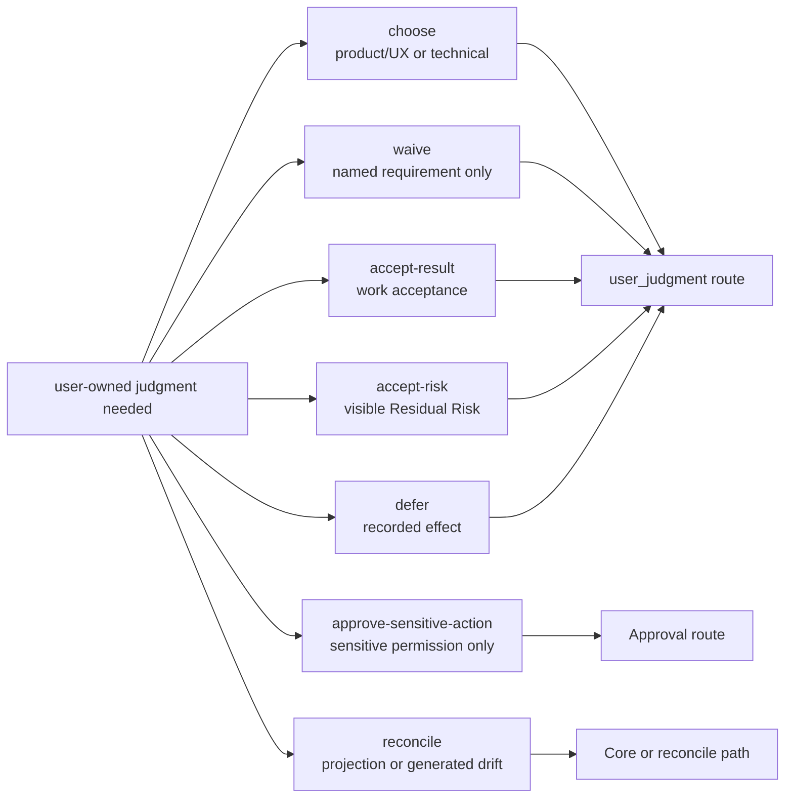
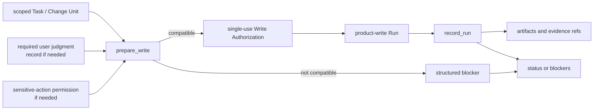
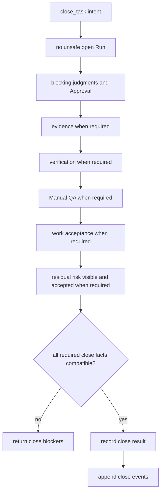

# Kernel Reference

## What this document helps you do

Use this reference to check the future Harness Kernel contract for Core authority, work shape, pre-write scope checks and internal Write Authorization records, user judgment routing, evidence, verification, QA, acceptance, residual risk, and close behavior.

This is reference documentation for a future local Harness Server. No Harness runtime or server implementation exists in this repository today. Current repository phase and implementation handoff status are tracked in [Implementation Overview](../build/implementation-overview.md#documentation-acceptance-status).

## Read this when

- You need the invariants that all future Kernel behavior must preserve.
- You are deciding whether a Task can read, write, wait for the user, or close.
- You need to separate scope, pre-write scope checks, user judgment, evidence, verification, QA, acceptance, and risk.
- You are reviewing API, storage, projection, or conformance docs for consistency with Kernel authority.

## Before you read

Read [Concepts](../learn/concepts.md) or [Harness in One Task](../learn/harness-in-one-task.md) first if you want examples before exact rules. Active MVP-1 public methods are owned by [MVP API](api/mvp-api.md), shared API shapes by [API Schema Core](api/schema-core.md), and API errors by [API Errors](api/errors.md). Storage tables are owned by [Storage And DDL](storage-and-ddl.md). Connector capability wording is owned by [Agent Integration Reference](agent-integration.md).

## Main idea

Harness is a local authority-record and user-judgment-routing layer. The Kernel makes Core-owned local state, not chat or Markdown, the operational authority for product work. It keeps scope, pre-write scope checks and internal Write Authorization records, user-owned judgments, evidence, verification, QA, acceptance, residual risk, and close readiness in separate routes so one kind of support cannot silently replace another.

The active stage and profile decide which gates are required for a specific operation. A field or gate appearing in this reference does not make the full future behavior required for Engineering Checkpoint, MVP-1, or a small direct change.

## Contract map

| If you need... | Start here | Related owner |
|---|---|---|
| Core invariants | [Kernel invariants](#kernel-invariants) | This document. |
| Work shape and mode meaning | [Work modes](#work-modes) | API enum values stay in [API Schema Core](api/schema-core.md#shared-schemas). |
| User judgment types and routes | [Judgment route boundaries](#judgment-route-boundaries), [User Judgment](#user-judgment), [Decision Gate](#decision-gate) | Public request fields stay in [`harness.request_user_judgment`](api/mvp-api.md#harnessrequest_user_judgment). |
| Entity relationship semantics | [Entity model](#entity-model) | Physical tables stay in [Storage And DDL](storage-and-ddl.md). |
| Gate meaning | [Gates](#gates), [Gate Rule Map](#gate-rule-map) | Public blockers and errors stay in [API Errors](api/errors.md#primary-error-code-precedence). |
| Pre-write scope checks / Write Authorization | [`prepare_write`](#prepare_write), [Write Authorization](#write-authorization), [`record_run`](#record_run) | Public request/response shape stays in [`harness.prepare_write`](api/mvp-api.md#harnessprepare_write) and [`harness.record_run`](api/mvp-api.md#harnessrecord_run). |
| Close semantics | [`close_task`](#close_task), [Close matrix by work shape and active profile](#close-matrix-by-work-shape-and-active-profile), [Close result semantics](#close-result-semantics) | Public close response shape stays in [`harness.close_task`](api/mvp-api.md#harnessclose_task). |
| Waivers and invalid combinations | [Waiver semantics](#waiver-semantics), [Invalid state combinations](#invalid-state-combinations) | Design-policy details stay in [Design Quality Policies](design-quality-policies.md). |

## Kernel invariants

These are the small Core invariants the rest of the Kernel contract serves:

1. Core-owned local state is the authority for operations.
2. Chat, Markdown projections, generated documents, reports, and cards are not authority.
3. Scope boundaries must be explicit before a product write can pass the pre-write scope check.
4. Product-file writes require a compatible internal Write Authorization record for the exact write attempt.
5. User-owned judgments cannot be silently replaced by agent judgment.
6. Sensitive-action approval, work acceptance, verification waiver, and residual-risk acceptance are separate routes.
7. Evidence, verification, Manual QA, acceptance, and residual risk do not substitute for one another.
8. Close must expose blockers and residual risk instead of collapsing them into a single "done" flag.
9. The active stage and profile determine which gates are required for the requested operation.

## Kernel in 10 sentences

1. The Kernel is the future Core state contract for local AI-assisted product work.
2. It keeps the active Task, scope, pre-write scope-check status, judgment records, evidence refs, close blockers, and residual risk outside the chat transcript.
3. Advice/read-only work can answer without product writes.
4. Small direct changes may stay lightweight, but product-file writes still require compatible scope and a compatible pre-write scope check.
5. Tracked work keeps scope, blockers, evidence, user judgment, and close readiness visible until the Task can close.
6. `prepare_write` is the product-write pre-write scope-check and compatibility decision point.
7. `record_run` records what happened and consumes the compatible internal Write Authorization record for product-write Runs.
8. `user_judgment` records preserve user-owned judgment. In minimum MVP-1, a sensitive-action approval judgment can record scoped sensitive-action permission; later Approval records add a hardened committed lifecycle.
9. `close_task` is the completion decision point and checks only the gates required by the active profile and close intent.
10. Projections help humans read state, but Core state, events, and registered artifact refs remain the authority.

## The four questions the kernel answers

1. What Task is active?

   The active Task is the current unit of user value. It carries mode, lifecycle phase, active scope, current blockers, evidence and artifact refs, user-judgment state, close readiness, acceptance state, residual-risk state, and projection freshness when projection support is enabled.

2. What work is compatible with current scope now?

   Compatible work is computed from the active Task, work shape, active Change Unit, scope, Autonomy Boundary, baseline freshness, sensitive-action permission, user-owned judgments, applicable policy, surface capability, and the requested operation.

3. What user judgment is still blocking progress?

   Blocking user-owned judgment is represented by `user_judgment` state and the aggregate `decision_gate`. Sensitive-action permission is represented separately by `approval_gate`; in minimum MVP-1 the gate may derive from a sensitive-action approval user judgment, and in later profiles it may derive from committed Approval state.

4. Can this Task close?

   `close_task` checks the close intent against open Run state, scope, required decisions, sensitive-action permission, evidence, verification when required, Manual QA when required, residual-risk visibility and acceptance when required, work acceptance when required, projection freshness when relevant, and artifact availability.

## Work modes

The stored Task `mode` values remain:

```text
advisor | direct | work
```

User-facing surfaces should lead with the plain work shapes below. These labels do not add enum values, schema fields, record types, projection kinds, gates, or authority paths.

| Plain work shape | Internal mode | Kernel implication |
|---|---|---|
| Advice/read-only | `advisor` | Product-file write is not a valid outcome. Scope can be informal unless the advice is converted into product work. Evidence, verification, QA, acceptance, and residual risk are normally not required unless the user request, policy, or active profile requires them. |
| Small direct change | `direct` | Product-file writes can proceed only through explicit scope and compatible `prepare_write` / internal Write Authorization record. The Change Unit may be minimal when the request is obvious. Evidence may be lightweight. User judgment records, Manual QA, detached verification, work acceptance, and residual-risk acceptance are not created as ceremony; they apply only when triggered by the active profile, task type, user request, sensitive/security/criticality profile, detected risk, or explicit requirement. |
| Tracked work | `work` | Used for structured, multi-step, risky, user-facing, public-interface, security/privacy, architecture, or otherwise non-trivial work. It keeps scope, user judgment, evidence, close blockers, acceptance, and residual risk visible. It does not automatically require every future gate; the active profile decides which gates are required. |

Small direct changes must stay small. Escalate the same Task to tracked work when scope becomes unclear, changed paths exceed the active scope, multiple product areas or subsystems are involved, Product/UX judgment or Technical judgment appears, public API or module contract impact appears, security/privacy impact appears, a sensitive action appears, evidence expectations grow, QA or verification becomes required, residual risk becomes non-trivial, or multi-step delivery is needed.

The tiny direct profile is only a display/profile choice inside `mode=direct`. It is appropriate for a typo, one docs sentence with no meaning change, or an obvious rename. It must not bypass scope, pre-write scope checking, sensitive-action permission, user-owned judgment, evidence requirements that actually apply, residual-risk visibility, or close rules.

## Judgment route boundaries

Harness separates what the user is judging from the internal owner path that records it. User-facing docs should not expose a field taxonomy as if the user must reason about it. The user sees one of five display types, the prompt asks the concrete question, and the record stores enough context for the owner path to validate the answer.

### User-facing display types

| Display type | Use when the user owns... | Internal `judgment_type` examples |
|---|---|---|
| Product/UX judgment | Product behavior, wording, interaction, taste, user value, or release-facing promise. | `product_choice` |
| Technical judgment | Public API, module boundary, dependency, migration, compatibility, security/privacy trade-off, QA/verification expectation, scope/autonomy choice, or material implementation direction. | `technical_choice` |
| Sensitive action approval | Permission for a named sensitive step inside a bounded scope. | `sensitive_action_approval` |
| Work acceptance | Whether the user accepts the result when work acceptance is required. | `work_acceptance` |
| Residual risk acceptance | Whether a visible close-relevant remaining risk is acceptable for this close. | `residual_risk_acceptance` |

### Internal routes

| Route | Kernel meaning | Must not be treated as |
|---|---|---|
| `choose` | The user chooses among product, technical, security/privacy, or scope/autonomy options. | Sensitive-action permission, pre-write scope-check compatibility, acceptance, waiver, or risk acceptance. |
| `defer` | The user intentionally defers a user-owned judgment, with recorded effect on progress, close, risk, and follow-up. | Resolution, waiver, acceptance, or permission to hide the blocker. |
| `approve-sensitive-action` | The user grants scoped sensitive-action permission through a sensitive-action approval user judgment; later Approval profiles may also commit an Approval record. | Product direction, technical direction, correctness proof, work acceptance, risk acceptance, QA, verification, evidence, or Write Authorization. |
| `waive` | The user or policy waives a named requirement when waiver is allowed. | The skipped QA/check/verification itself, assurance upgrade, or generic consent. |
| `accept-result` | The user accepts the result when work acceptance is required, after the close basis is visible. | Evidence, QA, verification, sensitive-action permission, waiver, residual-risk acceptance, or a new pre-write scope check. |
| `accept-risk` | The user accepts a named visible close-relevant Residual Risk for the requested close. | No-risk close, detached verification, QA pass, evidence sufficiency, work acceptance, or sensitive-action permission. |
| `reconcile` | The user or operator resolves human-editable or generated/projection drift into accepted state, note, rejection, decision request, or deferral. | Direct state mutation from Markdown, report prose, or chat. |

This route map is the design contract for user-owned judgment. The route verb is internal owner-path metadata; broad approval is intentionally absent from the user-facing model.



Each route remains separate after recording: Approval does not choose product direction, waiver does not perform the skipped check, work acceptance does not accept risk, and reconcile does not turn Markdown into state without a Core path.

### Display depth

| Display depth | Use for | Minimum display |
|---|---|---|
| `simple` | A narrow unblocker with low consequence. | Exact question, scope, options or requested outcome, what the answer does not settle. |
| `tradeoff` | Product/UX or technical choices with meaningful consequences. | Options, recommendation when available, uncertainty, deferral effect, affected scope and criteria. |
| `high-risk` | Security/privacy, sensitive categories, public API, migration, dependency, or costly rollback. | Trade-offs plus risk, evidence refs when available, approval boundary when relevant, rollback/follow-up effect. |
| `close-affecting` | Acceptance, waiver, residual-risk acceptance, or a decision whose deferral affects close. | Close basis, blockers, residual risk visibility, affected gates, required refs, and the exact close impact. |

Canonical schema direction for this model:

- `judgment_type` stores the compact internal type. MVP-1 examples are `product_choice`, `technical_choice`, `sensitive_action_approval`, `work_acceptance`, and `residual_risk_acceptance`.
- User-facing display is limited to Product/UX judgment, Technical judgment, Sensitive action approval, Work acceptance, and Residual risk acceptance.
- Route-like and depth-like details are validation or presentation metadata, not separate concepts users must learn.
- `affected_gates`, owner refs, and the user judgment status determine what the judgment can influence.
- Legacy fields such as `judgment_domain`, `decision_kind`, and `decision_profile` may appear only in migration or compatibility notes.

Ambiguous consent is deliberately narrow. Phrases such as "proceed," "go ahead," "looks good," "좋아," or "진행해" cannot resolve incompatible routes by default. A single user reply may satisfy multiple routes only when the request made those routes explicit, the reply is compatible with each route, and the recorded payload names the scope, consequence, and affected close/write impact for each route. Otherwise Core or the agent must clarify.

## Evidence, verification, QA, work acceptance, and risk

These concepts support close, but they are not synonyms for "done":

| Concept | Kernel meaning |
|---|---|
| Evidence | Records or refs that support what was done or observed. Evidence can support a claim only when mapped to the relevant criterion, condition, or owner record. |
| Verification | A technical check of claims. Detached verification requires an Eval with a valid independence boundary and current inputs, but detached verification is required only when the active profile or explicit requirement says so. |
| Manual QA | Human inspection of behavior, UX, copy, accessibility interpretation, product taste, visual output, or environment-dependent outcome. Screenshots and browser logs can support QA, but they are not the human QA judgment. |
| Work acceptance | The user's result judgment when the active path requires acceptance. It is recorded only after close-relevant evidence, verification, QA status, and residual risk are visible or confirmed absent. |
| Residual risk | Known remaining uncertainty, unchecked condition, limitation, or trade-off. Risk acceptance is explicit user acceptance of named visible risk for the requested close. |

Does-not-substitute table:

| This | Does not substitute for |
|---|---|
| Chat text, generated Markdown, or report prose | Core state, evidence, decisions, Approval, close blockers, or pre-write scope-check records. |
| Evidence, logs, screenshots, or artifact refs | Manual QA, verification, work acceptance, or residual-risk acceptance. |
| Test pass, build pass, browser smoke, or self-check | Work acceptance, required Manual QA, or detached verification without a qualifying Eval. |
| Sensitive-action Approval | Product/UX judgment, Technical judgment, correctness, evidence, QA, verification, work acceptance, residual-risk acceptance, or Write Authorization. |
| Work acceptance | Evidence sufficiency, QA, verification, Approval, waiver, residual-risk acceptance, or more pre-write scope-check compatibility. |
| Residual-risk acceptance | Verification, Manual QA, evidence sufficiency, no-risk close, work acceptance, or Approval. |
| QA waiver | QA pass, verification, evidence sufficiency, work acceptance, or acceptance of unrelated risk. |
| Verification waiver | Detached verification, `completed_verified`, Manual QA, work acceptance, or assurance upgrade. |

Stage/profile support:

| Stage/profile | What it can represent |
|---|---|
| Engineering Checkpoint / Kernel Smoke | The narrow internal authority loop: local project registration, active Task, scoped work boundary, `prepare_write`, one single-use Write Authorization, one compatible Run, one artifact/evidence ref, and one structured status/blocker response. Verification, Manual QA, work acceptance, residual-risk acceptance, full Evidence Manifest, and profile-specific full-format user judgment presentation are not Engineering Checkpoint requirements unless the named smoke path explicitly includes them. |
| MVP-1 User Work Loop | User-facing status for scope, pending user judgments, evidence summary, close readiness, work acceptance when required, and residual-risk visibility when close-relevant risk exists. MVP-1 must not imply detached verification is always required. |
| Later assurance and operations profiles | Detached verification independence, richer Manual QA, stewardship, feedback-loop/TDD policy, projection/reconcile operations, export/recover, and handoff behavior. These are blockers only when the active profile or owner doc enables them. |

## Reference scope

This document owns:

- Core invariants and non-substitution rules
- work mode semantics
- entity relationship meaning where it affects authority, write, gate, or close decisions
- gate meaning and close semantics
- `prepare_write`, Write Authorization, `record_run`, and `close_task` state logic
- waiver meaning and invalid state combinations

## Not covered here

This document does not own:

- full public MCP request/response schemas; see [MVP API](api/mvp-api.md), [API Schema Core](api/schema-core.md), [API Errors](api/errors.md), and [API Schema Later](api/schema-later.md)
- SQLite DDL and storage layout; see [Storage And DDL](storage-and-ddl.md)
- full projection template bodies
- document projection rules; see [Document Projection Reference](document-projection.md)
- detailed design-quality policy tables; see [Design Quality Policies](design-quality-policies.md)
- connector capability profiles; see [Agent Integration Reference](agent-integration.md)
- operator command syntax; see [Operations And Conformance Reference](operations-and-conformance.md)
- fixture catalogs for later profiles

## Entity model

These entity notes define relationship semantics only. They do not add tables, fields, DDL, or API bodies.

### Task

A Task is the user value unit. It carries current mode, lifecycle phase, result, close reason, assurance level, active Change Unit, gate states, user judgment refs, evidence and artifact refs, residual-risk state, acceptance state, latest Run state, and projection freshness when enabled.

### Change Unit

A Change Unit is the scoped work boundary for product-file writes. It answers what work surface may change, which paths/tools/commands/network/secret access are in scope, what is out of scope, what sensitive categories apply, what evidence and QA expectations apply, and what completion conditions matter.

Every product-file write requires an active Change Unit whose scope covers the intended write. Core creates a compatible record for a specific product-write attempt only through `prepare_write`.

### Autonomy Boundary

An Autonomy Boundary is the judgment latitude inside a Change Unit. Scope says where and what may change; Autonomy Boundary says which choices the agent may make without another user judgment.

The Autonomy Boundary is not scope, Approval, a pre-write scope check, evidence, verification, QA, acceptance, or risk acceptance. It must not be read as permission to change the goal, expand scope, choose user-owned product direction, choose material technical direction, or accept residual risk for the user.

<a id="decision-packet"></a>

### User Judgment

A `user_judgment` record is the canonical state record for user-owned judgment. It records the question, judgment type, status, options or selected outcome, affected scope, related refs, deferral effect when relevant, and route-specific context for sensitive-action approval, waiver, work acceptance, residual-risk acceptance, or reconcile.

User judgment records feed `decision_gate`. Blocking user-owned judgment cannot be satisfied by chat text, broad approval, or projection prose alone. The recorded `user_judgment` and its resolution, deferral, rejection, blocked state, or supersession are the authority for that judgment.

User judgment status is record-level:

```text
proposed | pending_user | resolved | deferred | rejected | blocked | superseded
```

Resolving a user judgment records user-owned judgment. It creates sensitive-action permission only when the judgment is a sensitive-action approval with compatible `approval_scope`; later Approval profiles may also require the linked Approval path. It does not create Write Authorization, does not create evidence, and does not close a Task by itself.

#### User judgment lifecycle map

The lifecycle is intentionally small: draft or detect a needed judgment, ask the user when needed, record the compatible response, and preserve deferral, rejection, blocked, or superseded outcomes. Exact public fields are owned by [`harness.request_user_judgment`](api/mvp-api.md#harnessrequest_user_judgment) and [`harness.record_user_judgment`](api/mvp-api.md#harnessrecord_user_judgment). "Decision Packet" is the legacy or full-format presentation label for a complex user judgment prompt; it is not the canonical record family.

### Journey Spine

Journey Spine is later/diagnostic derived continuity over Task state, Change Units, Runs, user judgments, Approvals, evidence, verification, QA, acceptance state, residual risk, close events, artifact refs, and `state.sqlite.task_events`. It is not a separate source of truth and is not required for MVP-1 storage.

### Journey Spine Entry

A Journey Spine Entry is a later/diagnostic durable continuity annotation only when the note cannot be reconstructed from existing state and events. It supplements owner records; it does not replace Task, Change Unit, Run, user judgment, evidence, verification, QA, risk, acceptance, close, or artifact state.

### Run

A Run is an execution or observation attempt. It records actor, surface, mode, Change Unit, baseline, intended operation, observed changes, command results, artifact refs, and summary. Implementation and direct product-write Runs must consume a compatible internal Write Authorization record. Read-only or shaping-only Runs do not make product-file writes compatible.

### Approval

Approval is scoped sensitive-action permission. In minimum MVP-1 it can be represented by a resolved sensitive-action approval user judgment with `approval_scope`. In later Approval/Assurance Profiles it can also be represented by a committed Approval record. It can cover paths, tools, commands, network targets, secret scope, sensitive categories, baseline, expiry, and user judgment for that sensitive action.

Approval does not prove correctness, choose product direction, choose technical architecture, create evidence, satisfy QA, verify work, accept a result, accept residual risk, or authorize a product write by itself.

### Write Authorization

A Write Authorization is the durable single-use state record created when `prepare_write` finds an exact product-file write compatible with current Core records. It records the Task, Change Unit, compatibility basis, intended operation, intended write surface, relevant sensitive-action coverage and decisions, guarantee level, status, and consumption by a compatible Run. It is a Harness-level cooperative record/check, not OS permission, sandboxing, tamper-proof storage, preventive blocking, or isolation.

Write Authorization status is record-level:

```text
allowed | consumed | expired | stale | revoked
```

A Write Authorization is not reusable scope. It records compatibility for one exact write attempt under the current compatibility basis and is consumed by one compatible implementation or direct `record_run`, except for idempotent replay of the same committed request.

### Evidence Manifest

An Evidence Manifest maps claims, criteria, or completion conditions to supporting refs. It may reference Runs, artifacts, Evals, Manual QA records, design records, or other owner records. Evidence sufficiency is criteria-based, not artifact-count-based.

### Eval

An Eval is a verification result record. It records target, verdict, checks performed, evidence reviewed, independence qualifier, baseline relationship, input freshness, blockers, and artifact refs. A passed Eval upgrades assurance only when the active profile requires or allows detached verification and the independence/freshness rules are satisfied.

### Manual QA

Manual QA is a human inspection record. Automated checks and capture artifacts can support it but do not become Manual QA by themselves. Manual QA is required only when the active profile, policy, user request, task type, changed surface, or detected risk makes it required.

### Finding routing

Findings from commands, Runs, Evals, QA, reviews, validators, or diagnostics are not a separate authority path. They affect state only when routed through existing owner records: Evidence Manifest, user judgment, Change Unit, Approval, Eval, Manual QA, Residual Risk, Reconcile Item, structured close blocker, or another enabled owner path.

### Residual Risk

Residual Risk is a close-relevant state record for known remaining uncertainty, limitation, unchecked condition, or trade-off. It records source refs, affected scope, visibility, accepted-risk metadata when accepted, follow-up, and close impact.

Residual Risk records make risk visible. They do not verify work, replace evidence, waive QA, grant Approval, imply work acceptance, or close a Task.

### Artifact

An Artifact is a durable evidence file or bundle with integrity metadata, such as a diff, log, screenshot, manifest, bundle, or export component. Artifact refs are distinct from Markdown reports and state records.

### Reconcile Item

A Reconcile Item is the candidate record for human-editable or generated/projection drift. Reconcile may merge, reject, convert to note, create a user judgment, or defer. Markdown or generated text becomes state only through the accepted reconcile/owner path.

### Design Support Records

Shared Design, Domain Term, Module Map Item, Interface Contract, Feedback Loop, and TDD Trace records can support scope, evidence, and design policy when their profiles are enabled. Their policy details are owned by [Design Quality Policies](design-quality-policies.md), and their storage shape is owned by [Storage And DDL](storage-and-ddl.md).

## Boundaries and non-substitutions

- Chat text is not state.
- Generated Markdown is not canonical state.
- Human-edited projections are input until reconciled.
- Raw artifacts are evidence files; Markdown that links to them is a readable projection.
- Review displays and future Review Stages are procedure or display unless routed through owner records.
- Autonomy Boundary records judgment latitude only; it is not scope or a pre-write scope check.
- Sensitive-action approval and other user judgments are separate.
- Write Authorization is a single-use cooperative record for one compatible attempt, not reusable scope or OS permission.
- Evidence sufficiency is not inferred from prose alone.
- Eval verdict alone does not create `detached_verified`.
- Evidence does not substitute for Manual QA, and QA waiver does not create verification evidence.
- Test pass does not automatically mean work acceptance, required Manual QA, or detached verification.
- Manual QA does not imply work acceptance.
- Work acceptance does not erase residual risk.
- Residual-risk acceptance does not verify implementation or create a no-risk close.
- Verification waiver, QA waiver, decision deferral, and residual-risk acceptance are separate concepts with separate close impact.
- Capability affects blockers and guarantee display, but it is not a first-class Kernel gate.

## Gates

Gates are canonical Kernel fields used by future status, write, run, and close decisions. A gate can exist in the reference model without being required for every stage or every Task.

The active profile controls requiredness. Engineering Checkpoint proves the narrow authority loop. MVP-1 shows user-facing judgment, evidence summary, close readiness, work acceptance when required, and residual-risk visibility when relevant. Later assurance profiles can require detached verification, Manual QA, stewardship, feedback-loop/TDD, operations, or export/recover behavior.

### Close Readiness Separation

Close readiness must not be represented as one "done" bit. Keep these dimensions separate:

| Dimension | Meaning |
|---|---|
| Close state | Whether close is blocked, ready for the requested intent, completed, cancelled, or superseded. |
| Close reason | Why the Task closed, such as `completed_self_checked`, `completed_verified`, `completed_with_risk_accepted`, `cancelled`, or `superseded`. |
| Assurance level | What technical checking level is supported: `none`, `self_checked`, or `detached_verified`. |
| Residual risk state | Whether close-relevant risk is absent, not visible, visible, accepted, or blocked. |
| Acceptance state | Whether work acceptance is not required, pending, accepted, rejected, or blocked. |

### Gate Rule Map

| Gate or boundary | Decides... |
|---|---|
| [Scope Gate](#scope-gate) | Whether active scope covers the requested write or close-relevant work. |
| [Decision Gate](#decision-gate) | Whether user-owned judgment blocks progress, write, or close. |
| [Approval Gate](#approval-gate) | Whether sensitive-action permission is missing, pending, granted, denied, expired, or drifted. |
| [Design Gate](#design-gate) | Whether enabled design-quality policy blocks progress. |
| [Evidence Gate](#evidence-gate) | Whether required evidence is absent, partial, sufficient, stale, or blocked. |
| [Verification Gate](#verification-gate) | Whether required verification has passed, is pending, failed, waived, or blocked. |
| [QA Gate](#qa-gate) | Whether required Manual QA passed, failed, was waived, or remains pending. |
| [Acceptance Gate](#acceptance-gate) | Whether work acceptance and residual-risk visibility/acceptance allow the requested close when applicable. |
| [Capability Boundary](#capability-boundary) | How surface capability affects blockers and guarantee display without becoming a gate. |

### Scope Gate

```text
not_required | required | pending | passed | failed | blocked
```

`scope_gate` applies to write-capable product work. Advice/read-only work normally uses `not_required`. Direct and tracked product writes require compatible scope before `prepare_write` can allow a write.

### Decision Gate

```text
not_required | required | pending | resolved | deferred | blocked
```

`decision_gate` is the aggregate state for user-owned judgment. It does not replace scope, Approval, evidence, verification, QA, work acceptance, or residual-risk acceptance.

#### Decision Gate Aggregate Recompute

`decision_gate` is recomputed from relevant user judgments and currently detected user-owned judgment needs. Recompute precedence is:

1. `blocked` when any relevant judgment is incompatible, rejected without replacement, expired, or blocked.
2. `pending` when any relevant user judgment waits for the user.
3. `required` when a blocking user-owned judgment is detected and no compatible user judgment exists.
4. `deferred` when all relevant blockers are explicitly deferred and the deferral covers the current operation or close intent, with residual-risk/follow-up visibility where needed.
5. `resolved` when all relevant blocking judgments are resolved or superseded by compatible replacement state.
6. `not_required` when no user-owned judgment blocks the current operation or close intent.

A stored gate value that disagrees with recomputation is stale and must be repaired before write or close relies on it.

### Approval Gate

```text
not_required | required | pending | granted | denied | expired
```

`approval_gate` applies only when sensitive categories are present. The gate can summarize whether sensitive-action permission is needed, pending, granted, denied, or expired. In minimum MVP-1, `granted` means a compatible resolved sensitive-action approval user judgment covers the sensitive scope. In later Approval profiles, it may derive from committed Approval records. It is not Write Authorization, product judgment, evidence, verification, QA, work acceptance, or residual-risk acceptance.

### Design Gate

```text
not_required | required | pending | passed | partial | waived | stale | blocked
```

`design_gate` applies only when an enabled design-quality policy makes it applicable. Detailed design validators are later-profile material unless the active profile explicitly enables them.

### Evidence Gate

```text
not_required | none | partial | sufficient | stale | blocked
```

When evidence is required, successful close needs `evidence_gate=sufficient`. `not_required` must not be used when evidence is required but missing.

### Evidence Sufficiency Profiles

Evidence sufficiency is judged by coverage of the relevant criteria, conditions, and claims. Advice may need no recorded evidence. Small direct changes can often use a changed-path list, patch summary or diff ref, and self-check summary. Tracked work usually needs evidence mapped to each close-relevant criterion. UI/UX, sensitive, QA, and verification-required paths add only the owner refs required by the active profile.

### Verification Gate

```text
not_required | required | pending | passed | failed | waived_by_user | blocked
```

Verification is required only when the active profile, user request, task type, security/criticality profile, or explicit requirement says it is required. Tracked work does not automatically require detached verification.

`verification_gate=waived_by_user` is valid only when a required verification path is intentionally skipped through the waiver route. It does not create detached verification, `completed_verified`, Manual QA, work acceptance, or assurance upgrade. When the waived gap is close-relevant, close needs the residual-risk accepted path.

### Verification Independence Profiles

Detailed independence profiles, evaluator bundles, same-session guards, and cross-surface verification rules are later-profile assurance material. The Kernel invariant is simpler: self-check is not detached verification, and `assurance_level=detached_verified` requires a qualifying Eval with valid independence and current inputs when detached verification is claimed.

### QA Gate

```text
not_required | required | pending | passed | failed | waived
```

`qa_gate` applies only when Manual QA is required by profile, policy, user request, task type, changed surface, or detected risk. Browser captures, screenshots, logs, and automated checks can support QA context but do not become the human QA judgment.

### Acceptance Gate

```text
not_required | required | pending | accepted | rejected
```

`acceptance_gate` records work acceptance when required. Acceptance can be recorded only after the close basis is visible: evidence status, verification status when applicable, Manual QA status when applicable, and residual-risk visibility or confirmed absence.

Residual-risk visibility is separate. If no known close-relevant risk exists, `ResidualRiskSummary.status=none` satisfies visibility. If known close-relevant risk exists, it must be visible before work acceptance or successful close. In MVP-1, a risk-accepted close records the acceptance through a residual-risk acceptance `user_judgment` and the relevant blocker/evidence refs; rich Residual Risk refs are later/profile-promoted.

### Capability Boundary

Capability is not a first-class Kernel gate. Surface capability can affect blocked reasons, validator results, and guarantee display. Cooperative and detective surfaces must not claim preventive blocking unless a proven guard covers the operation.

## Lifecycle and transitions

The Kernel uses lifecycle fields plus gates. Compact display states are derived from these canonical fields.

### Mode

```text
advisor | direct | work
```

### Lifecycle Phase

```text
intake | shaping | ready | executing | verifying | qa |
waiting_user | blocked | completed | cancelled
```

### Result

```text
none | advice_only | passed | failed | cancelled
```

### Close Reason

```text
none | completed_verified | completed_self_checked |
completed_with_risk_accepted | cancelled | superseded
```

### Assurance Level

```text
none | self_checked | detached_verified
```

Assurance summarizes technical checking support. It is not Approval, QA, acceptance, or risk acceptance.

| Display phrase | Meaning |
|---|---|
| self-checked | The implementing path checked its own result. This is not detached verification. |
| detached candidate | A verification path might qualify, but detached assurance is not earned yet. |
| detached verified | A qualifying Eval passed with valid independence and current inputs. |
| waived with accepted risk | Required verification was skipped through waiver and the close depends on accepted residual risk. This is not detached verification. |

### Compatibility matrix

Compatibility is profile-driven. A mode or close reason is compatible only when the required gates for the active profile and close intent are satisfied.

### Mode Compatibility

| Mode | Product writes | Default close posture |
|---|---|---|
| `advisor` | No. | Advice/read-only result, usually no assurance. |
| `direct` | Yes, after compatible scope and internal Write Authorization record. | Self-checked unless a required profile adds QA, verification, acceptance, or risk handling. |
| `work` | Yes, after compatible scope and internal Write Authorization record. | Profile-driven close. Evidence and blockers are visible; detached verification is required only when the active profile or explicit requirement requires it. |

### Decision Gate Compatibility

Resolved user judgments are compatible only for the scope, baseline, operation, and close intent they cover. Deferred judgments are compatible only when the deferral explicitly covers the current operation and any residual risk or follow-up is visible.

### Completion Compatibility

Successful close requires no open Run, compatible scope, and every close-relevant required gate satisfied, not required, or validly waived according to its own rules.

### Transition table

This reference does not duplicate a full state machine table. The invariant is that write-capable transitions route through `prepare_write` and `record_run`, user-owned judgment routes through `user_judgment` records and Approvals as applicable, and completion routes through `close_task`.

#### Stable Event Catalog

Stable event names are append-only state history labels, not authority by themselves. Storage and API docs own exact payload shapes. Event names should describe state changes such as Task lifecycle updates, `prepare_write` decisions, Write Authorization creation/consumption/staling, Run recording, user judgment updates, Approval updates, gate recompute, evidence updates, residual-risk visibility or acceptance, waiver recording, close attempts, close success, projection freshness changes, and reconcile outcomes.

### Intake to `prepare_write` sequence

The minimal write sequence is:

1. Resolve or create an active Task.
2. Establish a scoped active Change Unit for write-capable work.
3. Separate user-owned judgments and sensitive-action needs.
4. Call `prepare_write` for the exact intended operation.
5. If compatible, use the returned Write Authorization record for one compatible product-write Run.
6. Record the Run, artifacts, evidence refs, and any blockers through `record_run`.

This pre-write scope-check sequence is the Kernel design contract. Scope, required user judgment, and sensitive-action permission are inputs to `prepare_write`; only a compatible `prepare_write` creates a single-use Write Authorization record, and `record_run` records what happened rather than making it compatible retroactively.



## prepare_write

`prepare_write` is the unique product-write pre-write scope-check and compatibility decision point. Approval, user judgment resolution, `record_run`, `close_task`, reports, projections, and agent prose can provide inputs or context, but none of them create a consumable Write Authorization record or make a product-file write compatible by themselves.

It returns one of these state-level decisions:

```text
allowed | blocked | approval_required | decision_required | state_conflict
```

The decision checks only the gates and preconditions that apply to the Task, intended operation, active stage/profile, and connected surface:

1. Check state-version freshness.
2. Resolve the active Task.
3. Confirm the mode is write-capable; `advisor` blocks product writes.
4. Resolve the active Change Unit.
5. Check intended paths, tools, commands, network targets, secret access, sensitive categories, and other write surfaces against scope.
6. Check the Autonomy Boundary. If the operation exceeds agent latitude, request user judgment when judgment can resolve it.
7. Check baseline freshness.
8. Check sensitive-action permission when sensitive categories apply.
9. Check required user judgments.
10. Check enabled design/policy and capability preconditions.
11. If all required checks pass, create or return the compatible single-use Write Authorization record and record the decision.

Blocked, approval-required, decision-required, or state-conflict results must not create a consumable Write Authorization. Approval-required means sensitive-action permission is missing or unusable; it must not be converted into broad approval or product judgment. Decision-required means user-owned judgment is needed; it must not be converted into sensitive-action permission.

If MCP is unavailable on a cooperative-only surface, product writes are held by instruction. Preventive or isolated claims require a proven guard or documented separation boundary for the covered operation.

External side effects keep the same authority meaning. Before execution, `prepare_write` evaluates the intended side effect. After execution, `record_run` records what happened. `record_run` cannot retroactively make an effect compatible when it lacked compatible scope, Approval, user judgment coverage, or Write Authorization.

## record_run

`record_run` is the Run, artifact, and evidence recording point. It is not a pre-write scope-check decision point and cannot retroactively make product-file writes compatible.

Implementation and direct Runs that report product-file writes must consume a compatible, unexpired, unconsumed Write Authorization. Core verifies observed changed paths and other observed side effects against both the consumed Write Authorization and the active Change Unit when those observations are available.

Out-of-scope changes, missing Write Authorization, stale Write Authorization, consumed Write Authorization, or incompatible Write Authorization become rejection, violation, recovery, or stale/blocker state according to the case. Such Runs do not satisfy evidence sufficiency, verification, QA, work acceptance, residual-risk acceptance, or close readiness for the affected scope until repaired through the relevant owner records.

Read-only and shaping-only Runs may be recorded without Write Authorization only when they do not report product-file changes.

## close_task

`close_task` is the single completion decision point. Agent summaries, Eval reports, QA notes, acceptance messages, projections, and final reports may provide inputs, but they do not close the Task by themselves.

Close readiness is profile-driven. Detached verification is required only when the active profile, user request, task type, security/criticality profile, or explicit requirement says it is required. A verification waiver is needed only when required verification is intentionally skipped. If verification was not required, there is nothing to waive.

The decision algorithm checks the close intent and required gates:

1. Resolve the active Task and requested close intent.
2. For cancellation or supersession, ensure no write is in an unsafe in-progress state, then close with the matching reason.
3. Reject completion if an active Run is still open.
4. Check active Change Unit completion, deferral, or supersession according to the active profile.
5. Check scope.
6. Check blocking user judgments and `decision_gate`.
7. Check sensitive-action permission when sensitive categories applied.
8. Check enabled design policy.
9. Check evidence when evidence is required.
10. Check verification only when verification is required.
11. Check Manual QA only when Manual QA is required.
12. Check residual-risk visibility; if risk-accepted close is requested or required, check a residual-risk acceptance `user_judgment` plus the relevant blocker/evidence refs. Rich Residual Risk refs apply only when that profile is active.
13. Check work acceptance only when work acceptance is required.
14. Assign result, close reason, assurance level, residual-risk state, and acceptance state as separate facts.
15. Report projection freshness when projection support is enabled.
16. Append close events and enqueue projection refresh when projection support is enabled.

This close-decision flow is a design-contract summary. Verification, Manual QA, work acceptance, and residual-risk acceptance are checked only when the active profile, task, user request, or explicit requirement makes them relevant; they are not always-required detached steps.



Structured close blockers must name the category that blocks close, such as open Run, scope, user-owned judgment, sensitive-action permission, design policy, evidence, verification, Manual QA, residual-risk visibility, residual-risk acceptance, work acceptance, projection freshness, or artifact availability. Public responses may choose one primary error code, but secondary blockers and refs must remain visible.

### Close matrix by work shape and active profile

| Work shape and profile | Required before ordinary successful close | Verification treatment | Close result |
|---|---|---|---|
| Advice/read-only | The requested advice, explanation, review, or comparison is complete. Required source refs are shown if the user or profile asked for them. | Normally `not_required`. No waiver is needed when verification was not required. | `result=advice_only`, `assurance_level=none`, usually `close_reason=completed_self_checked`. |
| Small direct change | No open Run; active scope covered any product writes; compatible Write Authorization was consumed for writes; lightweight evidence or self-check supports the narrow completion claim; required user judgments, Approval, QA, acceptance, or risk handling are satisfied if triggered. | Normally `not_required`. Optional qualifying Eval may support `detached_verified`; required verification follows the required-verification row. | Usually `result=passed`, `assurance_level=self_checked`, `close_reason=completed_self_checked`. |
| Tracked work with no required detached verification | No open Run; Change Unit is complete, explicitly deferred, or superseded; scope, required user judgments, Approval, evidence, QA when required, residual-risk visibility, and acceptance when required are satisfied. | `verification_gate=not_required` or non-detached self-check evidence is shown as applicable. No verification waiver is needed. | `result=passed`, `assurance_level=self_checked` when checked by the implementing path, `close_reason=completed_self_checked`. |
| Tracked work with required detached verification | All tracked-work requirements above plus `verification_gate=passed` from a qualifying Eval with valid independence and current inputs. | If required verification is intentionally skipped, record a verification waiver and use the risk-accepted path; do not call it verified. | With passed verification: `result=passed`, `assurance_level=detached_verified`, `close_reason=completed_verified`. |
| Tracked work with residual risk acceptance required | All other required gates for the active profile are satisfied, close-relevant residual risk is visible, and a compatible residual-risk acceptance `user_judgment` records the accepted risk with related blocker/evidence refs. | Verification may be not required, passed, or waived only if the required-verification waiver/risk path is satisfied. | `result=passed`, `close_reason=completed_with_risk_accepted`, `assurance_level=none` or `self_checked`; do not display as `detached_verified`. |

### Close result semantics

`completed_self_checked` means the result was checked by the implementing path or detached verification was not required.

`completed_verified` means detached verification was required or requested for the close path and actually passed with valid independence and current inputs.

`completed_with_risk_accepted` means the user accepted visible close-relevant residual risk, including verification risk when required verification was waived. This is successful close with explicit accepted risk, not verified close.

`cancelled` means the Task stopped without a passed result.

`superseded` means another Task or Change Unit replaces this one. Supersession does not imply success.

## Waiver semantics

Waivers are scoped exceptions to named requirements. A waiver must record the requirement, Task and Change Unit, skipped check or surface, reason, actor, time, expiry or follow-up when needed, affected gate or close impact, and any close-relevant residual risk that must be visible or accepted.

Allowed waivers:

- `design_gate=waived` when design policy allows it.
- `verification_gate=waived_by_user` only when a required verification path is intentionally skipped.
- `qa_gate=waived` when required Manual QA is validly waived.

Not allowed:

- scope waiver for product writes
- Approval waiver for sensitive changes
- evidence waiver where evidence is required for completion
- work acceptance waiver where acceptance is required

Verification waiver is not detached verification. If the waived verification gap is close-relevant, close requires visible residual risk plus a compatible residual-risk acceptance `user_judgment` and uses `completed_with_risk_accepted`. QA waiver is not Manual QA pass, verification, work acceptance, or assurance upgrade. Decision deferral is not waiver.

## Invariant enforcement mapping

| Kernel invariant | Enforcement points |
|---|---|
| Core state is authority. | State-changing actions create Core records and events; projections and chat cannot mutate state without an owner path. |
| Product writes require explicit scope and a compatible pre-write scope check. | `prepare_write` blocks missing scope and creates a single-use Write Authorization record only when required checks pass; `record_run` consumes it. |
| User-owned judgment cannot be replaced by agent judgment. | User judgment records and `decision_gate` block affected writes or close until compatible resolution, deferral, or risk handling is recorded. |
| Sensitive-action approval is separate. | Sensitive-action approval user judgments, later Approval records, and `approval_gate` cover sensitive permission only. |
| Evidence, verification, QA, acceptance, and residual risk stay separate. | Separate gates, refs, and close blockers prevent substitution. |
| Close exposes blockers and residual risk. | `close_task` returns structured blockers and separate close reason, assurance, acceptance, and residual-risk state. |
| Active profile determines required gates. | Gate checks apply only when required by stage/profile, user request, task type, security/criticality profile, policy, or explicit requirement. |
| Projections cannot override state. | Projection edits route through reconcile and projection freshness affects display, not authority by itself. |

## Later-profile and appendix material

The following are later-profile or appendix material unless an active owner profile explicitly enables them:

- detailed verification independence profile catalog
- same-session verification guard fixture details
- full Manual QA matrix
- advanced validator catalogs
- stewardship, feedback-loop, and TDD policy enforcement
- Browser QA Capture automation
- Cross-Surface Verification automation
- diagnostic machinery beyond public blockers and guarantee display
- projection/reconcile operations
- export/recover and release handoff
- broad conformance fixture catalogs

These capabilities may read or support Core state after promotion. They must not become authority merely because a UI, projection, report, or future fixture mentions them.

## Edge cases

### Invalid state combinations

The following combinations are invalid or require repair:

| Invalid combination | Required handling |
|---|---|
| Product write attempted with no active Task, no active Change Unit, out-of-scope path/tool/command/network/secret, or incompatible Autonomy Boundary | Block `prepare_write`; request scope or user judgment when appropriate. |
| Product write attempted in `advisor` mode | Block `prepare_write`. |
| Product write attempted without required sensitive-action permission | Return approval-required; do not create Write Authorization. |
| Product write attempted with unresolved user-owned judgment | Return decision-required or decision-unresolved. |
| Implementation/direct Run recorded without compatible unconsumed Write Authorization | Reject or record violation/recovery state without treating authority as consumed. |
| Sensitive-action approval used as product/UX or technical judgment | Reject or repair through user judgment. |
| Generic "go ahead" used to satisfy incompatible routes | Clarify or split routes before recording state. |
| Required evidence missing but `evidence_gate=not_required` | Recompute and repair. |
| Required verification skipped without waiver | Keep verification pending/blocked. |
| Verification waiver treated as `detached_verified` or `completed_verified` | Reject or repair to risk-accepted close requirements. |
| Required Manual QA missing or failed | Block close unless valid waiver applies. |
| Work acceptance recorded before residual-risk visibility | Reject or repair; show residual risk or confirmed absence first. |
| Residual-risk accepted close with hidden or unaccepted close-relevant risk | Block close until risk is visible and accepted. |
| Projection prose used as canonical state | Create reconcile item or reject as state mutation. |
| Future-profile validator treated as current Engineering Checkpoint / MVP-1 requirement without active profile | Qualify it as later-profile or disable it for the current profile. |

### Close eligibility

`close_ready` is not a `lifecycle_phase`. It is a derived condition meaning the Task has no open Run and every close-relevant required gate is compatible with the requested close intent. Only `close_task` moves a Task to `lifecycle_phase=completed`.

Close displays should show separate category lines for evidence, verification, Manual QA, work acceptance, residual-risk visibility, residual-risk acceptance, sensitive-action permission, and projection freshness when those categories apply. A display may say a category is `not_required`, but it must not replace pending, waived, failed, blocked, stale, or accepted-with-risk categories with a single "done" line.
