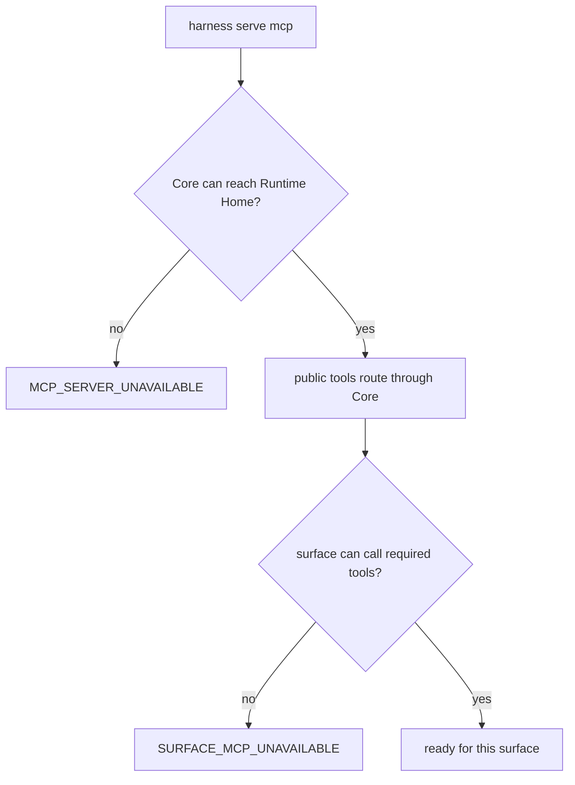
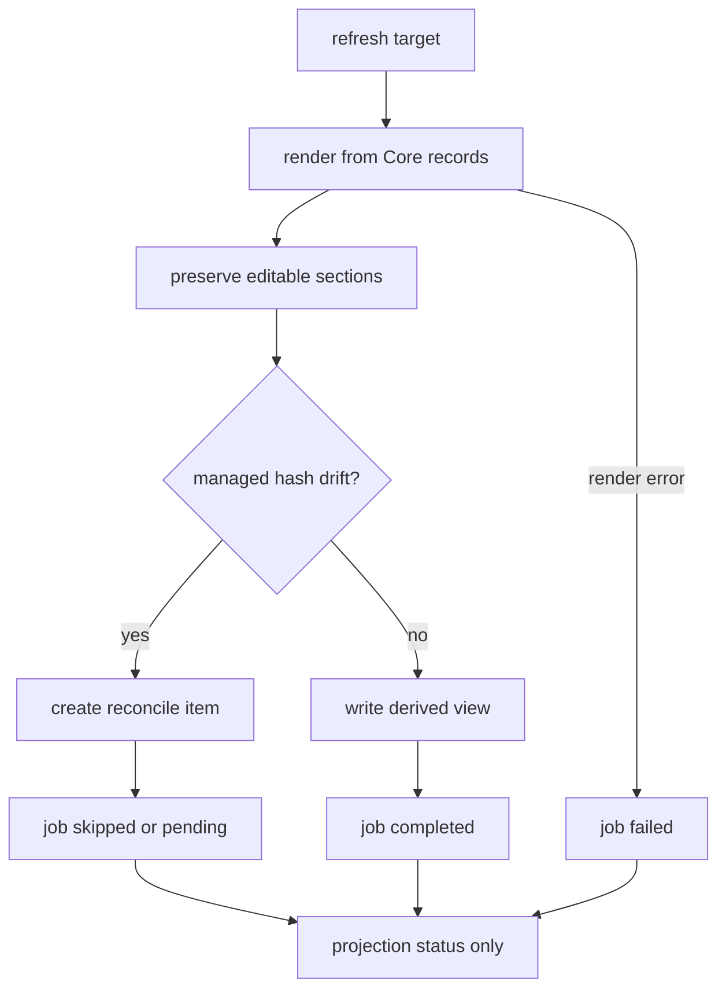
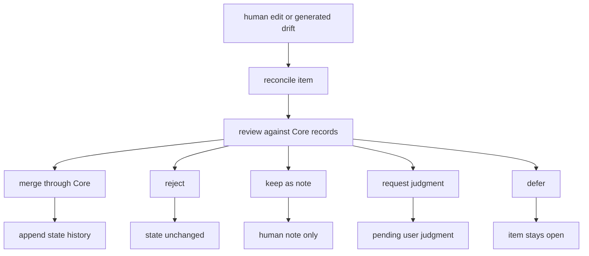

# Operations And Conformance Reference

## What this document helps you do

Use this reference to look up Harness operator procedures, conformance staging and future run entrypoint behavior, and the boundary between documentation checks, MVP behavior examples, and future runtime conformance.

It is a lookup document for operators, implementers, conformance authors, and maintainers. It is not an onboarding path; first-time readers should start with Learn or Build docs and return here when they need exact operational or conformance semantics.

This is reference documentation for future operator and conformance behavior. The current repository is documentation-only and contains no runnable Harness Server conformance tests; current phase and handoff status are tracked in [Implementation Overview](../build/implementation-overview.md#documentation-acceptance-status).

## Read this when

- You need the stage-specific behavior contract for operator surfaces such as `harness connect`, `harness doctor`, `harness serve mcp`, projection refresh, reconcile, recover, export, artifact checks, or conformance runs.
- You need the conformance run entrypoint overview, staged suite boundary, or runtime/docs-maintenance separation.
- You need to tell runtime Core fixture conformance apart from docs-only maintenance checks.
- You are diagnosing an operations mismatch across state, artifacts, projections, MCP availability, or generated files.
- You need future fixture body shape or assertion semantics; start here for the overview, then use [Conformance Fixtures Reference](conformance-fixtures.md). For compact future scenario-family inventory, use [Future Fixtures](../later/future-fixtures.md).

## Before you read

Use [Conformance Fixtures Reference](conformance-fixtures.md) for the core conformance model, the small Engineering Checkpoint / MVP-1 behavior examples, future fixture body shape, execution, assertion semantics, current-phase status, and Kernel Smoke authoring order. Use [Future Fixtures](../later/future-fixtures.md) for compact future scenario-family inventory that is not stage-required by catalog listing alone. Use [Runtime Architecture](runtime-architecture.md#state-transaction-flow) for Core transaction ordering, [Security Reference](security.md) for security assets, trust boundaries, threats, and controls, [MVP API](api/mvp-api.md), [API Schema Core](api/schema-core.md), and [API Errors](api/errors.md) for public tool schemas and replay behavior, [Storage](storage.md) for storage layout, and [Core Model Reference](core-model.md) for state transition semantics.

## Main idea

Operations are the operator-facing capabilities around Core. They are introduced by stage: early stages keep only the minimal local surface needed to connect a project, expose the active local API/MCP boundary when required, and report basic status or diagnostics; later operations profiles add projection refresh, reconcile, recovery, export, artifact checks, release handoff, and conformance execution.

The important rule is that operations are surfaces over the same Core authority used by agents. Core alone changes canonical operational state. Operator commands may diagnose, repair, export, or run fixtures, but they must not create a second state model, make Markdown authoritative, or write around Core.

Keep three layers separate:

- Documentation checks are editorial checks over Markdown docs: link integrity, terminology consistency, stage boundaries, security wording, user-language checks, owner-boundary drift, and English/Korean parity. They can produce documentation findings only.
- MVP behavior examples are design examples that describe the expected Engineering Checkpoint and MVP-1 behavior. They are not executable fixtures yet, not generated runtime artifacts, and not current runtime pass/fail results.
- Runtime conformance is future server implementation work. After runtime implementation exists and fixture suites are materialized, conformance will prove Harness behavior with executable fixtures. A passing fixture must drive a Core or operator action and compare captured state, events, artifacts, projections, and errors.

Runtime suite pass/fail is executable-state-based. The runner decides a fixture result from the captured Core/API or operator result and the fixture expectation fields; scenario tables, comments, rendered status, Journey Card text, close prose, or agent summaries cannot substitute for that comparison.

Rendered prose, status text, Journey Card text, close reports, or agent summaries can help a reader, but they cannot pass conformance by themselves. Findings and close blockers must be asserted through structured Core/API results, owner-record refs, validator results, events, artifacts, projection freshness, or documented docs-maintenance report labels, not as prose-only report text.

This document owns the operator-facing procedure and conformance overview for future implementation. [Conformance Fixtures Reference](conformance-fixtures.md) owns the core conformance model, exact future fixture body shape, assertion semantics, suite catalog metadata boundaries, future fixture profiles by behavior proved, the small Engineering Checkpoint / MVP-1 behavior examples, and the reduced Kernel Smoke queue. [Future Fixtures](../later/future-fixtures.md) owns compact future scenario-family inventory that stays catalog-only until promoted.

## Reference scope

This document owns:

- operator entrypoint semantics
- operator diagnostic and runtime-effect boundaries
- conformance staging and conformance run entrypoint overview
- recover, reconcile, export, artifact-check, and docs-maintenance operator profiles
- compatibility stubs for fixture-detail anchors moved to [Conformance Fixtures Reference](conformance-fixtures.md) or [Future Fixtures](../later/future-fixtures.md)

## Not covered here

This reference does not claim runtime implementation readiness. It defines stage-specific semantics for future implementation and conformance work.

It also does not own conformance fixture body shape, fixture assertion semantics, compact future scenario inventory, public MCP schemas, SQLite DDL, projection template bodies, Learn/Use workflow, or long-term analytics. Core fixture mechanics are owned by [Conformance Fixtures Reference](conformance-fixtures.md), and future scenario-family inventory is owned by [Future Fixtures](../later/future-fixtures.md). Docs-maintenance rule bodies are owned by the [Authoring Guide](../maintain/authoring-guide.md#docs-maintenance-checks); this reference owns only the operator profile boundary below.

## Contract map

| If you need... | Start here | Related owner |
|---|---|---|
| Operator command semantics | [Operator entrypoints](#operator-entrypoints), then the command section: [connect](#connect), [doctor](#doctor), [serve mcp](#serve-mcp), [projection refresh](#projection-refresh), [reconcile](#reconcile), [recover](#recover), [export](#export), [artifacts check](#artifacts-check), or [conformance run](#conformance-run) | Core state authority remains in [Core Model Reference](core-model.md), with transaction ordering in [Runtime Architecture](runtime-architecture.md#state-transaction-flow). |
| Operator diagnostics and runtime-effect boundaries | [Operator diagnostics report facts, not new state](#operator-diagnostics-report-facts-not-new-state), [Docs-maintenance profile](#docs-maintenance-profile), [Release Handoff Export Profile](#release-handoff-export-profile) | Docs-maintenance rule bodies stay in [Authoring Guide](../maintain/authoring-guide.md#docs-maintenance-checks). |
| Fixture body shape and runner behavior | [Conformance Fixtures Reference: Conformance Fixture Format](conformance-fixtures.md#conformance-fixture-format), [Conformance Execution](conformance-fixtures.md#conformance-execution), [Fixture Assertion Semantics](conformance-fixtures.md#fixture-assertion-semantics) | Public request schemas stay in [MVP API](api/mvp-api.md) and [API Schema Core](api/schema-core.md). Idempotency and state conflict behavior stay in [API Errors](api/errors.md). Storage seeding details stay in [Storage](storage.md). |
| MVP behavior examples, future fixture authoring order, and future suite labels | [Conformance staging](#conformance-staging), then [Fixture Profiles By Proven Behavior](conformance-fixtures.md#fixture-profiles-by-proven-behavior), [Engineering Checkpoint Behavior Examples](conformance-fixtures.md#engineering-checkpoint-behavior-examples), [MVP-1 User Work Loop Behavior Examples](conformance-fixtures.md#mvp-1-user-work-loop-behavior-examples), [Clarification Quality Behavior Examples](conformance-fixtures.md#clarification-quality-fixture-group), [Kernel Smoke Authoring Queue](conformance-fixtures.md#kernel-smoke-authoring-queue), and [Future Fixtures: Fixture Suites](../later/future-fixtures.md#fixture-suites) | Kernel gate and event names stay in [Core Model Reference](core-model.md). Future catalog suite labels are not early-stage requirements by listing alone. |
| Future scenario inventory by concern | [Future Fixtures: Scenario Family Inventory](../later/future-fixtures.md#fixture-example-map), then the matching inventory section | Catalog rows are not fixture bodies, public input examples, or current runtime conformance cases. |
| Artifact integrity, export, recover, and reconcile checks | [artifacts check](#artifacts-check), [export](#export), [recover](#recover), [reconcile](#reconcile) | Artifact layout and DDL stay in [Storage](storage.md). |
| Security and threat-model diagnostic categories | [doctor](#doctor), [serve mcp](#serve-mcp), and [artifacts check](#artifacts-check) | Threat-model concepts stay in [Security Reference](security.md). API, storage, and kernel details stay with their owners. |

## Operator entrypoints

Every operator entrypoint is a surface over the same Core rules used by the agent. Operator tools may diagnose, repair, export, or run fixtures, but they must not create a second state model. State-changing operator outcomes must enter Core or a documented recovery path that preserves Core state-version, idempotency, event, artifact, and projection-enqueue semantics.

The sections below define behavior contracts when a stage or owner profile introduces the relevant capability. A "Required behavior" list inside a command section means required by the stage or profile where that behavior is in scope; it is not a blanket Engineering Checkpoint or MVP-1 requirement. Command names are illustrative implementation choices.

Stage-specific operator behavior:

| Stage | Operator behavior introduced by the stage | Later behavior kept out |
|---|---|---|
| Engineering Checkpoint | Minimal local project registration or reconnect; one registered reference `capability_profile`; basic status/diagnostic read over the active Core state; local API/MCP exposure only if the first slice uses that boundary; optional pointer to the narrow Kernel Smoke check after runtime tooling exists. | Projection refresh, reconcile, recover, export, artifacts check, full conformance run, release handoff, remote/shared MCP exposure, hosted connector registry, cross-surface orchestration, and broad connector automation. |
| MVP-1 User Work Loop | User-facing support around the same minimal operator surface: status/next diagnostics for current work, missing user judgments, evidence state, close blockers, final-acceptance need/status, and residual-risk visibility. | Detached assurance operations, full doctor/readiness categories, projection refresh as an operator surface, reconcile, recover, export, artifacts check, full conformance run, and release handoff. |
| Assurance Profile | Assurance-oriented support for verification, Manual QA, residual-risk, final-acceptance, stewardship, and context-hygiene profiles through the owner paths that are active in this stage. | Operator recovery/export completeness, broad projection/reconcile operations, release handoff, and the full operations conformance profile. |
| Operations Profile | Full local operations profile: doctor/readiness categories, projection refresh, reconcile, recover, export, artifact integrity check, release handoff report/export profile where defined, and conformance run over materialized runtime suites. | Dashboard, hosted workflow UI, broad connector ecosystems, hosted connector registry, remote/shared operations, Browser QA Capture automation, Cross-Surface Verification automation, team workflow, and cross-surface orchestration unless separately promoted. |
| Roadmap | Promoted roadmap operations such as broader connector automation, hosted connector registries, remote/shared access profiles, richer UI/operator dashboards, cross-surface orchestration, and higher automation only after owner docs define and prove exact contracts. | Anything not promoted remains outside staged delivery. |

Operator guarantee posture follows the [Security Reference stage map](security.md#guarantee-levels-by-stage):

| Stage | Security wording allowed for operator surfaces |
|---|---|
| Engineering Checkpoint | Cooperative/local diagnostic wording plus limited detective reporting for the active Core path. Structured blockers are Core/API results, not proof of pre-action tool blocking. |
| MVP-1 User Work Loop | User-visible status and blocker wording may explain what cannot proceed under Harness authority and what only the user can decide. It must still say when the surface can only hold by instruction or detect later. |
| Assurance Profile | Assurance diagnostics may report missing verification independence, Manual QA, residual-risk acceptance, final acceptance, or stewardship evidence without implying isolation or prevention. |
| Operations Profile | Doctor, recover, export, artifact check, projection refresh, and reconcile are primarily detective/repair/report surfaces unless an exact profile proves stronger coverage. |
| Roadmap | Preventive or isolated operator claims require promoted owner docs, exact covered operations, fixture proof, and fallback behavior. |

Summary: operator behavior is staged. Engineering Checkpoint keeps only minimal local registration/status and local API/MCP exposure if the first slice needs it; MVP-1 adds user-facing status and blocker support; Assurance Profile adds assurance support; Operations Profile adds operations and handoff; Roadmap remains promoted future scope.

Exact command names and flags may vary by implementation. The reference target is the command-independent behavior contract: operator behavior is defined by Core state records, `state.sqlite.task_events`, artifact refs and files, projection jobs and freshness where those profiles exist, and API-owned errors or operator diagnostic labels. Console text, report prose, flag spelling, and shell exit formatting are display surfaces; they must not become a second state model.

Operator command map by behavior family:

| Entrypoint family | Stage where the behavior first appears | Use this section when you need... |
|---|---|---|
| [`harness connect`](#connect) | Engineering Checkpoint minimal registration with one reference `capability_profile`; fuller connector-profile behavior later as promoted | repository/runtime registration semantics and first-connection expectations |
| [`harness doctor`](#doctor) | Engineering Checkpoint basic diagnostic subset; full category set in Operations Profile | readiness, diagnostics, repair suggestions, and no-new-state reporting boundaries |
| [`harness serve mcp`](#serve-mcp) | Engineering Checkpoint only if the active first slice exposes MCP/API through this local boundary | MCP serving behavior, local availability, and Core authority boundaries |
| [`harness projection refresh`](#projection-refresh) | Operations Profile unless a narrow owner profile explicitly promotes earlier freshness behavior | projection job refresh behavior and managed-block drift handling |
| [`harness reconcile`](#reconcile) | Operations Profile unless a narrow owner profile explicitly promotes earlier proposal/drift handling | human edit, generated file, and managed-block drift routing |
| [`harness recover`](#recover) | Operations Profile | interrupted operation repair and compensating event expectations |
| [`harness export`](#export) | Operations Profile | bundle and Release Handoff export behavior |
| [`harness artifacts check`](#artifacts-check) | Operations Profile | artifact registry/file integrity and redaction boundary checks |
| [`harness conformance run`](#conformance-run) | Operations Profile after runtime suites are materialized; docs-maintenance remains explicitly selected and separate | runtime fixture execution and docs-maintenance profile separation |

## Operator diagnostics report facts, not new state

Operator output should help a person decide what to do next without teaching a second state model. A useful diagnostic line names the category, level, observed fact, affected record or path when safe, operational effect, and next action. It also says when a finding is only diagnostic.

For example, "projection `TASK` is stale" means the readable view is behind the owner records; it does not mean Task state failed. A close/readiness line that depends on report freshness must show the current Core state version separately from the projection `source_state_version` or failed job status. "generated-file drift detected" means a connector-managed file no longer matches the manifest; it is reported and routed to reconcile rather than overwritten. "recovery event appended" means history was extended with a compensating record; it does not mean older `task_events` were rewritten.

These examples are display guidance. They do not add command flags, state tables, event names, public `ErrorCode` values, or fixture fields.

Status/next recommendations, Role Lens output, recommended playbooks, and operator diagnostics are read-only guidance unless a later existing Core/MCP mutation path records the underlying action. They may suggest a user judgment request, `prepare_write`, evidence collection, verification, QA, reconcile, repair, export, or close attempt, but they do not mutate state, authorize writes, satisfy gates, accept results, accept residual risk, or close a Task by themselves.

## Conformance staging

Conformance will run incrementally after runtime implementation exists, but staged execution must not change the fixture body shape or reduce later reference conformance requirements. In the current documentation-only phase, this section is a future verification plan and must not be read as evidence that fixture files, a conformance runner, or runnable Harness Server conformance tests already exist.

Build docs may provide doc-level acceptance checks for planning the first implementation slice and stage exits. Those documentation checks help reviewers keep Engineering Checkpoint narrow, but they are not fixture fields, suite metadata, public request schemas, storage rows, primary errors, generated conformance artifacts, or runner comparison modes. Future runtime pass/fail still comes only from executable fixtures that use the exact body shape and assertion semantics in [Conformance Fixtures Reference](conformance-fixtures.md).

Engineering Checkpoint is the first future internal authority-loop target, and Kernel Smoke is a future smoke-check label for the narrow checks that exercise that path after implementation begins. Build owns the stage exit criteria in [Engineering Checkpoint](../build/engineering-checkpoint.md); the exact future runtime fixture queue is owned by [Conformance Fixtures Reference: Kernel Smoke Authoring Queue](conformance-fixtures.md#kernel-smoke-authoring-queue). Once materialized, a minimal Kernel Smoke subset proves only the first internal Core authority path; it does not require a full conformance suite and does not claim MVP-1 User Work Loop, Assurance Profile, or operations conformance.

Reference-surface smoke expectations are part of that narrow Kernel Smoke authoring target, but they are not pass claims in this documentation-only phase. The expected active profile reports `surface_id=reference-local-mcp`, `mcp_available=true`, `max_guarantee_level=detective`, unsupported pre-tool blocking and isolation fields, and `conformance_smoke_status=planned_not_run` or an equivalent planned/not-run state until runtime fixtures are materialized and executed.

MVP-1 User Work Loop uses the small user-value behavior examples in [Conformance Fixtures Reference](conformance-fixtures.md#mvp-1-user-work-loop-behavior-examples), including the [Clarification Quality Behavior Examples](conformance-fixtures.md#clarification-quality-fixture-group). These examples are not executable fixtures yet. MVP-1 is not a requirement to run the broad future catalog, full Manual QA, Eval systems, TDD trace, module map, interface contract, Journey/Spine projections, export/recover, dashboard/team/orchestration, or advanced connector/security fixtures.

The later conformance profiles follow the stage names in [MVP-1 User Work Loop](../build/mvp-user-work-loop.md): Assurance Profile fixtures for Assurance Profile, and Operations Profile or promoted Roadmap fixtures for Operations Profile and promoted Roadmap candidates. Exact policy, API, storage, projection, connector, and fixture requirements stay in their Reference owners. Suite catalog metadata may group scenarios by suite, delivery stage, and tags for runner selection and reporting, but it is not passed to Core; future executable fixtures still assert through Core state, events, artifacts, projections/freshness, and errors.

Guard/freeze conformance in staged delivery asserts honest display and behavior at cooperative/detective levels: freeze requests can hold work, make the next action stricter, or cause `prepare_write` to return a structured blocker or hold when existing scope is incompatible; persistent owner-record changes must be asserted only when they happen through an existing Core state-changing path, User Judgment route, or owner-record update path. Guard displays report whether the current path is cooperative or detective and what violations can only be detected after the fact. Preventive `T4` guard fixtures and higher guarantee levels remain operations/future or Roadmap scope unless owner docs promote and prove a concrete covered operation with fixture-backed pre-tool blocking for the relevant reference surface. Isolated-profile conformance must name whether the boundary supports verification independence/stale-context control or stronger security isolation, and must not treat a worktree, fresh evaluator bundle, or process split as OS sandboxing or tamper-proof security unless that exact mechanism is proven.

Browser QA Capture conformance is a Roadmap candidate, not a requirement of Engineering Checkpoint fixtures, MVP-1 User Work Loop fixtures, Assurance Profile fixtures, or Operations Profile / promoted Roadmap fixtures. Until promoted through the [Roadmap promotion criteria](../roadmap.md#promotion-criteria), it is non-authoritative capture support only. Future fixtures should prove declared `T6 QA Capture` behavior only after capability profile fields, redaction and secret/PII handling, browser test environment, artifact retention, capture artifact mapping, unsupported-surface fallback behavior, and no projection-as-canonical dependency are defined. Staged-delivery fixtures still prove Manual QA records, artifact refs, QA waiver behavior, acceptance boundaries, and close blockers without requiring automated browser capture.

Connector and reference-surface smoke coverage follows the same staged rule. Engineering Checkpoint needs only enough reference-surface coverage to exercise the Kernel Smoke path named by the fixture owner: exact active `capability_profile` fields, honest guarantee display from those fields, `CAPABILITY_INSUFFICIENT` or structured blocked reasons when unsupported capabilities are required, and no product write silently continuing on an unsupported surface. Later profiles broaden this into connector honesty, generated-file drift reporting, manual artifact/verification/QA fallbacks, projection/card display, and the connector conformance scenarios owned by [Agent Integration Reference](agent-integration.md#connector-conformance-overview). Preventive `T4`, automated `T6`, remote/shared MCP exposure, hosted connector registries, cross-surface orchestration, and broad connector automation stay outside Engineering Checkpoint unless owner docs promote and prove a concrete reference path.

Summary: Engineering Checkpoint conformance scope is the narrow Core authority loop: project/Task setup, one active Change Unit or scoped boundary, `prepare_write` plus Write Authorization, `record_run` plus evidence link, status/blocker output, and narrow close-blocker check. Later profiles add user-facing, assurance, and operations coverage without making the broad future catalog an early-stage requirement.

## Docs-maintenance profile

Documentation checks are the current active layer for docs work. They check Markdown docs for link integrity, terminology consistency, stage boundaries, security wording, user-language quality, documentation drift, owner mismatch, English/Korean file-structure or semantic-section parity gaps, duplicate normative text outside the owner, broken links or anchors, future fixture/action schema drift, enum/event/validator/projection drift, glossary/source-of-truth phrasing drift, and TODO hygiene problems. These are documentation findings only. The profile is a read-only maintenance check over Markdown docs, not Core fixture conformance, a runtime validator, evidence, residual-risk acceptance, close readiness, or a canonical state transition. It must not append `task_events`, create artifacts, refresh projections, create QA or acceptance state, affect close readiness, claim runtime implementation readiness, or count toward runtime fixture pass/fail.

The [Authoring Guide](../maintain/authoring-guide.md#docs-maintenance-checks) owns the rule bodies, pass/warn/fail interpretation, and checklist. This document owns only the operator-maintenance expectation for reporting and entrypoint exposure.

Future operator wiring contract: if a later implementation exposes these checks through `harness conformance run` or another operator entrypoint, docs-maintenance is an explicitly selected docs-only profile, conventionally named `docs-maintenance`. Runtime conformance runs must not include it unless an operator selects that profile. Even when selected, report it separately from runtime Core fixture suites and do not count it toward runtime fixture pass/fail or implementation readiness. Its `PASS`, `WARN`, and `FAIL` labels are docs-maintenance report labels, not Core fixture results, and the read-only runtime-effect boundary above still applies.

Console output or an ephemeral report from the docs-maintenance profile is the only output defined here. Generated operational report files require a future explicit implementation contract; this documentation batch does not define stored artifacts, projection jobs, DDL, or state records for this check.

Minimum report fields:

- profile name and documentation revision
- pass, warn, or fail per category
- affected file path and heading or anchor when available
- canonical owner doc and expected source section
- observed documentation finding or drift
- suggested fix class: update owner, replace duplicate with summary plus link, mirror translation, repair link, or add an entry to [Build: MVP-1 User Work Loop: Implementation decisions needed before server coding](../build/mvp-user-work-loop.md#implementation-decisions-needed-before-server-coding)
- runtime effect: none; no canonical state transition was performed and no runtime fixture result was recorded

Check categories should reference, not restate, the [Authoring Guide docs-maintenance checks](../maintain/authoring-guide.md#docs-maintenance-checks), including the required categories, review-output expectations, pass/warn/fail meanings, and owner-first drift resolution flow. Operator output may name those categories, but it must not turn Maintain guidance into runtime fixture semantics.

Docs-maintenance summary: this documentation-check layer reads Markdown and emits an ephemeral report only; it does not create Harness runtime state, artifacts, projections, QA, acceptance, risk, or close facts. The bullet list above is the reporting shape.

## connect

`connect` links a Product Repository, Harness Runtime Home, and one reference agent surface. The command name is illustrative; another local registration entrypoint may satisfy the same behavior.

Engineering Checkpoint minimum:

- identify the repository root
- register or reuse the local project
- create or validate static project configuration
- initialize the per-project state and artifact storage needed for the Engineering Checkpoint
- register the reference surface only to the level needed for the active local profile
- record local-only MCP/API exposure posture if the stage uses that boundary
- confirm minimal MCP/API reachability or report a diagnostic when the stage depends on it

Later connector/operator profile behavior, required only when the active stage or owner profile includes it:

- register the reference surface and a capability profile declared and proven for the actual host/profile/configuration in use, not inferred from the surface name
- record MCP exposure posture as local-only by default, with any documented access-control contract and material class, in the connector manifest without storing raw token, secret, or private configuration values
- create or refresh connector-managed files through a manifest
- record connector profile freshness, capability profile version, detected version, last verification time, and conformance or operator-check basis in the connector manifest
- confirm MCP configuration can reach the harness server
- run a profile-specific smoke check or print the command to run it

Connect sequence summary: registration links a Product Repository, Runtime Home, surface profile, optional MCP reachability check, and stage/profile check without treating generated files as state. The ordered bullets above carry the sequence.

When connector-managed files or managed blocks are in scope, connect must report generated/managed manifest drift instead of overwriting human edits silently. This includes generated files, managed blocks, MCP config snippets, and stale capability profile freshness. The existing file or managed block stays unchanged until reconcile or an explicit reconnect decision chooses replacement; the edited generated file is not Task state. Surface-specific generated file names belong in the surface cookbook.

Illustrative connect drift output:

```text
surface     WARN  connector-managed file drift
observed    .harness/agent/generated/reference-instructions.md changed since manifest MAN-014
effect      existing file kept; connector manifest/reconcile path records drift
next        review the diff, then reconcile or reconnect with an explicit decision
authority   edited generated file is not Task state and was not silently overwritten
```

## doctor

`doctor` reports readiness, drift, and repair options.

The full doctor/readiness category set is Operations Profile behavior. Earlier stages may expose only the basic status/diagnostic subset needed for the active stage and must not claim the full operations profile.

Full doctor/readiness categories:

| Category | Checks |
|---|---|
| runtime home | runtime root readability, project directory presence, `registry.sqlite`, `project.yaml`, per-project `state.sqlite`, artifact directories, locks, storage permissions posture, generated operational path posture, and whether direct file edits would bypass Core |
| project state | registered project, repo root, static config validity, current state readability, JSON field parse and shape validity, owner-bound status values, state-version and idempotency consistency, active Task consistency |
| artifact store | file existence, `sha256`, `size_bytes`, `content_type`, `redaction_state`, retention or availability, task/run or artifact-link relation, approved staging boundary, and missing or `hash_mismatch` files |
| reference surface | capability profile declared for the actual host/profile, profile freshness, stale capability profile detection after version/MCP config/hook/permission/workspace policy/generated-file/conformance-result/capture/QA-capture/redaction/retention changes, generated/managed manifest drift, MCP config freshness, required MCP tool-call ability, and honest guarantee display |
| MCP availability | server reachability, Core reachability, read resource availability, public tool availability, local-only or promoted access posture, and `MCP_SERVER_UNAVAILABLE` versus `SURFACE_MCP_UNAVAILABLE` diagnostics |
| projections | queued jobs, freshness, managed hash drift, failed renders |
| reconcile | pending human edits, managed block drift, generated/managed manifest drift |
| validators/checks | required stable ValidatorResult-emitting validators, plus separately captured Core check/precondition categories |
| agency/stewardship/context | User Judgment and decision gate readiness, Autonomy Boundary readiness, residual-risk visibility, codebase stewardship, context freshness, stale chat/pull-only context not treated as authority |
| security/threat model | local binding/access expectation, registered project/task/surface consistency, connector drift, sensitive-category side effects, redaction, omission, or block coverage that cuts across runtime home, artifact store, reference surface, and MCP availability; threat concepts are owned by [Security Reference](security.md) |

Doctor summary: `doctor` reads readiness categories and reports diagnostic levels; it does not repair, mutate, or certify runtime state. The table above is the category map.

Output levels:

```text
OK
WARN
FAIL
REPAIRABLE
MANUAL
```

Levels are operator report levels, not gate values:

| Level | Meaning |
|---|---|
| `OK` | The checked surface, record, or file is usable for the covered operation. |
| `WARN` | Work may continue with a visible reduced guarantee, stale context, or non-blocking risk. |
| `FAIL` | The covered operation cannot safely rely on the checked input or capability. |
| `REPAIRABLE` | Core or a documented operator path can repair the issue from canonical state, registered artifact files, safe metadata notices, or managed output without inventing user-owned judgment. |
| `MANUAL` | A human must inspect, decide, restore, reconnect, or provide missing context before Core can rely on the result. |

Doctor must distinguish current state failures from projection stale or projection failed status.

State checks include JSON `TEXT` fields in `registry.sqlite` and `state.sqlite`, owner-bound status-like `TEXT` values, state-version bases, and idempotency replay rows. Malformed JSON and schema-incompatible JSON are state failures. Unknown owner-bound status values are state failures; conformance runners may report the same condition as invalid fixture/import seed data before Core execution. Replay rows that cannot verify their canonical request hash and stored response linkage are state/security findings, not display drift. Doctor may mark these findings `REPAIRABLE` only when Core can safely reconstruct the expected value from other canonical state, registered artifact files, or safe metadata notices without inventing user-owned judgment; otherwise it reports `FAIL` or `MANUAL`.

Compact doctor examples:

| Category | Example report | Operational meaning |
|---|---|---|
| runtime home | `runtime home WARN project directory permissions broader than profile` | The storage posture reduces the reported guarantee; direct file edits still do not become authority. |
| project state | `project state OK repo_root=/repo project_id=PRJ-0001` | Project registration, static config, and current state shape are readable. |
| project state | `project state FAIL state.sqlite tasks.current_json malformed` | Current state is invalid; this is not a projection problem. Recovery may repair only if Core can reconstruct the shape. |
| MCP availability | `MCP availability FAIL MCP_SERVER_UNAVAILABLE localhost endpoint refused` | Core cannot be reached through MCP, so no authoritative Core response or state-changing claim is available from that path. |
| reference surface | `reference surface WARN SURFACE_MCP_UNAVAILABLE required tool not callable by SURFACE-REF` | Core may be reachable, but this connected surface cannot use the required MCP path; write-capable work is held according to the guarantee profile. |
| artifact store | `artifact store FAIL ART-204 hash_mismatch; evidence_gate may become stale` | The artifact record and stored file disagree; Markdown edits do not repair the evidence. |
| projections | `projections WARN TASK stale source_state_version=41 current_task_state_version=44` | Task state may still be valid; the readable `TASK` view lags and should be refreshed or reconciled. |
| projections | `projections FAIL RUN-SUMMARY failed render_error=template_input_missing` | The projection job failed; the Run record is not converted into a failed Run by this display failure. |
| reconcile | `reconcile MANUAL generated-file drift .harness/agent/generated/reference-instructions.md` | The generated file is reported and routed for review; it is not silently overwritten or treated as state. |
| validators/checks | `validators/checks WARN context_hygiene_check stale projection refs` | Stable validators and Core checks are reported separately; a mechanical projection freshness issue is not a new validator ID. |
| agency/stewardship/context | `agency/stewardship/context FAIL User Judgment required for user-owned trade-off` | The blocker routes to the User Judgment path; broad approval or status prose cannot satisfy the judgment. |
| security/threat model | `security/threat model WARN socket permissions broader than profile` | The finding changes the reported guarantee and may block write-capable readiness, but file permissions are diagnostic rather than canonical state. |

Security-oriented doctor output is diagnostic and does not create new runtime authority. It applies the threat concepts in [Security Reference](security.md) and should report when the MCP access mode does not match the local process/localhost expectation or the documented connector profile, when project/task/surface claims do not match registered state, when connector-managed files drift, when artifacts lack redaction, omission, or block metadata required by their sensitive category, and when sensitive operations including `destructive_write`, `network_write`, `external_service_write`, `secret_access`, `privacy_or_pii_change`, `data_export`, `infra_or_deployment_change`, `production_config_change`, `ci_cd_change`, `billing_or_cost_change`, or `telemetry_or_logging_change` appear outside the recorded scope/approval/user judgment/Write Authorization path.

Doctor should also check the runtime-home file trust posture at the documentation-contract level. It should warn or fail, according to risk and platform observability, when `state.sqlite`, `registry.sqlite`, `project.yaml`, connector config snippets, connector manifests, generated manifests, artifact directories, staging files, or generated operational files are readable or writable beyond the documented local control profile in a way that enables tampering, spoofed configuration, or secret/PII exposure. File-permission findings are diagnostic; they do not make direct file edits authoritative and they do not replace Core shape, owner, integrity, and artifact checks.

For artifacts, doctor treats missing redaction, omission, or block metadata as a security finding, not a cosmetic report issue. It must not recommend copying raw staged files into place as a repair unless Core can validate and register them through the artifact registration contract. When doctor reports `secret_omitted` or `blocked`, it reports the committed artifact ref and safe metadata only. For `blocked`, `sha256`, `size_bytes`, and `content_type` describe the registered metadata notice bytes; doctor must not claim the forbidden payload can be recovered from Harness.

The reference local security posture has this minimum severity baseline. Implementations may be stricter for a platform or connector, but they must not report a weak local exposure as `OK` merely because it is reachable from the same machine:

| Check | `OK` baseline | `WARN` baseline | `FAIL` baseline | `MANUAL` baseline |
|---|---|---|---|---|
| Runtime Home permissions | Runtime root, project directory, `registry.sqlite`, `project.yaml`, `state.sqlite`, connector manifests, artifact directories, `artifacts/tmp/`, and generated operational files are owner-only or platform-equivalent for the registered local user/profile. | Affected paths are readable more broadly than preferred but not writable, no raw secret/PII exposure is observed, and the reduced guarantee is displayed. | Any state, config, connector manifest, artifact, staging, or generated operational path is writable by unrelated users, groups, shared containers, broad local processes, or off-profile automation in a way that could spoof state, config, artifacts, or connector profile. | Owner/mode/reachability cannot be determined, platform semantics are ambiguous, or a human must inspect a shared mount/container/user boundary before Core can rely on the result. |
| Artifact directory exposure | Artifact roots and `artifacts/tmp/` are not readable or writable outside the registered local profile, and registered artifacts pass owner, integrity, redaction, omission, and block checks. | Committed artifact directories are broadly readable but contain only allowed/redacted bytes and safe omission/block metadata, and no state-changing or export/close-relevant path relies on the exposure. | Broad read exposes unredacted secrets/PII or forbidden capture payloads, broad write can poison committed or staged artifacts, or an export/verification/QA/close path would rely on exposed artifact bytes. | Sensitivity, owner, retention class, or whether bytes are committed versus staged cannot be established without human review. |
| Non-loopback, forwarded, tunneled, or shared MCP reachability | MCP is exposed only through local process, local socket, localhost-loopback, or an owner-documented and conformance-promoted connector posture. | An off-profile endpoint is observable only for read-only diagnostics, state-changing tools are held, and the report shows reduced guarantee plus reconnect/remediation guidance. | A non-loopback bind, forwarded/tunneled endpoint, unauthenticated shared endpoint, cloud/CI relay, cross-user socket, or remote caller would be used for state-changing, write-capable, product/runtime/code write, or close-relevant operations without a promoted connector posture. | Bind scope, tunnel/forwarding state, caller identity, or connector-profile coverage cannot be determined. |
| Stale MCP config or connector profile | MCP config, generated/managed manifest, capability profile version, access-control material class, and `last_verified_at` or equivalent freshness basis match the registered surface. | Staleness affects read-only context or display only; write-capable work is held and the report names the stale file/profile/check. | Required MCP tools are not callable, access-control material changed, profile freshness is invalid for the requested operation, or stale config would let a surface overstate capability or bypass the local-only posture. | The operator must reconnect, choose the intended surface/profile, rotate or reissue local access material, or inspect drift before Core can classify the posture. |
| Broad local file access risk | Local file access is confined to the registered project/runtime paths and profile assumptions, with no broad read/write path that changes authority, artifacts, or connector behavior. | Broad read-only access affects non-authoritative generated context or already redacted reports, and the guarantee display makes the limitation visible. | Broad read or write access can expose secrets/PII, poison artifacts, edit Runtime Home, spoof connector config, widen MCP exposure, or affect sensitive categories such as `secret_access`, `privacy_or_pii_change`, `data_export`, `network_write`, or `external_service_write`. | The affected files, user/group boundary, container/shared mount semantics, or sensitive-category impact require human classification. |

Security diagnostic display examples:

| Observed condition | Category and level guidance | Report content |
|---|---|---|
| MCP is exposed beyond local process/localhost without a matching connector profile, or appears forwarded, tunneled, stale, or unknown. | `security/threat model` plus `MCP availability`; `WARN` for reduced read-only guarantees, `FAIL` when state-changing or close-relevant paths would rely on the exposure. | Observed bind or access mode, active project, expected surface profile, reduced guarantee, and next diagnosis or reconnect action. |
| Runtime Home permissions are unknown or weaker than the documented local control profile. | `security/threat model`; `WARN` or `MANUAL` according to platform observability. | Affected path class, observable owner/mode facts when available, and the reminder that file permissions are diagnostic rather than canonical state. |
| Runtime Home has broad write access. | `security/threat model` plus `runtime home`, `project state`, `reference surface`, or `artifact store` as affected; usually `FAIL` for write-capable readiness. | Tampering risk for `state.sqlite`, `registry.sqlite`, `project.yaml`, connector config snippets, connector manifests, generated manifests, artifact storage, staging files, and generated operational files; direct edits remain invalid until Core/recover/artifact checks validate them. |
| Artifact directories have broad read access. | `security/threat model` plus `artifact store`; `WARN` or `FAIL` according to sensitivity. | Confidentiality risk for logs, screenshots, tokens, PII, verification bundles, and exports; report artifact refs, `redaction_state`, and path class without leaking raw values. |
| Registered project, Task, or surface does not match the caller's claim. | `security/threat model`, `MCP availability`, and `reference surface`; `FAIL` for the affected operation. | Claimed versus registered identifiers where safe to display, affected tool or surface, and guidance to refresh/reconnect rather than treating the claim as authority. |

## serve mcp

`serve mcp` starts or prints connection information for the local MCP server. The command name is illustrative; Engineering Checkpoint may satisfy the contract through any minimal local API/MCP exposure required by the first slice.

Behavior when local MCP/API exposure is in scope:

- report whether access is local process/localhost only or covered by a documented connector capability profile
- default to local-only exposure for the Engineering Checkpoint/default reference posture and avoid non-loopback binding or shared/remote endpoints unless the connector profile explicitly covers them
- report the documented access-control contract and material class when MCP is exposed to a caller, such as localhost-only binding, Unix-domain socket, per-project token, process-scoped configuration material, or equivalent local control, without printing raw token, secret, or private configuration values
- expose read resources without mutation
- expose public tools through Core, not shell shortcuts
- require state-changing calls to use Core conflict and idempotency behavior
- report the active project and connected surface profile
- report display-safe active `capability_profile` fields, including `surface_id`, `mcp_available`, `cooperative_prepare_write_supported`, `changed_path_detection_supported`, `artifact_capture_supported`, `manual_artifact_attachment_supported`, `command_observation_supported`, `secret_access_observation_supported`, `pre_tool_blocking_supported`, `isolation_supported`, `max_guarantee_level`, and `conformance_smoke_status`
- fail clearly when the server cannot reach runtime state or artifact storage

MCP serving summary: the server path is usable only when Core can reach Runtime Home and the connected surface can call the required local MCP tools.



If MCP is unavailable, operations must distinguish diagnostic condition `MCP_SERVER_UNAVAILABLE` from diagnostic condition `SURFACE_MCP_UNAVAILABLE`. These labels are not additional public `ErrorCode` values. When either condition is surfaced through `ToolError`, operations must use the API-owned error selection and details shape: `MCP_UNAVAILABLE` remains the stable public availability code, while surface-side availability or capability cases may use `MCP_UNAVAILABLE` or `CAPABILITY_INSUFFICIENT` with `details.mcp_unavailable_kind` according to context. With `MCP_SERVER_UNAVAILABLE`, a tool call cannot reach Core and no authoritative Core response is possible; the next action is server diagnosis or reconnect before any state-change claim. With `SURFACE_MCP_UNAVAILABLE`, Core or an operator can observe that the connected surface lacks usable MCP, has stale MCP configuration, or cannot call required MCP tools. Cooperative surfaces must hold product/runtime/code writes by instruction; stronger profiles may enforce the hold preventively only when fixture-proven blocking covers the operation, or through a proven isolation boundary. Operations must still report the actual guarantee level.

`serve mcp` should treat unexpected callers, callers outside the documented local process/localhost expectation or connector access contract, weak socket or config permissions, forwarded or tunneled endpoints, and stale connector configuration as threat-model issues defined by [Security Reference](security.md). It reports access mode, active project, surface identity, and capability profile so a user can see when a surface is not the one Core expects. It must not present a spoofed `surface_id`, `actor_kind`, or project/task selection as proof of authority; the public tool contract still resolves and validates those claims through Core.

Remote or shared MCP exposure is an opt-in connector posture, not a Engineering Checkpoint or staged-delivery `serve mcp` default. Before operations may present it as usable, the connector profile must cover the access-control contract, secret/PII handling, redaction or omission behavior, guarantee display, and conformance scenario that proves the exposed path does not bypass Core envelope validation or compatibility checks.

When the access mode is unknown or weaker than the registered profile, operations should choose a diagnostic severity that matches the exposed authority. Read-only resource exposure can be a warning when the user can still understand the reduced guarantee. State-changing tools, product/runtime/code write paths, or close-relevant flows should fail, hold, or report `CAPABILITY_INSUFFICIENT`/`MCP_UNAVAILABLE` rather than silently continuing under an overstated guarantee.

`serve mcp` display should make the local boundary visible before a surface relies on it. For example, an endpoint bound to `0.0.0.0`, a detected forwarded port, a socket whose filesystem permissions are broader than the registered profile, or a stale per-project token should be shown as an off-profile access condition with the active `project_id`, `surface_id`, `capability_profile` summary, guarantee level, held capabilities, and fallback instruction. These are diagnostic display facts; public tool calls still rely on Core envelope validation, idempotency, state-version checks, and the API-owned `ToolError` taxonomy.

## projection refresh

Projection refresh regenerates Product Repository Markdown from committed state records and artifact refs. It is a derived-view operation: it may report freshness, failed jobs, and reconcile needs, but it must not replace Core state, structured blockers, evidence authority, final acceptance, residual-risk acceptance, or Write Authorization.

Behavior required when projection refresh is in scope, normally Operations Profile unless an owner profile explicitly promotes a narrower earlier path:

- render only the latest projection version for a target
- render or enqueue only the projection views included by the active projection profile, with no persisted Markdown projection required for Engineering Checkpoint
- preserve human-editable sections
- compare managed block hashes before overwrite
- create reconcile items for managed-block drift
- mark projection jobs `completed`, `failed`, `pending`, or `skipped`
- display `source_state_version` or equivalent freshness facts without treating front matter as state
- keep projection failure separate from Task result and committed Core state

Supported targets:

```text
one Task
all active Tasks
approval/run/evidence/eval/direct reports for a Task
design-quality projections when enabled
```

Projection refresh summary: refresh renders from committed records and artifact refs, preserves editable areas, and routes managed-block drift to reconcile instead of changing Core state.



For staged delivery, user judgment visibility is rendered through status/next responses, judgment-context resources, user-judgment resources, compatibility decision-packet resources when enabled, and the owner-defined MVP-1 judgment view. Current-position context is rendered through the owner-defined compact MVP views first. Kernel Smoke does not require dedicated refresh targets for standalone full-format judgment, design, export, journey, detailed run, detailed evidence, Eval, TDD trace, module map, or interface-contract projections; those targets are profile-gated Future/diagnostic projections or Operations/export reports when enabled.

Projection support is source-backed. MVP-1 can satisfy user-readable output with the four user-facing compact outputs owned by [Projection And Templates Reference](projection-and-templates.md#mvp-1-view-set) and [Template Reference](templates/README.md#mvp-1-template-set) without persisted projection support; agent-facing context uses the separate `agent-context-packet`. Later/full-profile, assurance, operations/export, and diagnostic report kinds remain with their projection/template owners unless an owner profile promotes them. Projection refresh must report missing source records as unavailable or not applicable rather than creating state to satisfy a template.

Illustrative projection refresh statuses:

| Report line | Meaning |
|---|---|
| `TASK current source_state_version=44` | The rendered `TASK` view matches the committed Task state version and managed hash. |
| `TASK stale source_state_version=41 current_task_state_version=44` | State moved ahead of the rendered view. The Task result did not fail; the view needs refresh or reconcile. |
| `RUN-SUMMARY failed projection_job_id=PJOB-088` | The latest render failed. The committed Run keeps its own `runs.status`; projection failure is reported separately. |
| `APR skipped managed_block_drift reconcile_item=REC-019` | The projector avoided overwriting a changed managed block and routed the drift to reconcile. |
| optional `EXPORT` projection enabled: `EXPORT stale artifact ART-204 unavailable` | Applies only when the optional `EXPORT` projection/report surface is enabled. It does not make `EXPORT` a Kernel Smoke or early mandatory refresh target, and it is not proof that the underlying Task state failed. |

## reconcile

Reconcile turns human-editable input or generated/managed drift into an explicit decision.

The proposal path is: human-editable proposal -> reconcile item -> accepted Core state-changing action with an appended `state.sqlite.task_events` row, or rejection, defer, or conversion to a note. Managed-block direct edits use the same reconcile boundary as drift; they are not state changes.

Targets:

- Task user notes and proposals
- managed block edits
- Domain Language proposals
- Module Map proposals
- Interface Contract proposals
- connector generated/managed manifest drift
- stale projection references that affect current work

Decision outcomes:

| Outcome | Meaning |
|---|---|
| merge | apply the proposal through Core and append state history |
| reject | leave canonical state unchanged and refresh projection if needed |
| convert_to_note | keep the content as a human note, not state |
| create_decision | turn the proposal into a pending user judgment |
| defer | keep the reconcile item open |

Reconcile summary: human edits and generated drift become explicit reconcile items; only a merge path through Core can change canonical state.



Reconcile must not treat edited Markdown as canonical state by itself.

When reconcile reports generated-file or managed-block drift, it should say which source was edited, what owner or manifest expected, and which decision path is open. A merged outcome applies through Core and appends state history. A rejected or converted-to-note outcome leaves canonical state unchanged and may refresh the projection or generated file from the owner records.

## recover

Recover repairs interrupted or inconsistent operational state without rewriting history.

Required recovery classes:

| Scenario | Recovery behavior |
|---|---|
| interrupted agent write | commit a recovery Run with `runs.status=interrupted` or an equivalent interrupted recovery record and capture diff/log artifacts when possible; captured artifacts are recovery evidence only, not proof of successful completion |
| baseline drift | mark affected baseline-dependent write, verification, evidence, approval, or close readiness stale or blocked until a fresh baseline or compatible owner path exists |
| approval drift | expire, narrow, or re-request approval when scope, baseline, sensitive category, expiry, or actor context no longer matches; do not turn the old approval into broad authorization |
| evaluator repo drift | mark verification blocked or evidence stale, require a fresh evaluator bundle or Eval path, and do not set detached verification passed from a drifted observation |
| artifact missing or `hash_mismatch` | rescan files, mark missing artifacts or artifacts with `hash_mismatch` stale or blocked, preserve registered `sha256`, and restore exact bytes or register a replacement through Core when recovery is possible |
| projection failure | retry from committed source records or mark failed and create reconcile guidance; do not change Task result or fabricate state from the rendered report |
| managed Markdown direct edit | create reconcile item and leave canonical state unchanged until an explicit reconcile decision applies through Core |
| malformed or schema-incompatible storage JSON | repair only if Core can reconstruct the expected shape from canonical state, registered artifact files, or safe metadata notices; otherwise fail or require manual recovery |
| idempotency replay mismatch | preserve the original committed replay row, report `STATE_CONFLICT` for the changed request, and do not merge new artifacts, events, projection jobs, or response fields into the old result |
| expired lock | append recovery event and release or reacquire according to lock policy |
| MCP unavailable | report diagnostic condition `MCP_SERVER_UNAVAILABLE` or `SURFACE_MCP_UNAVAILABLE`, keep product/runtime/code writes held, and give the next diagnosis or reconnect step |
| surface capability mismatch | report or emit `surface_capability_check` where the owner path allows it, reduce guarantee display, and hold or fail unsafe writes with existing `CAPABILITY_INSUFFICIENT`, `MCP_UNAVAILABLE`, or blocked-reason paths rather than claiming preventive blocking |
| local security posture weak or unknown | report the same `OK`/`WARN`/`FAIL`/`MANUAL` posture classes as doctor for Runtime Home permissions, artifact directory exposure, MCP reachability, stale MCP config, or broad local file access; hold write-capable or close-relevant recovery until the posture is diagnosed |

Recovery summary: recover classifies the failure, records compensating facts when needed, and keeps failed projections, interrupted writes, stale baselines, and missing artifacts from becoming success claims. The table above is the recovery-class map.

Recovery may append compensating events. It must not silently delete evidence, rewrite event history, make projections authoritative, fabricate successful run evidence, set verification or QA passed, accept results, accept residual risk, or close a Task.

Illustrative recovery report:

```text
before      task_events max event_seq=104; active run observed during write
action      recovery classified interrupted write
after       appended recovery/audit task_events after event_seq=104
after       committed recovery Run with runs.status=interrupted
artifacts   registered safe diff/log snapshots when available
not done    no earlier task_events rewritten; no evidence silently deleted
not done    no Markdown projection edited into canonical state
```

Captured recovery artifacts can explain what was observed during interruption or repair. They do not prove the interrupted implementation completed successfully and cannot satisfy evidence, verification, QA, final acceptance, residual-risk acceptance, or close by themselves.

## export

Export creates a review or archival bundle for a Task. It is a later/reporting profile, not part of the MVP-1 storage minimum.

Required contents:

- export manifest with created time, Task id or ids, included state/event version range, projection freshness, export profile, and `redaction_state` summary
- state snapshots for the Task and related Core records, plus safe state/event version facts needed to understand the snapshot without creating new DDL or a second state store
- user judgments, residual risks with accepted-risk metadata/refs, Journey Spine entries or continuity refs, and relevant Change Unit Autonomy Boundary summaries
- report projection snapshots for relevant reports, including current/stale/failed/omitted freshness status
- artifact references, owner relations, integrity metadata, `redaction_state`, retention/availability, and included registered artifact files only when policy and `redaction_state` allow
- artifact integrity manifest
- retention status for included refs, including retained registered files copied into the bundle and expired or unavailable artifacts omitted from the bundle
- redaction, omission, and block notes for omitted secrets, sensitive logs, screenshots, network traces, telemetry/logging content, and PII

Export summary: export bundles are derived from Core state, event-version facts, registered artifacts, projection snapshots, and redaction/omission metadata; they are not a new authority space. The list above names the bundle contents.

Exported projection snapshots may have hashes, but that does not make the Markdown projection the canonical evidence. Evidence remains the registered artifact files or safe metadata notices plus their refs, owner relations, and integrity/redaction metadata.

Export output is derived from Core state, `task_events` version facts, artifact records and files, projection records/snapshots, and existing error or diagnostic outcomes. It must not infer success from report prose, recovery artifacts, stale projections, chat text, or operator console output.

Export is a `data_export`-category side effect when policy applies. Export must preserve the artifact boundary: included files are limited to allowed registered artifacts, projection snapshots remain snapshots, and the bundle carries redaction, omission, or block notes for secrets, sensitive logs, screenshots, network traces, telemetry/logging content, and PII that were removed or blocked.

Export must never widen access to staged, omitted, or blocked content. `secret_omitted` artifacts are represented by refs, `sha256` over the safe bytes, and omission notes or handles. `blocked` artifacts are represented by committed metadata-only notices and must be listed as unavailable evidence input; their `sha256`, `size_bytes`, and `content_type` refer to the notice bytes, not the forbidden payload. Export manifests should name the affected artifact ref, the redaction, omission, or block category, and the affected evidence, QA, verification, projection, or Release Handoff display without including the secret or PII value.

Retention does not make export a bypass around artifact policy. Retained artifacts may be copied only when the export profile, `redaction_state`, owner relation, and integrity check allow raw inclusion. Expired, unavailable, `secret_omitted`, or `blocked` artifacts remain represented by refs, safe metadata, and omission/block notes; export must not recreate or recover their raw bytes from logs, Markdown reports, projections, chat text, or staging paths.

Illustrative export manifest summary:

```yaml
task_id: TASK-1234
created_at: 2026-05-10T09:30:00Z
included_projection_freshness:
  TASK: current
  EVAL: stale
export_bundle_status: current
user_judgment_refs:
  included: [UJ-010, UJ-011]
residual_risks:
  visible_refs: [RISK-004]
  accepted_refs: [RISK-002]
artifact_integrity:
  checked: 18
  passed: 17
  unavailable: [ART-204]
redaction_summary:
  redacted: 2
  omitted_secrets: 1
  secret_omitted: 1
  blocked: 1
retention_summary:
  retained_raw_files_included: [ART-101, ART-102]
  expired_or_unavailable: [ART-204]
omitted_artifacts:
  - artifact_id: ART-204
    reason: blocked
    note: metadata-only notice included; raw payload unavailable
```

This display shape is illustrative. The required behavior is that export reports freshness for included projections, artifact integrity, user judgments, residual risks, omitted or blocked artifacts, and redaction/omission/block effects without copying raw staged, omitted, blocked, secret, or PII values into the bundle. `export_bundle_status` is report status for the bundle being produced; it is not a canonical state record or a required `EXPORT` projection job.

### Release Handoff Export Profile

Release Handoff is an optional report/export profile for release readiness visibility. It is useful when a user wants a GStack-style ship summary without giving Harness deployment authority.

The profile summarizes:

- close readiness, active blockers, and the next close-relevant action
- evidence refs, verification refs, Manual QA refs, and residual-risk refs
- changed files and affected Change Unit scope
- projection freshness and any stale, failed, or omitted projection snapshots
- artifact retention and availability, including retained raw files and expired or unavailable artifacts omitted from the export
- redaction, omission, or block notes for secrets, sensitive logs, PII, omitted artifacts, and blocked artifacts
- suggested PR, review, deployment, rollback, and monitoring checklist items for the user's external systems

Release Handoff may be rendered as an `EXPORT` projection/report, included in an export bundle, or returned as an ephemeral report surface. It does not create a new deployment authority record.

Boundary:

- Deployment, merge, external approval, production monitoring, and VCS review authority remain external to Harness.
- Release Handoff does not close a Task, deploy, merge, approve, accept residual risk, accept the result, waive QA or verification, upgrade assurance, or satisfy gates by itself.
- Suggested checklist items are advisory. If they reveal blocking user-owned judgment, risk acceptance, Manual QA, evidence, verification, sensitive-action permission needs, or later Approval needs when that profile is active, those needs route to the existing User Judgment, evidence, Manual QA, Eval, residual-risk, sensitive-action permission / Approval, or close paths.

Diagnostic and reporting boundary: future Local Derived Metrics may appear in reports or operator diagnostics only as read-only derived displays until owner docs promote them. They do not create operational authority; see [Roadmap: Candidate Inventory](../roadmap.md#candidate-inventory) for the candidate boundary.

The future fixture catalog row for this boundary is parked in [Future Fixtures: Operations Profile Catalog Entries](../later/future-fixtures.md#operations-profile-catalog-entries). This reference owns the operator behavior; the catalog row remains non-MVP and non-executable until promoted.

## artifacts check

Artifact integrity check compares artifact records with stored files.

Required checks:

- file exists
- `sha256` matches
- `size_bytes` matches
- `content_type` is known or explicitly `other`
- `redaction_state` is valid
- `produced_by` and `retention_class` are valid
- task/run or artifact-link relation is valid
- linked state owner exists in the same Task scope as the artifact link, or, when the projection job profile is active, `record_kind=projection` resolves to a completed same-Task `projection_jobs` row
- no unregistered staging path or arbitrary `staged_uri` is accepted as a committed artifact
- owner-link relation semantics are compatible with the artifact's kind, including artifacts whose kind is `bundle`, `manifest`, or `export_component`
- for projection artifact links when the projection job profile is active, `artifact_links.record_id` must equal `projection_jobs.projection_job_id`; integrity validates that job/output identity through the same Task scope as the artifact link, `target_ref`, `status=completed`, and `output_path` or a documented projection ref instead of looking for a separate `projections` table. Project-level projection jobs are not project-scoped artifact links in the current Task-scoped artifact API.
- bundle, manifest, and export-component artifacts are validated through their artifact row and owner links; the check must not look for nonexistent `verification_bundle` or `export` state tables
- secret/PII handling is compatible with `redaction_state` and any export or capture notes; raw secrets, tokens, and full sensitive logs are not stored as evidence bytes
- `secret_omitted` artifacts include omission notes or handles and no raw omitted values
- `blocked` artifacts are committed metadata-only notices and do not contain the forbidden capture payload; `sha256`, `size_bytes`, and `content_type` must match the metadata-only notice bytes
- retention class is valid, and retained bytes or expired/unavailable refs are reported without treating expired or unavailable bytes as current evidence
- projection or evidence refs resolve

Artifact check summary: artifact integrity compares registered records with stored files and marks dependent evidence, projection freshness, or close readiness stale or blocked when the registered bytes cannot be trusted. The checklist above is the integrity contract and includes artifact id, Task or equivalent owner scope, kind, URI, `sha256`, `size_bytes`, `content_type`, `redaction_state`, `produced_by`, relation owner, and retention class.

Failures should mark related evidence, projection freshness, or close readiness stale/blocked according to Core rules. Missing artifacts are not fixed by editing Markdown reports.

Critical or close-relevant evidence without required artifact metadata, availability, owner relation, or integrity match cannot be treated as sufficient evidence. If required evidence is affected by missing bytes, missing metadata, or a diagnostic such as `hash_mismatch`, close remains blocked until an owner path records replacement, recovery, waiver/risk handling, or another documented resolution.

When an artifact check observes `secret_omitted` or `blocked`, downstream operations report the effect instead of hiding it: Evidence Manifest and QA views show omitted or blocked refs, detached verification treats unavailable raw bytes as missing input unless the Eval path accepts the omission or another documented resolution applies, projection displays show the `redaction_state` rather than embedded content, and export/Release Handoff summaries list the omission or block without leaking the value. `secret_omitted` can support claims whose nonsecret evidence remains visible; `blocked` keeps the attempted capture auditable but leaves dependent evidence, QA, Eval, projection, export, or Release Handoff inputs blocked, insufficient, unavailable, or unresolved until a replacement, waiver, User Judgment outcome, accepted risk, or documented fallback resolves the path.

Artifact check diagnostics should also show boundary failures for staged inputs. A `staged_uri` that resolves outside project `artifacts/tmp/`, escapes through a symlink, uses parent traversal, names an arbitrary absolute path, or points at a repo-local file outside an approved capture adapter is reported as outside the approved staging/capture boundary. The report names the affected locator and owner relation when safe, marks the artifact input invalid or unavailable through existing artifact/check results, and must not copy, hash, display, or export the forbidden target as Harness evidence.

Compact artifact check examples:

| Finding | Reported effect |
|---|---|
| `ART-101 OK sha256 and size_bytes match` | Artifact can be used by owner refs subject to normal gate rules. |
| `ART-204 FAIL hash_mismatch` | Related evidence, projection freshness, or close readiness becomes stale/blocked according to Core rules. |
| `ART-301 WARN redaction_state=secret_omitted` | Safe ref and omission note are shown; omitted raw value is not displayed or exported. |
| `ART-302 FAIL redaction_state=blocked` | Metadata-only notice is committed; dependent evidence, QA, Eval, projection, export, or Release Handoff input stays unavailable until resolved. |
| `staged_uri MANUAL outside approved staging boundary` | The caller-supplied path is not copied, hashed, displayed, exported, or accepted as committed evidence. |

## conformance run

Future `conformance run` is an operations-profile surface, normally Operations Profile or later after runtime suites are materialized. It will execute selected fixture suites or explicitly selected docs-only maintenance profiles. Runtime suites use the same Core entrypoints as MCP tools and operator commands, and pass/fail only when exact-shape fixtures compare captured state, events, artifacts, projections/freshness, and errors. Docs-maintenance remains separate, read-only, and excluded from runtime fixture pass/fail and implementation readiness.

### Conformance Navigation Map

| If you are looking for... | Go to |
|---|---|
| The `harness conformance run` entrypoint, runtime/docs-maintenance separation, and operator reporting boundary | This section, plus [Docs-maintenance profile](#docs-maintenance-profile) |
| The exact fixture body fields, runner loading/execution, and default comparison modes | [Conformance Fixtures Reference](conformance-fixtures.md#conformance-navigation-map) |
| Suite intent and authoring order | [Conformance staging](#conformance-staging), then [Fixture Profiles By Proven Behavior](conformance-fixtures.md#fixture-profiles-by-proven-behavior), [Engineering Checkpoint Behavior Examples](conformance-fixtures.md#engineering-checkpoint-behavior-examples), [MVP-1 User Work Loop Behavior Examples](conformance-fixtures.md#mvp-1-user-work-loop-behavior-examples), [Clarification Quality Behavior Examples](conformance-fixtures.md#clarification-quality-fixture-group), [Kernel Smoke Authoring Queue](conformance-fixtures.md#kernel-smoke-authoring-queue), and [Future Fixtures: Fixture Suites](../later/future-fixtures.md#fixture-suites) |
| Future scenario inventory and catalog-only candidates | [Future Fixtures: Scenario Family Inventory](../later/future-fixtures.md#fixture-example-map) |

Operator boundary: this document owns the operator entrypoint, runtime/docs-maintenance profile separation, and conformance overview. [Conformance Fixtures Reference](conformance-fixtures.md) owns fixture body shape, assertion semantics, suite catalog metadata boundaries, fixture profiles, the small Engineering Checkpoint / MVP-1 behavior examples, and the reduced Kernel Smoke queue. [Future Fixtures](../later/future-fixtures.md) owns compact future scenario inventory and catalog-only candidates. When runtime conformance is materialized, runtime suite pass/fail remains executable-state-based; rendered prose alone cannot pass conformance.

### Conformance Fixture Format

Moved to [Conformance Fixtures Reference: Conformance Fixture Format](conformance-fixtures.md#conformance-fixture-format). This stub preserves the old anchor; fixture body shape, active-path shorthand boundary, and `ToolEnvelope` expansion convention are owned there. Later-profile shorthand details stay in [Future Fixtures: Later-Profile Fixture Shorthand Notes](../later/future-fixtures.md#later-profile-fixture-shorthand-notes) until promoted.

### Conformance Execution

Moved to [Conformance Fixtures Reference: Conformance Execution](conformance-fixtures.md#conformance-execution). Runner isolation, loading, seeding, execution, capture, and comparison behavior are owned there.

### Fixture Assertion Semantics

Moved to [Conformance Fixtures Reference: Fixture Assertion Semantics](conformance-fixtures.md#fixture-assertion-semantics). Assertion modes for state, events, artifacts, projections, errors, validators, and structured blockers are owned there.

### Agency, Stewardship, Context, And Design-Quality Suites

Moved to [Future Fixtures: Agency, Stewardship, Context, And Design-Quality Suites](../later/future-fixtures.md#agency-stewardship-context-and-design-quality-suites). Suite responsibilities and read-only recommendation boundaries are catalog-only inventory until promoted.

#### Catalog-Only Fixture Skeleton Guidance

Moved to [Conformance Fixtures Reference: Catalog-Only Fixture Skeleton Guidance](conformance-fixtures.md#catalog-only-fixture-skeleton-guidance). Catalog skeleton guidance is not an executable fixture body. Later-profile shorthand details stay in [Future Fixtures: Later-Profile Fixture Shorthand Notes](../later/future-fixtures.md#later-profile-fixture-shorthand-notes).

#### Kernel Smoke Authoring Queue

Moved to [Conformance Fixtures Reference: Kernel Smoke Authoring Queue](conformance-fixtures.md#kernel-smoke-authoring-queue). The queue remains fixture-authoring order, not fixture-body metadata.

#### Intake And Decision Catalog Entries

Moved to [Future Fixtures: Intake And Decision Catalog Entries](../later/future-fixtures.md#intake-and-decision-catalog-entries). Catalog rows remain scenario inventory until promoted by an owner.

<a id="staged-fixture-coverage"></a>

### Scenario Family Inventory

Moved to [Future Fixtures: Scenario Family Inventory](../later/future-fixtures.md#staged-fixture-coverage). The old staged coverage map is now compact catalog inventory and is not a fixture checklist.

<a id="fixture-example-map"></a>

### Scenario Inventory Map

Moved to [Future Fixtures: Scenario Family Inventory](../later/future-fixtures.md#fixture-example-map). The old fixture example map is now compact catalog inventory, not executable examples.

<a id="core-fixture-examples"></a>

### Core Scenario Inventory

Moved to [Future Fixtures: Core, Evidence, Verification, And Close Families](../later/future-fixtures.md#core-fixture-examples).

<a id="agency-fixture-examples"></a>

### Agency Scenario Inventory

Moved to [Future Fixtures: Agency Catalog Entries](../later/future-fixtures.md#agency-fixture-examples).

<a id="connector-fixture-examples"></a>

### Connector Scenario Inventory

Moved to [Future Fixtures: Connector Catalog Entries](../later/future-fixtures.md#connector-fixture-examples).

#### Connector Agency Catalog Entries

Moved to [Future Fixtures: Connector Agency Catalog Entries](../later/future-fixtures.md#connector-agency-catalog-entries).

<a id="design-quality-fixture-examples"></a>

### Design-Quality Scenario Inventory

Moved to [Future Fixtures: Design-Quality And Stewardship Catalog Entries](../later/future-fixtures.md#design-quality-fixture-examples).

<a id="stewardship-fixture-examples"></a>

### Stewardship Scenario Inventory

Moved to [Future Fixtures: Design-Quality And Stewardship Catalog Entries](../later/future-fixtures.md#stewardship-fixture-examples).

#### Stewardship Catalog Entries

Moved to [Future Fixtures: Stewardship Catalog Entries](../later/future-fixtures.md#stewardship-catalog-entries).

<a id="context-hygiene-fixture-examples"></a>

### Context Hygiene Scenario Inventory

Moved to [Future Fixtures: Context Hygiene Catalog Entries](../later/future-fixtures.md#context-hygiene-fixture-examples).

#### Context Hygiene Catalog Entries

Moved to [Future Fixtures: Context Hygiene Catalog Entries](../later/future-fixtures.md#context-hygiene-catalog-entries).

#### Core, Projection, Reconcile, And Verification Boundary Catalog Entries

Moved to [Future Fixtures: Core, Projection, Reconcile, And Verification Boundary Catalog Entries](../later/future-fixtures.md#core-projection-reconcile-and-verification-boundary-catalog-entries).

#### Roadmap Browser QA Capture Candidate Entries

Moved to [Future Fixtures: Roadmap Browser QA Capture Candidate Entries](../later/future-fixtures.md#roadmap-browser-qa-capture-candidate-entries). These remain catalog-only future candidates unless owner docs promote and prove them.

### Fixture Suites

Moved to [Future Fixtures: Fixture Suites](../later/future-fixtures.md#fixture-suites). Suite labels are planning labels and not a required file set until promoted.

### Metrics Boundary

Moved to [Conformance Fixtures Reference: Metrics Boundary](conformance-fixtures.md#metrics-boundary). Long-term operational metrics remain derived analytics unless future owner docs promote them.
