# Operations And Conformance Reference

## What this document helps you do

Use this reference to look up Harness operator procedures, conformance staging, fixture assertion rules, and docs-maintenance reporting boundaries.

It is a lookup document for operators, implementers, conformance authors, and maintainers. It is not an onboarding path; first-time readers should start with Learn or Build docs and return here when they need exact operational or conformance semantics.

## Read this when

- You need the required behavior for `harness connect`, `harness doctor`, `harness serve mcp`, projection refresh, reconcile, recover, export, artifact checks, or conformance runs.
- You are writing or reviewing fixture-based conformance.
- You need to tell runtime Core fixture conformance apart from docs-only maintenance checks.
- You are diagnosing an operations mismatch across state, artifacts, projections, MCP availability, or generated files.

## Operations in plain language

Operations are the operator-facing commands around Core. They can connect a repository, diagnose readiness, serve MCP, refresh projections, reconcile human edits, recover interrupted state, export bundles, and check artifacts.

The important rule is that operations are surfaces over the same Core authority used by agents. They may diagnose, repair, export, or run fixtures, but they must not create a second state model or make Markdown authoritative.

## Conformance in plain language

Conformance proves Harness behavior with executable fixtures. A passing fixture must drive a Core or operator action and compare captured state, events, artifacts, projections, and errors.

Rendered prose, status text, Journey Card text, or agent summaries can help a reader, but they cannot pass conformance by themselves.

## What this document does not prove by itself

This reference does not claim runtime implementation readiness. It defines required semantics for future implementation and conformance work.

It also does not own public MCP schemas, SQLite DDL, projection template bodies, Learn/Use workflow, or long-term analytics. Docs-maintenance is a separate read-only documentation profile whose rules are owned by the [Authoring Guide](../maintain/authoring-guide.md#docs-maintenance-checks); it is not runtime fixture conformance, implementation readiness, evidence, QA, acceptance, close readiness, or a canonical state transition, and it does not count toward runtime fixture pass/fail.

## Operator entrypoints

Every operator entrypoint is a surface over the same Core rules used by the agent. Operator tools may diagnose, repair, export, or run fixtures, but they must not create a second state model.

Required MVP operator entrypoints:

```text
harness connect
harness doctor
harness serve mcp
harness projection refresh
harness reconcile
harness recover
harness export
harness artifacts check
harness conformance run
```

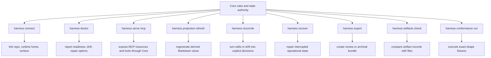

Exact command flags may vary by implementation, but the semantics below are required for the reference MVP.

## Operator diagnostics report facts, not new state

Operator output should help a person decide what to do next without teaching a second state model. A useful diagnostic line names the category, level, observed fact, affected record or path when safe, operational effect, and next action. It also says when a finding is only diagnostic.

For example, "projection `TASK` is stale" means the readable view is behind the owner records; it does not mean Task state failed. "generated-file drift detected" means a connector-managed file no longer matches the manifest; it is reported and routed to reconcile rather than overwritten. "recovery event appended" means history was extended with a compensating record; it does not mean older `task_events` were rewritten.

These examples are display guidance. They do not add command flags, state tables, event names, public `ErrorCode` values, or fixture fields.

## Conformance staging

Conformance can run incrementally, but staged execution must not change the fixture body shape or reduce final MVP requirements.

Kernel Smoke is the first runnable conformance target, drawn from a selected smoke slice across MVP-0 through early MVP-3 capabilities. It should prove project and Task state, scoped Change Unit behavior, `prepare_write` allow/block behavior, durable Write Authorization creation, `record_run` authorization consumption, artifact and evidence manifest basics, minimal projection enqueue/current behavior, writes or runs blocked when write authority is missing, close blocked when evidence or decision requirements are missing, and basic Core fixture execution. Passing Kernel Smoke proves the first runnable kernel authority path; it does not claim final MVP conformance.

Agency-Hardened MVP is the final reference conformance target. It must add Decision Packet quality, sensitive approval lifecycle separation, residual-risk visibility before acceptance and close, detached verification guards, Manual QA, stewardship and context-hygiene validators, full feedback-loop checks, codebase stewardship coverage, projection/reconcile completeness, recover/export/artifact integrity behavior, later-boundary checks, and broader fixture coverage. Suite catalog metadata may map scenarios to the earliest MVP stage, but executable fixtures still assert through Core state, events, artifacts, projections, and errors.

Guard/freeze conformance for MVP asserts honest display and behavior at cooperative/detective levels: freeze requests can hold work, make the next action stricter, or cause `prepare_write` to block or hold when existing scope is incompatible; persistent owner-record changes must be asserted only when they happen through an existing Core state-changing path, Decision Packet route, or owner-record update path. Guard displays report whether the current path is cooperative or detective and what violations can only be detected after the fact. Preventive `T4` guard fixtures are v1-or-later unless a reference surface implements and proves pre-tool blocking for the covered operation.

Browser QA Capture conformance is a v1 priority candidate, not an MVP smoke requirement. Until promoted through the [Roadmap promotion rule](../roadmap.md#promotion-rule), it is non-authoritative capture support only. Future fixtures should prove declared `T6 QA Capture` behavior only after capability profile fields, redaction and secret/PII handling, browser test environment, artifact retention, capture artifact mapping, unsupported-surface fallback behavior, and no projection-as-canonical dependency are defined. MVP fixtures still prove Manual QA records, artifact refs, QA waiver behavior, acceptance boundaries, and close blockers without requiring automated browser capture.

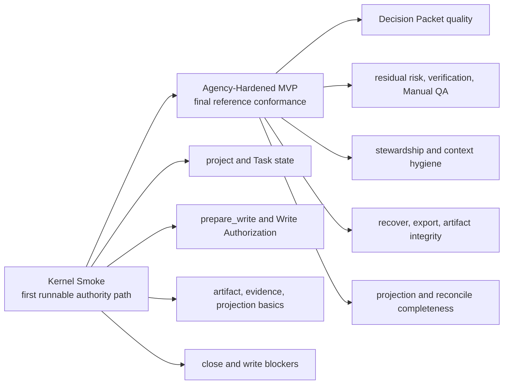

## Docs-maintenance profile

A docs-maintenance smoke profile may be run by an operator or reviewed manually to catch drift in the documentation set. It may report documentation drift, owner mismatch, English/Korean semantic parity gaps, duplicate normative text outside the owner, broken links or anchors, and TODO hygiene problems. These are documentation findings only. The profile is a read-only maintenance check over Markdown docs, not Core fixture conformance, a runtime validator, evidence, residual-risk acceptance, close readiness, or a canonical state transition. It must not append `task_events`, create artifacts, refresh projections, create QA or acceptance state, affect close readiness, claim runtime implementation readiness, or count toward runtime fixture pass/fail.

The [Authoring Guide](../maintain/authoring-guide.md#docs-maintenance-checks) owns the rule bodies, pass/warn/fail interpretation, and checklist. This document owns only the operator-maintenance expectation for reporting and entrypoint exposure.

Minimal operator wiring contract: when exposed through `harness conformance run` or another operator entrypoint, docs-maintenance is an explicitly selected docs-only profile, conventionally named `docs-maintenance`. Runtime conformance runs must not include it unless an operator selects that profile. Even when selected, report it separately from runtime Core fixture suites and do not count it toward runtime fixture pass/fail or implementation readiness. Its `PASS`, `WARN`, and `FAIL` labels are docs-maintenance report labels, not Core fixture results. It must not affect Task state, MVP runtime validator IDs, projection freshness, QA, acceptance, close readiness, or any canonical state transition.

Console output or an ephemeral report from the docs-maintenance profile is the only output defined here. Generated operational report files require a future explicit implementation contract; this documentation batch does not define stored artifacts, projection jobs, DDL, or state records for this check.

Minimum report fields:

- profile name and documentation revision
- pass, warn, or fail per category
- observed documentation finding
- affected file path and heading or anchor when available
- canonical owner doc and expected source section
- suggested fix class: update owner, replace duplicate with summary plus link, mirror translation, repair link, or add `TODO_DECISION` / `TODO_IMPLEMENT`
- runtime effect: none; no canonical state transition was performed and no runtime fixture result was recorded

Smoke categories should reference, not restate, the [Authoring Guide docs-maintenance checks](../maintain/authoring-guide.md#docs-maintenance-checks), including the required categories and pass/warn/fail meanings.

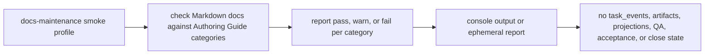

## connect

`connect` links a Product Repository, Harness Runtime Home, and one reference agent surface.

Required behavior:

- identify the repository root
- register or reuse the local project
- create or validate static project configuration
- initialize per-project state and artifact storage
- register the reference surface and capability profile
- record MCP exposure posture as local-only by default, with any documented access-control contract, in the connector manifest
- create or refresh connector-managed files through a manifest
- record connector profile freshness, capability profile version, detected version, last verification time, and conformance or operator-check basis in the connector manifest
- confirm MCP configuration can reach the harness server
- run a conformance smoke check or print the command to run it

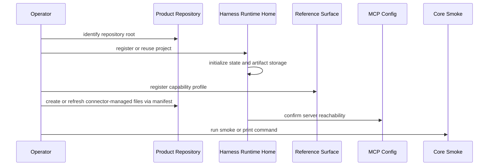

Connect must report generated/managed manifest drift instead of overwriting human edits silently. This includes generated files, managed blocks, MCP config snippets, and stale capability profile freshness. Surface-specific generated file names belong in the surface cookbook.

Illustrative connect drift output:

```text
surface     WARN  connector-managed file drift
observed    .harness/agent/generated/reference-instructions.md changed since manifest MAN-014
effect      existing file kept; connector manifest/reconcile path records drift
next        review the diff, then reconcile or reconnect with an explicit decision
authority   edited generated file is not Task state and was not silently overwritten
```

## doctor

`doctor` reports readiness, drift, and repair options.

Required categories:

| Category | Checks |
|---|---|
| project | registered project, repo root, static config validity |
| state | current state readability, JSON field parse and shape validity, owner-bound status values, state-version and idempotency consistency, locks, active Task consistency |
| MCP | server reachability, Core reachability, read resource availability, public tool availability |
| surface | capability profile, profile freshness, stale capability profile detection, generated/managed manifest drift, MCP config freshness, required MCP tool-call ability |
| artifacts | file existence, hash, size, redaction state, task/run or artifact-link relation |
| projections | queued jobs, freshness, managed hash drift, failed renders |
| reconcile | pending human edits, managed block drift, generated/managed manifest drift |
| validators/checks | required stable ValidatorResult-emitting validators, plus separately captured Core check/precondition categories |
| agency/stewardship/context | Decision Packet and decision gate readiness, Autonomy Boundary readiness, residual-risk visibility, codebase stewardship, context freshness |
| security/threat model | local MCP binding/access expectation, registered project/task/surface consistency, connector drift, sensitive-category side effects, redaction, omission, or block coverage |

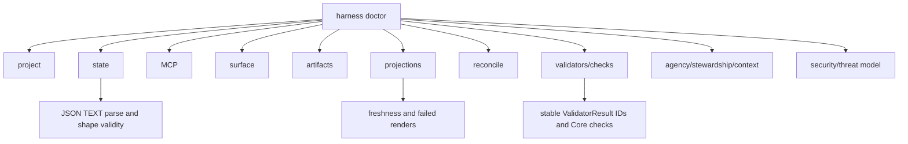

Output levels:

```text
OK
WARN
FAIL
REPAIRABLE
MANUAL
```

Levels are operator report levels, not gate values:

| Level | Meaning |
|---|---|
| `OK` | The checked surface, record, or file is usable for the covered operation. |
| `WARN` | Work may continue with a visible reduced guarantee, stale context, or non-blocking risk. |
| `FAIL` | The covered operation cannot safely rely on the checked input or capability. |
| `REPAIRABLE` | Core or a documented operator path can repair the issue from canonical state, raw artifacts, or managed output without inventing user-owned judgment. |
| `MANUAL` | A human must inspect, decide, restore, reconnect, or provide missing context before Core can rely on the result. |

Doctor must distinguish current state failures from projection stale or projection failed status.

State checks include JSON `TEXT` fields in `registry.sqlite` and `state.sqlite`, owner-bound status-like `TEXT` values, state-version bases, and idempotency replay rows. Malformed JSON and schema-incompatible JSON are state failures. Unknown owner-bound status values are state failures; conformance runners may report the same condition as invalid fixture/import seed data before Core execution. Replay rows that cannot verify their canonical request hash and stored response linkage are state/security findings, not display drift. Doctor may mark these findings `REPAIRABLE` only when Core can safely reconstruct the expected value from other canonical state or raw artifacts without inventing user-owned judgment; otherwise it reports `FAIL` or `MANUAL`.

Compact doctor examples:

| Category | Example report | Operational meaning |
|---|---|---|
| project | `project OK repo_root=/repo project_id=PRJ-0001` | Project registration and static config are readable. |
| state | `state FAIL state.sqlite tasks.current_json malformed` | Current state is invalid; this is not a projection problem. Recovery may repair only if Core can reconstruct the shape. |
| MCP | `MCP FAIL MCP_SERVER_UNAVAILABLE localhost endpoint refused` | Core cannot be reached through MCP, so no authoritative Core response or state-changing claim is available from that path. |
| surface | `surface WARN SURFACE_MCP_UNAVAILABLE required tool not callable by SURFACE-REF` | Core may be reachable, but this connected surface cannot use the required MCP path; write-capable work is held according to the guarantee profile. |
| artifacts | `artifacts FAIL ART-204 hash mismatch; evidence_gate may become stale` | The artifact record and stored file disagree; Markdown edits do not repair the evidence. |
| projections | `projections WARN TASK stale source_state_version=41 current_task_state_version=44` | Task state may still be valid; the readable `TASK` view lags and should be refreshed or reconciled. |
| projections | `projections FAIL RUN-SUMMARY failed render_error=template_input_missing` | The projection job failed; the Run record is not converted into a failed Run by this display failure. |
| reconcile | `reconcile MANUAL generated-file drift .harness/agent/generated/reference-instructions.md` | The generated file is reported and routed for review; it is not silently overwritten or treated as state. |
| validators/checks | `validators/checks WARN context_hygiene_check stale projection refs` | Stable validators and Core checks are reported separately; a mechanical projection freshness issue is not a new validator ID. |
| agency/stewardship/context | `agency/stewardship/context FAIL Decision Packet required for user-owned trade-off` | The blocker routes to the Decision Packet path; broad approval or status prose cannot satisfy the decision. |
| security/threat model | `security/threat model WARN socket permissions broader than profile` | The finding changes the reported guarantee and may block write-capable readiness, but file permissions are diagnostic rather than canonical state. |

Security-oriented doctor output is diagnostic and does not create new runtime authority. It should report when the MCP access mode does not match the local process/localhost expectation or the documented connector profile, when project/task/surface claims do not match registered state, when connector-managed files drift, when artifacts lack redaction, omission, or block metadata required by their sensitive category, and when sensitive operations including `destructive_write`, `network_write`, `external_service_write`, `secret_access`, `privacy_or_pii_change`, `data_export`, `infra_or_deployment_change`, `production_config_change`, `ci_cd_change`, `billing_or_cost_change`, or `telemetry_or_logging_change` appear outside the recorded scope/approval/Decision Packet/Write Authorization path.

Doctor should also check the runtime-home file trust posture at the documentation-contract level. It should warn or fail, according to risk and platform observability, when `state.sqlite`, `registry.sqlite`, `project.yaml`, connector config snippets, connector manifests, generated manifests, artifact directories, staging files, or generated operational files are readable or writable beyond the documented local control profile in a way that enables tampering, spoofed configuration, or secret/PII exposure. File-permission findings are diagnostic; they do not make direct file edits authoritative and they do not replace Core shape, owner, integrity, and artifact checks.

For artifacts, doctor treats missing redaction, omission, or block metadata as a security finding, not a cosmetic report issue. It must not recommend copying raw staged files into place as a repair unless Core can validate and register them through the artifact registration contract. When doctor reports `secret_omitted` or `blocked`, it reports the committed artifact ref and safe metadata only. For `blocked`, hash, size, and content type describe the registered metadata notice bytes; doctor must not claim the forbidden payload can be recovered from Harness.

Security diagnostic display examples:

| Observed condition | Category and level guidance | Report content |
|---|---|---|
| MCP is exposed beyond local process/localhost without a matching connector profile, or appears forwarded, tunneled, stale, or unknown. | `security/threat model` plus `MCP`; `WARN` for reduced read-only guarantees, `FAIL` when state-changing or close-relevant paths would rely on the exposure. | Observed bind or access mode, active project, expected surface profile, reduced guarantee, and next diagnosis or reconnect action. |
| Runtime Home permissions are unknown or weaker than the documented local control profile. | `security/threat model`; `WARN` or `MANUAL` according to platform observability. | Affected path class, observable owner/mode facts when available, and the reminder that file permissions are diagnostic rather than canonical state. |
| Runtime Home has broad write access. | `security/threat model` plus `state`, `surface`, or `artifacts` as affected; usually `FAIL` for write-capable readiness. | Tampering risk for `state.sqlite`, `registry.sqlite`, `project.yaml`, connector config snippets, connector manifests, generated manifests, artifact storage, staging files, and generated operational files; direct edits remain invalid until Core/recover/artifact checks validate them. |
| Artifact directories have broad read access. | `security/threat model` plus `artifacts`; `WARN` or `FAIL` according to sensitivity. | Confidentiality risk for logs, screenshots, tokens, PII, verification bundles, and exports; report artifact refs, redaction state, and path class without leaking raw values. |
| Registered project, Task, or surface does not match the caller's claim. | `security/threat model`, `MCP`, and `surface`; `FAIL` for the affected operation. | Claimed versus registered identifiers where safe to display, affected tool or surface, and guidance to refresh/reconnect rather than treating the claim as authority. |

## serve mcp

`serve mcp` starts or prints connection information for the local MCP server.

Required behavior:

- report whether access is local process/localhost only or covered by a documented connector capability profile
- default to local-only exposure for MVP and avoid non-loopback binding or shared/remote endpoints unless the connector profile explicitly covers them
- report the documented access-control contract when MCP is exposed to a caller, such as localhost-only binding, Unix-domain socket, per-project token, process-scoped configuration, or equivalent local control
- expose read resources without mutation
- expose public tools through Core, not shell shortcuts
- require state-changing calls to use Core conflict and idempotency behavior
- report the active project and connected surface profile
- fail clearly when the server cannot reach runtime state or artifact storage

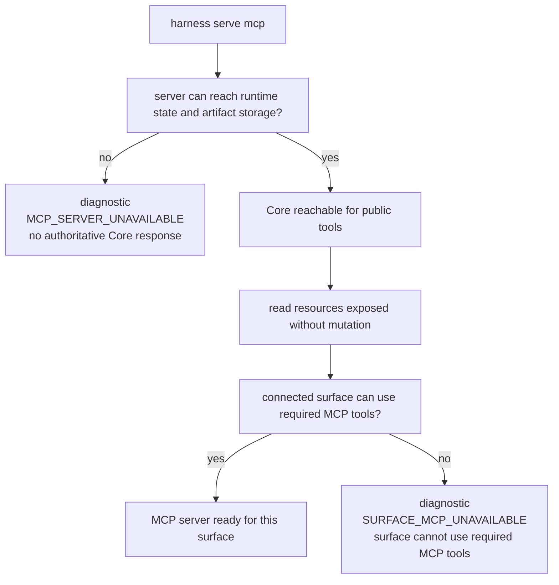

If MCP is unavailable, operations must distinguish diagnostic condition `MCP_SERVER_UNAVAILABLE` from diagnostic condition `SURFACE_MCP_UNAVAILABLE`. These labels are not additional public `ErrorCode` values. When either condition is surfaced through `ToolError`, operations must use the API-owned error selection and details shape: `MCP_UNAVAILABLE` remains the stable public availability code, while surface-side availability or capability cases may use `MCP_UNAVAILABLE` or `CAPABILITY_INSUFFICIENT` with `details.mcp_unavailable_kind` according to context. With `MCP_SERVER_UNAVAILABLE`, a tool call cannot reach Core and no authoritative Core response is possible; the next action is server diagnosis or reconnect before any state-change claim. With `SURFACE_MCP_UNAVAILABLE`, Core or an operator can observe that the connected surface lacks usable MCP, has stale MCP configuration, or cannot call required MCP tools. Cooperative surfaces must hold product/runtime/code writes by instruction; stronger profiles may enforce the hold preventively or through isolation. Operations must still report the actual guarantee level.

`serve mcp` should treat unexpected callers, callers outside the documented local process/localhost expectation or connector access contract, weak socket or config permissions, forwarded or tunneled endpoints, and stale connector configuration as threat-model issues. It reports access mode, active project, surface identity, and capability profile so a user can see when a surface is not the one Core expects. It must not present a spoofed `surface_id`, `actor_kind`, or project/task selection as proof of authority; the public tool contract still resolves and validates those claims through Core.

Remote or shared MCP exposure is an opt-in connector posture, not an MVP `serve mcp` default. Before operations may present it as usable, the connector profile must cover the access-control contract, secret/PII handling, redaction or omission behavior, guarantee display, and conformance scenario that proves the exposed path does not bypass Core envelope validation or compatibility checks.

When the access mode is unknown or weaker than the registered profile, operations should choose a diagnostic severity that matches the exposed authority. Read-only resource exposure can be a warning when the user can still understand the reduced guarantee. State-changing tools, product/runtime/code write paths, or close-relevant flows should fail, hold, or report `CAPABILITY_INSUFFICIENT`/`MCP_UNAVAILABLE` rather than silently continuing under an overstated guarantee.

`serve mcp` display should make the local boundary visible before a surface relies on it. For example, an endpoint bound to `0.0.0.0`, a detected forwarded port, a socket whose filesystem permissions are broader than the registered profile, or a stale per-project token should be shown as an off-profile access condition with the active `project_id`, `surface_id`, guarantee level, and held capabilities. These are diagnostic display facts; public tool calls still rely on Core envelope validation, idempotency, state-version checks, and the API-owned `ToolError` taxonomy.

## projection refresh

Projection refresh regenerates Product Repository Markdown from committed state records and artifact refs.

Required behavior:

- render only the latest projection version for a target
- preserve human-editable sections
- compare managed block hashes before overwrite
- create reconcile items for managed-block drift
- mark projection jobs `completed`, `failed`, `pending`, or `skipped`
- keep projection failure separate from Task result

Supported targets:

```text
one Task
all active Tasks
approval/run/evidence/eval/direct reports for a Task
design-quality projections when enabled
```

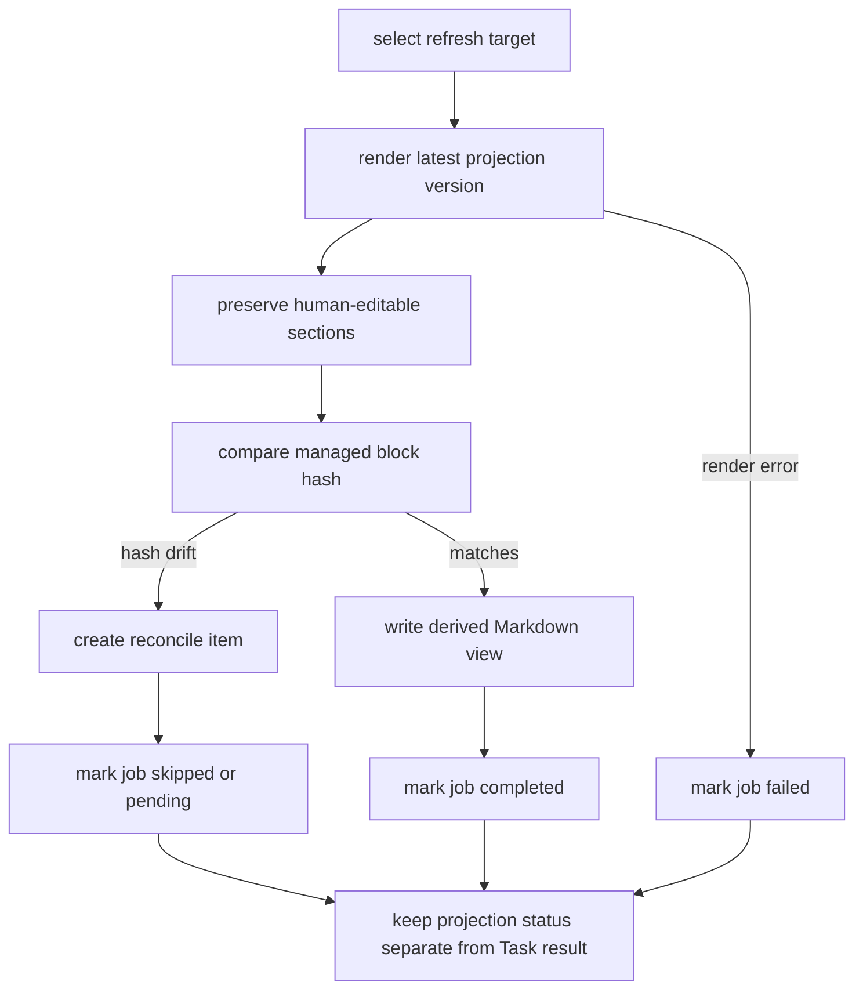

For MVP, Decision Packet visibility is rendered through `TASK` projections, status/next responses, judgment-context resources, and decision-packet resources; Journey Card visibility is rendered through status, journey, next, and significant resume surfaces. Dedicated refresh targets in the Extension / optional tier for `DEC`, `DESIGN`, `EXPORT`, and persisted `JOURNEY-CARD` are optional when enabled, not required MVP smoke targets.

Illustrative projection refresh statuses:

| Report line | Meaning |
|---|---|
| `TASK current source_state_version=44` | The rendered `TASK` view matches the committed Task state version and managed hash. |
| `TASK stale source_state_version=41 current_task_state_version=44` | State moved ahead of the rendered view. The Task result did not fail; the view needs refresh or reconcile. |
| `RUN-SUMMARY failed projection_job_id=PJOB-088` | The latest render failed. The committed Run keeps its own `runs.status`; projection failure is reported separately. |
| `APR skipped managed_block_drift reconcile_item=REC-019` | The projector avoided overwriting a changed managed block and routed the drift to reconcile. |
| optional `EXPORT` projection enabled: `EXPORT stale artifact ART-204 unavailable` | Applies only when the optional `EXPORT` projection/report surface is enabled. It does not make `EXPORT` an MVP-required refresh target, and it is not proof that the underlying Task state failed. |

## reconcile

Reconcile turns human-editable input or generated/managed drift into an explicit decision.

Targets:

- Task user notes and proposals
- managed block edits
- Domain Language proposals
- Module Map proposals
- Interface Contract proposals
- connector generated/managed manifest drift
- stale projection references that affect current work

Decision outcomes:

| Outcome | Meaning |
|---|---|
| merge | apply the proposal through Core and append state history |
| reject | leave canonical state unchanged and refresh projection if needed |
| convert_to_note | keep the content as a human note, not state |
| create_decision | turn the proposal into a pending user decision |
| defer | keep the reconcile item open |

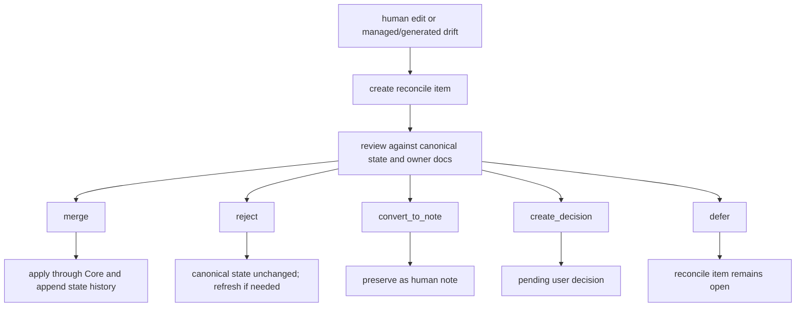

Reconcile must not treat edited Markdown as canonical state by itself.

When reconcile reports generated-file or managed-block drift, it should say which source was edited, what owner or manifest expected, and which decision path is open. A merged outcome applies through Core and appends state history. A rejected or converted-to-note outcome leaves canonical state unchanged and may refresh the projection or generated file from the owner records.

## recover

Recover repairs interrupted or inconsistent operational state without rewriting history.

Required scenarios:

| Scenario | Recovery behavior |
|---|---|
| agent crash during write | commit a recovery Run with `runs.status=interrupted` and capture diff/log artifacts when possible; captured artifacts are recovery evidence, not proof of successful completion |
| stale approval baseline | expire or re-request approval when scope is affected |
| evaluator observes drift | mark verification blocked or evidence stale |
| artifact registry mismatch | rescan files, mark missing artifacts stale, preserve hashes |
| projection job failed | retry or mark failed and create reconcile guidance |
| managed Markdown edited | create reconcile item |
| malformed or schema-incompatible storage JSON | repair only if Core can reconstruct the expected shape from canonical state or raw artifacts; otherwise fail or require manual recovery |
| idempotency replay mismatch | preserve the original committed replay row, report `STATE_CONFLICT` for the changed request, and do not merge new artifacts, events, projection jobs, or response fields into the old result |
| lock expired | append recovery event and release or reacquire according to lock policy |
| MCP unavailable | report diagnostic condition `MCP_SERVER_UNAVAILABLE` or `SURFACE_MCP_UNAVAILABLE`, keep product/runtime/code writes held, and give the next diagnosis or reconnect step |

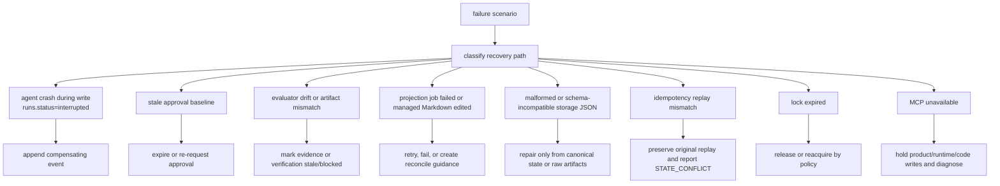

Recovery may append compensating events. It must not silently delete evidence, rewrite event history, or make projections authoritative.

Illustrative recovery report:

```text
before      task_events max event_seq=104; active run observed during write
action      recovery classified interrupted write
after       appended recovery/audit task_events after event_seq=104
after       committed recovery Run with runs.status=interrupted
artifacts   registered safe diff/log snapshots when available
not done    no earlier task_events rewritten; no evidence silently deleted
not done    no Markdown projection edited into canonical state
```

Captured recovery artifacts can explain what was observed during interruption. They do not prove the interrupted implementation completed successfully and cannot satisfy evidence, verification, QA, acceptance, or close by themselves.

## export

Export creates a review or archival bundle for a Task.

Required contents:

- export manifest with created time, task id, projection freshness, and redaction summary
- state snapshots for the Task and related records
- Decision Packets, user decisions, residual risks with accepted-risk metadata/refs, Journey Spine entries or continuity refs, and relevant Change Unit Autonomy Boundary summaries
- projection snapshots for relevant reports
- artifact references and included raw artifact files when allowed
- artifact integrity manifest
- redaction, omission, and block notes for secrets, sensitive logs, and PII

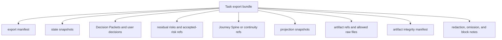

Exported projection snapshots may have hashes, but that does not make the Markdown projection the canonical evidence. Raw evidence remains the artifact files and their registered refs.

Export is a `data_export`-category side effect when policy applies. Export must preserve the artifact boundary: included raw files are limited to allowed registered artifacts, projection snapshots remain snapshots, and the bundle carries redaction, omission, or block notes for secrets, sensitive logs, screenshots, network traces, telemetry/logging content, and PII that were removed or blocked.

Export must never widen access to staged, omitted, or blocked content. `secret_omitted` artifacts are represented by refs, hashes over the safe bytes, and omission notes or handles. `blocked` artifacts are represented by committed metadata-only notices and must be listed as unavailable raw evidence; their hashes, sizes, and content types refer to the notice bytes, not the forbidden payload. Export manifests should name the affected artifact ref, the redaction, omission, or block category, and the affected evidence, QA, verification, projection, or Release Handoff display without including the secret or PII value.

Illustrative export manifest summary:

```yaml
task_id: TASK-1234
created_at: 2026-05-10T09:30:00Z
included_projection_freshness:
  TASK: current
  EVAL: stale
export_bundle_status: current
decision_packets:
  included: [DEC-010, DEC-011]
residual_risks:
  visible_refs: [RISK-004]
  accepted_refs: [RISK-002]
artifact_integrity:
  checked: 18
  passed: 17
  unavailable: [ART-204]
redaction_summary:
  redacted: 2
  secret_omitted: 1
  blocked: 1
omitted_artifacts:
  - artifact_id: ART-204
    reason: blocked
    note: metadata-only notice included; raw payload unavailable
```

This display shape is illustrative. The required behavior is that export reports freshness for included projections, artifact integrity, Decision Packets, residual risks, omitted or blocked artifacts, and redaction/omission/block effects without copying raw staged, omitted, blocked, secret, or PII values into the bundle. `export_bundle_status` is report status for the bundle being produced; it is not a canonical state record or a required `EXPORT` projection job.

### Release Handoff Export Profile

Release Handoff is an optional report/export profile for release readiness visibility. It is useful when a user wants a GStack-style ship summary without giving Harness deployment authority.

The profile summarizes:

- close readiness, active blockers, and the next close-relevant action
- evidence refs, verification refs, Manual QA refs, and residual-risk refs
- changed files and affected Change Unit scope
- projection freshness and any stale, failed, or omitted projection snapshots
- redaction, omission, or block notes for secrets, sensitive logs, PII, omitted artifacts, and blocked artifacts
- suggested PR, review, deployment, rollback, and monitoring checklist items for the user's external systems

Release Handoff may be rendered as an `EXPORT` projection/report, included in an export bundle, or returned as an ephemeral report surface. It does not create a new deployment authority record.

Boundary:

- Deployment, merge, approval, production monitoring, and VCS review authority remain external to Harness.
- Release Handoff does not close a Task, deploy, merge, approve, accept residual risk, accept the result, waive QA or verification, upgrade assurance, or satisfy gates by itself.
- Suggested checklist items are advisory. If they reveal blocking user-owned judgment, risk acceptance, Manual QA, evidence, verification, or approval needs, those needs route to the existing Decision Packet, evidence, Manual QA, Eval, residual-risk, approval, or close paths.

Diagnostic and reporting boundary: future [Local Derived Metrics](../roadmap.md#local-derived-metrics) may appear in reports or operator diagnostics, but the roadmap keeps them as later, read-only diagnostic displays until owner docs promote them. A metric readout must not mutate state, satisfy gates, authorize writes, grant approval, create evidence, enqueue or refresh projections, change projection freshness, change close readiness or implementation readiness, perform or record verification, record QA, waive QA or verification, accept residual risk, accept the result, upgrade assurance, or close a Task.

Release Handoff catalog entry:

| Scenario ID | Operator action | Required assertions |
|---|---|---|
| `EXPORT-release-handoff-does-not-close-or-deploy` | `export` or report read | Generating or returning a Release Handoff report/export may include close readiness, blockers, evidence refs, verification refs, Manual QA refs, residual-risk refs, changed files, projection freshness, redaction/omission/block notes, and advisory PR/deploy/rollback/monitoring checklist items. The report/export alone must not mutate Task lifecycle, satisfy gates, create evidence, perform or record verification, record QA, waive QA or verification, accept residual risk, accept the result, close a Task, merge, deploy, monitor production, upgrade assurance, or create deployment/merge authority. Checklist findings that reveal blocking user-owned judgment, risk acceptance, Manual QA, evidence, verification, or approval needs route to existing Decision Packet, evidence, Manual QA, Eval, residual-risk, approval, or close paths. |

## artifacts check

Artifact integrity check compares artifact records with stored files.

Required checks:

- file exists
- hash matches
- size matches
- content type is known or explicitly `other`
- redaction state is valid
- task/run or artifact-link relation is valid
- linked state owner exists in the same Task scope as the artifact link, or `record_kind=projection` resolves to a completed same-Task `projection_jobs` row
- no unregistered staging path or arbitrary `staged_uri` is accepted as a committed artifact
- owner-link relation semantics are compatible with the artifact's kind, including artifacts whose kind is `bundle`, `manifest`, or `export_component`
- for projection artifact links, `artifact_links.record_id` must equal `projection_jobs.projection_job_id`; integrity validates that job/output identity through the same Task scope as the artifact link, `target_ref`, `status=completed`, and `output_path` or a documented projection ref instead of looking for a separate `projections` table. Project-level projection jobs are not project-scoped artifact links in the current MVP.
- bundle, manifest, and export-component artifacts are validated through their artifact row and owner links; the check must not look for nonexistent `verification_bundle` or `export` state tables
- secret/PII handling is compatible with `redaction_state` and any export or capture notes
- `secret_omitted` artifacts include omission notes or handles and no raw omitted values
- `blocked` artifacts are committed metadata-only notices and do not contain the forbidden capture payload; hash, size, and content type must match the metadata-only notice bytes
- retention class is valid
- projection or evidence refs resolve

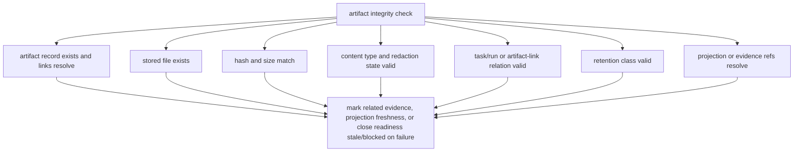

Failures should mark related evidence, projection freshness, or close readiness stale/blocked according to Core rules. Missing artifacts are not fixed by editing Markdown reports.

When an artifact check observes `secret_omitted` or `blocked`, downstream operations report the effect instead of hiding it: Evidence Manifest and QA views show omitted or blocked refs, detached verification treats unavailable raw bytes as missing input unless the Eval path accepts the omission or another documented resolution applies, projection displays show the redaction state rather than embedded content, and export/Release Handoff summaries list the omission or block without leaking the value. `secret_omitted` can support claims whose nonsecret evidence remains visible; `blocked` keeps the attempted capture auditable but leaves dependent evidence, QA, Eval, projection, export, or Release Handoff inputs blocked, insufficient, unavailable, or unresolved until a replacement, waiver, Decision Packet outcome, accepted risk, or documented fallback resolves the path.

Artifact check diagnostics should also show boundary failures for staged inputs. A `staged_uri` that resolves outside project `artifacts/tmp/`, escapes through a symlink, uses parent traversal, names an arbitrary absolute path, or points at a repo-local file outside an approved capture adapter is reported as outside the approved staging/capture boundary. The report names the affected locator and owner relation when safe, marks the artifact input invalid or unavailable through existing artifact/check results, and must not copy, hash, display, or export the forbidden target as Harness evidence.

Compact artifact check examples:

| Finding | Reported effect |
|---|---|
| `ART-101 OK hash and size match` | Artifact can be used by owner refs subject to normal gate rules. |
| `ART-204 FAIL hash mismatch` | Related evidence, projection freshness, or close readiness becomes stale/blocked according to Core rules. |
| `ART-301 WARN redaction_state=secret_omitted` | Safe ref and omission note are shown; omitted raw value is not displayed or exported. |
| `ART-302 FAIL redaction_state=blocked` | Metadata-only notice is committed; dependent evidence, QA, Eval, projection, export, or Release Handoff input stays unavailable until resolved. |
| `staged_uri MANUAL outside approved staging boundary` | The caller-supplied path is not copied, hashed, displayed, exported, or accepted as committed evidence. |

## conformance run

`conformance run` executes selected fixture suites or explicitly selected docs-only maintenance profiles. Runtime suites use the same Core entrypoints as MCP tools and operator commands. Docs-maintenance remains separate, read-only, and excluded from runtime fixture pass/fail and implementation readiness.

### Conformance Fixture Format

Conformance is fixture-based. A scenario table is not enough; each test fixture must drive an action and assert state, events, artifacts, projections, and errors.

Each fixture must include this shape:

```yaml
scenario_id: string
initial_state: object
input: object
action: string
expected_state: object
expected_events: list
expected_artifacts: list
expected_projection: object
expected_error: object | null
```

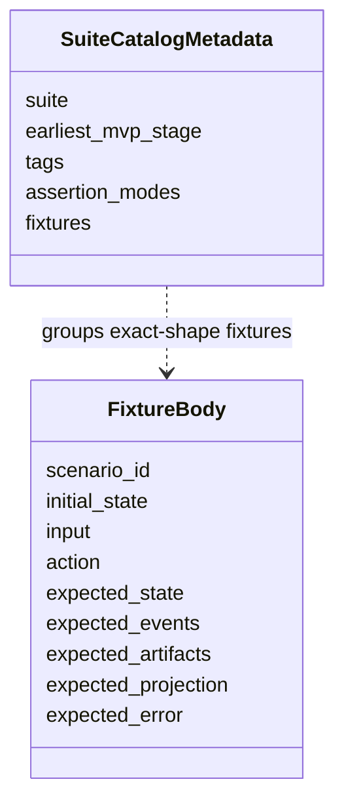

Fixture files and suite catalogs may carry metadata outside the fixture body. The fixture body itself uses only the fields above so conformance runners can compare behavior consistently.

For an MCP tool action, executable fixture `input` is the tool's public request payload as defined by the API docs. The runner must validate `input` against the request schema for `action`, including `envelope: ToolEnvelope` when that schema requires it. Examples in this document may omit `ToolEnvelope` only under this envelope-expansion convention: before validation, canonicalization, request hashing, or Core execution, the runner supplies a deterministic valid envelope from `initial_state`, suite defaults, and fixture metadata. The expanded request is what Core receives. This convention does not add fixture fields, change the fixture body shape, or create an alternate request schema.

Fixture shorthand is intentionally narrow. It is allowed for `initial_state` seeding, suite catalog metadata, and documented seed-loader expansion of compact examples such as `owner_records`, `stewardship_findings`, or feedback-loop shorthand. Executable fixture files must map that shorthand to owner records, validator runs, residual risks, or other records owned by DDL/API docs. The shorthand must not create a second API or state model. Public mutation must not be encoded as scenario-only shorthand inside `input`; fixtures must use the public request branch for `record_run`, `record_eval`, `record_manual_qa`, `record_user_decision`, or else seed owner records in `initial_state` when the scenario is about preexisting state. `close_task` fixture `input` is only `CloseTaskRequest` after any documented envelope expansion; evidence profiles, changed paths, artifact refs, acceptance-criteria support, self-check summaries, and Manual QA records must be seeded in `initial_state` or recorded by a preceding public mutation fixture. `StewardshipImpactSummary` assertions are derived display, not canonical current records, and should appear under `expected_state.derived` or projection assertions. `owner_records.feedback_loops` seeds canonical `feedback_loops` rows. Bare `FBL-*` values in example fields such as `feedback_loop_refs` map to `StateRecordRef { record_kind: feedback_loop, record_id: ... }` in executable fixtures. Fixture bodies that exercise public mutation instead of seeded state must express definition changes as `FeedbackLoopUpdate` under `record_run.payload.shaping_update.feedback_loop_updates`, execution/status changes under `evidence_updates.feedback_loop_updates`, or Manual QA execution through `record_manual_qa.feedback_loop_ref`. When an example shows only `feedback_loop_id` and `status`, the fixture runner must derive or supply the remaining required `feedback_loops` storage fields from the surrounding Task, Change Unit, selected-loop, and evidence shorthand before inserting or building the corresponding `FeedbackLoopUpdate`. Accepted residual risk in fixture shorthand is state on seeded `residual_risk` records, not a standalone accepted-risk record. When fixture examples use bare `RISK-*` values in risk-ref arrays such as `visible_refs`, `accepted_refs`, `not_visible_refs`, `unaccepted_refs`, or `residual_risk_refs`, executable fixtures must map them to `StateRecordRef { record_kind: residual_risk, record_id: ... }`. These bare IDs are fixture shorthand only, not DDL/API fields. Executable MVP fixtures must not require standalone `ARISK-*` records.

Executable fixtures that seed `write_authorizations` must produce valid stored rows. Each seeded authorization row must include `basis_state_version` explicitly, or the runner must derive it from the seeded affected-scope state version for the row's Task before inserting into `state.sqlite`. This is a storage-loader derivation rule only; it does not add fixture top-level fields or change the fixture body shape. Partial `expected_state.write_authorization` assertions may omit `basis_state_version` unless the fixture is testing idempotent replay, stale detection, expiry, or audit behavior. `basis_state_version` is the allow-decision basis, not the resulting `ToolResponseBase.state_version`.

Suite catalog metadata is not passed to Core and is not part of a fixture body. It can group exact-shape fixtures by suite, stage, and tags:

```yaml
suite: agency
earliest_mvp_stage: MVP-4
tags: [decision-gate, residual-risk, autonomy-boundary]
fixtures:
  - AGENCY-decision-packet-required-before-product-tradeoff-write
  - AGENCY-residual-risk-visible-before-acceptance
```

### Conformance Execution

`harness conformance run` executes fixtures through the same Core entrypoints used by MCP tools and operator commands. It must not assert behavior by inspecting prose output alone.

MVP execution semantics:

1. Load fixture YAML files and validate the exact fixture body shape.
2. Create an isolated runtime home and temporary Product Repository for the fixture, unless the fixture explicitly targets an existing read-only sample.
3. Seed `registry.sqlite`, `project.yaml`, `state.sqlite`, artifact files, projection files, and connector manifests from `initial_state`.
4. Execute `action` through Core. MCP tool actions use the public request schema; after any documented `ToolEnvelope` expansion, fixture `input` must be the same request payload a surface would send to that MCP tool. Operator actions such as `projection_refresh`, `doctor_surface`, `recover`, and `artifacts_check` use the operator semantics in this document.
5. Capture resulting state summaries, appended `task_events`, validator results, artifact registry/file integrity, projection job status, reconcile items, and returned error code.
6. Compare the captured results with `expected_state`, `expected_events`, `expected_artifacts`, `expected_projection`, and `expected_error`.
7. Report fixture id, pass/fail, observed state summary, observed events, artifact integrity result, projection freshness, and error comparison.

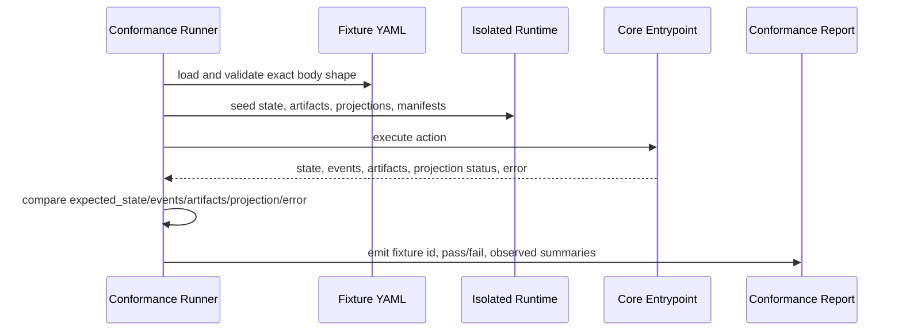

When a fixture action includes `expected_state_version`, the runner compares it according to the Core-resolved primary Task, not only `ToolEnvelope.task_id`. Task-scoped actions compare against the seeded or Core-resolved primary Task State Version; project-scoped actions with no resolved primary Task compare against the Project State Version. Captured response and `task_events` `state_version` values are compared as resulting affected-scope versions. Read-only fixtures may assert the unchanged version for the primary read scope. This clarifies comparison semantics without changing fixture body shape.

A stale `expected_state_version` fixture is a stale-authority test, not only a concurrent-write test. Exact idempotent replay is the exception: when a committed replay row exists and the canonical request hash matches, the fixture should assert the original committed response is returned and no current state-version freshness check is re-run. When no replay row exists and a state-changing action conflicts before commit, the fixture should assert that no current records changed, no `task_events` were appended, no artifacts were registered, no projection jobs were enqueued, and no `tool_invocations` replay row was created for the conflicting request unless an owner document explicitly defines a different recovery action. When the same key is reused with a changed canonical request hash, the fixture should assert `STATE_CONFLICT`, preserved original replay row, and no merged artifacts, events, projection jobs, response fields, or owner relations.

Fixture execution should be deterministic. Network access, wall-clock-sensitive expiry, and external tool output must be stubbed or represented as seeded fixture inputs unless a suite explicitly declares itself an integration smoke.

Conformance runners must seed and inspect JSON `TEXT` fields through the same Core storage loaders used by MCP tools and operator commands. A fixture with malformed JSON or schema-incompatible JSON in `initial_state` must surface invalid state, or a repairable state issue when the fixture action is a recovery path and safe reconstruction is possible. The runner must not skip shape validation by treating JSON fields as opaque strings, and this expectation does not change the fixture body shape.

Conformance runners must also seed and inspect status-like `TEXT` fields through the owner-bound hardening map in [Storage And DDL](storage-and-ddl.md#canonical-enum-hardening). Fixture seed loaders must validate both compact shorthand and expanded rows for fields with promoted owner values, including `project_surfaces.guarantee_level` when seeding registry/project surface state, `runs.kind`, `runs.status`, `write_authorizations.status`, `write_authorizations.guarantee_level`, `approvals.status`, `evidence_manifests.status`, `residual_risks.visibility_status`, `feedback_loops.loop_kind`, `feedback_loops.status`, `tdd_traces.status`, `validator_runs.status`, `validator_runs.guarantee_level`, `projection_jobs.projection_kind`, `projection_jobs.status`, `connector_manifests.status`, `baselines.status`, `change_units.status`, `tool_invocations.status`, `decision_requests.status`, `residual_risks.status`, `task_spine_entries.status`, `change_unit_dependencies.status`, `shared_designs.status`, `reconcile_items.status`, `domain_terms.status`, `module_map_items.status`, and `interface_contracts.review_status`. For `decision_requests.status`, validation applies only when the optional `decision_requests` table is retained or a fixture seeds `decision_requests` rows; minimal MVP implementations may still omit the table. These promoted values are still owner-bound storage values, not scenario prose labels; for example, `runs.status: completed`, `runs.status: interrupted`, and `runs.status: violation` are valid only with the Storage And DDL compatibility meanings for committed Runs, while `shared_designs.status: active` is a current design basis and not final acceptance or approval. Executable fixtures must not seed unknown status values unless the scenario explicitly tests recovery from invalid state; expected-state status assertions compare captured owner values, not prose labels.

### Fixture Assertion Semantics

Fixture assertion modes are runner defaults or suite catalog metadata. They are not Core input, are not passed to MCP tools, and must not add fields to the fixture body. The fixture body remains exactly `scenario_id`, `initial_state`, `input`, `action`, `expected_state`, `expected_events`, `expected_artifacts`, `expected_projection`, and `expected_error`.

Default comparison modes:

| Fixture field | Default assertion mode |
|---|---|
| `expected_state` | `partial_deep`; listed fields must match recursively and unlisted fields are not asserted. Suite metadata may set `expected_state: exact`. |
| `expected_events` | `contains_ordered` over the stable-catalog projection of captured `task_events`; listed stable events must appear in ascending `task_events.event_seq` order, with unrelated stable events allowed before, between, or after them. Suite metadata may set `expected_events: exact`. |
| `expected_artifacts` | `contains_by_identity`; each listed artifact must match a registered artifact with the same `artifact_id` and `kind`, then any other listed artifact fields are matched recursively. |
| `expected_projection` | `partial_by_kind`; each listed projection kind must satisfy the listed status assertion or partial object assertion for that kind. |
| `expected_error` | `expected_error: null` asserts that the action returned no error. When `expected_error` is an object, `expected_error.code` is required and matched exactly against the primary API `ErrorCode` in `ToolError.code`, meaning `ToolResponseBase.errors[0].code` when the response has errors, selected by API-owned [Primary Error Code Precedence](mcp-api-and-schemas.md#primary-error-code-precedence). It must not match an arbitrary secondary error, validator finding code, policy finding code, or local diagnostic label. `expected_error.details` is optional; when omitted, no details fields are asserted. When `details` is present, it is matched with `partial_deep` unless suite metadata sets `expected_error.details: exact`. |

`expected_events` comparisons are over the [Kernel Stable Event Catalog](kernel.md#stable-event-catalog) projection of captured `task_events`. API tool detail/audit event lists do not expand this set. Non-catalog detail or local-audit events captured in `task_events` must not make a normal MVP fixture fail. When suite metadata sets `expected_events: exact`, exactness applies to the stable-event projection of the captured stream unless a future non-MVP/local suite explicitly opts into implementation-specific detail-event assertions. Validator IDs, Core check names, projection status shorthands, fixture seed shorthand, and scenario catalog IDs are not event names. Prose examples may mention non-catalog event names as illustrative or future extension ideas, but executable MVP fixtures must not require them until the kernel catalog promotes them.

Conformance runners order captured `task_events` by `event_seq`. `state_version`, `created_at`, and `event_id` are not tie-breakers for `expected_events` ordering.

Fixture authors should use `VALIDATOR_FAILED` as `expected_error.code` only when API precedence selects the generic validator fallback; a more specific typed blocker such as `EVIDENCE_INSUFFICIENT`, `QA_REQUIRED`, `PROJECTION_STALE`, or `ARTIFACT_MISSING` remains primary when it applies.

`CloseTaskResponse.blockers[].code` is also an API `ErrorCode` value. Policy-specific or validator-specific finding codes belong under `expected_state.validators`, validator finding assertions, or equivalent expected validator output, not in `expected_error.code` or close blocker `code`.

Validator assertions nested under `expected_state.validators` are keyed by validator ID. Each listed validator ID must exist in the captured validator results and match the listed fields partially; unlisted validator IDs and unlisted validator fields are not asserted.

When fixtures assert design-quality severity, all relevant validator findings should remain visible under `expected_state.validators`, while fixtures assert the merged gate, write-blocker, close-blocker, waiver, or Decision Packet outcome produced by the policy-owned [Severity Composition Rule](design-quality-policies.md#severity-composition-rule). Fixtures must not add policy schemas or suppress lower-severity findings merely because a stronger merged blocker is also present.

Core check and precondition assertions nested under `expected_state.checks` are keyed by check/precondition name. These entries are compared against captured Core check output, blocked reasons, response summaries, or equivalent runner-observed check status. They are not validator IDs and must not be nested under `expected_state.validators` unless the MCP API or Storage And DDL explicitly promotes that ID to a stable ValidatorResult.

`expected_state.checks.projection_freshness` asserts the Core mechanical projection freshness check. `expected_state.validators.context_hygiene_check` asserts the stable ValidatorResult for higher-level context hygiene; that validator may consider projection freshness, but it is not the fixture assertion location for the mechanical check itself.

Fixtures that cover `secret_omitted` or `blocked` artifacts should assert the committed artifact `redaction_state` under `expected_artifacts` and the downstream state or display effect under the owning assertion location: evidence or QA state under `expected_state`, verification outcome under Eval-related state or error assertions, projection freshness/display availability under `expected_projection` or `expected_state.checks.projection_freshness`, and export or Release Handoff behavior through the existing fixture assertions captured from the operator action. Fixtures must not assert the omitted secret or PII value.

Artifact redaction scenario guidance:

| Scenario ID | Action | Required assertions |
|---|---|---|
| `ARTIFACT-secret-omitted-supports-visible-evidence-only` | `record_run`, `record_manual_qa`, or `record_eval` | `expected_artifacts` includes the committed artifact with `redaction_state: secret_omitted`; evidence, QA, or Eval assertions credit only the visible nonsecret evidence; any claim requiring the omitted value remains unsupported, partial, blocked, or insufficient; projections and reports show omission notes or handles without asserting the omitted secret or PII value. |
| `ARTIFACT-blocked-notice-is-committed-but-unavailable-input` | `record_run`, `record_manual_qa`, `launch_verify`, or `artifacts_check` | `expected_artifacts` includes the committed artifact with `redaction_state: blocked`, and optional hash/size/content-type assertions match the metadata-only notice bytes; downstream evidence, QA, Eval, projection, export, or Release Handoff assertions show blocked, insufficient, unavailable input, or unresolved impact unless a replacement, waiver, Decision Packet outcome, accepted risk, or documented fallback is part of the scenario. |
| `ARTIFACT-staged-uri-untrusted-task-scope-required` | `record_run`, `record_manual_qa`, `record_eval`, or `artifacts_check` | An arbitrary caller-supplied `staged_uri`, absolute path, traversal path, symlink escape, repo-local path, or cross-Task artifact relation is not accepted as a committed artifact; no evidence, QA, Eval, projection, export, or Release Handoff claim is credited from it; committed artifact links resolve only to trusted staging/capture bytes and a same-Task owner relation, or to a completed same-Task projection job when `record_kind=projection`. |
| `EXPORT-redaction-notes-do-not-leak-omitted-or-blocked-values` | `export` or Release Handoff report read | Export or Release Handoff assertions list artifact refs, redaction states, omission/block notes, and affected displays; raw omitted values and forbidden blocked payload bytes are not present in exported snapshots, raw-file copies, report text, or fixture assertions. |
| `EXPORT-secret-pii-omission-reported-not-silent` | `export` or Release Handoff report read | Secret or PII removal is visible as safe omission, redaction, or block metadata tied to affected artifact refs and evidence, QA, verification, projection, or Release Handoff displays; the export omits the sensitive values, does not widen access to staged or blocked content, and does not hide the fact that material was omitted or blocked. |

Absence of a nested field inside any `expected_*` value means "not asserted", not "expected null". Empty default-mode collections such as `expected_artifacts: []` or `expected_projection: {}` are valid and assert no required entries. `expected_events: []` asserts that no stable catalog events are required; it does not assert that no `task_events` rows were appended, because committed transitions may append non-stable detail or local-audit events. A suite that needs to assert no extra stable entries must use compatible exact-mode metadata outside the fixture body.

Allowed `expected_projection` status assertions:

| Assertion | Meaning |
|---|---|
| `enqueued` | A refresh job or equivalent projection outbox entry for the projection kind is pending after the action. |
| `current` | The projection kind is current for the committed state version and managed hash. |
| `stale` | The projection kind is stale because state, evidence, or managed content moved ahead of the rendered projection. |
| `failed` | The latest applicable projection refresh for the kind failed. |
| `skipped` | The latest applicable projection job for the kind was skipped, for example because it was superseded or blocked by managed-block drift. |
| `stale_or_enqueued` | Either `stale` or `enqueued` is acceptable. Use this when the scenario proves projection invalidation or enqueueing and the runner may observe either side of the refresh boundary. |
| `stale_or_failed` | Either `stale` or `failed` is acceptable. Use this when a render failure may be surfaced as failed freshness or as stale freshness with a failed job. |

Projection shorthand such as `TASK: stale_or_enqueued` is a scalar status assertion for the `TASK` projection kind. Object form may assert additional captured projection fields while still using `partial_by_kind`, for example `TASK: {status: current}`. These assertion operators are fixture-comparison semantics, not new projection DDL or API enum values unless the owning schema documents define them.

Suite catalogs may override assertion modes without changing fixtures:

```yaml
suite: core
assertion_modes:
  expected_state: exact
  expected_events: exact
  expected_error.details: exact
fixtures:
  - CORE-active-status-no-task
```

Conformance must prove behavior through captured Core state, `task_events`, validator results, artifact registry/file integrity, projection job or freshness state, and returned error codes. Matching rendered Markdown, Journey Card prose, status prose, or agent prose alone cannot pass a fixture.

Fixture runners must use the same canonicalization rules as the reference implementation for `request_hash`, baseline `tree_hash`, and projection `managed_hash`. The detailed algorithms remain owned by the MCP API, Storage And DDL, and Document Projection docs; conformance fixtures assert deterministic behavior without redefining those source-of-truth boundaries.

### Agency, Stewardship, And Context Suites

Agency, stewardship, and context hygiene are MVP conformance suites. They test state behavior through Core entrypoints such as `prepare_write`, `request_user_decision`, `record_user_decision`, `record_manual_qa`, `close_task`, `next`, and operator actions that call Core. They must not pass by matching Journey Card, Decision Packet, residual-risk, or status prose.

Required suite responsibilities:

| Suite | Required behavior |
|---|---|
| agency | Blocking user-owned judgment requires a compatible Decision Packet before affected write or close; decision request routing metadata is optional compatibility data and alone must not satisfy `decision_gate`; writes blocked on user-owned product or material technical trade-offs are held; sensitive approval lifecycle keeps approval, Decision Packet, and Write Authorization distinct; AFK Autonomy Boundary stop conditions block public commitments; known close-relevant residual risk must be visible before any successful close; if no known close-relevant risk exists, `ResidualRiskSummary.status=none` satisfies residual-risk visibility; risk-accepted close additionally requires accepted Residual Risk refs whose risks were visible before acceptance; approval, QA, acceptance, and residual-risk acceptance remain distinct. |
| stewardship | Design-quality and codebase-stewardship validators affect `design_gate`, `decision_gate`, `qa_gate`, close blockers, and waiver eligibility through canonical owner records, refs, and policy-owned severity composition; public interface, module, domain, feedback-loop, TDD, Manual QA, and waiver checks do not duplicate schemas or DDL; Review Stage displays separate Spec Compliance Review from Code Quality / Stewardship Review without creating new authority. |
| context-hygiene | Current Task state, Journey refs, evidence refs, and freshness state are authoritative; stale PRDs, stale projections, closed issues, old design docs, and long logs are pull-only context until reconciled; stale context cannot authorize writes, close, acceptance, or current-state replacement. |

Status/next recommendations, including Role Lens recommendations, are fixture-observable only as read responses. Fixtures may assert `recommended_playbooks` when relevant, but must also prove no state event, gate satisfaction, projection enqueue, artifact, evidence, verification, QA, acceptance, residual-risk acceptance, close, or assurance upgrade resulted from the recommendation itself. If a recommendation or role lens implies user-owned judgment, the expected behavior is a Decision Packet ref or Decision Packet request path, not a satisfied `decision_gate`. If it identifies validator, evidence, Manual QA, residual-risk, or release-handoff work, the expected behavior is a routed recommendation or candidate, not a committed owner record unless a later public mutation fixture records it through Core.

`browser-qa-candidate` recommendations are subject to the same read-only rule. A recommendation may name Browser QA Capture as useful for a `T6 QA Capture` surface, but the recommendation alone must not mutate state, enqueue projections, create artifacts, create or satisfy evidence, perform or record verification, record QA, waive QA or verification, accept residual risk, accept the result, close a Task, or upgrade assurance. Actual artifacts, Manual QA records, QA gate updates, Eval results, or close effects require a later public mutation through Core.

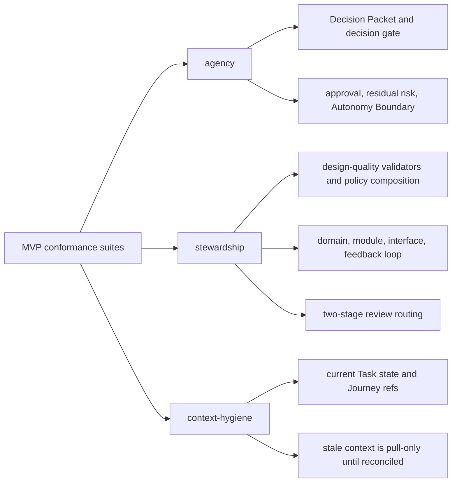

#### Intake And Decision Catalog Entries

These are catalog entries, not fixture bodies. They cover ordinary user-language behavior and Decision Packet quality while preserving the exact fixture shape and the rule that executable fixtures prove behavior through Core state, events, artifacts, projections, and errors.

| Scenario ID | Core action | Required assertions |
|---|---|---|
| `INTAKE-natural-language-starts-without-startup-phrase` | `intake`, `status`, or `next` | A user request whose shape should be tracked by Harness is recognized even when the user does not say "Harness," `Task`, `Change Unit`, `Decision Packet`, or any required startup phrase. An `intake` action may start or resume the intake path. A `next` read may recommend or route to the next safe intake action. A `status` read may report current or no-active state and show that intake is needed, but must not claim intake started or mutate state. The fixture asserts the current or proposed Task mode, scope, out-of-bounds area, next safe action, blockers, and guarantee display, and also asserts that the natural-language request alone does not authorize product writes or create a Write Authorization. |
| `INTAKE-user-plain-language-maps-to-harness-records` | `intake`, `prepare_write`, or `request_user_decision` | The user may use ordinary phrases such as "change the checkout flow" or "which option should we pick?" without naming `Change Unit` or `Decision Packet`; Core routes the request to the compatible Task, proposed or active Change Unit, Decision Packet ref or candidate, and current blockers. The fixture must not require exact Harness vocabulary in user text and must still assert the owner records, refs, gates, projections, and errors that result. |
| `INTAKE-codebase-answerable-before-user-question` | `intake` or `next` | Before asking the user, facts already present in seeded current context, explicit repo/codebase refs, Harness state refs, or connector/session-provided facts are used when they are current and safe to rely on. The fixture asserts those provided refs or facts are used instead of asking the user to repeat them; it does not require Core to perform unbounded repository, docs, or codebase search. Any remaining unresolved user-owned product or material technical judgment routes to a focused question or Decision Packet. |
| `AGENCY-decision-packet-quality-complete-context` | `request_user_decision`, `prepare_write`, or `next` | A Decision Packet or `DecisionPacketCandidate` for user-owned product or material technical judgment includes realistic options, trade-offs through benefits/costs/risks, recommendation, uncertainty, deferral consequence, minimum current context, source/evidence refs, affected gates or acceptance criteria, and residual-risk impact when relevant. A vague "continue?" prompt or broad approval request does not satisfy `decision_gate`. A packet may make one strong recommendation when it still shows rejected alternatives, no-op/defer/reduce-scope paths, or why other paths are unsafe or out of scope, so the user can make a real judgment. |
| `AGENCY-approval-does-not-substitute-for-judgment-or-close` | `prepare_write`, `record_user_decision`, or `close_task` | A granted sensitive-action Approval remains separate from product judgment, Decision Packet resolution, Write Authorization, evidence, verification, Manual QA, final acceptance, and residual-risk acceptance. Fixtures seed approval as granted and assert that missing compatible owner records still block affected writes or close, and that approval alone does not create Write Authorization, satisfy acceptance, produce detached verification, waive QA, accept risk, or close a Task. |

### Hardened MVP Fixture Coverage

The hardened evidence, verification, and connector rules should be covered by fixtures with the required shape. Suite catalogs may map scenario IDs to the earliest MVP stage where the behavior must be implemented, but stage metadata is not part of the fixture body.

```yaml
scenario_id: CORE-evidence-direct-docs-only-sufficient
initial_state:
  active_task:
    task_id: TASK-DOCS-001
    mode: direct
    lifecycle_phase: executing
    acceptance_criteria: ["AC-01 typo corrected"]
    gates:
      scope_gate: passed
      evidence_gate: sufficient
      verification_gate: not_required
  runs:
    - run_id: RUN-DOCS-001
      kind: direct
      status: completed
      summary: "Rendered Markdown heading and checked typo fix."
      observed_changes:
        changed_paths: ["docs/help.md"]
      artifact_refs: [ART-DIFF-001]
  evidence_manifests:
    - evidence_manifest_id: EM-DOCS-001
      status: sufficient
      criteria:
        AC-01:
          status: supported
          refs: [ART-DIFF-001]
      changed_files: ["docs/help.md"]
      supporting_refs: [RUN-DOCS-001, ART-DIFF-001]
  artifacts:
    - artifact_id: ART-DIFF-001
      kind: diff
input:
  task_id: TASK-DOCS-001
  intent: complete
  requested_close_reason: completed_self_checked
  user_note: "Self-check recorded in RUN-DOCS-001."
  superseded_by_task_id: null
action: close_task
expected_state:
  lifecycle_phase: completed
  result: passed
  close_reason: completed_self_checked
  assurance_level: self_checked
  gates:
    evidence_gate: sufficient
  residual_risk_summary:
    status: none
    close_relevant_count: 0
expected_events:
  - close_requested
  - task_closed
expected_artifacts:
  - artifact_id: ART-DIFF-001
    kind: diff
expected_projection:
  TASK: enqueued
expected_error: null
```

```yaml
scenario_id: CORE-evidence-work-ac-missing-blocks-close
initial_state:
  active_task:
    task_id: TASK-WORK-AC-001
    mode: work
    lifecycle_phase: verifying
    acceptance_criteria: ["AC-01 saves profile", "AC-02 shows validation error"]
    gates:
      scope_gate: passed
      approval_gate: not_required
      evidence_gate: partial
      verification_gate: pending
  evidence_manifests:
    - evidence_manifest_id: EM-WORK-AC-001
      status: partial
      criteria:
        AC-01:
          status: supported
          refs: [ART-TEST-001]
        AC-02:
          status: unsupported
          refs: []
      supporting_refs: [ART-TEST-001]
  artifacts:
    - artifact_id: ART-TEST-001
      kind: log
input:
  task_id: TASK-WORK-AC-001
  intent: complete
  requested_close_reason: completed_verified
  user_note: null
  superseded_by_task_id: null
action: close_task
expected_state:
  lifecycle_phase: blocked
  gates:
    evidence_gate: partial
expected_events:
  - close_requested
  - close_blocked
expected_artifacts:
  - artifact_id: ART-TEST-001
    kind: log
expected_projection:
  TASK: enqueued
expected_error:
  code: EVIDENCE_INSUFFICIENT
```

```yaml
scenario_id: CORE-evidence-ui-manual-qa-pending-blocks-close
initial_state:
  active_task:
    task_id: TASK-UI-QA-001
    mode: work
    lifecycle_phase: qa
    acceptance_criteria: ["AC-01 button copy updated"]
    gates:
      scope_gate: passed
      evidence_gate: sufficient
      verification_gate: passed
      qa_gate: pending
  manual_qa_records: []
input:
  task_id: TASK-UI-QA-001
  intent: complete
  requested_close_reason: completed_verified
  user_note: null
  superseded_by_task_id: null
action: close_task
expected_state:
  lifecycle_phase: qa
  gates:
    qa_gate: pending
expected_events:
  - close_requested
  - close_blocked
expected_artifacts: []
expected_projection:
  TASK: enqueued
expected_error:
  code: QA_REQUIRED
```

```yaml
scenario_id: CORE-verify-manual-bundle-detached-passed
initial_state:
  active_task:
    task_id: TASK-VERIFY-BUNDLE-001
    mode: work
    lifecycle_phase: verifying
    active_change_unit_id: CU-VERIFY-BUNDLE-001
    gates:
      evidence_gate: sufficient
      verification_gate: pending
  active_change_unit:
    change_unit_id: CU-VERIFY-BUNDLE-001
    allowed_paths: ["src/profile/editor.ts"]
  runs:
    - run_id: RUN-VERIFY-BUNDLE-TARGET-001
      kind: implementation
      status: completed
      artifact_refs: [ART-DIFF-001, ART-TEST-001]
  evidence_manifests:
    - evidence_manifest_id: EM-VERIFY-BUNDLE-001
      status: sufficient
      supporting_refs: [RUN-VERIFY-BUNDLE-TARGET-001, ART-DIFF-001, ART-TEST-001]
  artifacts:
    - artifact_id: ART-BUNDLE-001
      kind: bundle
    - artifact_id: ART-DIFF-001
      kind: diff
    - artifact_id: ART-TEST-001
      kind: log
input:
  task_id: TASK-VERIFY-BUNDLE-001
  change_unit_id: CU-VERIFY-BUNDLE-001
  evaluator_run_id: null
  target_run_id: RUN-VERIFY-BUNDLE-TARGET-001
  verdict: passed
  checks_performed:
    - check_id: manual-bundle-review
      result: passed
      summary: "Reviewed the task summary, acceptance criteria, Change Unit scope, approval scope, diff, test log, evidence manifest, and known risks from the manual bundle."
  evidence_reviewed:
    state_refs:
      - record_kind: task
        record_id: TASK-VERIFY-BUNDLE-001
        projection_path: null
      - record_kind: change_unit
        record_id: CU-VERIFY-BUNDLE-001
        projection_path: null
      - record_kind: run
        record_id: RUN-VERIFY-BUNDLE-TARGET-001
        projection_path: null
      - record_kind: evidence_manifest
        record_id: EM-VERIFY-BUNDLE-001
        projection_path: null
    artifact_refs:
      - artifact_id: ART-BUNDLE-001
        kind: bundle
        uri: harness-artifact://PROJECT-VERIFY/ART-BUNDLE-001
        sha256: bbbbbbbbbbbbbbbbbbbbbbbbbbbbbbbbbbbbbbbbbbbbbbbbbbbbbbbbbbbbbbbb
        size_bytes: 4096
        content_type: application/json
        redaction_state: none
        task_id: TASK-VERIFY-BUNDLE-001
        run_id: RUN-VERIFY-BUNDLE-TARGET-001
        created_at: "2026-05-10T00:00:00Z"
        produced_by: harness
        retention_class: task
      - artifact_id: ART-DIFF-001
        kind: diff
        uri: harness-artifact://PROJECT-VERIFY/ART-DIFF-001
        sha256: dddddddddddddddddddddddddddddddddddddddddddddddddddddddddddddddd
        size_bytes: 2048
        content_type: text/x-diff
        redaction_state: none
        task_id: TASK-VERIFY-BUNDLE-001
        run_id: RUN-VERIFY-BUNDLE-TARGET-001
        created_at: "2026-05-10T00:00:00Z"
        produced_by: lead_agent
        retention_class: task
      - artifact_id: ART-TEST-001
        kind: log
        uri: harness-artifact://PROJECT-VERIFY/ART-TEST-001
        sha256: 7777777777777777777777777777777777777777777777777777777777777777
        size_bytes: 3072
        content_type: text/plain
        redaction_state: none
        task_id: TASK-VERIFY-BUNDLE-001
        run_id: RUN-VERIFY-BUNDLE-TARGET-001
        created_at: "2026-05-10T00:00:00Z"
        produced_by: lead_agent
        retention_class: task
  independence:
    context: manual_bundle
    write_capable: false
    baseline_reverified: true
    evaluator_surface_id: SURFACE-EVAL-MANUAL-BUNDLE-001
    parent_run_id: null
  blockers: []
  artifact_inputs:
    - input_id: ART-IN-BUNDLE-001
      source_kind: existing_artifact
      existing_artifact_ref:
        artifact_id: ART-BUNDLE-001
        kind: bundle
        uri: harness-artifact://PROJECT-VERIFY/ART-BUNDLE-001
        sha256: bbbbbbbbbbbbbbbbbbbbbbbbbbbbbbbbbbbbbbbbbbbbbbbbbbbbbbbbbbbbbbbb
        size_bytes: 4096
        content_type: application/json
        redaction_state: none
        task_id: TASK-VERIFY-BUNDLE-001
        run_id: RUN-VERIFY-BUNDLE-TARGET-001
        created_at: "2026-05-10T00:00:00Z"
        produced_by: harness
        retention_class: task
      staged: null
      kind: bundle
      redaction_state: none
      produced_by: harness
      retention_class: task
      relation:
        task_id: TASK-VERIFY-BUNDLE-001
        run_id: null
        record_kind: eval
        record_id_hint: EVAL-VERIFY-BUNDLE-001
      description: "Manual verification bundle reviewed by the evaluator."
action: record_eval
expected_state:
  lifecycle_phase: verifying
  assurance_level: detached_verified
  gates:
    verification_gate: passed
expected_events:
  - eval_recorded
  - verification_passed
expected_artifacts:
  - artifact_id: ART-BUNDLE-001
    kind: bundle
expected_projection:
  EVAL: enqueued
  TASK: enqueued
expected_error: null
```

```yaml
scenario_id: CORE-verify-subagent-context-not-detached-by-default
initial_state:
  active_task:
    task_id: TASK-VERIFY-SUBAGENT-001
    mode: work
    lifecycle_phase: verifying
    gates:
      verification_gate: pending
  evidence_manifests:
    - evidence_manifest_id: EM-VERIFY-SUBAGENT-001
      status: sufficient
      supporting_refs: [RUN-VERIFY-SUBAGENT-TARGET-001]
  runs:
    - run_id: RUN-VERIFY-SUBAGENT-TARGET-001
      kind: implementation
      status: completed
input:
  task_id: TASK-VERIFY-SUBAGENT-001
  change_unit_id: null
  evaluator_run_id: null
  target_run_id: RUN-VERIFY-SUBAGENT-TARGET-001
  verdict: passed
  checks_performed:
    - check_id: inherited-subagent-context
      result: passed
      summary: "Evidence checks passed, but the evaluator inherited subagent context from the parent run and did not satisfy a detached verification profile."
  evidence_reviewed:
    state_refs:
      - record_kind: run
        record_id: RUN-VERIFY-SUBAGENT-TARGET-001
        projection_path: null
      - record_kind: evidence_manifest
        record_id: EM-VERIFY-SUBAGENT-001
        projection_path: null
    artifact_refs: []
  independence:
    context: subagent_context
    write_capable: false
    baseline_reverified: false
    evaluator_surface_id: SURFACE-EVAL-SUBAGENT-001
    parent_run_id: RUN-VERIFY-SUBAGENT-TARGET-001
  blockers: []
  artifact_inputs: []
action: record_eval
expected_state:
  lifecycle_phase: verifying
  assurance_level: none
  gates:
    verification_gate: pending
expected_events:
  - eval_recorded
  - verify_not_detached_detected
expected_artifacts: []
expected_projection:
  EVAL: enqueued
  TASK: enqueued
expected_error:
  code: VERIFY_NOT_DETACHED
```

```yaml
scenario_id: CORE-verify-waiver-risk-accepted-visible-succeeds
initial_state:
  active_task:
    task_id: TASK-VERIFY-RISK-001
    mode: work
    lifecycle_phase: waiting_user
    assurance_level: self_checked
    gates:
      scope_gate: passed
      decision_gate: resolved
      evidence_gate: sufficient
      verification_gate: waived_by_user
      qa_gate: not_required
      acceptance_gate: accepted
  residual_risks:
    - risk_id: RISK-VERIFY-001
      close_relevant: true
      visibility: visible
      accepted: true
  decision_packets:
    - decision_packet_id: DEC-VERIFY-WAIVER-001
      decision_kind: verification_waiver
      status: resolved
    - decision_packet_id: DEC-RISK-ACCEPT-001
      decision_kind: residual_risk_acceptance
      status: resolved
      residual_risk_refs: [RISK-VERIFY-001]
input:
  task_id: TASK-VERIFY-RISK-001
  intent: complete
  requested_close_reason: completed_with_risk_accepted
  user_note: "User accepts remaining verification risk for urgent local-only fix."
  superseded_by_task_id: null
action: close_task
expected_state:
  lifecycle_phase: completed
  result: passed
  close_reason: completed_with_risk_accepted
  assurance_level: self_checked
  residual_risk_summary:
    status: accepted
    accepted_refs: [RISK-VERIFY-001]
expected_events:
  - close_requested
  - risk_accepted_close_recorded
  - task_closed
expected_artifacts: []
expected_projection:
  TASK: enqueued
expected_error: null
```

```yaml
scenario_id: CORE-verify-waiver-risk-accepted-hidden-blocks-close
initial_state:
  active_task:
    task_id: TASK-VERIFY-RISK-HIDDEN-001
    mode: work
    lifecycle_phase: waiting_user
    assurance_level: self_checked
    gates:
      scope_gate: passed
      evidence_gate: sufficient
      verification_gate: waived_by_user
      qa_gate: not_required
      acceptance_gate: accepted
  residual_risks:
    - risk_id: RISK-VERIFY-HIDDEN-001
      close_relevant: true
      visibility: not_visible
      accepted: false
  decision_packets:
    - decision_packet_id: DEC-VERIFY-WAIVER-002
      decision_kind: verification_waiver
      status: resolved
input:
  task_id: TASK-VERIFY-RISK-HIDDEN-001
  intent: complete
  requested_close_reason: completed_with_risk_accepted
  user_note: "User accepts remaining verification risk for urgent local-only fix."
  superseded_by_task_id: null
action: close_task
expected_state:
  lifecycle_phase: waiting_user
  assurance_level: self_checked
  gates:
    verification_gate: waived_by_user
    acceptance_gate: accepted
  residual_risk_summary:
    status: not_visible
    not_visible_refs: [RISK-VERIFY-HIDDEN-001]
expected_events:
  - close_requested
  - close_blocked
expected_artifacts: []
expected_projection:
  TASK: enqueued
expected_error:
  code: RESIDUAL_RISK_NOT_VISIBLE
```

```yaml
scenario_id: CONN-cooperative-guarantee-display
initial_state:
  surface:
    surface_id: SURF-0001
    guarantee_level: cooperative
    changed_path_detection: validator
  active_task:
    mode: direct
    lifecycle_phase: ready
input:
  include:
    task: false
    gates: false
    projections: false
    pending_decisions: false
    guarantees: true
    journey_card: false
    decision_packets: false
    autonomy_boundary: false
    write_authority: false
    residual_risk: false
action: status
expected_state:
  guarantee_display:
    level: cooperative
    notes:
      - "This surface is expected to follow Harness decisions, but Harness may not physically block an out-of-scope write before it happens. Changed-path validation can detect violations afterward."
expected_events: []
expected_artifacts: []
expected_projection: {}
expected_error: null
```

```yaml
scenario_id: CONN-mcp-unavailable-write-hold
initial_state:
  surface:
    guarantee_level: cooperative
    mcp_available: false
  active_task:
    task_id: TASK-MCP-HOLD-001
    mode: direct
    lifecycle_phase: ready
    active_change_unit_id: CU-MCP-HOLD-001
    gates:
      scope_gate: passed
  active_change_unit:
    change_unit_id: CU-MCP-HOLD-001
    allowed_paths: ["src/profile/ProfileForm.tsx"]
    allowed_tools: ["edit"]
input:
  task_id: TASK-MCP-HOLD-001
  change_unit_id: CU-MCP-HOLD-001
  intended_operation: "Edit the profile form through a cooperative surface while MCP is unavailable."
  intended_paths: ["src/profile/ProfileForm.tsx"]
  intended_tools: ["edit"]
  intended_commands: []
  intended_network: []
  intended_secrets: []
  sensitive_categories: []
  baseline_ref: BASE-MCP-HOLD-001
action: prepare_write
expected_state:
  lifecycle_phase: blocked
  write_held: true
  write_decision: blocked
  validators:
    surface_capability_check:
      status: blocked
expected_events:
  - prepare_write_blocked
  - capability_insufficient_detected
expected_artifacts: []
expected_projection:
  TASK: enqueued
expected_error:
  code: MCP_UNAVAILABLE
  details:
    mcp_unavailable_kind: surface_mcp_unavailable
```

### Core Fixture Examples

`prepare_write` allowed examples expect the Task to move from `ready` to `executing` because the kernel transition table owns and defines that transition.

Approval lifecycle coverage should be materialized as separate exact-shape fixtures or as suite catalog sequencing, not by adding fixture body fields. These fixtures assert owner-defined observable effects from [Kernel `prepare_write` State Logic](kernel.md#prepare_write), [`harness.prepare_write`](mcp-api-and-schemas.md#harnessprepare_write), and the [APR Template source records](templates/approval.md#source-records), rather than redefining the lifecycle.

Fixture authors should keep these observable assertions:

- the first uncovered sensitive `prepare_write` returns `approval_required`, includes an approval candidate, returns no Write Authorization, and sets or keeps `approval_gate=required` when blocker state is committed
- committed blocker state may enqueue `TASK`, but the non-mutating candidate must not enqueue `APR`
- dry-run or candidate-display-only paths must not assert committed `TASK` changes unless blocker state was actually committed
- `request_user_decision(decision_kind=approval)` creates the approval-shaped Decision Packet plus pending Approval state, sets `approval_gate=pending`, and enqueues `APR`
- `record_user_decision` updates Approval/Decision Packet state and `approval_gate`, may enqueue `APR`, but still creates no Write Authorization
- only a later compatible `prepare_write` retry with a fresh idempotency key and current `expected_state_version` may create the Write Authorization

UI or status assertions for the first payload must call it candidate display, not an `APR` projection.

```yaml
scenario_id: CORE-prepare-write-no-change-unit
initial_state:
  active_task:
    task_id: TASK-NO-CU-001
    mode: work
    lifecycle_phase: ready
    active_change_unit: null
input:
  task_id: TASK-NO-CU-001
  change_unit_id: null
  intended_operation: "Edit login without an active Change Unit."
  intended_paths: ["src/auth/login.ts"]
  intended_tools: ["edit"]
  intended_commands: []
  intended_network: []
  intended_secrets: []
  sensitive_categories: []
  baseline_ref: null
action: prepare_write
expected_state:
  lifecycle_phase: blocked
  gates:
    scope_gate: blocked
expected_events:
  - prepare_write_blocked
expected_artifacts: []
expected_projection:
  TASK: stale_or_enqueued
expected_error:
  code: NO_ACTIVE_CHANGE_UNIT
```

```yaml
scenario_id: CORE-prepare-write-allowed-creates-write-authorization
initial_state:
  active_task:
    task_id: TASK-WRITE-001
    mode: direct
    lifecycle_phase: ready
    active_change_unit_id: CU-WRITE-001
    gates:
      scope_gate: passed
      decision_gate: not_required
      approval_gate: not_required
      design_gate: passed
  active_change_unit:
    change_unit_id: CU-WRITE-001
    allowed_paths: ["src/a.ts"]
    allowed_tools: ["edit"]
    allowed_commands: []
    baseline_ref: BASE-WRITE-001
input:
  task_id: TASK-WRITE-001
  change_unit_id: CU-WRITE-001
  intended_operation: "Edit the scoped direct file."
  intended_paths: ["src/a.ts"]
  intended_tools: ["edit"]
  intended_commands: []
  intended_network: []
  intended_secrets: []
  sensitive_categories: []
  baseline_ref: BASE-WRITE-001
action: prepare_write
expected_state:
  lifecycle_phase: executing
  gates:
    scope_gate: passed
    decision_gate: not_required
    approval_gate: not_required
  write_decision: allowed
  write_authorization_ref:
    record_kind: write_authorization
    record_id: WA-WRITE-001
  write_authorization:
    write_authorization_id: WA-WRITE-001
    status: allowed
    change_unit_id: CU-WRITE-001
    intended_paths: ["src/a.ts"]
    consumed_by_run_id: null
  checks:
    scope_coverage: passed
    changed_paths_intent: passed
expected_events:
  - prepare_write_allowed
  - write_authorization_created
expected_artifacts: []
expected_projection:
  TASK: enqueued
expected_error: null
```

```yaml
scenario_id: CORE-record-run-without-write-authorization-blocked
initial_state:
  active_task:
    task_id: TASK-WRITE-002
    mode: direct
    lifecycle_phase: executing
    active_change_unit_id: CU-WRITE-002
    gates:
      scope_gate: passed
      evidence_gate: none
  active_change_unit:
    change_unit_id: CU-WRITE-002
    allowed_paths: ["src/a.ts"]
    allowed_tools: ["edit"]
    baseline_ref: BASE-WRITE-002
input:
  kind: direct
  task_id: TASK-WRITE-002
  change_unit_id: CU-WRITE-002
  run_id: null
  baseline_ref: BASE-WRITE-002
  write_authorization_id: null
  summary: "Direct edit was attempted without a prepare_write authorization."
  artifact_inputs: []
  payload:
    direct:
      observed_changes:
        changed_paths: ["src/a.ts"]
        created_paths: []
        deleted_paths: []
      command_results: []
      evidence_updates:
        acceptance_criteria: []
        feedback_loop_updates: []
      self_check_summary: "Self-check cannot count because Write Authorization is missing."
      escalation:
        value: none
        reason: null
action: record_run
expected_state:
  lifecycle_phase: executing
  gates:
    scope_gate: passed
    evidence_gate: none
  run_recorded: false
  write_authorization_ref: null
  checks:
    changed_paths: blocked
    scope_coverage: passed
expected_events: []
expected_artifacts: []
expected_projection: {}
expected_error:
  code: WRITE_AUTHORIZATION_REQUIRED
```

This fixture intentionally has `run_recorded: false`, no stable events, no artifacts, and no projection changes. The corresponding `RecordRunResponse.run_id` is `null`; no fabricated Run ID is required or allowed.

```yaml
scenario_id: CORE-record-run-observed-path-outside-authorization-blocks-or-stales
initial_state:
  active_task:
    task_id: TASK-WRITE-003
    mode: work
    lifecycle_phase: executing
    active_change_unit_id: CU-WRITE-003
    gates:
      scope_gate: passed
      approval_gate: not_required
      evidence_gate: partial
  active_change_unit:
    change_unit_id: CU-WRITE-003
    allowed_paths: ["src/a.ts"]
    allowed_tools: ["edit"]
    baseline_ref: BASE-WRITE-003
  write_authorizations:
    - write_authorization_id: WA-WRITE-003
      status: allowed
      change_unit_id: CU-WRITE-003
      basis_state_version: 1
      intended_paths: ["src/a.ts"]
      consumed_by_run_id: null
input:
  kind: implementation
  task_id: TASK-WRITE-003
  change_unit_id: CU-WRITE-003
  run_id: RUN-WRITE-003
  baseline_ref: BASE-WRITE-003
  write_authorization_id: WA-WRITE-003
  summary: "Implementation touched an observed path outside the authorization."
  artifact_inputs: []
  payload:
    implementation:
      observed_changes:
        changed_paths: ["src/a.ts", "src/b.ts"]
        created_paths: []
        deleted_paths: []
      command_results: []
      evidence_updates:
        acceptance_criteria: []
        feedback_loop_updates: []
      tdd_trace_update: null
action: record_run
expected_state:
  lifecycle_phase: blocked
  gates:
    scope_gate: blocked
    evidence_gate: stale
  close_readiness: blocked
  projection_status: stale
  run_recorded: true
  run:
    run_id: RUN-WRITE-003
    kind: implementation
    status: violation
    write_authorization_id: null
    observed_changes:
      changed_paths: ["src/a.ts", "src/b.ts"]
    violation_payload:
      attempted_write_authorization_id: WA-WRITE-003
    evidence_sufficiency_allowed: false
  write_authorization:
    write_authorization_id: WA-WRITE-003
    status: stale
    consumed_by_run_id: null
  observed_change_violation:
    outside_authorized_paths: ["src/b.ts"]
  checks:
    changed_paths: blocked
    scope_coverage: blocked
expected_events:
  - run_recorded
  - write_authorization_violation_detected
  - write_authorization_staled
  - scope_violation_detected
expected_artifacts: []
expected_projection:
  TASK: enqueued
expected_error:
  code: SCOPE_VIOLATION
```

```yaml
scenario_id: CORE-record-run-consumed-write-authorization-invalid
initial_state:
  active_task:
    task_id: TASK-WRITE-004
    mode: direct
    lifecycle_phase: executing
    active_change_unit_id: CU-WRITE-004
    gates:
      scope_gate: passed
      evidence_gate: none
  active_change_unit:
    change_unit_id: CU-WRITE-004
    allowed_paths: ["src/a.ts"]
    allowed_tools: ["edit"]
    baseline_ref: BASE-WRITE-004
  write_authorizations:
    - write_authorization_id: WA-WRITE-004
      status: consumed
      change_unit_id: CU-WRITE-004
      basis_state_version: 1
      intended_paths: ["src/a.ts"]
      consumed_by_run_id: RUN-WRITE-PREV-004
input:
  kind: direct
  task_id: TASK-WRITE-004
  change_unit_id: CU-WRITE-004
  run_id: null
  baseline_ref: BASE-WRITE-004
  write_authorization_id: WA-WRITE-004
  summary: "Direct run tried to reuse a consumed Write Authorization."
  artifact_inputs: []
  payload:
    direct:
      observed_changes:
        changed_paths: ["src/a.ts"]
        created_paths: []
        deleted_paths: []
      command_results: []
      evidence_updates:
        acceptance_criteria: []
        feedback_loop_updates: []
      self_check_summary: "Path scope matches, but the authorization is already consumed."
      escalation:
        value: none
        reason: null
action: record_run
expected_state:
  lifecycle_phase: executing
  gates:
    scope_gate: passed
    evidence_gate: none
  run_recorded: false
  write_authorization:
    write_authorization_id: WA-WRITE-004
    status: consumed
    consumed_by_run_id: RUN-WRITE-PREV-004
  checks:
    changed_paths: passed
    scope_coverage: passed
  invalid_authorization_reason: already_consumed
expected_events: []
expected_artifacts: []
expected_projection: {}
expected_error:
  code: WRITE_AUTHORIZATION_INVALID
```

```yaml
scenario_id: CORE-same-session-verify-not-detached
initial_state:
  active_task:
    task_id: TASK-SAME-SESSION-VERIFY-001
    mode: work
    lifecycle_phase: verifying
    gates:
      verification_gate: pending
  runs:
    - run_id: RUN-SAME-SESSION-TARGET-001
      kind: implementation
      status: completed
input:
  task_id: TASK-SAME-SESSION-VERIFY-001
  change_unit_id: null
  evaluator_run_id: null
  target_run_id: RUN-SAME-SESSION-TARGET-001
  verdict: passed
  checks_performed:
    - check_id: same-session-review
      result: passed
      summary: "The same session reviewed its own target run; checks passed but the evaluator is not detached."
  evidence_reviewed:
    state_refs:
      - record_kind: run
        record_id: RUN-SAME-SESSION-TARGET-001
        projection_path: null
    artifact_refs: []
  independence:
    context: same_session
    write_capable: true
    baseline_reverified: false
    evaluator_surface_id: SURFACE-SAME-SESSION-001
    parent_run_id: RUN-SAME-SESSION-TARGET-001
  blockers: []
  artifact_inputs: []
action: record_eval
expected_state:
  assurance_level: none
  gates:
    verification_gate: pending
expected_events:
  - eval_recorded
  - verify_not_detached_detected
expected_artifacts: []
expected_projection:
  EVAL: enqueued
  TASK: enqueued
expected_error:
  code: VERIFY_NOT_DETACHED
```

```yaml
scenario_id: CORE-projection-failure-state-current
initial_state:
  active_task:
    mode: direct
    lifecycle_phase: completed
    result: passed
    projection_status: current
input:
  projection_kind: TASK
  render_error: permission_denied
action: projection_refresh
expected_state:
  lifecycle_phase: completed
  result: passed
  projection_status: failed
expected_events:
  - projection_refresh_failed
expected_artifacts: []
expected_projection:
  TASK: failed
expected_error:
  code: PROJECTION_STALE
```

### Agency Fixture Examples

```yaml
scenario_id: AGENCY-decision-packet-required-before-product-tradeoff-write
initial_state:
  active_task:
    task_id: TASK-TRADEOFF-001
    mode: work
    lifecycle_phase: ready
    active_change_unit_id: CU-TRADEOFF-001
    gates:
      scope_gate: passed
      decision_gate: not_required
      approval_gate: not_required
      design_gate: passed
  active_change_unit:
    change_unit_id: CU-TRADEOFF-001
    allowed_paths: ["src/pricing/checkout.ts"]
    baseline_ref: BASE-TRADEOFF-001
    autonomy_boundary:
      status: active
      what_agent_may_do: ["Implement the selected checkout discount behavior."]
      what_requires_user_judgment: ["Choose the revenue versus conversion trade-off."]
    blocking_decision_requirements:
      - decision_kind: product_tradeoff
        status: absent
        affected_paths: ["src/pricing/checkout.ts"]
        topic: revenue_vs_conversion
        options_known: true
input:
  task_id: TASK-TRADEOFF-001
  change_unit_id: CU-TRADEOFF-001
  intended_operation: "Change checkout discount precedence from margin-safe to conversion-optimized."
  intended_paths: ["src/pricing/checkout.ts"]
  intended_tools: ["edit"]
  intended_commands: []
  intended_network: []
  intended_secrets: []
  sensitive_categories: []
  baseline_ref: BASE-TRADEOFF-001
action: prepare_write
expected_state:
  lifecycle_phase: waiting_user
  gates:
    decision_gate: required
  write_decision: decision_required
  decision_packet_candidate:
    decision_kind: product_tradeoff
    affected_gates: [decision_gate]
expected_events:
  - prepare_write_blocked
  - decision_required
expected_artifacts: []
expected_projection:
  TASK: enqueued
expected_error:
  code: DECISION_REQUIRED
```

```yaml
scenario_id: AGENCY-residual-risk-visible-before-acceptance
initial_state:
  active_task:
    mode: work
    lifecycle_phase: waiting_user
    gates:
      evidence_gate: sufficient
      verification_gate: passed
      qa_gate: passed
      acceptance_gate: pending
  residual_risks:
    - risk_id: RISK-ACCEPT-001
      close_relevant: true
      visibility: not_visible
      accepted: false
  decision_packets:
    - decision_packet_id: DEC-ACCEPT-001
      decision_kind: acceptance
      status: pending_user
      user_context:
        minimum_context: ["acceptance criteria", "evidence summary"]
input:
  decision_packet_id: DEC-ACCEPT-001
  decision_kind: acceptance
  selected_option_id: accept
  decision:
    acceptance:
      value: accepted
  note: "Acceptance attempted before close-relevant residual risk was visible."
  waiver_reason: null
  accepted_risks: []
action: record_user_decision
expected_state:
  lifecycle_phase: waiting_user
  gates:
    acceptance_gate: pending
  residual_risk_summary:
    status: not_visible
    not_visible_refs: [RISK-ACCEPT-001]
  decision_packets:
    DEC-ACCEPT-001: pending_user
expected_events: []
expected_artifacts: []
expected_projection: {}
expected_error:
  code: RESIDUAL_RISK_NOT_VISIBLE
```

```yaml
scenario_id: AGENCY-acceptance-no-known-residual-risk-none-succeeds
initial_state:
  active_task:
    mode: work
    lifecycle_phase: waiting_user
    gates:
      evidence_gate: sufficient
      verification_gate: passed
      qa_gate: passed
      acceptance_gate: pending
  residual_risks: []
  decision_packets:
    - decision_packet_id: DEC-ACCEPT-NONE-001
      decision_kind: acceptance
      status: pending_user
      user_context:
        minimum_context: ["acceptance criteria", "evidence summary", "ResidualRiskSummary.status=none"]
input:
  decision_packet_id: DEC-ACCEPT-NONE-001
  decision_kind: acceptance
  selected_option_id: accept
  decision:
    acceptance:
      value: accepted
  note: "Acceptance recorded after confirming no known close-relevant residual risk."
  waiver_reason: null
  accepted_risks: []
action: record_user_decision
expected_state:
  lifecycle_phase: waiting_user
  gates:
    acceptance_gate: accepted
  residual_risk_summary:
    status: none
    close_relevant_count: 0
  decision_packets:
    DEC-ACCEPT-NONE-001: resolved
expected_events: []
expected_artifacts: []
expected_projection:
  TASK: enqueued
expected_error: null
```

```yaml
scenario_id: AGENCY-close-hidden-residual-risk-blocks-close
initial_state:
  active_task:
    task_id: TASK-CLOSE-HIDDEN-RISK-001
    mode: work
    lifecycle_phase: waiting_user
    assurance_level: detached_verified
    gates:
      scope_gate: passed
      decision_gate: resolved
      approval_gate: not_required
      design_gate: passed
      evidence_gate: sufficient
      verification_gate: passed
      qa_gate: passed
      acceptance_gate: accepted
  residual_risks:
    - risk_id: RISK-CLOSE-HIDDEN-001
      close_relevant: true
      visibility: not_visible
      accepted: false
input:
  task_id: TASK-CLOSE-HIDDEN-RISK-001
  intent: complete
  requested_close_reason: completed_verified
  user_note: null
  superseded_by_task_id: null
action: close_task
expected_state:
  lifecycle_phase: waiting_user
  result: none
  assurance_level: detached_verified
  gates:
    evidence_gate: sufficient
    verification_gate: passed
    qa_gate: passed
    acceptance_gate: accepted
  residual_risk_summary:
    status: not_visible
    not_visible_refs: [RISK-CLOSE-HIDDEN-001]
expected_events:
  - close_requested
  - close_blocked
expected_artifacts: []
expected_projection:
  TASK: enqueued
expected_error:
  code: RESIDUAL_RISK_NOT_VISIBLE
```

```yaml
scenario_id: AGENCY-afk-boundary-blocks-public-api-change
initial_state:
  active_task:
    task_id: TASK-API-001
    mode: work
    lifecycle_phase: ready
    active_change_unit_id: CU-API-001
    gates:
      scope_gate: passed
      decision_gate: not_required
      approval_gate: granted
      design_gate: passed
  active_change_unit:
    change_unit_id: CU-API-001
    allowed_paths: ["src/api/public.ts"]
    sensitive_categories: ["public_api_change"]
    autonomy_boundary:
      autonomy_profile: afk_eligible
      status: active
      what_agent_may_do: ["Refactor internal handler code."]
      stop_conditions: ["public_api_change"]
  approvals:
    - approval_id: APR-API-001
      sensitive_categories: ["public_api_change"]
      allowed_paths: ["src/api/public.ts"]
      status: granted
input:
  task_id: TASK-API-001
  change_unit_id: CU-API-001
  intended_operation: "Add a response field to the public API while the user is AFK."
  intended_paths: ["src/api/public.ts"]
  intended_tools: ["edit"]
  intended_commands: []
  intended_network: []
  intended_secrets: []
  sensitive_categories: ["public_api_change"]
  baseline_ref: BASE-API-001
action: prepare_write
expected_state:
  lifecycle_phase: waiting_user
  gates:
    decision_gate: required
    approval_gate: granted
  autonomy_boundary_summary:
    status: exceeded
    triggered_stop_conditions: ["public_api_change"]
  write_decision: decision_required
expected_events:
  - prepare_write_blocked
  - autonomy_boundary_exceeded
  - decision_required
expected_artifacts: []
expected_projection:
  TASK: enqueued
expected_error:
  code: AUTONOMY_BOUNDARY_EXCEEDED
```

### Connector Fixture Examples

```yaml
scenario_id: CONN-generated-file-drift-reconcile
initial_state:
  connector_manifest:
    status: current
input:
  changed_generated_path: ".harness/agent/generated/rules.md"
action: doctor_surface
expected_state:
  reconcile_required: true
expected_events:
  - generated_file_drift_detected
  - reconcile_item_created
expected_artifacts: []
expected_projection: {}
expected_error:
  code: RECONCILE_REQUIRED
```

This example represents generated/managed manifest drift coverage. Connector conformance also checks stale capability profile detection and profile freshness reporting without adding fixture-only manifest fields here.

```yaml
scenario_id: CONN-journey-card-shown-before-significant-resume
initial_state:
  surface:
    guarantee_level: cooperative
  active_task:
    task_id: TASK-RESUME-001
    state_version: 42
    mode: work
    lifecycle_phase: executing
    active_change_unit_id: CU-RESUME-001
    gates:
      scope_gate: passed
      decision_gate: pending
      approval_gate: not_required
      evidence_gate: partial
  active_change_unit:
    change_unit_id: CU-RESUME-001
    allowed_paths: ["src/resume/current.ts"]
  journey_refs:
    journey_card_ref:
      record_kind: projection
      record_id: JOURNEY-CARD-RESUME-001
    journey_spine_entry_refs:
      - record_kind: journey_spine_entry
        record_id: JSE-RESUME-001
  evidence_refs:
    state_refs:
      - record_kind: evidence_manifest
        record_id: EVIDENCE-RESUME-001
    artifact_refs:
      - artifact_id: ART-DIFF-RESUME-001
        kind: diff
  decision_packets:
    - decision_packet_id: DEC-RESUME-001
      decision_kind: product_tradeoff
      status: pending_user
  residual_risks:
    - risk_id: RISK-RESUME-001
      close_relevant: true
      visibility: visible
      accepted: false
  projection_freshness:
    status: current
  resume_context:
    kind: significant
input:
  task_id: TASK-RESUME-001
  focus: implementation
  include_instruction_bundle: true
action: next
expected_state:
  state_version: 42
  no_state_mutation: true
  next_response:
    state:
      lifecycle_phase: executing
    judgment_context:
      journey_card:
        task_id: TASK-RESUME-001
        active_change_unit_ref:
          record_kind: change_unit
          record_id: CU-RESUME-001
        write_authority_summary:
          active_change_unit_ref:
            record_kind: change_unit
            record_id: CU-RESUME-001
          write_authorization_ref: null
          approval_status: not_required
          guarantee_display:
            level: cooperative
            notes: []
          note: "Autonomy Boundary is judgment latitude, not write authority."
        active_decision_packet_refs:
          - record_kind: decision_packet
            record_id: DEC-RESUME-001
        residual_risk_summary:
          status: visible
          close_relevant_count: 1
          visible_refs:
            - record_kind: residual_risk
              record_id: RISK-RESUME-001
          unaccepted_refs:
            - record_kind: residual_risk
              record_id: RISK-RESUME-001
        projection_freshness:
          status: current
      evidence_refs:
        state_refs:
          - record_kind: evidence_manifest
            record_id: EVIDENCE-RESUME-001
        artifact_refs:
          - artifact_id: ART-DIFF-RESUME-001
      active_decision_packet_refs:
        - record_kind: decision_packet
          record_id: DEC-RESUME-001
    instruction_bundle:
      relevant_refs:
        - record_kind: journey_spine_entry
          record_id: JSE-RESUME-001
        - record_kind: evidence_manifest
          record_id: EVIDENCE-RESUME-001
      artifact_refs:
        - artifact_id: ART-DIFF-RESUME-001
    pending_decisions:
      - record_kind: decision_packet
        record_id: DEC-RESUME-001
expected_events: []
expected_artifacts: []
expected_projection: {}
expected_error: null
```

```yaml
scenario_id: CONN-decision-packet-not-broad-approval
initial_state:
  active_task:
    task_id: TASK-CONN-DEC-001
    mode: work
    lifecycle_phase: ready
    active_change_unit_id: CU-CONN-DEC-001
    gates:
      scope_gate: passed
      decision_gate: not_required
      approval_gate: not_required
  active_change_unit:
    change_unit_id: CU-CONN-DEC-001
    allowed_paths: ["src/pricing/discount.ts"]
    baseline_ref: BASE-CONN-DEC-001
    autonomy_boundary:
      status: active
      what_agent_may_do: ["Implement the already selected pricing rule."]
      what_requires_user_judgment: ["Choose a margin versus conversion trade-off."]
    blocking_decision_requirements:
      - decision_kind: product_tradeoff
        broad_approval_requested: false
input:
  task_id: TASK-CONN-DEC-001
  change_unit_id: CU-CONN-DEC-001
  intended_operation: "Choose and implement a new discount priority."
  intended_paths: ["src/pricing/discount.ts"]
  intended_tools: ["edit"]
  intended_commands: []
  intended_network: []
  intended_secrets: []
  sensitive_categories: []
  baseline_ref: BASE-CONN-DEC-001
action: prepare_write
expected_state:
  lifecycle_phase: waiting_user
  gates:
    decision_gate: required
    approval_gate: not_required
  write_decision: decision_required
  approval_request_candidate: null
  write_authorization_ref: null
  decision_packet_candidate:
    decision_kind: product_tradeoff
    affected_gates: [decision_gate]
  validators:
    decision_quality_check:
      status: blocked
expected_events:
  - prepare_write_blocked
  - decision_required
expected_artifacts: []
expected_projection:
  TASK: enqueued
expected_error:
  code: DECISION_REQUIRED
```

```yaml
scenario_id: CONN-autonomy-boundary-breach-stops-or-routes-to-decision
initial_state:
  active_task:
    task_id: TASK-CONN-AB-001
    mode: work
    lifecycle_phase: ready
    active_change_unit_id: CU-CONN-AB-001
    gates:
      scope_gate: passed
      decision_gate: not_required
      approval_gate: not_required
  active_change_unit:
    change_unit_id: CU-CONN-AB-001
    allowed_paths: ["src/onboarding/copy.ts"]
    baseline_ref: BASE-CONN-AB-001
    autonomy_boundary:
      autonomy_profile: afk_eligible
      status: active
      what_agent_may_do: ["Edit onboarding copy within the approved tone."]
      what_requires_user_judgment: ["Change the onboarding promise or product positioning."]
      stop_conditions: ["product_positioning_change"]
input:
  task_id: TASK-CONN-AB-001
  change_unit_id: CU-CONN-AB-001
  intended_operation: "Change the onboarding promise from guided setup to automatic migration."
  intended_paths: ["src/onboarding/copy.ts"]
  intended_tools: ["edit"]
  intended_commands: []
  intended_network: []
  intended_secrets: []
  sensitive_categories: []
  baseline_ref: BASE-CONN-AB-001
action: prepare_write
expected_state:
  lifecycle_phase: waiting_user
  gates:
    decision_gate: required
  autonomy_boundary_summary:
    status: exceeded
    triggered_stop_conditions: ["product_positioning_change"]
  write_decision: decision_required
  write_held: true
  decision_packet_candidate:
    decision_kind: autonomy_boundary
    affected_gates: [decision_gate]
  validators:
    autonomy_boundary_check:
      status: blocked
expected_events:
  - prepare_write_blocked
  - autonomy_boundary_exceeded
  - decision_required
expected_artifacts: []
expected_projection:
  TASK: enqueued
expected_error:
  code: AUTONOMY_BOUNDARY_EXCEEDED
```

#### Connector Agency Catalog Entries

These are catalog entries, not fixture bodies. The concrete fixture examples above materialize the highest-priority entries with the exact fixture shape and assert Core state, events, projection refs, and errors rather than rendered prose.

| Scenario ID | Core action | Required assertions |
|---|---|---|
| `CONN-journey-card-shown-before-significant-resume` | `next` | `next` returns current Task state version, current Journey Card or journey ref, active Change Unit ref, pending Decision Packet refs, residual-risk summary, and projection freshness before returning a significant resume instruction bundle; no state events are appended for the read. |
| `CONN-recommended-playbooks-read-only-guidance` | `next` | `next` may return `recommended_playbooks` for the current stage, but the read appends no state events, enqueues no projections, creates no artifacts or evidence, does not change any gate, and does not authorize writes. Any playbook that would require user-owned judgment routes to an existing Decision Packet or Decision Packet request path. |
| `CONN-role-lens-non-authoritative-routing` | `next` | `next` may recommend role-lens playbooks such as `product-review`, `eng-review`, `design-review`, `security-review`, `qa-review`, or `release-handoff`; the read does not mutate state, satisfy gates, authorize writes, create evidence, perform or record verification, record QA, waive QA or verification, accept residual risk, accept the result, close a Task, or upgrade assurance. Lens outputs that need action are represented as existing Decision Packet refs, `DecisionPacketCandidate` routes, validator/evidence/Manual QA/residual-risk candidates, release-handoff input, or a recommended next playbook. |
| `CONN-freeze-narrows-current-boundary` | `prepare_write` or `next` | A freeze request is reflected as display guidance, a held write, a stricter next action, or a `prepare_write` block/hold when existing scope is incompatible. If the fixture asserts a persistent Change Unit, allowed-path, Autonomy Boundary, AFK stop-condition, or related owner-record update, that update must occur through the existing Core state-changing path, Decision Packet route, or owner-record update path; the freeze label does not mutate owner records by itself. |
| `CONN-guard-display-matches-capability` | `status` or `prepare_write` | Guard display reports the connected profile's actual `guarantee_level` and limitation notes. Cooperative guard does not claim prevention; detective guard requires changed-path/log/artifact validation assertions; preventive guard is not required for MVP unless a proven pre-tool blocking path exists for the covered operations. |
| `CONN-cooperative-freeze-does-not-claim-prevention` | `status`, `next`, or `prepare_write` | A cooperative guard or freeze reports that product/runtime/code writes are held by instruction or routed to stricter `prepare_write` checks, not that the surface prevented execution before it happened. The fixture asserts the actual guarantee level, no preventive `T4` claim or pre-tool block event unless the profile proves one, and changed-path/log/artifact validation only as detective or after-the-fact coverage. |
| `CONN-mcp-unavailable-holds-product-runtime-code-writes` | `prepare_write`, `next`, `status`, or operator diagnostic | `MCP_SERVER_UNAVAILABLE` or `SURFACE_MCP_UNAVAILABLE` is surfaced through the API-owned `MCP_UNAVAILABLE` or `CAPABILITY_INSUFFICIENT` path with diagnostic details where available; no authoritative Core state-change claim, Write Authorization, projection repair, approval, gate update, evidence, QA, acceptance, risk acceptance, or close is recorded from the unavailable path; product/runtime/code writes remain held until MCP or a capable surface is available. |
| `CONN-local-only-mcp-default-and-off-profile-remote-held` | `connect`, `serve mcp`, `status`, or `prepare_write` | The default connector profile reports local-only MCP exposure. A non-loopback bind, forwarded/tunneled endpoint, unauthenticated shared endpoint, weak socket/config permission, or remote caller outside the profile is reported as off-profile with reduced guarantee; state-changing, write-capable, or close-relevant paths hold, fail, or return `MCP_UNAVAILABLE`/`CAPABILITY_INSUFFICIENT` according to the API-owned taxonomy. The fixture asserts Core still validates `project_id`, `task_id`, `surface_id`, `run_id`, and `actor_kind` claims and that remote reachability alone creates no authority. |
| `CONN-careful-mode-does-not-create-authority` | `next` or `prepare_write` | Careful mode may narrow scope posture, increase status refresh, require stricter `prepare_write`, ask more user-owned questions, or hold writes when existing checks fail. It must not create a new authority tier, mutate owner records by itself, grant Approval, satisfy Decision Packets, create Write Authorization, perform verification, record QA, accept residual risk, accept the result, close a Task, or upgrade assurance. If the scenario asserts persistent state changes, they must happen through existing Core state-changing paths, Decision Packet routes, or owner-record update paths. |
| `CONN-decision-packet-not-broad-approval` | `prepare_write` | User-owned product or material technical judgment outside the active Decision Packet returns `decision_required` with a `decision_packet_candidate`; any decision request metadata is optional routing/replay compatibility data and cannot satisfy `decision_gate` without a compatible Decision Packet; it does not return `approval_required`, does not create a broad approval candidate, and does not set `approval_gate=granted`. |
| `CONN-autonomy-boundary-breach-stops-or-routes-to-decision` | `prepare_write` | Exceeding the active Autonomy Boundary returns `blocked` or `decision_required`, appends `autonomy_boundary_exceeded`, keeps the write held, and either references an existing compatible Decision Packet or returns a candidate decision packet. |

### Design-Quality Fixture Examples

```yaml
scenario_id: DESIGN-horizontal-feature-without-exception
initial_state:
  active_task:
    task_id: TASK-DESIGN-HORIZONTAL-001
    mode: work
    lifecycle_phase: ready
    active_change_unit_id: CU-DESIGN-HORIZONTAL-001
    gates:
      scope_gate: passed
      design_gate: pending
  active_change_unit:
    change_unit_id: CU-DESIGN-HORIZONTAL-001
    slice_type: horizontal-exception
    horizontal_exception_reason: null
    allowed_paths: ["src/shared/crossCutting.ts"]
    baseline_ref: BASE-DESIGN-HORIZONTAL-001
input:
  task_id: TASK-DESIGN-HORIZONTAL-001
  change_unit_id: CU-DESIGN-HORIZONTAL-001
  intended_operation: "Apply a horizontal exception without the required exception reason."
  intended_paths: ["src/shared/crossCutting.ts"]
  intended_tools: ["edit"]
  intended_commands: []
  intended_network: []
  intended_secrets: []
  sensitive_categories: []
  baseline_ref: BASE-DESIGN-HORIZONTAL-001
action: prepare_write
expected_state:
  lifecycle_phase: blocked
  gates:
    design_gate: partial
  write_decision: blocked
  validators:
    codebase_stewardship_check:
      status: blocked
expected_events:
  - prepare_write_blocked
expected_artifacts: []
expected_projection:
  TASK: enqueued
expected_error:
  code: VALIDATOR_FAILED
```

```yaml
scenario_id: DESIGN-manual-qa-required-missing
initial_state:
  active_task:
    task_id: TASK-DESIGN-QA-001
    mode: work
    lifecycle_phase: qa
    gates:
      qa_gate: pending
  manual_qa_records: []
input:
  task_id: TASK-DESIGN-QA-001
  intent: complete
  requested_close_reason: completed_verified
  user_note: null
  superseded_by_task_id: null
action: close_task
expected_state:
  lifecycle_phase: qa
  gates:
    qa_gate: pending
expected_events:
  - close_requested
  - close_blocked
expected_artifacts: []
expected_projection:
  TASK: enqueued
expected_error:
  code: QA_REQUIRED
```

```yaml
scenario_id: DESIGN-two-stage-review-critical-spec-finding-blocks-close
initial_state:
  active_task:
    task_id: TASK-REVIEW-SPEC-001
    mode: work
    lifecycle_phase: verifying
    active_change_unit_id: CU-REVIEW-SPEC-001
    acceptance_criteria:
      - criteria_id: AC-LOGIN-001
        statement: "Locked-account login returns the documented error state."
      - criteria_id: AC-LOGIN-002
        statement: "Successful login remains unchanged."
    gates:
      scope_gate: passed
      decision_gate: not_required
      approval_gate: not_required
      design_gate: passed
      evidence_gate: partial
      verification_gate: passed
      qa_gate: not_required
      acceptance_gate: accepted
  active_change_unit:
    change_unit_id: CU-REVIEW-SPEC-001
    completion_conditions:
      - "All login acceptance criteria have evidence."
    allowed_paths: ["src/auth/login.ts", "test/auth/login.test.ts"]
  runs:
    - run_id: RUN-REVIEW-SPEC-001
      kind: implementation
      status: completed
      summary: "Same-session review found AC-LOGIN-001 still missing evidence; no stewardship blocker was found."
  validator_results:
    codebase_stewardship_check:
      status: passed
    context_hygiene_check:
      status: passed
  evals:
    - eval_id: EVAL-REVIEW-SPEC-001
      verdict: passed
      independence_qualifier: manual_bundle
      target_run_id: RUN-REVIEW-SPEC-001
  evidence_manifests:
    - evidence_manifest_id: EM-REVIEW-SPEC-001
      status: partial
      coverage:
        AC-LOGIN-001: missing
        AC-LOGIN-002: covered
input:
  task_id: TASK-REVIEW-SPEC-001
  intent: complete
  requested_close_reason: completed_verified
  user_note: null
  superseded_by_task_id: null
action: close_task
expected_state:
  lifecycle_phase: verifying
  gates:
    evidence_gate: partial
    design_gate: passed
    verification_gate: passed
  close_blockers:
    - code: EVIDENCE_INSUFFICIENT
      related_refs:
        - record_kind: evidence_manifest
          record_id: EM-REVIEW-SPEC-001
        - record_kind: run
          record_id: RUN-REVIEW-SPEC-001
expected_events:
  - close_requested
  - close_blocked
expected_artifacts: []
expected_projection:
  TASK:
    status: enqueued
    review_stages:
      display_only: true
      canonical_state_record_created: false
      spec_compliance_review:
        status: failed
        finding_code: ACCEPTANCE_CRITERION_UNCOVERED
        acceptance_criteria_refs: [AC-LOGIN-001]
        routed_to: close_blocker
      code_quality_stewardship_review:
        status: passed
      authority_boundary:
        satisfies_gates: false
        authorizes_writes: false
        accepts_risk: false
        closes_task: false
        creates_detached_assurance: false
expected_error:
  code: EVIDENCE_INSUFFICIENT
```

```yaml
scenario_id: DESIGN-tdd-required-non-test-write-blocked-before-red
initial_state:
  active_task:
    task_id: TASK-TDD-RED-001
    mode: work
    lifecycle_phase: ready
    active_change_unit_id: CU-TDD-RED-001
    gates:
      scope_gate: passed
      approval_gate: not_required
      decision_gate: not_required
      design_gate: pending
  active_change_unit:
    change_unit_id: CU-TDD-RED-001
    allowed_paths: ["src/auth/login.ts", "test/auth/login.test.ts"]
    baseline_ref: BASE-TDD-RED-001
    stewardship_refs:
      feedback_loop_refs: [FBL-TDD-RED-001]
      tdd_trace_refs: [TDD-RED-001]
  tdd_policy:
    required: true
    behavior_slice: "Reject locked account login."
    red_evidence_required_before_non_test_write: true
  owner_records:
    feedback_loops:
      - feedback_loop_id: FBL-TDD-RED-001
        loop_kind: tdd
        planned_loop: "Add failing locked-account login test, implement, then pass."
        status: defined
        tdd_trace_refs: [TDD-RED-001]
    tdd_traces:
      - tdd_trace_id: TDD-RED-001
        status: required
        red_refs: []
        green_refs: []
        refactor_refs: []
        non_tdd_justification: null
input:
  task_id: TASK-TDD-RED-001
  change_unit_id: CU-TDD-RED-001
  intended_operation: "Implement locked-account login handling before recording the RED test."
  intended_paths: ["src/auth/login.ts"]
  intended_tools: ["edit"]
  intended_commands: []
  intended_network: []
  intended_secrets: []
  sensitive_categories: []
  baseline_ref: BASE-TDD-RED-001
action: prepare_write
expected_state:
  lifecycle_phase: blocked
  gates:
    design_gate: partial
  write_decision: blocked
  validators:
    feedback_loop_check:
      status: passed
    tdd_trace_required:
      status: blocked
      findings:
        - code: TDD_RED_REQUIRED_BEFORE_NON_TEST_WRITE
          severity: blocker
  evidence_manifest_coverage:
    tdd_trace: missing_red
expected_events:
  - prepare_write_blocked
expected_artifacts: []
expected_projection:
  TASK: enqueued
expected_error:
  code: VALIDATOR_FAILED
```

### Stewardship Fixture Examples

```yaml
scenario_id: STEWARDSHIP-qa-waiver-reason-required
initial_state:
  active_task:
    task_id: TASK-QA-WAIVER-001
    mode: work
    lifecycle_phase: qa
    gates:
      qa_gate: pending
      decision_gate: not_required
  manual_qa_policy:
    required: true
    waiver_decision_packet_required: false
    waiver_reason_required: true
input:
  task_id: TASK-QA-WAIVER-001
  change_unit_id: null
  qa_profile: ui_quality
  performed_by: user
  result: waived
  findings: []
  artifact_inputs: []
  waiver_reason: null
  waiver_decision_packet_ref: null
  feedback_loop_ref: null
  next_action: waive
action: record_manual_qa
expected_state:
  lifecycle_phase: qa
  gates:
    qa_gate: pending
    decision_gate: not_required
  manual_qa_record_created: false
  checks:
    qa_waiver_reason: blocked
expected_events: []
expected_artifacts: []
expected_projection: {}
expected_error:
  code: QA_REQUIRED
```

```yaml
scenario_id: STEWARDSHIP-qa-waiver-product-risk-requires-decision-packet
initial_state:
  active_task:
    task_id: TASK-QA-WAIVER-RISK-001
    mode: work
    lifecycle_phase: qa
    gates:
      qa_gate: pending
      decision_gate: not_required
  manual_qa_policy:
    required: true
    waiver_decision_packet_required: true
    waiver_reason_required: true
    product_or_user_risk: true
input:
  task_id: TASK-QA-WAIVER-RISK-001
  change_unit_id: null
  qa_profile: workflow
  performed_by: user
  result: waived
  findings: []
  artifact_inputs: []
  waiver_reason: "Known workflow risk accepted for a time-sensitive release."
  waiver_decision_packet_ref: null
  feedback_loop_ref: null
  next_action: waive
action: record_manual_qa
expected_state:
  lifecycle_phase: qa
  gates:
    qa_gate: pending
    decision_gate: required
  manual_qa_record_created: false
  validators:
    decision_quality_check:
      status: blocked
  checks:
    qa_waiver_reason: passed
expected_events: []
expected_artifacts: []
expected_projection: {}
expected_error:
  code: DECISION_REQUIRED
```

```yaml
scenario_id: STEWARDSHIP-public-interface-change-requires-module-interface-review
initial_state:
  active_task:
    task_id: TASK-PUBLIC-IFACE-001
    mode: work
    lifecycle_phase: ready
    active_change_unit_id: CU-PUBLIC-IFACE-001
    gates:
      scope_gate: passed
      approval_gate: granted
      decision_gate: resolved
      design_gate: passed
  active_change_unit:
    change_unit_id: CU-PUBLIC-IFACE-001
    allowed_paths: ["src/api/public.ts"]
    sensitive_categories: ["public_api_change"]
    baseline_ref: BASE-PUBLIC-API-001
    stewardship_refs:
      domain_terms: [TERM-API-RESOURCE-001]
      module_map_items: []
      interface_contracts: []
      feedback_loop_refs: [FBL-PUBLIC-API-001]
  approvals:
    - approval_id: APR-PUBLIC-API-001
      sensitive_categories: ["public_api_change"]
      allowed_paths: ["src/api/public.ts"]
      status: granted
  decision_packets:
    - decision_packet_id: DEC-PUBLIC-API-001
      decision_kind: architecture_choice
      topic: public_interface_commitment
      status: resolved
  owner_records:
    domain_terms:
      - domain_term_id: TERM-API-RESOURCE-001
        status: active
    module_map_items: []
    interface_contracts: []
    feedback_loops:
      - feedback_loop_id: FBL-PUBLIC-API-001
        status: defined
input:
  task_id: TASK-PUBLIC-IFACE-001
  change_unit_id: CU-PUBLIC-IFACE-001
  intended_operation: "Change exported response fields on the public API."
  intended_paths: ["src/api/public.ts"]
  intended_tools: ["edit"]
  intended_commands: []
  intended_network: []
  intended_secrets: []
  sensitive_categories: ["public_api_change"]
  baseline_ref: BASE-PUBLIC-API-001
action: prepare_write
expected_state:
  lifecycle_phase: blocked
  gates:
    approval_gate: granted
    decision_gate: resolved
    design_gate: partial
  write_decision: blocked
  checks:
    approval_scope: passed
  validators:
    codebase_stewardship_check:
      status: blocked
      findings:
        - code: MODULE_INTERFACE_REVIEW_REQUIRED
          severity: blocker
        - code: INTERFACE_CONTRACT_REVIEW_REQUIRED
          severity: blocker
  derived:
    stewardship_impact:
      domain_language_impact: none
      module_boundary_impact: unresolved
      interface_contract_impact: unresolved
      feedback_loop_status: defined
      future_change_risk: unresolved
      close_impact: blocks_close
expected_events:
  - prepare_write_blocked
expected_artifacts: []
expected_projection:
  TASK: enqueued
expected_error:
  code: VALIDATOR_FAILED
```

```yaml
scenario_id: STEWARDSHIP-domain-language-conflict-marks-design-stale-or-partial
initial_state:
  active_task:
    task_id: TASK-DOMAIN-TERM-001
    mode: work
    lifecycle_phase: ready
    active_change_unit_id: CU-DOMAIN-TERM-001
    gates:
      scope_gate: passed
      approval_gate: not_required
      decision_gate: not_required
      design_gate: passed
  active_change_unit:
    change_unit_id: CU-DOMAIN-TERM-001
    allowed_paths: ["src/billing/customer.ts"]
    baseline_ref: BASE-DOMAIN-TERM-001
    stewardship_refs:
      domain_terms: [TERM-CUSTOMER-001, TERM-CUSTOMER-002]
      module_map_items: [MOD-BILLING-001]
      interface_contracts: []
      feedback_loop_refs: [FBL-BILLING-001]
  owner_records:
    domain_terms:
      - domain_term_id: TERM-CUSTOMER-001
        term: Customer
        meaning_id: account_identity
        status: active
      - domain_term_id: TERM-CUSTOMER-002
        term: Customer
        meaning_id: billing_contact
        status: conflict
    module_map_items:
      - module_map_item_id: MOD-BILLING-001
        status: active
    feedback_loops:
      - feedback_loop_id: FBL-BILLING-001
        status: defined
  context_refs:
    - record_kind: projection
      record_id: NOTE-STALE-001
      freshness: stale
      claims:
        proposed_local_term:
          term: Customer
          meaning_id: billing_contact
input:
  task_id: TASK-DOMAIN-TERM-001
  change_unit_id: CU-DOMAIN-TERM-001
  intended_operation: "Use Customer in billing code based on an unreconciled note."
  intended_paths: ["src/billing/customer.ts"]
  intended_tools: ["edit"]
  intended_commands: []
  intended_network: []
  intended_secrets: []
  sensitive_categories: []
  baseline_ref: BASE-DOMAIN-TERM-001
action: prepare_write
expected_state:
  lifecycle_phase: blocked
  gates:
    design_gate: stale
  write_decision: blocked
  validators:
    codebase_stewardship_check:
      status: failed
      findings:
        - code: DOMAIN_LANGUAGE_CONFLICT
          severity: error
  canonical_terms_unchanged:
    - TERM-CUSTOMER-001
    - TERM-CUSTOMER-002
  derived:
    stewardship_impact:
      domain_language_impact: conflict
      module_boundary_impact: local
      interface_contract_impact: none
      feedback_loop_status: defined
      future_change_risk: visible
      close_impact: blocks_close
expected_events:
  - prepare_write_blocked
expected_artifacts: []
expected_projection:
  TASK: enqueued
  DOMAIN-LANGUAGE: stale_or_enqueued
expected_error:
  code: VALIDATOR_FAILED
```

```yaml
scenario_id: STEWARDSHIP-close-blocked-by-public-interface-future-change-risk
initial_state:
  active_task:
    task_id: TASK-PUBLIC-RISK-001
    mode: work
    lifecycle_phase: verifying
    active_change_unit_id: CU-PUBLIC-RISK-001
    gates:
      scope_gate: passed
      approval_gate: granted
      decision_gate: resolved
      design_gate: passed
      evidence_gate: sufficient
      verification_gate: passed
      qa_gate: not_required
      acceptance_gate: accepted
  active_change_unit:
    change_unit_id: CU-PUBLIC-RISK-001
    allowed_paths: ["src/reports/publicExport.ts"]
    stewardship_refs:
      domain_terms: [TERM-REPORT-001]
      module_map_items: [MOD-REPORTS-001]
      interface_contracts: [IFACE-PUBLIC-EXPORT-001]
      feedback_loop_refs: [FBL-REPORTS-001]
  owner_records:
    domain_terms:
      - domain_term_id: TERM-REPORT-001
        status: active
    module_map_items:
      - module_map_item_id: MOD-REPORTS-001
        public_boundary: true
    interface_contracts:
      - interface_contract_id: IFACE-PUBLIC-EXPORT-001
        compatibility_impact: breaking
        review_status: reviewed
    feedback_loops:
      - feedback_loop_id: FBL-REPORTS-001
        status: defined
  stewardship_findings:
    - finding_id: STEW-FIND-PUBLIC-RISK-001
      kind: future_change_risk
      close_relevant: true
      status: unresolved
      refs: [MOD-REPORTS-001, IFACE-PUBLIC-EXPORT-001]
  residual_risks:
    - risk_id: RISK-PUBLIC-FUTURE-001
      close_relevant: true
      visibility: visible
      accepted: false
      source_refs: [STEW-FIND-PUBLIC-RISK-001, IFACE-PUBLIC-EXPORT-001]
input:
  task_id: TASK-PUBLIC-RISK-001
  intent: complete
  requested_close_reason: completed_verified
  user_note: null
  superseded_by_task_id: null
action: close_task
expected_state:
  lifecycle_phase: waiting_user
  result: none
  gates:
    decision_gate: required
    design_gate: partial
    evidence_gate: sufficient
    verification_gate: passed
    acceptance_gate: accepted
  validators:
    codebase_stewardship_check:
      status: blocked
      findings:
        - code: STEWARDSHIP_FUTURE_CHANGE_RISK
          severity: blocker
    residual_risk_visibility_check:
      status: passed
  residual_risk_summary:
    status: visible
    visible_refs: [RISK-PUBLIC-FUTURE-001]
  close_blockers:
    - code: DECISION_REQUIRED
      related_refs:
        - record_kind: residual_risk
          record_id: RISK-PUBLIC-FUTURE-001
        - record_kind: interface_contract
          record_id: IFACE-PUBLIC-EXPORT-001
  decision_packet_candidate:
    decision_kind: residual_risk_acceptance
    topic: public_interface_future_change_risk
    affected_gates: [decision_gate, design_gate]
    residual_risk_refs: [RISK-PUBLIC-FUTURE-001]
    finding_refs: [STEW-FIND-PUBLIC-RISK-001]
  derived:
    stewardship_impact:
      domain_language_impact: none
      module_boundary_impact: public_boundary
      interface_contract_impact: breaking
      feedback_loop_status: defined
      future_change_risk: visible
      close_impact: requires_decision
expected_events:
  - close_requested
  - close_blocked
expected_artifacts: []
expected_projection:
  TASK: enqueued
expected_error:
  code: DECISION_REQUIRED
```

#### Stewardship Catalog Entries

These remaining catalog entries are not fixture bodies. Each materialized fixture must drive the named Core action and assert validator results, gate changes, events, projections, and error code.

The intake codebase-answerable entry covers general session behavior. The stewardship-specific entry below is limited to design-quality and stewardship facts that affect policy findings, gates, or close blockers.

| Scenario ID | Core action | Required assertions |
|---|---|---|
| `STEWARDSHIP-shared-design-required-for-ambiguous-work` | `prepare_write` | Ambiguous `work` without a Shared Design record keeps or sets `design_gate=pending` or `partial`, reports `codebase_stewardship_check` failed or blocked with a shared-design finding, and returns `VALIDATOR_FAILED` or `DECISION_REQUIRED` according to whether user judgment can resolve it. |
| `STEWARDSHIP-shared-design-continues-while-key-unknowns-remain` | `intake`, `request_user_decision`, or `prepare_write` | Shared Design shaping does not stop after one shallow question when key unknowns remain. Fixtures seed unresolved goal, non-goal, acceptance criteria, affected flow, module/interface, sensitive category, verification, Manual QA, or risk fields and assert `design_gate=pending` or `partial`, visible unresolved findings or Decision Packet candidates, and no Write Authorization or close readiness until enough current context exists for the first safe Change Unit. |
| `STEWARDSHIP-codebase-answerable-question-investigated-first` | `intake`, `next`, or `prepare_write` | When design-quality or stewardship-relevant facts such as module ownership, domain language, public interface impact, affected paths, or test/QA affordances are available from seeded current context, explicit repo/codebase refs, Harness state refs, or connector/session-provided facts, fixtures assert those sources are referenced before asking the user. User questions are reserved for unresolved product judgment or material technical trade-offs, not for stewardship facts already available in current context or refs. |
| `STEWARDSHIP-feedback-loop-required-before-behavior-write` | `prepare_write` | Behavior-affecting write without a feedback-loop record keeps the write held, reports `feedback_loop_check` blocked, keeps `design_gate=pending` or `partial`, and does not rely on agent prose claiming a check will happen later. |
| `STEWARDSHIP-tdd-required-test-path-write-can-create-red-check` | `prepare_write` | When `tdd_trace_required` applies and the intended write is limited to the scoped test path that creates the failing RED check described by the RED target or plan, `prepare_write` may allow the write if all other scope, baseline, approval, autonomy, decision, and capability checks pass; the fixture must still assert the RED target or plan does not satisfy Evidence Manifest coverage and no GREEN evidence is credited until a later run records it. |
| `STEWARDSHIP-two-stage-review-display-is-not-authority` | `close_task` | Review Stage display text may summarize passed or failed findings, but close depends on canonical gates, evidence, residual-risk visibility, QA, acceptance, and close blockers; a passed display alone cannot close, accept risk, or create detached assurance. |

### Context Hygiene Fixture Examples

```yaml
scenario_id: CONTEXT-HYGIENE-stale-prd-not-treated-as-current-state
initial_state:
  active_task:
    task_id: TASK-SEARCH-001
    mode: work
    lifecycle_phase: ready
    active_change_unit_id: CU-SEARCH-001
    acceptance_criteria:
      - criteria_id: AC-01
        statement: "Server-side search filters archived records."
    gates:
      scope_gate: passed
      design_gate: passed
  active_change_unit:
    change_unit_id: CU-SEARCH-001
    allowed_paths: ["src/search/serverFilter.ts"]
    baseline_ref: BASE-CURRENT
  context_refs:
    - record_kind: projection
      record_id: PRD-2025-OLD
      label: "legacy search PRD"
      freshness: stale
      claims:
        acceptance_criteria:
          - "Client-side search filters archived records."
        allowed_paths: ["src/search/clientFilter.ts"]
input:
  task_id: TASK-SEARCH-001
  change_unit_id: CU-SEARCH-001
  intended_operation: "Implement the stale PRD client-side filter."
  intended_paths: ["src/search/clientFilter.ts"]
  intended_tools: ["edit"]
  intended_commands: []
  intended_network: []
  intended_secrets: []
  sensitive_categories: []
  baseline_ref: BASE-CURRENT
action: prepare_write
expected_state:
  lifecycle_phase: blocked
  gates:
    scope_gate: blocked
  write_decision: blocked
  canonical_acceptance_criteria:
    - criteria_id: AC-01
      statement: "Server-side search filters archived records."
  context_hygiene:
    stale_refs: [PRD-2025-OLD]
    stale_refs_treated_as: pull_only
  validators:
    context_hygiene_check:
      status: failed
  checks:
    scope_coverage: blocked
expected_events:
  - prepare_write_blocked
  - scope_required
expected_artifacts: []
expected_projection:
  TASK: enqueued
expected_error:
  code: SCOPE_VIOLATION
```

```yaml
scenario_id: CONTEXT-HYGIENE-resume-uses-current-state-not-chat-memory
initial_state:
  active_task:
    task_id: TASK-CONTEXT-001
    state_version: 88
    mode: work
    lifecycle_phase: verifying
    active_change_unit_id: CU-CONTEXT-001
    acceptance_criteria:
      - criteria_id: AC-CURRENT-001
        statement: "Server-side export preserves account filters."
    gates:
      scope_gate: passed
      decision_gate: pending
      evidence_gate: sufficient
      verification_gate: pending
  active_change_unit:
    change_unit_id: CU-CONTEXT-001
    allowed_paths: ["src/export/serverExport.ts"]
    baseline_ref: BASE-CURRENT-CTX
  journey_refs:
    journey_card_ref:
      record_kind: projection
      record_id: JOURNEY-CARD-CONTEXT-001
    journey_spine_entry_refs:
      - record_kind: journey_spine_entry
        record_id: JSE-CONTEXT-001
  evidence_refs:
    state_refs:
      - record_kind: evidence_manifest
        record_id: EVIDENCE-CONTEXT-001
      - record_kind: run
        record_id: RUN-CONTEXT-001
    artifact_refs:
      - artifact_id: ART-CONTEXT-TEST-001
        kind: log
  decision_packets:
    - decision_packet_id: DEC-CONTEXT-001
      decision_kind: verification_waiver
      status: pending_user
  projection_freshness:
    status: stale
    stale_refs:
      - record_kind: projection
        record_id: TASK-PROJECTION-OLD-001
  chat_memory_claims:
    - claim_id: CHAT-MEM-OLD-001
      freshness: stale
      claims:
        lifecycle_phase: executing
        active_change_unit_id: CU-OLD-CHAT-001
        allowed_paths: ["src/export/clientExport.ts"]
        evidence_gate: partial
input:
  task_id: TASK-CONTEXT-001
  focus: verification
  include_instruction_bundle: true
action: next
expected_state:
  state_version: 88
  no_state_mutation: true
  current_state_authority: current_task_record
  next_response:
    state:
      lifecycle_phase: verifying
      gates:
        evidence_gate: sufficient
        verification_gate: pending
    judgment_context:
      task_ref:
        record_kind: task
        record_id: TASK-CONTEXT-001
      journey_card:
        task_id: TASK-CONTEXT-001
        projection_freshness:
          status: stale
      relevant_refs:
        - record_kind: journey_spine_entry
          record_id: JSE-CONTEXT-001
        - record_kind: change_unit
          record_id: CU-CONTEXT-001
      evidence_refs:
        state_refs:
          - record_kind: evidence_manifest
            record_id: EVIDENCE-CONTEXT-001
          - record_kind: run
            record_id: RUN-CONTEXT-001
        artifact_refs:
          - artifact_id: ART-CONTEXT-TEST-001
      active_decision_packet_refs:
        - record_kind: decision_packet
          record_id: DEC-CONTEXT-001
      stale_or_missing_refs:
        - record_kind: projection
          record_id: TASK-PROJECTION-OLD-001
    instruction_bundle:
      relevant_refs:
        - record_kind: change_unit
          record_id: CU-CONTEXT-001
        - record_kind: evidence_manifest
          record_id: EVIDENCE-CONTEXT-001
      artifact_refs:
        - artifact_id: ART-CONTEXT-TEST-001
    pending_decisions:
      - record_kind: decision_packet
        record_id: DEC-CONTEXT-001
  context_hygiene:
    stale_chat_claim_refs: [CHAT-MEM-OLD-001]
    stale_chat_claim_treated_as: pull_only_non_authoritative
    did_not_replace_current_task_state: true
    did_not_satisfy_gates: true
  validators:
    context_hygiene_check:
      status: warning
expected_events: []
expected_artifacts: []
expected_projection: {}
expected_error: null
```

#### Context Hygiene Catalog Entries

These catalog entries are not fixture bodies. Materialized fixtures, including the resume fixture above, prove behavior through Core responses and captured state, not by matching resume, status, or evaluator prose.

| Scenario ID | Core action | Required assertions |
|---|---|---|
| `CONTEXT-HYGIENE-stale-task-projection-cannot-authorize-write` | `prepare_write` | A stale `TASK` projection that lists broader paths or older acceptance criteria cannot authorize the write; current Change Unit scope and current Task state win, `context_hygiene_check` fails or warns, and the write returns `SCOPE_VIOLATION`, `BASELINE_STALE`, or `PROJECTION_STALE` according to the seeded state. |
| `CONTEXT-HYGIENE-resume-uses-current-state-not-chat-memory` | `next` | Resume reads current state, Journey refs, evidence refs, active Decision Packets, and projection freshness from Core; stale chat-memory claims are treated as non-authoritative input and do not mutate state or satisfy gates. |
| `CONTEXT-HYGIENE-evaluator-bundle-stale-evidence-blocks-verification` | `record_eval` | An evaluator bundle with stale or missing evidence refs cannot set detached verification passed; `verification_gate` remains pending or blocked, stale evidence refs are reported, and the fixture returns `EVIDENCE_INSUFFICIENT` or `VALIDATOR_FAILED`. |

#### Core, Projection, Reconcile, And Verification Boundary Catalog Entries

These catalog entries are not fixture bodies. They make projection, reconcile, and verification/assurance boundaries observable without making rendered Markdown or self-review prose authoritative.

| Scenario ID | Core or operator action | Required assertions |
|---|---|---|
| `CORE-projection-stale-state-current-distinction` | `status`, `next`, or `projection_refresh` | Current Task state remains readable and authoritative while a `TASK` projection is `stale` or latest refresh is `failed`; the fixture separately asserts current state version, projection freshness or job status, and any `PROJECTION_STALE` or projection-failure reporting. The projection problem does not mark the Task result failed, replace current state, satisfy gates, or authorize writes. |
| `RECONCILE-managed-block-edit-routes-to-reconcile` | `projection_refresh` or `reconcile` | Human edits inside a managed block or generated/managed manifest drift produce a reconcile item and leave canonical state unchanged until an explicit reconcile decision is recorded; projection output is skipped, stale, failed, or refreshed according to the reconcile outcome, and fixture assertions compare the reconcile item, projection status, events, and error rather than edited Markdown text alone. |
| `CORE-same-session-self-review-not-detached-verification` | `record_eval` or `close_task` | A same-session self-review, same chat transcript, or non-independent bundle can be useful context but cannot set detached verification passed or upgrade assurance. Fixtures assert the same-session violation or independence finding, keep `verification_gate` pending or blocked when detached verification is required, and keep close blocked unless another valid Eval path, waiver, or accepted risk resolves the requirement. |

#### V1 Browser QA Capture Candidate Entries

These catalog entries are future candidates, not MVP fixture bodies or MVP smoke requirements. They become executable only after the Browser QA Capture capability profile, redaction and secret/PII policy, test environment, artifact retention, fixture or conformance target, fallback semantics, and no projection-as-canonical dependency are defined.

| Scenario ID | Core action | Required assertions |
|---|---|---|
| `BROWSER-QA-capture-artifacts-attach-to-manual-qa` | `record_manual_qa` | A capable `T6 QA Capture` profile registers supported screenshot, `qa_capture`, log or console log, network trace, accessibility snapshot, or workflow recording artifacts; links them to the Manual QA record or Feedback Loop execution; applies redaction and retention policy; and updates `qa_gate` only through normal Manual QA result semantics. |
| `BROWSER-QA-capture-not-final-acceptance-or-detached-verification` | `record_manual_qa` or `record_eval` | Browser QA artifacts can support evidence, but they do not record final acceptance, do not replace human Manual QA judgment where required, and do not set `assurance_level=detached_verified` unless a separate Eval path satisfies independence requirements. |
| `BROWSER-QA-unsupported-surface-falls-back-to-human-notes` | `record_manual_qa` or `next` | A surface without browser capture capability reports the missing `T6` capability, recommends human Manual QA notes and manually supplied artifacts, and does not fail MVP smoke solely because automated browser capture is unavailable. |

### Fixture Suites

Minimum MVP suites:

- core: active status, advisor close, direct close, write gate, Write Authorization creation/required/invalid coverage, approval required and approval lifecycle retry, evidence insufficient, same-session verification guard, QA required, acceptance required, projection failure separation, current-state versus stale-projection distinction
- connector: natural-language intake without a startup phrase, plain-language routing to Harness records, capability profile, connector profile freshness, stale capability profile detection, MCP unavailable hold, generated/managed manifest drift, changed-path detection, artifact capture, manual artifact capture fallback when native capture is unavailable, fallback guarantee display that does not upgrade cooperative, detective, or manual fallback behavior to preventive or isolated, current Journey Card before significant resume, Decision Packet not broad approval, Autonomy Boundary breach routing
- artifact-redaction: registered artifact boundary, `staged_uri` untrusted handling, task-scoped artifact relation validation, `secret_omitted` evidence sufficiency limits, committed `blocked` metadata-only notices, downstream display/evidence effects, artifact integrity checks, secret/PII omission reporting, and export/Release Handoff non-leakage
- connector guard/freeze: cooperative/detective freeze and guard display, careful-mode non-authority behavior; preventive `T4` pre-tool blocking only when a surface-specific fixture proves the hook, wrapper, sidecar, or permission layer can block the covered operation before execution
- agency: Decision Packet required for blocking user-owned judgment, Decision Packet quality with options/trade-offs/recommendation/uncertainty/deferral/residual-risk impact, user-owned product or material technical trade-off write guard, AFK Autonomy Boundary stop conditions, known close-relevant residual-risk visibility before any successful close, `ResidualRiskSummary.status=none` for no known close-relevant risk, accepted Residual Risk refs whose risks were visible before acceptance for risk-accepted close, distinct approval, QA, acceptance, and residual-risk acceptance
- stewardship: shared design required, shared design continuation while key unknowns remain, codebase-answerable investigation before user questions, codebase stewardship close blockers, domain language conflicts, vertical slice or exception, feedback loop and TDD trace required or waived, public interface module/interface review, public interface stewardship close blocker, managed block edits routed to reconcile, two-stage review display and close-blocker routing, Manual QA policy and waiver checks
- context-hygiene: current-state bundle, stale projection and stale PRD handling, stale `TASK` projection write guard, stale context pull-only behavior, evaluator bundle freshness, resume from current state rather than chat memory
- design-quality: policy-pack smoke coverage that composes agency, stewardship, context-hygiene, and close-impact validators without redefining kernel authority

Future v1 candidate suites:

- browser-qa-capture: declared `T6 QA Capture` support, redaction and retention policy, browser test environment, capture artifact mapping, Manual QA attachment, detached-verification boundary, final-acceptance boundary, and unsupported-surface fallback

Conformance output must include fixture id, pass/fail, observed state summary, observed events, artifact integrity result, projection freshness, and error code comparison.

### Metrics Boundary

Long-term operational metrics are derived analytics, not MVP-critical state or conformance requirements. Keep metrics such as approval turnaround, verification latency, projection stale duration, same-session guard frequency, and surface fallback rate in the [roadmap](../roadmap.md) as read-only diagnostics until a future version promotes them with owner docs, fixtures or a conformance target, fallback behavior, relevant redaction/retention policy, no projection-as-canonical dependency, and implementation ownership.
