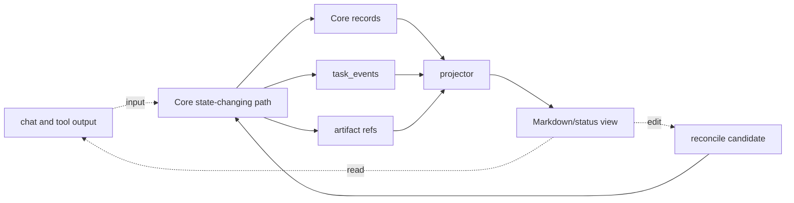

# Projection And Templates Reference

## Authority rule

- Projection is derived from Core-owned state records and artifact references.
- Projection is not Core state.
- User status cards, agent context packets, Markdown reports, and rendered templates are derived views or support payloads, not state.
- Core state is the local authority record and the only operational source of truth.
- User edits to a projection are input only; they are not automatically accepted state.
- Chat and Markdown cannot override Core state.

## What this document helps you do

Use this reference to check how Harness renders readable derived views from Core-owned state records and artifact references.

It defines projection authority boundaries, managed block behavior, human-editable sections, artifact reference rendering, output tiers, template implementation classes, and projection freshness rules. It does not define Core state, public API request/response schemas, SQLite DDL, design-quality policy requirements, or full template bodies. Full template bodies and display card shapes live in the [Template Reference](templates/README.md) and should be loaded only when the current projection or display repair needs a specific template.

This is reference documentation for future Harness behavior. Current repository phase and implementation handoff status are tracked in [MVP Plan](../build/mvp-plan.md#documentation-acceptance-status).

## Read this when

- You need to implement or review Markdown projection behavior.
- You are confirming that a report, status card, or Journey Card is not canonical state.
- You are deciding how a human edit to projected Markdown can become state.
- You need to separate user-readable summaries, agent context packets, and reference or diagnostic projections.
- You are diagnosing stale, failed, or drifted projections.

## Before you read

Use [Core Model Reference](core-model.md) for canonical state and gate authority, [API Schema Core](api/schema-core.md#projectionkind-support) for `ProjectionKind` and projection refs, [Storage](storage.md) for MVP-1 storage and later projection job storage when a projection profile is active, and [Template Reference](templates/README.md) for full rendered bodies and display cards only when that owner section is needed. This reading list is not a default context bundle; agents should follow the phase profile map in [Agent Integration: Context Push/Pull Principles](agent-integration.md#context-pushpull-principles).

## Main idea

Projections are readable derived views. They are generated from Core-owned state and artifact references, can display current state, refs, freshness, and proposed edits, and do not replace Core-owned state. Human edits to projections are not state changes unless a future Core/reconcile path accepts them through a state-changing action.

Use this audience split when deciding what to render or retrieve:

- User-facing compact outputs: `status-card`, `judgment-request`, `run-evidence-summary`, and `close-result`.
- Agent-facing compact output: `agent-context-packet`, a minimal next-action packet with refs and blockers only.
- Core state: the local authority record and only operational source of truth.

## Projection in plain language

A Harness projection is a readable view of work that already exists in canonical state or evidence/artifact storage. MVP-1 can derive four user-facing compact outputs directly from current Core records and refs: `status-card`, `judgment-request`, `run-evidence-summary`, and `close-result`. It can also derive one agent-facing compact output, `agent-context-packet`, for Core-derived refs and the next safe action. Later profiles may add fuller Markdown reports such as `TASK`, `APR`, `RUN-SUMMARY`, `EVIDENCE-MANIFEST`, `EVAL`, `DIRECT-RESULT`, and other report projections under [Template later-profile](../later/index.md#later-template-candidates).

Markdown helps humans understand the work, resume context, inspect evidence, and propose corrections. Markdown does not own the work. A report can summarize a gate, link evidence, display a Write Authorization ref, or show a user judgment or optional full-format Decision Packet presentation, but the report text is not the gate, evidence, authorization, or judgment.

Projection is also a privacy boundary. The projector renders artifact refs, integrity metadata, `redaction_state`, and notes about redaction, omission, or blocking; it must not expand `secret_omitted` or `blocked` artifacts into Markdown body text.

## Output tiers

Harness keeps derived-output tiers aligned with staged delivery:

| Tier | Stage boundary | Purpose and rule |
|---|---|---|
| Core status output | Engineering Checkpoint | Minimal structured status/blocker output from current Core state. It may be plain API text or a compact card; it does not require persisted Markdown, a projection job, multiple `ProjectionKind` values, or a full renderer. |
| MVP-1 user-facing compact outputs | MVP-1 User Work Loop | The active user-facing set is exactly [status-card](templates/status-card.md), [judgment-request](templates/judgment-request.md), [run-evidence-summary](templates/run-evidence-summary.md), and [close-result](templates/close-result.md). These outputs use ordinary language to show current state, blocked reasons, user decisions, next safe actions, evidence summary, remaining risk, close availability, guarantee level, and source/freshness refs without unnecessary internal schema fields or full report bodies. |
| MVP-1 agent-facing context packet | MVP-1 support surface and later | [agent-context-packet](templates/agent-context-packet.md) is a compact machine-readable or prompt-sized payload derived from the same Core state and refs. It carries only task/change-unit refs, state/source refs, active scope, unresolved user judgments, blockers, one next safe action, evidence gaps, close blockers, residual-risk summary when active, and guarantee level. It is not a user-facing card and does not include full projection bodies by default. |
| Assurance Profile reports | Assurance Profile profiles | Compact approval, Manual QA, verification, waiver, and assurance displays when those profiles are enabled. They are report/card views over owner records and refs, not first-slice or minimum MVP requirements. |
| Operations/export reports | Operations Profile profiles | Projection freshness, reconcile/readiness, export, release-handoff, artifact-integrity, and operator report views when operations support is enabled. They do not replace Core state or artifact authority. |
| Future/diagnostic projections | Owner-promoted later profiles or diagnostics | Detailed Journey Card or Journey Spine views, Run Summary, TDD Trace, Module Map, Interface Contract, standalone full-format Decision Packet Markdown, detailed Evidence Manifest, detailed Eval, design/domain-language maps, and other diagnostic views. Pull on demand or enable only through a promoted profile. |

MCP read-only resource staging follows the same tiers. Engineering Checkpoint resources expose current project/current task/status output for the first authority loop. MVP-1 resources may expose the four user-facing compact outputs and the agent-facing context packet listed above. Evidence Manifest, reports, bundles, Journey/Spine, and design/domain resources remain later-profile or diagnostic reads unless an owner profile explicitly promotes them. Resource reads over projections are still reads; they must not create projection jobs, create approvals, record acceptance, accept residual risk, create evidence, create close readiness, or make projections authoritative.

The agent context packet is a consumer of current Core status output and current owner refs, not a separate authority tier or proof that a context API is implemented. It may use projections as a readable summary only when their `source_state_version` and freshness are suitable for the next action. If state matters and the projection, status card, or readable summary is stale, failed, unknown, or too broad, retrieve current Core state or a state-derived agent context packet instead. Do not turn Markdown projections, Journey Cards, status cards, old reports, generated summaries, full projection bodies, full artifact contents, full templates, unrelated templates, or future catalog material into always-on prompt payloads or authority. Full projection bodies are pull-on-demand for a phase that needs their specific content; by default, push only refs, one-line summaries, blockers, evidence gaps, close blockers, freshness, and one next action. They can point to current refs to inspect; they cannot authorize writes, satisfy gates, create evidence, create approval, perform verification, record Manual QA, accept results, accept residual risk, create close readiness, or close a Task.

### MVP-1 View Set

The MVP-1 User Work Loop projection surface is deliberately small. It uses four user-facing compact outputs and one agent-facing compact output:

| Audience | View | Purpose |
|---|---|---|
| User-facing | [status-card](templates/status-card.md) | Short user-visible current state. |
| User-facing | [judgment-request](templates/judgment-request.md) | User-owned judgment request. |
| User-facing | [run-evidence-summary](templates/run-evidence-summary.md) | Minimal run and evidence summary. |
| User-facing | [close-result](templates/close-result.md) | Close readiness, acceptance, residual risk, and blockers. |
| Agent-facing | [agent-context-packet](templates/agent-context-packet.md) | Compact Core-derived refs for the next safe action. |

The status card is the default user-readable current-state view. It should show:

- current Task summary
- work shape
- current scope and non-goals
- pending user judgments
- active blockers
- next safe actions
- known evidence and evidence gaps
- close blockers
- visible residual risk, or an explicit `none`/not-yet-visible status
- guarantee level
- compact source and freshness references, including source state version when useful, relevant owner refs, artifact refs when needed, render time, and freshness state

The four user-facing outputs and the agent-facing packet must stay compact, but they are not the same audience. User-facing outputs should be readable without Harness-internal expertise and should avoid unnecessary internal schema fields. The agent-facing packet may carry compact refs that are useful for the next action, but it must not dump schema fields, DDL, event logs, full artifacts, full artifact contents, full reference docs, full Evidence Manifests, full report bodies, unrelated templates, or future catalog material. Work-acceptance need/status and residual-risk visibility remain distinct Core meanings when relevant, but they appear inside the status card, judgment request, or close result rather than becoming extra required detailed templates. Agent-only refs belong in `agent-context-packet`, not in user-facing prose unless the ref helps the user decide or understand a blocker.

Projection audiences stay separate:

| Audience | Shape | Rule |
|---|---|---|
| User status | Short status card, judgment request, run/evidence summary, and close result with ordinary language and decision-relevant refs | MVP-1 User Work Loop views. Display-only; derived from Core state and refs. |
| Agent context packet | Prompt-sized or structured task/change-unit refs, source clocks, scope, unresolved judgments, blockers, evidence gaps, close blockers, residual-risk summary when active, guarantee level, and one next action | Derived support payload. It may help the next agent action, but it is not authority and should not carry full Markdown bodies by default. |
| Future/diagnostic reports | `TASK`, Journey Card/Spine, Run Summary, detailed Evidence Manifest, detailed Eval, full Manual QA, TDD Trace, Domain Language, Module Map, Interface Contract, Design, Export, full Approval Card, and other polished reports | Later/profile output or diagnostics. A template existing in the repository does not make it required for the current stage. |

The strict boundary is:

| Item | What it is | Authority |
|---|---|---|
| Registered artifact file | Durable evidence file or safe metadata notice registered through an allowed artifact source | artifact store plus `ArtifactRef` metadata |
| State record | MVP-1 canonical structured records such as Task, task scope / Change Unit, User Judgment, Write Authorization, Run, evidence ref, and blocker; later profiles may add Journey Spine Entry, Residual Risk, Approval, Eval, Manual QA record, Evidence Manifest, artifact-link, or Reconcile Item records | `state.sqlite` |
| Markdown report | Human-readable projection from records and artifact refs | projector output |

A Markdown report can link to evidence and summarize state, but it is neither the registered artifact file nor the state record.

### Projection, state, and artifact authority map

This source-of-truth map is a design contract for future projection behavior. Core current records and registered evidence/artifact refs are authority for current state and evidence; event history is audit and ordering authority. Projection, chat, connector output, and tool output are readable or input surfaces until a Core path records a state-changing action.



Strict projection behavior is owned by this reference, especially the [Document authority matrix](#document-authority-matrix), [Managed block rules](#managed-block-rules), and [Freshness and failure rules](#freshness-and-failure-rules). Canonical state and gates are owned by [Core Model Reference](core-model.md), artifact relation storage is owned by [Storage](storage.md), and public projection refs are owned by [API Schema Core](api/schema-core.md#projectionkind-support). The diagram summarizes authority direction only and does not imply a projection system is implemented in this repository today.

Generated reports should make this visible without requiring the reader to know this reference first. In examples and templates, `source_state_version` names the state clock used for the render, `projection_version` or projection status names the rendered view, `updated_at` names when the view was produced, and freshness lines say whether the view still matches its source records. None of those fields make Markdown the owner of Task state, gates, approvals, evidence, verification, Manual QA, user judgments, final acceptance, residual-risk visibility, and residual-risk acceptance.

Freshness display is diagnostic and operationally relevant, but it is still display. A stale or failed projection can block close/readiness views that require current readable context or can cause an action to report `PROJECTION_STALE` through the owning API path, but it must not roll back committed Core state, change gate values, mark a Task failed, or make an old report authoritative. Close display must be rendered from the current Core close result or current state-derived context; stale projection prose is never the close basis.

## Reference scope

This document owns:

- projection principles
- document authority matrix
- managed block rules
- human-editable section rules
- artifact reference rendering rules
- output tiers and template implementation classes
- projection source-record rules
- projection freshness and failure rules
- source-state-version and managed-hash interpretation at the projection-rule level

## Not covered here

This document does not own:

- Core state and transition rules; see [Core Model Reference](core-model.md)
- public API request/response schemas; see [MVP API](api/mvp-api.md) and [API Schema Core](api/schema-core.md)
- SQLite DDL and storage layout; see [Storage](storage.md)
- design-quality policy contracts; see [Design Quality Policies](design-quality-policies.md)
- operator command semantics; see [Operations And Conformance Reference](operations-and-conformance.md)
- conformance fixture assertion semantics; see [Conformance Fixtures Reference](conformance-fixtures.md#fixture-assertion-semantics)
- connector capability profiles; see [Agent Integration Reference](agent-integration.md)
- surface recipes; see [Surface Cookbook](surface-cookbook.md)
- full template bodies and display card shapes; see [Template Reference](templates/README.md)

## One Status Card Example

This is intentionally small. It shows the MVP-1 shape without implying that a full template renderer, generated reports, or `TASK` Markdown exists.

```text
TASK-0001 Add Import Preview
Display only: derived from Core state and refs; not Core state and not write authority.
Doing: preparing the import preview slice for evidence review.
Scope now: preview CSV rows before import; no data write.
Non-goals: bulk import execution; account migration; production deploy.
Pending user judgments: none.
Evidence: diff ref DIFF-0001; smoke check not yet recorded.
Evidence gaps: no run/evidence record for the preview path yet.
Close blockers: evidence gap; final acceptance not requested.
Visible residual risk: none recorded for this slice.
Next safe action: run the preview check and record evidence.
Sources/freshness: state=42; refs=TASK-0001, CU-01, DIFF-0001; rendered=2026-05-06T09:30:15+09:00; freshness=current.
```

## What humans may edit

Humans may edit explicitly human-editable sections, such as:

```md
## User Notes and Proposals
-
```

Human-editable text is input. It can contain notes, questions, corrections, and proposals. The state-changing path is explicit: proposal -> `reconcile_items` candidate -> explicit reconcile outcome -> accepted Core state-changing action with an appended `state.sqlite.task_events` row, or rejection, defer, or conversion to a note. Until that path records an accepted Core outcome, the proposal is not Task state, Domain Language, Module Map, Interface Contract, Manual QA state, acceptance, or evidence.

Human-editable proposals may target Task summary, acceptance criteria, Domain Language, Module Map, Interface Contract, Manual QA notes, or other state-backed records, but the proposal itself is not the target record.

## What humans may not edit into state directly

Humans may not directly edit the following projection text into canonical state:

- managed block content
- front matter fields such as `source_state_version`
- current gate values, lifecycle phase, result, close reason, or assurance level
- approval, verification, Manual QA, final-acceptance, or residual-risk status
- User Judgment, optional full-format Decision Packet, Journey Card, Journey Spine, Autonomy Boundary, Write Authority Summary, Implementation Micro-Plan, Change Unit DAG, Residual Risk, Stewardship Impact, Review Stage, or Write Authorization display text
- artifact reference identity, `sha256`, `size_bytes`, `content_type`, `redaction_state`, or artifact availability
- status cards, Journey Cards, or other generated display surfaces
- template bodies

Direct edits inside managed blocks are drift, not accepted state. Direct edits to displayed authority text do not authorize writes, resolve decisions, satisfy evidence, replace verification or Manual QA, accept residual risk, upgrade assurance, close work, or mutate owner records.

## Projection principles

1. Projection is a readable derived view, not source-of-truth.
2. Canonical operational state is `state.sqlite` current records; `state.sqlite.task_events` is audit and ordering history, not the normal current-state source.
3. Registered artifact bytes and safe metadata notices are canonical only with their `ArtifactRef`, owner relation, and integrity/redaction metadata.
4. Markdown reports are rendered from Core state records and artifact references.
5. Markdown reports are projections by default, not canonical artifact evidence.
6. Front matter carries only identity, projection version or status, `source_state_version`, and timestamp/freshness metadata.
7. Managed blocks are generated by the projector and may be regenerated.
8. Human-editable sections are input surfaces for notes and proposals.
9. Accepted human edits become state only through reconcile and a Core state-changing action that appends `state.sqlite.task_events`; rejected, deferred, or note outcomes do not mutate owner records.
10. Large logs, diffs, traces, screenshots, bundles, checkpoints, and sensitive artifacts are linked by artifact refs instead of embedded.
11. Projection failure or staleness never rolls back committed Core state, rewrites `state.sqlite.task_events`, or changes the underlying task result.
12. User-facing cards may use friendly labels, but canonical gate names remain the kernel fields.
13. User Judgment, optional full-format Decision Packet, Journey Card, Journey Spine, Autonomy Boundary, Write Authority Summary, Implementation Micro-Plan, Change Unit DAG, Residual Risk, Stewardship Impact, and Review Stage displays are non-canonical projections from owner records and artifact refs.

Projection and report surfaces may display current records, refs, and advisory next actions. They must not authorize writes, create Write Authorization, satisfy gates, create evidence, perform or record verification, record Manual QA, grant Approval, record QA waiver or verification-risk acceptance, record final acceptance, record residual-risk acceptance, create close readiness, refresh projections by assertion alone, declare implementation readiness, close Tasks, or mutate owner records. A rendered template cannot create sensitive-action approval, final acceptance, residual-risk acceptance, evidence, or close readiness. Any such effect must come from the owner Core/MCP path named in the matrix below.

User judgment displays must name the judgment kind instead of flattening everything into "Judgment" or "Approval." Render Product decision, Technical decision, Scope decision, Sensitive action approval, QA waiver, Verification risk acceptance, Final acceptance, Residual risk acceptance, and Cancellation as separate user-facing labels when those judgments are pending. If multiple judgments are pending, render separate lines or cards. Residual-risk acceptance displays must name the risk being accepted; QA waiver displays must say the waiver is not QA evidence; verification-risk acceptance displays must say it is not detached verification.

Close/readiness displays must keep evidence, verification, Manual QA, final acceptance, residual-risk visibility, residual-risk acceptance, blockers, and projection freshness on separate lines when those categories are relevant. A projection may summarize a test pass, Eval, QA waiver, final-acceptance user judgment, or accepted Residual Risk ref, but it must not render one of those as another category or as a single all-purpose "done" flag. The active MVP-1 evidence line should show the Core-owned `evidence_summary.status` and refs rather than asking readers to infer sufficiency from report prose.

## Document authority matrix

| Fact or surface | Canonical source | Projection or display surface | Update path |
|---|---|---|---|
| Current Task state | `state.sqlite.tasks`, `task_gates`, and `state.sqlite.task_events` | MVP-1 `status-card`; later `TASK` Current Summary when full continuity projection is enabled | Core transition, then projector |
| Task continuity | `state.sqlite` Task, Change Unit, Run, Evidence Manifest, Eval, Manual QA, User Judgment, Approval, Residual Risk, `task_gates.acceptance_gate`, final-acceptance user judgment state, close events, artifact refs, `task_spine_entries` / public `journey_spine_entry` records when needed, and `state.sqlite.task_events` | `TASK` Journey Spine | Core transition or reconcile, Journey reconstruction, then projector |
| User Judgment | `state.sqlite.user_judgments` including `judgment_kind`, `presentation`, related `decision_gate` state, judgment events, later/profile approval or reconcile records only when enabled, artifact refs, MVP-1 residual-risk blocker refs, and linked `state.sqlite.residual_risks` only when that later profile is active | MVP-1 `judgment-request`, status-card judgment line, status/next-action responses, user-judgment resources, or a dedicated prompt; optional full-format Decision Packet, `TASK`, Journey Card, or `DEC` display when a later/standalone projection is enabled | `request_user_judgment` / `record_user_judgment`, then projector |
| Journey Spine | `state.sqlite` Task, Change Unit, Run, User Judgment, Approval, Evidence Manifest, Eval, Manual QA, Residual Risk, `task_gates.acceptance_gate`, final-acceptance user judgment state, close events, artifact refs, `task_spine_entries` / public `journey_spine_entry` records when needed, and `state.sqlite.task_events` | `TASK` Journey Spine section, resume views, Journey Spine-oriented cards | Core transition or reconcile, Journey reconstruction, then projector |
| Journey Card | current `state.sqlite` Task state, gates, active Change Unit, Autonomy Boundary summary, active user judgment refs, residual-risk summary, latest evidence/eval/QA/report refs, and projection freshness | `JOURNEY-CARD`, status card, `harness.status` / `status.next_actions` card text, later/compatibility `harness.next` current-position text, significant resume output | Read or projection refresh from current state; never direct card edit |
| Autonomy Boundary | active `state.sqlite.change_units` Autonomy Boundary fields plus related user judgment resolutions and events | `TASK` Autonomy Boundary, Change Unit block, Journey Card autonomy line, optional related `DEC` when standalone projection is enabled | shaping update or user judgment resolution, then projector |
| Write Authorization | `state.sqlite.write_authorizations` plus related Task, Change Unit, approval, user judgment, baseline, and consumed Run refs | `TASK` Write Authority Summary, Journey Card Write Authority Summary line, `RUN-SUMMARY` relation | Non-dry-run `prepare_write.decision=allowed` creates the active row; dry-run allowed responses are candidates only and create no authorization row; blocked/required/conflict decisions create no authorization row; idempotent replay returns the original committed response; `record_run` consumes only a compatible active authorization before projector output reflects consumed authority |
| Implementation Micro-Plan | current `state.sqlite` Task state and gates, active Change Unit scope and Autonomy Boundary, Change Unit dependency summary, selected feedback-loop records, TDD traces when selected, expected evidence needs, user judgment blockers, and latest report refs | `TASK` Implementation Micro-Plan managed section | Accepted reconcile outcome or Core state-changing action updates owner records, then projector |
| Change Unit DAG | `state.sqlite.change_units`, `state.sqlite.change_unit_dependencies`, dependency-related events, and active Task state | `TASK` Change Unit Dependencies / DAG summary | shaping update or reconcile, then projector |
| Residual Risk | MVP-1 residual-risk blockers, residual-risk acceptance `user_judgments`, related evidence refs, and explicit `ResidualRiskSummary.status=none`; later residual-risk profiles may add `state.sqlite.residual_risks`, accepted-risk metadata, and richer refs | `TASK` Residual Risk, optional `DEC` accepted-risk context when standalone projection is enabled, Journey Card residual-risk line | Core transition from judgment, evidence, QA, Eval, reconcile, or close flow, then projector |
| Stewardship Impact Summary | Later/stewardship profile owner records such as `domain_terms`, `module_map_items`, `interface_contracts`, `feedback_loops`, TDD records when TDD is selected, MVP-1 blockers/user judgments or later `state.sqlite.residual_risks`, policy validator results, and related refs | `TASK` Stewardship Impact and status/resume stewardship displays | Owner record update, validator result, reconcile, or close flow, then projector |
| Review Stages | Task, Change Unit, gate state, evidence summaries, Run refs, ArtifactRefs, Evidence Manifest when active, validator results, Manual QA, Eval, sensitive-action approval user judgment or Approval when active, Residual Risk, stewardship owner refs when their profile is active, and structured blocker refs | `TASK` and `RUN-SUMMARY` sections named Spec Compliance Review and Code Quality / Stewardship Review | Existing owner-record update, validator result, user judgment, evidence, Manual QA, Eval, residual-risk, close-blocker, Change Unit, or follow-up path, then projector |
| User Notes | human-editable input -> `reconcile_items` -> accepted Core state-changing action and `state.sqlite.task_events`, or rejected/deferred/note outcome | `TASK` User Notes and Proposals | human edit, reconcile decision, Core event |
| Shared Design | Later/profile shared design records and events | `TASK` summary, `DESIGN`, optional `DEC` when standalone projection is enabled | Core transition or reconcile, then projector |
| Domain Language | Later/design profile `domain_terms` table | `DOMAIN-LANGUAGE` projection | Core transition or reconcile, then projector |
| Module Map | Later/design profile `module_map_items` table | `MODULE-MAP` projection | Core transition or reconcile, then projector |
| Interface Contract | Later/design profile `interface_contracts` table | `INTERFACE-CONTRACT` projection | Core transition or reconcile, then projector |
| Feedback Loop | Later/profile `feedback_loops` table plus refs to runs, artifacts, TDD traces, Manual QA, and evidence manifests | `TASK` Stewardship Impact and Evidence Manifest design-quality coverage; no standalone Feedback Loop projection in the current reference catalog | `FeedbackLoopUpdate` through `record_run` shaping or evidence update, `record_manual_qa` via `feedback_loop_ref`, or reconcile, then projector |
| Sensitive-action approval | Minimum MVP-1: `state.sqlite.user_judgments` with `judgment_kind=sensitive_approval`, `judgment_payload.approval_scope`, and judgment events. Later Approval profile: `approvals`, linked sensitive-action approval user judgment, optional user-judgment request routing/replay record if implementation keeps one, and events. Never a non-mutating `user_judgment_candidate` alone | Minimum MVP-1: status-card or judgment-request display. Later Approval profile: `APR` projection and approval card | Minimum MVP-1: `request_user_judgment(judgment_kind=sensitive_approval)` creates the user judgment and `record_user_judgment` resolves it, then projector/card if enabled. Later Approval profile may also create/update the Approval record, then projector |
| Run summary | `runs` table plus artifact refs | `RUN-SUMMARY` projection | `record_run`, then projector |
| Direct result | direct run record plus artifact refs | `DIRECT-RESULT` projection | `record_run` / `close_task`, then projector |
| Evidence coverage | Minimum MVP-1: `evidence_ref` records, Run refs, ArtifactRefs, and derived visible gap summaries. Full Evidence Manifest profile: `evidence_manifests` plus artifact refs | MVP-1 `run-evidence-summary` or status-card evidence summary/gap display; `EVIDENCE-MANIFEST` projection only when the full evidence profile is active | `record_run` evidence updates in MVP-1; evidence module update when the full Evidence Manifest profile is active, then projector |
| Verification verdict | `evals` plus artifact refs | `EVAL` projection and verification card | `record_eval`, then projector |
| TDD trace | `tdd_traces` plus artifact refs | `TDD-TRACE` projection | `record_run` or reconcile, then projector |
| Manual QA | `manual_qa_records` plus artifact refs when a record exists; `qa_gate` is canonical gate for pending or satisfied QA | `MANUAL-QA` projection and QA card | `record_manual_qa`, then projector |
| Registered artifact evidence | artifact store plus `artifacts` records, `artifact_links`, and integrity/redaction metadata | artifact references in reports | artifact registry |
| Projection freshness | MVP-1: current state version compared with the compact view source version; Operations/profile-promoted projections: `projection_jobs.source_state_version`, `projection_jobs.projection_version`, job status, managed hashes, artifact records | front matter mirror, status-card, operations output | read-time derivation in MVP-1; projector and recovery tools when the projection job profile is active |

Full-format user judgment projections and cards must show the concrete judgment kind. Render canonical user judgment fields separately from friendly labels: `judgment_kind` is the compact internal kind, `presentation` is the prompt/detail level, and friendly labels are derived from `judgment_kind` plus locale. English labels are Product decision, Technical decision, Scope decision, Sensitive action approval, QA waiver, Verification risk acceptance, Final acceptance, Residual risk acceptance, or Cancellation; Korean labels are localized rendering strings, not schema values. Sensitive approval must not look like final acceptance, final acceptance must not look like residual-risk acceptance, QA waiver must not look like QA evidence, and verification-risk acceptance must not look like detached verification. Affected gates or blocked actions come from `affected_gates` and related owner records, not from display text. Legacy fields such as `judgment_category`, `judgment_route`, and `display_depth` may appear only in migration notes or compatibility drill-down.

Required authority statements:

- User Notes: human-editable input -> `reconcile_items` -> accepted Core state-changing action and `state.sqlite.task_events`, or rejected/deferred/note outcome
- Domain Language: when the later/design profile is active, `domain_terms` table -> `DOMAIN-LANGUAGE` projection; public refs to canonical term rows use `StateRecordRef.record_kind=domain_term`
- Module Map: when the later/design profile is active, `module_map_items` table -> `MODULE-MAP` projection; public refs to canonical module rows use `StateRecordRef.record_kind=module_map_item`
- Interface Contract: when the later/design profile is active, `interface_contracts` table -> `INTERFACE-CONTRACT` projection; public refs to canonical contract rows use `StateRecordRef.record_kind=interface_contract`
- Feedback Loop: when the feedback-loop profile is active, `feedback_loops` table -> `TASK` and Evidence Manifest display; public refs to canonical feedback-loop rows use `StateRecordRef.record_kind=feedback_loop`; TDD Trace refs remain separate execution evidence refs
- User Judgment: `state.sqlite.user_judgments` including `judgment_kind`, `presentation`, and related refs -> locale-derived status-card judgment line, judgment-request view, status/next-action responses, judgment-context resources, or user-judgment resources; optional `TASK`, Journey Card, or `DEC` projection when a later/standalone full-format projection is enabled
- Journey Spine: reconstructed from owner records, artifact refs, `task_spine_entries` / public `journey_spine_entry` records when needed, and `state.sqlite.task_events`; it is not its own authority record
- Journey Card: derived display from current state and refs; it is never canonical state
- Autonomy Boundary: active `state.sqlite.change_units` boundary fields -> projection surfaces; it is judgment latitude, not scope authority
- Write Authority Summary: derived display from active scope, approval, Write Authorization, baseline, and guarantee refs; it is never canonical state and cannot authorize work
- Write Authorization: `state.sqlite.write_authorizations` records a specific `decision=allowed` write attempt with an authorization lifecycle status; it is not scope, approval, evidence, verification, QA, final acceptance, or residual-risk acceptance
- Implementation Micro-Plan: current Task and Change Unit owner records plus related refs -> `TASK` managed execution-aid section; it is not canonical state, not a new `ProjectionKind`, not scope authority, not approval, and not Write Authorization
- Sensitive-action approval: minimum MVP-1 uses a sensitive-action approval user judgment -> status-card or judgment-request display; later Approval profiles use `approvals` plus the related user judgment -> `APR` projection only after the Approval record exists or changes. A non-mutating `user_judgment_candidate` with `judgment_kind=sensitive_approval` from `prepare_write` may appear as candidate display, but it is not an `APR` source
- Change Unit DAG: `state.sqlite.change_unit_dependencies` and Change Unit refs -> dependency projection; it is not a scheduler or authorization surface
- Residual Risk: MVP-1 uses residual-risk blockers plus residual-risk acceptance `user_judgment` refs for visibility and acceptance display; later residual-risk profiles may use `state.sqlite.residual_risks` including accepted-risk metadata/refs -> residual-risk displays
- Stewardship Impact Summary: derived from owner records, validator results, and refs -> `StewardshipImpactSummary` display; it is not a canonical record
- Review Stages: Task, Change Unit, gates, evidence, validator results, residual-risk refs, and stewardship owner refs -> managed `TASK` or `RUN-SUMMARY` display sections named Spec Compliance Review and Code Quality / Stewardship Review; they are not canonical records; they are not new `ProjectionKind` values, Approval, evidence, verification, QA, final acceptance, residual-risk acceptance, close, Write Authorization, or detached verification

## Managed block rules

Managed blocks are the only Markdown areas the projector may overwrite:

```md
<!-- HARNESS:BEGIN managed -->
...
<!-- HARNESS:END managed -->
```

Rules:

- Managed block content is generated from committed state records and artifact refs.
- When persisted projection jobs are active, the projector records `projection_jobs.source_state_version`, projection version, rendered timestamp, and managed hash. MVP-1 status cards may instead carry a read-time source state version without a projection job row. Front matter mirrors the recorded source state version for operators when Markdown projection is enabled.
- The managed hash is computed from the projector-owned managed block body, excluding the `HARNESS:BEGIN` and `HARNESS:END` marker lines, after normalizing line endings to LF and preserving meaningful whitespace required by the projector rules.
- If the managed block hash differs from the last projected hash before rendering, the projector creates or updates a reconcile item.
- The managed hash is used only for drift detection; it never makes the rendered Markdown canonical state.
- The projector does not silently treat a direct edit inside a managed block as accepted state.
- Re-rendering a managed block must preserve unrelated human-editable sections.
- A failed render marks projection freshness `failed` or `stale`; it does not roll back state.
- Rendered templates should include a short projection boundary notice near the top or in the managed summary so readers can tell that the report is a view, managed blocks are projector-owned, and human-editable sections are proposal input.

Front matter stays diagnostic and compact. It may identify the rendered object, show the projection version or status, mirror `source_state_version`, and include the rendered timestamp. It must not contain large state summaries, evidence bodies, gate rollups, or artifact inventories.

`projection_version` is the projection/template/job version. It is not a state clock and must not be used as the source-state freshness basis. `source_state_version` is the affected-scope state clock value used as the render source: the Task State Version when the projection is task-scoped, otherwise the Project State Version or extension-defined owner state clock.

When persisted projection jobs are active, the canonical per-projection value is `projection_jobs.source_state_version` for the successful render job. Front matter `source_state_version` only mirrors that value for operator diagnosis. In MVP-1 compact views, freshness can be derived directly by comparing the returned source state version with current Core state.

Do not collapse display problems into one status:

- A stale projection means the readable Markdown or card may lag behind the owner records or artifact refs.
- Stale state, stale baseline, or stale evidence means the underlying state or evidence inputs have moved or are no longer sufficient; the projection may be current while still displaying that blocker.
- MCP unavailable means the surface or caller cannot reach the required Harness/Core capability. If Core cannot be reached, no authoritative Core state mutation, projection repair, approval, close, or gate update can be claimed from the display alone.

## Human-editable section rules

- Human-editable text is input, not canonical state.
- Reconcile reads the edit and creates a `reconcile_items` candidate when state may need to change.
- Accepted proposals become state only through a Core transition and appended `state.sqlite.task_events` row.
- Rejected proposals remain notes or rejected reconcile items.
- The projector must preserve human-editable content across refreshes.
- Human-editable proposals may target Task summary, acceptance criteria, Domain Language, Module Map, Interface Contract, Manual QA notes, or other state-backed records, but the proposal itself is not the target record.

## Embedding vs referencing

User-readable outputs should embed only concise summaries and safe labels. Large logs, diffs, traces, screenshots, recordings, checkpoints, bundles, export components, and sensitive artifacts should be referenced by `ArtifactRef` or `StateRecordRef`, not pasted into readable Markdown.

Reference/diagnostic outputs may list richer artifact inventories, `sha256`, retention state, and availability notes, but they still reference large or sensitive bytes instead of reconstructing them. A projection may say what a ref supports and whether the input is redacted, omitted, blocked, stale, or missing; it must not inline omitted secret/PII values, blocked payload bytes, or unbounded artifact bodies.

## Artifact reference rendering

Markdown reports render artifact references compactly and consistently. The payload shape is owned by [API Schema Core: ArtifactRef](api/schema-core.md#artifactref); projection owns only presentation rules.

Recommended display:

```text
- Diff: DIFF-0001 (`artifact_id=ART-0001`, sha256:abc123..., content_type:text/x-diff, redaction_state:none)
- Test log: LOG-0002 (`artifact_id=ART-0002`, sha256:def456..., content_type:text/plain, redaction_state:redacted)
- Bundle: BUNDLE-0001 (`artifact_id=ART-0003`, sha256:789abc..., content_type:application/zip, redaction_state:secret_omitted)
- Browser trace: TRACE-0004 (`artifact_id=ART-0004`, sha256:012def..., content_type:application/json, redaction_state:blocked)
```

Rules:

- Every artifact ref must resolve to an artifact record.
- Every registered artifact evidence ref must carry `artifact_id`, Task or equivalent owner scope, kind, `uri`, `sha256`, `size_bytes`, `content_type`, `redaction_state`, `produced_by`, relation owner, `retention_class`, and availability metadata.
- Large or sensitive evidence is linked, not pasted into Markdown.
- User-visible artifact lines should show the ref identity, owner or supporting record when useful, `sha256` or short `sha256`, `size_bytes` when useful, `content_type`, `redaction_state`, `retention_class` or availability, and any omission/block note needed to understand evidence impact.
- `secret_omitted` artifacts are displayed as refs plus omission notes or handles. They may support visible nonsecret claims, but projection text must not imply that omitted values were inspected or proven.
- `blocked` artifacts are displayed as refs plus block notes. The displayed `sha256`, `size_bytes`, and `content_type` describe the committed metadata-only notice bytes, not the forbidden raw payload. The projector must not reconstruct, inline, summarize, or export omitted or blocked raw values.
- A `blocked` artifact display means the raw capture is unavailable. Evidence, QA, verification, Release Handoff, and export displays must surface that block as blocked, insufficient, unavailable input, or unresolved until a replacement, waiver, User Judgment outcome, accepted risk, or documented fallback resolves the path.
- Missing artifacts, missing integrity/redaction metadata, unresolved owner relations, or `hash_mismatch` findings mark related evidence, projection freshness, export display, or close-readiness views stale or blocked. User-visible reports should point to the affected ref and the `artifacts check` or recovery path; they should not paste report prose as replacement evidence.
- State record refs use record identity and optional projection path; for later/profile-promoted `record_kind=projection`, identity is `projection_jobs.projection_job_id` and the path is only a locator. They are not rendered as registered artifact evidence refs.
- `artifact_links.record_kind` must resolve to an existing same-Task state owner or later/profile-promoted projection ref. Current Task-scoped artifact links remain Task-scoped; `record_kind=projection` resolves to a completed `projection_jobs` row with the same `task_id` only when the projection job profile is active, and the link's `record_id` is `projection_jobs.projection_job_id`, while path display uses the later-profile `StateRecordRef` projection extension's `projection_path` or `projection_jobs.output_path`. Project-level owner rows and project-level projection jobs use state or projection job freshness/output metadata unless a future extension adds project-scoped artifact linking. `EXPORT` is a `ProjectionKind` only; export snapshots and components remain artifacts linked to their owner records or to later/profile-promoted `record_kind=projection`, not to `record_kind=export`.

## Template implementation classes

The template catalog is intentionally broader than the early implementation set. Template classes stage rendered shapes without changing projection authority:

| Class | Templates or output shapes | Rule |
|---|---|---|
| Core status output | Plain status/blocker response or optional [status-card](templates/status-card.md) | Optional rendering for the structured status/blocker output from current Core state in Engineering Checkpoint. A plain structured response is enough; no persisted Markdown projection job or full renderer is required. |
| MVP-1 user status | [status-card](templates/status-card.md) | Short user-visible current state. |
| MVP-1 agent support | [agent-context-packet](templates/agent-context-packet.md) | Compact task/change-unit refs, source clocks, scope, unresolved judgments, blockers, evidence gaps, close blockers, residual-risk summary when active, guarantee level, and one next safe action. |
| MVP-1 judgment prompt | [judgment-request](templates/judgment-request.md) | User-owned judgment request. Full Decision Packet display is later/full-profile. |
| MVP-1 run/evidence display | [run-evidence-summary](templates/run-evidence-summary.md) | Minimal Run and evidence summary. Detailed run reports and full evidence catalogs are later/full-profile. |
| MVP-1 close display | [close-result](templates/close-result.md) | Close readiness, acceptance, residual risk, and blockers. |
| Later/full-profile templates | [later-profile](../later/index.md#later-template-candidates) | Detailed assurance, operations/export, future/diagnostic, stewardship, full Decision Packet, and full report templates. Pull on demand or enable only through an owner-promoted profile. |

`Future/diagnostic projections` means later-profile or diagnostic scope, not automatically Roadmap only.

No template class makes a projection canonical state or creates evidence, QA, verification, approval, final acceptance, residual-risk acceptance, close readiness, close authority, or Write Authorization. If a source record does not exist, the projector must not invent placeholder state to satisfy template completeness.

The `EXPORT` template is an optional projection output. It does not introduce an `export` state record for artifact links. Export projections list artifact refs, `sha256`, `size_bytes`, `content_type`, `redaction_state`, owner/retention metadata, and redaction/omission/block notes; they do not embed large or sensitive artifact bodies by default.

Persisted `JOURNEY-CARD` Markdown, Journey Spine output, `TASK` continuity reports, Direct Result reports, Run Summary, detailed Evidence Manifest, detailed Eval, full Manual QA card, TDD Trace, Domain Language, Module Map, Interface Contract, Design, Export bundles, full Approval Card, and other polished reports are not mandatory early scope. Current-position context for status, next actions, and resume is satisfied by core status output, `status-card`, `agent-context-packet`, `judgment-request`, `run-evidence-summary`, or `close-result`.

User judgment visibility required by the active stage/profile is provided through status/next-action responses, judgment-context resources, user-judgment resources, compatibility decision-packet resources when enabled, the status card, or the [judgment-request](templates/judgment-request.md) view. That requirement is for the user judgment request display shape, not the standalone `DEC` `ProjectionKind`. Standalone `DEC` Markdown is optional unless the standalone full-format Decision Packet projection feature is enabled.

User Judgment record IDs use the user judgment identifier family. `DEC` as a `projection_kind` is only the projection kind label; when a standalone projection needs its own identity, use a separate `projection_id` such as `DEC-PROJ-0001`.

The MVP-1 display shapes live in the [Template Reference](templates/README.md). Later/full-profile display shapes live under [Template later-profile](../later/index.md#later-template-candidates).

## Freshness and failure rules

For MVP-1 compact views, freshness can be computed from the current owner or affected-scope state clock and the source version returned with the read. For Operations/profile-promoted projections, freshness is computed from the current owner or affected-scope state clock, canonical `projection_jobs.source_state_version`, projection job state, managed hashes, artifact availability, and known stale triggers. Front matter `source_state_version` mirrors the canonical value from the last successful render so operators can diagnose stale projections without treating the Markdown as canonical.

Close/readiness displays must distinguish three facts: the current Core state version, the projection source version or failed job status, and whether the readable view is current enough for the requested operation. They must not infer readiness from stale Markdown, and they must not treat a failed projection as a rollback or mutation of the current Task, Run, evidence summary, Eval, QA, Approval, user judgment, or residual-risk state.

The table below describes freshness rules only for projections whose stage or owner profile has enabled them. Listing a projection here does not make it part of MVP-1 User Work Loop scope.

| Projection | Generated when | Stale when |
|---|---|---|
| `TASK` | Task created, resumed, changed, or refreshed | current `tasks.state_version > projection_jobs.source_state_version` for the `TASK` projection, managed block drift, unresolved reconcile required, stewardship owner refs or design-quality validator results changed |
| `APR` | later Approval profile creates or updates a committed Approval record through `request_user_judgment(judgment_kind=sensitive_approval)` or `record_user_judgment` | linked Approval record status, scope, baseline, expiry, related sensitive-action approval user judgment, or judgment note changes |
| `RUN-SUMMARY` | `record_run` commits a Run, including `runs.status=completed`, `interrupted`, `blocked`, or `violation` | run relation changes, artifact ref missing, artifact integrity fails |
| `EVIDENCE-MANIFEST` | full Evidence Manifest profile is active and criteria-to-evidence coverage changes | baseline drift, changed files modified, required evidence missing/stale, or linked sensitive-action permission / Approval drift or expiry |
| `EVAL` | verification result recorded | baseline changes after Eval, evidence becomes stale, independence relation invalidated |
| `DIRECT-RESULT` | direct run closes or escalates | changed file drift, escalation state changes, artifact ref missing |
| `EXPORT` | export/report projection is generated, including a Release Handoff profile when enabled | any included Task/gate/Change Unit/user judgment/Residual Risk/evidence/verification/Manual QA/artifact/projection/redaction/checklist source changes or becomes unavailable |
| `DEC` | standalone full-format Decision Packet projection is enabled and a user judgment is created, requested, resolved, deferred, rejected, blocked, or superseded | user judgment status, affected scope, current-state context, related approval/reconcile state, residual-risk refs, or evidence refs change |
| `JOURNEY-CARD` | card is rendered or persisted as a projection; `harness.status` and later/compatibility `harness.next` may also return it ephemerally without a projection job | any displayed Task/gate/Change Unit/Autonomy Boundary/Write Authorization/approval/baseline/guarantee/User Judgment/Residual Risk/evidence/report/freshness source moves ahead of the rendered card |
| `DOMAIN-LANGUAGE` | domain terms change | term conflict, accepted term record changes, related code representation moves |
| `MODULE-MAP` | module map records change | module path, public interface, dependency direction, internal complexity, test boundary, owner decision, or watchpoint changes |
| `INTERFACE-CONTRACT` | interface contract records change | linked interface, caller, compatibility impact, or boundary tests change |
| `TDD-TRACE` | trace recorded or updated | red/green log missing, baseline drift, linked test file changes |
| `MANUAL-QA` | QA record created or updated | linked UI/code changes, required capture missing, finding unresolved |

Freshness states:

| State | Meaning |
|---|---|
| `current` | MVP-1 compact output matches the current source state version, or a profile-promoted projection matches the committed state version recorded in canonical `projection_jobs.source_state_version` and the managed hash |
| `stale` | state or referenced evidence moved ahead of the projection |
| `failed` | projector attempted refresh and failed |
| `unknown` | freshness cannot be computed, usually during recovery or migration |

Projection staleness can block actions that require current readable context, including close/readiness checks that rely on current report views, but it does not change lifecycle result, gate values, or assurance by itself. Projection failure or staleness never changes the underlying task result and never rolls back committed Core state.
