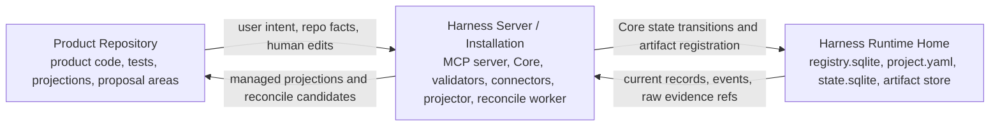

# Runtime Architecture Reference

## What this document helps you do

Use this reference to understand where Harness runs, where canonical state lives, how Core commits state transitions, how artifacts and projections move through the system, and what enforcement strength the runtime can honestly claim.

It is a lookup document for implementers and operators. It does not repeat the Learn overview or teach the whole Harness model from first principles.

This is reference documentation. It does not authorize runtime/server implementation, generated operational files, executable fixtures, or runtime data before the redesigned docs are accepted. The first implementation/proof target remains Kernel Smoke; Agency-Hardened MVP and post-MVP automation stay out of scope unless their owner docs promote and prove them.

## Read this when

- You are mapping product repository files to Harness runtime state.
- You are implementing Core, artifact capture, projection, reconcile, validation, recovery, or export behavior.
- You need to decide whether a failure affects canonical state, artifacts, projections, or only display.
- You are explaining why a connected surface is cooperative, detective, preventive, or isolated.

## Before you read

Use the [Kernel Reference](kernel.md) for exact state transitions, [MCP API And Schemas](mcp-api-and-schemas.md) for public tool envelopes and replay behavior, [Storage And DDL](storage-and-ddl.md) for storage layout and locks, and [Operations And Conformance Reference](operations-and-conformance.md) for operator entrypoint semantics.

## Main idea

Harness runs as a local authority layer beside the user's product repository. The product repository stays the place where product work happens; Runtime Home stores operational authority; the Harness Server / Installation connects the two through Core, validators, projection, reconcile, and public MCP tools.

The important rule is separation. Core alone changes canonical operational state. Product source files, chat text, generated Markdown, connector files, operator output, and MCP caller claims can inform the system, but canonical operational state lives in `state.sqlite` current records plus `state.sqlite.task_events`, and raw evidence lives in the artifact store.

## Reference scope

This document owns:

- the three spaces in implementation detail
- Product Repository / Harness Server or Installation / Harness Runtime Home separation
- Core process model
- Core-only canonical mutation authority
- state transaction flow
- artifact store architecture
- local threat model and trust boundaries
- projection and reconcile architecture
- guarantee levels
- failure and recovery overview

## Not covered here

This document does not own:

- public MCP request/response schemas; see [MCP API And Schemas](mcp-api-and-schemas.md)
- SQLite DDL; see [Storage And DDL](storage-and-ddl.md)
- full CLI command semantics; see [Operations And Conformance Reference](operations-and-conformance.md)
- conformance fixture format; see [Operations And Conformance Reference](operations-and-conformance.md)
- surface-specific connector cookbooks; see [Surface Cookbook](surface-cookbook.md)
- connector capability profiles; see [Agent Integration Reference](agent-integration.md)
- kernel transition table; see [Kernel Reference](kernel.md)
- projection template bodies

## The three spaces, short recap

```text
Product Repository:
  product code, tests, human-readable projections, and human-editable proposal areas

Harness Server / Installation:
  MCP server, Core, validators, connectors, projector, reconcile worker, and operator tools

Harness Runtime Home:
  registry.sqlite, project.yaml, state.sqlite, and the artifact store
```



This split prevents chat, Markdown reports, generated connector files, operator output, MCP caller claims, and product source files from becoming accidental operational state. Only a Core state-changing path can commit canonical operational state.

## Local threat model

Harness is designed as a local authority layer, not as a general operating-system security boundary. The local threat model assumes a user-controlled Product Repository, a local Harness Server / Installation, a Harness Runtime Home, and one or more connected agent surfaces. A local process or file with write access to any one of those spaces can try to influence Harness, so the runtime treats nearby files and callers as separate trust zones rather than interchangeable authority.

The main boundaries are:

| Boundary | Trust concern | Runtime handling |
|---|---|---|
| Product Repository | Human-editable files, generated Markdown, stale docs, and connector-managed files can be edited directly or used as spoofed context. | Product files are input or projection surfaces. Accepted operational meaning must flow through Core or reconcile, and managed-block drift is not silently accepted as state. |
| Harness Server / Installation | The MCP server and operator tools are a local control plane that could receive calls from the wrong process, stale surface config, or a spoofed project/task/surface claim. | Public tools enter through Core, use request-envelope validation, state-version checks, idempotency, surface capability reporting, and honest guarantee display. Local binding and access expectations are API and operations contracts, not a claim that every local process is trusted. |
| Agent surface | A surface may overstate its capability, skip MCP, or present user, evaluator, or operator intent inaccurately. | Capability is observed through connector profiles, `surface_capability_check`, blocked reasons, and guarantee display. `actor_kind` informs routing, but it is not by itself approval, acceptance, verification independence, or user-owned judgment. |
| Connector files | Generated instructions, manifests, capture hints, and local configuration can drift or be hand-edited. | Connector-managed files are checked through manifests and drift reporting. They do not create state authority without Core records. |
| Harness Runtime Home | `registry.sqlite`, `project.yaml`, `state.sqlite`, `state.sqlite.task_events`, and artifact directories hold operational authority and evidence. | Core transactions, locks, state versions, event history, doctor, and recovery preserve the authority boundary. Direct file edits are invalid state changes until a Core or recovery path validates them. |
| Artifact store | Staged files, screenshots, logs, network traces, export components, and copied evidence can be poisoned, tampered with, oversized, or contain secrets/PII. | Artifact registration treats inputs as untrusted until an approved staging/capture path, redaction or omission, hash/size/content-type checks, Task-scoped ownership, and owner-record validation succeed. |

Sensitive categories are the map for side-effect, security, compliance, product-contract, and policy risk. Runtime-facing side effects include `destructive_write`, `network_write`, `external_service_write`, `data_export`, `infra_or_deployment_change`, `production_config_change`, `ci_cd_change`, `billing_or_cost_change`, and `telemetry_or_logging_change`. Product/security/compliance-sensitive categories such as `auth_change`, `permission_model_change`, `schema_change`, `dependency_change`, `public_api_change`, `secret_access`, `privacy_or_pii_change`, `license_or_compliance_change`, `model_or_prompt_policy_change`, and `policy_override` are also not made safe by being local operations or by being initiated through a nearby file, connector, or caller. When policy applies, the applicable Harness paths still apply: scope for bounded work, Approval for sensitive operations, compatible Decision Packets for user-owned judgment, Write Authorization for write-capable work, evidence when claims or close depend on it, and capability/guarantee reporting for the connected surface.

Logs, screenshots, artifacts, projections, exports, and run summaries may carry secrets, PII, credentials, tokens, private customer data, or sensitive operational details. Runtime architecture therefore treats redaction and omission as part of evidence handling, not as cosmetic report formatting. Raw secrets should not become durable artifacts, and exported bundles must carry redaction or omission notes when content was removed or blocked.

### Local access expectations

The MVP default MCP exposure posture is local-only for a registered project surface. Local-only means the default connector and `serve mcp` posture uses local process, local socket, or localhost-loopback access for the expected local user/profile; it does not bind a non-loopback interface, publish a shared or remote endpoint, rely on a forwarded or tunneled port, cross into a cloud/CI relay, expose a cross-user socket or directory, or treat network reachability as authorization. Any caller, endpoint, port, socket, config file, relay, or filesystem path outside the registered connector profile is outside the MVP local boundary. This is a local operating assumption, not trust in every process on the machine. Concrete local risks include another local process issuing tool calls, a forwarded or tunneled port, stale connector configuration, spoofed `project_id`, `task_id`, `surface_id`, or `actor_kind` claims, and IPC or file permissions that let unrelated users or processes read or change Runtime Home data.

The exact local transport is not prescribed. Acceptable contract-level assumptions include localhost TCP with local-only binding, a Unix-domain socket or other local socket constrained by owner-only filesystem permissions, in-process or stdio transport, process-scoped configuration material, a per-project token or handle used as an additional local control, or an equivalent local IPC/control path. Profiles and manifests record the access-control material class, bind/reachability posture, freshness basis, and display-safe handle or fingerprint when needed; they do not store raw token, secret, or private configuration values.

Exposing MCP beyond local-only scope is not the MVP default and remains outside MVP unless owner documentation and conformance promote a specific connector posture. It requires a documented connector capability profile, access-control contract, secret/PII handling policy, guarantee display, and conformance coverage for the exposed authority. This reference does not require one mechanism, but the profile must name what prevents unrelated callers from using the endpoint, what data the exposure may reveal, what guarantee level is still honest, and what Core still validates.

When the access mode is weaker, unknown, or outside the documented profile, Harness reports that honestly. `doctor` or `serve mcp` may warn or fail according to the risk, status and write decisions should reduce the guarantee display or emit `surface_capability_check` findings, cooperative surfaces hold product/runtime/code writes, and API-visible failures use existing `MCP_UNAVAILABLE` or `CAPABILITY_INSUFFICIENT` paths where the MCP API owner allows them. A weak access mode does not by itself prove existing state is corrupt, but it can make write-capable or close-relevant paths capability-insufficient until diagnosed.

Diagnostic examples are part of the documentation contract, not a new state model:

| Observed posture | Honest report |
|---|---|
| MCP is bound to a non-local interface, forwarded, tunneled, or reachable by a caller outside the registered connector profile. | `doctor` and `serve mcp` name the observed access mode, active project, surface profile, and weaker guarantee; state-changing or close-relevant paths hold, fail, or use existing `MCP_UNAVAILABLE` / `CAPABILITY_INSUFFICIENT` responses instead of adding a new public `ErrorCode`. |
| Runtime Home permissions are unknown or weaker than owner-only expectations. | `doctor` reports a security/threat-model finding with platform observability and remediation guidance. It does not treat file permissions as canonical state or accept direct file edits as authority. |
| Runtime Home has broad write access. | Reports call this a local tampering risk for `state.sqlite`, `registry.sqlite`, `project.yaml`, connector manifests, artifact files, staging files, and generated operational files. Core still accepts meaning only through shape, owner, event, integrity, recovery, or artifact-registration checks. |
| Artifact directories have broad read access. | Reports call this a confidentiality risk for logs, screenshots, tokens, PII, verification bundles, exports, and other sensitive evidence. Redaction, omission, block notes, retention, and export rules still define what Harness may display or copy. |
| Envelope claims name the wrong project, Task, surface, Run, or actor role. | Public tools validate the claims against registered records and tool scope. `actor_kind` may guide routing, but it cannot by itself satisfy Approval, user acceptance, Manual QA, or detached verification. |

## Product Repository

The Product Repository is the user's real product workspace. It contains product source code, tests, repository-level agent rules, and human-readable harness projections.

Typical repository-owned paths are:

```text
repo/
  AGENTS.md
  docs/
    tasks/
    approvals/
    reports/
    design/
  .harness/
    agent/generated/
    reconcile/pending/
```


The repository may hold generated `TASK`, `APR`, `RUN-SUMMARY`, `EVAL`, `DIRECT-RESULT`, `EVIDENCE-MANIFEST`, `TDD-TRACE`, `MANUAL-QA`, `DOMAIN-LANGUAGE`, `MODULE-MAP`, `INTERFACE-CONTRACT`, and other report projections. These files help humans and agents read the work, but they are not canonical state. A human-editable section is an input surface; accepted changes become state only through reconcile and a Core state-changing action.

## Harness Server / Installation

The Harness Server / Installation is the control plane. MVP can implement it as one local process with internal modules rather than a fleet of services.

Core runtime responsibilities:

- expose read resources and public tools through the MCP server
- execute kernel state transitions in Core
- run validators before writes, after runs, and before close
- record artifacts and integrity metadata
- enqueue and render projection jobs
- detect reconcile candidates from human edits or managed-block drift
- provide diagnostic, recovery, export, and conformance entrypoints

The MCP server is not a thin wrapper around shell commands. It exposes high-level intent calls that Core translates into state transitions, validators, artifact records, and projection jobs.

## Harness Runtime Home

Harness Runtime Home stores local operational authority. The reference location is `~/.harness`, but the exact layout is owned by [Storage And DDL](storage-and-ddl.md).

Runtime Home contains:

- `registry.sqlite` for project registration, connected surfaces, and connector manifests
- one `project.yaml` per registered project for static project configuration
- one `state.sqlite` per project for current operational records and `state.sqlite.task_events`
- artifact directories for durable evidence files


Runtime Home must be sufficient to recover operational state even if chat history disappears or Product Repository projections are stale. Product Repository documents can be regenerated from state records plus artifact refs; they do not replace those records.

Runtime Home files should be treated as user-private local control data. File permissions or storage locations that allow unrelated users or processes to read secrets/PII, edit `state.sqlite`, `registry.sqlite`, `project.yaml`, connector config snippets, connector manifests, generated manifests, artifact files, staging files, or generated operational files are local tampering or confidentiality risks. Harness does not claim to enforce operating-system permissions by itself; it treats those files as authoritative only through Core, `doctor`, `recover`, and artifact-integrity validation paths.

## Core process model

### Runtime layers

```text
User conversation surface
  ↓
Agent surface
  ↓
Harness rules / skill / local instructions
  ↓
Harness MCP server
  ↓
Harness Core
  ↓
state.sqlite / artifact store / validators / projector / reconcile worker
```


The conversation surface gathers user intent, decisions, approvals, QA judgments, and acceptance. The agent surface performs reading, editing, and checking. Harness rules and skills keep the agent oriented. The MCP server provides the tool boundary. Core owns the state machine. Validators, artifact capture, projection, and reconcile attach evidence and readable output to state transitions.

Native hooks, sidecars, command wrappers, file watchers, and worktree isolation are capability-dependent enforcement layers. MVP relies on cooperative/detective behavior for the reference surface unless a concrete capability profile has fixture-proven stronger enforcement.


### Core modules

MVP Core can run as a single process with these internal modules:

| Module | Runtime responsibility |
|---|---|
| State store | current records, state versions, locks, and `state.sqlite.task_events` |
| Task workflow | intake, mode selection, next action, gate updates, close decisions |
| Journey module | Journey Spine reconstruction, Journey Spine Entry support records, Journey Card inputs, and continuity refs |
| Decision module | Decision Packet lifecycle, `decision_gate` aggregation, user judgment routing, and residual-risk visibility inputs |
| Approval module | scope-bound approval request, decision, expiry, and drift handling |
| Evidence module | run records, artifact refs, evidence manifests, and coverage checks |
| Verification module | verification bundles, evaluator runs, Eval records, and independence checks |
| Manual QA module | QA records and `qa_gate` aggregation |
| Projection module | projection jobs, managed blocks, freshness, and report paths |
| Reconcile module | human-editable proposals, managed drift, and accepted-state routing |
| Validator runner | core, decision, autonomy/boundary, design-quality, artifact, projection, and connector checks |
| Autonomy/Boundary validator responsibility | Autonomy Boundary compatibility, agent latitude, user-judgment requirements, AFK stop conditions, and boundary drift findings |
| Connector adapter | reference surface registration, capability reporting, and capture hints |


Core is the only component that updates canonical operational state. Agents, MCP tools, CLI commands, projectors, and reconnect/recovery flows must enter through Core logic or use recovery code that preserves the same state compatibility rules. They may present, diagnose, recover, or derive from Core records, but they must not maintain a second canonical state model.

Decision, Journey, and Autonomy/Boundary modules do not create a new authority tier. Their canonical records live in `state.sqlite` current records plus `state.sqlite.task_events`, their raw evidence lives in the artifact store, and their Markdown views remain projections or proposal surfaces.


### Validators and adapter placement

Validators sit beside Core and return structured results to Core. Core decides whether the result blocks a transition, marks a gate stale/partial/blocked, requests a user decision, or only affects display.

The stable MVP ValidatorResult ID set is API-owned and listed in [MCP API And Schemas](mcp-api-and-schemas.md#validatorresult). This runtime reference owns where those validators sit relative to Core and adapters, not a second copy of the ID registry.

`feedback_loop_check` reads Feedback Loop support records and related execution evidence; it does not introduce a separate kernel gate. Its consequences flow through `design_gate`, evidence sufficiency, blockers, or display in the same validator placement model as the other design-quality checks.

Core preconditions and mechanical checks such as state/envelope validation, active Task, active Change Unit, changed paths, baseline freshness, approval scope, evidence sufficiency, artifact integrity, verification independence, same-session verification guard, evaluator bundle freshness, and projection freshness may run before or beside these validators. They are not alternate validator IDs unless this section, the MCP API, or [Storage And DDL](storage-and-ddl.md) explicitly promotes them into the stable ValidatorResult-emitting set. Surface capability is intentionally modeled as the `surface_capability_check` capability validator when emitted as a `ValidatorResult`.


Adapters and sidecars translate surface capability into observable facts. They do not create a kernel gate for capability. Capability appears through the `surface_capability_check` validator, `prepare_write` blocked reasons, and guarantee display. The exact capability declaration and refresh triggers for a concrete host/profile are owned by [Agent Integration Reference](agent-integration.md#capability-profiles) and surface-specific paths are named in [Surface Cookbook](surface-cookbook.md).

## State transaction flow

Every state-changing operation uses one SQLite transaction for current records, event history, and projection enqueue rows:

```text
1. validate request envelope, idempotency replay state, and expected state version
2. acquire the project/task lock needed for the transition
3. read current state records
4. run pre-transition validators
5. update current records and affected state/projection version counters
6. append one or more rows to state.sqlite.task_events
7. enqueue projection jobs for changed source records
8. commit
9. render Markdown projections after commit
```


Within that transaction, Core increments the affected scope clock as part of the current-record update. Task-scoped changes increment `tasks.state_version`; project-scoped changes with `task_id=null` increment `project_state.state_version`. Event rows record the resulting state version for their affected scope. State conflict and idempotency replay behavior are exposed through the public API contract in [MCP API And Schemas](mcp-api-and-schemas.md#idempotency) and [State conflict behavior](mcp-api-and-schemas.md#state-conflict-behavior).

Projection rendering happens after the transaction. A projection failure is state-isolated: it marks projection freshness or job status as stale or failed and leaves the committed state intact. Projection cannot roll back the transaction, rewrite `state.sqlite.task_events`, turn a passed task into a failed task, or repair canonical state without a later reconcile decision.

## Artifact store architecture

The artifact store holds durable evidence files, but it is not a loose file dump. Raw artifacts include files such as diffs, logs, screenshots, traces, checkpoints, bundles, captured manifests, exported bundle components, and other evidence files that are stored only after registration with integrity metadata and an owner relation.

An artifact has two parts:

- the raw file in the artifact store
- the registered artifact ref and artifact state record in `state.sqlite` that name its kind, path, hash, size, redaction state, retention class, and Task-scoped owner relation


Core records artifact refs on existing Task-scoped owner records such as runs, evidence manifests, Eval records, Manual QA records, Decision Packets, and rendered Task-scoped projection refs. In MVP, `artifact_links` to rendered projection refs stay within the artifact's `task_id`; project-level projection jobs may still be tracked by `projection_jobs` metadata where owner docs allow them, but they are not project-scoped artifact links. Export snapshots and components remain artifact files linked back to valid owners or Task-scoped projections. The MCP API, Storage And DDL, Document Projection, and Operations docs own the exact relation rules. Large logs, diffs, screenshots, traces, and patches should stay as raw artifacts; Markdown reports should link to artifact refs instead of embedding unbounded evidence.

Raw secrets should not be stored as artifacts. If secret-related evidence is required, Core records a redacted artifact, a secret handle, or an operator note that passed the relevant validator.

Large logs, diffs, screenshots, traces, and similar bulky evidence should be linked as registered artifact refs. Markdown reports and exports may summarize what the ref supports, display redaction and availability state, and include safe notes, but they should not paste large evidence bodies or recreate omitted secret values.

### Raw artifacts, state records, and Markdown reports

The boundary is:

| Item | Authority | Examples |
|---|---|---|
| Raw artifact | Durable evidence file in artifact store | diff, log, screenshot, checkpoint, bundle, manifest file |
| State record | Canonical structured record in `state.sqlite` | Task, Change Unit, Decision Packet, Journey Spine Entry, Residual Risk, Run, Approval, Eval, Manual QA record, Evidence Manifest, Shared Design, Artifact record |
| Markdown report | Human-readable projection from records and artifact refs | TASK, Journey Card/Spine views, Decision Packet views, APR, RUN-SUMMARY, EVAL, DIRECT-RESULT, EVIDENCE-MANIFEST |


These named report kinds are projections generated from state records and artifact refs by default. They may refer to evidence files in the artifact store, and an export may include snapshots of them, but that does not make the Markdown report the canonical evidence file or canonical state.

## Projection and reconcile flow

Projection is an outbox-style flow:

```text
state transition committed
→ projection job queued
→ managed block rendered from state records and artifact refs
→ projected version and managed hash recorded
→ human-editable area preserved
```

Projector writes only managed areas and preserves human-editable areas. If a managed area was edited directly, projector records a reconcile candidate instead of silently treating the edit as state. Connector-generated files and managed instruction blocks follow the same safe non-overwrite boundary: manifests and hashes detect drift, the existing file or block is kept, and reconcile or an explicit reconnect decision chooses whether to refresh it from owner records. If a human-editable area contains a proposal, reconcile creates a candidate record and asks for an explicit decision. Front matter such as `source_state_version` and freshness lines are display diagnostics for that rendered view, not a second state clock.

Reconcile authority path:

```text
human-editable input
→ state.sqlite.reconcile_items
→ accepted Core state-changing action and state.sqlite.task_events row, or rejected/deferred/note outcome
```


Reconcile can merge, reject, convert to note, create a decision, create or update a design support record, or defer. Accepted operational changes are recorded through Core and appended to `state.sqlite.task_events`.

## Guarantee levels

The harness reports guarantee levels to make enforcement strength honest:

| Level | Meaning |
|---|---|
| `cooperative` | the agent surface is expected to follow Harness instructions and MCP decisions; any hold is by instruction, and Harness does not claim pre-execution blocking |
| `detective` | Harness can observe violations after action and mark state blocked, stale, partial, or failed; this is detection, not prevention |
| `preventive` | a concrete connector or runtime path has fixture-proven pre-tool blocking for the covered operation before it executes |
| `isolated` | risky work is separated by a worktree, sandbox, process boundary, evaluator boundary, or equivalent isolation; isolation limits blast radius but does not by itself approve or verify the work |


Guarantee display should name both sides of the boundary: what the connected profile can actually block before execution, and what it can only detect after action. A surface name, product name, recipe name, or friendly mode label is never proof of capability; the declaration must come from the actual host/profile capability profile and its current proof basis. Guard, freeze, and careful-mode labels inherit the connected profile's proven capability; they do not upgrade a cooperative or detective profile into preventive blocking, and they do not create authority tiers.

MVP reference behavior is cooperative/detective unless the connected surface has a concrete, fixture-proven pre-tool guard for covered operations or an isolation layer. Native hook expansion, advanced sidecar watching, and broad isolated execution are later roadmap items unless explicitly implemented for the MVP reference surface. Until promoted through owner docs, they may improve observation or display only; they do not authorize writes, satisfy gates, grant approval, prove verification or QA, record acceptance, or replace Core authority.

Guarantee level is display and risk context. It is not Approval, Write Authorization, verification, QA, acceptance, residual-risk acceptance, close readiness, or a kernel gate.

## Failure and recovery overview

Failures are recorded rather than hidden:

| Failure | Architecture-level handling |
|---|---|
| Agent crash during write | mark the active Run with `runs.status=interrupted` or commit an equivalent interrupted recovery Run; capture diff/log snapshots when possible and register them as recovery artifacts, not proof of successful completion |
| Baseline drift after approval | mark approval or evidence stale; require reconfirmation when scope is affected |
| Evaluator observes repo drift | block or stale verification; require fresh baseline or new bundle |
| Artifact file missing or hash mismatch | mark the artifact and dependent evidence, projection, export, or close-readiness view stale or blocked; rescan, restore the exact registered bytes, or register a replacement through recovery |
| Projection job failed | keep state current; mark projection failed and retry or reconcile; do not roll back Core state |
| Managed Markdown edited directly | create reconcile item; do not mutate state directly |
| Stale PRD, chat memory, or evaluator bundle | treat stale context as pull-only input; do not let it authorize writes, replace current Task state, satisfy gates, accept results, record detached verification, or close until the owner path refreshes, reconciles, or supersedes it |
| MCP unavailable | distinguish diagnostic condition `MCP_SERVER_UNAVAILABLE`, where the tool call cannot reach Core and no authoritative Core response is possible, from diagnostic condition `SURFACE_MCP_UNAVAILABLE`, where Core or an operator can observe that the connected surface lacks usable MCP, has stale MCP configuration, or cannot call required tools; `MCP_UNAVAILABLE` remains the stable public availability code; product/runtime/code writes are held by instruction on cooperative surfaces, detected after action on detective paths when available, or blocked before execution only by a fixture-proven preventive guard for the covered operation |
| Surface capability mismatch | record validator result, adjust guarantee display, and decline Write Authorization or hold unsafe writes when required checks cannot be satisfied; pre-execution blocking still depends on fixture-proven connected profile coverage |


Recovery tools may repair projection freshness, rescan artifacts, interrupt stale runs, expire drifted approvals, or create reconcile items. They must preserve the same authority rules: `state.sqlite` is operational state, `state.sqlite.task_events` is the event history inside that state store, raw evidence lives in the artifact store, and Markdown reports remain projections.
