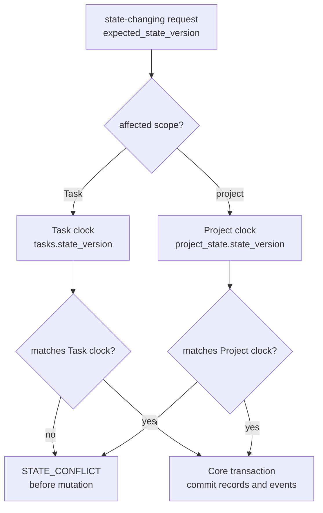
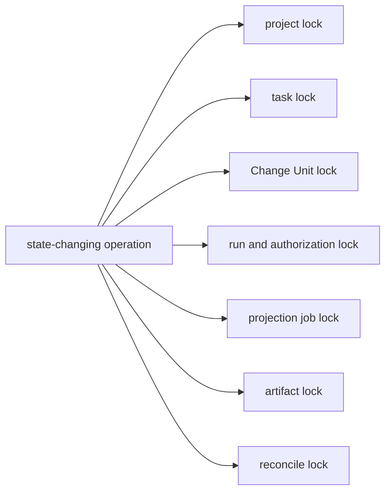
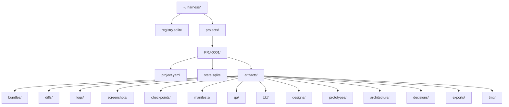
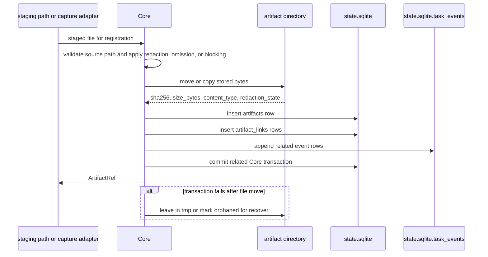
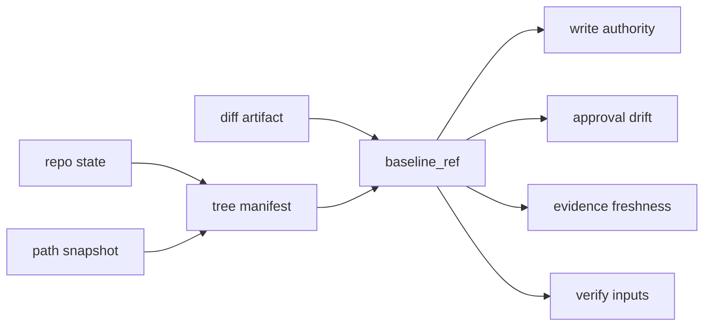
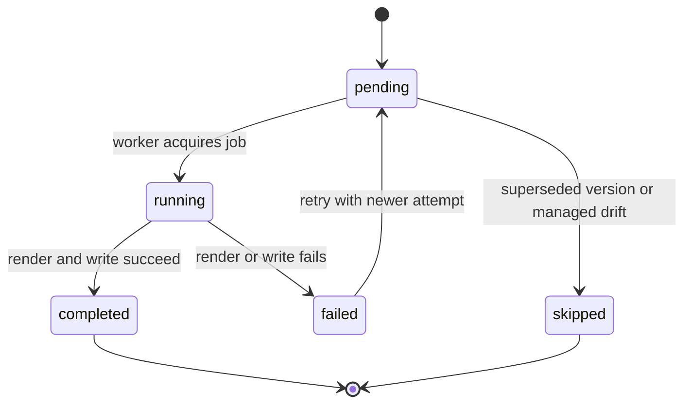
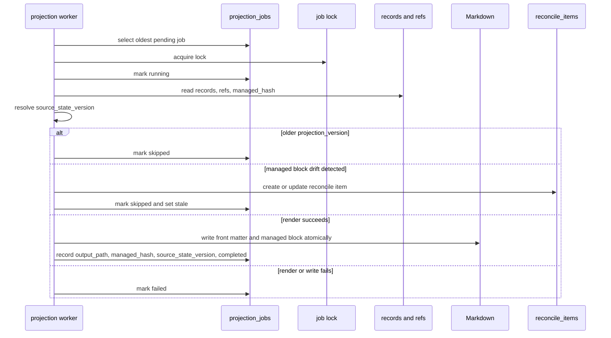
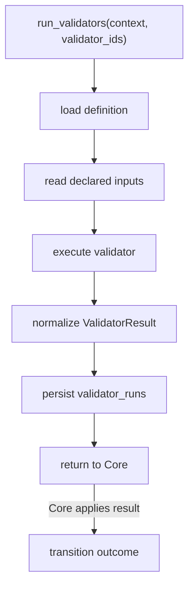

# Storage And DDL

## What this document helps you do

Use this reference to implement or review the Harness runtime storage model. It owns the runtime home layout, `registry.sqlite`, `project.yaml`, `state.sqlite`, `task_events`, staged DDL profiles, JSON `TEXT` validation, migrations, lock policy, artifact directory layout, baseline capture format, projection job table, and validator runner skeleton.

This is storage reference material. It does not define staged-pack sequencing; for stage order and exit criteria, see [Build: MVP Plan](../build/mvp-plan.md).

This is reference documentation for future Harness behavior. Current repository phase and implementation handoff status are tracked in [Implementation Overview](../build/implementation-overview.md#documentation-acceptance-status).

## Read this when

- You need the exact reference storage layout or staged DDL profiles.
- You are checking which table owns a persisted state record.
- You are validating JSON `TEXT` fields, enum-like `TEXT` fields, locks, migrations, artifacts, baselines, or projection jobs.
- You are keeping API schemas separate from storage implementation details.

## Before you read

Use [MCP API And Schemas](mcp-api-and-schemas.md) for public request/response contracts, [Kernel Reference](kernel.md) for lifecycle and gate values, [Conformance Fixtures Reference](conformance-fixtures.md) for fixture semantics, and [Operations And Conformance Reference](operations-and-conformance.md) for operator behavior.

## Main idea

Storage gives Harness durable local records, but it does not become a second authority model. Public API shapes, kernel transitions, projection rules, and operator semantics stay with their owner documents while this page owns the storage layout and staged DDL profiles.

## Contract map

| If you need... | Start here | Related owner |
|---|---|---|
| Runtime home and local file posture | [Runtime home layout](#runtime-home-layout), [Runtime home permissions and tampering](#runtime-home-permissions-and-tampering) | Operator reporting stays in [Operations And Conformance Reference](operations-and-conformance.md#doctor). |
| Storage DDL | [Staged DDL profiles](#staged-ddl-profiles), then [DDL Section Map](#ddl-section-map) | Public API shapes stay in [MCP API And Schemas](mcp-api-and-schemas.md). |
| Storage-owned JSON and enum hardening | [Storage hardening as an authority boundary](#storage-hardening-as-an-authority-boundary), [JSON TEXT validation](#json-text-validation), [Canonical enum hardening](#canonical-enum-hardening) | Kernel values stay in [Kernel Reference](kernel.md). |
| Migrations and locks | [Migrations](#migrations), [Lock policy](#lock-policy) | Operator recovery semantics stay in [Operations And Conformance Reference](operations-and-conformance.md#recover). |
| Artifact storage and registration | [Artifact directory layout](#artifact-directory-layout), [Artifact Kind Storage Notes](#artifact-kind-storage-notes), [Artifact Registration Contract](#artifact-registration-contract) | Artifact API refs stay in [ArtifactRef](mcp-api-and-schemas.md#artifactref). |
| Baselines and verification bundles | [Baseline capture format](#baseline-capture-format), [Verification Bundle Shape](#verification-bundle-shape) | Verification and close gate behavior stay in [Kernel Reference](kernel.md#verification-gate). |
| Projection jobs and worker behavior | [Projection job table](#projection-job-table), [Projection Worker Execution](#projection-worker-execution) | Projection rules stay in [Document Projection Reference](document-projection.md). |
| Validator-run storage and fixture seed-loader expectations | [Validator runner skeleton](#validator-runner-skeleton), [Evidence and Verification Profile Implementation Notes](#evidence-and-verification-profile-implementation-notes) | Stable `ValidatorResult` shape stays in [MCP API And Schemas](mcp-api-and-schemas.md#validatorresult); fixture assertions stay in [Conformance Fixtures Reference](conformance-fixtures.md#fixture-assertion-semantics). |

## Storage model in plain language

Harness keeps one global runtime registry and one local state database per registered project. The registry says which projects and surfaces exist. `project.yaml` stores static project configuration. `state.sqlite` stores the active profile's canonical current records, append-only task events, idempotency replay rows, and artifact registry rows. Later profiles add tables such as projection jobs and validator run results only when their owner path is in scope.

Storage fields are reference-contract fields, not all first-slice requirements. This document owns the storage shape whenever an owner path uses it; [Build: MVP Plan](../build/mvp-plan.md#contract-field-staging) owns when a capability enters the staged delivery plan. v0.1 Core Authority Slice needs only the storage needed for local project registration, one Task, one scoped work boundary, one Write Authorization, one Run, one artifact/evidence ref, and one structured status/blocker response. A stage may defer a capability, but once it stores that record family it must satisfy the DDL, storage-owned JSON validation, and owner-bound value rules defined here.

Public API shapes are owned by [MCP API And Schemas](mcp-api-and-schemas.md). Storage-owned DDL and storage-only JSON validation are owned here.

## Reference scope

This document owns:

- runtime home layout
- `registry.sqlite`
- `project.yaml`
- `state.sqlite`
- `task_events`
- staged DDL profiles
- JSON `TEXT` validation for storage-owned fields
- canonical enum hardening
- migrations
- lock policy
- artifact directory layout
- baseline capture format
- projection job table
- validator-run storage
- storage-owned compatibility details that DDL and fixture seed loaders need

## Not covered here

This document does not own:

- public MCP request/response schema; see [MCP API And Schemas](mcp-api-and-schemas.md)
- public API error taxonomy; see [MCP API And Schemas](mcp-api-and-schemas.md)
- full kernel lifecycle transition table; see [Kernel Reference](kernel.md)
- design-quality policy contracts; see [Design Quality Policies](design-quality-policies.md)
- projection template bodies; see [Template Reference](templates/README.md); projection rules live in [Document Projection Reference](document-projection.md)
- staged-pack sequencing and exit criteria; see [Build: MVP Plan](../build/mvp-plan.md)
- operator command semantics; see [Operations And Conformance Reference](operations-and-conformance.md)
- connector capability profiles; see [Agent Integration Reference](agent-integration.md)
- surface recipes; see [Surface Cookbook](surface-cookbook.md)

## Runtime home layout

Reference layout:

```text
~/.harness/
  registry.sqlite
  projects/
    PRJ-0001/
      project.yaml
      state.sqlite
      artifacts/
        bundles/
        diffs/
        logs/
        screenshots/
        checkpoints/
        manifests/
        qa/
        tdd/
        designs/
        prototypes/
        architecture/
        decisions/
        exports/
        tmp/
```

### Runtime home permissions and tampering

Runtime Home should be treated as user-private local control data. At the documentation-contract level, the current reference baseline is owner-only access, or the closest platform equivalent, for the runtime root, project directories, `registry.sqlite`, `project.yaml`, `state.sqlite`, connector manifests, artifact directories, `artifacts/tmp/`, and generated operational files when the platform supports it. If a platform or deployment cannot express those permissions, `doctor` should report the weaker or unknown posture instead of implying an OS-level guarantee.

File permissions are defense in depth, not a second state model. A database row, artifact file, connector manifest, or generated file is authoritative only through Core validation, storage shape checks, owner/link checks, artifact integrity checks, or the documented `doctor`, `recover`, and `artifacts check` paths. Broad write access to Runtime Home is a local tampering and artifact-poisoning risk; broad read access can expose secrets, PII, tokens, private logs, screenshots, verification bundles, and exported state. The storage layer supplies the observed owner/mode/path facts; Operations owns the `OK`, `WARN`, `FAIL`, and `MANUAL` severity mapping.

Permission diagnostics should be concrete enough for an operator to act on:

| Observation | Diagnostic meaning |
|---|---|
| Platform cannot determine owner or mode for Runtime Home, a project directory, or `artifacts/tmp/`. | `doctor` reports unknown or weak local file posture with the affected path class. This is not a state failure by itself, but it lowers the security guarantee until the posture is understood. |
| Runtime Home or project storage is writable by unrelated users, groups, shared containers, or broad local processes. | `doctor` reports a tampering risk and may fail write-capable readiness. Core still validates rows, events, owner links, hashes, and artifact registration before accepting meaning. |
| Artifact storage is readable by unrelated users, groups, shared containers, or broad local processes. | `doctor`, export, and operation reports describe the confidentiality risk for logs, screenshots, tokens, PII, verification bundles, and exports without echoing sensitive values. |

## Staged DDL profiles

The reference storage uses SQLite for registry and per-project state. The DDL is organized into staged schema profiles so an implementer can build the smallest authority slice first without treating every future support table as a v0.1 requirement. Field names may gain indexes or migration helpers, but table ownership and authority boundaries should remain stable once a profile is implemented.

`required` in this section always means required for the named profile or capability. It does not mean every table in this reference is required for v0.1 Core Authority Slice. v0.1 storage is the first profile below: project registration, Task state, gates/status, one scoped work boundary, durable Write Authorizations, Runs, artifact refs and links, append-only events, and idempotency replay rows. Later profiles add user-facing decisions, residual risk, assurance records, projection/reconcile operations, and diagnostics only when their staged owner path is in scope.

`task_spine_entries` is the current reference table for public `journey_spine_entry` records and Journey Spine Entry wording. Public MCP/API naming remains `journey_spine_entry`; the table name preserves the task-local implementation shape.

### DDL Section Map

| Storage area | Go to | Look here for... |
|---|---|---|
| Storage hardening | [Storage hardening as an authority boundary](#storage-hardening-as-an-authority-boundary), [JSON TEXT validation](#json-text-validation), [Canonical enum hardening](#canonical-enum-hardening) | value validation and owner-bound enum-like `TEXT` fields |
| Project config | [`project.yaml`](#projectyaml) | static project defaults, policies, and surface config |
| Schema profiles | [Schema profile metadata](#schema-profile-metadata) | the staged table groups, introduced profile, required-for scope, and authority role |
| Core Authority Slice schema | [Core Authority Slice schema](#core-authority-slice-schema) | v0.1 minimum registry and `state.sqlite` tables |
| User-Facing Harness MVP schema | [User-Facing Harness MVP schema](#user-facing-harness-mvp-schema) | Decision Packet, residual-risk visibility, and user-facing design support records |
| Agency Assurance schema | [Agency Assurance schema](#agency-assurance-schema) | baseline, approval, evidence, Eval, Manual QA, feedback-loop, TDD, and validator records |
| Operations schema | [Operations schema](#operations-schema) | connector manifests, projection jobs, reconcile items, and persistent locks |
| Future / diagnostic schema | [Future / diagnostic schema](#future-diagnostic-schema) | Journey Spine support and stewardship/context diagnostics |
| Event rows | [`task_events`](#task_events) | append-only event storage and stable-event owner boundary |

The fragments below are the profile contract. They are intentionally not presented as one giant early schema. An implementation may assemble multiple fragments once the corresponding stage is in scope; the assembled result is a profile-enabled reference, not the v0.1 minimum.

### Storage hardening as an authority boundary

Storage hardening is part of the Harness authority and security model. A row is not authoritative just because SQLite can store it; it must still match its owner schema, owner value set, state-version basis, idempotency replay key, and artifact owner/link contract.

`doctor`, `recover`, `artifacts check`, and conformance runners use these checks to decide whether state is current, invalid, repairable, or unsafe to trust. Malformed JSON, schema-incompatible JSON, unknown owner-bound status values, mismatched replay rows, stale state-version claims, connector manifest drift, projection status inconsistency, and artifact links outside the Task-scoped owner contract are storage integrity findings, not presentation issues. Recovery may repair only from canonical state, registered artifacts, or managed output already allowed by owner docs; otherwise it must fail or require manual intervention.

### JSON TEXT validation

JSON `TEXT` columns in the reference DDL are storage flexibility, not permission to persist arbitrary or partially parsed JSON. Before any Core commit writes or updates a JSON `TEXT` field, Core must parse the value, reject malformed JSON, and validate the parsed value against the field's owning shape.

For public API payloads and API-shaped stored payloads, the owning shape is the schema in [MCP API And Schemas](mcp-api-and-schemas.md). For storage-only fields, the owning shape is the reference storage contract in this document or the specific owner document named by this document. This boundary keeps public schemas in [MCP API And Schemas](mcp-api-and-schemas.md) and SQLite DDL in this document.

Public API schema validation and storage-owned JSON validation are separate checks even when a value flows through both. First validate the public request or response-shaped payload with the API [schema notation convention](mcp-api-and-schemas.md#schema-notation-convention), including required-vs-null-vs-omitted semantics. Then validate the stored JSON `TEXT` value against the storage owner shape and table/link constraints here. A SQLite column default such as `'{}'` or `'[]'` is a storage representation rule; it does not make a public API field optional, and it does not create a public extension field.

Malformed JSON is invalid state. Schema-incompatible JSON is invalid state. Fields with defaults such as `'[]'` or `'{}'` must continue to store valid JSON of the expected array or object shape, not a different JSON kind just because SQLite stores the column as `TEXT`. This includes storage-owned arrays such as `module_map_items.watchpoints_json`.

`doctor` should report malformed or schema-incompatible JSON as a state failure, not projection staleness or report drift. `recover` may rewrite that field only when the expected value can be reconstructed from other canonical state or registered raw artifacts without inventing user-owned judgment. Conformance seed loaders should reject such rows unless the fixture explicitly exercises invalid-state recovery.

Recommended hardening: where the deployed SQLite build supports JSON functions, migrations should add `CHECK (json_valid(column_name))` or equivalent generated checks for JSON `TEXT` columns. These checks are defense in depth and do not replace Core's shape validation before commit; the reference DDL below does not need a full rewrite to show every check inline.

### Canonical enum hardening

Canonical enum columns use `TEXT` in the reference DDL for readability, but they are not open strings. Core validation remains authoritative. Database checks, lookup-table validation, generated checks, and migration assertions are defense in depth and should first cover the state fields that drive write, close, replay, and projection behavior.

Profile-aware enum hardening targets:

| Field(s) | Owner/value source for hardening |
| --- | --- |
| `tasks.mode` | [Mode](kernel.md#mode). |
| `tasks.lifecycle_phase` | [Lifecycle Phase](kernel.md#lifecycle-phase) and the kernel transition table. |
| `tasks.result` | [Result](kernel.md#result) and [Close Semantics](kernel.md#close-result-semantics). |
| `tasks.close_reason` | [Close Reason](kernel.md#close-reason) and [Close Semantics](kernel.md#close-result-semantics). |
| `tasks.assurance_level` | [Assurance Level](kernel.md#assurance-level) and [Verification Gate](kernel.md#verification-gate). |
| `tasks.projection_status` | Optional Operations profile TASK projection freshness semantics in this document and [Document Projection Reference](document-projection.md). |
| `task_gates.scope_gate` | [Scope Gate](kernel.md#scope-gate). |
| `task_gates.decision_gate` | [Decision Gate](kernel.md#decision-gate). |
| `task_gates.approval_gate` | [Approval Gate](kernel.md#approval-gate). |
| `task_gates.design_gate` | [Design Gate](kernel.md#design-gate). |
| `task_gates.evidence_gate` | [Evidence Gate](kernel.md#evidence-gate). |
| `task_gates.verification_gate` | [Verification Gate](kernel.md#verification-gate). |
| `task_gates.qa_gate` | [QA Gate](kernel.md#qa-gate). |
| `task_gates.acceptance_gate` | [Acceptance Gate](kernel.md#acceptance-gate). |
| `write_authorizations.status` | [Kernel `prepare_write` State Logic](kernel.md#prepare_write) and public `WriteAuthorizationSummary` in [MCP API And Schemas](mcp-api-and-schemas.md). |
| `decision_packets.status` | [Decision Gate Aggregate Recompute](kernel.md#decision-gate-aggregate-recompute) and public `DecisionPacket` in [MCP API And Schemas](mcp-api-and-schemas.md). |
| `manual_qa_records.result` | [QA Gate](kernel.md#qa-gate) and [`harness.record_manual_qa`](mcp-api-and-schemas.md#harnessrecord_manual_qa). |
| `evals.verdict` | [Verification Gate](kernel.md#verification-gate) and [`harness.record_eval`](mcp-api-and-schemas.md#harnessrecord_eval). |
| `projection_jobs.status` | Projection job/freshness semantics in this document and [Document Projection Reference](document-projection.md). |

For new tables or rebuild migrations, representative inline hardening is `status TEXT NOT NULL CHECK (status IN (...))`. Existing SQLite tables may need a table rebuild, a small lookup table checked by Core before commit, or a migration-time assertion that rejects unknown values before tightening. Do not invent database-only enum values; bind storage hardening to the owner value source.

Unknown owner-bound status values are invalid state or invalid fixture seed data unless a fixture explicitly tests recovery from invalid state. `doctor` reports them under the affected state, surface, projection, or connector category. Migrations must stop before tightening when unknown values are present instead of mapping them to fallback values that Kernel, API, or Storage does not own.

The table below is an owner map for additional status-like `TEXT` fields in the DDL. It names where storage validators, fixture seed loaders, and migration assertions must get the allowed values; it is not a second enum definition.

| Field(s) | Owner/value source for hardening |
| --- | --- |
| `project_surfaces.guarantee_level`, `write_authorizations.guarantee_level`, `validator_runs.guarantee_level` | Semantic meaning is owned by [Security Threat Model: Honest guarantee display](security-threat-model.md#honest-guarantee-display); connector/profile reporting is owned by [Agent Integration Guarantee Levels](agent-integration.md#guarantee-levels); runtime placement is summarized in [Runtime Architecture Guarantee Levels](runtime-architecture.md#guarantee-levels); public payload shape is reflected in [MCP API And Schemas](mcp-api-and-schemas.md). |
| `runs.kind` | `RecordRunRequest.kind` in [`harness.record_run`](mcp-api-and-schemas.md#harnessrecord_run). |
| `approvals.status` | Approval lifecycle semantics in [Approval Gate](kernel.md#approval-gate), plus the approval judgment payload in [`harness.record_user_judgment`](mcp-api-and-schemas.md#harnessrecord_user_judgment). |
| `decision_requests.judgment_route`, `decision_packets.judgment_route` | Public `judgment_route` values in [MCP API And Schemas](mcp-api-and-schemas.md#harnessrequest_user_judgment). |
| `decision_requests.display_depth`, `decision_packets.display_depth` | Public `display_depth` values in [MCP API And Schemas](mcp-api-and-schemas.md#harnessrequest_user_judgment). Display depth controls prompt depth and field validation; it does not create judgment authority by itself. |
| `decision_requests.judgment_category`, `decision_packets.judgment_category` | Public `judgment_category` values in [MCP API And Schemas](mcp-api-and-schemas.md#harnessrequest_user_judgment). These values group and explain judgments for users; they do not drive gate aggregation by themselves. |
| `evidence_manifests.status` | Evidence sufficiency semantics in [Evidence Gate](kernel.md#evidence-gate) and [Evidence Sufficiency Profiles](kernel.md#evidence-sufficiency-profiles). |
| `residual_risks.visibility_status` | Residual-risk visibility semantics in [Acceptance Gate](kernel.md#acceptance-gate) and public `ResidualRiskSummary` in [MCP API And Schemas](mcp-api-and-schemas.md). A summary-only `none` state must not be persisted on an existing residual-risk row unless the kernel owner explicitly allows it. |
| `validator_runs.status` | `ValidatorResult.status` in [ValidatorResult](mcp-api-and-schemas.md#validatorresult). |
| `projection_jobs.projection_kind` | API-owned `ProjectionKind` in [Shared Schemas](mcp-api-and-schemas.md#shared-schemas). |
| Projection fixture assertions such as `expected_projection` statuses | Operations fixture comparison semantics; these are not storage enum values unless the owning projection schema also defines them. |
| `feedback_loops.loop_kind`, `feedback_loops.status`, `tdd_traces.status` | `FeedbackLoopUpdate` and `TddTraceUpdate` in [`harness.record_run`](mcp-api-and-schemas.md#harnessrecord_run), plus the storage-specific Feedback Loop notes below. |
| `tool_invocations.status` | Reference idempotency/replay storage semantics in this document; it describes committed replay state only, not surface diagnostics. Its storage value is promoted below. |

The following current reference storage-owned value sets are promoted for fields whose existing owner docs and fixture examples already imply stable meaning, and for storage status fields whose owner-bound compatibility meanings are resolved here. These values are storage hardening values; they do not redefine API payload enums, kernel gate values, lifecycle phases, projection statuses, or optional-table requirements.

| Field(s) | Durable values | Compatibility meaning |
| --- | --- | --- |
| `runs.status` | `completed`, `interrupted`, `blocked`, `violation` | `completed` is a committed Run record that may support evidence, verification, QA, work acceptance, or close only through the normal owner refs and gates. Command failures remain in `runs.command_results_json` and related evidence, not in a separate Run status. `interrupted` is a committed recovery Run for an execution attempt that started or was observed but did not complete normally because of agent crash, session or tool interruption, abandoned session, or equivalent recovery condition. Captured diff/log artifacts on an interrupted Run are recovery evidence, not proof of successful completion. `interrupted`, `blocked`, and `violation` are deliberately committed recovery/audit Runs; they must not populate `runs.write_authorization_id` as consumed unless a compatible authorization was actually consumed, and they cannot satisfy evidence sufficiency, detached verification, QA, work acceptance, or close readiness. |
| `change_units.status` | `planned`, `active`, `completed`, `deferred`, `superseded` | `planned` is a shaped Change Unit that is not the Task's current active unit. `active` must match `tasks.active_change_unit_id` when the unit scopes current writes. `completed`, `deferred`, and `superseded` no longer scope new writes; they are close-compatible only under the kernel close rules for completed, explicitly deferred, or superseded Change Units. |
| `baselines.status` | `captured`, `stale` | `captured` records a baseline snapshot that can be used only while Core freshness checks still pass. `stale` means the baseline no longer matches the repository state or related approval/evidence/verification inputs for the operation that depends on it. |
| `connector_manifests.status` | `current`, `drifted` | `current` means the connector-managed file list and hashes match the manifest. `drifted` means generated file or managed-block drift was detected and must route through reconcile before overwrite. A missing manifest is reported by doctor/connect as absent state, not as a status value on an existing row. |
| `tool_invocations.status` | `committed` | A row exists only for a committed non-dry-run Core response that is replayable by idempotency key and request hash. Dry runs, malformed requests, pre-commit state conflicts, and changed request-hash replays do not create a new replay row. Idempotent replay returns the committed row without changing this status. |
| `decision_requests.status` | `open`, `linked`, `closed`, `expired`, `cancelled`, `superseded` | Optional routing/replay/handoff lifecycle only. `open` means the request metadata is still current for routing or staging. `linked` means the row points to a compatible canonical `decision_packet_id`; gate aggregation may consider the request only through that linked Decision Packet. `closed`, `expired`, `cancelled`, and `superseded` end the routing lifecycle without creating decision authority. A `decision_requests` row never satisfies `decision_gate`, sensitive-action Approval, work acceptance, waiver, residual-risk acceptance, or close by itself. |
| `residual_risks.status` | `open`, `accepted`, `mitigated`, `deferred`, `superseded` | Risk lifecycle and accepted-risk metadata status for the Residual Risk row. `open` is a current known risk. `accepted` means user residual-risk acceptance metadata is recorded on this row; residual-risk acceptance remains state/metadata on `residual_risks`, not a standalone accepted-risk record or work acceptance. `mitigated` means the risk has been addressed and should no longer be treated as current close-relevant risk unless another owner ref reopens it. `deferred` preserves follow-up visibility and close impact for later handling. `superseded` preserves history when a newer compatible risk record replaces it. `visibility_status` remains the separate residual-risk visibility field. |
| `task_spine_entries.status` | `current`, `superseded` | Journey Spine Entry records supplement reconstruction. `current` entries may appear in continuity views as current annotations. `superseded` entries remain historical support records but must not be presented as current journey facts. |
| `change_unit_dependencies.status` | `open`, `satisfied`, `blocked`, `deferred`, `superseded` | Dependency metadata for shaping, ordering, merge-risk visibility, and close impact. `open` means the dependency still applies. `satisfied` means the dependency condition is met. `blocked` means the dependency currently prevents compatible ordering or close readiness. `deferred` means the dependency has visible follow-up or close impact rather than being resolved now. `superseded` means another dependency or Change Unit shape replaces it. These values do not create a scheduler and do not authorize parallel implementation lanes. |
| `shared_designs.status` | `proposed`, `active`, `stale`, `deferred`, `superseded` | Shared Design is a design-support record. `active` is the current design basis for the affected scope. `proposed` is draft or shaping input and is not enough by itself to satisfy design policy. `stale` requires refresh, reconcile, or a new compatible design basis before relying on it. `deferred` and `superseded` preserve visibility without implying work acceptance, sensitive-action approval, or residual-risk acceptance. |
| `reconcile_items.status` | `pending`, `merged`, `rejected`, `converted_to_note`, `decision_created`, `deferred` | `pending` is an unresolved candidate created from human-editable input or generated/projection drift. The other values are the durable outcomes of the reconcile decision path: merge into accepted state, reject the proposal, preserve it as a note, create a Decision Packet, or defer with visible follow-up/close impact. |
| `domain_terms.status` | `active`, `conflict` | `active` is a usable canonical term. `conflict` records competing meanings or unresolved terminology that must remain visible to stewardship/design checks and cannot by itself authorize product use of the term. |
| `module_map_items.status` | `active` | `active` is the current usable state for a canonical Module Map Item. Missing, stale, or conflicting module knowledge is represented through reconcile items, projection freshness, validator findings, or gates rather than additional reference row statuses. |
| `interface_contracts.review_status` | `pending`, `reviewed` | `pending` means a contract row exists but required review/evidence has not yet satisfied the module/interface policy. `reviewed` means callers, compatibility impact, boundary tests, and related review evidence have been recorded; it does not by itself waive residual risk or override kernel gates. |

### `project.yaml`

`project.yaml` stores static project configuration only. It must not store current Task state.

```yaml
project_id: PRJ-0001
display_name: my-app
repo_root: /abs/path/to/my-app
default_agent_surface: reference

agent_surfaces:
  reference:
    enabled: true
    capability_profile_id: SURF-PROFILE-0001

default_checks:
  lint: []
  test: []
  build: []

design_quality:
  vertical_slice_default: true
  tdd_required_for: []
  manual_qa_default_for: []

network_policy:
  default_write: deny
  allowed_read_domains: []
  allowed_write_targets: []

secret_policy:
  env_allowlist: []
  allow_secret_access_without_approval: false
```

### Schema profile metadata

Schema profiles are additive. A later profile may reference earlier tables, but an earlier profile must not need later tables to boot or prove its exit criteria. If a later profile is installed at database creation time, it may use stronger foreign keys across profiles; when it is added by migration, Core validation or a table rebuild must provide the same owner/link guarantees.

| Profile | introduced_in | required_for | not_required_for | Authority role | Storage class |
|---|---|---|---|---|---|
| Core Authority Slice schema | v0.1 Core Authority Slice | local project registration, one active Task, scoped write boundary, `prepare_write`, single-use Write Authorization, `record_run`, one artifact/evidence ref, structured status/blockers | Decision Packet quality, Evidence Manifest, Manual QA, Eval, residual-risk acceptance, projections, reconcile, export/recover, Journey views | authoritative minimum Core state | state authority and artifact metadata |
| User-Facing Harness MVP schema | v0.2 User-Facing Harness MVP | user-owned judgments, user-visible residual-risk state, design-support context needed for ordinary users | v0.1 authority proof, full assurance hardening, projection renderer, operations handoff | authoritative user judgment and visible risk records | state authority |
| Agency Assurance schema | v0.3 Agency Assurance Pack | sensitive-action approval records, baselines, evidence coverage, verification, Manual QA, feedback-loop/TDD, validators | v0.1 minimum and ordinary v0.2 paths unless a scenario explicitly enables the profile | authoritative assurance, QA, waiver, and validator records | state authority and artifact-linked assurance metadata |
| Operations schema | v0.4 Operations & Handoff Pack | connector manifest drift, projection outbox, reconcile workflow, persistent locks, operator readiness | v0.1 authority proof and user-facing MVP value | operational support over Core state; projections stay derived | projection support and diagnostic/operational state |
| Future / diagnostic schema | v1+ or promoted diagnostic profile | Journey reconstruction and richer stewardship/context diagnostics when promoted | v0.1-v0.4 exit criteria unless owner docs promote them | supplemental records; not projection-as-authority | future-only or diagnostic state |

API/storage alignment is profile-gated. A public method can expose schema fields for later profiles without making the backing storage active earlier. If a method commits records from a profile, that profile's storage must be installed in the same or an earlier stage:

| API surface | Earliest storage profile needed for committed state | Storage boundary |
|---|---|---|
| v0.1 `harness.status`, `harness.prepare_write`, `harness.record_run`, minimal artifact/evidence refs | Core Authority Slice schema | No Decision Packet, Evidence Manifest, Manual QA, Eval, projection job, reconcile, validator-run, or Journey table is needed for the first authority loop. |
| v0.2 user-facing `harness.intake`, fuller `status`/`next`, Decision Packet prompts, residual-risk visibility, close-readiness display | User-Facing Harness MVP schema, plus Core Authority Slice schema | `decision_packets` and `residual_risks` become storage authority when those API profiles are committed. Persisted Markdown projection remains optional if status/next/card output satisfies the display path. |
| v0.3 verification, Manual QA, Approval, full evidence, feedback-loop/TDD, validator result profiles | Agency Assurance schema, plus earlier profiles | These API methods must not claim persisted assurance records unless the matching tables and artifact-link rules are installed. |
| v0.4 projection freshness, reconcile, recover/export/operator readiness, artifact integrity operations | Operations schema, plus earlier profiles | `projection_jobs`, `reconcile_items`, connector manifests, and locks are operations support over Core state; they do not replace Core-owned state or structured blockers. |
| v1+ promoted candidates | Future / diagnostic schema or a future owner profile | Add storage only after owner docs define exact authority, refs, retention/redaction, and conformance boundaries. |

### Core Authority Slice schema

The v0.1 minimum schema comes first because it is the only storage profile required for the first runnable internal authority loop. It intentionally excludes future-profile tables. Structured blocker/status output is computed from the authoritative rows below; v0.1 does not need a separate `blockers` table or a rendered projection to explain missing scope, missing write authority, or missing artifact/evidence support.

| Table or group | introduced_in | required_for | not_required_for | Authority role | Storage class |
|---|---|---|---|---|---|
| `projects`, `project_surfaces` | v0.1 | local project registration and minimal surface identity | connector marketplace, generated manifest drift | resolves project and surface context | state authority |
| `project_state`, `tasks`, `task_gates` | v0.1 | project clock, active Task, gate/status summary | full close semantics or work acceptance proof | authoritative current Task and status | state authority |
| `change_units` | v0.1 | scoped work boundary / minimal Change Unit equivalent | dependency graph, parallel orchestration | authoritative scope for product writes | state authority |
| `write_authorizations` | v0.1 | durable `prepare_write` allow decision | sensitive-action Approval, work acceptance | single-use write authority | state authority |
| `runs` | v0.1 | `record_run` and authorization consumption | Eval, Manual QA, verification verdicts | authoritative observed Run record | state authority |
| `artifacts`, `artifact_links` | v0.1 | registered ArtifactRef or evidence ref linked to the Run or owner relation | Evidence Manifest, export bundle, projection snapshot | artifact registry and owner-link authority | artifact metadata |
| `task_events` | v0.1 | minimal append-only event log | Journey Spine/Card | event ordering and audit support | state authority |
| `tool_invocations` | v0.1 | idempotency replay for committed Core tool calls | surface diagnostics or dry-run replay | durable replay identity | state authority |

<a id="registrysqlite"></a>

Core `registry.sqlite` fragment:

```sql
CREATE TABLE projects (
  project_id TEXT PRIMARY KEY,
  display_name TEXT NOT NULL,
  repo_root TEXT NOT NULL,
  repo_fingerprint TEXT NOT NULL,
  runtime_path TEXT NOT NULL,
  project_yaml_path TEXT NOT NULL,
  created_at TEXT NOT NULL,
  updated_at TEXT NOT NULL
);

CREATE TABLE project_surfaces (
  surface_id TEXT PRIMARY KEY,
  project_id TEXT NOT NULL REFERENCES projects(project_id),
  surface_kind TEXT NOT NULL,
  display_name TEXT NOT NULL,
  capability_profile_id TEXT NOT NULL,
  guarantee_level TEXT NOT NULL,
  enabled INTEGER NOT NULL DEFAULT 1,
  mcp_config_ref TEXT,
  last_seen_at TEXT,
  created_at TEXT NOT NULL,
  updated_at TEXT NOT NULL
);
```

<a id="statesqlite"></a>

Core `state.sqlite` fragment:

```sql
CREATE TABLE project_state (
  project_id TEXT PRIMARY KEY,
  state_version INTEGER NOT NULL,
  updated_at TEXT NOT NULL
);

CREATE TABLE tasks (
  task_id TEXT PRIMARY KEY,
  state_version INTEGER NOT NULL,
  mode TEXT NOT NULL,
  lifecycle_phase TEXT NOT NULL,
  result TEXT NOT NULL,
  close_reason TEXT NOT NULL,
  assurance_level TEXT NOT NULL,
  title TEXT NOT NULL,
  current_summary TEXT NOT NULL DEFAULT '',
  acceptance_criteria_json TEXT NOT NULL DEFAULT '[]',
  active_change_unit_id TEXT,
  active_run_id TEXT,
  created_at TEXT NOT NULL,
  updated_at TEXT NOT NULL
);

CREATE TABLE task_gates (
  task_id TEXT PRIMARY KEY REFERENCES tasks(task_id),
  scope_gate TEXT NOT NULL,
  decision_gate TEXT NOT NULL,
  approval_gate TEXT NOT NULL,
  design_gate TEXT NOT NULL,
  evidence_gate TEXT NOT NULL,
  verification_gate TEXT NOT NULL,
  qa_gate TEXT NOT NULL,
  acceptance_gate TEXT NOT NULL,
  waiver_json TEXT NOT NULL DEFAULT '{}',
  updated_at TEXT NOT NULL
);

-- In v0.1, task_gates is the minimal structured status/blocker record.
-- A gate field can report the current kernel value without installing the
-- later profile tables that harden that gate's full behavior.

CREATE TABLE change_units (
  change_unit_id TEXT PRIMARY KEY,
  task_id TEXT NOT NULL REFERENCES tasks(task_id),
  title TEXT NOT NULL,
  purpose TEXT NOT NULL,
  non_goals_json TEXT NOT NULL DEFAULT '[]',
  slice_type TEXT NOT NULL,
  autonomy_profile TEXT NOT NULL,
  agent_may_do_json TEXT NOT NULL DEFAULT '[]',
  user_judgment_required_json TEXT NOT NULL DEFAULT '[]',
  afk_stop_conditions_json TEXT NOT NULL DEFAULT '[]',
  end_to_end_path_json TEXT NOT NULL DEFAULT '{}',
  horizontal_exception_reason TEXT,
  follow_up_vertical_change_unit_id TEXT,
  allowed_paths_json TEXT NOT NULL DEFAULT '[]',
  allowed_tools_json TEXT NOT NULL DEFAULT '[]',
  allowed_commands_json TEXT NOT NULL DEFAULT '[]',
  allowed_network_json TEXT NOT NULL DEFAULT '[]',
  secret_scope_json TEXT NOT NULL DEFAULT '[]',
  sensitive_categories_json TEXT NOT NULL DEFAULT '[]',
  status TEXT NOT NULL,
  created_at TEXT NOT NULL,
  updated_at TEXT NOT NULL
);

CREATE TABLE write_authorizations (
  write_authorization_id TEXT PRIMARY KEY,
  task_id TEXT NOT NULL REFERENCES tasks(task_id),
  change_unit_id TEXT NOT NULL REFERENCES change_units(change_unit_id),
  basis_state_version INTEGER NOT NULL,
  intended_operation TEXT NOT NULL,
  intended_paths_json TEXT NOT NULL DEFAULT '[]',
  intended_tools_json TEXT NOT NULL DEFAULT '[]',
  intended_commands_json TEXT NOT NULL DEFAULT '[]',
  intended_network_json TEXT NOT NULL DEFAULT '[]',
  intended_secrets_json TEXT NOT NULL DEFAULT '[]',
  sensitive_categories_json TEXT NOT NULL DEFAULT '[]',
  guarantee_level TEXT NOT NULL,
  status TEXT NOT NULL,
  created_at TEXT NOT NULL,
  updated_at TEXT NOT NULL,
  expires_at TEXT,
  consumed_by_run_id TEXT,
  consumed_at TEXT
);

CREATE TABLE runs (
  run_id TEXT PRIMARY KEY,
  task_id TEXT NOT NULL REFERENCES tasks(task_id),
  change_unit_id TEXT,
  kind TEXT NOT NULL,
  actor_kind TEXT NOT NULL,
  surface_id TEXT NOT NULL,
  write_authorization_id TEXT REFERENCES write_authorizations(write_authorization_id),
  summary TEXT NOT NULL DEFAULT '',
  observed_changes_json TEXT NOT NULL DEFAULT '{}',
  command_results_json TEXT NOT NULL DEFAULT '[]',
  artifact_refs_json TEXT NOT NULL DEFAULT '[]',
  status TEXT NOT NULL,
  started_at TEXT NOT NULL,
  completed_at TEXT
);

CREATE TABLE artifacts (
  artifact_id TEXT PRIMARY KEY,
  task_id TEXT NOT NULL REFERENCES tasks(task_id),
  run_id TEXT,
  kind TEXT NOT NULL,
  relative_path TEXT NOT NULL,
  sha256 TEXT NOT NULL,
  size_bytes INTEGER NOT NULL,
  content_type TEXT NOT NULL,
  redaction_state TEXT NOT NULL CHECK (redaction_state IN ('none', 'redacted', 'secret_omitted', 'blocked')),
  produced_by TEXT NOT NULL,
  retention_class TEXT NOT NULL,
  created_at TEXT NOT NULL
);

CREATE TABLE artifact_links (
  artifact_link_id TEXT PRIMARY KEY,
  artifact_id TEXT NOT NULL REFERENCES artifacts(artifact_id),
  task_id TEXT NOT NULL REFERENCES tasks(task_id),
  record_kind TEXT NOT NULL,
  record_id TEXT NOT NULL,
  relation_kind TEXT NOT NULL,
  created_at TEXT NOT NULL
);

CREATE TABLE task_events (
  event_id TEXT PRIMARY KEY,
  event_seq INTEGER NOT NULL UNIQUE,
  task_id TEXT,
  state_version INTEGER NOT NULL,
  event_type TEXT NOT NULL,
  actor_kind TEXT NOT NULL,
  surface_id TEXT,
  request_id TEXT,
  idempotency_key TEXT,
  payload_json TEXT NOT NULL DEFAULT '{}',
  created_at TEXT NOT NULL
);

CREATE TABLE tool_invocations (
  invocation_id TEXT PRIMARY KEY,
  project_id TEXT NOT NULL,
  task_id TEXT,
  tool_name TEXT NOT NULL,
  request_id TEXT NOT NULL,
  idempotency_key TEXT NOT NULL,
  request_hash TEXT NOT NULL,
  response_json TEXT NOT NULL DEFAULT '{}',
  state_version INTEGER NOT NULL,
  status TEXT NOT NULL,
  created_at TEXT NOT NULL,
  completed_at TEXT,
  UNIQUE(project_id, tool_name, idempotency_key)
);
```

### User-Facing Harness MVP schema

This profile adds records needed for ordinary users to see pending judgments, work-acceptance separation, and residual-risk visibility. It is not required for v0.1. Projections may display these records later, but the projection text is not authority.

| Table or group | introduced_in | required_for | not_required_for | Authority role | Storage class |
|---|---|---|---|---|---|
| `decision_packets` | v0.2 | user-owned judgment, work acceptance, residual-risk acceptance path when enabled | v0.1 Core Authority Slice | canonical user judgment record | state authority |
| `decision_requests` | v0.2 optional | routing, interaction, replay, or handoff metadata for Decision Packets | gate satisfaction by itself, v0.1 | non-authoritative routing linked to `decision_packets` | state metadata |
| `residual_risks` | v0.2 | visible close-relevant risk and accepted-risk state when relevant | v0.1, no-risk summary-only `none` state | canonical residual-risk row | state authority |
| `shared_designs` | v0.2 optional | design-support context for user-facing trade-offs when enabled | v0.1, full stewardship map | design support basis | state authority |

```sql
CREATE TABLE decision_packets (
  decision_packet_id TEXT PRIMARY KEY,
  task_id TEXT NOT NULL REFERENCES tasks(task_id),
  change_unit_id TEXT,
  -- Optional compatibility ref; leave null when decision_requests is omitted.
  decision_request_id TEXT,
  judgment_route TEXT NOT NULL,
  display_depth TEXT NOT NULL,
  judgment_category TEXT NOT NULL,
  status TEXT NOT NULL,
  state_summary_at_request_json TEXT NOT NULL DEFAULT '{}',
  question TEXT NOT NULL,
  what_agent_may_decide_without_user_json TEXT NOT NULL DEFAULT '[]',
  -- Judgment payload containers; defaults are valid only when the selected route/depth allows empty, null, or branch-omitted detail.
  options_json TEXT NOT NULL DEFAULT '[]',
  recommendation_json TEXT NOT NULL DEFAULT '{}',
  affected_gates_json TEXT NOT NULL DEFAULT '[]',
  affected_acceptance_criteria_json TEXT NOT NULL DEFAULT '[]',
  deferral_consequence TEXT NOT NULL DEFAULT '',
  user_context_json TEXT NOT NULL DEFAULT '{}',
  approval_scope_json TEXT NOT NULL DEFAULT '{}',
  reconcile_item_id TEXT,
  affected_scope_json TEXT NOT NULL DEFAULT '{}',
  autonomy_boundary_json TEXT NOT NULL DEFAULT '{}',
  context_refs_json TEXT NOT NULL DEFAULT '[]',
  context_artifact_refs_json TEXT NOT NULL DEFAULT '[]',
  residual_risk_refs_json TEXT NOT NULL DEFAULT '[]',
  judgment_json TEXT NOT NULL DEFAULT '{}',
  superseded_by_decision_packet_id TEXT,
  expires_at TEXT,
  created_at TEXT NOT NULL,
  updated_at TEXT NOT NULL,
  decided_at TEXT
);

-- Optional compatibility/routing table for interaction, replay, or handoff metadata only.
-- decision_packet_id may remain null for routing/replay staging; unlinked rows are non-authoritative.
-- Gate aggregation may consider a row only through a linked compatible decision_packet_id.
CREATE TABLE decision_requests (
  decision_request_id TEXT PRIMARY KEY,
  decision_packet_id TEXT REFERENCES decision_packets(decision_packet_id),
  task_id TEXT NOT NULL REFERENCES tasks(task_id),
  change_unit_id TEXT,
  judgment_route TEXT NOT NULL,
  display_depth TEXT NOT NULL,
  judgment_category TEXT NOT NULL,
  status TEXT NOT NULL,
  prompt TEXT NOT NULL,
  -- Routing copy of judgment payload containers; unlinked rows remain non-authoritative.
  options_json TEXT NOT NULL DEFAULT '[]',
  recommendation TEXT,
  approval_scope_json TEXT NOT NULL DEFAULT '{}',
  reconcile_item_id TEXT,
  expires_at TEXT,
  decided_option_id TEXT,
  judgment_json TEXT NOT NULL DEFAULT '{}',
  note TEXT,
  waiver_reason TEXT,
  created_at TEXT NOT NULL,
  decided_at TEXT
);

CREATE TABLE residual_risks (
  residual_risk_id TEXT PRIMARY KEY,
  task_id TEXT NOT NULL REFERENCES tasks(task_id),
  change_unit_id TEXT,
  source_record_kind TEXT NOT NULL,
  source_record_id TEXT NOT NULL,
  related_decision_packet_id TEXT REFERENCES decision_packets(decision_packet_id),
  affected_scope_json TEXT NOT NULL DEFAULT '{}',
  affected_acceptance_criteria_json TEXT NOT NULL DEFAULT '[]',
  visibility_status TEXT NOT NULL,
  accepted_risk_json TEXT NOT NULL DEFAULT '{}',
  follow_up_requirement_json TEXT NOT NULL DEFAULT '{}',
  close_impact TEXT NOT NULL,
  status TEXT NOT NULL,
  created_at TEXT NOT NULL,
  updated_at TEXT NOT NULL,
  accepted_at TEXT
);

CREATE TABLE shared_designs (
  shared_design_id TEXT PRIMARY KEY,
  task_id TEXT REFERENCES tasks(task_id),
  change_unit_id TEXT,
  first_change_unit_id TEXT REFERENCES change_units(change_unit_id),
  title TEXT NOT NULL,
  design_kind TEXT NOT NULL,
  goal TEXT NOT NULL,
  non_goals_json TEXT NOT NULL DEFAULT '[]',
  acceptance_criteria_json TEXT NOT NULL DEFAULT '[]',
  status TEXT NOT NULL,
  scope_json TEXT NOT NULL DEFAULT '{}',
  assumptions_json TEXT NOT NULL DEFAULT '[]',
  resolved_questions_json TEXT NOT NULL DEFAULT '[]',
  domain_impact_refs_json TEXT NOT NULL DEFAULT '[]',
  module_impact_refs_json TEXT NOT NULL DEFAULT '[]',
  interface_impact_refs_json TEXT NOT NULL DEFAULT '[]',
  options_json TEXT NOT NULL DEFAULT '[]',
  selected_option_json TEXT NOT NULL DEFAULT '{}',
  rejected_options_json TEXT NOT NULL DEFAULT '[]',
  decision_packet_refs_json TEXT NOT NULL DEFAULT '[]',
  artifact_refs_json TEXT NOT NULL DEFAULT '[]',
  created_at TEXT NOT NULL,
  updated_at TEXT NOT NULL
);
```

### Agency Assurance schema

This profile hardens the user-facing path with baseline freshness, sensitive-action Approval records, evidence coverage, detached verification, Manual QA, feedback-loop/TDD discipline, and validator results. None of these tables is required for the v0.1 Core Authority Slice.

| Table or group | introduced_in | required_for | not_required_for | Authority role | Storage class |
|---|---|---|---|---|---|
| `baselines` | v0.3 | baseline freshness for approvals, evidence, verification, and guarded writes | v0.1 minimum | repository state basis | state authority |
| `approvals` | v0.3 | sensitive-action Approval lifecycle | generic user agreement, work acceptance, v0.1 | sensitive-action permission record linked to Decision Packet | state authority |
| `change_unit_dependencies` | v0.3 | dependency visibility and close impact | scheduler or parallel lanes, v0.1 | ordering and close-risk metadata | state authority |
| `evidence_manifests` | v0.3 | criteria-to-evidence coverage | single v0.1 artifact ref | evidence sufficiency owner | state authority |
| `evals` | v0.3 | verification outcome and independence | self-check or Manual QA | detached verification owner | state authority |
| `manual_qa_records` | v0.3 | human QA result and QA waiver linkage | automated browser capture as a substitute, v0.1 | Manual QA owner | state authority |
| `feedback_loops`, `tdd_traces` | v0.3 | selected feedback loop, TDD RED/GREEN/refactor evidence | v0.1 and ordinary v0.2 unless profile requires | design/stewardship support records | state authority |
| `validator_runs` | v0.3 | persisted validator results when assurance profile requires them | v0.1 status/blocker output | validator result record | diagnostic state |

```sql
-- Optional Agency Assurance profile columns. They are not part of the v0.1
-- Core Authority Slice and do not replace the owning assurance rows.
ALTER TABLE tasks ADD COLUMN latest_evidence_manifest_id TEXT;
ALTER TABLE tasks ADD COLUMN latest_eval_id TEXT;
ALTER TABLE tasks ADD COLUMN latest_manual_qa_record_id TEXT;
ALTER TABLE change_units ADD COLUMN validator_profile_json TEXT NOT NULL DEFAULT '[]';
ALTER TABLE change_units ADD COLUMN completion_conditions_json TEXT NOT NULL DEFAULT '[]';
ALTER TABLE change_units ADD COLUMN evaluator_focus_json TEXT NOT NULL DEFAULT '[]';
ALTER TABLE write_authorizations ADD COLUMN baseline_ref TEXT;
ALTER TABLE write_authorizations ADD COLUMN approval_refs_json TEXT NOT NULL DEFAULT '[]';
ALTER TABLE write_authorizations ADD COLUMN decision_packet_refs_json TEXT NOT NULL DEFAULT '[]';
ALTER TABLE runs ADD COLUMN baseline_ref TEXT;

CREATE TABLE baselines (
  baseline_ref TEXT PRIMARY KEY,
  task_id TEXT NOT NULL REFERENCES tasks(task_id),
  change_unit_id TEXT,
  repo_head TEXT NOT NULL,
  branch TEXT NOT NULL,
  dirty INTEGER NOT NULL,
  tree_hash TEXT NOT NULL,
  included_paths_json TEXT NOT NULL DEFAULT '[]',
  ignored_paths_json TEXT NOT NULL DEFAULT '[]',
  diff_artifact_id TEXT REFERENCES artifacts(artifact_id),
  status TEXT NOT NULL,
  created_at TEXT NOT NULL,
  updated_at TEXT NOT NULL
);

CREATE TABLE approvals (
  approval_id TEXT PRIMARY KEY,
  task_id TEXT NOT NULL REFERENCES tasks(task_id),
  change_unit_id TEXT,
  -- Optional compatibility ref; leave null when decision_requests is omitted.
  decision_request_id TEXT,
  decision_packet_id TEXT NOT NULL REFERENCES decision_packets(decision_packet_id),
  status TEXT NOT NULL,
  sensitive_categories_json TEXT NOT NULL DEFAULT '[]',
  allowed_paths_json TEXT NOT NULL DEFAULT '[]',
  allowed_tools_json TEXT NOT NULL DEFAULT '[]',
  allowed_commands_json TEXT NOT NULL DEFAULT '[]',
  allowed_network_targets_json TEXT NOT NULL DEFAULT '[]',
  secret_scope_json TEXT NOT NULL DEFAULT '[]',
  baseline_ref TEXT,
  expires_at TEXT,
  decision_note TEXT,
  created_at TEXT NOT NULL,
  decided_at TEXT
);

CREATE TABLE change_unit_dependencies (
  change_unit_dependency_id TEXT PRIMARY KEY,
  task_id TEXT NOT NULL REFERENCES tasks(task_id),
  change_unit_id TEXT NOT NULL REFERENCES change_units(change_unit_id),
  depends_on_change_unit_id TEXT NOT NULL REFERENCES change_units(change_unit_id),
  dependency_kind TEXT NOT NULL,
  status TEXT NOT NULL,
  merge_risk TEXT NOT NULL,
  visibility_note TEXT NOT NULL DEFAULT '',
  close_impact TEXT NOT NULL,
  rationale TEXT NOT NULL DEFAULT '',
  created_at TEXT NOT NULL,
  updated_at TEXT NOT NULL
);

CREATE TABLE evidence_manifests (
  evidence_manifest_id TEXT PRIMARY KEY,
  task_id TEXT NOT NULL REFERENCES tasks(task_id),
  change_unit_id TEXT,
  baseline_ref TEXT,
  criteria_json TEXT NOT NULL DEFAULT '[]',
  changed_files_json TEXT NOT NULL DEFAULT '[]',
  supporting_refs_json TEXT NOT NULL DEFAULT '[]',
  stale_if_json TEXT NOT NULL DEFAULT '[]',
  status TEXT NOT NULL,
  created_at TEXT NOT NULL,
  updated_at TEXT NOT NULL
);

CREATE TABLE evals (
  eval_id TEXT PRIMARY KEY,
  task_id TEXT NOT NULL REFERENCES tasks(task_id),
  change_unit_id TEXT,
  evaluator_run_id TEXT,
  target_run_id TEXT,
  verdict TEXT NOT NULL,
  checks_json TEXT NOT NULL DEFAULT '[]',
  evidence_reviewed_json TEXT NOT NULL DEFAULT '[]',
  independence_json TEXT NOT NULL DEFAULT '{}',
  blockers_json TEXT NOT NULL DEFAULT '[]',
  artifact_refs_json TEXT NOT NULL DEFAULT '[]',
  created_at TEXT NOT NULL
);

CREATE TABLE manual_qa_records (
  manual_qa_record_id TEXT PRIMARY KEY,
  task_id TEXT NOT NULL REFERENCES tasks(task_id),
  change_unit_id TEXT,
  qa_profile TEXT NOT NULL,
  performed_by TEXT NOT NULL,
  result TEXT NOT NULL,
  findings_json TEXT NOT NULL DEFAULT '[]',
  artifact_refs_json TEXT NOT NULL DEFAULT '[]',
  waiver_reason TEXT,
  waiver_decision_packet_id TEXT REFERENCES decision_packets(decision_packet_id),
  residual_risk_refs_json TEXT NOT NULL DEFAULT '[]',
  next_action TEXT NOT NULL,
  created_at TEXT NOT NULL
);

CREATE TABLE feedback_loops (
  feedback_loop_id TEXT PRIMARY KEY,
  task_id TEXT NOT NULL REFERENCES tasks(task_id),
  change_unit_id TEXT,
  loop_kind TEXT NOT NULL,
  loop_profile TEXT NOT NULL,
  planned_loop TEXT NOT NULL,
  selected_loop_refs_json TEXT NOT NULL DEFAULT '[]',
  execution_refs_json TEXT NOT NULL DEFAULT '[]',
  artifact_refs_json TEXT NOT NULL DEFAULT '[]',
  tdd_trace_refs_json TEXT NOT NULL DEFAULT '[]',
  manual_qa_record_refs_json TEXT NOT NULL DEFAULT '[]',
  evidence_manifest_refs_json TEXT NOT NULL DEFAULT '[]',
  status TEXT NOT NULL,
  waiver_reason TEXT,
  alternate_loop TEXT,
  created_at TEXT NOT NULL,
  updated_at TEXT NOT NULL
);

CREATE TABLE tdd_traces (
  tdd_trace_id TEXT PRIMARY KEY,
  task_id TEXT NOT NULL REFERENCES tasks(task_id),
  change_unit_id TEXT,
  status TEXT NOT NULL,
  red_refs_json TEXT NOT NULL DEFAULT '[]',
  green_refs_json TEXT NOT NULL DEFAULT '[]',
  refactor_refs_json TEXT NOT NULL DEFAULT '[]',
  non_tdd_justification TEXT,
  artifact_refs_json TEXT NOT NULL DEFAULT '[]',
  created_at TEXT NOT NULL,
  updated_at TEXT NOT NULL
);

CREATE TABLE validator_runs (
  validator_run_id TEXT PRIMARY KEY,
  task_id TEXT,
  change_unit_id TEXT,
  run_id TEXT,
  validator_id TEXT NOT NULL,
  validator_kind TEXT NOT NULL,
  status TEXT NOT NULL,
  guarantee_level TEXT NOT NULL,
  findings_json TEXT NOT NULL DEFAULT '[]',
  blocked_reasons_json TEXT NOT NULL DEFAULT '[]',
  created_at TEXT NOT NULL
);
```

### Operations schema

This profile supports operator readiness, managed-output drift, projection outbox processing, reconcile decisions, and persistent locking. Projection jobs are support for derived views; they never replace Core-owned state, events, artifact refs, or structured blockers.

| Table or group | introduced_in | required_for | not_required_for | Authority role | Storage class |
|---|---|---|---|---|---|
| `connector_manifests` | v0.4 | connector-managed file drift detection | v0.1 local project registration | manifest and drift facts for operations | diagnostic/operational state |
| `projection_jobs` | v0.4 | durable projection outbox and freshness metadata | v0.1 status/blocker output | derived-view job record, not authority | projection support |
| `reconcile_items` | v0.4 | managed-output or human-edit drift decisions | v0.1-v0.3 unless reconcile enabled | reconcile candidate/outcome record | operational state |
| `locks` | v0.4 | persistent cross-process coordination | single-process v0.1 proof | operation coordination, not product authority | diagnostic/operational state |

```sql
-- Optional Operations profile TASK projection summary caches. They are not part
-- of v0.1 and are never authority for the underlying Task state.
ALTER TABLE tasks ADD COLUMN projection_version INTEGER NOT NULL DEFAULT 0;
ALTER TABLE tasks ADD COLUMN projected_version INTEGER NOT NULL DEFAULT 0;
ALTER TABLE tasks ADD COLUMN projection_status TEXT NOT NULL DEFAULT 'unknown';

CREATE TABLE connector_manifests (
  manifest_id TEXT PRIMARY KEY,
  project_id TEXT NOT NULL REFERENCES projects(project_id),
  surface_id TEXT NOT NULL REFERENCES project_surfaces(surface_id),
  manifest_version INTEGER NOT NULL,
  generated_paths_json TEXT NOT NULL,
  managed_hash TEXT NOT NULL,
  capability_profile_json TEXT NOT NULL,
  status TEXT NOT NULL,
  created_at TEXT NOT NULL,
  updated_at TEXT NOT NULL
);

CREATE TABLE projection_jobs (
  projection_job_id TEXT PRIMARY KEY,
  task_id TEXT,
  projection_kind TEXT NOT NULL,
  target_ref TEXT NOT NULL,
  projection_version INTEGER NOT NULL,
  source_state_version INTEGER,
  status TEXT NOT NULL,
  attempts INTEGER NOT NULL DEFAULT 0,
  output_path TEXT,
  managed_hash TEXT,
  error_json TEXT NOT NULL DEFAULT '{}',
  created_at TEXT NOT NULL,
  updated_at TEXT NOT NULL
);

CREATE TABLE reconcile_items (
  reconcile_item_id TEXT PRIMARY KEY,
  task_id TEXT,
  source_kind TEXT NOT NULL,
  source_path TEXT,
  source_hash TEXT,
  target_record_kind TEXT,
  target_record_id TEXT,
  proposed_change_json TEXT NOT NULL DEFAULT '{}',
  status TEXT NOT NULL,
  judgment_json TEXT NOT NULL DEFAULT '{}',
  created_at TEXT NOT NULL,
  resolved_at TEXT
);

CREATE TABLE locks (
  lock_id TEXT PRIMARY KEY,
  scope TEXT NOT NULL,
  owner TEXT NOT NULL,
  acquired_at TEXT NOT NULL,
  expires_at TEXT NOT NULL,
  heartbeat_at TEXT NOT NULL
);
```

<a id="future-diagnostic-schema"></a>

### Future / diagnostic schema

These tables are reference shapes for promoted diagnostics, stewardship/context records, or Journey reconstruction. They are future-only for staging purposes unless an owner document promotes them with exit criteria and tests. They do not participate in v0.1 Core Authority Slice.

| Table or group | introduced_in | required_for | not_required_for | Authority role | Storage class |
|---|---|---|---|---|---|
| `task_spine_entries` | future / diagnostic | Journey Spine continuity when promoted | v0.1-v0.4 required exits | supplemental reconstruction record | future-only diagnostic |
| `domain_terms` | future / diagnostic | domain vocabulary stewardship when promoted | v0.1-v0.4 required exits | accepted term record if promoted | future-only diagnostic |
| `module_map_items` | future / diagnostic | module map stewardship when promoted | v0.1-v0.4 required exits | accepted module map item if promoted | future-only diagnostic |
| `interface_contracts` | future / diagnostic | interface contract stewardship when promoted | v0.1-v0.4 required exits | accepted interface review state if promoted | future-only diagnostic |

```sql
CREATE TABLE task_spine_entries (
  task_spine_entry_id TEXT PRIMARY KEY,
  task_id TEXT NOT NULL REFERENCES tasks(task_id),
  change_unit_id TEXT,
  sequence_no INTEGER NOT NULL,
  entry_kind TEXT NOT NULL,
  lifecycle_phase TEXT,
  actor_kind TEXT NOT NULL,
  source_record_kind TEXT,
  source_record_id TEXT,
  summary TEXT NOT NULL DEFAULT '',
  refs_json TEXT NOT NULL DEFAULT '[]',
  artifact_refs_json TEXT NOT NULL DEFAULT '[]',
  status TEXT NOT NULL,
  created_at TEXT NOT NULL,
  updated_at TEXT NOT NULL,
  UNIQUE(task_id, sequence_no)
);

CREATE TABLE domain_terms (
  domain_term_id TEXT PRIMARY KEY,
  term TEXT NOT NULL,
  meaning TEXT NOT NULL,
  code_representation TEXT,
  not_this_json TEXT NOT NULL DEFAULT '[]',
  related_terms_json TEXT NOT NULL DEFAULT '[]',
  source_ref TEXT,
  status TEXT NOT NULL,
  created_at TEXT NOT NULL,
  updated_at TEXT NOT NULL
);

CREATE TABLE module_map_items (
  module_map_item_id TEXT PRIMARY KEY,
  module_path TEXT NOT NULL,
  responsibility TEXT NOT NULL,
  public_interface_json TEXT NOT NULL DEFAULT '[]',
  dependencies_json TEXT NOT NULL DEFAULT '[]',
  internal_complexity TEXT NOT NULL DEFAULT '',
  test_boundary TEXT,
  owner_decision TEXT,
  watchpoints_json TEXT NOT NULL DEFAULT '[]',
  status TEXT NOT NULL,
  created_at TEXT NOT NULL,
  updated_at TEXT NOT NULL
);

CREATE TABLE interface_contracts (
  interface_contract_id TEXT PRIMARY KEY,
  name TEXT NOT NULL,
  owner_module TEXT NOT NULL,
  change_type TEXT NOT NULL,
  inputs_json TEXT NOT NULL DEFAULT '[]',
  outputs_json TEXT NOT NULL DEFAULT '[]',
  errors_json TEXT NOT NULL DEFAULT '[]',
  compatibility_impact TEXT NOT NULL,
  callers_impacted_json TEXT NOT NULL DEFAULT '[]',
  boundary_tests_json TEXT NOT NULL DEFAULT '[]',
  review_status TEXT NOT NULL,
  created_at TEXT NOT NULL,
  updated_at TEXT NOT NULL
);
```

Current reference TDD discipline uses the Agency Assurance profile's `feedback_loops` and `tdd_traces` tables. `feedback_loops` owns the selected feedback loop and any alternate loop for a waiver; `tdd_traces` owns RED, GREEN, refactor/check artifacts, and non-TDD justification. Evidence Manifest rows remain the coverage owner for acceptance criteria and changed files. None of these tables is part of the v0.1 minimum unless a later owner profile is deliberately enabled.

`project_state.state_version` is the project-scoped state clock. Core initializes exactly one `project_state` row for the registered project during runtime bootstrap, before any project-scoped mutation can compare `expected_state_version` with `project_state.state_version`.

`tasks.state_version` is the task-scoped state clock. After exact idempotent replay has been ruled out, Task-scoped mutations compare `expected_state_version` with the Core-resolved primary Task's `tasks.state_version`; project-scoped mutations with no resolved primary Task compare it with `project_state.state_version`.

For a new mutation attempt with no committed replay row for the supplied idempotency scope, the state-version check prevents stale authority, not just concurrent writes. A stale `expected_state_version` means the request is based on an older Task or project view; accepting it could let outdated scope, approval, evidence, projection, artifact, or user-judgment context override newer authority. Core returns `STATE_CONFLICT` before mutation, before artifact registration, before projection enqueue, and before creating a `tool_invocations` replay row for that conflicting new request.



`task_events` remains append-only event history inside `state.sqlite`; reference storage does not introduce a separate event store. `task_events.event_seq` is the deterministic global append sequence for all events in the database. Core allocates it under the same write transaction as the state change, and API event lists, conformance ordering, and future diagnostic Journey reconstruction use ascending `event_seq`, never timestamps. `task_events.state_version` records the resulting version for the affected scope. For task events this is `tasks.state_version`; for project-level events with `task_id=null` this is `project_state.state_version`. Multiple events may share an affected-scope `state_version`; `event_seq` still defines their order.

`tool_invocations` stores request replay metadata needed to return the original committed response. Only committed, non-dry-run tool calls create or update `tool_invocations`; `dry_run=true` creates no replay row and does not consume the idempotency key for authoritative replay. Non-authoritative diagnostics, if an implementation keeps them, must not be stored in `tool_invocations` or used to replay state-changing responses. `tool_invocations.request_hash` stores the canonical request hash defined by the MCP API idempotency rules: canonical JSON, UTF-8, `tool_name`, schema-normalized request body and optional fields, sorted object keys, schema-ordered arrays unless explicitly order-insignificant, NFC Unicode strings, and envelope coverage that excludes only `request_id` and `idempotency_key`. `tool_invocations.state_version` stores the same primary affected-scope version returned in `ToolResponseBase.state_version`: Task State Version when Core resolves a primary Task, otherwise Project State Version. Reusing an idempotency key with a different `request_hash` returns `STATE_CONFLICT`.

Replay lookup uses the committed row before current state-version freshness for the same idempotency scope. If the stored `request_hash` matches, Core returns the original committed response as replay of an already committed result; it does not re-run current `expected_state_version` checks, append events, register artifacts, enqueue projections, alter owner relations, or update the replay row even if current state has advanced. If the hash differs, the mismatch is a storage safety signal: the caller is trying to reuse a mutation key for a different request body, artifact input set, envelope authority basis, or owner relation. Core must return `STATE_CONFLICT`, preserve the original committed replay row, and avoid merging the new payload into the old response.

When the Operations profile installs optional TASK projection summary caches, `tasks.projection_version` is the TASK projection/template/job version used to prevent older TASK renders from replacing newer ones. It is not a state clock. `tasks.projected_version` is only the TASK projection summary cache of the last rendered source state version. It must not be treated as the storage location for every task-related `ProjectionKind`.

`tasks.projection_status`, when installed by the Operations profile, is the TASK projection status summary. Per-kind projection freshness is tracked through `projection_jobs.source_state_version`, job status, managed hashes, and the relevant projection records or artifact refs for API-owned projection kinds enabled by the active support class or profile. These are staged support labels, not v0.1 Core Authority Slice scope: v0.1 has no projection-rendering exit requirement beyond preserving any owner-produced freshness/read facts, while v0.2 User-Facing Harness MVP provides enough derived summary or card output for users to understand current status, judgment, evidence, close readiness, sensitive-action approval, work acceptance, residual-risk visibility, and residual-risk acceptance when relevant. Optional, future, or diagnostic projection kinds are tracked only when enabled. `APR` freshness starts from committed Approval records and their approval-shaped Decision Packets, not from non-mutating `approval_request_candidate` payloads. Do not treat one Task field as owning all projection freshness.

`write_authorizations` stores durable `prepare_write` allow decisions. The allow/block contract is owned by [Kernel `prepare_write` State Logic](kernel.md#prepare_write) and the public response shape by [`harness.prepare_write`](mcp-api-and-schemas.md#harnessprepare_write). Storage-specific requirements are: each distinct committed non-dry-run allowed request inserts a distinct row; idempotent return is only replay of the same committed request under the same idempotency key, request hash, and compatible basis; `basis_state_version` stores the affected-scope state version used as the compatibility basis; `updated_at` changes whenever authorization status changes; and status history remains in `task_events`.

`basis_state_version` is stale-authority protection for writes. A Write Authorization created against one Task or project state version cannot be treated as permission after the affected scope, approval basis, evidence context, artifact refs, or user-judgment context changes. Kernel rules may stale, expire, or revoke old authorizations, but storage must not silently rebase an existing authorization onto a newer state version.

Stored `write_authorizations` rows require non-null `basis_state_version`, including rows inserted from conformance fixture seeds. A fixture runner may derive the field from the seeded affected-scope state version before insert, but the stored row must still contain the value and must not treat it as the post-transaction `ToolResponseBase.state_version`.

`record_run` consumption is stored by setting the reciprocal links `write_authorizations.consumed_by_run_id` and `runs.write_authorization_id` in one Core transaction. The unique partial index on `runs.write_authorization_id` enforces storage single-use for committed Runs; idempotent replay returns the original Run and response metadata instead of inserting another Run row. Rejected pre-commit `record_run` calls, such as missing Write Authorization before any Run is committed, do not insert a `runs` row and therefore have no storage Run ID to return; the nullable API `run_id` represents that absence without inventing a placeholder. Runs that attempt an invalid, stale, missing, consumed, or scope-exceeded authorization leave `runs.write_authorization_id` empty; attempted refs may be kept in validator findings, run violation payload, or `task_events.payload_json` for audit. Kernel-owned close and evidence consequences remain in [Kernel `record_run` State Logic](kernel.md#record_run).

`decision_packets` stores Decision Packet state records in the User-Facing Harness MVP profile and later profiles. It is not part of the v0.1 minimum schema. Once a profile stores a Decision Packet, `decision_packets.judgment_route`, `decision_packets.display_depth`, and `decision_packets.judgment_category` are current reference fields, not display-only prose. `judgment_route` is non-null and validates against the public route values. `display_depth` is non-null and validates against `simple`, `tradeoff`, `high-risk`, or `close-affecting`. `judgment_category` is non-null and validates against the public category values. The optional `decision_requests` table may be omitted even when Decision Packets are present, but if retained it must carry the same required route, depth, and category for request/routing parity. User-facing v0.2 display quality renders friendly labels from the stored values. `judgment_route` owns the internal owner path, recorded-answer route, resolution branch, gate meaning, and state-transition field. `display_depth` stores proportional display/validation depth. `judgment_category` stores the schema-owned user-visible judgment category used by projections and judgment displays. Neither `display_depth` nor `judgment_category` directly changes gate aggregation, approval behavior, waiver behavior, residual-risk acceptance, or close readiness unless a separate owner rule explicitly defines that effect.

The `decision_packets` columns for request-time state summary, question, agent latitude, affected gates, affected acceptance criteria, deferral consequence, user context, approval scope, reconcile item, affected scope, context refs, evidence/artifact refs, residual-risk refs, and expiry preserve the API/kernel-owned Decision Packet common fields and selected `judgment_payload` branch even when optional `decision_requests` rows are omitted. `question` stores the user-facing judgment question, and `affected_scope_json` stores the relevant scope object or explicit empty scope refs allowed by the route/depth. The wide JSON/text columns are route/depth-specific payload containers; their presence in DDL does not make recommendation, deferral analysis, deep user context, approval scope, reconcile item, acceptance context, waiver context, or residual-risk context semantically required for every packet. `expires_at` is the canonical expiry/timeout field for the Decision Packet when present. Gate aggregation, status/next, and close blockers read expiry from canonical Decision Packet state, not from an unlinked Decision Request row. `approval_scope_json` is meaningful only for `judgment_route=approve-sensitive-action`; non-approval packets store `{}` as the agreed absent/null representation, and approval packets must store a valid `ApprovalScope`. `reconcile_item_id` is populated only for reconcile judgments. Storage may keep richer nested API payloads inside JSON columns, but it must not drop common fields that every route/depth needs to explain the user judgment or prove related refs, and it must not drop the route-specific payload fields needed to recompute gates or prove acceptance/risk/waiver context was visible.

For nullable or route/depth-specific API fields stored in non-null JSON columns, storage uses explicit sentinels only where this paragraph allows them. `recommendation_json='{}'` is the canonical storage representation for `recommendation=null` or an omitted simple-prompt recommendation; a present recommendation must validate as `DecisionPacketRecommendation` with `option_id`, `reason`, `uncertainty`, and `when_to_revisit`. `display_depth=simple` may store `recommendation_json='{}'`, `options_json` containing concise option labels with `details=null` or empty detail arrays, `options_json='[]'` when no separate option list is material, `affected_acceptance_criteria_json='[]'`, compact or omitted `user_context_json` detail allowed by the API branch, and `deferral_consequence=''` when those details are not material to the concise judgment, but it must still preserve the question, `judgment_category`, `judgment_route`, `display_depth`, relevant scope, and related state/artifact refs. Higher-depth prompts must populate the selected branch fields required by the MCP route/depth rules before commit: product/UX and architecture trade-offs need detailed option payloads, recommendation or explicit no-recommendation reason, uncertainty, deferral consequence, user context, and evidence refs; `judgment_route=approve-sensitive-action` packets need valid `approval_scope_json`; waiver, work-acceptance, residual-risk acceptance, and reconcile packets need their corresponding context containers populated. `approval_scope_json='{}'` is the canonical storage representation for `approval_scope=null` only for non-approval Decision Packets; `judgment_route=approve-sensitive-action` requires a valid `ApprovalScope` object before commit. `state_summary_at_request_json` must be a real request-time `StateSummary` snapshot in committed canonical Decision Packet state, including `mode`, `lifecycle_phase`, `result`, `close_reason`, `assurance_level`, and the complete `gates` object. When the public request supplies `state_summary_at_request=null`, Core derives and stores that snapshot before commit. `user_context_json` must validate as `DecisionPacketUserContext` when the selected route/depth requires or supplies it; for `display_depth=simple` the arrays may be compact or the route/depth rules may omit deep context, while higher-depth prompts must include the minimum context needed for informed judgment. `{}` must not remain in committed canonical rows for `state_summary_at_request_json` except in explicit invalid-state recovery fixtures or pre-repair corrupt-state observations, and doctor/recover must report it as invalid state if found in ordinary committed rows. Other JSON columns with `{}` defaults are valid empty objects only when their owner schema defines an empty object as meaningful for the selected route/depth; otherwise seed loaders and Core validation must reject the committed row. Defaults such as `'{}'` and `'[]'` are therefore valid JSON defaults, not permission to commit arbitrary placeholder shapes.

`decision_requests` is an optional interaction/routing compatibility table for implementation handoff, replay, or compatibility request flow. It is not installed by the v0.1 minimum schema, and later profiles may still omit it along with its optional indexes and nullable compatibility fields. If retained, unlinked `decision_requests` rows remain non-authoritative routing metadata, approval links use `approvals.decision_packet_id`, and gate aggregation must consider `decision_requests` only through a linked compatible `decision_packet_id`. Approval rows require a linked `decision_packet_id`; the optional compatibility ref is `decision_request_id`, not the authority link. The decision gate and approval/acceptance/risk authority rules stay in [Kernel Decision Gate](kernel.md#decision-gate) and the related public tools in [MCP API And Schemas](mcp-api-and-schemas.md#public-tools).

Optional `decision_requests.expires_at` is routing and compatibility metadata only. It may help a surface expire a staged prompt or request handoff, but it does not replace `decision_packets.expires_at`, does not satisfy or clear `decision_gate`, and must not be used by close blockers unless the request row is linked to a compatible canonical Decision Packet whose own expiry state is current.

`residual_risks` stores residual-risk rows. Current reference accepted-risk identity is `residual_risk_id`; there is no separate `accepted_risks` table or `ARISK-*` canonical record. Accepted-risk metadata/state stays on `residual_risks.accepted_risk_json`, `status`, and `accepted_at`, while Decision Packets may reference rows through `decision_packets.residual_risk_refs_json`. Visibility and close semantics stay in [Close Semantics](kernel.md#close-result-semantics).

Work acceptance in the current reference model has no `acceptance_records` table. Acceptance is stored through the Decision Packet path, `task_gates.acceptance_gate`, and `state.sqlite.task_events`; the transition and payload rules are owned by [Kernel `close_task` State Logic](kernel.md#close_task) and [`harness.record_user_judgment`](mcp-api-and-schemas.md#harnessrecord_user_judgment). Close does not look for a separate acceptance row.

`module_map_items` stores the canonical Module Map Item: module role/responsibility, public interface, dependencies, internal complexity, test boundary, owner decision, and module-local watchpoints. `watchpoints_json` is a Core-validated JSON array of non-empty module-local watchpoint strings under the JSON field validation boundary above. Interface-specific caller impact and compatibility details stay in `interface_contracts`.

`feedback_loops` stores the selected Feedback Loop definition and its execution routing. `loop_kind` values are `test`, `typecheck`, `lint`, `build`, `browser_smoke`, `manual_qa`, `tdd`, `eval`, `operational`, or `alternate`. `loop_profile` classifies the chosen loop within that kind, and `planned_loop` describes the intended check. `status` values are `defined`, `executed`, `waived`, `blocked`, or `stale`. Create/update payloads come from `FeedbackLoopUpdate` in the MCP schema; `record_manual_qa` may update execution refs for an existing Manual QA feedback loop.

Core must validate every JSON ref array before commit. `selected_loop_refs_json` and `execution_refs_json` store `StateRecordRef` arrays; `tdd_trace_refs_json`, `manual_qa_record_refs_json`, and `evidence_manifest_refs_json` are restricted to their matching record kinds. `artifact_refs_json` stores committed `ArtifactRef` values resolved from the public update payload or related tool request. `operation=create` requires a non-empty `loop_kind`, `loop_profile`, `planned_loop`, and valid `status`; `feedback_loop_id` may be Core-assigned or caller-supplied for deterministic fixture/import creation and must be unique. `operation=update` requires an existing row with the same `task_id` and compatible `change_unit_id`; nullable scalar payload fields leave stored values unchanged, while ref arrays and artifact refs are additive. `status=waived` requires `waiver_reason` or a referenced compatible waiver/decision record. `status=executed` requires at least one resulting execution, artifact, TDD trace, Manual QA, or evidence manifest ref. `tdd_traces` remains the canonical red/green/refactor evidence record when TDD is selected; it does not replace the `feedback_loops` row. `feedback_loop_check` reads these records as a validator and does not add a new kernel gate.

`artifact_links` is the queryable many-to-many attachment table for artifacts. In the current Task-scoped artifact model, each row has a non-null `task_id` matching the registered artifact and the owner record's Task. v0.1 needs only links to the Task, Change Unit, Run, or other owner relation used by the minimal artifact/evidence ref. Later profiles may attach artifacts to profile-enabled owner records that are Task-scoped for the same `task_id`, such as `decision_packet`, `shared_design`, `residual_risk`, `evidence_manifest`, `feedback_loop`, `tdd_trace`, `manual_qa_record`, `eval`, `journey_spine_entry`, and `projection`. If an owner kind can also have project-scoped rows, those rows use their own state/projection metadata and are not artifact-link targets until a future extension adds project-scoped artifact storage/API. Exported files use artifact kinds or retention classes such as `export_component` and `retention_class=export`; they do not attach to an `export` state record unless a future extension deliberately adds a matching table, `StateRecordRef` value, and integrity semantics. Existing `artifact_refs_json` fields may preserve ordered or record-local context, but multi-record artifact reuse and artifact integrity checks should use `artifact_links`.

This Task-scoped link is an artifact-poisoning control. An `artifacts` registry row without the required compatible `artifact_links` row is not enough to satisfy evidence, QA, verification, projection, export, or close-related checks. A link that crosses Task scope, points at a missing owner, or uses an owner kind incompatible with the artifact kind must be rejected; ordered `artifact_refs_json` display context cannot override the registry plus owner-link checks.

For `artifact_links.record_kind=projection`, which is Operations-profile behavior, `artifact_links.record_id` stores `projection_jobs.projection_job_id`. The link is valid only when Core can resolve that job to the rendered projection output it links: the job is Task-scoped to the same `task_id` as the artifact link, has matching `projection_kind` and `target_ref`, has `status=completed`, and has an `output_path` or documented projection ref for the rendered output. `projection_jobs.target_ref` and `output_path` are validation and locator metadata, not replacements for `artifact_links.record_id`. Project-level projection jobs may still be tracked in `projection_jobs` where projection owner docs allow them, but the current Task-scoped artifact DDL does not create project-scoped artifact rows or artifact links for those jobs. This keeps current reference storage on `projection_jobs` and does not introduce a `projections` table.

`manual_qa_records.waiver_decision_packet_id` and `manual_qa_records.residual_risk_refs_json` are the storage hooks for QA waiver decisions and close-relevant risk refs. The waiver contract is owned by [Kernel Waiver Semantics](kernel.md#waiver-semantics) and the Manual QA policy in [Design Quality Policies](design-quality-policies.md#manual-qa-manual_qa).

`change_unit_dependencies` is current reference DAG metadata for shaping, ordering, and close visibility. It is not a parallel orchestration scheduler and does not authorize multiple active implementation lanes.

`baselines` stores BaselineCapture records in the Agency Assurance profile with repo head, branch, dirty flag, tree hash, included/ignored paths, optional diff artifact, and status. `baseline_ref` fields in other tables refer to `baselines.baseline_ref` only when that profile is installed; before then they are nullable compatibility fields validated by Core when present.

Recommended indexes are profile fragments too. Install only the indexes whose tables are present.

Core Authority Slice indexes:

```sql
CREATE INDEX idx_task_events_task_version ON task_events(task_id, state_version);
CREATE INDEX idx_task_events_task_seq ON task_events(task_id, event_seq);
CREATE INDEX idx_write_authorizations_task_status ON write_authorizations(task_id, status);
CREATE INDEX idx_write_authorizations_change_unit ON write_authorizations(change_unit_id);
CREATE INDEX idx_artifacts_task_run ON artifacts(task_id, run_id);
CREATE INDEX idx_artifact_links_artifact ON artifact_links(artifact_id);
CREATE INDEX idx_artifact_links_record ON artifact_links(record_kind, record_id);
CREATE INDEX idx_runs_task_status ON runs(task_id, status);
CREATE INDEX idx_runs_write_authorization ON runs(write_authorization_id);
CREATE UNIQUE INDEX uq_runs_write_authorization_consumed
ON runs(write_authorization_id)
WHERE write_authorization_id IS NOT NULL;
```

User-Facing Harness MVP indexes:

```sql
CREATE INDEX idx_decision_requests_task_status ON decision_requests(task_id, status); -- optional; omit when decision_requests is omitted
CREATE INDEX idx_decision_requests_packet ON decision_requests(decision_packet_id); -- optional; omit when decision_requests is omitted
CREATE INDEX idx_decision_packets_task_status ON decision_packets(task_id, status);
CREATE INDEX idx_residual_risks_task_status ON residual_risks(task_id, status);
CREATE INDEX idx_shared_designs_task_status ON shared_designs(task_id, status);
```

Agency Assurance indexes:

```sql
CREATE INDEX idx_feedback_loops_task_status ON feedback_loops(task_id, status);
CREATE INDEX idx_feedback_loops_change_unit ON feedback_loops(change_unit_id);
CREATE INDEX idx_change_unit_dependencies_task ON change_unit_dependencies(task_id, change_unit_id);
CREATE INDEX idx_baselines_task_change_unit ON baselines(task_id, change_unit_id);
CREATE INDEX idx_approvals_decision_packet ON approvals(decision_packet_id);
CREATE INDEX idx_evals_task_change_unit ON evals(task_id, change_unit_id);
CREATE INDEX idx_manual_qa_records_task_change_unit ON manual_qa_records(task_id, change_unit_id);
```

Operations indexes:

```sql
CREATE INDEX idx_projection_jobs_status ON projection_jobs(status, projection_version);
CREATE INDEX idx_reconcile_items_status ON reconcile_items(status);
```

Future / diagnostic indexes:

```sql
CREATE INDEX idx_task_spine_entries_task_seq ON task_spine_entries(task_id, sequence_no);
```

<a id="task_events"></a>

### `task_events`

`task_events` is append-only by application policy. `event_seq` is monotonically allocated and never reused. Recovery appends compensating events with new `event_seq` values; it should not rewrite historical rows or historical order.

Deterministic event order is ascending `task_events.event_seq`. `state_version` is an affected-scope concurrency/result clock, and `created_at` is audit metadata; neither field is sufficient for conformance ordering when several events share a state version or timestamp.

Reference event storage keeps stable events and non-stable detail or local-audit events as rows in `state.sqlite.task_events`; no separate event store is introduced. Fixture-assertable stable names, including Write Authorization lifecycle names and the relationship to `scope_violation_detected`, are owned by the [Kernel Stable Event Catalog](kernel.md#stable-event-catalog). Tool-specific event names outside that catalog are optional or illustrative extension events and must not be required by staged/reference fixtures.

## Migrations

Reference storage uses integer schema versions recorded in a small internal migration ledger:

```sql
CREATE TABLE schema_migrations (
  database_name TEXT NOT NULL,
  version INTEGER NOT NULL,
  applied_at TEXT NOT NULL,
  checksum TEXT NOT NULL,
  PRIMARY KEY (database_name, version)
);
```

Reference migrations must be forward-only. A failed migration leaves the project unavailable until doctor/recover reports whether the failure is repairable.

Storage hardening migrations should use this checklist before tightening tables or accepting imported fixture data:

- Validate every JSON `TEXT` field by parsing and checking the owner shape before adding SQLite JSON checks. Malformed or schema-incompatible values block the migration unless a documented recovery path can reconstruct the value without user-owned judgment.
- Assert owner-bound enum and status-like `TEXT` values before adding `CHECK` constraints, generated checks, or lookup validation. Cover write/close/replay/projection-driving fields first, and do not create database-only fallback values outside Kernel, API, or Storage ownership.
- Reconcile projection fields and jobs before tightening. `tasks.projection_status` is only the `TASK` summary; `projection_jobs.status`, `projection_jobs.projection_kind`, and `projection_jobs.source_state_version` carry per-job freshness and identity. Successful completed renders must have the source state version required by the projection contract.
- Check `connector_manifests.status` as an existing-row status only. Valid existing rows are `current` or `drifted`; a missing manifest remains absent connector state for `doctor` or connect diagnostics, not a new database enum value.
- Run fixture seed and import loaders through the same JSON, enum/status, state-version, idempotency, projection, connector-manifest, artifact registry, and artifact-link validation used by Core storage. Compact fixture shorthand must expand to valid owner records before insert.

## Lock policy

Persistent `locks` rows are Operations profile storage. The locking rules below still describe the reference coordination policy, but the v0.1 Core Authority Slice may prove the single-process authority loop without installing the persistent `locks` table.

State-changing operations acquire a lock at the narrowest practical scope:

| Operation | Lock scope |
|---|---|
| project registration | project |
| task intake/close | task |
| shaping update | task and affected Change Unit |
| decision packet create/resolve | task and affected Decision Packet |
| residual risk create/update/accept | task and affected residual risk |
| baseline capture | task and affected Change Unit |
| prepare_write | task and active Change Unit; write authorization when allowed |
| record_run | task and run; write authorization when one is consumed |
| projection render | projection job |
| artifact registration | artifact path |
| artifact link registration | artifact and target record |
| reconcile decision | reconcile item and affected task/design record |



If a lock is expired, the next operation may take it after appending a recovery event. For a non-replayed mutation attempt, if `expected_state_version` is stale for the relevant task or project scope, the operation returns `STATE_CONFLICT` before mutation.

## Artifact directory layout

Reference layout:

```text
~/.harness/
  registry.sqlite
  projects/
    PRJ-0001/
      project.yaml
      state.sqlite
      artifacts/
        bundles/
        diffs/
        logs/
        screenshots/
        checkpoints/
        manifests/
        qa/
        tdd/
        designs/
        prototypes/
        architecture/
        decisions/
        exports/
        tmp/
```

The layout lists all reference artifact areas so profile-enabled records have stable homes. A v0.1 implementation needs only the artifact directories required to register its minimal artifact/evidence ref; later directories may be created lazily when the matching profile is enabled.



Artifact filenames should include enough stable identity to avoid collisions:

```text
{task_id}/{run_id-or-record_id}/{artifact_id}-{kind}.{ext}
```

Markdown reports in the Product Repository are not raw artifacts by default. If an export needs a report snapshot, it can store that snapshot as an export component artifact while preserving the distinction between the report projection and raw evidence.

The artifact directory is not a general drop zone. The local layout is also a trust boundary. `state.sqlite`, `registry.sqlite`, and artifact files are authoritative only when they are reachable through the registered project layout and pass the owner, integrity, and shape checks owned by this document. Direct edits, copied artifact files, orphaned staging files, or manually changed connector state are not accepted as committed Harness meaning until Core, `doctor`, `recover`, or `artifacts check` validates or repairs them through the documented paths.

Files under `artifacts/tmp/` are staging inputs, not committed artifacts. A staged path becomes meaningful only when Core validates the path or capture adapter, writes the safe stored bytes under a registered artifact path, inserts the `artifacts` row, and links it to a same-Task owner in one committed transition.

### Artifact Kind Storage Notes

The `artifacts.kind` field names durable evidence files. It does not make the artifact file the owner of the corresponding state record.

| Artifact kind | Reference storage note |
|---|---|
| `design_probe` | Store exploratory design findings, sketches, or probe outputs under `artifacts/designs/`; accepted structure belongs in `shared_designs`, design support records, or Task/Change Unit state. |
| `prototype` | Store prototype diffs, screenshots, logs, or throwaway proof artifacts under `artifacts/prototypes/`; product code remains in the Product Repository and committed harness meaning remains in state records. |
| `architecture_scan` | Store module scans, dependency snapshots, boundary findings, or stewardship evidence under `artifacts/architecture/`; accepted module/interface facts remain in their owner records. |
| `decision_context` | Store compact context bundles for user judgment under `artifacts/decisions/`; Decision Packet status and outcome remain in `state.sqlite`. |
| `screenshot` / `qa_capture` / `log` | Store Manual QA screenshots, browser QA capture bundles, console logs, network traces, accessibility snapshots, or workflow recordings under the matching artifact area only after required redaction, omission, or blocking; the Manual QA record, Feedback Loop, Run, or Evidence Manifest remains the owner record. Automated browser capture is not required by the current reference model, and capture artifacts do not replace Manual QA judgment, acceptance, or detached verification. |
| `bundle` / `manifest` | Store verification bundles, evaluator instruction bundles, or artifact manifests under `artifacts/bundles/` or `artifacts/manifests/`; the owner remains an existing Task, Run, Evidence Manifest, Eval, or Task-scoped projection record. |
| `export_component` | Store export manifest files, projection snapshots, state snapshots, or allowed raw-file copies under `artifacts/exports/`; link them back to the existing owner records they describe, not to an `export` state table. |

### Artifact Registration Contract

Artifact registration is part of the Core transition that records the owner record, such as a Task, Run, Decision Packet context, Shared Design, Journey Spine Entry, Evidence Manifest, Eval, Manual QA record, Feedback Loop, TDD Trace, or rendered Task-scoped projection. Verification bundles and export components are artifact files linked to those owner records, not canonical `verification_bundle` or `export` state records.

Artifact registration is the storage boundary for artifact poisoning. A staged path, capture adapter output, file name, extension, declared content type, and requested owner relation are untrusted until registration validates the source, applies redaction, omission, or blocking, computes stored-byte integrity, and links the artifact to an existing Task-scoped owner record. A committed artifact requires the registered `ArtifactRef`, `artifacts` row, `sha256`, `size_bytes`, `redaction_state`, `retention_class`, and compatible `artifact_links` owner relation. A `staged_uri` from the API is only a locator into approved staging or capture output; it cannot bypass this boundary by naming an arbitrary absolute path, symlink target, parent traversal, or repo-local file.

For example, a staged path such as `../../repo/.env`, an absolute path under a user's home directory, or a symlink that escapes `artifacts/tmp/` is reported as outside the approved staging/capture boundary. The response or `artifacts check` report should identify the affected staged locator and boundary class, reject registration or mark the artifact input invalid through existing artifact/check/error paths, and avoid copying or hashing the forbidden target as Harness evidence.

Current reference registration steps:

1. Accept a connector-captured or operator-supplied file only from a canonical staging path under the project artifact `tmp/` directory or from an approved capture adapter.
2. Apply redaction, omission, or blocking before hashing. Raw secrets and disallowed PII must not be copied into durable artifact storage. Secret-related evidence is represented only as a redacted artifact, a safe secret handle or omission note, or an operator note that the relevant validator accepts.
3. Move or copy the stored bytes into the artifact directory using `{task_id}/{run_id-or-record_id}/{artifact_id}-{kind}.{ext}` under the matching kind directory.
4. Compute `sha256`, `size_bytes`, `content_type`, and `redaction_state` from the safe stored bytes. For `blocked`, those bytes are the metadata-only notice, not the forbidden capture payload.
5. Insert the `artifacts` row and required `artifact_links` rows in the same Core transaction that records the related state record and appends `task_events`.
6. Return an `ArtifactRef` whose `uri` resolves through the artifact registry row.
7. If the file move succeeds but the transaction fails, leave the file in `tmp/` or mark it orphaned for `recover`; do not create a committed artifact ref or artifact link.



`redaction_state` implementation:

| State | Stored artifact bytes | Storage consequence |
|---|---|---|
| `none` | original non-sensitive evidence | The hash and size cover the registered bytes. Raw inclusion in export or verification bundles still depends on retention and export policy. |
| `redacted` | redacted evidence; the unredacted original is not retained by the harness | The hash and size cover the redacted bytes only. |
| `secret_omitted` | evidence with secret values or PII omitted or replaced by handles | Omission notes or handles are stored; raw omitted values are not copied into artifact storage, projection snapshots, verification bundles, or export bundles. The hash, size, and content type cover only the safe stored bytes. |
| `blocked` | a small metadata-only notice artifact explaining that capture was blocked | No forbidden content is stored. The notice is still a committed registered artifact record when Core records it; `sha256`, `size_bytes`, and `content_type` cover the notice bytes. Owner records may keep the blocked ref for audit, but the artifact bytes are not available evidence. |

Evidence sufficiency, Manual QA, verification, projection, and export readers consume the committed `ArtifactRef` plus `redaction_state`, `retention_class`, hash, size, and owner relation. `secret_omitted` can support claims whose nonsecret evidence remains visible, but it cannot support claims that require the omitted bytes. `blocked` keeps the attempted capture visible for audit while leaving the related evidence, QA, verification, projection display, or export component blocked or insufficient until the owner flow records a replacement, waiver, Decision Packet outcome, or other documented resolution.

Artifact integrity failures return `ARTIFACT_MISSING` or a validator failure and mark related evidence, projection freshness, export readiness, or close readiness stale or blocked according to the kernel rules. Missing files and hash or size mismatches are not repaired by editing Markdown. Recovery may rescan, restore bytes that match the registered hash and size, or register a replacement artifact through Core; it must not rewrite the artifact row to bless different bytes without the documented registration path.

Owner validation is part of integrity, not a display convenience. An artifact that claims another Task, Run, projection job, Decision Packet, Evidence Manifest, Eval, Manual QA record, or other owner must be rejected unless the owner exists, is compatible with the artifact kind, and is in the same Task scope required by the artifact-link contract. Export components and verification bundles still link back to existing owners; they do not create standalone `export` or `verification_bundle` state records.

## Baseline capture format

Baseline capture is Agency Assurance profile storage. It records the repository state used by write, approval, evidence, and verification checks when that profile is in scope; it is not part of the v0.1 minimum schema.

Reference storage stores each capture in `baselines`; `baseline_ref` is the primary key used by Runs, approvals, evidence manifests, verification bundles, and validators. If a dirty diff is captured, `baselines.diff_artifact_id` points to the registered diff artifact and an `artifact_links` row attaches it to the baseline context.

```yaml
BaselineCapture:
  baseline_ref: BASE-0001
  project_id: PRJ-0001
  task_id: TASK-0001
  change_unit_id: CU-0001
  repo_root: /abs/path/to/repo
  vcs:
    kind: git
    head: string
    branch: string
    dirty: boolean
    diff_artifact_ref: ArtifactRef | null
  file_snapshot:
    included_paths: string[]
    ignored_paths: string[]
    tree_hash: string
  approval_scope_refs: string[]
  captured_at: string
```

Baseline is stale when relevant HEAD, dirty diff, allowed path contents, approval scope, or verification bundle inputs no longer match the captured baseline. Stale baseline can mark approval, evidence, or verification stale depending on the affected records. For verification, baseline drift prevents a launched bundle or Eval from supporting detached assurance until the changed inputs are re-bundled or explicitly reverified by a new compatible Eval.



`tree_hash` is computed from a deterministic tree manifest after ignore rules have excluded ignored paths. Each entry uses a normalized relative POSIX path with no leading `./`. Path strings are normalized to Unicode NFC before sorting and hashing, and paths are sorted after normalization. Regular file content is hashed as bytes exactly as stored, without line-ending normalization, and the entry includes the content hash, file size, and executable bit where available. Symlink entries hash the link target rather than dereferenced content unless the implementation explicitly disallows symlinks and records that exclusion or block. The final manifest is serialized canonically before hashing so equivalent snapshots produce the same `tree_hash`.

## Verification Bundle Shape

`harness.launch_verify` is Agency Assurance profile behavior. It creates a bundle artifact for detached verification or manual evaluator handoff. The bundle is raw evidence metadata, not an Eval verdict, and it is not required for v0.1.

Minimum bundle contents:

```text
verify-bundle/
  manifest.json
  task-summary.json
  change-unit.json
  baseline.json
  evidence-manifest.json
  approvals.json
  decision-packets.json
  residual-risks.json
  run-refs.json
  artifact-refs.json
  artifact-links.json
  design-refs.json
  journey-spine-entries.json
  evaluator-instructions.md
```



```mermaid
flowchart TD
  Bundle["verify-bundle/"]
  Manifest["manifest.json"]
  Task["task-summary.json"]
  CU["change-unit.json"]
  Baseline["baseline.json"]
  Evidence["evidence-manifest.json"]
  Approvals["approvals.json"]
  Decisions["decision-packets.json"]
  Risks["residual-risks.json"]
  Runs["run-refs.json"]
  ArtifactRefs["artifact-refs.json"]
  ArtifactLinks["artifact-links.json"]
  Designs["design-refs.json"]
  Spine["journey-spine-entries.json"]
  Instructions["evaluator-instructions.md"]

  Bundle --> Manifest
  Bundle --> Task
  Bundle --> CU
  Bundle --> Baseline
  Bundle --> Evidence
  Bundle --> Approvals
  Bundle --> Decisions
  Bundle --> Risks
  Bundle --> Runs
  Bundle --> ArtifactRefs
  Bundle --> ArtifactLinks
  Bundle --> Designs
  Bundle --> Spine
  Bundle --> Instructions
```

The manifest records task id, Change Unit id, baseline ref, source state version, included artifact ids, redaction summary, evaluator focus, and the expected independence context. The bundle may include copied raw artifacts when retention and redaction policy allow it; otherwise it includes artifact refs that the evaluator can resolve through the harness. Artifacts with `redaction_state=secret_omitted` or `redaction_state=blocked` remain represented by refs and redaction, omission, or block notes, not by hidden raw bytes.

A verification bundle is stale when its baseline ref, source state version, included artifacts, artifact links, Evidence Manifest, approval/Decision Packet refs, or close-relevant Residual Risk refs no longer match the Task state being verified. Staleness does not create a separate bundle state record or a new verification gate value. It means the bundle can remain registered as audit/evidence material, but it cannot support `assurance_level=detached_verified` until `harness.launch_verify` creates a replacement bundle or `harness.record_eval` records a compatible re-verification of the changed inputs.

Launching verification sets or keeps `verification_gate=pending`. Only `harness.record_eval` can record the verdict and update assurance.

## Projection job table

Projection jobs are Operations profile storage. They are the durable outbox between committed state and Product Repository Markdown files when projection support is enabled. The `projection_jobs` table above owns job persistence and the canonical per-projection `source_state_version` metadata, but it is not part of the v0.1 Core Authority Slice schema.

Reference storage does not define a separate `projections` table. A rendered projection ref resolves through `projection_jobs.projection_job_id` plus the row's `projection_kind`, `target_ref`, and `output_path` metadata.

`projection_jobs.projection_version` is the projection/template/job version; it is not an affected-scope state clock. `projection_jobs.source_state_version` is the affected-scope state clock used as the render source for that projection job. It may be null for pending jobs and jobs that fail before the source state is resolved; completed successful renders must record it.

Sensitive-approval projection jobs follow the APR source rule owned by the [APR Template](templates/approval.md#source-records) and [Document Projection Reference](document-projection.md#document-authority-matrix), plus the non-mutating candidate contract owned by [`harness.prepare_write`](mcp-api-and-schemas.md#harnessprepare_write): an `approval_request_candidate` may affect `TASK` display or blockers, but it is never an `APR` source. `APR` jobs start from committed approval state changes.

For staged support, v0.1 uses status/blocker output and does not require persisted Markdown projection support. Decision Packet visibility in later stages is rendered through status/next responses, judgment-context resources, decision-packet read resources, and minimal `TASK` or card displays. A standalone `DEC` projection is optional unless the standalone Decision Packet projection feature is enabled. Persisted `JOURNEY-CARD` Markdown is future/diagnostic; current-position context in status, next, and significant resume flows can be compact status output. This document does not define extension template text.

The job lifecycle below applies only when a projection job is enqueued because projection support for that kind is in scope. v0.1 has no full projection-rendering exit requirement. Stage sequencing and proof scope are owned by [Build: MVP Plan](../build/mvp-plan.md).

Projection job lifecycle:

```text
pending -> running -> completed
pending -> running -> failed -> pending
pending -> skipped
```



Rules:

- never render an older projection version over a newer one
- preserve human-editable sections
- compare managed hash before overwrite
- create a reconcile item for managed drift
- keep projection failure separate from Task result

`managed_hash` is computed only from the projector-owned managed block body after projector canonicalization; the `HARNESS:BEGIN` and `HARNESS:END` marker lines are excluded from the hash input. The projector normalizes line endings to LF before hashing and preserves meaningful whitespace according to the projection rules for that block. `managed_hash` is a drift-detection value; it does not make a Markdown projection canonical state.

### Projection Worker Execution

The reference projector executes pending jobs after the Core transaction commits.

Projection worker steps:



1. Select the oldest `pending` job for the target projection and acquire the projection-job lock.
2. Mark the job `running`, read the latest state records, artifact refs, and previous managed hash, and resolve `source_state_version` from the affected-scope state clock.
3. If the job's `projection_version` is older than the target's current projection/template/job version, mark it `skipped`.
4. Render the front matter and managed block from committed records and artifact refs, including `source_state_version`.
5. If the existing managed block hash differs from the last recorded hash, create or update a `reconcile_items` row, mark the job `skipped`, and set the projection status to `stale`.
6. Preserve human-editable sections and write the projection through a temporary file plus atomic rename.
7. Record the new managed hash, output path, `projection_jobs.projection_version`, `projection_jobs.source_state_version`, and `completed` status. For the `TASK` projection summary only, update `tasks.projected_version` with that same source state version as a Task-level summary cache.
8. On render or write failure, mark the job `failed`, keep state result unchanged, and surface projection freshness as `failed` or `stale`.

Projection refresh retries `failed` jobs by creating or resetting a `pending` job with a newer attempt count. It must not overwrite a projection whose managed block has drifted until reconcile resolves the drift.


## Validator runner skeleton

Reference validators are Agency Assurance profile behavior unless an owner document promotes a narrower validator earlier. They use one shared result shape from the API document. The runner is intentionally small, and persisted `validator_runs` are not part of the v0.1 minimum.

Reference validator rollout uses the [Reference Severity Defaults](design-quality-policies.md#reference-severity-defaults) matrix and its [Severity Composition Rule](design-quality-policies.md#severity-composition-rule) as the default severity router. The runner may initially implement shallow checks for each stable ID, but it must keep all relevant findings visible, merge their policy impacts through the policy-owned rule, and expose the merged outcome through gate/blocker-compatible results rather than by rewriting API finding severity. Public primary `ToolError` selection still follows API-owned [Primary Error Code Precedence](mcp-api-and-schemas.md#primary-error-code-precedence).

Minimal runner shape:

```text
run_validators(context, validator_ids):
  results = []
  for validator_id in validator_ids:
    load validator definition
    read only the state/artifact/repo inputs declared by the validator
    execute validator
    normalize output to ValidatorResult
    persist result in validator_runs
    results.append(result)
  return results
```



Agency Assurance Pack and Operations & Handoff Pack ValidatorResult IDs:

| Validator | Purpose |
|---|---|
| `decision_gate_check` | blocking Decision Packets are present, compatible, and resolved or validly deferred for the requested operation |
| `decision_quality_check` | Decision Packets include enough display-depth-appropriate context, options or chosen outcome, recommendation status when required, trade-offs when required, and affected-scope refs for user judgment |
| `autonomy_boundary_check` | intended work stays inside the active Change Unit Autonomy Boundary or routes to user judgment |
| `feedback_loop_check` | test, eval, QA, or operational findings have an explicit state route to rework, decision, risk, evidence, or close |
| `tdd_trace_required` | required TDD evidence or allowed waiver exists |
| `codebase_stewardship_check` | codebase health, module boundary, dependency, or maintainability concerns that need judgment are visible before write or close |
| `residual_risk_visibility_check` | close-relevant residual risks are recorded and visible before acceptance or risk-accepted close |
| `shared_design_alignment` | active Change Unit and runs align with the Shared Design contract or record a compatible decision |
| `vertical_slice_shape` | required vertical slice or exception is recorded |
| `domain_language_consistency` | domain-language terms that affect the change are consistent or routed to design judgment |
| `module_interface_review` | module/interface review requirement is met |
| `manual_qa_required` | required QA is passed or validly waived |
| `context_hygiene_check` | required context, projection freshness, managed hashes, and user-visible summaries are consistent enough for the requested operation |
| `surface_capability_check` | connected surface capability is sufficient for the requested operation or reported honestly through capability findings |

Core precondition checks such as active Task, active Change Unit, changed paths, approval scope, baseline freshness, artifact integrity, evidence sufficiency, verification independence, same-session verification guard, and projection freshness may still run before or beside these validators. They should not be emitted as alternate design/agency validator IDs in staged/reference conformance. Capability checks that emit `ValidatorResult` use the stable `surface_capability_check` ID; capability may also appear in blocked reasons and guarantee display without creating additional validator IDs.


Compatibility aliases:

| Older ID | Stable ID |
|---|---|
| `tdd_trace` | `tdd_trace_required` |
| `module_boundary_review` | `module_interface_review` |
| `docs_consistency` | `context_hygiene_check` |
| `projection_freshness` | `context_hygiene_check` |

These aliases are compatibility inputs for non-stable validator outputs or non-stable validator IDs only; staged/reference conformance must emit the stable IDs above. The `projection_freshness` alias maps alternate validator output to `context_hygiene_check`; staged/reference fixture assertions for mechanical projection freshness should use `expected_state.checks.projection_freshness`.

### Evidence and Verification Profile Implementation Notes

The evidence sufficiency precondition reads only committed records and registered artifacts from the profiles that are installed and relevant to the active scenario. Inputs can include Task, `task_gates`, Change Units, Decision Packets, Residual Risks, Shared Designs, Journey Spine Entries, Runs, approvals, Evidence Manifests, Evals, Manual QA records, artifacts, artifact links, and the relevant baseline ref. It computes whether the applicable Evidence Profile is absent, partial, sufficient, stale, or blocked, then updates or blocks through Core according to the kernel rules.

The verification independence precondition reads `evals.independence_json`, `evaluator_run_id`, `target_run_id`, evaluator and target `surface_id`, `baseline_ref`, bundle artifact refs, and `actor_kind`. It confirms whether the Eval profile is `same_session`, `subagent_context`, `fresh_session`, `fresh_worktree`, `sandbox`, or `manual_bundle`, and whether that profile can support detached assurance for the target close path.

No additional evidence/verification profile DDL is required beyond the staged profile fragments above. Existing JSON fields hold profile metadata when their table profile is installed: `change_units.autonomy_profile`, `change_units.agent_may_do_json`, `change_units.user_judgment_required_json`, `change_units.afk_stop_conditions_json`, `change_units.end_to_end_path_json`, `decision_packets.context_refs_json`, `decision_packets.context_artifact_refs_json`, `decision_packets.residual_risk_refs_json`, `residual_risks.accepted_risk_json`, `residual_risks.follow_up_requirement_json`, `evidence_manifests.criteria_json`, `evidence_manifests.supporting_refs_json`, `evidence_manifests.stale_if_json`, `evals.evidence_reviewed_json`, `evals.independence_json`, `evals.artifact_refs_json`, `runs.observed_changes_json`, `runs.command_results_json`, `runs.artifact_refs_json`, `approvals.*_json`, `manual_qa_records.findings_json`, `manual_qa_records.residual_risk_refs_json`, and `validator_runs.findings_json`.

If an implementation cannot derive an input above from existing fields, record an implementation decision before server coding that names the exact table, field, owner document, and stage impact before changing DDL.

Validator failure must be visible as state, blocked reasons, or close blockers. It must not be hidden in prose-only agent output.

Catalog-only fixture skeleton guidance in [Conformance Fixtures Reference](conformance-fixtures.md#catalog-only-fixture-skeleton-guidance) and detailed rows in [Future Fixture Catalog](future-fixture-catalog.md) use "minimum seeded records" as authoring guidance, not as a new storage schema. Seed loaders must expand those records into the tables, JSON `TEXT` fields, artifact files, and projection job rows already owned here and by the API docs, then validate owner-bound value sets before execution. Docs-maintenance catalog rows are the exception: they seed only Markdown documentation input and must not create `state.sqlite` records, artifact rows, projection jobs, or runtime fixture results.

Conformance fixture assertion semantics are owned by [Conformance Fixtures Reference](conformance-fixtures.md#fixture-assertion-semantics), and stable `expected_events` names are owned by the [Kernel Stable Event Catalog](kernel.md#stable-event-catalog). The reference runner must implement those assertion modes against captured Core state, `task_events`, validator results, artifact registry/file integrity, projection job or freshness state, and returned error codes; it must not pass fixtures by matching rendered Markdown or agent prose alone.
