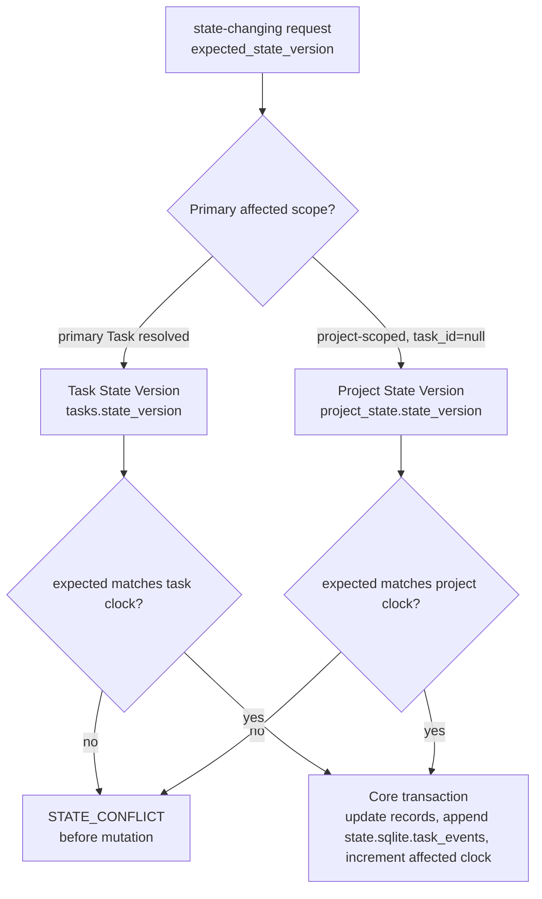
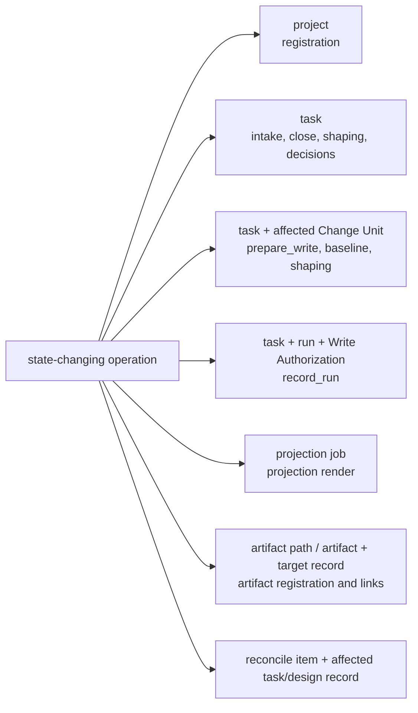
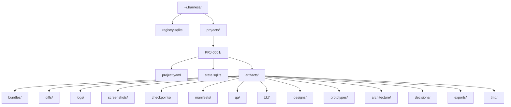
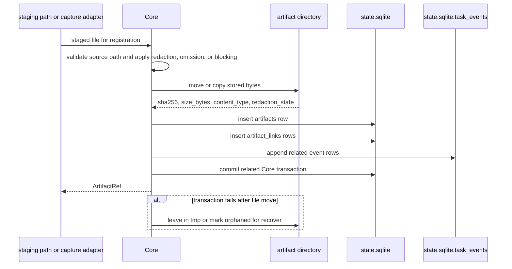
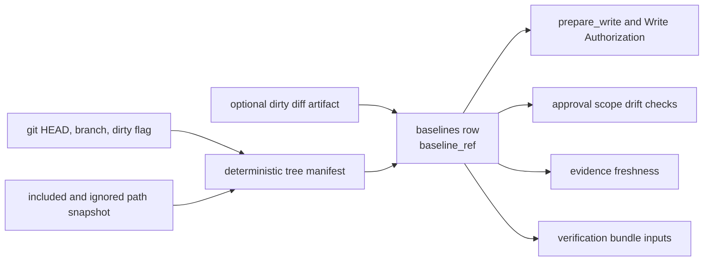
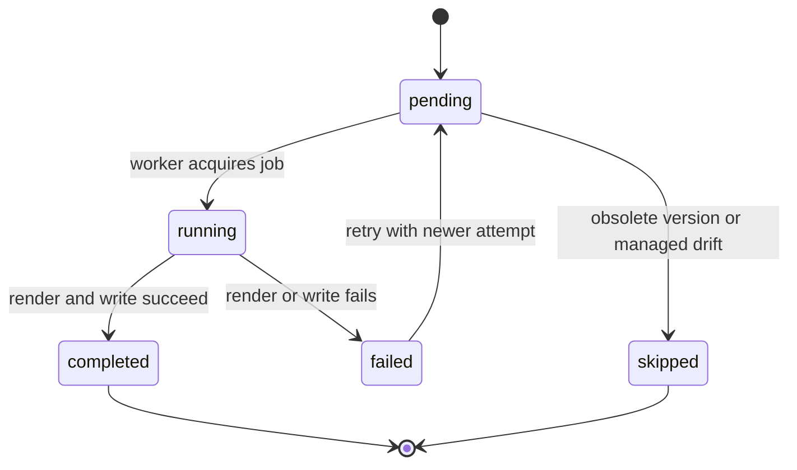
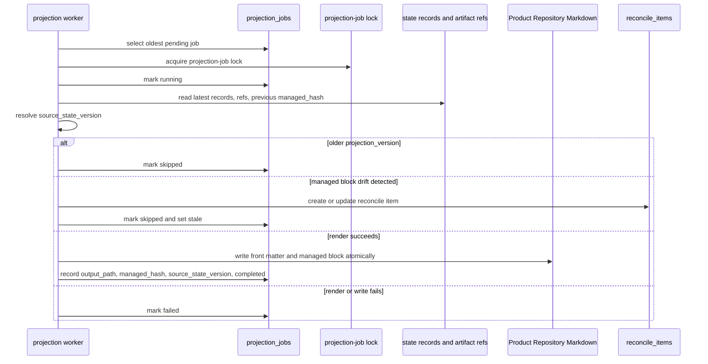
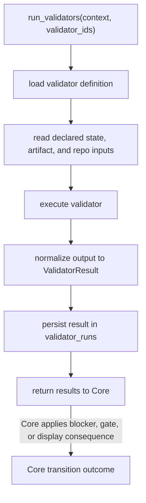

# Storage And DDL

## What this document helps you do

Use this reference to implement or review the Harness runtime storage model. It owns the runtime home layout, `registry.sqlite`, `project.yaml`, `state.sqlite`, `task_events`, DDL draft, JSON `TEXT` validation, migrations, lock policy, artifact directory layout, baseline capture format, projection job table, and validator runner skeleton.

This is storage reference material. It does not define MVP stage sequencing; for stage order and exit criteria, see [Build: MVP Plan](../build/mvp-plan.md).

## Read this when

- You need the exact reference storage layout or DDL draft.
- You are checking which table owns a persisted state record.
- You are validating JSON `TEXT` fields, enum-like `TEXT` fields, locks, migrations, artifacts, baselines, or projection jobs.
- You are keeping API schemas separate from storage implementation details.

## Storage model in plain language

Harness keeps one global runtime registry and one local state database per registered project. The registry says which projects and surfaces exist. `project.yaml` stores static project configuration. `state.sqlite` stores canonical current records, append-only task events, idempotency replay rows, artifact registry rows, projection jobs, and validator run results.

Public API shapes are owned by [MCP API And Schemas](mcp-api-and-schemas.md). Storage-owned DDL and storage-only JSON validation are owned here.

## Reference scope

This document owns:

- runtime home layout
- `registry.sqlite`
- `project.yaml`
- `state.sqlite`
- `task_events`
- DDL draft
- JSON `TEXT` validation for storage-owned fields
- canonical enum hardening
- migrations
- lock policy
- artifact directory layout
- baseline capture format
- projection job table
- validator-run storage
- storage-owned compatibility details that DDL and fixture seed loaders need

## Not covered here

This document does not own:

- public MCP request/response schema; see [MCP API And Schemas](mcp-api-and-schemas.md)
- public API error taxonomy; see [MCP API And Schemas](mcp-api-and-schemas.md)
- full kernel lifecycle transition table; see [Kernel Reference](kernel.md)
- design-quality policy contracts; see [Design Quality Policies](design-quality-policies.md)
- projection template bodies; see [Template Reference](templates/README.md); projection rules live in [Document Projection Reference](document-projection.md)
- MVP stage sequencing and exit criteria; see [Build: MVP Plan](../build/mvp-plan.md)
- operator command semantics; see [Operations And Conformance Reference](operations-and-conformance.md)
- connector capability profiles; see [Agent Integration Reference](agent-integration.md)
- surface recipes; see [Surface Cookbook](surface-cookbook.md)

## Runtime home layout

Reference layout:

```text
~/.harness/
  registry.sqlite
  projects/
    PRJ-0001/
      project.yaml
      state.sqlite
      artifacts/
        bundles/
        diffs/
        logs/
        screenshots/
        checkpoints/
        manifests/
        qa/
        tdd/
        designs/
        prototypes/
        architecture/
        decisions/
        exports/
        tmp/
```

## DDL draft

The reference storage uses SQLite for registry and per-project state. The DDL is a draft implementation contract; field names may gain indexes or migration helpers, but table ownership and authority boundaries should remain stable.

`task_spine_entries` is the physical MVP table for public `journey_spine_entry` records and Journey Spine Entry wording. Public MCP/API naming remains `journey_spine_entry`; the table name preserves the task-local implementation shape.

This ER diagram is an overview of the DDL relationships below. Relationship labels describe storage links, not authority to grant or mutate records. The SQL DDL remains the exact implementation contract.

```mermaid
erDiagram
  projects ||--o{ project_surfaces : registers
  projects ||--o{ connector_manifests : has
  project_surfaces ||--o{ connector_manifests : describes
  projects ||--|| project_state : has
  tasks ||--|| task_gates : has
  tasks ||--o{ change_units : has
  tasks ||--o{ baselines : tracks
  tasks ||--o{ write_authorizations : tracks
  change_units ||--o{ write_authorizations : scopes
  write_authorizations ||--o| runs : consumed_by
  tasks ||--o{ runs : has
  tasks ||--o{ approvals : tracks
  decision_packets ||--o{ approvals : links
  tasks ||--o{ decision_packets : has
  tasks ||--o{ residual_risks : tracks
  decision_packets ||--o{ residual_risks : links
  tasks ||--o{ shared_designs : tracks
  tasks ||--o{ task_spine_entries : has
  change_units ||--o{ change_unit_dependencies : depends
  tasks ||--o{ evidence_manifests : has
  tasks ||--o{ evals : has
  tasks ||--o{ manual_qa_records : has
  decision_packets ||--o{ manual_qa_records : links
  tasks ||--o{ artifacts : links
  artifacts ||--o{ artifact_links : links
  tasks ||--o{ task_events : has
  tasks ||--o{ projection_jobs : tracks
  tasks ||--o{ reconcile_items : tracks
  tasks ||--o{ feedback_loops : has
  tasks ||--o{ tdd_traces : has
  tasks ||--o{ validator_runs : has
```



### JSON TEXT validation

JSON `TEXT` columns in the reference DDL are MVP storage flexibility, not permission to persist arbitrary or partially parsed JSON. Before any Core commit writes or updates a JSON `TEXT` field, Core must parse the value, reject malformed JSON, and validate the parsed value against the field's owning shape.

For public API payloads and API-shaped stored payloads, the owning shape is the schema in [MCP API And Schemas](mcp-api-and-schemas.md). For storage-only fields, the owning shape is the reference storage contract in this document or the specific owner document named by this document. This boundary keeps public schemas in [MCP API And Schemas](mcp-api-and-schemas.md) and SQLite DDL in this document.

Malformed JSON is invalid state. Schema-incompatible JSON is invalid state. Fields with defaults such as `'[]'` or `'{}'` must continue to store valid JSON of the expected array or object shape, not a different JSON kind just because SQLite stores the column as `TEXT`. This includes storage-owned arrays such as `module_map_items.watchpoints_json`.

Recommended hardening: where the deployed SQLite build supports JSON functions, migrations should add `CHECK (json_valid(column_name))` or equivalent generated checks for JSON `TEXT` columns. These checks are defense in depth and do not replace Core's shape validation before commit; the MVP DDL below does not need a full rewrite to show every check inline.

### Canonical enum hardening

Canonical enum columns use `TEXT` in the reference DDL for readability, but they are not open strings. Core validation remains authoritative. Database checks, lookup-table validation, generated checks, and migration assertions are defense in depth and should first cover the state fields that drive write, close, replay, and projection behavior.

Minimum enum hardening targets:

| Field(s) | Owner/value source for hardening |
| --- | --- |
| `tasks.mode` | [Mode](kernel.md#mode). |
| `tasks.lifecycle_phase` | [Lifecycle Phase](kernel.md#lifecycle-phase) and the kernel transition table. |
| `tasks.result` | [Result](kernel.md#result) and [Close Semantics](kernel.md#close-result-semantics). |
| `tasks.close_reason` | [Close Reason](kernel.md#close-reason) and [Close Semantics](kernel.md#close-result-semantics). |
| `tasks.assurance_level` | [Assurance Level](kernel.md#assurance-level) and [Verification Gate](kernel.md#verification-gate). |
| `tasks.projection_status` | TASK projection freshness semantics in this document and [Document Projection Reference](document-projection.md). |
| `task_gates.scope_gate` | [Scope Gate](kernel.md#scope-gate). |
| `task_gates.decision_gate` | [Decision Gate](kernel.md#decision-gate). |
| `task_gates.approval_gate` | [Approval Gate](kernel.md#approval-gate). |
| `task_gates.design_gate` | [Design Gate](kernel.md#design-gate). |
| `task_gates.evidence_gate` | [Evidence Gate](kernel.md#evidence-gate). |
| `task_gates.verification_gate` | [Verification Gate](kernel.md#verification-gate). |
| `task_gates.qa_gate` | [QA Gate](kernel.md#qa-gate). |
| `task_gates.acceptance_gate` | [Acceptance Gate](kernel.md#acceptance-gate). |
| `write_authorizations.status` | [Kernel `prepare_write` State Logic](kernel.md#prepare_write) and public `WriteAuthorizationSummary` in [MCP API And Schemas](mcp-api-and-schemas.md). |
| `decision_packets.status` | [Decision Gate Aggregate Recompute](kernel.md#decision-gate-aggregate-recompute) and public `DecisionPacket` in [MCP API And Schemas](mcp-api-and-schemas.md). |
| `manual_qa_records.result` | [QA Gate](kernel.md#qa-gate) and [`harness.record_manual_qa`](mcp-api-and-schemas.md#harnessrecord_manual_qa). |
| `evals.verdict` | [Verification Gate](kernel.md#verification-gate) and [`harness.record_eval`](mcp-api-and-schemas.md#harnessrecord_eval). |
| `projection_jobs.status` | Projection job/freshness semantics in this document and [Document Projection Reference](document-projection.md). |

For new tables or rebuild migrations, representative inline hardening is `status TEXT NOT NULL CHECK (status IN (...))`. Existing SQLite tables may need a table rebuild, a small lookup table checked by Core before commit, or a migration-time assertion that rejects unknown values before tightening. Do not invent database-only enum values; bind storage hardening to the owner value source.

The table below is an owner map for additional status-like `TEXT` fields in the DDL. It names where storage validators, fixture seed loaders, and migration assertions must get the allowed values; it is not a second enum definition.

| Field(s) | Owner/value source for hardening |
| --- | --- |
| `project_surfaces.guarantee_level`, `write_authorizations.guarantee_level`, `validator_runs.guarantee_level` | Semantic meaning is owned by [Runtime Architecture Guarantee Levels](runtime-architecture.md#guarantee-levels); connector/profile reporting is owned by [Agent Integration Guarantee Levels](agent-integration.md#guarantee-levels); public payload shape is reflected in [MCP API And Schemas](mcp-api-and-schemas.md). |
| `runs.kind` | `RecordRunRequest.kind` in [`harness.record_run`](mcp-api-and-schemas.md#harnessrecord_run). |
| `approvals.status` | Approval lifecycle semantics in [Approval Gate](kernel.md#approval-gate), plus the approval decision payload in [`harness.record_user_decision`](mcp-api-and-schemas.md#harnessrecord_user_decision). |
| `decision_requests.decision_kind`, `decision_packets.decision_kind` | Decision Packet public schemas and decision payload branches in [MCP API And Schemas](mcp-api-and-schemas.md). |
| `evidence_manifests.status` | Evidence sufficiency semantics in [Evidence Gate](kernel.md#evidence-gate) and [Evidence Sufficiency Profiles](kernel.md#evidence-sufficiency-profiles). |
| `residual_risks.visibility_status` | Residual-risk visibility semantics in [Acceptance Gate](kernel.md#acceptance-gate) and public `ResidualRiskSummary` in [MCP API And Schemas](mcp-api-and-schemas.md). A summary-only `none` state must not be persisted on an existing residual-risk row unless the kernel owner explicitly allows it. |
| `validator_runs.status` | `ValidatorResult.status` in [ValidatorResult](mcp-api-and-schemas.md#validatorresult). |
| `projection_jobs.projection_kind` | API-owned `ProjectionKind` in [Shared Schemas](mcp-api-and-schemas.md#shared-schemas). |
| Projection fixture assertions such as `expected_projection` statuses | Operations fixture comparison semantics; these are not storage enum values unless the owning projection schema also defines them. |
| `feedback_loops.loop_kind`, `feedback_loops.status`, `tdd_traces.status` | `FeedbackLoopUpdate` and `TddTraceUpdate` in [`harness.record_run`](mcp-api-and-schemas.md#harnessrecord_run), plus the storage-specific Feedback Loop notes below. |
| `tool_invocations.status` | Reference idempotency/replay storage semantics in this document; it describes committed replay state only, not surface diagnostics. Its storage value is promoted below. |

The following MVP storage-owned value sets are promoted for fields whose existing owner docs and fixture examples already imply stable meaning, and for formerly unresolved storage status fields whose owner-bound compatibility meanings are resolved here. These values are storage hardening values; they do not redefine API payload enums, kernel gate values, lifecycle phases, projection statuses, or optional-table requirements.

| Field(s) | Durable values | Compatibility meaning |
| --- | --- | --- |
| `runs.status` | `completed`, `interrupted`, `blocked`, `violation` | `completed` is a committed Run record that may support evidence, verification, QA, acceptance, or close only through the normal owner refs and gates. Command failures remain in `runs.command_results_json` and related evidence, not in a separate Run status. `interrupted` is a committed recovery Run for an execution attempt that started or was observed but did not complete normally because of agent crash, session or tool interruption, abandoned session, or equivalent recovery condition. Captured diff/log artifacts on an interrupted Run are recovery evidence, not proof of successful completion. `interrupted`, `blocked`, and `violation` are deliberately committed recovery/audit Runs; they must not populate `runs.write_authorization_id` as consumed unless a compatible authorization was actually consumed, and they cannot satisfy evidence sufficiency, detached verification, QA, acceptance, or close readiness. |
| `change_units.status` | `planned`, `active`, `completed`, `deferred`, `superseded` | `planned` is a shaped Change Unit that is not the Task's current active unit. `active` must match `tasks.active_change_unit_id` when the unit scopes current writes. `completed`, `deferred`, and `superseded` no longer scope new writes; they are close-compatible only under the kernel close rules for completed, explicitly deferred, or superseded Change Units. |
| `baselines.status` | `captured`, `stale` | `captured` records a baseline snapshot that can be used only while Core freshness checks still pass. `stale` means the baseline no longer matches the repository state or related approval/evidence/verification inputs for the operation that depends on it. |
| `connector_manifests.status` | `current`, `drifted` | `current` means the connector-managed file list and hashes match the manifest. `drifted` means generated file or managed-block drift was detected and must route through reconcile before overwrite. A missing manifest is reported by doctor/connect as absent state, not as a status value on an existing row. |
| `tool_invocations.status` | `committed` | A row exists only for a committed non-dry-run Core response that is replayable by idempotency key and request hash. Dry runs, malformed requests, pre-commit state conflicts, and changed request-hash replays do not create a new replay row. Idempotent replay returns the committed row without changing this status. |
| `decision_requests.status` | `open`, `linked`, `closed`, `expired`, `cancelled`, `superseded` | Optional routing/replay/handoff lifecycle only. `open` means the request metadata is still current for routing or staging. `linked` means the row points to a compatible canonical `decision_packet_id`; gate aggregation may consider the request only through that linked Decision Packet. `closed`, `expired`, `cancelled`, and `superseded` end the routing lifecycle without creating decision authority. A `decision_requests` row never satisfies `decision_gate`, approval, acceptance, waiver, residual-risk acceptance, or close by itself. |
| `residual_risks.status` | `open`, `accepted`, `mitigated`, `deferred`, `superseded` | Risk lifecycle and accepted-risk metadata status for the Residual Risk row. `open` is a current known risk. `accepted` means user risk acceptance metadata is recorded on this row; acceptance remains state/metadata on `residual_risks`, not a standalone accepted-risk record. `mitigated` means the risk has been addressed and should no longer be treated as current close-relevant risk unless another owner ref reopens it. `deferred` preserves follow-up visibility and close impact for later handling. `superseded` preserves history when a newer compatible risk record replaces it. `visibility_status` remains the separate residual-risk visibility field. |
| `task_spine_entries.status` | `current`, `superseded` | Journey Spine Entry records supplement reconstruction. `current` entries may appear in continuity views as current annotations. `superseded` entries remain historical support records but must not be presented as current journey facts. |
| `change_unit_dependencies.status` | `open`, `satisfied`, `blocked`, `deferred`, `superseded` | Dependency metadata for shaping, ordering, merge-risk visibility, and close impact. `open` means the dependency still applies. `satisfied` means the dependency condition is met. `blocked` means the dependency currently prevents compatible ordering or close readiness. `deferred` means the dependency has visible follow-up or close impact rather than being resolved now. `superseded` means another dependency or Change Unit shape replaces it. These values do not create a scheduler and do not authorize parallel implementation lanes. |
| `shared_designs.status` | `proposed`, `active`, `stale`, `deferred`, `superseded` | Shared Design is a design-support record. `active` is the current design basis for the affected scope. `proposed` is draft or shaping input and is not enough by itself to satisfy design policy. `stale` requires refresh, reconcile, or a new compatible design basis before relying on it. `deferred` and `superseded` preserve visibility without implying final acceptance, approval, or residual-risk acceptance. |
| `reconcile_items.status` | `pending`, `merged`, `rejected`, `converted_to_note`, `decision_created`, `deferred` | `pending` is an unresolved candidate created from human-editable input or generated/projection drift. The other values are the durable outcomes of the reconcile decision path: merge into accepted state, reject the proposal, preserve it as a note, create a Decision Packet, or defer with visible follow-up/close impact. |
| `domain_terms.status` | `active`, `conflict` | `active` is a usable canonical term. `conflict` records competing meanings or unresolved terminology that must remain visible to stewardship/design checks and cannot by itself authorize product use of the term. |
| `module_map_items.status` | `active` | `active` is the MVP usable state for a canonical Module Map Item. Missing, stale, or conflicting module knowledge is represented through reconcile items, projection freshness, validator findings, or gates rather than extra MVP row statuses. |
| `interface_contracts.review_status` | `pending`, `reviewed` | `pending` means a contract row exists but required review/evidence has not yet satisfied the module/interface policy. `reviewed` means callers, compatibility impact, boundary tests, and related review evidence have been recorded; it does not by itself waive residual risk or override kernel gates. |

### `project.yaml`

`project.yaml` stores static project configuration only. It must not store current Task state.

```yaml
project_id: PRJ-0001
display_name: my-app
repo_root: /abs/path/to/my-app
default_agent_surface: reference

agent_surfaces:
  reference:
    enabled: true
    capability_profile_id: SURF-PROFILE-0001

default_checks:
  lint: []
  test: []
  build: []

design_quality:
  vertical_slice_default: true
  tdd_required_for: []
  manual_qa_default_for: []

network_policy:
  default_write: deny
  allowed_read_domains: []
  allowed_write_targets: []

secret_policy:
  env_allowlist: []
  allow_secret_access_without_approval: false
```

### `registry.sqlite`

```sql
CREATE TABLE projects (
  project_id TEXT PRIMARY KEY,
  display_name TEXT NOT NULL,
  repo_root TEXT NOT NULL,
  repo_fingerprint TEXT NOT NULL,
  runtime_path TEXT NOT NULL,
  project_yaml_path TEXT NOT NULL,
  created_at TEXT NOT NULL,
  updated_at TEXT NOT NULL
);

CREATE TABLE project_surfaces (
  surface_id TEXT PRIMARY KEY,
  project_id TEXT NOT NULL REFERENCES projects(project_id),
  surface_kind TEXT NOT NULL,
  display_name TEXT NOT NULL,
  capability_profile_id TEXT NOT NULL,
  guarantee_level TEXT NOT NULL,
  enabled INTEGER NOT NULL DEFAULT 1,
  mcp_config_ref TEXT,
  last_seen_at TEXT,
  created_at TEXT NOT NULL,
  updated_at TEXT NOT NULL
);

CREATE TABLE connector_manifests (
  manifest_id TEXT PRIMARY KEY,
  project_id TEXT NOT NULL REFERENCES projects(project_id),
  surface_id TEXT NOT NULL REFERENCES project_surfaces(surface_id),
  manifest_version INTEGER NOT NULL,
  generated_paths_json TEXT NOT NULL,
  managed_hash TEXT NOT NULL,
  capability_profile_json TEXT NOT NULL,
  status TEXT NOT NULL,
  created_at TEXT NOT NULL,
  updated_at TEXT NOT NULL
);
```

### `state.sqlite`

```sql
CREATE TABLE project_state (
  project_id TEXT PRIMARY KEY,
  state_version INTEGER NOT NULL,
  updated_at TEXT NOT NULL
);

CREATE TABLE tasks (
  task_id TEXT PRIMARY KEY,
  state_version INTEGER NOT NULL,
  mode TEXT NOT NULL,
  lifecycle_phase TEXT NOT NULL,
  result TEXT NOT NULL,
  close_reason TEXT NOT NULL,
  assurance_level TEXT NOT NULL,
  title TEXT NOT NULL,
  current_summary TEXT NOT NULL DEFAULT '',
  acceptance_criteria_json TEXT NOT NULL DEFAULT '[]',
  active_change_unit_id TEXT,
  active_run_id TEXT,
  latest_evidence_manifest_id TEXT,
  latest_eval_id TEXT,
  latest_manual_qa_record_id TEXT,
  projection_version INTEGER NOT NULL DEFAULT 0,
  projected_version INTEGER NOT NULL DEFAULT 0,
  projection_status TEXT NOT NULL DEFAULT 'unknown',
  created_at TEXT NOT NULL,
  updated_at TEXT NOT NULL
);

CREATE TABLE task_gates (
  task_id TEXT PRIMARY KEY REFERENCES tasks(task_id),
  scope_gate TEXT NOT NULL,
  decision_gate TEXT NOT NULL,
  approval_gate TEXT NOT NULL,
  design_gate TEXT NOT NULL,
  evidence_gate TEXT NOT NULL,
  verification_gate TEXT NOT NULL,
  qa_gate TEXT NOT NULL,
  acceptance_gate TEXT NOT NULL,
  waiver_json TEXT NOT NULL DEFAULT '{}',
  updated_at TEXT NOT NULL
);

CREATE TABLE change_units (
  change_unit_id TEXT PRIMARY KEY,
  task_id TEXT NOT NULL REFERENCES tasks(task_id),
  title TEXT NOT NULL,
  purpose TEXT NOT NULL,
  non_goals_json TEXT NOT NULL DEFAULT '[]',
  slice_type TEXT NOT NULL,
  autonomy_profile TEXT NOT NULL,
  agent_may_do_json TEXT NOT NULL DEFAULT '[]',
  user_judgment_required_json TEXT NOT NULL DEFAULT '[]',
  afk_stop_conditions_json TEXT NOT NULL DEFAULT '[]',
  end_to_end_path_json TEXT NOT NULL DEFAULT '{}',
  horizontal_exception_reason TEXT,
  follow_up_vertical_change_unit_id TEXT,
  allowed_paths_json TEXT NOT NULL DEFAULT '[]',
  allowed_tools_json TEXT NOT NULL DEFAULT '[]',
  allowed_commands_json TEXT NOT NULL DEFAULT '[]',
  allowed_network_json TEXT NOT NULL DEFAULT '[]',
  secret_scope_json TEXT NOT NULL DEFAULT '[]',
  sensitive_categories_json TEXT NOT NULL DEFAULT '[]',
  validator_profile_json TEXT NOT NULL DEFAULT '[]',
  completion_conditions_json TEXT NOT NULL DEFAULT '[]',
  evaluator_focus_json TEXT NOT NULL DEFAULT '[]',
  status TEXT NOT NULL,
  created_at TEXT NOT NULL,
  updated_at TEXT NOT NULL
);

CREATE TABLE baselines (
  baseline_ref TEXT PRIMARY KEY,
  task_id TEXT NOT NULL REFERENCES tasks(task_id),
  change_unit_id TEXT,
  repo_head TEXT NOT NULL,
  branch TEXT NOT NULL,
  dirty INTEGER NOT NULL,
  tree_hash TEXT NOT NULL,
  included_paths_json TEXT NOT NULL DEFAULT '[]',
  ignored_paths_json TEXT NOT NULL DEFAULT '[]',
  diff_artifact_id TEXT REFERENCES artifacts(artifact_id),
  status TEXT NOT NULL,
  created_at TEXT NOT NULL,
  updated_at TEXT NOT NULL
);

CREATE TABLE write_authorizations (
  write_authorization_id TEXT PRIMARY KEY,
  task_id TEXT NOT NULL REFERENCES tasks(task_id),
  change_unit_id TEXT NOT NULL REFERENCES change_units(change_unit_id),
  basis_state_version INTEGER NOT NULL,
  baseline_ref TEXT REFERENCES baselines(baseline_ref),
  intended_operation TEXT NOT NULL,
  intended_paths_json TEXT NOT NULL DEFAULT '[]',
  intended_tools_json TEXT NOT NULL DEFAULT '[]',
  intended_commands_json TEXT NOT NULL DEFAULT '[]',
  intended_network_json TEXT NOT NULL DEFAULT '[]',
  intended_secrets_json TEXT NOT NULL DEFAULT '[]',
  sensitive_categories_json TEXT NOT NULL DEFAULT '[]',
  approval_refs_json TEXT NOT NULL DEFAULT '[]',
  decision_packet_refs_json TEXT NOT NULL DEFAULT '[]',
  guarantee_level TEXT NOT NULL,
  status TEXT NOT NULL,
  created_at TEXT NOT NULL,
  updated_at TEXT NOT NULL,
  expires_at TEXT,
  consumed_by_run_id TEXT,
  consumed_at TEXT
);

CREATE TABLE runs (
  run_id TEXT PRIMARY KEY,
  task_id TEXT NOT NULL REFERENCES tasks(task_id),
  change_unit_id TEXT,
  kind TEXT NOT NULL,
  actor_kind TEXT NOT NULL,
  surface_id TEXT NOT NULL,
  baseline_ref TEXT,
  write_authorization_id TEXT REFERENCES write_authorizations(write_authorization_id),
  summary TEXT NOT NULL DEFAULT '',
  observed_changes_json TEXT NOT NULL DEFAULT '{}',
  command_results_json TEXT NOT NULL DEFAULT '[]',
  artifact_refs_json TEXT NOT NULL DEFAULT '[]',
  status TEXT NOT NULL,
  started_at TEXT NOT NULL,
  completed_at TEXT
);

CREATE TABLE approvals (
  approval_id TEXT PRIMARY KEY,
  task_id TEXT NOT NULL REFERENCES tasks(task_id),
  change_unit_id TEXT,
  -- Optional compatibility ref; leave null when decision_requests is omitted.
  decision_request_id TEXT,
  decision_packet_id TEXT REFERENCES decision_packets(decision_packet_id),
  status TEXT NOT NULL,
  sensitive_categories_json TEXT NOT NULL DEFAULT '[]',
  allowed_paths_json TEXT NOT NULL DEFAULT '[]',
  allowed_tools_json TEXT NOT NULL DEFAULT '[]',
  allowed_commands_json TEXT NOT NULL DEFAULT '[]',
  allowed_network_targets_json TEXT NOT NULL DEFAULT '[]',
  secret_scope_json TEXT NOT NULL DEFAULT '[]',
  baseline_ref TEXT,
  expires_at TEXT,
  decision_note TEXT,
  created_at TEXT NOT NULL,
  decided_at TEXT
);

-- Optional compatibility/routing table for routing, interaction, replay, or legacy handoff metadata only.
-- Minimal MVP implementations may omit this table.
-- decision_packet_id may remain null for routing/replay staging; unlinked rows are non-authoritative.
-- Gate aggregation may consider a row only through a linked compatible decision_packet_id.
CREATE TABLE decision_requests (
  decision_request_id TEXT PRIMARY KEY,
  decision_packet_id TEXT REFERENCES decision_packets(decision_packet_id),
  task_id TEXT NOT NULL REFERENCES tasks(task_id),
  change_unit_id TEXT,
  decision_kind TEXT NOT NULL,
  status TEXT NOT NULL,
  prompt TEXT NOT NULL,
  options_json TEXT NOT NULL DEFAULT '[]',
  recommendation TEXT,
  approval_scope_json TEXT NOT NULL DEFAULT '{}',
  reconcile_item_id TEXT,
  expires_at TEXT,
  decided_option_id TEXT,
  decision_json TEXT NOT NULL DEFAULT '{}',
  note TEXT,
  waiver_reason TEXT,
  created_at TEXT NOT NULL,
  decided_at TEXT
);

CREATE TABLE decision_packets (
  decision_packet_id TEXT PRIMARY KEY,
  task_id TEXT NOT NULL REFERENCES tasks(task_id),
  change_unit_id TEXT,
  -- Optional compatibility ref; leave null when decision_requests is omitted.
  decision_request_id TEXT,
  decision_kind TEXT NOT NULL,
  status TEXT NOT NULL,
  question TEXT NOT NULL,
  options_json TEXT NOT NULL DEFAULT '[]',
  recommendation_json TEXT NOT NULL DEFAULT '{}',
  affected_scope_json TEXT NOT NULL DEFAULT '{}',
  autonomy_boundary_json TEXT NOT NULL DEFAULT '{}',
  context_refs_json TEXT NOT NULL DEFAULT '[]',
  context_artifact_refs_json TEXT NOT NULL DEFAULT '[]',
  residual_risk_refs_json TEXT NOT NULL DEFAULT '[]',
  decision_json TEXT NOT NULL DEFAULT '{}',
  superseded_by_decision_packet_id TEXT,
  created_at TEXT NOT NULL,
  updated_at TEXT NOT NULL,
  decided_at TEXT
);

CREATE TABLE residual_risks (
  residual_risk_id TEXT PRIMARY KEY,
  task_id TEXT NOT NULL REFERENCES tasks(task_id),
  change_unit_id TEXT,
  source_record_kind TEXT NOT NULL,
  source_record_id TEXT NOT NULL,
  related_decision_packet_id TEXT REFERENCES decision_packets(decision_packet_id),
  affected_scope_json TEXT NOT NULL DEFAULT '{}',
  affected_acceptance_criteria_json TEXT NOT NULL DEFAULT '[]',
  visibility_status TEXT NOT NULL,
  accepted_risk_json TEXT NOT NULL DEFAULT '{}',
  follow_up_requirement_json TEXT NOT NULL DEFAULT '{}',
  close_impact TEXT NOT NULL,
  status TEXT NOT NULL,
  created_at TEXT NOT NULL,
  updated_at TEXT NOT NULL,
  accepted_at TEXT
);

CREATE TABLE shared_designs (
  shared_design_id TEXT PRIMARY KEY,
  task_id TEXT REFERENCES tasks(task_id),
  change_unit_id TEXT,
  first_change_unit_id TEXT REFERENCES change_units(change_unit_id),
  title TEXT NOT NULL,
  design_kind TEXT NOT NULL,
  goal TEXT NOT NULL,
  non_goals_json TEXT NOT NULL DEFAULT '[]',
  acceptance_criteria_json TEXT NOT NULL DEFAULT '[]',
  status TEXT NOT NULL,
  scope_json TEXT NOT NULL DEFAULT '{}',
  assumptions_json TEXT NOT NULL DEFAULT '[]',
  resolved_questions_json TEXT NOT NULL DEFAULT '[]',
  domain_impact_refs_json TEXT NOT NULL DEFAULT '[]',
  module_impact_refs_json TEXT NOT NULL DEFAULT '[]',
  interface_impact_refs_json TEXT NOT NULL DEFAULT '[]',
  options_json TEXT NOT NULL DEFAULT '[]',
  selected_option_json TEXT NOT NULL DEFAULT '{}',
  rejected_options_json TEXT NOT NULL DEFAULT '[]',
  decision_packet_refs_json TEXT NOT NULL DEFAULT '[]',
  artifact_refs_json TEXT NOT NULL DEFAULT '[]',
  created_at TEXT NOT NULL,
  updated_at TEXT NOT NULL
);

CREATE TABLE task_spine_entries (
  task_spine_entry_id TEXT PRIMARY KEY,
  task_id TEXT NOT NULL REFERENCES tasks(task_id),
  change_unit_id TEXT,
  sequence_no INTEGER NOT NULL,
  entry_kind TEXT NOT NULL,
  lifecycle_phase TEXT,
  actor_kind TEXT NOT NULL,
  source_record_kind TEXT,
  source_record_id TEXT,
  summary TEXT NOT NULL DEFAULT '',
  refs_json TEXT NOT NULL DEFAULT '[]',
  artifact_refs_json TEXT NOT NULL DEFAULT '[]',
  status TEXT NOT NULL,
  created_at TEXT NOT NULL,
  updated_at TEXT NOT NULL,
  UNIQUE(task_id, sequence_no)
);

CREATE TABLE change_unit_dependencies (
  change_unit_dependency_id TEXT PRIMARY KEY,
  task_id TEXT NOT NULL REFERENCES tasks(task_id),
  change_unit_id TEXT NOT NULL REFERENCES change_units(change_unit_id),
  depends_on_change_unit_id TEXT NOT NULL REFERENCES change_units(change_unit_id),
  dependency_kind TEXT NOT NULL,
  status TEXT NOT NULL,
  merge_risk TEXT NOT NULL,
  visibility_note TEXT NOT NULL DEFAULT '',
  close_impact TEXT NOT NULL,
  rationale TEXT NOT NULL DEFAULT '',
  created_at TEXT NOT NULL,
  updated_at TEXT NOT NULL
);

CREATE TABLE evidence_manifests (
  evidence_manifest_id TEXT PRIMARY KEY,
  task_id TEXT NOT NULL REFERENCES tasks(task_id),
  change_unit_id TEXT,
  baseline_ref TEXT,
  criteria_json TEXT NOT NULL DEFAULT '[]',
  changed_files_json TEXT NOT NULL DEFAULT '[]',
  supporting_refs_json TEXT NOT NULL DEFAULT '[]',
  stale_if_json TEXT NOT NULL DEFAULT '[]',
  status TEXT NOT NULL,
  created_at TEXT NOT NULL,
  updated_at TEXT NOT NULL
);

CREATE TABLE evals (
  eval_id TEXT PRIMARY KEY,
  task_id TEXT NOT NULL REFERENCES tasks(task_id),
  change_unit_id TEXT,
  evaluator_run_id TEXT,
  target_run_id TEXT,
  verdict TEXT NOT NULL,
  checks_json TEXT NOT NULL DEFAULT '[]',
  evidence_reviewed_json TEXT NOT NULL DEFAULT '[]',
  independence_json TEXT NOT NULL DEFAULT '{}',
  blockers_json TEXT NOT NULL DEFAULT '[]',
  artifact_refs_json TEXT NOT NULL DEFAULT '[]',
  created_at TEXT NOT NULL
);

CREATE TABLE manual_qa_records (
  manual_qa_record_id TEXT PRIMARY KEY,
  task_id TEXT NOT NULL REFERENCES tasks(task_id),
  change_unit_id TEXT,
  qa_profile TEXT NOT NULL,
  performed_by TEXT NOT NULL,
  result TEXT NOT NULL,
  findings_json TEXT NOT NULL DEFAULT '[]',
  artifact_refs_json TEXT NOT NULL DEFAULT '[]',
  waiver_reason TEXT,
  waiver_decision_packet_id TEXT REFERENCES decision_packets(decision_packet_id),
  residual_risk_refs_json TEXT NOT NULL DEFAULT '[]',
  next_action TEXT NOT NULL,
  created_at TEXT NOT NULL
);

CREATE TABLE artifacts (
  artifact_id TEXT PRIMARY KEY,
  task_id TEXT NOT NULL REFERENCES tasks(task_id),
  run_id TEXT,
  kind TEXT NOT NULL,
  relative_path TEXT NOT NULL,
  sha256 TEXT NOT NULL,
  size_bytes INTEGER NOT NULL,
  content_type TEXT NOT NULL,
  redaction_state TEXT NOT NULL,
  produced_by TEXT NOT NULL,
  retention_class TEXT NOT NULL,
  created_at TEXT NOT NULL
);

CREATE TABLE artifact_links (
  artifact_link_id TEXT PRIMARY KEY,
  artifact_id TEXT NOT NULL REFERENCES artifacts(artifact_id),
  task_id TEXT NOT NULL REFERENCES tasks(task_id),
  record_kind TEXT NOT NULL,
  record_id TEXT NOT NULL,
  relation_kind TEXT NOT NULL,
  created_at TEXT NOT NULL
);

CREATE TABLE task_events (
  event_id TEXT PRIMARY KEY,
  event_seq INTEGER NOT NULL UNIQUE,
  task_id TEXT,
  state_version INTEGER NOT NULL,
  event_type TEXT NOT NULL,
  actor_kind TEXT NOT NULL,
  surface_id TEXT,
  request_id TEXT,
  idempotency_key TEXT,
  payload_json TEXT NOT NULL DEFAULT '{}',
  created_at TEXT NOT NULL
);

CREATE TABLE tool_invocations (
  invocation_id TEXT PRIMARY KEY,
  project_id TEXT NOT NULL,
  task_id TEXT,
  tool_name TEXT NOT NULL,
  request_id TEXT NOT NULL,
  idempotency_key TEXT NOT NULL,
  request_hash TEXT NOT NULL,
  response_json TEXT NOT NULL DEFAULT '{}',
  state_version INTEGER NOT NULL,
  status TEXT NOT NULL,
  created_at TEXT NOT NULL,
  completed_at TEXT,
  UNIQUE(project_id, tool_name, idempotency_key)
);

CREATE TABLE projection_jobs (
  projection_job_id TEXT PRIMARY KEY,
  task_id TEXT,
  projection_kind TEXT NOT NULL,
  target_ref TEXT NOT NULL,
  projection_version INTEGER NOT NULL,
  source_state_version INTEGER,
  status TEXT NOT NULL,
  attempts INTEGER NOT NULL DEFAULT 0,
  output_path TEXT,
  managed_hash TEXT,
  error_json TEXT NOT NULL DEFAULT '{}',
  created_at TEXT NOT NULL,
  updated_at TEXT NOT NULL
);

CREATE TABLE reconcile_items (
  reconcile_item_id TEXT PRIMARY KEY,
  task_id TEXT,
  source_kind TEXT NOT NULL,
  source_path TEXT,
  source_hash TEXT,
  target_record_kind TEXT,
  target_record_id TEXT,
  proposed_change_json TEXT NOT NULL DEFAULT '{}',
  status TEXT NOT NULL,
  decision_json TEXT NOT NULL DEFAULT '{}',
  created_at TEXT NOT NULL,
  resolved_at TEXT
);

CREATE TABLE domain_terms (
  domain_term_id TEXT PRIMARY KEY,
  term TEXT NOT NULL,
  meaning TEXT NOT NULL,
  code_representation TEXT,
  not_this_json TEXT NOT NULL DEFAULT '[]',
  related_terms_json TEXT NOT NULL DEFAULT '[]',
  source_ref TEXT,
  status TEXT NOT NULL,
  created_at TEXT NOT NULL,
  updated_at TEXT NOT NULL
);

CREATE TABLE module_map_items (
  module_map_item_id TEXT PRIMARY KEY,
  module_path TEXT NOT NULL,
  responsibility TEXT NOT NULL,
  public_interface_json TEXT NOT NULL DEFAULT '[]',
  dependencies_json TEXT NOT NULL DEFAULT '[]',
  internal_complexity TEXT NOT NULL DEFAULT '',
  test_boundary TEXT,
  owner_decision TEXT,
  watchpoints_json TEXT NOT NULL DEFAULT '[]',
  status TEXT NOT NULL,
  created_at TEXT NOT NULL,
  updated_at TEXT NOT NULL
);

CREATE TABLE interface_contracts (
  interface_contract_id TEXT PRIMARY KEY,
  name TEXT NOT NULL,
  owner_module TEXT NOT NULL,
  change_type TEXT NOT NULL,
  inputs_json TEXT NOT NULL DEFAULT '[]',
  outputs_json TEXT NOT NULL DEFAULT '[]',
  errors_json TEXT NOT NULL DEFAULT '[]',
  compatibility_impact TEXT NOT NULL,
  callers_impacted_json TEXT NOT NULL DEFAULT '[]',
  boundary_tests_json TEXT NOT NULL DEFAULT '[]',
  review_status TEXT NOT NULL,
  created_at TEXT NOT NULL,
  updated_at TEXT NOT NULL
);

CREATE TABLE feedback_loops (
  feedback_loop_id TEXT PRIMARY KEY,
  task_id TEXT NOT NULL REFERENCES tasks(task_id),
  change_unit_id TEXT,
  loop_kind TEXT NOT NULL,
  loop_profile TEXT NOT NULL,
  planned_loop TEXT NOT NULL,
  selected_loop_refs_json TEXT NOT NULL DEFAULT '[]',
  execution_refs_json TEXT NOT NULL DEFAULT '[]',
  artifact_refs_json TEXT NOT NULL DEFAULT '[]',
  tdd_trace_refs_json TEXT NOT NULL DEFAULT '[]',
  manual_qa_record_refs_json TEXT NOT NULL DEFAULT '[]',
  evidence_manifest_refs_json TEXT NOT NULL DEFAULT '[]',
  status TEXT NOT NULL,
  waiver_reason TEXT,
  alternate_loop TEXT,
  created_at TEXT NOT NULL,
  updated_at TEXT NOT NULL
);

CREATE TABLE tdd_traces (
  tdd_trace_id TEXT PRIMARY KEY,
  task_id TEXT NOT NULL REFERENCES tasks(task_id),
  change_unit_id TEXT,
  status TEXT NOT NULL,
  red_refs_json TEXT NOT NULL DEFAULT '[]',
  green_refs_json TEXT NOT NULL DEFAULT '[]',
  refactor_refs_json TEXT NOT NULL DEFAULT '[]',
  non_tdd_justification TEXT,
  artifact_refs_json TEXT NOT NULL DEFAULT '[]',
  created_at TEXT NOT NULL,
  updated_at TEXT NOT NULL
);

CREATE TABLE validator_runs (
  validator_run_id TEXT PRIMARY KEY,
  task_id TEXT,
  change_unit_id TEXT,
  run_id TEXT,
  validator_id TEXT NOT NULL,
  validator_kind TEXT NOT NULL,
  status TEXT NOT NULL,
  guarantee_level TEXT NOT NULL,
  findings_json TEXT NOT NULL DEFAULT '[]',
  blocked_reasons_json TEXT NOT NULL DEFAULT '[]',
  created_at TEXT NOT NULL
);

CREATE TABLE locks (
  lock_id TEXT PRIMARY KEY,
  scope TEXT NOT NULL,
  owner TEXT NOT NULL,
  acquired_at TEXT NOT NULL,
  expires_at TEXT NOT NULL,
  heartbeat_at TEXT NOT NULL
);
```

MVP TDD discipline uses the existing `feedback_loops` and `tdd_traces` tables. `feedback_loops` owns the selected feedback loop and any alternate loop for a waiver; `tdd_traces` owns RED, GREEN, refactor/check artifacts, and non-TDD justification. Evidence Manifest rows remain the coverage owner for acceptance criteria and changed files.

`project_state.state_version` is the project-scoped state clock. Core initializes exactly one `project_state` row for the registered project during runtime bootstrap, before any project-scoped mutation can compare `expected_state_version` with `project_state.state_version`.

`tasks.state_version` is the task-scoped state clock. Task-scoped mutations compare `expected_state_version` with the Core-resolved primary Task's `tasks.state_version`; project-scoped mutations with no resolved primary Task compare it with `project_state.state_version`.



`task_events` remains append-only event history inside `state.sqlite`; MVP does not introduce a separate event store. `task_events.event_seq` is the deterministic global append sequence for all events in the database. Core allocates it under the same write transaction as the state change, and Journey reconstruction, API event lists, and conformance ordering use ascending `event_seq`, never timestamps. `task_events.state_version` records the resulting version for the affected scope. For task events this is `tasks.state_version`; for project-level events with `task_id=null` this is `project_state.state_version`. Multiple events may share an affected-scope `state_version`; `event_seq` still defines their order.

`tool_invocations` stores request replay metadata needed to return the original committed response. Only committed, non-dry-run tool calls create or update `tool_invocations`; `dry_run=true` creates no replay row and does not consume the idempotency key for authoritative replay. Non-authoritative diagnostics, if an implementation keeps them, must not be stored in `tool_invocations` or used to replay state-changing responses. `tool_invocations.request_hash` stores the canonical request hash defined by the MCP API idempotency rules: canonical JSON, UTF-8, `tool_name`, schema-normalized request body and optional fields, sorted object keys, schema-ordered arrays unless explicitly order-insignificant, NFC Unicode strings, and envelope coverage that excludes only `request_id` and `idempotency_key`. `tool_invocations.state_version` stores the same primary affected-scope version returned in `ToolResponseBase.state_version`: Task State Version when Core resolves a primary Task, otherwise Project State Version. Reusing an idempotency key with a different `request_hash` returns `STATE_CONFLICT`.

`tasks.projection_version` is the TASK projection/template/job version used to prevent older TASK renders from replacing newer ones. It is not a state clock. `tasks.projected_version`, if retained, is only the TASK projection summary cache of the last rendered source state version. It must not be treated as the storage location for every task-related `ProjectionKind`.

`tasks.projection_status` is the TASK projection status summary. Per-kind projection freshness is tracked through `projection_jobs.source_state_version`, job status, managed hashes, and the relevant projection records or artifact refs for API-owned MVP-required kinds, MVP-optional kinds, and enabled projection kinds in the Extension / optional tier. `APR` freshness starts from committed Approval records and their approval-shaped Decision Packets, not from non-mutating `approval_request_candidate` payloads. Do not treat one Task field as owning all projection freshness.

`write_authorizations` stores durable `prepare_write` allow decisions. The allow/block contract is owned by [Kernel `prepare_write` State Logic](kernel.md#prepare_write) and the public response shape by [`harness.prepare_write`](mcp-api-and-schemas.md#harnessprepare_write). Storage-specific requirements are: each distinct committed non-dry-run allowed request inserts a distinct row; idempotent return is only replay of the same committed request under the same idempotency key, request hash, and compatible basis; `basis_state_version` stores the affected-scope state version used as the compatibility basis; `updated_at` changes whenever authorization status changes; and status history remains in `task_events`.

Stored `write_authorizations` rows require non-null `basis_state_version`, including rows inserted from conformance fixture seeds. A fixture runner may derive the field from the seeded affected-scope state version before insert, but the stored row must still contain the value and must not treat it as the post-transaction `ToolResponseBase.state_version`.

`record_run` consumption is stored by setting the reciprocal links `write_authorizations.consumed_by_run_id` and `runs.write_authorization_id` in one Core transaction. The unique partial index on `runs.write_authorization_id` enforces storage single-use for committed Runs; idempotent replay returns the original Run and response metadata instead of inserting another Run row. Rejected pre-commit `record_run` calls, such as missing Write Authorization before any Run is committed, do not insert a `runs` row and therefore have no storage Run ID to return; the nullable API `run_id` represents that absence without inventing a placeholder. Runs that attempt an invalid, stale, missing, consumed, or scope-exceeded authorization leave `runs.write_authorization_id` empty; attempted refs may be kept in validator findings, run violation payload, or `task_events.payload_json` for audit. Kernel-owned close and evidence consequences remain in [Kernel `record_run` State Logic](kernel.md#record_run).

`decision_packets` stores Decision Packet state records. `decision_requests` is an optional interaction/routing compatibility table for implementation handoff, replay, or legacy request flow; a minimal MVP implementation may omit it, along with its optional indexes and nullable compatibility fields. If retained, unlinked `decision_requests` rows remain non-authoritative routing metadata, approval links use `approvals.decision_packet_id`, and gate aggregation must consider `decision_requests` only through a linked compatible `decision_packet_id`. The decision gate and approval/acceptance/risk authority rules stay in [Kernel Decision Gate](kernel.md#decision-gate) and the related public tools in [MCP API And Schemas](mcp-api-and-schemas.md#public-tools).

`residual_risks` stores residual-risk rows. MVP accepted-risk identity is `residual_risk_id`; there is no separate `accepted_risks` table or `ARISK-*` canonical record. Accepted-risk metadata/state stays on `residual_risks.accepted_risk_json`, `status`, and `accepted_at`, while Decision Packets may reference rows through `decision_packets.residual_risk_refs_json`. Visibility and close semantics stay in [Close Semantics](kernel.md#close-result-semantics).

MVP final acceptance has no `acceptance_records` table. Acceptance is stored through the Decision Packet path, `task_gates.acceptance_gate`, and `state.sqlite.task_events`; the transition and payload rules are owned by [Kernel `close_task` State Logic](kernel.md#close_task) and [`harness.record_user_decision`](mcp-api-and-schemas.md#harnessrecord_user_decision). Close does not look for a separate acceptance row.

`module_map_items` stores the canonical Module Map Item: module role/responsibility, public interface, dependencies, internal complexity, test boundary, owner decision, and module-local watchpoints. `watchpoints_json` is a Core-validated JSON array of non-empty module-local watchpoint strings under the JSON field validation boundary above. Interface-specific caller impact and compatibility details stay in `interface_contracts`.

`feedback_loops` stores the selected Feedback Loop definition and its execution routing. `loop_kind` values are `test`, `typecheck`, `lint`, `build`, `browser_smoke`, `manual_qa`, `tdd`, `eval`, `operational`, or `alternate`. `loop_profile` classifies the chosen loop within that kind, and `planned_loop` describes the intended check. `status` values are `defined`, `executed`, `waived`, `blocked`, or `stale`. Create/update payloads come from `FeedbackLoopUpdate` in the MCP schema; `record_manual_qa` may update execution refs for an existing Manual QA feedback loop.

Core must validate every JSON ref array before commit. `selected_loop_refs_json` and `execution_refs_json` store `StateRecordRef` arrays; `tdd_trace_refs_json`, `manual_qa_record_refs_json`, and `evidence_manifest_refs_json` are restricted to their matching record kinds. `artifact_refs_json` stores committed `ArtifactRef` values resolved from the public update payload or related tool request. `operation=create` requires a non-empty `loop_kind`, `loop_profile`, `planned_loop`, and valid `status`; `feedback_loop_id` may be Core-assigned or caller-supplied for deterministic fixture/import creation and must be unique. `operation=update` requires an existing row with the same `task_id` and compatible `change_unit_id`; nullable scalar payload fields leave stored values unchanged, while ref arrays and artifact refs are additive. `status=waived` requires `waiver_reason` or a referenced compatible waiver/decision record. `status=executed` requires at least one resulting execution, artifact, TDD trace, Manual QA, or evidence manifest ref. `tdd_traces` remains the canonical red/green/refactor evidence record when TDD is selected; it does not replace the `feedback_loops` row. `feedback_loop_check` reads these records as a validator and does not add a new kernel gate.

`artifact_links` is the queryable many-to-many attachment table for artifacts. In MVP it is Task-scoped: each row has a non-null `task_id` matching the registered artifact and the owner record's Task. Use it to attach artifacts only to existing owner records that are Task-scoped for the same `task_id`, such as `task`, `change_unit`, `run`, `decision_packet`, `shared_design`, `residual_risk`, `evidence_manifest`, `feedback_loop`, `tdd_trace`, `manual_qa_record`, `eval`, `journey_spine_entry`, and `projection`. If an owner kind can also have project-scoped rows, those rows use their own state/projection metadata and are not artifact-link targets until a future extension adds project-scoped artifact storage/API. Exported files use artifact kinds or retention classes such as `export_component` and `retention_class=export`; they do not attach to an `export` state record unless a future extension deliberately adds a matching table, `StateRecordRef` value, and integrity semantics. Existing `artifact_refs_json` fields may preserve ordered or record-local context, but multi-record artifact reuse and artifact integrity checks should use `artifact_links`.

For `artifact_links.record_kind=projection`, `artifact_links.record_id` stores `projection_jobs.projection_job_id`. The link is valid only when Core can resolve that job to the rendered projection output it links: the job is Task-scoped to the same `task_id` as the artifact link, has matching `projection_kind` and `target_ref`, has `status=completed`, and has an `output_path` or documented projection ref for the rendered output. `projection_jobs.target_ref` and `output_path` are validation and locator metadata, not replacements for `artifact_links.record_id`. Project-level projection jobs may still be tracked in `projection_jobs` where projection owner docs allow them, but the current MVP artifact DDL does not create project-scoped artifact rows or artifact links for those jobs. This keeps MVP storage on `projection_jobs` and does not introduce a `projections` table.

`manual_qa_records.waiver_decision_packet_id` and `manual_qa_records.residual_risk_refs_json` are the storage hooks for QA waiver decisions and close-relevant risk refs. The waiver contract is owned by [Kernel Waiver Semantics](kernel.md#waiver-semantics) and the Manual QA policy in [Design Quality Policies](design-quality-policies.md#manual-qa-manual_qa).

`change_unit_dependencies` is MVP DAG metadata for shaping, ordering, and close visibility. It is not a parallel orchestration scheduler and does not authorize multiple active implementation lanes.

`baselines` stores BaselineCapture records in state with repo head, branch, dirty flag, tree hash, included/ignored paths, optional diff artifact, and status. `baseline_ref` fields in other tables refer to `baselines.baseline_ref`.

Recommended indexes:

```sql
CREATE INDEX idx_task_events_task_version ON task_events(task_id, state_version);
CREATE INDEX idx_task_events_task_seq ON task_events(task_id, event_seq);
CREATE INDEX idx_decision_requests_task_status ON decision_requests(task_id, status); -- optional; omit when decision_requests is omitted
CREATE INDEX idx_decision_requests_packet ON decision_requests(decision_packet_id); -- optional; omit when decision_requests is omitted
CREATE INDEX idx_decision_packets_task_status ON decision_packets(task_id, status);
CREATE INDEX idx_residual_risks_task_status ON residual_risks(task_id, status);
CREATE INDEX idx_shared_designs_task_status ON shared_designs(task_id, status);
CREATE INDEX idx_feedback_loops_task_status ON feedback_loops(task_id, status);
CREATE INDEX idx_feedback_loops_change_unit ON feedback_loops(change_unit_id);
CREATE INDEX idx_task_spine_entries_task_seq ON task_spine_entries(task_id, sequence_no);
CREATE INDEX idx_change_unit_dependencies_task ON change_unit_dependencies(task_id, change_unit_id);
CREATE INDEX idx_baselines_task_change_unit ON baselines(task_id, change_unit_id);
CREATE INDEX idx_write_authorizations_task_status ON write_authorizations(task_id, status);
CREATE INDEX idx_write_authorizations_change_unit ON write_authorizations(change_unit_id);
CREATE INDEX idx_approvals_decision_packet ON approvals(decision_packet_id);
CREATE INDEX idx_projection_jobs_status ON projection_jobs(status, projection_version);
CREATE INDEX idx_artifacts_task_run ON artifacts(task_id, run_id);
CREATE INDEX idx_artifact_links_artifact ON artifact_links(artifact_id);
CREATE INDEX idx_artifact_links_record ON artifact_links(record_kind, record_id);
CREATE INDEX idx_runs_task_status ON runs(task_id, status);
CREATE INDEX idx_runs_write_authorization ON runs(write_authorization_id);
CREATE UNIQUE INDEX uq_runs_write_authorization_consumed
ON runs(write_authorization_id)
WHERE write_authorization_id IS NOT NULL;
CREATE INDEX idx_evals_task_change_unit ON evals(task_id, change_unit_id);
CREATE INDEX idx_manual_qa_records_task_change_unit ON manual_qa_records(task_id, change_unit_id);
CREATE INDEX idx_reconcile_items_status ON reconcile_items(status);
```

### `task_events`

`task_events` is append-only by application policy. `event_seq` is monotonically allocated and never reused. Recovery appends compensating events with new `event_seq` values; it should not rewrite historical rows or historical order.

Deterministic event order is ascending `task_events.event_seq`. `state_version` is an affected-scope concurrency/result clock, and `created_at` is audit metadata; neither field is sufficient for conformance ordering when several events share a state version or timestamp.

Reference event storage keeps stable events and non-stable detail or local-audit events as rows in `state.sqlite.task_events`; no separate event store is introduced. Fixture-assertable stable names, including Write Authorization lifecycle names and the relationship to `scope_violation_detected`, are owned by the [Kernel Stable Event Catalog](kernel.md#stable-event-catalog). Tool-specific event names outside that catalog are optional or illustrative extension events and must not be required by MVP fixtures.

## Migrations

MVP uses integer schema versions recorded in a small internal migration ledger:

```sql
CREATE TABLE schema_migrations (
  database_name TEXT NOT NULL,
  version INTEGER NOT NULL,
  applied_at TEXT NOT NULL,
  checksum TEXT NOT NULL,
  PRIMARY KEY (database_name, version)
);
```

Migrations must be forward-only for MVP. A failed migration leaves the project unavailable until doctor/recover reports whether the failure is repairable.

## Lock policy

State-changing operations acquire a lock at the narrowest practical scope:

| Operation | Lock scope |
|---|---|
| project registration | project |
| task intake/close | task |
| shaping update | task and affected Change Unit |
| decision packet create/resolve | task and affected Decision Packet |
| residual risk create/update/accept | task and affected residual risk |
| baseline capture | task and affected Change Unit |
| prepare_write | task and active Change Unit; write authorization when allowed |
| record_run | task and run; write authorization when one is consumed |
| projection render | projection job |
| artifact registration | artifact path |
| artifact link registration | artifact and target record |
| reconcile decision | reconcile item and affected task/design record |



If a lock is expired, the next operation may take it after appending a recovery event. If `expected_state_version` is stale for the relevant task or project scope, the operation returns `STATE_CONFLICT` before mutation.

## Artifact directory layout

Reference layout:

```text
~/.harness/
  registry.sqlite
  projects/
    PRJ-0001/
      project.yaml
      state.sqlite
      artifacts/
        bundles/
        diffs/
        logs/
        screenshots/
        checkpoints/
        manifests/
        qa/
        tdd/
        designs/
        prototypes/
        architecture/
        decisions/
        exports/
        tmp/
```



Artifact filenames should include enough stable identity to avoid collisions:

```text
{task_id}/{run_id-or-record_id}/{artifact_id}-{kind}.{ext}
```

Markdown reports in the Product Repository are not raw artifacts by default. If an export needs a report snapshot, it can store that snapshot as an export component artifact while preserving the distinction between the report projection and raw evidence.

The local layout is also a trust boundary. `state.sqlite`, `registry.sqlite`, and artifact files are authoritative only when they are reachable through the registered project layout and pass the owner, integrity, and shape checks owned by this document. Direct edits, copied artifact files, orphaned staging files, or manually changed connector state are not accepted as committed Harness meaning until Core, `doctor`, `recover`, or `artifacts check` validates or repairs them through the documented paths.

Files under `artifacts/tmp/` are staging inputs, not committed artifacts. A staged path becomes meaningful only when Core validates the path or capture adapter, writes the safe stored bytes under a registered artifact path, inserts the `artifacts` row, and links it to a same-Task owner in one committed transition.

### Artifact Kind Storage Notes

The `artifacts.kind` field names durable evidence files. It does not make the artifact file the owner of the corresponding state record.

| Artifact kind | Reference storage note |
|---|---|
| `design_probe` | Store exploratory design findings, sketches, or probe outputs under `artifacts/designs/`; accepted structure belongs in `shared_designs`, design support records, or Task/Change Unit state. |
| `prototype` | Store prototype diffs, screenshots, logs, or throwaway proof artifacts under `artifacts/prototypes/`; product code remains in the Product Repository and committed harness meaning remains in state records. |
| `architecture_scan` | Store module scans, dependency snapshots, boundary findings, or stewardship evidence under `artifacts/architecture/`; accepted module/interface facts remain in their owner records. |
| `decision_context` | Store compact context bundles for user judgment under `artifacts/decisions/`; Decision Packet status and outcome remain in `state.sqlite`. |
| `screenshot` / `qa_capture` / `log` | Store Manual QA screenshots, browser QA capture bundles, console logs, network traces, accessibility snapshots, or workflow recordings under the matching artifact area only after required redaction, omission, or blocking; the Manual QA record, Feedback Loop, Run, or Evidence Manifest remains the owner record. Automated browser capture is not required for MVP. |
| `bundle` / `manifest` | Store verification bundles, evaluator instruction bundles, or artifact manifests under `artifacts/bundles/` or `artifacts/manifests/`; the owner remains an existing Task, Run, Evidence Manifest, Eval, or Task-scoped projection record. |
| `export_component` | Store export manifest files, projection snapshots, state snapshots, or allowed raw-file copies under `artifacts/exports/`; link them back to the existing owner records they describe, not to an `export` state table. |

### Artifact Registration Contract

Artifact registration is part of the Core transition that records the owner record, such as a Task, Run, Decision Packet context, Shared Design, Journey Spine Entry, Evidence Manifest, Eval, Manual QA record, Feedback Loop, TDD Trace, or rendered Task-scoped projection. Verification bundles and export components are artifact files linked to those owner records, not canonical `verification_bundle` or `export` state records.

Artifact registration is the storage boundary for artifact poisoning. A staged path, capture adapter output, file name, extension, declared content type, and requested owner relation are untrusted until registration validates the source, applies redaction, omission, or blocking, computes stored-byte integrity, and links the artifact to an existing Task-scoped owner record. A `staged_uri` from the API is only a locator into approved staging or capture output; it cannot bypass this boundary by naming an arbitrary absolute path, symlink target, parent traversal, or repo-local file.

MVP registration steps:

1. Accept a connector-captured or operator-supplied file only from a canonical staging path under the project artifact `tmp/` directory or from an approved capture adapter.
2. Apply redaction, omission, or blocking before hashing. Raw secrets and disallowed PII must not be copied into durable artifact storage.
3. Move or copy the stored bytes into the artifact directory using `{task_id}/{run_id-or-record_id}/{artifact_id}-{kind}.{ext}` under the matching kind directory.
4. Compute `sha256`, `size_bytes`, `content_type`, and `redaction_state` from the stored bytes.
5. Insert the `artifacts` row and required `artifact_links` rows in the same Core transaction that records the related state record and appends `task_events`.
6. Return an `ArtifactRef` whose `uri` resolves through the artifact registry row.
7. If the file move succeeds but the transaction fails, leave the file in `tmp/` or mark it orphaned for `recover`; do not create a committed artifact ref or artifact link.



`redaction_state` implementation:

| State | Stored artifact bytes | Storage consequence |
|---|---|---|
| `none` | original non-sensitive evidence | The hash and size cover the registered bytes. Raw inclusion in export or verification bundles still depends on retention and export policy. |
| `redacted` | redacted evidence; the unredacted original is not retained by the harness | The hash and size cover the redacted bytes only. |
| `secret_omitted` | evidence with secret values or PII omitted or replaced by handles | Omission notes or handles are stored; raw omitted values are not copied into artifact storage, projection snapshots, verification bundles, or export bundles. |
| `blocked` | a small metadata-only notice artifact explaining that capture was blocked | No forbidden content is stored. Owner records may keep the blocked ref for audit, but the artifact bytes are not available evidence. |

Evidence sufficiency, Manual QA, verification, projection, and export readers consume the committed `ArtifactRef` plus `redaction_state`. `secret_omitted` can support claims whose nonsecret evidence remains visible, but it cannot support claims that require the omitted bytes. `blocked` keeps the attempted capture visible for audit while leaving the related evidence, QA, verification, projection display, or export component blocked or insufficient until the owner flow records a replacement, waiver, Decision Packet outcome, or other documented resolution.

Artifact integrity failures return `ARTIFACT_MISSING` or a validator failure and mark related evidence or projection freshness stale according to the kernel rules.

Owner validation is part of integrity, not a display convenience. An artifact that claims another Task, Run, projection job, Decision Packet, Evidence Manifest, Eval, Manual QA record, or other owner must be rejected unless the owner exists, is compatible with the artifact kind, and is in the same Task scope required by the artifact-link contract. Export components and verification bundles still link back to existing owners; they do not create standalone `export` or `verification_bundle` state records.

## Baseline capture format

Baseline capture records the repository state used by write, approval, evidence, and verification checks.

MVP stores each capture in `baselines`; `baseline_ref` is the primary key used by Runs, approvals, evidence manifests, verification bundles, and validators. If a dirty diff is captured, `baselines.diff_artifact_id` points to the registered diff artifact and an `artifact_links` row attaches it to the baseline context.

```yaml
BaselineCapture:
  baseline_ref: BASE-0001
  project_id: PRJ-0001
  task_id: TASK-0001
  change_unit_id: CU-0001
  repo_root: /abs/path/to/repo
  vcs:
    kind: git
    head: string
    branch: string
    dirty: boolean
    diff_artifact_ref: ArtifactRef | null
  file_snapshot:
    included_paths: string[]
    ignored_paths: string[]
    tree_hash: string
  approval_scope_refs: string[]
  captured_at: string
```

Baseline is stale when relevant HEAD, dirty diff, allowed path contents, approval scope, or verification bundle inputs no longer match the captured baseline. Stale baseline can mark approval, evidence, or verification stale depending on the affected records.



`tree_hash` is computed from a deterministic tree manifest after ignore rules have excluded ignored paths. Each entry uses a normalized relative POSIX path with no leading `./`. Path strings are normalized to Unicode NFC before sorting and hashing, and paths are sorted after normalization. Regular file content is hashed as bytes exactly as stored, without line-ending normalization, and the entry includes the content hash, file size, and executable bit where available. Symlink entries hash the link target rather than dereferenced content unless the implementation explicitly disallows symlinks and records that exclusion or block. The final manifest is serialized canonically before hashing so equivalent snapshots produce the same `tree_hash`.

## Verification Bundle Shape

`harness.launch_verify` creates a bundle artifact for detached verification or manual evaluator handoff. The bundle is raw evidence metadata, not an Eval verdict.

Minimum bundle contents:

```text
verify-bundle/
  manifest.json
  task-summary.json
  change-unit.json
  baseline.json
  evidence-manifest.json
  approvals.json
  decision-packets.json
  residual-risks.json
  run-refs.json
  artifact-refs.json
  artifact-links.json
  design-refs.json
  journey-spine-entries.json
  evaluator-instructions.md
```



```mermaid
flowchart TD
  Bundle["verify-bundle/"]
  Manifest["manifest.json"]
  Task["task-summary.json"]
  CU["change-unit.json"]
  Baseline["baseline.json"]
  Evidence["evidence-manifest.json"]
  Approvals["approvals.json"]
  Decisions["decision-packets.json"]
  Risks["residual-risks.json"]
  Runs["run-refs.json"]
  ArtifactRefs["artifact-refs.json"]
  ArtifactLinks["artifact-links.json"]
  Designs["design-refs.json"]
  Spine["journey-spine-entries.json"]
  Instructions["evaluator-instructions.md"]

  Bundle --> Manifest
  Bundle --> Task
  Bundle --> CU
  Bundle --> Baseline
  Bundle --> Evidence
  Bundle --> Approvals
  Bundle --> Decisions
  Bundle --> Risks
  Bundle --> Runs
  Bundle --> ArtifactRefs
  Bundle --> ArtifactLinks
  Bundle --> Designs
  Bundle --> Spine
  Bundle --> Instructions
```

The manifest records task id, Change Unit id, baseline ref, source state version, included artifact ids, redaction summary, evaluator focus, and the expected independence context. The bundle may include copied raw artifacts when retention and redaction policy allow it; otherwise it includes artifact refs that the evaluator can resolve through the harness. Artifacts with `redaction_state=secret_omitted` or `redaction_state=blocked` remain represented by refs and redaction, omission, or block notes, not by hidden raw bytes.

Launching verification sets or keeps `verification_gate=pending`. Only `harness.record_eval` can record the verdict and update assurance.

## Projection job table

Projection jobs are the durable outbox between committed state and Product Repository Markdown files. The `projection_jobs` table above owns job persistence and the canonical per-projection `source_state_version` metadata.

MVP does not define a separate `projections` table. A rendered projection ref resolves through `projection_jobs.projection_job_id` plus the row's `projection_kind`, `target_ref`, and `output_path` metadata.

`projection_jobs.projection_version` is the projection/template/job version; it is not an affected-scope state clock. `projection_jobs.source_state_version` is the affected-scope state clock used as the render source for that projection job. It may be null for pending jobs and jobs that fail before the source state is resolved; completed successful renders must record it.

Sensitive-approval projection jobs follow the APR source rule owned by the [APR Template](templates/approval.md#source-records) and [Document Projection Reference](document-projection.md#document-authority-matrix), plus the non-mutating candidate contract owned by [`harness.prepare_write`](mcp-api-and-schemas.md#harnessprepare_write): an `approval_request_candidate` may affect `TASK` display or blockers, but it is never an `APR` source. `APR` jobs start from committed approval state changes.

For MVP, Decision Packet visibility is rendered through `TASK` projections, status/next responses, judgment-context resources, and decision-packet read resources. A standalone `DEC` projection is optional unless the standalone Decision Packet projection feature is enabled. Persisted `JOURNEY-CARD` Markdown is optional; current-position Journey Card output in status, next, and significant resume flows remains an agency-conformance requirement. This document does not define extension template text.

The job lifecycle below applies to every enqueued `ProjectionKind`. Stage sequencing and proof scope are owned by [Build: MVP Plan](../build/mvp-plan.md).

MVP job lifecycle:

```text
pending -> running -> completed
pending -> running -> failed -> pending
pending -> skipped
```



Rules:

- never render an older projection version over a newer one
- preserve human-editable sections
- compare managed hash before overwrite
- create a reconcile item for managed drift
- keep projection failure separate from Task result

`managed_hash` is computed only from the projector-owned managed block body after projector canonicalization; the `HARNESS:BEGIN` and `HARNESS:END` marker lines are excluded from the hash input. The projector normalizes line endings to LF before hashing and preserves meaningful whitespace according to the projection rules for that block. `managed_hash` is a drift-detection value; it does not make a Markdown projection canonical state.

### Projection Worker Execution

The reference projector executes pending jobs after the Core transaction commits.

MVP worker steps:



1. Select the oldest `pending` job for the target projection and acquire the projection-job lock.
2. Mark the job `running`, read the latest state records, artifact refs, and previous managed hash, and resolve `source_state_version` from the affected-scope state clock.
3. If the job's `projection_version` is older than the target's current projection/template/job version, mark it `skipped`.
4. Render the front matter and managed block from committed records and artifact refs, including `source_state_version`.
5. If the existing managed block hash differs from the last recorded hash, create or update a `reconcile_items` row, mark the job `skipped`, and set the projection status to `stale`.
6. Preserve human-editable sections and write the projection through a temporary file plus atomic rename.
7. Record the new managed hash, output path, `projection_jobs.projection_version`, `projection_jobs.source_state_version`, and `completed` status. For the `TASK` projection summary only, update `tasks.projected_version` with that same source state version as a Task-level summary cache.
8. On render or write failure, mark the job `failed`, keep state result unchanged, and surface projection freshness as `failed` or `stale`.

Projection refresh retries `failed` jobs by creating or resetting a `pending` job with a newer attempt count. It must not overwrite a projection whose managed block has drifted until reconcile resolves the drift.


## Validator runner skeleton

MVP validators use one shared result shape from the API document. The runner is intentionally small.

Minimal validator rollout uses the [MVP Severity Defaults](design-quality-policies.md#mvp-severity-defaults) matrix and its [Severity Composition Rule](design-quality-policies.md#severity-composition-rule) as the default severity router. The runner may initially implement shallow checks for each stable ID, but it must keep all relevant findings visible, merge their policy impacts through the policy-owned rule, and expose the merged outcome through gate/blocker-compatible results rather than by rewriting API finding severity. Public primary `ToolError` selection still follows API-owned [Primary Error Code Precedence](mcp-api-and-schemas.md#primary-error-code-precedence).

Minimal runner shape:

```text
run_validators(context, validator_ids):
  results = []
  for validator_id in validator_ids:
    load validator definition
    read only the state/artifact/repo inputs declared by the validator
    execute validator
    normalize output to ValidatorResult
    persist result in validator_runs
    results.append(result)
  return results
```



Stable MVP validator IDs:

| Validator | Purpose |
|---|---|
| `decision_gate_check` | blocking Decision Packets are present, compatible, and resolved or validly deferred for the requested operation |
| `decision_quality_check` | Decision Packets include enough context, options, recommendation status, trade-offs, and affected-scope refs for user judgment |
| `autonomy_boundary_check` | intended work stays inside the active Change Unit Autonomy Boundary or routes to user judgment |
| `feedback_loop_check` | test, eval, QA, or operational findings have an explicit state route to rework, decision, risk, evidence, or close |
| `tdd_trace_required` | required TDD evidence or allowed waiver exists |
| `codebase_stewardship_check` | codebase health, module boundary, dependency, or maintainability concerns that need judgment are visible before write or close |
| `residual_risk_visibility_check` | close-relevant residual risks are recorded and visible before acceptance or risk-accepted close |
| `shared_design_alignment` | active Change Unit and runs align with the Shared Design contract or record a compatible decision |
| `vertical_slice_shape` | required vertical slice or exception is recorded |
| `domain_language_consistency` | domain-language terms that affect the change are consistent or routed to design judgment |
| `module_interface_review` | module/interface review requirement is met |
| `manual_qa_required` | required QA is passed or validly waived |
| `context_hygiene_check` | required context, projection freshness, managed hashes, and user-visible summaries are consistent enough for the requested operation |
| `surface_capability_check` | connected surface capability is sufficient for the requested operation or reported honestly through capability findings |

Core precondition checks such as active Task, active Change Unit, changed paths, approval scope, baseline freshness, artifact integrity, evidence sufficiency, verification independence, same-session verification guard, and projection freshness may still run before or beside these validators. They should not be emitted as alternate design/agency validator IDs in MVP conformance. Capability checks that emit `ValidatorResult` use the stable `surface_capability_check` ID; capability may also appear in blocked reasons and guarantee display without creating additional validator IDs.


Compatibility aliases:

| Older ID | Stable ID |
|---|---|
| `tdd_trace` | `tdd_trace_required` |
| `module_boundary_review` | `module_interface_review` |
| `docs_consistency` | `context_hygiene_check` |
| `projection_freshness` | `context_hygiene_check` |

These aliases are old compatibility inputs for legacy validator outputs or legacy validator IDs only; MVP conformance must emit the stable IDs above. The `projection_freshness` alias maps older validator output to `context_hygiene_check`; new MVP fixture assertions for mechanical projection freshness should use `expected_state.checks.projection_freshness`.

### Evidence and Verification Profile Implementation Notes

The evidence sufficiency precondition reads only committed records and registered artifacts. Inputs are: Task, `task_gates`, Change Units, Decision Packets, Residual Risks, Shared Designs, Journey Spine Entries, Runs, approvals, Evidence Manifests, Evals, Manual QA records, artifacts, artifact links, and the relevant baseline ref. It computes whether the applicable Evidence Profile is absent, partial, sufficient, stale, or blocked, then updates or blocks through Core according to the kernel rules.

The verification independence precondition reads `evals.independence_json`, `evaluator_run_id`, `target_run_id`, evaluator and target `surface_id`, `baseline_ref`, bundle artifact refs, and `actor_kind`. It confirms whether the Eval profile is `same_session`, `subagent_context`, `fresh_session`, `fresh_worktree`, `sandbox`, or `manual_bundle`, and whether that profile can support detached assurance for the target close path.

No additional evidence/verification profile DDL is required beyond the MVP tables above. Existing JSON fields hold profile metadata: `change_units.autonomy_profile`, `change_units.agent_may_do_json`, `change_units.user_judgment_required_json`, `change_units.afk_stop_conditions_json`, `change_units.end_to_end_path_json`, `decision_packets.context_refs_json`, `decision_packets.context_artifact_refs_json`, `decision_packets.residual_risk_refs_json`, `residual_risks.accepted_risk_json`, `residual_risks.follow_up_requirement_json`, `evidence_manifests.criteria_json`, `evidence_manifests.supporting_refs_json`, `evidence_manifests.stale_if_json`, `evals.evidence_reviewed_json`, `evals.independence_json`, `evals.artifact_refs_json`, `runs.observed_changes_json`, `runs.command_results_json`, `runs.artifact_refs_json`, `approvals.*_json`, `manual_qa_records.findings_json`, `manual_qa_records.residual_risk_refs_json`, and `validator_runs.findings_json`.

If an implementation cannot derive an input above from existing fields, add `TODO_IMPLEMENT` naming the exact table and field before changing DDL.

Validator failure must be visible as state, blocked reasons, or close blockers. It must not be hidden in prose-only agent output.

Conformance fixture assertion semantics are owned by [Operations And Conformance Reference](operations-and-conformance.md#fixture-assertion-semantics), and stable `expected_events` names are owned by the [Kernel Stable Event Catalog](kernel.md#stable-event-catalog). The reference runner must implement those assertion modes against captured Core state, `task_events`, validator results, artifact registry/file integrity, projection job or freshness state, and returned error codes; it must not pass fixtures by matching rendered Markdown or agent prose alone.
