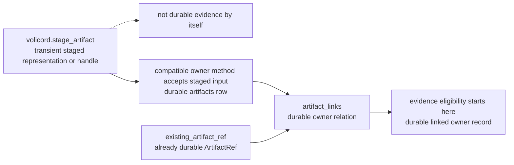

# Artifact storage

This document owns the artifact storage lifecycle for the baseline scope source design.

## Owns / Does not own

This document owns:

- staged artifact storage lifecycle
- `StagedArtifactHandle` validation against stored staging records
- promotion from a compatible staged handle to a persistent `ArtifactRef`
- persistent `existing_artifact` linking eligibility
- artifact body-read storage eligibility, availability, redaction, retention, and integrity boundaries

This document does not own:

- API artifact schemas; see [API Artifact Schemas](api/schema-artifacts.md)
- API method behavior; see the [API Methods](api/methods.md), [Stage-artifact method](api/method-stage-artifact.md), and [Record-run method](api/method-record-run.md)
- record-family overview; see [Storage Records](storage-records.md)
- baseline SQLite DDL, constraints, indexes, foreign keys, or migration table shape; see [Storage DDL](storage-ddl.md)
- generic method storage effects; see [Storage Effects](storage-effects.md)
- invocation-context security claims; see [Security](security.md) and [Runtime Boundaries](runtime-boundaries.md)

<a id="lifecycle-boundary"></a>
## Lifecycle summary

Artifact storage distinguishes staging, promotion, persistent linking, and body reads. `ArtifactRef` is the public API pointer to a registered persistent artifact. Storage implements persistent artifact authority through `artifacts` plus `artifact_links`. For record-family placement, see [Storage Records](storage-records.md). For response-branch persistence effects, see [Storage Effects](storage-effects.md).

This lifecycle view shows when staged material becomes a durable artifact
relation that can be evidence eligible. Solid arrows show storage lifecycle
transitions or durable linking paths; the dotted arrow marks the excluded path
where staging alone is not evidence. The diagram does not show artifact
body-read checks or table layout. This document owns lifecycle exactness; API
shapes and table overviews belong to
[API Artifact Schemas](api/schema-artifacts.md) and
[Storage Records](storage-records.md).



Only a compatible owner method can move staged input into promotion. Existing artifact reuse starts from an already durable `ArtifactRef`; it is not new staging.

| Stage | Details |
|---|---|
| Staging | [Lifecycle: staging](#artifact-lifecycle-staging) |
| Promotion | [Lifecycle: promotion](#artifact-lifecycle-promotion) |
| Existing artifact link | [Lifecycle: existing artifact link](#artifact-lifecycle-existing-artifact-link) |
| Artifact body read | [Lifecycle: artifact body read](#artifact-lifecycle-body-read) |

<a id="artifact-lifecycle-staging"></a>
**Lifecycle: staging**

Meaning:

- `volicord.stage_artifact` stores transient artifact bytes or a safe notice and returns a staged handle.

Evidence relationship:

- Staging alone does not create canonical evidence.

<a id="artifact-lifecycle-promotion"></a>
**Lifecycle: promotion**

Meaning:

- An owner method accepts a compatible staged handle and registers a persistent `ArtifactRef` plus required `artifact_links`.

Evidence relationship:

- Evidence coverage changes only when the owner method contract allows them.

<a id="artifact-lifecycle-existing-artifact-link"></a>
**Lifecycle: existing artifact link**

Meaning:

- An already persistent artifact is linked to a new owner relation.

Evidence relationship:

- The link is not new evidence unless the owner method records it as evidence.

<a id="artifact-lifecycle-body-read"></a>
**Lifecycle: artifact body read**

Meaning:

- A caller reads metadata or bytes for a registered `ArtifactRef`.

Conditions:

- The read must pass `operation_category`, `connection.mode`, redaction, availability, and owner-relation checks.

Owner boundary:

- `ArtifactRef` and `StagedArtifactHandle` API shapes are owned by [API Artifact Schemas](api/schema-artifacts.md).
- Storage-owned staging records and artifact lifecycle behavior are owned by this Artifact Storage document. The `artifact_staging`, `artifacts`, and `artifact_links` table overview is owned by [Storage Records](storage-records.md).

Allowed:

- `StagedArtifactHandle` is a transient handle returned by successful `volicord.stage_artifact`.
- `existing_artifact` links an existing persistent artifact.

Conditions:

- A staged handle can be treated as authority for a staged artifact only when it resolves to a compatible stored `artifact_staging` row or equivalent storage-owned staging record.

Not allowed:

- Do not treat the `StagedArtifactHandle` shape alone as artifact authority.
- Do not use `existing_artifact` to register a new artifact body.
- Do not treat caller-supplied paths, logs, capture claims, or local file references as registration authority in the baseline.

## Staging

Transient staging is not artifact authority. `artifact_staging` or an equivalent storage-owned staging record tracks staging facts.

Tracked facts:

- `handle_id`
- `project_id`
- `task_id`
- `created_by_actor_source`
- `sha256`
- `size_bytes`
- `content_type`
- `redaction_state`
- `status`
- `expires_at`
- consumption facts such as `consumed_by_run_id`, `promoted_artifact_id`, and `consumed_at`

Core records `created_by_actor_source` from the successful `volicord.stage_artifact` request's verified invocation context.

Conditions:

- A submitted `StagedArtifactHandle` can be treated as authority for a staged artifact only when it resolves to a compatible stored `artifact_staging` row or equivalent storage-owned staging record.
- The consuming owner method must check stored `created_by_actor_source` against that staging row.

Not allowed:

- Do not treat `created_by_actor_source` as a caller-provided authority claim.
- Do not treat the submitted `StagedArtifactHandle` shape alone as artifact authority.

Allowed:

- A successful `volicord.stage_artifact` returns `StageArtifactResult` with `base.effect_kind=staging_created`.
- It may write safe bytes or a safe notice under `artifacts/tmp/`, creating the transient staging path when staging occurs.
- The stored `artifact_staging.tmp_path` for staged bytes or notices is `project_home`-relative, with a shape such as `artifacts/tmp/<file>`.
- It may create the transient staging row.

Baseline staging defaults:

- Default staging TTL is 24 hours. `expires_at` is set to 24 hours after staging creation.
- The stored staged artifact body or safe notice must not exceed 10 MiB (10,485,760 bytes).
- Safe body storage is limited to safe text, JSON, Markdown, XML, or equivalent textual media types.
- Binary input is not stored as staged body bytes in the baseline. When binary material must be represented, staging stores only a safe textual notice unless a future owner defines a profile-gated safe binary body path.
- Raw secrets, tokens, credentials, and full sensitive logs must not be stored. Represent that material with a safe notice using `redaction_state=secret_omitted` or `redaction_state=blocked`, as applicable.
- These defaults do not add baseline artifact scanning, malware detection, secret scanning, OS sandboxing, command blocking, or network blocking.

Example staged artifact data:

```yaml
artifact:
  kind: test_log
  name: checkout_receipt_render_test.log
  description: "Test output for checkout receipt rendering."
staged_artifact_handle: staged_artifact_receipt_render_test_log_001
expires_at: "<future-expiration-timestamp>"
```

The example represents product test output prepared for staging. Staging creates only transient artifact storage.

Not allowed:

- Do not treat the example as a persistent `ArtifactRef`.
- Do not treat the example as canonical evidence until a compatible owner method records and promotes it under that method's contract.

Owner links:

- Method-effect questions such as evidence creation, replay rows, and state-version increments are owned by [Storage Effects](storage-effects.md).

## Staging handles

`artifact_staging.status` is a storage-owned transient handle lifecycle. The summary table stays short; detail blocks define the value meanings.

| Value | Summary | Details |
|---|---|---|
| `staged` | consumable candidate | [`staged`](#artifact-staging-status-staged) |
| `consumed` | consumed by owner method | [`consumed`](#artifact-staging-status-consumed) |
| `expired` | usable lifetime passed | [`expired`](#artifact-staging-status-expired) |
| `discarded` | transient object discarded | [`discarded`](#artifact-staging-status-discarded) |

<a id="artifact-staging-status-staged"></a>
**`artifact_staging.status=staged`**

Storage meaning:

- The handle is unexpired and unconsumed.
- A compatible owner method may consume it.

<a id="artifact-staging-status-consumed"></a>
**`artifact_staging.status=consumed`**

Storage meaning:

- A compatible owner method consumed the handle.
- Storage recorded the consuming Run and promoted artifact ids.

<a id="artifact-staging-status-expired"></a>
**`artifact_staging.status=expired`**

Storage meaning:

- The handle passed its usable lifetime.
- The handle cannot be consumed.

<a id="artifact-staging-status-discarded"></a>
**`artifact_staging.status=discarded`**

Storage meaning:

- The transient staging object was discarded before persistent registration.

Only `staged` is consumable. Terminal values cannot return to `staged`.

## Promotion

Only a compatible owner method may consume a staged handle and promote it to a persistent `ArtifactRef`.

Required conditions:

- `artifact_staging.status=staged`.
- The handle is unexpired.
- The handle belongs to the same project.
- The handle belongs to the same Task.
- The current verified `actor_source` matches `created_by_actor_source`.

Not allowed:

- Do not treat cross-actor staged artifact transfer as baseline-supported.
- Do not treat `StagedArtifactHandle` as a bearer token that any local caller may use.

The consuming transaction must validate:

- stored `project_id`, `task_id`, and `created_by_actor_source`
- expiration and consumed status
- `sha256`, `size_bytes`, and `redaction_state`

The consuming transaction may commit only after validation:

- promote only validated staged handles
- derive `artifacts.body_path` from `artifact_staging.tmp_path` as an artifact-store-relative path, such as `tmp/<file>`
- mark promoted handles `consumed`
- set the consuming Run and promoted artifact ids
- commit the durable `artifacts` row and required `artifact_links`
- update evidence coverage only as allowed by the method owner

Persistent path rules:

- `artifacts.body_path` is relative to the artifact-store root, normally `project_home/artifacts`.
- Persistent body use resolves the stored value as `artifact_store_root.join(body_path)`.
- Promotion must not copy `artifact_staging.tmp_path` unchanged into `artifacts.body_path`.
- Promotion must validate that `artifact_staging.tmp_path` is a safe `project_home`-relative path beneath the expected `artifacts/` component, then store the non-empty remainder as `artifacts.body_path`.
- Persistent validation rejects an empty `body_path`, absolute paths, parent traversal, platform-specific path prefixes, and stored values beginning with `artifacts/`.
- Persistent validation must not convert an invalid stored path into another stored representation.

## Existing artifacts

`existing_artifact` reuses the persisted artifact row only when the existing artifact remains compatible with the new use.

Required conditions:

- availability
- integrity facts
- redaction state
- same-project identity
- allowed Task scope

Allowed:

- A compatible `existing_artifact` may add a new `artifact_links` row for the new owner relation.
- The new link remains subject to uniqueness and same-project/same-Task rules.

Not allowed:

- `existing_artifact` must not clone bytes.
- `existing_artifact` must not register a new artifact body.
- `existing_artifact` must not skip integrity checks.
- `existing_artifact` must not use a raw artifact path as authority.

## Evidence eligibility

An artifact is evidence-eligible only when storage has:

- registered bytes or a safe metadata notice under the artifact store
- integrity facts: `content_type`, `sha256`, `size_bytes`, and `integrity_status`
- a `redaction_state`
- producer and retention facts
- an availability `status`
- an owner link to an existing owner record such as `task`, `change_unit`, `run`, `user_judgment`, `evidence_summary`, `evidence_observation`, or `blocker`

Evidence eligibility, artifact availability, and evidence sufficiency remain separate. Artifact owner relation integrity is required even though `artifact_links` is a polymorphic owner table.

Allowed:

- An `artifacts.status=available` row with `integrity_status=verified` and a valid owner link can support a coverage item.
- The coverage item can make `EvidenceSummary.status=sufficient` only when the required coverage item links that artifact to the claim and the item is `supported` or `not_applicable`.

Required validation:

- `owner_record_kind` is one of `task`, `change_unit`, `run`, `user_judgment`, `evidence_summary`, `evidence_observation`, or `blocker`.
- `owner_record_id` exists in the matching owner table.
- The owner belongs to the same `project_id` and `task_id`.
- The relation is compatible with the way the artifact is used.

Not allowed:

- Do not hide missing, unavailable, integrity-failed, or otherwise unusable artifacts as anything other than artifact-availability problems.
- Do not treat a raw `artifact_id` without a valid owner link as evidence support.

An artifact link does not:

- create the owner record
- satisfy a gate by itself
- prove evidence sufficiency
- perform QA
- create final acceptance
- accept residual risk
- close a Task

## Availability, redaction, and integrity

`artifacts.status` is an availability state. The summary table stays short; detail blocks define the value meanings.

| Value | Summary | Details |
|---|---|---|
| `available` | present and integrity-matched | [`available`](#artifacts-status-available) |
| `missing` | row remains, payload missing | [`missing`](#artifacts-status-missing) |
| `integrity_failed` | integrity facts mismatch | [`integrity_failed`](#artifacts-status-integrity_failed) |
| `unavailable` | retrieval path unavailable | [`unavailable`](#artifacts-status-unavailable) |

<a id="artifacts-status-available"></a>
**`artifacts.status=available`**

Storage meaning:

- The registered safe bytes or safe metadata notice is present.
- The stored payload matches stored integrity metadata.

<a id="artifacts-status-missing"></a>
**`artifacts.status=missing`**

Storage meaning:

- The artifact row remains.
- The registered bytes or safe metadata notice cannot be found.

<a id="artifacts-status-integrity_failed"></a>
**`artifacts.status=integrity_failed`**

Storage meaning:

- Available bytes or metadata do not match stored integrity facts such as `sha256` or `size_bytes`.

<a id="artifacts-status-unavailable"></a>
**`artifacts.status=unavailable`**

Storage meaning:

- The artifact store or required retrieval path cannot currently provide the registered bytes or safe metadata notice.

`artifacts.redaction_state` uses the supported `ArtifactRef.redaction_state` values from [API Value Sets](api/schema-value-sets.md#artifact-values). `sha256`, `size_bytes`, `content_type`, and `integrity_status` are artifact integrity facts for comparison and availability handling.

`ArtifactIntegrityStatus` values:

| Value | Meaning |
|---|---|
| `verified` | Persistent artifact facts are complete, and current bytes can be integrity-checked before authority use. |
| `corrupt` | The stored bytes or metadata are known not to match persisted integrity facts, or the stored verified-fact relationship is invalid. |

Persistent artifact facts:

- `content_type`
- `sha256`
- `size_bytes`
- `integrity_status`

Rules:

- New persistent artifacts must use `integrity_status=verified`.
- `verified` requires a non-empty `content_type`, a valid lowercase hexadecimal SHA-256 string, and nonnegative `size_bytes`.
- Authority-bearing artifact use also requires current-byte verification at use time: `artifacts.body_path` resolves from the artifact-store root, the body or safe notice exists inside the artifact-store boundary, no symlink or path escape is followed, the stored target is a regular file or owner-approved safe representation, `artifacts.status=available`, current byte size equals stored `size_bytes`, current SHA-256 equals stored `sha256`, and the stored content-type and integrity facts remain valid.
- Missing facts must not be represented as an empty hash, zero-byte size, or invented content type.
- Missing, unreadable, unavailable, or unusable backing bytes are represented through availability handling, not by changing `integrity_status`.
- `corrupt`, deleted, missing, unavailable, or modified artifacts cannot satisfy evidence or close authority requirements.
- Read-only status and close paths may compute an effective missing or integrity-failed result for the response without mutating stored artifact lifecycle state.
- Status displays may show that artifact facts are unavailable or corrupt without inventing facts.

Allowed:

- A `blocked`, `secret_omitted`, or `redacted` artifact may still have `artifacts.status=available` when the committed safe notice or redacted bytes are present and integrity-aware.
- `uri` resolves through Volicord storage, normally as `volicord-artifact://{project_id}/{artifact_id}`.
- Store redacted bytes, `secret_omitted` or `blocked` notices, safe handles, or other owner-approved safe representations instead of unsafe evidence bytes.

Not allowed:

- Do not treat `blocked` as an artifact availability status.
- Do not use `sha256`, `size_bytes`, or `content_type` as security guarantee claims.
- Do not treat `uri` as a caller-supplied arbitrary filesystem path.
- Do not treat `corrupt` as an evidence-eligible integrity state.
- Raw secrets, tokens, and full sensitive logs must not be stored as evidence bytes.

Owner links:

- Security guarantee claims belong to [Security](security.md).

## Body reads

Artifact body reads are separate from staged artifact promotion. Raw artifact path reads are not granted by default.

Artifact metadata or content reads require:

- a registered `ArtifactRef`
- the matching same-project `task_id`
- the required `artifact_links` owner relation
- the redaction/availability state needed by the caller's operation category
- the API/security owner requirements for `operation_category=read`
- any documented Agent Connection or User Channel provenance boundary

Not allowed:

- Do not treat a local path under the artifact store, an artifact `uri`, a staged path, or a copied file as sufficient authority to read or rely on artifact bytes.

## Validation and failures

Rejected staged-handle inputs remain artifact validation failures. They must not be hidden as evidence sufficiency, invocation-context mismatch, capability insufficiency, or method success.

| Failure type | Details |
|---|---|
| Existence or lifecycle problem | [Existence or lifecycle problem](#staged-handle-failure-existence-lifecycle) |
| Scope mismatch | [Scope mismatch](#staged-handle-failure-scope) |
| Actor-source mismatch | [Actor-source mismatch](#staged-handle-failure-actor-source) |
| Integrity mismatch | [Integrity mismatch](#staged-handle-failure-integrity) |

<a id="staged-handle-failure-existence-lifecycle"></a>
**Existence or lifecycle problem**

Examples:

- missing
- expired
- already consumed
- discarded

<a id="staged-handle-failure-scope"></a>
**Scope mismatch**

Examples:

- mismatched
- cross-task
- cross-project

<a id="staged-handle-failure-actor-source"></a>
**Actor-source mismatch**

Examples:

- cross-actor handoff
- wrong `created_by_actor_source`

<a id="staged-handle-failure-integrity"></a>
**Integrity mismatch**

Examples:

- wrong `sha256`
- wrong `size_bytes`
- wrong `redaction_state`
- integrity-incompatible

If artifact validation fails before commit, storage must not change artifact lifecycle records such as `artifact_staging.status`, `consumed_by_run_id`, `promoted_artifact_id`, `artifacts`, or `artifact_links`. Broader no-effect branch semantics belong to [Storage Effects](storage-effects.md).

## Retention boundary

Allowed:

- Unconsumed or expired `artifact_staging` rows and `artifacts/tmp/` staging bytes or notices may be marked `expired` or `discarded`.
- Transient bytes may be cleaned before registration.

Condition:

- These transient staging materials are not evidence authority.
- Once an `artifacts` row is committed, retention purge, project teardown, or destructive cleanup is outside ordinary baseline mutation behavior.

Required owner-defined contract:

- That path needs an explicit storage or migration contract.
- The contract must preserve artifact hashes, owner links, events, and replay rows, or mark affected refs invalid for recovery.

Not allowed:

- A retention or migration path must not silently delete evidence support that current records still name.

## Related owners

- [API Artifact Schemas](api/schema-artifacts.md) for `ArtifactRef`, `ArtifactInput`, and `StagedArtifactHandle` shapes.
- [Stage-artifact method](api/method-stage-artifact.md), [Record-run method](api/method-record-run.md), and [API Methods](api/methods.md) for `volicord.stage_artifact`, `volicord.record_run`, and artifact read behavior.
- [Storage Effects](storage-effects.md) for whether a response branch creates storage effects.
- [Storage Records](storage-records.md) for `artifact_staging`, `artifacts`, and `artifact_links` table overview.
- [Security](security.md) for access and guarantee non-claims.
