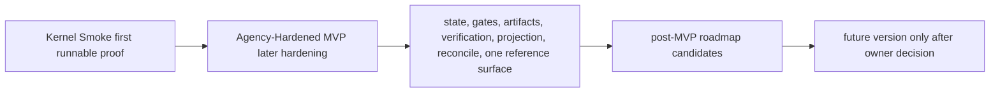
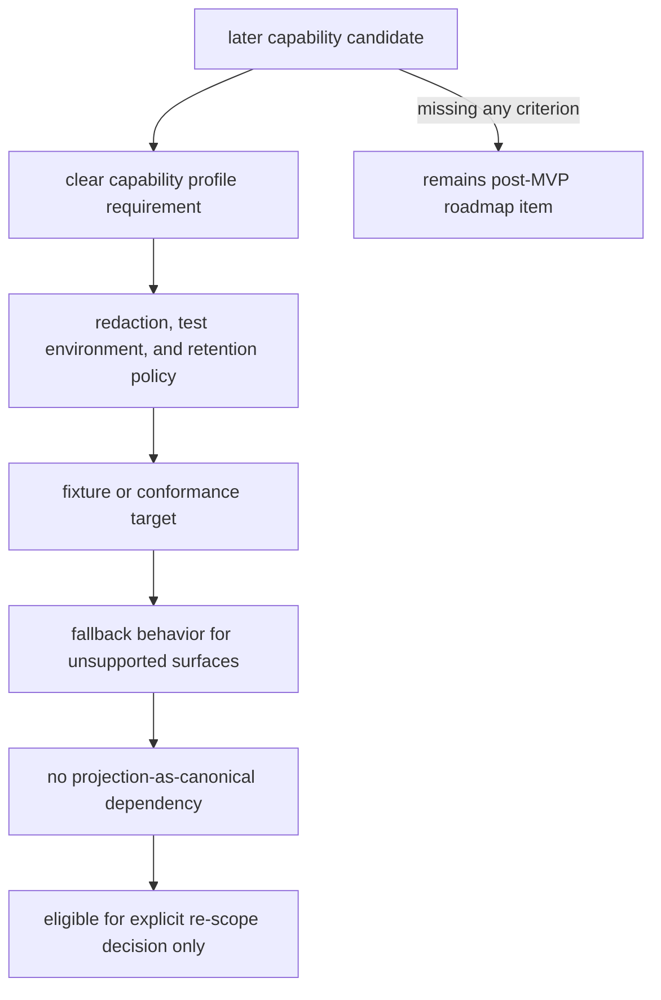
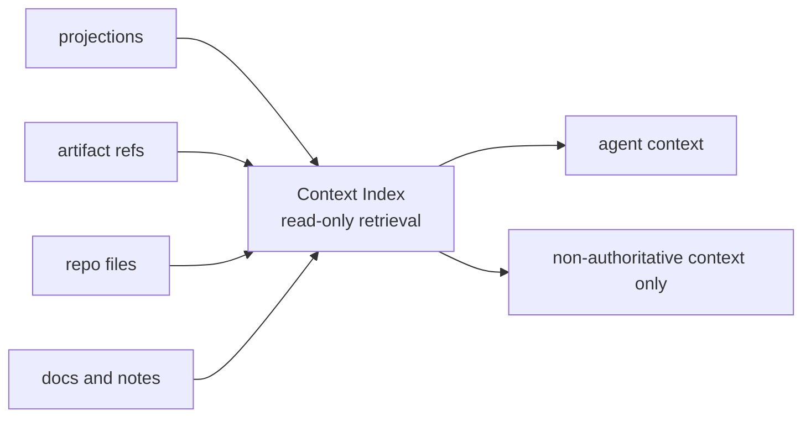
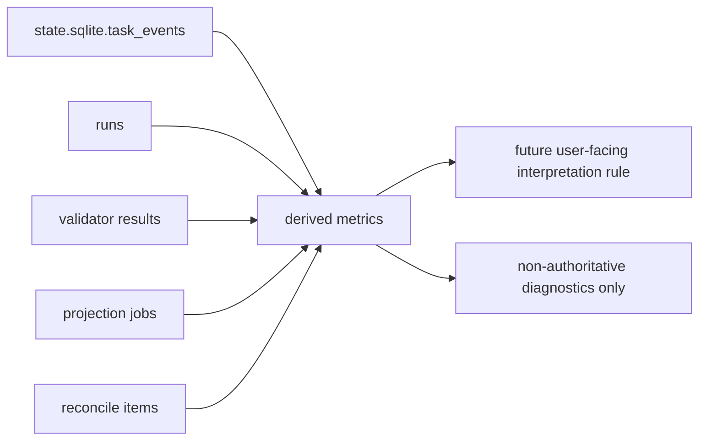

# Roadmap

## What this document helps you do

This document collects post-MVP automation candidates and capability expansions so readers can see what may come later without treating it as first-implementation work, current authority, or MVP-required behavior.

This is roadmap documentation. It does not authorize runtime/server implementation, generated operational files, executable fixtures, or runtime data before the documentation set is accepted for implementation planning. The first implementation/proof target is Kernel Smoke. Agency-Hardened MVP belongs to later MVP hardening in Build docs, not to this roadmap, and the items below stay outside MVP unless owner docs promote and prove them.

## Read this when

- You want to know which ideas are intentionally outside the MVP implementation contract.
- You are checking whether a future capability needs policy, fixture, and fallback decisions before promotion.
- You need to keep roadmap items non-authoritative until an owner explicitly scopes and promotes them.

## Before you read

For current implementation planning, start with [Build: Implementation Overview](build/implementation-overview.md), [Build: First Runnable Slice](build/first-runnable-slice.md), and [Build: MVP Plan](build/mvp-plan.md). For exact contracts, use the Reference docs.

## Main idea

Roadmap items are useful future candidates, not current authority paths or MVP requirements. A roadmap item may become scoped work only after an owner decision promotes it with clear capability, policy, fixture, fallback, and projection-authority boundaries.

## This is not MVP scope

This document is not part of the MVP implementation contract.

It does not own kernel invariants, public MCP schemas, MVP implementation requirements, or required MVP conformance. The MVP proves the local kernel: state, gates, artifacts, verification, projection, reconcile, and one reference surface. The items below are useful follow-ons after those basics are stable. For the MVP implementation order, use [Build: MVP Plan](build/mvp-plan.md); for strict API, storage, projection, and fixture contracts, use the Reference docs.

The first implementation/proof target is Kernel Smoke. Agency-Hardened MVP is later MVP hardening. This roadmap starts only after those Build-owned proof targets have clear owner-doc coverage. It is not an alternate route around Kernel Smoke, Agency-Hardened MVP, or the Core state/`task_events`/artifact path. Dashboard, hosted workflow UI, Browser QA Capture, Cross-Surface Verification, Context Index, Native Hook Expansion, Advanced Sidecar Watcher, Local Derived Metrics, connector marketplaces, team workflow, and orchestration can collect, display, or extend Harness behavior later; they do not replace the first runnable authority loop.

Kernel Smoke and Agency-Hardened MVP are both MVP delivery stages, not roadmap scope. This roadmap must not absorb kernel authority, Decision Packet, residual-risk visibility, detached verification, Manual QA, recover/export, or fixture-conformance behavior that the MVP owner documents require. A roadmap item may read, display, recommend, provide artifact candidates, or act as a fixture candidate only when an owner doc allows that limited use. Any durable artifact registration or attachment must still go through an existing Core/MCP artifact owner path or a future promoted owner contract. Being listed here is never an authority path.

## Promotion rule

A roadmap candidate can become v1 or later scoped work only after a future owner decision gives it all of the following:

- an explicit future-version owner decision; usefulness during MVP implementation is not promotion
- a clear capability profile requirement
- a redaction and secret/PII handling policy
- a test environment and artifact retention policy when it captures runtime surfaces
- a fixture or conformance target
- a fallback behavior for unsupported surfaces
- no dependency on treating projections as canonical state

The same rule applies to Dashboard, hosted workflow UI, Browser QA Capture, Cross-Surface Verification, Broad Connector Ecosystem, Native Hook Expansion, Preventive Guard Expansion, Advanced Sidecar Watcher, Context Index, Local Derived Metrics, and every other item below. Item-specific notes may add constraints, but they do not relax this promotion rule.

## Roadmap Items

### Dashboard

A dashboard or hosted workflow UI can visualize active Tasks, gates, approvals, evidence coverage, projection freshness, artifact integrity, and reconcile items.

Later because MVP should first stabilize the records, projections, and conformance fixtures that the dashboard or hosted UI would display. Until explicitly promoted through owner docs, a dashboard or hosted workflow UI is a read-only diagnostic/workflow display over `state.sqlite`, artifact refs, and projection job status. It must not become the source of truth for Task state, evidence, acceptance, implementation readiness, close readiness, projection freshness, workflow routing, or metric interpretation.

### Broad Connector Ecosystem

A broad connector ecosystem or marketplace can add more agent surfaces, evaluator environments, or workflow integrations after the reference surface is stable.

Later because MVP assumes one local project, one reference surface, local MCP reachability, and one Core authority path. Until explicitly promoted through owner docs, connector ecosystem work is documentation, prototype, or fixture-candidate material only. It must not widen MCP exposure, create authority, bypass Core, replace the reference surface proof, or make unsupported surfaces fail MVP by default.

### Browser QA Capture

Browser QA Capture is a v1/post-MVP priority candidate, not the first build target and not an MVP requirement. Automatic or assisted capture can gather screenshots, console logs, network traces, accessibility snapshots, and workflow recordings for Manual QA records where the connected surface supports it.

Promotion requires a declared `T6 QA Capture` capability profile, redaction and secret/PII handling policy, test environment setup, artifact retention rules, fixture or conformance target, fallback behavior for unsupported surfaces, and no projection-as-canonical dependency.

Until explicitly promoted through owner docs, Browser QA Capture may be discussed as a candidate, prototype, manual capture aid, or artifact-candidate source. Captured browser QA material can improve QA evidence only when it is registered and linked through existing Manual QA/artifact paths or through a promoted owner contract, commonly as `qa_capture`, `screenshot`, `log`, or `other` when the captured file is a console log, network trace, accessibility snapshot, or workflow recording. It is useful but non-authoritative: it is not final acceptance, does not replace Manual QA judgment when UI/UX, copy, accessibility interpretation, workflow, product taste, or visual output needs human judgment, does not replace detached verification unless the verification independence requirements are also met, and does not replace the existing Manual QA/artifact flow.

Unsupported surfaces should fall back to human Manual QA notes and manually supplied artifacts. MVP supports Manual QA records and artifact refs without requiring automated browser capture.

### Cross-Surface Verification

Cross-surface verification can send a verification bundle to a different agent surface or evaluator environment.

Later because MVP only needs one reference surface plus detached verification bundles/manual evaluator instructions. Until explicitly promoted through owner docs, Cross-Surface Verification is non-authoritative: sending a bundle to another surface must not record an Eval, satisfy verification, raise assurance, accept a result, or close a Task by itself. Promotion must satisfy the rule above and define how any resulting Eval or finding returns through Core without depending on projections as canonical state.

### Native Hook Expansion

Native hooks can provide stronger pre-tool guards, command interception, file write blocking, or richer artifact capture in surfaces that support them.

Later because hook APIs vary by surface. MVP may use a concrete hook only when the reference surface actually supports it; otherwise native hooks are a capability-dependent enhancement. Until explicitly promoted through owner docs, Native Hook Expansion is non-authoritative: a hook can support `prepare_write`, capture artifacts, or improve guard display, but it must not replace the Core authority path, grant Approval, satisfy gates, or make unsupported surfaces fail the MVP by default.

### Preventive Guard Expansion

Preventive guard expansion can become future work only for surfaces that prove a concrete pre-tool blocking path for the covered operation.

Later because MVP may honestly start with cooperative or detective guarantees. Until explicitly promoted through owner docs, preventive guard expansion is not an MVP requirement and must not be claimed by label alone. Cooperative or detective guard/freeze displays can hold, warn, or detect within their proven capability, but they must not be described as pre-execution blocking.

### Advanced Sidecar Watcher

An advanced sidecar watcher can observe file writes, command execution, generated-file drift, artifact capture opportunities, and repo baseline drift in near real time.

Later because MVP can start with cooperative `prepare_write`, git diff checks, artifact registration, and detective validators. Until explicitly promoted through owner docs, an Advanced Sidecar Watcher is a non-authoritative observer. Its observations must route through Core records, validators, artifact registration, or reconcile before they affect Harness state, and it should not be required for the core state model to work.

### Parallel Orchestration

Parallel Change Unit orchestration can split work into multiple active implementation lanes, manage dependency DAGs, isolate baselines, and reconcile concurrent evidence.

Later because parallel execution depends on stable locks, baseline freshness, Approval scope composition, artifact partitioning, and close semantics. Until explicitly promoted through owner docs, dependency DAG support remains metadata-only and no concurrent lane scheduler is required for MVP.

### Context Index

A Context Index is a read-only context provider that may help an agent find relevant projections, artifact refs, repo files, docs, or user notes without treating indexed knowledge as Harness state or authority. It is not the first build target and not an MVP prerequisite.

Later because indexed memory can blur local authority if introduced before the kernel and source-of-truth boundaries are stable. Until explicitly promoted through owner docs, a Context Index is non-authoritative retrieval only. A future Context Index may rank, summarize, or retrieve context, but it cannot replace existing authority paths unless the owner docs for those paths explicitly change. Retrieved context may inform work, compact status, status interpretation, source excerpts, and pull refs; it cannot authorize writes or create Write Authorization, resolve Decision Packets, grant Approval, satisfy gates, create evidence, perform or record verification, record QA, waive QA/verification or any other gate/close-relevant requirement, record result acceptance, record residual-risk acceptance, upgrade assurance, enqueue or refresh projections or change projection freshness, declare implementation readiness, or close Tasks.

In addition to the promotion rule, a Context Index should become v1 work only if a future decision assigns freshness and staleness rules, privacy/redaction behavior, connector capability expectations, fixture coverage, and a display rule that distinguishes retrieved context from canonical state.

### Local Derived Metrics

Local Derived Metrics can derive diagnostic rates, counts, durations, and guard-trigger summaries from `state.sqlite.task_events`, runs, validator results, projection jobs, and reconcile items.

Later because metrics are derived values, not authority. Until explicitly promoted through owner docs, local metrics are read-only diagnostic displays. They may help users spot process bottlenecks, reporting gaps, and recurring operational patterns, but they are diagnostic only. Metric readouts must not mutate state, satisfy gates, authorize writes, grant Approval, create evidence, enqueue or refresh projections, change projection freshness, change close readiness or implementation readiness, perform or record verification, record QA, waive QA or verification, accept residual risk, accept the result, upgrade assurance, or close Tasks.

Candidate derived metrics:

- `direct_to_work_escalation_rate`
- `approval_turnaround_time`
- `verify_latency`
- `reopen_within_7d`
- `evaluator_blocked_due_to_missing_evidence`
- `same_session_verify_guard_triggered`
- `surface_fallback_rate`
- `mcp_connection_failure_rate`
- `projection_stale_duration`
- `reconcile_pending_count`
- `shaping_unresolved_decision_count`
- `horizontal_exception_rate`
- `tdd_red_missing_rate`
- `manual_qa_pending_duration`
- `evidence_insufficiency_rate`
- `architecture_drift_warning_count`
- `domain_language_mismatch_count`
- `interface_review_required_count`

In addition to the promotion rule, these metrics should become v1 work only if a future decision assigns fixture coverage or conformance target, retention behavior, privacy/redaction behavior when needed, fallback behavior for unsupported inputs, and a user-facing interpretation rule. Even then, the metric value remains derived; any state change must still go through the normal Core owner path.

### Team Profile Export And Import

Team profile export/import can share policy defaults, connector profiles, surface capability assumptions, validator profiles, and project setup templates across a team.

Later because MVP is a local kernel. Team workflow, shared workspaces, permissions, and profile sharing need versioning, privacy review, secret handling, and conflict behavior before they should affect runtime state. Until explicitly promoted through owner docs, team workflow is not an MVP requirement and must not become an authority or acceptance path.

## Additional Later Candidates

The following are also later and non-authoritative unless a future batch promotes them with owner docs, fixtures, fallback behavior, retention/redaction decisions where relevant, and implementation ownership:

- deployment, canary, rollback, merge, and production-monitoring automation; Release Handoff may exist earlier only as a v1 report/export profile that leaves those authorities external
- artifact dashboard
- worktree-based fresh verify automation
- advanced architecture drift validator
- advanced public interface validator
- semantic domain language consistency checks
- status/approval/acceptance/Manual QA card UX expansion
- multi-agent policy and scheduling
