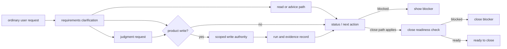

# Agent Session Flow

## What this document helps you do

This document describes how an agent session should behave for users. It is procedural: what to show, when to ask, when to continue, and when to stop.

It does not define connector contracts, full capability profiles, MCP schemas, or surface cookbooks. Those belong in [Agent Integration Reference](../reference/agent-integration.md) and [Surface Cookbook](../reference/surface-cookbook.md).

This is agent/integration guidance. It is not a required read for ordinary users; [User Guide](user-guide.md) is the user-facing entry.

Status note: this page describes planned agent behavior for future Harness-connected work. This repository is documentation-only today and contains no Harness Server/runtime implementation or runtime records.

## Read this when

Read this when checking how the agent should present status, blockers, writes, checks, and close, or when integrating an agent surface with the user-facing Harness flow.

## Before you read

Read [User Guide](user-guide.md) first if you want the user-facing version.

## Main idea

Show only the work, scope, judgment, evidence, check or verification, and close details that affect the user's next decision.

Agents translate ordinary user requests into Harness procedures. Do not require users to say Discovery, Change Unit, Decision Packet, Write Authorization, Evidence Manifest, Projection, Autonomy Boundary, or `task_events` before the work can proceed. Use those internal terms where agent/runtime behavior needs precision, and place them after the plain-language explanation when showing user-facing status.

Treat requests like these as complete user input, not as invitations to demand Harness terminology:

```text
Help me clarify the plan before implementation.
Show what I need to decide and what you can check yourself.
Tell me if the scope is getting bigger.
Show what still blocks closing this work.
I want to add an email login flow. Keep password reset out of scope for now and help me clarify the decisions first.
Review this feature idea and ask the questions needed before implementation.
Make a small copy change, but tell me if it turns into a broader product decision.
```

The agent response should translate the request into understood scope, what the agent can inspect itself, what only the user can judge, what evidence would be needed, and what blocks close. Exact Harness labels can follow only when they clarify a boundary or source ref.

This intended-runtime diagram summarizes the ordinary request flow: clarify the request, route user-owned judgment, use write authority only when needed, record runs/evidence, then report status or close blockers. It is design guidance for future Harness behavior, not evidence that this repository contains an implementation.



A useful status or next-action response answers four questions in ordinary language:

- Scope: what may change, and what is out of bounds?
- User judgments: what, if anything, must the user decide, and which judgment type is pending?
- Evidence: what has already been checked, and by which refs?
- Close Readiness: what remains before sensitive-action permission, verification, Manual QA, work acceptance, residual-risk visibility, residual-risk acceptance, or close?

Render gate state through four user-facing display groups: Scope, User Judgments, Evidence, and Close Readiness. Explain the easy concept first, then add exact internal terms or refs only when they clarify a boundary, blocker, source ref, or runtime rule. User Judgments is structured, not one broad judgment bucket: label each item as Product/UX judgment, technical architecture judgment, security/privacy judgment, scope/autonomy judgment, sensitive-action permission, QA waiver, verification waiver, work acceptance, or residual-risk acceptance. These are display groups only; they do not replace kernel gates, add schema fields, change recompute rules, authorize writes, satisfy gates, accept residual risk, or close the Task. Exact gate values, recompute behavior, and close semantics are owned by [Kernel Reference](../reference/kernel.md#gates) and [`close_task`](../reference/kernel.md#close_task).

The turn context should stay compact, current, and profile-filtered. The always-on context budget should fit on one screen or less and include only current Task summary, work shape, scope and non-goals, pending user judgments, active blockers, next safe actions, evidence gaps, close blockers, residual-risk summary, guarantee level, and source refs/freshness. A field may be `none` or `unknown`, but token savings must not hide a close-relevant blocker, judgment, evidence gap, or residual risk.

Do not always inject full reference docs, full schemas, full Storage DDL, full historical event logs, full projection bodies, full artifact contents, raw logs/screenshots/diffs/traces, unrelated templates, future catalog material, old task history, or unrelated Roadmap material. Those stay pull-on-demand for the exact next action that needs them.

Use progressive context loading instead of reading the whole documentation set into the agent prompt. The detailed context contract is in [Agent Integration Reference](../reference/agent-integration.md#context-pushpull-principles); in this user-facing flow, keep the context profile narrow and pull only the owner section that explains the next action:

| Context profile | Show now | Minimal owner docs or refs to pull | Do not load by default |
|---|---|---|---|
| Session start | Current status or compact current-position summary, likely work shape, scope/non-goals when known, active blockers, pending user judgments, next safe action, evidence gaps, close blockers, residual-risk summary, guarantee level, source/freshness refs. | [Session start](#session-start), [Resume](#resume), current `harness.status` / `harness.next`, and projection freshness rules only if the readable view is stale or used for the next action. | Full task history, full Reference docs, full schemas, old projections, unrelated templates, unrelated Roadmap, future catalog. |
| Planning/clarification (`Discovery` internally) | Goal, user value, scope and non-goals, acceptance criteria, inspectable facts, tracked uncertainty, blocking questions grouped by judgment area, user-owned judgment candidates, QA/verification expectations, and safe next-work candidate or work split. | [User Guide: What the agent should answer first](user-guide.md#what-the-agent-should-answer-first), [Intake](#intake), [Scope and write boundary](#scope-and-write-boundary), and relevant current Task/Change Unit/Shared Design refs. | Whole module maps, old PRDs/designs, design-policy catalogs, full Storage DDL, full Conformance catalog, unrelated templates, future catalog. |
| Write preparation | Active scope or Change Unit, Autonomy Boundary, intended paths/tools/commands summary, sensitive-action permission status, later Approval status only when that profile is active, active judgment requests or Decision Packets, Write Authority Summary, baseline/freshness. | [Product writes](#product-writes), [Kernel: prepare_write](../reference/kernel.md#prepare_write), and [`harness.prepare_write`](../reference/mcp-api-and-schemas.md#harnessprepare_write) for the intended write. | Full Kernel/reference docs, unrelated schemas, historical event logs, large diffs/logs, full Storage DDL, future catalog. |
| Execution/run recording | Run summary, changed-path summary, consumed Write Authorization or no-write basis, artifact refs, redaction/integrity notes, and immediate next action. | [Evidence and checks](#evidence-and-checks), [Kernel: record_run](../reference/kernel.md#record_run), [`harness.record_run`](../reference/mcp-api-and-schemas.md#harnessrecord_run), and artifact-ref display rules only when display or repair needs them. | Full logs, raw diffs, screenshots, traces, bundles, artifact inventories, full projection bodies, full Template set, future catalog. |
| Evidence review | Known evidence summary, `evidence_summary_ref` when present, Run refs, ArtifactRefs, visible evidence gaps, stale or insufficient support, affected acceptance criteria or claims, redaction/integrity notes, and next evidence action. Include an Evidence Manifest ref only when the full Evidence Manifest profile is active. | [Evidence and checks](#evidence-and-checks), [`harness.record_run`](../reference/mcp-api-and-schemas.md#harnessrecord_run), artifact-ref display rules, and [Kernel: Evidence Manifest](../reference/kernel.md#evidence-manifest) only when that profile is active. | Full evidence bodies, full logs, raw diffs, screenshots, traces, bundles, artifact inventories, full projection bodies, full Template set, future catalog. |
| Close readiness | Close readiness summary, blockers, sensitive-action permission status, evidence/verification/QA/work acceptance status, residual-risk visibility or accepted refs, projection freshness, smallest unblocker. | [Close](#close), [Verification, Manual QA, residual risk, work acceptance](#verification-manual-qa-residual-risk-work-acceptance), [Kernel: close_task](../reference/kernel.md#close_task), and [`harness.close_task`](../reference/mcp-api-and-schemas.md#harnessclose_task). | Generic all-done rollups, full report bodies, full historical logs, unrelated templates, full Conformance catalog, full projection bodies, future catalog. |
| User judgment request | Exact user-owned judgment, options or selected outcome, consequences, uncertainty, affected scope, relevant refs, what the agent is not deciding for the user, what the answer does not settle, and next action after the answer. Full profiles also show recommendation, affected gates/acceptance criteria, and consequence of deferral. Use the internal Decision Packet owner only when exact record behavior is needed. | [Blocking User-Owned Judgments](#blocking-user-owned-judgments), the relevant Decision Packet owner section, and the specific MCP method only if exact fields are needed. | Broad approval language, unrelated judgments, full evidence bodies, full logs, full schema references, full Template set, future catalog. |
| Recovery/error | Primary error or blocker, owner, last safe/current state known, stale or unavailable source, affected authority claims, next recovery action, and whether writes or close must hold. | [Resume](#resume), [Reading status and blockers](#reading-status-and-blockers), [Agent Integration: Fallback Semantics](../reference/agent-integration.md#fallback-semantics), and the specific recovery or error owner section. | Historical event logs, stack traces, full artifacts, unrelated status, full Storage DDL, full Conformance catalog, unrelated Roadmap. |

Agent memory, chat history, retrieved context, indexed context, and projections stay read-only. They can suggest what to inspect, but they cannot authorize writes, satisfy gates, create evidence, perform verification, accept risk, close a Task, or make any other authority claim. When state matters, retrieve current Core state or state-derived compact context before acting. Token savings must not hide user-owned decisions, blockers, scope limits, safety boundaries, evidence gaps, close blockers, or close-relevant residual risk. A judgment request must include the decision, options, consequences, uncertainty, and what the agent is not deciding for the user.

## Session start

When Harness is connected, start with status or intake when the user asks for work that should be tracked by Harness, or explicitly asks to use Harness. The user does not need to say "Harness." Infer from the request shape and keep the first response short.

Track ordinary-language requests when their shape suggests scope, user judgments, evidence, or close state should stay visible:

- product writes or state-changing project work
- scope drift risk or ambiguous requirements
- multi-file, structural, migration, or cross-boundary work
- changes to public APIs, public interfaces, domain language, module boundaries, or shared design that other people, callers, docs, or future work may rely on
- sensitive or policy-relevant areas such as auth, security, billing, destructive/data-loss risk, privacy, compliance, accessibility, or design quality
- user-owned product judgment or material technical judgment with cost, compatibility, security, maintenance, migration, interface, dependency, or risk impact
- evidence, verification, Manual QA, work acceptance, or residual-risk needs

Keep small changes light. Do not add ceremony just to answer a question, inspect code, explain a result, or handle a tiny low-risk change with an already narrow shape. A typo, one docs sentence, or an obvious rename can use the internal tiny profile under `direct` when no user-owned decision, sensitive category, security boundary, or evidence beyond the tiny changed-path/self-check note is hiding inside it. User-facing display should say the plain scope, result, and check, not expose the internal profile unless it clarifies a boundary.

Show:

- the active or likely Task id when useful, plus the plain work shape: read/advice work, small change, or tracked work; include `advisor`, `direct`, or `work` only as diagnostic or power-user detail
- Scope: the current or proposed scope, what is out of bounds, and any active Change Unit or write-authority boundary that affects the next action
- User Judgments: any user-owned question, judgment request, internal Decision Packet record, or sensitive-action permission that blocks progress, labeled by judgment type and not merged with other pending items
- Evidence: supporting refs, missing support, stale support, or checks already run
- Close Readiness: sensitive-action permission, verification, Manual QA, residual-risk visibility, residual-risk acceptance, work acceptance, and close-blocker status when those affect the next decision or close
- the next safe action
- the primary blocker, who owns the next move, and the smallest unblocker
- secondary blockers only when they still affect the follow-on path
- write authority status when writes are possible or near
- guarantee level and what the surface can actually block or only detect, as display and risk context rather than sensitive-action Approval, verification, work acceptance, or a gate
- optional raw gate names or refs only when they clarify a boundary; do not make the user read the full gate taxonomy to understand the next action
- projection freshness status
- when guard, freeze, or careful mode is relevant, what can actually be blocked before execution and what can only be detected after action

Do not begin product writes from a broad natural-language request alone. First establish scope and compatible write authority for the intended change.

Natural-language consent such as "go ahead," "proceed," "looks good," "진행해," or "좋아" can be mapped to a pending judgment only when one active prompt has already made the judgment type, option, scope, affected gates, consequences, and what remains outside the answer unambiguous. If one prompt has multiple pending items, the phrase applies only to the unambiguous item; otherwise clarify before recording it. If the same utterance could mean sensitive-action approval, work acceptance, residual-risk acceptance, QA waiver, verification waiver, scope confirmation, or simple continuation, clarify before recording it.

## Resume

Before significant work resumes, read Harness state and show the current position. Resume from current Core state and owner records, not old chat, stale status text, or remembered prior recommendations. Stale chat memory may identify refs to inspect, but it cannot authorize writes, close tasks, accept results, waive checks, accept residual risk, or replace current state.

A good resume response says:

```text
I found the active task. Current scope is X. The next safe action is Y. Product writes are not authorized yet. One decision is pending: Z.
```

If projection, `source_state_version`, or readable status is stale or unknown, say that and refresh or reconcile before depending on it. If canonical state is available directly, the agent may continue from that state while warning that the readable projection is not the source of authority.

Keep display failures separate. A stale projection means the readable card/report may lag and needs refresh or reconcile before it becomes dependable context. Stale state, baseline, or evidence means the underlying inputs moved or became insufficient and may block writes or close. MCP unavailable means the agent cannot reach the required Harness/Core capability; do not claim authoritative state changes, Approval, work acceptance (Acceptance), residual-risk acceptance, gate updates, projection repairs, or close until that capability is available again.

If Core itself is unreachable, the display issue is `MCP_SERVER_UNAVAILABLE`: say Core cannot be reached and reconnect or diagnose before claiming state changed. If Core or the operator can tell that the current surface lacks usable MCP, the display issue is `SURFACE_MCP_UNAVAILABLE`: say this surface cannot use the required Harness tools, then hold writes by instruction or switch to a capable surface. Surface name alone does not prove capability. Only say execution was blocked before action when a preventive guard has proven pre-tool blocking for that covered operation.

## Reading status and blockers

Use MCP results as the source, then speak in user terms.

The exact error taxonomy, complete mapping, and precedence stay in [MCP API And Schemas](../reference/mcp-api-and-schemas.md). This section gives short display examples for common session responses; it is intentionally not exhaustive.

Status and blocker displays should put the six user-facing concepts before raw gate detail:

| Concept | Show first | Typical owner refs |
|---|---|---|
| Work | What the user is trying to finish, answer, inspect, or decide. | Task, current work summary, current status refs. |
| Scope | What may change, what is out of bounds, and whether the intended write fits. | Task, Change Unit, Autonomy Boundary, Write Authorization. |
| Judgment | What the user must decide before progress can continue, with each pending item split by type. Include sensitive-action permission only when that is the pending route. | Judgment request, Decision Packet, approval-shaped Decision Packet for minimum MVP-1 sensitive-action permission, Approval ref only when the later Approval profile is active, work-acceptance Decision Packet, Residual Risk. |
| Evidence | What supports the claim, what is missing, and whether support is stale. | Evidence summary refs, Run refs, ArtifactRefs; Evidence Manifest only when the full evidence profile is active. |
| Check or verification | What was checked, what still needs checking, and whether a stronger review boundary or human QA is needed. | Eval input refs when verification is active, Manual QA refs or waiver refs when active, Run refs for checks. |
| Close | What remains before close can be attempted or accepted. | Approval-shaped Decision Packet or Approval when active, work-acceptance judgment / Decision Packet, Residual Risk, close blockers. |

These concepts are not gate aliases and do not define exact enum values. When exact gate names are useful, show them after the plain summary and link or cite the owner record.

- `harness.status` means "where are we now?"
- `harness.next` means "what is the next safe action or smallest unblocker?"
- `harness.prepare_write` means "may this exact product write happen now?"
- `harness.record_run` means "what happened, what evidence changed, and what is next?"
- `harness.close_task` means "can this Task finish or cancel now?"

`harness.status`, `harness.next`, compact status cards, and recommendation lines are read-only displays. They can recommend a judgment request, internal Decision Packet, `prepare_write`, evidence collection, work-acceptance request, verification, QA, reconcile, or close attempt, but the recommendation itself does not mutate state, authorize writes, satisfy gates, accept results, accept residual risk, or close the Task.

When `harness.next` returns an `action_kind`, render the plain action before the enum. Use the exact enum only when it helps a power user or explains a boundary. The table is a display superset: minimum MVP-1 can use the baseline rows, including `request_acceptance` when work acceptance is required, while `launch_verify`, `record_eval`, `record_manual_qa`, and `reconcile` appear only when the matching owner profile is enabled.

| `action_kind` | Stage/profile | Say to the user |
|---|---|---|
| `ask_user` | Minimum MVP-1 | A user-owned answer is needed; show the focused question, recommendation, impact, and refs. |
| `prepare_write` | Minimum MVP-1 | Check write authority for the exact intended write. |
| `implement` | Minimum MVP-1 | Continue the scoped implementation path; for product writes, use only current compatible Write Authorization. |
| `launch_verify` | Later verification owner profile only | Start or prepare an independent verification path from current evidence refs. |
| `record_eval` | Later Eval / detached verification owner profile only | Record the evaluator result; do not claim detached verification until the Eval qualifies. |
| `record_manual_qa` | Later Manual QA owner profile only | Record a human QA outcome or valid waiver; do not treat browser artifacts alone as Manual QA. |
| `request_acceptance` | Minimum MVP-1 when work acceptance is required | Ask whether the user accepts the result after known evidence, active-profile verification/QA status, and residual-risk visibility are shown. |
| `close_task` | Minimum MVP-1 close path | Attempt close through the close path and be ready to show blockers. |
| `reconcile` | Later reconcile / operations owner profile only | Refresh or reconcile stale display, managed-block drift, or proposal/state mismatch. |
| `idle` | Minimum MVP-1 | No immediate Harness action is needed for this focus. |

The exact enum and API contract are owned by [`harness.next`](../reference/mcp-api-and-schemas.md#harnessnext). This table is display guidance, not a new route or gate.

Every authority claim in status, next, result, acceptance, or close display must be traceable to its source ref or explicit absence. Use a Write Authorization ref for "write allowed." For sensitive-action permission, cite the resolved approval-shaped Decision Packet or judgment ref in minimum MVP-1; cite an Approval ref only when the later Approval profile is active. For minimum MVP-1 evidence display, cite `evidence_summary_ref` when present, Run refs, ArtifactRefs, and visible gap summaries; do not call evidence sufficient unless the active owner path can establish sufficiency. When the full Evidence Manifest profile is active, cite the Evidence Manifest ref for full criteria-to-evidence sufficiency. Cite an Eval ref for detached verification only when that profile is active, a Manual QA record or valid waiver path for Manual QA when that profile is active, the work-acceptance judgment / Decision Packet path for work acceptance, Residual Risk refs or `ResidualRiskSummary.status=none` for residual-risk visibility, accepted Residual Risk refs for residual-risk acceptance, and artifact refs for logs, diffs, screenshots, traces, or bundles. If the ref is missing, say the claim is not yet supported.

When a response contains errors or blockers, lead with one primary blocker. Use the first `ToolError` chosen by API precedence, or the first `close_task` blocker when close returned blockers. Then show the smallest unblocker in ordinary language. Keep secondary blockers visible only when they will still matter after the primary blocker is resolved.

Every blocker display should also name ownership in user-facing terms:

- User-owned: Product/UX judgment, technical architecture judgment, security/privacy judgment, scope/autonomy judgment, sensitive-action permission, Manual QA judgment, QA waiver, verification waiver, residual-risk acceptance, work acceptance (Acceptance), or another choice the user must make.
- Agent-resolvable: refresh or reconcile status, retry `prepare_write`, collect missing evidence, run an in-scope check, repair or replace an artifact, or narrow the Change Unit without changing a user-owned judgment.
- Surface or system: Core unavailable, surface MCP unavailable, capability insufficient, or another condition that needs reconnection, a different surface, or operator repair.

Do not ask the user to resolve an agent-resolvable blocker. Say what the agent will do next, unless that action would change scope, require Approval, or create new user-owned risk.

Common display examples:

| Raw condition | Say first | Smallest unblocker |
|---|---|---|
| `STATE_CONFLICT` | State changed since this view. | Refresh status and retry with the current state version. |
| `MCP_UNAVAILABLE` with `details.mcp_unavailable_kind=server_unavailable`, or diagnostic `MCP_SERVER_UNAVAILABLE` | Core cannot be reached. | Reconnect or diagnose Core access before claiming state changes. |
| `MCP_UNAVAILABLE` or `CAPABILITY_INSUFFICIENT` with `details.mcp_unavailable_kind=surface_mcp_unavailable`, or diagnostic `SURFACE_MCP_UNAVAILABLE` | This surface cannot use the required Harness tools. | Repair the surface or switch to a capable surface; hold writes by instruction unless the profile has proven pre-tool blocking for the covered operation. |
| `MCP_UNAVAILABLE` with no useful detail | Harness/Core capability is unavailable. | Reconnect, repair the surface, or switch to a capable surface before claiming state changes. |
| `CAPABILITY_INSUFFICIENT` | This surface cannot provide the needed guarantee. | Use a capable profile, reduce the operation, or choose a path that does not need that capability. |
| `NO_ACTIVE_TASK` | No active Task is selected. | Select or create the Task before continuing. |
| `WRITE_AUTHORIZATION_REQUIRED` or `WRITE_AUTHORIZATION_INVALID` | Write authority is missing or stale. | Retry `harness.prepare_write` for the exact intended write. |
| `DECISION_REQUIRED` or `DECISION_UNRESOLVED` | A user-owned judgment is needed. | Show a focused judgment request; include the internal Decision Packet only when a ref or exact contract helps. |
| `APPROVAL_REQUIRED`, `APPROVAL_DENIED`, or `APPROVAL_EXPIRED` | Sensitive-action permission is needed or unusable. | Request or resolve an approval-shaped Decision Packet in minimum MVP-1; renew or repair an Approval only when the later Approval profile is active, then retry the write check. |
| `PROJECTION_STALE` | The readable status view is stale. | Refresh or reconcile the projection before relying on that view. |
| `ARTIFACT_MISSING` | An artifact is missing or failed integrity. | Reattach, regenerate, or replace the artifact before using it as evidence. |

Prefer the plain phrase first and the exact Harness term in parentheses only when it helps: "Write authority is stale (`WRITE_AUTHORIZATION_INVALID`). Smallest unblocker: rerun `harness.prepare_write` for the current file list."

## Intake

Intake turns an everyday request into a usable task shape without forcing the user to speak Harness. The user may say "add email login and keep reset out of scope"; the agent should translate that into a plain work shape, scope, possible decisions, evidence needs, write checks, and close readiness handling.

Requirements clarification is the agent's conditional behavior before implementation planning and before write authority. `Discovery` is the stable internal name for that behavior, not a user command to memorize. Users can trigger the same behavior with plain language such as "clarify the plan before implementation" or "ask what you need before changing code." Use it when clarification is needed because the request is ambiguous, feature-shaped, auth/security-sensitive, UX/copy/workflow-heavy, public-interface or module-boundary-facing, likely to touch policy, or likely to become tracked work; do not add it as ceremony for an obvious small change. It is not approval, sensitive-action Approval, Write Authorization, evidence, verification, QA, work acceptance, residual-risk acceptance, close, scope authority, or a new authority path.

Listen for the same task-shape triggers used at session start: product writes, scope drift risk, ambiguous requirements, multi-file or structural work, sensitive or policy-relevant areas, user-owned decisions, and evidence, verification, Manual QA, work acceptance, or residual-risk needs. When one appears, translate the ordinary request into a proposed work shape, scope, out-of-bounds area, and next safe action.

The intake route is:

```text
Request -> classify task shape -> clarify requirements when needed -> produce requirements brief or equivalent support -> route user-owned judgment requests -> propose safe next work or a work split -> prepare_write path when product writes are intended
```

Treat requirements-clarification outputs, including Discovery support, as support or projection concepts that feed existing owner paths unless an owner reference already records the underlying fact:

- Requirements brief (`Discovery Brief` internally): compact summary of goal, user value, scope, non-goals, acceptance criteria, facts the agent can inspect from repo/docs/tests/current Harness state/accepted decisions/current task artifacts, judgments only the user can make, product/UX judgment candidates, technical architecture judgment candidates, security/privacy judgment candidates, QA and verification expectations, open assumptions, remaining uncertainty, and a safe next-work candidate or work split.
- Question Queue: ordered questions classified as blocking, useful-but-not-blocking, or codebase-answerable.
- Assumption Register: assumptions the agent is using, with source, confidence, owner, and what would change if the assumption fails.
- Safe next-work scope candidate (`First Safe Change Unit Candidate` internally): the internal Change Unit-shaped version of a safe next-work candidate when product writes are near. It is an advanced/support concept, not the only Discovery output or primary stop condition.

Plain phrases such as "safe next-work candidate" and "work split" are proposal/support phrases, not standalone schema fields, canonical record types, gate values, projection kinds, or authority paths.

Route requirements-clarification results into Shared Design, judgment request candidates, internal Decision Packet candidates, and Change Unit shaping. Do not treat a requirements brief, Question Queue, Assumption Register, or safe next-work scope candidate as scope authority, sensitive-action Approval, Acceptance, residual-risk acceptance, evidence, close readiness, or Write Authorization.

Outside requirements clarification, ask only questions that change the next safe action. During requirements clarification, ask targeted questions when they clarify goals, user value, scope, non-goals, acceptance criteria, product/UX behavior, technical architecture, security/privacy posture, QA or verification expectations, safe next-work candidates, work splits, user-owned decisions, or hidden assumptions. Group questions by decision area instead of dumping a long questionnaire, and make uncertainty explicit. Park useful-but-not-blocking questions instead of interrupting the user. Prefer the most blocking decision area with a recommendation over a long form.

Before asking, inspect the repository, codebase, existing docs, tests, current Harness state, accepted decisions, and current task artifacts that are available and current for answers the agent can discover safely. Do not ask the user to restate existing file paths, behavior, terminology, constraints, accepted choices, test expectations, or artifact facts that are already visible from current context. If a source is unavailable or stale, say so rather than relying on it as authority.

One blocking question at a time does not mean one clarification round total. Broad or design-heavy requests may need several short turns until the goal, user value, scope, non-goals, acceptance criteria, affected product areas, user-facing screens or flows, modules, interfaces, sensitive categories, user-owned product or material technical trade-offs, security/privacy choices, verification or Manual QA expectations, and known product, implementation, verification, QA, or follow-up risks are shaped enough to propose safe next work. Requirements clarification may ask multiple targeted questions. It can pause or proceed once the agent has separated what it can inspect from what the user must decide; goals, non-goals, acceptance criteria, and major judgment candidates are clear enough; a safe next-work candidate, smaller scope, or work split can be proposed; and remaining uncertainty is explicitly tracked.

Clarification is enough to proceed only when:

- the goal can be summarized in one sentence
- at least one non-goal or boundary is known when a boundary matters
- success criteria, acceptance criteria, or the desired end state are known
- codebase-answerable and state-answerable questions have been checked against the repository, existing docs, tests, current Harness state, accepted decisions, and current task artifacts before asking the user
- user-only judgments are separated from agent-checkable facts
- blocking questions are separated from useful-but-not-blocking questions
- the next safe action is classified as advice/read-only work, a small direct change, or tracked work
- remaining uncertainty is visible rather than hidden

If the agent cannot satisfy those conditions, it must inspect available sources, ask the next smallest blocking question, park useful-but-not-blocking questions, or propose a narrower safe slice that avoids the unresolved judgment.

Classify each open question before asking it. Blocking questions need a user judgment before the next safe action. Useful-but-not-blocking questions can be parked in the requirements brief, Assumption Register, follow-up work, or later judgment request candidate. Codebase-answerable questions should be answered by inspecting current repo, docs, tests, current Harness state, accepted decisions, current task artifacts, or source refs instead of asking the user.

Each user-owned question should name the exact choice, offer realistic options, include the agent's recommendation, state uncertainty, identify affected gates or acceptance criteria when they matter, point to source refs and evidence, risk, or design refs when available or relevant, and say what can continue if the decision is deferred, or why nothing should continue until the decision is made. Record assumptions the agent makes separately from product, technical, security, QA, operational, scope, approval, acceptance, or residual-risk acceptance that belongs to the user.

Natural product-planning intake:

```text
User: We need to improve onboarding for new workspace owners. Inspect what exists, separate facts from product choices, and ask only what you cannot answer from the repo.

Agent: I will first inspect current onboarding routes, empty states, setup prompts, analytics or docs if present, and QA patterns. The likely user-owned product choices are whether onboarding should guide with an inline checklist, a setup prompt, or a quieter empty state; what success looks like; and what Manual QA is expected. Next safe action: inspect those sources, then propose either a small copy/flow slice or a split between product direction and implementation.
```

Natural technical-planning intake:

```text
User: I want to replace our login approach, but I do not know whether sessions, magic links, or OAuth/OIDC fit best. Inspect the current auth shape first and show the decisions before implementation.

Agent: I will inspect the current user/session model, auth routes, tests, dependency posture, and security notes before recommending an architecture. User-owned decisions likely include credential model, session lifetime, account enumeration posture, identity-provider dependency, verification expectations, and Manual QA for the login flow. Next safe action: read-only inspection and a scoped architecture proposal, not implementation.
```

Advanced/internal field examples:

```text
Judgment type: Product / UX (`product_ux`)
Decision area: failed-login behavior.
Options: inline layer, toast, or modal.
Recommendation: inline layer near the form, pending inspection of existing form patterns.
Uncertainty: existing accessibility patterns may make another option cheaper.
Can inspect first: current login UI and validation components.
```

```text
Judgment type: Technical architecture (`technical_architecture`)
Decision area: authentication architecture.
Options: session cookie, bearer/JWT, OAuth/OIDC, or social-login provider integration.
Recommendation: inspect the current user/session model before choosing.
Uncertainty: storage and session support may make one option much safer than the others.
Can continue if deferred: read-only inspection and a scoped proposal; not implementation.
```

Good intake:

```text
I can keep this as a small change if it stays inside the settings copy. If it also changes account behavior, it becomes tracked work. Recommendation: start with settings copy only. Is that the intended scope?
```

## Classify the work shape

Lead with the plain work shape. Keep `advisor`, `direct`, and `work` as internal routing labels owned by the kernel contract, not labels the user must learn.

| Plain work shape | Internal mode | Use it for | Escalate when |
|---|---|---|---|
| Read/advice work | `advisor` | Reading, explaining, comparing, reviewing, and decision support without product writes. | Product files may change, a sensitive action is needed, or the user asks to turn advice into implementation. |
| Small change | `direct` | Small, low-risk code or docs changes with narrow scope and lightweight evidence. Tiny typo, one-sentence docs, and obvious rename edits are a subprofile, not a new mode. | Scope is unclear, multiple files or subsystems are involved, product/UX judgment is needed, important architecture judgment is needed, public interface/API impact appears, security/privacy impact appears, a sensitive action appears, QA or verification requirements increase, evidence is insufficient, residual risk is non-trivial, or multi-step delivery is needed. |
| Tracked work | `work` | Feature work, UX workflow, auth-facing behavior, schema, public API/interface, structural change, risky fix, multi-file/multi-step delivery, or work where meaningful evidence, QA, verification, acceptance, or risk handling may be required by the active profile. | Keep it tracked; when auth, security, privacy, secrets, infrastructure, or similarly sensitive areas appear, route sensitive-action permission, judgment requests, evidence, verification, QA, and residual risk through their owner paths. |

The exact mode/profile contract is owned by [Kernel Reference](../reference/kernel.md#work-modes). These plain work shapes are display guidance; they do not add schema values or change authority rules.

If a small change grows, move the same Task to tracked work and show why in ordinary language.

## Small-change ceremony budget

Small change is a lightweight user experience, not a lower authority path. The user display should stay light, while the internal scope, write, evidence, and close boundary still matters. Keep the visible budget to the smallest useful set:

- state the narrow scope in ordinary language
- name out-of-bounds behavior, files, or decisions when they are relevant
- record or select the internal minimal Change Unit before product writes, but show "narrow scope" or "write authority" to the user only when useful for decision-making and trust
- use compatible `prepare_write` before the exact product-file write attempt when product writes apply
- report changed paths, the self-check or other lightweight evidence, escalation status, and close-relevant risk

For a tiny change, the visible budget may be even smaller: the trivial scope, changed path or no-file result, and self-check. That small display is not an authorization shortcut. The internal tiny profile under `direct` still respects active scope, compatible `prepare_write` when product writes apply, user-owned decisions, sensitive-action Approval, security and privacy boundaries, residual-risk visibility, and close rules.

Do not create a user judgment request, internal Decision Packet record, require Manual QA, request detached verification, or show a full close checklist unless the task shape, policy, changed surface, detected risk, or user request makes that necessary.

Escalate the same Task to tracked work when the target stops being obvious, scope is unclear, the changed paths cross the active Change Unit, the edit affects multiple files, product areas, or subsystems, the change may alter a public API or module contract, product/UX judgment is needed, important technical architecture judgment is needed, security/privacy impact appears, a sensitive action appears, QA or verification requirements increase, evidence is insufficient, residual risk is non-trivial, or multi-step delivery is needed.

## Scope and Write Boundary

Before product writes, shape the active scope into a write boundary. The internal record is a Change Unit; the user-facing explanation should answer:

- included behavior or files
- out-of-bounds behavior or files
- completion conditions
- known sensitive areas
- when the agent must stop and ask

Enough is known to propose safe next work when the agent can state those items without hiding unresolved user judgments, separate inspectable facts from user-owned judgments, show that goals, non-goals, acceptance criteria, and major judgment candidates are clear enough, classify the next safe action as advice/read-only, small direct change, or tracked work, and explicitly track remaining uncertainty. If that cannot be done yet, continue requirements clarification with the next grouped blocking question, park useful-but-not-blocking questions, answer repository/docs/tests/state/artifact-answerable questions from current sources, or propose a smaller safe next-work candidate or work split that avoids the unresolved area. A safe next-work scope candidate may be the internal expression of that proposal when product writes are near, but it is not the only or primary requirements-clarification stop condition.

Autonomy Boundary is not write authority. It only describes what judgment the agent may exercise without asking again. Change Unit scope answers where and what the work may change; Autonomy Boundary answers which choices the agent may make inside that scope. Actual product writes still require a compatible write check.

Use this distinction when explaining stops and permissions:

| Concept | Plain question | Allows | Does not allow |
|---|---|---|---|
| Change Unit scope | What work area is in bounds? | Names the behavior, files, paths, tools, commands, network targets, and sensitive categories the work is scoped around. | Does not decide user-owned product or material technical judgment or create Write Authorization by itself. |
| Autonomy Boundary | What may the agent decide alone inside that scope? | Lets the agent choose covered implementation details without another user judgment. | Does not grant paths, tools, commands, network, secrets, sensitive categories, sensitive-action permission / Approval, or write authority. |
| Sensitive-action permission / Approval | May this sensitive step proceed? | Allows a named sensitive action within its recorded scope and expiry; minimum MVP-1 can represent this through an approval-shaped Decision Packet, while the later Approval profile can use an Approval record. | Does not decide user-owned product, technical, security/privacy, scope/autonomy, waiver, acceptance, or residual-risk questions; prove correctness; waive QA or verification; accept the result; accept residual risk; or create Write Authorization. |
| User judgment request (Decision Packet internally) | What user-owned judgment is being recorded? | Resolves, defers, rejects, or blocks the named Product/UX judgment, technical architecture judgment, security/privacy judgment, scope/autonomy judgment, QA waiver, verification waiver, work acceptance, residual-risk acceptance, reconcile choice, or approval-shaped sensitive-action request. It may be concise or detailed depending on the profile. | Grants sensitive-action permission only when the route is `approve-sensitive-action` with compatible `approval_scope`; it is not Write Authorization and does not replace any separate product, technical, acceptance, waiver, or risk judgment. |
| Acceptance | Is the result acceptable when work acceptance is required? | Records the user's work acceptance judgment after close-relevant residual risk is visible or confirmed absent. | Does not replace evidence, verification, Manual QA, sensitive-action permission / Approval, Write Authorization, waiver, or residual-risk acceptance. |
| Residual-risk acceptance | Is this known remaining risk acceptable for close? | Records acceptance of visible close-relevant risk and supports residual-risk accepted close when other gates allow it. | Does not create detached verification, prove correctness, waive QA, or make the close a normal no-risk close. |
| Write Authorization | May this exact write attempt happen now? | Records that Core allowed one compatible write attempt after the required checks. | Is not reusable and does not expand scope, Autonomy Boundary, or sensitive-action permission / Approval. |

For small changes, the internal active Change Unit may be generated from the user's request and surrounding context. Do not require the user to see "Change Unit" language for every tiny edit; show it only when it explains scope, write authority, or a blocker. Keep examples explanatory, not schema-defining:

- Docs or copy edit: purpose "change this phrase"; non-goals "no behavior or contract change"; scoped paths "the named doc/component and related test if present"; stop if "meaning, localization strategy, or public promise changes."
- Focused test edit: purpose "cover the reported case"; non-goals "no implementation refactor"; scoped paths "the relevant test"; stop if "the fix requires product code."

When a prompt or status uses the word "approved," name the exact authority or recorded judgment: sensitive-action permission / Approval, scope confirmation, judgment request resolution, internal Decision Packet resolution, scoped waiver, residual-risk acceptance, work acceptance (Acceptance), or Write Authorization status. Do not use "approved" as a catch-all label.

Examples:

- Dependency install sensitive-action permission: permission to run the install or update dependency files does not decide that the new dependency is the right architecture choice. If that choice affects compatibility, rollback, cost, or maintenance, use a judgment request.
- Secret access sensitive-action permission: permission to read or use a secret inside the requested scope does not permit exposing secret values in artifacts, projections, exports, logs, screenshots, or summaries.
- Auth/system change sensitive-action permission: permission to touch auth files, permissions, or system configuration does not choose the identity-provider or session/storage model, such as local session cookie, bearer token/JWT, OAuth/OIDC sign-in, or social-login provider integration; it also does not decide role model, lockout behavior, or user notice.
- Public API change decision: resolving the API direction decides the contract choice for the Task; it is not deployment authority, merge authority, or a reusable Write Authorization.
- Work acceptance (Acceptance): accepting the result does not authorize more writes, approve new sensitive actions, accept known residual risk, or retroactively satisfy missing evidence, QA, verification, waiver, or Write Authorization.

Use Shared Design to record the shared understanding from requirements clarification: goal, user value, scope, non-goals, assumptions, remaining uncertainty, domain/module/interface impact, separated user-owned judgments, QA/verification expectations, and safe next work. Do not present Shared Design as sensitive-action Approval, Acceptance, residual-risk acceptance, waiver, evidence, close readiness, or Write Authorization. If Shared Design exposes a public API/interface choice, domain-language conflict, module boundary move, architecture direction, security/privacy trade-off, QA/verification waiver, scope expansion, or known-risk acceptance that the user owns, route that choice to a judgment request.

Inside the Autonomy Boundary, the agent may decide ordinary implementation details: whether to reuse an existing helper, how to split a private function, where to place focused tests, or which conservative internal approach best fits the agreed result. The agent must stop for the relevant user judgment before public API or module contract changes, security or privacy trade-offs, UX or product trade-offs, material technical direction such as dependency or migration choices, scope expansion, or residual-risk acceptance.

<a id="blocking-user-owned-judgments"></a>
<a id="blocking-user-owned-decisions"></a>

## Blocking User-Owned Judgments

When user-owned Product/UX judgment, technical architecture judgment, security/privacy judgment, scope/autonomy judgment, QA waiver, verification waiver, work acceptance, or residual-risk acceptance blocks progress, show a user judgment request. The internal record or template label may be Decision Packet, but ordinary prompts should start with the judgment, options, consequence, and next action. When a named sensitive action blocks progress, use the sensitive-action approval route. Do not replace any of these with broad approval or a vague "continue?" prompt.

The word "approved" or a casual "go ahead," "proceed," "looks good," "진행해," or "좋아" is not enough when the underlying choice is a product trade-off, architecture direction, security/privacy trade-off, scope/autonomy change, QA waiver, verification waiver, work acceptance (Acceptance), residual-risk acceptance, or simple continuation. The prompt must name the judgment type, what the user is deciding, what is not being decided, the relevant scope and refs, what the agent may decide without the user, and the close or write impact.

Token saving must not remove the context the user needs to decide. Even a compact judgment request must show the decision, options or selected outcome, consequences, uncertainty, and what the agent is not deciding for the user.

A user-facing judgment request should include:

- judgment title
- judgment type: Product/UX judgment, technical architecture judgment, security/privacy judgment, scope/autonomy judgment, sensitive-action approval, QA waiver, verification waiver, work acceptance, or residual-risk acceptance
- why the decision is needed now
- what the user is deciding / exact choice
- options or selected outcome
- trade-offs, recommendation, uncertainty, and deferral consequence when the judgment needs them
- residual risk when relevant
- affected gates and affected acceptance criteria
- source refs and evidence, risk, or design refs when available or relevant
- what the agent may decide without the user
- what the answer does not settle
- follow-up when relevant

If more than one user-owned judgment is pending, render separate prompts or separate lines in one prompt. Do not merge "approve install," "accept the result," and "accept the named risk" into one approval request. Use concise wording for simple unblockers and fuller prompts when the choice is complex, high-risk, or close-relevant.

Use the Kernel's simpler judgment model behind user-facing prompts, but render the prompt in ordinary language. The current exact fields are `judgment_category`, `judgment_route`, and `display_depth`: category groups the judgment, route selects the owner path and answer verb, and display depth controls how much context the prompt needs. Users should see the friendly judgment type, the concrete choice, the consequence, and the next action first. Exact fields can appear later for implementers or drill-down.

`judgment_domain`, `decision_kind`, and `decision_profile` are compatibility aliases for older request shapes. Do not present either the current fields or the aliases as independent axes the user has to understand. Affected gates or blocked actions are owned by separate fields and owner records. The exact public fields are owned by [`harness.request_user_judgment`](../reference/mcp-api-and-schemas.md#harnessrequest_user_judgment), and canonical authority is owned by [Decision Packet](../reference/kernel.md#decision-packet) and [Decision Gate](../reference/kernel.md#decision-gate). Render the judgment in ordinary language and keep refs available for drill-down.

Judgment-centered prompts use verbs that match the route: choose, defer, reject, waive, accept, or reconcile. Use "approve" only when the route is a sensitive-action Approval. Compact prompt examples:

Simple judgment:

```text
Judgment request: Settings button label
Judgment type: Product / UX (`product_ux`)
Decision: should this scoped settings copy change use "Save" or "Update"?
Options: "Save" or "Update".
Consequence: the chosen label becomes the copy target for this Change Unit.
Uncertainty: none beyond normal copy preference.
Agent is not deciding: broader settings behavior, localization strategy, work acceptance, residual-risk acceptance, or write authority.
```

Tradeoff judgment:

```text
Judgment request: Failed-login feedback pattern
Judgment type: Product / UX (`product_ux`)
Decision: which failed-login experience should this scoped work use?
Options: inline message, toast, or modal.
Recommendation: inline message because it preserves flow and accessibility.
Consequence: the choice sets the UX target and Manual QA expectation for this flow.
Uncertainty: existing accessibility patterns may make another option cheaper.
Agent is not deciding: account-enumeration policy, work acceptance, residual-risk acceptance, or write authority.
If deferred: backend auth wiring may continue only if it does not claim the final failed-login UX is done.
```

Security/privacy judgment:

```text
Judgment request: PII logging policy
Judgment type: Security / privacy (`security_privacy`)
Decision: what user identifier, if any, may appear in diagnostic login logs?
Options: no PII, redacted/tokenized id, or limited email/domain fields.
Recommendation: redacted/tokenized id unless support needs require a narrower visible field.
Consequence: the choice sets the evidence needed to prove logging follows the policy.
Uncertainty: support workflows may need a visible field the repo cannot confirm.
Agent is not deciding: legal/compliance acceptance, data-retention policy, sensitive-action Approval for external log access, or residual-risk acceptance.
```

Close-affecting judgment:

```text
Judgment request: Mobile Safari Manual QA waiver
Judgment type: QA / verification (`qa_verification`)
Decision: waive the mobile Safari Manual QA requirement for this close, or keep close blocked until Manual QA runs?
Options: waive the named Manual QA check, keep close blocked, or defer close.
Recommendation: keep close blocked unless release timing requires the waiver.
Consequence: a waiver changes close readiness for the named check only.
Uncertainty: visual wrapping risk remains until a human check or accepted risk resolves it.
Agent is not deciding: any remaining wrapping-risk acceptance, work acceptance, detached verification, or write authority.
Affected group: Close Readiness; owner path/gate ref: Manual QA / qa_gate; affected criterion: AC-03 onboarding copy layout.
```

Useful examples:

- Product / UX (`product_ux`): failed-login feedback should compare inline layer, toast, and modal; recommend one based on flow, accessibility, interruption, and copy risk. If deferred, backend auth work may continue, but the final failed-login experience should not be claimed done.
- Product / UX (`product_ux`): failed-login copy should compare generic, specific, and hybrid wording; recommend one based on account enumeration risk, clarity, recovery usefulness, support burden, and product tone. If deferred, validation wiring may continue, but release-ready copy and Manual QA should stay open.
- QA / verification (`qa_verification`): product taste and Manual QA need should compare a polished interaction that needs human visual review with a simpler conservative behavior that can be checked by tests and browser smoke. Explain the taste trade-off, QA cost, user impact, and what can continue if Manual QA is deferred, or why nothing should continue until the decision is made.
- Technical architecture (`technical_architecture`): auth approach should compare session cookie, bearer token/JWT, OAuth/OIDC, or social-login provider integration. OAuth/OIDC may still produce a local session or token strategy, so separate identity-provider choice from session/storage model when both matter. Explain revocation, CSRF/XSS exposure, client compatibility, operational complexity, and migration cost. If deferred, form scaffolding may continue only if it does not commit to the session model.
- Technical architecture (`technical_architecture`): dependency choice should separate sensitive-action Approval to install or update dependency files from the architecture decision to adopt the dependency. Compare adding the dependency, using existing utilities, or postponing the capability, and explain compatibility, rollback, cost, and maintenance impact.
- Technical architecture (`technical_architecture`): domain-language conflict should compare preserving the current product term, adding a narrow code alias, or migrating to a new term. Explain product meaning, public docs, API/interface naming, caller expectations, module responsibility, migration cost, and what can continue if the decision is deferred.
- Technical architecture (`technical_architecture`): schema/data-model migration should compare additive migration, compatibility shim, and breaking cleanup. Explain migration evidence, data-backfill risk, rollback path, test boundary, and maintenance cost.
- Technical architecture (`technical_architecture`): public API/interface or module boundary should compare preserving the current interface, adding a narrow extension, or moving responsibility across a module boundary. Explain caller impact, compatibility or breaking-change risk, boundary tests, documentation promises, migration path, and future-change cost.
- Scope / autonomy (`scope_autonomy`): scope or Autonomy Boundary expansion should compare keeping the current small scope, adding the requested surface, or splitting a follow-up Change Unit. Explain affected paths, user-facing behavior, what remains out of bounds, write impact, and what the agent can still decide alone.
- Security / privacy (`security_privacy`): sensitive-action Approval to access a secret, change permissions, or export data is only an Approval boundary. Separate product or security judgment may still be needed for roles, fields, redaction, audit logging, retention, rollback, and user notice.
- Security / privacy (`security_privacy`): PII logging policy should compare options such as no PII in logs, redacted or tokenized identifiers, or limited diagnostic fields. Explain privacy exposure, debugging value, retention, redaction, audit trail, and evidence needed to prove the policy is followed.
- QA / verification (`qa_verification`): QA or verification waiver should use the existing recording required for the Task and cite the owner refs. QA waiver effects are owned by the Manual QA / QA policy path; product/user risk or policy-required judgment uses a QA waiver judgment request, recorded internally as needed. Verification waiver effects are owned by the kernel verification-waiver path; when a user-owned judgment is needed, use the relevant judgment request or Decision Packet record. Name the skipped check or surface, any separately accepted residual risk, residual-risk follow-up, relevant refs, and close impact. If waiver and residual-risk acceptance are both needed, render them as separate judgment lines or requests. Example: ask the user whether to waive mobile Safari Manual QA for a copy-only change, separately accept the viewport-wrapping residual risk, and keep a browser pass as release follow-up.
- Residual risk (`residual_risk`): residual-risk acceptance before close should show the remaining limitation, the evidence that does exist, why close can still be acceptable, and the follow-up that remains. A residual-risk accepted close is not a detached-verified close.

Ask one blocking question at a time when possible.

## Review lenses and displays

When the user asks for a product, engineering, design, security, QA, or release-handoff perspective, treat `product-review`, `eng-review`, `design-review`, `security-review`, `qa-review`, and `release-handoff` as Role Lens or recommended playbook displays. The label chooses a review posture, not a new mode, Approval, Write Authorization, gate, or close path; the exact Role Lens boundary is owned by [Agent Integration](../reference/agent-integration.md#role-lens-behavior).

Role Lens and status/next recommendations are guidance until an existing Core/MCP path records the underlying action. They may find judgment request candidates, Decision Packet candidates, evidence gaps, Eval needs, Manual QA needs, residual-risk candidates, sensitive-action permission needs, later Approval needs, Change Unit update recommendations, or close blockers, but they do not by themselves mutate state or satisfy those routes.

For review output, keep the two questions separate:

- Spec Compliance Review: did we build the requested thing under current scope and authority?
- Code Quality / Stewardship Review: is the result maintainable and coherent in the codebase?

Review Stages are managed display/procedure only. They are not canonical records; they are not new `ProjectionKind` values, Approval, evidence, verification, QA, work acceptance, residual-risk acceptance, close, or Write Authorization. Same-session review is self-check or stewardship signal unless a qualifying independent Eval or verification record exists. Findings must route through the existing paths before affected writes or close proceed.

When a check, review, Eval, Manual QA result, or Run produces a finding, name the route instead of leaving the finding in chat:

- Evidence gap or support: update the active evidence owner path, citing evidence summaries, Run refs, ArtifactRefs, and visible gaps in minimum MVP-1; update Evidence Manifest coverage only when the full evidence profile is active.
- User-owned product, technical, waiver, acceptance, or risk choice: show a judgment request candidate or existing Decision Packet ref.
- Scope, completion, or autonomy mismatch: recommend a Change Unit update, smaller Change Unit, or follow-up Change Unit.
- Stewardship or design-quality issue: show the existing design, decision, QA, evidence, residual-risk, close-blocker, or Change Unit recommendation route that carries the impact.
- Known remaining uncertainty or skipped check: show a Residual Risk candidate or ref before work acceptance or residual-risk accepted close.
- QA or verification outcome: point to the Manual QA or Eval record and its gate effect.
- Close blocker: show the structured close blocker and smallest unblocker.
- Follow-up work: create or reference the existing follow-up Task, Change Unit, or Journey continuity route rather than burying the note in a summary.

Feedback Loop is the canonical support-record path for selected loops and loop findings. Exact routing boundaries are owned by [Design Quality Policies](../reference/design-quality-policies.md#finding-routing) and [Kernel Reference](../reference/kernel.md#finding-routing); this Use doc only describes the agent display behavior.

## AFK work and public commitments

When the user says to continue while they are away, treat that as permission to use already-recorded latitude, not as new authority. The agent may continue only inside the active Change Unit, the active Autonomy Boundary, granted sensitive-action permission, and compatible `prepare_write` / Write Authorization for each product write. Minimum MVP-1 uses an approval-shaped Decision Packet for that permission; later Approval profiles may use Approval records.

Stop and surface the smallest unblocker before scope expansion, new sensitive action without compatible sensitive-action permission, Autonomy Boundary breach, residual-risk acceptance, accepting the result, QA or verification waiver, public API or module contract change, domain-language change that affects public meaning, release/support promise, or other public commitment that users or other systems may rely on.

Name the guarantee level when presenting AFK stops. On cooperative or detective surfaces, "stop" means hold by instruction or detect/report after action if the profile supports that validation. Use preventive wording only when the connected profile proves pre-tool blocking for the covered operation. Careful mode may narrow the posture, but it is not a new authority tier.

## Product writes

Before writing product files, the agent must check write authority for the intended operation.

Show a short Write Authority Summary:

```text
Write authority: allowed for src/auth/login.ts and tests/auth/login.test.ts
Scope basis: email login work scope (Change Unit ref available for drill-down)
Limitation: cooperative surface; changed-path validation detects violations after the fact
```

For external side effects, separate the before-action claim from the after-action record. Before action, say the intended effect, sensitive category, sensitive-action Approval or judgment request need, and guarantee level. After action, say what actually happened, which Run/artifact/evidence refs were recorded, and whether anything was redacted, omitted, blocked, stale, or a violation. Guarantee level is display and risk context; it does not grant Approval, verify the result, record QA, accept residual risk, accept the result, or close the Task. Exact guarantee-level semantics are owned by [Security Threat Model Reference](../reference/security-threat-model.md#honest-guarantee-display).

Do not describe a cooperative or detective hold as if it blocks execution. Say that writes are held by instruction, or that violations can be detected after action when the connected profile supports that validation. Use preventive wording only for proven pre-tool blocking on the covered operation.

If write authority is blocked, unavailable, stale, or incompatible with the intended change, hold product writes and explain the smallest unblocker.

If observed changed paths fall outside the consumed Write Authorization or active Change Unit, do not summarize them as authorized work. Show the mismatch, hold further product writes, and route to repair: revert or isolate the extra change, request a scope decision, or escalate to tracked work (`work`) when the wider change is now intentional.

Documentation-maintenance edits are a separate docs-only workflow. They are governed by
[Authoring Guide](../maintain/authoring-guide.md), not by the product-write flow described here.

## Evidence and checks

After advice, changes, runs, or review, record the result at the right level of detail. User-facing evidence should map to acceptance criteria or the stated task goal.

Display sufficiency as coverage, not volume. The useful question is which acceptance criteria, completion conditions, or close-relevant claims have current supporting refs. A long artifact list does not make a missing criterion supported, and chat text or Markdown report prose should never be the only proof of sufficiency.

Good evidence display:

```text
Evidence:
- AC-01: login form renders with email field, supported by test run RUN-008.
- AC-02: failed login message appears, supported by RUN-009 and ART-TEST-009; final wording still needs Manual QA.
```

When evidence is missing, name the criterion or claim that lacks support. Do not say only "evidence gate failed."

Use refs-first evidence display. Cite Evidence, Run, Eval, Manual QA, artifact, log, screenshot, diff, or trace refs with a short outcome, and embed excerpts only when the user or evaluator needs to inspect the content to decide the next action.

Task shape changes what "enough" looks like. Read/advice work usually cites source refs or a review bundle only when recorded evidence is requested. A tiny docs-only small change can be supported by the changed path, a one-line patch summary or diff ref, and a self-check that says no meaning changed; if full Evidence Manifest coverage, artifact refs, link/render proof, or other evidence beyond the tiny result note is needed, escalate to an ordinary small change or tracked work according to scope and only use Evidence Manifest when that profile is active. Small docs-only changes can be supported by changed path, diff or patch summary, and self-check. Small code changes add a focused check or a recorded reason no automated check applies. Tracked feature work maps each criterion to Run refs, ArtifactRefs, and evidence summaries; full Evidence Manifest criteria mapping is a later/profile owner path. UI/UX, workflow, copy, accessibility, product-taste, and visual-output work separates visual or Browser QA artifact evidence from Manual QA judgment. Sensitive work keeps approval-shaped Decision Packet or later Approval refs, redaction, and omission refs visible without treating sensitive-action permission as correctness. Verification-required work needs an Eval that names the evidence reviewed when the detached verification profile is active.

If evidence becomes stale, say why in ordinary language and name the smallest repair. Common causes are baseline drift, changed files after the supporting Run or Eval, sensitive-action permission / Approval drift or expiry, missing or failed-integrity artifacts, and relevant Shared Design, domain term, module map, or interface contract changes.

## Verification, Manual QA, Residual Risk, Work Acceptance

Keep these separate in the agent response.

| Item | What the user should understand |
|---|---|
| Evidence | What supports the claim that a result or acceptance criterion was met. |
| Verification | What checked correctness, and whether the verifier was independent enough for detached assurance. |
| Manual QA | What a person inspected because human judgment matters. |
| Work acceptance | Whether the user accepts the result when that judgment is required. |
| Residual risk | What uncertainty, limitation, unchecked condition, or trade-off remains. |

Do-not-substitute reminders:

| This happened | Still does not mean |
|---|---|
| Evidence exists | Manual QA happened, verification passed, the user accepted the result, or residual risk was accepted. |
| Tests passed | The user accepted the result, Manual QA passed, or detached verification exists. |
| Manual QA passed | The user accepted the final result or accepted remaining risk. |
| The user accepted the result | Remaining residual risk disappeared or was accepted. |
| Residual risk was accepted | Implementation was verified or QA passed. |
| QA was waived | Verification evidence exists or Manual QA passed. |

Verification answers how the work was technically checked. Same-session self-review is useful, but it is not detached verification. Passing tests can be evidence and can support verification, but tests alone do not prove Manual QA happened. A detached candidate becomes detached verified only after a passing Eval with valid independence and current reviewed inputs.

Use these user-facing labels consistently:

| Label | Use when |
|---|---|
| Self-checked | The implementing path checked its own result. |
| Detached candidate | A fresh session, fresh worktree, sandbox, manual bundle, or qualifying subagent path may be independent but has not yet produced detached assurance. |
| Detached verified | The Eval passed with valid independence, no same-session self-review issue, and no stale baseline or bundle input. |
| Waived with user-accepted residual risk | Verification or another close-relevant check was waived and the visible remaining residual risk was accepted by the user for residual-risk accepted close. |

Manual QA answers whether a person inspected qualities that need human judgment, commonly UI/UX, workflow, copy, accessibility interpretation, product taste, or visual output. Do not present a browser smoke run, screenshot capture, Browser QA Capture artifact, or verifier note as Manual QA unless a Manual QA result was actually recorded or validly waived. Browser QA Capture is a Roadmap Expansion candidate unless owner docs explicitly promote it; even when available, its artifacts are supporting refs, not work acceptance (Acceptance) or detached verification unless a separate Eval path also satisfies independence. If browser capture is unsupported for the surface, use human Manual QA notes and manually supplied artifacts.

Residual risk is a known remaining limitation, uncertainty, unchecked condition, or trade-off. It must be visible before residual-risk accepted close or work acceptance (Acceptance). Residual-risk acceptance does not upgrade assurance and does not replace verification or QA.

Residual-risk display must distinguish `status=none` from `not_visible`. `status=none` means Core has no known close-relevant residual risk for the current Task and requested action. `not_visible` means known close-relevant risk exists but has not yet been shown with enough context for acceptance or close, so the next action is to surface that risk and refs. Do not summarize `not_visible` as "no risk."

Work acceptance is the user's result judgment when the task path requires it. It is not the same as sensitive-action Approval, verification, QA, residual-risk acceptance, waiver, or proof of correctness. It does not erase residual risk; risk that remains close-relevant needs separate visibility and, when applicable, residual-risk acceptance refs.

Verification waiver and QA waiver do not upgrade assurance. A verification waiver keeps detached verification unsatisfied. When close is otherwise allowed, it can close only through residual-risk acceptance for a close-relevant waived verification gap. It must not be summarized as verified close. A QA waiver closes only the QA requirement it names and leaves evidence, verification, work acceptance, and residual-risk handling unchanged. Waiver prompts and summaries should show the named requirement, skipped check or surface, reason, affected owner path or close impact, and any close-relevant residual risk that must be visible or accepted through the residual-risk path when required; exact waiver metadata and gate effects are owned by [Design Quality Policies](../reference/design-quality-policies.md#waiver-rules) and [Kernel Reference](../reference/kernel.md#waiver-semantics).

Applied close examples:

- Small change: show changed files, evidence refs, self-check, and whether anything escalated. Do not call it detached verified without a qualifying Eval.
- UI/UX, workflow, copy, accessibility, product-taste, or visual-output work: keep tests, browser smoke, Browser QA artifacts, Manual QA, and work acceptance on separate lines. If Manual QA is waived, show the skipped surface, user-accepted residual risk, and residual-risk follow-up.
- Auth or security work: show sensitive-action Approval separately from the security or product decision, then show evidence and verification. Approval to touch a secret or permission does not settle redaction, audit, role, retention, or user-notice choices.
- Public API work: show caller compatibility, migration or documentation impact, evidence, and verification separately. Passing tests does not by itself settle the API contract decision.
- Residual-risk accepted close: show the limitation, existing evidence, missing or waived verification or QA, user-accepted residual risk, and residual-risk follow-up. Do not present the result as detached verified.

## Close

Close only when blockers are clear for the active task path.

For small changes, keep the result low-ceremony: request, scope, changed files or no-file outcome, checks, escalation status, and any close-relevant risk or follow-up.

For tracked work, the close summary must make the close basis visible. Show changed scope, sensitive-action permission, evidence coverage, verification, Manual QA, residual-risk visibility, residual-risk acceptance, work acceptance, and close reason when applicable. If a gate is waived, `not_required`, failed, pending, or blocked, the close display should say so instead of folding it into a generic success line.

Use the close display that matches the task shape: `DIRECT-RESULT` is the compact result display for small changes, `TASK` Close Summary is continuity display for active or recently closed tracked work, and Journey Card close context, when enabled by a later profile, is compact status/resume display. None of these displays creates state, gates, work acceptance, QA, verification, residual-risk acceptance, close, or write authority.

Close displays should lead with the same six user-facing concepts: Work for the result being closed, Scope for changed scope, Judgment for work acceptance, residual-risk acceptance, QA waiver, verification waiver, or sensitive-action permission when relevant, Evidence for support refs, Check or verification for tests, verification, Manual QA, and waiver state, and Close for close blockers, close reason, remaining risk, and next safe action. Raw gate names can follow when they explain a blocker, but exact gate values and close semantics remain kernel-owned.

Before successful close, show or confirm:

- scope match
- evidence coverage or no evidence requirement
- sensitive-action permission status when applicable
- verification status, including stale evaluator bundle or baseline drift when present, or the kernel-owned verification-waiver path with the relevant judgment request / Decision Packet and accepted Residual Risk refs when required
- Manual QA status or valid waiver
- close-relevant residual risk shown or no known close-relevant residual risk reported
- work acceptance recorded when required

Do not ask for work acceptance (Acceptance) from a generic "all good?" prompt. The Acceptance prompt must show the close basis: evidence, verification, Manual QA, residual-risk visibility or `none`, what work acceptance does not replace, and whether the requested close is normal close or residual-risk accepted close.

If close is blocked, say exactly why and name the smallest next unblocker. A user-readable close blocker display should show what judgment remains, what evidence is missing or stale, whether verification or Manual QA is required by the active profile, whether work acceptance is required, what residual risk is visible or still not visible enough, and the next smallest resolving action.

When more than one category blocks close, lead with the primary blocker but keep the others visible. Do not compress evidence, verification, Manual QA, work acceptance, the residual-risk visibility line, residual-risk acceptance, and projection freshness into one "not done" or "done" line.

## Good and bad agent response examples

Good start:

```text
This looks like a small change that can stay light because the requested change is one copy string. Scope: settings page label only. Out of bounds: account behavior and API changes. Next safe action: check write authority for that file, then make the edit and self-check.
```

Bad start:

```text
Approved, I will update whatever is needed and close the task.
```

Good decision stop:

```text
Blocked on user-owned product judgment: choose the empty-state behavior for AC-02. Options: invite setup now, or keep the page quiet until data exists. Recommendation: invite setup now, low uncertainty. If you defer, I can finish the data-loading refactor but not claim the empty-state UX is done.
```

Bad decision stop:

```text
Need sensitive-action Approval to continue.
```

Good sensitive-action Approval summary:

```text
Sensitive-action Approval granted for: install zod and update the package lock within CU-03. Not decided: whether validation should become part of the public API. Next safe action: retry prepare_write for the exact dependency-file write.
```

Bad Approval summary:

```text
Approved, so I will finish the auth design, implement it, deploy it, and close.
```

Good close block:

```text
Close is blocked.
User Judgments: Manual QA judgment for the onboarding copy is still needed.
Evidence: AC-02 evidence is still missing, which the agent can collect after Manual QA.
Close Readiness: close cannot proceed until the Manual QA judgment is recorded. Verification is not the active blocker for this profile, work acceptance has not been requested yet, and no residual-risk acceptance has been recorded.
Smallest unblocker: record whether the copy is acceptable.
```

Bad close block:

```text
The state model does not satisfy gates.
```

Bad close claim:

```text
Tests passed, so Manual QA and acceptance are complete.
```

Good small-change result:

```text
Done as a small change.
Scope: one settings label; account behavior stayed out of bounds; no escalation.
User Judgments: no user-owned judgment was needed.
Evidence: changed `src/settings/Profile.tsx`; checked the related copy test and diff.
Close Readiness: no close-relevant blocker or known residual risk remains for this small change.
```

Power-user or diagnostic displays may include owner refs such as Write Authorization, evidence summary, Run, artifact, Residual Risk, or Evidence Manifest refs when that profile is active and the refs help explain authority or support.

Good tracked-work close result:

```text
Close summary:
Scope: changed scope stayed inside login form, login API call, and session storage.
User Judgments: residual-risk acceptance for the shown mobile Safari risk was recorded in DEC-022; work acceptance (Acceptance) was recorded separately in DEC-023.
Evidence: AC-01 and AC-02 are covered by evidence summary EVS-009, supported by RUN-018 and ART-TEST-018. If the full evidence profile is active, Evidence Manifest EM-009 carries the criteria-to-evidence map.
Close Readiness: verification is self-checked in RUN-018; no detached Eval was required for this path. Manual QA passed for final copy and layout in MQA-006. Residual Risk RISK-004 has follow-up TASK-144. Close reason: completed with user-accepted residual risk.
```

Good write hold:

```text
I am holding product writes because write authority is not available for the new auth files. Smallest unblocker: update scope to include those files or reduce the change to the existing login module.
```

Bad write hold:

```text
Harness is unhappy, so I stopped.
```

Good MCP-unavailable hold:

```text
I cannot reach Harness/Core from this surface, so I am holding product writes and will not claim state changes, gate updates, Approval, work acceptance (Acceptance), residual-risk acceptance, or close. Smallest unblocker: reconnect Core or continue from a capable surface.
```

Good projection-stale recovery:

```text
The readable status view is stale, but Core state is current. I will refresh or reconcile the readable view, then continue from Core state instead of treating the old Markdown as authority.
```

Good managed-block response:

```text
The generated report's managed block was edited by hand. I will treat that edit as a reconcile proposal; it is not state until Reconcile or another Core state-changing path records it.
```

Good review boundary:

```text
Same-session review found one stewardship concern and no scope mismatch. This is a self-check signal, not detached verification; detached verification would need a qualifying Eval or independent review boundary.
```
