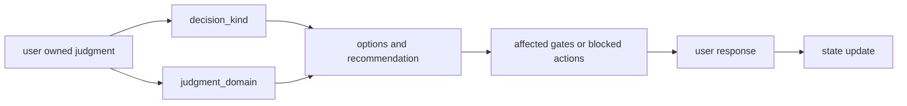
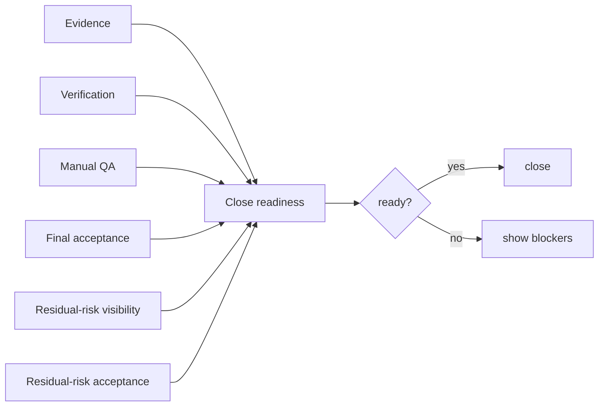

# User Guide

## What this document helps you do

Use Harness through normal conversation. This is the primary user-facing entry after [Overview](../learn/overview.md). You should be able to start work, understand what the agent is doing, see when your judgment is needed, and know why the work can or cannot be closed without learning Harness's internal vocabulary first.

## Read this when

Read this when Harness is connected and you are starting, resuming, unblocking, or closing an AI-assisted task. It is especially useful when product files may change, scope may drift, a human decision is needed, completion claims need evidence, or sensitive actions may be involved.

## Before you read

No startup phrase or Harness label is required. You do not need to know internal record names, gate names, or tool names to use Harness well.

[Overview](../learn/overview.md) is the recommended first read. [Harness in One Task](../learn/harness-in-one-task.md) is useful background, but it is not required.

## Main idea

Speak normally. Describe the work you want, the boundary you already know, and how cautious you want the agent to be. The agent should translate that ordinary request into the right Harness procedure.

The agent should:

- clarify scope before important writes
- inspect the repository, docs, and current Harness context for answers it can find itself
- identify decisions that only the user can own
- separate product or UX judgment from technical architecture judgment
- gather or explain the evidence needed to support completion
- show what still blocks closing the work

Harness should make AI-assisted work easier to follow, not turn every task into a management ritual. Small work should stay small. Larger or riskier work should gain structure only when scope, judgment, evidence, QA, verification, final acceptance, or residual risk actually matter.

Harness also does not replace the surrounding engineering process. Source control still records product-file history, tests still check executable behavior, review still reviews changes, and user-owned product or material technical judgment still belongs to the user.

## Security guarantee level, briefly

Harness makes security-sensitive AI work easier to see and route, but early local Harness is not a sandbox. It does not automatically change OS permissions, sandbox arbitrary tools, make local files tamper-proof, or turn an instructed agent into preventive security.

You may see four guarantee levels. `cooperative` means the agent is instructed to follow the rules. `detective` means a mismatch can be detected or recorded after action. `preventive` means a proven control blocks the operation before it happens. `isolated` means work or verification runs behind a documented separation boundary; a worktree or fresh evaluator bundle is not automatically an OS sandbox, permission boundary, or tamper-proof security. For early local use, expect cooperative/detective wording unless the agent can name the exact blocking control or exact proven separation boundary in use.

## Start with ordinary requests

Good Harness requests sound like normal work requests:

```text
I want to add an email login flow. Keep password reset out of scope for now and help me clarify the decisions first.
```

```text
Review this feature idea and ask the questions needed before implementation.
```

```text
Make a small copy change, but tell me if it turns into a broader product decision.
```

```text
Before changing code, separate the product decisions from the technical decisions.
```

You can be more explicit if you want:

```text
Run this work under the harness.
```

But the agent should infer Harness use from the task shape. You should not have to start with internal labels.

## Three everyday work shapes

Most requests should be explained with plain work shapes:

| Work shape | Use it when | What you should see |
|---|---|---|
| Read/advice work | The agent is reading, explaining, comparing, reviewing, or helping decide without changing product files. | The answer, sources or caveats when useful, and any decision or follow-up that matters. |
| Small change | The requested change is narrow, low risk, and has an obvious result, such as a typo, copy-only edit, or focused fix. | A short scope, changed path or no-file result, what was checked, and whether anything forced escalation. |
| Tracked work | The request has unclear scope, multiple parts, product or technical judgment, security/privacy impact, meaningful evidence needs, QA, verification, final acceptance, or close-relevant risk. | Scope, judgment, evidence, close readiness, next safe action, and the smallest blocker. |

The agent may record more internal detail than it displays. User-facing messages should show the detail that helps you decide, trust, or unblock the work, not a lifecycle checklist for every tiny edit.

## What the agent should answer first

For non-trivial work, the first useful response is not a full plan or a pile of internal state. It should be a short translation of the request into plain working facts.

Example:

```text
Understood scope: add email login only. Password reset, account creation, social login, and global auth redesign stay out of scope.

I can inspect: existing login routes, session handling, auth tests, UI form patterns, validation helpers, and docs for current auth behavior.

Only you can decide: whether email login should use password credentials, one-time codes, magic links, or an external identity provider; what failed-login UX and copy are acceptable; whether any security or UX trade-off is worth the cost.

Next safe action: inspect the current auth flow, then come back with what the codebase answers, what only you can decide, and a scoped next-work proposal.
```

A good clarification response should separate:

- goal
- user value
- non-goals
- acceptance criteria
- facts the agent can inspect from the repo, docs, or current Harness state
- judgments only the user can make
- product or UX judgment candidates
- technical architecture judgment candidates
- security or privacy judgment candidates
- QA and verification expectations
- first implementation candidate or work-splitting candidate

When the request needs judgment, the agent should name the kind of judgment instead of asking for broad approval. Sensitive-action approval, final acceptance, residual-risk acceptance, and QA or verification waiver are separate decisions.

Product or UX judgment:

```text
Decision needed: failed-login experience.
Options: inline layer, toast, or modal.
Recommendation: inline layer near the form because it is persistent and easier to make accessible.
What can continue if you defer: API wiring and tests that do not commit to final UI behavior.
What cannot close yet: final UX, copy, and Manual QA.
```

Technical architecture judgment:

```text
Decision needed: login architecture.
Options: session cookie, bearer/JWT, OAuth/OIDC, or social-login provider integration.
Recommendation: inspect existing session and user model first; do not choose until we know what the codebase already supports or what identity-provider requirement exists.
What can continue if you defer: read-only inspection and a scoped implementation proposal.
What cannot close yet: implementation, security evidence, and acceptance criteria for the chosen auth path.
```

Evidence needed:

```text
Evidence needed before "done": changed paths, focused auth tests, failure-path tests, any security-sensitive redaction notes, and Manual QA for the login form copy and error states if the UI changes.
```

Why work cannot close yet:

```text
Cannot close yet: the failed-login UX is not chosen, no implementation evidence exists, and Manual QA expectations for the login screen are not settled.
Smallest unblocker: choose the failed-login pattern, or ask me to propose a smaller slice that avoids final UI behavior for now.
```

<a id="first-read-path"></a>
<a id="phrase-reference"></a>

## Useful things you can ask

Use these as ordinary requests. They are not commands you must memorize.

```text
Clarify the plan before implementation.
Ask what you need before changing code.
Start with goals, non-goals, and acceptance criteria.
Show the current status and next safe action.
Resume from the current state, not old chat.
What is blocking this task now?
What one decision or check would unblock it?
Show close readiness in plain language.
Show close-relevant residual risk before I accept.
What evidence is still missing?
Keep this small unless it turns into a product or technical decision.
After you inspect, show the first implementation candidate or work split.
```

## Small work should stay light

Harness should not make a tiny change feel heavy. If the user says:

```text
Fix the typo in the settings toast: "Succesful" -> "Successful."
```

The agent should keep the visible flow compact:

```text
Scope: settings toast typo only.
Out of scope: account behavior, layout, localization strategy, and broader copy cleanup.
I will edit the target component and any directly related copy test if one exists.
```

After the change, the result can be just as small:

```text
Done.
Changed: settings toast typo to "Successful."
Checked: related copy test and diff review.
No broader product decision appeared, and no close-relevant residual risk is known for this small change.
```

The light display does not mean the agent bypasses Harness internally. If product files may change, the agent still keeps scope narrow, uses the appropriate internal write-authority path, records what changed, and reports if the work grows beyond the original request. You should not need to see "Change Unit" language for every tiny edit unless it helps explain a boundary or blocker.

Small work should escalate when it stops being small. Escalate to tracked work when scope is unclear; multiple files, product areas, or subsystems are involved; a product or UX judgment is needed; an important technical architecture judgment is needed; a public interface or API may be affected; security or privacy may be affected; a sensitive action is needed; QA or verification requirements increase; evidence is insufficient; residual risk is non-trivial; or multi-step delivery is needed.

Examples:

- A typo or copy-only change can stay lightweight when it touches one obvious surface and does not change meaning, behavior, localization strategy, security posture, or required QA.
- "Make Enter submit this modal instead of closing it" should escalate if it changes UI behavior, accessibility expectations, or product workflow. That is a product/UX decision, not just a small edit.
- "Change login to magic links" should escalate because it changes authentication architecture and security/privacy behavior. The agent can inspect first, but implementation needs tracked scope, user-owned technical/security judgment, evidence, and likely QA/verification.

## Larger work gets more structure

If the user says:

```text
I want to add an email login flow. Keep password reset out of scope for now and help me clarify the decisions first.
```

The agent should add structure because the work may involve product behavior, security, UI, tests, evidence, QA, and close-relevant risk.

A good early response:

```text
Scope I heard: add email login. Out of scope for now: password reset, account creation, social login, and global auth redesign.

I will inspect: existing auth routes, user/session model, login UI patterns, validation and error handling, current tests, and docs.

Likely user-owned decisions:
- Product / UX: credential flow, failed-login behavior, login copy, and recovery messaging.
- Technical architecture: session model, token/cookie strategy, password storage or identity-provider path, migration impact, and dependency choices.
- Security / privacy: account-enumeration risk, audit logging, rate limiting or lockout behavior, redaction, and secret handling.

Evidence likely needed: focused tests for success and failure paths, changed-path summary, security-sensitive notes, and UI/Manual QA if the login screen changes.

Close cannot happen yet because scope, user-owned decisions, evidence, QA expectations, and residual risk are not settled.
```

As the work progresses, the agent should keep the same shape visible:

- what is in scope and what remains out of scope
- what the agent can decide inside the agreed scope
- what only the user can decide
- what was changed and checked
- what evidence supports each completion claim
- whether verification or Manual QA is needed
- what residual risk remains
- what still blocks acceptance or close

The larger the blast radius, the more important this separation becomes. A security-sensitive feature should not be closed just because tests pass. A UI feature should not treat screenshots or browser smoke as final acceptance. A dependency install approval should not be treated as a decision to adopt that dependency as the architecture direction.

<a id="the-four-display-groups"></a>

## Four everyday groups

Most status should fit into four everyday groups. The agent may use exact Harness refs behind the scenes, but the display should lead with these plain questions.

| Group | Plain question | What the agent should show |
|---|---|---|
| Scope | What work are we doing, and what are we not doing? | Included behavior, out-of-scope items, affected areas, and whether the next action fits. |
| Judgment | What must the user decide? | Product/UX choices, material technical choices, security or privacy choices, sensitive-action approvals, scoped QA or verification waivers, final acceptance, residual-risk acceptance, or scope changes. |
| Evidence | What supports the claim that this is done? | Changed paths, tests, logs, screenshots, QA notes, verification results, missing support, or stale support. |
| Close readiness | What still prevents closing? | Verification, Manual QA, final acceptance, residual-risk visibility, and residual-risk acceptance, close blockers, and the smallest unblocker. |

These are readable summaries, not authoritative documents. The agent may cite refs behind them, but state changes, evidence records, acceptance, risk acceptance, and close still come from Harness/Core records and actions.

When the Judgment group needs a formal Decision Packet, Harness records both the decision route and the user-facing domain. `decision_kind` says what lifecycle or gate path the decision uses; `judgment_domain` groups the decision for users as Product / UX, Technical architecture, Security / privacy, QA / acceptance, Residual risk, Scope / autonomy, or Mixed. The domain explains the decision; it does not by itself change close readiness or gate aggregation.



Useful status:

```text
Scope: login form and login API call; password reset and account creation remain out of scope.
Judgment: failed-login UX needs your choice.
Evidence: repository inspection is done; implementation evidence does not exist yet.
Close readiness: close is blocked until UX choice, implementation evidence, QA expectations, and residual risk are handled.
Next safe action: choose failed-login UX, or ask me to propose a smaller slice.
```

<a id="judgment"></a>

## What the agent can decide

Once scope is clear, the agent can usually decide routine implementation details without asking every small question. Examples include reusing an existing helper, splitting a private function, adding a focused test, following local naming conventions, or choosing the conservative internal approach that best fits the agreed result.

The agent should stop and ask when a choice changes what users, callers, or future work can rely on:

- product behavior or UX
- public API or module contracts
- security, privacy, audit, retention, or redaction choices
- material dependency, migration, or architecture direction
- scope expansion
- QA or verification waivers
- accepting known residual risk
- accepting the final result when that judgment is required

Useful phrases:

```text
Start with the scope and questions.
Only ask me what the codebase cannot answer.
If scope needs to grow, show me the options and impact first.
Separate product decisions from technical decisions.
Tell me what evidence would be enough before you claim this is done.
Show what still blocks closing.
```

## When blocked

A blocker should be concrete. It should say who owns the next move and what the smallest unblocker is.

```text
Blocked.
Scope: the requested copy edit appears to affect account behavior outside the original label.
Judgment: user-owned product decision is needed before expanding the change.
Evidence: the agent can inspect call sites and show the affected screens.
Close readiness: close is blocked until scope is either narrowed back to the label or expanded deliberately.
Smallest unblocker: choose whether to keep this as a label-only change or include account behavior.
```

Do not let the agent turn an agent-resolvable issue into a user burden. If the agent can inspect code, refresh status, rerun a test, collect missing evidence, or narrow the work without changing your judgment, it should say what it will do next.

## Before close

Before close, ask:

```text
Show what changed, what was checked, what risks remain, and what still blocks close.
```

For larger work, also ask:

```text
Show close-relevant residual risk before I accept.
```

The agent should keep these separate:



| Item | Plain job | Not a substitute for |
|---|---|---|
| Evidence | Supports the claim that a result or criterion was met. | The agent saying "done" or the user accepting the result. |
| Verification | Checks correctness from the appropriate review boundary. | Manual QA or broad confidence. |
| Manual QA | Records human inspection where human judgment matters. | Automated tests or screenshots alone. |
| Final acceptance | Records the user's result judgment when required. | Evidence, verification, QA, sensitive-action permission, waiver, or residual-risk acceptance. |
| Residual risk | Names known remaining uncertainty, limitation, unchecked condition, or trade-off. | Evidence, verification, QA, final acceptance, or sensitive-action approval. |
| Residual-risk acceptance | Records that the user accepts an identified known remaining risk. | Final acceptance, verification, QA, sensitive-action approval, or a generic task approval. |
| Sensitive-action approval | Allows a named sensitive step to proceed. | Product judgment, correctness, final acceptance, residual-risk acceptance, or waiver. |

That separation is why work can still be blocked after tests pass. Tests can support evidence or verification, but close may still need human QA for the real experience, your final acceptance of the result, or your explicit acceptance of a known remaining risk.

Residual-risk wording should be precise. "No known close-relevant residual risk" means the system has no known close-relevant risk for this requested action. "Risk not visible yet" means known risk exists but has not been shown clearly enough for acceptance or close.

A casual "go ahead," "proceed," or "looks good" is only usable when the agent has already named the exact thing you are deciding. It is not enough for product trade-offs, architecture choices, QA or verification waivers, accepting the result, or accepting residual risk unless the prompt shows the choice, consequences, relevant refs, and what remains outside that decision. If the phrase could apply to more than one pending decision, the agent should ask which one you mean.

## Advanced: Harness labels you may see

You can skip this section until an agent shows one of these labels. They are useful for precision, but they should not be the first way a normal task is explained.

| Harness label | Plain meaning |
|---|---|
| Discovery | The agent's requirements-clarification behavior before implementation planning. |
| Change Unit | The bounded work area that may change for this task. |
| Autonomy Boundary | The decisions the agent may make alone inside that scope. |
| Decision Packet | The recorded path for a user-owned product, technical, waiver, acceptance, risk, or scope decision. |
| Judgment domain | The user-facing grouping on a Decision Packet, such as Product / UX, Technical architecture, Security / privacy, QA / acceptance, Residual risk, Scope / autonomy, or Mixed. |
| Approval | Permission for a named sensitive action; not generic agreement or final acceptance. |
| Write Authorization | A one-attempt check that the intended product write fits the current task, scope, decisions, and approvals. |
| Evidence Manifest | The record that maps completion claims to supporting evidence. |
| Projection | A readable summary rendered from owner records and artifact refs; useful for orientation, not authority by itself. |

These labels do not collapse into each other. Approval is not acceptance. Final acceptance does not erase residual risk. A decision is not write authority. A readable summary is not state. Passing tests does not mean Manual QA happened. Accepting residual risk does not make the risk disappear.

For exact contracts, use the Reference docs only when needed: [Kernel Reference](../reference/kernel.md), [MCP API And Schemas](../reference/mcp-api-and-schemas.md), and [Agent Integration Reference](../reference/agent-integration.md).

## Where to go next

Read [Concepts](../learn/concepts.md) for the vocabulary behind the user-facing words.

Use [Decision Packet Cookbook](decision-packet-cookbook.md) when a product, UX, architecture, security, QA, verification, acceptance, risk, or scope decision needs a focused prompt.

Agent integrators should read [Agent Session Flow](agent-session-flow.md). Ordinary users do not need it for the primary path.
