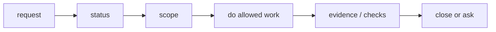

# User Guide

## What this document helps you do

Use this guide when you want an AI-assisted task to run under Harness without turning the conversation into a work-management ritual.

Harness should help the agent keep scope, evidence, checks, decisions, QA, risk, and close state visible. You should still be able to talk normally. Most of the time, the session should feel like a short conversation:

```text
Run this work under the harness.
```

The agent should translate that into the right Harness steps. You should not need to operate internal records by hand.

Use deeper Harness labels only when they help explain a real stop, boundary, or close condition.

## Read this when

Read this when you want to run one AI-assisted task under Harness.

## Before you read

[Harness in One Task](../learn/harness-in-one-task.md) is helpful background, but it is not required.

## Main idea

Speak normally. The agent should translate your request into the right Harness flow.

## 5-minute path

Start with one phrase:

```text
Run this work under the harness.
```

The agent should answer three plain questions before it gets deep into the work:

- What is in scope, and what is out of bounds?
- What evidence or checks already exist, and what is still missing?
- What judgment is needed from me now, if any?

If the task is small, the agent may handle it as direct work. If the task is larger, risky, multi-file, or unclear, it should shape the work before changing product files.

When the task is blocked, ask:

```text
What is blocking this task now, and what one decision or check would unblock it?
```

Near close, ask:

```text
Show close-relevant residual risk before I accept.
```

## What the agent should show first

At the start, or before significant resume, the agent should show a compact status or Journey Card. It should be short enough to scan and specific enough to act on.

```text
Task: Add email login flow
Mode: work
Next action: decide failed-login UX
Scope: login form, login API call, session storage
Out of bounds: password reset, account creation
Decision needed: failed-login message
Write authority: not requested yet
Evidence: none yet
Verification: not started
Manual QA: likely needed
Residual risk: none recorded
```

Look for the next safe action. If the status looks stale or wrong, say:

```text
Show the current status and next action again from state.
```

## The three everyday questions

### scope

Scope answers: "What work are we doing, and what are we not doing?"

Good scope is narrow enough that the agent can avoid accidental expansion. It should name affected areas, important exclusions, and any path or behavior boundaries that matter.

Useful phrases:

```text
Start with the scope and questions.
Approved. The scope is only what you just described.
Freeze this task to the current Change Unit and do not expand scope without a Decision Packet.
```

### evidence

Evidence answers: "What supports the claim that this work is done?"

Evidence is not just "the agent says it changed the thing." It can include changed paths, test output, logs, screenshots, QA notes, verification results, or other artifacts that support the acceptance criteria.

Useful phrase:

```text
Show which acceptance criteria are missing evidence, and suggest what additional checks would be enough.
```

### judgment needed now

Judgment answers: "What do I need to decide before the work can safely continue or close?"

Most judgment is one of these:

- choose a product direction or trade-off
- approve a sensitive step
- decide whether Manual QA is needed or whether a waiver is acceptable
- accept a known residual risk
- accept the final result when final acceptance is required

When product judgment blocks progress, the agent should show a Decision Packet with options, trade-offs, recommendation, uncertainty, and deferral effect. It should not flatten that into a vague "approve everything?" question.

## Phrase reference

Everyday work starts as a conversation, not as a command language.

```text
Run this work under the harness.
Show me the status.
Continue this work. Check harness state first.
Show me the Journey Card before resuming.
Start with the scope and questions.
If this is small, handle it as direct; if it grows, move it to work.
Show the Decision Packet with options, recommendation, and uncertainty.
Use the product-review lens for trade-offs.
Use eng-review, design-review, security-review, qa-review, or release-handoff when that is the useful next step.
Approved. The scope is only what you just described.
Start detached verify.
Decide whether Manual QA is needed.
Show close-relevant residual risk before I accept.
If final acceptance is required, ask me for it before close.
Accepted. Close this task.
Final acceptance is not required here; close once applicable blockers are clear.
```

For cautious work:

```text
Freeze this task to the current Change Unit.
Freeze writes until I answer the Decision Packet.
Show the current guard level and what it can actually prevent.
Use careful mode for this change: narrow scope, show write authority before writes, and ask before product trade-offs.
```

## Basic flow

The normal path should feel like a short conversation. Users should see the current position, the next safe action, and any decision that genuinely needs them.



Typical flow:

1. The agent checks status or starts intake.
2. The agent classifies the request as `advisor`, `direct`, or `work`.
3. The agent confirms scope and the active Change Unit when product writes may happen.
4. If product judgment blocks progress, you answer a Decision Packet.
5. Before product writes, the agent checks write authority.
6. After changes or advice, the agent records the relevant result and evidence when evidence applies.
7. When needed, verification, Manual QA, residual risk, and acceptance are handled before close.

Many small direct tasks skip some later checks. Bigger work should not hide those checks; it should show them only when they matter.

## When the task is blocked

A block should be explained as a concrete reason the task cannot safely continue or close.

Good blocked status:

```text
Blocked:
- AC-02 evidence is missing.
- Manual QA is still needed for the updated onboarding copy.
- A product decision is needed before choosing the empty-state behavior.

Smallest unblocker: choose the empty-state behavior from the Decision Packet.
```

Useful phrases:

```text
What is blocking this task now?
What one decision or check would unblock it?
Show the smallest safe next step.
Defer that decision and propose a smaller Change Unit.
```

## Decisions, approvals, QA, acceptance, and residual risk

These words answer different questions.

| Judgment | Question it answers |
|---|---|
| Decision | Which product direction, trade-off, waiver, or close-relevant choice should we take? |
| Approval | May this sensitive action proceed? |
| Manual QA | Did a person inspect the experience where human judgment matters? |
| Residual-risk acceptance | Do you accept a known remaining limitation, uncertainty, or trade-off? |
| Final acceptance | Do you accept the result when the task requires final acceptance? |

Approval is not acceptance. Passing checks is not Manual QA. Accepting residual risk is not proof that the work is correct. Final acceptance, when required, should come after close-relevant residual risk has been shown or reported as none.

Examples that may need approval include dependency additions, auth or permission changes, data model changes, public API changes, destructive writes, secret access, and production configuration changes.

## Close checklist

Before close, the agent should make these points clear in everyday language:

- The result matches the agreed scope.
- Required evidence is present, or evidence is not required for this task shape.
- Verification is not required, passed, or explicitly waived with recorded risk.
- Manual QA is not required, passed, completed, or validly waived.
- Known close-relevant residual risk has been shown, or the agent reports `ResidualRiskSummary.status=none`.
- Final acceptance is requested separately from approval when final acceptance is required.

Useful close phrases:

```text
Show the close checklist.
I accept the residual risk shown here. Close with risk accepted.
Accepted. Close this task.
I do not accept it. Rework the UX before close.
```

## Where to go next

For the agent-side procedure, read [Agent Session Flow](agent-session-flow.md).

For deeper concepts before using Harness, read [Harness in One Task](../learn/harness-in-one-task.md) and [Concepts](../learn/concepts.md).

Detailed connector contracts, capability profiles, and schema references belong in [Reference: Agent Integration](../reference/agent-integration.md) and related reference documents once that path is created.
