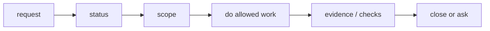

# User Guide

## What this document helps you do

Use this guide when you want to understand how an AI-assisted task runs under Harness without turning the conversation into a work-management ritual.

Harness should help the agent keep scope, evidence, checks, decisions, QA, risk, and close state visible. You should still be able to talk normally. When Harness is connected, you do not need a special startup phrase. Describe the work you want, and the agent should decide from the task shape whether Harness applies.

Harness is usually appropriate when product files may change, scope may drift, user judgment is needed, evidence, verification, QA, acceptance, or residual risk must be tracked, or sensitive categories may apply. For tiny questions or clearly read-only advice, the agent may handle the request directly.

If you want to be explicit, you can still say:

```text
Run this work under the harness.
```

The agent should translate your request into the right Harness steps. You should not need to operate internal records by hand.

Use deeper Harness labels only when they help explain a real stop, boundary, or close condition.

Harness is neither just a technical gate system nor just a planning checklist. It supports user-owned product and material technical judgment, while keeping approval, Write Authorization, verification, Manual QA, risk, and acceptance separate.

## Read this when

Read this when Harness is connected and you want to understand how one AI-assisted task should be handled.

## Before you read

[Harness in One Task](../learn/harness-in-one-task.md) is helpful background, but it is not required.

## Main idea

Speak normally. No startup phrase is required. The agent should translate your request into the right Harness flow when the task calls for it.

## 5-minute path

Start by describing the work in ordinary language:

```text
Add email login flow. Keep password reset and account creation out of scope.
```

The agent should decide whether the request is read-only advice, small direct work, or tracked work. When tracking is useful, it should answer three plain questions before it gets deep into the work:

- What is in scope, and what is out of bounds?
- What evidence or checks already exist, and what is still missing?
- What judgment is needed from me now, if any?

If the task is small, the agent may handle it as direct work. If the task is larger, risky, multi-file, or unclear, it should shape the work before changing product files.

When the task is blocked, ask:

```text
What is blocking this task now, and what one decision or check would unblock it?
```

Near close, ask:

```text
Show close-relevant residual risk before I accept.
```

## What the agent should show first

At the start, or before significant resume, the agent should show a compact status or Journey Card. It should be short enough to scan and specific enough to act on, while still showing authority-relevant status: task, mode, next action, Change Unit, blocking decisions, write authority, guarantee level, gate summary, and projection freshness.

```text
Task: TASK-123 Add email login flow
Mode: work
Next action: decide failed-login UX
Change Unit: login form, login API call, session storage
Out of bounds: password reset, account creation
Decision needed: failed-login message
Write authority: not requested yet
Close checks: scope not confirmed; decision needed; design not checked; evidence not recorded; verification not needed yet; QA still open
Refs: no evidence yet; no run/eval/QA refs yet
Manual QA: likely needed
Residual risk: none recorded
Surface protection: cooperative; no pre-execution blocking is claimed. If changed-path validation is available, out-of-scope writes may be detected after action.
Projection freshness: current as of source_state_version v42
```

Look for the next safe action. If the status looks stale or wrong, say:

```text
Show the current status and next action again from state.
```

Read projection freshness as the freshness of the readable view, not as the task result. `current` means the card or report matches the state version it names. `stale`, `failed`, or `unknown` means the readable view may need refresh or reconcile before you rely on it.

That is different from stale state, stale baseline, or stale evidence. Those mean the underlying work inputs moved, became outdated, or no longer prove the claim; they may block writes or close even when the status card itself is current. It is also different from MCP unavailable: if the agent cannot reach the required Harness/Core capability, it should say that directly and avoid claiming an authoritative state change, approval, gate update, or close until the connection or capability is restored.

The status card is not the same as judgment-context. When the agent needs your judgment, it should add a focused decision prompt with options, a recommendation, uncertainty, what can continue if you defer, and refs to the relevant evidence or design records.

If the agent uses words like guard, freeze, or careful mode, it should explain them in ordinary terms: what can actually be blocked before execution, and what can only be detected later. A freeze on a cooperative or detective surface means a scope hold or stricter next-action posture, not hard prevention.

## The three everyday questions

### scope

Scope answers: "What work are we doing, and what are we not doing?"

Good scope is narrow enough that the agent can avoid accidental expansion. It should name affected areas, important exclusions, and any path or behavior boundaries that matter.

Once scope is clear, the agent may decide routine implementation details inside it without asking every tiny question. Examples include using an existing helper, splitting a private function, adding focused tests, or choosing the conservative internal approach that best fits the agreed result.

The agent should stop and ask when the choice changes what users or other code can rely on: public API or module contracts, security or privacy trade-offs, UX or product behavior, material dependency or migration direction, scope expansion, or accepting known residual risk.

Harness may use four related labels for this:

| Label | Plain meaning |
|---|---|
| Change Unit scope | The work area that is in bounds. It does not authorize writes by itself. |
| Autonomy Boundary | The judgment the agent may exercise alone inside that scope. It is not write authority and does not grant paths, tools, commands, network, secrets, or sensitive categories. |
| Approval | Permission for a sensitive step. It is not acceptance, correctness, or user-owned judgment. |
| Write Authorization | A one-attempt write allowance from `prepare_write`. It does not expand the scope or Autonomy Boundary. |

If the agent asks you to approve something, the prompt should label the actual path. The user may be approving a sensitive action, confirming scope, resolving a Decision Packet, accepting residual risk, accepting the final result, or checking Write Authorization status. "Approved" should not be a catch-all label or blank check.

Useful phrases:

```text
Start with the scope and questions.
That scope works. Do not expand beyond what we just agreed.
If scope needs to grow, show me the options and impact first.
What exactly am I approving here?
```

Harness may describe those boundaries as the active Change Unit, and it may use a Decision Packet when a scope change needs your judgment. You do not need to lead with those labels.

### evidence

Evidence answers: "What supports the claim that this work is done?"

Evidence is not just "the agent says it changed the thing." It can include changed paths, test output, logs, screenshots, QA notes, verification results, or other artifacts that support the acceptance criteria.

For large evidence, the agent should show refs and short outcomes first. Logs, screenshots, diffs, traces, Run details, Eval details, Manual QA notes, and artifacts should not be pasted into the default context unless you or the next reviewer need to inspect them.

Markdown reports are useful views over that evidence, not the evidence or state record itself. If you edit a report, use the human notes or proposal area; edits inside generated or managed report text should be treated as drift or reconcile input, not as a gate change.

Useful phrase:

```text
Show which acceptance criteria are missing evidence, and suggest what additional checks would be enough.
```

### judgment needed now

Judgment answers: "What do I need to decide before the work can safely continue or close?"

Most judgment is one of these:

- choose a product direction or trade-off you own
- choose a material technical direction whose cost, compatibility, security, migration, interface, or maintenance impact you own
- approve a sensitive step
- decide whether Manual QA is needed or whether a waiver is acceptable
- accept a known residual risk
- accept the final result when final acceptance is required

When user-owned product or material technical judgment blocks progress, the agent should show a Decision Packet with options, trade-offs, recommendation, uncertainty, and deferral effect. It should not flatten that into a vague "approve everything?" question.

A good Decision Packet should feel like decision support, not a permission slip. It should name the real choice, compare realistic paths, recommend one, and say what can safely continue if you defer, or why nothing should continue until you decide.

Examples:

- Product/UX: failed-login feedback could be an inline message, a toast, or a modal/layer. The packet should compare user flow, interruption, accessibility, and copy risk, then recommend a path.
- Product/copy: failed-login wording could be terse and security-focused, recovery-oriented, or more specific at the field level. The packet should compare account enumeration risk, clarity, support burden, and product tone.
- Product taste and QA: a polished interaction may need Manual QA for layout, accessibility interpretation, and feel; a simpler conservative behavior may be easier to verify. The packet should show the trade-off and what can continue if QA is deferred, or why nothing should continue until the decision is made.
- Technical: session handling could use session auth, token auth, or social login. The packet should separate revocation, client compatibility, security, and implementation cost.
- Technical: dependency additions, schema migrations, public API/interface changes, and module boundary changes can also need a Decision Packet when the choice affects compatibility, rollback, test boundary, or future maintenance.
- Security-sensitive: approval to access a secret, change permissions, or export data only answers whether that sensitive step may proceed. It does not decide which data is exported, who may export it, what gets redacted, or what audit trail is acceptable.

## Phrase reference

Everyday work starts as a conversation, not as a command language. Use ordinary language first. Harness terms are there so the agent can explain a real stop, boundary, or close condition when precision helps.

| You can say | Harness term the agent may use |
|---|---|
| Add email login flow. Keep password reset out of scope. | Tracked Harness work, if the task shape calls for it. |
| Show me the status. | Journey Card or current Task status. |
| Continue this work. Check harness state first. | Resume from Harness state. |
| Show me the Journey Card before resuming. | Resume status before more work. |
| If this is small, just handle it; if it grows, use the tracked flow. | `direct` or `work` classification. |
| Start with the scope and questions. | Task scope; active Change Unit when product writes may happen. |
| Do not expand beyond the scope we just agreed. | Change Unit boundary. |
| If scope needs to grow, show me the options and impact first. | Decision Packet for scope or user-owned judgment. |
| Show what you can actually block and what you can only detect later. | guarantee level or surface capability. |
| Check your work independently if possible. | detached verification. |
| Decide whether Manual QA is needed. | Manual QA requirement or waiver. |
| Show the remaining risks before I accept. | residual risk and close-relevant risk status. |
| If final acceptance is required, ask me for it before close. | final acceptance before task close. |
| No separate final acceptance is needed here; close once the relevant blockers are clear. | final acceptance not required for this task path. |
| Accepted. Close this task. | task close, when blockers are clear. |

You may also say "Run this work under the harness" when you want to be explicit, but it is not required.

For review help, stay plain unless the label is useful:

```text
Look at the product or technical trade-offs before choosing.
Check this from engineering, design, security, QA, or release-handoff perspective.
```

Power-user labels for those review requests include product-review, eng-review, design-review, security-review, qa-review, and release-handoff.

For cautious work:

```text
Do not expand beyond the scope we just agreed.
If scope needs to grow, show me the options and impact first.
Pause writes until I answer the open decision.
Show what you can actually block and what you can only detect later.
Use careful mode for this change: narrow scope, show write authority before writes, and ask before user-owned product or material technical trade-offs.
```

If the connected surface cannot block before execution, careful mode means a narrower posture, clearer status, and later validation where available. It should not be described as hard prevention.

Power-user equivalents for the same requests include Change Unit, Decision Packet, guarantee level, detached verification, residual risk, `prepare_write`, and Write Authorization. They are useful labels for explaining blocks and close conditions; they are not words you must memorize before using Harness.

## Basic flow

The normal path should feel like a short conversation. Users should see the current position, the next safe action, and any decision that genuinely needs them.



Typical flow:

1. The agent checks status or starts intake.
2. The agent classifies the request as `advisor`, `direct`, or `work`.
3. The agent confirms scope and the active Change Unit when product writes may happen.
4. If user-owned product or material technical judgment blocks progress, you answer a Decision Packet.
5. Before product writes, the agent checks write authority.
6. After changes or advice, the agent records the relevant result and evidence when evidence applies.
7. When needed, verification, Manual QA, residual risk, and acceptance are handled before close.

Many small direct tasks skip some later checks. Bigger work should not hide those checks; it should show them only when they matter.

## When the task is blocked

A block should be explained as a concrete reason the task cannot safely continue or close.

Good blocked status:

```text
Blocked:
- AC-02 evidence is missing.
- Manual QA is still needed for the updated onboarding copy.
- A product decision is needed before choosing the empty-state behavior.

Smallest unblocker: choose the empty-state behavior from the Decision Packet.
```

Useful phrases:

```text
What is blocking this task now?
What one decision or check would unblock it?
Show the smallest safe next step.
Defer that decision and propose a smaller Change Unit.
```

## Decisions, approvals, QA, acceptance, and residual risk

These words answer different questions. Keep them separate near close, even when the same artifact or conversation mentions more than one of them.

| Item | Plain job | Do not substitute it with |
|---|---|---|
| Evidence | Supports the claim that a criterion or result was met. | The agent saying "done", a report sentence, or final acceptance. |
| Verification | Checks correctness from an appropriate review boundary. Detached verification needs independence. | Same-session self-review, passing tests alone, or Manual QA. |
| Manual QA | Records human inspection of UX, workflow, copy, accessibility interpretation, visual result, or product feel. | Automated tests, browser smoke, verification, or acceptance. |
| Acceptance | Records the user's judgment that the result is acceptable when the task requires it. | Correctness proof, QA, verification, or approval. |
| Residual Risk | Names known remaining uncertainty, limitation, unchecked condition, or trade-off. | Evidence, verification, QA, or acceptance. |
| Decision | Records the user-owned product direction, material technical direction, waiver, or close-relevant choice. | Broad approval or chat agreement that does not answer the actual trade-off. |
| Approval | Allows a named sensitive action to proceed. | Acceptance, correctness, evidence, verification, QA, or risk acceptance. |

Approval is not acceptance. Tests passing do not mean Manual QA happened. Same-session self-review can be a useful self-check, but it is not detached verification. Accepting a result does not prove it is correct. Accepting residual risk is not proof either; it means the known uncertainty was visible and accepted for this Task. Final acceptance, when required, should come after close-relevant residual risk has been shown or reported as no known close-relevant risk.

Examples that may need approval include dependency additions, auth or permission changes, data model changes, public API changes, destructive writes, secret access, and production configuration changes. Approval only answers whether a sensitive step may proceed; a separate Decision Packet may still be needed for the dependency, migration, interface, module-boundary, product, material technical, QA, or risk choice itself.

Common "approved" mix-ups:

- Approving a dependency install is not the same as choosing that dependency as the architecture direction.
- Approving secret access is not permission to reveal secret values in artifacts, projections, exports, logs, screenshots, or summaries.
- Approving auth or system-file access is not choosing session auth, JWT, social login, role design, lockout behavior, or user notice.
- Deciding a public API change is not permission to deploy, merge, or make additional writes.
- Final acceptance means you accept the result when that task path requires it; it is not Write Authorization for more edits.

If the agent asks for a QA or verification waiver, it should use the Decision Packet or required recorded judgment path for the task. That prompt should say what is not being checked, what risk you would accept, what follow-up remains, which refs matter, and how close is affected. A casual chat statement should not be treated as a close-relevant waiver when accepted risk is involved. If the agent asks to close with residual risk, it should show the remaining limitation first, then ask whether you accept that risk for this Task.

Applied examples:

- Direct docs or copy fix: a changed path, diff or patch summary, and self-check can support the claim. It should not be described as detached verification, and it does not need Manual QA unless the changed surface needs human inspection.
- UI/UX work: tests and browser smoke can support rendering or behavior claims. Manual QA is still the human check for layout, interaction feel, copy, and accessibility interpretation. A QA waiver should name the skipped surface, accepted risk, follow-up, relevant refs, and close impact.
- Auth or security work: approval may allow secret access, permission changes, or auth-file writes. The security or product choice still needs a Decision Packet when roles, redaction, audit trail, session model, lockout behavior, or user notice are being decided.
- Public API work: passing tests support behavior, but compatibility, caller impact, migration path, and documentation promises may need a Decision Packet and independent verification.
- Risk-accepted close: the agent should show the evidence that exists, the verification or QA that is missing or waived, the remaining limitation, and the follow-up. Closing with accepted risk is not the same as closing as detached verified.

## Close checklist

Before close, the agent should make these points clear in everyday language:

- The result matches the agreed scope.
- Required evidence is present, or evidence is not required for this task shape.
- Verification is either not expected for this task path, completed, or explicitly waived with recorded risk.
- Manual QA is either not needed, completed, or validly waived.
- Known close-relevant residual risk has been shown, or the agent reports that there is no known close-relevant residual risk.
- Final acceptance is requested separately from approval when final acceptance is required.

Useful close phrases:

```text
Show the close checklist.
I accept the residual risk shown here. Close with risk accepted.
Accepted. Close this task.
I do not accept it. Rework the UX before close.
```

## Where to go next

For the agent-side procedure, read [Agent Session Flow](agent-session-flow.md).

For deeper concepts before using Harness, read [Harness in One Task](../learn/harness-in-one-task.md) and [Concepts](../learn/concepts.md).

Detailed connector contracts and capability profiles belong in [Agent Integration Reference](../reference/agent-integration.md). Surface-specific setup belongs in [Surface Cookbook](../reference/surface-cookbook.md).
