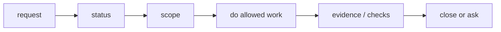

# User Guide

## What this document helps you do

Use Harness through an ordinary conversation: start a task, understand what the agent should show you, know when your judgment is needed, and ask for the right close information without turning the work into a management ritual.

This is use documentation. It does not authorize runtime/server implementation, generated operational files, executable fixtures, or runtime data before the redesigned docs are accepted. The first implementation/proof target remains Kernel Smoke; Agency-Hardened MVP and post-MVP automation stay out of scope unless their owner docs promote and prove them.

## Read this when

Read this when Harness is connected and you are starting, resuming, unblocking, or closing an AI-assisted task. It is especially useful when product files may change, scope may drift, user judgment is needed, evidence, verification, QA, acceptance, or residual risk must be tracked, or sensitive categories may apply.

## Before you read

No startup phrase or internal Harness label knowledge is required. [Harness in One Task](../learn/harness-in-one-task.md) is helpful background, but it is not required.

## Main idea

Speak normally. Describe the work you want and any boundary you already know; the agent should infer from the task shape whether Harness applies. Tiny questions or clearly read-only advice can stay light. Larger, riskier, multi-file, or unclear work should be shaped before product files change.

The agent should translate your request into the right Harness steps. You should not need to operate internal records by hand. Use ordinary language first and exact Harness labels second, only when they explain a real stop, boundary, or close condition.

For small direct work, the ceremony budget is intentionally small: a compact scope, a minimal active Change Unit when product files may change, a write-authority check before the exact write, and a concise result with changed paths, checks, escalation status, and close-relevant risk. Direct means fewer user-facing steps, not bypassed scope or write authority.

If you want to be explicit, you can still say:

```text
Run this work under the harness.
```

## First-read path

### 1. Say what you want

Start with the work and any boundary you already know:

```text
Add email login flow. Keep password reset and account creation out of scope.
```

The agent should decide whether the request is read-only advice, small direct work, or tracked work. When tracking is useful, it should answer three plain questions before it gets deep into the work:

- What is in scope, and what is out of bounds?
- What evidence or checks already exist, and what is still missing?
- What judgment is needed from me now, if any?

If the task is small, the agent may handle it as direct work. If the task is larger, risky, multi-file, or unclear, it should shape the work before changing product files.

### 2. Expect a compact start

At the start, or before significant resume, the agent should show a short status or Journey Card. It should fit a quick scan and show only what affects the next decision or safe action:

- task and mode
- scope and out of bounds
- next safe action
- decision or blocker, including who owns the next move
- smallest unblocker
- write permission, evidence, verification, Manual QA, residual risk, and acceptance status when they matter
- capability or readable-status freshness only when it affects whether you can rely on the display

A good first status can look like this:

```text
Task: TASK-123 Add email login flow
Mode: tracked work (`work`)
Scope: login form, login API call, session storage
Out of bounds: password reset, account creation
Next safe action: decide failed-login UX before wiring final UI behavior
Decision needed: failed-login message
Blocked by: user-owned product judgment
Smallest unblocker: choose one option from DEC-014
Write permission: not requested yet (`Write Authorization`)
Evidence/checks: none yet; needed later for login submission and failed-login handling
Manual QA / risk / acceptance: likely Manual QA for final copy and layout; no residual risk recorded yet
Capability/status: cooperative surface; status current as of source_state_version v42
```

Look first for the next safe action and the smallest unblocker. A blocker should say who owns the next move: user-owned when it needs your product, material technical, Approval, QA, risk, or acceptance judgment; agent-resolvable when the agent can refresh state, collect evidence, rerun a check, retry `prepare_write`, or narrow scope without changing your decision.

If the status looks stale or wrong, say:

```text
Show the current status and next action again from state.
```

When the agent needs your judgment, status alone is not enough. It should add a focused prompt with options, a recommendation, uncertainty, the affected gates or acceptance criteria, what can continue if you defer, and refs to the relevant source, evidence, or design records.

### 3. When blocked, ask for the one unblocker

When the task is blocked, ask:

```text
What is blocking this task now, and what one decision or check would unblock it?
```

### 4. Before close, ask what remains

Near close, ask:

```text
Show close-relevant residual risk before I accept.
```

Ask for the close checklist if you want the full close basis:

```text
Show the close checklist.
```

The agent should keep Approval, Decision Packet outcomes, Write Authorization, evidence, verification, Manual QA, acceptance, and residual risk separate. One of them should not be used as a substitute for another.

A casual "go ahead" is only usable when the agent has already named the exact thing you are deciding. It is not enough for product trade-offs, architecture choices, QA or verification waivers, final acceptance, or residual-risk acceptance unless the prompt shows the options, consequences, relevant refs, what the agent may still decide without you, and the specific route being recorded.

## The three everyday questions

### scope

Scope answers: "What work are we doing, and what are we not doing?"

Good scope is narrow enough that the agent can avoid accidental expansion. It should name affected areas, important exclusions, and any path or behavior boundaries that matter.

Once scope is clear, the agent may decide routine implementation details inside it without asking every tiny question. Examples include using an existing helper, splitting a private function, adding focused tests, or choosing the conservative internal approach that best fits the agreed result.

The agent should stop and ask when the choice changes what users or other code can rely on: public API or module contracts, security or privacy trade-offs, UX or product behavior, material dependency or migration direction, scope expansion, or accepting known residual risk.

A useful split is: Change Unit scope says what work surface may change; Autonomy Boundary says what judgment the agent may exercise inside that surface. Neither one authorizes a write by itself.

Harness may use several related labels for this:

| Label | Plain meaning |
|---|---|
| Change Unit scope | The work area that is in bounds. It does not authorize writes by itself. |
| Autonomy Boundary | The judgment the agent may exercise alone inside that scope. It is not write authority and does not grant paths, tools, commands, network, secrets, or sensitive categories. |
| Approval | Permission for a sensitive step. It is not acceptance, correctness, or user-owned judgment. |
| Decision Packet | The recorded path for user-owned product, material technical, waiver, acceptance, residual-risk, or reconcile judgment. It is not sensitive-action permission unless it is approval-shaped and linked to Approval. |
| Acceptance | Your final judgment that the result is acceptable when the task path requires it. It does not replace evidence, QA, verification, approval, or residual-risk acceptance. |
| Residual-risk acceptance | Your judgment that known remaining risk is acceptable for this close. It is not a normal no-risk close and does not upgrade assurance. |
| Write Authorization | A one-attempt write allowance from `prepare_write`. It does not expand the scope or Autonomy Boundary. |

For a small direct task, the agent can usually generate the minimal Change Unit from the request instead of asking you to fill in fields. These examples are explanatory, not a schema:

- Docs typo: purpose "fix spelling in one paragraph"; out of bounds "no meaning change"; paths "the named doc only"; stop if "the edit changes the contract."
- Copy-only UI change: purpose "rename this label"; out of bounds "behavior, layout, localization strategy"; paths "the target component and direct copy test."
- Focused test change: purpose "add a regression test for the reported case"; out of bounds "implementation changes"; paths "the named test file or nearby test."

If the agent asks you to approve something, the prompt should label the actual authority or recorded decision. The user may be approving a sensitive action, confirming scope, resolving a Decision Packet, accepting residual risk, accepting the final result, or checking Write Authorization status. "Approved" should not be a catch-all label or blank check.

Useful phrases:

```text
Start with the scope and questions.
That scope works. Do not expand beyond what we just agreed.
If scope needs to grow, show me the options and impact first.
What exact decision or sensitive action am I being asked to record?
```

Harness may describe those boundaries as the active Change Unit, and it may use a Decision Packet when a scope change needs your judgment. You do not need to lead with those labels.

### evidence

Evidence answers: "What supports the claim that this work is done?"

Evidence is not just "the agent says it changed the thing." It can include changed paths, test output, logs, screenshots, QA notes, verification results, or other artifacts that support the acceptance criteria.

Enough evidence means the stated acceptance criteria or completion conditions are covered, not that many files or artifacts exist. A tiny docs-only fix may need only a changed path, diff or patch summary, and self-check. A code fix usually needs the diff plus a focused test, command, log, or a recorded reason no automated check applies. A feature should map each acceptance criterion to Run and artifact refs. UI, UX, and copy work may need visual evidence and Manual QA when human judgment matters. Sensitive work keeps Approval and redaction refs visible, but Approval is not proof of correctness. Verification-required work needs an Eval that says which evidence it reviewed.

For large evidence, the agent should show refs and short outcomes first. Logs, screenshots, diffs, traces, Run details, Eval details, Manual QA notes, and artifacts should not be pasted into the default context unless you or the next reviewer need to inspect them.

Markdown reports are useful views over that evidence, not the evidence or state record itself. Report prose and chat text can explain the evidence story, but they are not enough to prove evidence sufficiency unless the relevant criteria point to compatible owner records and artifact refs. If you edit a report, use the human notes or proposal area; edits inside generated or managed report text should be treated as drift or reconcile input, not as a gate change.

Evidence can go stale even after it once looked sufficient. Common causes are baseline drift, changed files after the supporting run or eval, approval drift or expiry, a missing artifact, or a relevant design record change.

Useful phrase:

```text
Show which acceptance criteria are missing evidence, and suggest what additional checks would be enough.
```

### judgment needed now

Judgment answers: "What do I need to decide before the work can safely continue or close?"

Most judgment is one of these:

- choose a product direction or trade-off you own
- choose a material technical direction whose cost, compatibility, security, migration, interface, or maintenance impact you own
- approve a sensitive step
- decide whether Manual QA is needed or whether a waiver is acceptable
- accept a known residual risk
- accept the final result when final acceptance is required

When user-owned product or material technical judgment blocks progress, the agent should show a Decision Packet with options, trade-offs, recommendation, uncertainty, and deferral effect. It should also name affected gates or acceptance criteria, source refs, evidence refs, and what the agent may decide without you. It should not flatten that into a vague "approve everything?" question.

A good Decision Packet should feel like decision support, not a permission slip. It should name the real choice, compare realistic paths, recommend one, and say what can safely continue if you defer, or why nothing should continue until you decide. Exact public fields are owned by [`harness.request_user_decision`](../reference/mcp-api-and-schemas.md#harnessrequest_user_decision); canonical authority is owned by [Decision Packet](../reference/kernel.md#decision-packet) and [Decision Gate](../reference/kernel.md#decision-gate).

Examples:

- Product/UX: failed-login feedback could be an inline message, a toast, or a modal/layer. The packet should compare user flow, interruption, accessibility, and copy risk, then recommend a path.
- Product/copy: failed-login wording could be generic, specific, or hybrid. The packet should compare account enumeration risk, clarity, support burden, recovery usefulness, and product tone.
- Product taste and QA: a polished interaction may need Manual QA for layout, accessibility interpretation, and feel; a simpler conservative behavior may be easier to verify. The packet should show the trade-off and what can continue if QA is deferred, or why nothing should continue until the decision is made.
- Technical: auth handling could use a session cookie, JWT, or social login. The packet should separate revocation, CSRF/XSS exposure, client compatibility, operational complexity, migration impact, and implementation cost.
- Technical: dependency additions can involve both Approval and a Decision Packet. Approving an install or dependency-file edit is not the same as deciding the dependency is the architecture direction.
- Technical/data: schema migrations should show whether the path is additive, compatibility-shimmed, or breaking. The packet should name migration evidence, rollback risk, data-backfill risk, test boundary, and future maintenance impact.
- Technical/interface: public API or module-boundary changes can need a compatibility or breaking-change Decision Packet. Passing tests does not settle caller impact, documentation promises, migration path, or release risk.
- Scope/autonomy: expanding from a copy fix into account behavior, or from a private helper change into a public module boundary, needs a decision that names the new surface, what remains out of bounds, and whether a smaller Change Unit can continue.
- Security-sensitive: approval to access a secret, change permissions, or export data only answers whether that sensitive step may proceed. It does not decide which data is exported, who may export it, what gets redacted, what is omitted from artifacts, or what audit trail is acceptable.
- QA or verification waiver: "go ahead" is not enough. The prompt should name the skipped check or surface, the risk you would accept, the follow-up, relevant refs, and whether close would become risk accepted.
- Final acceptance or residual-risk acceptance: final acceptance means the result is acceptable when required; residual-risk acceptance means the named remaining risk is acceptable for close. The agent should ask for these separately, after showing evidence, verification, QA, and residual-risk visibility.

## Phrase reference

Everyday work starts as a conversation, not as a command language. Use ordinary language first. Harness terms are there so the agent can explain a real stop, boundary, or close condition when precision helps.

| You can say | Harness term the agent may use |
|---|---|
| Add email login flow. Keep password reset out of scope. | Tracked Harness work, if the task shape calls for it. |
| Show me the status. | Journey Card or current Task status. |
| Continue this work. Check harness state first. | Resume from Harness state. |
| Show me the Journey Card before resuming. | Resume status before more work. |
| If this is small, just handle it; if it grows, use the tracked flow. | `direct` or `work` classification. |
| Start with the scope and questions. | Task scope; active Change Unit when product writes may happen. |
| Do not expand beyond the scope we just agreed. | Change Unit boundary. |
| If scope needs to grow, show me the options and impact first. | Decision Packet for scope or user-owned judgment. |
| Show what you can actually block and what you can only detect later. | guarantee level or surface capability. |
| Check your work independently if possible. | detached verification. |
| Decide whether Manual QA is needed. | Manual QA requirement or waiver. |
| Show the remaining risks before I accept. | residual risk and close-relevant risk status. |
| If final acceptance is required, ask me for it before close. | final acceptance before task close. |
| No separate final acceptance is needed here; close once the relevant blockers are clear. | final acceptance not required for this task path. |
| Accepted. Close this task. | task close, when blockers are clear. |

You may also say "Run this work under the harness" when you want to be explicit, but it is not required.

For review help, stay plain unless the label is useful:

```text
Look at the product or technical trade-offs before choosing.
Check this from engineering, design, security, QA, or release-handoff perspective.
```

Power-user labels for those review requests include product-review, eng-review, design-review, security-review, qa-review, and release-handoff. They focus the review; they are not new gates.

A useful final review often separates two questions:

```text
Spec Compliance Review: Did we build the requested thing under the current scope and authority?
Code Quality / Stewardship Review: Is the result maintainable and coherent in the codebase?
```

For cautious work:

```text
Do not expand beyond the scope we just agreed.
If scope needs to grow, show me the options and impact first.
Pause writes until I answer the open decision.
Show what you can actually block and what you can only detect later.
Use careful mode for this change: narrow scope, show write authority before writes, and ask before user-owned product or material technical trade-offs.
If I step away, continue only inside the active scope and stop before public commitments or new user-owned judgment.
```

Power-user equivalents for the same requests include Change Unit, Decision Packet, guarantee level, detached verification, residual risk, `prepare_write`, and Write Authorization. They are useful labels for explaining blocks and close conditions; they are not words you must memorize before using Harness.

## Basic flow

The normal path should feel like a short conversation. Users should see the current position, the next safe action, and any decision that genuinely needs them.



Typical flow:

1. The agent checks status or starts intake.
2. The agent classifies the request as `advisor`, `direct`, or `work`.
3. The agent confirms scope and the active Change Unit when product writes may happen.
4. If user-owned product or material technical judgment blocks progress, you answer a Decision Packet.
5. Before product writes, the agent checks write authority.
6. After changes or advice, the agent records the relevant result and evidence when evidence applies.
7. When needed, verification, Manual QA, residual risk, and acceptance are handled before close.

Many small direct tasks skip some later checks. Bigger work should not hide those checks; it should show them only when they matter.

A direct task result should stay compact and low-ceremony: what was requested, what stayed in scope, what changed, what was checked, whether it escalated, and any close-relevant risk or follow-up. It should not restate every gate when those gates did not affect the result.

Direct work should escalate to `work` when the target is no longer obvious, changed paths cross the active Change Unit, more than a local product area is affected, a public API or module contract may change, sensitive or risky behavior appears, Manual QA or detached verification becomes important, or a user-owned product or material technical trade-off is needed.

If an out-of-scope changed path is observed after action, the agent should not describe it as authorized work. It should show the mismatch, hold further product writes, and route to the smallest repair path: revert or isolate the extra change, ask for a scope decision, or escalate the same Task to `work` if the wider change is now the real task.

## Advanced status details

Most users can continue with the quick path: scope, next safe action, blocker, smallest unblocker, and close-relevant risk. The details below matter when a status view looks stale, a Harness/Core capability is unavailable, the agent mentions guard or freeze behavior, or you ask for a specialized review lens.

### readable status and MCP availability

Projection freshness is the freshness of the readable view, not the task result. `current` means the card or report matches the state version it names. `stale`, `failed`, or `unknown` means the readable view may need refresh or reconcile before you rely on it.

That is different from stale state, stale baseline, or stale evidence. Those mean the underlying work inputs moved, became outdated, or no longer prove the claim; they may block writes or close even when the status card itself is current.

It is also different from MCP unavailable. If the agent cannot reach the required Harness/Core capability, it should say that directly and avoid claiming an authoritative state change, Approval, result acceptance, residual-risk acceptance, gate update, projection repair, or close until the connection or capability is restored.

Typical recovery readings:

- Projection stale but Core state current: refresh or reconcile the readable view, then continue from Core state. Do not treat the stale Markdown report as authority.
- MCP unavailable: hold product writes and gate updates; do not claim Approval, result acceptance, residual-risk acceptance, or close until the required Harness/Core capability is available or the work moves to a capable surface.
- Managed block edited by hand: treat the edit as drift or a proposal, then route it through Reconcile before it becomes state.

### guarantee level and careful mode

If the agent uses words like guard, freeze, or careful mode, it should explain them in ordinary terms: what can actually be blocked before execution, and what can only be detected later. A freeze on a cooperative or detective surface means a scope hold or stricter next-action posture, not hard prevention.

The exact label may be guarantee level or surface capability. The useful question is still plain: "Can this surface prevent the action before it happens, or only detect a problem afterward?"

AFK or "continue while I am away" instructions do not expand authority. The agent may continue only inside the active Change Unit, Autonomy Boundary, granted sensitive approvals, and compatible write authority. It should stop before scope expansion, public commitments such as API/module contracts or release promises, residual-risk acceptance, final acceptance, QA or verification waivers, or any new user-owned product or material technical judgment. On cooperative or detective surfaces, that stop is a held instruction or later detection path, not a claim of hard pre-execution blocking.

### Role Lens requests

Product-review, eng-review, design-review, security-review, qa-review, and release-handoff labels are Role Lens, playbook, or display requests. They help focus what to inspect; they are not new gates and do not by themselves create Approval, Write Authorization, evidence, QA, verification, acceptance, risk, or close effects.

If a lens finds an issue, route it through the existing path: Decision Packet, evidence, Eval or verification need, Manual QA, residual risk, Approval, Change Unit update recommendation, or close blocker. Same-session review can be a helpful self-check or stewardship signal, but it is not detached verification. The exact Role Lens boundary lives in [Agent Integration](../reference/agent-integration.md#role-lens-behavior).

## When the task is blocked

A block should be explained as a concrete reason the task cannot safely continue or close. The display should lead with the primary blocker, name the smallest unblocker, and keep secondary blockers visible only when they will still matter. It should also distinguish user-owned blockers from agent-resolvable blockers.

Good blocked status:

```text
Blocked:
- Primary blocker (user-owned): empty-state behavior is not chosen.
- Smallest unblocker: choose the empty-state behavior from DEC-021.
- Secondary blockers: agent-resolvable AC-02 evidence after the behavior is chosen; user-owned Manual QA before close for the updated onboarding copy.

Next safe action: answer DEC-021, or ask the agent to propose a smaller Change Unit that avoids the empty state.
```

Useful phrases:

```text
What is blocking this task now?
What one decision or check would unblock it?
Show the smallest safe next step.
Defer that decision and propose a smaller Change Unit.
```

## Decisions, approvals, QA, acceptance, and residual risk

These words answer different questions. Keep them separate near close, even when the same artifact or conversation mentions more than one of them.

| Item | Plain job | Do not substitute it with |
|---|---|---|
| Evidence | Supports the claim that a criterion or result was met. | The agent saying "done", a report sentence, or final acceptance. |
| Verification | Checks correctness from an appropriate review boundary. Detached verification needs independence. | Same-session self-review, passing tests alone, or Manual QA. |
| Manual QA | Records human inspection of UX, workflow, copy, accessibility interpretation, visual result, or product feel. | Automated tests, browser smoke, verification, or acceptance. |
| Acceptance | Records the user's judgment that the result is acceptable when the task requires it. | Correctness proof, QA, verification, or approval. |
| Residual Risk | Names known remaining uncertainty, limitation, unchecked condition, or trade-off. | Evidence, verification, QA, or acceptance. |
| Decision | Records the user-owned product direction, material technical direction, waiver, or close-relevant choice. | Broad approval or chat agreement that does not answer the actual trade-off. |
| Approval | Allows a named sensitive action to proceed. | Acceptance, correctness, evidence, verification, QA, or risk acceptance. |

Approval is not acceptance. Tests passing do not mean Manual QA happened. Same-session self-review can be a useful self-check, but it is not detached verification. Accepting a result does not prove it is correct. Accepting residual risk is not proof either; it means the known uncertainty was visible and accepted for this Task. Final acceptance, when required, should come after close-relevant residual risk has been shown or reported as no known close-relevant risk.

Useful verification wording:

| Phrase | What it means to you |
|---|---|
| Self-checked | The agent checked its own work and recorded what it checked. This is useful, but not independent. |
| Detached candidate | A separate verifier, session, worktree, sandbox, or bundle may be independent enough, but Harness has not yet recorded a passing detached verification. |
| Detached verified | A qualifying independent Eval passed, and its reviewed evidence and baseline were still current. |
| Waived with accepted risk | You chose to close despite a missing or waived check after seeing the remaining risk. This is not verified close. |

Examples that may need approval include dependency additions, auth or permission changes, data model changes, public API changes, destructive writes, secret access, and production configuration changes. Approval only answers whether a sensitive step may proceed; a separate Decision Packet may still be needed for the dependency, migration, interface, module-boundary, product, material technical, QA, or risk choice itself.

When a sensitive category appears, the useful prompt should use ordinary language first: what side effect will happen, which path, system, service, secret, or data is involved, whether Harness can prevent it or only detect issues after action, what evidence will be recorded, and what will be redacted or omitted. The category label can follow in parentheses, such as `secret_access` or `data_export`. Exact category examples live in [MCP API And Schemas](../reference/mcp-api-and-schemas.md#sensitive-categories), and exact write authority behavior lives in [Kernel Reference](../reference/kernel.md#prepare_write).

Common "approved" mix-ups:

- Approving a dependency install is not the same as choosing that dependency as the architecture direction.
- Approving secret access is not permission to reveal secret values in artifacts, projections, exports, logs, screenshots, or summaries.
- Approving auth or system-file access is not choosing session auth, JWT, social login, role design, lockout behavior, or user notice.
- Deciding a public API change is not permission to deploy, merge, or make additional writes.
- Final acceptance means you accept the result when that task path requires it; it is not Write Authorization for more edits.

If the agent asks for a QA or verification waiver, it should name the existing recording it will use. A QA waiver is recorded through Manual QA state and `qa_gate=waived`; when product/user risk or policy-required judgment is involved, it should reference a QA waiver Decision Packet. A verification waiver is recorded as `verification_gate=waived_by_user`; when the waiver needs user-owned judgment, it should reference the relevant Decision Packet and accepted residual-risk refs. That prompt should say what is not being checked, what risk you would accept, what follow-up remains, which refs matter, and how close is affected. A casual chat statement should not be treated as a close-relevant waiver when accepted risk is involved. If the agent asks to close with residual risk, it should show the remaining limitation first, then ask whether you accept that risk for this Task. Verification waiver can close only as risk accepted; it should not be presented as detached verified.

Applied examples:

- Direct docs or copy fix: a changed path, diff or patch summary, and self-check can support the claim. It should not be described as detached verification, and it does not need Manual QA unless the changed surface needs human inspection.
- UI/UX work: tests and browser smoke can support rendering or behavior claims. Manual QA is still the human check for layout, interaction feel, copy, and accessibility interpretation. A QA waiver should name the skipped surface, accepted risk, follow-up, relevant refs, and close impact.
- Auth or security work: approval may allow secret access, permission changes, or auth-file writes. The security or product choice still needs a Decision Packet when roles, redaction, audit trail, session model, lockout behavior, or user notice are being decided.
- Public API work: passing tests support behavior, but compatibility, caller impact, migration path, and documentation promises may need a Decision Packet and independent verification.
- Risk-accepted close: the agent should show the evidence that exists, the verification or QA that is missing or waived, the remaining limitation, and the follow-up. Closing with accepted risk is not the same as closing as detached verified.

## Close checklist

Before close, the agent should make these points clear in everyday language:

For a `work` task, the close summary should show the changed scope, evidence, verification, Manual QA, residual risk, acceptance, and close reason when those apply. If a check was waived, pending, or not required, say that directly. Do not bury close-relevant residual risk inside a general "done" statement.

- The result matches the agreed scope.
- Required evidence is present, or evidence is not required for this task shape.
- Verification is either not expected for this task path, completed, or explicitly waived with recorded risk.
- Manual QA is either not needed, completed, or validly waived.
- Known close-relevant residual risk has been shown, or the agent reports that there is no known close-relevant residual risk.
- Final acceptance is requested separately from approval when final acceptance is required.

Useful close phrases:

```text
Show the close checklist.
I accept the residual risk shown here. Close with risk accepted.
Accepted. Close this task.
I do not accept it. Rework the UX before close.
```

"Accepted. Close this task." is normal close wording only when no risk-accepted close is being requested. When known residual risk is part of the close basis, use risk-accepted wording and expect the close reason to remain visibly different from verified or self-checked close.

## Where to go next

For the agent-side procedure, read [Agent Session Flow](agent-session-flow.md).

For deeper concepts before using Harness, read [Harness in One Task](../learn/harness-in-one-task.md) and [Concepts](../learn/concepts.md).

Detailed connector contracts and capability profiles belong in [Agent Integration Reference](../reference/agent-integration.md). Surface-specific setup belongs in [Surface Cookbook](../reference/surface-cookbook.md).
