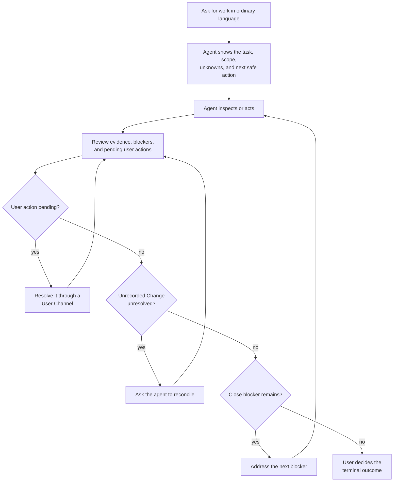

# User Workflow

Volicord lets you work with an agent in ordinary language while keeping scope,
Evidence, user-owned decisions, and Close Status separate. This page explains
the user workflow. Exact contracts stay in the
[Reference Index](../reference/README.md).

## Daily Loop



Ask for status before a large write, after a meaningful change, and before
close. Treat every pending user action, Unrecorded Change, and close blocker
as a named next action rather than background text.

## Start With The Outcome

Begin as you normally would:

```text
Add email login, but keep password reset and account creation out of scope.
Fix only the inaccurate links in this guide.
Show me what still blocks the first safe change.
```

You do not need API names or internal modes. State the outcome you want, the
important non-goals, and any “ask me before...” limits.

The agent should show:

- the current goal, scope, and non-goals
- known facts and important unknowns
- pending user-owned actions
- the next safe action

A broad request for help is not permission to expand scope, write unrelated
files, infer product behavior, or infer final acceptance.

## Keep Scope Current

Say plainly when the goal, non-goals, allowed paths, verification criteria, or
current work slice changes. The agent should refresh the visible boundary
before relying on an older status or write approval.

You decide whether to expand, narrow, pause, cancel, or supersede the work. You
also decide whether a new dependency, service, public behavior, migration, or
path belongs in scope. A phrase such as “sounds good” does not expand scope
unless the expansion itself was clear.

## Ask For A Useful Status

At any point, ask:

```text
What is known, what is blocked, and what can safely happen next?
```

A useful answer includes:

- the current work boundary and scope
- inspected facts and important unknowns
- the primary blocker
- any pending user action or approval
- relevant Evidence and its limits
- visible residual risk
- one next safe action

The agent should not mix inspected facts with your judgment, ask you to restate
facts it can inspect, present stale status as current, or treat a passing test
as final acceptance.

## Know Which Decisions Are Yours

User-owned decisions include:

- product behavior, user flow, copy, and accessibility trade-offs
- material technical direction, new dependencies, and external services
- scope changes and verification criteria
- security, privacy, authentication, retention, and compatibility choices
- sensitive-action approval
- final acceptance, residual-risk acceptance, cancellation, and supersession

The agent may recommend a bounded option after inspecting the relevant facts.
It should state what your answer settles and what remains open. It must not
combine several decisions into one broad approval.

For concrete examples, see [Judgment Examples](judgment-examples.md). Exact
authority boundaries belong to [Core Model](../reference/core-model.md).

<a id="record-a-core-user-judgment"></a>
## Record A User Judgment

When a decision must become Volicord state, use the User Channel path Volicord
shows. Depending on the host and current setup, that may be a host prompt, a
verified chat command, a local consent page, or the CLI inbox.

The stable manual path is:

```sh
volicord inbox --repo "<repo>"
volicord inbox resolve USER_ACTION_REQUEST_ID --choice CHOICE_ID --repo "<repo>"
```

Choose only an option displayed for that pending judgment. One answer resolves
only that judgment. The Agent Connection shows only the request ID,
`status=pending`, and `next_actor=user`; the exact question and options appear
only on the verified User Channel host surface or in `volicord inbox`. The Agent
does not receive the canonical form or record the user's answer.

Exact command behavior belongs to
[Administrative CLI](../reference/admin-cli.md#user-channel-commands). Exact
input-method and provenance boundaries belong to
[Agent Connection](../reference/agent-connection.md#user-channel-and-agent-connections).

## Separate Write Approval From A Write Ticket

Ordinary write approval is your bounded consent for a named write. A Write
Ticket is a separate Volicord record that checks one proposed product-file
change against the current work boundary.

When approving a write, name the relevant paths, commands, dependency changes,
hosts, or external actions. Treat dependency installation, deployment, secret
access, destructive commands, and similar actions as separate sensitive-action
decisions when needed.

Neither write approval nor a Write Ticket is whole-plan approval, final
acceptance, residual-risk acceptance, OS permission, or proof that a write
occurred.

<a id="use-evidence-without-replacing-judgment"></a>
## Use Evidence Without Replacing Judgment

After meaningful work, the agent should show what happened and which Evidence
supports each important claim. It should also name what failed, what is stale,
and which claim remains unsupported.

Evidence is not your judgment. A test pass, screenshot, log path, attachment,
or generated summary supports only the claim it actually demonstrates. Ask for
more Evidence or narrow the claim when the support is insufficient. Do not ask
the agent to expose secrets, tokens, or full sensitive logs.

Volicord may ask you to record a focused Evidence observation for one stored
acceptance criterion or supplemental claim. The host prompt, verified chat
command, local consent page, and CLI inbox all use the same stored target and
artifact candidates. Select only candidates shown in that form. The stable CLI
fallback is:

```sh
volicord inbox --repo "<repo>"
volicord inbox resolve USER_ACTION_REQUEST_ID \
  --criterion CRITERION_ID \
  --artifact ARTIFACT_ID \
  --summary "What the selected artifact shows" \
  --repo "<repo>"
```

Use `--claim CLAIM_ID` instead of `--criterion CRITERION_ID` when the displayed
target is a supplemental claim. Repeat `--artifact ARTIFACT_ID` to select more
displayed artifacts, and add `--contradicted` when the observation contradicts
the target.

This records one user-owned observation; it does not by itself prove evidence
sufficiency, final acceptance, or close readiness. The free-form summary stays
private to the User Channel resolution while the agent projection exposes only
safe selected identifiers and derived refs.

Exact Evidence meaning belongs to [Core Model](../reference/core-model.md).

## Reconcile Unrecorded Changes

The Detective profile can report a Product Repository change that does not
match recorded work. Treat it as an Unrecorded Change, not as proof of malicious
behavior or proof of who changed the file.

Ask the agent to run `volicord.reconcile_changes` when available. The CLI
recovery path is `volicord changes reconcile`. If reconciliation needs your
acceptance, answer through a supported User Channel. Unresolved Unrecorded
Changes remain close blockers.

Exact reconciliation behavior belongs to
[Reconcile-changes](../reference/api/method-reconcile-changes.md).

## Review Close Status

Before calling larger work done, ask:

```text
Show what changed, what was checked, what residual risk is visible, and what still blocks close.
```

Review these facts separately:

- current scope and result
- checks and Evidence
- pending required decisions
- unresolved Unrecorded Changes
- visible residual risk
- remaining close blockers
- the next action that would remove a blocker

Final acceptance means you accept the visible result. Residual-risk acceptance
means you accept one named remaining risk. Neither decision supplies missing
required Evidence or accepts unrelated risks.

Close Status is decision support from current Volicord records. It is not proof
of correctness, test sufficiency, QA completion, deployment success, human
review completion, or risk-free completion. Exact close meaning belongs to
[Core Model](../reference/core-model.md), and exact method behavior belongs to
[Close-task](../reference/api/method-close-task.md).

## Reference Paths

| Need | Reference |
|---|---|
| Supported and unsupported scope | [Scope](../reference/scope.md) |
| User Judgment, Evidence, Write Ticket, and Close Status | [Core Model](../reference/core-model.md) |
| Security guarantees and limits | [Security](../reference/security.md) |
| Agent Connection and User Channel | [Agent Connection](../reference/agent-connection.md) |
| Public API methods and schemas | [Reference Index](../reference/README.md) |

For the agent-side procedure, continue with [Agent Guide](agent-workflow.md).
