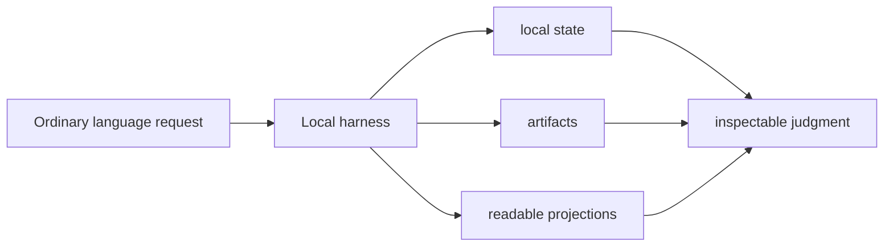
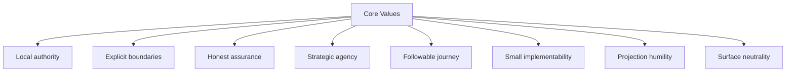
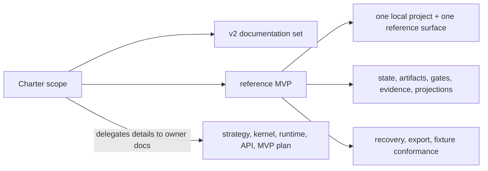
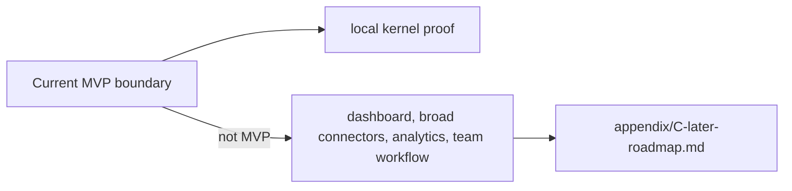
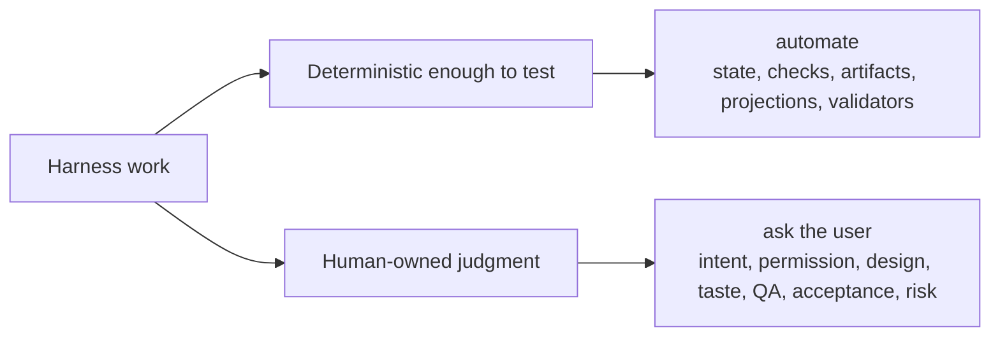

# 프로젝트 헌장

## 문서 역할

프로젝트 목적, 대상 독자, 가치, 범위, 비목표를 설명합니다.

## 담당 범위

- project purpose
- target users
- core values
- current non-goals
- automation philosophy

## 담당하지 않는 범위

- strategy invariant 세부
- state model
- API contract
- operating procedures

## 섹션

### 목적

이 프로젝트는 AI 지원 개발을 위한 로컬 Harness를 만들기 위해 존재합니다. Harness는 사용자의 전략적 판단권을 보존하는 로컬 운영 커널이며, 작업 여정을 따라갈 수 있게 유지합니다.

Harness는 대화를 대체하지 않습니다. 사용자는 평범한 언어로 시작할 수 있고, 오래 남아야 하는 작업 사실은 로컬 state, artifacts, readable projections에 기록됩니다. 그래서 목표, 범위, 설계, 트레이드오프, Codebase Stewardship, QA, acceptance, Residual Risk가 계속 inspectable하게 남습니다.

### 대상 사용자

주요 사용자는 다음과 같습니다.

- AI agents로 product code를 수정, 검증, 설명하는 개발자
- sessions를 넘나들며 신뢰할 수 있는 resume, evidence, close behavior가 필요한 개인 maintainer
- approvals, verification, QA, acceptance의 로컬 기록을 원하는 operators 또는 technical leads
- 하나의 agent surface를 Harness contract와 통합하는 connector authors
- v2 담당 모델을 유지 관리하는 documentation authors

### 핵심 가치

프로젝트가 중시하는 가치는 다음과 같습니다.

- Local authority: operational state와 evidence는 remote chat transcript가 아니라 local harness runtime에 보관합니다.
- Explicit boundaries: scope, approval, decisions, evidence, verification, Manual QA, acceptance, Residual Risk를 서로 다른 관심사로 드러냅니다.
- Honest assurance: 무엇을 확인했는지, 그 확인이 얼마나 독립적이었는지 시스템이 말해야 합니다.
- Strategic agency: 사용자는 goals, scope, design direction, product trade-offs, Codebase Stewardship, QA judgment, acceptance, residual-risk acceptance에 대한 판단권을 유지합니다.
- Followable journey: current state, next action, decisions, evidence, blockers는 chat memory에 기대지 않고 재구성할 수 있어야 합니다.
- Small implementability: MVP 선택은 fixtures로 만들고 test할 수 있을 만큼 구체적이어야 합니다.
- Projection humility: Markdown은 사람이 읽고 변경을 제안하는 데 도움을 주지만, 조용히 operational truth가 되지는 않습니다.
- Surface neutrality: capability는 product name으로 가정하지 않고 profile과 guarantee level로 설명합니다.

### 범위

현재 범위는 v2 documentation set과 그 문서가 설명하는 reference MVP입니다.

Reference MVP는 하나의 project, 하나의 reference agent surface, local runtime state, durable artifacts, public MCP tools, write gating, evidence, detached verification support, Manual QA, acceptance, projections, reconcile, recovery, export, fixture 기반 conformance로 local kernel을 입증해야 합니다.

이 헌장은 세부 담당 경계를 나머지 문서 세트에 맡깁니다.

- strategy와 policy boundary: [02-strategy.md](02-strategy.md)
- kernel behavior: [03-kernel-spec.md](03-kernel-spec.md)
- runtime architecture: [04-runtime-architecture.md](04-runtime-architecture.md)
- API와 schemas: [05-mcp-api-and-schemas.md](05-mcp-api-and-schemas.md)
- reference implementation plan: [06-reference-mvp.md](06-reference-mvp.md)

### 비목표

현재 비목표는 다음과 같습니다.

- 사용자의 product repository, VCS, test runner, review process를 대체하기
- chat history를 durable state로 취급하기
- 생성된 Markdown reports를 canonical operational records로 취급하기
- MVP에서 모든 agent surface를 지원하기
- 연결된 agent surface의 실제 보장 수준이 cooperative 또는 detective인데도 preventive enforcement를 약속하기
- dashboard, team workflow platform, long-term analytics layer, broad connector ecosystem을 MVP 범위로 만들기
- approval, QA, verification, acceptance, remaining risk를 하나의 `"done"` label 뒤에 숨기기

이후 자동화는 future version이 담당 문서, fixtures, fallback behavior, implementation scope를 부여하기 전까지 [appendix/C-later-roadmap.md](appendix/C-later-roadmap.md)에 둡니다.

### 자동화 철학

자동화는 작업을 더 이해하기 어렵게 만드는 것이 아니라 더 신뢰하기 쉽게 만들어야 합니다.

Harness는 agent를 기본적으로 autonomous하게 만들지 않습니다. Harness는 autonomy를 읽을 수 있고, 범위가 있으며, evidence가 있고, 중단 가능한 것으로 만듭니다.

Harness는 state recording, write checks, artifact registration, projection refresh, validator execution, recovery, export, conformance처럼 충분히 deterministic해서 test할 수 있는 actions를 자동화해야 합니다. 질문이 intent, sensitive permission, design direction, Codebase Stewardship, product taste, trade-off acceptance, QA, acceptance, Residual Risk에 관한 것이라면 사람의 판단을 요청해야 합니다.

어떤 rule을 preventively enforce할 수 없을 때는 실제 guarantee level을 보고하고, 더 강한 enforcement가 있는 척하지 말고 cooperative 또는 detective behavior로 fallback해야 합니다.

프로젝트는 authority boundaries가 불명확한 큰 시스템보다 작고 inspectable한 MVP를 선호합니다.
