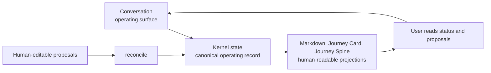
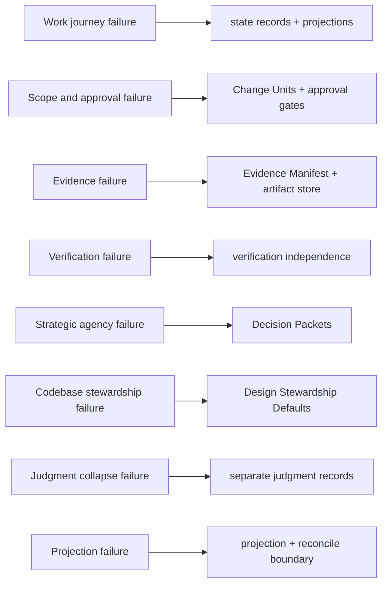
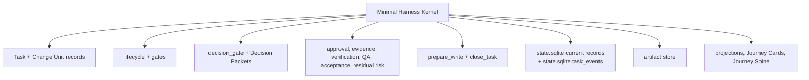
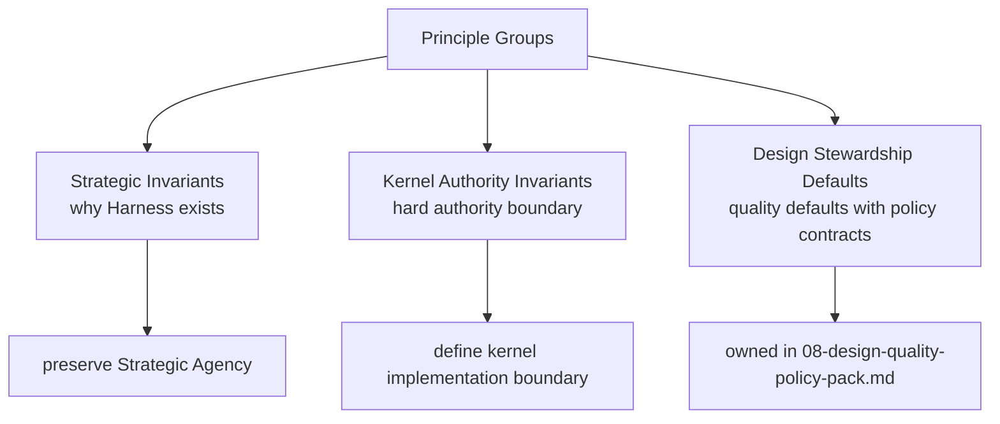
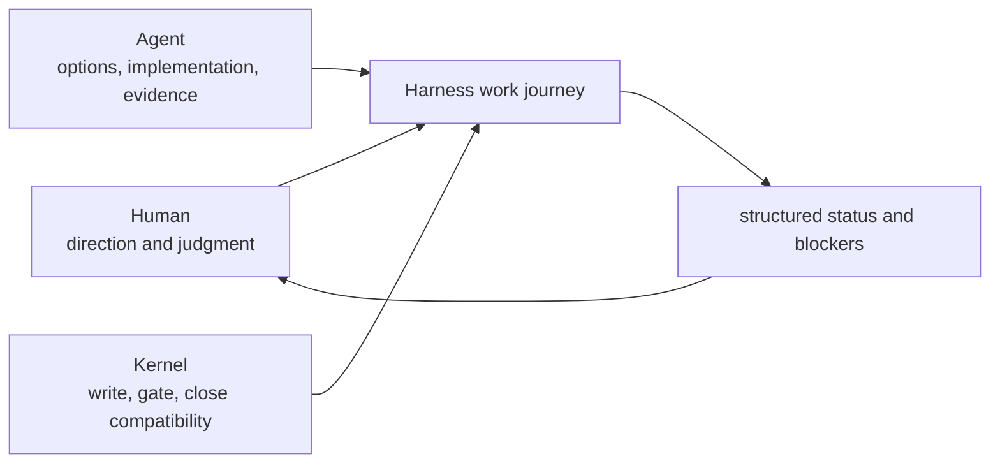
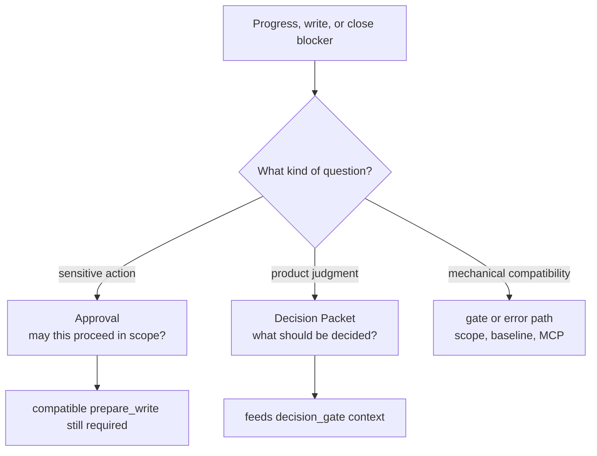
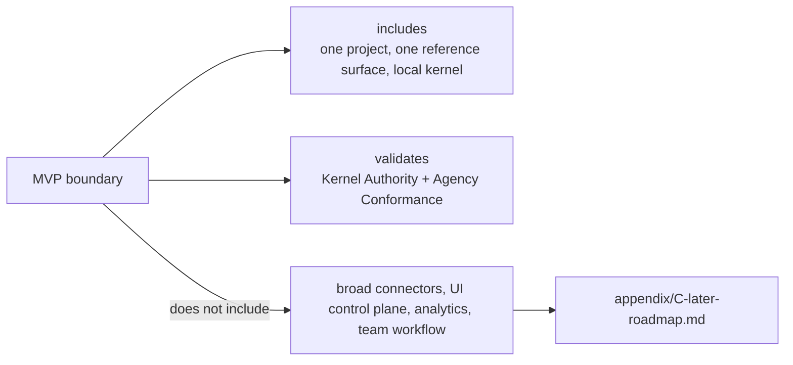

# 전략

## 문서 역할

이 문서는 Harness의 전략 계층을 담당합니다. Harness가 왜 존재하는지, 어떤 failure modes를 막는지, 어떤 원칙이 Strategic Agency를 보존하는지, 어떤 원칙이 Kernel Authority Invariants인지, 어떤 defaults가 Design Stewardship을 안내하는지 설명합니다. Operational state machine은 [03-kernel-spec.md](03-kernel-spec.md)가 정의하고, design-quality policy 세부 내용은 [08-design-quality-policy-pack.md](08-design-quality-policy-pack.md)가 확장합니다.

이 문서는 lifecycle transition tables, gate enum details, MCP request 또는 response schemas, SQLite DDL, full projection templates, surface-specific connector behavior를 정의하지 않습니다.

## 전략적 논지

Harness는 AI 지원 개발을 위한, 사용자의 전략적 판단권을 보존하는 로컬 운영 커널입니다. 목적은 chat transcript를 더 길게 만들거나 모든 Task를 무거운 절차로 바꾸는 것이 아닙니다. 목적은 사용자가 작업 여정을 따라갈 수 있게 하고, 목표, 범위, 설계, 트레이드오프, Codebase Stewardship, QA, acceptance, Residual Risk에 대한 전략적 판단권을 계속 갖게 하는 것입니다.

중심 논지는 다음과 같습니다.

```text
Kernel이 작업 여정을 명시적으로 유지하고, 오래 남는 진실을 작게 유지하며, 제품 판단을 decision gates에 기록하면 AI agents는 사용자를 밀어내지 않고도 빠르게 움직일 수 있습니다.
```

사용자는 평범한 언어로 시작할 수 있어야 합니다. Agent는 clarifying questions를 묻고, work를 shaping하고, changes를 만들고, evidence를 기록하고, decisions를 요청할 수 있어야 합니다. 하지만 작업의 durable facts는 chat transcript 밖에 있습니다. Completion은 대화 속 느낌이 아니라, 관련 evidence, QA, acceptance, residual-risk 질문이 명시된 뒤 kernel이 판단하는 state transition입니다.

따라서 Harness는 세 관심사를 분리합니다.

- Conversation은 operating surface입니다.
- Kernel state는 canonical operating record입니다.
- Markdown documents, Journey Cards, Journey Spine views는 human-readable projections이자 proposal surfaces입니다.



## Failure Model

Harness는 AI development workflows에서 반복적으로 나타나는 실패를 기준으로 설계됩니다.



### Work Journey Failure

current state, next action, open decisions, trade-offs, Residual Risk, evidence가 conversation 속에 묻히면 사용자는 작업 여정을 잃습니다. Chat이 사라지거나 agent session이 빈 상태로 resume되면 Task를 신뢰성 있게 재구성할 수 없습니다.

Harness는 Task state, Change Units, runs, decisions, Decision Packets, evidence, QA, acceptance, Residual Risk, close status를 canonical records에 유지하고, 사람이 읽을 수 있도록 projections를 생성해 대응합니다.

### Scope And Approval Failure

작업은 conversation 중에 커집니다. 작은 요청이 broad rewrite가 되거나, sensitive change가 explicit approval 없이 진행될 수 있습니다. Approval은 한 scope에 대해 부여됐는데 실제 write가 다른 path, command, network target, secret, baseline을 건드릴 수 있습니다.

Harness는 product writes에 scoped Change Units를 요구하고, sensitive categories에는 explicit approval을 요구해 대응합니다.

### Evidence Failure

Agent가 acceptance criteria에 연결된 durable evidence 없이 작업이 끝났다고 보고할 수 있습니다. Logs, diffs, checks, evaluation reports가 chat 안에 남거나 session과 함께 사라집니다.

Harness는 evidence가 필요한 곳에 evidence coverage를 요구하고, raw evidence를 artifact store에 저장해 대응합니다.

### Verification Failure

작업을 구현한 같은 agent가 self-review하고, system이 그것을 independent verification처럼 취급할 수 있습니다. 이는 confidence와 independence를 혼동합니다.

Harness는 self-checks와 detached verification을 분리하고, same-session review만으로 assurance를 올리지 않음으로써 대응합니다.

### Strategic Agency Failure

구현 속에 선택이 숨으면 agent가 product judgment를 대신하는 것처럼 진행될 수 있습니다. Goals, scope, design direction, Codebase Stewardship, QA judgment, acceptance, Residual Risk가 사용자에게 보이지 않은 채 암묵적으로 결정될 수 있습니다.

Harness는 Strategic Agency를 보존해 대응합니다. 진행이 product judgment에 막히면 system은 Decision Packet을 기록합니다. Decision Packet은 필요한 decision, options, trade-offs, 가능할 때 recommendation, affected scope, evidence, Residual Risk, next action을 명시합니다.

### Codebase Stewardship Failure

Agent work는 국소적으로는 끝난 것처럼 보여도 codebase를 더 이해하기 어렵고, test하기 어렵고, 바꾸기 어렵게 만들 수 있습니다. Task가 즉각적인 요청은 만족하더라도 domain language를 흐리거나, module 또는 interface boundaries를 넘나들거나, horizontal slice로 범위를 넓히거나, 유용한 TDD traces를 생략하거나, quality findings를 follow-up work와 분리해 남길 수 있습니다.

Harness는 Codebase Stewardship을 작업 여정의 일부로 다뤄 대응합니다. Domain language, module and interface boundaries, vertical-slice shape, feedback loops, TDD traces, Manual QA findings, blocking design trade-offs에 대한 Decision Packets는 local completion이 장기 유지보수 risk를 숨기지 못하게 합니다.

### Judgment Collapse Failure

Approval, technical assurance, Manual QA, acceptance, residual-risk acceptance가 하나의 흐릿한 `"looks good"`으로 합쳐질 수 있습니다. 사용자는 어떤 질문에 답이 끝났는지 알 수 없습니다.

Harness는 판단을 분리해 대응합니다.

- Approval: 이 sensitive change를 진행해도 되는가?
- Assurance: 결과가 기술적으로 어떻게 확인되었는가?
- Manual QA: 필요한 경우 사람이 experiential result를 inspected했는가?
- Acceptance: 사용자가 결과와 남은 trade-offs를 받아들이는가?
- Residual risk: 어떤 알려진 uncertainty 또는 trade-off가 남았고, close가 그 수용에 의존할 때 사용자가 이를 받아들였는가?

### Projection Failure

생성된 documents, stale summaries, human-edited notes가 canonical state처럼 취급될 수 있습니다. Document change가 조용히 operational truth를 바꿉니다.

Harness는 Markdown reports를 projections로 취급해 대응합니다. Human-editable areas는 input surfaces이며, 수용된 human edits만 reconcile 또는 Core state-changing action을 통해 state가 됩니다.

## Minimal Harness Kernel

Minimal kernel은 Kernel Authority Invariants를 보존하는 가장 작은 구현 가능한 mechanism입니다.

- continuity와 write scope를 위한 Task 및 Change Unit records.
- state compatibility를 위한 lifecycle plus gates.
- blocking product judgments를 위한 `decision_gate` aggregate와 recorded Decision Packets.
- 서로 다른 judgments를 위한 approval, evidence, verification, QA, acceptance, residual-risk records.
- product-write decision point로서의 `prepare_write`.
- completion decision point로서의 `close_task`.
- operational history를 위한 `state.sqlite` current records와 `state.sqlite.task_events`.
- raw evidence를 위한 artifact store.
- human-readable reports와 user proposal surfaces를 위한 projections, Journey Cards, Journey Spine views.



Kernel specification은 entity semantics, lifecycle fields, gate enums, transition rules, close semantics, waiver semantics, invariant enforcement를 담당합니다.

## Principle Groups

Harness는 Strategic Invariants, Kernel Authority Invariants, Design Stewardship Defaults를 분리합니다. 이렇게 해야 human agency가 보이면서도 모든 좋은 practice가 hard kernel gate로 바뀌지 않습니다.



### Strategic Invariants

이 invariants는 Harness가 존재하는 이유를 보존합니다. 이를 위반하는 system은 records를 저장할 수는 있어도 더 이상 사용자의 Strategic Agency를 보존한다고 볼 수 없습니다.

1. Strategic agency stays with the user.
2. The work journey remains followable from current state.
3. Product judgment is explicit for goals, scope, design, trade-offs, Codebase Stewardship, QA, acceptance, and Residual Risk.
4. Agents may propose, implement, and verify within recorded Autonomy Boundaries, but they do not silently take over product judgment.
5. Automation must make choices, blockers, evidence, and remaining risk easier to inspect.

### Kernel Authority Invariants

이 invariants는 local kernel의 authority boundary를 정의합니다. 이 중 하나를 위반하는 system은 더 이상 Harness kernel을 구현하는 것이 아닙니다.

1. Chat is not state.
2. Product write requires an active scoped Change Unit.
3. Sensitive change requires explicit approval.
4. Blocking product judgment requires a recorded Decision Packet.
5. Completion requires evidence coverage where evidence is required.
6. Work cannot self-certify detached verification.
7. Required QA and acceptance are separate gates.
8. Projection cannot override canonical state.

### Design Stewardship Defaults

다음 항목은 Design Stewardship Defaults이며 Kernel Authority Invariants가 아닙니다. Product quality를 높인다는 점에서 중요하지만, 적용 규칙, 허용되는 waivers, required records, validators, close impact는 policy pack이 정의합니다.

- Shared design for work.
- Domain language consistency.
- Vertical slice default.
- TDD trace for suitable work.
- Module and interface review.
- Codebase stewardship for module boundaries, interface contracts, dependency direction, testability, maintainability, and future-change risk.
- Manual QA for UI, UX, copy, accessibility, visual output, and product taste.
- Feedback loops from user decisions, QA findings, Eval findings, and residual-risk decisions back into state, scope, design, evidence, or follow-up work.
- Context hygiene.

Strategy는 이 defaults를 보이게 둡니다. Product experience를 실제로 형성하기 때문입니다. 여러 applicable default가 merged gate, write-blocker, close-blocker, waiver, Decision Packet impact로 compose되는 방식까지 포함해 세부 contracts는 policy pack이 담당합니다. 그 composition은 policy outcome을 guide하지만 이 defaults를 Kernel Authority Invariants로 승격하지 않습니다.

## Human Judgment Model

Harness는 사람이 strategic direction과 judgment를 제공하고, agents가 options, implementation, evidence, verification support, structured status를 제공한다고 가정합니다.



사람이 담당합니다.

- goals and priorities
- scope confirmation
- design direction and product trade-offs
- Codebase Stewardship judgment
- sensitive-change approval
- human inspection이 필요한 곳의 Manual QA results
- final acceptance 또는 rejection
- close가 risk acceptance에 의존할 때 residual-risk acceptance

Agent가 담당합니다.

- choices와 risks를 드러내기
- product judgment가 progress를 막을 때 Decision Packets 준비하기
- Change Unit 제안하기
- approved scope 안에 머물기
- runs와 evidence 기록하기
- gates가 요구할 때 decisions 요청하기
- required일 때 detached verification을 시작하거나 준비하기

Kernel이 담당합니다.

- write 허용 여부
- Task close 가능 여부
- blocking product judgment에 recorded Decision Packet이 있는지 여부
- evidence, verification, QA, acceptance states의 compatibility 여부
- projections가 display로 믿을 만큼 최신인지 여부

### Decision Packets와 Approval은 대체재가 아니라 형제 관계입니다

Approval은 정의된 scope 안에서 sensitive action을 진행해도 되는지에 답합니다. Decision Packet은 사용자가 어떤 product judgment를 내리고 있는지에 답합니다.



Approval은 product trade-off, design direction, QA waiver, verification risk, acceptance, residual risk를 해결하지 않습니다. 그런 판단은 compatible authority path를 통해 별도로 기록되어야 합니다.

Missing scope, missing approval, stale baseline, MCP unavailable 같은 mechanical write blockers는 각자의 gate 또는 error path를 사용합니다. Decision Packet은 blocker가 product judgment이거나 user-owned waiver, risk, acceptance decision일 때만 필요합니다.

모든 implementation choice에 Decision Packet이 필요한 것은 아닙니다. 선택이 progress, write, close, waiver, acceptance, residual-risk acceptance, product direction, scope, design trade-off, stewardship judgment, public commitment를 막을 때 Decision Packet이 필요합니다. Active Change Unit과 Autonomy Boundary 안의 평범하고 되돌릴 수 있는 implementation choices는 run notes나 evidence로 기록할 수 있습니다.

이 모델은 사용자가 모든 file write나 status claim을 직접 감시하지 않아도 사용자의 판단권을 유지합니다.

## Source-Of-Truth 요약

Strategy 수준의 규칙은 generated 또는 human-edited Markdown이 우연히 operational truth가 되면 안 된다는 것입니다. Operational state, raw evidence, projection authority, reconcile behavior의 canonical contracts는 owner docs에 둡니다. [03-kernel-spec.md](03-kernel-spec.md#authority-rules), [04-runtime-architecture.md](04-runtime-architecture.md#raw-artifacts-state-records-and-markdown-reports), [06-reference-mvp.md](06-reference-mvp.md#statesqlite), [07-document-projection.md](07-document-projection.md#document-authority-matrix)를 봅니다.

요약하면 `state.sqlite` current records와 `state.sqlite.task_events`가 operational record이고, raw evidence는 artifact store에 있으며, Markdown reports는 projections이고, human-editable areas는 reconcile 또는 다른 Core state-changing action을 통해서만 state가 됩니다.

## Guarantee Level 요약

Guarantee level은 연결된 surface가 무엇을 enforce할 수 있는지 strategy가 과장하지 않게 해 줍니다. Level 정의는 [04-runtime-architecture.md](04-runtime-architecture.md#guarantee-levels)가 담당하고, profile/fallback behavior는 [09-agent-integration.md](09-agent-integration.md#capability-profile)이 담당합니다.

MVP reference surface는 주로 cooperative 및 detective 수준입니다. Capability는 kernel gate가 아니며, kernel boundary는 [03-kernel-spec.md](03-kernel-spec.md#capability-boundary)에 정의됩니다.

## MVP 경계

MVP는 broad agent-integration platform이 아니라 kernel authority와 Agency Conformance를 검증하는 project입니다.



MVP delivery는 final MVP scope를 바꾸지 않고 staged로 진행합니다. Kernel Smoke는 kernel authority path의 첫 runnable proof이고, Agency-Hardened MVP는 agency, stewardship, verification, operations, fixture-conformance 요구사항을 만족하는 complete reference MVP입니다. 이 staged reading은 기존 MVP-0부터 MVP-5까지의 sequence에 mapping되며, MVP-critical authority 또는 agency requirement를 later로 옮기지 않습니다. Compact contract는 [Reference MVP staging](06-reference-mvp.md#단계적-delivery-해석)을 봅니다.

MVP 포함 항목:

- 하나의 local project registration
- 하나의 reference agent surface
- `state.sqlite` current records와 `state.sqlite.task_events`
- artifact registry와 artifact store
- public MCP tool surface
- `prepare_write` gatekeeping
- blocking product judgment를 위한 Decision Packet과 `decision_gate` support
- approval, evidence, verification, Manual QA, acceptance gate enforcement
- Journey Card 또는 equivalent compact status projection
- Task status, approval, runs, evidence, Eval, direct results를 위한 required MVP report projections
- detached verification bundle 또는 manual evaluator instruction bundle
- decision visibility와 residual-risk visibility를 위한 Agency Conformance smoke coverage
- basic doctor, recover, reconcile, export, conformance smoke paths

MVP 제외 항목:

- reference surface를 넘어서는 broad connector coverage
- UI control plane과 automatic capture features
- reference surface를 넘어서는 native hook expansion
- fully automatic parallel execution
- long-term analytics
- team workflow management

이후 자동화 항목은 [appendix/C-later-roadmap.md](appendix/C-later-roadmap.md)가 담당합니다. 이후 자동화는 guarantee level을 강화할 수 있지만 Strategic Agency model이나 Kernel Authority Invariant model을 약화해서는 안 됩니다.
