# 커널 명세

## 문서 역할

이 문서는 Harness의 운영 커널 명세를 담당합니다. Entity model, lifecycle model, gates, state compatibility rules, transition table, close semantics, waiver semantics, `prepare_write` state logic, `close_task` state logic, invariant enforcement mapping을 정의합니다.

이 문서는 MCP wire schemas, SQLite DDL, projection template text, design-quality playbook procedures, connector capability schemas, capability를 first-class kernel gate로 만드는 규칙을 정의하지 않습니다.

## 커널 범위

Kernel은 로컬 AI 지원 product work를 위한 canonical state machine입니다. Kernel은 다음을 결정합니다.

- 어떤 Task가 active인지
- 어떤 Change Unit이 product writes의 scope인지
- write를 진행해도 되는지
- 어떤 decisions, approvals, evidence, verification, QA, acceptance gates가 적용되는지
- Task를 close할 수 있는지
- 어떤 state events를 append할지
- 어떤 projections를 refresh해야 하는지

Operational state는 `state.sqlite` current records와 `state.sqlite.task_events`에서 canonical합니다.
Raw evidence는 artifact store에서 canonical합니다. Markdown reports는 state records와 artifact refs에서 생성되는 projections입니다. Human-editable sections는 input surfaces입니다.

Kernel은 raw evidence와 projections에 대한 references를 기록하지만, chat text나 생성된 Markdown이 canonical state를 대신하지는 않습니다.

## 작업 모드

`advisor`는 read-only explanation, comparison, review, decision support를 위한 모드입니다. Product writes를 authorize하지 않습니다. Advisor tasks는 보통 `result=advice_only`로 close되며, policy나 사용자가 명시적으로 요구하지 않는 한 evidence, verification, QA, acceptance gates는 일반적으로 required가 아닙니다.

`direct`는 scope와 result가 명확한 작고 low-risk인 product changes를 위한 모드입니다. Write-capable 모드이므로 product writes에는 여전히 active scoped Change Unit이 필요합니다. Direct work는 기본적으로 `self_checked`로 close될 수 있습니다. Optional detached verification을 수행했고 valid independence qualifier로 pass했다면 direct work를 `detached_verified`로 표시할 수 있습니다.

`work`는 structured implementation, non-local change, 더 위험한 change, independent verification이 필요한 work를 위한 모드입니다. Write-capable 모드이고 product writes 전에 active scoped Change Unit이 필요하며, same-session self-review만으로 `detached_verified`가 될 수 없습니다.

이 다이어그램은 mode selection과 write eligibility를 요약합니다. Writes, evidence, verification, QA, acceptance가 언제 적용되는지는 위 mode 설명이 canonical contract입니다.

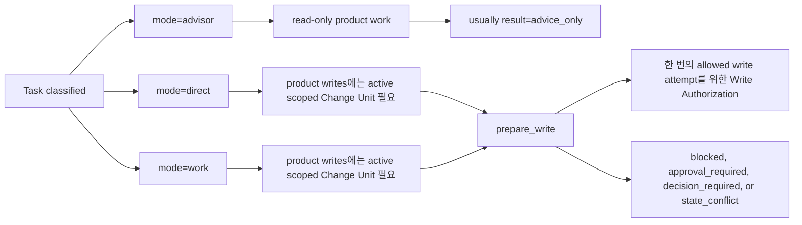

### Direct Fast Path

Direct에서도 product writes 전에는 active scoped Change Unit이 필요합니다. 작고 명확한 request에서는 Change Unit이 minimal할 수 있고, obvious user request에서 파생될 수 있습니다. 단, `prepare_write`와 `record_run` compatibility checks가 가능하도록 intended operation과 scoped write surface는 충분히 명확히 기록해야 합니다.

Blocking product judgment가 detected되지 않는 한 Decision Packet은 생성하지 않습니다. Evidence는 applicable evidence profile에 따라 lightweight할 수 있습니다. 예를 들어 changed path list, patch summary 또는 diff artifact, relevant한 command result, self-check summary가 될 수 있습니다.

Manual QA, detached verification, residual-risk acceptance는 policy, changed surface, user request, detected risk가 요구하지 않는 한 direct work에 required가 아닙니다. Scope, risk, affected interface, evidence expectations가 direct assumptions를 넘어서 커지면 같은 Task가 `work`로 escalate됩니다.

## Entity Model

이 다이어그램들은 record relationships를 navigation level에서 보여 줍니다. Fields 또는 storage contracts를 추가하지 않으며, entity subsections와 Reference MVP DDL이 authoritative합니다.

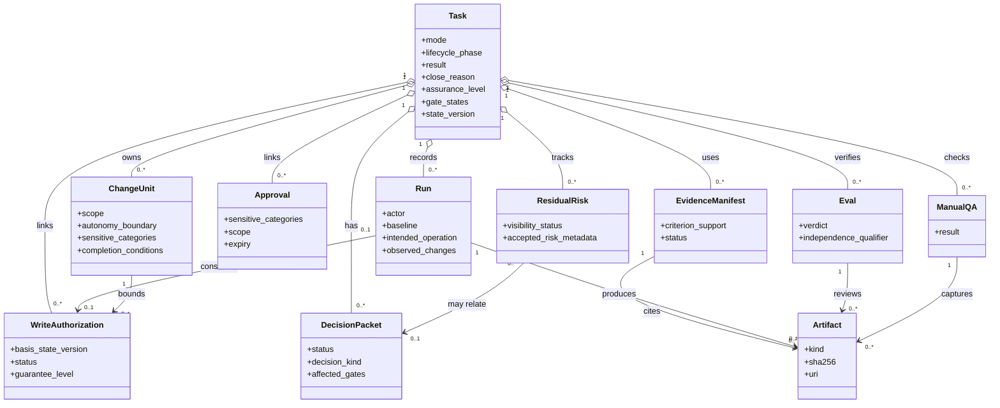

Design and continuity support records는 kernel-owned support records이며, policy와 storage details는 각 owning document에 남습니다.

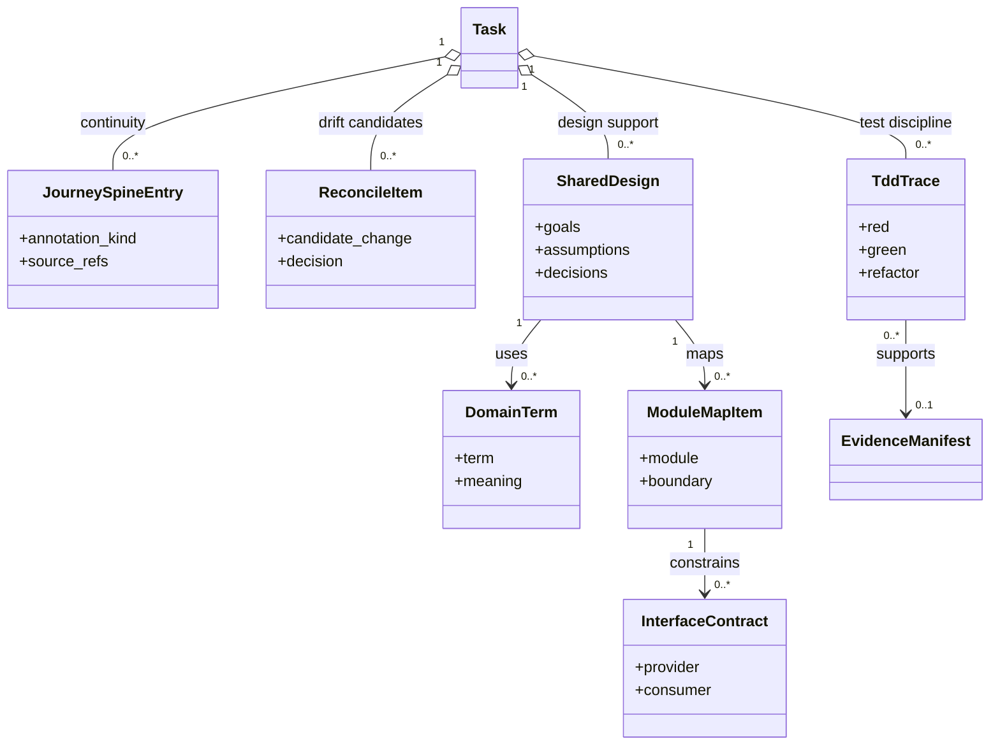

### Task

Task는 사용자 가치 단위입니다. current mode, lifecycle phase, result, close reason, assurance level, gate states, current summary, acceptance criteria, Decision Packet references, Residual Risk references, active Change Unit, active Run, latest record references, optional Journey Spine Entry references, projection freshness를 가집니다. Task는 status, resume, close decisions에서 쓰는 primary state record입니다.

### Change Unit

Change Unit은 product writes를 위한 scoped implementation unit입니다. purpose, non-goals, slice type, intended end-to-end path, autonomy boundary, allowed paths, allowed tools, validator profile, sensitive categories, approval needs, evidence expectations, QA expectations, dependencies, merge risk, completion conditions, evaluator focus를 기록합니다.

모든 product write에는 intended write를 cover하는 active Change Unit이 필요합니다. Task는 하나 이상의 Change Units를 가질 수 있지만, current write의 scope가 되는 것은 active Change Unit뿐입니다. Core는 `prepare_write`를 통해 specific write attempt를 허용하며, gates가 pass하면 Write Authorization을 create하거나 같은 request의 idempotent replay에 대해 already committed response를 반환합니다.

### Autonomy Boundary

Autonomy Boundary는 Change Unit semantics의 일부입니다. Agent가 추가 user decision 없이 진행할 수 있는 product-judgment boundary를 기록합니다. Goals, scope, design direction, trade-offs, codebase stewardship, residual risk, implementation choices에 대해 허용된 latitude를 포함합니다.

Autonomy Boundary는 scope grant가 아닙니다. Active Change Unit 밖의 paths, tools, commands, network targets, secret access, sensitive categories를 authorize하지 않습니다. Decision Packet이 Autonomy Boundary update나 Change Unit update proposal을 authorize할 수는 있지만, resulting write에는 여전히 compatible Change Unit scope와 sensitive categories에 필요한 granted approval이 필요합니다.

Autonomy Boundary는 Change Unit scope, sensitive approval, policy checks, evidence, verification, QA, acceptance, `prepare_write`를 대체하지 않습니다. Intended operation이 active Autonomy Boundary를 넘으면 kernel은 operation을 block하고, product judgment로 해결할 수 있을 때 Decision Packet을 통해 user decision을 요청합니다.

### Decision Packet

Decision Packet은 blocking product judgment를 위한 canonical state entity입니다. decision needed, options, 가능할 때 recommendation, trade-offs, affected scope, supporting evidence, residual risk, owner, status, next action을 기록합니다.

Decision Packets는 `decision_gate`에 feed됩니다. Blocking product judgment는 chat text, broad approval, projection prose만으로 충족될 수 없습니다. Recorded Decision Packet과 그 resolution, deferral, blocked status가 해당 judgment에 대한 kernel authority path입니다.

Minimal MVP 구현은 `decision_requests`를 생략할 수 있습니다. 구현이 이를 유지한다면 이 rows는 routing, interaction, replay, legacy handoff metadata일 뿐입니다. Product judgment authority가 아니며, `decision_request` row만으로는 `decision_gate`, approval, acceptance, waiver, residual-risk acceptance, close를 절대 만족하지 않습니다.

Decision Packet status는 record-level입니다.

```text
proposed | pending_user | resolved | deferred | rejected | blocked | superseded
```

- `proposed`는 packet이 drafted 또는 detected되었지만 아직 active user request가 아니라는 뜻입니다.
- `pending_user`는 packet이 사용자의 product judgment를 기다린다는 뜻입니다.
- `resolved`는 user decision 또는 accepted state decision이 기록되었고 affected scope와 compatible하다는 뜻입니다.
- `deferred`는 사용자가 decision을 의도적으로 deferred했고 packet이 close impact, residual risk, follow-up visibility를 relevant한 곳에 기록했다는 뜻입니다.
- `rejected`는 packet 또는 proposed decision path가 rejected되었다는 뜻입니다.
- `blocked`는 현재 state에서 packet을 resolve하거나 defer할 수 없다는 뜻입니다.
- `superseded`는 다른 Decision Packet, Change Unit, Task state가 이를 대체한다는 뜻입니다.

### Journey Spine

Journey Spine은 Task의 ordered work journey를 state에서 파생해 이어 주는 continuity model입니다. Task, Change Unit, Run, Decision Packet, Approval, Evidence Manifest, Eval, Manual QA, Residual Risk, `task_gates.acceptance_gate`, acceptance Decision Packet user-decision state, close events, artifact references, `state.sqlite.task_events`에서 재구성됩니다.

Journey Spine은 별도의 source of truth가 아닙니다. Journey Card와 Journey Spine Markdown views는 projections입니다. 이들은 사람이 work를 resume하고 inspect하는 데 도움을 주지만 Task state, gate fields, Decision Packets, Evidence Manifests, Residual Risk records, artifact records, `state.sqlite.task_events`를 override하지 않습니다.

### Journey Spine Entry

Journey Spine Entry는 existing state events나 source records만으로 완전히 재구성하기 어려운 durable continuity annotations를 위한 canonical support record입니다. annotation kind, ordering relationship, source refs, affected scope, summary, actor, time, artifact refs를 기록할 수 있습니다.

Journey Spine Entry records는 reconstruction을 보완합니다. Task state, Change Units, Runs, Decision Packets, Residual Risk, evidence, verification, QA, acceptance gate/decision state, close state/events, artifacts의 owner records를 대체하지 않습니다.

### Run

Run은 lead agent, evaluator, operator, 기타 actor가 수행하는 execution attempt입니다. actor identity, surface identity, mode, Change Unit, baseline, intended operation, observed changes, command results, artifact references, summary를 기록합니다. Lead Run은 shape하거나 implement할 수 있습니다. Evaluator Run은 separate verification boundary에서 verify하며, independence qualifier가 valid하지 않으면 detached verification이 될 수 없습니다.

Implementation과 direct Runs는 Run이 read-only 또는 shaping-only가 아닌 한 compatible, unexpired, unconsumed Write Authorization을 consume해야 합니다. Consumed authorization은 Run을 해당 write attempt를 허용한 `prepare_write` decision에 연결합니다.

### Approval

Approval은 sensitive change를 위한 scope-bound prior decision입니다. Approved된 paths, tools, commands 또는 command classes, network targets, secret scope, baseline, sensitive categories, expiry conditions, user decision을 기록합니다. Approval은 defined scope 안의 sensitive categories를 authorize합니다. Correctness를 증명하지 않고, evidence를 대체하지 않고, QA를 만족시키지 않고, acceptance를 뜻하지 않으며, product judgment의 authority path도 아닙니다.

Sensitive action이 product trade-off, architecture choice, QA waiver, verification risk, acceptance, residual-risk acceptance, public interface commitment도 포함한다면 Approval record는 sensitive category만 authorize할 수 있습니다. Product judgment에는 여전히 compatible Decision Packet이 필요합니다.

### Write Authorization

Write Authorization은 `prepare_write`가 product write를 허용할 때 create되는 durable state record입니다.

Task, active Change Unit, `basis_state_version`, intended operation, intended paths, intended tools, intended commands, intended network targets, intended secret access, sensitive categories, baseline, approval refs, relevant Decision Packet refs, guarantee level, status, created time, Run에 의한 consumption을 기록합니다.

`basis_state_version`은 Core가 stale-state checks 이후 authorization을 create하기 전에 allowed write attempt의 compatibility basis로 사용한 affected-scope state version입니다. MVP Write Authorization에서는 authorization의 Task에 대한 Task State Version입니다. 이 field는 idempotent replay audit, stale detection, 오래된 unconsumed authorization이 stale, expired, revoked가 된 이유를 설명하는 데 사용됩니다.

Write Authorization은 그 자체로 scope가 아닙니다. Active scope와 gates 아래에서 Core가 specific write attempt를 허용했다는 evidence입니다.

Write Authorization은 approval, evidence, verification, QA, acceptance, residual-risk visibility를 대체하지 않습니다.

`authorization_effect=returned`는 같은 idempotency key, request hash, `basis_state_version`을 가진 동일한 committed `prepare_write` request의 idempotent replay 또는 already committed response 반환에만 reserved됩니다. Distinct compatible `prepare_write` request는 distinct Write Authorization을 create합니다. Compatibility가 authorization을 reusable하게 만들지는 않습니다. Compatibility basis가 바뀌면 Core는 오래된 unconsumed authorization을 stale, expire, revoke할 수 있습니다.

Write Authorization status는 record-level입니다.

```text
allowed | consumed | expired | stale | revoked
```

- `allowed`는 `prepare_write`가 write attempt를 허용했고 authorization이 unconsumed, unexpired이며 stale 또는 revoked가 아니라는 뜻입니다.
- `consumed`는 하나의 committed implementation 또는 direct `record_run`이 authorization을 사용했다는 뜻입니다. Write Authorization은 같은 committed `record_run` request의 idempotent replay를 제외하고 single-use입니다.
- `expired`는 authorization의 time, baseline, state-version, 기타 expiry condition이 consumption 전에 지났다는 뜻입니다.
- `stale`은 active Change Unit scope, baseline, approval, relevant Decision Packet, sensitive category, guarantee level 같은 compatibility basis가 later state change로 바뀌었다는 뜻입니다.
- `revoked`는 Core, policy, 또는 explicit user decision이 consumption 전에 authorization을 withdrawn했다는 뜻입니다.

### Evidence Manifest

Evidence Manifest는 acceptance criteria 또는 completion conditions를 evidence references에 mapping합니다. 각 criterion이 supported, unsupported, not applicable인지 기록하고 durable artifacts, run summaries, Eval records, Feedback Loop records, TDD traces, Manual QA records, 기타 recorded evidence를 reference합니다. Evidence sufficiency는 이 manifest와 related records에서 판단합니다.

### Eval

Eval은 verification result record입니다. verification target, verdict, checks performed, evidence reviewed, independence qualifier, baseline relationship, blockers, artifact references를 기록합니다. Eval verdict만으로 assurance가 올라가지 않습니다. `assurance_level=detached_verified`에는 passed verification result, valid independence qualifier, same-session self-review violation 없음이 필요합니다.

### Manual QA

Manual QA는 UX, workflow, copy, accessibility, visual output, product taste 또는 human judgment가 필요한 기타 result에 대한 human inspection record입니다. `manual_qa_record.result`는 실제 Manual QA record의 record-level result이며 `passed`, `failed`, `waived`로 제한됩니다.

아직 충족되지 않은 required QA는 Manual QA record result가 아니라 aggregate `qa_gate=pending`으로 표현합니다.

### Residual Risk

Residual Risk는 known remaining uncertainty, trade-off, limitation, unchecked condition을 위한 canonical close-relevant support record입니다. source refs, affected scope, applicable한 경우 related Decision Packet, visibility status, accepted risk, follow-up requirement, close impact를 기록합니다.

Residual Risk records는 acceptance 또는 risk-accepted close 전에 remaining risk를 보이게 합니다. 이 records는 detached verification을 만들지 않고, evidence를 대체하지 않고, QA를 waive하지 않고, sensitive approval을 grant하지 않고, final acceptance를 뜻하지도 않습니다.

Accepted risk는 MVP에서 별도의 canonical state record가 아닙니다. Risk acceptance는 관련 Residual Risk record의 accepted-risk metadata/status를 update하고 residual-risk acceptance events를 append할 수 있습니다. API 또는 projection에 남아 있는 public accepted-risk ref field는 `accepted_risk` 또는 `ARISK-*` record가 아니라 `record_kind=residual_risk`인 `StateRecordRef`를 가리켜야 합니다.

### Artifact

Artifact는 artifact store 안의 durable evidence file입니다. diff, log, bundle, manifest, screenshot, checkpoint, exported bundle component 등이 여기에 해당합니다. Artifact records는 reference와 integrity metadata로 이 files를 identify하고 verify합니다. Raw artifacts는 Markdown reports 및 state records와 구분됩니다.

### Reconcile Item

Reconcile Item은 human-editable content 또는 generated projection drift가 state에 영향을 줄 필요가 있을 때 생성되는 canonical candidate record입니다. Reconcile decisions는 item을 merge, reject, note로 convert, decision으로 create, defer할 수 있습니다. Human-editable text는 input이며, accepted state changes는 reconcile action과 state events를 통해서만 일어납니다.

### Design Support Records

Kernel은 design support records의 entity meaning도 담당합니다.

- Shared Design records는 goals, scope, assumptions, rejected options, acceptance criteria, decisions를 capture합니다.
- Domain Term records는 Domain Language의 canonical source입니다.
- Module Map Item records는 Module Map의 canonical source입니다.
- Interface Contract records는 Interface Contract의 canonical source입니다.
- Feedback Loop records는 selected feedback-loop definitions, planned loops, execution refs, waivers, alternate loops를 위한 canonical support records입니다.
- TDD Trace records는 red, green, refactor evidence 또는 recorded non-TDD justification을 capture합니다. TDD는 가능한 Feedback Loop 구현 중 하나이지 Feedback Loop record 자체가 아닙니다.

Policy requirements는 design-quality policy pack이 담당합니다. Storage DDL은 reference MVP document가 담당합니다.

## Authority Rules

User Notes authority는 다음과 같습니다.

```text
human-editable input -> reconcile_items -> accepted state event/record
```

Domain Language canonical source는 `domain_terms`입니다.

Module Map canonical source는 `module_map_items`입니다.

Interface Contract canonical source는 `interface_contracts`입니다.

`DOMAIN-LANGUAGE`, `MODULE-MAP`, `INTERFACE-CONTRACT` Markdown documents는 projections이자 proposal surfaces입니다. 이 문서들은 canonical records를 override하지 않습니다.

Decision Packet과 Residual Risk canonical source는 kernel state입니다. Decision Packet과 residual-risk Markdown views는 projections 또는 proposal surfaces입니다.

Journey Spine은 kernel state, registered artifact references, `state.sqlite.task_events`에서 파생됩니다. Durable continuity annotations가 필요할 때 Journey Spine Entry canonical source는 kernel state입니다. Journey Cards와 Journey Spine Markdown views는 projections이며, 그 자체로 state를 repair, close, mutate할 수 없습니다.

Approval과 Decision Packet authority는 분리되어 있습니다. Approval은 defined scope 안의 sensitive categories를 authorize합니다. Product judgment의 authority path가 아닙니다. Sensitive action이 product trade-off, architecture choice, QA waiver, verification risk, acceptance, residual-risk acceptance, public interface commitment도 포함한다면 Approval은 sensitive category만 authorize할 수 있습니다. Product judgment에는 여전히 compatible Decision Packet이 필요합니다.

이 다이어그램은 흔한 human-readable surfaces의 source-of-truth boundaries를 요약합니다. 화살표는 canonical 또는 accepted inputs에서 derived views 또는 authority records로 향합니다.

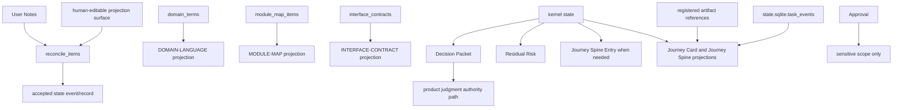

## Lifecycle Model

Kernel은 lifecycle fields plus gates를 사용합니다. Compact display states는 이 canonical fields에서 파생됩니다.

### Mode

```text
advisor | direct | work
```

### Lifecycle Phase

```text
intake | shaping | ready | executing | verifying | qa |
waiting_user | blocked | completed | cancelled
```

### Result

```text
none | advice_only | passed | failed | cancelled
```

### Close Reason

```text
none | completed_verified | completed_self_checked |
completed_with_risk_accepted | cancelled | superseded
```

### Assurance Level

```text
none | self_checked | detached_verified
```

Assurance는 approval, QA, acceptance가 아닙니다. Runs, evidence, Eval records, verification independence가 뒷받침하는 technical checking level을 요약합니다.

이 state diagram은 주요 `lifecycle_phase` values를 orient하기 위한 것입니다. Gate effects와 detailed transition conditions의 canonical source는 아래 transition table입니다.

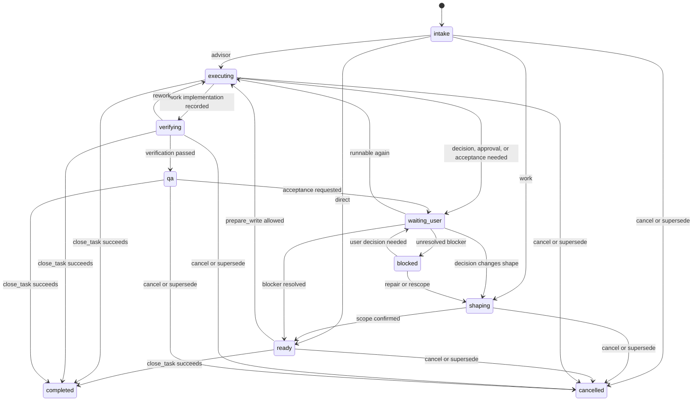

## Gate Model

Gates는 `prepare_write`, `close_task`, status display, conformance fixtures가 사용하는 canonical kernel fields입니다.

이 map은 gates가 두 주요 kernel decision points에서 어디에 소비되는지 보여 줍니다. Navigation aid일 뿐이며, 각 gate subsection이 enum values와 compatibility meaning을 소유합니다.

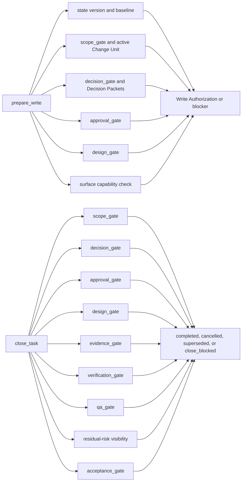

### Scope Gate

```text
not_required | required | pending | passed | failed | blocked
```

`scope_gate`는 모든 write-capable product work에 적용됩니다. Advisor-only tasks는 보통 `not_required`를 사용합니다. Direct와 work product writes에는 writing 전에 scoped Change Unit과 passed scope gate가 필요합니다.

### Decision Gate

```text
not_required | required | pending | resolved | deferred | blocked
```

`decision_gate`는 product judgment가 progress, write, close를 막고 있는지를 기록합니다. 이는 blocking Decision Packets가 feed하는 aggregate Task gate입니다.

- `not_required`는 현재 blocking product judgment가 적용되지 않는다는 뜻입니다.
- `required`는 blocking product judgment가 detected되었고 Decision Packet을 record 또는 associate해야 한다는 뜻입니다.
- `pending`은 blocking Decision Packet이 존재하며 user's decision을 기다린다는 뜻입니다.
- `resolved`는 현재 operation과 relevant한 모든 blocking Decision Packets가 compatible decisions를 recorded했다는 뜻입니다.
- `deferred`는 사용자가 deferral을 recorded했다는 뜻입니다. Affected operation이 지금 decision 없이 proceed할 수 있거나 residual risk와 follow-up visibility가 recorded된 경우에만 compatible합니다.
- `blocked`는 product judgment가 계속 blocking이고 current state에서 proceed할 수 없다는 뜻입니다.

`decision_gate`는 scope confirmation, sensitive approval, design policy, evidence, verification, Manual QA, acceptance, residual-risk acceptance를 대체하지 않습니다.

#### Decision Gate Aggregate Recompute

`decision_gate`는 relevant blocking Decision Packets와 현재 detected된 blocking product-judgment needs에서 recompute됩니다. Relevant하다는 것은 packet 또는 detected blocker가 active Task, active Change Unit, requested operation, close intent, baseline, affected scope에 적용된다는 뜻입니다. Recompute path는 `decision_packets`와 detected blockers를 읽으며, linked compatible `decision_packet_id`를 통하지 않고는 `decision_requests`를 읽으면 안 됩니다.

Recompute precedence는 다음과 같습니다.

1. relevant blocking Decision Packet이 `blocked`이거나, compatible replacement 없이 `rejected`되었거나, active Change Unit, Autonomy Boundary, baseline, intended operation, close intent와 incompatible하면 `blocked`.
2. relevant blocking Decision Packet이 `pending_user`이고 더 높은 precedence의 blocked condition이 없으면 `pending`.
3. blocking product judgment가 detected되었지만 relevant Decision Packet이 없거나 `proposed` packet drafts만 있으면 `required`.
4. 모든 relevant blocking Decision Packets가 `deferred`이고, deferral이 current operation 또는 close intent를 명시적으로 cover하며, relevant한 곳에 residual risk 또는 follow-up visibility가 recorded되어 있으면 `deferred`.
5. 모든 relevant blocking Decision Packets가 `resolved`이거나 compatible replacement state에 의해 `superseded`되었고 unresolved detected blocker가 남아 있지 않으면 `resolved`.
6. current operation 또는 close intent에 blocking product judgment가 적용되지 않으면 `not_required`.

Stored `decision_gate` value가 recomputation과 다르면 stale state이며, write 또는 close decisions가 그 값을 사용하기 전에 repair해야 합니다.

이 recompute flow는 위 precedence를 높은 것부터 낮은 것까지 적용합니다. `decision_requests` metadata는 compatible `decision_packet_id`에 link되어 있을 때만 input이 됩니다.

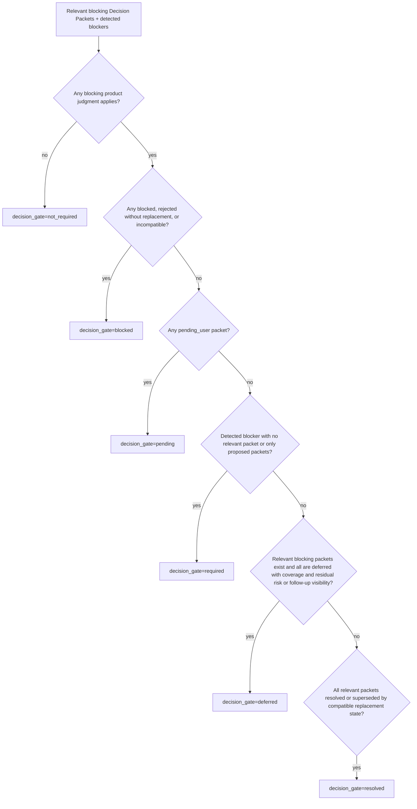

### Approval Gate

```text
not_required | required | pending | granted | denied | expired
```

`approval_gate`는 sensitive categories가 있을 때만 required입니다. Display layer는 approval drift가 없을 때 `granted`의 alias로 `passed`를 보여줄 수 있지만 canonical value는 `granted`입니다.

- `approval_gate=not_required`는 현재 approval을 요구하는 sensitive category가 없다는 뜻입니다.
- `approval_gate=required`는 sensitive approval이 필요하지만 committed approval-shaped Decision Packet과 linked pending Approval record가 아직 없다는 뜻입니다. 이는 `prepare_write`가 missing sensitive approval을 detect할 때 도달하는 state입니다.
- `approval_gate=pending`은 `harness.request_user_decision(decision_kind=approval)`이 committed approval-shaped Decision Packet과 linked pending Approval record를 create했고 user/operator decision을 기다린다는 뜻입니다.
- `approval_gate=granted`는 compatible Approval record가 sensitive scope를 cover한다는 뜻입니다. 이는 Write Authorization이 아니며 product judgment를 authorize하지도 않습니다. Write path는 `record_run`이 authorization을 consume하기 전에 여전히 fresh compatible `prepare_write` decision을 pass해야 합니다.
- `approval_gate=denied`는 linked Approval record가 denied되었고 sensitive write가 계속 blocked라는 뜻입니다.
- `approval_gate=expired`는 linked Approval record가 expired, drifted 되었거나 current baseline 또는 intended sensitive scope를 더 이상 cover하지 않는다는 뜻입니다.

### Design Gate

```text
not_required | required | pending | passed | partial | waived | stale | blocked
```

`design_gate`는 required design-quality preconditions를 반영합니다. 언제 적용되고 waiver가 언제 허용되는지는 policy가 결정합니다.

### Evidence Gate

```text
not_required | none | partial | sufficient | stale | blocked
```

`evidence_gate=not_required`는 evidence gate가 적용되지 않는다는 뜻입니다.

`evidence_gate=none`은 evidence가 required이지만 evidence가 아직 recorded되지 않았다는 뜻입니다.

Evidence가 required인 곳에서 successful completion에는 `evidence_gate=sufficient`가 필요합니다.

### Evidence Sufficiency Profiles

Evidence sufficiency는 Evidence Manifest와 related state records 및 artifact refs에서 판단합니다. Chat text나 report prose만으로 판단하면 안 됩니다. Status card나 Markdown report는 evidence가 왜 missing인지 summarize할 수 있지만 close decision은 manifest, Task, gates, Change Units, Runs, approvals, Evals, Manual QA records, baseline relation, registered artifacts를 사용합니다.

| Evidence Profile | Minimum sufficiency guidance |
|---|---|
| `advisor` | `evidence_gate` is usually `not_required` unless the user or policy asks for a recorded decision, review bundle, or exportable artifact. |
| `direct docs-only` | Sufficient evidence may be changed path list, diff artifact or recorded patch summary, and self-check summary. |
| `direct code` | Sufficient evidence may be changed path list, diff artifact, relevant command/test/log artifact or explicit reason no automated check applies, and self-check summary. |
| `work feature` | Sufficient evidence requires acceptance-criteria-to-evidence mapping, changed file coverage, run summary, diff/log/test/build artifacts as applicable, and `evidence_manifest.status=sufficient`. |
| `UI/UX/copy work` | Requires `work feature` evidence plus Manual QA record or valid QA waiver when QA is required. |
| `sensitive work` | Requires normal task evidence plus approval ref, approval scope compatibility, baseline relation, and no approval drift. |
| `verification-required work` | Requires Evidence Manifest plus Eval record with reviewed evidence and valid independence if the task is to close as `completed_verified`. |

Close impact:

- Required evidence가 absent이면 `evidence_gate=none`입니다.
- Required evidence가 incomplete이면 `evidence_gate=partial`입니다.
- Evidence가 baseline, changed files, approval drift, missing artifact, relevant design record change로 invalidated되면 `evidence_gate=stale` 또는 `blocked`입니다.
- Evidence가 required인 successful close에는 `evidence_gate=sufficient`가 필요합니다.
- Evidence가 required인데 missing인 경우 `evidence_gate=not_required`를 사용하면 안 됩니다.

Examples:

- Direct typo fix: changed path `docs/help.md`, diff artifact 또는 patch summary, self-check summary는 `direct docs-only` evidence를 support할 수 있습니다.
- Work feature: AC-01은 passing test log와 changed path coverage에 map되고, AC-02는 build log와 run summary에 map됩니다. Evidence Manifest가 둘 다 supported로 기록합니다.
- UI copy change: changed copy path, diff artifact, self-check, required Manual QA record가 close를 support합니다. Manual QA가 recorded되거나 validly waived되기 전에는 close가 blocked됩니다.

이 profile selector는 위 table의 summary일 뿐입니다. Evidence sufficiency는 여전히 Evidence Manifest와 related records, artifacts에서 판단합니다.

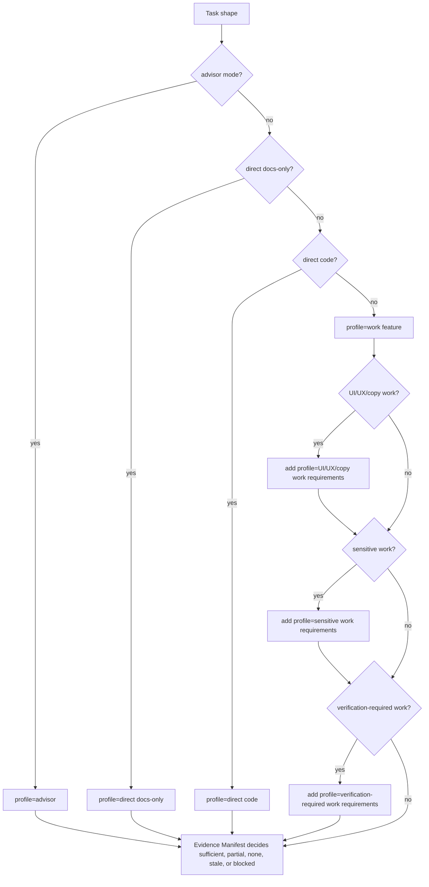

### Verification Gate

```text
not_required | required | pending | passed | failed | waived_by_user | blocked
```

`verification_gate=waived_by_user`는 사용자가 remaining verification risk를 accepted했다는 기록입니다. 이 값은 `assurance_level=detached_verified`가 되면 안 됩니다.

### Verification Independence Profiles

Verification independence profiles는 Eval이 detached assurance를 support하기 전에 필요한 minimum qualification을 설명합니다.

| Profile | Minimum qualification |
|---|---|
| `same_session` | Not detached. May record self-check or review notes. Must not produce `detached_verified`. |
| `subagent_context` | Not detached by default. May qualify only if the implementation context, Write Authorization context, and reviewed bundle satisfy a stricter profile; otherwise treat as not detached. |
| `fresh_session` | Detached candidate if the evaluator receives a task/evidence bundle rather than continuing lead chat context, reviews the Evidence Manifest and changed files, and records an Eval. |
| `fresh_worktree` | Detached candidate if the evaluator checks baseline, changed paths, artifacts, and Evidence Manifest in a separate worktree or equivalent isolated repository state. |
| `sandbox` | Detached or isolated candidate if execution and verification happen across a meaningful process/filesystem boundary and artifacts are captured. |
| `manual_bundle` | Detached candidate if the evaluator receives task summary, acceptance criteria, Change Unit scope, approval scope, diff/log/test artifacts, Evidence Manifest, known risks, and records a verdict. |

Rules:

- Eval verdict alone does not upgrade assurance.
- Valid independence plus passed verification plus absence of a same-session self-review violation is required for `assurance_level=detached_verified`.
- User verification waiver must close as `completed_with_risk_accepted`, not `completed_verified`.
- Product files에 write할 수 있는 verifier는 Eval independence context에서 그 사실을 disclose해야 합니다. Write capability는 confidence를 낮출 수 있고 additional guard 또는 bundle review를 요구할 수 있습니다.

이 다이어그램은 non-detached profiles와 detached candidates를 분리합니다. Assurance upgrade는 아래 final checks도 pass할 때만 가능합니다.

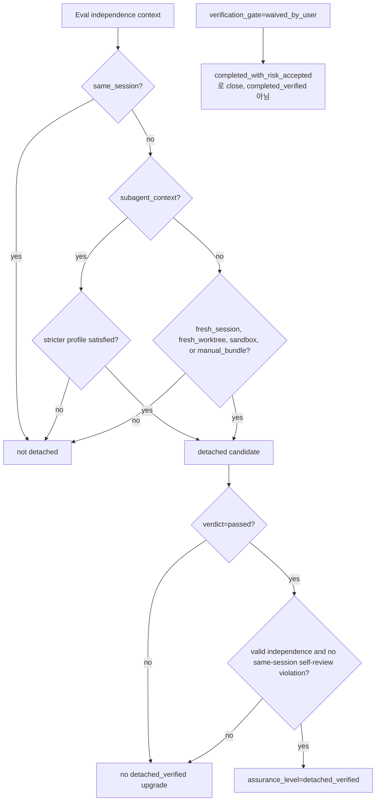

### QA Gate

```text
not_required | required | pending | passed | failed | waived
```

`qa_gate`는 required human QA를 위한 canonical kernel gate입니다. Individual Manual QA records에는 record-level results가 있고, gate는 close-relevant aggregate state입니다. `qa_gate=pending`은 required QA가 satisfying Manual QA record를 아직 만들지 못했거나 latest relevant Manual QA record가 policy를 satisfy하지 못한다는 뜻입니다. 이 상태를 Manual QA record result로 저장하면 안 됩니다.

### Acceptance Gate

```text
not_required | required | pending | accepted | rejected
```

`acceptance_gate`는 acceptance가 required인 곳에서 사용자의 final acceptance judgment를 기록합니다. QA나 verification을 대체하지 않습니다.

MVP final acceptance는 canonical Decision Packet user-decision path, Task의 `acceptance_gate`, `state.sqlite.task_events`를 통해 저장됩니다. Kernel은 MVP에서 별도의 Acceptance state record를 정의하지 않습니다.

Residual-risk visibility는 두 가지 방식으로 satisfied됩니다. Known close-relevant Residual Risk가 없으면 current judgment context가 `ResidualRiskSummary.status=none`을 report합니다. Known close-relevant Residual Risk가 있으면 successful close 전에 그 risk가 current judgment context에서 visible해야 합니다. Acceptance가 required라면 close-relevant residual risk가 visible하거나 `ResidualRiskSummary.status=none`으로 confirmed된 뒤에만 record될 수 있습니다. Risk-accepted close에는 additionally visible하고 accepted된 Residual Risk refs가 필요하며, residual-risk acceptance는 assurance를 `detached_verified`로 upgrade하지 않습니다. `ResidualRiskSummary.status=none`은 known close-relevant risk를 숨기거나 대체하면 안 됩니다.

### Capability Boundary

Capability는 의도적으로 kernel gate enum에서 제외됩니다.

Surface capability는 다음에 속합니다.

- the `surface_capability_check` validator
- `prepare_write` blocked reasons
- guarantee level display

Capability는 kernel이 write를 허용할지, rule을 얼마나 강하게 enforce할 수 있는지, 어떤 warning을 보여줄지에 영향을 줄 수 있습니다. 하지만 first-class lifecycle gate는 아닙니다.

## Compatibility Matrix

### Mode Compatibility

| Mode | Product write eligible | Change Unit required for write | Default close assurance | Detached verification |
|---|---:|---:|---|---|
| `advisor` | no | no | `none` | not required |
| `direct` | yes | yes | `self_checked` | optional |
| `work` | yes | yes | `none` until checked | required unless user accepts verification risk |

### Decision Gate Compatibility

| `decision_gate` | Proceed/write compatibility | Close compatibility |
|---|---|---|
| `not_required` | compatible when no product judgment blocker applies | compatible when no blocking Decision Packet applies |
| `required` | blocks until a Decision Packet is recorded or associated | blocks completion |
| `pending` | blocks affected operations until the user decision is recorded | blocks completion when the pending Decision Packet is blocking |
| `resolved` | compatible when the recorded decision covers the active Change Unit, Autonomy Boundary, baseline, and intended operation | compatible when all blocking Decision Packets relevant to close are resolved |
| `deferred` | compatible only if the deferral explicitly permits the intended operation now; otherwise blocks | compatible only when deferral is non-blocking for close and residual risk or follow-up visibility is recorded |
| `blocked` | blocks until state, scope, policy, or user decision changes | blocks completion |

### Completion Compatibility

모든 successful close path에는 close 전 residual-risk visibility가 필요합니다. Known close-relevant Residual Risk가 없으면 `ResidualRiskSummary.status=none`이 이 check를 satisfy합니다. Known close-relevant Residual Risk가 있으면 current judgment context에서 visible해야 합니다. Risk-accepted close에는 additionally accepted Residual Risk refs가 필요합니다.

| Close path | Required compatible state |
|---|---|
| Advisor completed | no active Run; no product write pending; no blocking unresolved Decision Packet; `result=advice_only`; `close_reason=completed_self_checked` |
| Direct self-checked | no active Run; active Change Unit completed or not needed for non-write direct; scope passed for writes; blocking Decision Packets resolved or validly deferred for close; required approval granted; required evidence sufficient; `assurance_level=self_checked`; `close_reason=completed_self_checked` |
| Direct verified | direct self-checked requirements plus valid passed detached verification; `assurance_level=detached_verified`; `close_reason=completed_verified` |
| Work verified | no active Run; Change Unit complete or explicitly deferred; scope passed; blocking Decision Packets resolved; approval not required or granted; design passed or waived; evidence sufficient; verification passed with valid independence; QA passed or waived if required; residual risk visible 또는 `ResidualRiskSummary.status=none` confirmed before acceptance; acceptance accepted if required; `close_reason=completed_verified` |
| Work risk accepted | work close requirements for scope, approval, design, evidence, QA, and acceptance are satisfied; verification may be `waived_by_user`; blocking decisions are resolved or validly deferred with residual risk visibility; visible and accepted Residual Risk refs are recorded; assurance must be `none` or `self_checked`; `close_reason=completed_with_risk_accepted` |
| Cancelled | no active write in progress; `result=cancelled`; `close_reason=cancelled` or `superseded` |

### Invalid State Combinations

다음 조합은 invalid이며 kernel이 reject하거나 repair해야 합니다.

| Invalid combination | Required handling |
|---|---|
| `lifecycle_phase=completed` with `active_run_id` present | block close until the Run is recorded, interrupted, or cancelled |
| `lifecycle_phase=completed` with `result=none` | reject state transition |
| `lifecycle_phase=completed` with `close_reason=none` | reject state transition |
| `lifecycle_phase=cancelled` with `result` other than `cancelled` | reject state transition |
| Product write attempted with no active Task | block `prepare_write` |
| Product write attempted in `advisor` mode | block `prepare_write` |
| Product write attempted with no active Change Unit | block `prepare_write` |
| Product write attempted when `scope_gate` is not `passed` | block or request scope confirmation |
| Intended operation exceeds the active Change Unit Autonomy Boundary | block `prepare_write`; request user decision when product judgment can resolve it |
| Implementation or direct Run recorded with no compatible unexpired, unconsumed Write Authorization | `record_run`을 reject하거나 `runs.write_authorization_id`를 채우지 않는 violation/audit Run을 기록합니다. Evidence, verification, QA, acceptance, close는 이 Run에 의존할 수 없습니다. |
| Run attempted with an invalid, stale, missing, consumed, or scope-exceeded Write Authorization | consumed로 기록하지 않습니다. 유용한 경우 attempted authorization ref를 validator findings, run violation payload, 또는 `task_events.payload_json`에 기록합니다. Scope, evidence, approval, verification, projections를 appropriate하게 stale 또는 blocked로 mark합니다. Authorization은 unconsumed로 남으며 stale, revoked, expired될 수 있습니다. |
| Blocking product judgment detected with `decision_gate=not_required` | repair to `required` and request a Decision Packet |
| `decision_gate=pending`, `resolved`, `deferred`, or product-judgment `blocked` without a linked Decision Packet | reject or repair by associating the canonical Decision Packet |
| Product write attempted with required blocking Decision Packet absent or unresolved | block `prepare_write`; broad approval 대신 Decision Packet request 또는 candidate를 반환 |
| Approval used as the authority path for product judgment, whether or not the sensitive scope matches | reject or repair by requiring a compatible Decision Packet |
| `decision_gate=deferred` used for an operation not covered by the deferral | block `prepare_write` or close |
| `decision_gate=resolved` where the recorded decision no longer matches the active Change Unit, Autonomy Boundary, baseline, or intended operation | repair to `required`, `pending`, or `blocked` |
| Stored `decision_gate` differs from aggregate recomputation | recompute and repair before write or close |
| Sensitive change with `approval_gate=not_required` | `approval_gate=required`로 repair하고 `prepare_write`를 block합니다. `request_user_decision(decision_kind=approval)`이 approval request를 commit하기 전에는 Approval, Decision Packet, Write Authorization, `APR`을 create하지 않습니다. |
| Sensitive change with approval denied, expired, or outside approved scope | block `prepare_write` |
| Required evidence with `evidence_gate=not_required` | repair to `none`, `partial`, `sufficient`, `stale`, or `blocked` |
| `evidence_gate=none` while evidence records support required criteria | recompute evidence gate |
| Completed passed result where required evidence is `none`, `partial`, `stale`, or `blocked` | block close |
| `verification_gate=waived_by_user` with `assurance_level=detached_verified` | reject state transition |
| Same-session review producing `assurance_level=detached_verified` | reject assurance upgrade |
| Eval verdict passed without valid independence producing `detached_verified` | reject assurance upgrade |
| `qa_gate=waived` without waiver reason | reject waiver |
| Completed passed result with required `qa_gate=pending` or `failed` | block close |
| Completed passed result with required `acceptance_gate=pending` or `rejected` | block close |
| Completed passed result with blocking Decision Packet unresolved or incompatible with close intent | block close |
| Acceptance or risk-accepted close recorded while known close-relevant residual risk is hidden, unrecorded, or absent from the current judgment context | residual risk가 visible해지거나 no known close-relevant risk가 `ResidualRiskSummary.status=none`으로 confirmed될 때까지 close를 reject합니다. Risk-accepted close에는 여전히 accepted Residual Risk refs가 필요합니다 |
| Projection stale or failed recorded as state failure by itself | repair display/projection status; do not change result solely for projection freshness |
| A Markdown projection used as canonical state | create reconcile item or reject as state mutation |
| A capability field introduced as a canonical lifecycle gate | reject schema/state mutation |

### Close Eligibility

`close_ready`는 `lifecycle_phase`가 아닙니다. Task에 open Run이 없고 close-relevant required gates가 requested close intent와 모두 compatible하다는 derived condition입니다. Task를 `lifecycle_phase=completed`로 옮기는 것은 `close_task`뿐입니다.

## Transition Table

State transitions는 current state changes와 같은 transaction 안에서 `state.sqlite.task_events`에 event를 append합니다.

각 transition은 올바른 affected-scope clock을 increment합니다. Task-scoped transitions는 Task State Version을 increment하고, Task가 없는 project-level transitions는 Project State Version을 increment합니다. Appended event는 해당 affected scope의 resulting version을 가집니다.

Event ordering은 storage가 기록한 deterministic append order입니다. Timestamps는 audit metadata일 뿐이며 Journey reconstruction, API event lists, conformance `expected_events`에서 사용하는 order를 정의하면 안 됩니다.

Write Authorization lifecycle events는 다음 kernel event vocabulary를 사용합니다.

```text
write_authorization_created
write_authorization_returned
write_authorization_consumed
write_authorization_expired
write_authorization_staled
write_authorization_revoked
write_authorization_violation_detected
```

`scope_violation_detected`는 general observed scope event이며 Write Authorization lifecycle event가 아닙니다.

### Stable Event Catalog

Stable event names는 MVP conformance fixtures가 `expected_events`에서 요구할 수 있는 `event_type` 값입니다. Events는 계속 `state.sqlite.task_events`의 rows입니다. 이 catalog는 별도 event store, stream, payload schema를 도입하지 않습니다. 이 catalog 밖의 이름은 prose, tool descriptions, fixture seed shorthand, validator/check names, future extensions에 나타날 수 있지만, 이 catalog가 promote하기 전에는 stable MVP conformance assertion이 아닙니다. Fixtures는 validator outcomes를 `expected_state.validators` 아래에, projection freshness를 `expected_projection` 또는 `expected_state.checks` 아래에 assert해야 하며, event names를 새로 만들어 assert하면 안 됩니다.

| Area | Stable event names |
|---|---|
| Write Authorization lifecycle | `write_authorization_created`, `write_authorization_returned`, `write_authorization_consumed`, `write_authorization_expired`, `write_authorization_staled`, `write_authorization_revoked`, `write_authorization_violation_detected` |
| `prepare_write` and write gates | `prepare_write_allowed`, `prepare_write_blocked`, `scope_required`, `decision_required`, `autonomy_boundary_exceeded`, `approval_required`, `baseline_stale_detected`, `capability_insufficient_detected` |
| Run, evidence, and scope observation | `run_recorded`, `evidence_manifest_updated`, `scope_violation_detected` |
| Verification | `eval_recorded`, `verification_passed`, `verify_not_detached_detected` |
| Close and risk-accepted close | `close_requested`, `close_blocked`, `risk_accepted_close_recorded`, `task_closed`, `task_cancelled`, `task_superseded` |
| Projection, connector, and reconcile operations | `projection_refresh_failed`, `generated_file_drift_detected`, `reconcile_item_created` |

이 catalog는 의도적으로 compact합니다. Non-stable implementation-local detail 또는 audit events와 future extension events는 여전히 `task_events`에 기록될 수 있지만, MVP fixture authors는 이 이름들이 여기 추가되기 전까지 `expected_events`에서 요구하면 안 됩니다.

이 grouping diagram은 catalog에 listed된 stable names만 포함합니다. Visual index일 뿐 두 번째 event taxonomy가 아닙니다.

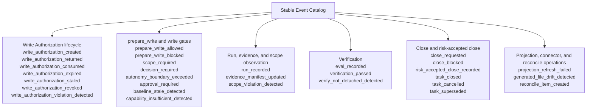

| Trigger | From | To | Gate or record effect |
|---|---|---|---|
| User request is accepted | no active Task | `lifecycle_phase=intake`, `result=none` | create Task |
| Request classified as advisor | `intake` | `mode=advisor`, `lifecycle_phase=executing` | product write disabled |
| Request classified as direct | `intake` | `mode=direct`, `lifecycle_phase=ready` | create or select scoped Change Unit if write is expected |
| Request classified as work | `intake` | `mode=work`, `lifecycle_phase=shaping` | design and scope shaping begins |
| Blocking product judgment detected | any non-terminal phase | `waiting_user` or `blocked` | `decision_gate=required`; Decision Packet must be recorded or associated |
| Decision Packet requested | any non-terminal phase | `waiting_user` | create or update Decision Packet; `decision_gate=pending` |
| User decision resolved | `waiting_user` | previous runnable phase, `shaping`, or `ready` | Decision Packet resolution recorded; `decision_gate=resolved`; affected Change Unit, Autonomy Boundary, gates, or residual-risk records updated |
| Decision deferred | `waiting_user` | previous runnable phase, `waiting_user`, or `blocked` | Decision Packet deferral recorded; `decision_gate=deferred`; residual risk or follow-up visibility recorded when relevant |
| Change Unit scope is confirmed | `shaping` or `waiting_user` | `ready` | `scope_gate=passed` |
| Scope is missing for intended write | any non-terminal phase | `waiting_user` or `blocked` | `scope_gate=pending` or `blocked` |
| `prepare_write`가 sensitive approval need를 detect | any non-terminal phase | `waiting_user` or `blocked` | `approval_gate=required`; approval-required blocker가 기록될 수 있음; candidate 때문에 Approval, Decision Packet, Write Authorization, `APR`은 create되지 않음 |
| `request_user_decision(decision_kind=approval)`이 approval request를 commit | any non-terminal phase | `waiting_user` | approval-shaped Decision Packet과 linked pending Approval record를 create함; `approval_gate=pending` |
| `record_user_decision`이 sensitive approval을 granted로 기록 | `waiting_user` | previous runnable phase | linked Approval record updated; `approval_gate=granted` |
| `record_user_decision`이 sensitive approval을 denied로 기록 | `waiting_user` | `blocked` | linked Approval record updated; `approval_gate=denied` |
| Approval scope drifts or expires | any non-terminal phase | `waiting_user` or `blocked` | `approval_gate=expired` |
| Autonomy boundary violation | any non-terminal phase | `waiting_user` or `blocked` | violation recorded; Decision Packet requested when product judgment can resolve it; otherwise scope or policy blocker recorded |
| `prepare_write` allows write | `ready` or `executing` | `executing` | Write Authorization을 create하거나 idempotent replay에 대해 already committed response를 반환함; active Run may proceed |
| `prepare_write` blocks write | any non-terminal phase | `waiting_user` or `blocked` | blocked reason recorded; `decision_gate`, `scope_gate`, or `approval_gate` updated according to blocker type |
| Direct implementation and self-check recorded | `executing` | same phase with close eligibility or `waiting_user` | Run consumes compatible Write Authorization; artifacts and evidence recorded |
| Work implementation recorded | `executing` | `verifying` | Run consumes compatible Write Authorization; evidence manifest updated |
| Evidence required but absent | `executing` or `verifying` | `blocked` | `evidence_gate=none` or `partial` |
| Evidence becomes stale | any non-terminal phase | `blocked` or current phase with stale gate | `evidence_gate=stale` |
| Verification launched | `verifying` | `verifying` | evaluator Run or bundle recorded |
| Eval passed with valid independence | `verifying` | `qa`, `waiting_user`, or same phase with close eligibility | `verification_gate=passed`; assurance may become `detached_verified` |
| Eval passed without valid independence | `verifying` | `verifying` or `blocked` | no detached assurance upgrade |
| Eval failed | `verifying` | `executing`, `shaping`, or `blocked` | `verification_gate=failed` |
| User accepts verification risk | `waiting_user` or `verifying` | same phase with close eligibility | `verification_gate=waived_by_user`; no detached assurance |
| Residual risk accepted | `waiting_user`, `verifying`, or `qa` | same phase with close eligibility or `waiting_user` | residual-risk acceptance recorded; related Decision Packet may resolve or defer; no detached assurance upgrade |
| Manual QA requested | any non-terminal phase | `qa` or `waiting_user` | `qa_gate=pending` |
| Manual QA passed | `qa` or `waiting_user` | same phase with close eligibility or `waiting_user` | `qa_gate=passed` |
| Manual QA failed | `qa` or `waiting_user` | `executing`, `shaping`, or `blocked` | `qa_gate=failed` |
| QA waiver accepted | `waiting_user` | same phase with close eligibility | `qa_gate=waived`; waiver reason required |
| Acceptance requested | any non-terminal phase with close eligibility | `waiting_user` | `acceptance_gate=pending` |
| Acceptance accepted | `waiting_user` | same phase with close eligibility | `acceptance_gate=accepted` |
| Acceptance rejected | `waiting_user` | `shaping`, `executing`, or `cancelled` | `acceptance_gate=rejected` |
| `close_task` succeeds | any non-terminal phase with close eligibility | `completed` | result and close reason assigned |
| User cancels Task | any non-terminal phase | `cancelled` | `result=cancelled`; `close_reason=cancelled` |
| Task is superseded | any non-terminal phase | `cancelled` | `result=cancelled`; `close_reason=superseded` |
| Projection refresh fails | any phase | same lifecycle phase | projection status marked stale or failed; state result unchanged |

## Waiver Semantics

Waivers는 reason, actor, time, affected gate와 함께 recorded되어야 하는 explicit user 또는 policy decisions입니다.

Allowed waivers:

- `design_gate=waived` when policy allows design-quality waiver.
- `verification_gate=waived_by_user` when the user accepts remaining verification risk.
- `qa_gate=waived` when required QA is waived with reason.

Not allowed:

- Scope waiver for product writes.
- Approval waiver for sensitive changes.
- Evidence waiver where evidence is required for completion.
- Acceptance waiver where acceptance is required.

Verification waiver는 detached verification이 아닙니다. Verification waiver로 close한 Task는 `close_reason=completed_with_risk_accepted`와 `assurance_level=none` 또는 `self_checked`를 사용합니다.

Decision deferral은 waiver가 아닙니다. Deferred Decision Packet은 affected operation, 지금 decision 없이 Task가 proceed할 수 있는 이유, close 전에 필요한 residual risk 또는 follow-up을 기록해야 합니다.

## `prepare_write` State Logic

`prepare_write`는 product-write decision point입니다. 다음 state-level decisions 중 하나를 반환합니다.

```text
allowed | blocked | approval_required | decision_required | state_conflict
```

이 state-level decisions는 public `ErrorCode` selection을 정의하지 않습니다. 이 logic에서 파생된 public tool responses는 API가 소유한 [Primary Error Code Precedence](05-mcp-api-and-schemas.md#primary-error-code-precedence)에 따라 primary `ToolError.code`를 선택합니다.

Decision algorithm은 다음과 같습니다.

1. State version expectations를 확인합니다. Caller가 stale state를 기준으로 행동 중이면 `state_conflict`를 반환합니다.
2. Active Task를 resolve합니다. 없으면 `blocked`를 반환합니다.
3. Task mode가 write-eligible인지 확인합니다. `advisor` mode는 product writes를 block합니다.
4. Active Change Unit을 resolve합니다. Intended write를 scope하는 active Change Unit이 없으면 `blocked`를 반환합니다.
5. Intended operation을 active Change Unit Autonomy Boundary와 비교합니다. Operation이 recorded latitude를 넘으면 write를 block합니다. Product judgment로 gap을 해결할 수 있을 때 `decision_gate=required`를 set하거나 Decision Packet을 create/request하고 `decision_required`를 반환합니다. Resolved Decision Packet은 Autonomy Boundary를 update하거나 Change Unit scope changes를 propose할 수 있지만, active Change Unit scope와 any sensitive approval이 compatible해질 때까지 write는 계속 blocked입니다.
6. Intended paths, tools, commands, network targets, secret access를 Change Unit과 비교합니다. Scope gaps는 `blocked`를 반환하거나 scope confirmation을 요구합니다.
7. Baseline freshness를 확인합니다. Baseline이 stale이면 `blocked`를 반환하고 dependent approvals, Decision Packets, evidence를 applicable한 곳에서 stale 또는 incompatible로 mark합니다.
8. Sensitive categories를 결정합니다. Sensitive categories가 있고 matching Approval이 granted되지 않았다면 `approval_gate=required`를 set 또는 유지하고, applicable한 committed non-dry-run decision에서는 approval-required blocker state를 record하며, `approval_required`를 반환하고 display 또는 나중의 `request_user_decision(decision_kind=approval)` 호출을 위한 `approval_request_candidate`를 optional하게 반환합니다. 이 path는 Approval record, Decision Packet, Write Authorization, `APR`을 create하면 안 됩니다.
9. Approval scope를 validate합니다. Denied, expired, drifted, insufficient approval은 새 approval로 해결 가능한지에 따라 `blocked` 또는 `approval_required`를 반환합니다. 새 approval로 해결 가능하면 `request_user_decision(decision_kind=approval)`이 approval request를 commit할 때까지 gate는 `approval_gate=required`로 돌아갑니다.
10. Write 전에 적용되는 design-policy precondition checks를 실행합니다. Required unmet design preconditions는 policy에 따라 `blocked` 또는 `decision_required`를 반환합니다.
11. Intended operation에 대한 Decision Packet requirements를 평가합니다. Required blocking Decision Packet이 absent, pending, blocked이거나 intended operation을 cover하지 않는 deferred 상태이면 write를 block하고, user judgment로 해결할 수 있을 때 `decision_required`를 반환합니다. Resolved Decision Packet은 active Change Unit, Autonomy Boundary, baseline, intended operation과 match해야 합니다.
12. Surface capability checks를 실행합니다. Capability failures는 validator results, blocked reasons, guarantee display changes로 기록되며 capability를 first-class kernel gate로 만들지 않습니다.
13. 모든 required checks가 pass하면 intended operation에 대한 compatible unexpired Write Authorization을 create하거나 같은 request의 idempotent replay에 대해 already committed response를 반환하고, decision을 record한 뒤 `allowed`를 반환합니다.

이 flowchart는 write decision path를 요약합니다. Ordering과 side effects의 source of truth는 numbered algorithm입니다.

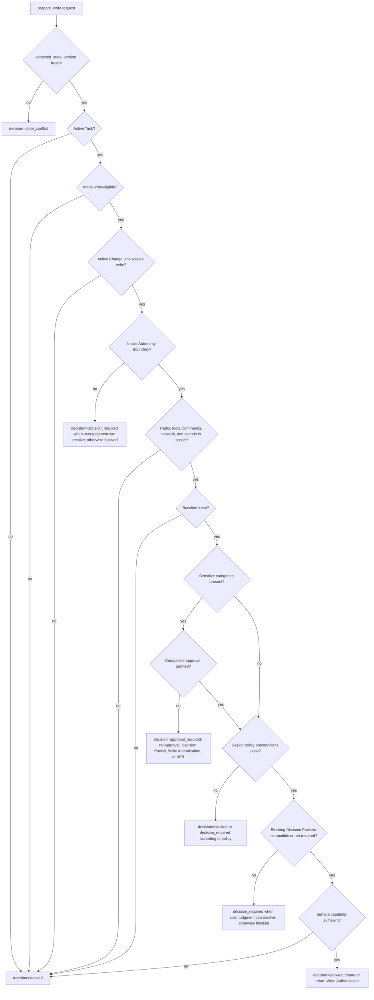

Required checks에는 active Task, active Change Unit, mode write eligibility, Autonomy Boundary compatibility, baseline freshness, intended paths, intended tools, intended commands, network targets, secret access, sensitive categories, approval scope, Decision Packet state, surface capability profile, design policy preconditions가 포함됩니다.

`allowed` decision은 `status=allowed`이고 allow decision이 사용한 affected scope의 `basis_state_version`이 기록된 Write Authorization을 create하거나 reference해야 합니다. `authorization_effect=returned`는 같은 idempotency key, request hash, `basis_state_version`을 가진 동일한 committed `prepare_write` request의 idempotent replay 또는 already committed response 반환에만 reserved됩니다. Distinct compatible request는 distinct Write Authorization을 create합니다. Compatibility가 authorization을 reusable하게 만들지는 않습니다. Blocked, approval-required, decision-required, state-conflict result는 attempted write에 대해 consumable Write Authorization을 만들면 안 됩니다. Compatibility basis가 바뀌면 Core는 오래된 unconsumed authorization을 stale, expire, revoke할 수 있습니다.

Product judgment가 필요하면 `prepare_write`는 Decision Packet을 통해 user decision을 요청합니다. Product judgment를 broad approval로 바꾸면 안 됩니다. `approval_required`는 sensitive-change approval에만 사용합니다.

`approval_required`가 반환되면 consumable Write Authorization은 존재하지 않으며, candidate 때문에 Approval record, Decision Packet, `APR` projection이 create되지 않습니다. `request_user_decision(decision_kind=approval)`은 approval-shaped Decision Packet과 linked pending Approval record를 create하고, `approval_gate`를 `required`에서 `pending`으로 옮깁니다. `record_user_decision`은 그 linked Approval record를 update하고 `approval_gate`를 `granted`, `denied`, `expired` 중 하나로 옮깁니다. Core는 이후 compatible `prepare_write` retry가 `allowed`를 반환할 때만 Write Authorization을 create합니다.

MCP를 사용할 수 없는 cooperative-only surface에서는 product writes를 instruction으로 보류해야 합니다. 더 강한 guard 또는 isolation layer가 있으면 같은 decision을 preventively 또는 isolation으로 enforce할 수 있습니다.

## `record_run` State Logic

`record_run`은 shaping updates, implementation, direct work, verification input에 대한 Run, artifact, evidence recording point입니다. Product writes를 retroactively authorize하지 않습니다.

Product writes를 report하는 implementation 및 direct `record_run` calls는 compatible, unexpired, unconsumed Write Authorization을 consume해야 합니다. Consumed authorization은 active Task, active Change Unit, baseline, intended operation, sensitive categories, approval refs, relevant Decision Packet refs, write에 필요한 guarantee level과 match해야 합니다.

`runs.write_authorization_id`는 Run이 compatible Write Authorization을 성공적으로 consume할 때만 populated됩니다. Invalid, stale, missing, consumed, scope-exceeded authorization을 사용하려 한 violation 또는 audit Run은 `runs.write_authorization_id`를 consumed authorization으로 populate하면 안 됩니다. Audit에 유용한 attempted authorization ref는 validator findings, run violation payload, 또는 `task_events.payload_json`에 기록해야 합니다.

Core는 observed changed paths를 consumed Write Authorization 및 active Change Unit 양쪽과 비교해 verify해야 합니다. 또한 command results, artifacts, surface telemetry, declared run data에서 observations가 available한 경우 recorded tools, commands, network targets, secret access도 authorization과 비교해 verify합니다.

Product writes가 report되지 않았더라도 Run kind, active Change Unit, intended operation 때문에 Write Authorization이 required인 경우 authorization이 missing이면 Core는 `record_run`을 reject합니다. Observed product writes가 이미 발생했지만 authorization이 missing이거나 exceeded된 경우 Core는 recovery 및 audit을 위해 blocked 또는 violation Run을 record할 수 있습니다. 그 Run은 evidence sufficiency, detached verification, QA, acceptance, close readiness를 satisfy하면 안 되며, Core는 affected scope, evidence, approval, verification, projection state를 stale 또는 blocked로 mark합니다. Corresponding Write Authorization이 있으면 unconsumed로 남고, violation과 compatibility basis에 따라 stale, revoked, expired로 mark될 수 있습니다. Observed behavior가 general scope violation을 assert하면 Core는 `scope_violation_detected`도 append할 수 있습니다.

Blocked 또는 violation Run에 기대어 Task를 close할 수 없습니다. Compatible scope, approval, Decision Packet resolution, evidence update, verification, 또는 새 write authorization과 Run으로 state가 repair되어야 합니다.

MVP `shaping_update`는 product-write recording path가 아닙니다. Shaping-only Runs는 Write Authorization을 consume하지 않고 record될 수 있지만 product file changes를 포함하면 안 됩니다. `shaping_update`가 observed product writes도 report하면 Core는 이를 reject하고 compatible Write Authorization이 있는 `kind=implementation` 또는 `kind=direct`를 요구합니다.

Read-only Runs는 Write Authorization을 consume하지 않고 record될 수 있지만 product file changes를 포함하면 안 됩니다. 그런 Run에서 product changes가 observed되면 Core는 implementation/direct compatibility failure로 취급합니다.

이 flowchart는 `record_run`이 Write Authorization compatibility를 어떻게 다루는지 보여 줍니다. `record_run`은 retroactive write authority를 만들지 않습니다.

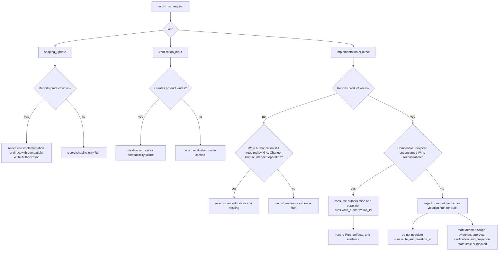

## `close_task` State Logic

`close_task`는 단일 completion decision point입니다. Agent reports, Eval reports, QA notes, acceptance messages는 inputs를 제공할 수 있지만 그 자체로 Task를 close하지 않습니다.

여러 close blockers가 동시에 존재하면 public responses는 API가 소유한 [Primary Error Code Precedence](05-mcp-api-and-schemas.md#primary-error-code-precedence)에 따라 primary `ToolError.code`를 선택합니다. 이 section은 kernel checks와 state transitions를 소유합니다.

Decision algorithm은 다음과 같습니다.

1. Active Task와 requested close intent를 resolve합니다.
2. Intent가 cancellation 또는 supersession이면 write가 unsafe in-progress state가 아닌지 확인한 뒤 `lifecycle_phase=cancelled`, `result=cancelled`, matching close reason을 set합니다.
3. Active Run이 아직 open이면 completion을 reject합니다.
4. Active Change Unit을 확인합니다. Write-capable Tasks에는 active Change Unit이 completed, explicitly deferred, 또는 policy에 따라 superseded되어야 합니다.
5. `scope_gate`를 확인합니다. Product writes에는 passed scope가 필요합니다.
6. `decision_gate`와 blocking Decision Packets를 확인합니다. Required, pending, blocked, absent, incompatible blocking decisions는 close를 block합니다. Deferred decisions는 close impact, residual risk, follow-up visibility가 recorded된 경우에만 compatible합니다.
7. `approval_gate`를 확인합니다. Sensitive changes에는 drift나 expiry가 없는 granted approval이 필요합니다.
8. `design_gate`를 확인합니다. Required design gates는 passed이거나 validly waived되어야 합니다. Stale, blocked, pending, partial required design gates는 policy가 recorded waiver로 convert하지 않는 한 close를 block합니다.
9. `evidence_gate`를 확인합니다. Evidence가 required인 곳에서는 `sufficient`만 successful close를 허용합니다.
10. `verification_gate`를 확인합니다. Work에는 passed detached verification 또는 explicit user verification waiver가 필요합니다. Direct work는 기본적으로 not required이지만 optional passed detached verification은 assurance를 upgrade할 수 있습니다. Same-session review는 detached assurance를 만들 수 없습니다. Verification waiver는 detached verification과 별개이며 `assurance_level=detached_verified`에 기여할 수 없습니다.
11. `qa_gate`를 확인합니다. Required QA는 passed이거나 validly waived되어야 합니다. Manual QA record result만으로는 kernel이 `qa_gate`에 aggregate하지 않는 한 gate를 close하지 않습니다.
12. Close-relevant residual risk를 확인합니다. Known close-relevant Residual Risk가 없으면 `ResidualRiskSummary.status=none`이 residual-risk visibility를 satisfy합니다. Known close-relevant Residual Risk가 있으면 successful close 전에 current judgment context에서 visible해야 합니다. Risk-accepted close에는 additionally visible하고 accepted된 Residual Risk refs가 필요합니다. Verification risk acceptance는 추가로 `verification_gate=waived_by_user`를 set합니다.
13. `acceptance_gate`를 확인합니다. Required acceptance는 close-relevant residual risk가 current judgment context에서 visible하거나 `ResidualRiskSummary.status=none`으로 confirmed된 뒤에만 record될 수 있습니다. Rejection은 Task를 shaping, execution, cancellation로 돌립니다.
14. `assurance_level`, `result`, `close_reason`을 assign합니다.
    - advisor completion: `result=advice_only`, `assurance_level=none`, `close_reason=completed_self_checked`
    - direct self-check: `result=passed`, `assurance_level=self_checked`, `close_reason=completed_self_checked`
    - detached verified completion: `result=passed`, `assurance_level=detached_verified`, `close_reason=completed_verified`
    - risk accepted close: `result=passed`, `assurance_level=none` or `self_checked`, `close_reason=completed_with_risk_accepted`, accepted Residual Risk refs 포함
15. Projection freshness를 report합니다. Projection stale 또는 failed status는 user와 export에 표시되지만, 그 자체로 Task를 failed로 만들지는 않습니다.
16. Current records를 update하고, close event를 append하고, projection refresh를 enqueue합니다.

이 flowchart는 close blockers와 terminal assignment를 요약합니다. Public API responses는 여전히 API precedence table을 사용해 primary `ToolError.code`를 선택합니다.

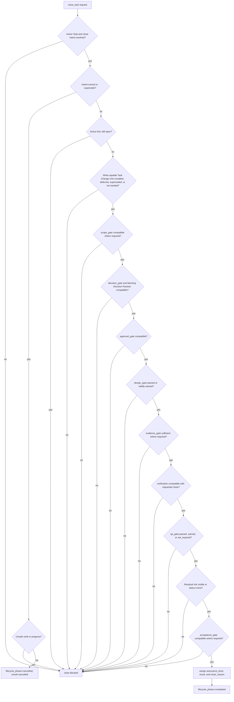

## Close Semantics

`completed_verified`는 detached verification이 실제로 pass했고 independence qualifier가 valid하다는 뜻입니다.

`completed_self_checked`는 implementing path가 result를 check했거나 detached verification이 필요 없었다는 뜻입니다.

`completed_with_risk_accepted`는 verification risk가 waived된 경우를 포함해 사용자가 close-relevant residual risk를 accepted했다는 뜻입니다. 이는 explicit risk가 있는 successful close이지 detached verification이 아닙니다.

Residual-risk acceptance는 known remaining risk가 requested close를 위해 visible해졌고 accepted되었다는 뜻입니다. Assurance를 `detached_verified`로 upgrade하지 않으며, 별도 gates가 함께 satisfied되지 않는 한 detached verification, Manual QA, sensitive approval, final acceptance를 뜻하지 않습니다.

`ResidualRiskSummary.status=none`은 accept할 known close-relevant residual risk가 없다는 뜻입니다. Ordinary close와 acceptance의 visibility는 satisfy하지만 accepted risk가 아니며 `completed_with_risk_accepted`를 support할 수 없습니다.

`cancelled`는 Task가 passed result 없이 중단되었다는 뜻입니다.

`superseded`는 다른 Task 또는 Change Unit이 이 작업을 대체한다는 뜻입니다. Supersession은 success를 뜻하지 않습니다.

## Invariant Enforcement Mapping

| Kernel Authority Invariant | Kernel enforcement points |
|---|---|
| Chat is not state. | State-changing actions create state records and `task_events`; projections and chat text cannot mutate state without MCP action or reconcile. |
| Product write requires an active scoped Change Unit. | `prepare_write` blocks write-capable actions without active Task, active Change Unit, and passed scope gate; allowed writes create Write Authorization or return the committed idempotent replay response, and implementation/direct Runs must consume a compatible authorization. |
| Sensitive change requires explicit approval. | `prepare_write` detects sensitive categories, checks approval gate and approval scope, and blocks denied, expired, missing, or drifted approval; approval cannot satisfy product judgment outside its sensitive scope. |
| Blocking product judgment requires a recorded Decision Packet. | `decision_gate`, `prepare_write`, `record_run`, and `close_task` require a canonical Decision Packet for blocking product judgment; unresolved or incompatible blocking packets prevent affected writes and close. |
| Completion requires evidence coverage where evidence is required. | `close_task` requires `evidence_gate=sufficient` when evidence applies; required evidence cannot be waived for passed completion. |
| Work cannot self-certify detached verification. | Eval plus valid independence is required for `detached_verified`; same-session review and verification waiver cannot upgrade assurance. |
| Required QA and acceptance are separate gates. | `qa_gate` and `acceptance_gate` are checked independently; Manual QA records do not imply acceptance, and acceptance does not imply QA. |
| Projection cannot override canonical state. | Projection edits create reconcile items; projection freshness affects display and delivery, not canonical result by itself. |

이 graph는 각 Kernel Authority Invariant를 table에 있는 main enforcement points에 mapping합니다. Table의 visual index일 뿐 additional invariant set이 아닙니다.

```mermaid
flowchart TD
  ChatState["Chat is not state"] --> StateActions["state-changing actions create records and task_events"]
  ChatState --> Reconcile["projection edits route through reconcile items"]

  WriteScope["Product write requires an active scoped Change Unit"] --> PrepareWrite["prepare_write"]
  WriteScope --> RecordRun["record_run consumes compatible Write Authorization"]

  SensitiveApproval["Sensitive change requires explicit approval"] --> ApprovalGate["approval_gate and approval scope checks"]
  SensitiveApproval --> PrepareApproval["prepare_write approval checks"]

  ProductJudgment["Blocking product judgment requires a recorded Decision Packet"] --> DecisionGate["decision_gate aggregate"]
  ProductJudgment --> DecisionPacket["Decision Packet compatibility"]

  EvidenceCoverage["Completion requires evidence coverage where evidence is required"] --> EvidenceGate["evidence_gate=sufficient"]
  EvidenceCoverage --> CloseTask["close_task"]

  DetachedVerification["Work cannot self-certify detached verification"] --> EvalIndependence["Eval plus valid independence"]
  DetachedVerification --> SameSessionGuard["same-session guard"]

  QAAndAcceptance["Required QA and acceptance are separate gates"] --> QAGate["qa_gate"]
  QAAndAcceptance --> AcceptanceGate["acceptance_gate"]

  ProjectionState["Projection cannot override canonical state"] --> ProjectionFreshness["projection freshness affects display"]
  ProjectionState --> Reconcile
```
