# 런타임 아키텍처

## 문서 역할

이 문서는 Harness의 local runtime architecture를 담당합니다. 세 공간, runtime layers, Core process model, state transaction flow, artifact store architecture, projection/reconcile flow, guarantee levels, failure/recovery overview를 설명합니다.

Public MCP request/response schemas, SQLite DDL, full CLI command semantics, conformance fixtures, surface-specific connector cookbooks는 이 문서가 정의하지 않습니다.

## 아키텍처 범위

Harness는 AI 지원 product work를 위한 local operating kernel입니다. Architecture는 세 관심사를 분리합니다.

```text
Product Repository:
  제품 코드, 테스트, 사람이 읽는 projections, 사람이 편집할 수 있는 proposal areas

Harness Server / Installation:
  MCP server, Core, validators, connectors, projector, reconcile worker, operator tools

Harness Runtime Home:
  registry.sqlite, project.yaml, state.sqlite, artifact store
```

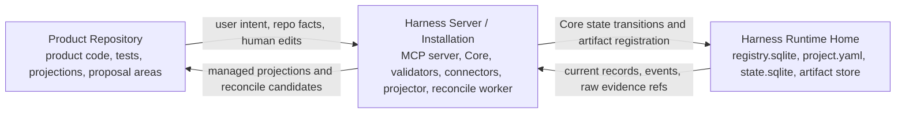

이 분리는 chat, Markdown reports, generated connector files, product source files가 우연히 operational state가 되는 일을 막습니다. Canonical operational state는 `state.sqlite` current records와 `state.sqlite.task_events`에 있습니다. Raw evidence는 artifact store에서 canonical합니다. Product Repository의 Markdown files는 projections 또는 proposal surfaces입니다.

## Product Repository

Product Repository는 사용자의 실제 product workspace입니다. Product source code, tests, repository-level agent rules, human-readable harness projections가 여기에 있습니다.

대표적인 repository-owned paths는 다음과 같습니다.

```text
repo/
  AGENTS.md
  docs/
    tasks/
    approvals/
    reports/
    design/
  .harness/
    agent/generated/
    reconcile/pending/
```

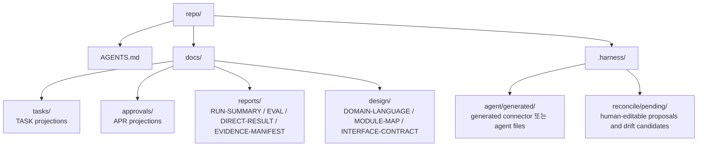

Repository는 generated TASK, APR, RUN-SUMMARY, EVAL, DIRECT-RESULT, EVIDENCE-MANIFEST, TDD-TRACE, MANUAL-QA, DOMAIN-LANGUAGE, MODULE-MAP, INTERFACE-CONTRACT Markdown reports를 담을 수 있습니다. 이 files는 사람과 agents가 work를 읽는 데 도움을 주지만 canonical state가 아닙니다. Human-editable section은 input surface입니다. Accepted changes는 reconcile 또는 Core state-changing action을 통해서만 state records가 됩니다.

## Harness Server / Installation

Harness Server / Installation은 control plane입니다. MVP는 여러 services의 fleet 대신 internal modules가 있는 하나의 local process로 구현할 수 있습니다.

Core runtime responsibilities:

- MCP server를 통해 read resources와 public tools를 expose합니다.
- Core에서 kernel state transitions를 실행합니다.
- write 전, runs 후, close 전에 validators를 실행합니다.
- artifacts와 integrity metadata를 기록합니다.
- projection jobs를 enqueue하고 render합니다.
- human edits 또는 managed-block drift에서 reconcile candidates를 detect합니다.
- diagnostic, recovery, export, conformance entrypoints를 제공합니다.

MCP server는 shell commands를 감싼 얇은 wrapper가 아닙니다. MCP server는 high-level intent calls를 expose하고, Core는 이를 state transitions, validators, artifact records, projection jobs로 변환합니다.

## Harness Runtime Home

Harness Runtime Home은 local operational authority를 저장합니다. Reference location은 `~/.harness`이지만 정확한 MVP layout은 reference MVP document가 담당합니다.

Runtime Home에는 다음이 있습니다.

- project registration, connected surfaces, connector manifests를 위한 `registry.sqlite`
- static project configuration을 위한 registered project별 `project.yaml`
- current operational records와 `state.sqlite.task_events`를 위한 project별 `state.sqlite`
- durable evidence files를 위한 artifact directories

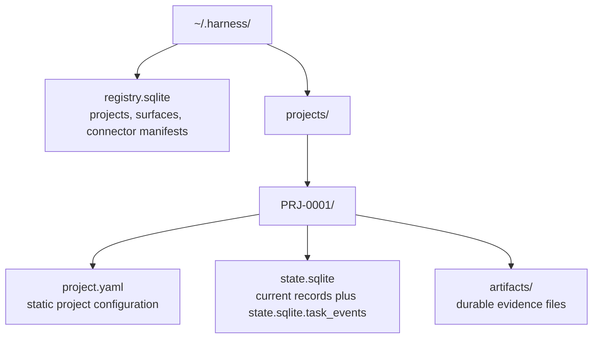

Runtime Home은 chat history가 사라지거나 Product Repository projections가 stale이어도 operational state를 recover할 수 있을 만큼 충분해야 합니다. Product Repository documents는 state records와 artifact refs에서 regenerate될 수 있으며, 그 records를 대체하지 않습니다.

## Runtime Layers

```text
사용자 대화 surface
  ↓
Agent surface
  ↓
Harness 규칙 / skill / local instructions
  ↓
Harness MCP server
  ↓
Harness Core
  ↓
state.sqlite / artifact store / validators / projector / reconcile worker
```

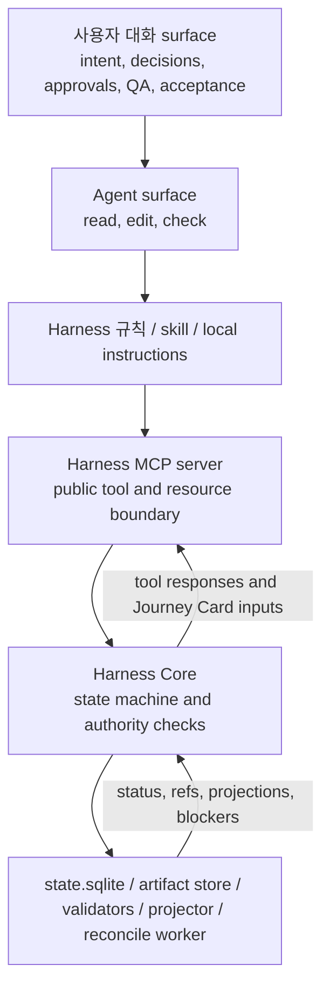

Conversation surface는 user intent, decisions, approvals, QA judgments, acceptance를 모읍니다. Agent surface는 reading, editing, checking을 수행합니다. Harness rules와 skills는 agent가 현재 상태를 놓치지 않게 합니다. MCP server는 tool boundary를 제공합니다. Core는 state machine을 담당합니다. Validators, artifact capture, projection, reconcile은 evidence와 readable output을 state transitions에 붙입니다.

Native hooks, sidecars, command wrappers, file watchers, worktree isolation은 capability-dependent enforcement layers입니다. Concrete capability profile이 더 강한 enforcement를 증명하지 않는 한 MVP는 reference surface에서 cooperative/detective behavior에 의존합니다.

## Core Process Model

MVP Core는 다음 internal modules를 가진 single process로 실행할 수 있습니다.

| Module | Runtime responsibility |
|---|---|
| State store | current records, state versions, locks, and `state.sqlite.task_events` |
| Task workflow | intake, mode selection, next action, gate updates, close decisions |
| Journey module | Journey Spine reconstruction, Journey Spine Entry support records, Journey Card inputs, and continuity refs |
| Decision module | Decision Packet lifecycle, `decision_gate` aggregation, user judgment routing, and residual-risk visibility inputs |
| Approval module | scope-bound approval request, decision, expiry, and drift handling |
| Evidence module | run records, artifact refs, evidence manifests, and coverage checks |
| Verification module | verification bundles, evaluator runs, Eval records, and independence checks |
| Manual QA module | QA records and `qa_gate` aggregation |
| Projection module | projection jobs, managed blocks, freshness, and report paths |
| Reconcile module | human-editable proposals, managed drift, and accepted-state routing |
| Validator runner | core, decision, autonomy/boundary, design-quality, artifact, projection, and connector checks |
| Autonomy/Boundary validator responsibility | Autonomy Boundary compatibility, agent latitude, user-judgment requirements, AFK stop conditions, and boundary drift findings |
| Connector adapter | reference surface registration, capability reporting, and capture hints |

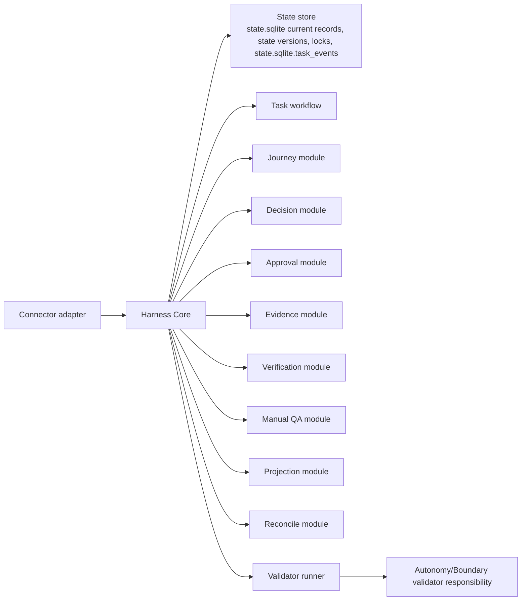

Core만 canonical operational state를 update합니다. Agents, CLI commands, projectors, reconnect/recovery flows는 Core logic을 거치거나 같은 state compatibility rules를 보존하는 recovery code를 사용해야 합니다.

Decision, Journey, Autonomy/Boundary modules는 새로운 authority tier를 만들지 않습니다. Canonical records는 `state.sqlite` current records와 `state.sqlite.task_events`에 있고, raw evidence는 artifact store에 있으며, Markdown views는 projections 또는 proposal surfaces로 남습니다.

## State Transaction Flow

모든 state-changing operation은 current records와 event history에 대해 하나의 SQLite transaction을 사용합니다.

```text
1. request envelope와 expected state version을 validate
2. transition에 필요한 project/task lock을 acquire
3. current state records를 read
4. pre-transition validators를 run
5. current records를 update
6. state.sqlite.task_events에 하나 이상의 row를 append
7. 필요한 경우 state/projection versions를 increment
8. projection jobs를 enqueue
9. commit
10. commit 이후 Markdown projections를 render
```

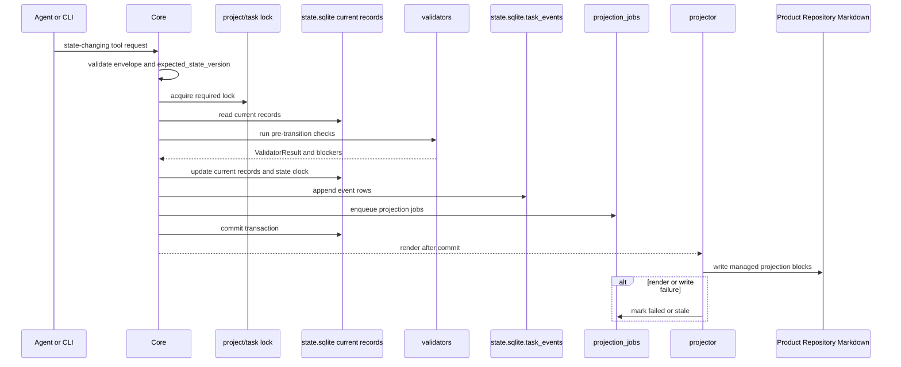

이 transaction 안에서 Core는 affected scope clock을 increment합니다. Task-scoped changes는 `tasks.state_version`을 increment하고, `task_id=null`인 project-scoped changes는 `project_state.state_version`을 increment합니다. Event rows는 각 affected scope의 resulting state version을 기록합니다.

Projection rendering은 transaction 이후에 일어납니다. Projection failure는 projection freshness를 stale 또는 failed로 mark하고 committed state는 그대로 둡니다. Projection은 passed task를 failed task로 바꿀 수 없고, 나중의 reconcile decision 없이 canonical state를 repair할 수도 없습니다.

## Artifact Store Architecture

Artifact store는 durable evidence files를 보관합니다. Raw artifacts에는 diffs, logs, screenshots, checkpoints, bundles, captured manifests, exported bundle components, 기타 integrity metadata와 함께 저장되는 evidence files가 포함됩니다.

Artifact는 두 부분으로 이루어집니다.

- artifact store 안의 raw file
- kind, path, hash, size, redaction state, task/run relation, retention class를 naming하는 `state.sqlite`의 artifact state record

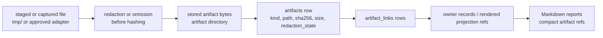

Core는 runs, evidence manifests, Eval records, Manual QA records, Decision Packets, rendered projection refs 같은 existing owner records에 artifact refs를 기록합니다. Export snapshots와 components는 그 owners 또는 projections로 다시 link되는 artifact files로 남습니다. Large logs와 patches는 raw artifacts로 두고, Markdown reports는 unbounded evidence를 embed하는 대신 artifact refs로 link해야 합니다.

Raw secrets는 artifacts로 저장하면 안 됩니다. Secret-related evidence가 required라면 Core는 redacted artifact, secret handle, relevant validator를 통과한 operator note를 기록합니다.

## Raw Artifacts, State Records, And Markdown Reports

경계는 다음과 같습니다.

| Item | Authority | Examples |
|---|---|---|
| Raw artifact | Durable evidence file in artifact store | diff, log, screenshot, checkpoint, bundle, manifest file |
| State record | Canonical structured record in `state.sqlite` | Task, Change Unit, Decision Packet, Journey Spine Entry, Residual Risk, Run, Approval, Eval, Manual QA record, Evidence Manifest, Shared Design, Artifact record |
| Markdown report | Human-readable projection from records and artifact refs | TASK, Journey Card/Spine views, Decision Packet views, APR, RUN-SUMMARY, EVAL, DIRECT-RESULT, EVIDENCE-MANIFEST |

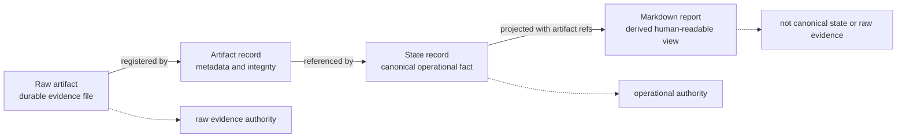

이 named report kinds는 기본적으로 state records와 artifact refs에서 생성되는 projections입니다. Artifact store의 evidence files를 refer할 수 있고 export가 snapshots를 포함할 수 있지만, 그렇다고 Markdown report가 canonical evidence file이 되지는 않습니다.

## Projection And Reconcile Flow

Projection은 outbox-style flow입니다.

```text
state transition commit 완료
→ projection job queue됨
→ state records와 artifact refs에서 managed block render
→ projected version과 managed hash 기록
→ human-editable area 보존
```

Projector는 managed areas만 write하고 human-editable areas는 preserve합니다. Managed area가 직접 edit되었다면 projector는 그 edit를 state로 조용히 받아들이지 않고 reconcile candidate를 기록합니다. Human-editable area에 proposal이 있으면 reconcile이 candidate record를 만들고 explicit decision을 요청합니다.

Reconcile authority path:

```text
human-editable input
→ state.sqlite.reconcile_items
→ accepted state event/record 또는 rejected/deferred note
```

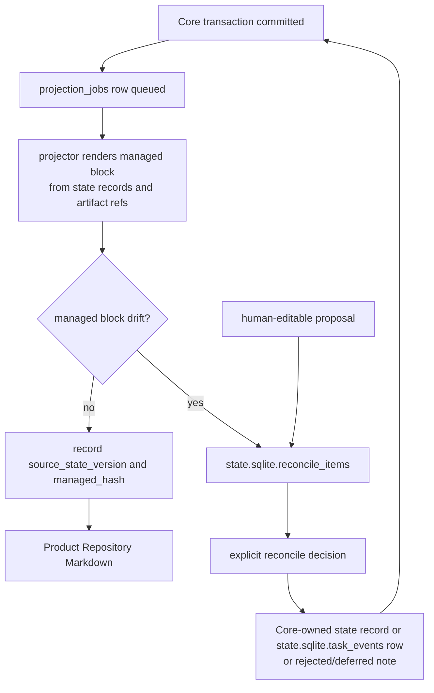

Reconcile은 merge, reject, note로 convert, decision 생성, design support record 생성 또는 update, defer를 할 수 있습니다. Accepted operational changes는 Core를 통해 기록되고 `state.sqlite.task_events`에 append됩니다.

## Validators And Adapter Placement

Validators는 Core 옆에 위치하고 structured results를 Core에 반환합니다. Core는 그 result가 transition을 block할지, gate를 stale/partial/blocked로 mark할지, user decision을 request할지, display에만 영향을 줄지 결정합니다.

Stable MVP validator IDs:

- `decision_gate_check`
- `decision_quality_check`
- `autonomy_boundary_check`
- `feedback_loop_check`
- `tdd_trace_required`
- `codebase_stewardship_check`
- `residual_risk_visibility_check`
- `shared_design_alignment`
- `vertical_slice_shape`
- `domain_language_consistency`
- `module_interface_review`
- `manual_qa_required`
- `context_hygiene_check`
- `surface_capability_check`

`feedback_loop_check`는 Feedback Loop support records와 related execution evidence를 읽습니다. 별도의 kernel gate를 도입하지 않습니다. 그 consequence는 다른 design-quality checks와 같은 validator placement model 안에서 `design_gate`, evidence sufficiency, blockers, display로 흘러갑니다.

State/envelope validation, active Task, active Change Unit, changed paths, baseline freshness, approval scope, evidence sufficiency, artifact integrity, verification independence, same-session verification guard, projection freshness 같은 Core preconditions와 mechanical checks는 이 validators 전이나 옆에서 실행될 수 있습니다. 이 값들은 이 section, MCP API, Reference MVP가 stable ValidatorResult-emitting set으로 명시적으로 promote하지 않는 한 alternate validator IDs가 아닙니다. Surface capability는 `ValidatorResult`로 emit될 때 의도적으로 `surface_capability_check` capability validator로 model됩니다.

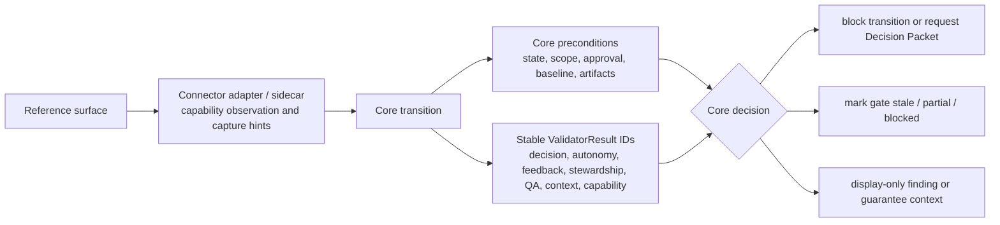

Adapters와 sidecars는 surface capability를 observable facts로 번역합니다. Capability에 대한 kernel gate를 만들지는 않습니다. Capability는 `surface_capability_check` validator, `prepare_write` blocked reasons, guarantee display를 통해 나타납니다.

## Guarantee Levels

Harness는 enforcement strength를 솔직하게 보여주기 위해 guarantee levels를 report합니다.

| Level | Meaning |
|---|---|
| `cooperative` | the agent surface is expected to follow harness instructions and MCP decisions |
| `detective` | the harness can detect violations and mark state blocked, stale, partial, or failed after observation |
| `preventive` | the connector or runtime can block a violating action before it executes |
| `isolated` | risky work is separated by a worktree, sandbox, process boundary, or equivalent isolation |

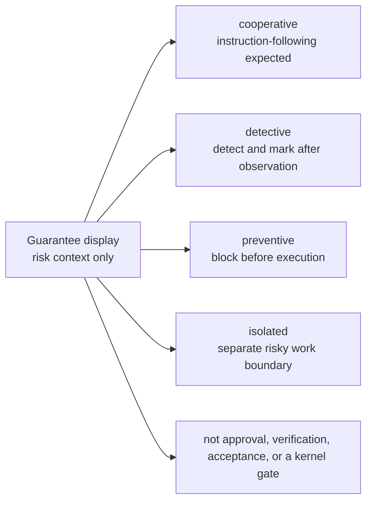

MVP reference behavior는 connected surface가 concrete pre-tool guard나 isolation layer를 갖는 경우가 아니라면 cooperative/detective입니다. Native hook expansion, advanced sidecar watching, broad isolated execution은 MVP reference surface를 위해 명시적으로 구현되지 않는 한 later roadmap items입니다.

Guarantee level은 display와 risk context입니다. Approval, verification, acceptance, kernel gate가 아닙니다.

## Failure And Recovery Overview

Failures는 숨기지 않고 기록합니다.

| Failure | Architecture-level handling |
|---|---|
| Agent crash during write | active Run을 `runs.status=interrupted`로 mark하거나 equivalent interrupted recovery Run을 commit합니다. 가능하면 diff/log snapshots를 capture하고 successful completion의 proof가 아닌 recovery artifacts로 register합니다 |
| Baseline drift after approval | mark approval or evidence stale; require reconfirmation when scope is affected |
| Evaluator observes repo drift | block or stale verification; require fresh baseline or new bundle |
| Artifact file missing | mark artifact/evidence stale; rescan or restore through recovery |
| Projection job failed | keep state current; mark projection failed and retry or reconcile |
| Managed Markdown edited directly | create reconcile item; do not mutate state directly |
| MCP unavailable | `MCP_SERVER_UNAVAILABLE`은 tool call이 Core에 닿을 수 없어 authoritative Core response가 불가능한 diagnostic condition이고, `SURFACE_MCP_UNAVAILABLE`은 Core 또는 operator가 connected surface에 usable MCP가 없거나 MCP configuration이 stale이거나 required tools를 call할 수 없음을 observe할 수 있는 diagnostic condition입니다. `MCP_UNAVAILABLE`은 stable public availability code로 남습니다. Product/runtime/code writes는 cooperative surface에서는 instruction으로 hold되고 available한 stronger guard에서는 block됩니다 |
| Surface capability mismatch | record validator result, adjust guarantee display, and block unsafe writes when required checks cannot be satisfied |

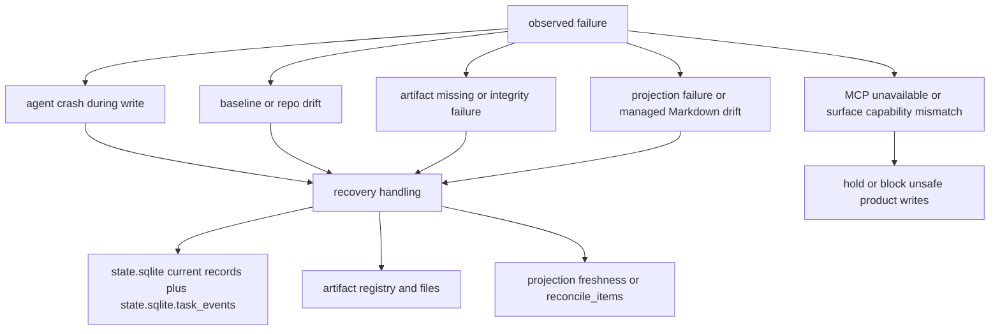

Recovery tools는 projection freshness repair, artifact rescan, stale runs interrupt, drifted approvals expire, reconcile items create를 수행할 수 있습니다. 다만 같은 authority rules를 보존해야 합니다. `state.sqlite`는 operational state이고, `state.sqlite.task_events`는 그 state store 안의 event history이며, raw evidence는 artifact store에 있고, Markdown reports는 projections로 남습니다.
