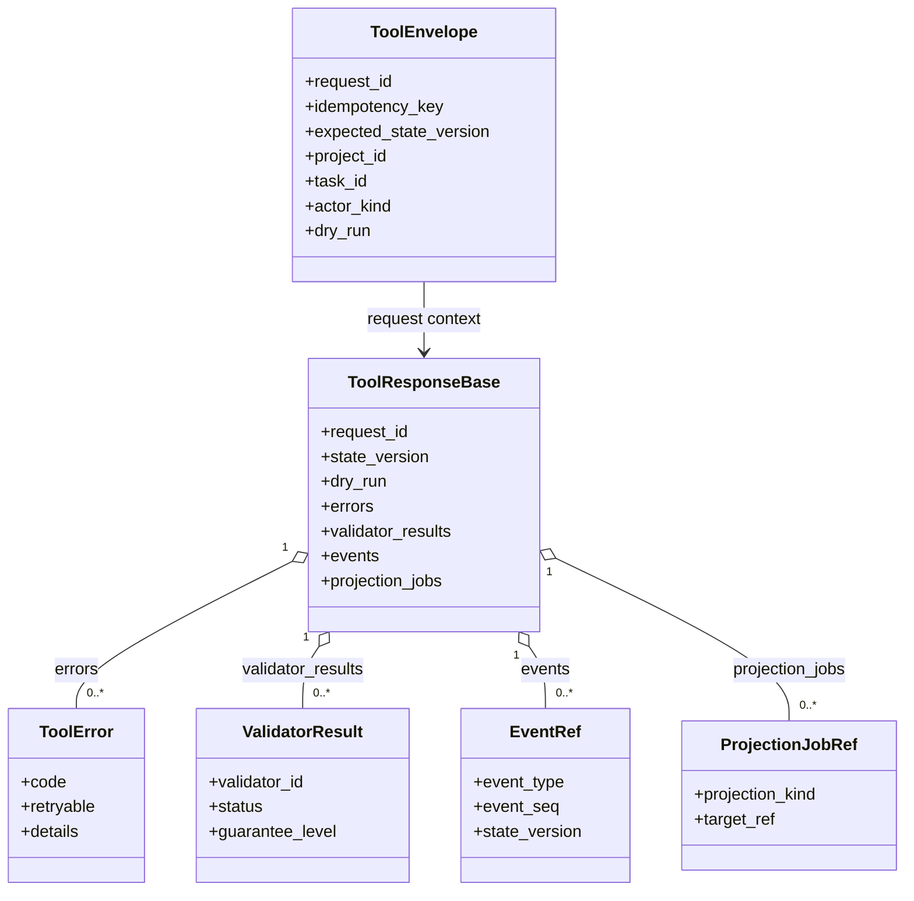
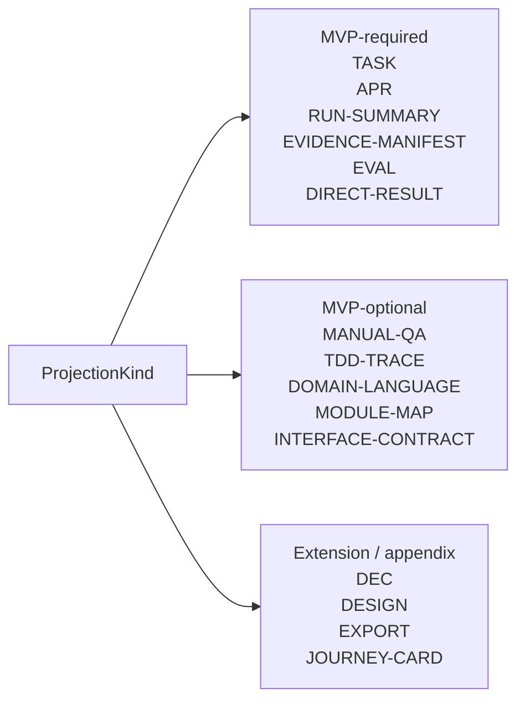
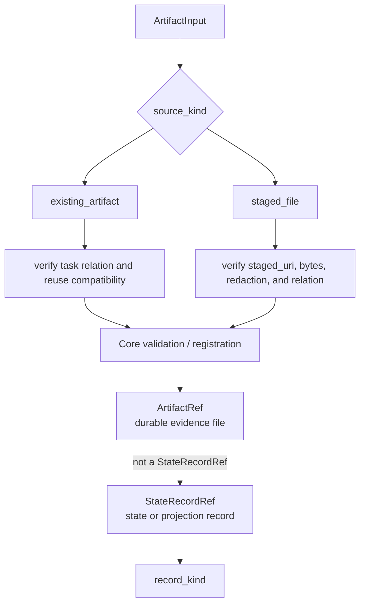
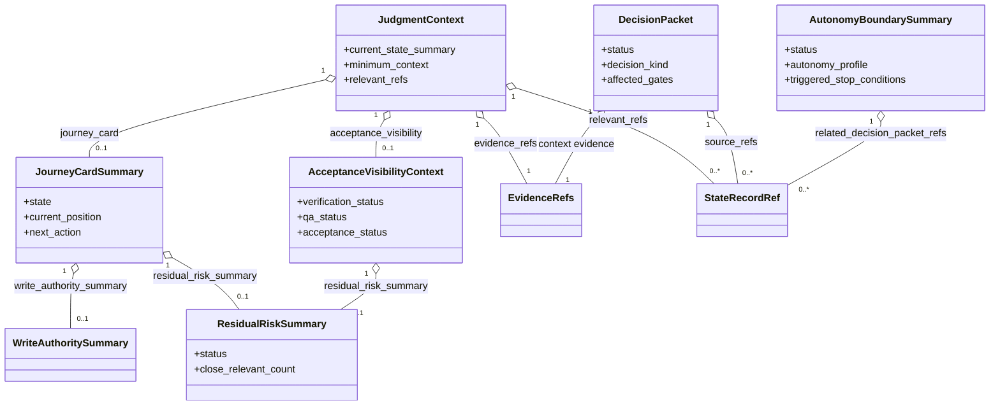
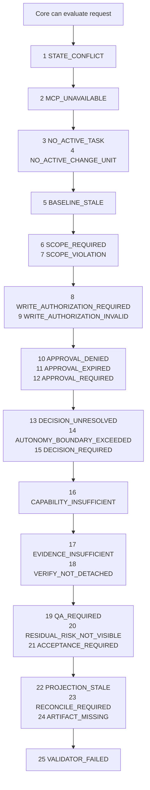
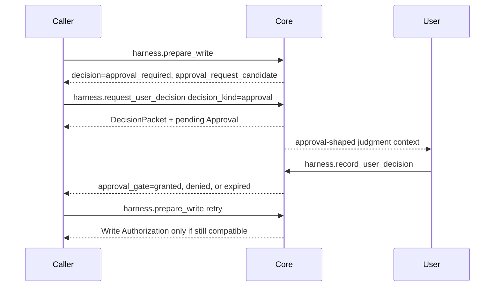
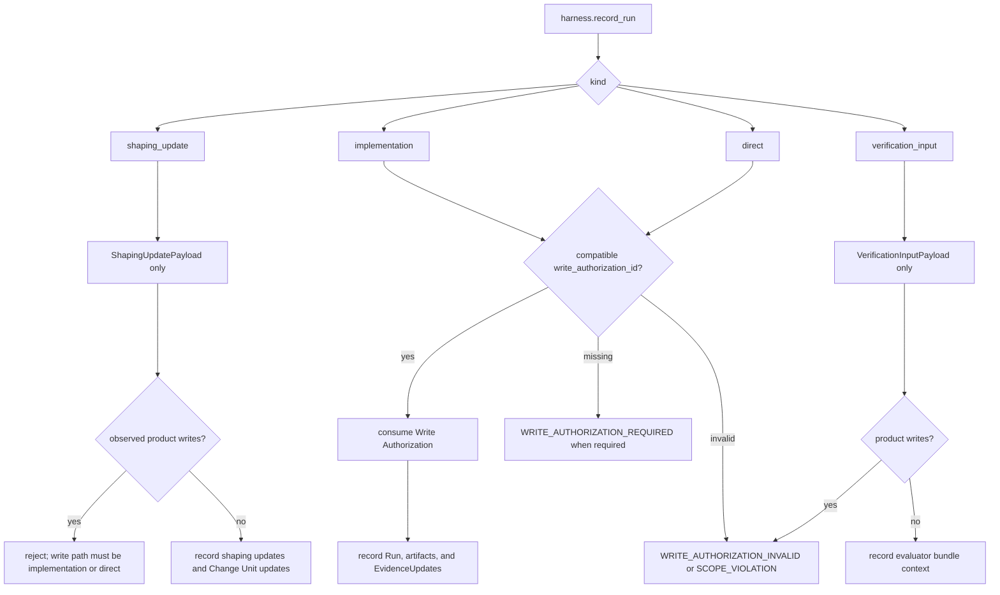
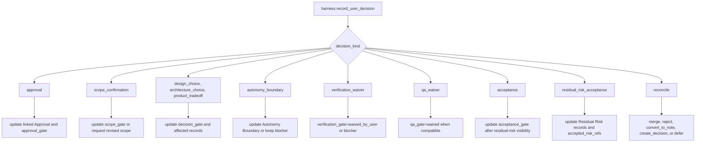
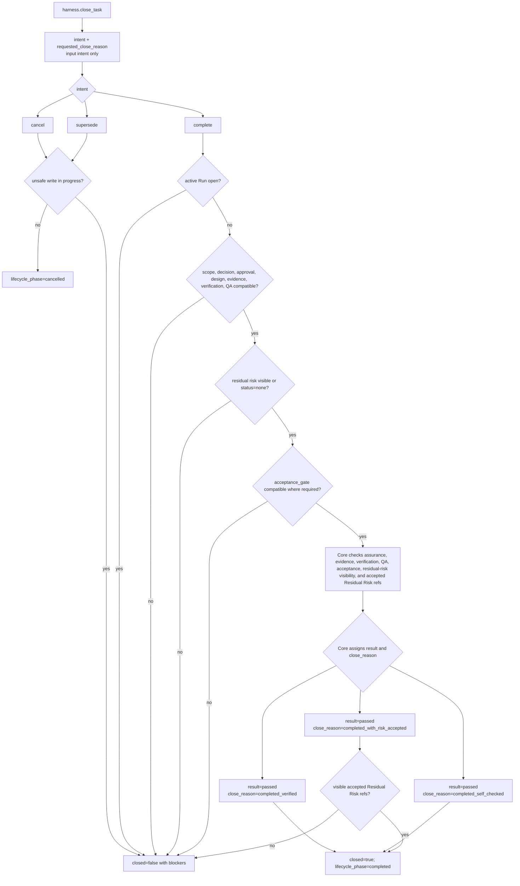

# MCP API와 스키마

## 문서 역할

이 문서는 public MCP resources, public tools, common envelope, request and response schemas, error taxonomy, idempotency behavior, state conflict behavior, validator result schema, artifact ref schema를 담당합니다.

SQLite DDL, full kernel transition table, projection template text, CLI command semantics, connector cookbook details는 이 문서가 담당하지 않습니다.

## API 범위

MCP resource는 읽기 전용입니다. 모든 state change는 public tools와 Core를 거칩니다. Tool response는 projection paths와 artifact refs를 포함할 수 있지만, 이 값들은 state records 또는 raw evidence files에 대한 references일 뿐 canonical state를 대신하지 않습니다.

이 문서의 public request와 response schemas는 API payload의 validation source입니다. 여기에는 Core가 나중에 저장하는 API-shaped payload도 포함됩니다. Storage JSON `TEXT` fields는 Reference MVP storage concern으로 남지만, Core는 모든 storage JSON value를 commit 전에 이 문서의 API-owned shape 또는 [Reference MVP](06-reference-mvp.md)의 storage-owned shape에 맞게 validate해야 합니다. Malformed JSON 또는 schema-incompatible JSON은 invalid state입니다.

Capability는 first-class kernel gate가 아닙니다. Surface capability는 다음 경로로 나타납니다.

- the `surface_capability_check` validator
- `harness.prepare_write.response.blocked_reasons`
- status와 write decisions의 guarantee display

Core preconditions와 mechanical checks는 validators 전이나 옆에서 실행될 수 있습니다. `ValidatorResult`로 emit되고 `validator_runs`에 persist되는 stable ID만 validator ID입니다. `scope_coverage`, `changed_paths`, `changed_paths_intent`, `approval_scope`, `baseline_freshness`, `qa_waiver_reason`, `projection_freshness` 같은 checks는 owning docs section이 명시적으로 promote하지 않는 한 Core checks로 남습니다.

## MCP Resources

Resources는 state를 mutate하지 않고 current state와 projection-oriented summaries를 expose합니다.

```text
harness://project/current
harness://project/surfaces
harness://task/active
harness://task/{task_id}
harness://task/{task_id}/summary
harness://task/{task_id}/spine
harness://task/{task_id}/journey
harness://task/{task_id}/decision-packets
harness://task/{task_id}/change-unit-dag
harness://task/{task_id}/judgment-context
harness://task/{task_id}/reports/latest
harness://task/{task_id}/evidence-manifest
harness://task/{task_id}/bundle/current
harness://design/domain-language
harness://design/module-map
harness://design/interface-contracts
harness://policy/sensitive-categories
harness://status/card
```

이 tree는 read-only resource surface를 group합니다. Reads는 current state와 projection freshness를 report할 수 있지만 state를 mutate하지 않습니다.

```mermaid
flowchart TD
  Resources["MCP Resources<br/>read-only"] --> Project["project"]
  Project --> ProjectCurrent["harness://project/current"]
  Project --> ProjectSurfaces["harness://project/surfaces"]

  Resources --> Task["task"]
  Task --> TaskActive["harness://task/active"]
  Task --> TaskRecord["harness://task/{task_id}"]
  Task --> TaskSummary["harness://task/{task_id}/summary"]
  Task --> TaskSpine["harness://task/{task_id}/spine"]
  Task --> TaskJourney["harness://task/{task_id}/journey"]
  Task --> TaskPackets["harness://task/{task_id}/decision-packets"]
  Task --> TaskDag["harness://task/{task_id}/change-unit-dag"]
  Task --> TaskJudgment["harness://task/{task_id}/judgment-context"]
  Task --> TaskReports["harness://task/{task_id}/reports/latest"]
  Task --> TaskEvidence["harness://task/{task_id}/evidence-manifest"]
  Task --> TaskBundle["harness://task/{task_id}/bundle/current"]

  Resources --> Design["design"]
  Design --> DomainLanguage["harness://design/domain-language"]
  Design --> ModuleMap["harness://design/module-map"]
  Design --> InterfaceContracts["harness://design/interface-contracts"]

  Resources --> Policy["policy"]
  Policy --> SensitiveCategories["harness://policy/sensitive-categories"]
  Resources --> Status["harness://status/card"]
  Resources --> NoMutation["must not create Tasks, decisions, projection jobs, or reconcile items"]
```



Resource reads는 Task records, decisions, projection jobs, reconcile items를 만들면 안 됩니다. Resource가 stale projection을 detect하면 freshness를 report할 뿐 repair하지 않습니다.

Journey resources는 canonical state 위의 projection-oriented reads입니다.

- `harness://task/{task_id}/journey`는 current Journey Card와 Journey Spine-oriented refs를 반환합니다.
- `harness://task/{task_id}/decision-packets`는 해당 Task의 active, resolved, deferred, blocked Decision Packet summaries를 반환합니다.
- `harness://task/{task_id}/change-unit-dag`는 Change Unit dependency refs와 ordering summaries를 반환합니다.
- `harness://task/{task_id}/judgment-context`는 user judgment에 필요한 minimum current context를 반환하며, optional pull refs를 required context와 분리합니다.

## Common Tool Envelope

모든 public tool request는 envelope를 가집니다. State-changing tools에는 non-null `idempotency_key`와 `expected_state_version`이 필요합니다. Read-only tools도 tracing을 위해 같은 envelope를 받을 수 있으며, `expected_state_version`을 `null`로 둘 수 있습니다.

State version scope는 operation의 primary addressed Task에서 Core가 resolve합니다. Resolved primary Task는 `ToolEnvelope.task_id`, tool-specific `task_id`, 또는 active Task resolution에서 올 수 있습니다. Task-scoped mutations는 `expected_state_version`을 해당 Task의 `tasks.state_version`과 비교합니다. Core가 primary Task를 resolve하지 않고 operation이 project-scoped이면 `expected_state_version`을 `project_state.state_version`과 비교합니다.

```yaml
ToolEnvelope:
  request_id: string
  idempotency_key: string | null
  expected_state_version: integer | null
  project_id: string
  task_id: string | null
  surface_id: string
  run_id: string | null
  actor_kind: user | lead_agent | evaluator | operator
  dry_run: boolean
```

Common response fields:

```yaml
ToolResponseBase:
  request_id: string
  idempotency_key: string | null
  project_id: string
  task_id: string | null
  state_version: integer
  dry_run: boolean
  errors: ToolError[]
  validator_results: ValidatorResult[]
  events: EventRef[]
  projection_jobs: ProjectionJobRef[]
```

`dry_run=true`는 validate하고 transition plan을 반환하지만 current records update, `state.sqlite.task_events` append, artifact registration, consumable Write Authorization records create, projection job enqueue, `tool_invocations` idempotency replay row create/update를 하지 않습니다. Dry-run output은 non-authoritative diagnostics이며 그 `idempotency_key`는 replay를 위해 consumed되지 않습니다.

`ToolResponseBase.state_version`은 primary affected scope의 resulting version을 반환합니다. State-changing operations에서는 Core가 primary Task를 resolve하면 Task State Version이고, 그렇지 않으면 Project State Version입니다. Read-only responses는 primary read scope의 current `state_version`을 반환하며 increment하지 않습니다. `dry_run=true`가 mutation 없이 validate하거나 plan할 때 `state_version`은 current primary affected 또는 read scope version을 report합니다. Virtual resulting version, idempotency-key consumption, replay row, appended event, would-be clock increment를 뜻하지 않습니다.

이 다이어그램은 high-level envelope map일 뿐입니다. Exact schema contract는 이 문서의 YAML blocks입니다.



## Shared Schemas

```yaml
EventRef:
  event_id: string
  event_seq: integer
  event_type: string
  task_id: string | null
  state_version: integer

ProjectionJobRef:
  projection_job_id: string
  projection_kind: ProjectionKind
  target_ref: string
  projection_version: integer
```

`EventRef.state_version`은 event의 affected scope에 대한 resulting version입니다. Task events는 `tasks.state_version`을 사용하고, `task_id=null`인 project-level events는 `project_state.state_version`을 사용합니다.

`EventRef.event_seq`는 `task_events.event_seq`를 mirror합니다. Responses는 events를 ascending `event_seq`로 나열합니다. Timestamps와 `event_id` lexical order는 deterministic event ordering에 사용하지 않습니다.

Fixture assertions를 위한 event stability는 [Kernel Stable Event Catalog](03-kernel-spec.md#stable-event-catalog)가 담당합니다. 아래 tool sections는 response가 반환하거나 implementation이 저장할 수 있는 `EventRef.event_type` 값을 설명하지만, 두 번째 event taxonomy를 정의하지 않습니다. Stable로 label된 names는 catalog names입니다. Stable catalog에 없는 이름은 implementation-local detail 또는 audit events로 나타날 수 있지만 fixture-stable이 아니며 MVP `expected_events` fixtures가 요구하면 안 됩니다. ValidatorResult IDs, Core check names, projection status shorthands, fixture seed shorthand는 kernel catalog가 명시적으로 나열하지 않는 한 event names가 아닙니다.

`ProjectionKind`는 API가 MVP tier를 담당하는 extensible enum입니다.

| Tier | Values | Requirement |
|---|---|---|
| MVP-required | `TASK`, `APR`, `RUN-SUMMARY`, `EVIDENCE-MANIFEST`, `EVAL`, `DIRECT-RESULT` | Reference MVP implementation은 이 kinds를 support하고 source record가 변경될 때 enqueue/render해야 합니다. |
| MVP-optional | `MANUAL-QA`, `TDD-TRACE`, `DOMAIN-LANGUAGE`, `MODULE-MAP`, `INTERFACE-CONTRACT` | Policy가 적용되거나, source record가 있거나, user/operator가 projection을 enable할 때 support 또는 enqueue합니다. |
| Extension / appendix | `DEC`, `DESIGN`, `EXPORT`, `JOURNEY-CARD` | Corresponding extension 또는 appendix projection이 enabled인 경우에만 support할 수 있습니다. |

이 tier diagram은 `ProjectionKind` support expectations를 요약합니다. Projection을 canonical state로 만들지는 않습니다.



ProjectionKind extensibility가 projection을 canonical state로 만들지는 않습니다. 모든 projection job은 여전히 owner record와 artifact ref에서 derived view를 render합니다. `DEC`는 해당 feature가 enabled일 때 standalone Decision Packet Markdown에만 valid하며, MVP-required projection job이 아닙니다. Standalone `DEC` job이 없어도 MVP Decision Packet visibility가 줄어들면 안 되며, 이 visibility는 `TASK` projections, status/next responses, judgment-context resources, decision-packet resources를 통해 required입니다. Persisted `JOURNEY-CARD` Markdown은 optional입니다. `harness.status`, `harness.next`, significant resume flows의 current-position Journey Card output은 agency conformance에 계속 required입니다.

```yaml
ToolError:
  code: ErrorCode
  message: string
  retryable: boolean
  details: object

ToolErrorMcpUnavailableDetails:
  mcp_unavailable_kind: server_unavailable | surface_mcp_unavailable | stale_connection | unknown

StateSummary:
  mode: advisor | direct | work
  lifecycle_phase: intake | shaping | ready | executing | verifying | qa | waiting_user | blocked | completed | cancelled
  result: none | advice_only | passed | failed | cancelled
  close_reason: none | completed_verified | completed_self_checked | completed_with_risk_accepted | cancelled | superseded
  assurance_level: none | self_checked | detached_verified
  gates:
    scope_gate: not_required | required | pending | passed | failed | blocked
    decision_gate: not_required | required | pending | resolved | deferred | blocked
    approval_gate: not_required | required | pending | granted | denied | expired
    design_gate: not_required | required | pending | passed | partial | waived | stale | blocked
    evidence_gate: not_required | none | partial | sufficient | stale | blocked
    verification_gate: not_required | required | pending | passed | failed | waived_by_user | blocked
    qa_gate: not_required | required | pending | passed | failed | waived
    acceptance_gate: not_required | required | pending | accepted | rejected
```

Sensitive categories:

```text
auth_change
permission_model_change
schema_change
dependency_change
public_api_change
destructive_write
network_write
external_service_write
secret_access
production_config_change
ci_cd_change
infra_or_deployment_change
privacy_or_pii_change
data_export
telemetry_or_logging_change
license_or_compliance_change
billing_or_cost_change
model_or_prompt_policy_change
policy_override
```

## Artifact Ref Schema

Artifact ref는 artifact store에 registered된 durable evidence file을 가리킵니다. Report projections와 record projections는 evidence-file references가 필요할 때 artifact refs를 사용합니다. Projection 자체는 evidence file이 아닙니다.

```yaml
ArtifactRef:
  artifact_id: string
  kind: diff | log | screenshot | checkpoint | bundle | manifest | qa_capture | export_component | design_probe | prototype | architecture_scan | decision_context | other
  uri: string
  sha256: string
  size_bytes: integer
  content_type: string
  redaction_state: none | redacted | secret_omitted | blocked
  task_id: string
  run_id: string | null
  created_at: string
  produced_by: lead_agent | evaluator | operator | harness
  retention_class: task | project | export | temporary
```

Reference MVP에서 `uri`는 `harness-artifact://{project_id}/{artifact_id}`를 사용합니다. Local file path는 API payload의 absolute path를 trust하지 않고 per-project `artifacts` registry row in `state.sqlite`를 통해 resolve합니다.

Evidence를 create하거나 attach하는 requests는 `ArtifactInput`을 사용합니다. Request는 existing committed artifact를 reference하거나, Core가 validate하고 register한 뒤 `ArtifactRef`로 반환할 staged file을 제공할 수 있습니다.

```yaml
ArtifactInput:
  input_id: string
  source_kind: staged_file | existing_artifact
  existing_artifact_ref: ArtifactRef | null
  staged: StagedArtifactSource | null
  kind: diff | log | screenshot | checkpoint | bundle | manifest | qa_capture | export_component | design_probe | prototype | architecture_scan | decision_context | other
  redaction_state: none | redacted | secret_omitted | blocked
  produced_by: lead_agent | evaluator | operator | harness
  retention_class: task | project | export | temporary
  relation:
    task_id: string
    run_id: string | null
    record_kind: task | change_unit | run | decision_packet | shared_design | residual_risk | evidence_manifest | eval | manual_qa_record | feedback_loop | tdd_trace | journey_spine_entry | projection
    record_id_hint: string | null
  description: string | null

StagedArtifactSource:
    staged_uri: string
    display_name: string | null
    content_type: string
    expected_sha256: string | null
    expected_size_bytes: integer | null
```

Rules:

- `source_kind=existing_artifact` requires `existing_artifact_ref` and must set `staged` to `null`.
- `source_kind=staged_file` requires `staged` and must set `existing_artifact_ref` to `null`.
- Existing artifact를 새 record에 attach할 때 Core는 artifact의 task relation을 verify하고 incompatible reuse를 reject합니다.
- `staged_uri`는 arbitrary absolute path가 아니라 harness staging location 또는 approved capture adapter를 가리켜야 합니다.
- `expected_sha256` 또는 `expected_size_bytes`가 있으면 Core는 commit 전에 stored bytes를 verify합니다.
- Core는 final storage 전에 redaction rules를 적용하고 committed artifact를 `ArtifactRef`로 기록합니다.
- Tool responses는 committed `ArtifactRef` values를 `registered_artifacts`, `bundle_ref`, 기타 response fields로 반환합니다.
- `relation.record_kind`는 Core가 validate할 수 있는 existing canonical owner record 또는 rendered projection ref를 이름으로 지정해야 합니다. Verification bundles는 `ArtifactRef.kind=bundle` 또는 `manifest`를 사용합니다. Export outputs는 `ArtifactRef.kind=export_component` 또는 `retention_class=export`를 사용합니다. `verification_bundle`과 `export`는 MVP artifact relation record kind가 아닙니다.

Record 또는 projection references는 `ArtifactRef`가 아니라 `StateRecordRef`를 사용합니다.

```yaml
StateRecordRef:
  record_kind: task | change_unit | change_unit_dependency | run | approval | write_authorization | decision_packet | journey_spine_entry | shared_design | domain_term | module_map_item | interface_contract | feedback_loop | residual_risk | evidence_manifest | eval | manual_qa_record | tdd_trace | reconcile_item | projection
  record_id: string
  projection_path: string | null
```

MVP에는 `accepted_risk` `StateRecordRef.record_kind`가 없습니다. `accepted_risk_refs`, `accepted_refs`, 또는 accepted-risk equivalent로 이름 붙은 public fields는 `record_kind=residual_risk`인 `StateRecordRef` entries를 사용해야 합니다. Accepted risk는 그 Residual Risk records의 metadata/state입니다.

Canonical design-support records에 대한 public refs는 해당 storage record id와 함께 `record_kind=domain_term`, `record_kind=module_map_item`, 또는 `record_kind=interface_contract`를 사용합니다. `DOMAIN-LANGUAGE`, `MODULE-MAP`, `INTERFACE-CONTRACT` 같은 rendered Markdown projection 자체를 가리킬 때만 `record_kind=projection`을 사용합니다.

Canonical feedback-loop records에 대한 public refs는 `feedback_loops.feedback_loop_id`와 함께 `record_kind=feedback_loop`를 사용합니다. Red/green/refactor TDD evidence row에는 `record_kind=tdd_trace`만 사용합니다. Feedback Loop는 execution evidence로 TDD Trace를 cite할 수 있지만, TDD Trace가 selected-loop definition을 대체하지는 않습니다.

이 다이어그램은 raw evidence registration과 state-record references를 구분합니다. `ArtifactInput`은 Core validation과 registration을 거쳐야만 `ArtifactRef`가 되며, state 또는 projection records는 `StateRecordRef`를 사용합니다.



Evidence references, approval scope, write authorization, Write Authority Summary display, end-to-end paths는 다음 shared shapes를 사용합니다.

```yaml
EvidenceRefs:
  state_refs: StateRecordRef[]
  artifact_refs: ArtifactRef[]

ApprovalScope:
  sensitive_categories: string[]
  allowed_paths: string[]
  allowed_tools: string[]
  allowed_commands: string[]
  allowed_network_targets: string[]
  secret_scope: string[]
  baseline_ref: string | null

WriteAuthorizationSummary:
  write_authorization_id: string
  task_id: string
  change_unit_id: string
  basis_state_version: integer
  intended_operation: string
  intended_paths: string[]
  intended_tools: string[]
  intended_commands:
    - command: string
      command_class: string
      writes_product_files: boolean
  intended_network:
    - target: string
      direction: read | write
  intended_secrets:
    - secret_handle: string
      access_kind: read | write
  sensitive_categories: string[]
  baseline_ref: string | null
  approval_refs: StateRecordRef[]
  decision_packet_refs: StateRecordRef[]
  guarantee_level: cooperative | detective | preventive | isolated
  status: allowed | consumed | expired | stale | revoked
  consumed_by_run_id: string | null
  created_at: string
  consumed_at: string | null

WriteAuthoritySummary:
  active_change_unit_ref: StateRecordRef | null
  write_authorization_ref: StateRecordRef | null
  allowed_paths: string[]
  allowed_tools: string[]
  allowed_commands: string[]
  allowed_command_classes: string[]
  allowed_network_targets: string[]
  secret_scope: string[]
  sensitive_categories: string[]
  approval_status: not_required | required | pending | granted | denied | expired | unknown
  baseline_ref: string | null
  guarantee_display:
    level: cooperative | detective | preventive | isolated
    notes: string[]
  note: "Autonomy Boundary is judgment latitude, not write authority."

EndToEndPath:
  trigger_or_input: string | null
  domain_logic: string | null
  persistence_or_state: string | null
  api_or_caller_boundary: string | null
  ui_or_observable_output: string | null
```

`WriteAuthorizationSummary`와 `WriteAuthoritySummary`는 API payload shapes일 뿐입니다. 이 문서는 Write Authorization records에 대한 SQLite DDL을 정의하지 않습니다. `WriteAuthoritySummary`는 clients가 Write Authority Summary를 Autonomy Boundary judgment latitude 옆에 표시하기 위해 사용하는 display/read shape입니다.

`DEC`, `DESIGN`, `EXPORT`, `JOURNEY-CARD` 같은 Extension / appendix `ProjectionKind` values는 해당 projection feature가 enabled일 때만 valid projection job kind입니다. MVP-required Decision Packet visibility는 `TASK` projections, status/next responses, judgment-context resources, decision-packet resources를 통해 제공됩니다. Persisted `JOURNEY-CARD` Markdown은 optional로 남지만 current-position Journey Card output은 status, next, significant resume flows에서 required입니다. Full extension template text는 Appendix A가 담당하며, 이 API schema file이 담당하지 않습니다.

Decision Packet, Write Authorization, Write Authority Summary, Journey Card, Judgment Context, Autonomy Boundary, acceptance visibility, residual-risk summaries는 public MCP schemas입니다. 이 schemas는 API payload만 설명합니다. Canonical kernel records는 owner docs가 정의합니다.

```yaml
DecisionPacket:
  decision_packet_id: string
  task_id: string
  change_unit_id: string | null
  status: proposed | pending_user | resolved | deferred | rejected | blocked | superseded
  decision_kind: approval | scope_confirmation | design_choice | architecture_choice | product_tradeoff | autonomy_boundary | verification_waiver | qa_waiver | acceptance | residual_risk_acceptance | reconcile
  context:
    why_now: string
    source_refs: StateRecordRef[]
    evidence_refs: EvidenceRefs
  state_summary_at_request: StateSummary
  what_user_is_deciding: string
  what_agent_may_decide_without_user: string[]
  affected_gates:
    - scope_gate | decision_gate | approval_gate | design_gate | evidence_gate | verification_gate | qa_gate | acceptance_gate
  affected_acceptance_criteria:
    - criteria_id: string
      statement: string
  options: DecisionPacketOption[]
  recommendation: DecisionPacketRecommendation | null
  deferral_consequence: string
  user_context: DecisionPacketUserContext
  approval_scope: ApprovalScope | null
  reconcile_item_id: string | null
  created_at: string
  resolved_at: string | null

DecisionPacketOption:
  option_id: string
  label: string
  benefits: string[]
  costs: string[]
  risks: string[]
  reversibility: reversible | partially_reversible | irreversible | unknown
  confidence: low | medium | high
  suitable_when: string[]
  evidence_refs: EvidenceRefs

DecisionPacketRecommendation:
  option_id: string | null
  reason: string
  uncertainty: string | null
  when_to_revisit: string | null

DecisionPacketUserContext:
  minimum_context: string[]
  optional_pull_refs: StateRecordRef[]

DecisionPacketCandidate:
  task_id: string
  change_unit_id: string | null
  decision_kind: approval | scope_confirmation | design_choice | architecture_choice | product_tradeoff | autonomy_boundary | verification_waiver | qa_waiver | acceptance | residual_risk_acceptance | reconcile
  context:
    why_now: string
    source_refs: StateRecordRef[]
    evidence_refs: EvidenceRefs
  state_summary_at_request: StateSummary
  what_user_is_deciding: string
  what_agent_may_decide_without_user: string[]
  affected_gates:
    - scope_gate | decision_gate | approval_gate | design_gate | evidence_gate | verification_gate | qa_gate | acceptance_gate
  affected_acceptance_criteria:
    - criteria_id: string
      statement: string
  options: DecisionPacketOption[]
  recommendation: DecisionPacketRecommendation | null
  deferral_consequence: string
  user_context: DecisionPacketUserContext
  expires_at: string | null
  approval_scope: ApprovalScope | null
  reconcile_item_id: string | null

JourneyCardSummary:
  task_id: string
  state: StateSummary
  current_position: string
  next_action: string
  active_change_unit_ref: StateRecordRef | null
  write_authority_summary: WriteAuthoritySummary | null
  active_decision_packet_refs: StateRecordRef[]
  blocker_refs: StateRecordRef[]
  residual_risk_summary: ResidualRiskSummary | null
  projection_freshness:
    status: current | stale | failed | unknown
    stale_refs: StateRecordRef[]

JudgmentContext:
  task_ref: StateRecordRef
  journey_card: JourneyCardSummary | null
  current_state_summary: StateSummary
  minimum_context: string[]
  relevant_refs: StateRecordRef[]
  evidence_refs: EvidenceRefs
  active_decision_packet_refs: StateRecordRef[]
  optional_pull_refs: StateRecordRef[]
  stale_or_missing_refs: StateRecordRef[]
  acceptance_visibility: AcceptanceVisibilityContext | null

AutonomyBoundarySummary:
  change_unit_id: string | null
  status: absent | proposed | active | exceeded | stale
  autonomy_profile: human_in_loop | afk_eligible | evaluator_only | read_only_advisor | null
  what_agent_may_do: string[]
  what_agent_may_decide_without_user: string[]
  what_requires_user_judgment: string[]
  stop_conditions: string[]
  triggered_stop_conditions: string[]
  related_decision_packet_refs: StateRecordRef[]

ResidualRiskSummary:
  status: none | visible | not_visible | accepted | blocked
  close_relevant_count: integer
  not_visible_refs: StateRecordRef[]
  unaccepted_refs: StateRecordRef[]
  accepted_refs: StateRecordRef[]
  summary: string

AcceptanceVisibilityContext:
  residual_risk_summary: ResidualRiskSummary | null
  unaccepted_close_relevant_risk_refs: StateRecordRef[]
  evidence_summary_refs: StateRecordRef[]
  verification_status: not_required | required | pending | passed | failed | waived_by_user | blocked
  qa_status: not_required | required | pending | passed | failed | waived
  acceptance_status: not_required | required | pending | accepted | rejected
  what_acceptance_does_not_replace: string[]
```

이 composition diagram은 API responses를 위한 current judgment context가 어떻게 assemble되는지 보여 줍니다. 위 YAML schema보다 의도적으로 high level입니다.



`ResidualRiskSummary.status=none`은 current Task와 requested action에 대해 Core가 알고 있는 close-relevant Residual Risk가 없다는 뜻입니다. 이는 acceptance와 ordinary successful close에서 residual-risk visibility를 satisfy하며, 이때 `close_relevant_count=0`이고 risk-ref arrays는 비어 있습니다. Core가 hidden, blocked, 또는 표시되지 않은 close-relevant risk를 알고 있다면 이 status를 반환하면 안 되며, 그런 경우 `not_visible` 또는 `blocked`를 사용합니다.

`ResidualRiskSummary.accepted_refs`, `unaccepted_refs`, related acceptance visibility risk-ref arrays는 `record_kind=residual_risk`인 `StateRecordRef` entries를 포함합니다.

Autonomy Boundary summaries는 scope authority가 아니라 judgment latitude를 설명합니다. Active Change Unit scope와 required approval 밖의 paths, tools, commands, network targets, secret access, sensitive categories를 authorize하지 않습니다.

`decision_kind=approval`은 stable public enum value로 유지됩니다. `DecisionPacket`과 `DecisionPacketCandidate` 모두에서 이 값은 sensitive-change approval만을 위한 approval-shaped judgment context를 뜻합니다. Product trade-offs, design direction, QA waiver, verification risk, final acceptance, residual-risk acceptance는 별도의 compatible Decision Packets와 gate updates로 표현되지 않는 한 이 값으로 resolve할 수 없습니다.

## Validator Result Schema

```yaml
ValidatorResult:
  validator_id: string
  validator_kind: state | scope | decision | approval | evidence | verification | qa | acceptance | design | autonomy_boundary | residual_risk | artifact | projection | connector | capability
  status: passed | warning | failed | blocked | skipped
  guarantee_level: cooperative | detective | preventive | isolated
  checked_at: string
  target:
    task_id: string | null
    change_unit_id: string | null
    run_id: string | null
    artifact_id: string | null
  summary: string
  findings:
    - code: string
      severity: info | warning | error | blocker
      message: string
      path: string | null
      artifact_ref: ArtifactRef | null
  blocked_reasons: string[]
  suggested_next_action: string | null
```

`surface_capability_check` validator는 이 schema를 `validator_kind=capability`로 사용합니다.

`ValidatorResult`를 통해 emit되는 Stable MVP validator IDs는 다음과 같습니다.

- `decision_gate_check`
- `decision_quality_check`
- `autonomy_boundary_check`
- `feedback_loop_check`
- `tdd_trace_required`
- `codebase_stewardship_check`
- `residual_risk_visibility_check`
- `shared_design_alignment`
- `vertical_slice_shape`
- `domain_language_consistency`
- `module_interface_review`
- `manual_qa_required`
- `context_hygiene_check`
- `surface_capability_check`

Status, next, write, close flows에서 흔히 surface되는 agency-critical subset은 다음과 같습니다.

- `decision_quality_check`
- `autonomy_boundary_check`
- `feedback_loop_check`
- `tdd_trace_required`
- `codebase_stewardship_check`
- `residual_risk_visibility_check`
- `context_hygiene_check`

이 smaller subset에서 빠진 design-quality validators, 즉 `shared_design_alignment`, `vertical_slice_shape`, `domain_language_consistency`, `module_interface_review`는 위 full stable MVP ValidatorResult-emitting set에 계속 포함됩니다.

아래 tool descriptions는 `ValidatorResults emitted`와 Core checks/preconditions를 구분합니다. Core checks는 transitions를 block하거나, gates를 update하거나, blocked reasons를 populate하거나, fixture assertions에 나타날 수 있지만 위에 listed되지 않는 한 validator IDs가 아닙니다.

## Error Taxonomy

| Code | Meaning |
|---|---|
| `STATE_CONFLICT` | `expected_state_version` is stale for the relevant state version scope, lock ownership changed, or the same idempotency key was reused with a different payload |
| `NO_ACTIVE_TASK` | a Task is required but none is active or addressed |
| `NO_ACTIVE_CHANGE_UNIT` | a write-capable operation has no active scoped Change Unit |
| `SCOPE_REQUIRED` | scope confirmation is required before the requested write can proceed |
| `SCOPE_VIOLATION` | intended paths, tools, commands, network, secrets, or categories exceed scope |
| `WRITE_AUTHORIZATION_REQUIRED` | write-capable run에 `prepare_write`가 반환한 required Write Authorization이 없습니다 |
| `WRITE_AUTHORIZATION_INVALID` | supplied Write Authorization이 absent, expired, stale, revoked, idempotent replay 밖에서 already consumed, 또는 Task, Change Unit, baseline, intended operation, approval refs, Decision Packet refs와 incompatible합니다 |
| `DECISION_REQUIRED` | blocking product judgment requires a Decision Packet before the requested action can proceed |
| `DECISION_UNRESOLVED` | a relevant Decision Packet is pending, deferred without coverage, rejected, blocked, stale, or incompatible with the requested action |
| `AUTONOMY_BOUNDARY_EXCEEDED` | the intended operation exceeds the active Change Unit Autonomy Boundary |
| `APPROVAL_REQUIRED` | sensitive change requires approval before proceeding |
| `APPROVAL_DENIED` | the relevant approval was denied |
| `APPROVAL_EXPIRED` | approval expired or drifted from baseline/scope |
| `CAPABILITY_INSUFFICIENT` | the connected surface cannot satisfy a required validator or enforcement condition |
| `MCP_UNAVAILABLE` | required MCP access is unavailable, stale, or unreachable |
| `EVIDENCE_INSUFFICIENT` | required evidence coverage is absent, partial, stale, or blocked |
| `VERIFY_NOT_DETACHED` | verification cannot count as detached verification |
| `QA_REQUIRED` | required Manual QA is pending, failed, or missing |
| `ACCEPTANCE_REQUIRED` | required user acceptance is pending or rejected |
| `PROJECTION_STALE` | projection freshness is stale or failed for the requested action |
| `RECONCILE_REQUIRED` | human-editable or managed-block drift requires reconcile |
| `RESIDUAL_RISK_NOT_VISIBLE` | known close-relevant residual risk has not been made visible before acceptance or successful close |
| `ARTIFACT_MISSING` | a referenced artifact file is missing or integrity check failed |
| `BASELINE_STALE` | baseline no longer matches the repository state required by the operation |
| `VALIDATOR_FAILED` | 하나 이상의 required validators가 failed이고 더 specific한 typed `ErrorCode`가 적용되지 않을 때 사용하는 generic fallback |

`WRITE_AUTHORIZATION_REQUIRED`와 `WRITE_AUTHORIZATION_INVALID`는 missing 또는 invalid Write Authorization에만 사용합니다. Observed paths, tools, commands, network targets, secrets, sensitive categories가 authorized 또는 active scope를 넘는 경우 scope violations는 계속 `SCOPE_VIOLATION`을 사용합니다.

`MCP_UNAVAILABLE`은 stable public `ErrorCode`로 유지합니다. Diagnostic detail은 public error code를 추가하지 않고 `MCP_SERVER_UNAVAILABLE`과 `SURFACE_MCP_UNAVAILABLE`을 구분합니다.

- `MCP_SERVER_UNAVAILABLE`: tool call이 Core에 닿을 수 없어 authoritative Core response가 불가능합니다. Caller는 state change를 claim하기 전에 diagnose 또는 reconnect해야 합니다.
- `SURFACE_MCP_UNAVAILABLE`: Core 또는 operator가 connected surface에 usable MCP가 없거나, MCP configuration이 stale이거나, required MCP tools를 call할 수 없음을 observe할 수 있습니다. Product writes는 cooperative surface에서는 instruction으로 hold되고, available한 stronger guard에서는 block됩니다. Core response는 context에 따라 `details.mcp_unavailable_kind`와 함께 `MCP_UNAVAILABLE` 또는 `CAPABILITY_INSUFFICIENT`를 사용할 수 있습니다.

MCP availability problem에 대해 `ToolError` object가 available한 경우 `details.mcp_unavailable_kind`는 `server_unavailable`, `surface_mcp_unavailable`, `stale_connection`, `unknown` 중 하나일 수 있습니다.

`DECISION_REQUIRED`, `DECISION_UNRESOLVED`, `WRITE_AUTHORIZATION_REQUIRED`, `WRITE_AUTHORIZATION_INVALID`, `AUTONOMY_BOUNDARY_EXCEEDED`, `RESIDUAL_RISK_NOT_VISIBLE`, `MCP_UNAVAILABLE`은 stable public `ErrorCode` values입니다. Validator-specific detail은 여전히 `ValidatorResult.findings`에 속합니다.

### Primary Error Code Precedence

Public tool response는 Core가 여러 blockers를 동시에 observe해도 하나의 primary `ToolError.code`만 가집니다. `ToolResponseBase.errors`가 non-empty이면 `errors[0]`가 이 precedence table로 선택된 primary `ToolError`이고, remaining entries는 secondary blockers를 나타낼 수 있습니다. Tool subsection이 더 좁은 order를 정의하지 않는 한 primary code는 아래 precedence list에서 처음 applicable한 code입니다. Secondary blockers는 `blocked_reasons`, `CloseTaskResponse.blockers`, validator results, `ToolError.details`, state summaries 같은 tool-specific fields에 유지합니다.

`Possible errors` lists는 tool에서 사용할 수 있는 codes를 enumerate합니다. 이는 per-tool precedence table이 아닙니다.

MCP server 또는 caller가 Core에 전혀 닿을 수 없으면 surface 또는 operator가 `MCP_UNAVAILABLE`을 report할 수 있지만 authoritative Core response나 state mutation을 claim할 수 없습니다. Core가 request를 evaluate할 수 있으면 다음 order를 적용합니다.

| Precedence | Primary `ErrorCode` | Selection note |
|---:|---|---|
| 1 | `STATE_CONFLICT` | stale `expected_state_version`, state lock conflict, 또는 같은 idempotency key가 다른 payload로 reused됨 |
| 2 | `MCP_UNAVAILABLE` | Core 또는 operator가 availability problem을 classify한 뒤 required MCP access가 unavailable, stale, unreachable임 |
| 3 | `NO_ACTIVE_TASK` | operation에 Task가 필요하지만 active 또는 addressed Task가 없음 |
| 4 | `NO_ACTIVE_CHANGE_UNIT` | operation이 write-capable 또는 close-relevant인데 active scoped Change Unit이 적용되지 않음 |
| 5 | `BASELINE_STALE` | requested operation이 stale baseline에 의존함 |
| 6 | `SCOPE_REQUIRED` | requested operation이 proceed하기 전에 scope confirmation이 필요함 |
| 7 | `SCOPE_VIOLATION` | intended 또는 observed paths, tools, commands, network, secrets, categories가 active 또는 authorized scope를 초과함 |
| 8 | `WRITE_AUTHORIZATION_REQUIRED` | write-capable Run에 required Write Authorization이 없음 |
| 9 | `WRITE_AUTHORIZATION_INVALID` | supplied Write Authorization이 stale, expired, revoked, replay 밖에서 consumed, 또는 incompatible함 |
| 10 | `APPROVAL_DENIED` | relevant sensitive-change approval이 denied됨 |
| 11 | `APPROVAL_EXPIRED` | relevant sensitive-change approval이 expired되었거나 scope 또는 baseline에서 drift됨 |
| 12 | `APPROVAL_REQUIRED` | sensitive change에 approval이 필요하지만 compatible granted approval이 없음 |
| 13 | `DECISION_UNRESOLVED` | existing relevant Decision Packet이 pending, deferred without coverage, rejected, blocked, stale, 또는 incompatible함 |
| 14 | `AUTONOMY_BOUNDARY_EXCEEDED` | intended operation이 active Change Unit Autonomy Boundary를 초과하며, next step이 Decision Packet이어도 이 code를 사용함 |
| 15 | `DECISION_REQUIRED` | blocking product judgment가 action 진행 전에 Decision Packet을 필요로 함 |
| 16 | `CAPABILITY_INSUFFICIENT` | connected surface가 required capability 또는 enforcement condition을 satisfy할 수 없음 |
| 17 | `EVIDENCE_INSUFFICIENT` | required evidence coverage가 absent, partial, stale, 또는 blocked임 |
| 18 | `VERIFY_NOT_DETACHED` | verification이 detached verification으로 count될 수 없음 |
| 19 | `QA_REQUIRED` | required Manual QA가 pending, failed, missing, 또는 validly waived되지 않음 |
| 20 | `RESIDUAL_RISK_NOT_VISIBLE` | known close-relevant residual risk가 acceptance 또는 close 전에 visible하지 않음. `ResidualRiskSummary.status=none`이 no known close-relevant risk를 confirm한 경우에는 선택하지 않음 |
| 21 | `ACCEPTANCE_REQUIRED` | residual-risk visibility가 satisfied된 뒤에도 required user acceptance가 pending 또는 rejected임 |
| 22 | `PROJECTION_STALE` | requested action에 필요한 projection freshness가 stale 또는 failed임 |
| 23 | `RECONCILE_REQUIRED` | human-editable 또는 managed-block drift에 reconcile이 필요함 |
| 24 | `ARTIFACT_MISSING` | referenced artifact file이 missing이거나 integrity check에 failed함 |
| 25 | `VALIDATOR_FAILED` | 위의 더 specific한 typed blocker가 적용되지 않을 때만 선택되는 generic validator fallback |

이 flowchart는 precedence table을 selection order로 group합니다. Exact public `ErrorCode` contract는 위 table입니다.



#### `harness.close_task` Close Blockers

`harness.close_task`는 여러 close blockers를 반환할 수 있습니다. `CloseTaskResponse.base.errors`의 primary `ToolError`는 위 precedence를 사용합니다. Present하면 `CloseTaskResponse.base.errors[0].code`가 primary close error code입니다. `CloseTaskResponse.blockers`는 observed close blockers를 같은 relative order로 포함해야 합니다. Required acceptance는 close-relevant residual risk가 visible한 뒤에만 record하거나 rely할 수 있으므로 close 및 acceptance flows에서 residual-risk visibility는 `ACCEPTANCE_REQUIRED`보다 앞에 둡니다.

## Idempotency And State Conflict Behavior

Idempotency keys는 `(project_id, tool_name, idempotency_key)`에 scoped됩니다. 같은 key로 같은 payload를 반복하면 original committed response를 반환합니다. 같은 key를 다른 payload로 reuse하면 `STATE_CONFLICT`를 반환합니다.

`request_hash`는 UTF-8로 encode한 canonical JSON에서 계산합니다. Canonical input은 `tool_name`, schema-normalized request body, 그리고 `request_id`와 `idempotency_key`를 제외한 모든 `ToolEnvelope` field를 포함합니다. 포함되는 envelope fields는 `expected_state_version`, `project_id`, `task_id`, `surface_id`, `run_id`, `actor_kind`, `dry_run`입니다. Hashing 전에 optional fields는 request schema의 default 및 null/empty-field rule에 따라 normalize하고, object keys는 sort하며, arrays는 schema가 order-insignificant라고 명시한 경우가 아니면 schema-defined order를 유지하고, Unicode strings는 NFC를 사용해 일관되게 normalize합니다.

State-changing tools에서 Core는 `expected_state_version`을 current project/task state와 비교합니다. Mismatch는 `STATE_CONFLICT`를 반환하고 `details`에 current state version과 status summary를 포함합니다. Caller는 state를 refresh한 뒤 새 idempotency key로 retry하거나 exact previous request를 replay해야 합니다.

State conflict 비교는 scope-specific입니다. Core는 먼저 `ToolEnvelope.task_id`, tool-specific `task_id`, 또는 active Task resolution에서 primary addressed Task를 resolve합니다. Task-scoped tools는 해당 Task의 `tasks.state_version`과 비교하고, resolved primary Task가 없는 project-scoped tools는 `project_state.state_version`과 비교합니다. `STATE_CONFLICT.details`에는 `scope`(`task` 또는 `project`), `current_state_version`, `expected_state_version`, relevant `project_id`, 그리고 `scope=task`일 때 `task_id`를 포함해야 합니다. Refresh guidance를 위한 compact status summary도 포함할 수 있습니다.

## Public Tools

이 sequence는 `harness.prepare_write` branch를 명시한 public tool write path 요약입니다. Product write와 `harness.record_run`은 `prepare_write`가 `allowed`를 반환한 뒤에만 진행되며, blocker paths는 write를 중단하고 blocking decision이 resolved된 뒤 fresh retry를 요구합니다.

```mermaid
sequenceDiagram
  participant Caller
  participant Core
  participant User
  Caller->>Core: harness.intake / harness.status / harness.next
  Core-->>Caller: StateSummary, JourneyCardSummary, next_action
  Caller->>Core: harness.prepare_write
  alt decision=allowed
    Core-->>Caller: Write Authorization
    Caller->>Core: harness.record_run
    Core-->>Caller: Run, artifacts, evidence refs
  else decision=blocked
    Core-->>Caller: blocker; no product write; no record_run
  else decision=approval_required or decision_required
    Core-->>Caller: candidate or Decision Packet refs; no product write; no record_run
    Caller->>Core: harness.request_user_decision
    Core-->>Caller: DecisionPacket
    User->>Core: harness.record_user_decision
    Core-->>Caller: updated gates and state_version
    Note over Caller: refresh state; use fresh expected_state_version and fresh idempotency key
    Caller->>Core: harness.prepare_write retry
    alt retry decision=allowed
      Core-->>Caller: Write Authorization
      Caller->>Core: harness.record_run
      Core-->>Caller: Run, artifacts, evidence refs
    else retry still blocked
      Core-->>Caller: blocker; no product write; no record_run
    end
  end
  Note over Caller,Core: remaining steps apply only after harness.record_run
  opt verification required
    Caller->>Core: harness.launch_verify / harness.record_eval
    Core-->>Caller: verification state
  end
  opt Manual QA required
    Caller->>Core: harness.record_manual_qa
    Core-->>Caller: Manual QA state
  end
  opt acceptance required
    Caller->>Core: harness.request_user_decision / harness.record_user_decision
    Core-->>Caller: acceptance state
  end
  Caller->>Core: harness.close_task
  Core-->>Caller: terminal state or blockers
```

### `harness.status`

Purpose: project, surface, active Task, Journey Card, gate, guarantee, projection, active Decision Packet, Autonomy Boundary, Write Authority Summary, residual-risk, pending-decision status를 반환합니다.

Allowed actor: `user`, `lead_agent`, `evaluator`, `operator`.

Request schema:

```yaml
StatusRequest:
  envelope: ToolEnvelope
  include:
    task: boolean
    gates: boolean
    projections: boolean
    pending_decisions: boolean
    guarantees: boolean
    journey_card: boolean
    decision_packets: boolean
    autonomy_boundary: boolean
    write_authority: boolean
    residual_risk: boolean
```

Response schema:

```yaml
StatusResponse:
  base: ToolResponseBase
  active_task: StateSummary | null
  status_card: string
  journey_card: JourneyCardSummary | null
  pending_decisions: StateRecordRef[]
  active_decision_packet_refs: StateRecordRef[]
  autonomy_boundary_summary: AutonomyBoundarySummary | null
  write_authority_summary: WriteAuthoritySummary | null
  residual_risk_summary: ResidualRiskSummary | null
  projection_freshness:
    status: current | stale | failed | unknown
    stale_refs: StateRecordRef[]
  guarantee_display:
    level: cooperative | detective | preventive | isolated
    notes: string[]
```

State transition summary: state transition 없음.

반환될 수 있는 EventRef values: 없음.

Projection jobs enqueued: 없음.

`pending_decisions`는 unresolved user-action Decision Packets를 포함합니다. `active_decision_packet_refs`는 pending, deferred, blocked, recently resolved packets를 포함해 current phase 또는 requested action과 relevant한 모든 Decision Packets를 포함합니다. 두 fields는 모두 `record_kind=decision_packet`인 `StateRecordRef` entries를 사용합니다.

`write_authority_summary`는 `include.write_authority=true`일 때 반환됩니다. `include.journey_card=true`이면 같은 current Write Authority Summary display가 `journey_card.write_authority_summary`에도 나타날 수 있습니다.

ValidatorResults emitted: optional `surface_capability_check`, optional `decision_gate_check`, optional `autonomy_boundary_check`.

Core checks/preconditions: optional residual-risk visibility read, optional projection freshness read.

Possible errors: `MCP_UNAVAILABLE`, `PROJECTION_STALE`.

Idempotency behavior: read-only입니다. Repeated requests는 state를 mutate하지 않습니다.

### `harness.intake`

Purpose: user intent에서 Task를 create 또는 resume하고 advisor, direct, work로 classify합니다.

Allowed actor: `user`, `lead_agent`, `operator`.

Request schema:

```yaml
IntakeRequest:
  envelope: ToolEnvelope
  user_request: string
  requested_mode: advisor | direct | work | auto
  resume_policy: resume_active | create_new | supersede_active | reject_if_active
  acceptance_criteria: string[]
  constraints:
    allowed_paths: string[]
    non_goals: string[]
    sensitive_categories: string[]
  initial_context_refs: StateRecordRef[]
```

Response schema:

```yaml
IntakeResponse:
  base: ToolResponseBase
  task_id: string
  created: boolean
  resumed: boolean
  state: StateSummary
  next_action: string
  change_unit_id: string | null
```

State transition summary: Task를 create 또는 resume합니다. `mode`와 initial `lifecycle_phase`를 set하고, write-capable direct/work에는 initial Change Unit을 만들 수 있습니다.

반환될 수 있는 stable EventRef values: 기존 Task가 superseded될 때 `task_superseded`.

implementation-local detail/audit를 위해 반환될 수 있는 non-stable EventRef values: `task_intake_recorded`, `task_created`, `task_resumed`, `change_unit_created`.

Projection jobs enqueued: `TASK`; intake가 design support records를 accepted했다면 optional `DOMAIN-LANGUAGE`, `MODULE-MAP`, `INTERFACE-CONTRACT`.

ValidatorResults emitted: `surface_capability_check`.

Core checks/preconditions: `state_envelope`, `active_task_policy`.

Possible errors: `STATE_CONFLICT`, `MCP_UNAVAILABLE`, `VALIDATOR_FAILED`, `CAPABILITY_INSUFFICIENT`.

Idempotency behavior: 같은 key는 같은 Task/resume decision을 반환합니다. 같은 key에 다른 payload를 사용하면 `STATE_CONFLICT`입니다.

### `harness.next`

Purpose: current Task의 next safe action, instruction bundle, pending decisions를 반환합니다.

Allowed actor: `user`, `lead_agent`, `evaluator`, `operator`.

Request schema:

```yaml
NextRequest:
  envelope: ToolEnvelope
  task_id: string | null
  focus: status | shaping | decision | implementation | verification | qa | acceptance | reconcile
  include_instruction_bundle: boolean
```

Response schema:

```yaml
NextResponse:
  base: ToolResponseBase
  state: StateSummary | null
  next_action:
    action_kind: ask_user | prepare_write | implement | launch_verify | record_eval | record_manual_qa | request_acceptance | close_task | reconcile | idle
    summary: string
    required_tool: string | null
  instruction_bundle:
    summary: string
    constraints: string[]
    relevant_refs: StateRecordRef[]
    artifact_refs: ArtifactRef[]
  pending_decisions: StateRecordRef[]
  judgment_context: JudgmentContext | null
  autonomy_boundary: AutonomyBoundarySummary | null
```

State transition summary: state transition 없음.

반환될 수 있는 EventRef values: 없음.

Projection jobs enqueued: 없음.

`pending_decisions`는 unresolved user-action Decision Packets를 포함합니다. Current phase 또는 requested action에 아직 영향을 주는 deferred, blocked, recently resolved packets는 `judgment_context.active_decision_packet_refs`를 통해 나타납니다.

`focus=acceptance`일 때 `judgment_context.acceptance_visibility`는 non-null이어야 합니다. 이 context는 residual-risk summary, unaccepted close-relevant risk refs, evidence summary refs, verification status, QA status, acceptance status, what acceptance does not replace를 포함해야 합니다. 이 context는 known close-relevant risk가 없다는 뜻의 `ResidualRiskSummary.status=none`과, known close-relevant risk가 아직 hidden이라는 뜻의 `not_visible`을 구분해야 합니다. Acceptance request 전에 acceptance가 evidence sufficiency, verification, Manual QA, approval, scope, residual-risk visibility를 대체하지 않는다는 점을 명확히 보여줘야 합니다.

ValidatorResults emitted: optional `surface_capability_check`, optional `decision_gate_check`, optional `autonomy_boundary_check`, optional `context_hygiene_check`.

Possible errors: `DECISION_REQUIRED`, `DECISION_UNRESOLVED`, `NO_ACTIVE_TASK`, `MCP_UNAVAILABLE`, `PROJECTION_STALE`, `AUTONOMY_BOUNDARY_EXCEEDED`, `RECONCILE_REQUIRED`.

Idempotency behavior: read-only입니다. Repeated requests는 state를 mutate하지 않습니다.

### `harness.prepare_write`

Purpose: agent가 write하기 전에 intended product write가 allowed인지 결정합니다.

Allowed actor: `lead_agent`, `operator`.

Request schema:

```yaml
PrepareWriteRequest:
  envelope: ToolEnvelope
  task_id: string
  change_unit_id: string | null
  intended_operation: string
  intended_paths: string[]
  intended_tools: string[]
  intended_commands:
    - command: string
      command_class: string
      writes_product_files: boolean
  intended_network:
    - target: string
      direction: read | write
  intended_secrets:
    - secret_handle: string
      access_kind: read | write
  sensitive_categories: string[]
  baseline_ref: string | null
```

Response schema:

```yaml
PrepareWriteResponse:
  base: ToolResponseBase
  decision: allowed | blocked | approval_required | decision_required | state_conflict
  state: StateSummary | null
  change_unit_id: string | null
  baseline_ref: string | null
  write_authorization_ref: StateRecordRef | null
  write_authorization: WriteAuthorizationSummary | null
  authorization_effect: none | would_create | created | returned
  active_decision_packet_refs: StateRecordRef[]
  blocked_reasons:
    - code: string
      message: string
      related_error: ErrorCode
  approval_request_candidate: ApprovalRequestCandidate | null
  decision_packet_candidate: DecisionPacketCandidate | null
  guarantee_display:
    level: cooperative | detective | preventive | isolated
    notes: string[]

ApprovalRequestCandidate:
  sensitive_categories: string[]
  allowed_paths: string[]
  allowed_tools: string[]
  allowed_commands: string[]
  allowed_network_targets: string[]
  secret_scope: string[]
  baseline_ref: string | null
```

`approval_request_candidate`는 `decision=approval_required`이거나 Core가 new approval request를 suggest할 수 있을 때만 present합니다. 그 외에는 `null`입니다. 이는 이후 `harness.request_user_decision(decision_kind=approval)` 호출의 `approval_scope`에 사용할 non-mutating candidate입니다. `prepare_write`가 이를 반환해도 Approval record, Decision Packet, Write Authorization, `APR` projection job은 create되지 않습니다. UI, status response, next-action response가 approval request commit 전에 이 payload를 표시한다면 이를 candidate display로 label해야 하며 `APR` projection이라고 부르면 안 됩니다.

`dry_run=false`이고 `decision=allowed`일 때 response는 non-null `write_authorization_ref`를 포함해야 합니다. Caller가 expanded payload를 request하거나 implementation이 support하면 `write_authorization` summary도 반환할 수 있습니다. `authorization_effect`는 Core가 새 authorization을 create하면 `created`입니다.

`WriteAuthorizationSummary.basis_state_version`은 Core가 allowed write attempt의 compatibility basis로 사용한 affected-scope state version입니다. MVP prepare-write product writes에서는 `task_id`의 Task State Version입니다. Replay와 stale-detection audit metadata이며, response의 resulting `base.state_version`이 아닙니다.

`authorization_effect=returned`는 같은 idempotency key, request hash, `basis_state_version`을 가진 동일한 committed `prepare_write` request와 response의 idempotent replay에만 reserved됩니다. Distinct compatible request는 distinct Write Authorization을 create합니다. Compatibility가 authorizations를 reusable하게 만들지는 않습니다. Compatibility basis가 바뀌면 Core는 오래된 unconsumed authorization을 stale, expire, revoke할 수 있습니다.

`dry_run=true`이고 write가 otherwise allowed라면 Core는 `decision=allowed`와 `authorization_effect=would_create`를 반환합니다. 하지만 `write_authorization_ref`와 `write_authorization`은 반드시 `null`이어야 하고, Write Authorization record, event, artifact, projection job은 create되지 않습니다.

`decision=blocked`, `decision=approval_required`, `decision=decision_required`, `decision=state_conflict`에서는 두 authorization fields가 모두 `null`이고 `authorization_effect=none`이어야 합니다.

Write Authorization은 intended operation과 current state, baseline, active Change Unit scope, approval refs, Decision Packet refs, sensitive categories, guarantee level에 specific합니다. 이는 `write_authorization_id`를 통해 `harness.record_run`이 consume하며 reusable grant가 아닙니다.

`active_decision_packet_refs`는 intended write와 relevant한 모든 Decision Packets를 포함합니다. Pending, deferred, blocked, recently resolved packets가 포함됩니다.

`decision_packet_candidate`는 `decision=decision_required`이고 compatible Decision Packet이 아직 없을 때 present합니다. Fields는 envelope 이후의 `RequestUserDecisionRequest`와 match합니다. 이는 나중에 `harness.request_user_decision`을 호출하기 위한 non-mutating candidate payload입니다. `prepare_write`가 이를 반환해도 Decision Packet이 create 또는 update되지는 않습니다.

State transition summary: Task를 `executing`, `waiting_user`, `blocked`로 옮길 수 있습니다. Allowed일 때 Write Authorization을 create하거나 idempotent replay에 대해 already committed response를 반환할 수 있습니다. `scope_gate=pending/blocked`, `decision_gate=required/pending/blocked`, `approval_gate=required/expired`, stale evidence/approval markers를 set할 수 있습니다. `approval_gate=pending`은 `harness.request_user_decision(decision_kind=approval)`이 approval-shaped Decision Packet과 linked pending Approval record를 create할 때 시작됩니다.

반환될 수 있는 stable EventRef values: `prepare_write_allowed`, `write_authorization_created`, `write_authorization_returned`, `prepare_write_blocked`, `scope_required`, `decision_required`, `autonomy_boundary_exceeded`, `approval_required`, `baseline_stale_detected`, `capability_insufficient_detected`.

Projection jobs enqueued: `TASK`. `prepare_write`는 `decision=approval_required` 또는 `approval_request_candidate`를 반환했다는 이유만으로 `APR`을 enqueue하면 안 됩니다. `APR`은 committed Approval record와 approval-shaped Decision Packet lifecycle에만 reserved됩니다.

ValidatorResults emitted: `autonomy_boundary_check`, `decision_gate_check`, `decision_quality_check`, `feedback_loop_check`, `tdd_trace_required`, `codebase_stewardship_check`, applicable design-quality validators, `surface_capability_check`.

Core checks/preconditions: `state_envelope`, `active_task`, `active_change_unit`, `scope_coverage`, `changed_paths_intent`, `baseline_freshness`, `approval_scope`, write 전 applicable한 design preconditions.

Possible errors: `STATE_CONFLICT`, `DECISION_REQUIRED`, `DECISION_UNRESOLVED`, `NO_ACTIVE_TASK`, `NO_ACTIVE_CHANGE_UNIT`, `SCOPE_REQUIRED`, `SCOPE_VIOLATION`, `AUTONOMY_BOUNDARY_EXCEEDED`, `APPROVAL_REQUIRED`, `APPROVAL_DENIED`, `APPROVAL_EXPIRED`, `BASELINE_STALE`, `CAPABILITY_INSUFFICIENT`, `MCP_UNAVAILABLE`, `VALIDATOR_FAILED`.

Idempotency behavior: 같은 payload로 repeated allowed/blocked decision은 original decision과 event refs를 반환합니다. 같은 key에 changed payload를 사용하면 `STATE_CONFLICT`입니다.

#### Approval Lifecycle

Sensitive-change approval은 다음 recipe를 따릅니다.

1. `harness.prepare_write`가 intended product write의 sensitive categories를 detect합니다.
2. Scope, baseline, sensitive categories, paths, tools, commands, network targets, secret access, capability requirements를 cover하는 compatible granted Approval이 없으면 `prepare_write`는 `decision=approval_required`를 반환하고, `approval_request_candidate`를 포함하며, 두 Write Authorization fields를 `null`로 두고 `authorization_effect=none`을 사용하며, Task blockers를 update하고 `TASK`를 enqueue할 수 있습니다. 이 non-mutating candidate 때문에 Approval record, Decision Packet, Write Authorization, `APR` projection job을 create하면 안 됩니다.
3. Caller는 candidate와 current intended write에서 derive한 `approval_scope`로 `harness.request_user_decision`을 `decision_kind=approval`과 함께 호출합니다.
4. Core는 approval-shaped user judgment를 위한 canonical Decision Packet과 pending Approval record를 create합니다. Response는 `decision_packet_ref`와 `approval_id`를 모두 포함하며, 이 committed approval request가 `APR`을 enqueue합니다.
5. User 또는 operator는 해당 Decision Packet에 대해 `harness.record_user_decision`을 호출합니다.
6. Core는 Decision Packet resolution을 record하고 linked Approval record를 update하며 `approval_gate`를 granted, denied, expired 중 하나로 recompute하고, updated approval decision을 위해 `APR`을 다시 enqueue합니다.
7. Approval이 granted이면 caller는 fresh idempotency key와 current `expected_state_version`으로 `harness.prepare_write`를 다시 호출합니다.
8. 그 retry만 Write Authorization을 create할 수 있습니다. Approved scope, baseline, sensitive categories, paths, tools, commands, network targets, secret scope, Decision Packet refs, Approval refs, capability checks가 current intended write와 compatible할 때만 성공합니다.

이 sequence diagram은 authority boundaries를 바꾸지 않고 approval lifecycle을 요약합니다. Approval은 product judgment 및 Write Authorization과 분리됩니다.



Approval은 defined scope 안의 sensitive categories를 authorize합니다. Approval은 product trade-offs, design direction, verification risk, QA waiver, final acceptance, residual-risk acceptance를 resolve하지 않습니다. Sensitive action이 product judgment도 포함하면 Core는 `prepare_write`가 `allowed`를 반환하기 전에 separate compatible Decision Packet을 요구해야 합니다. Approval은 Write Authorization이 아닙니다. Actual product writes에는 여전히 allowed `prepare_write` result와 반환된 Write Authorization을 compatible하게 consume하는 `harness.record_run`이 필요합니다.

### `harness.record_run`

Purpose: artifacts와 evidence updates를 포함해 shaping, implementation, direct-result, verification-input run data를 기록합니다.

Allowed actor: `lead_agent`, `evaluator`, `operator`.

Request schema:

```yaml
RecordRunRequest:
  envelope: ToolEnvelope
  kind: shaping_update | implementation | direct | verification_input
  task_id: string
  change_unit_id: string | null
  run_id: string | null
  baseline_ref: string | null
  write_authorization_id: string | null
  summary: string
  artifact_inputs: ArtifactInput[]
  payload: RecordRunPayload

RecordRunPayload:
  shaping_update: ShapingUpdatePayload | null
  implementation: ImplementationPayload | null
  direct: DirectPayload | null
  verification_input: VerificationInputPayload | null

ShapingUpdatePayload:
  task_summary_update: string | null
  acceptance_criteria_updates:
    - criteria_id: string | null
      operation: add | update | remove
      statement: string
  change_unit_updates:
    - operation: create | update | select_active | complete | defer | supersede
      change_unit_id: string | null
      title: string | null
      purpose: string | null
      non_goals: string[]
      slice_type: vertical | enabling | cleanup | horizontal-exception | null
      horizontal_exception_reason: string | null
      follow_up_vertical_change_unit_id: string | null
      allowed_paths: string[]
      allowed_tools: string[]
      allowed_commands: string[]
      allowed_network_targets: string[]
      secret_scope: string[]
      sensitive_categories: string[]
      autonomy_profile: human_in_loop | afk_eligible | evaluator_only | read_only_advisor | null
      agent_may_do: string[]
      user_judgment_required: string[]
      afk_stop_conditions: string[]
      end_to_end_path: EndToEndPath | null
      validator_profile: string[]
      completion_conditions: string[]
      evaluator_focus: string[]
  design_record_refs: StateRecordRef[]
  pending_decision_refs: StateRecordRef[]
  feedback_loop_updates: FeedbackLoopUpdate[]

ImplementationPayload:
  observed_changes: ObservedChanges
  command_results: CommandResult[]
  evidence_updates: EvidenceUpdates
  tdd_trace_update: TddTraceUpdate | null

DirectPayload:
  observed_changes: ObservedChanges
  command_results: CommandResult[]
  evidence_updates: EvidenceUpdates
  self_check_summary: string
  escalation:
    value: none | escalate_to_work
    reason: string | null

VerificationInputPayload:
  evaluator_bundle_input: ArtifactInput | null
  evaluator_focus: string[]
  observed_changes: ObservedChanges
  command_results: CommandResult[]

ObservedChanges:
  changed_paths: string[]
  created_paths: string[]
  deleted_paths: string[]

CommandResult:
  command: string
  exit_code: integer
  artifact_inputs: ArtifactInput[]
  summary: string

EvidenceUpdates:
  acceptance_criteria:
    - criteria_id: string
      status: supported | unsupported | not_applicable
      supporting_refs: StateRecordRef[]
      artifact_inputs: ArtifactInput[]
  feedback_loop_updates: FeedbackLoopUpdate[]

FeedbackLoopUpdate:
  feedback_loop_id: string | null
  operation: create | update
  change_unit_id: string | null
  loop_kind: test | typecheck | lint | build | browser_smoke | manual_qa | tdd | eval | operational | alternate | null
  loop_profile: string | null
  planned_loop: string | null
  selected_loop_refs: StateRecordRef[]
  execution_refs: StateRecordRef[]
  artifact_inputs: ArtifactInput[]
  tdd_trace_refs: StateRecordRef[]
  manual_qa_record_refs: StateRecordRef[]
  evidence_manifest_refs: StateRecordRef[]
  status: defined | executed | waived | blocked | stale | null
  waiver_reason: string | null
  alternate_loop: string | null

TddTraceUpdate:
  tdd_trace_id: string | null
  status: required | recorded | waived | not_required
  red_inputs: ArtifactInput[]
  green_inputs: ArtifactInput[]
  refactor_inputs: ArtifactInput[]
  non_tdd_justification: string | null
```

`payload` branch는 `kind`와 match해야 하며, 다른 branches는 `null`이거나 absent여야 합니다. `ArtifactInput` values는 같은 Core transaction에서 resolve되고, response fields에는 committed `ArtifactRef` values가 들어갑니다. MVP에서 Change Unit creation과 update는 `kind=shaping_update`와 `change_unit_updates`를 통해 이뤄집니다. `operation=create`는 `change_units` record를 만들고, `operation=select_active`는 Task의 `active_change_unit_id`를 update합니다. `allowed_paths`, `allowed_tools`, `allowed_commands`, `allowed_network_targets`, `secret_scope`, `sensitive_categories`는 scope fields입니다. `autonomy_profile`, `agent_may_do`, `user_judgment_required`, `afk_stop_conditions`는 Autonomy Boundary judgment latitude만 설명합니다.

Feedback Loop creation과 definition은 `ShapingUpdatePayload.feedback_loop_updates`를 통해 이뤄집니다. Execution evidence와 status updates는 `EvidenceUpdates.feedback_loop_updates` 또는 Manual QA가 selected loop일 때 `harness.record_manual_qa`를 통해 이뤄집니다. `operation=create`는 canonical `feedback_loops` row를 만들고 `record_kind=feedback_loop`인 `StateRecordRef`를 반환합니다. Public callers는 일반적으로 Core assignment를 위해 `feedback_loop_id`를 null로 두며, executable fixture/import runners는 deterministic collision-free `FBL-*` ID를 supply할 수 있습니다. `operation=update`는 `feedback_loop_id`가 같은 Task와 compatible Change Unit에 속한 existing feedback-loop row를 name해야 합니다. Update에서는 null scalar fields가 stored values를 unchanged로 두고, ref arrays와 artifact inputs는 additive입니다. TDD가 selected되면 TDD Trace를 `tdd_trace_refs`에 둘 수 있지만, 이는 execution evidence로 남으며 Feedback Loop row를 대체하지 않습니다.

`write_authorization_id`는 `harness.prepare_write`가 반환한 compatible Write Authorization을 reference합니다. `kind=implementation`과 `kind=direct`에서는 Run이 product write를 기록하지 않고 Core가 read-only evidence 또는 shaping으로 classify하는 경우를 제외하면 `write_authorization_id`가 required입니다. `kind=shaping_update`에서는 `write_authorization_id`가 `null`이어야 합니다. MVP는 observed product writes도 함께 기록하는 shaping update를 support하지 않으므로, 그런 writes는 compatible authorization과 함께 `kind=implementation` 또는 `kind=direct`로 record해야 합니다. `kind=verification_input`에서는 `write_authorization_id`를 `null`로 둡니다. Product writes를 create하는 verification input은 MVP에서 보통 disallowed여야 합니다.

`runs.write_authorization_id`는 Run이 compatible Write Authorization을 성공적으로 consume할 때만 populated됩니다. Invalid, stale, missing, consumed, scope-exceeded authorization을 사용하려 한 violation 또는 audit Run은 `runs.write_authorization_id`를 consumed authorization으로 populate하면 안 됩니다. Audit에 유용한 attempted authorization ref는 validator findings, run violation payload, 또는 `task_events.payload_json`에 기록해야 합니다. Observed product write가 이미 발생했다면 audit 또는 recovery를 위해 이런 violation Run을 record할 수 있지만, evidence sufficiency, detached verification, QA, acceptance, close readiness를 satisfy하면 안 됩니다. Corresponding Write Authorization은 unconsumed로 남아야 하며 violation과 compatibility basis에 따라 stale, revoked, expired로 mark될 수 있습니다.

이 branch diagram은 `harness.record_run`의 API-level `kind` handling을 보여 줍니다. Exact payload branches는 request schema가 계속 소유합니다.



Response schema:

```yaml
RecordRunResponse:
  base: ToolResponseBase
  run_id: string
  state: StateSummary
  write_authorization_ref: StateRecordRef | null
  evidence_manifest_ref: StateRecordRef | null
  updated_feedback_loop_refs: StateRecordRef[]
  run_summary_ref: StateRecordRef | null
  direct_result_ref: StateRecordRef | null
  registered_artifacts: ArtifactRef[]
  next_action: string
```

`write_authorization_ref`는 committed Run이 compatible Write Authorization을 성공적으로 consume할 때만 non-null입니다.

State transition summary: shaping updates는 `shaping`을 유지하거나 `ready` 또는 `waiting_user`로 이동할 수 있습니다. Implementation은 `verifying` 쪽으로 이동합니다. Direct는 close-eligible이 되거나 work로 escalate할 수 있습니다. Verification input은 detached verification을 증명하지 않고 evaluator bundle context를 기록합니다.

반환될 수 있는 stable EventRef values: `run_recorded`, `write_authorization_consumed`, `write_authorization_violation_detected`, `write_authorization_staled`, `write_authorization_revoked`, `write_authorization_expired`, `scope_violation_detected`, `evidence_manifest_updated`.

implementation-local detail/audit를 위해 반환될 수 있는 non-stable EventRef values: `shaping_updated`, `implementation_recorded`, `direct_result_recorded`, `verification_input_recorded`, `artifact_registered`, `feedback_loop_updated`, `tdd_trace_updated`.

Violation 또는 audit Runs는 audit 및 recovery를 위해 `write_authorization_violation_detected`, `write_authorization_staled`, `write_authorization_revoked`, `write_authorization_expired`, `scope_violation_detected`를 emit할 수 있습니다. 그런 Runs는 evidence sufficiency, detached verification, QA, acceptance, close readiness를 satisfy할 수 없습니다.

Projection jobs enqueued: `TASK`, `RUN-SUMMARY`, `EVIDENCE-MANIFEST`; `kind=direct`일 때 `DIRECT-RESULT`; TDD trace가 update되면 `TDD-TRACE`.

ValidatorResults emitted: `decision_quality_check`, `autonomy_boundary_check`, `feedback_loop_check`, `tdd_trace_required`, `codebase_stewardship_check`, applicable design-quality validators, `surface_capability_check`.

Core checks/preconditions: `state_envelope`, `changed_paths`, `scope_coverage`, `approval_scope`, `baseline_freshness`, `artifact_integrity`, `evidence_sufficiency`.

Possible errors: `STATE_CONFLICT`, `NO_ACTIVE_TASK`, `NO_ACTIVE_CHANGE_UNIT`, `WRITE_AUTHORIZATION_REQUIRED`, `WRITE_AUTHORIZATION_INVALID`, `SCOPE_VIOLATION`, `APPROVAL_REQUIRED`, `APPROVAL_EXPIRED`, `ARTIFACT_MISSING`, `BASELINE_STALE`, `EVIDENCE_INSUFFICIENT`, `VALIDATOR_FAILED`, `CAPABILITY_INSUFFICIENT`, `MCP_UNAVAILABLE`.

Idempotency behavior: repeated request는 같은 run, artifact records, evidence updates, events, projection jobs를 반환합니다. Artifact inputs와 resolved artifact refs는 original payload와 match해야 합니다.

### `harness.request_user_decision`

Purpose: progress, write, close, risk acceptance, waiver, reconcile을 block하는 user judgment를 위한 structured Decision Packet을 create합니다.

Allowed actor: `lead_agent`, `evaluator`, `operator`.

Request schema:

```yaml
RequestUserDecisionRequest:
  envelope: ToolEnvelope
  task_id: string
  change_unit_id: string | null
  decision_kind: approval | scope_confirmation | design_choice | architecture_choice | product_tradeoff | autonomy_boundary | verification_waiver | qa_waiver | acceptance | residual_risk_acceptance | reconcile
  context:
    why_now: string
    source_refs: StateRecordRef[]
    evidence_refs: EvidenceRefs
  state_summary_at_request: StateSummary | null
  what_user_is_deciding: string
  what_agent_may_decide_without_user: string[]
  affected_gates:
    - scope_gate | decision_gate | approval_gate | design_gate | evidence_gate | verification_gate | qa_gate | acceptance_gate
  affected_acceptance_criteria:
    - criteria_id: string
      statement: string
  options: DecisionPacketOption[]
  recommendation: DecisionPacketRecommendation | null
  deferral_consequence: string
  user_context: DecisionPacketUserContext
  expires_at: string | null
  approval_scope: ApprovalScope | null
  reconcile_item_id: string | null
```

Core는 canonical `DecisionPacket`을 store합니다. Minimal MVP 구현은 `decision_requests`를 생략할 수 있으며, public request와 response schema는 Decision Request가 아니라 Decision Packet을 중심으로 유지됩니다. 구현이 `decision_requests`도 create 또는 update한다면 그 rows는 routing, interaction, idempotency replay, legacy handoff metadata일 뿐이며 gate aggregation이 그 metadata를 고려하려면 먼저 canonical `decision_packet_id`로 다시 link되어야 합니다. `decision_request` row만으로는 `decision_gate`, approval, acceptance, waiver, residual-risk acceptance, close를 절대 만족하지 않습니다. `state_summary_at_request`가 `null`이면 Core가 같은 transaction 안에서 current state로부터 derive합니다. Stored `state_summary_at_request`는 request-time snapshot이며 이후 Task transitions로 update되지 않습니다. `approval_scope`는 `decision_kind=approval`일 때 required이며, 다른 `decision_kind` values에서는 `null` 또는 omitted여야 합니다. `decision_kind=approval`은 approval-shaped sensitive-change context일 뿐이며, 별도의 compatible Decision Packets와 gate updates 없이 product trade-offs, design direction, QA waiver, verification risk, final acceptance, residual-risk acceptance를 resolve할 수 없습니다. `decision_kind=approval`에서 Core는 approval scope를 사용해 linked pending Approval record도 create합니다. Approval은 `harness.record_user_decision`이 Decision Packet을 resolve하기 전에는 granted가 아닙니다. `residual_risk_acceptance` packet은 `user_context.minimum_context`에 risk visibility context를 포함하고 `context.source_refs`에 relevant risk refs를 포함해야 합니다.

Response schema:

```yaml
RequestUserDecisionResponse:
  base: ToolResponseBase
  decision_packet_id: string
  decision_packet_ref: StateRecordRef
  decision_packet: DecisionPacket
  approval_id: string | null
  reconcile_item_id: string | null
  state: StateSummary
  user_visible_summary: string
```

Status와 next-action responses가 반환하는 `pending_decisions`는 `record_kind=decision_packet`인 unresolved user-action `StateRecordRef` entries를 포함합니다. `active_decision_packet_refs` fields는 pending, deferred, blocked, recently resolved packets를 포함해 current phase 또는 requested action과 relevant한 모든 Decision Packets를 포함합니다.

State transition summary: pending Decision Packet을 record하고 보통 Task를 `waiting_user`로 옮깁니다. Product judgment는 `decision_gate=pending`을 set합니다. Approval requests는 pending Approval record를 create하고 `approval_gate=pending`을 set하며, scope confirmation은 `scope_gate=pending`을 set합니다. Acceptance와 residual-risk acceptance는 acceptance가 required일 때 `acceptance_gate=pending`을 set하거나 유지합니다.

implementation-local detail/audit를 위해 반환될 수 있는 non-stable EventRef values: `decision_packet_created`, `user_decision_requested`, `approval_requested`, `scope_confirmation_requested`, `design_choice_requested`, `architecture_choice_requested`, `autonomy_boundary_decision_requested`, `verification_waiver_requested`, `qa_waiver_requested`, `acceptance_requested`, `residual_risk_acceptance_requested`, `reconcile_decision_requested`.

Projection jobs enqueued: `TASK`; Core가 canonical approval-shaped Decision Packet과 linked pending Approval record를 create한 뒤 `decision_kind=approval`에 대해서만 `APR`; reconcile에는 affected projection.

Standalone Decision Packet projection이 enabled일 때만 optional `DEC` job을 enqueue합니다.

ValidatorResults emitted: `decision_quality_check`, `autonomy_boundary_check` when the packet affects the active Change Unit boundary, `residual_risk_visibility_check` for risk-acceptance decisions.

Core checks/preconditions: `state_envelope`, `decision_packet_validity`, `approval_scope` for approval decisions, `reconcile_required` for reconcile decisions.

Possible errors: `STATE_CONFLICT`, `DECISION_REQUIRED`, `NO_ACTIVE_TASK`, `NO_ACTIVE_CHANGE_UNIT`, `SCOPE_REQUIRED`, `AUTONOMY_BOUNDARY_EXCEEDED`, `APPROVAL_REQUIRED`, `RECONCILE_REQUIRED`, `RESIDUAL_RISK_NOT_VISIBLE`, `PROJECTION_STALE`, `VALIDATOR_FAILED`, `MCP_UNAVAILABLE`.

Idempotency behavior: repeated request는 같은 Decision Packet, related records, events, projection jobs를 반환합니다. 같은 key에 다른 packet payload를 사용하면 `STATE_CONFLICT`입니다.

### `harness.record_user_decision`

Purpose: pending Decision Packet에 대한 user's answer를 record하고 optional accepted residual risk를 기록합니다.

Allowed actor: `user`, `operator`.

Request schema:

```yaml
RecordUserDecisionRequest:
  envelope: ToolEnvelope
  decision_packet_id: string
  decision_kind: approval | scope_confirmation | design_choice | architecture_choice | product_tradeoff | autonomy_boundary | verification_waiver | qa_waiver | acceptance | residual_risk_acceptance | reconcile
  selected_option_id: string
  decision: RecordUserDecisionPayload
  note: string
  waiver_reason: string | null
  accepted_risks: AcceptedRiskInput[]

RecordUserDecisionPayload:
  approval:
    value: granted | denied | expired
  scope_confirmation:
    value: confirmed | rejected | revise_scope
  design_choice:
    value: selected | rejected | defer
  architecture_choice:
    value: selected | rejected | defer
  product_tradeoff:
    value: selected | rejected | defer
  autonomy_boundary:
    value: accepted | rejected | revise_boundary | defer
  verification_waiver:
    value: waived | rejected
  qa_waiver:
    value: waived | rejected
  acceptance:
    value: accepted | rejected
  residual_risk_acceptance:
    value: accepted | rejected | defer
  reconcile:
    value: merge | reject | convert_to_note | create_decision | defer

AcceptedRiskInput:
  residual_risk_ref: StateRecordRef | null
  risk_summary: string
  accepted_scope: string[]
  acceptance_consequence: string
  follow_up_required: boolean
  follow_up: string | null
  evidence_refs: EvidenceRefs
```

Payload branch는 `decision_kind`와 match해야 하며, 다른 branches는 absent여야 합니다. `accepted_risks`는 Decision Packet과 current Judgment Context가 user decision 전에 close-relevant residual risk를 visible하게 만든 경우에만 allowed입니다. `decision_kind=acceptance`에서 Core는 close-relevant residual risk가 visible하거나 `ResidualRiskSummary.status=none`이 no known close-relevant risk를 confirm한 경우에만 acceptance를 record할 수 있습니다. Core는 `decision_packet_id`가 식별하는 canonical `DecisionPacket`에 answer를 record합니다. 모든 `decision_requests` row는 routing/replay metadata로만 update되며 linked compatible Decision Packet과 owner-record updates 없이는 `decision_gate`, approval, acceptance, waiver, residual-risk acceptance, close를 satisfy할 수 없습니다. Core는 Residual Risk records를 update하고 residual-risk state refs를 반환하여 accepted risk를 기록하며, risk acceptance를 detached verification으로 취급하지 않습니다. `AcceptedRiskInput.residual_risk_ref=null`은 current Decision Packet과 Judgment Context가 해당 close-relevant risk를 이미 사용자에게 visible하게 만들고, Core가 같은 committed transition 안에서 Residual Risk record를 create하거나 associate할 수 있을 만큼 충분한 source/evidence context를 포함할 때만 allowed입니다. Visibility 또는 context가 없으면 Core는 hidden risk를 조용히 create하고 accept하지 말고 reject 또는 block해야 합니다.

Response schema:

```yaml
RecordUserDecisionResponse:
  base: ToolResponseBase
  decision_packet_id: string
  decision_packet_ref: StateRecordRef
  state: StateSummary
  updated_records: StateRecordRef[]
  accepted_risk_refs: StateRecordRef[]
  next_action: string
```

`RecordUserDecisionResponse.accepted_risk_refs`는 `record_kind=residual_risk`인 `StateRecordRef` entries만 포함합니다. Standalone accepted-risk record kind는 없습니다.

State transition summary: targeted Decision Packet을 resolve, defer, reject, block합니다. Affected gates 또는 reconcile item을 update합니다. Approval grant/deny는 linked Approval record와 `approval_gate`를 update하지만 Write Authorization을 create하지 않습니다. Accepted scope는 `scope_gate`를 update하고, user-resolved product judgment는 `decision_gate`를 update합니다. Accepted Autonomy Boundary decisions는 active Change Unit boundary를 update할 수 있습니다. Verification waiver는 `verification_gate=waived_by_user`를 update하고, QA waiver는 `qa_gate`를 update합니다. Acceptance는 user decision을 Decision Packet에 record하고 `acceptance_gate`를 update합니다. Accepted residual risk는 assurance를 upgrade하지 않고 Residual Risk records를 update하며 그 refs를 반환합니다. Reconcile은 accepted state records를 create할 수 있습니다.

이 flowchart는 `decision_kind` outcomes를 group합니다. 각 branch는 여전히 위 schema의 exact payload branch와 match해야 합니다.



implementation-local detail/audit를 위해 반환될 수 있는 non-stable EventRef values: `user_decision_recorded`, `decision_packet_resolved`, `decision_packet_deferred`, `decision_packet_rejected`, `approval_granted`, `approval_denied`, `scope_confirmed`, `scope_rejected`, `design_choice_recorded`, `architecture_choice_recorded`, `autonomy_boundary_decision_recorded`, `verification_waiver_recorded`, `qa_waiver_recorded`, `acceptance_recorded`, `residual_risk_accepted`, `reconcile_resolved`.

Projection jobs enqueued: `TASK`; targeted Decision Packet이 approval-shaped이고 linked Approval record가 update될 때 `APR`; QA waiver가 QA record로 represented될 때 `MANUAL-QA`; reconcile에는 affected design/task projections. Decision Packet visibility는 여전히 `TASK` projections, status/next responses, judgment-context resources, decision-packet resources를 통해 나타납니다.

Standalone Decision Packet projection이 enabled일 때만 optional `DEC` job을 enqueue합니다.

ValidatorResults emitted: `decision_quality_check`, `autonomy_boundary_check`, `residual_risk_visibility_check`.

Core checks/preconditions: `state_envelope`, `pending_decision_packet_exists`, `approval_scope`, `qa_waiver_reason`, `reconcile_target_validity`.

Possible errors: `STATE_CONFLICT`, `DECISION_UNRESOLVED`, `NO_ACTIVE_TASK`, `AUTONOMY_BOUNDARY_EXCEEDED`, `APPROVAL_DENIED`, `APPROVAL_EXPIRED`, `SCOPE_VIOLATION`, `QA_REQUIRED`, `ACCEPTANCE_REQUIRED`, `RESIDUAL_RISK_NOT_VISIBLE`, `RECONCILE_REQUIRED`, `PROJECTION_STALE`, `VALIDATOR_FAILED`, `MCP_UNAVAILABLE`.

Idempotency behavior: repeated decision은 같은 Decision Packet resolution, accepted-risk refs, updated records, events를 반환합니다. 같은 key로 이미 recorded decision을 바꾸려 하면 `STATE_CONFLICT`를 반환합니다.

### `harness.launch_verify`

Purpose: detached verification run 또는 manual evaluator bundle을 create합니다.

Allowed actor: `lead_agent`, `operator`.

Request schema:

```yaml
LaunchVerifyRequest:
  envelope: ToolEnvelope
  task_id: string
  change_unit_id: string | null
  verification_mode: fresh_session | fresh_worktree | sandbox | manual_bundle
  evaluator_surface_id: string | null
  baseline_ref: string
  include_artifacts: ArtifactRef[]
  bundle_artifact_input: ArtifactInput | null
  evaluator_focus: string[]
```

`include_artifacts`는 bundle에 include하거나 link할 already registered evidence를 reference합니다. `bundle_artifact_input`은 optional입니다. `null`이면 Core가 verification bundle을 assemble하고 register합니다. Present하면 Core가 supplied staged bundle을 validate하고 register합니다.

Returned `bundle_ref`는 보통 `kind=bundle` 또는 `kind=manifest`를 가진 `ArtifactRef`입니다. Artifact link는 Task, launching Run, Evidence Manifest, Eval, rendered projection 같은 existing owner record를 가리켜야 하며 `verification_bundle` state record를 만들지 않습니다.

Response schema:

```yaml
LaunchVerifyResponse:
  base: ToolResponseBase
  evaluator_run_id: string | null
  bundle_ref: ArtifactRef
  state: StateSummary
  evaluator_instructions: string
  independence_expected:
    context: fresh_session | fresh_worktree | sandbox | manual_bundle
    write_capable: boolean
```

State transition summary: verification launch를 record하고, `verification_gate=pending`을 set 또는 keep하며, evaluator run/bundle references를 create합니다.

implementation-local detail/audit를 위해 반환될 수 있는 non-stable EventRef values: `verification_launched`, `verification_bundle_created`, `evaluator_run_created`.

Projection jobs enqueued: `TASK`; optional `EVIDENCE-MANIFEST`.

ValidatorResults emitted: `surface_capability_check`.

Core checks/preconditions: `state_envelope`, `evidence_sufficiency`, `baseline_freshness`, `artifact_integrity`, `same_session_verify_guard`.

Possible errors: `STATE_CONFLICT`, `NO_ACTIVE_TASK`, `EVIDENCE_INSUFFICIENT`, `BASELINE_STALE`, `ARTIFACT_MISSING`, `CAPABILITY_INSUFFICIENT`, `MCP_UNAVAILABLE`, `VALIDATOR_FAILED`.

Idempotency behavior: repeated request는 같은 evaluator run과 bundle ref를 반환합니다. Included artifact refs와 bundle artifact input은 original payload와 match해야 하며, 같은 key에서 staged bundle contents는 byte-identical이어야 합니다.

### `harness.record_eval`

Purpose: verification result를 record하고 independence가 valid할 때 verification gate/assurance를 update합니다.

Allowed actor: `evaluator`, `operator`.

Request schema:

```yaml
RecordEvalRequest:
  envelope: ToolEnvelope
  task_id: string
  change_unit_id: string | null
  evaluator_run_id: string | null
  target_run_id: string | null
  verdict: passed | failed | blocked | inconclusive
  checks_performed:
    - check_id: string
      result: passed | failed | skipped | blocked
      summary: string
  evidence_reviewed:
    state_refs: StateRecordRef[]
    artifact_refs: ArtifactRef[]
  independence:
    context: same_session | subagent_context | fresh_session | fresh_worktree | sandbox | manual_bundle
    write_capable: boolean
    baseline_reverified: boolean
    evaluator_surface_id: string
    parent_run_id: string | null
  blockers: string[]
  artifact_inputs: ArtifactInput[]
```

`change_unit_id`가 omitted되면 Core가 `target_run_id` 또는 evidence bundle에서 derive할 수 있습니다. 하지만 Eval이 Change Unit에 적용되는 경우 explicit `change_unit_id`를 제공하면 projection과 template alignment가 더 좋아집니다.

Response schema:

```yaml
RecordEvalResponse:
  base: ToolResponseBase
  eval_id: string
  state: StateSummary
  assurance_updated: boolean
  eval_ref: StateRecordRef
  registered_artifacts: ArtifactRef[]
  next_action: string
```

State transition summary: Eval을 record합니다. Passed detached verification은 `verification_gate=passed`와 `assurance_level=detached_verified`를 set할 수 있습니다. Failed 또는 blocked Eval은 gate를 failed/blocked로 옮깁니다. Same-session 또는 invalid independence는 assurance를 upgrade할 수 없습니다.

반환될 수 있는 stable EventRef values: `eval_recorded`, `verification_passed`, `verify_not_detached_detected`.

implementation-local detail/audit를 위해 반환될 수 있는 non-stable EventRef values: `verification_failed`, `verification_blocked`, `assurance_updated`.

Projection jobs enqueued: `TASK`, `EVAL`; optional `EVIDENCE-MANIFEST`.

ValidatorResults emitted: `surface_capability_check`.

Core checks/preconditions: `state_envelope`, `same_session_verify_guard`, `baseline_freshness`, `artifact_integrity`, `evidence_sufficiency`, `approval_scope`.

Possible errors: `STATE_CONFLICT`, `NO_ACTIVE_TASK`, `VERIFY_NOT_DETACHED`, `EVIDENCE_INSUFFICIENT`, `BASELINE_STALE`, `ARTIFACT_MISSING`, `VALIDATOR_FAILED`, `CAPABILITY_INSUFFICIENT`, `MCP_UNAVAILABLE`.

Idempotency behavior: repeated request는 같은 Eval과 assurance decision을 반환합니다. 같은 key에서 changed verdict, independence payload, artifact input이 들어오면 `STATE_CONFLICT`입니다.

### `harness.record_manual_qa`

Purpose: individual human QA outcome을 record하고 required QA가 satisfied, failed, waived될 때 `qa_gate`를 update합니다.

Allowed actor: `user`, `operator`, `evaluator`.

Request schema:

```yaml
RecordManualQaRequest:
  envelope: ToolEnvelope
  task_id: string
  change_unit_id: string | null
  qa_profile: ui_quality | workflow | copy | accessibility | browser_smoke | performance_smoke | other
  performed_by: string
  result: passed | failed | waived
  findings:
    - severity: info | warning | error | blocker
      summary: string
      path: string | null
  artifact_inputs: ArtifactInput[]
  waiver_reason: string | null
  waiver_decision_packet_ref: StateRecordRef | null
  feedback_loop_ref: StateRecordRef | null
  next_action: rework | accept | waive | block | none
```

Manual QA가 Change Unit에 적용되는 경우 `change_unit_id`를 supplied해야 합니다. 단일 Change Unit에 scoped되지 않는 Task-level QA에서는 `null`일 수 있습니다.

`RecordManualQaRequest.result`는 실제 Manual QA record의 record-level result이며 `passed`, `failed`, `waived`로 제한됩니다. Pending required QA는 `RecordManualQaRequest.result=pending`이 아니라 aggregate `qa_gate=pending`으로 표현합니다.

`result=waived`에서 product/user risk 또는 policy-required judgment가 있으면 `waiver_decision_packet_ref`가 reference하는 `qa_waiver` Decision Packet이 필요합니다. `waiver_reason`만으로 가능한 경우는 policy가 허용한 low-risk waiver에 한정됩니다.

Manual QA가 selected Feedback Loop인 경우 `feedback_loop_ref`는 `record_kind=feedback_loop`인 canonical `feedback_loops` row를 reference해야 합니다. Core는 Manual QA row를 record하고, resulting Manual QA ref와 registered artifacts를 그 Feedback Loop에 append하며, QA result에 따라 status를 `executed`, `blocked`, 또는 `waived`로 update합니다. 이 link는 execution evidence만 update하며 selected-loop definition을 create하지 않습니다.

Response schema:

```yaml
RecordManualQaResponse:
  base: ToolResponseBase
  manual_qa_record_id: string
  state: StateSummary
  manual_qa_ref: StateRecordRef
  updated_feedback_loop_refs: StateRecordRef[]
  registered_artifacts: ArtifactRef[]
  next_action: string
```

State transition summary: Manual QA를 record합니다. `passed`는 `qa_gate=passed`를 set할 수 있습니다. `failed`는 `qa_gate=failed`를 set하고 rework/blocked로 route합니다. `waived`는 compatible `qa_waiver` Decision Packet 또는 policy-permitted low-risk waiver reason을 요구하고 `qa_gate=waived`를 set합니다. Required QA가 satisfying record를 아직 만들지 못했거나 latest relevant record가 policy를 satisfy하지 못하면 aggregate gate는 `qa_gate=pending`으로 남습니다.

implementation-local detail/audit를 위해 반환될 수 있는 non-stable EventRef values: `manual_qa_recorded`, `qa_passed`, `qa_failed`, `qa_waived`, `artifact_registered`, `feedback_loop_updated`.

Projection jobs enqueued: `TASK`, `MANUAL-QA`; optional `EVIDENCE-MANIFEST`. Waiver Decision Packet visibility는 여전히 `TASK` projections, status/next responses, judgment-context resources, decision-packet resources를 통해 나타납니다.

Standalone Decision Packet projection이 enabled되어 있고 waiver Decision Packet이 visibility에 영향을 줄 때만 optional `DEC` job을 enqueue합니다.

ValidatorResults emitted: `manual_qa_required`, `decision_quality_check`, `residual_risk_visibility_check`.

Core checks/preconditions: `state_envelope`, `qa_waiver_reason`, `artifact_integrity`, `evidence_sufficiency`.

Possible errors: `STATE_CONFLICT`, `DECISION_REQUIRED`, `DECISION_UNRESOLVED`, `NO_ACTIVE_TASK`, `QA_REQUIRED`, `RESIDUAL_RISK_NOT_VISIBLE`, `ARTIFACT_MISSING`, `EVIDENCE_INSUFFICIENT`, `VALIDATOR_FAILED`, `MCP_UNAVAILABLE`.

Idempotency behavior: repeated request는 같은 Manual QA record와 gate update를 반환합니다. Waiver reason과 artifact inputs는 match해야 합니다.

### `harness.close_task`

Purpose: Core가 모든 close-relevant gates를 check한 뒤 Task를 close, cancel, supersede합니다.

Allowed actor: `user`, `lead_agent`, `operator`.

Request schema:

```yaml
CloseTaskRequest:
  envelope: ToolEnvelope
  task_id: string
  intent: complete | cancel | supersede
  requested_close_reason: completed_verified | completed_self_checked | completed_with_risk_accepted | cancelled | superseded
  user_note: string | null
  superseded_by_task_id: string | null
```

`CloseTaskRequest`는 accepted-risk refs를 전달하지 않습니다. `completed_with_risk_accepted`에서는 Core가 close-relevant Residual Risk records에 이미 기록된 accepted state를 읽으며, visible accepted residual-risk state가 없으면 block합니다.

Response schema:

```yaml
CloseTaskResponse:
  base: ToolResponseBase
  closed: boolean
  state: StateSummary
  blockers:
    - code: ErrorCode
      message: string
      required_next_action: string
      related_refs: StateRecordRef[]
  final_report_refs: StateRecordRef[]
  artifact_refs: ArtifactRef[]
```

Close blockers에는 unresolved, missing, deferred-without-coverage, blocked, rejected, stale, incompatible blocking Decision Packets와, successful close 전에 visible하지 않은 known close-relevant residual risk가 포함됩니다. Known close-relevant residual risk가 없으면 `ResidualRiskSummary.status=none`이 residual-risk visibility를 satisfy하며 close blocker가 아닙니다. Risk-accepted close에는 visible and accepted Residual Risk refs가 추가로 필요합니다. Acceptance가 required인 경우 close-relevant residual risk가 visible하거나 `ResidualRiskSummary.status=none`으로 confirmed된 뒤에만 acceptance를 record할 수 있습니다.

이 flowchart는 `harness.close_task`의 terminal outcomes와 close blockers를 요약합니다. `requested_close_reason`은 input intent일 뿐입니다. Core는 close-relevant state를 확인한 뒤 final `result`와 `close_reason`을 assign합니다. Blocker codes는 위에서 정의한 primary error precedence를 계속 사용합니다.



State transition summary: successful completion은 Task를 result와 close reason이 있는 `completed`로 옮깁니다. Cancellation/supersession은 Task를 `cancelled`로 옮깁니다. Failed close는 Task를 non-terminal로 남기고 blockers를 report합니다.

반환될 수 있는 stable EventRef values: `close_requested`, `task_closed`, `task_cancelled`, `task_superseded`, `risk_accepted_close_recorded`, `close_blocked`.

Projection jobs enqueued: `TASK`; final freshness에 필요한 latest required reports.

ValidatorResults emitted: `decision_gate_check`, `decision_quality_check`, `autonomy_boundary_check`, `feedback_loop_check`, `tdd_trace_required`, `codebase_stewardship_check`, `manual_qa_required`, `residual_risk_visibility_check`, `context_hygiene_check` when projection or context hygiene must be emitted as a ValidatorResult.

Core checks/preconditions: `state_envelope`, `active_run_absent`, `active_change_unit_complete`, `scope_coverage`, `approval_scope`, `design_gate_close`, `evidence_sufficiency`, `same_session_verify_guard`, `acceptance_required`, `projection_freshness`.

Possible errors: `STATE_CONFLICT`, `DECISION_REQUIRED`, `DECISION_UNRESOLVED`, `NO_ACTIVE_TASK`, `NO_ACTIVE_CHANGE_UNIT`, `SCOPE_REQUIRED`, `SCOPE_VIOLATION`, `AUTONOMY_BOUNDARY_EXCEEDED`, `APPROVAL_REQUIRED`, `APPROVAL_DENIED`, `APPROVAL_EXPIRED`, `EVIDENCE_INSUFFICIENT`, `VERIFY_NOT_DETACHED`, `QA_REQUIRED`, `ACCEPTANCE_REQUIRED`, `RESIDUAL_RISK_NOT_VISIBLE`, `PROJECTION_STALE`, `RECONCILE_REQUIRED`, `ARTIFACT_MISSING`, `BASELINE_STALE`, `VALIDATOR_FAILED`, `MCP_UNAVAILABLE`.

Idempotency behavior: repeated successful close는 같은 terminal state와 report refs를 반환합니다. 다른 intent 또는 close reason으로 두 번째 close를 시도하면 `STATE_CONFLICT`입니다.
