# Reference MVP

## 문서 역할

이 문서는 MVP implementation sequence와 reference implementation details를 담당합니다. SQLite DDL draft, migrations, lock policy, artifact directory layout, baseline capture format, projection job table, validator runner skeleton, reference surface behavior, minimal operator tooling plan을 포함합니다.

Public MCP schema의 source of truth는 이 문서가 담당하지 않습니다. Implementers는 public request/response contracts에 대해 `05-mcp-api-and-schemas.md`를 사용해야 합니다.

## MVP 범위

MVP는 broad agent-surface integration project가 아니라 kernel-authority and agency-conformance validation project입니다.

MVP 포함 항목:

- 하나의 local project registration
- 하나의 reference agent surface
- API 문서의 public tools를 expose하는 MCP server
- `state.sqlite` current tables plus `state.sqlite.task_events`
- artifact registry와 durable artifact files
- baseline capture
- scope, approval, baseline, capability checks와 durable Write Authorization records가 있는 `prepare_write` gate
- task continuity, Decision Packets, user judgment routing을 위한 Journey/Decision skeleton
- Change Units, autonomy boundaries, dependency metadata, end-to-end path intent를 위한 shaping kernel support
- approval, evidence, verification, Manual QA, acceptance gate support
- decision, autonomy boundary, feedback loop, codebase stewardship, residual-risk visibility, agency conformance checks
- `TASK`, `APR`, `RUN-SUMMARY`, `EVIDENCE-MANIFEST`, `EVAL`, `DIRECT-RESULT`를 위한 MVP-required `ProjectionKind` renderers
- policy가 요구하거나, source record가 있거나, user/operator가 enable할 때만 사용하는 MVP-optional `ProjectionKind` renderers
- detached verification bundle 또는 manual evaluator instruction bundle
- doctor, recover, reconcile, export, conformance smoke entrypoints

MVP는 `appendix/C-later-roadmap.md`에 정리된 later automation을 제외합니다. 여기에는 broader surface expansion, richer capture automation, advanced orchestration, analytics, team profile export/import가 포함됩니다.

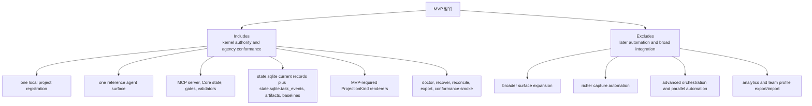

Parallel orchestration automation은 later로 남습니다. MVP는 serial shaping, write checks, close blockers, visibility에 필요할 때만 Change Unit dependency DAG metadata를 저장할 수 있습니다. Parallel lanes를 schedule하거나, concurrent baselines를 isolate하거나, concurrent execution을 reconcile하지 않습니다.

## 단계적 Delivery 해석

구현 순서는 MVP-0부터 MVP-5까지 그대로 유지됩니다. 아래 stage name은 delivery lens이지 새로운 scope label 또는 exit criteria의 대체물이 아닙니다.

| Stage | Existing sequence map | Required proof |
|---|---|---|
| Kernel Smoke | MVP-0부터 early MVP-3 capabilities까지를 가로지르는 selected smoke slice | Project와 Task state, scoped Change Unit, `prepare_write`, durable Write Authorization creation, 해당 authorization을 consume하는 `record_run`, artifact registration, evidence manifest basics, minimal required projection freshness 또는 enqueueing, write authority가 없을 때 blocked writes 또는 runs, evidence 또는 decision requirement가 없을 때 blocked close, basic Core fixture execution. |
| Agency-Hardened MVP | Smoke slice 위에서 remaining MVP-3 exit criteria와 MVP-4, MVP-5를 완료 | Decision Packet quality, approval/Decision Packet/Write Authorization separation, acceptance와 close 전 residual-risk visibility, detached verification independence, Manual QA, stewardship 및 context-hygiene validators, full feedback-loop checks, codebase stewardship coverage, projection/reconcile completeness, recover/export/artifact integrity behavior, later-boundary checks, required agency conformance를 위한 fixture coverage. |

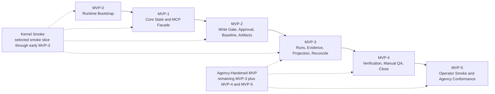

Kernel Smoke는 implementer에게 가장 작은 runnable authority proof를 제공하기 때문에 유용합니다. 하지만 모든 MVP-3 exit criterion을 완료하지 않고, final MVP로 인정될 수 없으며, agency-critical behavior를 later automation으로 defer하지 않습니다. Full feedback-loop checks, codebase stewardship coverage, projection/reconcile completeness, broader fixture coverage는 위 Kernel Smoke proof가 명시적으로 요구하는 경우를 제외하고 final MVP work로 남습니다.

## 구현 순서

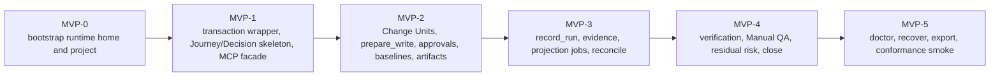

### MVP-0: Runtime Bootstrap

Runtime home을 만들고, 하나의 project를 register하고, `project.yaml`을 만들고, `registry.sqlite`와 `state.sqlite`를 initialize하고, artifact directories를 만들고, cooperative/detective capability profile을 가진 reference surface를 register합니다.

Exit criteria:

- project가 `registry.sqlite.projects`에 나타남
- project-scoped mutation이 `expected_state_version`을 사용할 수 있기 전에 registered project용 `project_state` row가 하나 존재함
- reference surface가 `registry.sqlite.project_surfaces`에 나타남
- project runtime directory가 `project.yaml`, `state.sqlite`, artifact directories를 포함함
- doctor가 project/runtime readiness를 report할 수 있음

### MVP-1: Core State, Journey/Decision Skeleton, MCP Facade

Core transaction wrapper, locks, state version checks, idempotency replay records, read resources, Journey Spine reconstruction, Decision Packet records, `decision_gate` aggregation, `harness.status`, `harness.intake`, `harness.next`를 구현합니다.

Exit criteria:

- active Task absent status가 동작함
- advisor Task가 intake, read-only run, Core를 통한 close를 수행할 수 있음
- Task status가 committed records에서 current Journey/Decision state를 expose할 수 있음
- blocking user judgment가 Decision Packet을 create 또는 associate하고 `decision_gate`를 update할 수 있음
- 모든 state mutation이 current records를 update하고 같은 transaction에서 `state.sqlite.task_events`를 append함

### MVP-2: Shaping Kernel, Write Gate, Approval, Baseline, Artifacts

Change Unit records, Change Unit dependency metadata, gate records, baseline capture, artifact registration, `harness.prepare_write`, Write Authorization records, approval request/decision flow, shaping updates, autonomy boundary fields, minimal changed-path/scope/approval/baseline Core checks와 decision/autonomy validators를 구현합니다.

Exit criteria:

- active scoped Change Unit 없는 product write가 blocked됨
- sensitive dependency 또는 schema change가 approval을 요구함
- active Autonomy Boundary 밖의 intended work가 blocked되거나 Decision Packet으로 route됨
- unresolved 또는 incompatible blocking Decision Packets가 affected writes를 block함
- allowed `prepare_write`가 durable Write Authorization ref를 create하고, idempotent replay는 already committed response를 반환함
- approval scope drift가 approval을 expire 또는 block할 수 있음
- Change Unit shaping이 필요할 때 end-to-end path intent, user-judgment requirements, AFK stop conditions, dependency metadata를 기록함
- raw artifacts가 hash와 redaction metadata와 함께 저장됨

### MVP-3: Runs, Evidence, Feedback Loop, Projection, Reconcile

`harness.record_run`, run records, Write Authorization consumption, evidence manifest records, Feedback Loop support records and checks, codebase stewardship checks, projection jobs, MVP-required TASK/APR/RUN-SUMMARY/EVIDENCE-MANIFEST/DIRECT-RESULT renderers, managed block hashes, managed drift 또는 human-editable proposals를 위한 reconcile item creation을 구현합니다.

Exit criteria:

- implementation과 direct runs가 artifacts를 register하고 evidence를 update함
- implementation과 direct runs가 compatible Write Authorization을 consume하고 authorization 밖의 observed changes를 detect함
- runs, checks, QA inputs, evaluator notes의 findings가 state, evidence, Decision Packet, Change Unit update, close blocker 중 하나로 route됨
- scope, design, module boundaries, user judgment에 영향을 주는 codebase stewardship issues가 validator results 또는 blockers로 visible함
- projection job failure가 state failure와 분리됨
- managed Markdown edits가 state를 mutate하지 않고 reconcile items를 생성함

### MVP-4: Verification, Manual QA, Residual Risk, Close

`harness.launch_verify`, `harness.record_eval`, `harness.record_manual_qa`, `harness.close_task`, verification independence checks, Manual QA aggregation, residual-risk visibility checks, decision gate close checks, close blockers를 구현합니다.

Exit criteria:

- work가 same-session self-review로 `detached_verified` close될 수 없음
- verification waiver는 `detached_verified`가 아니라 `completed_with_risk_accepted`로 close됨
- required Manual QA와 acceptance가 독립적으로 close를 block함
- known close-relevant residual risk가 successful close 전에 항상 visible함
- risk-accepted close에는 accepted Residual Risk refs가 추가로 필요함
- acceptance가 required일 때는 close-relevant residual risk가 visible해진 뒤에만 record할 수 있음
- unresolved, stale, incompatible, deferred-without-coverage blocking Decision Packets가 close를 block함
- direct work는 policy나 사용자가 detached verification을 요청하지 않는 한 self-checked로 close할 수 있음

### MVP-5: Operator Smoke, Agency Conformance, Later-Boundary Checks

Minimal doctor, recover, reconcile, export, artifact integrity check, fixture-based conformance smoke, 그리고 Journey visibility, explicit product judgment, Autonomy Boundary respect, residual-risk visibility에 대한 agency conformance smoke를 구현합니다.

Exit criteria:

- conformance smoke가 no-active-task status, advisor close, direct close, approval-required block, decision-required block, autonomy-boundary block, Write Authorization required 및 invalid cases, evidence-insufficient close block, same-session verification guard, residual-risk visibility, feedback-loop routing, codebase-stewardship finding visibility, projection failure separation, reconcile required, MCP-unavailable write hold를 cover함
- agency conformance checks가 사용자가 Journey를 따라갈 수 있고, unresolved decisions를 볼 수 있고, agent가 asking 없이 무엇을 할 수 있는지 볼 수 있고, acceptance 전에 close-relevant residual risk를 볼 수 있음을 verify함
- parallel orchestration automation은 later로 남음. MVP dependency DAG support가 있더라도 metadata-only임
- export가 state snapshots, report projections, artifact refs, redaction status를 포함함

## Runtime Storage

Reference storage는 registry와 per-project state에 SQLite를 사용합니다. DDL은 draft implementation contract입니다. Field names에 indexes나 migration helpers가 추가될 수 있지만 table ownership과 authority boundaries는 stable해야 합니다.

`task_spine_entries`는 public `journey_spine_entry` records와 Journey Spine Entry wording을 위한 physical MVP table입니다. Public MCP/API naming은 `journey_spine_entry`로 유지하며, table name은 task-local implementation shape를 보존합니다.

이 ER diagram은 아래 DDL relationships의 overview입니다. Relationship labels는 storage links를 설명할 뿐 records를 grant하거나 mutate하는 authority를 뜻하지 않습니다. Exact implementation contract는 SQL DDL입니다.

```mermaid
erDiagram
  projects ||--o{ project_surfaces : registers
  projects ||--o{ connector_manifests : has
  project_surfaces ||--o{ connector_manifests : describes
  projects ||--|| project_state : has
  tasks ||--|| task_gates : has
  tasks ||--o{ change_units : has
  tasks ||--o{ baselines : tracks
  tasks ||--o{ write_authorizations : tracks
  change_units ||--o{ write_authorizations : scopes
  write_authorizations ||--o| runs : consumed_by
  tasks ||--o{ runs : has
  tasks ||--o{ approvals : tracks
  decision_packets ||--o{ approvals : links
  tasks ||--o{ decision_packets : has
  tasks ||--o{ residual_risks : tracks
  decision_packets ||--o{ residual_risks : links
  tasks ||--o{ shared_designs : tracks
  tasks ||--o{ task_spine_entries : has
  change_units ||--o{ change_unit_dependencies : depends
  tasks ||--o{ evidence_manifests : has
  tasks ||--o{ evals : has
  tasks ||--o{ manual_qa_records : has
  decision_packets ||--o{ manual_qa_records : links
  tasks ||--o{ artifacts : links
  artifacts ||--o{ artifact_links : links
  tasks ||--o{ task_events : has
  tasks ||--o{ projection_jobs : tracks
  tasks ||--o{ reconcile_items : tracks
  tasks ||--o{ feedback_loops : has
  tasks ||--o{ tdd_traces : has
  tasks ||--o{ validator_runs : has
```

### JSON Field Validation Boundary

Reference DDL의 JSON `TEXT` column은 MVP storage flexibility이지 arbitrary JSON이나 partially parsed JSON을 persist해도 된다는 뜻이 아닙니다. Core commit이 JSON `TEXT` field를 write 또는 update하기 전에 Core는 값을 parse하고, malformed JSON을 reject하며, parsed value를 해당 field의 owning shape에 맞게 validate해야 합니다.

Public API payload와 API-shaped stored payload의 owning shape는 [MCP API와 스키마](05-mcp-api-and-schemas.md)의 schema입니다. Storage-only field의 owning shape는 이 문서의 reference storage contract 또는 이 문서가 named하는 specific owner document입니다. 이 boundary는 public schemas를 `05-mcp-api-and-schemas.md`에, SQLite DDL을 `06-reference-mvp.md`에 유지합니다.

Malformed JSON은 invalid state입니다. Schema-incompatible JSON도 invalid state입니다. `'[]'` 또는 `'{}'` 같은 default를 가진 field는 SQLite가 column을 `TEXT`로 저장한다는 이유만으로 다른 JSON kind를 저장하면 안 되며, expected array 또는 object shape의 valid JSON을 계속 저장해야 합니다.

Recommended hardening: 배포된 SQLite build가 JSON functions를 지원하는 경우 migration은 JSON `TEXT` column에 `CHECK (json_valid(column_name))` 또는 equivalent generated checks를 추가해야 합니다. 이 checks는 defense in depth이며 Core의 before-commit shape validation을 대체하지 않습니다. 아래 MVP DDL은 모든 check를 inline으로 보여 주기 위해 full rewrite될 필요가 없습니다.

### Canonical Enum Hardening

Canonical enum column은 reference DDL에서 readability를 위해 `TEXT`를 사용하지만 open string이 아닙니다. Core validation이 authoritative입니다. Database checks, lookup-table validation, generated checks, migration assertions는 defense in depth이며, write, close, replay, projection behavior를 좌우하는 state fields부터 적용해야 합니다.

Minimum enum hardening targets:

| Field(s) | Values to harden |
| --- | --- |
| `tasks.mode` | `advisor`, `direct`, `work` |
| `tasks.lifecycle_phase` | `intake`, `shaping`, `ready`, `executing`, `verifying`, `qa`, `waiting_user`, `blocked`, `completed`, `cancelled` |
| `tasks.result` | `none`, `advice_only`, `passed`, `failed`, `cancelled` |
| `tasks.close_reason` | `none`, `completed_verified`, `completed_self_checked`, `completed_with_risk_accepted`, `cancelled`, `superseded` |
| `tasks.assurance_level` | `none`, `self_checked`, `detached_verified` |
| `tasks.projection_status` | `current`, `stale`, `failed`, `unknown` |
| `task_gates.scope_gate` | `not_required`, `required`, `pending`, `passed`, `failed`, `blocked` |
| `task_gates.decision_gate` | `not_required`, `required`, `pending`, `resolved`, `deferred`, `blocked` |
| `task_gates.approval_gate` | `not_required`, `required`, `pending`, `granted`, `denied`, `expired` |
| `task_gates.design_gate` | `not_required`, `required`, `pending`, `passed`, `partial`, `waived`, `stale`, `blocked` |
| `task_gates.evidence_gate` | `not_required`, `none`, `partial`, `sufficient`, `stale`, `blocked` |
| `task_gates.verification_gate` | `not_required`, `required`, `pending`, `passed`, `failed`, `waived_by_user`, `blocked` |
| `task_gates.qa_gate` | `not_required`, `required`, `pending`, `passed`, `failed`, `waived` |
| `task_gates.acceptance_gate` | `not_required`, `required`, `pending`, `accepted`, `rejected` |
| `write_authorizations.status` | `allowed`, `consumed`, `expired`, `stale`, `revoked` |
| `decision_packets.status` | `proposed`, `pending_user`, `resolved`, `deferred`, `rejected`, `blocked`, `superseded` |
| `manual_qa_records.result` | `passed`, `failed`, `waived` |
| `evals.verdict` | `passed`, `failed`, `blocked`, `inconclusive` |
| `projection_jobs.status` | `pending`, `running`, `completed`, `failed`, `skipped` |

New table 또는 rebuild migration에서는 representative inline hardening으로 `status TEXT NOT NULL CHECK (status IN (...))`를 사용할 수 있습니다. Existing SQLite tables는 table rebuild, Core가 commit 전에 확인하는 small lookup table, 또는 tightening 전에 unknown values를 reject하는 migration-time assertion이 필요할 수 있습니다. Owner enum이 finalized되는 대로 같은 pattern을 다른 status-like state fields에도 적용합니다. 특히 `approvals.status`, `runs.kind`, `runs.status`, `evidence_manifests.status`, `residual_risks.visibility_status`, `residual_risks.status`, `reconcile_items.status`, `validator_runs.status`, `validator_runs.guarantee_level`, design-quality status columns가 대상입니다. Database-only enum values를 만들지 말고 storage hardening은 kernel/API owner enum에 묶어야 합니다.

### `project.yaml`

`project.yaml`은 static project configuration만 저장합니다. Current Task state를 저장하면 안 됩니다.

```yaml
project_id: PRJ-0001
display_name: my-app
repo_root: /abs/path/to/my-app
default_agent_surface: reference

agent_surfaces:
  reference:
    enabled: true
    capability_profile_id: SURF-PROFILE-0001

default_checks:
  lint: []
  test: []
  build: []

design_quality:
  vertical_slice_default: true
  tdd_required_for: []
  manual_qa_default_for: []

network_policy:
  default_write: deny
  allowed_read_domains: []
  allowed_write_targets: []

secret_policy:
  env_allowlist: []
  allow_secret_access_without_approval: false
```

### `registry.sqlite`

```sql
CREATE TABLE projects (
  project_id TEXT PRIMARY KEY,
  display_name TEXT NOT NULL,
  repo_root TEXT NOT NULL,
  repo_fingerprint TEXT NOT NULL,
  runtime_path TEXT NOT NULL,
  project_yaml_path TEXT NOT NULL,
  created_at TEXT NOT NULL,
  updated_at TEXT NOT NULL
);

CREATE TABLE project_surfaces (
  surface_id TEXT PRIMARY KEY,
  project_id TEXT NOT NULL REFERENCES projects(project_id),
  surface_kind TEXT NOT NULL,
  display_name TEXT NOT NULL,
  capability_profile_id TEXT NOT NULL,
  guarantee_level TEXT NOT NULL,
  enabled INTEGER NOT NULL DEFAULT 1,
  mcp_config_ref TEXT,
  last_seen_at TEXT,
  created_at TEXT NOT NULL,
  updated_at TEXT NOT NULL
);

CREATE TABLE connector_manifests (
  manifest_id TEXT PRIMARY KEY,
  project_id TEXT NOT NULL REFERENCES projects(project_id),
  surface_id TEXT NOT NULL REFERENCES project_surfaces(surface_id),
  manifest_version INTEGER NOT NULL,
  generated_paths_json TEXT NOT NULL,
  managed_hash TEXT NOT NULL,
  capability_profile_json TEXT NOT NULL,
  status TEXT NOT NULL,
  created_at TEXT NOT NULL,
  updated_at TEXT NOT NULL
);
```

### `state.sqlite`

```sql
CREATE TABLE project_state (
  project_id TEXT PRIMARY KEY,
  state_version INTEGER NOT NULL,
  updated_at TEXT NOT NULL
);

CREATE TABLE tasks (
  task_id TEXT PRIMARY KEY,
  state_version INTEGER NOT NULL,
  mode TEXT NOT NULL,
  lifecycle_phase TEXT NOT NULL,
  result TEXT NOT NULL,
  close_reason TEXT NOT NULL,
  assurance_level TEXT NOT NULL,
  title TEXT NOT NULL,
  current_summary TEXT NOT NULL DEFAULT '',
  acceptance_criteria_json TEXT NOT NULL DEFAULT '[]',
  active_change_unit_id TEXT,
  active_run_id TEXT,
  latest_evidence_manifest_id TEXT,
  latest_eval_id TEXT,
  latest_manual_qa_record_id TEXT,
  projection_version INTEGER NOT NULL DEFAULT 0,
  projected_version INTEGER NOT NULL DEFAULT 0,
  projection_status TEXT NOT NULL DEFAULT 'unknown',
  created_at TEXT NOT NULL,
  updated_at TEXT NOT NULL
);

CREATE TABLE task_gates (
  task_id TEXT PRIMARY KEY REFERENCES tasks(task_id),
  scope_gate TEXT NOT NULL,
  decision_gate TEXT NOT NULL,
  approval_gate TEXT NOT NULL,
  design_gate TEXT NOT NULL,
  evidence_gate TEXT NOT NULL,
  verification_gate TEXT NOT NULL,
  qa_gate TEXT NOT NULL,
  acceptance_gate TEXT NOT NULL,
  waiver_json TEXT NOT NULL DEFAULT '{}',
  updated_at TEXT NOT NULL
);

CREATE TABLE change_units (
  change_unit_id TEXT PRIMARY KEY,
  task_id TEXT NOT NULL REFERENCES tasks(task_id),
  title TEXT NOT NULL,
  purpose TEXT NOT NULL,
  non_goals_json TEXT NOT NULL DEFAULT '[]',
  slice_type TEXT NOT NULL,
  autonomy_profile TEXT NOT NULL,
  agent_may_do_json TEXT NOT NULL DEFAULT '[]',
  user_judgment_required_json TEXT NOT NULL DEFAULT '[]',
  afk_stop_conditions_json TEXT NOT NULL DEFAULT '[]',
  end_to_end_path_json TEXT NOT NULL DEFAULT '{}',
  horizontal_exception_reason TEXT,
  follow_up_vertical_change_unit_id TEXT,
  allowed_paths_json TEXT NOT NULL DEFAULT '[]',
  allowed_tools_json TEXT NOT NULL DEFAULT '[]',
  allowed_commands_json TEXT NOT NULL DEFAULT '[]',
  allowed_network_json TEXT NOT NULL DEFAULT '[]',
  secret_scope_json TEXT NOT NULL DEFAULT '[]',
  sensitive_categories_json TEXT NOT NULL DEFAULT '[]',
  validator_profile_json TEXT NOT NULL DEFAULT '[]',
  completion_conditions_json TEXT NOT NULL DEFAULT '[]',
  evaluator_focus_json TEXT NOT NULL DEFAULT '[]',
  status TEXT NOT NULL,
  created_at TEXT NOT NULL,
  updated_at TEXT NOT NULL
);

CREATE TABLE baselines (
  baseline_ref TEXT PRIMARY KEY,
  task_id TEXT NOT NULL REFERENCES tasks(task_id),
  change_unit_id TEXT,
  repo_head TEXT NOT NULL,
  branch TEXT NOT NULL,
  dirty INTEGER NOT NULL,
  tree_hash TEXT NOT NULL,
  included_paths_json TEXT NOT NULL DEFAULT '[]',
  ignored_paths_json TEXT NOT NULL DEFAULT '[]',
  diff_artifact_id TEXT REFERENCES artifacts(artifact_id),
  status TEXT NOT NULL,
  created_at TEXT NOT NULL,
  updated_at TEXT NOT NULL
);

CREATE TABLE write_authorizations (
  write_authorization_id TEXT PRIMARY KEY,
  task_id TEXT NOT NULL REFERENCES tasks(task_id),
  change_unit_id TEXT NOT NULL REFERENCES change_units(change_unit_id),
  basis_state_version INTEGER NOT NULL,
  baseline_ref TEXT REFERENCES baselines(baseline_ref),
  intended_operation TEXT NOT NULL,
  intended_paths_json TEXT NOT NULL DEFAULT '[]',
  intended_tools_json TEXT NOT NULL DEFAULT '[]',
  intended_commands_json TEXT NOT NULL DEFAULT '[]',
  intended_network_json TEXT NOT NULL DEFAULT '[]',
  intended_secrets_json TEXT NOT NULL DEFAULT '[]',
  sensitive_categories_json TEXT NOT NULL DEFAULT '[]',
  approval_refs_json TEXT NOT NULL DEFAULT '[]',
  decision_packet_refs_json TEXT NOT NULL DEFAULT '[]',
  guarantee_level TEXT NOT NULL,
  status TEXT NOT NULL,
  created_at TEXT NOT NULL,
  updated_at TEXT NOT NULL,
  expires_at TEXT,
  consumed_by_run_id TEXT,
  consumed_at TEXT
);

CREATE TABLE runs (
  run_id TEXT PRIMARY KEY,
  task_id TEXT NOT NULL REFERENCES tasks(task_id),
  change_unit_id TEXT,
  kind TEXT NOT NULL,
  actor_kind TEXT NOT NULL,
  surface_id TEXT NOT NULL,
  baseline_ref TEXT,
  write_authorization_id TEXT REFERENCES write_authorizations(write_authorization_id),
  summary TEXT NOT NULL DEFAULT '',
  observed_changes_json TEXT NOT NULL DEFAULT '{}',
  command_results_json TEXT NOT NULL DEFAULT '[]',
  artifact_refs_json TEXT NOT NULL DEFAULT '[]',
  status TEXT NOT NULL,
  started_at TEXT NOT NULL,
  completed_at TEXT
);

CREATE TABLE approvals (
  approval_id TEXT PRIMARY KEY,
  task_id TEXT NOT NULL REFERENCES tasks(task_id),
  change_unit_id TEXT,
  -- Optional compatibility ref; decision_requests를 생략하면 null로 둡니다.
  decision_request_id TEXT,
  decision_packet_id TEXT REFERENCES decision_packets(decision_packet_id),
  status TEXT NOT NULL,
  sensitive_categories_json TEXT NOT NULL DEFAULT '[]',
  allowed_paths_json TEXT NOT NULL DEFAULT '[]',
  allowed_tools_json TEXT NOT NULL DEFAULT '[]',
  allowed_commands_json TEXT NOT NULL DEFAULT '[]',
  allowed_network_targets_json TEXT NOT NULL DEFAULT '[]',
  secret_scope_json TEXT NOT NULL DEFAULT '[]',
  baseline_ref TEXT,
  expires_at TEXT,
  decision_note TEXT,
  created_at TEXT NOT NULL,
  decided_at TEXT
);

-- Optional compatibility/routing table: routing, interaction, replay, legacy handoff metadata only.
-- Minimal MVP implementations may omit this table.
-- decision_packet_id는 routing/replay staging 동안 null일 수 있으며, unlinked rows는 non-authoritative입니다.
-- Gate aggregation은 linked compatible decision_packet_id를 통해서만 row를 고려할 수 있습니다.
CREATE TABLE decision_requests (
  decision_request_id TEXT PRIMARY KEY,
  decision_packet_id TEXT REFERENCES decision_packets(decision_packet_id),
  task_id TEXT NOT NULL REFERENCES tasks(task_id),
  change_unit_id TEXT,
  decision_kind TEXT NOT NULL,
  status TEXT NOT NULL,
  prompt TEXT NOT NULL,
  options_json TEXT NOT NULL DEFAULT '[]',
  recommendation TEXT,
  approval_scope_json TEXT NOT NULL DEFAULT '{}',
  reconcile_item_id TEXT,
  expires_at TEXT,
  decided_option_id TEXT,
  decision_json TEXT NOT NULL DEFAULT '{}',
  note TEXT,
  waiver_reason TEXT,
  created_at TEXT NOT NULL,
  decided_at TEXT
);

CREATE TABLE decision_packets (
  decision_packet_id TEXT PRIMARY KEY,
  task_id TEXT NOT NULL REFERENCES tasks(task_id),
  change_unit_id TEXT,
  -- Optional compatibility ref; decision_requests를 생략하면 null로 둡니다.
  decision_request_id TEXT,
  decision_kind TEXT NOT NULL,
  status TEXT NOT NULL,
  question TEXT NOT NULL,
  options_json TEXT NOT NULL DEFAULT '[]',
  recommendation_json TEXT NOT NULL DEFAULT '{}',
  affected_scope_json TEXT NOT NULL DEFAULT '{}',
  autonomy_boundary_json TEXT NOT NULL DEFAULT '{}',
  context_refs_json TEXT NOT NULL DEFAULT '[]',
  context_artifact_refs_json TEXT NOT NULL DEFAULT '[]',
  residual_risk_refs_json TEXT NOT NULL DEFAULT '[]',
  decision_json TEXT NOT NULL DEFAULT '{}',
  superseded_by_decision_packet_id TEXT,
  created_at TEXT NOT NULL,
  updated_at TEXT NOT NULL,
  decided_at TEXT
);

CREATE TABLE residual_risks (
  residual_risk_id TEXT PRIMARY KEY,
  task_id TEXT NOT NULL REFERENCES tasks(task_id),
  change_unit_id TEXT,
  source_record_kind TEXT NOT NULL,
  source_record_id TEXT NOT NULL,
  related_decision_packet_id TEXT REFERENCES decision_packets(decision_packet_id),
  affected_scope_json TEXT NOT NULL DEFAULT '{}',
  affected_acceptance_criteria_json TEXT NOT NULL DEFAULT '[]',
  visibility_status TEXT NOT NULL,
  accepted_risk_json TEXT NOT NULL DEFAULT '{}',
  follow_up_requirement_json TEXT NOT NULL DEFAULT '{}',
  close_impact TEXT NOT NULL,
  status TEXT NOT NULL,
  created_at TEXT NOT NULL,
  updated_at TEXT NOT NULL,
  accepted_at TEXT
);

CREATE TABLE shared_designs (
  shared_design_id TEXT PRIMARY KEY,
  task_id TEXT REFERENCES tasks(task_id),
  change_unit_id TEXT,
  first_change_unit_id TEXT REFERENCES change_units(change_unit_id),
  title TEXT NOT NULL,
  design_kind TEXT NOT NULL,
  goal TEXT NOT NULL,
  non_goals_json TEXT NOT NULL DEFAULT '[]',
  acceptance_criteria_json TEXT NOT NULL DEFAULT '[]',
  status TEXT NOT NULL,
  scope_json TEXT NOT NULL DEFAULT '{}',
  assumptions_json TEXT NOT NULL DEFAULT '[]',
  resolved_questions_json TEXT NOT NULL DEFAULT '[]',
  domain_impact_refs_json TEXT NOT NULL DEFAULT '[]',
  module_impact_refs_json TEXT NOT NULL DEFAULT '[]',
  interface_impact_refs_json TEXT NOT NULL DEFAULT '[]',
  options_json TEXT NOT NULL DEFAULT '[]',
  selected_option_json TEXT NOT NULL DEFAULT '{}',
  rejected_options_json TEXT NOT NULL DEFAULT '[]',
  decision_packet_refs_json TEXT NOT NULL DEFAULT '[]',
  artifact_refs_json TEXT NOT NULL DEFAULT '[]',
  created_at TEXT NOT NULL,
  updated_at TEXT NOT NULL
);

CREATE TABLE task_spine_entries (
  task_spine_entry_id TEXT PRIMARY KEY,
  task_id TEXT NOT NULL REFERENCES tasks(task_id),
  change_unit_id TEXT,
  sequence_no INTEGER NOT NULL,
  entry_kind TEXT NOT NULL,
  lifecycle_phase TEXT,
  actor_kind TEXT NOT NULL,
  source_record_kind TEXT,
  source_record_id TEXT,
  summary TEXT NOT NULL DEFAULT '',
  refs_json TEXT NOT NULL DEFAULT '[]',
  artifact_refs_json TEXT NOT NULL DEFAULT '[]',
  status TEXT NOT NULL,
  created_at TEXT NOT NULL,
  updated_at TEXT NOT NULL,
  UNIQUE(task_id, sequence_no)
);

CREATE TABLE change_unit_dependencies (
  change_unit_dependency_id TEXT PRIMARY KEY,
  task_id TEXT NOT NULL REFERENCES tasks(task_id),
  change_unit_id TEXT NOT NULL REFERENCES change_units(change_unit_id),
  depends_on_change_unit_id TEXT NOT NULL REFERENCES change_units(change_unit_id),
  dependency_kind TEXT NOT NULL,
  status TEXT NOT NULL,
  merge_risk TEXT NOT NULL,
  visibility_note TEXT NOT NULL DEFAULT '',
  close_impact TEXT NOT NULL,
  rationale TEXT NOT NULL DEFAULT '',
  created_at TEXT NOT NULL,
  updated_at TEXT NOT NULL
);

CREATE TABLE evidence_manifests (
  evidence_manifest_id TEXT PRIMARY KEY,
  task_id TEXT NOT NULL REFERENCES tasks(task_id),
  change_unit_id TEXT,
  baseline_ref TEXT,
  criteria_json TEXT NOT NULL DEFAULT '[]',
  changed_files_json TEXT NOT NULL DEFAULT '[]',
  supporting_refs_json TEXT NOT NULL DEFAULT '[]',
  stale_if_json TEXT NOT NULL DEFAULT '[]',
  status TEXT NOT NULL,
  created_at TEXT NOT NULL,
  updated_at TEXT NOT NULL
);

CREATE TABLE evals (
  eval_id TEXT PRIMARY KEY,
  task_id TEXT NOT NULL REFERENCES tasks(task_id),
  change_unit_id TEXT,
  evaluator_run_id TEXT,
  target_run_id TEXT,
  verdict TEXT NOT NULL,
  checks_json TEXT NOT NULL DEFAULT '[]',
  evidence_reviewed_json TEXT NOT NULL DEFAULT '[]',
  independence_json TEXT NOT NULL DEFAULT '{}',
  blockers_json TEXT NOT NULL DEFAULT '[]',
  artifact_refs_json TEXT NOT NULL DEFAULT '[]',
  created_at TEXT NOT NULL
);

CREATE TABLE manual_qa_records (
  manual_qa_record_id TEXT PRIMARY KEY,
  task_id TEXT NOT NULL REFERENCES tasks(task_id),
  change_unit_id TEXT,
  qa_profile TEXT NOT NULL,
  performed_by TEXT NOT NULL,
  result TEXT NOT NULL,
  findings_json TEXT NOT NULL DEFAULT '[]',
  artifact_refs_json TEXT NOT NULL DEFAULT '[]',
  waiver_reason TEXT,
  waiver_decision_packet_id TEXT REFERENCES decision_packets(decision_packet_id),
  residual_risk_refs_json TEXT NOT NULL DEFAULT '[]',
  next_action TEXT NOT NULL,
  created_at TEXT NOT NULL
);

CREATE TABLE artifacts (
  artifact_id TEXT PRIMARY KEY,
  task_id TEXT NOT NULL REFERENCES tasks(task_id),
  run_id TEXT,
  kind TEXT NOT NULL,
  relative_path TEXT NOT NULL,
  sha256 TEXT NOT NULL,
  size_bytes INTEGER NOT NULL,
  content_type TEXT NOT NULL,
  redaction_state TEXT NOT NULL,
  produced_by TEXT NOT NULL,
  retention_class TEXT NOT NULL,
  created_at TEXT NOT NULL
);

CREATE TABLE artifact_links (
  artifact_link_id TEXT PRIMARY KEY,
  artifact_id TEXT NOT NULL REFERENCES artifacts(artifact_id),
  task_id TEXT NOT NULL REFERENCES tasks(task_id),
  record_kind TEXT NOT NULL,
  record_id TEXT NOT NULL,
  relation_kind TEXT NOT NULL,
  created_at TEXT NOT NULL
);

CREATE TABLE task_events (
  event_id TEXT PRIMARY KEY,
  event_seq INTEGER NOT NULL UNIQUE,
  task_id TEXT,
  state_version INTEGER NOT NULL,
  event_type TEXT NOT NULL,
  actor_kind TEXT NOT NULL,
  surface_id TEXT,
  request_id TEXT,
  idempotency_key TEXT,
  payload_json TEXT NOT NULL DEFAULT '{}',
  created_at TEXT NOT NULL
);

CREATE TABLE tool_invocations (
  invocation_id TEXT PRIMARY KEY,
  project_id TEXT NOT NULL,
  task_id TEXT,
  tool_name TEXT NOT NULL,
  request_id TEXT NOT NULL,
  idempotency_key TEXT NOT NULL,
  request_hash TEXT NOT NULL,
  response_json TEXT NOT NULL DEFAULT '{}',
  state_version INTEGER NOT NULL,
  status TEXT NOT NULL,
  created_at TEXT NOT NULL,
  completed_at TEXT,
  UNIQUE(project_id, tool_name, idempotency_key)
);

CREATE TABLE projection_jobs (
  projection_job_id TEXT PRIMARY KEY,
  task_id TEXT,
  projection_kind TEXT NOT NULL,
  target_ref TEXT NOT NULL,
  projection_version INTEGER NOT NULL,
  source_state_version INTEGER,
  status TEXT NOT NULL,
  attempts INTEGER NOT NULL DEFAULT 0,
  output_path TEXT,
  managed_hash TEXT,
  error_json TEXT NOT NULL DEFAULT '{}',
  created_at TEXT NOT NULL,
  updated_at TEXT NOT NULL
);

CREATE TABLE reconcile_items (
  reconcile_item_id TEXT PRIMARY KEY,
  task_id TEXT,
  source_kind TEXT NOT NULL,
  source_path TEXT,
  source_hash TEXT,
  target_record_kind TEXT,
  target_record_id TEXT,
  proposed_change_json TEXT NOT NULL DEFAULT '{}',
  status TEXT NOT NULL,
  decision_json TEXT NOT NULL DEFAULT '{}',
  created_at TEXT NOT NULL,
  resolved_at TEXT
);

CREATE TABLE domain_terms (
  domain_term_id TEXT PRIMARY KEY,
  term TEXT NOT NULL,
  meaning TEXT NOT NULL,
  code_representation TEXT,
  not_this_json TEXT NOT NULL DEFAULT '[]',
  related_terms_json TEXT NOT NULL DEFAULT '[]',
  source_ref TEXT,
  status TEXT NOT NULL,
  created_at TEXT NOT NULL,
  updated_at TEXT NOT NULL
);

CREATE TABLE module_map_items (
  module_map_item_id TEXT PRIMARY KEY,
  module_path TEXT NOT NULL,
  responsibility TEXT NOT NULL,
  public_interface_json TEXT NOT NULL DEFAULT '[]',
  dependencies_json TEXT NOT NULL DEFAULT '[]',
  test_boundary TEXT,
  status TEXT NOT NULL,
  created_at TEXT NOT NULL,
  updated_at TEXT NOT NULL
);

CREATE TABLE interface_contracts (
  interface_contract_id TEXT PRIMARY KEY,
  name TEXT NOT NULL,
  owner_module TEXT NOT NULL,
  change_type TEXT NOT NULL,
  inputs_json TEXT NOT NULL DEFAULT '[]',
  outputs_json TEXT NOT NULL DEFAULT '[]',
  errors_json TEXT NOT NULL DEFAULT '[]',
  compatibility_impact TEXT NOT NULL,
  callers_impacted_json TEXT NOT NULL DEFAULT '[]',
  boundary_tests_json TEXT NOT NULL DEFAULT '[]',
  review_status TEXT NOT NULL,
  created_at TEXT NOT NULL,
  updated_at TEXT NOT NULL
);

CREATE TABLE feedback_loops (
  feedback_loop_id TEXT PRIMARY KEY,
  task_id TEXT NOT NULL REFERENCES tasks(task_id),
  change_unit_id TEXT,
  loop_kind TEXT NOT NULL,
  loop_profile TEXT NOT NULL,
  planned_loop TEXT NOT NULL,
  selected_loop_refs_json TEXT NOT NULL DEFAULT '[]',
  execution_refs_json TEXT NOT NULL DEFAULT '[]',
  artifact_refs_json TEXT NOT NULL DEFAULT '[]',
  tdd_trace_refs_json TEXT NOT NULL DEFAULT '[]',
  manual_qa_record_refs_json TEXT NOT NULL DEFAULT '[]',
  evidence_manifest_refs_json TEXT NOT NULL DEFAULT '[]',
  status TEXT NOT NULL,
  waiver_reason TEXT,
  alternate_loop TEXT,
  created_at TEXT NOT NULL,
  updated_at TEXT NOT NULL
);

CREATE TABLE tdd_traces (
  tdd_trace_id TEXT PRIMARY KEY,
  task_id TEXT NOT NULL REFERENCES tasks(task_id),
  change_unit_id TEXT,
  status TEXT NOT NULL,
  red_refs_json TEXT NOT NULL DEFAULT '[]',
  green_refs_json TEXT NOT NULL DEFAULT '[]',
  refactor_refs_json TEXT NOT NULL DEFAULT '[]',
  non_tdd_justification TEXT,
  artifact_refs_json TEXT NOT NULL DEFAULT '[]',
  created_at TEXT NOT NULL,
  updated_at TEXT NOT NULL
);

CREATE TABLE validator_runs (
  validator_run_id TEXT PRIMARY KEY,
  task_id TEXT,
  change_unit_id TEXT,
  run_id TEXT,
  validator_id TEXT NOT NULL,
  validator_kind TEXT NOT NULL,
  status TEXT NOT NULL,
  guarantee_level TEXT NOT NULL,
  findings_json TEXT NOT NULL DEFAULT '[]',
  blocked_reasons_json TEXT NOT NULL DEFAULT '[]',
  created_at TEXT NOT NULL
);

CREATE TABLE locks (
  lock_id TEXT PRIMARY KEY,
  scope TEXT NOT NULL,
  owner TEXT NOT NULL,
  acquired_at TEXT NOT NULL,
  expires_at TEXT NOT NULL,
  heartbeat_at TEXT NOT NULL
);
```

`project_state.state_version`은 project-scoped state clock입니다. Core는 runtime bootstrap 중 registered project를 위한 `project_state` row를 정확히 하나 initialize하며, 이는 어떤 project-scoped mutation이 `expected_state_version`을 `project_state.state_version`과 비교하기 전이어야 합니다.

`tasks.state_version`은 task-scoped state clock입니다. Task-scoped mutations는 `expected_state_version`을 Core-resolved primary Task의 `tasks.state_version`과 비교하고, resolved primary Task가 없는 project-scoped mutations는 `project_state.state_version`과 비교합니다.

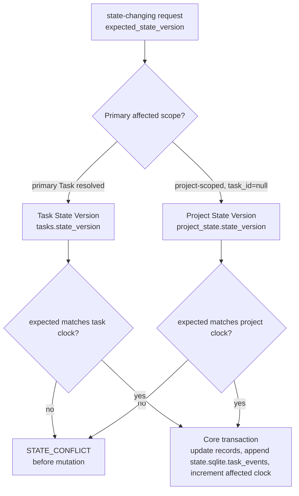

`task_events`는 `state.sqlite` 안의 append-only event history로 남습니다. MVP는 별도의 event store를 도입하지 않습니다. `task_events.event_seq`는 database 안 모든 events의 deterministic global append sequence입니다. Core는 state change와 같은 write transaction 안에서 이를 allocate하며, Journey reconstruction, API event lists, conformance ordering은 timestamps가 아니라 ascending `event_seq`를 사용합니다. `task_events.state_version`은 affected scope의 resulting version을 기록합니다. Task events에서는 `tasks.state_version`이고, `task_id=null`인 project-level events에서는 `project_state.state_version`입니다. 여러 events가 같은 affected-scope `state_version`을 공유할 수 있지만 `event_seq`가 여전히 순서를 정의합니다.

`tool_invocations`는 original committed response를 반환하는 데 필요한 request replay metadata를 저장합니다. Committed non-dry-run tool calls만 `tool_invocations`를 create 또는 update합니다. `dry_run=true`는 replay row를 만들지 않고 authoritative replay를 위한 idempotency key를 consume하지 않습니다. 구현이 non-authoritative diagnostics를 보관하더라도 `tool_invocations`에 저장하거나 state-changing responses replay에 사용하면 안 됩니다. `tool_invocations.request_hash`는 MCP API idempotency rules가 정의한 canonical request hash를 저장합니다. 즉 canonical JSON, UTF-8, `tool_name`, schema-normalized request body와 optional fields, sorted object keys, schema가 명시적으로 order-insignificant라고 하지 않는 한 schema-ordered arrays, NFC Unicode strings, 그리고 `request_id`와 `idempotency_key`만 제외하는 envelope coverage를 사용합니다. `tool_invocations.state_version`은 `ToolResponseBase.state_version`에 반환되는 것과 같은 primary affected-scope version을 저장합니다. Core가 primary Task를 resolve하면 Task State Version이고, 그렇지 않으면 Project State Version입니다. 다른 `request_hash`로 idempotency key를 reuse하면 `STATE_CONFLICT`를 반환합니다.

`tasks.projection_version`은 older TASK render가 newer render를 replace하지 못하게 하는 TASK projection/template/job version입니다. State clock이 아닙니다. `tasks.projected_version`은 retained되는 경우 TASK projection summary의 last rendered source state version cache일 뿐입니다. 모든 task-related `ProjectionKind`의 storage location으로 취급하면 안 됩니다.

`tasks.projection_status`는 TASK projection status summary입니다. Per-kind projection freshness는 `projection_jobs.source_state_version`, job status, managed hashes, relevant projection records 또는 artifact refs를 통해 tracked됩니다.

이 tracking에는 MVP-required `APR`, `RUN-SUMMARY`, `EVIDENCE-MANIFEST`, `EVAL`, `DIRECT-RESULT`; MVP-optional `MANUAL-QA`, `TDD-TRACE`, `DOMAIN-LANGUAGE`, `MODULE-MAP`, `INTERFACE-CONTRACT`; 그리고 enabled extension / appendix kinds인 `DEC`, `DESIGN`, `EXPORT`, `JOURNEY-CARD`가 포함됩니다. `APR` freshness는 committed Approval records와 그 approval-shaped Decision Packets에서 시작하며, non-mutating `approval_request_candidate` payload에서 시작하지 않습니다. 하나의 Task field가 모든 projection freshness를 소유한다고 취급하면 안 됩니다.

`write_authorizations`는 durable `prepare_write` allow decisions를 저장합니다. Allow/block contract는 [Kernel `prepare_write` State Logic](03-kernel-spec.md#prepare_write-state-logic)이 담당하고, public response shape는 [`harness.prepare_write`](05-mcp-api-and-schemas.md#harnessprepare_write)가 담당합니다. Storage-specific requirements는 distinct committed non-dry-run allowed request마다 distinct row를 insert하고, idempotent return은 같은 idempotency key, request hash, compatible basis를 가진 same committed request replay에만 사용하며, `basis_state_version`이 compatibility basis로 사용된 affected-scope state version을 저장하고, authorization status가 바뀔 때마다 `updated_at`을 변경하며, status history를 `task_events`에 남기는 것입니다.

Stored `write_authorizations` rows는 conformance fixture seeds에서 insert되는 rows를 포함해 non-null `basis_state_version`을 요구합니다. Fixture runner는 insert 전에 seeded affected-scope state version에서 이 field를 derive할 수 있지만, stored row는 여전히 이 값을 포함해야 하며 이를 post-transaction `ToolResponseBase.state_version`으로 취급하면 안 됩니다.

`record_run` consumption은 `write_authorizations.consumed_by_run_id`와 `runs.write_authorization_id` reciprocal links를 한 Core transaction 안에서 set하여 저장합니다. `runs.write_authorization_id`의 unique partial index는 committed Runs에 대한 storage single-use를 enforce합니다. Idempotent replay는 다른 Run row를 insert하지 않고 original Run과 response metadata를 반환합니다. Invalid, stale, missing, consumed, scope-exceeded authorization을 attempt한 Run은 `runs.write_authorization_id`를 비워 둡니다. Attempted refs는 audit를 위해 validator findings, run violation payload, `task_events.payload_json`에 남길 수 있습니다. Kernel-owned close/evidence consequences는 [Kernel `record_run` State Logic](03-kernel-spec.md#record_run-state-logic)에 둡니다.

`decision_packets`는 Decision Packet state records를 저장합니다. `decision_requests`는 implementation handoff, replay, legacy request flow를 위한 optional interaction/routing compatibility table이며, minimal MVP 구현은 그 optional indexes와 nullable compatibility fields까지 함께 생략할 수 있습니다. 유지한다면 unlinked `decision_requests` rows는 non-authoritative routing metadata로 남고, approval links는 `approvals.decision_packet_id`를 사용하며, gate aggregation은 linked compatible `decision_packet_id`를 통해서만 `decision_requests`를 고려해야 합니다. Decision gate와 approval/acceptance/risk authority rules는 [Kernel Decision Gate](03-kernel-spec.md#decision-gate)와 [05-mcp-api-and-schemas.md](05-mcp-api-and-schemas.md#public-tools)의 related public tools가 담당합니다.

`residual_risks`는 residual-risk rows를 저장합니다. MVP accepted-risk identity는 `residual_risk_id`이며, 별도의 `accepted_risks` table이나 `ARISK-*` canonical record는 없습니다. Accepted-risk metadata/state는 `residual_risks.accepted_risk_json`, `status`, `accepted_at`에 남고, Decision Packets는 `decision_packets.residual_risk_refs_json`을 통해 rows를 reference할 수 있습니다. Visibility와 close semantics는 [Close Semantics](03-kernel-spec.md#close-semantics)에 둡니다.

MVP final acceptance에는 `acceptance_records` table이 없습니다. Acceptance는 Decision Packet path, `task_gates.acceptance_gate`, `state.sqlite.task_events`를 통해 저장됩니다. Transition과 payload rules는 [Kernel `close_task` State Logic](03-kernel-spec.md#close_task-state-logic)과 [`harness.record_user_decision`](05-mcp-api-and-schemas.md#harnessrecord_user_decision)이 담당합니다. Close는 별도의 acceptance row를 찾지 않습니다.

`feedback_loops`는 selected Feedback Loop definition과 execution routing을 저장합니다. `loop_kind` values는 `test`, `typecheck`, `lint`, `build`, `browser_smoke`, `manual_qa`, `tdd`, `eval`, `operational`, `alternate`입니다. `loop_profile`은 chosen loop를 그 kind 안에서 classify하고, `planned_loop`는 intended check를 설명합니다. `status` values는 `defined`, `executed`, `waived`, `blocked`, `stale`입니다. Create/update payload는 MCP schema의 `FeedbackLoopUpdate`에서 오며, `record_manual_qa`는 existing Manual QA feedback loop의 execution refs를 update할 수 있습니다.

Core는 commit 전에 모든 JSON ref arrays를 validate해야 합니다. `selected_loop_refs_json`과 `execution_refs_json`은 `StateRecordRef` arrays를 저장합니다. `tdd_trace_refs_json`, `manual_qa_record_refs_json`, `evidence_manifest_refs_json`은 matching record kinds로 제한됩니다. `artifact_refs_json`은 public update payload 또는 related tool request에서 resolve된 committed `ArtifactRef` values를 저장합니다. `operation=create`는 non-empty `loop_kind`, `loop_profile`, `planned_loop`, valid `status`를 요구합니다. `feedback_loop_id`는 Core-assigned이거나 deterministic fixture/import creation을 위해 caller-supplied일 수 있으며 unique해야 합니다. `operation=update`는 같은 `task_id`와 compatible `change_unit_id`를 가진 existing row를 요구합니다. Nullable scalar payload fields는 stored values를 unchanged로 두고, ref arrays와 artifact refs는 additive입니다. `status=waived`는 `waiver_reason` 또는 referenced compatible waiver/decision record를 요구합니다. `status=executed`는 resulting execution, artifact, TDD trace, Manual QA, evidence manifest ref 중 적어도 하나를 요구합니다. TDD가 selected된 경우에도 `tdd_traces`는 canonical red/green/refactor evidence record로 남으며 `feedback_loops` row를 대체하지 않습니다. `feedback_loop_check`는 이 records를 읽는 validator이며 새 kernel gate를 추가하지 않습니다.

`artifact_links`는 artifacts를 위한 queryable many-to-many attachment table입니다. `run`, `decision_packet`, `shared_design`, `residual_risk`, `evidence_manifest`, `feedback_loop`, `tdd_trace`, `manual_qa_record`, `eval`, `export` records에 artifacts를 attach할 때 사용합니다. Existing `artifact_refs_json` fields는 ordered 또는 record-local context를 보존할 수 있지만, multi-record artifact reuse와 artifact integrity checks에는 `artifact_links`를 사용해야 합니다.

`manual_qa_records.waiver_decision_packet_id`와 `manual_qa_records.residual_risk_refs_json`은 QA waiver decisions와 close-relevant risk refs를 위한 storage hooks입니다. Waiver contract는 [Kernel Waiver Semantics](03-kernel-spec.md#waiver-semantics)와 [08-design-quality-policy-pack.md](08-design-quality-policy-pack.md#manual-qa)의 Manual QA policy가 담당합니다.

`change_unit_dependencies`는 shaping, ordering, close visibility를 위한 MVP DAG metadata입니다. Parallel orchestration scheduler가 아니며 multiple active implementation lanes를 authorize하지 않습니다.

`baselines`는 repo head, branch, dirty flag, tree hash, included/ignored paths, optional diff artifact, status를 가진 BaselineCapture records를 state에 저장합니다. 다른 tables의 `baseline_ref` fields는 `baselines.baseline_ref`를 refer합니다.

Recommended indexes:

```sql
CREATE INDEX idx_task_events_task_version ON task_events(task_id, state_version);
CREATE INDEX idx_task_events_task_seq ON task_events(task_id, event_seq);
CREATE INDEX idx_decision_requests_task_status ON decision_requests(task_id, status); -- optional; decision_requests를 생략하면 omit
CREATE INDEX idx_decision_requests_packet ON decision_requests(decision_packet_id); -- optional; decision_requests를 생략하면 omit
CREATE INDEX idx_decision_packets_task_status ON decision_packets(task_id, status);
CREATE INDEX idx_residual_risks_task_status ON residual_risks(task_id, status);
CREATE INDEX idx_shared_designs_task_status ON shared_designs(task_id, status);
CREATE INDEX idx_feedback_loops_task_status ON feedback_loops(task_id, status);
CREATE INDEX idx_feedback_loops_change_unit ON feedback_loops(change_unit_id);
CREATE INDEX idx_task_spine_entries_task_seq ON task_spine_entries(task_id, sequence_no);
CREATE INDEX idx_change_unit_dependencies_task ON change_unit_dependencies(task_id, change_unit_id);
CREATE INDEX idx_baselines_task_change_unit ON baselines(task_id, change_unit_id);
CREATE INDEX idx_write_authorizations_task_status ON write_authorizations(task_id, status);
CREATE INDEX idx_write_authorizations_change_unit ON write_authorizations(change_unit_id);
CREATE INDEX idx_approvals_decision_packet ON approvals(decision_packet_id);
CREATE INDEX idx_projection_jobs_status ON projection_jobs(status, projection_version);
CREATE INDEX idx_artifacts_task_run ON artifacts(task_id, run_id);
CREATE INDEX idx_artifact_links_artifact ON artifact_links(artifact_id);
CREATE INDEX idx_artifact_links_record ON artifact_links(record_kind, record_id);
CREATE INDEX idx_runs_task_status ON runs(task_id, status);
CREATE INDEX idx_runs_write_authorization ON runs(write_authorization_id);
CREATE UNIQUE INDEX uq_runs_write_authorization_consumed
ON runs(write_authorization_id)
WHERE write_authorization_id IS NOT NULL;
CREATE INDEX idx_evals_task_change_unit ON evals(task_id, change_unit_id);
CREATE INDEX idx_manual_qa_records_task_change_unit ON manual_qa_records(task_id, change_unit_id);
CREATE INDEX idx_reconcile_items_status ON reconcile_items(status);
```

`task_events`는 application policy상 append-only입니다. `event_seq`는 monotonically allocated되며 절대 reused되지 않습니다. Recovery는 새 `event_seq` values를 가진 compensating events를 append하며 historical rows나 historical order를 rewrite하면 안 됩니다.

Deterministic event order는 ascending `task_events.event_seq`입니다. `state_version`은 affected-scope concurrency/result clock이고 `created_at`은 audit metadata입니다. 여러 events가 같은 state version이나 timestamp를 공유할 수 있으므로 어느 field도 conformance ordering에는 충분하지 않습니다.

Reference MVP event storage는 stable events와 non-stable detail 또는 local-audit events를 `state.sqlite.task_events` rows로 유지하며, 별도 event store는 도입하지 않습니다. Write Authorization lifecycle names와 `scope_violation_detected`와의 관계를 포함해 fixture가 assert할 수 있는 stable names는 [Kernel Stable Event Catalog](03-kernel-spec.md#stable-event-catalog)가 담당합니다. Kernel catalog 밖의 tool-specific event names는 optional 또는 illustrative extension events이며 MVP fixtures가 요구하면 안 됩니다.

## Migration And Versioning

MVP는 작은 internal migration ledger에 기록된 integer schema versions를 사용합니다.

```sql
CREATE TABLE schema_migrations (
  database_name TEXT NOT NULL,
  version INTEGER NOT NULL,
  applied_at TEXT NOT NULL,
  checksum TEXT NOT NULL,
  PRIMARY KEY (database_name, version)
);
```

MVP migrations는 forward-only여야 합니다. Migration failure가 발생하면 doctor/recover가 repair 가능성을 report할 때까지 project는 unavailable 상태로 남습니다.

## Lock Policy

State-changing operations는 가능한 가장 좁은 scope에서 lock을 acquire합니다.

| Operation | Lock scope |
|---|---|
| project registration | project |
| task intake/close | task |
| shaping update | task and affected Change Unit |
| decision packet create/resolve | task and affected Decision Packet |
| residual risk create/update/accept | task and affected residual risk |
| baseline capture | task and affected Change Unit |
| prepare_write | task and active Change Unit; allowed일 때 write authorization |
| record_run | task and run; consumed되는 write_authorization이 있으면 해당 authorization |
| projection render | projection job |
| artifact registration | artifact path |
| artifact link registration | artifact and target record |
| reconcile decision | reconcile item and affected task/design record |

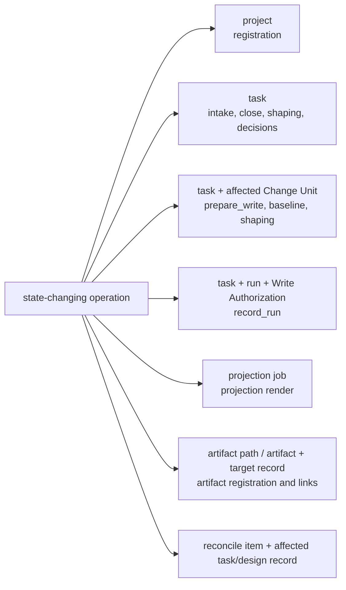

Lock이 expired되면 다음 operation은 recovery event를 append한 뒤 lock을 가져갈 수 있습니다. `expected_state_version`이 relevant task 또는 project scope에서 stale이면 mutation 전에 `STATE_CONFLICT`를 반환합니다.

## Artifact Directory Layout

Reference layout:

```text
~/.harness/
  registry.sqlite
  projects/
    PRJ-0001/
      project.yaml
      state.sqlite
      artifacts/
        bundles/
        diffs/
        logs/
        screenshots/
        checkpoints/
        manifests/
        qa/
        tdd/
        designs/
        prototypes/
        architecture/
        decisions/
        exports/
        tmp/
```

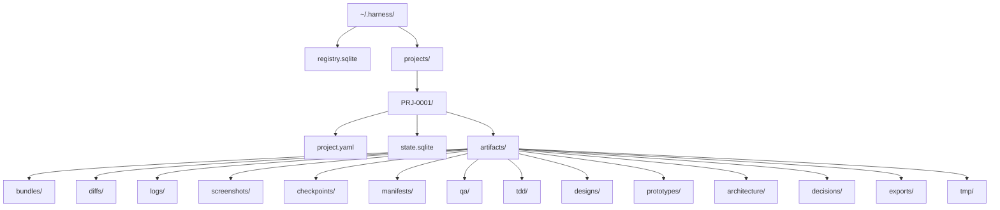

Artifact filenames는 collision을 피할 만큼 stable identity를 포함해야 합니다.

```text
{task_id}/{run_id-or-record_id}/{artifact_id}-{kind}.{ext}
```

Product Repository의 Markdown reports는 기본적으로 raw artifacts가 아닙니다. Export에 report snapshot이 필요하면 그 snapshot을 export component artifact로 저장할 수 있지만, report projection과 raw evidence의 구분은 유지해야 합니다.

### Artifact Kind Storage Notes

`artifacts.kind` field는 durable evidence files의 이름을 붙입니다. 그렇다고 artifact file이 대응하는 state record를 담당하는 것은 아닙니다.

| Artifact kind | Reference storage note |
|---|---|
| `design_probe` | Store exploratory design findings, sketches, or probe outputs under `artifacts/designs/`; accepted structure belongs in `shared_designs`, design support records, or Task/Change Unit state. |
| `prototype` | Store prototype diffs, screenshots, logs, or throwaway proof artifacts under `artifacts/prototypes/`; product code remains in the Product Repository and committed harness meaning remains in state records. |
| `architecture_scan` | Store module scans, dependency snapshots, boundary findings, or stewardship evidence under `artifacts/architecture/`; accepted module/interface facts remain in their owner records. |
| `decision_context` | Store compact context bundles for user judgment under `artifacts/decisions/`; Decision Packet status and outcome remain in `state.sqlite`. |

### Artifact Registration Contract

Artifact registration은 producing Run, Decision Packet context, Shared Design, Journey Spine Entry, Eval, Manual QA record, verification bundle, export component를 record하는 Core transition의 일부입니다.

MVP registration steps:

1. Connector-captured 또는 operator-supplied file은 project artifact `tmp/` directory 아래 staging path나 approved capture adapter에서만 accept합니다.
2. Hashing 전에 redaction 또는 omission을 적용합니다. Raw secrets는 durable artifact storage로 copy하면 안 됩니다.
3. Stored bytes를 matching kind directory 아래 `{task_id}/{run_id-or-record_id}/{artifact_id}-{kind}.{ext}` 형식으로 artifact directory에 move 또는 copy합니다.
4. Stored bytes에서 `sha256`, `size_bytes`, `content_type`, `redaction_state`를 compute합니다.
5. Related state record를 record하고 `task_events`를 append하는 같은 Core transaction에서 `artifacts` row와 required `artifact_links` rows를 insert합니다.
6. Artifact registry row를 통해 resolve되는 `uri`를 가진 `ArtifactRef`를 반환합니다.
7. File move는 성공했지만 transaction이 실패했다면 file을 `tmp/`에 남기거나 `recover`를 위해 orphaned로 mark합니다. Committed artifact ref나 artifact link를 만들면 안 됩니다.

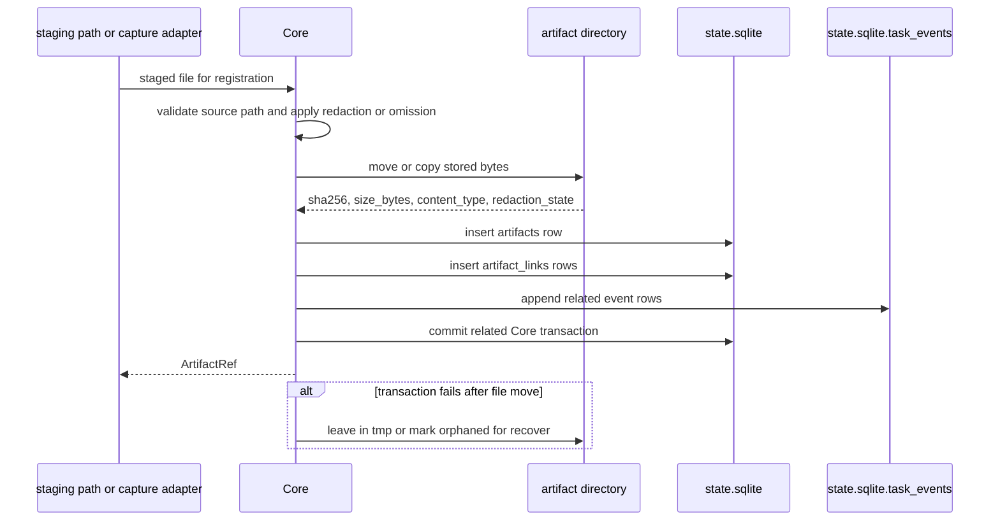

`redaction_state` implementation:

| State | Stored artifact bytes |
|---|---|
| `none` | original non-sensitive evidence |
| `redacted` | redacted evidence; the unredacted original is not retained by the harness |
| `secret_omitted` | evidence with secret values omitted or replaced by handles |
| `blocked` | a small metadata-only notice artifact explaining that capture was blocked; no forbidden content is stored |

Artifact integrity failures는 `ARTIFACT_MISSING` 또는 validator failure를 반환하고, kernel rules에 따라 related evidence 또는 projection freshness를 stale로 mark합니다.

## Baseline Capture

Baseline capture는 write, approval, evidence, verification checks가 사용하는 repository state를 기록합니다.

MVP는 각 capture를 `baselines`에 저장합니다. `baseline_ref`는 Runs, approvals, evidence manifests, verification bundles, validators가 사용하는 primary key입니다. Dirty diff가 captured되면 `baselines.diff_artifact_id`가 registered diff artifact를 가리키고, `artifact_links` row가 이를 baseline context에 attach합니다.

```yaml
BaselineCapture:
  baseline_ref: BASE-0001
  project_id: PRJ-0001
  task_id: TASK-0001
  change_unit_id: CU-0001
  repo_root: /abs/path/to/repo
  vcs:
    kind: git
    head: string
    branch: string
    dirty: boolean
    diff_artifact_ref: ArtifactRef | null
  file_snapshot:
    included_paths: string[]
    ignored_paths: string[]
    tree_hash: string
  approval_scope_refs: string[]
  captured_at: string
```

Relevant HEAD, dirty diff, allowed path contents, approval scope, verification bundle inputs가 captured baseline과 더 이상 match하지 않으면 baseline은 stale입니다. Stale baseline은 affected records에 따라 approval, evidence, verification을 stale로 mark할 수 있습니다.

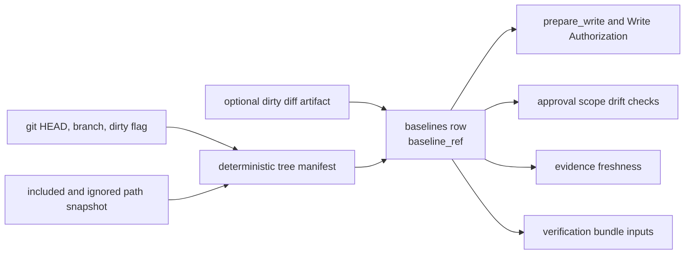

`tree_hash`는 ignore rules가 ignored paths를 제외한 뒤 deterministic tree manifest에서 계산합니다. 각 entry는 leading `./`가 없는 normalized relative POSIX path를 사용합니다. Path strings는 sorting과 hashing 전에 Unicode NFC로 normalize하며 paths는 normalization 후 sort합니다. Regular file content는 저장된 bytes 그대로 hash하고 line-ending normalization을 하지 않으며, entry에는 content hash, file size, available한 경우 executable bit를 포함합니다. Symlink entry는 implementation이 symlink를 명시적으로 disallow하고 그 exclusion 또는 block을 record하지 않는 한 dereferenced content가 아니라 link target을 hash합니다. Equivalent snapshots가 같은 `tree_hash`를 만들도록 final manifest는 hashing 전에 canonical하게 serialize합니다.

## Verification Bundle Shape

`harness.launch_verify`는 detached verification 또는 manual evaluator handoff를 위한 bundle artifact를 만듭니다. Bundle은 raw evidence metadata이지 Eval verdict가 아닙니다.

Minimum bundle contents:

```text
verify-bundle/
  manifest.json
  task-summary.json
  change-unit.json
  baseline.json
  evidence-manifest.json
  approvals.json
  decision-packets.json
  residual-risks.json
  run-refs.json
  artifact-refs.json
  artifact-links.json
  design-refs.json
  journey-spine-entries.json
  evaluator-instructions.md
```

```mermaid
flowchart TD
  Bundle["verify-bundle/"]
  Manifest["manifest.json"]
  Task["task-summary.json"]
  CU["change-unit.json"]
  Baseline["baseline.json"]
  Evidence["evidence-manifest.json"]
  Approvals["approvals.json"]
  Decisions["decision-packets.json"]
  Risks["residual-risks.json"]
  Runs["run-refs.json"]
  ArtifactRefs["artifact-refs.json"]
  ArtifactLinks["artifact-links.json"]
  Designs["design-refs.json"]
  Spine["journey-spine-entries.json"]
  Instructions["evaluator-instructions.md"]

  Bundle --> Manifest
  Bundle --> Task
  Bundle --> CU
  Bundle --> Baseline
  Bundle --> Evidence
  Bundle --> Approvals
  Bundle --> Decisions
  Bundle --> Risks
  Bundle --> Runs
  Bundle --> ArtifactRefs
  Bundle --> ArtifactLinks
  Bundle --> Designs
  Bundle --> Spine
  Bundle --> Instructions
```

Manifest는 task id, Change Unit id, baseline ref, source state version, included artifact ids, redaction summary, evaluator focus, expected independence context를 기록합니다. Bundle은 retention과 redaction policy가 허용하면 copied raw artifacts를 포함할 수 있고, 그렇지 않으면 evaluator가 Harness를 통해 resolve할 수 있는 artifact refs를 포함합니다.

Launching verification은 `verification_gate=pending`을 set하거나 유지합니다. Verdict를 record하고 assurance를 update할 수 있는 것은 `harness.record_eval`뿐입니다.

## Projection Jobs

Projection jobs는 committed state와 Product Repository Markdown files 사이의 durable outbox입니다. 위의 `projection_jobs` table이 job persistence와 canonical per-projection `source_state_version` metadata를 담당합니다.

`projection_jobs.projection_version`은 projection/template/job version입니다. Affected-scope state clock이 아닙니다. `projection_jobs.source_state_version`은 해당 projection job의 render source로 사용한 affected-scope state clock입니다. Pending jobs와 source state가 resolve되기 전에 failed된 jobs에서는 null일 수 있고, completed successful renders에서는 반드시 기록해야 합니다.

Sensitive-approval projection jobs는 [07-document-projection.md](07-document-projection.md#apr)가 담당하는 APR source rule과 [`harness.prepare_write`](05-mcp-api-and-schemas.md#harnessprepare_write)가 담당하는 non-mutating candidate contract를 따릅니다. `approval_request_candidate`는 `TASK` display 또는 blockers에 영향을 줄 수 있지만 `APR` source는 절대 아닙니다. `APR` jobs는 committed approval state changes에서 시작합니다.

MVP에서 Decision Packet visibility는 `TASK` projections, status/next responses, judgment-context resources, decision-packet read resources를 통해 render됩니다.

Standalone `DEC` projection은 standalone Decision Packet projection feature가 enabled인 경우가 아니면 optional입니다. Persisted `JOURNEY-CARD` Markdown은 optional입니다. Status, next, significant resume flows의 current-position Journey Card output은 agency-conformance requirement로 남습니다. 이 문서는 extension template text를 정의하지 않습니다.

아래 job lifecycle은 enqueued된 모든 `ProjectionKind`에 적용됩니다. MVP smoke는 MVP-required tier를 cover해야 합니다. MVP-optional jobs는 policy, records, operator settings가 enable할 때 cover합니다. `DEC`, `DESIGN`, `EXPORT`, `JOURNEY-CARD` 같은 Extension / appendix jobs는 corresponding feature가 enabled된 경우가 아니면 MVP smoke에 required가 아닙니다.

MVP job lifecycle:

```text
pending -> running -> completed
pending -> running -> failed -> pending
pending -> skipped
```

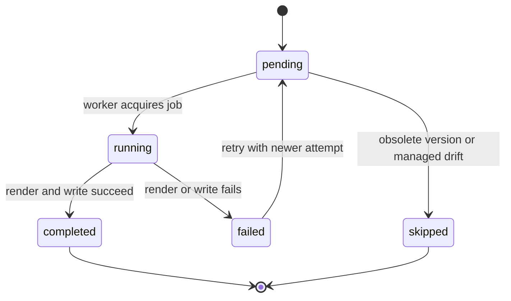

Rules:

- never render an older projection version over a newer one
- preserve human-editable sections
- compare managed hash before overwrite
- create a reconcile item for managed drift
- keep projection failure separate from Task result

`managed_hash`는 projector canonicalization 후 projector가 소유하는 managed block body에서만 계산합니다. `HARNESS:BEGIN`과 `HARNESS:END` marker lines는 hash input에서 제외합니다. Projector는 hashing 전에 line endings를 LF로 normalize하고 해당 block의 projection rules에 따라 meaningful whitespace를 preserve합니다. `managed_hash`는 drift detection value일 뿐이며 Markdown projection을 canonical state로 만들지 않습니다.

### Projection Worker Execution

Reference projector는 Core transaction이 commit된 뒤 pending jobs를 실행합니다.

MVP worker steps:

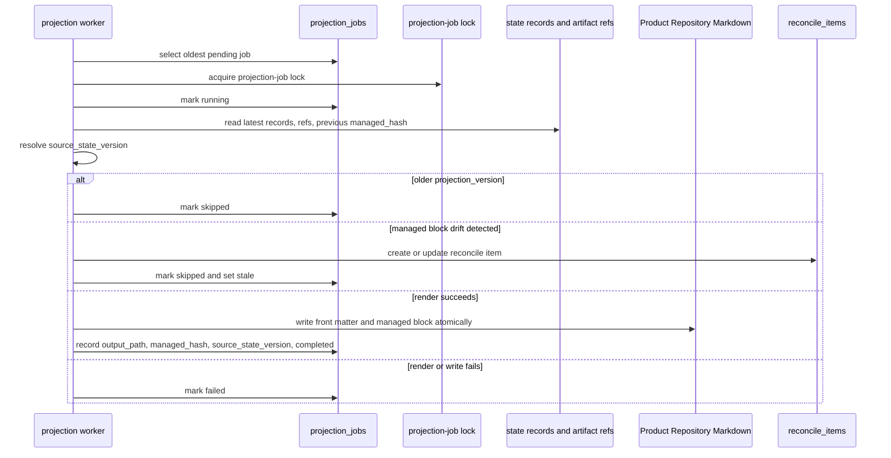

1. Target projection의 oldest `pending` job을 select하고 projection-job lock을 acquire합니다.
2. Job을 `running`으로 mark하고 latest state records, artifact refs, previous managed hash를 read하며 affected-scope state clock에서 `source_state_version`을 resolve합니다.
3. Job의 `projection_version`이 target의 current projection/template/job version보다 오래되었으면 `skipped`로 mark합니다.
4. Committed records와 artifact refs에서 front matter와 managed block을 render하며 `source_state_version`을 포함합니다.
5. Existing managed block hash가 last recorded hash와 다르면 `reconcile_items` row를 create 또는 update하고, job을 `skipped`로 mark하고, projection status를 `stale`로 set합니다.
6. Human-editable sections를 preserve하고 temporary file plus atomic rename으로 projection을 write합니다.
7. New managed hash, output path, `projection_jobs.projection_version`, `projection_jobs.source_state_version`, `completed` status를 record합니다. `TASK` projection summary에 한해서만 `tasks.projected_version`을 같은 source state version으로 update하여 Task-level summary cache로 둡니다.
8. Render 또는 write failure가 발생하면 job을 `failed`로 mark하고 state result는 그대로 두며 projection freshness를 `failed` 또는 `stale`로 surface합니다.

Projection refresh는 newer attempt count를 가진 `pending` job을 create하거나 reset해 `failed` jobs를 retry합니다. Reconcile이 drift를 resolve하기 전까지 managed block이 drift된 projection을 overwrite하면 안 됩니다.

## Reference Surface Behavior

Reference surface는 단일 MVP agent integration target입니다. Broad surface support를 claim하지 않고 kernel을 demonstrate합니다.

Required reference behavior:

- can read repository rules and harness instructions
- can call MCP tools and resources
- calls `harness.intake` before tracked work
- calls `harness.prepare_write` before product writes
- records runs through `harness.record_run`
- uses artifact refs for diffs/logs/bundles
- requests approval/scope/user decisions through MCP
- treats Decision Packets as the state path for blocking product judgment
- respects the active Change Unit Autonomy Boundary and AFK stop conditions
- launches or prepares verification through `harness.launch_verify`
- does not claim detached verification from same-session self-review
- keeps feedback findings and close-relevant residual risk visible through state-backed records or validator results
- holds product writes when MCP is unavailable

Default guarantee display는 cooperative/detective입니다. Preventive 또는 isolated claims에는 implemented guard 또는 isolation path와 passing capability precondition이 필요합니다.

## Validator Runner Skeleton

MVP validators는 API 문서의 shared result shape를 사용합니다. Runner는 의도적으로 작습니다.

Minimal validator rollout은 [MVP Severity Defaults](08-design-quality-policy-pack.md#mvp-severity-defaults) matrix와 그 [Severity Composition Rule](08-design-quality-policy-pack.md#severity-composition-rule)을 default severity router로 사용합니다. Runner는 처음에는 각 stable ID에 대해 shallow check를 구현할 수 있지만, 모든 relevant finding을 visible하게 유지하고, policy-owned rule을 통해 policy impact를 merge하며, API finding severity를 rewrite하는 대신 merged outcome을 gate/blocker-compatible result로 expose해야 합니다. Public primary `ToolError` 선택은 여전히 API가 소유한 [Primary Error Code Precedence](05-mcp-api-and-schemas.md#primary-error-code-precedence)를 따릅니다.

Minimal runner shape:

```text
run_validators(context, validator_ids):
  results = []
  for validator_id in validator_ids:
    load validator definition
    read only the state/artifact/repo inputs declared by the validator
    execute validator
    normalize output to ValidatorResult
    persist result in validator_runs
    results.append(result)
  return results
```

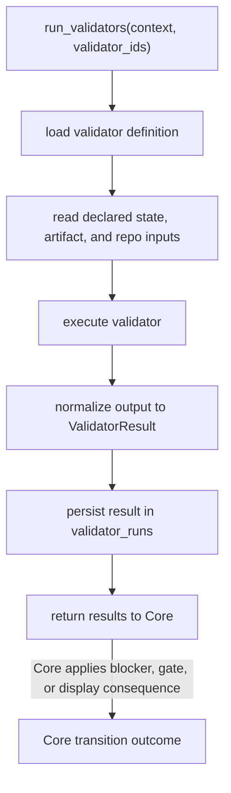

Stable MVP validator IDs:

| Validator | Purpose |
|---|---|
| `decision_gate_check` | blocking Decision Packets are present, compatible, and resolved or validly deferred for the requested operation |
| `decision_quality_check` | Decision Packets include enough context, options, recommendation status, trade-offs, and affected-scope refs for user judgment |
| `autonomy_boundary_check` | intended work stays inside the active Change Unit Autonomy Boundary or routes to user judgment |
| `feedback_loop_check` | test, eval, QA, or operational findings have an explicit state route to rework, decision, risk, evidence, or close |
| `tdd_trace_required` | required TDD evidence or allowed waiver exists |
| `codebase_stewardship_check` | codebase health, module boundary, dependency, or maintainability concerns that need judgment are visible before write or close |
| `residual_risk_visibility_check` | close-relevant residual risks are recorded and visible before acceptance or risk-accepted close |
| `shared_design_alignment` | active Change Unit and runs align with the Shared Design contract or record a compatible decision |
| `vertical_slice_shape` | required vertical slice or exception is recorded |
| `domain_language_consistency` | domain-language terms that affect the change are consistent or routed to design judgment |
| `module_interface_review` | module/interface review requirement is met |
| `manual_qa_required` | required QA is passed or validly waived |
| `context_hygiene_check` | required context, projection freshness, managed hashes, and user-visible summaries are consistent enough for the requested operation |
| `surface_capability_check` | connected surface capability is sufficient for the requested operation or reported honestly through capability findings |

Active Task, active Change Unit, changed paths, approval scope, baseline freshness, artifact integrity, evidence sufficiency, verification independence, same-session verification guard, projection freshness 같은 Core precondition checks는 이 validators 전이나 옆에서 여전히 실행될 수 있습니다. MVP conformance에서 alternate design/agency validator IDs로 emit하면 안 됩니다. `ValidatorResult`를 emit하는 capability checks는 stable `surface_capability_check` ID를 사용합니다. Capability는 additional validator IDs를 만들지 않고 blocked reasons와 guarantee display에도 나타날 수 있습니다.

Docs-maintenance conformance는 이 runtime validator runner 밖에 있습니다. `TODO_IMPLEMENT`: reference MVP가 docs-maintenance smoke profile을 `harness conformance run` 또는 다른 operator entrypoint로 expose한다면 [Authoring Guide](99-authoring-guide.md#docs-maintenance-conformance) rules와 [Operations And Conformance](11-operations-and-conformance.md#docs-maintenance-smoke-profile) reporting expectations를 사용해 Markdown docs에 대한 separate docs-only, read-only operator-maintenance check로 구현합니다. Runtime conformance run은 operator가 docs profile을 명시적으로 select하지 않는 한 이를 포함하면 안 됩니다. 명시적으로 select하더라도 별도로 report하고 runtime Core fixture conformance로 count하지 않습니다. Console output 또는 ephemeral report는 허용되지만, 이 batch는 이 check를 위한 generated operational report files, stored artifacts, projection jobs, DDL, state records를 정의하지 않습니다. 이 profile은 MVP runtime `ValidatorResult` IDs를 emit하거나, `task_events`를 append하거나, artifacts를 만들거나, projection jobs를 enqueue하거나, state를 modify하거나, DDL을 추가하거나, Task state, runtime fixture pass/fail, projection freshness, QA, acceptance, close readiness에 영향을 주면 안 됩니다.

Compatibility aliases:

| Older ID | Stable ID |
|---|---|
| `tdd_trace` | `tdd_trace_required` |
| `module_boundary_review` | `module_interface_review` |
| `docs_consistency` | `context_hygiene_check` |
| `projection_freshness` | `context_hygiene_check` |

이 aliases는 legacy validator outputs 또는 legacy validator IDs를 위한 old compatibility inputs일 뿐이며, MVP conformance는 위 stable IDs를 emit해야 합니다. `projection_freshness` alias는 older validator output을 `context_hygiene_check`로 mapping합니다. Mechanical projection freshness에 대한 새 MVP fixture assertions는 `expected_state.checks.projection_freshness`를 사용해야 합니다.

### Evidence and Verification Profile Implementation Notes

Evidence sufficiency precondition은 committed records와 registered artifacts만 읽습니다. Inputs는 Task, `task_gates`, Change Units, Decision Packets, Residual Risks, Shared Designs, Journey Spine Entries, Runs, approvals, Evidence Manifests, Evals, Manual QA records, artifacts, artifact links, relevant baseline ref입니다. Applicable Evidence Profile이 absent, partial, sufficient, stale, blocked 중 무엇인지 compute한 뒤 kernel rules에 따라 Core를 통해 update하거나 block합니다.

Verification independence precondition은 `evals.independence_json`, `evaluator_run_id`, `target_run_id`, evaluator 및 target `surface_id`, `baseline_ref`, bundle artifact refs, `actor_kind`를 읽습니다. Eval profile이 `same_session`, `subagent_context`, `fresh_session`, `fresh_worktree`, `sandbox`, `manual_bundle` 중 무엇인지, 그리고 그 profile이 target close path의 detached assurance를 support할 수 있는지 확인합니다.

MVP tables 위에 추가 evidence/verification profile DDL은 필요하지 않습니다. Existing JSON fields가 profile metadata를 담습니다. `change_units.autonomy_profile`, `change_units.agent_may_do_json`, `change_units.user_judgment_required_json`, `change_units.afk_stop_conditions_json`, `change_units.end_to_end_path_json`, `decision_packets.context_refs_json`, `decision_packets.context_artifact_refs_json`, `decision_packets.residual_risk_refs_json`, `residual_risks.accepted_risk_json`, `residual_risks.follow_up_requirement_json`, `evidence_manifests.criteria_json`, `evidence_manifests.supporting_refs_json`, `evidence_manifests.stale_if_json`, `evals.evidence_reviewed_json`, `evals.independence_json`, `evals.artifact_refs_json`, `runs.observed_changes_json`, `runs.command_results_json`, `runs.artifact_refs_json`, `approvals.*_json`, `manual_qa_records.findings_json`, `manual_qa_records.residual_risk_refs_json`, `validator_runs.findings_json`이 여기에 해당합니다.

위 inputs 중 하나를 existing fields에서 derive할 수 없다면 DDL을 바꾸기 전에 exact table과 field를 naming하는 `TODO_IMPLEMENT`를 추가합니다.

| MVP stage | Hardening coverage |
|---|---|
| MVP-1 | Journey/Decision skeleton, Decision Packet records, `decision_gate` aggregation |
| MVP-2 | shaping kernel, `prepare_write`, Write Authorization creation, scope, approval, baseline, decision/autonomy write checks, artifact registration |
| MVP-3 | `record_run`, Write Authorization consumption and violation detection, evidence manifest, `feedback_loop_check`, `codebase_stewardship_check`, projection/reconcile |
| MVP-4 | verification independence, Manual QA, `residual_risk_visibility_check`, acceptance, close blockers |
| MVP-5 | conformance and agency conformance fixtures for the hardened rules, including write authorization required and invalid cases |

Validator failure는 state, blocked reasons, close blockers로 visible해야 합니다. Prose-only agent output 안에 숨기면 안 됩니다.

Conformance fixture assertion semantics는 [Operations And Conformance](11-operations-and-conformance.md#fixture-assertion-semantics)가 담당하고, stable `expected_events` names는 [Kernel Stable Event Catalog](03-kernel-spec.md#stable-event-catalog)가 담당합니다. Reference runner는 captured Core state, `task_events`, validator results, artifact registry/file integrity, projection job 또는 freshness state, returned error code에 대해 그 assertion mode를 구현해야 하며, rendered Markdown이나 agent prose만 matching해서 fixture를 pass시키면 안 됩니다.

## Minimal CLI Plan

MVP CLI는 같은 Core logic 위의 operator/debug surface입니다. State semantics가 다른 second API가 되면 안 됩니다.

Minimum entrypoints:

- connect one local project and reference surface
- start or print MCP server connection information
- doctor project/runtime/MCP/artifacts/projections
- refresh projections
- reconcile pending items
- recover interrupted runs, stale projections, and artifact registry mismatch
- export a Task bundle
- run conformance smoke fixtures

Detailed operator procedures는 operations and conformance document가 담당합니다.

## Export Bundle Shape

Exports는 review 또는 archival을 위해 state snapshots, projection snapshots, artifact refs를 package합니다.

```text
export/
  manifest.json
  state/
    task.json
    decision-packets.json
    residual-risks.json
    shared-designs.json
    task-spine-entries.json
    change-unit-dependencies.json
    baselines.json
    artifact-links.json
    runs.json
    approvals.json
    evidence-manifest.json
    evals.json
    manual-qa.json
  projections/
    TASK.md
    APR-*.md
    RUN-SUMMARY-*.md
    EVIDENCE-MANIFEST-*.md
    EVAL-*.md
    DIRECT-RESULT-*.md
  artifacts/
    ...
```

```mermaid
flowchart TD
  Export["export/"]
  Manifest["manifest.json"]
  State["state/"]
  Projections["projections/"]
  Artifacts["artifacts/"]
  Task["task.json"]
  Decisions["decision-packets.json"]
  Risks["residual-risks.json"]
  SharedDesigns["shared-designs.json"]
  Spine["task-spine-entries.json"]
  Dependencies["change-unit-dependencies.json"]
  Baselines["baselines.json"]
  Links["artifact-links.json"]
  Runs["runs.json"]
  Approvals["approvals.json"]
  Evidence["evidence-manifest.json"]
  Evals["evals.json"]
  QA["manual-qa.json"]
  TaskProjection["TASK.md"]
  AprProjection["APR-*.md"]
  RunProjection["RUN-SUMMARY-*.md"]
  EvidenceProjection["EVIDENCE-MANIFEST-*.md"]
  EvalProjection["EVAL-*.md"]
  DirectProjection["DIRECT-RESULT-*.md"]

  Export --> Manifest
  Export --> State
  Export --> Projections
  Export --> Artifacts
  State --> Task
  State --> Decisions
  State --> Risks
  State --> SharedDesigns
  State --> Spine
  State --> Dependencies
  State --> Baselines
  State --> Links
  State --> Runs
  State --> Approvals
  State --> Evidence
  State --> Evals
  State --> QA
  Projections --> TaskProjection
  Projections --> AprProjection
  Projections --> RunProjection
  Projections --> EvidenceProjection
  Projections --> EvalProjection
  Projections --> DirectProjection
```

Raw secret values, unredacted sensitive logs, PII는 export 전에 omitted 또는 redacted됩니다.
