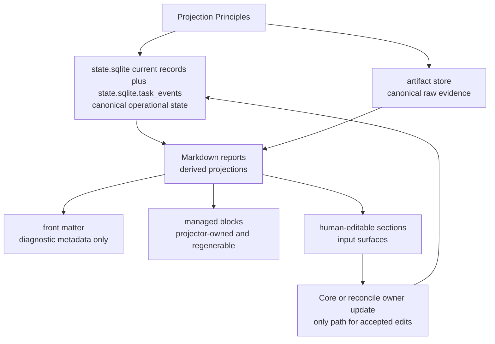
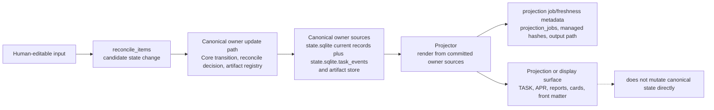
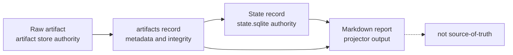
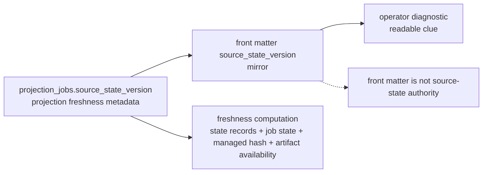
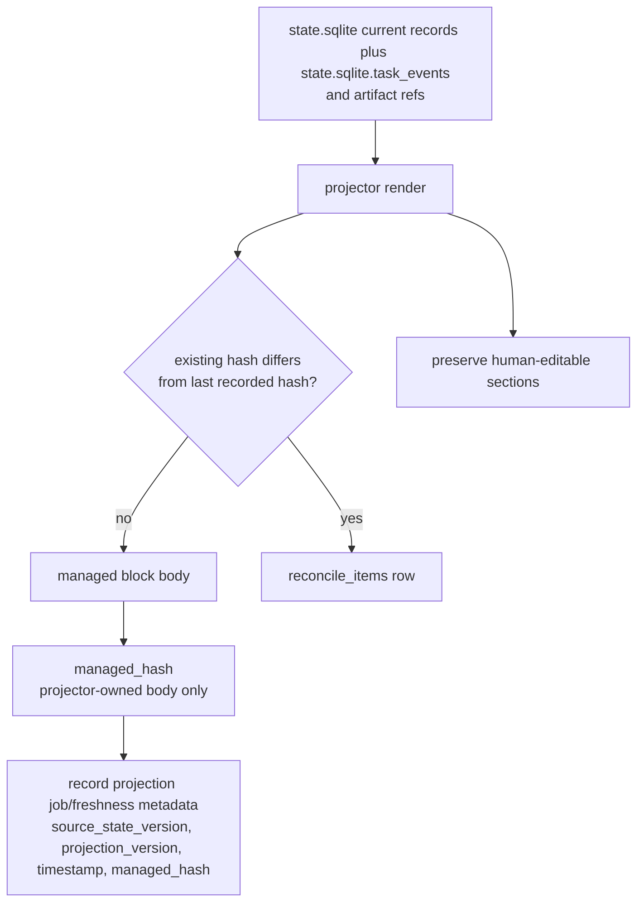
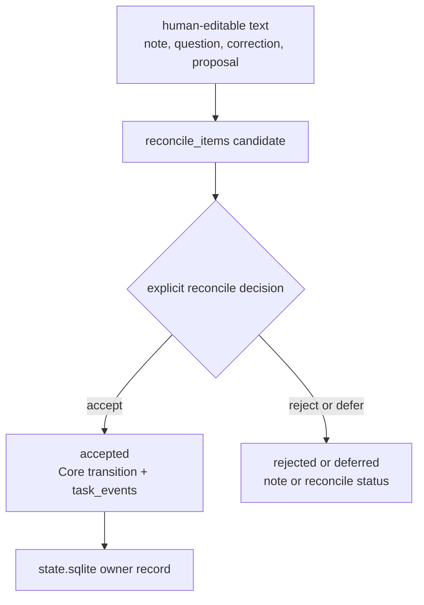
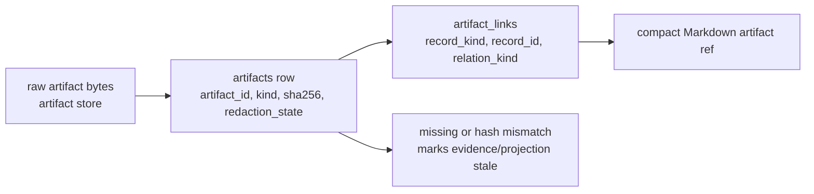
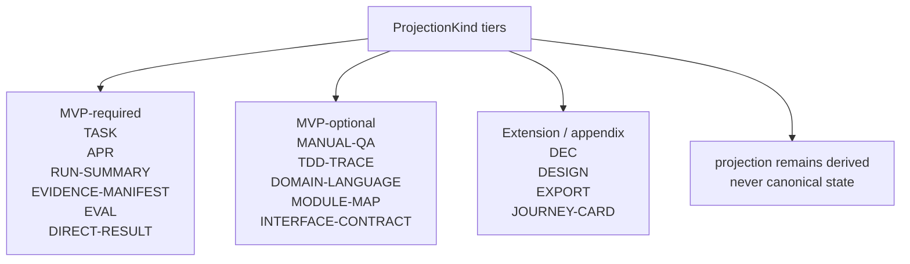
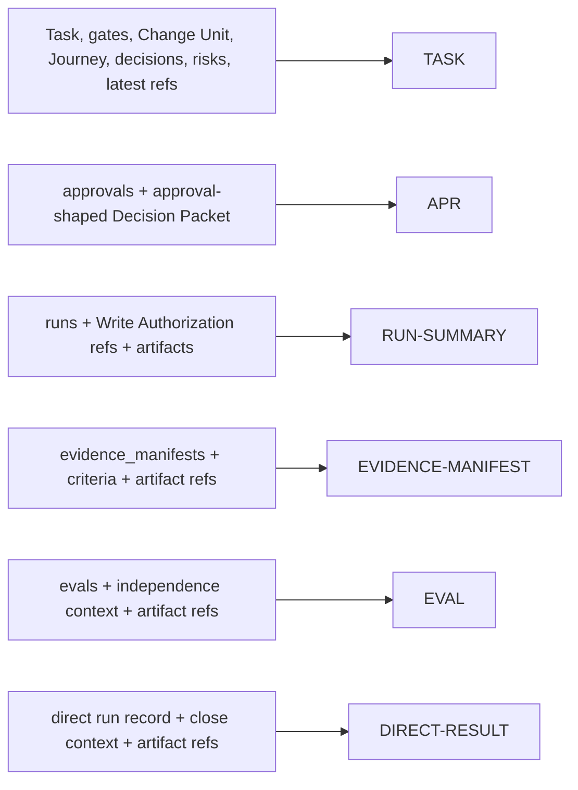
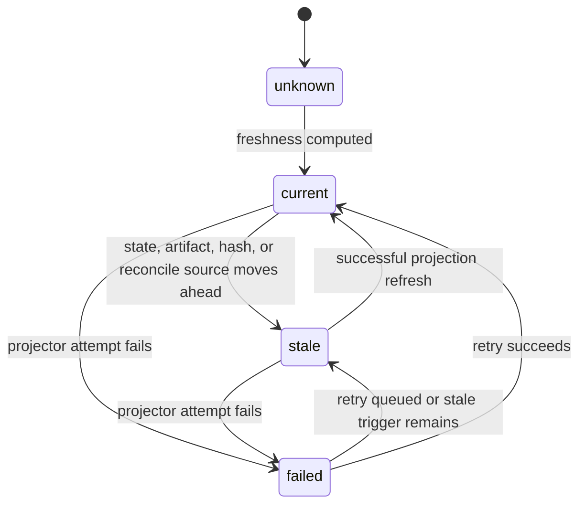

# 문서 Projection

## 문서 역할

이 문서는 Product Repository 안의 사람이 읽는 Markdown projection 규칙을 담당한다. Projection principle, document authority boundary, managed block rule, human-editable rule, artifact reference rendering, template tier, required MVP template summary, optional design-quality 및 appendix variant template summary, projection freshness rule을 정의한다.

Canonical kernel state, MCP request/response schema, SQLite DDL, design-quality policy requirement, full template text는 정의하지 않는다. Full template은 [Appendix A](appendix/A-template-library.md)에 있다.

## Projection Principles

1. Projection은 source-of-truth가 아닙니다.
2. Canonical operational state는 `state.sqlite` current record와 `state.sqlite.task_events`다.
3. Raw evidence는 artifact store에서 canonical하다.
4. Markdown report는 state record와 artifact reference에서 render된다.
5. Markdown report는 기본적으로 raw artifact가 아니다.
6. Front matter는 identity, projection version 또는 status, `source_state_version`, timestamp/freshness metadata만 가진다.
7. Managed block은 projector가 생성하며 regenerate될 수 있다.
8. Human-editable section은 note와 proposal을 위한 input surface다.
9. 수용된 human edits만 reconcile 또는 Core state-changing action을 통해 state가 된다.
10. Large log, diff, trace, screenshot, bundle, checkpoint는 embed하지 않고 artifact ref로 link한다.
11. Projection failure 또는 staleness는 underlying task result를 절대 바꾸지 않는다.
12. User-facing card는 friendly label을 사용할 수 있지만 canonical gate name은 kernel field로 남는다.
13. Decision Packet, Journey Card, Journey Spine, Autonomy Boundary, Write Authority Summary, Change Unit DAG, Residual Risk, Stewardship Impact 표시는 owner record와 artifact ref에서 만든 non-canonical projection이다.

Source-of-truth caption: canonical operational state는 `state.sqlite` current records plus `state.sqlite.task_events`이며 raw evidence는 artifact store에 있고 Markdown은 derived view다.



## Document Authority Matrix

| Fact or surface | Canonical source | Projection 또는 표시되는 뷰 | Update path |
|---|---|---|---|
| Current Task state | `state.sqlite.tasks`, `task_gates`, `state.sqlite.task_events` | `TASK` Current Summary와 status card | Core transition, then projector |
| Task continuity | `state.sqlite` Task, Change Unit, Run, Evidence Manifest, Eval, Manual QA, Decision Packet, Approval, Residual Risk, `task_gates.acceptance_gate`, acceptance Decision Packet user-decision state, close events, artifact ref, 필요할 때 `journey_spine_entries`, `state.sqlite.task_events` | `TASK` Journey Spine | Core transition 또는 reconcile, Journey reconstruction, then projector |
| Decision Packet | `state.sqlite.decision_packets`, 관련 `decision_gate` state, decision event, 관련 approval 또는 reconcile record, artifact ref, 필요할 때 연결된 `state.sqlite.residual_risks` | `TASK` Pending Decisions, Journey Card decision line, status/next responses, judgment-context resources, decision-packet resources; standalone projection이 enabled일 때 optional standalone packet projection | `request_user_decision` / `record_user_decision`, then projector |
| Journey Spine | `state.sqlite` Task, Change Unit, Run, Decision Packet, Approval, Evidence Manifest, Eval, Manual QA, Residual Risk, `task_gates.acceptance_gate`, acceptance Decision Packet user-decision state, close events, artifact ref, 필요할 때 `journey_spine_entries`, `state.sqlite.task_events` | `TASK` Journey Spine section, resume view, Journey Spine-oriented card | Core transition 또는 reconcile, Journey reconstruction, then projector |
| Journey Card | current `state.sqlite` Task state, gate, active Change Unit, Autonomy Boundary summary, active Decision Packet ref, residual-risk summary, latest evidence/eval/QA/report ref, projection freshness | `JOURNEY-CARD`, status card, `harness.status` card text, `harness.next` current-position text, significant resume output | current state에서 read 또는 projection refresh; card를 직접 edit하지 않음 |
| Autonomy Boundary | active `state.sqlite.change_units` Autonomy Boundary field와 관련 Decision Packet resolution/event | `TASK` Autonomy Boundary, Change Unit block, Journey Card autonomy line, standalone projection이 enabled일 때 optional related standalone packet projection | shaping update 또는 user Decision Packet resolution, then projector |
| Write Authorization | `state.sqlite.write_authorizations`와 관련 Task, Change Unit, approval, Decision Packet, baseline, consumed Run ref | `TASK` Write Authority Summary, Journey Card Write Authority Summary line, `RUN-SUMMARY` relation | `prepare_write`가 create함; idempotent replay는 already committed response를 반환함; `record_run`이 authorization을 consume한 뒤 projector |
| Change Unit DAG | `state.sqlite.change_units`, `state.sqlite.change_unit_dependencies`, dependency 관련 event, active Task state | `TASK` Change Unit Dependencies / DAG summary | shaping update 또는 reconcile, then projector |
| Residual Risk | `state.sqlite.residual_risks`, accepted-risk metadata와 residual-risk refs, related Decision Packet, evidence/QA/eval ref, artifact ref | `TASK` Residual Risk, standalone projection이 enabled일 때 optional accepted-risk context, Journey Card residual-risk line | decision, evidence, QA, Eval, reconcile 또는 close flow에서 Core transition, then projector |
| Stewardship Impact Summary | `domain_terms`, `module_map_items`, `interface_contracts`, `feedback_loops`, TDD가 selected된 경우 TDD records, `state.sqlite.residual_risks`, `state.sqlite.decision_packets`, policy validator results, related refs | `TASK` Stewardship Impact와 status/resume stewardship display | Owner record update, validator result, reconcile, close flow, then projector |
| User Notes | human-editable input -> `reconcile_items` -> accepted state event/record | `TASK` User Notes and Proposals | human edit, reconcile decision, Core event |
| Shared Design | shared design record와 event | `TASK` summary, `DESIGN`, standalone projection이 enabled일 때 optional standalone packet projection | Core transition 또는 reconcile, then projector |
| Domain Language | `domain_terms` table | `DOMAIN-LANGUAGE` projection | Core transition 또는 reconcile, then projector |
| Module Map | `module_map_items` table | `MODULE-MAP` projection | Core transition 또는 reconcile, then projector |
| Interface Contract | `interface_contracts` table | `INTERFACE-CONTRACT` projection | Core transition 또는 reconcile, then projector |
| Feedback Loop | `feedback_loops` table plus runs, artifacts, TDD traces, Manual QA, evidence manifests refs | `TASK` Stewardship Impact와 Evidence Manifest design-quality coverage; MVP에는 standalone Feedback Loop projection이 없음 | `record_run` shaping 또는 evidence update의 `FeedbackLoopUpdate`, `record_manual_qa`의 `feedback_loop_ref`, 또는 reconcile, then projector |
| Approval | `approvals`, approval-shaped Decision Packet, 구현이 유지하는 경우 optional decision request routing/replay record, event; `approval_request_candidate` alone은 제외 | `APR` projection과 approval card | `request_user_decision(decision_kind=approval)`이 pending Approval record를 create하고, `record_user_decision`이 approval decision을 update한 뒤 projector |
| Run summary | `runs` table plus artifact refs | `RUN-SUMMARY` projection | `record_run`, then projector |
| Direct result | direct run record plus artifact refs | `DIRECT-RESULT` projection | `record_run` / `close_task`, then projector |
| Evidence coverage | `evidence_manifests` plus artifact refs | `EVIDENCE-MANIFEST` projection | evidence module update, then projector |
| Verification verdict | `evals` plus artifact refs | `EVAL` projection과 verification card | `record_eval`, then projector |
| TDD trace | `tdd_traces` plus artifact refs | `TDD-TRACE` projection | `record_run` 또는 reconcile, then projector |
| Manual QA | Aggregate QA requirement state에는 `qa_gate`; record가 있을 때 `manual_qa_records` plus artifact refs | `MANUAL-QA` projection과 QA card | `record_manual_qa`, then projector |
| Raw evidence | artifact store plus `artifacts` records | report 안의 artifact reference | artifact registry |
| Projection freshness | `projection_jobs.source_state_version`, `projection_jobs.projection_version`, job status, managed hashes, artifact records | front matter mirror, status card, operations output | projector and recovery tools |

Source-of-truth caption: owner update path는 canonical owner state를 write한다. Projector는 projection job/freshness metadata를 기록하고 Markdown을 그 뒤에 render한다.



Required authority statements:

- User Notes: human-editable input -> `reconcile_items` -> accepted state event/record
- Domain Language: `domain_terms` table -> `DOMAIN-LANGUAGE` projection; canonical term row에 대한 public ref는 `StateRecordRef.record_kind=domain_term`을 사용한다
- Module Map: `module_map_items` table -> `MODULE-MAP` projection; canonical module row에 대한 public ref는 `StateRecordRef.record_kind=module_map_item`을 사용한다
- Interface Contract: `interface_contracts` table -> `INTERFACE-CONTRACT` projection; canonical contract row에 대한 public ref는 `StateRecordRef.record_kind=interface_contract`를 사용한다
- Feedback Loop: `feedback_loops` table -> `TASK`와 Evidence Manifest display; canonical feedback-loop row에 대한 public ref는 `StateRecordRef.record_kind=feedback_loop`를 사용한다. TDD Trace refs는 separate execution evidence refs로 남는다
- Decision Packet: `state.sqlite.decision_packets`와 관련 ref -> `TASK` Pending Decisions, status/next responses, judgment-context resources, decision-packet resources; standalone projection이 enabled일 때 optional standalone packet projection
- Journey Spine: owner record, artifact ref, `journey_spine_entries` supplement, `state.sqlite.task_events`에서 재구성한다. 자체 authority record가 아니다.
- Journey Card: current state와 ref에서 만든 derived display다. 절대 canonical state가 아니다.
- Autonomy Boundary: active `state.sqlite.change_units` boundary field -> projection surface. 판단 재량이지 scope authority가 아니다.
- Write Authority Summary: active scope, approval, Write Authorization, baseline, guarantee ref에서 만든 derived display다. 절대 canonical state가 아니며 work를 authorize할 수 없다.
- Write Authorization: `state.sqlite.write_authorizations`는 specific allowed write attempt를 기록한다. Scope, approval, evidence, verification, QA, acceptance, residual-risk acceptance가 아니다.
- Approval: `approvals`와 approval-shaped Decision Packet -> Approval record가 존재하거나 변경된 뒤에만 `APR` projection을 만든다. `prepare_write`가 반환한 `approval_request_candidate`는 candidate display로 표시할 수 있지만 `APR` source가 아니다.
- Change Unit DAG: `state.sqlite.change_unit_dependencies`와 Change Unit ref -> dependency projection. scheduler 또는 authorization surface가 아니다.
- Residual Risk: accepted-risk metadata/refs를 포함한 `state.sqlite.residual_risks` -> residual-risk display
- Stewardship Impact Summary: owner record, validator result, ref에서 derive됨 -> `StewardshipImpactSummary` display. canonical record가 아니다.

## Markdown Report Boundary

경계는 의도적으로 엄격하다.

| Item | What it is | Authority |
|---|---|---|
| Raw artifact | diff, log, screenshot, checkpoint, bundle, manifest file 같은 durable evidence file | artifact store |
| State record | Task, Change Unit, Decision Packet, Journey Spine Entry, Residual Risk, Run, Approval, Write Authorization, Eval, Manual QA record, Evidence Manifest, Artifact record, Reconcile Item 같은 canonical structured record | `state.sqlite` |
| Markdown report | record와 artifact ref에서 만든 human-readable projection | projector output |

Source-of-truth caption: Markdown report는 evidence를 link하고 state를 summarize할 수 있지만 raw artifact나 state record가 아니다.



이 report kind는 기본적으로 state record와 artifact ref에서 생성되는 projection이다. Artifact store의 evidence file에 link할 수 있고 export가 snapshot을 포함할 수 있지만, 그렇다고 Markdown report가 canonical evidence가 되지는 않는다.

## Front Matter Metadata

Projection front matter는 diagnostic 용도로 compact하게 유지한다. Rendered object를 identify하고, projection version 또는 status를 표시하며, `source_state_version`을 mirror하고, rendered timestamp를 포함할 수 있다. Large state summary, evidence body, gate rollup, artifact inventory는 포함하면 안 된다.

`projection_version`은 projection/template/job version이다. State clock이 아니며 source-state freshness basis로 사용하면 안 된다. `source_state_version`은 render source로 사용한 affected-scope state clock 값이다. Projection이 task-scoped이면 Task State Version이고, 그렇지 않으면 Project State Version 또는 extension-defined owner state clock이다.

Canonical per-projection value는 successful render job의 `projection_jobs.source_state_version`이다. Front matter `source_state_version`은 operator diagnosis를 위해 그 값을 mirror할 뿐이다. Markdown에 기록되어도 Markdown이 canonical state가 되지 않으며, stale detection은 계속 canonical state records, projection job state, managed hash, artifact availability를 비교한다.

Source-of-truth caption: `projection_jobs.source_state_version`은 projection freshness metadata의 authoritative value이며, front matter는 이를 mirror할 뿐 owner state가 아니다.



## Managed Blocks

Managed block은 projector가 overwrite할 수 있는 유일한 Markdown area다.

```md
<!-- HARNESS:BEGIN managed -->
...
<!-- HARNESS:END managed -->
```

규칙:

- Managed block content는 committed state record와 artifact ref에서 생성된다.
- Projector는 `projection_jobs.source_state_version`, projection version, rendered timestamp, managed hash를 기록한다. Front matter는 operator를 위해 recorded source state version을 mirror한다.
- Managed hash는 `HARNESS:BEGIN`과 `HARNESS:END` marker lines를 제외한 projector-owned managed block body에서 계산하며, line endings를 LF로 normalize하고 projector rules가 요구하는 meaningful whitespace를 preserve한다.
- Rendering 전에 managed block hash가 last projected hash와 다르면 projector는 reconcile item을 create/update한다.
- Managed hash는 drift detection에만 사용하며 rendered Markdown을 canonical state로 만들지 않는다.
- Projector는 managed block 내부의 direct edit를 accepted state로 조용히 취급하지 않는다.
- Managed block을 re-render할 때 unrelated human-editable section은 preserve해야 한다.
- Failed render는 projection freshness를 `failed` 또는 `stale`로 mark하며 state를 rollback하지 않는다.

Source-of-truth caption: managed hash는 projection drift를 detect할 뿐 rendered Markdown을 canonical state로 만들거나 owner records를 update하지 않는다.



## Human-Editable Sections

Human-editable section은 사용자가 note, question, correction, proposal을 남기는 공간이다.

```md
## User Notes and Proposals
-
```

규칙:

- Human-editable text는 input이지 canonical state가 아니다.
- Reconcile은 edit를 읽고 state가 바뀌어야 할 수 있으면 `reconcile_items` candidate를 만든다.
- Accepted proposal은 Core transition과 appended `state.sqlite.task_events` row를 통해서만 state가 된다.
- Rejected proposal은 note 또는 rejected reconcile item으로 남는다.
- Projector는 refresh 중 human-editable content를 preserve해야 한다.
- Human-editable proposal은 Task summary, acceptance criteria, Domain Language, Module Map, Interface Contract, Manual QA note, 기타 state-backed record를 target할 수 있지만 proposal 자체가 target record는 아니다.

Source-of-truth caption: human-editable text는 input이다. Accepted changes는 reconcile 또는 Core state-changing action을 통해서만 state가 된다.



## Artifact References In Markdown

Markdown report는 artifact reference를 compact하고 consistent하게 render한다. Payload shape는 MCP API document가 담당하며, projection은 presentation rule만 담당한다.

권장 display:

```text
- Diff: DIFF-0001 (`artifact_id=ART-0001`, sha256:abc123..., redaction:none)
- Test log: LOG-0002 (`artifact_id=ART-0002`, sha256:def456..., redaction:redacted)
- Bundle: BUNDLE-0001 (`artifact_id=ART-0003`, sha256:789abc..., redaction:secret_omitted)
```

규칙:

- 모든 artifact ref는 artifact record로 resolve되어야 한다.
- 모든 raw artifact ref는 integrity metadata와 redaction state를 가져야 한다.
- Large 또는 sensitive evidence는 Markdown에 paste하지 않고 link한다.
- Missing 또는 hash-mismatched artifact는 related evidence 또는 projection freshness를 stale로 mark한다.
- State record ref는 record identity와 optional projection path를 사용한다. Raw artifact ref로 render하지 않는다.

Source-of-truth caption: Markdown은 artifact record에서 compact artifact ref를 render하며 large 또는 sensitive evidence는 report body 밖에 남는다.



## Template Tiers

Projection template은 API `ProjectionKind` tier와 일치한다.

| Tier | Templates | Rule |
|---|---|---|
| MVP-required | `TASK`, `APR`, `RUN-SUMMARY`, `EVIDENCE-MANIFEST`, `EVAL`, `DIRECT-RESULT` | MVP projector는 이를 render해야 한다. |
| MVP-optional | `MANUAL-QA`, `TDD-TRACE`, `DOMAIN-LANGUAGE`, `MODULE-MAP`, `INTERFACE-CONTRACT` | Policy가 적용되거나, record가 있거나, user/operator가 projection을 enable할 때 render한다. |
| Extension / appendix | `DEC`, `DESIGN`, `EXPORT`, `JOURNEY-CARD` | Corresponding extension 또는 appendix projection이 enabled일 때만 render한다. Full text는 Appendix A에 있다. |

Source-of-truth caption: `ProjectionKind` tiering은 renderer support expectations를 정하지만 projection을 canonical state로 만들지 않는다.



Main doc은 각 template의 purpose와 source record만 정의한다. Full template body는 [Appendix A](appendix/A-template-library.md)에 있다.

Persisted `JOURNEY-CARD` Markdown은 optional이다. `harness.status`, `harness.next`, significant resume flow의 current-position Journey Card output은 agency conformance에 required다.

MVP Decision Packet visibility는 `TASK` projections, status/next responses, judgment-context resources, decision-packet resources를 통해 required다.

Standalone `DEC` Markdown은 standalone Decision Packet projection feature가 enabled인 경우가 아니면 optional이다.

Decision Packet record ID는 `DEC-*`를 사용한다. `projection_kind`의 `DEC`는 projection kind label일 뿐이다. Standalone projection에 별도 identity가 필요하면 `DEC-PROJ-0001` 같은 별도 `projection_id`를 사용한다.

## Required MVP Templates

Source-of-truth caption: required MVP templates는 owner record families와 artifact refs에서 render되며 template이 owner를 replace하지 않는다.



### TASK

목적: active work를 위한 continuity projection이다. 작업이 어디에 있는지, judgment context, Autonomy Boundary, Write Authority Summary, Stewardship Impact, next evidence, residual risk, mode, lifecycle phase, next action, current gate, active Change Unit, pending decision, evidence, report ref, projection freshness를 요약한다.

Source: `state.sqlite` Task, task gate, active Change Unit, Change Unit dependency, Write Authorization record, Write Authority Summary display input, Decision Packet, Residual Risk, latest Run, latest Evidence Manifest, latest Eval, latest Manual QA record, approval record, Journey Spine source record, `domain_terms`, `module_map_items`, `interface_contracts`, `feedback_loops`, TDD가 selected된 경우 `tdd_traces`, design-quality validator result, artifact ref, projection freshness.

Boundary: `TASK`의 Stewardship Impact는 owner record, validator result, ref에서 derive되는 `StewardshipImpactSummary` display다. Domain Language, Module Map, Interface Contract, Feedback Loop, TDD Trace, residual-risk, Decision Packet owner record를 replace하지 않는다.

Human-editable area: User Notes and Proposals.

### APR

목적: approval request가 committed된 뒤 sensitive change를 위한 readable approval request와 decision record다.

Source: approval record, related approval-shaped Decision Packet, 구현이 별도 routing record를 둔다면 optional decision request routing/replay record, Change Unit scope, sensitive category, allowed path/tool/command/network/secret, baseline, expiry, alternative, decision note. `prepare_write`가 반환한 non-mutating `approval_request_candidate`는 `APR` source가 아니며, 표시한다면 candidate display로 표시해야 한다.

Boundary: approval은 product judgment를 resolve하지 않고, correctness를 prove하지 않고, evidence를 satisfy하지 않으며, verification이나 Manual QA를 replace하지 않고, acceptance를 imply하지 않으며, residual risk를 accept하지 않는다. Decision request routing records는 decision authority가 아니며 linked compatible Decision Packet을 통하지 않고는 `decision_gate`에 영향을 줄 수 없다.

### RUN-SUMMARY

목적: execution run의 readable summary다.

Source: run record, actor/surface identity, baseline, Change Unit, 있는 경우 consumed Write Authorization ref, changed path, command result, validator result, artifact ref, evidence update, follow-up.

Boundary: raw log와 diff는 artifact로 남고 report는 link한다.

### EVIDENCE-MANIFEST

목적: acceptance criteria와 completion condition에서 supporting evidence로 가는 readable map이다.

Source: evidence manifest record, acceptance criteria, changed file coverage, design-quality coverage, approval ref, artifact ref, related Run, Eval, Feedback Loop, Manual QA, TDD trace ref.

Boundary: evidence가 required인 곳에서 close는 report text alone이 아니라 canonical `evidence_gate`에 의존한다.

### EVAL

목적: independence context를 포함한 readable verification result다.

Source: Eval record, verification target, verdict, independence qualifier, baseline relationship, performed check, reviewed evidence, blocker, artifact ref.

Boundary: Eval verdict alone은 assurance를 upgrade하지 않는다. `detached_verified`에는 valid independence와 passed verification, same-session self-review violation 부재가 필요하다.

### DIRECT-RESULT

목적: 작은 direct work를 위한 compact result report다.

Source: direct run record, direct product write에서 있는 경우 consumed Write Authorization ref, changed path, performed check, artifact ref, escalation flag, close assurance.

Boundary: policy 또는 user가 detached verification이나 다른 gate를 요구하지 않는 한 direct work는 기본적으로 self-checked로 close될 수 있다. Consumed Write Authorization ref를 표시할 수 있지만, projection이 canonical authorization record가 되지는 않는다.

## Optional Template Summaries

### DOMAIN-LANGUAGE

목적: canonical product vocabulary의 readable projection이다.

Source: `domain_terms` table. Human edit는 `domain_terms`로 reconcile되는 proposal이다. Canonical term row에 대한 public ref는 `StateRecordRef.record_kind=domain_term`을 사용한다. Projection ref는 rendered `DOMAIN-LANGUAGE` document 자체만 가리킨다.

### MODULE-MAP

목적: module, responsibility, public interface, dependency, test boundary, watchpoint의 readable projection이다.

Source: `module_map_items` table. Human edit는 module map record로 reconcile되는 proposal이다. Canonical module map row에 대한 public ref는 `StateRecordRef.record_kind=module_map_item`을 사용한다. Projection ref는 rendered `MODULE-MAP` document 자체만 가리킨다.

### INTERFACE-CONTRACT

목적: public interface expectation, compatibility impact, caller, boundary test의 readable projection이다.

Source: `interface_contracts` table. Human edit는 interface contract record로 reconcile되는 proposal이다. Canonical interface contract row에 대한 public ref는 `StateRecordRef.record_kind=interface_contract`를 사용한다. Projection ref는 rendered `INTERFACE-CONTRACT` document 자체만 가리킨다.

### TDD-TRACE

목적: readable red/green/refactor evidence trail 또는 recorded non-TDD justification이다.

Source: `tdd_traces` plus artifact refs. Trace가 required인지 waivable인지는 policy가 결정한다. `TDD-TRACE` projection은 TDD evidence를 보여주며 selected Feedback Loop record를 define하지 않는다.

### MANUAL-QA

목적: UX, workflow, copy, accessibility, visual output, 기타 experiential quality에 대한 readable human inspection record다.

Source: aggregate requirement state에는 `qa_gate`를 사용한다. Record가 있을 때는 `manual_qa_records` plus artifact refs도 source가 된다.

User-facing card는 `Manual QA: pending/passed/failed/waived`라고 말할 수 있지만, `pending`은 `qa_gate`에서 온 requirement/gate display이지 Manual QA record result가 아니다.

## Appendix Variant Summaries

### DEC

목적: standalone Decision Packet projection이 enabled일 때 product judgment, approval-shaped judgment, waiver, acceptance, residual-risk acceptance, reconcile decision을 위한 optional readable Decision Packet projection이다. 왜 지금 결정이 필요한지, 사용자가 무엇을 결정하는지, 사용자의 추가 판단 없이 agent가 무엇을 결정할 수 있는지, option, trade-off, recommendation, uncertainty, deferral consequence, minimum context, final user decision, accepted risk를 보여줘야 한다.

Source: `state.sqlite.decision_packets`, related Task와 Change Unit ref, affected gate, related approval 또는 reconcile record, residual-risk ref, evidence ref, artifact ref, decision event.

Boundary: Markdown packet은 decision authority가 아니다. Canonical Decision Packet과 기록된 user decision 또는 reconcile action만 `decision_gate`, approval, Autonomy Boundary, residual risk, acceptance, close에 영향을 줄 수 있다. Decision request routing metadata가 있더라도 authority source가 아니다.

Identity: Decision Packet record는 자신의 `DEC-*` ID를 유지한다. Standalone Markdown projection은 `projection_kind: DEC`를 사용할 수 있지만, 이 kind label은 projection identity가 아니다. Projection에 distinct ID가 필요하면 `projection_id: DEC-PROJ-*`를 사용한다.

### JOURNEY-CARD

목적: status와 resume surface를 위한 compact current-position card다. Task가 어디에 있는지, 무엇이 judgment를 block하거나 guide하는지, agent가 지금 무엇을 할 수 있는지, 다음 evidence가 무엇인지, 남은 residual risk가 무엇인지, projection이 fresh한지를 답한다.

Source: current `state.sqlite` Task state와 gate, active Change Unit, Autonomy Boundary summary, Write Authorization records, Write Authority Summary display inputs, approval status, baseline refs, guarantee refs, active Decision Packet ref, Journey Spine source record, latest Run/Evidence Manifest/Eval/Manual QA/report ref, Residual Risk, artifact ref, projection freshness.

Boundary: card는 derived display다. Work를 authorize하거나, decision을 resolve하거나, risk를 accept하거나, evidence를 satisfy하거나, verification 또는 Manual QA를 replace하거나, Task를 close할 수 없다.

Rendering note: `harness.status`와 `harness.next`는 projection job을 만들지 않고 Journey Card를 ephemeral하게 반환할 수 있다. Significant resume flow는 agency conformance를 위해 current-position Journey Card output을 보여줘야 한다. Freshness metadata는 card가 projection으로 rendered 또는 persisted될 때 적용된다.

## Status Cards

Status card와 Journey Card는 state가 아니라 derived display다. 다음과 같은 friendly label을 사용할 수 있다.

```text
Manual QA: pending
Manual QA: passed
Manual QA: failed
Manual QA: waived
```

Card는 card text가 canonical임을 imply하면 안 된다. Canonical field는 `qa_gate`이며, pending display는 individual Manual QA record result가 아니라 `qa_gate`를 가리켜야 한다.

## Projection Freshness

Projection freshness는 current owner 또는 affected-scope state clock, canonical `projection_jobs.source_state_version`, projection job state, managed hash, artifact availability, known stale trigger에서 compute된다. Front matter `source_state_version`은 마지막 successful render의 canonical value를 mirror하여, operator가 Markdown을 canonical로 취급하지 않고도 stale projection을 diagnose할 수 있게 한다.

| Projection | Generated when | Stale when |
|---|---|---|
| `TASK` | Task가 created, resumed, changed, refreshed될 때 | current `tasks.state_version > projection_jobs.source_state_version` for the `TASK` projection, managed block drift, unresolved reconcile required, stewardship owner ref 또는 design-quality validator result changed |
| `APR` | `request_user_decision(decision_kind=approval)`이 committed approval request를 create하거나, `record_user_decision`을 통해 approval decision이 changed될 때 | approval-shaped Decision Packet, linked Approval record status, scope, baseline, expiry, decision note가 changed |
| `RUN-SUMMARY` | run이 completes 또는 interrupted될 때 | run relation changed, artifact ref missing, artifact integrity fails |
| `EVIDENCE-MANIFEST` | evidence coverage가 changed될 때 | baseline drift, changed files modified, required evidence missing/stale, approval expired |
| `EVAL` | verification result가 recorded될 때 | Eval 후 baseline changes, evidence becomes stale, independence relation invalidated |
| `DIRECT-RESULT` | direct run이 closes 또는 escalates될 때 | changed file drift, escalation state changes, artifact ref missing |
| `DEC` | standalone Decision Packet projection이 enabled되어 있고 Decision Packet이 created, requested, resolved, deferred, rejected, blocked, superseded될 때 | packet status, affected scope, current-state context, related approval/reconcile state, residual-risk ref, evidence ref가 바뀔 때 |
| `JOURNEY-CARD` | card가 rendered 또는 projection으로 persisted될 때. `harness.status`와 `harness.next`가 projection job 없이 ephemeral하게 반환할 수도 있음 | 표시된 Task/gate/Change Unit/Autonomy Boundary/Write Authorization/approval/baseline/guarantee/Decision Packet/Residual Risk/evidence/report/freshness source가 rendered card보다 앞서 이동할 때 |
| `DOMAIN-LANGUAGE` | domain terms change | term conflict, accepted term record changes, related code representation moves |
| `MODULE-MAP` | module map records change | module path, public interface, dependency direction, test boundary changes |
| `INTERFACE-CONTRACT` | interface contract records change | linked interface, caller, compatibility impact, boundary tests change |
| `TDD-TRACE` | trace recorded 또는 updated | red/green log missing, baseline drift, linked test file changes |
| `MANUAL-QA` | QA record created 또는 updated | linked UI/code changes, required capture missing, finding unresolved |

Freshness state:

| State | Meaning |
|---|---|
| `current` | projected content가 canonical `projection_jobs.source_state_version`에 기록된 committed state version 및 managed hash에 match함 |
| `stale` | state 또는 referenced evidence가 projection보다 앞서 이동함 |
| `failed` | projector가 refresh를 attempted했고 failed함 |
| `unknown` | freshness를 compute할 수 없음. 보통 recovery 또는 migration 중 |



Projection staleness는 current readable context가 필요한 action을 block할 수 있지만, 그 자체로 lifecycle result, gate value, assurance를 바꾸지는 않는다.
