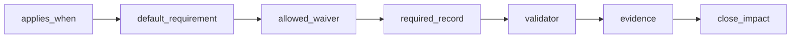
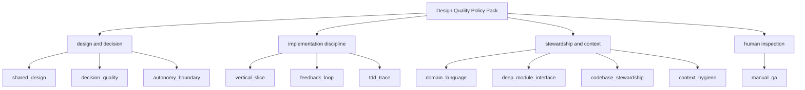
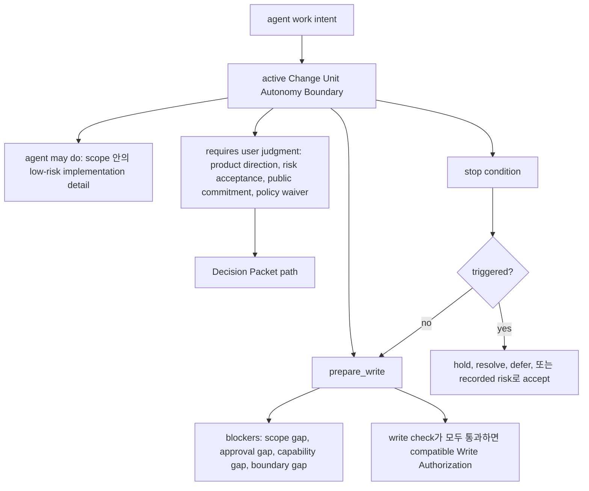
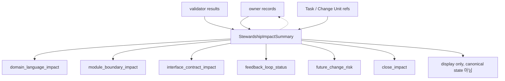
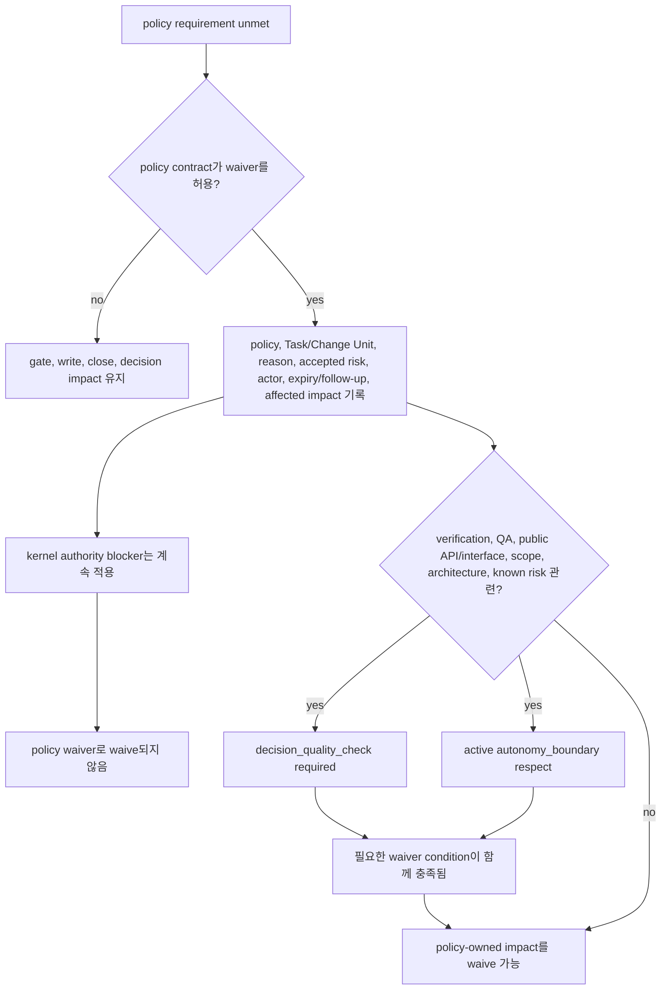
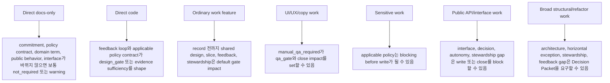
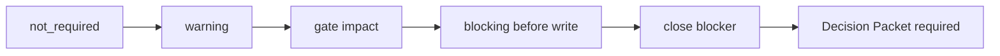
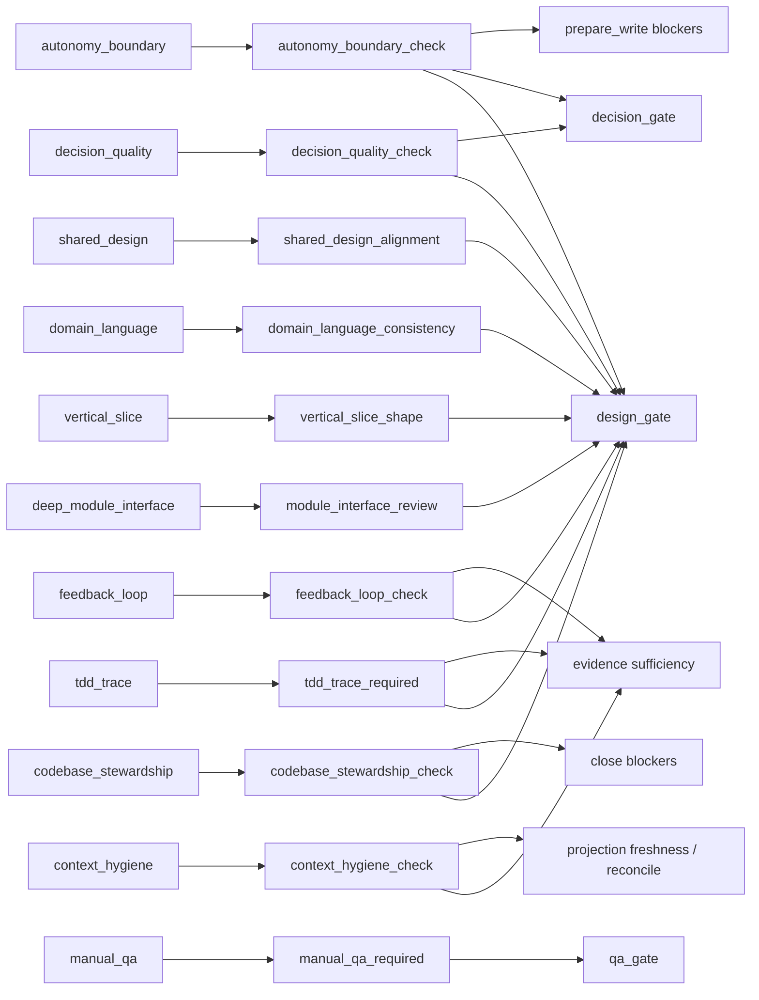

# 설계 품질 정책 팩

## 문서 역할

이 문서는 design-quality policy를 policy contract로 담당한다. 이 정책은 AI 지원 작업이 product design, domain language, module boundary, testing discipline, human QA, context hygiene와 정렬된 상태를 유지하도록 안내한다.

Policy strategy는 agent의 독립성을 보존하는 방향이다. Agent는 명확한 boundary 안에서는 스스로 움직이고, 의미 있는 선택은 decision으로 드러내며, product direction, risk acceptance, public commitment가 걸린 곳에서는 user judgment를 위해 멈춰야 한다.

Design-quality policy는 추가 kernel invariant가 아니다. Kernel은 lifecycle, gate transition, close semantic, blocker mechanic, state transition을 담당한다. 이 문서는 policy evaluator가 언제 `decision_gate`, `design_gate`, `qa_gate`, evidence sufficiency, `prepare_write` blocker, close blocker에 영향을 줄 수 있는지 말한다. Kernel transition 자체는 정의하지 않는다.

이 문서는 MCP schema, SQLite DDL, state transition table, full template을 정의하지 않는다.

## Policy Contract 형태

각 policy는 동일한 field를 사용한다.

| Field | Meaning |
|---|---|
| `name` | Stable policy name. |
| `applies_when` | Policy가 relevant해지는 condition. |
| `default_requirement` | 적용될 때 기본적으로 일어나야 하는 것. |
| `allowed_waiver` | 누가 waive할 수 있고 무엇을 기록해야 하는지. |
| `required_record` | Result를 저장하는 canonical state record 또는 record family. |
| `validator` | Compliance, warning, failure, blocker를 report하는 validator. |
| `evidence` | Policy가 기대하는 evidence 또는 projection ref. |
| `close_impact` | Unmet requirement가 close 또는 gate에 미치는 영향. |

Policy validator는 MCP API document가 담당하는 validator result schema를 반환한다.

## Policy Contracts

### Shared Design

| Field | Contract |
|---|---|
| `name` | `shared_design` |
| `applies_when` | Work request가 ambiguous하거나, scope/non-scope가 unclear하거나, user value alignment가 필요하거나, public interface/schema/auth/UX/workflow가 affected되거나, `work` task가 shaping을 필요로 할 때. |
| `default_requirement` | Goal, scope, non-goal, acceptance criteria, blocking decision, assumption, rejected option, domain-language impact, module/interface impact, first Change Unit shape를 기록한다. Agent assumption과 user judgment가 필요한 선택을 구분하고, 가장 blocking한 question을 한 번에 하나씩 묻고, 첫 safe Change Unit을 propose할 수 있으면 멈춘다. |
| `allowed_waiver` | User/operator가 reason과 design risk가 남을 때 follow-up을 기록하면 small obvious `direct` work, docs-only edit, emergency fix에 허용된다. |
| `required_record` | Shared Design record, Task shaping field, decision record, optional `DESIGN` 또는 `DEC` projection. |
| `validator` | `shared_design_alignment` |
| `evidence` | Task summary, acceptance criteria, decision ref, rejected option ref, domain/module/interface impact ref. |
| `close_impact` | Required인데 없으면 `design_gate=pending` 또는 `partial`로 set/keep한다. Risk가 high이고 waiver가 없으면 close를 block한다. Valid waiver는 `design_gate=waived`를 허용할 수 있다. |

### Decision Quality

| Field | Contract |
|---|---|
| `name` | `decision_quality` |
| `applies_when` | Design choice, product trade-off, scope expansion, public API/interface change, architecture choice, horizontal exception, verification waiver, QA waiver, known risk를 가진 acceptance가 있을 때. |
| `default_requirement` | Decision이 실행되기 전에 Decision Packet을 기록한다. Packet에는 context, considered option, trade-off, recommendation, uncertainty, reversibility, evidence ref, deferral consequence, residual risk가 포함되어야 한다. Agent recommendation과 user judgment 또는 risk acceptance를 분리해 둔다. `decision_kind=approval`에서는 sensitive-change scope와 boundary가 명확한지 평가하고, approval-shaped context를 product judgment resolution으로 취급하지 않는다. |
| `allowed_waiver` | Public interface, product, architecture, verification, QA, known-risk impact가 없고 사소하며 되돌리기 쉬운 choice에만 허용된다. Waiver에는 Decision Packet이 judgment를 개선하지 않는 이유를 기록해야 한다. |
| `required_record` | Decision Packet record와 rendered될 때 optional `DEC` projection. |
| `validator` | `decision_quality_check` |
| `evidence` | Decision Packet ref, option ref, evidence manifest ref, risk/waiver ref, risk acceptance가 포함될 때 residual-risk state ref, user judgment가 필요할 때 user acceptance ref. |
| `close_impact` | Blocking product judgment에 필요한 decision quality가 없으면 `decision_gate=required`, `pending`, 또는 `blocked`를 set/keep한다. Design quality에 영향을 주는 decision일 때만 `design_gate`에 반영한다. Unresolved user judgment, invalid deferral, unaccepted residual risk는 affected write 또는 close를 block한다. Valid recorded acceptance는 residual risk를 state ref에 보존한 채 close를 허용할 수 있다. |

### Autonomy Boundary

| Field | Contract |
|---|---|
| `name` | `autonomy_boundary` |
| `applies_when` | Agent가 ambiguous authority, user constraint, external side effect, irreversible edit, scope expansion, sensitive action, product judgment, public commitment, known stop condition이 있는 작업을 shaping하거나 executing할 때. |
| `default_requirement` | Agent가 user input 없이 할 수 있는 것, user judgment가 필요한 것, stop condition을 기록한다. Canonical boundary는 active Change Unit에 둔다. Change Unit이 아직 없으면 Task 또는 Shared Design이 shaping/proposed boundary ref를 가질 수 있다. Boundary는 low-risk implementation detail에서는 agent가 진행하게 하되, product direction, risk acceptance, public interface commitment, human judgment가 필요한 policy waiver에서는 멈추게 해야 한다. Autonomy Boundary는 scope grant가 아니며 active Change Unit 밖의 path, tool, command, network, secret, sensitive category를 authorize하지 않는다. |
| `allowed_waiver` | 요청에서 authority가 명확하고 stop condition이 현실적으로 trigger될 수 없는 좁은 `direct` work에 허용된다. Waiver에는 autonomy boundary가 필요 없는 이유를 기록해야 한다. |
| `required_record` | Active Change Unit의 canonical Autonomy Boundary record, Change Unit 생성 전 Task 또는 Shared Design shaping/proposed boundary ref, user-judgment item에 대한 Decision Packet record, trigger된 stop-condition ref. |
| `validator` | `autonomy_boundary_check` |
| `evidence` | User request ref, task constraint, policy ref, Decision Packet ref, stop-condition event, user response ref. |
| `close_impact` | `prepare_write`에서 trigger된 stop condition 또는 boundary gap은 write를 block한다. Product-judgment gap은 Decision Packet을 request/reference해야 하며 `decision_gate`에 영향을 준다. Design-quality gap은 `design_gate`에 영향을 줄 수 있다. Scope, approval, capability gap은 각자의 blocker로 남는다. Unresolved stop condition은 resolved, deferred, 또는 recorded risk로 accepted될 때까지 close를 block할 수 있다. |

### Domain Language

| Field | Contract |
|---|---|
| `name` | `domain_language` |
| `applies_when` | New product term이 나타나거나, existing term이 new meaning으로 쓰이거나, code와 product language가 diverge하거나, multiple name이 하나의 concept를 가리키거나, reviewer/evaluator가 term mismatch를 발견할 때. |
| `default_requirement` | Affected term의 meaning, code representation, "not this" boundary, related term, source, status를 record/update한다. Implementation agent는 task-relevant term만 pull하고, reviewer/evaluator는 relevant term을 받는다. |
| `allowed_waiver` | Work에 domain term impact가 없거나 term이 intentionally local/temporary일 때 허용된다. Waiver는 canonical term update가 필요 없는 이유를 기록해야 한다. |
| `required_record` | `record_kind=domain_term`으로 reference되는 `domain_terms` record; `DOMAIN-LANGUAGE`는 projection/proposal surface일 뿐이다. |
| `validator` | `domain_language_consistency` |
| `evidence` | Domain term ref, code ref, test naming ref, proposal용 reconcile item ref. |
| `close_impact` | Required term이 missing 또는 conflicting이면 `design_gate=partial` 또는 `stale`로 mark한다. Mismatch가 acceptance criteria, public behavior, verification confidence에 영향을 주면 close를 block한다. |

### Vertical Slice

| Field | Contract |
|---|---|
| `name` | `vertical_slice` |
| `applies_when` | Feature work, user-visible behavior, workflow change, integration behavior, medium/large `work` task. |
| `default_requirement` | Trigger/input, domain logic, persistence 또는 state, API/caller boundary, observable output, test evidence, optional Manual QA를 연결하는 thin end-to-end Change Unit을 선호한다. |
| `allowed_waiver` | Scaffold, test harness, deep module boundary, migration safety, public interface decision이 먼저 필요할 때 horizontal/enabling Change Unit을 허용한다. Change Unit은 `horizontal_exception_reason`을 기록하고, exception이 design 또는 architecture choice라면 Decision Packet을 link하며, 아직 의미 있는 end-to-end path가 없다는 이유가 기록되지 않는 한 follow-up vertical Change Unit을 기록해야 한다. |
| `required_record` | Change Unit field: `slice_type`, end-to-end path, completion condition, follow-up vertical Change Unit, validator result. |
| `validator` | `vertical_slice_shape` |
| `evidence` | Change Unit record, run summary, evidence manifest, test, user-visible인 경우 Manual QA ref. |
| `close_impact` | Vertical slice가 required인데 satisfied 또는 waived가 아니면 `design_gate=partial` 또는 `blocked`를 set한다. Justified horizontal exception은 follow-up risk가 recorded된 경우에만 close를 허용할 수 있다. |

### Feedback Loop

| Field | Contract |
|---|---|
| `name` | `feedback_loop` |
| `applies_when` | Implementation 시작 전, behavior-affecting write 전, TDD가 waived될 때, Manual QA가 expected될 때, 또는 agent가 change가 작동하는지 배울 credible한 방법이 필요할 때. |
| `default_requirement` | Implementation 전에 feedback loop를 정의한다. Loop는 test, typecheck, lint, build, browser smoke, Manual QA, explicit alternate loop 중 하나일 수 있다. 선택된 loop는 risk에 대해 가장 작은 credible loop여야 한다. TDD trace는 이 policy의 구현 방식 중 하나일 뿐 유일한 구현 방식은 아니다. |
| `allowed_waiver` | Implementation 또는 product behavior impact가 없는 docs-only edit, comment, formatting, advisory work에 허용된다. Waiver에는 executable, browser, Manual QA, alternate loop가 유용하지 않은 이유를 기록해야 한다. |
| `required_record` | `record_kind=feedback_loop`으로 reference되는 canonical `feedback_loops` record, selected-loop refs, validator results, TDD가 선택된 경우 `tdd_traces`, Manual QA가 선택되고 performed된 경우 Manual QA record, required QA가 아직 satisfying record를 갖지 못한 경우 `qa_gate=pending`, 실행 후 evidence manifest refs. |
| `validator` | `feedback_loop_check` |
| `evidence` | Feedback Loop refs, planned loop refs, test/typecheck/lint/build/browser smoke logs, Manual QA refs, alternate-loop justification, 사용된 경우 TDD trace refs. |
| `close_impact` | Feedback loop definition이 없으면 `design_gate=pending` 또는 `partial`로 남는다. Execution evidence가 없으면 evidence가 insufficient해질 수 있다. Manual QA loop failure는 Manual QA policy를 통해 `qa_gate`에 영향을 준다. |

Public mutation path: selected-loop definitions와 waivers는 `record_run(kind=shaping_update)` 중 `FeedbackLoopUpdate`로 기록합니다. Execution refs와 status는 implementation/direct runs 중 `EvidenceUpdates.feedback_loop_updates`로 update하거나, Manual QA가 selected loop일 때 `record_manual_qa.feedback_loop_ref`로 update합니다.

### TDD Trace

| Field | Contract |
|---|---|
| `name` | `tdd_trace` |
| `applies_when` | Domain logic, service module, bug fix, parser/validator, state transition, deep module internal, edge-case-heavy behavior. API/caller boundary와 integration behavior에는 권장된다. |
| `default_requirement` | TDD가 가장 알맞은 selected feedback loop일 때 TDD를 사용한다. 적어도 하나의 acceptance criterion 또는 behavior slice에 대해 red, green, refactor evidence를 기록한다. Trace를 evidence manifest에 link한다. |
| `allowed_waiver` | Docs, typo, throwaway prototype, exploratory UI prototype, initial scaffold, 또는 user/operator가 non-TDD justification과 alternate feedback loop를 기록한 경우 허용된다. |
| `required_record` | `tdd_traces` record와 rendered될 때 `TDD-TRACE` projection. |
| `validator` | `tdd_trace_required` |
| `evidence` | Failing test log, passing test log, refactor check log, diff ref, waived 시 non-TDD justification. |
| `close_impact` | Required TDD trace가 missing이면 `design_gate=partial`이 되고 evidence가 insufficient해질 수 있다. Valid non-TDD justification은 design policy를 satisfy할 수 있지만 그 자체로 behavior를 증명하지는 않는다. |

### Deep Module / Interface

| Field | Contract |
|---|---|
| `name` | `deep_module_interface` |
| `applies_when` | Public interface change, module boundary change, schema/data model change, auth/security boundary, compatibility impact, deep module internal, shallow-module risk. |
| `default_requirement` | Affected module, current role, proposed public interface, interface 뒤에 숨겨진 internal complexity, impacted caller, compatibility impact, test boundary를 identify한다. 충분한 internal capability를 뒤에 둔 작고 simple한 public interface를 선호한다. Public interface, compatibility, architecture choice에는 Decision Packet을 사용한다. |
| `allowed_waiver` | Public boundary impact, dependency direction change, compatibility risk가 없고 localized internal change일 때 허용된다. Module/interface review가 불필요한 이유를 기록해야 한다. |
| `required_record` | `record_kind=module_map_item`과 `record_kind=interface_contract`로 reference되는 `module_map_items` 및 `interface_contracts` records, decision record, optional `MODULE-MAP` / `INTERFACE-CONTRACT` projection. |
| `validator` | `module_interface_review` |
| `evidence` | Module map item ref, interface contract ref, caller impact list, boundary test, design decision, compatibility note. |
| `close_impact` | Required review가 missing이면 `design_gate=pending` 또는 `partial`로 남는다. Public interface 또는 compatibility risk가 있는데 review가 없으면 close를 block하거나 residual risk에 대한 user acceptance가 필요할 수 있다. |

### Codebase Stewardship

| Field | Contract |
|---|---|
| `name` | `codebase_stewardship` |
| `applies_when` | Work가 durable code structure, domain concept, module ownership, interface contract, architecture direction, deep-module boundary, testing strategy, cross-cutting exception을 touch할 때. |
| `default_requirement` | Change Unit의 stewardship view를 domain language, module map, interface contract, TDD/feedback loop, architecture watchpoint, deep-module boundary로 묶어 본다. Stewardship review는 general code review checklist가 아니라, local task completion이 domain language, module boundary, interface contract, feedback loop, testability, maintainability, future-change cost의 degradation을 숨기지 못하게 하는 장치다. Owner record를 source of truth로 사용하고, task-relevant ref만 기록하며, schema나 DDL을 duplicate하지 않고 drift에는 reconcile item을 만든다. |
| `allowed_waiver` | Durable structure, domain, interface, feedback-loop impact가 없는 isolated docs, comment, formatting, leaf edit에 허용된다. Waiver에는 stewardship review가 필요 없는 이유를 기록해야 한다. |
| `required_record` | Task 또는 Change Unit stewardship refs, `domain_terms`, `module_map_items`, `interface_contracts` records, `feedback_loops` records, TDD가 사용된 경우 `tdd_traces` refs, decision records, Task/Change Unit watchpoints, Journey Spine Entry refs, drift에 대한 reconcile items. Dedicated architecture watchpoint ref는 later DDL batch가 정의한 경우에만 사용할 수 있다. Canonical design-support refs는 `record_kind=domain_term`, `record_kind=module_map_item`, `record_kind=interface_contract`, `record_kind=feedback_loop`을 사용하며, Markdown projection refs는 optional display/proposal refs이다. |
| `validator` | `codebase_stewardship_check` |
| `evidence` | Domain term ref, module map item ref, interface contract ref, feedback loop ref, 사용된 경우 TDD trace ref, Task/Change Unit watchpoint, Journey Spine Entry ref, deep-module note, reconcile item ref, later DDL에서 정의된 경우에만 dedicated architecture watchpoint ref. |
| `close_impact` | Required stewardship review가 없으면 `design_gate=pending`, `partial`, 또는 `stale`로 남는다. Unresolved drift가 public behavior, module boundary, acceptance criteria, verification confidence에 영향을 주면 close를 block할 수 있다. |

```mermaid
flowchart LR
  DomainTerms["domain_terms"] --> Summary["StewardshipImpactSummary display"]
  ModuleMap["module_map_items"] --> Summary
  InterfaceContracts["interface_contracts"] --> Summary
  FeedbackRefs["feedback_loops / tdd_traces when TDD selected"] --> Summary
  DecisionPackets["Decision Packets"] --> Summary
  ResidualRisks["residual risks"] --> Summary
  Validator["codebase_stewardship_check"] --> Summary
  Summary --> Display["close-relevant stewardship impact"]
```

### StewardshipImpactSummary Display Shape

`StewardshipImpactSummary`는 Design Stewardship Default와 `codebase_stewardship` policy contract를 위한 derived display/summary shape다. Kernel Authority Invariant가 아니다. Derived display이지 canonical current record가 아니다. Owner record, validator result, ref에서 derive되며 새로운 canonical source of truth를 만들지 않는다.

Domain term, module map item, interface contract, Feedback Loop records, TDD가 selected된 경우 TDD Trace records, residual risk, Decision Packet은 계속 owner record로 남는다. Summary는 close-relevant status를 compact하게 render하고 해당 owner로 돌아가는 ref를 표시한다.

| Field | Values |
|---|---|
| `domain_language_impact` | `none` \| `updated` \| `conflict` \| `unresolved` |
| `module_boundary_impact` | `none` \| `local` \| `public_boundary` \| `unresolved` |
| `interface_contract_impact` | `none` \| `compatible` \| `breaking` \| `unresolved` |
| `feedback_loop_status` | `defined` \| `missing` \| `waived` |
| `future_change_risk` | `none` \| `visible` \| `accepted` \| `unresolved` |
| `close_impact` | `none` \| `blocks_close` \| `requires_decision` \| `residual_risk` |

`feedback_loop_status`는 referenced `feedback_loops` rows와 validator results에서 derive된다. TDD가 selected된 경우 referenced `tdd_traces` row는 execution evidence를 satisfy할 수 있지만 selected loop의 canonical owner는 아니다.

### Manual QA

| Field | Contract |
|---|---|
| `name` | `manual_qa` |
| `applies_when` | UI change, UX flow change, copy/error message change, onboarding/checkout/auth/billing 또는 other critical flow, accessibility impact, visual output, browser-only behavior, product taste judgment가 필요한 result. |
| `default_requirement` | Manual QA profile, setup, checklist, result, finding, evidence ref, performer, 관련될 때 product taste judgment, next action을 기록한다. Profile에는 `ui_quality`, `workflow`, `copy`, `accessibility`, `browser_smoke`, `performance_smoke`가 포함된다. |
| `allowed_waiver` | User/operator가 명시적으로 QA를 waive하고 waiver reason을 기록할 때 허용된다. Known product 또는 user risk를 accept하는 Manual QA waiver에는 decision quality가 필요하다. Legal, safety, privacy, high-impact user harm이 inspection을 요구하는 경우에는 적절하지 않다. |
| `required_record` | `manual_qa_records`; `qa_gate`가 canonical aggregate gate. |
| `validator` | `manual_qa_required` |
| `evidence` | Manual QA record, screenshot, note, browser log, walkthrough ref, finding ref. |
| `close_impact` | Manual QA가 required이면 `qa_gate=pending` 또는 `failed`가 successful close를 block한다. `qa_gate=waived`에는 waiver reason이 필요하다. QA failed는 rework를 만들거나 close를 block하거나 explicit follow-up path를 요구해야 한다. |

### Context Hygiene

| Field | Contract |
|---|---|
| `name` | `context_hygiene` |
| `applies_when` | Work가 interruption 후 resume되거나, old PRD/design doc/issue가 있거나, code path가 moved되었거나, acceptance criteria가 changed되었거나, module/interface/domain record가 changed되었거나, evaluator/reviewer가 focused bundle을 필요로 할 때. |
| `default_requirement` | Current Task summary, Journey Card와 relevant Journey Spine ref, latest run/eval/evidence ref, relevant policy ref, current acceptance criteria를 push한다. Stale PRD, closed issue, old design doc, coding standard, long log는 필요할 때만 pull-only reference로 가져온다. Stale doc을 mark하고 chat을 state로 취급하지 않는다. |
| `allowed_waiver` | Product state, design state, evidence state가 바뀌지 않는 short advisor-only work에 허용된다. |
| `required_record` | Task summary, projection freshness, drift에 대한 reconcile item, evidence manifest, validator result. |
| `validator` | `context_hygiene_check` |
| `evidence` | Current projection ref, freshness state, stale ref, reconcile item ref, evaluator용 bundle contents. |
| `close_impact` | Stale critical context는 `design_gate=stale`, evidence stale, projection stale로 mark될 수 있다. Agent가 scope, evidence, current acceptance criteria를 safe하게 determine할 수 없으면 write 또는 close를 block할 수 있다. |

## Waiver 규칙

Waiver는 explicit, scoped, recorded여야 한다. Waiver에는 다음을 포함해야 한다.

- policy name
- task와 Change Unit
- reason
- accepted risk
- waived한 actor
- 필요할 때 expiry 또는 follow-up
- affected gate 또는 close impact

Policy waiver는 policy contract가 허용하는 곳에서만 design-quality requirement를 satisfy할 수 있다. Product write scope, sensitive-change approval, required evidence coverage, required acceptance를 waive하지 않는다. Verification waiver는 kernel close semantics가 담당하며 `assurance_level=detached_verified`를 만들면 안 된다.

Verification, QA, public API/interface commitment, scope expansion, architecture direction, known risk가 있는 acceptance와 관련된 waiver는 `decision_quality`도 satisfy하고 active `autonomy_boundary`를 respect해야 한다.

## MVP Severity Defaults

이 matrix는 policy validator를 위한 default MVP severity router다. Reference runner가 common task shape에서 어떤 finding을 advisory로 두고 어떤 finding을 gate에 반영해야 하는지 알려 준다. 이 matrix는 `applies_when`, `default_requirement`, `allowed_waiver`, `close_impact`를 약화하지 않는다. Policy contract가 이 matrix보다 더 강하게 적용되면 policy contract가 우선한다.

Default impact vocabulary:

- `not_required`: 해당 policy의 `applies_when`이 독립적으로 true가 아니면 finding을 emit할 필요가 없다.
- `warning`: visible validator finding을 emit하되 default로 write 또는 close를 block하지 않는다.
- `design_gate=pending` 또는 `design_gate=partial`: shaping, owner record, evidence, waiver가 incomplete하다. `prepare_write`는 이 matrix 또는 policy contract가 gap을 write-blocking이라고 말할 때만 block한다.
- `blocking before write`: issue가 unresolved인 동안 `prepare_write`는 affected product write를 authorize하면 안 된다. Decision Packet 또는 approval request를 create하거나 route하는 것은 blocker path를 기록할 뿐이며 write를 authorize하지 않는다. Authorization에는 issue가 resolved 또는 validly waived되고, relevant Decision Packet이 affected operation에 대해 resolved 또는 otherwise compatible이며, 필요한 sensitive approval이 granted된 뒤 later compatible `prepare_write`가 Write Authorization을 create해야 한다.
- `close blocker`: successful close는 pass 또는 compatible waiver를 기다린다. Accepted residual risk는 kernel과 relevant policy contract가 risk-accepted close path를 허용하는 경우에만 도움이 되며, evidence sufficiency, required QA, sensitive approval, final acceptance를 대체하지 않는다.
- `Decision Packet required`: Decision Packet state path를 사용하고 applicable한 경우 `decision_gate=required`, `pending`, 또는 `blocked`를 set/keep한다.

이것은 policy impact vocabulary이며 API `ValidatorResult.findings.severity` enum이 아니다. Validator findings는 계속 `info`, `warning`, `error`, `blocker`를 사용한다. Merged policy impact는 gates, blocked reasons, close blockers, Decision Packet needs, waiver eligibility, fixture-observed derived state를 통해 드러난다.

### Severity Composition Rule

하나 이상의 task shape, policy contract, validator finding이 동시에 적용되면 policy evaluator는 같은 affected concern에 대해 가장 약한 impact가 아니라 가장 강한 applicable impact를 유지해 compose한다. "Same affected concern"은 전체 Task도 아니고 단순히 같은 validator ID도 아니다. Affected gate, check, blocker target, affected operation phase, affected scope 또는 record refs, close/write/decision concern을 포함하는 같은 policy-relevant target을 뜻한다. 서로 다른 concerns는 union으로 보존하며, 같은 concern에서 경쟁하는 impacts에만 strongest-impact rule을 사용한다. Default policy-impact order는 다음과 같다.

`not_required` < `warning` < `design_gate=pending`, `design_gate=partial`, `design_gate=stale`, `qa_gate=pending` 같은 gate impact < `blocking before write` < `close blocker` < `Decision Packet required`.

이 order는 같은 concern에서 약한 default를 무시할 수 있는지를 결정한다. 서로 다른 affected gate를 하나로 collapse하지 않는다. 한 finding이 `design_gate`에 영향을 주고 다른 finding이 `qa_gate`, `decision_gate`, evidence sufficiency, residual-risk visibility에 영향을 주면 merged result는 모든 affected gates, blockers, refs를 유지한다. `Decision Packet required`는 judgment-routing impact이지 write blocker, close blocker, evidence sufficiency, required QA, required approval, residual-risk visibility를 대체하지 않는다. Decision Packet은 finding의 user-judgment 부분을 resolve할 수 있지만, 독립적인 write blocker 또는 close blocker는 자체 policy 또는 kernel condition이 satisfy될 때까지 남는다.

Validator는 모든 relevant finding을 report해야 한다. Composition rule은 merged gate, write-blocker, close-blocker, waiver, Decision Packet impact를 결정하지만, 더 약한 finding을 validator result, evidence, status, conformance output에서 숨기면 안 된다. Primary public `ToolError` 선택은 API가 소유한 [Primary Error Code Precedence](05-mcp-api-and-schemas.md#primary-error-code-precedence)를 따른다. 이 policy rule은 error-code precedence를 재정의하거나 secondary error를 suppress하지 않는다.

Severity는 explicit user request, sensitive category, public commitment, public API/interface 또는 schema impact, known risk가 있는 acceptance, residual-risk visibility, stale critical context, 해당 case를 blocking으로 assert하는 conformance fixture에 의해 matrix default보다 올라갈 수 있다. Severity는 relevant policy contract 아래 기록된 allowed waiver를 통해서만 낮아질 수 있으며, 해당 contract가 waiver를 허용하는 policy-owned impact에만 적용된다. Policy waiver는 missing scope, missing sensitive approval, required evidence insufficiency, required acceptance, Write Authorization requirements 같은 Kernel Authority blocker를 낮추지 않는다. 또한 API primary error precedence를 바꾸지 않는다. 이 rule은 policy-contract interpretation, validators, gates, write blockers, close blockers, Decision Packet needs에 영향을 주지만 Design Stewardship Defaults를 Kernel Authority Invariants로 만들지는 않는다.

| Task shape | Warning 또는 `not_required` default | Gate/write default | Close/decision default |
|---|---|---|---|
| Direct docs-only | Docs가 product commitment, policy contract, domain term, public behavior, interface meaning을 바꾸지 않는 한 `vertical_slice_shape`, `tdd_trace_required`, `manual_qa_required`, `module_interface_review`, `codebase_stewardship_check`는 `not_required`다. `context_hygiene_check`와 `domain_language_consistency`는 stale projection 또는 terminology drift에 대해 warning일 수 있다. | Default로 design-quality write blocker는 없다. Scope가 ambiguous하거나 design/policy contract edit이면 `shared_design_alignment`가 `design_gate=pending`이 된다. User judgment, sensitive content, public commitment, residual risk가 있을 때만 `autonomy_boundary_check` 또는 `decision_quality_check`가 block한다. | Default close blocker는 없다. Docs drift가 acceptance, verification confidence, public commitment, required projection freshness에 영향을 주면 close가 block될 수 있다. Policy commitment change, public commitment, known-risk acceptance에는 `Decision Packet required`다. |
| Direct code | Obvious leaf/internal edit에는 `shared_design_alignment`, `vertical_slice_shape`, `manual_qa_required`가 `not_required`다. Minor maintainability concern에는 `codebase_stewardship_check`가 warning일 수 있다. | Behavior-affecting write 전에는 `feedback_loop_check`가 `design_gate=pending`이다. `tdd_trace_required`, `domain_language_consistency`, `module_interface_review`는 각 policy contract가 적용될 때만 `design_gate=partial`이 된다. Scope 또는 authority gap은 `autonomy_boundary_check`가 block하고, behavior-affecting write에 credible loop가 없으면 `feedback_loop_check`가 block한다. | Missing run evidence, required TDD/domain/interface record, unresolved behavior risk가 acceptance 또는 verification confidence에 영향을 주면 `close blocker`가 될 수 있다. Product judgment, known risk가 있는 waiver, scope expansion에는 `Decision Packet required`다. |
| Ordinary work feature | Feature가 user-visible, workflow-affecting, browser/product-taste dependent가 아니면 `manual_qa_required`는 `not_required`다. Domain logic, service behavior, bug repair, state transition, edge-heavy behavior가 아니면 `tdd_trace_required`는 warning일 수 있다. | Record가 생기기 전까지 `shared_design_alignment`, `vertical_slice_shape`, `feedback_loop_check`, `codebase_stewardship_check`는 default로 `design_gate=pending` 또는 `design_gate=partial`이다. Contract가 적용되면 `domain_language_consistency`와 `module_interface_review`도 design gate에 들어온다. Missing Autonomy Boundary, unresolved decision, missing feedback loop는 `blocking before write`가 될 수 있다. | Required vertical-slice, feedback, stewardship, evidence gap은 `close blocker`가 될 수 있다. Scope expansion, horizontal exception, product trade-off, residual-risk acceptance에는 `Decision Packet required`다. |
| UI/UX/copy work | Alternate credible loop가 있으면 `tdd_trace_required`는 default로 `not_required`다. Schema, auth, public interface, compatibility를 touch하지 않으면 `module_interface_review`는 warning이다. | `shared_design_alignment`, `feedback_loop_check`, copy-relevant `domain_language_consistency`는 default로 `design_gate=pending` 또는 `design_gate=partial`이다. `manual_qa_required`는 QA path를 선택하고 `qa_gate=pending`을 set할 수 있다. Product-taste authority 또는 stop condition이 unclear하면 `autonomy_boundary_check`가 block한다. | `manual_qa_required`는 `qa_gate=pending` 또는 `failed`를 set하며, validly waived되지 않으면 `close blocker`다. Material UX/copy trade-off, known user/product risk가 있는 QA waiver, public commitment에는 `Decision Packet required`다. |
| Sensitive work | Unrelated policy는 `not_required`로 남지만, sensitive category가 scope, approval, user harm, privacy, legal, safety, security, secret, irreversible action, external side effect에 영향을 주면 applicable policy는 warning-only가 아니다. | Applicable design policy는 record, approval, waiver가 생길 때까지 `design_gate=pending`에서 시작한다. Affected sensitive path에서는 `autonomy_boundary_check`, `decision_quality_check`, approval/scope Core check, 필요한 `feedback_loop_check` 또는 `manual_qa_required`가 `blocking before write`다. | Evidence, QA, residual-risk visibility, unresolved approval, unaccepted risk는 `close blocker`다. Approval context, product judgment, waiver, risk acceptance에는 `Decision Packet required`다. |
| Public API/interface work | UI/workflow docs 또는 browser-visible behavior가 affected되지 않으면 `manual_qa_required`는 `not_required`다. Behavior, domain, compatibility, edge-heavy logic이 involved되지 않으면 `tdd_trace_required`는 warning일 수 있다. | `shared_design_alignment`, `module_interface_review`, `feedback_loop_check`, `codebase_stewardship_check`, relevant `domain_language_consistency`는 default로 `design_gate=pending` 또는 `design_gate=partial`이다. Public commitment, compatibility risk, breaking change, boundary ambiguity에는 `decision_quality_check`, `module_interface_review`, `autonomy_boundary_check`가 `blocking before write`다. | Unresolved compatibility, interface review, public commitment, evidence gap은 `close blocker`다. Breaking, irreversible, compatibility, residual-risk choice에는 `Decision Packet required`다. |
| Broad structural/refactor work | User-visible behavior가 affected되지 않으면 `manual_qa_required`는 `not_required`다. `tdd_trace_required`는 justification과 evidence가 있을 때만 alternate loop를 사용할 수 있다. | `shared_design_alignment`, `vertical_slice_shape` 또는 recorded horizontal exception, `module_interface_review`, `codebase_stewardship_check`, `feedback_loop_check`, relevant `domain_language_consistency`는 default로 `design_gate=pending` 또는 `design_gate=partial`이다. Architecture direction, dependency direction, scope expansion, unclear authority에는 `decision_quality_check`와 `autonomy_boundary_check`가 `blocking before write`다. | Stewardship drift, missing follow-up vertical slice, missing evidence, unresolved module/interface risk, unaccepted residual risk는 `close blocker`가 될 수 있다. Architecture choice, horizontal exception, accepted residual risk에는 `Decision Packet required`다. |

## Policy-To-Validator Mapping

| Policy | Validator | Primary gate or state impact |
|---|---|---|
| `shared_design` | `shared_design_alignment` | `design_gate` pending/partial/passed/waived |
| `decision_quality` | `decision_quality_check` | `decision_gate` required/pending/blocked/resolved; applicable한 경우 `design_gate` |
| `autonomy_boundary` | `autonomy_boundary_check` | `prepare_write` blockers, `decision_gate`, `design_gate` |
| `domain_language` | `domain_language_consistency` | `design_gate` partial/stale/passed |
| `vertical_slice` | `vertical_slice_shape` | `design_gate` partial/blocked/passed |
| `feedback_loop` | `feedback_loop_check` | `design_gate` and evidence sufficiency |
| `tdd_trace` | `tdd_trace_required` | `design_gate` and evidence sufficiency |
| `deep_module_interface` | `module_interface_review` | `design_gate` partial/blocked/passed |
| `codebase_stewardship` | `codebase_stewardship_check` | `design_gate` pending/partial/stale/passed and close blockers |
| `manual_qa` | `manual_qa_required` | `qa_gate` pending/passed/failed/waived |
| `context_hygiene` | `context_hygiene_check` | projection freshness, reconcile, evidence/design stale |

Reference MVP는 minimal validator를 먼저 구현할 수 있지만, warning과 blocker behavior를 나누는 task-shape router로 MVP severity defaults를 사용하고, conformance fixture가 policy name을 바꾸지 않고 커질 수 있도록 validator ID는 stable하게 유지해야 한다.
