# Agent 통합

## 문서 역할

이 문서는 agent surface를 하네스에 연결할 때 지켜야 하는 공통 integration contract를 설명한다. Capability tier, capability profile, generated manifest expectation, push/pull context 원칙, fallback semantic, Role Lens behavior, reference surface contract, connector conformance 개요를 정의한다.

본문은 product name에 중립적이다. Surface별 recipe는 [Appendix B](appendix/B-surface-cookbook.md)에 둔다.

이 문서는 kernel state transition, MCP request/response schema, SQLite DDL, capability gate, operational fixture detail, surface-specific cookbook을 정의하지 않는다.

## 통합 목표

통합의 목표는 사용자가 agent와 자연스럽게 대화하는 동안, 하네스가 bounded work, state recording, evidence, verification, Manual QA, acceptance, projection, reconcile flow를 뒤에서 안정적으로 제공하는 것이다.

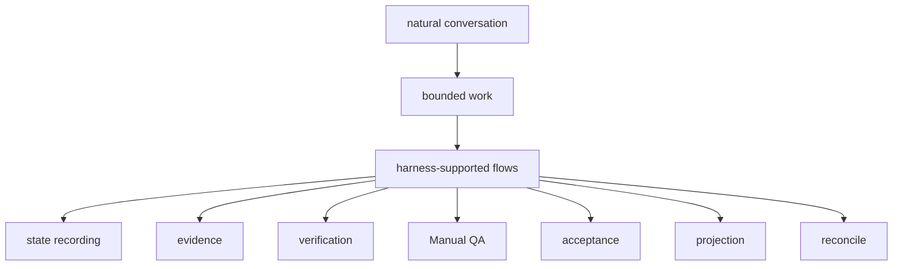

Integrated surface는 agent가 다음을 할 수 있게 도와야 한다.

- status 또는 intake로 시작
- `advisor`, `direct`, `work`로 분류
- work를 scoped Change Unit으로 shaping
- 사용자 판단 없이 agent가 진행할 수 있는 일을 Autonomy Boundary로 shaping/update
- design-quality policy가 적용될 때 check
- state change에는 MCP tool call 사용
- product write 전 `prepare_write`와 반환된 Write Authorization 존중
- Write Authority Summary를 Autonomy Boundary와 별도로 표시
- guard, freeze, careful-mode 요청을 optimistic authority claim이 아니라 capability-scoped safety control로 표현
- blocking product judgment에는 Decision Packet을 request 또는 display
- agent를 더 쉽게 steer할 수 있을 때 role-based review lens를 non-authoritative guidance로 제공
- run, artifact, evidence, user decision, QA, acceptance 기록
- approval, product decision, QA waiver, verification waiver, residual-risk acceptance, final acceptance 구분
- successful close 전에 알려진 close-relevant residual risk를 visible하게 표시
- detached verification launch 또는 package
- projection refresh 또는 reconcile

## 공통 통합 구조

```text
사용자 대화 surface
  -> 짧은 always-on rules/context
  -> harness skill, command, 또는 playbook
  -> harness MCP server
  -> harness Core
  -> adapter, hook, sidecar, validator, 또는 isolation layer
```

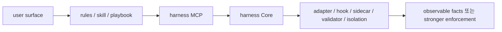

### Always-On Rules

Always-on rule은 짧아야 한다. Agent에게 언제 harness를 쓰는지, status 또는 Journey Card를 어디서 읽는지, product write에는 `prepare_write`가 필요하다는 점을 알려주면 충분하다.

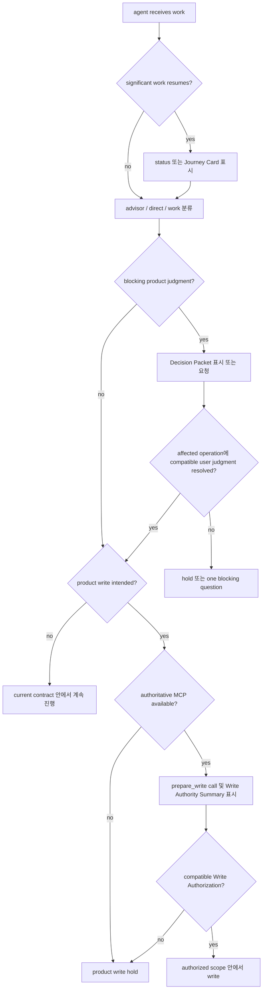

Always-on rule은 user agency도 보존해야 한다.

- 중요한 work를 재개하기 전에 현재 Journey Card를 보여준다.
- Decision Packet이 필요한 상황을 포괄적인 승인 질문으로 뭉개지 않는다.
- 한 번에 하나의 blocking question만 묻고, 가능하면 recommendation과 uncertainty를 함께 제시한다.
- AFK implementation은 active Change Unit scope, Autonomy Boundary latitude, 적용되는 granted sensitive approval, 실제 product write 전 compatible `prepare_write` / Write Authorization이 모두 맞을 때만 허용한다.
- Autonomy Boundary는 judgment latitude이지 write authority가 아니다.
- Work가 write를 시작하려 할 때 Write Authority Summary를 보여준다.
- Authoritative MCP가 unavailable이면 product write를 hold한다.
- Planning direction, product trade-off, QA waiver, verification risk acceptance, final acceptance는 사용자가 쥔다.

Write Authority Summary는 active scoped Change Unit의 scope, `prepare_write`, approval, allowed path/tool/command/network/secret, product-judgment blocker를 제거하는 compatible Decision Packet ref에서 나온 current write boundary display다. Decision Packet은 그 자체로 write를 authorize하지 않는다. Autonomy Boundary는 agent가 추가 user decision 없이 행사할 수 있는 judgment만 설명한다.

Always-on rule에는 full state transition table, MCP schema, full template, 긴 design playbook, 모든 historical project context를 넣지 않는다.

### Skill Or Playbook Layer

Skill/playbook layer는 절차를 가르친다.

- status, intake, next를 언제 call할지
- status/next의 `recommended_playbooks`를 optional stage-router guidance로 어떻게 사용할지
- `advisor`/`direct`/`work`를 어떻게 분류할지
- shaping question을 어떻게 물을지
- Change Unit을 어떻게 form할지
- Autonomy Boundary를 어떻게 shaping/update할지
- blocking product judgment에 Decision Packet을 어떻게 request 또는 display할지
- write 전 Write Authority Summary를 어떻게 보여주고 compatible Write Authorization을 run과 함께 기록할지
- user decision을 어떻게 기록할지
- approval, product decision, QA waiver, verification waiver, residual-risk acceptance, final acceptance를 어떻게 구분할지
- TDD trace, evidence, Manual QA, acceptance를 어떻게 record할지
- two review stages를 어떻게 실행할지: 먼저 Spec Compliance Review, 그 다음 Code Quality / Stewardship Review
- Role Lens command 또는 prompt를 non-authoritative playbook guidance로 어떻게 expose할지
- successful close 전에 알려진 close-relevant residual risk를 visible하게 하고, risk-accepted close에는 accepted Residual Risk refs를 요구하며, required acceptance는 close-relevant residual risk가 visible한 뒤에만 record하는 방법
- work verification이 왜 detached되어야 하는지
- stale projection과 reconcile을 어떻게 처리할지

Stage routing은 shared-design, product-review, eng-review, design-review, security-review, tdd-loop, spec-review, code-quality-review, qa-review, guard-check, release-handoff, browser-qa-candidate 같은 recommended playbooks를 사용할 수 있습니다. 이 recommendations는 skill/playbook layer 안에 있습니다. Display guidance일 뿐이며 state를 mutate하거나, write를 authorize하거나, gate를 satisfy하거나, evidence를 만들거나, work를 verify하거나, QA를 waive하거나, risk를 accept하거나, Task를 close하지 않습니다. Recommended playbook이 product judgment를 제안하면 surface는 existing Decision Packet 또는 normal Decision Packet request path로 route해야 합니다.

#### Role Lens

Role Lens는 사용자가 익숙한 review posture로 agent를 steer할 수 있게 하는 non-authoritative skill 또는 playbook surface입니다. Initial lenses는 다음과 같습니다.

- `product-review`
- `eng-review`
- `design-review`
- `security-review`
- `qa-review`
- `release-handoff`

Connector는 이를 slash command, button, prompt snippet, recommended playbook으로 expose할 수 있습니다. Lens name은 review posture를 고를 뿐 authority path를 고르지 않습니다. Role Lens output은 parallel record를 만들지 말고 existing display와 routing shape를 재사용해야 합니다. 다음을 낼 수 있습니다.

- `DecisionPacketCandidate` 또는 existing Decision Packet route
- 실제 validator/check가 emit할 validator finding candidate 또는 suggested `ValidatorResult` route
- evidence requirement
- Manual QA requirement
- residual-risk candidate
- release handoff report input
- recommended next playbook

Role Lens output은 그 자체로 canonical state를 mutate하거나, write를 authorize하거나, approval을 grant하거나, Decision Packet을 satisfy하거나, QA 또는 verification을 waive하거나, residual risk를 accept하거나, result를 accept하거나, Task를 close하거나, assurance를 upgrade하면 안 됩니다. Lens가 state change가 필요한 일을 찾아내면 surface는 normal MCP tool과 Core path로 route합니다. 즉 Decision Packet request, evidence record, Manual QA record, verification launch/record, acceptance request, 또는 relevant gate와 blocker가 허용하는 close path를 사용합니다.

`recommended_playbooks`는 Role Lens suggestion의 normal status/next integration point입니다. 예를 들어 sensitive authentication scope가 active이면 status가 `security-review`를, UI/UX 또는 visual policy가 relevant하면 `design-review`를, Manual QA가 likely하면 `qa-review`를, close가 가까우면 `release-handoff`를 recommend할 수 있습니다. 이 recommendations는 유용하고 이름이 명확해도 display guidance로 남습니다.

Two-stage review procedure는 stages를 visible하게 분리해야 합니다.

1. Spec Compliance Review는 requested work가 current Harness authority 안에서 complete한지 확인합니다: acceptance criteria, Change Unit completion conditions, scope/write authority compatibility, Decision Packet compatibility, evidence coverage, residual-risk visibility.
2. Code Quality / Stewardship Review는 implementation이 maintainable한지 확인합니다: domain language, module/interface boundary, vertical slice shape, feedback loop 또는 TDD trace, codebase stewardship, context hygiene, follow-up risk.

두 stage의 findings는 validator results, evidence gaps, Decision Packet candidates, Change Unit update recommendations, residual-risk candidates, close blockers로 route되어야 합니다. Same-session review는 useful self-checking일 수 있지만 detached verification이 아니며 `assurance_level=detached_verified`로 표시하면 안 됩니다. Detached verification에는 여전히 valid independence boundary와 Eval path가 필요합니다.

Core와 validator가 policy를 enforce한다. Skill은 guidance이지 authority가 아니다.

### MCP Layer

MCP는 preferred state boundary다. Public tool name과 schema는 MCP API document가 담당한다. Integration doc은 tool intent를 reference할 수 있지만, connector는 `05-mcp-api-and-schemas.md`의 schema를 사용해야 한다.

### Adapter, Hook, Sidecar, Validator, Isolation

Adapter와 sidecar는 surface behavior를 observable fact 또는 stronger enforcement로 바꾼다.

- artifact capture
- command output capture
- changed-path detection
- generated file drift detection
- projection freshness detection
- approval and scope guard support
- same-session verification guard support
- evaluator read-only 또는 fresh-context support
- Manual QA capture support

이 layer는 guarantee level을 높일 수 있지만 kernel capability gate를 만들지는 않는다.

## Capability Tier

| Tier | Meaning | Typical capability |
|---|---|---|
| `T0 Context` | Surface가 harness principle을 읽을 수 있음 | rules/context file |
| `T1 Skill` | Surface가 harness procedure를 따를 수 있음 | skill, command, prompt, playbook |
| `T2 MCP` | Surface가 harness tool과 resource를 call할 수 있음 | MCP server connection |
| `T3 Capture` | Surface가 diff, log, run output을 reliable하게 반환할 수 있음 | structured output, wrapper, adapter |
| `T4 Guard` | Surface가 out-of-scope file, command, network, secret을 실행 전에 block 또는 interrupt할 수 있음 | hook, permission system, policy engine, sidecar |
| `T5 Isolation` | Surface가 verification 또는 risky work를 별도 boundary에서 run할 수 있음 | worktree, sandbox, fresh process, isolated runner |
| `T6 QA Capture` | Surface가 browser, screenshot, walkthrough, workflow-recording, Manual QA artifact를 structure할 수 있음 | browser runner, screenshot capture, console/network capture, accessibility snapshot, QA note capture |

일반 interactive harness use는 `T2` 이상에서 가장 자연스럽다. Reliable detached verification에는 보통 `T3` capture와 실제 independence boundary가 필요하다. High-risk work는 가능하면 `T4` guard 또는 `T5` isolation을 사용해야 한다. `T6`는 UI/UX evidence를 개선하지만, human QA note를 기록할 수 있다면 MVP에 필수는 아니다.

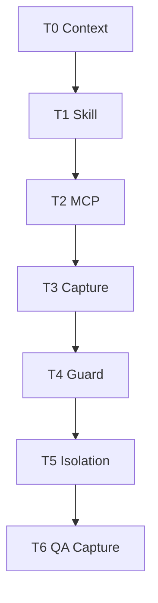

### T6 QA Capture Semantics

`T6 QA Capture`는 connected surface가 browser 또는 workflow QA artifacts를 structure할 수 있는 능력을 설명합니다. `browser_smoke`, `workflow`, `ui_quality`, `accessibility` 같은 Manual QA profile에 유용하지만 kernel gate가 아니며 MVP에 required가 아닙니다.

Browser QA capture를 claim하는 profile은 supported capture type과 fallback behavior를 이름으로 밝혀야 합니다. Candidate capture type에는 screenshot, console log, network trace, accessibility snapshot, workflow recording이 포함됩니다. Captured files는 durable storage 전에 redaction 및 secret/PII handling을 따라야 하며, API artifact schema에 따라 일반적으로 `qa_capture`, `screenshot`, `log`, `other` 같은 artifact kind로 Manual QA record 또는 Feedback Loop execution에 attach되는 artifact refs로 register되어야 합니다.

Browser QA Capture는 human taste, experience quality, copy, accessibility interpretation, visual review가 필요한 경우 Manual QA judgment를 대체하지 않습니다. Eval path가 verification independence requirements를 독립적으로 충족하지 않는 한 detached verification도 대체하지 않습니다. Surface가 browser workflow를 capture할 수 없으면 connector는 human Manual QA notes와 manually supplied artifacts로 fallback해야 합니다.

## Capability Profile

Harness connector는 product 또는 surface name에서 behavior를 가정하지 않고 capability profile을 사용해야 한다.

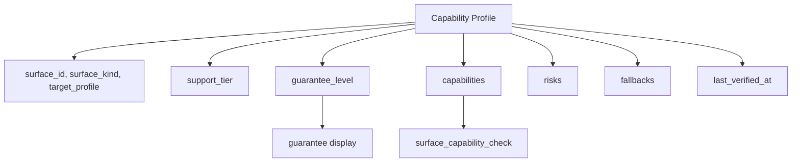

```yaml
surface_id: SURF-0001
surface_kind: generic_agent
target_profile: local_cli
detected_version: optional string
capability_profile_version: 1
last_verified_at: 2026-05-06T10:05:00+09:00
support_tier: T2
guarantee_level: cooperative
capabilities:
  project_rules: true
  skills_or_commands: true
  mcp_tools: true
  mcp_resources: true
  structured_output: false
  artifact_capture: manual
  hooks: false
  pre_tool_guard: false
  explicit_permissions: false
  changed_path_detection: validator
  fresh_verify: manual_bundle
  worktree_isolation: false
  local_sidecar: false
  browser_qa_capture: false
  screenshot_capture: false
  console_log_capture: false
  network_trace_capture: false
  accessibility_snapshot_capture: false
  workflow_recording_capture: false
risks:
  - no pre-tool guard
fallbacks:
  - cooperative prepare_write discipline
  - changed_paths validator
  - manual verification bundle
  - human Manual QA notes and manually supplied QA artifacts
```

Target profile value 예시:

- `local_cli`
- `ide_chat`
- `ide_agent`
- `cloud_agent`
- `extension`
- `custom_agent`
- `manual_bundle`

Capability profile은 version, MCP config, hook, permission, workspace policy, generated file, conformance result, capture method, QA capture method, browser test environment, redaction policy, artifact retention behavior가 바뀌면 refresh해야 한다.

## Guarantee Levels

Integration은 [04-runtime-architecture.md](04-runtime-architecture.md#guarantee-levels)에 정의된 guarantee level을 사용하고, 이를 connected surface profile, current enforcement path, fallback choice에 적용한다.

이 문서는 connector profile이 그 level을 report하고 display하는 방식을 담당한다. Surface name에서 더 강한 level을 추론하면 안 되며, guarantee level을 approval, verification, QA, acceptance, kernel gate로 취급하면 안 된다.

## Guarantee Display Requirements

Surface behavior에 의존하는 모든 status 또는 `prepare_write` result는 실제 guarantee level을 보여야 한다. Level은 surface name에서 추론한 약속이 아니라 connected profile과 current enforcement path의 property로 표시한다.

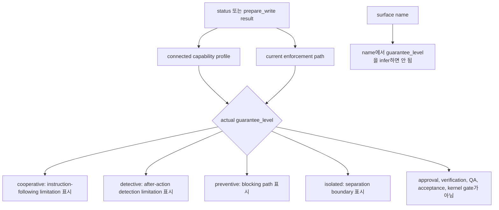

User-visible examples:

| Level | Example display text |
|---|---|
| `cooperative` | "이 surface는 Harness decision을 따를 것으로 기대되지만, out-of-scope write를 실행 전에 물리적으로 막지 못할 수 있습니다. Changed-path validation으로 사후 위반을 감지할 수 있습니다." |
| `detective` | "Harness는 action 후 changed path나 artifact를 관찰해 scope/evidence/projection을 stale 또는 blocked로 표시할 수 있습니다." |
| `preventive` | "Hook, wrapper, permission layer, sidecar가 위반 write를 실행 전에 막을 수 있습니다." |
| `isolated` | "Risky work 또는 verification이 별도 worktree, sandbox, process, 또는 동등한 boundary에서 실행됩니다." |

Rules:

- Cooperative가 preventive라는 뜻으로 보이면 안 된다.
- Surface name이 level을 보장한다는 뜻으로 보이면 안 된다.
- Guarantee level은 approval, verification, QA, acceptance, kernel gate가 아니다.

## Guard And Freeze Safety Controls

Guard, freeze, careful-mode language는 user-facing safety-control language다. Connector는 이를 slash command, button, prompt snippet, status action, recommended playbook으로 expose할 수 있지만, display는 그 control 뒤에 있는 실제 capability와 guarantee level을 이름 붙여야 한다.

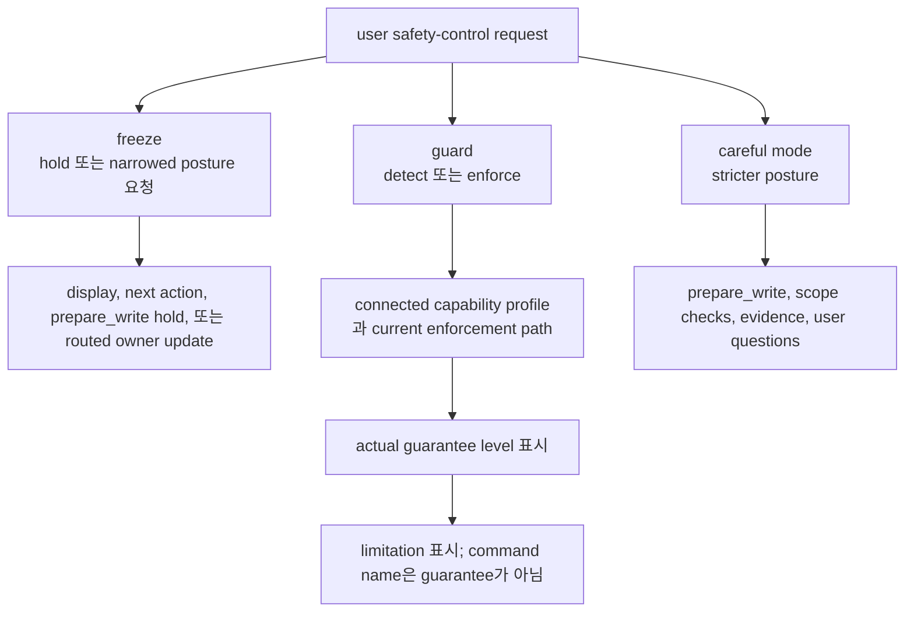

`Freeze`는 current work 주변의 user-visible hold 또는 narrowed posture를 뜻한다. Freeze request는 product write를 hold하거나, next action을 더 strict하게 만들거나, resume 전에 fresh Journey Card를 요구하거나, existing scope가 requested posture와 맞지 않을 때 `prepare_write`가 block 또는 hold하게 만들 수 있다. 그 자체로 active Change Unit, allowed paths, Autonomy Boundary, AFK stop conditions, related owner records를 mutate하지 않으며, Write Authorization, approval, acceptance, evidence, QA, verification, canonical close transition을 만들지도 않는다.

Freeze가 active Change Unit scope, allowed paths, Autonomy Boundary, AFK stop conditions, related owner records를 persistently narrow해야 한다면, connector는 해당 record에 대해 이미 정의된 existing public Core state-changing path, Decision Packet route, owner-record update path로 route해야 한다. "freeze"라는 command label은 direct mutation path가 아니다.

`Guard`는 proven capability profile에 따라 surface가 enforcement 또는 detection layer를 추가한다는 뜻이다. Guard는 cooperative, detective, preventive, isolated일 수 있다. Connected profile이 requested operation에 대해 proven pre-execution blocking path를 갖고 있지 않다면, "guard"라는 단어가 out-of-scope write를 물리적으로 block한다는 뜻으로 보이면 안 된다.

`Careful mode`는 existing authority checks 주변의 stricter posture다. 더 명시적인 `prepare_write`, 더 좁은 scope check, 더 조심스러운 evidence mapping, 더 빠른 Journey Card refresh, 사용자에게 one blocking question을 더 잘 묻는 태도를 뜻해야 한다. New authority tier가 아니며, approval도 verification도 아니고 `prepare_write`를 우회하는 shortcut도 아니다.

User-facing guarantee boundaries:

| User wording | Actual guarantee boundary |
|---|---|
| `T2` / `cooperative`에서 Freeze | Agent가 hold하거나 narrower posture를 사용하라는 instruction을 받는다. Persistent owner-record change에는 여전히 normal Core path가 필요하다. Preventive claim은 없다. |
| `T3` / `detective`에서 Guard | Changed-path, log, artifact, projection validation이 사후 위반을 detect하고 state를 stale, blocked, partial, failed로 mark할 수 있다. |
| `T4` / `preventive`에서 Guard | Hook, wrapper, permission layer, policy engine, sidecar가 covered operation의 out-of-scope write 또는 command를 실행 전에 block할 수 있다. |
| `T5` / `isolated`에서 Guard 또는 verify | Risky work 또는 verification이 별도 worktree, sandbox, process, 또는 동등한 boundary 안에서 실행된다. |

Surface name과 command name은 label일 뿐이다. Connector가 button을 "Freeze"라고 부르거나 playbook을 "guard-check"라고 불러도, status, next, `prepare_write` display는 current path가 cooperative, detective, preventive, isolated 중 무엇인지와 그 level이 무엇을 guarantee할 수 있고 없는지를 계속 보여야 한다.

## Generated Manifest Concept

Connector는 rule, skill, MCP config snippet, prompt, local adapter file을 generate할 수 있다. 모든 generated 또는 managed path는 connector manifest에 기록해야 한다.

Manifest responsibility:

- generated path naming
- managed block hash 기록
- generated 시 사용한 capability profile 기록
- surface target profile 기록
- creation/update time 기록
- human edit를 overwrite하기 전에 drift detect
- 필요할 때 drift를 reconcile로 route

Manifest concept는 common하다. Surface-specific generated filename은 Appendix B에 둔다.

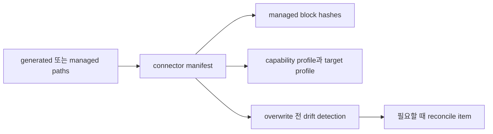

## Push And Pull Context

Implementation agent에게는 작은 current context를 push하고, 큰 reference는 필요할 때만 pull하게 해야 한다.

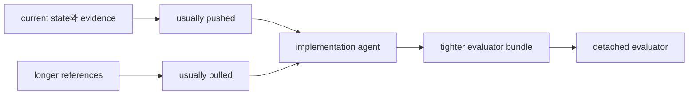

보통 push:

- Journey Card
- active Decision Packet summary
- Autonomy Boundary summary
- Write Authority Summary
- active scoped Change Unit
- acceptance criteria snapshot
- approval status
- latest evidence manifest/run ref
- close 또는 acceptance가 가까울 때 residual risk summary

보통 pull:

- old PRD
- old design
- closed issue
- long log
- module map
- interface contract
- domain language
- coding standard
- TDD guidance

Evaluator는 더 tight한 verification bundle을 받아야 한다.

- acceptance criteria
- changed file
- approval scope
- resolved, pending, close-relevant 항목을 포함한 관련 Decision Packet
- residual risk summary
- Autonomy Boundary
- deferred decision과 follow-up constraint
- relevant domain/module/interface record를 포함한 codebase stewardship ref
- evidence manifest
- required인 경우 TDD trace
- Manual QA requirement
- artifact ref
- forbidden pattern

이 context model은 Context Hygiene policy를 지원한다. Current state와 evidence는 stale chat이나 old doc보다 우선된다.

Later Context Index는 relevant projection, artifact ref, repo file, doc, note를 retrieve하는 데 도움을 줄 수 있지만 read-only context provider이지 connector authority path가 아니다. Main integration docs는 이 개념에 대해 [Appendix C](appendix/C-later-roadmap.md#context-index)를 가리켜야 한다. Indexed 또는 retrieved context는 write authorization, Decision Packet resolution, approval grant, gate satisfaction, evidence creation, verification perform 또는 record, QA recording, QA 또는 verification waiver, residual risk acceptance, result acceptance, assurance upgrade, projection enqueue 또는 refresh, projection freshness change, implementation readiness declaration, Task close를 하면 안 된다.

## Direct Fast Path

작은 direct work에서는 agent가 Harness를 대부분 보이지 않게 유지해야 한다. 좁은 active scope를 정하고, `prepare_write`를 call하고, 변경하고, changed path, self-check evidence를 기록한 뒤 blocker가 없으면 close한다.

Scope, risk, uncertainty, file spread가 커지면 direct mode를 broad autonomy로 늘리지 말고 같은 Task를 `work`로 escalate한다.

## Fallback Semantics

Fallback은 surface name이 아니라 guarantee level과 risk로 설명한다.

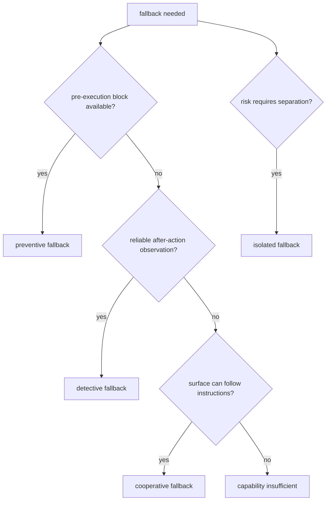

### Cooperative Fallback

Surface가 instruction을 따를 수 있지만 enforce할 수 없을 때 사용한다. Connector는 agent에게 `prepare_write`를 call하고, blocked decision에서는 hold하고, run을 record하라고 알려준다. Authoritative MCP가 unavailable이거나 write scope를 check할 수 없으면 product write를 pause해야 한다.

### Detective Fallback

Harness가 action 후 changed file, log, projection drift, artifact gap을 observe할 수 있을 때 사용한다. Validator는 state를 stale, partial, blocked, failed로 mark하고 repair, reconcile, fresh verification을 요구할 수 있다.

### Preventive Fallback

Hook, permission layer, wrapper, policy engine, sidecar가 violating edit, command, network call, secret access를 발생 전에 block할 수 있을 때 사용한다.

### Isolated Fallback

Risk에 separation이 필요할 때 사용한다. Connector는 별도 worktree, sandbox, process, manual evaluator bundle에서 work 또는 verification을 launch한다. Same-session review가 qualify하지 않는 detached verification에는 이것이 preferred fallback이다.

### MCP Unavailable

MCP가 unavailable이면 connector는 authoritative state update를 claim하면 안 된다. `MCP_SERVER_UNAVAILABLE`과 `SURFACE_MCP_UNAVAILABLE`은 diagnostic conditions이며, 추가 public `ErrorCode` values가 아니다. 이 conditions를 `ToolError`로 surface할 때는 API-owned error selection과 details shape를 사용한다. `MCP_UNAVAILABLE`은 stable public availability code로 남고, surface-side availability 또는 capability cases는 문맥에 따라 `MCP_UNAVAILABLE` 또는 `CAPABILITY_INSUFFICIENT`와 `details.mcp_unavailable_kind`로 표현될 수 있다. `MCP_SERVER_UNAVAILABLE`은 tool call이 Core에 닿을 수 없어 authoritative Core response가 불가능하다는 뜻이다. Caller는 state change를 claim하기 전에 reconnect 또는 diagnose해야 한다. `SURFACE_MCP_UNAVAILABLE`은 Core 또는 operator가 connected surface에 usable MCP가 없거나, MCP configuration이 stale이거나, required MCP tools를 call할 수 없음을 observe할 수 있다는 뜻이다. Product/runtime/code write의 safe behavior는 write를 hold하고 user/operator에게 MCP reconnect 또는 diagnose를 안내하는 것이다. Stronger profile은 preventive block도 enforce할 수 있다.

Pre-MVP Harness documentation-authoring batch는 exact path allowlist가 있는 명시적 `DOCS_AUTHORING_OVERRIDE` 아래에서만 진행할 수 있다. Connector는 이를 documentation-maintainer override로 label해야 하며, Core authorization, Write Authorization, evidence, verification, QA, acceptance, residual-risk acceptance, close, canonical state transition으로 label하면 안 된다. Authoritative MCP가 unavailable이면 product/runtime/code write는 계속 hold한다.

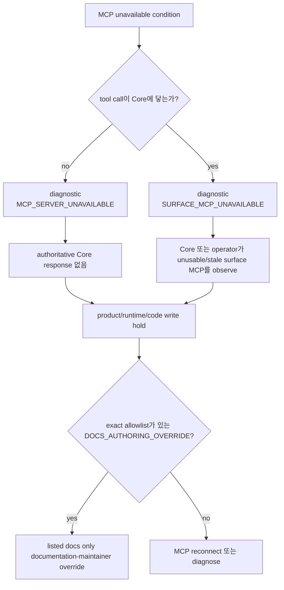

### Weak Guard

MCP는 동작하지만 pre-tool guard가 weak하면 low-risk direct work는 cooperative `prepare_write`와 detective changed-path validation으로 진행할 수 있다. Medium/high-risk work에는 stricter validation, sidecar guard, explicit approval, detached verification, isolation이 필요해야 한다.

### Projection Stale

Projection staleness는 state와 별도로 report된다. Connector가 canonical state를 직접 read할 수 있다면 계속 진행할 수 있지만, Markdown projection에 의존하는 action은 먼저 refresh 또는 reconcile해야 한다.

### Capability Insufficient

Connector는 product name이 아니라 missing capability를 말해야 한다. 예:

```text
Connected profile에 pre-tool guard가 없습니다. 이 작업에는 sidecar guard, 다른 profile, 또는 더 작은 active scoped Change Unit이 필요합니다.
```

## Reference Surface Contract

MVP는 하나의 reference surface를 target한다. Reference surface는 broad ecosystem support가 아니라 kernel을 demonstrate해야 한다.

Minimum reference expectations:

- public tool과 resource를 위한 `T2 MCP` available
- product write 전 cooperative `prepare_write`
- run 후 detective changed-path와 artifact validation
- evidence manifest에 충분한 run summary와 artifact capture
- manual verification bundle 또는 fresh evaluator instruction
- Manual QA note artifact support
- generated file을 위한 connector manifest
- common state와 fallback path를 cover하는 conformance smoke

Reference surface behavior detail과 product-specific setup은 concrete surface를 name할 때만 Appendix B에 둔다.

## Connector Conformance Overview

Connector conformance는 profile이 declared capability tier에서 common contract를 지킬 수 있음을 prove해야 한다.

Overview scenarios:

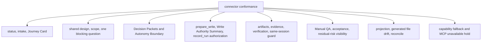

- active Task 유무에 따른 status
- significant work resume 전에 현재 Journey Card를 반드시 표시하는지
- advisor/direct/work로 intake classification
- shared design과 decision을 포함한 work shaping
- Change Unit scope와 vertical/horizontal exception handling
- 가능할 때 recommendation과 uncertainty가 있는 one blocking question
- blocking product judgment에 포괄적인 승인 대신 Decision Packet 표시
- Autonomy Boundary breach가 stop되거나 Decision Packet으로 route되는지
- AFK work가 active Change Unit scope, Autonomy Boundary latitude, 적용되는 granted sensitive approval, 실제 product write 전 compatible `prepare_write` / Write Authorization으로 모두 cover되는지
- `prepare_write` allowed 및 blocked path
- allowed write에 Write Authorization이 생성되고 Write Authority Summary로 노출되는지
- write-capable `record_run`이 compatible Write Authorization을 consume하는지
- sensitive approval request, granted, denied, expired path
- artifact와 evidence update가 있는 `record_run`
- direct result projection
- verification launch 또는 manual verification bundle
- same-session verification guard
- Manual QA required, passed, failed, waived
- product/user risk가 있는 QA waiver가 Decision Packet으로 route되는지
- acceptance required 및 recorded
- acceptance focus에 acceptance 요청 전 residual risk visibility가 포함되는지
- Known close-relevant residual risk가 successful close 전에 반드시 visible한지
- Risk-accepted close에 추가로 accepted Residual Risk refs가 필요한지
- Acceptance가 required인 경우 close-relevant residual risk가 visible한 뒤에만 record되는지
- stale projection과 reconcile flow
- generated file drift detection
- required tier가 missing일 때 capability fallback
- MCP unavailable product-write hold

정확한 fixture format과 operational command는 operations/conformance doc이 담당한다.
