# 사용자 가이드

## 문서 역할

이 문서는 사용자가 agent에게 어떻게 말하면 되는지, 상태를 어떻게 읽으면 되는지, 언제 어떤 판단을 내려야 하는지 설명한다.

구현 내부, 설치 절차, 서버 동작 방식은 다루지 않는다.

## 5분 시작 경로

Harness로 작업 하나만 진행하고 싶다면 한 문장으로 시작한다.

```text
이 작업 하네스 기준으로 진행해.
```

Agent는 먼저 세 가지 일상적인 질문에 답해야 한다. 되도록 compact status 또는 Journey Card로 보여주면 좋다.

- scope는 무엇인가: 무엇이 포함되고, 무엇이 범위 밖인가?
- evidence는 무엇인가: 바뀐 것이 있다면 무엇이고, 무엇을 확인했으며, 무엇이 아직 부족한가?
- 지금 필요한 판단은 무엇인가: 방향을 고를지, sensitive step을 승인할지, QA를 확인할지, 표시된 residual risk를 수용할지, 또는 acceptance가 required일 때 결과를 수용할지?

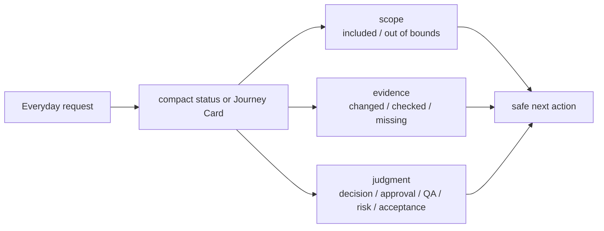

그 답 중 하나가 중요해질 때만 agent는 Decision Packet, Write Authority, Autonomy Boundary, Manual QA, acceptance, residual risk, approval, evidence, verification 같은 더 깊은 label을 사용해야 한다.

대부분의 경우 사용자가 결정하는 것은 몇 가지뿐이다.

- scope가 원하는 작업과 맞는지
- Decision Packet이 나오면 어떤 product direction 또는 trade-off를 택할지
- sensitive change를 approval할지
- Manual QA가 필요한지, 완료/통과되었는지, 또는 validly waived되었는지
- close 전이나 acceptance가 required인 final acceptance 전에 표시된 residual risk를 받아들일지

막혔을 때는 가장 작은 다음 unblocker를 물어본다.

```text
지금 무엇 때문에 막혀 있고, 어떤 결정 하나나 check 하나가 있으면 풀릴까?
```

Close가 가까워지면 결과가 scope와 맞는지, evidence가 required가 아니거나 acceptance criteria를 뒷받침하는지, verification이 required가 아니거나 passed 또는 recorded risk와 함께 명시적으로 waived되었는지, Manual QA가 required가 아니거나 passed/completed 또는 validly waived되었는지, close-relevant residual risk가 표시되었거나 agent가 `ResidualRiskSummary.status=none`을 report했는지, final acceptance 요청이 approval과 별도인지 확인한다.

작업이 특정 gate나 judgment에서 멈췄을 때는 아래 상세 내용을 reference로 사용하면 된다.

## 문장 Reference

일상적인 작업은 명령어가 아니라 대화로 시작한다.

```text
이 작업 하네스 기준으로 진행해.
```

이 말은 "상태를 확인하고, 범위를 잡고, 쓰기 전에 허용 경계를 확인하고, 적용될 때만 relevant evidence, checks, 사용자 판단을 남기면서 진행해"라는 뜻이다.

자주 쓰는 말:

```text
상태 보여줘.
이 작업 이어서 해. 하네스 상태부터 확인해.
이어가기 전에 Journey Card부터 보여줘.
범위와 질문부터 잡아줘.
작은 수정이면 direct로 처리하고, 커지면 work로 전환해.
Decision Packet을 옵션, 추천안, 불확실성까지 보여줘.
승인해. 범위는 방금 설명한 내용까지만이야.
Active Change Unit scope와 Autonomy Boundary latitude가 모두 맞을 때만 AFK로 진행해. Sensitive categories에는 별도 granted approval이 필요하고, 실제 product write에는 compatible `prepare_write` Write Authorization이 필요해.
detached verify 시작해.
Manual QA가 필요한지 판단해줘.
수용하기 전에 close-relevant residual risk를 보여줘.
Final acceptance 요청이 있으면 수용해. 이 작업 닫아.
Final acceptance가 required가 아니면 applicable blockers가 clear된 뒤 닫아.
```

## 기본 흐름

기본 흐름은 작업 관리 시스템이 아니라 짧은 대화처럼 느껴져야 한다. 사용자는 모든 internal record가 아니라 compact status card와 다음 safe action을 주로 본다.

1. 상태 확인 또는 intake.
2. `advisor`, `direct`, `work` 중 하나로 분류.
3. 범위와 Change Unit 확인.
4. 제품 판단이 진행을 막고 있으면 Decision Packet을 읽고 답하기.
5. 제품 파일을 쓰기 전에 agent 또는 Harness가 `prepare_write`를 확인.
6. 변경이나 advice가 있으면 agent가 relevant result를 기록하고, evidence가 적용될 때 evidence를 기록.
7. Task path가 요구할 때 verify, Manual QA 기록, close-relevant residual risk 표시, acceptance 요청.
8. Close.

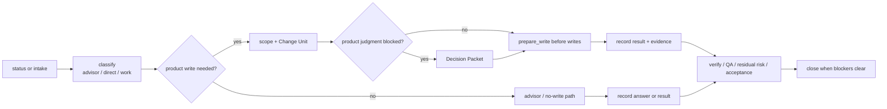

많은 advisor 또는 direct tasks는 뒤쪽 check 중 일부를 건너뛴다. Final acceptance가 required가 아니라면 status가 그 사실을 말하거나, applicable blockers가 clear되고 residual risk가 표시되었거나 none으로 confirmed된 뒤 close하면 된다.

Gate는 "왜 지금 task를 안전하게 진행하거나 닫을 수 없는지"로 설명되어야 한다. Evidence 부족은 추상적인 내부 조건이 아니라 acceptance criterion별로 보여야 한다. Cooperative guarantee가 보이면 surface가 Harness decision을 따를 것으로 기대되지만, 모든 범위 위반 write를 실행 전에 물리적으로 막지는 못할 수 있다는 뜻이다.

```text
Close blocked:
- AC-02 evidence가 없습니다.
- UI copy에 대한 Manual QA가 pending입니다.
- Verification을 waive하면 detached verified가 아니라 risk accepted close로 닫힙니다.
```

## 보통 사용자가 결정하는 것 (What You Usually Decide)

대부분의 session에서 사용자가 주로 결정할 것은 명확하지 않은 scope, product 또는 design trade-off, sensitive approval, QA, 표시된 residual risk, 그리고 task path가 요구할 때의 final acceptance입니다.

사용자는 작업 방향과 받아들일 수 있는 risk의 owner이지, internal records를 직접 조작하는 operator가 아닙니다.

## Harness가 맡아야 할 것 (What Harness Should Handle)

Harness가 맡아야 할 것은 state recording, `prepare_write` checks, artifact registration, evidence mapping, projection freshness, close blockers입니다.

Harness는 사용자의 판단을 recorded state와 clear blockers로 바꾸어, 사용자가 bookkeeping이 아니라 ownership에 집중하게 해야 합니다.

Harness 또는 connected surface가 MCP를 reliable하게 사용할 수 없으면 product/runtime/code 변경은 connection 또는 surface setup이 diagnose될 때까지 pause해야 합니다. Exact path에 대해 명시적으로 granted된 documentation-only bootstrap override는 Harness authorization과 같지 않습니다.

## 상태 카드 읽기

좋은 하네스 세션은 먼저 짧은 상태 카드를 보여준다. 중요한 작업을 재개할 때는 일반 status card보다 Journey Card 또는 그에 준하는 current-position view가 먼저 나와야 한다.

```text
TASK-0044 이메일 로그인 플로우 추가
모드: work
현재 상태: shaping
다음 행동: 로그인 실패 UX 결정
범위: 로그인 폼, 로그인 API 호출, 세션 저장
Decision Gate: pending
Decision Packet: DEC-0012 로그인 실패 UX
Autonomy Boundary: 합의된 로그인 플로우 세부 구현만 진행 가능
Write Authority: not yet requested
Approval: dependency_change 승인 필요
Evidence: none
Verification: not started
Manual QA: pending
Acceptance: pending
Residual risk: none recorded
Projection: current
```

볼 것은 다섯 가지다.

- 요청과 범위가 맞는가.
- 내가 답해야 할 Decision Packet이 있는가.
- Autonomy Boundary 안에서 agent가 어디까지 진행할 수 있는가.
- Write Authority가 아직 요청 전인지, blocked인지, intended write에 allowed인지.
- approval, evidence, verification, Manual QA, residual risk, acceptance 중 무엇이 남았는가.
- 다음 행동이 안전하게 진행 가능한가.

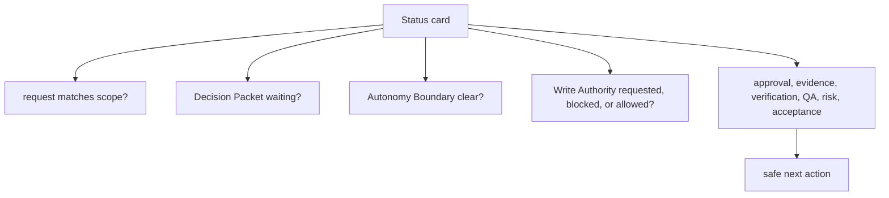

상태가 이상해 보이면 이렇게 말한다.

```text
state 기준으로 현재 상태와 다음 행동을 다시 보여줘.
```

## Journey Card 보기

Journey Card는 일이 지금 어디에 있는지 보여주는 카드다. 오래 멈춘 작업을 다시 시작할 때, 큰 변경을 이어갈 때, close가 가까울 때 먼저 확인하면 좋다.

확인할 줄:

- `Next action`: agent가 지금 안전하다고 보는 다음 행동
- `Decision Packet`: 사용자가 답해야 할 제품 판단이 있는지
- `Autonomy Boundary`: 추가 질문 없이 agent가 할 수 있는 일
- `Write Authority`: intended write에 대한 specific `prepare_write` authorization이 있는지. Autonomy Boundary와 별개다.
- `Evidence`, `Verification`, `Manual QA`: 무엇이 확인되었는지
- `Residual risk`: 아직 남은 불확실성, 제한, trade-off
- `Projection`: 사람이 읽는 뷰가 믿을 만큼 최신인지

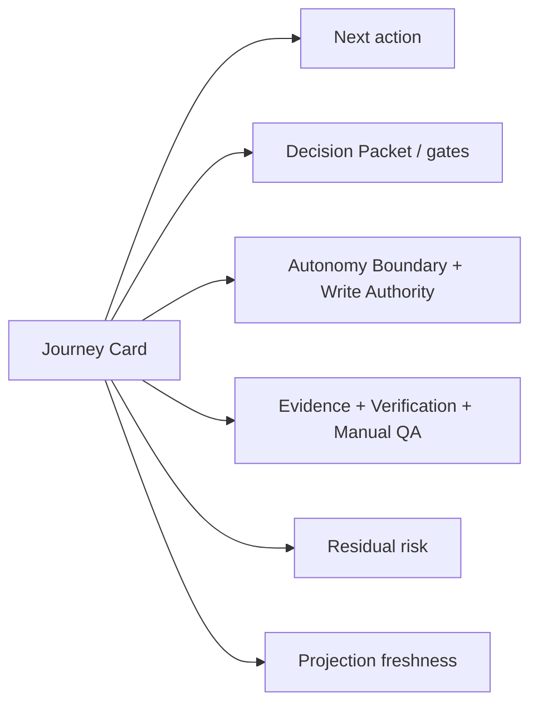

자연스럽게 이렇게 말하면 된다.

```text
잠깐. Decision Packet부터 보여줘.
그 다음 행동은 괜찮아. 그 경계 안에서 계속해.
이번 run 끝나면 Journey Card를 새로 보여줘.
```

Write가 이미 authorized된 경우에도 line은 specific해야 한다.

```text
Write Authority: WA-0017 allowed for src/auth/login.ts and tests/auth/login.test.ts
Guarantee: cooperative; changed-path validation detects violations after the fact
```

## Decision Packet 읽기

먼저 사용자 질문에서 시작한다: "이 맥락에서 이 방향을 선택할까, 미룰까, 더 작은 Change Unit을 요청할까?"

Decision Packet은 넓은 의미의 "승인해도 돼요?"가 아니다. 진행, close, QA waiver, verification risk acceptance, residual-risk acceptance에 사람 판단이 필요할 때 쓰는 판단 단위다.

읽는 순서:

- 왜 지금 결정해야 하는가?
- 내가 정확히 무엇을 결정하는가?
- option과 trade-off는 무엇인가?
- agent의 추천은 무엇이고, 얼마나 불확실한가?
- 내 판단 없이 agent가 결정해도 되는 것은 무엇인가?
- 미루면 어떤 일이 생기는가?
- 어떤 residual risk나 follow-up이 남는가?

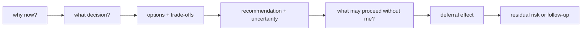

좋은 답변은 구체적이다.

```text
Option A로 가자. 실패 메시지는 일반적으로 유지하고, 보안 trade-off를 기록해.
이 결정은 smoke test 후로 미뤄. follow-up risk로 남겨줘.
이 trade-off는 수용하지 않아. 더 작은 Change Unit을 제안해줘.
```

## advisor, direct, work

`advisor`는 읽고 설명하고 비교하고 검토하는 모드다. 제품 파일을 쓰지 않는다.

```text
이 모듈 역할을 설명해줘.
이 설계 선택의 trade-off를 정리해줘.
```

`direct`는 작고 저위험인 변경을 빠르게 처리하는 모드다. Direct도 제품 파일을 쓰려면 active scoped Change Unit이 있어야 하며, 기본 assurance는 `self_checked`다.

```text
프로필 저장 버튼 오타 고쳐줘. 작으면 direct로 처리해.
```

`work`는 기능 추가, 구조 변경, 위험한 수정, 여러 파일에 걸친 작업처럼 범위 정리와 evidence와 독립 검증이 필요한 모드다.

```text
이메일 로그인 플로우 추가해줘. 하네스 기준으로 진행해.
```

작게 시작했지만 범위가 커지면 agent는 같은 Task를 `work`로 전환한다고 알려야 한다.

## Small Direct Work Should Stay Light

작고 명확한 작업에서는 Harness가 좁은 scope를 active Change Unit으로 정하고, `prepare_write`로 write permission을 확인하고, changed paths와 self-check evidence를 기록한 뒤 blocker가 없으면 close해야 한다.

작업이 커지면 같은 Task를 `work`로 옮기고 scope, decisions, evidence, risk를 보여야 한다. Direct mode가 조용한 broad autonomy로 바뀌면 안 된다.

## 사용자 판단 (User Judgments)

Product judgment, approval, assurance, Manual QA, residual-risk acceptance, final acceptance는 서로 다른 질문에 답한다.

| Judgment | 답하는 질문 | 대신할 수 없는 것 |
|---|---|---|
| Product judgment / Decision Packet | 어떤 제품 방향, trade-off, waiver, close-relevant decision을 택할 것인가? | approval, implementation, verification, QA, acceptance |
| Approval | 이 민감 변경을 진행해도 되는가? | product judgment, verification, QA, acceptance |
| Assurance | 기술적으로 어디까지 확인되었는가? | approval, QA, acceptance |
| Manual QA | 사람이 실제 경험 품질을 확인했는가? | verification, acceptance |
| Residual-risk acceptance | 알려진 남은 위험이나 제한을 사용자가 받아들이는가? | approval, evidence, verification, Manual QA, final acceptance |
| Final acceptance | 결과와 남은 trade-off를 최종 수용하는가? | approval, evidence, verification, Manual QA, residual-risk acceptance |

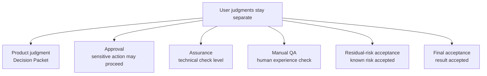

Approval이 필요한 예시는 dependency 추가, auth/permission 변경, data model 변경, public API 변경, destructive write, secret access, production config 변경이다. Approval은 correctness나 acceptance가 아니다.

Approval 자체에 사용자의 판단이 필요하면 Harness는 approval-shaped Decision Packet으로 보여줄 수 있다. 이때 사용자가 결정하는 것은 sensitive scope를 허용할지 여부다. 이 답변은 product option을 선택하거나, QA나 verification을 waive하거나, residual risk를 accept하거나, 이후 write check 없이 agent가 edit하게 만들지 않는다.

Product judgment가 진행을 막으면 Decision Packet으로 보여야 한다. Packet에는 option, trade-off, recommendation, uncertainty, decision을 미뤘을 때의 결과가 있어야 한다.

Assurance는 보통 `none`, `self_checked`, `detached_verified`로 보인다. `detached_verified`는 같은 세션의 자기 검토가 아니라 별도 검증 경계에서 통과했다는 뜻이다.

사용자가 verification risk를 수용하고 닫을 수는 있다. 하지만 그 close는 `detached_verified`가 아니라 risk-accepted close다. Residual-risk acceptance는 알려진 위험을 close 가능한 상태로 만들 수 있지만, approval, evidence, verification, Manual QA, final acceptance를 대신하지 않는다.

## AFK로 진행하게 할 때

AFK로 진행한다는 말은 사용자가 자리를 비워도 agent가 계속 진행해도 된다는 뜻이다. 하지만 AFK는 active Change Unit scope, Autonomy Boundary latitude, applicable한 granted sensitive approval이 모두 맞을 때만 허용된다. 실제 product write에는 writing 전에 compatible `prepare_write` / Write Authorization도 필요하다.

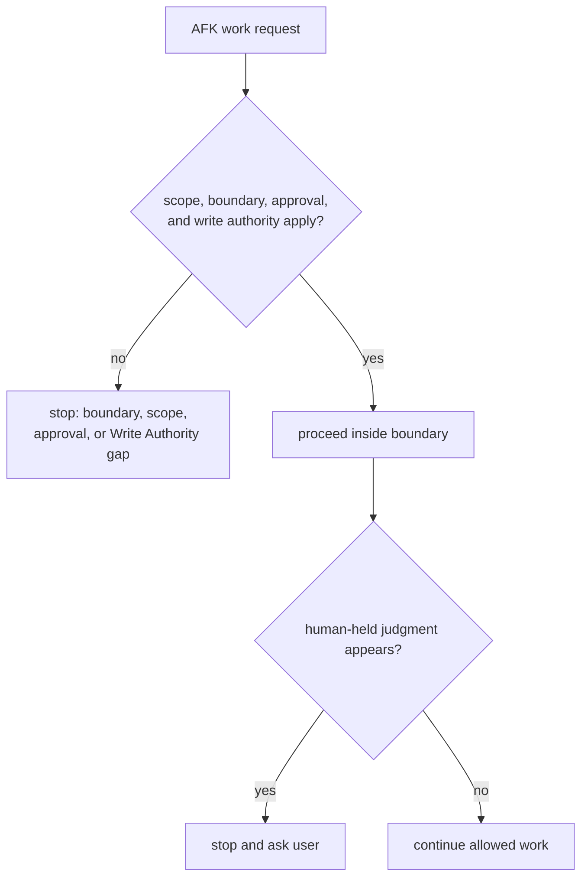

Autonomy Boundary는 scope grant나 write permission이 아니다. Agent는 여전히 `prepare_write`, active Change Unit scope, allowed paths, allowed tools, allowed commands, network targets, secret access, applicable한 sensitive approval을 따라야 한다.

Agent는 보통 합의된 세부 구현, 허용된 check 실행, evidence 수집, summary 업데이트를 진행하고, 명확한 blocker를 남기고 멈출 수 있다.

Agent가 멈춰야 하는 일:

- planning direction
- product trade-off
- scope expansion
- sensitive-change approval
- QA waiver
- verification risk acceptance
- final acceptance

자연스러운 말:

```text
이 경계 안에서는 AFK로 진행해. 제품 판단, QA waiver, 검증 리스크, acceptance가 필요하면 멈춰.
```

## Evidence 부족

Evidence는 "했음"이라는 말이 아니라 acceptance criteria를 뒷받침하는 기록이다.

```text
Evidence: partial
Close blocked: AC-02 supporting evidence가 없습니다.
```

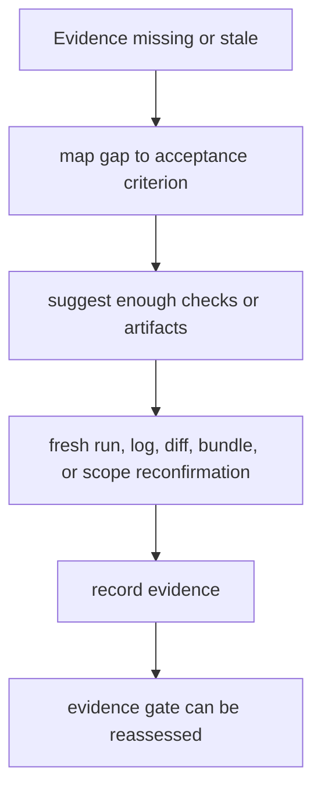

이렇게 말한다.

```text
어떤 acceptance 기준에 evidence가 부족한지 보여주고, 무엇을 더 확인하면 충분한지 제안해줘.
```

Evidence가 stale이면 새 실행, 새 로그, 새 diff, 새 verification bundle, 또는 범위 재확인이 필요할 수 있다.

## Verify

Work는 구현자의 자기 보고만으로 `detached_verified`가 되지 않는다.

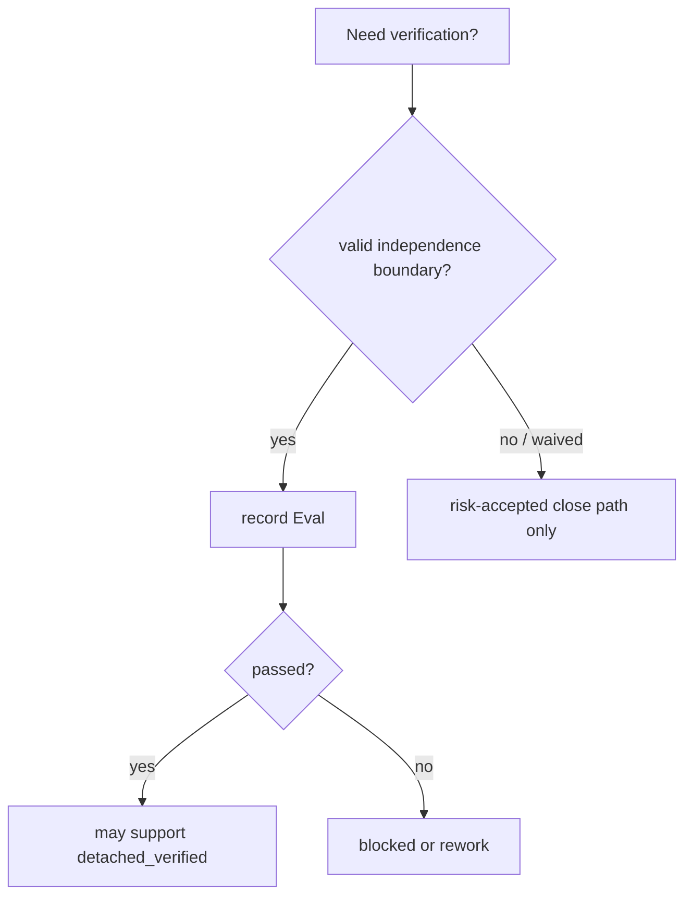

```text
detached verify 시작해.
```

검증이 통과하면 agent는 무엇을 확인했는지, 어떤 기준으로 독립성이 인정되는지, 남은 blocker가 있는지 요약해야 한다.

검증을 지금 하지 않고 닫아야 한다면 이렇게 말한다.

```text
검증 risk를 수용하고 닫아. 남은 위험을 기록해줘.
```

이 경우 성공으로 닫을 수 있지만, assurance는 `detached_verified`로 표시되지 않는다.

## Residual Risk 수용

Residual risk는 이미 알려진 남은 불확실성, 제한, 확인하지 못한 조건, trade-off다. Final acceptance 또는 risk-accepted close 전에는 agent가 close-relevant residual risk를 쉬운 말로 보여줘야 한다. Known close-relevant residual risk가 없다면 agent는 `ResidualRiskSummary.status=none`으로 그 사실을 말해야 한다. 이는 known risk가 hidden인 상태와 다르다. Risk-accepted close에는 여전히 visible and accepted Residual Risk refs가 필요하다.

Residual risk를 수용하면 close가 가능해질 수 있다. 하지만 approval, evidence, verification, Manual QA, acceptance를 대신하지는 않는다.

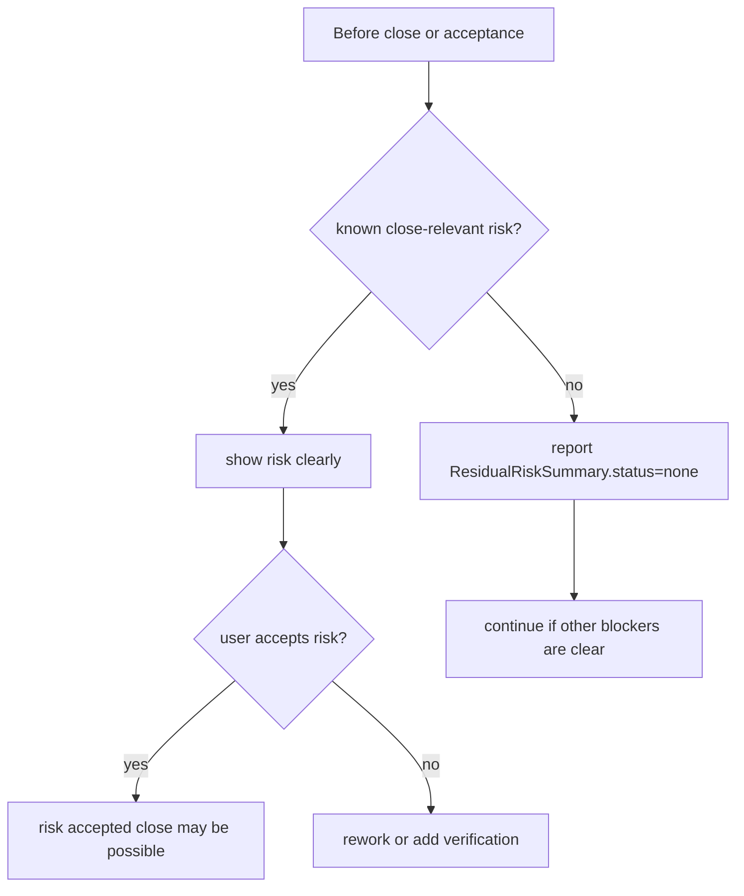

자주 쓰는 말:

```text
수용하기 전에 close-relevant residual risk를 보여줘.
여기 표시된 residual risk를 수용해. risk accepted로 닫아.
그 risk는 수용하지 않아. rework하거나 verification을 추가해.
```

## Manual QA

Manual QA는 UX, workflow, copy, accessibility, visual result처럼 사람이 봐야 하는 품질에 대한 사용자 판단이다.

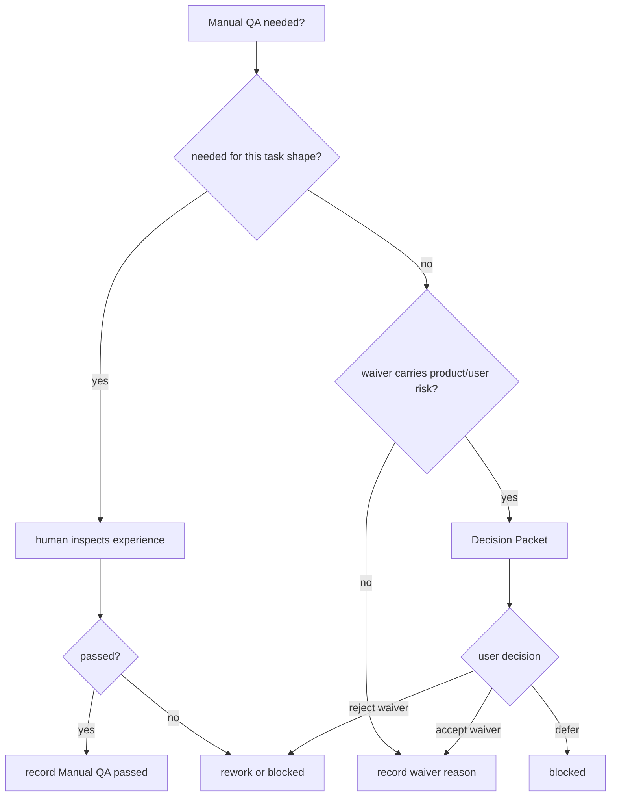

Card가 `Manual QA: pending`이라고 표시할 때 그것은 `qa_gate` display다. Required QA가 아직 satisfying Manual QA record를 만들지 못했다는 뜻이지, pending Manual QA record result가 있다는 뜻은 아니다.

```text
Manual QA가 필요한지 판단해줘.
```

Manual QA 판단이 "아직 수용할 수 없음"이면 작업은 닫지 않고 rework나 blocked 상태로 돌아간다. 이 Task shape에서 Manual QA가 유용하지 않다면 waiver reason을 기록한다.

```text
이번 내부 CLI 작업은 Manual QA waived 처리해. 이유: 사용자 UI가 없고 test/log로 충분히 확인 가능.
```

QA를 생략하는 일이 product/user risk를 포함하면, 단순한 waiver reason만으로는 부족할 수 있다. 이때는 Decision Packet이 필요할 수 있다.

```text
QA waiver를 결정하기 전에 Decision Packet으로 보여줘.
```

## Acceptance

Acceptance는 "이 결과를 받아들인다"는 마지막 사용자 판단이다. 이는 task path가 final acceptance를 요구할 때만 나타난다.

Acceptance가 required이면 close-relevant residual risk가 표시되었거나 none으로 report된 뒤, 사용자가 결과와 남은 trade-off를 수용하기 전까지 task는 닫히지 않는다. Verification 통과, Manual QA 완료, approval granted, 특정 residual risk 수용은 그 자체로 final acceptance가 아니다.

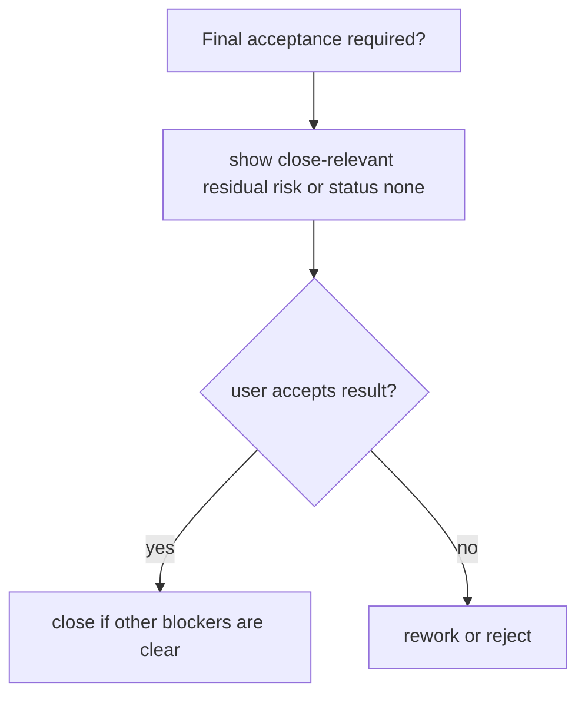

```text
수용해. 이 작업 닫아.
```

거절할 수도 있다.

```text
수용하지 않아. 세션 만료 UX를 다시 잡아줘.
```

Acceptance는 approval, verification, Manual QA, residual-risk acceptance가 아니다.

## 이어서 하기

오래된 채팅을 뒤지지 말고 하네스 상태에서 재개한다.

```text
이 프로젝트의 active task 상태 보여줘.
TASK-0044 이어서 해. 하네스 상태부터 확인해.
```

재개할 때 확인할 질문은 두 가지다.

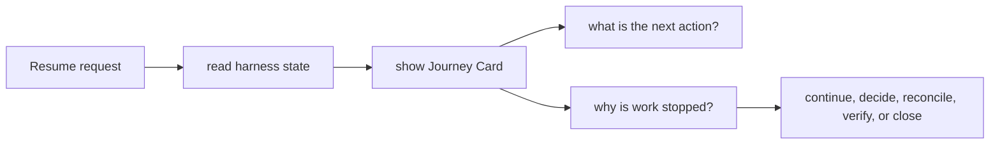

```text
지금 다음 행동은 무엇인가?
지금 멈춘 이유는 무엇인가?
```

문서에 메모를 남겼다면 이렇게 말한다.

```text
TASK 문서의 사용자 메모를 확인하고, 상태에 반영해야 할 항목을 reconcile해줘.
```

문서는 사람이 읽는 projection이다. 상태와 문서가 어긋난 것 같으면 projection freshness를 확인하고 state 기준으로 다시 요약하게 한다.
