# 운영과 Conformance

## 문서 역할

이 문서는 하네스의 운영자 절차, fixture 기반 conformance, docs-maintenance smoke reporting을 담당합니다. 범위에는 connect, doctor, serve MCP, projection refresh, reconcile, recover, export, artifact integrity, conformance suite가 포함됩니다.

일상적인 사용자 workflow, MCP 요청/응답 schema, SQLite DDL, 장기 analytics를 MVP 요구사항으로 소유하지 않습니다.

## 운영 범위

모든 운영자 entrypoint는 agent가 사용하는 것과 같은 Core 규칙 위에 놓인 surface입니다. 운영자 tool은 진단, repair, export, fixture 실행을 할 수 있지만 두 번째 state model을 만들면 안 됩니다.

필수 MVP 운영자 entrypoint:

```text
harness connect
harness doctor
harness serve mcp
harness projection refresh
harness reconcile
harness recover
harness export
harness artifacts check
harness conformance run
```

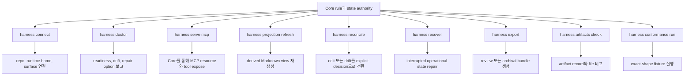

정확한 command flag는 구현마다 달라질 수 있지만, reference MVP에는 아래 semantics가 필요합니다.

## Conformance Staging

Conformance는 incremental하게 실행할 수 있지만, staged execution이 fixture body shape를 바꾸거나 final MVP requirement를 줄이면 안 됩니다.

Kernel Smoke는 MVP-0부터 early MVP-3 capabilities까지를 가로지르는 selected smoke slice에서 나온 첫 runnable conformance target입니다. Project와 Task state, scoped Change Unit behavior, `prepare_write` allow/block behavior, durable Write Authorization creation, `record_run` authorization consumption, artifact와 evidence manifest basics, minimal projection enqueue/current behavior, write authority가 없을 때 blocked writes 또는 runs, evidence 또는 decision requirement가 없을 때 blocked close, basic Core fixture execution을 증명해야 합니다. Kernel Smoke 통과는 첫 runnable kernel authority path를 증명하지만 final MVP conformance를 주장하지 않습니다.

Agency-Hardened MVP는 final reference conformance target입니다. Decision Packet quality, sensitive approval lifecycle separation, acceptance와 close 전 residual-risk visibility, detached verification guards, Manual QA, stewardship 및 context-hygiene validators, full feedback-loop checks, codebase stewardship coverage, projection/reconcile completeness, recover/export/artifact integrity behavior, later-boundary checks, broader fixture coverage를 추가로 증명해야 합니다. Suite catalog metadata는 scenario를 earliest MVP stage에 mapping할 수 있지만, executable fixtures는 여전히 Core state, events, artifacts, projections, errors를 통해 assert해야 합니다.

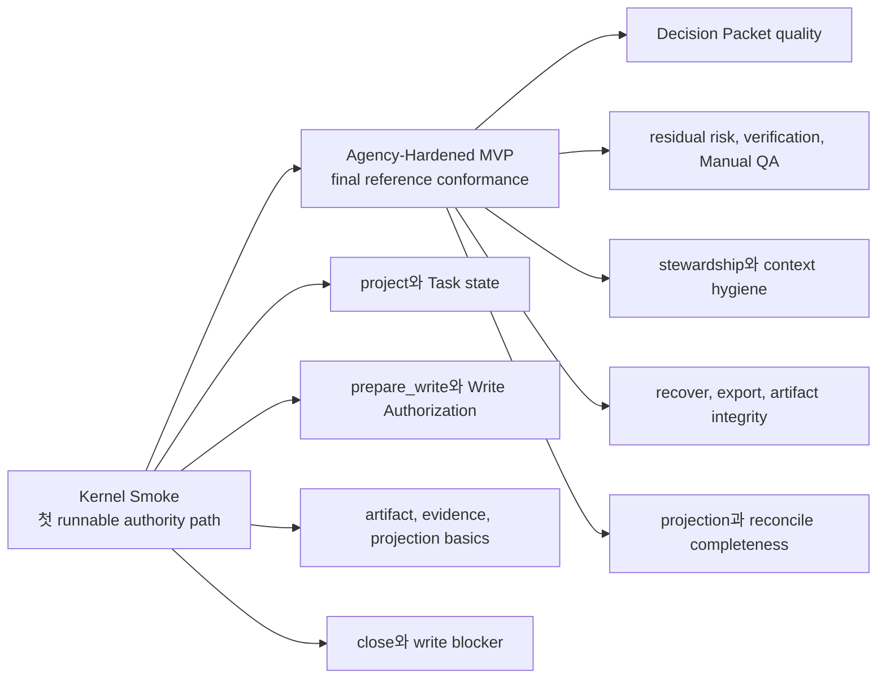

## Docs-Maintenance Smoke Profile

Docs-maintenance smoke profile은 operator가 실행하거나 사람이 수동 review해서 documentation set의 drift를 잡을 수 있습니다. 이는 Markdown docs에 대한 read-only maintenance check이지 Core fixture conformance, runtime validator, evidence, residual-risk acceptance, canonical state transition이 아닙니다. `task_events`를 append하거나, artifacts를 만들거나, projections를 refresh하거나, QA 또는 acceptance state를 만들거나, close readiness에 영향을 주거나, runtime implementation readiness를 claim하면 안 됩니다.

[Authoring Guide](99-authoring-guide.md#docs-maintenance-conformance)가 rule bodies, pass/warn/fail interpretation, checklist를 담당합니다. 이 문서는 reporting과 entrypoint exposure에 대한 operator-maintenance expectation만 담당합니다.

Minimal operator wiring contract: `harness conformance run` 또는 다른 operator entrypoint로 expose될 때 docs-maintenance는 명시적으로 선택하는 docs-only profile이며, 관례적 profile name은 `docs-maintenance`입니다. Runtime conformance run은 operator가 이 profile을 select하지 않는 한 포함하면 안 됩니다. 명시적으로 select하더라도 runtime Core fixture suite와 별도로 report하고 runtime fixture pass/fail 또는 implementation readiness로 count하지 않습니다. Task state, MVP runtime validator IDs, projection freshness, QA, acceptance, close readiness, canonical state transition에 영향을 주면 안 됩니다.

Docs-maintenance profile의 console output 또는 ephemeral report만 이 문서에서 정의한 output입니다. Generated operational report files는 future explicit implementation contract가 필요합니다. 이 documentation batch는 이 check를 위한 stored artifacts, projection jobs, DDL, state records를 정의하지 않습니다.

Minimum report fields:

- profile name and documentation revision
- category별 pass, warn, fail
- 가능한 경우 affected file path와 heading 또는 anchor
- canonical owner doc과 expected source section
- suggested fix class: update owner, replace duplicate with summary plus link, mirror translation, repair link, 또는 `TODO_DECISION` / `TODO_IMPLEMENT` 추가
- canonical state transition이 수행되지 않았다는 statement

Smoke categories는 Authoring Guide checks를 restate하지 말고 reference해야 합니다. Categories는 bilingual file and heading parity, broken cross references, owner-boundary drift, fixture/action schema drift, enum and event/error-code drift, stable `ValidatorResult` ID drift, `ProjectionKind` tier drift, glossary and source-of-truth phrasing drift, TODO rule compliance, non-owner duplicate full-contract paragraphs입니다.

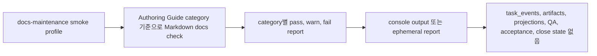

## Connect

`connect`는 Product Repository, Harness Runtime Home, 하나의 reference agent surface를 연결합니다.

필수 동작:

- repository root를 식별합니다
- local project를 등록하거나 재사용합니다
- static project configuration을 만들거나 검증합니다
- project별 state와 artifact storage를 초기화합니다
- reference surface와 capability profile을 등록합니다
- manifest를 통해 connector-managed file을 만들거나 refresh합니다
- MCP configuration이 harness server에 닿을 수 있는지 확인합니다
- conformance smoke check를 실행하거나 실행할 command를 출력합니다

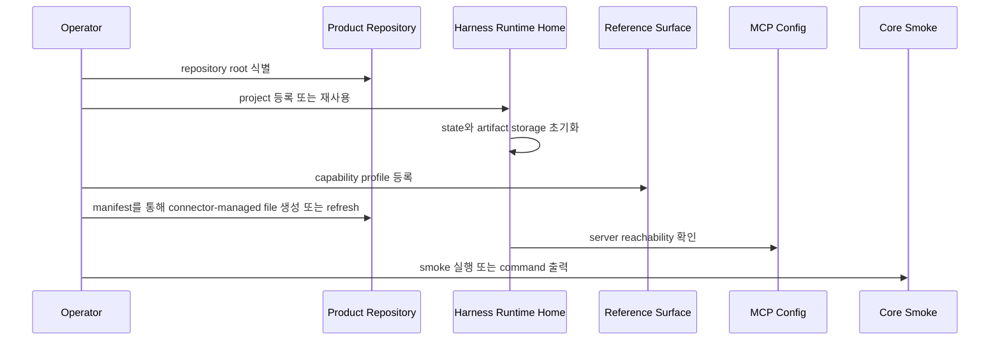

Connect는 사람이 편집한 내용을 조용히 덮어쓰지 않고 generated-file drift를 보고해야 합니다. Surface별 generated file 이름은 surface cookbook에 속합니다.

## Doctor

`doctor`는 readiness, drift, repair option을 보고합니다.

필수 category:

| Category | Checks |
|---|---|
| project | registered project, repo root, static config validity |
| state | current state readability, JSON field parse and shape validity, locks, active Task consistency |
| MCP | server reachability, Core reachability, read resource availability, public tool availability |
| surface | capability profile, generated manifest, MCP config freshness, required MCP tool-call ability |
| artifacts | file existence, hash, size, redaction state, task/run or artifact-link relation |
| projections | queued jobs, freshness, managed hash drift, failed renders |
| reconcile | pending human edits, managed block drift, generated-file drift |
| validators/checks | required stable ValidatorResult-emitting validators와 별도로 capture되는 Core check/precondition categories |
| agency/stewardship/context | Decision Packet and decision gate readiness, Autonomy Boundary readiness, residual-risk visibility, codebase stewardship, context freshness |

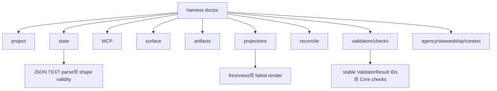

Output level:

```text
OK
WARN
FAIL
REPAIRABLE
MANUAL
```

Doctor는 current state failure와 projection stale 또는 projection failed status를 구분해야 합니다.

State checks는 `registry.sqlite`와 `state.sqlite`의 JSON `TEXT` fields를 포함합니다. Malformed JSON은 state failure입니다. Schema-incompatible JSON도 state failure입니다. Core가 product judgment를 새로 만들지 않고 다른 canonical state 또는 raw artifacts에서 expected value를 안전하게 reconstruct할 수 있을 때만 doctor가 이를 `REPAIRABLE`로 mark할 수 있으며, 그렇지 않으면 `FAIL` 또는 `MANUAL`을 report합니다.

## Serve MCP

`serve mcp`는 local MCP server를 시작하거나 connection information을 출력합니다.

필수 동작:

- mutation 없이 read resource를 expose합니다
- shell shortcut이 아니라 Core를 통해 public tool을 expose합니다
- state-changing call이 Core conflict와 idempotency behavior를 사용하게 합니다
- active project와 connected surface profile을 보고합니다
- server가 runtime state 또는 artifact storage에 닿을 수 없으면 명확히 실패합니다

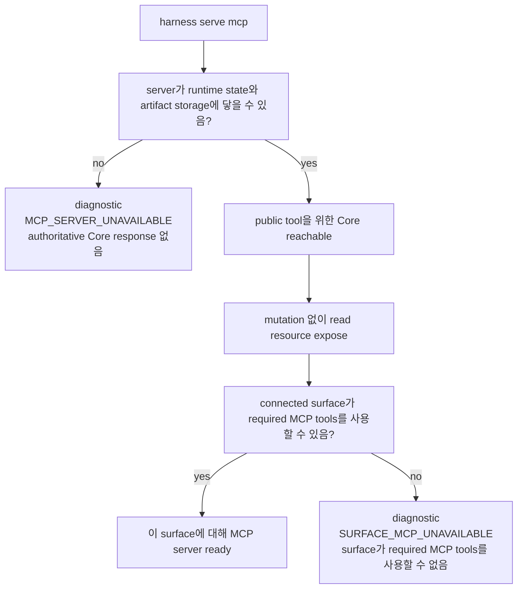

MCP를 사용할 수 없으면 operations는 diagnostic condition인 `MCP_SERVER_UNAVAILABLE`과 `SURFACE_MCP_UNAVAILABLE`을 구분해야 합니다. 이 labels는 추가 public `ErrorCode` values가 아닙니다. 이 conditions를 `ToolError`로 surface할 때 operations는 API-owned error selection과 details shape를 사용해야 합니다. `MCP_UNAVAILABLE`은 stable public availability code로 남고, surface-side availability 또는 capability cases는 문맥에 따라 `MCP_UNAVAILABLE` 또는 `CAPABILITY_INSUFFICIENT`와 `details.mcp_unavailable_kind`로 표현될 수 있습니다. `MCP_SERVER_UNAVAILABLE`에서는 tool call이 Core에 닿을 수 없어 authoritative Core response가 불가능하므로, state-change claim 전에 server diagnosis 또는 reconnect가 next action입니다. `SURFACE_MCP_UNAVAILABLE`에서는 Core 또는 operator가 connected surface에 usable MCP가 없거나 MCP configuration이 stale이거나 required MCP tools를 call할 수 없음을 observe할 수 있습니다. Cooperative surface는 product/runtime/code write를 instruction으로 hold해야 하며, stronger profile은 hold를 예방적으로 또는 isolation으로 enforce할 수 있습니다. Operations는 실제 guarantee level을 그대로 보고해야 합니다.

## Projection Refresh

Projection refresh는 committed state record와 artifact ref에서 Product Repository Markdown을 다시 생성합니다.

필수 동작:

- target의 latest projection version만 render합니다
- human-editable section을 보존합니다
- overwrite 전에 managed block hash를 비교합니다
- managed-block drift에는 reconcile item을 생성합니다
- projection job을 `completed`, `failed`, `pending`, `skipped`로 mark합니다
- projection failure를 Task result와 분리합니다

지원 target:

```text
하나의 Task
모든 active Tasks
Task의 approval/run/evidence/eval/direct reports
활성화된 design-quality projections
```

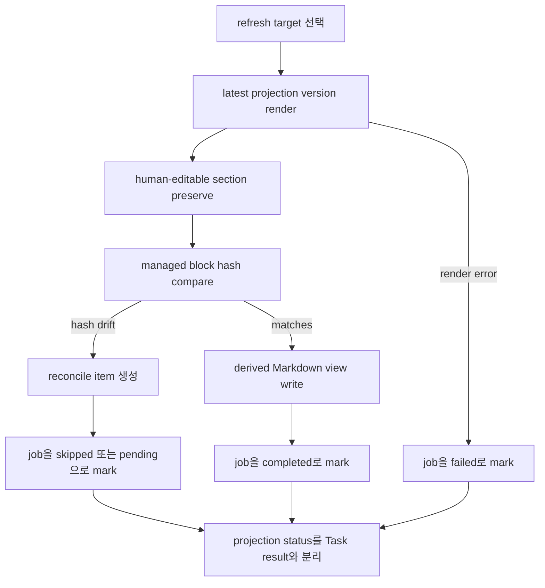

MVP에서 Decision Packet visibility는 `TASK` projections, status/next responses, judgment-context resources, decision-packet resources를 통해 render합니다. Journey Card visibility는 status, journey, next, significant resume surface를 통해 render합니다.

`DEC`, `DESIGN`, `EXPORT`, persisted `JOURNEY-CARD`를 위한 dedicated extension / appendix refresh targets는 enabled일 때 optional이며, required MVP smoke target이 아닙니다.

## Reconcile

Reconcile은 human-editable input 또는 generated/managed drift를 명시적인 decision으로 바꿉니다.

Target:

- Task user notes and proposals
- managed block edits
- Domain Language proposals
- Module Map proposals
- Interface Contract proposals
- connector generated-file drift
- stale projection references that affect current work

Decision outcome:

| Outcome | Meaning |
|---|---|
| merge | Core를 통해 proposal을 apply하고 state history를 append합니다 |
| reject | canonical state를 그대로 두고 필요하면 projection을 refresh합니다 |
| convert_to_note | content를 state가 아닌 human note로 보존합니다 |
| create_decision | proposal을 pending user decision으로 전환합니다 |
| defer | reconcile item을 open 상태로 유지합니다 |

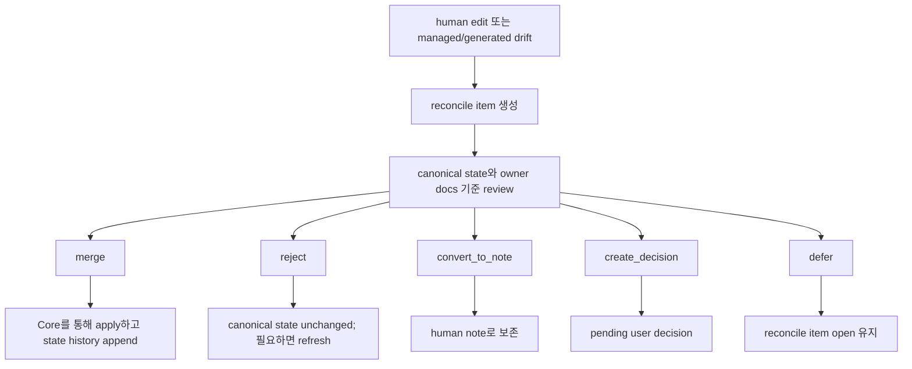

Reconcile은 edited Markdown 자체를 canonical state로 취급하면 안 됩니다.

## Recover

Recover는 history를 rewrite하지 않고 interrupted 또는 inconsistent operational state를 repair합니다.

필수 scenario:

| Scenario | Recovery behavior |
|---|---|
| agent crash during write | `runs.status=interrupted`인 recovery Run을 commit하고 가능하면 diff/log artifact를 capture합니다. Captured artifacts는 recovery evidence이며 successful completion의 proof가 아닙니다 |
| stale approval baseline | scope가 affected되면 approval을 expire하거나 다시 요청합니다 |
| evaluator observes drift | verification을 blocked로 mark하거나 evidence를 stale로 mark합니다 |
| artifact registry mismatch | file을 rescan하고 missing artifact를 stale로 mark하며 hash를 보존합니다 |
| projection job failed | retry하거나 failed로 mark하고 reconcile guidance를 생성합니다 |
| managed Markdown edited | reconcile item을 생성합니다 |
| malformed or schema-incompatible storage JSON | Core가 canonical state 또는 raw artifacts에서 expected shape를 reconstruct할 수 있을 때만 repair합니다. 그렇지 않으면 fail하거나 manual recovery를 요구합니다 |
| lock expired | recovery event를 append하고 lock policy에 따라 release하거나 reacquire합니다 |
| MCP unavailable | diagnostic condition인 `MCP_SERVER_UNAVAILABLE` 또는 `SURFACE_MCP_UNAVAILABLE`을 보고하고, product/runtime/code write를 계속 hold하며, next diagnosis 또는 reconnect step을 제시합니다 |

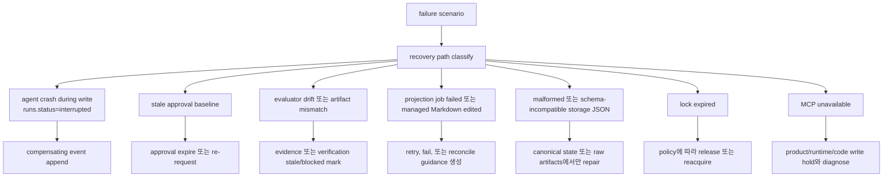

Recovery는 compensating event를 append할 수 있습니다. Evidence를 조용히 delete하거나, event history를 rewrite하거나, projection을 authoritative하게 만들면 안 됩니다.

## Export

Export는 Task에 대한 review 또는 archival bundle을 만듭니다.

필수 contents:

- created time, task id, projection freshness, redaction summary가 있는 export manifest
- Task와 related record의 state snapshot
- Decision Packets, user decisions, accepted-risk metadata/refs가 포함된 residual risks, Journey Spine entries 또는 continuity refs, 관련 Change Unit Autonomy Boundary summary
- relevant report의 projection snapshot
- artifact reference와 허용되는 경우 포함된 raw artifact file
- artifact integrity manifest
- secret, sensitive log, PII에 대한 redaction 및 omission note

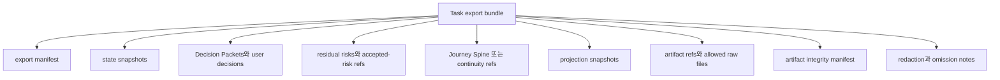

Exported projection snapshot은 hash를 가질 수 있지만, 그렇다고 Markdown projection이 canonical evidence가 되지는 않습니다. Raw evidence는 artifact file과 registered ref로 남습니다.

## Artifact Integrity

Artifact integrity check는 artifact record와 stored file을 비교합니다.

필수 check:

- file exists
- hash matches
- size matches
- content type이 known이거나 명시적으로 `other`입니다
- redaction state가 valid입니다
- task/run 또는 artifact-link relation이 valid입니다
- linked state owner가 존재하거나, `record_kind=projection`이 completed `projection_jobs` row로 resolve됩니다
- owner-link relation semantics가 artifact kind와 호환됩니다. 여기에는 kind가 `bundle`, `manifest`, `export_component`인 artifacts가 포함됩니다
- projection artifact links에서는 `artifact_links.record_id`가 `projection_jobs.projection_job_id`와 같아야 합니다. Integrity는 separate `projections` table을 찾지 않고 compatible task 또는 project scope, `target_ref`, `status=completed`, `output_path` 또는 documented projection ref를 통해 해당 job/output identity를 validate합니다
- bundle, manifest, export-component artifacts는 artifact row와 owner links를 통해 validate합니다. Check가 존재하지 않는 `verification_bundle` 또는 `export` state table을 찾으면 안 됩니다
- retention class가 valid입니다
- projection 또는 evidence ref가 resolve됩니다

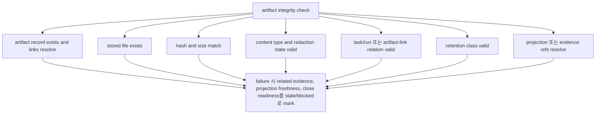

Failure는 Core rule에 따라 related evidence, projection freshness, close readiness를 stale/blocked로 mark해야 합니다. Missing artifact는 Markdown report를 edit해서 고치는 것이 아닙니다.

## Conformance Fixture Format

Conformance는 fixture 기반입니다. Scenario table만으로는 충분하지 않습니다. 각 test fixture는 action을 drive하고 state, events, artifacts, projections, errors를 assert해야 합니다.

각 fixture는 이 shape를 포함해야 합니다.

```yaml
scenario_id: string
initial_state: object
input: object
action: string
expected_state: object
expected_events: list
expected_artifacts: list
expected_projection: object
expected_error: object | null
```

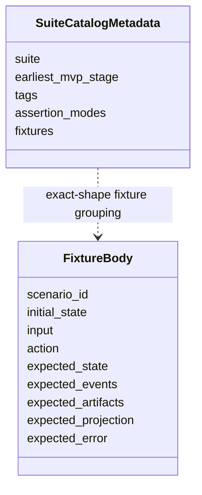

Fixture file과 suite catalog는 fixture body 밖에 metadata를 가질 수 있습니다. Fixture body 자체는 위 field만 사용해야 conformance runner가 behavior를 일관되게 비교할 수 있습니다.

MCP tool action의 경우 executable fixture `input`은 API docs가 정의하는 해당 tool의 public request payload입니다. Runner는 schema가 요구하는 경우 `envelope: ToolEnvelope`를 포함해 `action`에 해당하는 request schema로 `input`을 validate해야 합니다. 이 문서의 예시는 다음 envelope-expansion convention 아래에서만 `ToolEnvelope`를 생략할 수 있습니다. Validation, canonicalization, request hashing, Core execution 전에 runner가 `initial_state`, suite defaults, fixture metadata에서 deterministic valid envelope를 supply합니다. Expanded request가 Core에 전달되는 값입니다. 이 convention은 fixture field를 추가하거나 fixture body shape를 바꾸거나 alternate request schema를 만들지 않습니다.

Fixture shorthand는 의도적으로 좁게 제한됩니다. `initial_state` seeding, suite catalog metadata, 그리고 `owner_records`, `stewardship_findings`, feedback-loop shorthand 같은 compact example의 documented seed-loader expansion에만 허용됩니다. 실행 가능한 fixture file은 이 shorthand를 owner record, validator run, residual risk, 또는 DDL/API 문서가 소유하는 다른 record로 mapping해야 합니다. Shorthand는 두 번째 API나 state model을 만들면 안 됩니다. Public mutation은 `input` 안의 scenario-only shorthand로 encoding하면 안 됩니다. Fixtures는 `record_run`, `record_eval`, `record_manual_qa`, `record_user_decision`의 public request branch를 사용하거나, scenario가 preexisting state에 관한 것이라면 `initial_state`에 owner record를 seed해야 합니다. `close_task` fixture `input`은 documented envelope expansion 이후에도 `CloseTaskRequest`만이어야 합니다. Evidence profile, changed paths, artifact refs, acceptance-criteria support, self-check summary, Manual QA records는 `initial_state`에 seed하거나 preceding public mutation fixture에서 record해야 합니다. `StewardshipImpactSummary` assertion은 derived display이지 canonical current record가 아니며 `expected_state.derived` 또는 projection assertion 아래에 두어야 합니다. `owner_records.feedback_loops`는 canonical `feedback_loops` rows를 seed합니다. `feedback_loop_refs` 같은 example fields의 bare `FBL-*` values는 executable fixtures에서 `StateRecordRef { record_kind: feedback_loop, record_id: ... }`로 mapping됩니다. Seeded state 대신 public mutation을 exercise하는 fixture body는 definition changes를 `record_run.payload.shaping_update.feedback_loop_updates` 아래의 `FeedbackLoopUpdate`로, execution/status changes를 `evidence_updates.feedback_loop_updates`로, Manual QA execution을 `record_manual_qa.feedback_loop_ref`로 표현해야 합니다. Example이 `feedback_loop_id`와 `status`만 보여주면 fixture runner는 insert 또는 corresponding `FeedbackLoopUpdate` build 전에 surrounding Task, Change Unit, selected-loop, evidence shorthand에서 remaining required `feedback_loops` storage fields를 derive하거나 supply해야 합니다. Fixture shorthand의 accepted residual risk는 seeded `residual_risk` records의 state이며 standalone accepted-risk record가 아닙니다. Fixture examples가 `visible_refs`, `accepted_refs`, `not_visible_refs`, `unaccepted_refs`, `residual_risk_refs` 같은 risk-ref arrays에 bare `RISK-*` values를 사용할 때, executable fixtures는 이를 `StateRecordRef { record_kind: residual_risk, record_id: ... }`로 mapping해야 합니다. 이 bare IDs는 fixture shorthand일 뿐이며 DDL/API fields가 아닙니다. Executable MVP fixtures는 standalone `ARISK-*` records를 요구하면 안 됩니다.

`write_authorizations`를 seed하는 executable fixtures는 valid stored rows를 만들어야 합니다. 각 seeded authorization row는 `basis_state_version`을 명시적으로 포함하거나, runner가 `state.sqlite`에 insert하기 전에 row의 Task에 대한 seeded affected-scope state version에서 이를 derive해야 합니다. 이는 storage-loader derivation rule일 뿐이며 fixture top-level field를 추가하거나 fixture body shape를 바꾸지 않습니다. Partial `expected_state.write_authorization` assertions는 idempotent replay, stale detection, expiry, audit behavior를 test하지 않는 한 `basis_state_version`을 생략할 수 있습니다. `basis_state_version`은 allow-decision basis이지 resulting `ToolResponseBase.state_version`이 아닙니다.

Suite catalog metadata는 Core에 전달되지 않으며 fixture body의 일부가 아닙니다. Suite, stage, tag별로 exact-shape fixture를 묶을 수 있습니다.

```yaml
suite: agency
earliest_mvp_stage: MVP-4
tags: [decision-gate, residual-risk, autonomy-boundary]
fixtures:
  - AGENCY-decision-packet-required-before-product-tradeoff-write
  - AGENCY-residual-risk-visible-before-acceptance
```

## Conformance Execution

`harness conformance run`은 MCP tool과 operator command가 사용하는 것과 같은 Core entrypoint를 통해 fixture를 실행합니다. 동작을 prose output만 검사해서 assert하면 안 됩니다. Core entrypoint를 실행하고 그 결과의 state, events, artifacts, projection, error를 비교해야 합니다.

MVP execution semantic:

1. Fixture YAML file을 load하고 exact fixture body shape를 validate합니다.
2. Fixture가 existing read-only sample을 명시적으로 target하지 않는 한 isolated runtime home과 temporary Product Repository를 만듭니다.
3. `initial_state`에서 `registry.sqlite`, `project.yaml`, `state.sqlite`, artifact file, projection file, connector manifest를 seed합니다.
4. Core를 통해 `action`을 execute합니다. MCP tool action은 public request schema를 사용합니다. Documented `ToolEnvelope` expansion 이후 fixture `input`은 surface가 해당 MCP tool에 보낼 request payload와 같아야 합니다. `projection_refresh`, `doctor_surface`, `recover`, `artifacts_check` 같은 operator action은 이 문서의 operator semantics를 사용합니다.
5. Resulting state summary, appended `task_events`, validator result, artifact registry/file integrity, projection job status, reconcile item, returned error code를 capture합니다.
6. Captured result를 `expected_state`, `expected_events`, `expected_artifacts`, `expected_projection`, `expected_error`와 compare합니다.
7. Fixture id, pass/fail, observed state summary, observed events, artifact integrity result, projection freshness, error comparison을 report합니다.

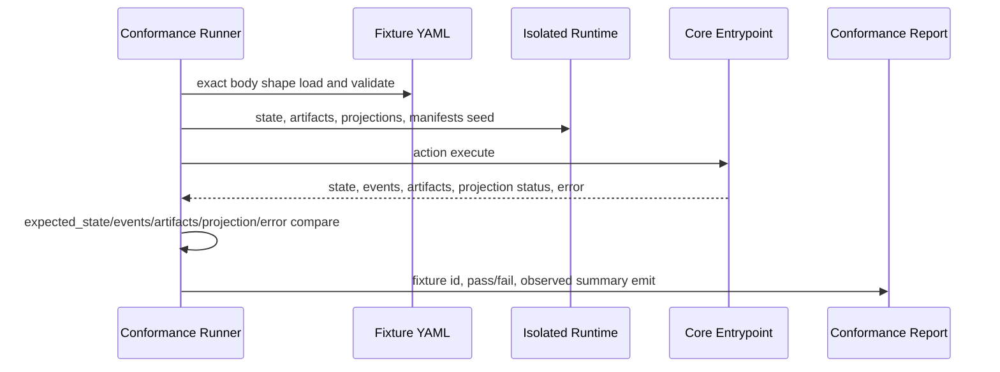

Fixture action이 `expected_state_version`을 포함하면 runner는 `ToolEnvelope.task_id`만이 아니라 Core-resolved primary Task에 따라 비교합니다. Task-scoped actions는 seeded 또는 Core-resolved primary Task State Version과 비교하고, resolved primary Task가 없는 project-scoped actions는 Project State Version과 비교합니다. Captured response와 `task_events`의 `state_version` values는 resulting affected-scope versions로 비교합니다. Read-only fixtures는 primary read scope의 unchanged version을 assert할 수 있습니다. 이 설명은 fixture body shape를 바꾸지 않고 comparison semantics만 명확히 합니다.

Fixture execution은 deterministic해야 합니다. Network access, wall-clock-sensitive expiry, external tool output은 suite가 integration smoke라고 명시적으로 선언하지 않는 한 stub하거나 seeded fixture input으로 표현해야 합니다.

Conformance runner는 MCP tools와 operator commands가 사용하는 동일한 Core storage loader를 통해 JSON `TEXT` fields를 seed하고 inspect해야 합니다. `initial_state`에 malformed JSON 또는 schema-incompatible JSON이 있는 fixture는 invalid state를 surface해야 하며, fixture action이 recovery path이고 safe reconstruction이 가능한 경우에는 repairable state issue를 surface해야 합니다. Runner는 JSON fields를 opaque strings로 취급해서 shape validation을 건너뛰면 안 되며, 이 expectation은 fixture body shape를 바꾸지 않습니다.

Conformance runner는 status-like `TEXT` fields도 [Reference MVP](06-reference-mvp.md#canonical-enum-hardening)의 owner-bound hardening map을 통해 seed하고 inspect해야 합니다. Fixture seed loader는 promoted owner values가 있는 fields의 compact shorthand와 expanded rows를 validate해야 합니다. 여기에는 registry/project surface state를 seed할 때의 `project_surfaces.guarantee_level`, `runs.kind`, `runs.status`, `write_authorizations.status`, `write_authorizations.guarantee_level`, `approvals.status`, `evidence_manifests.status`, `residual_risks.visibility_status`, `feedback_loops.loop_kind`, `feedback_loops.status`, `tdd_traces.status`, `validator_runs.status`, `validator_runs.guarantee_level`, `projection_jobs.projection_kind`, `projection_jobs.status`, `connector_manifests.status`, `baselines.status`, `change_units.status`, `tool_invocations.status`, `decision_requests.status`, `residual_risks.status`, `task_spine_entries.status`, `change_unit_dependencies.status`, `shared_designs.status`, `reconcile_items.status`, `domain_terms.status`, `module_map_items.status`, `interface_contracts.review_status`가 포함됩니다. `decision_requests.status`의 경우 optional `decision_requests` table을 retained하거나 fixture가 `decision_requests` rows를 seed할 때만 validation이 적용되며, minimal MVP implementation은 여전히 이 table을 omit할 수 있습니다. 이 promoted values도 scenario prose labels가 아니라 owner-bound storage values입니다. 예를 들어 `runs.status: completed`, `runs.status: interrupted`, `runs.status: violation`은 committed Runs에 대한 Reference MVP compatibility meaning과 함께만 valid하며, `shared_designs.status: active`는 current design basis이지 final acceptance나 approval이 아닙니다. Executable fixture는 invalid state recovery를 명시적으로 test하는 scenario가 아닌 한 unknown status values를 seed하면 안 됩니다. Expected-state status assertions는 prose label이 아니라 captured owner values를 compare합니다.

## Fixture Assertion Semantics

Fixture assertion mode는 runner default 또는 suite catalog metadata입니다. Core input이 아니고 MCP tool에 전달되지 않으며 fixture body에 field를 추가하면 안 됩니다. Fixture body는 정확히 `scenario_id`, `initial_state`, `input`, `action`, `expected_state`, `expected_events`, `expected_artifacts`, `expected_projection`, `expected_error`만 유지합니다.

Default comparison modes:

| Fixture field | Default assertion mode |
|---|---|
| `expected_state` | `partial_deep`; 나열된 field는 recursively match해야 하며 나열되지 않은 field는 assert하지 않습니다. Suite metadata가 `expected_state: exact`로 설정할 수 있습니다. |
| `expected_events` | Captured `task_events`의 stable-catalog projection에 대한 `contains_ordered`; 나열된 stable event는 ascending `task_events.event_seq` 순서대로 나타나야 하며 unrelated stable event가 앞, 사이, 뒤에 있어도 됩니다. Suite metadata가 `expected_events: exact`로 설정할 수 있습니다. |
| `expected_artifacts` | `contains_by_identity`; 나열된 각 artifact는 같은 `artifact_id`와 `kind`를 가진 registered artifact와 match해야 하며, 그 밖에 나열된 artifact field는 recursively match합니다. |
| `expected_projection` | `partial_by_kind`; 나열된 각 projection kind는 해당 kind에 대해 나열된 status assertion 또는 partial object assertion을 만족해야 합니다. |
| `expected_error` | `expected_error: null`은 action이 error를 반환하지 않았음을 assert합니다. `expected_error`가 object이면 `expected_error.code`는 required이며 API가 소유한 [Primary Error Code Precedence](05-mcp-api-and-schemas.md#primary-error-code-precedence)에 따라 선택된 primary API `ErrorCode`인 `ToolError.code`, 즉 response에 errors가 있으면 `ToolResponseBase.errors[0].code`와 exact match합니다. Arbitrary secondary error, validator finding code, policy finding code, local diagnostic label과 match하면 안 됩니다. `expected_error.details`는 optional입니다. Omitted이면 details field는 assert하지 않습니다. `details`가 present이면 suite metadata가 `expected_error.details: exact`로 설정하지 않는 한 `partial_deep`으로 match합니다. |

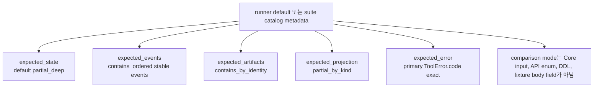

`expected_events` comparisons는 captured `task_events`의 [Kernel Stable Event Catalog](03-kernel-spec.md#stable-event-catalog) projection을 대상으로 합니다. API tool detail/audit event lists는 이 set을 확장하지 않습니다. `task_events`에 capture된 non-catalog detail 또는 local-audit events는 normal MVP fixture를 fail하게 만들면 안 됩니다. Suite metadata가 `expected_events: exact`로 설정하면, future non-MVP/local suite가 implementation-specific detail-event assertions를 명시적으로 opt in하지 않는 한 exactness는 captured stream의 stable-event projection에 적용됩니다. Validator IDs, Core check names, projection status shorthands, fixture seed shorthand, scenario catalog IDs는 event names가 아닙니다. Prose examples는 non-catalog event names를 illustrative 또는 future extension ideas로 언급할 수 있지만, executable MVP fixtures는 kernel catalog가 promote하기 전까지 이를 요구하면 안 됩니다.

Conformance runner는 captured `task_events`를 `event_seq`로 order합니다. `state_version`, `created_at`, `event_id`는 `expected_events` ordering의 tie-breaker가 아닙니다.

Fixture authors는 API precedence가 generic validator fallback을 선택할 때만 `VALIDATOR_FAILED`를 `expected_error.code`로 사용해야 합니다. `EVIDENCE_INSUFFICIENT`, `QA_REQUIRED`, `PROJECTION_STALE`, `ARTIFACT_MISSING` 같은 더 specific한 typed blocker가 적용되면 그 code가 primary입니다.

`CloseTaskResponse.blockers[].code` 역시 API `ErrorCode` value입니다. Policy-specific 또는 validator-specific finding code는 `expected_state.validators`, validator finding assertion, 또는 equivalent expected validator output 아래에 두어야 하며, `expected_error.code`나 close blocker `code`에 두면 안 됩니다.

`expected_state.validators` 아래의 validator assertion은 validator ID로 keyed됩니다. 나열된 각 validator ID는 captured validator results에 존재해야 하며 나열된 field를 partially match해야 합니다. 나열되지 않은 validator ID와 나열되지 않은 validator field는 assert하지 않습니다.

Fixture가 design-quality severity를 assert할 때는 모든 relevant validator finding을 `expected_state.validators` 아래 visible하게 유지하고, policy-owned [Severity Composition Rule](08-design-quality-policy-pack.md#severity-composition-rule)이 만든 merged gate, write-blocker, close-blocker, waiver, Decision Packet outcome을 assert해야 합니다. Fixture는 policy schema를 추가하거나 더 강한 merged blocker가 있다는 이유만으로 lower-severity finding을 suppress하면 안 됩니다.

`expected_state.checks` 아래의 Core check와 precondition assertion은 check/precondition name으로 keyed됩니다. 이 entries는 captured Core check output, blocked reasons, response summaries, 또는 runner가 관찰한 equivalent check status와 비교합니다. MCP API 또는 Reference MVP가 해당 ID를 stable ValidatorResult로 명시적으로 promote하지 않는 한 이 값들은 validator IDs가 아니며 `expected_state.validators` 아래에 두면 안 됩니다.

`expected_state.checks.projection_freshness`는 Core mechanical projection freshness check를 assert합니다. `expected_state.validators.context_hygiene_check`는 higher-level context hygiene에 대한 stable ValidatorResult를 assert합니다. 그 validator가 projection freshness를 고려할 수는 있지만, mechanical check 자체의 fixture assertion 위치는 아닙니다.

모든 `expected_*` value 안에서 nested field가 없다는 것은 "not asserted"이지 "expected null"이 아닙니다. `expected_artifacts: []`, `expected_projection: {}` 같은 empty default-mode collection은 valid하며 required entry가 없음을 뜻합니다. `expected_events: []`는 required stable catalog event가 없음을 assert합니다. Committed transitions가 non-stable detail 또는 local-audit events를 append할 수 있으므로 `task_events` rows가 전혀 append되지 않았음을 assert하지 않습니다. Extra stable entry가 없음을 assert해야 하는 suite는 fixture body 밖의 compatible exact-mode metadata를 사용해야 합니다.

Allowed `expected_projection` status assertions:

| Assertion | Meaning |
|---|---|
| `enqueued` | Action 이후 projection kind에 대한 refresh job 또는 동등한 projection outbox entry가 pending입니다. |
| `current` | Projection kind가 committed state version과 managed hash에 대해 current입니다. |
| `stale` | State, evidence, managed content가 rendered projection보다 앞서 나가 projection kind가 stale입니다. |
| `failed` | Kind에 대한 latest applicable projection refresh가 failed입니다. |
| `skipped` | Kind에 대한 latest applicable projection job이 skipped입니다. 예를 들어 superseded되었거나 managed-block drift로 blocked된 경우입니다. |
| `stale_or_enqueued` | `stale` 또는 `enqueued` 중 하나면 acceptable합니다. Scenario가 projection invalidation 또는 enqueueing을 증명하고 runner가 refresh boundary 양쪽 중 하나를 observe할 수 있을 때 사용합니다. |
| `stale_or_failed` | `stale` 또는 `failed` 중 하나면 acceptable합니다. Render failure가 failed freshness로 surfaced되거나 failed job을 동반한 stale freshness로 surfaced될 수 있을 때 사용합니다. |

`TASK: stale_or_enqueued` 같은 projection shorthand는 `TASK` projection kind에 대한 scalar status assertion입니다. Object form은 `partial_by_kind`를 유지하면서 additional captured projection field를 assert할 수 있습니다. 예: `TASK: {status: current}`. 이 assertion operator는 fixture comparison semantics이지, owning schema documents가 정의하지 않는 한 새로운 projection DDL 또는 API enum value가 아닙니다.

Suite catalog는 fixture를 바꾸지 않고 assertion mode를 override할 수 있습니다.

```yaml
suite: core
assertion_modes:
  expected_state: exact
  expected_events: exact
  expected_error.details: exact
fixtures:
  - CORE-active-status-no-task
```

Conformance는 captured Core state, `task_events`, validator results, artifact registry/file integrity, projection job 또는 freshness state, returned error code를 통해 behavior를 증명해야 합니다. Rendered Markdown, Journey Card prose, status prose, agent prose만 matching해서는 fixture를 pass시킬 수 없습니다.

Fixture runners는 `request_hash`, baseline `tree_hash`, projection `managed_hash`에 대해 reference implementation과 같은 canonicalization rules를 사용해야 합니다. Detailed algorithms는 MCP API, Reference MVP storage, Document Projection docs가 계속 소유합니다. Conformance fixtures는 그 source-of-truth boundaries를 다시 정의하지 않고 deterministic behavior를 assert합니다.

## Agency, Stewardship, Context Suite

Agency, stewardship, context hygiene는 MVP conformance suite입니다. 이 suite들은 `prepare_write`, `request_user_decision`, `record_user_decision`, `record_manual_qa`, `close_task`, `next` 같은 Core entrypoint와 Core를 호출하는 operator action을 통해 state behavior를 검증합니다. Journey Card, Decision Packet, residual-risk, status prose의 문구가 맞는지만 보고 통과 처리하면 안 됩니다.

필수 suite 책임:

| Suite | Required behavior |
|---|---|
| agency | Blocking product judgment는 affected write 또는 close 전에 compatible Decision Packet을 요구합니다. Decision request routing metadata는 optional compatibility data이며 이것만으로는 `decision_gate`를 satisfy하면 안 됩니다. Product trade-off write는 hold됩니다. Sensitive approval lifecycle은 approval, Decision Packet, Write Authorization을 서로 구분된 상태로 유지합니다. AFK Autonomy Boundary stop condition은 public commitment를 block합니다. Known close-relevant residual risk는 successful close 전에 visible이어야 합니다. Known close-relevant risk가 없으면 `ResidualRiskSummary.status=none`이 residual-risk visibility를 satisfy합니다. Risk-accepted close에는 acceptance 전에 user에게 visible했던 risk를 가리키는 accepted Residual Risk refs가 추가로 필요합니다. Approval, QA, acceptance, residual-risk acceptance는 서로 구분된 상태로 남아야 합니다. |
| stewardship | Design-quality와 codebase-stewardship validator는 canonical owner record, ref, policy-owned severity composition을 통해 `design_gate`, `decision_gate`, `qa_gate`, close blocker, waiver eligibility에 영향을 줍니다. Public interface, module, domain, feedback-loop, TDD, Manual QA, waiver check는 schema나 DDL을 duplicate하지 않습니다. |
| context-hygiene | Current Task state, Journey ref, evidence ref, freshness state가 authoritative합니다. Stale PRD, stale projection, closed issue, old design doc, long log는 reconcile되기 전까지 pull-only context입니다. Stale context는 write, close, acceptance, current-state replacement를 authorize할 수 없습니다. |

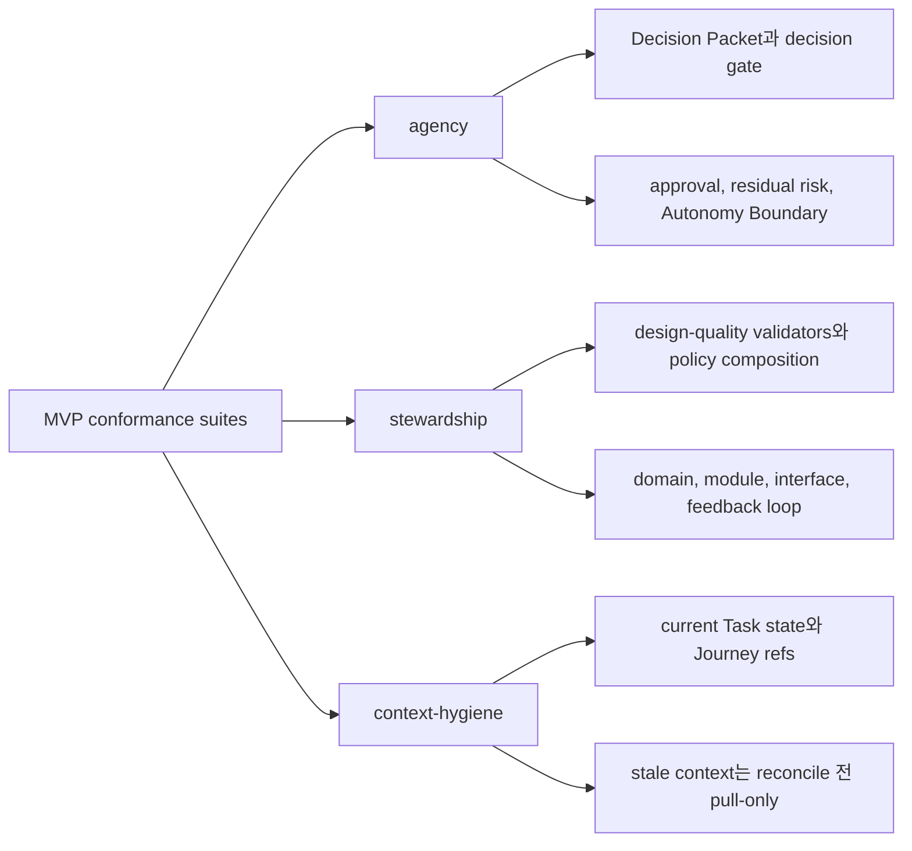

## Hardened MVP Fixture Coverage

Hardened evidence, verification, connector rule은 required shape를 가진 fixture로 cover해야 합니다. Suite catalog는 scenario ID를 behavior가 구현되어야 하는 가장 이른 MVP stage에 mapping할 수 있지만, stage metadata는 fixture body의 일부가 아닙니다.

```yaml
scenario_id: CORE-evidence-direct-docs-only-sufficient
initial_state:
  active_task:
    task_id: TASK-DOCS-001
    mode: direct
    lifecycle_phase: executing
    acceptance_criteria: ["AC-01 typo corrected"]
    gates:
      scope_gate: passed
      evidence_gate: sufficient
      verification_gate: not_required
  runs:
    - run_id: RUN-DOCS-001
      kind: direct
      status: completed
      summary: "Rendered Markdown heading and checked typo fix."
      observed_changes:
        changed_paths: ["docs/help.md"]
      artifact_refs: [ART-DIFF-001]
  evidence_manifests:
    - evidence_manifest_id: EM-DOCS-001
      status: sufficient
      criteria:
        AC-01:
          status: supported
          refs: [ART-DIFF-001]
      changed_files: ["docs/help.md"]
      supporting_refs: [RUN-DOCS-001, ART-DIFF-001]
  artifacts:
    - artifact_id: ART-DIFF-001
      kind: diff
input:
  task_id: TASK-DOCS-001
  intent: complete
  requested_close_reason: completed_self_checked
  user_note: "Self-check recorded in RUN-DOCS-001."
  superseded_by_task_id: null
action: close_task
expected_state:
  lifecycle_phase: completed
  result: passed
  close_reason: completed_self_checked
  assurance_level: self_checked
  gates:
    evidence_gate: sufficient
  residual_risk_summary:
    status: none
    close_relevant_count: 0
expected_events:
  - close_requested
  - task_closed
expected_artifacts:
  - artifact_id: ART-DIFF-001
    kind: diff
expected_projection:
  TASK: enqueued
expected_error: null
```

```yaml
scenario_id: CORE-evidence-work-ac-missing-blocks-close
initial_state:
  active_task:
    task_id: TASK-WORK-AC-001
    mode: work
    lifecycle_phase: verifying
    acceptance_criteria: ["AC-01 saves profile", "AC-02 shows validation error"]
    gates:
      scope_gate: passed
      approval_gate: not_required
      evidence_gate: partial
      verification_gate: pending
  evidence_manifests:
    - evidence_manifest_id: EM-WORK-AC-001
      status: partial
      criteria:
        AC-01:
          status: supported
          refs: [ART-TEST-001]
        AC-02:
          status: unsupported
          refs: []
      supporting_refs: [ART-TEST-001]
  artifacts:
    - artifact_id: ART-TEST-001
      kind: log
input:
  task_id: TASK-WORK-AC-001
  intent: complete
  requested_close_reason: completed_verified
  user_note: null
  superseded_by_task_id: null
action: close_task
expected_state:
  lifecycle_phase: blocked
  gates:
    evidence_gate: partial
expected_events:
  - close_requested
  - close_blocked
expected_artifacts:
  - artifact_id: ART-TEST-001
    kind: log
expected_projection:
  TASK: enqueued
expected_error:
  code: EVIDENCE_INSUFFICIENT
```

```yaml
scenario_id: CORE-evidence-ui-manual-qa-pending-blocks-close
initial_state:
  active_task:
    task_id: TASK-UI-QA-001
    mode: work
    lifecycle_phase: qa
    acceptance_criteria: ["AC-01 button copy updated"]
    gates:
      scope_gate: passed
      evidence_gate: sufficient
      verification_gate: passed
      qa_gate: pending
  manual_qa_records: []
input:
  task_id: TASK-UI-QA-001
  intent: complete
  requested_close_reason: completed_verified
  user_note: null
  superseded_by_task_id: null
action: close_task
expected_state:
  lifecycle_phase: qa
  gates:
    qa_gate: pending
expected_events:
  - close_requested
  - close_blocked
expected_artifacts: []
expected_projection:
  TASK: enqueued
expected_error:
  code: QA_REQUIRED
```

```yaml
scenario_id: CORE-verify-manual-bundle-detached-passed
initial_state:
  active_task:
    task_id: TASK-VERIFY-BUNDLE-001
    mode: work
    lifecycle_phase: verifying
    active_change_unit_id: CU-VERIFY-BUNDLE-001
    gates:
      evidence_gate: sufficient
      verification_gate: pending
  active_change_unit:
    change_unit_id: CU-VERIFY-BUNDLE-001
    allowed_paths: ["src/profile/editor.ts"]
  runs:
    - run_id: RUN-VERIFY-BUNDLE-TARGET-001
      kind: implementation
      status: completed
      artifact_refs: [ART-DIFF-001, ART-TEST-001]
  evidence_manifests:
    - evidence_manifest_id: EM-VERIFY-BUNDLE-001
      status: sufficient
      supporting_refs: [RUN-VERIFY-BUNDLE-TARGET-001, ART-DIFF-001, ART-TEST-001]
  artifacts:
    - artifact_id: ART-BUNDLE-001
      kind: bundle
    - artifact_id: ART-DIFF-001
      kind: diff
    - artifact_id: ART-TEST-001
      kind: log
input:
  task_id: TASK-VERIFY-BUNDLE-001
  change_unit_id: CU-VERIFY-BUNDLE-001
  evaluator_run_id: null
  target_run_id: RUN-VERIFY-BUNDLE-TARGET-001
  verdict: passed
  checks_performed:
    - check_id: manual-bundle-review
      result: passed
      summary: "Manual bundle에서 task summary, acceptance criteria, Change Unit scope, approval scope, diff, test log, evidence manifest, known risks를 review했습니다."
  evidence_reviewed:
    state_refs:
      - record_kind: task
        record_id: TASK-VERIFY-BUNDLE-001
        projection_path: null
      - record_kind: change_unit
        record_id: CU-VERIFY-BUNDLE-001
        projection_path: null
      - record_kind: run
        record_id: RUN-VERIFY-BUNDLE-TARGET-001
        projection_path: null
      - record_kind: evidence_manifest
        record_id: EM-VERIFY-BUNDLE-001
        projection_path: null
    artifact_refs:
      - artifact_id: ART-BUNDLE-001
        kind: bundle
        uri: harness-artifact://PROJECT-VERIFY/ART-BUNDLE-001
        sha256: bbbbbbbbbbbbbbbbbbbbbbbbbbbbbbbbbbbbbbbbbbbbbbbbbbbbbbbbbbbbbbbb
        size_bytes: 4096
        content_type: application/json
        redaction_state: none
        task_id: TASK-VERIFY-BUNDLE-001
        run_id: RUN-VERIFY-BUNDLE-TARGET-001
        created_at: "2026-05-10T00:00:00Z"
        produced_by: harness
        retention_class: task
      - artifact_id: ART-DIFF-001
        kind: diff
        uri: harness-artifact://PROJECT-VERIFY/ART-DIFF-001
        sha256: dddddddddddddddddddddddddddddddddddddddddddddddddddddddddddddddd
        size_bytes: 2048
        content_type: text/x-diff
        redaction_state: none
        task_id: TASK-VERIFY-BUNDLE-001
        run_id: RUN-VERIFY-BUNDLE-TARGET-001
        created_at: "2026-05-10T00:00:00Z"
        produced_by: lead_agent
        retention_class: task
      - artifact_id: ART-TEST-001
        kind: log
        uri: harness-artifact://PROJECT-VERIFY/ART-TEST-001
        sha256: 7777777777777777777777777777777777777777777777777777777777777777
        size_bytes: 3072
        content_type: text/plain
        redaction_state: none
        task_id: TASK-VERIFY-BUNDLE-001
        run_id: RUN-VERIFY-BUNDLE-TARGET-001
        created_at: "2026-05-10T00:00:00Z"
        produced_by: lead_agent
        retention_class: task
  independence:
    context: manual_bundle
    write_capable: false
    baseline_reverified: true
    evaluator_surface_id: SURFACE-EVAL-MANUAL-BUNDLE-001
    parent_run_id: null
  blockers: []
  artifact_inputs:
    - input_id: ART-IN-BUNDLE-001
      source_kind: existing_artifact
      existing_artifact_ref:
        artifact_id: ART-BUNDLE-001
        kind: bundle
        uri: harness-artifact://PROJECT-VERIFY/ART-BUNDLE-001
        sha256: bbbbbbbbbbbbbbbbbbbbbbbbbbbbbbbbbbbbbbbbbbbbbbbbbbbbbbbbbbbbbbbb
        size_bytes: 4096
        content_type: application/json
        redaction_state: none
        task_id: TASK-VERIFY-BUNDLE-001
        run_id: RUN-VERIFY-BUNDLE-TARGET-001
        created_at: "2026-05-10T00:00:00Z"
        produced_by: harness
        retention_class: task
      staged: null
      kind: bundle
      redaction_state: none
      produced_by: harness
      retention_class: task
      relation:
        task_id: TASK-VERIFY-BUNDLE-001
        run_id: null
        record_kind: eval
        record_id_hint: EVAL-VERIFY-BUNDLE-001
      description: "Evaluator가 review한 manual verification bundle입니다."
action: record_eval
expected_state:
  lifecycle_phase: verifying
  assurance_level: detached_verified
  gates:
    verification_gate: passed
expected_events:
  - eval_recorded
  - verification_passed
expected_artifacts:
  - artifact_id: ART-BUNDLE-001
    kind: bundle
expected_projection:
  EVAL: enqueued
  TASK: enqueued
expected_error: null
```

```yaml
scenario_id: CORE-verify-subagent-context-not-detached-by-default
initial_state:
  active_task:
    task_id: TASK-VERIFY-SUBAGENT-001
    mode: work
    lifecycle_phase: verifying
    gates:
      verification_gate: pending
  evidence_manifests:
    - evidence_manifest_id: EM-VERIFY-SUBAGENT-001
      status: sufficient
      supporting_refs: [RUN-VERIFY-SUBAGENT-TARGET-001]
  runs:
    - run_id: RUN-VERIFY-SUBAGENT-TARGET-001
      kind: implementation
      status: completed
input:
  task_id: TASK-VERIFY-SUBAGENT-001
  change_unit_id: null
  evaluator_run_id: null
  target_run_id: RUN-VERIFY-SUBAGENT-TARGET-001
  verdict: passed
  checks_performed:
    - check_id: inherited-subagent-context
      result: passed
      summary: "Evidence checks는 passed였지만 evaluator가 parent run의 subagent context를 inherited했고 detached verification profile을 satisfy하지 못했습니다."
  evidence_reviewed:
    state_refs:
      - record_kind: run
        record_id: RUN-VERIFY-SUBAGENT-TARGET-001
        projection_path: null
      - record_kind: evidence_manifest
        record_id: EM-VERIFY-SUBAGENT-001
        projection_path: null
    artifact_refs: []
  independence:
    context: subagent_context
    write_capable: false
    baseline_reverified: false
    evaluator_surface_id: SURFACE-EVAL-SUBAGENT-001
    parent_run_id: RUN-VERIFY-SUBAGENT-TARGET-001
  blockers: []
  artifact_inputs: []
action: record_eval
expected_state:
  lifecycle_phase: verifying
  assurance_level: none
  gates:
    verification_gate: pending
expected_events:
  - eval_recorded
  - verify_not_detached_detected
expected_artifacts: []
expected_projection:
  EVAL: enqueued
  TASK: enqueued
expected_error:
  code: VERIFY_NOT_DETACHED
```

```yaml
scenario_id: CORE-verify-waiver-risk-accepted-visible-succeeds
initial_state:
  active_task:
    task_id: TASK-VERIFY-RISK-001
    mode: work
    lifecycle_phase: waiting_user
    assurance_level: self_checked
    gates:
      scope_gate: passed
      decision_gate: resolved
      evidence_gate: sufficient
      verification_gate: waived_by_user
      qa_gate: not_required
      acceptance_gate: accepted
  residual_risks:
    - risk_id: RISK-VERIFY-001
      close_relevant: true
      visibility: visible
      accepted: true
  decision_packets:
    - decision_packet_id: DEC-VERIFY-WAIVER-001
      decision_kind: verification_waiver
      status: resolved
    - decision_packet_id: DEC-RISK-ACCEPT-001
      decision_kind: residual_risk_acceptance
      status: resolved
      residual_risk_refs: [RISK-VERIFY-001]
input:
  task_id: TASK-VERIFY-RISK-001
  intent: complete
  requested_close_reason: completed_with_risk_accepted
  user_note: "User accepts remaining verification risk for urgent local-only fix."
  superseded_by_task_id: null
action: close_task
expected_state:
  lifecycle_phase: completed
  result: passed
  close_reason: completed_with_risk_accepted
  assurance_level: self_checked
  residual_risk_summary:
    status: accepted
    accepted_refs: [RISK-VERIFY-001]
expected_events:
  - close_requested
  - risk_accepted_close_recorded
  - task_closed
expected_artifacts: []
expected_projection:
  TASK: enqueued
expected_error: null
```

```yaml
scenario_id: CORE-verify-waiver-risk-accepted-hidden-blocks-close
initial_state:
  active_task:
    task_id: TASK-VERIFY-RISK-HIDDEN-001
    mode: work
    lifecycle_phase: waiting_user
    assurance_level: self_checked
    gates:
      scope_gate: passed
      evidence_gate: sufficient
      verification_gate: waived_by_user
      qa_gate: not_required
      acceptance_gate: accepted
  residual_risks:
    - risk_id: RISK-VERIFY-HIDDEN-001
      close_relevant: true
      visibility: not_visible
      accepted: false
  decision_packets:
    - decision_packet_id: DEC-VERIFY-WAIVER-002
      decision_kind: verification_waiver
      status: resolved
input:
  task_id: TASK-VERIFY-RISK-HIDDEN-001
  intent: complete
  requested_close_reason: completed_with_risk_accepted
  user_note: "User accepts remaining verification risk for urgent local-only fix."
  superseded_by_task_id: null
action: close_task
expected_state:
  lifecycle_phase: waiting_user
  assurance_level: self_checked
  gates:
    verification_gate: waived_by_user
    acceptance_gate: accepted
  residual_risk_summary:
    status: not_visible
    not_visible_refs: [RISK-VERIFY-HIDDEN-001]
expected_events:
  - close_requested
  - close_blocked
expected_artifacts: []
expected_projection:
  TASK: enqueued
expected_error:
  code: RESIDUAL_RISK_NOT_VISIBLE
```

```yaml
scenario_id: CONN-cooperative-guarantee-display
initial_state:
  surface:
    surface_id: SURF-0001
    guarantee_level: cooperative
    changed_path_detection: validator
  active_task:
    mode: direct
    lifecycle_phase: ready
input:
  include:
    task: false
    gates: false
    projections: false
    pending_decisions: false
    guarantees: true
    journey_card: false
    decision_packets: false
    autonomy_boundary: false
    write_authority: false
    residual_risk: false
action: status
expected_state:
  guarantee_display:
    level: cooperative
    notes:
      - "This surface is expected to follow Harness decisions, but Harness may not physically block an out-of-scope write before it happens. Changed-path validation can detect violations afterward."
expected_events: []
expected_artifacts: []
expected_projection: {}
expected_error: null
```

```yaml
scenario_id: CONN-mcp-unavailable-write-hold
initial_state:
  surface:
    guarantee_level: cooperative
    mcp_available: false
  active_task:
    task_id: TASK-MCP-HOLD-001
    mode: direct
    lifecycle_phase: ready
    active_change_unit_id: CU-MCP-HOLD-001
    gates:
      scope_gate: passed
  active_change_unit:
    change_unit_id: CU-MCP-HOLD-001
    allowed_paths: ["src/profile/ProfileForm.tsx"]
    allowed_tools: ["edit"]
input:
  task_id: TASK-MCP-HOLD-001
  change_unit_id: CU-MCP-HOLD-001
  intended_operation: "Edit the profile form through a cooperative surface while MCP is unavailable."
  intended_paths: ["src/profile/ProfileForm.tsx"]
  intended_tools: ["edit"]
  intended_commands: []
  intended_network: []
  intended_secrets: []
  sensitive_categories: []
  baseline_ref: BASE-MCP-HOLD-001
action: prepare_write
expected_state:
  lifecycle_phase: blocked
  write_held: true
  write_decision: blocked
  validators:
    surface_capability_check:
      status: blocked
expected_events:
  - prepare_write_blocked
  - capability_insufficient_detected
expected_artifacts: []
expected_projection:
  TASK: enqueued
expected_error:
  code: MCP_UNAVAILABLE
  details:
    mcp_unavailable_kind: surface_mcp_unavailable
```

## Core Fixture 예시

`prepare_write` allowed 예시는 Task가 `ready`에서 `executing`으로 이동한다고 기대합니다. 이 transition은 kernel transition table이 소유하고 정의합니다.

Approval lifecycle coverage는 fixture body field를 추가하지 말고 separate exact-shape fixtures 또는 suite catalog sequencing으로 materialize해야 합니다. 이 fixtures는 lifecycle을 다시 정의하지 않고 [Kernel `prepare_write` State Logic](03-kernel-spec.md#prepare_write-state-logic), [`harness.prepare_write`](05-mcp-api-and-schemas.md#harnessprepare_write), [APR projection summary](07-document-projection.md#apr)가 정의한 observable effects를 assert합니다.

Fixture authors는 다음 observable assertions를 유지해야 합니다.

- 첫 uncovered sensitive `prepare_write`는 `approval_required`를 반환하고, approval candidate를 포함하며, Write Authorization을 반환하지 않고, blocker state가 committed된 경우 `approval_gate=required`를 set 또는 keep합니다.
- Committed blocker state는 `TASK`를 enqueue할 수 있지만, non-mutating candidate는 `APR`을 enqueue하면 안 됩니다.
- Dry-run 또는 candidate-display-only paths는 blocker state가 실제로 committed되지 않았다면 committed `TASK` changes를 assert하면 안 됩니다.
- `request_user_decision(decision_kind=approval)`은 approval-shaped Decision Packet과 pending Approval state를 만들고, `approval_gate=pending`을 set하며, `APR`을 enqueue합니다.
- `record_user_decision`은 Approval/Decision Packet state와 `approval_gate`를 update하고, `APR`을 enqueue할 수 있지만, 여전히 Write Authorization을 만들지 않습니다.
- Fresh idempotency key와 current `expected_state_version`을 사용한 later compatible `prepare_write` retry만 Write Authorization을 만들 수 있습니다.

첫 payload에 대한 UI 또는 status assertion은 이를 candidate display라고 불러야 하며 `APR` projection이라고 부르면 안 됩니다.

```yaml
scenario_id: CORE-prepare-write-no-change-unit
initial_state:
  active_task:
    task_id: TASK-NO-CU-001
    mode: work
    lifecycle_phase: ready
    active_change_unit: null
input:
  task_id: TASK-NO-CU-001
  change_unit_id: null
  intended_operation: "Edit login without an active Change Unit."
  intended_paths: ["src/auth/login.ts"]
  intended_tools: ["edit"]
  intended_commands: []
  intended_network: []
  intended_secrets: []
  sensitive_categories: []
  baseline_ref: null
action: prepare_write
expected_state:
  lifecycle_phase: blocked
  gates:
    scope_gate: blocked
expected_events:
  - prepare_write_blocked
expected_artifacts: []
expected_projection:
  TASK: stale_or_enqueued
expected_error:
  code: NO_ACTIVE_CHANGE_UNIT
```

```yaml
scenario_id: CORE-prepare-write-allowed-creates-write-authorization
initial_state:
  active_task:
    task_id: TASK-WRITE-001
    mode: direct
    lifecycle_phase: ready
    active_change_unit_id: CU-WRITE-001
    gates:
      scope_gate: passed
      decision_gate: not_required
      approval_gate: not_required
      design_gate: passed
  active_change_unit:
    change_unit_id: CU-WRITE-001
    allowed_paths: ["src/a.ts"]
    allowed_tools: ["edit"]
    allowed_commands: []
    baseline_ref: BASE-WRITE-001
input:
  task_id: TASK-WRITE-001
  change_unit_id: CU-WRITE-001
  intended_operation: "Edit the scoped direct file."
  intended_paths: ["src/a.ts"]
  intended_tools: ["edit"]
  intended_commands: []
  intended_network: []
  intended_secrets: []
  sensitive_categories: []
  baseline_ref: BASE-WRITE-001
action: prepare_write
expected_state:
  lifecycle_phase: executing
  gates:
    scope_gate: passed
    decision_gate: not_required
    approval_gate: not_required
  write_decision: allowed
  write_authorization_ref:
    record_kind: write_authorization
    record_id: WA-WRITE-001
  write_authorization:
    write_authorization_id: WA-WRITE-001
    status: allowed
    change_unit_id: CU-WRITE-001
    intended_paths: ["src/a.ts"]
    consumed_by_run_id: null
  checks:
    scope_coverage: passed
    changed_paths_intent: passed
expected_events:
  - prepare_write_allowed
  - write_authorization_created
expected_artifacts: []
expected_projection:
  TASK: enqueued
expected_error: null
```

```yaml
scenario_id: CORE-record-run-without-write-authorization-blocked
initial_state:
  active_task:
    task_id: TASK-WRITE-002
    mode: direct
    lifecycle_phase: executing
    active_change_unit_id: CU-WRITE-002
    gates:
      scope_gate: passed
      evidence_gate: none
  active_change_unit:
    change_unit_id: CU-WRITE-002
    allowed_paths: ["src/a.ts"]
    allowed_tools: ["edit"]
    baseline_ref: BASE-WRITE-002
input:
  kind: direct
  task_id: TASK-WRITE-002
  change_unit_id: CU-WRITE-002
  run_id: null
  baseline_ref: BASE-WRITE-002
  write_authorization_id: null
  summary: "Direct edit was attempted without a prepare_write authorization."
  artifact_inputs: []
  payload:
    direct:
      observed_changes:
        changed_paths: ["src/a.ts"]
        created_paths: []
        deleted_paths: []
      command_results: []
      evidence_updates:
        acceptance_criteria: []
        feedback_loop_updates: []
      self_check_summary: "Self-check cannot count because Write Authorization is missing."
      escalation:
        value: none
        reason: null
action: record_run
expected_state:
  lifecycle_phase: executing
  gates:
    scope_gate: passed
    evidence_gate: none
  run_recorded: false
  write_authorization_ref: null
  checks:
    changed_paths: blocked
    scope_coverage: passed
expected_events: []
expected_artifacts: []
expected_projection: {}
expected_error:
  code: WRITE_AUTHORIZATION_REQUIRED
```

이 fixture는 의도적으로 `run_recorded: false`, stable events 없음, artifacts 없음, projection changes 없음 상태를 유지합니다. Corresponding `RecordRunResponse.run_id`는 `null`이며, fabricated Run ID는 required도 allowed도 아닙니다.

```yaml
scenario_id: CORE-record-run-observed-path-outside-authorization-blocks-or-stales
initial_state:
  active_task:
    task_id: TASK-WRITE-003
    mode: work
    lifecycle_phase: executing
    active_change_unit_id: CU-WRITE-003
    gates:
      scope_gate: passed
      approval_gate: not_required
      evidence_gate: partial
  active_change_unit:
    change_unit_id: CU-WRITE-003
    allowed_paths: ["src/a.ts"]
    allowed_tools: ["edit"]
    baseline_ref: BASE-WRITE-003
  write_authorizations:
    - write_authorization_id: WA-WRITE-003
      status: allowed
      change_unit_id: CU-WRITE-003
      basis_state_version: 1
      intended_paths: ["src/a.ts"]
      consumed_by_run_id: null
input:
  kind: implementation
  task_id: TASK-WRITE-003
  change_unit_id: CU-WRITE-003
  run_id: RUN-WRITE-003
  baseline_ref: BASE-WRITE-003
  write_authorization_id: WA-WRITE-003
  summary: "Implementation touched an observed path outside the authorization."
  artifact_inputs: []
  payload:
    implementation:
      observed_changes:
        changed_paths: ["src/a.ts", "src/b.ts"]
        created_paths: []
        deleted_paths: []
      command_results: []
      evidence_updates:
        acceptance_criteria: []
        feedback_loop_updates: []
      tdd_trace_update: null
action: record_run
expected_state:
  lifecycle_phase: blocked
  gates:
    scope_gate: blocked
    evidence_gate: stale
  close_readiness: blocked
  projection_status: stale
  run_recorded: true
  run:
    run_id: RUN-WRITE-003
    kind: implementation
    status: violation
    write_authorization_id: null
    observed_changes:
      changed_paths: ["src/a.ts", "src/b.ts"]
    violation_payload:
      attempted_write_authorization_id: WA-WRITE-003
    evidence_sufficiency_allowed: false
  write_authorization:
    write_authorization_id: WA-WRITE-003
    status: stale
    consumed_by_run_id: null
  observed_change_violation:
    outside_authorized_paths: ["src/b.ts"]
  checks:
    changed_paths: blocked
    scope_coverage: blocked
expected_events:
  - run_recorded
  - write_authorization_violation_detected
  - write_authorization_staled
  - scope_violation_detected
expected_artifacts: []
expected_projection:
  TASK: enqueued
expected_error:
  code: SCOPE_VIOLATION
```

```yaml
scenario_id: CORE-record-run-consumed-write-authorization-invalid
initial_state:
  active_task:
    task_id: TASK-WRITE-004
    mode: direct
    lifecycle_phase: executing
    active_change_unit_id: CU-WRITE-004
    gates:
      scope_gate: passed
      evidence_gate: none
  active_change_unit:
    change_unit_id: CU-WRITE-004
    allowed_paths: ["src/a.ts"]
    allowed_tools: ["edit"]
    baseline_ref: BASE-WRITE-004
  write_authorizations:
    - write_authorization_id: WA-WRITE-004
      status: consumed
      change_unit_id: CU-WRITE-004
      basis_state_version: 1
      intended_paths: ["src/a.ts"]
      consumed_by_run_id: RUN-WRITE-PREV-004
input:
  kind: direct
  task_id: TASK-WRITE-004
  change_unit_id: CU-WRITE-004
  run_id: null
  baseline_ref: BASE-WRITE-004
  write_authorization_id: WA-WRITE-004
  summary: "Direct run tried to reuse a consumed Write Authorization."
  artifact_inputs: []
  payload:
    direct:
      observed_changes:
        changed_paths: ["src/a.ts"]
        created_paths: []
        deleted_paths: []
      command_results: []
      evidence_updates:
        acceptance_criteria: []
        feedback_loop_updates: []
      self_check_summary: "Path scope matches, but the authorization is already consumed."
      escalation:
        value: none
        reason: null
action: record_run
expected_state:
  lifecycle_phase: executing
  gates:
    scope_gate: passed
    evidence_gate: none
  run_recorded: false
  write_authorization:
    write_authorization_id: WA-WRITE-004
    status: consumed
    consumed_by_run_id: RUN-WRITE-PREV-004
  checks:
    changed_paths: passed
    scope_coverage: passed
  invalid_authorization_reason: already_consumed
expected_events: []
expected_artifacts: []
expected_projection: {}
expected_error:
  code: WRITE_AUTHORIZATION_INVALID
```

```yaml
scenario_id: CORE-same-session-verify-not-detached
initial_state:
  active_task:
    task_id: TASK-SAME-SESSION-VERIFY-001
    mode: work
    lifecycle_phase: verifying
    gates:
      verification_gate: pending
  runs:
    - run_id: RUN-SAME-SESSION-TARGET-001
      kind: implementation
      status: completed
input:
  task_id: TASK-SAME-SESSION-VERIFY-001
  change_unit_id: null
  evaluator_run_id: null
  target_run_id: RUN-SAME-SESSION-TARGET-001
  verdict: passed
  checks_performed:
    - check_id: same-session-review
      result: passed
      summary: "Same session이 자체 target run을 review했습니다. Checks는 passed였지만 evaluator는 detached가 아닙니다."
  evidence_reviewed:
    state_refs:
      - record_kind: run
        record_id: RUN-SAME-SESSION-TARGET-001
        projection_path: null
    artifact_refs: []
  independence:
    context: same_session
    write_capable: true
    baseline_reverified: false
    evaluator_surface_id: SURFACE-SAME-SESSION-001
    parent_run_id: RUN-SAME-SESSION-TARGET-001
  blockers: []
  artifact_inputs: []
action: record_eval
expected_state:
  assurance_level: none
  gates:
    verification_gate: pending
expected_events:
  - eval_recorded
  - verify_not_detached_detected
expected_artifacts: []
expected_projection:
  EVAL: enqueued
  TASK: enqueued
expected_error:
  code: VERIFY_NOT_DETACHED
```

```yaml
scenario_id: CORE-projection-failure-state-current
initial_state:
  active_task:
    mode: direct
    lifecycle_phase: completed
    result: passed
    projection_status: current
input:
  projection_kind: TASK
  render_error: permission_denied
action: projection_refresh
expected_state:
  lifecycle_phase: completed
  result: passed
  projection_status: failed
expected_events:
  - projection_refresh_failed
expected_artifacts: []
expected_projection:
  TASK: failed
expected_error:
  code: PROJECTION_STALE
```

## Agency Fixture 예시

```yaml
scenario_id: AGENCY-decision-packet-required-before-product-tradeoff-write
initial_state:
  active_task:
    task_id: TASK-TRADEOFF-001
    mode: work
    lifecycle_phase: ready
    active_change_unit_id: CU-TRADEOFF-001
    gates:
      scope_gate: passed
      decision_gate: not_required
      approval_gate: not_required
      design_gate: passed
  active_change_unit:
    change_unit_id: CU-TRADEOFF-001
    allowed_paths: ["src/pricing/checkout.ts"]
    baseline_ref: BASE-TRADEOFF-001
    autonomy_boundary:
      status: active
      what_agent_may_do: ["Implement the selected checkout discount behavior."]
      what_requires_user_judgment: ["Choose the revenue versus conversion trade-off."]
    blocking_decision_requirements:
      - decision_kind: product_tradeoff
        status: absent
        affected_paths: ["src/pricing/checkout.ts"]
        topic: revenue_vs_conversion
        options_known: true
input:
  task_id: TASK-TRADEOFF-001
  change_unit_id: CU-TRADEOFF-001
  intended_operation: "Change checkout discount precedence from margin-safe to conversion-optimized."
  intended_paths: ["src/pricing/checkout.ts"]
  intended_tools: ["edit"]
  intended_commands: []
  intended_network: []
  intended_secrets: []
  sensitive_categories: []
  baseline_ref: BASE-TRADEOFF-001
action: prepare_write
expected_state:
  lifecycle_phase: waiting_user
  gates:
    decision_gate: required
  write_decision: decision_required
  decision_packet_candidate:
    decision_kind: product_tradeoff
    affected_gates: [decision_gate]
expected_events:
  - prepare_write_blocked
  - decision_required
expected_artifacts: []
expected_projection:
  TASK: enqueued
expected_error:
  code: DECISION_REQUIRED
```

```yaml
scenario_id: AGENCY-residual-risk-visible-before-acceptance
initial_state:
  active_task:
    mode: work
    lifecycle_phase: waiting_user
    gates:
      evidence_gate: sufficient
      verification_gate: passed
      qa_gate: passed
      acceptance_gate: pending
  residual_risks:
    - risk_id: RISK-ACCEPT-001
      close_relevant: true
      visibility: not_visible
      accepted: false
  decision_packets:
    - decision_packet_id: DEC-ACCEPT-001
      decision_kind: acceptance
      status: pending_user
      user_context:
        minimum_context: ["acceptance criteria", "evidence summary"]
input:
  decision_packet_id: DEC-ACCEPT-001
  decision_kind: acceptance
  selected_option_id: accept
  decision:
    acceptance:
      value: accepted
  note: "Acceptance attempted before close-relevant residual risk was visible."
  waiver_reason: null
  accepted_risks: []
action: record_user_decision
expected_state:
  lifecycle_phase: waiting_user
  gates:
    acceptance_gate: pending
  residual_risk_summary:
    status: not_visible
    not_visible_refs: [RISK-ACCEPT-001]
  decision_packets:
    DEC-ACCEPT-001: pending_user
expected_events: []
expected_artifacts: []
expected_projection: {}
expected_error:
  code: RESIDUAL_RISK_NOT_VISIBLE
```

```yaml
scenario_id: AGENCY-acceptance-no-known-residual-risk-none-succeeds
initial_state:
  active_task:
    mode: work
    lifecycle_phase: waiting_user
    gates:
      evidence_gate: sufficient
      verification_gate: passed
      qa_gate: passed
      acceptance_gate: pending
  residual_risks: []
  decision_packets:
    - decision_packet_id: DEC-ACCEPT-NONE-001
      decision_kind: acceptance
      status: pending_user
      user_context:
        minimum_context: ["acceptance criteria", "evidence summary", "ResidualRiskSummary.status=none"]
input:
  decision_packet_id: DEC-ACCEPT-NONE-001
  decision_kind: acceptance
  selected_option_id: accept
  decision:
    acceptance:
      value: accepted
  note: "Acceptance recorded after confirming no known close-relevant residual risk."
  waiver_reason: null
  accepted_risks: []
action: record_user_decision
expected_state:
  lifecycle_phase: waiting_user
  gates:
    acceptance_gate: accepted
  residual_risk_summary:
    status: none
    close_relevant_count: 0
  decision_packets:
    DEC-ACCEPT-NONE-001: resolved
expected_events: []
expected_artifacts: []
expected_projection:
  TASK: enqueued
expected_error: null
```

```yaml
scenario_id: AGENCY-close-hidden-residual-risk-blocks-close
initial_state:
  active_task:
    task_id: TASK-CLOSE-HIDDEN-RISK-001
    mode: work
    lifecycle_phase: waiting_user
    assurance_level: detached_verified
    gates:
      scope_gate: passed
      decision_gate: resolved
      approval_gate: not_required
      design_gate: passed
      evidence_gate: sufficient
      verification_gate: passed
      qa_gate: passed
      acceptance_gate: accepted
  residual_risks:
    - risk_id: RISK-CLOSE-HIDDEN-001
      close_relevant: true
      visibility: not_visible
      accepted: false
input:
  task_id: TASK-CLOSE-HIDDEN-RISK-001
  intent: complete
  requested_close_reason: completed_verified
  user_note: null
  superseded_by_task_id: null
action: close_task
expected_state:
  lifecycle_phase: waiting_user
  result: none
  assurance_level: detached_verified
  gates:
    evidence_gate: sufficient
    verification_gate: passed
    qa_gate: passed
    acceptance_gate: accepted
  residual_risk_summary:
    status: not_visible
    not_visible_refs: [RISK-CLOSE-HIDDEN-001]
expected_events:
  - close_requested
  - close_blocked
expected_artifacts: []
expected_projection:
  TASK: enqueued
expected_error:
  code: RESIDUAL_RISK_NOT_VISIBLE
```

```yaml
scenario_id: AGENCY-afk-boundary-blocks-public-api-change
initial_state:
  active_task:
    task_id: TASK-API-001
    mode: work
    lifecycle_phase: ready
    active_change_unit_id: CU-API-001
    gates:
      scope_gate: passed
      decision_gate: not_required
      approval_gate: granted
      design_gate: passed
  active_change_unit:
    change_unit_id: CU-API-001
    allowed_paths: ["src/api/public.ts"]
    sensitive_categories: ["public_api_change"]
    autonomy_boundary:
      autonomy_profile: afk_eligible
      status: active
      what_agent_may_do: ["Refactor internal handler code."]
      stop_conditions: ["public_api_change"]
  approvals:
    - approval_id: APR-API-001
      sensitive_categories: ["public_api_change"]
      allowed_paths: ["src/api/public.ts"]
      status: granted
input:
  task_id: TASK-API-001
  change_unit_id: CU-API-001
  intended_operation: "Add a response field to the public API while the user is AFK."
  intended_paths: ["src/api/public.ts"]
  intended_tools: ["edit"]
  intended_commands: []
  intended_network: []
  intended_secrets: []
  sensitive_categories: ["public_api_change"]
  baseline_ref: BASE-API-001
action: prepare_write
expected_state:
  lifecycle_phase: waiting_user
  gates:
    decision_gate: required
    approval_gate: granted
  autonomy_boundary_summary:
    status: exceeded
    triggered_stop_conditions: ["public_api_change"]
  write_decision: decision_required
expected_events:
  - prepare_write_blocked
  - autonomy_boundary_exceeded
  - decision_required
expected_artifacts: []
expected_projection:
  TASK: enqueued
expected_error:
  code: AUTONOMY_BOUNDARY_EXCEEDED
```

## Connector Fixture 예시

```yaml
scenario_id: CONN-generated-file-drift-reconcile
initial_state:
  connector_manifest:
    status: current
input:
  changed_generated_path: ".harness/agent/generated/rules.md"
action: doctor_surface
expected_state:
  reconcile_required: true
expected_events:
  - generated_file_drift_detected
  - reconcile_item_created
expected_artifacts: []
expected_projection: {}
expected_error:
  code: RECONCILE_REQUIRED
```

```yaml
scenario_id: CONN-journey-card-shown-before-significant-resume
initial_state:
  surface:
    guarantee_level: cooperative
  active_task:
    task_id: TASK-RESUME-001
    state_version: 42
    mode: work
    lifecycle_phase: executing
    active_change_unit_id: CU-RESUME-001
    gates:
      scope_gate: passed
      decision_gate: pending
      approval_gate: not_required
      evidence_gate: partial
  active_change_unit:
    change_unit_id: CU-RESUME-001
    allowed_paths: ["src/resume/current.ts"]
  journey_refs:
    journey_card_ref:
      record_kind: projection
      record_id: JOURNEY-CARD-RESUME-001
    journey_spine_entry_refs:
      - record_kind: journey_spine_entry
        record_id: JSE-RESUME-001
  evidence_refs:
    state_refs:
      - record_kind: evidence_manifest
        record_id: EVIDENCE-RESUME-001
    artifact_refs:
      - artifact_id: ART-DIFF-RESUME-001
        kind: diff
  decision_packets:
    - decision_packet_id: DEC-RESUME-001
      decision_kind: product_tradeoff
      status: pending_user
  residual_risks:
    - risk_id: RISK-RESUME-001
      close_relevant: true
      visibility: visible
      accepted: false
  projection_freshness:
    status: current
  resume_context:
    kind: significant
input:
  task_id: TASK-RESUME-001
  focus: implementation
  include_instruction_bundle: true
action: next
expected_state:
  state_version: 42
  no_state_mutation: true
  next_response:
    state:
      lifecycle_phase: executing
    judgment_context:
      journey_card:
        task_id: TASK-RESUME-001
        active_change_unit_ref:
          record_kind: change_unit
          record_id: CU-RESUME-001
        write_authority_summary:
          active_change_unit_ref:
            record_kind: change_unit
            record_id: CU-RESUME-001
          write_authorization_ref: null
          approval_status: not_required
          guarantee_display:
            level: cooperative
            notes: []
          note: "Autonomy Boundary is judgment latitude, not write authority."
        active_decision_packet_refs:
          - record_kind: decision_packet
            record_id: DEC-RESUME-001
        residual_risk_summary:
          status: visible
          close_relevant_count: 1
          visible_refs:
            - record_kind: residual_risk
              record_id: RISK-RESUME-001
          unaccepted_refs:
            - record_kind: residual_risk
              record_id: RISK-RESUME-001
        projection_freshness:
          status: current
      evidence_refs:
        state_refs:
          - record_kind: evidence_manifest
            record_id: EVIDENCE-RESUME-001
        artifact_refs:
          - artifact_id: ART-DIFF-RESUME-001
      active_decision_packet_refs:
        - record_kind: decision_packet
          record_id: DEC-RESUME-001
    instruction_bundle:
      relevant_refs:
        - record_kind: journey_spine_entry
          record_id: JSE-RESUME-001
        - record_kind: evidence_manifest
          record_id: EVIDENCE-RESUME-001
      artifact_refs:
        - artifact_id: ART-DIFF-RESUME-001
    pending_decisions:
      - record_kind: decision_packet
        record_id: DEC-RESUME-001
expected_events: []
expected_artifacts: []
expected_projection: {}
expected_error: null
```

```yaml
scenario_id: CONN-decision-packet-not-broad-approval
initial_state:
  active_task:
    task_id: TASK-CONN-DEC-001
    mode: work
    lifecycle_phase: ready
    active_change_unit_id: CU-CONN-DEC-001
    gates:
      scope_gate: passed
      decision_gate: not_required
      approval_gate: not_required
  active_change_unit:
    change_unit_id: CU-CONN-DEC-001
    allowed_paths: ["src/pricing/discount.ts"]
    baseline_ref: BASE-CONN-DEC-001
    autonomy_boundary:
      status: active
      what_agent_may_do: ["Implement the already selected pricing rule."]
      what_requires_user_judgment: ["Choose a margin versus conversion trade-off."]
    blocking_decision_requirements:
      - decision_kind: product_tradeoff
        broad_approval_requested: false
input:
  task_id: TASK-CONN-DEC-001
  change_unit_id: CU-CONN-DEC-001
  intended_operation: "Choose and implement a new discount priority."
  intended_paths: ["src/pricing/discount.ts"]
  intended_tools: ["edit"]
  intended_commands: []
  intended_network: []
  intended_secrets: []
  sensitive_categories: []
  baseline_ref: BASE-CONN-DEC-001
action: prepare_write
expected_state:
  lifecycle_phase: waiting_user
  gates:
    decision_gate: required
    approval_gate: not_required
  write_decision: decision_required
  approval_request_candidate: null
  write_authorization_ref: null
  decision_packet_candidate:
    decision_kind: product_tradeoff
    affected_gates: [decision_gate]
  validators:
    decision_quality_check:
      status: blocked
expected_events:
  - prepare_write_blocked
  - decision_required
expected_artifacts: []
expected_projection:
  TASK: enqueued
expected_error:
  code: DECISION_REQUIRED
```

```yaml
scenario_id: CONN-autonomy-boundary-breach-stops-or-routes-to-decision
initial_state:
  active_task:
    task_id: TASK-CONN-AB-001
    mode: work
    lifecycle_phase: ready
    active_change_unit_id: CU-CONN-AB-001
    gates:
      scope_gate: passed
      decision_gate: not_required
      approval_gate: not_required
  active_change_unit:
    change_unit_id: CU-CONN-AB-001
    allowed_paths: ["src/onboarding/copy.ts"]
    baseline_ref: BASE-CONN-AB-001
    autonomy_boundary:
      autonomy_profile: afk_eligible
      status: active
      what_agent_may_do: ["Edit onboarding copy within the approved tone."]
      what_requires_user_judgment: ["Change the onboarding promise or product positioning."]
      stop_conditions: ["product_positioning_change"]
input:
  task_id: TASK-CONN-AB-001
  change_unit_id: CU-CONN-AB-001
  intended_operation: "Change the onboarding promise from guided setup to automatic migration."
  intended_paths: ["src/onboarding/copy.ts"]
  intended_tools: ["edit"]
  intended_commands: []
  intended_network: []
  intended_secrets: []
  sensitive_categories: []
  baseline_ref: BASE-CONN-AB-001
action: prepare_write
expected_state:
  lifecycle_phase: waiting_user
  gates:
    decision_gate: required
  autonomy_boundary_summary:
    status: exceeded
    triggered_stop_conditions: ["product_positioning_change"]
  write_decision: decision_required
  write_held: true
  decision_packet_candidate:
    decision_kind: autonomy_boundary
    affected_gates: [decision_gate]
  validators:
    autonomy_boundary_check:
      status: blocked
expected_events:
  - prepare_write_blocked
  - autonomy_boundary_exceeded
  - decision_required
expected_artifacts: []
expected_projection:
  TASK: enqueued
expected_error:
  code: AUTONOMY_BOUNDARY_EXCEEDED
```

### Connector Agency Catalog Entries

이 항목들은 catalog entry이지 fixture body가 아닙니다. 위 concrete fixture 예시는 priority가 가장 높은 entry를 exact fixture shape로 materialize하며, rendered prose가 아니라 Core state, events, projection ref, error를 assert합니다.

| Scenario ID | Core action | Required assertions |
|---|---|---|
| `CONN-journey-card-shown-before-significant-resume` | `next` | `next`는 significant resume instruction bundle을 반환하기 전에 current Task state version, current Journey Card 또는 journey ref, active Change Unit ref, pending Decision Packet ref, residual-risk summary, projection freshness를 반환합니다. read에는 state event가 append되지 않습니다. |
| `CONN-decision-packet-not-broad-approval` | `prepare_write` | Active Decision Packet 밖의 product judgment는 `decision_packet_candidate`와 함께 `decision_required`를 반환합니다. Decision request metadata는 optional routing/replay compatibility data이며 compatible Decision Packet 없이는 `decision_gate`를 satisfy할 수 없습니다. `approval_required`를 반환하지 않고 broad approval candidate를 만들지 않으며 `approval_gate=granted`를 set하지 않습니다. |
| `CONN-autonomy-boundary-breach-stops-or-routes-to-decision` | `prepare_write` | Active Autonomy Boundary를 넘으면 `blocked` 또는 `decision_required`를 반환하고, `autonomy_boundary_exceeded`를 append하며, write를 held 상태로 유지하고, 기존 compatible Decision Packet을 reference하거나 candidate decision packet을 반환합니다. |

## Design-Quality Fixture 예시

```yaml
scenario_id: DESIGN-horizontal-feature-without-exception
initial_state:
  active_task:
    task_id: TASK-DESIGN-HORIZONTAL-001
    mode: work
    lifecycle_phase: ready
    active_change_unit_id: CU-DESIGN-HORIZONTAL-001
    gates:
      scope_gate: passed
      design_gate: pending
  active_change_unit:
    change_unit_id: CU-DESIGN-HORIZONTAL-001
    slice_type: horizontal-exception
    horizontal_exception_reason: null
    allowed_paths: ["src/shared/crossCutting.ts"]
    baseline_ref: BASE-DESIGN-HORIZONTAL-001
input:
  task_id: TASK-DESIGN-HORIZONTAL-001
  change_unit_id: CU-DESIGN-HORIZONTAL-001
  intended_operation: "Apply a horizontal exception without the required exception reason."
  intended_paths: ["src/shared/crossCutting.ts"]
  intended_tools: ["edit"]
  intended_commands: []
  intended_network: []
  intended_secrets: []
  sensitive_categories: []
  baseline_ref: BASE-DESIGN-HORIZONTAL-001
action: prepare_write
expected_state:
  lifecycle_phase: blocked
  gates:
    design_gate: partial
  write_decision: blocked
  validators:
    codebase_stewardship_check:
      status: blocked
expected_events:
  - prepare_write_blocked
expected_artifacts: []
expected_projection:
  TASK: enqueued
expected_error:
  code: VALIDATOR_FAILED
```

```yaml
scenario_id: DESIGN-manual-qa-required-missing
initial_state:
  active_task:
    task_id: TASK-DESIGN-QA-001
    mode: work
    lifecycle_phase: qa
    gates:
      qa_gate: pending
  manual_qa_records: []
input:
  task_id: TASK-DESIGN-QA-001
  intent: complete
  requested_close_reason: completed_verified
  user_note: null
  superseded_by_task_id: null
action: close_task
expected_state:
  lifecycle_phase: qa
  gates:
    qa_gate: pending
expected_events:
  - close_requested
  - close_blocked
expected_artifacts: []
expected_projection:
  TASK: enqueued
expected_error:
  code: QA_REQUIRED
```

## Stewardship Fixture 예시

```yaml
scenario_id: STEWARDSHIP-qa-waiver-reason-required
initial_state:
  active_task:
    task_id: TASK-QA-WAIVER-001
    mode: work
    lifecycle_phase: qa
    gates:
      qa_gate: pending
      decision_gate: not_required
  manual_qa_policy:
    required: true
    waiver_decision_packet_required: false
    waiver_reason_required: true
input:
  task_id: TASK-QA-WAIVER-001
  change_unit_id: null
  qa_profile: ui_quality
  performed_by: user
  result: waived
  findings: []
  artifact_inputs: []
  waiver_reason: null
  waiver_decision_packet_ref: null
  feedback_loop_ref: null
  next_action: waive
action: record_manual_qa
expected_state:
  lifecycle_phase: qa
  gates:
    qa_gate: pending
    decision_gate: not_required
  manual_qa_record_created: false
  checks:
    qa_waiver_reason: blocked
expected_events: []
expected_artifacts: []
expected_projection: {}
expected_error:
  code: QA_REQUIRED
```

```yaml
scenario_id: STEWARDSHIP-qa-waiver-product-risk-requires-decision-packet
initial_state:
  active_task:
    task_id: TASK-QA-WAIVER-RISK-001
    mode: work
    lifecycle_phase: qa
    gates:
      qa_gate: pending
      decision_gate: not_required
  manual_qa_policy:
    required: true
    waiver_decision_packet_required: true
    waiver_reason_required: true
    product_or_user_risk: true
input:
  task_id: TASK-QA-WAIVER-RISK-001
  change_unit_id: null
  qa_profile: workflow
  performed_by: user
  result: waived
  findings: []
  artifact_inputs: []
  waiver_reason: "Known workflow risk accepted for a time-sensitive release."
  waiver_decision_packet_ref: null
  feedback_loop_ref: null
  next_action: waive
action: record_manual_qa
expected_state:
  lifecycle_phase: qa
  gates:
    qa_gate: pending
    decision_gate: required
  manual_qa_record_created: false
  validators:
    decision_quality_check:
      status: blocked
  checks:
    qa_waiver_reason: passed
expected_events: []
expected_artifacts: []
expected_projection: {}
expected_error:
  code: DECISION_REQUIRED
```

```yaml
scenario_id: STEWARDSHIP-public-interface-change-requires-module-interface-review
initial_state:
  active_task:
    task_id: TASK-PUBLIC-IFACE-001
    mode: work
    lifecycle_phase: ready
    active_change_unit_id: CU-PUBLIC-IFACE-001
    gates:
      scope_gate: passed
      approval_gate: granted
      decision_gate: resolved
      design_gate: passed
  active_change_unit:
    change_unit_id: CU-PUBLIC-IFACE-001
    allowed_paths: ["src/api/public.ts"]
    sensitive_categories: ["public_api_change"]
    baseline_ref: BASE-PUBLIC-API-001
    stewardship_refs:
      domain_terms: [TERM-API-RESOURCE-001]
      module_map_items: []
      interface_contracts: []
      feedback_loop_refs: [FBL-PUBLIC-API-001]
  approvals:
    - approval_id: APR-PUBLIC-API-001
      sensitive_categories: ["public_api_change"]
      allowed_paths: ["src/api/public.ts"]
      status: granted
  decision_packets:
    - decision_packet_id: DEC-PUBLIC-API-001
      decision_kind: architecture_choice
      topic: public_interface_commitment
      status: resolved
  owner_records:
    domain_terms:
      - domain_term_id: TERM-API-RESOURCE-001
        status: active
    module_map_items: []
    interface_contracts: []
    feedback_loops:
      - feedback_loop_id: FBL-PUBLIC-API-001
        status: defined
input:
  task_id: TASK-PUBLIC-IFACE-001
  change_unit_id: CU-PUBLIC-IFACE-001
  intended_operation: "Change exported response fields on the public API."
  intended_paths: ["src/api/public.ts"]
  intended_tools: ["edit"]
  intended_commands: []
  intended_network: []
  intended_secrets: []
  sensitive_categories: ["public_api_change"]
  baseline_ref: BASE-PUBLIC-API-001
action: prepare_write
expected_state:
  lifecycle_phase: blocked
  gates:
    approval_gate: granted
    decision_gate: resolved
    design_gate: partial
  write_decision: blocked
  checks:
    approval_scope: passed
  validators:
    codebase_stewardship_check:
      status: blocked
      findings:
        - code: MODULE_INTERFACE_REVIEW_REQUIRED
          severity: blocker
        - code: INTERFACE_CONTRACT_REVIEW_REQUIRED
          severity: blocker
  derived:
    stewardship_impact:
      domain_language_impact: none
      module_boundary_impact: unresolved
      interface_contract_impact: unresolved
      feedback_loop_status: defined
      future_change_risk: unresolved
      close_impact: blocks_close
expected_events:
  - prepare_write_blocked
expected_artifacts: []
expected_projection:
  TASK: enqueued
expected_error:
  code: VALIDATOR_FAILED
```

```yaml
scenario_id: STEWARDSHIP-domain-language-conflict-marks-design-stale-or-partial
initial_state:
  active_task:
    task_id: TASK-DOMAIN-TERM-001
    mode: work
    lifecycle_phase: ready
    active_change_unit_id: CU-DOMAIN-TERM-001
    gates:
      scope_gate: passed
      approval_gate: not_required
      decision_gate: not_required
      design_gate: passed
  active_change_unit:
    change_unit_id: CU-DOMAIN-TERM-001
    allowed_paths: ["src/billing/customer.ts"]
    baseline_ref: BASE-DOMAIN-TERM-001
    stewardship_refs:
      domain_terms: [TERM-CUSTOMER-001, TERM-CUSTOMER-002]
      module_map_items: [MOD-BILLING-001]
      interface_contracts: []
      feedback_loop_refs: [FBL-BILLING-001]
  owner_records:
    domain_terms:
      - domain_term_id: TERM-CUSTOMER-001
        term: Customer
        meaning_id: account_identity
        status: active
      - domain_term_id: TERM-CUSTOMER-002
        term: Customer
        meaning_id: billing_contact
        status: conflict
    module_map_items:
      - module_map_item_id: MOD-BILLING-001
        status: active
    feedback_loops:
      - feedback_loop_id: FBL-BILLING-001
        status: defined
  context_refs:
    - record_kind: projection
      record_id: NOTE-STALE-001
      freshness: stale
      claims:
        proposed_local_term:
          term: Customer
          meaning_id: billing_contact
input:
  task_id: TASK-DOMAIN-TERM-001
  change_unit_id: CU-DOMAIN-TERM-001
  intended_operation: "Use Customer in billing code based on an unreconciled note."
  intended_paths: ["src/billing/customer.ts"]
  intended_tools: ["edit"]
  intended_commands: []
  intended_network: []
  intended_secrets: []
  sensitive_categories: []
  baseline_ref: BASE-DOMAIN-TERM-001
action: prepare_write
expected_state:
  lifecycle_phase: blocked
  gates:
    design_gate: stale
  write_decision: blocked
  validators:
    codebase_stewardship_check:
      status: failed
      findings:
        - code: DOMAIN_LANGUAGE_CONFLICT
          severity: error
  canonical_terms_unchanged:
    - TERM-CUSTOMER-001
    - TERM-CUSTOMER-002
  derived:
    stewardship_impact:
      domain_language_impact: conflict
      module_boundary_impact: local
      interface_contract_impact: none
      feedback_loop_status: defined
      future_change_risk: visible
      close_impact: blocks_close
expected_events:
  - prepare_write_blocked
expected_artifacts: []
expected_projection:
  TASK: enqueued
  DOMAIN-LANGUAGE: stale_or_enqueued
expected_error:
  code: VALIDATOR_FAILED
```

```yaml
scenario_id: STEWARDSHIP-close-blocked-by-public-interface-future-change-risk
initial_state:
  active_task:
    task_id: TASK-PUBLIC-RISK-001
    mode: work
    lifecycle_phase: verifying
    active_change_unit_id: CU-PUBLIC-RISK-001
    gates:
      scope_gate: passed
      approval_gate: granted
      decision_gate: resolved
      design_gate: passed
      evidence_gate: sufficient
      verification_gate: passed
      qa_gate: not_required
      acceptance_gate: accepted
  active_change_unit:
    change_unit_id: CU-PUBLIC-RISK-001
    allowed_paths: ["src/reports/publicExport.ts"]
    stewardship_refs:
      domain_terms: [TERM-REPORT-001]
      module_map_items: [MOD-REPORTS-001]
      interface_contracts: [IFACE-PUBLIC-EXPORT-001]
      feedback_loop_refs: [FBL-REPORTS-001]
  owner_records:
    domain_terms:
      - domain_term_id: TERM-REPORT-001
        status: active
    module_map_items:
      - module_map_item_id: MOD-REPORTS-001
        public_boundary: true
    interface_contracts:
      - interface_contract_id: IFACE-PUBLIC-EXPORT-001
        compatibility_impact: breaking
        review_status: reviewed
    feedback_loops:
      - feedback_loop_id: FBL-REPORTS-001
        status: defined
  stewardship_findings:
    - finding_id: STEW-FIND-PUBLIC-RISK-001
      kind: future_change_risk
      close_relevant: true
      status: unresolved
      refs: [MOD-REPORTS-001, IFACE-PUBLIC-EXPORT-001]
  residual_risks:
    - risk_id: RISK-PUBLIC-FUTURE-001
      close_relevant: true
      visibility: visible
      accepted: false
      source_refs: [STEW-FIND-PUBLIC-RISK-001, IFACE-PUBLIC-EXPORT-001]
input:
  task_id: TASK-PUBLIC-RISK-001
  intent: complete
  requested_close_reason: completed_verified
  user_note: null
  superseded_by_task_id: null
action: close_task
expected_state:
  lifecycle_phase: waiting_user
  result: none
  gates:
    decision_gate: required
    design_gate: partial
    evidence_gate: sufficient
    verification_gate: passed
    acceptance_gate: accepted
  validators:
    codebase_stewardship_check:
      status: blocked
      findings:
        - code: STEWARDSHIP_FUTURE_CHANGE_RISK
          severity: blocker
    residual_risk_visibility_check:
      status: passed
  residual_risk_summary:
    status: visible
    visible_refs: [RISK-PUBLIC-FUTURE-001]
  close_blockers:
    - code: DECISION_REQUIRED
      related_refs:
        - record_kind: residual_risk
          record_id: RISK-PUBLIC-FUTURE-001
        - record_kind: interface_contract
          record_id: IFACE-PUBLIC-EXPORT-001
  decision_packet_candidate:
    decision_kind: residual_risk_acceptance
    topic: public_interface_future_change_risk
    affected_gates: [decision_gate, design_gate]
    residual_risk_refs: [RISK-PUBLIC-FUTURE-001]
    finding_refs: [STEW-FIND-PUBLIC-RISK-001]
  derived:
    stewardship_impact:
      domain_language_impact: none
      module_boundary_impact: public_boundary
      interface_contract_impact: breaking
      feedback_loop_status: defined
      future_change_risk: visible
      close_impact: requires_decision
expected_events:
  - close_requested
  - close_blocked
expected_artifacts: []
expected_projection:
  TASK: enqueued
expected_error:
  code: DECISION_REQUIRED
```

### Stewardship Catalog Entries

나머지 항목들은 fixture body가 아닙니다. Materialize된 각 fixture는 named Core action을 drive하고 validator result, gate change, event, projection, error code를 assert해야 합니다.

| Scenario ID | Core action | Required assertions |
|---|---|---|
| `STEWARDSHIP-shared-design-required-for-ambiguous-work` | `prepare_write` | Shared Design record 없는 ambiguous `work`는 `design_gate=pending` 또는 `partial`을 유지하거나 set하고, shared-design finding이 있는 `codebase_stewardship_check` failed 또는 blocked를 보고하며, user judgment로 해결 가능한지에 따라 `VALIDATOR_FAILED` 또는 `DECISION_REQUIRED`를 반환합니다. |
| `STEWARDSHIP-feedback-loop-required-before-behavior-write` | `prepare_write` | Feedback-loop record 없는 behavior-affecting write는 write를 held 상태로 유지하고, `feedback_loop_check` blocked를 보고하며, `design_gate=pending` 또는 `partial`을 유지합니다. 나중에 check하겠다는 agent prose에 의존하지 않습니다. |

## Context Hygiene Fixture 예시

```yaml
scenario_id: CONTEXT-HYGIENE-stale-prd-not-treated-as-current-state
initial_state:
  active_task:
    task_id: TASK-SEARCH-001
    mode: work
    lifecycle_phase: ready
    active_change_unit_id: CU-SEARCH-001
    acceptance_criteria:
      - criteria_id: AC-01
        statement: "Server-side search filters archived records."
    gates:
      scope_gate: passed
      design_gate: passed
  active_change_unit:
    change_unit_id: CU-SEARCH-001
    allowed_paths: ["src/search/serverFilter.ts"]
    baseline_ref: BASE-CURRENT
  context_refs:
    - record_kind: projection
      record_id: PRD-2025-OLD
      label: "legacy search PRD"
      freshness: stale
      claims:
        acceptance_criteria:
          - "Client-side search filters archived records."
        allowed_paths: ["src/search/clientFilter.ts"]
input:
  task_id: TASK-SEARCH-001
  change_unit_id: CU-SEARCH-001
  intended_operation: "Implement the stale PRD client-side filter."
  intended_paths: ["src/search/clientFilter.ts"]
  intended_tools: ["edit"]
  intended_commands: []
  intended_network: []
  intended_secrets: []
  sensitive_categories: []
  baseline_ref: BASE-CURRENT
action: prepare_write
expected_state:
  lifecycle_phase: blocked
  gates:
    scope_gate: blocked
  write_decision: blocked
  canonical_acceptance_criteria:
    - criteria_id: AC-01
      statement: "Server-side search filters archived records."
  context_hygiene:
    stale_refs: [PRD-2025-OLD]
    stale_refs_treated_as: pull_only
  validators:
    context_hygiene_check:
      status: failed
  checks:
    scope_coverage: blocked
expected_events:
  - prepare_write_blocked
  - scope_required
expected_artifacts: []
expected_projection:
  TASK: enqueued
expected_error:
  code: SCOPE_VIOLATION
```

```yaml
scenario_id: CONTEXT-HYGIENE-resume-uses-current-state-not-chat-memory
initial_state:
  active_task:
    task_id: TASK-CONTEXT-001
    state_version: 88
    mode: work
    lifecycle_phase: verifying
    active_change_unit_id: CU-CONTEXT-001
    acceptance_criteria:
      - criteria_id: AC-CURRENT-001
        statement: "Server-side export preserves account filters."
    gates:
      scope_gate: passed
      decision_gate: pending
      evidence_gate: sufficient
      verification_gate: pending
  active_change_unit:
    change_unit_id: CU-CONTEXT-001
    allowed_paths: ["src/export/serverExport.ts"]
    baseline_ref: BASE-CURRENT-CTX
  journey_refs:
    journey_card_ref:
      record_kind: projection
      record_id: JOURNEY-CARD-CONTEXT-001
    journey_spine_entry_refs:
      - record_kind: journey_spine_entry
        record_id: JSE-CONTEXT-001
  evidence_refs:
    state_refs:
      - record_kind: evidence_manifest
        record_id: EVIDENCE-CONTEXT-001
      - record_kind: run
        record_id: RUN-CONTEXT-001
    artifact_refs:
      - artifact_id: ART-CONTEXT-TEST-001
        kind: log
  decision_packets:
    - decision_packet_id: DEC-CONTEXT-001
      decision_kind: verification_waiver
      status: pending_user
  projection_freshness:
    status: stale
    stale_refs:
      - record_kind: projection
        record_id: TASK-PROJECTION-OLD-001
  chat_memory_claims:
    - claim_id: CHAT-MEM-OLD-001
      freshness: stale
      claims:
        lifecycle_phase: executing
        active_change_unit_id: CU-OLD-CHAT-001
        allowed_paths: ["src/export/clientExport.ts"]
        evidence_gate: partial
input:
  task_id: TASK-CONTEXT-001
  focus: verification
  include_instruction_bundle: true
action: next
expected_state:
  state_version: 88
  no_state_mutation: true
  current_state_authority: current_task_record
  next_response:
    state:
      lifecycle_phase: verifying
      gates:
        evidence_gate: sufficient
        verification_gate: pending
    judgment_context:
      task_ref:
        record_kind: task
        record_id: TASK-CONTEXT-001
      journey_card:
        task_id: TASK-CONTEXT-001
        projection_freshness:
          status: stale
      relevant_refs:
        - record_kind: journey_spine_entry
          record_id: JSE-CONTEXT-001
        - record_kind: change_unit
          record_id: CU-CONTEXT-001
      evidence_refs:
        state_refs:
          - record_kind: evidence_manifest
            record_id: EVIDENCE-CONTEXT-001
          - record_kind: run
            record_id: RUN-CONTEXT-001
        artifact_refs:
          - artifact_id: ART-CONTEXT-TEST-001
      active_decision_packet_refs:
        - record_kind: decision_packet
          record_id: DEC-CONTEXT-001
      stale_or_missing_refs:
        - record_kind: projection
          record_id: TASK-PROJECTION-OLD-001
    instruction_bundle:
      relevant_refs:
        - record_kind: change_unit
          record_id: CU-CONTEXT-001
        - record_kind: evidence_manifest
          record_id: EVIDENCE-CONTEXT-001
      artifact_refs:
        - artifact_id: ART-CONTEXT-TEST-001
    pending_decisions:
      - record_kind: decision_packet
        record_id: DEC-CONTEXT-001
  context_hygiene:
    stale_chat_claim_refs: [CHAT-MEM-OLD-001]
    stale_chat_claim_treated_as: pull_only_non_authoritative
    did_not_replace_current_task_state: true
    did_not_satisfy_gates: true
  validators:
    context_hygiene_check:
      status: warning
expected_events: []
expected_artifacts: []
expected_projection: {}
expected_error: null
```

### Context Hygiene Catalog Entries

이 항목들은 fixture body가 아닙니다. 위 resume fixture를 포함한 materialized fixture는 resume, status, evaluator prose의 문구 matching이 아니라 Core response와 captured state를 통해 behavior를 증명해야 합니다.

| Scenario ID | Core action | Required assertions |
|---|---|---|
| `CONTEXT-HYGIENE-stale-task-projection-cannot-authorize-write` | `prepare_write` | Broader path나 old acceptance criteria를 나열하는 stale `TASK` projection은 write를 authorize할 수 없습니다. Current Change Unit scope와 current Task state가 우선하며, `context_hygiene_check`는 fail 또는 warn하고, seeded state에 따라 write는 `SCOPE_VIOLATION`, `BASELINE_STALE`, `PROJECTION_STALE`를 반환합니다. |
| `CONTEXT-HYGIENE-resume-uses-current-state-not-chat-memory` | `next` | Resume은 current state, Journey ref, evidence ref, active Decision Packet, projection freshness를 Core에서 읽습니다. Stale chat-memory claim은 non-authoritative input으로 취급되며 state를 mutate하거나 gate를 satisfy하지 않습니다. |
| `CONTEXT-HYGIENE-evaluator-bundle-stale-evidence-blocks-verification` | `record_eval` | Stale 또는 missing evidence ref가 있는 evaluator bundle은 detached verification을 passed로 set할 수 없습니다. `verification_gate`는 pending 또는 blocked로 남고, stale evidence ref가 보고되며, fixture는 `EVIDENCE_INSUFFICIENT` 또는 `VALIDATOR_FAILED`를 반환합니다. |

## Fixture Suites

최소 MVP suite:

- core: active status, advisor close, direct close, write gate, Write Authorization creation/required/invalid coverage, approval required and approval lifecycle retry, evidence insufficient, same-session verification guard, QA required, acceptance required, projection failure separation
- connector: capability profile, MCP unavailable hold, generated manifest drift, changed-path detection, artifact capture, fallback guarantee display, current Journey Card before significant resume, Decision Packet not broad approval, Autonomy Boundary breach routing
- agency: Decision Packet required for blocking product judgment, product trade-off write guard, AFK Autonomy Boundary stop conditions, known close-relevant residual-risk visibility before any successful close, `ResidualRiskSummary.status=none` for no known close-relevant risk, risk-accepted close에는 acceptance 전에 user에게 visible했던 risk를 가리키는 accepted Residual Risk refs가 필요함, distinct approval/QA/acceptance judgments
- stewardship: shared design required, codebase stewardship close blockers, domain language conflicts, vertical slice or exception, feedback loop and TDD trace required or waived, public interface module/interface review, public interface stewardship close blocker, Manual QA policy and waiver checks
- context-hygiene: current-state bundle, stale projection and stale PRD handling, stale `TASK` projection write guard, stale context pull-only behavior, evaluator bundle freshness, resume from current state rather than chat memory
- design-quality: kernel authority를 다시 정의하지 않으면서 agency, stewardship, context-hygiene, close-impact validator를 compose하는 policy-pack smoke coverage

Conformance output은 fixture id, pass/fail, observed state summary, observed events, artifact integrity result, projection freshness, error code comparison을 포함해야 합니다.

## Metrics Boundary

Long-term operational metric은 derived analytics이지 MVP-critical state나 conformance requirement가 아닙니다. Approval turnaround, verification latency, projection stale duration, same-session guard frequency, surface fallback rate 같은 metric은 future version이 fixture와 implementation ownership으로 promote하기 전까지 [Appendix C](appendix/C-later-roadmap.md)에 둡니다.
