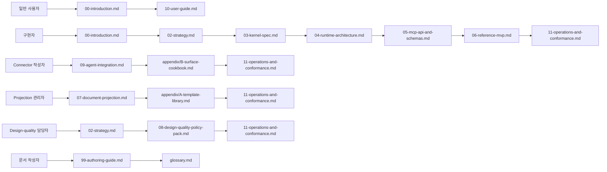
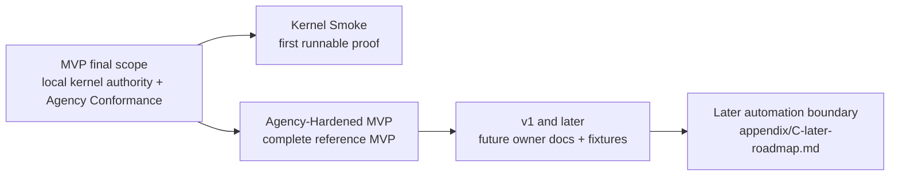
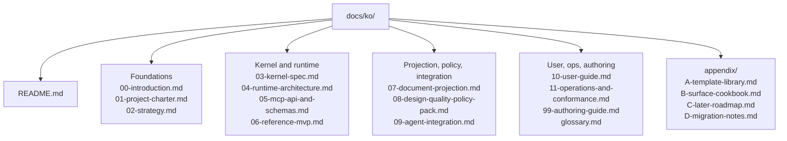
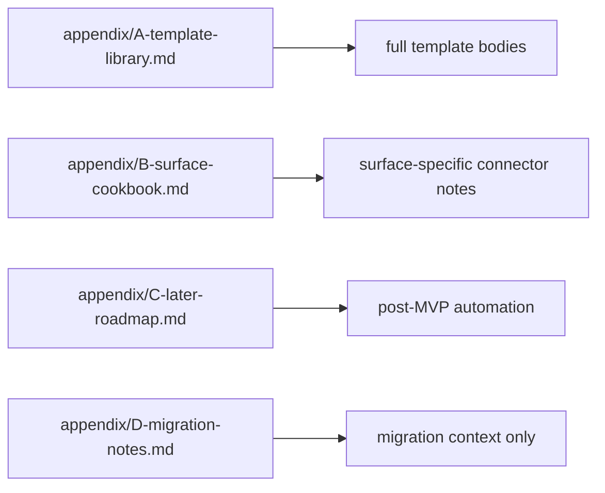

# Harness 문서 세트

Harness는 AI 지원 개발을 위한, 사용자의 전략적 판단권을 보존하는 로컬 운영 커널입니다. 작업 여정을 따라갈 수 있게 유지하면서 목표, 범위, 설계, 트레이드오프, Codebase Stewardship, QA, acceptance, Residual Risk에 대한 사용자의 판단권을 보존합니다.

이 파일은 한국어 Harness 문서 세트의 진입점인 `docs/ko/README.md`입니다. 저장소 루트의 `README.md`는 저장소 전체 랜딩 페이지입니다.

## Principle Groups

Strategic Invariants, Kernel Authority Invariants, Design Stewardship Defaults는 [02-strategy.md](02-strategy.md#principle-groups)가 담당합니다. Kernel Authority Invariants와 Design Stewardship Defaults는 서로 다른 원칙 그룹입니다.

## 독자 경로

이 diagram은 일반적인 진입 경로를 한눈에 보여줍니다. 아래 목록은 정확한 읽기 순서를 유지합니다.



일반 사용자:

```text
00-introduction.md
-> 10-user-guide.md
```

구현자:

```text
00-introduction.md
-> 02-strategy.md
-> 03-kernel-spec.md
-> 04-runtime-architecture.md
-> 05-mcp-api-and-schemas.md
-> 06-reference-mvp.md
-> 11-operations-and-conformance.md
```

Connector 작성자:

```text
09-agent-integration.md
-> appendix/B-surface-cookbook.md
-> 11-operations-and-conformance.md
```

Projection 관리자:

```text
07-document-projection.md
-> appendix/A-template-library.md
-> 11-operations-and-conformance.md
```

Design-quality 담당자:

```text
02-strategy.md
-> 08-design-quality-policy-pack.md
-> 11-operations-and-conformance.md
```

문서 작성자:

```text
99-authoring-guide.md
-> glossary.md
```

## MVP / v1 / Later

MVP는 여러 agent surface를 동시에 지원하는 플랫폼이 아닙니다. Kernel Authority Invariants와 Agency Conformance를 검증하는 작은 로컬 운영 커널입니다.

이 boundary map은 설명용입니다. Staged delivery contract는 [06-reference-mvp.md](06-reference-mvp.md#단계적-delivery-해석)가 담당하고, later automation은 [appendix/C-later-roadmap.md](appendix/C-later-roadmap.md)가 담당합니다.



MVP는 하나의 reference surface, 로컬 상태, artifact, public MCP tools, write gating, evidence, verification, Manual QA, acceptance, projections, reconcile, recovery, export, fixture 기반 conformance에 집중합니다.

MVP delivery는 final scope를 줄이지 않고 기존 MVP-0부터 MVP-5까지의 sequence에 mapping되는 두 단계로 읽습니다. Kernel Smoke와 Agency-Hardened MVP의 짧은 contract는 [06-reference-mvp.md](06-reference-mvp.md#단계적-delivery-해석)에 있습니다.

이후 자동화는 [appendix/C-later-roadmap.md](appendix/C-later-roadmap.md)에 정리합니다. 그 항목들이 MVP 범위의 일부처럼 읽히면 안 됩니다.

## 대상 트리

영어 문서 세트는 `docs/en/` 아래에 있고, 한국어 문서 세트는 같은 구조를 `docs/ko/` 아래에서 따릅니다.



```text
docs/ko/
  README.md
  00-introduction.md
  01-project-charter.md
  02-strategy.md
  03-kernel-spec.md
  04-runtime-architecture.md
  05-mcp-api-and-schemas.md
  06-reference-mvp.md
  07-document-projection.md
  08-design-quality-policy-pack.md
  09-agent-integration.md
  10-user-guide.md
  11-operations-and-conformance.md
  99-authoring-guide.md
  glossary.md

  appendix/
    A-template-library.md
    B-surface-cookbook.md
    C-later-roadmap.md
    D-migration-notes.md
```

## 주요 문서

표는 정확한 owner list입니다. 이 map은 같은 문서들을 담당 성격별로 묶어 보여줍니다.

```mermaid
flowchart TD
  D00["00-introduction.md"] --> Mental["shared mental model"]
  D01["01-project-charter.md"] --> Charter["purpose, audience, values, scope"]
  D02["02-strategy.md"] --> Strategic["strategy, failure model, principle groups"]
  D03["03-kernel-spec.md"] --> KernelOwner["kernel entities, lifecycle, gates"]
  D04["04-runtime-architecture.md"] --> RuntimeOwner["three spaces and runtime architecture"]
  D05["05-mcp-api-and-schemas.md"] --> ApiOwner["MCP API, schemas, errors"]
  D06["06-reference-mvp.md"] --> MvpOwner["MVP plan, DDL, storage layout"]
  D07["07-document-projection.md"] --> ProjectionOwner["projection and managed areas"]
  D08["08-design-quality-policy-pack.md"] --> PolicyOwner["design-quality policy contracts"]
  D09["09-agent-integration.md"] --> IntegrationOwner["agent surface integration"]
  D10["10-user-guide.md"] --> UserOwner["user phrases, status, judgments"]
  D11["11-operations-and-conformance.md"] --> OpsOwner["operations and conformance"]
  D99["99-authoring-guide.md"] --> AuthorOwner["authoring rules"]
  DG["glossary.md"] --> GlossaryOwner["official terms"]
```



| 문서 | 담당 역할 |
|---|---|
| [00-introduction.md](00-introduction.md) | 사용자와 구현자가 공유하는 정신 모델 |
| [01-project-charter.md](01-project-charter.md) | 프로젝트 목적, 독자, 가치, 범위, 비목표 |
| [02-strategy.md](02-strategy.md) | 전략적 논지, failure model, 원칙 그룹, Design Stewardship Defaults |
| [03-kernel-spec.md](03-kernel-spec.md) | 운영 커널, entities, lifecycle, gates, transitions, close semantics |
| [04-runtime-architecture.md](04-runtime-architecture.md) | 세 공간, runtime home, Core, artifact, projection/reconcile architecture |
| [05-mcp-api-and-schemas.md](05-mcp-api-and-schemas.md) | MCP resources/tools, schemas, errors, validators, artifact refs |
| [06-reference-mvp.md](06-reference-mvp.md) | MVP implementation sequence, DDL, storage layout, validator skeleton |
| [07-document-projection.md](07-document-projection.md) | Markdown projection, managed/human-editable areas, template tiers |
| [08-design-quality-policy-pack.md](08-design-quality-policy-pack.md) | policy contract로 정리한 design-quality policies |
| [09-agent-integration.md](09-agent-integration.md) | agent surface integration과 capability profile |
| [10-user-guide.md](10-user-guide.md) | user conversation phrases, status reading, judgments, resume |
| [11-operations-and-conformance.md](11-operations-and-conformance.md) | operator procedures, fixture 기반 conformance, docs-maintenance smoke reporting |
| [99-authoring-guide.md](99-authoring-guide.md) | 문서 담당 경계, authoring rules, docs-maintenance conformance checklist |
| [glossary.md](glossary.md) | 공식 용어 |

## 부록

부록은 확장 자료를 담지만, 주요 owner contract를 대신하지 않습니다.



| 문서 | 담당 역할 |
|---|---|
| [appendix/A-template-library.md](appendix/A-template-library.md) | 전체 template library와 확장 report variants |
| [appendix/B-surface-cookbook.md](appendix/B-surface-cookbook.md) | surface-specific connector notes와 profile examples |
| [appendix/C-later-roadmap.md](appendix/C-later-roadmap.md) | 이후 자동화와 post-MVP roadmap |
| [appendix/D-migration-notes.md](appendix/D-migration-notes.md) | migration context 전용 문서이며 활성 canonical owner가 아님 |
