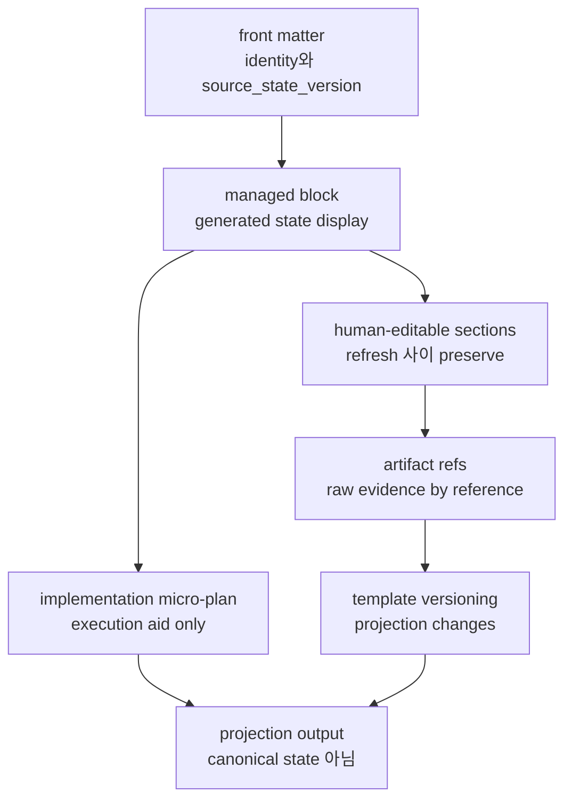
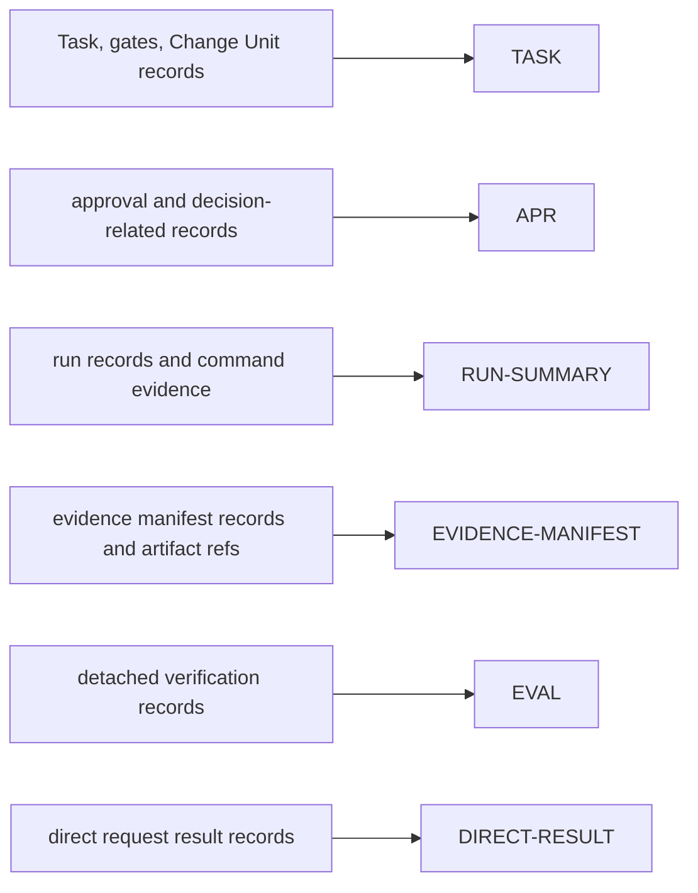
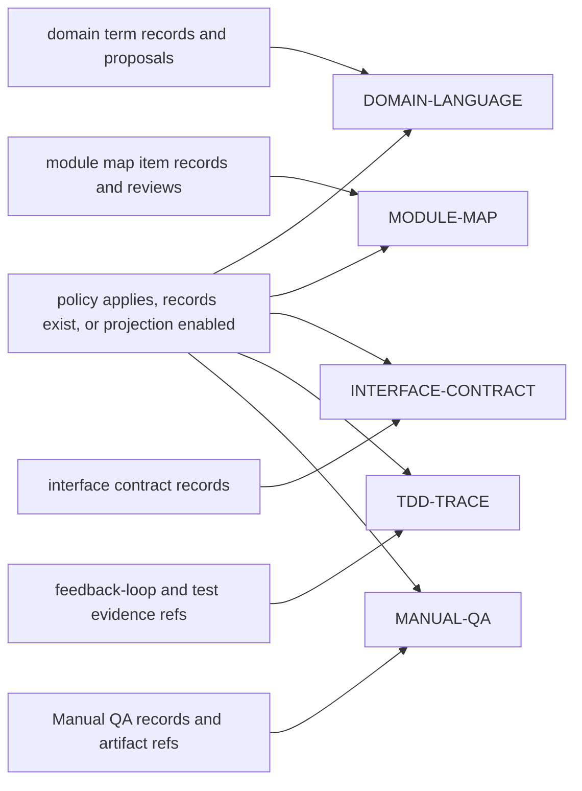
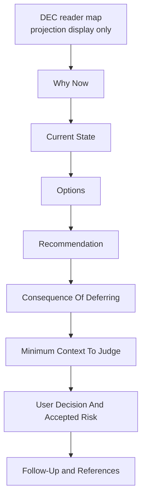
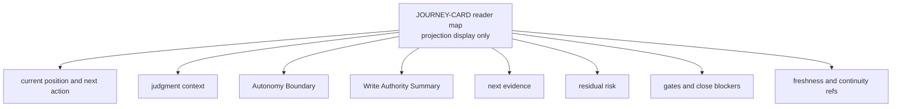

# Appendix A: Template Library

## 문서 역할

이 appendix는 전체 Markdown projection template variant를 담당한다. Projection rule과 template tier는 `07-document-projection.md`가 담당하며, 이 appendix는 그 rule을 구현하는 complete body를 제공한다. Template body가 여기에 있다고 해서 그 `ProjectionKind`가 enable되거나 required가 되지는 않는다.

Template은 rendered shape의 예시다. Canonical state가 아니며 kernel field, MCP schema, SQLite DDL을 재정의하면 안 된다.

## Template Rules

1. Front matter는 identity, task/project relation, projection version 또는 status, `source_state_version`, timestamp로 최소화한다.
2. Generated state는 managed block 안에 둔다.
3. Refresh 사이에도 human-editable section을 preserve한다.
4. Raw evidence는 artifact ref로 link한다.
5. Large log, diff, trace, bundle, screenshot, secret을 paste하지 않는다.
6. Approval, verification, Manual QA, acceptance를 visible하게 분리한다.
7. Card가 `Manual QA: pending/passed/failed/waived`라고 말하더라도 `qa_gate`를 canonical로 취급한다.
8. Template change는 projection change로 versioning한다.
9. Decision Packet, Journey Card, Journey Spine, Autonomy Boundary, Write Authority Summary, Implementation Micro-Plan, Review Stages, 표시된 Write Authorization ref, Change Unit DAG, Residual Risk text, Stewardship Impact text, `source_state_version`은 canonical state나 canonical Write Authorization record 자체가 아니라 projection output으로 취급한다.



## Required MVP Templates

이 bodies는 MVP-required `ProjectionKind` tier에 해당한다: `TASK`, `APR`, `RUN-SUMMARY`, `EVIDENCE-MANIFEST`, `EVAL`, `DIRECT-RESULT`.



### TASK

```mermaid
flowchart TD
  TASK["TASK projection"] --> Current["Current Summary"]
  TASK --> Where["Where We Are"]
  TASK --> Judgment["Judgment Context"]
  TASK --> Autonomy["Autonomy Boundary"]
  TASK --> Write["Write Authority Summary"]
  TASK --> MicroPlan["Implementation Micro-Plan"]
  TASK --> Review["Review Stages"]
  TASK --> Evidence["Next Evidence"]
  TASK --> Risk["Residual Risk"]
  TASK --> Stewardship["Stewardship Impact"]
  TASK --> Scope["Goal, Scope, Acceptance Criteria"]
  TASK --> CU["Active Change Unit"]
  TASK --> Reports["Evidence And Reports"]
  TASK --> Notes["User Notes and Proposals"]
```



````md
---
doc_type: task
task_id: TASK-0001
display_state: executing
projection_version: 7
source_state_version: 42
updated_at: 2026-05-06T09:30:15+09:00
---

# TASK-0001 Task Title

<!-- HARNESS:BEGIN managed -->
## Current Summary
- mode:
- lifecycle phase:
- result:
- close reason:
- assurance:
- next action:
- pending decision:
- risk:
- scope gate:
- decision gate:
- approval gate:
- design gate:
- evidence gate:
- verification gate:
- Manual QA:
- acceptance gate:
- active change unit:
- write authority summary:
- latest report:
- projection freshness:

## Where We Are
- current position:
- active path:
- current blocker:
- latest meaningful evidence:
- next state transition:

## Judgment Context
- pending decision packets:
- what user is deciding:
- what agent may decide without user:
- recommendation:
- main trade-off:
- reversibility:
- uncertainty:
- minimum context to judge:
- affected gates:

## Autonomy Boundary
- profile:
- agent may do:
- user judgment required:
- AFK stop conditions:
- boundary status:

## Write Authority Summary
- active Change Unit:
- write authorization:
- allowed paths:
- allowed tools:
- allowed commands:
- allowed network targets:
- secret scope:
- sensitive categories:
- approval status:
- baseline:
- guarantee:
- note: Autonomy Boundary is judgment latitude, not write authority.

## Implementation Micro-Plan
- note: execution aid only; active Change Unit scope bounds writes and `prepare_write` creates Write Authorization.
- TDD note: required이면 selected feedback loop, RED target, GREEN target, non-test implementation이 actual RED evidence 또는 waiver를 기다리는지 표시한다.

| Step / Slice | Purpose | Active Change Unit Scope / Likely Paths | Feedback Loop / TDD | Expected Evidence | Stop / Ask User When |
|---|---|---|---|---|---|
| 1 | | | | | |

## Review Stages
- note: managed display only; same-session review는 detached verification이 아니다.

### Spec Compliance Review
- acceptance criteria coverage:
- Change Unit completion conditions:
- scope / Write Authority compatibility:
- Decision Packet compatibility:
- evidence coverage:
- residual-risk visibility:
- routed outcome:

### Code Quality / Stewardship Review
- domain language:
- module / interface boundary:
- vertical slice shape:
- feedback loop / TDD:
- codebase stewardship:
- context hygiene:
- follow-up risk:
- routed outcome:

## Next Evidence
- next evidence action:
- evidence needed for:
- TDD RED target / plan:
- TDD RED evidence:
- TDD GREEN evidence:
- TDD refactor/check evidence:
- expected artifact refs:
- stale or missing evidence:

## Residual Risk
- close-relevant risk:
- visibility status:
- accepted residual-risk refs:
- follow-up required:
- close impact:

## Stewardship Impact
- summary shape: StewardshipImpactSummary
- domain_language_impact: none | updated | conflict | unresolved
- module_boundary_impact: none | local | public_boundary | unresolved
- interface_contract_impact: none | compatible | breaking | unresolved
- feedback_loop_status: defined | missing | waived
- future_change_risk: none | visible | accepted | unresolved
- close_impact: none | blocks_close | requires_decision | residual_risk
- refs:
  - domain term refs:
  - module map item refs:
  - interface contract refs:
  - feedback loop refs:
  - TDD trace refs when selected:
  - residual risk:
  - Decision Packets:

## Goal
-

## Scope
### In
-

### Out
-

## Acceptance Criteria
- [ ] AC-01:
- [ ] AC-02:

## Active Change Unit
| ID | Purpose | Status | Slice Type | TDD | Manual QA | Core Verification |
|---|---|---|---|---|---|---|
| CU-01 | | | vertical | required: red_pending \| red_recorded \| green_recorded \| waived | pending | |

## Pending Decisions
-

## Evidence And Reports
- Evidence Manifest:
- Run Summary:
- Eval:
- Direct Result:
- TDD Trace:
- Manual QA:
- Approval:
- Decision:
- Diff:
- Logs:
<!-- HARNESS:END managed -->

## User Notes and Proposals
-
````

#### 확장 TASK Section

Long-running `work` task에는 이 section을 사용한다. 명시적으로 human-editable로 표시하지 않는 한 managed로 유지한다.

````md
<!-- HARNESS:BEGIN managed -->
## Shared Design Concept
### Questions Resolved
| ID | Question | User Answer | Decision / Assumption |
|---|---|---|---|

### Remaining Ambiguity
- item / owner / stop condition:

## Domain Term Refs
- Terms in force:
  - Term:

## Module and Interface Refs
- module map item refs:
- interface contract refs:
- rendered projection refs, if shown: MODULE-MAP, INTERFACE-CONTRACT
- DESIGN:

## Change Unit Dependencies
| ID | blocked_by | unblocks | parallelizable_with | merge risk |
|---|---|---|---|---|

## Implementation Micro-Plan Details
- source alignment: current Task, active Change Unit, gates, related refs
- boundary: not canonical state, not scope authority, not approval, not Write Authorization; active Change Unit remains the scope source

### Step Queue
| Step | State Alignment | Scope Alignment / Likely Paths | Feedback Loop / TDD Status | Evidence Target | Stop Condition |
|---|---|---|---|---|---|

## Journey Spine
### Facts in Force
- fact / evidence ref:

### Assumptions in Force
- assumption / expiry condition:

### Decisions in Force
- DEC-0001:

### Domain Terms in Force
- term / meaning / code representation:

### Module / Interface Impacts
- module / impact / interface / test boundary:

### Rejected Options
- option / reason / DEC:

### Watchpoints
- regression:
- security/performance/operations:
- architecture drift:

### Resume Notes
- next session should know:
- current blocker:
<!-- HARNESS:END managed -->
````

#### Change Unit Block

이는 별도의 canonical projection tier가 아니라 TASK sub-template이다.

````md
### CU-01 Title
- purpose:
- non-goals:
- slice type: vertical | enabling | cleanup | horizontal-exception
- horizontal exception reason:
- follow-up vertical CU:
- autonomy profile:
- agent may do:
  - implementation detail:
  - local refactor inside scope:
  - evidence collection:
- user judgment required:
  - product direction:
  - public interface or compatibility commitment:
  - residual risk acceptance:
- AFK stop conditions:
  - boundary exceeded:
  - evidence cannot be produced:
  - close-relevant risk discovered:
- end-to-end path:
  - trigger / input:
  - domain logic:
  - persistence:
  - API / caller boundary:
  - UI / observable output:
- allowed paths:
  - `src/...`
  - `tests/...`
- allowed tools:
  - read
  - edit
  - shell: `npm test -- ...`
- check profile:
  - changed_paths
  - approval_scope
  - evidence_sufficiency
- ValidatorResult IDs:
  - vertical_slice_shape
  - shared_design_alignment
  - decision_quality_check
  - autonomy_boundary_check
  - feedback_loop_check
  - tdd_trace_required
  - domain_language_consistency
  - module_interface_review
  - codebase_stewardship_check
  - residual_risk_visibility_check
  - manual_qa_required
- sensitive categories:
  - none
- TDD:
  - required: yes | no | recommended
  - RED target / plan:
  - RED evidence (actual):
  - green evidence:
  - non-TDD justification:
- Manual QA:
  - required: yes | no
  - profile: ui_quality | workflow | copy | accessibility | browser_smoke | none
- dependencies:
  - blocked_by:
  - unblocks:
  - parallelizable_with:
  - merge risk:
- completion conditions:
  - [ ]
- evaluator focus:
  - item:
````

### APR

````md
---
doc_type: approval
approval_id: APR-0001
task_id: TASK-0001
category: dependency_change
status: pending
source_state_version: 42
updated_at: 2026-05-06T09:30:15+09:00
---

# APR-0001 Approval Request

## Request Summary
- proposed action:

## Related Decision Packet
- approval-shaped Decision Packet:
- separate product-judgment Decision Packet, if required:
- decision gate impact:
- approval gate impact:

## Requested Scope
- sensitive categories:
- allowed paths:
- allowed tools:
- allowed commands:
- allowed network targets:
- required secrets:
- baseline ref:
- expected diff envelope:
- expires on scope drift:

## Why This Is Needed
- purpose:
- relation to current task:

## Impact
- code/docs:
- user/operations:
- security/privacy:
- cost/deployment:
- domain language:
- module/interface:

## Risks
- main risk:
- failure impact:
- scope drift condition:

## Alternatives
### Alternative A
- description:
- benefit:
- cost/risk:

### Alternative B
- description:
- benefit:
- cost/risk:

## Recommendation
- recommendation:
- reason:

## Decision
- status: pending | granted | denied | expired
- decision note:
- decided by:
- decided at:

## Boundary
- approval은 product judgment를 resolve하지 않고, correctness를 prove하지 않고, verification이나 Manual QA를 replace하지 않고, acceptance를 imply하지 않으며, residual risk를 accept하지 않는다.
- approval은 Write Authorization이 아니다. 이후 compatible `prepare_write` retry가 write를 allow해야 implementation 또는 direct `record_run`이 authorization을 consume할 수 있다.
````

### RUN-SUMMARY

````md
---
doc_type: run_summary
run_id: RUN-20260506-093015-LEAD-01
task_id: TASK-0001
change_unit_id: CU-01
profile: lead
kind: implementation
surface_id: reference
source_state_version: 43
updated_at: 2026-05-06T09:45:10+09:00
---

# RUN-SUMMARY

## Run Identity
- run_id:
- actor kind:
- surface:
- baseline_ref:
- state_version:
- status:

## Scope
- task_id:
- change_unit_id:
- slice type:
- write authorization:
- allowed paths:
- allowed tools:
- allowed commands:
- allowed network targets:
- secret scope:
- sensitive categories:
- approval refs:

## Changed Files
- `path/to/file`

## Commands And Checks
```bash
npm test -- --runInBand
```

## Checks And Validator Outcomes
### Core Checks And Command Checks
- changed_paths:
- approval_scope:
- lint:
- test:
- build:
- evidence_sufficiency:

### ValidatorResult IDs
- vertical_slice_shape:
- shared_design_alignment:
- decision_quality_check:
- autonomy_boundary_check:
- feedback_loop_check:
- tdd_trace_required:
- domain_language_consistency:
- module_interface_review:
- codebase_stewardship_check:
- residual_risk_visibility_check:
- manual_qa_required:

## Review Stages
- note: run-local review display only; same-session review는 `detached_verified` assurance를 만들 수 없다.

### Spec Compliance Review
- acceptance criteria coverage:
- Change Unit completion conditions:
- scope / Write Authority compatibility:
- Decision Packet compatibility:
- evidence coverage:
- residual-risk visibility:
- outcome refs:

### Code Quality / Stewardship Review
- domain language:
- module / interface boundary:
- vertical slice shape:
- feedback loop / TDD:
- codebase stewardship:
- context hygiene:
- follow-up risk:
- outcome refs:

## TDD Trace Summary
- required:
- feedback loop ref:
- RED target / plan:
- RED evidence (actual):
- green evidence:
- refactor notes:
- waiver / alternate loop:
- trace ref:

## Key Changes
-

## Issues And Follow-Ups
-

## Journey Spine Updates
- new facts:
- rejected options:
- domain language update:
- module/interface update:
- watchpoint changes:
- next run should know:

## Evidence Refs
- evidence manifest:
- TDD trace:
- Manual QA:
- diff:
- logs:
- bundle:
- checkpoint:
````

### EVIDENCE-MANIFEST

````md
---
doc_type: evidence_manifest
evidence_manifest_id: EM-0001
task_id: TASK-0001
change_unit_id: CU-01
status: partial
source_state_version: 44
updated_at: 2026-05-06T09:50:00+09:00
---

# EM-0001 Evidence Manifest

## Identity
- task_id:
- change_unit_id:
- baseline_ref:
- run_summary:
- latest_eval:

## Summary
- evidence state:
- unsupported criteria:
- stale conditions:
- next evidence action:

## Acceptance Criteria Coverage
| AC ID | Statement | Status | Supporting Evidence | Notes |
|---|---|---|---|---|
| AC-01 | | supported | test:, tdd:, log:, diff: | |
| AC-02 | | unsupported | | |

## Changed File Coverage
| Path | Covered Criteria | Evidence Refs |
|---|---|---|
| `src/...` | AC-01 | DIFF-0001, LOG-0001 |

## Design Quality Coverage
| Item | Status | Evidence Refs | Notes |
|---|---|---|---|
| vertical_slice_shape | passed | CU-01 | |
| decision_quality_check | passed | DEC-0001 | |
| autonomy_boundary_check | passed | CU-01 | |
| feedback_loop_check | passed | FBL-0001, TDD-0001, LOG-0001 | |
| tdd_trace_required | passed | TDD-0001, RED-LOG-0001, GREEN-LOG-0001 | RED, GREEN, relevant refactor/check coverage가 acceptance criteria 및 changed files로 link된다. |
| module_interface_review | passed | module_map_item: MMI-0001, interface_contract: IFACE-0001, DEC-0001 | |
| codebase_stewardship_check | passed | domain_term: TERM-0001, module_map_item: MMI-0001, interface_contract: IFACE-0001, feedback_loop: FBL-0001 | |
| residual_risk_visibility_check | pending | RR-0001 | |
| manual_qa_required | pending | qa_gate; no satisfying Manual QA record yet | |

## Approval Refs
- APR-0001:

## Evidence Refs
- run summary:
- feedback loop:
- TDD trace:
- TDD RED target / plan:
- TDD red:
- TDD green:
- TDD refactor/check:
- Manual QA:
- diff:
- logs:
- bundle:
- checkpoint:
- tests:
- build:

## Stale If
- baseline head changes
- changed files are modified after eval
- approval scope expires
- relevant config changes
- domain term records change
- interface contract records change
````

### EVAL

````md
---
doc_type: eval
eval_id: EVAL-0001
task_id: TASK-0001
change_unit_id: CU-01
verdict: passed
surface_id: reference
source_state_version: 45
updated_at: 2026-05-06T10:05:00+09:00
---

# EVAL-0001 Verification Result

## Target
- task_id:
- change_unit_id: CU-01 | null
- target_run_id:
- evaluator_run_id:

## Verdict
- verdict: passed | failed | blocked | inconclusive
- assurance impact:
- verification gate impact:
- Manual QA impact:
- acceptance impact:
- next action:

## Environment And Independence
- fresh run:
- evaluator surface:
- context independence: same_session | subagent_context | fresh_session | fresh_worktree | sandbox | manual_bundle
- write capable:
- product file write allowed:
- baseline verified:
- repo drift observed:
- source input: chat_history | task_summary | bundle | raw_artifacts
- source bundle:
- parent run:

## Checks And Validator Outcomes
### Core Checks And Preconditions
- [ ] changed_paths
- [ ] approval_scope
- [ ] same_session_verify_guard
- [ ] evidence_sufficiency
- [ ] bundle_integrity
- [ ] acceptance_review
- [ ] baseline_freshness
- [ ] public_interface_change_review
- [ ] lint
- [ ] test
- [ ] build

### ValidatorResult IDs
- [ ] vertical_slice_shape
- [ ] shared_design_alignment
- [ ] decision_quality_check
- [ ] autonomy_boundary_check
- [ ] feedback_loop_check
- [ ] tdd_trace_required
- [ ] domain_language_consistency
- [ ] module_interface_review
- [ ] codebase_stewardship_check
- [ ] residual_risk_visibility_check
- [ ] manual_qa_required
- [ ] surface_capability_check

## Evidence Reviewed
- task summary:
- Journey Spine:
- Decision Packets:
- Residual Risks:
- Autonomy Boundary:
- domain term refs:
- module map item refs:
- interface contract refs:
- run summary:
- feedback loop:
- TDD trace:
- Manual QA:
- evidence manifest:
- diff:
- bundle:
- logs:
- approvals:
- decisions:

## Acceptance Criteria Review
| AC ID | Statement | Evidence Reviewed | Result | Notes |
|---|---|---|---|---|

## Design Quality Review
- vertical slice:
- Decision Packets:
- Autonomy Boundary:
- Residual Risks:
- feedback loop:
- TDD trace:
- module/interface:
- architecture drift:
- domain language consistency:

## Rationale
-

## Blockers Or Rework
-

## User Follow-Up
- trade-off needing confirmation:
- remaining options:
- Manual QA need:
````

### DIRECT-RESULT

````md
---
doc_type: direct_result
task_id: TASK-0001
run_id: RUN-20260506-093015-LEAD-01
result: passed
assurance_level: self_checked
surface_id: reference
source_state_version: 41
updated_at: 2026-05-06T09:40:00+09:00
---

# DIRECT-RESULT

## Request
- user request:

## Scope
- direct run scope:
- limits:
- write authorization:
- allowed paths:
- allowed tools:
- allowed commands:
- approval refs:

## Changed Files
- `path/to/file`

## Checks And Validator Outcomes
### Core Checks And Command Checks
- changed_paths:
- approval_scope:
- test:
- build:

### ValidatorResult IDs
- context_hygiene_check:
- surface_capability_check:

## Outcome
- result summary:

## Assurance
- assurance_level:
- meaning:
- detached verify needed:

## Escalation
- escalated_to_work: yes | no
- reason:

## Evidence Refs
- logs:
- diff:
- follow-up report:
````

## Optional Design-Quality Templates

이 bodies는 MVP-optional `ProjectionKind` tier에 해당한다: `DOMAIN-LANGUAGE`, `MODULE-MAP`, `INTERFACE-CONTRACT`, `TDD-TRACE`, `MANUAL-QA`. Policy가 적용되거나, records가 있거나, user/operator가 projection을 enable할 때만 render한다.



### DOMAIN-LANGUAGE

````md
---
doc_type: domain_language
project_id: PRJ-0001
status: active
projection_version: 1
source_state_version: 12
updated_at: 2026-05-06T09:30:15+09:00
---

# Domain Language

<!-- HARNESS:BEGIN managed -->
## Summary
- current status:
- latest reconciled task:
- stale conditions:

## Terms
| Term | Meaning | Code Representation | Not This | Related Terms | Source | Status |
|---|---|---|---|---|---|---|
| Account | login-capable user identity | `src/auth/account.ts` | Profile | User, Session | TASK-0001 | active |

## Pending Term Decisions
| Term | Question | Options | Recommendation | Owner |
|---|---|---|---|---|

## Deprecated Terms
| Term | Replaced By | Reason | Since |
|---|---|---|---|
<!-- HARNESS:END managed -->

## User Notes and Proposals
-
````

### MODULE-MAP

````md
---
doc_type: module_map
project_id: PRJ-0001
status: active
projection_version: 1
source_state_version: 12
updated_at: 2026-05-06T09:30:15+09:00
---

# Module Map

<!-- HARNESS:BEGIN managed -->
## Summary
- architecture state:
- latest review:
- stale conditions:

## Modules
| Module | Role | Public Interface | Internal Complexity | Dependencies | Test Boundary | Owner Decision | Watchpoints |
|---|---|---|---|---|---|---|---|
| AuthService | verifies auth and issues sessions | `login`, `logout` | credential validation, session issue | UserRepo, SessionStore | service interface tests | human_reviewed | session expiry drift |

## Deep Module Candidates
| Candidate | Current Pain | Proposed Boundary | Expected Test Boundary | Priority |
|---|---|---|---|---|

## Module Watchpoint Rollup
- source: `module_map_items.watchpoints_json`
- canonical owner: Module Map Item; dedicated architecture watchpoint refs는 later DDL batch가 정의한 경우에만 사용한다
- shallow module growth:
- dependency direction risk:
- public interface drift:
<!-- HARNESS:END managed -->

## User Notes and Proposals
-
````

### INTERFACE-CONTRACT

````md
---
doc_type: interface_contract
interface_contract_id: IFACE-0001
task_id: TASK-0001
status: proposed
projection_version: 1
source_state_version: 42
updated_at: 2026-05-06T09:30:15+09:00
---

# IFACE-0001 Interface Title

<!-- HARNESS:BEGIN managed -->
## Identity
- module:
- interface:
- change type: new | changed | deprecated | removed

## Contract
- inputs:
- outputs:
- errors:
- side effects:
- compatibility impact: none | minor | breaking

## Callers Impacted
- caller:

## Test Boundary
- boundary tests:
- integration tests:
- contract tests:

## Review
- status:
- reviewed by:
- decision:
- waiver reason:

## References
- TASK:
- DESIGN:
- DEC:
- EVIDENCE-MANIFEST:
<!-- HARNESS:END managed -->

## User Notes and Proposals
-
````

### TDD-TRACE

````md
---
doc_type: tdd_trace
tdd_trace_id: TDD-0001
task_id: TASK-0001
change_unit_id: CU-01
status: recorded
source_state_version: 43
updated_at: 2026-05-06T09:40:00+09:00
---

# TDD-0001 Trace Title

## Identity
- task_id:
- change_unit_id:
- required: yes | no | recommended
- feedback loop ref:
- evidence manifest coverage ref:

## Red
- target / plan:
- failing test ref:
- command:
- result: failed_as_expected | failed_unexpectedly | missing
- log ref:
- recorded before non-test implementation: yes | no | waived
- target / plan counts as Evidence Manifest coverage: no

## Green
- command:
- result: passed | failed | missing
- log ref:

## Refactor
- performed: yes | no
- notes:
- verification command:
- log ref:

## Non-TDD Justification
- reason:
- feedback loop ref:
- alternate feedback loop:
- waiver recorded before non-test implementation: yes | no

## Evidence Refs
- test:
- red log:
- green log:
- refactor/check log:
- Evidence Manifest:
- diff:
````

### MANUAL-QA

````md
---
doc_type: manual_qa
manual_qa_record_id: null
task_id: TASK-0001
change_unit_id: CU-01
qa_gate: pending
result: null
source_state_version: 45
updated_at: 2026-05-06T10:05:00+09:00
---

# Manual QA

## Identity
- manual_qa_record_id: QA-0001 | null
- task_id:
- change_unit_id: CU-01 | null
- qa_profile: ui_quality | workflow | copy | accessibility | browser_smoke | performance_smoke | other
- required: yes | no
- performed by:

## Setup
- build/run command:
- test account/data:
- route or screen:

## Checklist
- [ ] primary workflow works
- [ ] errors are understandable
- [ ] visual layout acceptable
- [ ] accessibility smoke check
- [ ] no obvious regression

## Result
- record result: passed | failed | waived | null when no record exists
- qa_gate: pending | passed | failed | waived | not_required
- qa_gate note: canonical close-relevant gate; this projection is display only
- summary:
- waiver reason:

## Waiver And Risk
- waiver Decision Packet:
- residual risk refs:
- accepted residual-risk summary:

## Findings
| Severity | Finding | Suggested Action | Follow-up CU |
|---|---|---|---|
| minor | | | |

## Evidence Refs
- screenshot:
- browser log:
- video:
- note:
````

## Appendix Templates

Appendix templates는 extension / appendix `ProjectionKind` tier에 해당하며 명시적으로 enabled되지 않는 한 optional입니다. `DEC` template은 optional standalone Decision Packet Markdown variant이며, Appendix A에 존재한다고 해서 standalone `DEC`가 MVP-required projection이 되지는 않습니다. `DESIGN`, `EXPORT`, persisted `JOURNEY-CARD` Markdown도 optional extension / appendix projections입니다. `EXPORT` manifest는 projection output입니다. 그 `export_id`는 manifest identity이며 public `StateRecordRef.record_kind`가 아닙니다.

### DEC



````md
---
doc_type: decision_packet
projection_kind: DEC
projection_id: DEC-PROJ-0001
decision_packet_id: DEC-0001
task_id: TASK-0001
change_unit_id: CU-01
decision_kind: product_tradeoff
status: pending_user
source_state_version: 42
updated_at: 2026-05-06T09:30:15+09:00
---

# DEC-0001 Decision Packet Title

## Why Now
- trigger:
- blocker:
- affected operation:
- why this cannot proceed under current state:

## Current State
- task state:
- active change unit:
- current gates:
- latest evidence:
- residual risk:
- source refs:

## Approval-Shaped Context, If Applicable
- decision_kind=approval scope:
- linked approval record:
- sensitive categories:
- separate Decision Packet이 필요한 product judgment:
- approval boundary:
- write authorization boundary:

## What User Is Deciding
- decision:
- affected scope:
- affected acceptance criteria:
- affected gates:

## What Agent May Decide Without User
- implementation detail:
- code organization inside approved scope:
- evidence collection:
- follow-up proposal:

## Autonomy Boundary Impact, If Any
- current boundary impact:
- proposed boundary update:
- user judgment required:

## Options
### Option A
- choice:
- benefits:
- costs:
- risks:
- reversibility: reversible | partially_reversible | irreversible | unknown
- confidence: low | medium | high
- evidence refs:

### Option B
- choice:
- benefits:
- costs:
- risks:
- reversibility: reversible | partially_reversible | irreversible | unknown
- confidence: low | medium | high
- evidence refs:

## Recommendation
- recommendation:
- reason:
- uncertainty:

## Consequence Of Deferring
- consequence:
- operation impact:
- close impact:
- residual risk or follow-up visibility:

## Minimum Context To Judge
- relevant facts:
- assumptions:
- constraints:
- evidence refs:
- residual risk refs:
- related decisions:

## User Decision And Accepted Risk
- status: proposed | pending_user | resolved | deferred | rejected | blocked | superseded
- selected option:
- user decision:
- decision note:
- accepted residual-risk summary:
- accepted residual-risk refs:
- accepted consequence:
- decided by:
- decided at:

## Follow-Up
- [ ]

## References
- TASK:
- Change Unit:
- DESIGN:
- APR:
- EVIDENCE-MANIFEST:
- EVAL:
- MANUAL-QA:
- Residual Risk:
- artifacts:
````

### DESIGN

````md
---
doc_type: design
design_id: DESIGN-0001
task_id: TASK-0001
status: draft
source_state_version: 42
updated_at: 2026-05-06T09:30:15+09:00
---

# DESIGN-0001 Design Title

## Problem
- design problem:

## Goals
- goal:

## Non-Goals
- non-goal:

## Constraints
- technical:
- operational:
- compatibility:
- security/privacy:

## Shared Design Summary
- resolved questions:
- remaining assumptions:
- rejected options:

## Domain Language Impact
| Term | Impact | Action |
|---|---|---|

## Module And Interface Plan
| Module | Current Role | Proposed Change | Public Interface | Test Boundary | Risk |
|---|---|---|---|---|---|

## Proposed Shape
- components:
- boundaries and responsibilities:
- data flow:
- dependency direction:

## Alternatives
### Alternative A
- benefits:
- drawbacks:

### Alternative B
- benefits:
- drawbacks:

## Recommendation
- recommendation:
- remaining trade-off:

## Verification Considerations
- success criteria:
- regression watchpoint:
- selected feedback loop:
- required TDD trace:
- required Manual QA:
- required evidence:

## References
- TASK:
- DEC:
- APR:
- design-support owner refs:
  - domain term refs:
  - module map item refs:
  - interface contract refs:
- rendered projection refs, if shown:
  - DOMAIN-LANGUAGE:
  - MODULE-MAP:
  - INTERFACE-CONTRACT:
- EVIDENCE-MANIFEST:
````

### EXPORT Manifest

````md
---
doc_type: export_manifest
export_id: EXPORT-0001
project_id: PRJ-0001
status: complete
source_state_version: 50
updated_at: 2026-05-06T10:30:00+09:00
---

# EXPORT-0001 Harness Export

## Scope
- project_id:
- task_ids:
- included state version range:
- created by:
- created at:

## State Snapshots
- tasks:
- task gates:
- change units:
- runs:
- approvals:
- evidence manifests:
- Eval records:
- Manual QA records:
- reconcile items:

## Projection Snapshots
- TASK:
- APR:
- RUN-SUMMARY:
- EVIDENCE-MANIFEST:
- EVAL:
- DIRECT-RESULT:
- optional design projections:

## Artifact Refs
| Artifact ID | Kind | Owner Record | URI | SHA256 | Redaction State | Retention |
|---|---|---|---|---|---|---|

## Redaction Summary
- secrets omitted:
- redacted artifacts:
- blocked artifacts:

## Integrity
- export hash:
- manifest hash:
- generated at:
````

## Expanded Cards

### JOURNEY-CARD



````text
TASK-{id} {title}
현재 위치: {mode} / {lifecycle_phase} / {current_position}
다음 action: {next_action}

판단 context:
- pending decision: {decision_packet_ref|none}
- user deciding: {what_user_is_deciding|none}
- agent may decide: {what_agent_may_decide_without_user}

Autonomy Boundary:
- profile: {autonomy_profile}
- agent may do: {agent_may_do}
- user judgment required: {user_judgment_required}
- AFK stop conditions: {afk_stop_conditions}

Write Authority Summary:
- active Change Unit: {active_change_unit_ref|none}
- write authorization: {write_authorization_ref|none}
- allowed paths: {allowed_paths}
- allowed tools: {allowed_tools}
- allowed commands: {allowed_commands}
- allowed network targets: {allowed_network_targets}
- secret scope: {secret_scope}
- sensitive categories: {sensitive_categories}
- approval status: {approval_status}
- baseline: {baseline_ref|none}
- guarantee: {guarantee_display}
- note: Autonomy Boundary is judgment latitude, not write authority.

Next evidence:
- action: {next_evidence_action}
- needed for: {evidence_needed_for}
- latest evidence: {latest_evidence_ref|none}

Residual risk:
- status: {residual_risk_status}
- close impact: {residual_risk_close_impact}
- accepted residual-risk record refs: {accepted_residual_risk_record_refs|none}

Gates:
- scope: {scope_gate}
- decision: {decision_gate}
- approval: {approval_gate}
- evidence: {evidence_gate}
- verification: {verification_gate}
- Manual QA: {qa_gate display: pending|passed|failed|waived|not_required}
- acceptance: {acceptance_gate}

Projection freshness: {projection_freshness}
````

### Compact Status Card

````text
TASK-{id} {title}
상태: {mode} / {lifecycle_phase}
다음 action: {next_action}
사용자 decision: {pending_decision_summary|none}
Risk: {risk_summary}
Evidence gate: {evidence_gate}
Design gate: {design_gate}
Manual QA: {qa_gate display: pending|passed|failed|waived|not_required}
최신 report: {latest_report|none}
````

### Approval Card

````text
Approval이 필요합니다.

{approval_id} {category}
요청: {summary}
목적: {why_needed}
허용 path:
{allowed_paths}

허용 tool:
{allowed_tools}

Network:
{allowed_network}

필요한 secret:
{required_secrets}

Baseline:
{baseline_ref}

Risk:
{risks}

대안:
{alternatives}

Recommendation:
{recommendation}

이 scope를 승인하시겠습니까?
````

### Verification Result Card

````text
Verification이 완료되었습니다.

{eval_id}
Verdict: {verdict}
Assurance: {assurance_impact}
Verification independence: {verification_independence}
Manual QA: {manual_qa_impact}
Acceptance: {acceptance_impact}

검토한 evidence:
- task summary: {task_summary_ref}
- run summary: {run_summary_ref}
- evidence manifest: {evidence_manifest_ref}
- TDD trace: {tdd_trace_ref}
- diff: {diff_ref}
- logs: {logs_ref}
- approvals: {approval_refs}
- design refs: {design_refs}

남은 작업:
{blockers_or_rework}

User follow-up:
{user_followup}
````

### Manual QA Card

````text
Manual QA가 필요합니다.

Record: {manual_qa_record_id|none until recorded}
Gate: {qa_gate display: pending|passed|failed|waived|not_required}
Profile: {profile}
Target: {screen_or_flow}
Checklist:
- {checklist_item}

기록할 evidence:
- screenshot or walkthrough note
- browser log when relevant

QA result를 기록하시겠습니까?
````

## Template Change Notes

- `DOMAIN-LANGUAGE`, `MODULE-MAP`, `INTERFACE-CONTRACT`는 canonical document가 아니라 canonical record에서 만든 projection이다.
- `MANUAL-QA`는 record 또는 requirement projection이다.
- 아직 record가 없을 때는 `manual_qa_record_id: null`과 `result: null`을 사용한다.
- Pending requirement는 `qa_gate: pending`으로 표시한다. Pending을 Manual QA record result로 표현하지 않는다. Close-relevant gate는 `qa_gate`로 남는다.
- `ProjectionKind` tiers는 implementation support와 conformance expectations만 control한다. Markdown projection을 canonical state로 만들지는 않는다.
- `DEC`는 enabled일 때 사용하는 optional standalone Decision Packet visibility projection이다. MVP Decision Packet visibility는 여전히 `TASK` projections, status/next responses, judgment-context resources, decision-packet resources를 통해 제공된다. Core가 user decision 또는 reconcile action을 기록하기 전에는 decision을 resolve하지 않는다.
- `JOURNEY-CARD`는 compact current-position projection이다. Write를 authorize하거나, decision을 resolve하거나, risk를 accept하거나, evidence를 satisfy하거나, verification 또는 Manual QA를 replace하거나, work를 close하지 않는다.
- `DEC`, `JOURNEY-CARD`, Change Unit block, `TASK`의 Autonomy Boundary text는 judgment latitude만 설명한다. Write Authority Summary와 Write Authorization display는 별도로 남고, scope와 approval은 별도 owner record와 gate로 남는다.
- Write Authority Summary text는 current scope, approval, baseline, guarantee, Write Authorization ref에서 만든 display다. Work를 authorize하거나, evidence를 prove하거나, verification 또는 Manual QA를 replace하거나, acceptance를 imply하거나, residual risk를 accept하지 않는다.
- Residual-risk text는 residual-risk record와 그 record 위의 accepted-risk metadata/refs에서 만든 projection이다. Detached verification이나 acceptance를 만들지 않는다.
- `EVAL`은 independence context를 보여줘야 한다. Passed verdict만으로는 `detached_verified`가 생기지 않기 때문이다.
- `RUN-SUMMARY`, `EVIDENCE-MANIFEST`, `DIRECT-RESULT`는 large evidence를 embed하지 않고 artifact ref로 evidence file에 link한다.
