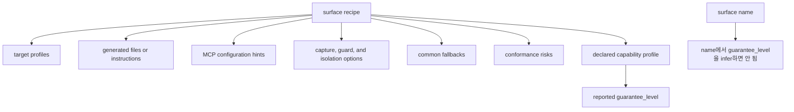
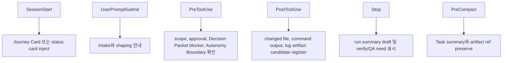
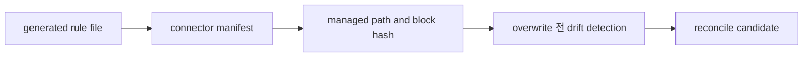
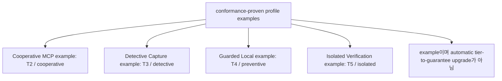
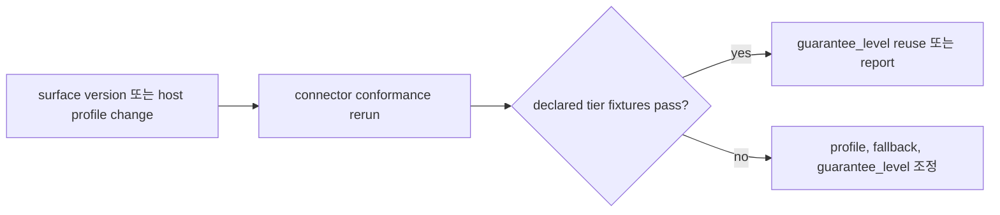

# Appendix B: Surface Cookbook

## 문서 역할

이 appendix는 surface-specific connector note, generated file detail, profile example을 담당한다. 공통 integration contract는 `09-agent-integration.md`가 담당한다.

Concrete surface에 따라 달라지는 local 차이만 이 cookbook에 둔다. Kernel state rule, MCP schema, generic policy contract를 여기서 반복하지 않는다.

## Cookbook Scope

각 surface recipe는 다음을 설명해야 한다.

- 해당 surface에서 plausible한 target profile
- generated file 또는 instruction
- MCP configuration hint
- capture, guard, isolation option
- common fallback
- conformance risk

Connector는 여전히 capability profile을 declare해야 한다. Surface name은 guarantee level을 imply하지 않는다.

Surface recipe는 user-facing guard 또는 freeze control을 언급할 수 있지만, connected profile의 actual capability 위에 얹힌 label로만 다뤄야 한다. "Freeze"는 visible hold 또는 narrowed boundary를 뜻해야 한다. "Guard"는 profile에 따라 cooperative instruction, detective validation, preventive blocking, isolation을 뜻해야 한다. "Careful mode"는 더 엄격한 `prepare_write`, scope, evidence, user-question posture이지 new authority tier가 아니다.

```mermaid
flowchart TB
  Codex["codex"] --> CodexProfiles["profiles: local_cli, ide_chat, custom_agent"]
  Codex --> CodexStrengths["strengths: repository rules, editing workflow, MCP-capable profiles"]
  Codex --> CodexFallbacks["fallbacks: cooperative prepare_write, sidecar watcher, changed_paths validator"]
  Codex --> CodexRisks["risks: guard proof, artifact capture, long rules"]

  Claude["claude_code"] --> ClaudeProfiles["profiles: local_cli, ide_chat, custom_agent"]
  Claude --> ClaudeStrengths["strengths: CLAUDE.md, hooks, evaluator candidates"]
  Claude --> ClaudeFallbacks["fallbacks: read-only evaluator, fresh worktree, stop-hook report"]
  Claude --> ClaudeRisks["risks: versioned hooks, read-only proof"]

  Gemini["gemini"] --> GeminiProfiles["profiles: local_cli, extension, ide_chat, custom_agent"]
  Gemini --> GeminiStrengths["strengths: extension/prompt package, MCP-capable profiles, sidecar workflows"]
  Gemini --> GeminiFallbacks["fallbacks: CLI wrapper, sidecar-controlled run, Manual QA note"]
  Gemini --> GeminiRisks["risks: large extension context, host-varying capture and guard"]

  Copilot["github_copilot"] --> CopilotProfiles["profiles: vscode_chat, vscode_agent, cloud_agent, custom_agent"]
  Copilot --> CopilotStrengths["strengths: custom instructions, VS Code task/terminal, MCP-capable profiles"]
  Copilot --> CopilotFallbacks["fallbacks: VS Code task wrapper, sidecar adapter, approval card"]
  Copilot --> CopilotRisks["risks: cloud/IDE differences, profile-specific guard proof"]

  Cursor["cursor"] --> CursorProfiles["profiles: ide_agent, local_cli, custom_agent"]
  Cursor --> CursorStrengths["strengths: project rules, MCP-capable profiles, sidecar support"]
  Cursor --> CursorFallbacks["fallbacks: sidecar changed-file detection, generated drift detection, manual bundle"]
  Cursor --> CursorRisks["risks: verbose rules, IDE permission differences"]
```





## Codex Notes

```yaml
surface_kind: codex
target_profiles:
  - local_cli
  - ide_chat
  - custom_agent
primary_strengths:
  - repository instruction files for short always-on rules
  - code editing workflow with frequent user-visible updates
  - MCP-capable profiles can call harness tools directly
common_fallbacks:
  - cooperative prepare_write discipline unless pre-tool guard is proven
  - sidecar changed-file watcher
  - changed_paths validator
  - manual verification bundle
profile_risks:
  - pre-tool guard strength depends on host environment and must be proven by conformance
  - artifact capture may need wrapper or explicit record_run discipline
  - long AGENTS.md files can bury Journey Card, Decision Packet, Write Authority Summary, and Autonomy Boundary context
  - document rewrite sessions can sprawl without batch boundaries
```

Generated file에는 다음이 포함될 수 있다.

- `AGENTS.md` 또는 그 안의 managed harness section
- 지원되는 경우 local skill 또는 command instruction
- MCP config snippet
- connector manifest entry

Codex connector는 `AGENTS.md`를 매 turn 훑을 수 있을 만큼 짧게 유지해야 한다. `AGENTS.md`는 항상 켜져 있는 compass로 두고, 절차 매뉴얼, schema reference, project history로 만들지 않는다. 자세한 workflow는 skill, command, MCP resource에 두어 Journey Card, Decision Packet, Write Authority Summary, Autonomy Boundary가 묻히지 않게 한다.

Codex-facing wording은 "이 task를 이 paths로 freeze해" 또는 "current guard level을 보여줘" 같은 phrase를 expose할 수 있다. Proven pre-tool blocking이 없는 profile에서는 이를 cooperative freeze와, 가능할 때 detective changed-path validation으로 설명해야 하며 preventive guard로 설명하면 안 된다.

Codex flow는 user agency를 보존해야 한다.

- 중요한 work를 재개하기 전에 Journey Card를 보여준다.
- Product judgment가 필요하면 포괄적인 승인을 묻지 말고 Decision Packet을 보여준다.
- 한 번에 하나의 blocking question만 묻고, 가능하면 recommendation과 uncertainty를 함께 제시한다.
- AFK 진행은 active Change Unit scope, Autonomy Boundary latitude, 적용되는 granted sensitive approval, 실제 product write 전 compatible `prepare_write` / Write Authorization이 모두 맞을 때만 허용한다.
- Autonomy Boundary는 judgment latitude이지 write authority가 아니다.
- Product write 전 Write Authority Summary를 보여준다.
- Authoritative MCP가 unavailable이면 product write를 hold한다.
- Planning direction, product trade-off, QA waiver, verification risk acceptance, final acceptance가 필요하면 멈춘다.

Pre-tool blocking이 prove되지 않은 Codex profile에는 cooperative fallback을 사용한다. `prepare_write`를 call하고, allowed write에 반환된 Write Authorization을 존중하고, `record_run`으로 changed path와 evidence를 기록하며, risk가 warrant하면 changed-path validation, sidecar capture, manual verification bundle에 의존한다.

Docs-authoring bootstrap fallback: authoritative MCP가 unavailable이면 product/runtime/code write는 여전히 hold한다. Diagnostic condition인 `MCP_SERVER_UNAVAILABLE`은 reachable Core response가 없는 경우로, diagnostic condition인 `SURFACE_MCP_UNAVAILABLE`은 connected surface에 usable MCP가 없거나 MCP configuration이 stale이거나 required tools를 call할 수 없는 경우로 취급한다. 이들은 diagnostic labels이며, `MCP_UNAVAILABLE`은 stable public availability code로 남는다. Pre-MVP Harness documentation-authoring batch는 exact path allowlist가 있는 명시적 `DOCS_AUTHORING_OVERRIDE` 아래에서만 진행할 수 있으며, documentation-maintainer override로 label해야 한다. Core authorization, Write Authorization, evidence, verification, QA, acceptance, residual-risk acceptance, close, canonical state transition으로 label하면 안 된다.

문서 rewrite workflow에서는 connector가 one-batch-per-session을 권장할 수 있다. 그래야 changed section, 추가된 user-facing phrase, surface-specific advice가 review 가능한 크기로 남는다.

## Claude Code Notes

```yaml
surface_kind: claude_code
target_profiles:
  - local_cli
  - ide_chat
  - custom_agent
primary_strengths:
  - CLAUDE.md and skill-style procedures
  - hook candidates for guard and capture
  - fresh evaluator profile candidates
common_fallbacks:
  - read-only evaluator profile
  - fresh worktree evaluator
  - stop-hook report draft
profile_risks:
  - hook behavior is version and configuration dependent
  - read-only verification profile must be tested by conformance
```

Hook mapping candidate:

| Hook point | Harness use |
|---|---|
| `SessionStart` | Journey Card 또는 status card inject |
| `UserPromptSubmit` | intake와 shaping 안내 |
| `PreToolUse` | edit/write/bash/network/secret access를 scope, approval, Decision Packet blocker, Autonomy Boundary와 대조 |
| `PostToolUse` | changed file, command output, log artifact candidate register |
| `Stop` | run summary draft 및 verify/QA need 표시 |
| `PreCompact` | Task summary와 artifact ref preserve |



Write-capable Claude Code profile은 product write 전에 Write Authority Summary를 보여주고, 반환된 Write Authorization을 존중하며, write-capable run을 기록해 `record_run`이 compatible authorization을 consume하게 해야 한다.

Evaluator profile은 기본적으로 read-only여야 한다. Connector conformance가 해당 hook 또는 boundary가 active임을 prove한 뒤에만 profile이 preventive 또는 isolated guarantee를 claim할 수 있다.

Claude Code recipe는 해당 hook이 configured되어 있고 conformance가 covered edit, command, network, secret access를 실행 전에 block할 수 있음을 prove한 경우에만 "guard"를 `PreToolUse`에 map할 수 있다. 그렇지 않으면 "freeze"와 "careful mode"는 cooperative instructions와 available post-tool capture로 남는다.

## Gemini Notes

```yaml
surface_kind: gemini
target_profiles:
  - local_cli
  - extension
  - ide_chat
  - custom_agent
primary_strengths:
  - extension or prompt package
  - MCP-capable profiles
  - sidecar-friendly local workflows
common_fallbacks:
  - CLI wrapper
  - sidecar-controlled run
  - Manual QA note artifact
profile_risks:
  - extension context can become too large
  - capture and guard behavior varies by host
```

Gemini connector는 extension context를 작게 유지해야 한다. Journey Card 또는 status card, active Decision Packet summary, Autonomy Boundary summary, Change Unit scope, close 근처의 residual-risk summary만 push하고, longer standard, domain language, module map, interface contract는 agent가 MCP resource로 pull하게 한다. Write-capable profile은 product write 전에 Write Authority Summary를 보여주고, 반환된 Write Authorization을 존중하며, `record_run`이 이를 consume하게 해야 한다.

Gemini recipe는 extension wording만으로 guard가 생긴다는 인상을 주지 않아야 한다. Local CLI wrapper 또는 sidecar가 execution을 control한다면, 그 recipe는 covered paths와 commands에 대해서만 detective 또는 preventive behavior를 report할 수 있다. 그렇지 않으면 freeze request는 cooperative hold 또는 narrowed boundary다.

## GitHub Copilot Notes

```yaml
surface_kind: github_copilot
target_profiles:
  - vscode_chat
  - vscode_agent
  - cloud_agent
  - custom_agent
primary_strengths:
  - workspace custom instructions
  - VS Code task and terminal integration
  - MCP-capable profiles where available
common_fallbacks:
  - VS Code task wrapper
  - sidecar adapter
  - explicit approval card
profile_risks:
  - cloud and IDE profiles may differ materially
  - write guard and artifact capture need profile-specific verification
```

Copilot connector는 Journey Card 또는 status card display, MCP tool invocation, Decision Packet display, Autonomy Boundary summary, sensitive change용 approval card display, Manual QA card display, close 근처의 residual-risk visibility, acceptance prompt를 우선해야 한다. Product write에는 Write Authority Summary를 보여주고, 반환된 Write Authorization을 존중하며, `record_run`으로 consume한다. Terminal/task execution에는 output을 capture하고 active Run에 associate할 수 있는 wrapper를 선호한다.

Copilot recipe는 IDE profile과 cloud profile을 구분해야 한다. VS Code task wrapper는 자신이 소유하는 task에 대해 detective capture 또는 preventive blocking을 support할 수 있지만, chat instructions만으로는 cooperative다. User-facing "freeze" card는 allowed paths와 current guarantee level을 보여야 한다.

## Cursor Notes

```yaml
surface_kind: cursor
target_profiles:
  - ide_agent
  - local_cli
  - custom_agent
primary_strengths:
  - project rules
  - MCP-capable profiles
  - IDE agent workflow with sidecar support
common_fallbacks:
  - sidecar changed-file detection
  - generated file drift detection
  - manual verification bundle
profile_risks:
  - project rules can become too verbose
  - guard behavior depends on IDE profile and permissions
```

Cursor connector는 project rule을 짧게 유지하고, 절차의 깊이는 skill/playbook과 MCP로 제공해야 한다. Write-capable profile은 product write 전에 Write Authority Summary를 보여주고, 반환된 Write Authorization을 존중하며, write-capable run을 기록해 `record_run`이 compatible authorization을 consume하게 해야 한다. Generated project rule은 connector manifest로 cover해야 하며, local edit는 조용히 overwrite되지 않고 reconcile candidate가 되어야 한다.

Cursor recipe는 project rule, IDE permission, sidecar support를 통해 guard/freeze를 expose할 수 있지만, actual profile을 report해야 한다. Project-rule wording만으로는 cooperative이며, preventive guard behavior를 claim하려면 IDE permission 또는 sidecar proof가 필요하다.

## Generated File Details

### Always-On Rule File

`AGENTS.md`, `CLAUDE.md`, Gemini instruction, Copilot custom instruction, Cursor rule 같은 surface rule file에는 이 shape를 사용한다. Specific surface에 필요한 line만 유지한다. 특히 `AGENTS.md`는 짧게 유지한다.



````md
# Harness Rules

## Repository Summary
- purpose:
- main execution path:
- modules to treat carefully:

## Harness Rule
Product code change, verification, approval, Manual QA, acceptance, resume, close decision에는 Harness를 사용한다.

## Working Rules
- Product file을 바꾸기 전에 current Harness status를 읽는다.
- 중요한 work를 재개하기 전에 Journey Card를 보여준다.
- 작고 low-risk인 변경은 `direct`일 수 있다.
- Feature, structural, risky, multi-file change는 `work`다.
- Direct Fast Path: 작은 direct work는 narrow scope, `prepare_write`, changed path, self-check evidence, blocker가 없을 때 close로 Harness를 대부분 보이지 않게 유지한다. Scope 또는 risk가 커지면 같은 Task를 `work`로 옮긴다.
- Freeze는 current task boundary를 hold하거나 narrow한다는 뜻이다. Guard는 available cooperative, detective, preventive, isolated protection을 사용하고 limitation을 보여준다는 뜻이다.
- Careful mode는 더 엄격한 `prepare_write`, scope, evidence, user-question posture라는 뜻이며 approval 또는 write authority가 아니다.
- Work는 scope와 acceptance criteria를 정할 만큼의 shared design에서 시작한다.
- Product write에는 `harness.prepare_write`가 필요하다.
- Product write 전 Write Authority Summary를 보여준다.
- Authoritative MCP가 unavailable이면 product write를 hold한다.
- Sensitive category는 진행 전에 approval이 필요하다.
- Decision Packet이 필요하면 포괄적인 승인을 묻지 말고 packet을 보여준다.
- 한 번에 하나의 blocking question만 묻고, 가능하면 recommendation과 uncertainty를 함께 제시한다.
- Active scoped Change Unit 안에 머문다.
- AFK implementation은 active Change Unit scope, Autonomy Boundary latitude, 적용되는 granted sensitive approval, 실제 product write 전 compatible `prepare_write` / Write Authorization이 모두 맞을 때만 허용된다.
- Autonomy Boundary는 write authority가 아니다. `prepare_write`, Change Unit scope, approval, allowed path/tool/command/network/secret을 계속 따른다.
- Planning direction, product trade-off, QA waiver, verification risk acceptance, final acceptance는 사람이 판단한다.
- Run, command, changed file, artifact, evidence를 기록한다.
- Work는 스스로 detached verification을 인증할 수 없다.
- Required Manual QA와 acceptance는 별도의 close check다.
- Known close-relevant residual risk는 successful close 전에 반드시 visible해야 한다.
- Risk-accepted close에는 추가로 accepted Residual Risk refs가 필요하다.
- Required acceptance는 close-relevant residual risk가 visible한 뒤에만 record할 수 있다.
- Chat memory보다 current Harness state와 evidence를 우선한다.
- Document rewrite workflow에서는 review가 명확해지면 one-batch-per-session을 선호한다.

## Default Checks
- lint:
- test:
- build:
````

### Harness Skill Or Command Template

````md
---
name: harness
description: 사용자가 code 수정, verification, task resume, user decision 요청, QA, task close, project work state 확인, development decision 기록을 요청할 때 사용한다.
---

# Harness Skill

## Purpose
Harness를 사용해 AI-assisted development가 visible, bounded, evidenced, verifiable 상태로 product design과 정렬되게 한다.

## Core Rule
Product file을 edit하기 전에 `harness.prepare_write`를 call한다. Allowed response는 intended write에 대한 Write Authorization을 반환하고, `harness.record_run`이 이를 consume한다. `prepare_write`가 blocked이면 product file을 edit하지 않는다. Authoritative MCP가 unavailable이면 product write를 hold하고 guarantee limitation을 보고한다. Autonomy Boundary는 judgment latitude이지 write authority가 아니다.

Guard, freeze, careful-mode phrase는 이 same rule 위의 safety control이다. Freeze는 current boundary를 hold하거나 narrow한다. Guard는 connected profile의 actual cooperative, detective, preventive, isolated protection을 사용한다. Careful mode는 `prepare_write`, scope, evidence, user question 주변의 posture를 강화하지만 authority를 추가하지 않는다.

## Workflow

### Minimal Happy Path
1. Status 또는 intake를 확인한다.
2. `advisor`, `direct`, `work`로 분류한다.
3. 중요한 work를 재개하기 전에 Journey Card를 보여주고, scope와 Change Unit을 확인한다.
4. Product judgment가 진행을 막으면 Decision Packet을 request 또는 display한다.
5. Product file을 edit하기 전에 `harness.prepare_write`를 call하고, Write Authority Summary를 보여주며, 반환된 Write Authorization을 run에 사용한다.
6. 변경 후 run, changed path, command, artifact, evidence를 기록한다. Write-capable run은 compatible Write Authorization을 consume한다.
7. 필요할 때 verify, Manual QA 기록, close-relevant residual risk visibility, acceptance 요청을 진행한다.
8. Close한다.

### Direct Fast Path
작은 direct work에서는 Harness를 대부분 보이지 않게 유지한다. Narrow scope를 사용하고, `harness.prepare_write`를 call하고, 변경하고, changed path와 self-check evidence를 기록한 뒤 blocker가 없으면 close한다. Scope, risk, uncertainty가 커지면 같은 Task를 `work`로 옮긴다.

### 1. Status Or Intake
- 사용자가 status를 요청하면 `harness.status`를 call한다.
- 사용자가 new task를 요청하면 `harness.intake`를 call한다.
- 사용자가 resume을 요청하면 `harness.status`와 `harness.next`를 call한다.

### 2. Classify
- `advisor`: explanation, comparison, review, decision support.
- `direct`: 작고 low-risk이며 명확한 change.
- `work`: feature, structural change, non-local fix, refactor, high-risk change.

### 3. Shape Work
- Requirement가 ambiguous하면 한 번에 하나의 blocking question만 묻고, 가능하면 recommendation과 uncertainty를 함께 제시한다.
- Product judgment가 진행을 막으면 포괄적인 승인을 묻지 말고 Decision Packet을 request 또는 display한다. Decision Packet은 broad approval이 아니다.
- Decision, assumption, rejected option, scope, acceptance criteria를 기록한다.
- 추가 user decision 없이 agent가 할 수 있는 일을 Autonomy Boundary로 기록한다.
- Domain language와 module/interface impact를 확인한다.
- Vertical slice를 선호해 Change Unit을 제안한다.

### 4. Before Writing
- `harness.prepare_write`를 call한다.
- Allowed이면 Write Authority Summary를 보여주고 반환된 Write Authorization을 `harness.record_run`으로 넘긴다.
- `prepare_write`가 blocked이면 product file을 edit하지 않는다.
- Authoritative MCP가 unavailable이면 product write를 hold하고, surface가 authoritative write decision을 제공할 수 없다고 보고한다.
- Allowed path, tool, command, network, secret scope를 존중한다.
- AFK는 active Change Unit scope, Autonomy Boundary latitude, 적용되는 granted sensitive approval, 실제 product write 전 compatible `prepare_write` / Write Authorization이 모두 맞을 때만 계속한다.
- Autonomy Boundary는 write authority가 아니다. `prepare_write`, Change Unit scope, allowed path/tool/command/network/secret, sensitive approval이 여전히 write를 control한다.
- Approval, scope confirmation, Decision Packet, human-held judgment가 필요하면 멈춘다.
- Blocking product judgment에는 `harness.request_user_decision`을 사용한다. Approval은 sensitive change를 위한 decision kind 중 하나다.
- Decision Packet은 product-judgment blocker를 제거할 수 있지만, 그 자체로 write를 authorize하지 않는다.
- Product trade-off를 approval로 뭉개지 않는다.

### 5. During Implementation
- 적합할 때는 TDD를 선호한다.
- Feedback loop를 짧게 유지한다.
- Active scoped Change Unit 밖의 change를 피한다.
- Planning direction, product trade-off, QA waiver, verification risk acceptance, final acceptance를 사용자 대신 결정하지 않는다.

### 6. After Changing
- Write-capable run에는 compatible Write Authorization을 포함하고, changed path, command, log, diff ref, artifact, TDD trace, evidence mapping, design update와 함께 `harness.record_run`을 call한다.
- 변경 후 evidence를 기록한다. Changed path, command, artifact, evidence를 chat에만 남기지 않는다.

### 7. Finish
- Work verification에는 `harness.launch_verify`를 call하거나 `harness.record_eval`로 fresh evaluator result를 기록한다.
- Work는 스스로 detached verification을 인증할 수 없다.
- Manual QA에는 `harness.record_manual_qa`를 call한다.
- User decision은 `harness.record_user_decision`으로 기록한다.
- Known close-relevant residual risk는 successful close 전에 반드시 visible해야 한다.
- Risk-accepted close에는 추가로 accepted Residual Risk refs가 필요하다.
- Required acceptance는 close-relevant residual risk가 visible한 뒤에만 record할 수 있다.
- Required verification, Manual QA, evidence, acceptance가 resolved된 뒤 `harness.close_task`를 call한다.
````

### MCP Config Snippet

각 surface에는 자체 config format이 있다. Connector manifest는 generated path와 managed hash를 기록해야 한다. Local stdio가 default MVP transport다. Profile에 따라 local HTTP를 허용할 수 있다.

```yaml
mcp_server:
  name: harness
  transport: stdio
  command: harness
  args:
    - serve
    - mcp
  project_id: PRJ-0001
```

## Profile Examples

이 예시는 connector-profile recipe이지 MVP reference-surface requirement가 아닙니다. `T4`, `T5`, `T6` example은 selected surface가 capability를 declare하고 relevant conformance coverage를 통과할 때만 인정됩니다. 그렇지 않으면 MVP reference surface는 proven cooperative 또는 detective guarantee level에 머뭅니다.



### Cooperative MCP Profile

```yaml
surface_id: SURF-0001
surface_kind: generic_agent
target_profile: ide_chat
support_tier: T2
guarantee_level: cooperative
capabilities:
  project_rules: true
  skills_or_commands: true
  mcp_tools: true
  mcp_resources: true
  structured_output: false
  artifact_capture: manual
  pre_tool_guard: false
  changed_path_detection: validator
  fresh_verify: manual_bundle
  worktree_isolation: false
fallbacks:
  - cooperative prepare_write
  - changed_paths validator
  - manual verify bundle
```

### Detective Capture Profile

```yaml
surface_id: SURF-0002
surface_kind: generic_agent
target_profile: local_cli
support_tier: T3
guarantee_level: detective
capabilities:
  project_rules: true
  skills_or_commands: true
  mcp_tools: true
  mcp_resources: true
  structured_output: true
  artifact_capture: wrapper
  pre_tool_guard: false
  changed_path_detection: sidecar
  command_output_capture: wrapper
  fresh_verify: manual_bundle
  worktree_isolation: false
fallbacks:
  - sidecar changed-file watcher
  - artifact integrity check
  - fresh evaluator instructions
```

### Guarded Local Profile

```yaml
surface_id: SURF-0003
surface_kind: generic_agent
target_profile: local_cli
support_tier: T4
guarantee_level: preventive
capabilities:
  project_rules: true
  skills_or_commands: true
  mcp_tools: true
  mcp_resources: true
  structured_output: true
  artifact_capture: wrapper
  hooks: true
  pre_tool_guard: true
  explicit_permissions: true
  changed_path_detection: sidecar
  command_output_capture: wrapper
  fresh_verify: fresh_session
  worktree_isolation: optional
fallbacks:
  - sidecar guard
  - approval card
  - fresh evaluator profile
```

### Isolated Verification Profile

```yaml
surface_id: SURF-0004
surface_kind: manual_bundle
target_profile: manual_bundle
support_tier: T5
guarantee_level: isolated
capabilities:
  mcp_tools: false
  mcp_resources: false
  structured_output: true
  artifact_capture: bundle
  pre_tool_guard: read_only_bundle
  changed_path_detection: bundle_manifest
  fresh_verify: fresh_worktree
  worktree_isolation: true
fallbacks:
  - read-only evaluator bundle
  - operator record_eval
```

## Surface Conformance Notes

각 connector recipe는 declared capability tier에 맞는 operations-owned fixture로 test되어야 한다. Surface version 또는 host profile이 바뀌면 previous guarantee level을 reuse하기 전에 conformance를 rerun한다.


