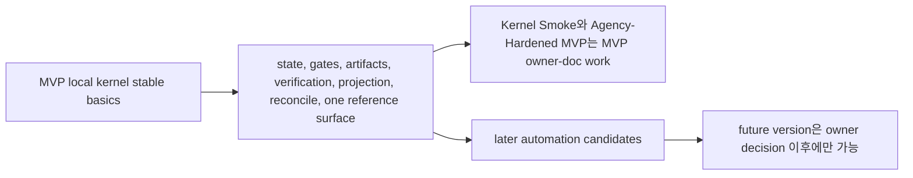
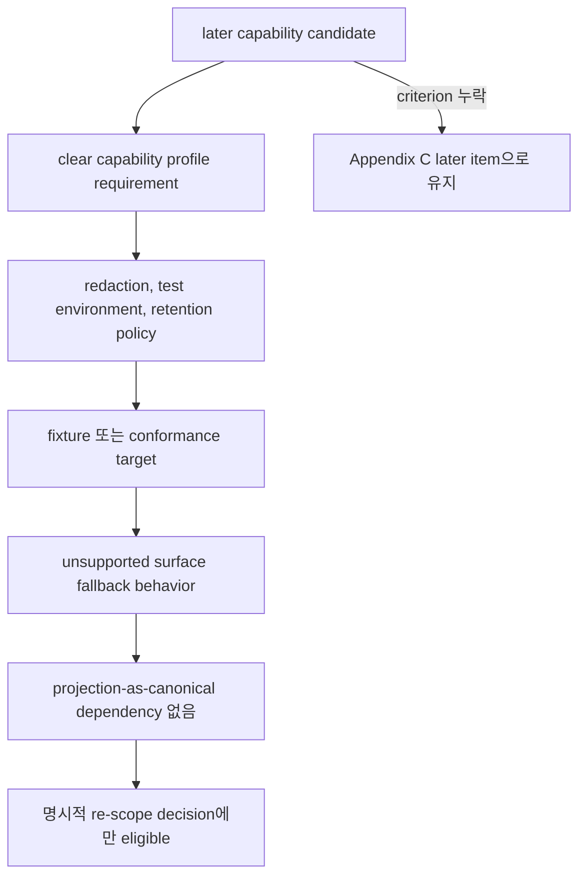
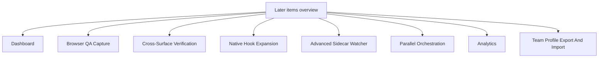
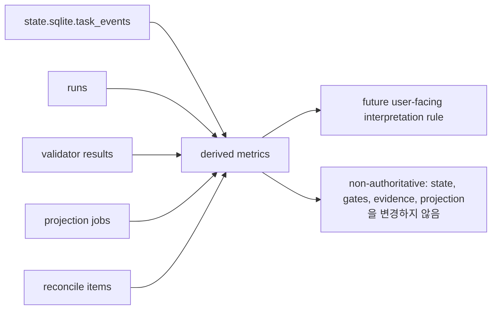

# Appendix C: Later Roadmap

## 문서 역할

이 appendix는 later automation과 post-MVP roadmap item을 모아 둡니다. 목적은 이 항목들이 MVP 요구사항처럼 읽히지 않게 하는 것입니다.

Kernel invariant, public MCP schema, MVP implementation requirement, MVP에 required한 conformance는 이 문서가 소유하지 않습니다.

## Roadmap 범위

MVP는 local kernel을 입증합니다. 즉 state, gate, artifact, verification, projection, reconcile, one reference surface가 안정적으로 동작하는지를 먼저 증명합니다. 아래 항목들은 이 기본 요소가 안정된 뒤에 이어갈 수 있는 follow-on입니다.

Kernel Smoke와 Agency-Hardened MVP는 모두 MVP delivery stage이지 Appendix C scope가 아닙니다. 이 appendix는 MVP owner docs가 요구하는 kernel authority, Decision Packet, residual-risk visibility, detached verification, Manual QA, recover/export, fixture-conformance behavior를 흡수하면 안 됩니다.

Later item은 다음을 갖춘 뒤에만 v1 work가 될 수 있습니다.

- clear capability profile requirement
- redaction 및 secret/PII handling policy
- runtime surface를 capture하는 경우 test environment와 artifact retention policy
- fixture 또는 conformance target
- unsupported surface에 대한 fallback behavior
- projection을 canonical state로 취급하는 것에 대한 dependency 없음

## Dashboard

Dashboard는 active Task, gate, approval, evidence coverage, projection freshness, artifact integrity, reconcile item을 visualize할 수 있습니다.

MVP는 dashboard가 display할 record, projection, conformance fixture를 먼저 stabilize해야 하므로 이 항목은 later입니다. 첫 version은 `state.sqlite`, artifact ref, projection job status 위의 read-only view여야 합니다.

## Browser QA Capture

Browser QA Capture는 v1 priority candidate이지 MVP requirement가 아닙니다. Connected surface가 지원하는 경우 automatic 또는 assisted capture가 Manual QA record를 위해 screenshot, console log, network trace, accessibility snapshot, workflow recording을 수집할 수 있습니다.

Promotion에는 declared `T6 QA Capture` capability profile, redaction 및 secret/PII handling policy, test environment setup, artifact retention rules, fixture 또는 conformance target, unsupported surface fallback behavior가 필요합니다.

Captured browser QA material은 artifact refs를 통해 Manual QA records에 attach되어야 합니다. 일반적으로 `qa_capture`, `screenshot`, `log`, 또는 captured file이 console log, network trace, accessibility snapshot, workflow recording인 경우 `other`를 사용할 수 있습니다. 이는 QA evidence를 개선할 수 있지만 final acceptance가 아니며, human taste 또는 experience judgment가 필요한 경우 Manual QA judgment를 대체하지 않고, verification independence requirements도 충족하지 않는 한 detached verification을 대체하지 않습니다.

Unsupported surface는 human Manual QA notes와 manually supplied artifacts로 fallback해야 합니다. MVP는 automated browser capture를 요구하지 않고 Manual QA record와 artifact refs를 지원합니다.

## Cross-Surface Verification

Cross-surface verification은 verification bundle을 다른 agent surface 또는 evaluator environment로 보낼 수 있습니다.

MVP에는 one reference surface와 detached verification bundle/manual evaluator instruction이면 충분하므로 later입니다. Cross-surface verify는 connector conformance와 capability profile이 stable해진 뒤에 다뤄야 합니다.

## Native Hook Expansion

Native hook은 이를 지원하는 surface에서 stronger pre-tool guard, command interception, file write blocking, richer artifact capture를 제공할 수 있습니다.

Hook API가 surface마다 다르므로 later입니다. MVP는 reference surface가 실제로 지원할 때만 concrete hook을 사용할 수 있습니다. 그 외에는 native hook이 capability-dependent enhancement입니다.

## Advanced Sidecar Watcher

Advanced sidecar watcher는 file write, command execution, generated-file drift, artifact capture opportunity, repo baseline drift를 near real time으로 observe할 수 있습니다.

MVP는 cooperative `prepare_write`, git diff check, artifact registration, detective validator로 시작할 수 있으므로 later입니다. Advanced watching이 core state model의 동작에 required여서는 안 됩니다.

## Parallel Orchestration

Parallel Change Unit orchestration은 work를 여러 active implementation lane으로 split하고, dependency DAG를 manage하고, baseline을 isolate하고, concurrent evidence를 reconcile할 수 있습니다.

Parallel execution은 stable lock, baseline freshness, approval scope composition, artifact partitioning, close semantics에 의존하므로 later입니다.

## Analytics

Analytics는 `state.sqlite.task_events`, run, validator result, projection job, reconcile item에서 rate와 latency를 derive할 수 있습니다.

Metric은 authority가 아니라 derived value이므로 later입니다. Candidate metric에는 approval turnaround, verification latency, evidence insufficiency rate, projection stale duration, reconcile volume, same-session verification guard trigger가 있습니다.

Legacy operations guide의 candidate derived metric:

- `direct_to_work_escalation_rate`
- `approval_turnaround_time`
- `verify_latency`
- `reopen_within_7d`
- `evaluator_blocked_due_to_missing_evidence`
- `same_session_verify_guard_triggered`
- `surface_fallback_rate`
- `mcp_connection_failure_rate`
- `projection_stale_duration`
- `reconcile_pending_count`
- `shaping_unresolved_decision_count`
- `horizontal_exception_rate`
- `tdd_red_missing_rate`
- `manual_qa_pending_duration`
- `architecture_drift_warning_count`
- `domain_language_mismatch_count`
- `interface_review_required_count`

이 metric들은 future decision이 owner, fixture coverage, retention behavior, user-facing interpretation rule을 assign할 때만 v1 또는 MVP가 되어야 합니다.

## Team Profile Export And Import

Team profile export/import는 policy default, connector profile, surface capability assumption, validator profile, project setup template을 team에 공유할 수 있습니다.

MVP는 local kernel이므로 later입니다. Team sharing은 runtime state에 영향을 주기 전에 versioning, privacy review, secret handling, conflict behavior가 필요합니다.

## Additional Later Candidates

다음 항목도 future batch가 fixture와 implementation ownership으로 promote하기 전까지 later입니다. 즉 아래 항목은 현재 MVP 요구사항이 아닙니다.

- deployment, canary, rollback, merge, production-monitoring automation. Release Handoff는 그런 authority를 external로 남기는 v1 report/export profile로만 더 이르게 존재할 수 있습니다.
- artifact dashboard
- worktree-based fresh verify automation
- advanced architecture drift validator
- advanced public interface validator
- semantic domain language consistency checks
- status/approval/acceptance/Manual QA card UX expansion
- multi-agent policy and scheduling
