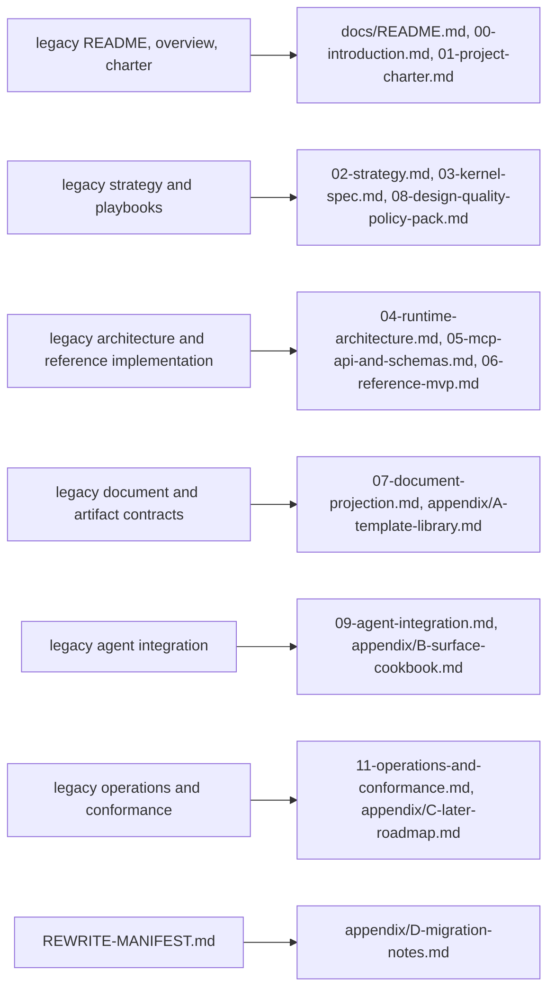
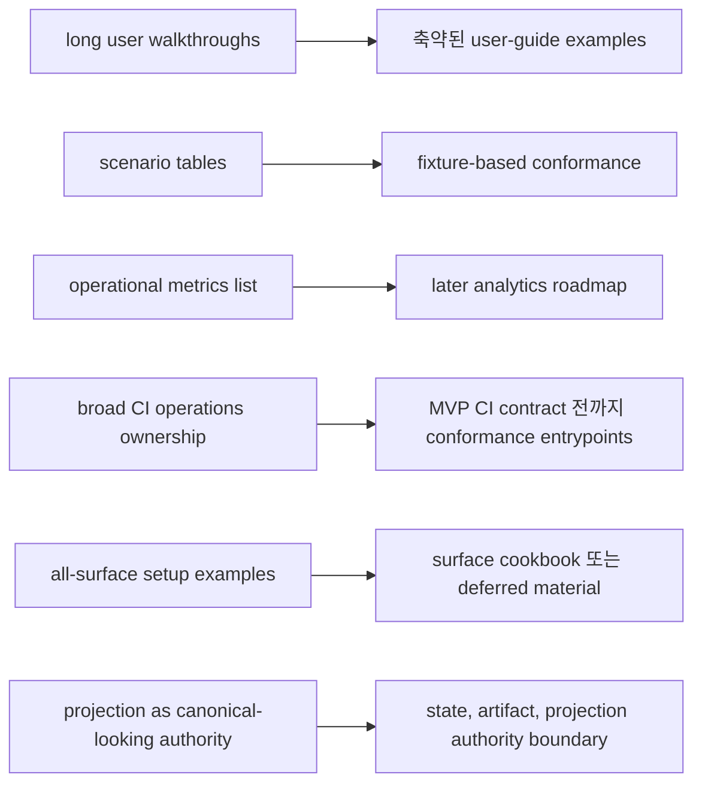
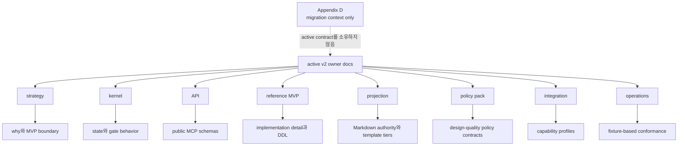

# Appendix D: Migration Notes

## 문서 역할

이 appendix는 v2 documentation rewrite를 위한 old-to-new document mapping, removed 또는 renamed section, compatibility guidance를 기록합니다.

Migration context 전용입니다. Canonical runtime contract, kernel state semantic, MCP schema, projection template, user procedure, conformance rule은 이 문서가 소유하지 않습니다.

## Migration 범위

Active canonical doc은 `docs/` 아래 v2 target file과 appendix A-C입니다. 이 appendix는 migration context이며 active canonical owner가 아닙니다.

Legacy v1 file과 rewrite manifest는 migration history를 위한 source material일 뿐입니다. Batch H 이후 replaced legacy file은 더 이상 active-tree Markdown document로 retain되지 않습니다. 이 appendix의 old-to-new mapping이 visible compatibility record입니다.

`REWRITE-MANIFEST.md`는 migration input입니다. Earlier simplification goal을 기록하고 three spaces, source-of-truth/projection separation, public MCP surface reduction, SQLite-centered runtime, MVP/later separation, four judgment separation, detached verification, design-quality principle 같은 preservation theme을 confirm합니다. v2 owner doc을 override하지 않습니다.

## Old-To-New Mapping

| Archived legacy source | v2 destination |
|---|---|
| `docs/legacy-v1/README.md` | `docs/README.md` |
| `docs/legacy-v1/00-overview.md` | `docs/00-introduction.md` |
| `docs/legacy-v1/01-project-charter.md` | `docs/01-project-charter.md` |
| `docs/legacy-v1/02-strategy.md` | `docs/02-strategy.md`, `docs/03-kernel-spec.md`, `docs/08-design-quality-policy-pack.md` |
| `docs/legacy-v1/03-architecture.md` | `docs/04-runtime-architecture.md` |
| `docs/legacy-v1/04-reference-implementation.md` | `docs/03-kernel-spec.md`, `docs/05-mcp-api-and-schemas.md`, `docs/06-reference-mvp.md`, `docs/appendix/C-later-roadmap.md` |
| `docs/legacy-v1/05-user-guide.md` | `docs/10-user-guide.md` |
| `docs/legacy-v1/06-agent-integration.md` | `docs/09-agent-integration.md`, `docs/appendix/B-surface-cookbook.md` |
| `docs/legacy-v1/07-document-and-artifact-contracts.md` | `docs/07-document-projection.md`, `docs/appendix/A-template-library.md` |
| `docs/legacy-v1/08-operations-and-conformance.md` | `docs/11-operations-and-conformance.md`, `docs/appendix/C-later-roadmap.md` |
| `docs/legacy-v1/09-design-quality-playbooks.md` | `docs/08-design-quality-policy-pack.md` |
| `docs/legacy-v1/99-authoring-guide.md` | `docs/99-authoring-guide.md` |
| `docs/legacy-v1/glossary.md` | `docs/glossary.md` |
| `docs/legacy-v1/REWRITE-MANIFEST.md` | `docs/appendix/D-migration-notes.md` |

## Legacy Path Cleanup Status

Batch H는 migration stub을 유지하는 대신 replaced legacy document를 active tree에서 제거합니다. 이 path들은 canonical doc이 아니며, 여기 listed된 v2 destination을 사용합니다.

| Removed legacy path | v2 destination |
|---|---|
| `docs/00-overview.md` | `docs/00-introduction.md` |
| `docs/03-architecture.md` | `docs/04-runtime-architecture.md` |
| `docs/04-reference-implementation.md` | `docs/03-kernel-spec.md`, `docs/05-mcp-api-and-schemas.md`, `docs/06-reference-mvp.md`, `docs/appendix/C-later-roadmap.md` |
| `docs/05-user-guide.md` | `docs/10-user-guide.md` |
| `docs/06-agent-integration.md` | `docs/09-agent-integration.md`, `docs/appendix/B-surface-cookbook.md` |
| `docs/07-document-and-artifact-contracts.md` | `docs/07-document-projection.md`, `docs/appendix/A-template-library.md` |
| `docs/08-operations-and-conformance.md` | `docs/11-operations-and-conformance.md`, `docs/appendix/C-later-roadmap.md` |
| `docs/09-design-quality-playbooks.md` | `docs/08-design-quality-policy-pack.md` |

Archived `docs/legacy-v1/` copy들과 old charter, strategy, authoring guide, glossary, README, rewrite manifest도 active tree에서 제거되었습니다. Compatibility mapping은 `docs/appendix/D-migration-notes.md`에 남아 있습니다.

## 주요 Removed 또는 Renamed Section

| Legacy section or theme | v2 treatment |
|---|---|
| `05-user-guide.md` long work walkthroughs | `10-user-guide.md`의 conversation example로 축약 |
| detailed report-reading tables in user guide | main user guide에서 제거; projection ownership은 `07-document-projection.md`에 유지 |
| user-facing setup internals | operations 또는 integration owner doc으로 이동 |
| `08-operations-and-conformance.md` scenario tables | `11-operations-and-conformance.md`에서 fixture-based conformance로 재작성 |
| operational metrics list | `appendix/C-later-roadmap.md`의 later analytics로 이동 |
| CI as a broad operations owner | MVP CI contract가 정의될 때까지 conformance entrypoint로 축소 |
| all-surface connector setup examples | `appendix/B-surface-cookbook.md`로 이동 또는 deferred |
| surface-specific addenda in main integration docs | cookbook material로 renamed |
| `03-architecture.md` | `04-runtime-architecture.md`와 elsewhere owner summary로 renamed/split |
| `04-reference-implementation.md` | kernel, API/schema, reference MVP, later roadmap으로 split |
| `07-document-and-artifact-contracts.md` | `07-document-projection.md`와 `appendix/A-template-library.md`로 renamed/split |
| `09-design-quality-playbooks.md` | playbook prose에서 policy contract로 converted |
| old 17-item invariant style | 7 core invariants와 policy defaults로 split |
| single-axis status model | lifecycle plus gates로 replaced |
| event log phrasing as a separate store | `state.sqlite.task_events` wording으로 replaced |
| projection as canonical-looking document authority | state/artifact/projection authority boundary로 replaced |

## Compatibility Guidance

Reader가 old file name을 만나면 위 mapping을 사용하고 v2 destination을 우선합니다. Archived legacy document를 canonical doc으로 cite하지 않습니다.

Legacy section에 아직 옮겨지지 않은 useful example이 있으면 source material로만 취급합니다. Active owner doc이 그 example이 main text, appendix, later roadmap, migration notes 중 어디에 속하는지 결정합니다.

Legacy term이 glossary와 conflict하면 `docs/glossary.md`를 사용합니다.

Legacy behavior가 v2 owner doc과 conflict하면 v2 owner doc을 사용합니다.

## Version Comparison Summary

v1은 strategy, state, implementation, template, connector, operations, design-quality guidance를 더 적은 문서에 섞어 두었습니다. v2는 ownership에 따라 이를 분리합니다.

- strategy는 why, failure model, core invariants, policy defaults를 담당합니다
- kernel은 state와 gate behavior를 담당합니다
- API는 public MCP schema를 담당합니다
- reference MVP는 implementation detail과 DDL을 담당합니다
- projection은 Markdown authority와 template tier를 담당합니다
- policy pack은 design-quality policy contract를 담당합니다
- integration은 capability profile을 담당합니다
- operations는 fixture-based conformance를 담당합니다

Migration은 original product intent를 유지하되 duplicated authority, long user example, broad all-surface implication, MVP/later ambiguity를 제거합니다. 이 문서는 canonical owner가 아니라 migration compatibility record입니다.
