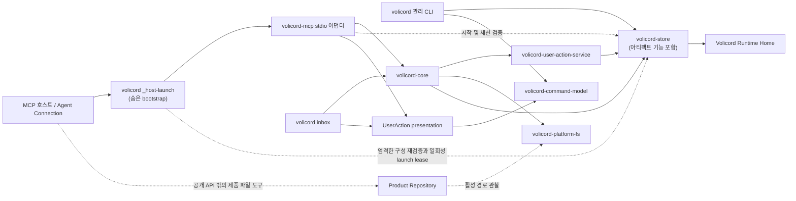

# 구현 아키텍처

Core는 typed method planner, UserAction service, 순서가 있는 Store mutation을 통해 명시적
checkpoint succession, 결정 owner별 적용, advisor finalization, Task 전체 태그 기반 진행을
담당합니다. Store는 엄격한 aggregate decoding, live-decision 및 lineage 불변 조건,
원자적 적용, 정규 DDL을 담당합니다. MCP는 생성된 wire argument를 Core request로
매핑하며 진행 또는 단계 전이 정책을 구현하지 않습니다.

이 문서는 로컬 Rust 워크스페이스를 위한 아키텍처 가이드의 상위 개요입니다.
가이드 수준의 운영 경로, 워크스페이스 형태, 의존 방향, 오래 유지될 구현 경계,
집중 세부 담당 문서로 가는 경로를 담당합니다.

이 문서는 소스 지도, 작업 흐름 추적, 테스트 전략, 변경 가이드, 제품 계약이
아닙니다. 학습 경로가 필요하면 [아키텍처 가이드](README.md)에서 시작합니다.
정확한 동작은 집중 [참조 색인](../reference/README.md)을 봅니다. 아래 표에서
구현 질문에 맞는 아키텍처 가이드 문서로 이동할 수 있습니다.

Volicord는 AI 지원 제품 작업을 위한 로컬 작업 권한 기록입니다. Core는 Volicord
상태를 위한 로컬 기준 기록입니다.

이 체크아웃은 이 저장소가 유지하는 Volicord 소스 저장소이자 Rust
워크스페이스입니다. 구현 크레이트, 테스트, 문서, 검증 도구, 저장소 설정을
담습니다. Volicord 설치는 배포된 실행 파일과 필요한 런타임 리소스의 부분집합이므로
이 워크스페이스 개요는 설치 매니페스트가 아닙니다.

직접 열 수 있는 코드와 테스트 경로는 저장소 루트 기준으로 씁니다.

## 운영 경로

아래 그림은 현재 세 진입 경로인 관리형 stdio MCP, 관리 CLI, CLI
받은 편지함 `User Channel`을 구분합니다. 실선은 주된 호출 또는 저장 방향을
나타냅니다. 점선은 검증, 관찰된 입력, 공개 메서드 실행 밖에서 일어나는 작업을
나타냅니다.



숨은 launcher와 `volicord-mcp` 어댑터 라이브러리는 시작 검사, Agent Connection 맥락, session 검증,
요청 시점 project routing을 위해 Store를 직접 사용할 수 있습니다.
이 직접 Store
사용은 공개 Volicord 메서드 의미를 구현하는 다른 경로가 아닙니다. 공개 메서드
실행은 Core를 통과합니다.
Launcher는 원래 프로세스 안에서 현재 관리 구성을 다시 검증하고 수명이 짧은
Registry lease를 발급한 뒤 claim을 메모리에서만 MCP 어댑터로 넘깁니다. 공개
`volicord mcp serve` 진입점은 수동 전송이며 항상 `manual_cli`를 기록합니다.

`Product Repository`는 별도의 제품 파일 경계로 남습니다. 공개 Volicord 메서드는
담당 문서가 정의한 호환성, 관찰, 판단, 증거, 아티팩트 링크를 기록합니다. 제품
파일 쓰기 자체는 공개 메서드 실행 경로 밖에서 Agent Connection, 로컬 도구, 또는
명시적인 관리 통합 경로가 수행합니다. 공유 타입은 플랫폼 중립 상대 경로 identity와
순수 관계만 전달합니다. Core는 `volicord-platform-fs`에 활성 containment 관찰을
요청하며 의미 서비스는 그 결과인 상대 identity만 받고 파일시스템을 검사하지 않습니다.

<a id="workspace-package-architecture"></a>

## 워크스페이스 패키지 아키텍처

루트 `Cargo.toml`의 `workspace.metadata.architecture.packages`는 현재 각
워크스페이스 패키지의 의미 그룹, 책임, 분류, 프로덕션 여부, 경계, 일반·개발·빌드
의존 허용 목록을 담당하는 하나의 기계 판독 원본입니다. `architecture-check`는
이 선언을 실제 Cargo 메타데이터와 비교하고 Core, UserAction 서비스, 공유 타입,
Store, 어댑터, 표현, 테스트 지원 경계를 강제하며 일반·빌드 의존 그래프의 순환을
거부합니다. 또한 각 `*-wire` 그룹을 일치하는 adapter와 검증 도구 또는 테스트만
사용할 수 있게 제한합니다. 따라서 allowlist 항목을 추가하더라도 Core, 공유 타입,
Store, UserAction 서비스, CLI, presentation package는 `volicord-mcp-wire`를 사용할 수
없습니다. 개발 전용 역방향 간선은 배포 그래프에 참여하지 않습니다.

아래 표는 `docs-sync`가 생성합니다. 정확한 모듈 배치는
[소스 지도](source-map.md)에 남습니다.

<!-- BEGIN GENERATED: workspace-package-architecture -->
<!-- Generated by `cargo run -p xtask -- docs-sync`; do not edit this region. -->

### 패키지 책임

현재 워크스페이스의 각 패키지는 루트 Cargo 메타데이터에 하나의 책임 항목을 가집니다.

| 패키지 | 그룹 | 종류 | 런타임 | 경계 | 책임 |
|---|---|---|---|---|---|
| `volicord-agent-evaluation` | `agent-evaluation` | 검증 | 비프로덕션 | 중립 | 독립형 에이전트 평가 카탈로그, 실행기, 스키마, 결과 하네스를 담당합니다. |
| `volicord-cli` | `cli-adapter` | 어댑터 | 프로덕션 | 어댑터 | 관리 CLI, typed User Channel resolution, Guard lifecycle 관찰과 terminalization, 관리형 현재 권한 및 stale 복구 지침, Codex 설정, rendering, MCP 감독을 담당합니다. |
| `volicord-command-model` | `command-model` | 스키마 | 프로덕션 | 중립 | 실행과 분리된 관리 명령 선언, 문법 모델, 정규 호출 빌더를 담당합니다. |
| `volicord-conformance-tests` | `conformance-validation` | 검증 | 비프로덕션 | 중립 | Core 지향 교차 메서드 시나리오와 정규 MCP 의미 schema 적합성 사례를 담당합니다. |
| `volicord-core` | `core` | 애플리케이션 | 프로덕션 | Core | 어댑터 독립 현재 shaping 권한 projection, checkpoint succession, 정확한 stale 폐기 또는 재권한, 결정 owner별 적용, advisor finalization, 명시적 advance, implementation 보존 거부, 정책 평가, 원자적 커밋 조율을 담당합니다. |
| `volicord-host-contract` | `host-contract` | 스키마 | 프로덕션 | Core 지향 | 사용자 권한이나 Core 진행 권한을 만들지 않고 정확한 Guard hook 상관관계와 예상 효과 분류를 제공하는 의존 안전한 host contract를 담당합니다. |
| `volicord-integration-tests` | `integration-validation` | 검증 | 비프로덕션 | 중립 | 계층 간 통합, Agent Connection, 공개 계약 스냅샷 테스트를 담당합니다. |
| `volicord-mcp` | `mcp-adapter` | 어댑터 | 프로덕션 | 어댑터 | MCP 생명주기, descriptor를 소비하는 AgentToolId registry 및 의미 검증, 현재 권한 지침, 간결한 태그 기반 결과 projection, 세션 결속, 메서드 dispatch, Core 호출 adapter를 담당합니다. |
| `volicord-mcp-protocol` | `mcp-protocol` | 스키마 | 프로덕션 | 중립 | 호스트 독립 MCP 리비전 프로필과 의미 기반 역량 레지스트리를 담당합니다. |
| `volicord-mcp-wire` | `mcp-wire` | 스키마 | 프로덕션 | 어댑터 | 정규 MCP 의미 descriptor, typed example, discriminator 및 nullable metadata, validator tree, checkpoint/finalization 인자와 결과, 오류, 구조화 콘텐츠, JSON-RPC envelope, 생성 wire schema를 담당합니다. |
| `volicord-platform-fs` | `platform-filesystem` | 인프라 | 프로덕션 | Core 지향 | 호출 범위 Product Repository 관찰, 플랫폼 파일시스템 관찰, 게시, 변경 승인, Git 레이아웃 프리미티브를 담당합니다. |
| `volicord-platform-process` | `platform-process` | 인프라 | 프로덕션 | 중립 | 플랫폼 자식 프로세스 격리, 종료, 파이프 준비 상태 프리미티브를 담당합니다. |
| `volicord-release-integrity-tests` | `release-integrity` | 검증 | 비프로덕션 | 중립 | 릴리스 패키징, 버전, 정규 바이트, 체크섬, 워크플로 무결성 검증을 담당합니다. |
| `volicord-release-smoke` | `release-smoke` | 검증 | 비프로덕션 | 중립 | 크로스 플랫폼 실제 바이너리 릴리스 스모크 조율과 transcript 검증을 담당합니다. |
| `volicord-store` | `storage` | 인프라 | 프로덕션 | Core 지향 | 정규 Runtime Home 영속화, Store가 도출한 현재 shaping 권한, 분리된 변경 불가능한 application 및 재권한 이력, owner별 결정 적용·finalization·단계 전이의 원자성, 불변 조건을 보존하는 transaction을 담당합니다. |
| `volicord-test-process` | `test-process` | 테스트 지원 | 비프로덕션 | 중립 | 테스트와 스모크 하네스를 위한 재사용 가능한 한도 프로세스 실행과 정리를 담당합니다. |
| `volicord-test-support` | `test-support` | 테스트 지원 | 비프로덕션 | 중립 | 재사용 가능한 폐기형 Runtime Home, Store, Core 요청, Agent Connection 픽스처를 담당합니다. |
| `volicord-types` | `shared-types` | 스키마 | 프로덕션 | Core 지향 | checkpoint 및 application lineage, stale 권한 action과 재권한, advisor finalization, 태그 기반 workflow 진행, typed rejection, 정규 인코딩, 플랫폼 중립 fact를 위한 의존 안전한 공개 스키마와 폐쇄형 값을 담당합니다. |
| `volicord-user-action-presentation` | `user-action-presentation` | 표현 | 프로덕션 | 어댑터 | typed User Channel presentation, CLI JSON Schema, 대화 비권한 경계, 명령 모델 기반 resolution 안내를 담당합니다. |
| `volicord-user-action-service` | `user-action-service` | 애플리케이션 | 프로덕션 | Core 지향 | 의미 기반 UserAction 구성, 검증, 권한, 생명주기, shaping link identity, 영속화 매핑, 해결, 연속성, Store가 검증한 record 기반 투영을 담당합니다. |
| `xtask` | `repository-validation` | 검증 | 비프로덕션 | 중립 | 변경된 파일의 담당 경로 지정, 오래 남는 명령 결과를 제공하는 집중·최종 검증, 저장소 아키텍처, 문서, 프로토콜 픽스처, 릴리스 메타데이터, Git 트리 소스 번들의 검증, 생성, 동기화를 담당합니다. |

### 허용되는 내부 의존 방향

각 목록은 Cargo 의존 종류별 패키지 허용 목록입니다. 긴 대시는 해당 종류에 허용된 내부 패키지가 없음을 뜻합니다.

| 패키지 | 일반 | 개발 | 빌드 |
|---|---|---|---|
| `volicord-agent-evaluation` | `volicord-test-support` | — | — |
| `volicord-cli` | `volicord-command-model`, `volicord-core`, `volicord-host-contract`, `volicord-mcp`, `volicord-mcp-protocol`, `volicord-platform-fs`, `volicord-platform-process`, `volicord-store`, `volicord-types`, `volicord-user-action-presentation`, `volicord-user-action-service` | `volicord-store`, `volicord-test-support` | — |
| `volicord-command-model` | — | — | — |
| `volicord-conformance-tests` | — | `volicord-core`, `volicord-host-contract`, `volicord-mcp-wire`, `volicord-platform-fs`, `volicord-store`, `volicord-test-support`, `volicord-types`, `volicord-user-action-service` | — |
| `volicord-core` | `volicord-platform-fs`, `volicord-store`, `volicord-types`, `volicord-user-action-service` | `volicord-test-support` | — |
| `volicord-host-contract` | `volicord-types` | — | — |
| `volicord-integration-tests` | — | `volicord-core`, `volicord-mcp`, `volicord-mcp-wire`, `volicord-store`, `volicord-test-support`, `volicord-types` | — |
| `volicord-mcp` | `volicord-core`, `volicord-host-contract`, `volicord-mcp-protocol`, `volicord-mcp-wire`, `volicord-platform-fs`, `volicord-store`, `volicord-types`, `volicord-user-action-presentation`, `volicord-user-action-service` | `volicord-test-support` | — |
| `volicord-mcp-protocol` | — | — | — |
| `volicord-mcp-wire` | `volicord-mcp-protocol`, `volicord-types` | — | — |
| `volicord-platform-fs` | `volicord-platform-process`, `volicord-types` | — | — |
| `volicord-platform-process` | — | — | — |
| `volicord-release-integrity-tests` | `volicord-store`, `volicord-types` | — | — |
| `volicord-release-smoke` | `volicord-mcp-protocol`, `volicord-test-process`, `volicord-types` | — | — |
| `volicord-store` | `volicord-host-contract`, `volicord-platform-fs`, `volicord-types` | `volicord-platform-fs`, `volicord-test-support` | — |
| `volicord-test-process` | `volicord-platform-process` | — | — |
| `volicord-test-support` | `volicord-host-contract`, `volicord-platform-fs`, `volicord-store`, `volicord-types` | — | — |
| `volicord-types` | — | — | — |
| `volicord-user-action-presentation` | `volicord-command-model`, `volicord-types` | — | — |
| `volicord-user-action-service` | `volicord-store`, `volicord-types` | `volicord-test-support` | — |
| `xtask` | `volicord-command-model`, `volicord-mcp-protocol`, `volicord-mcp-wire`, `volicord-types` | — | — |

<!-- END GENERATED: workspace-package-architecture -->

### Store 변경 가시성

Store의 쓰기 가능 데이터베이스 open과 저수준 변경 helper는 crate-private으로
유지합니다. 외부 caller는 하나의 정규 Runtime Home에 대해 보유한 정확한
`RuntimeHomeMutationPermit`을 빌리는, 복제할 수 없는 활성
`RuntimeHomeMutationContext`를 요구하는 공개 API를 통해서만 변경 경로에
진입합니다. Rust 가시성과 위조할 수 없는 수명 관계가 외부 크레이트의 내부 open
호출 및 분리된 변경 context 구성을 막습니다. Compile-fail coverage는 접근할 수
없는 Store 진입점과 permit에 결속된 context 수명을 함께 보호합니다.

## Core 메서드 담당 경계

`crates/volicord-core/src/methods/`는 공개 메서드 진입점과 요청별 조율을
담당합니다. `methods/mod.rs`에는 모듈 wiring만 있으며 helper prelude나 service
locator로 사용하지 않습니다. `operation_plan.rs`는 Task와 Change Unit 식별자,
Store mutation, event payload를 담는 메서드 중립 실행 carrier를 담당합니다.
메서드별 result field와 응답 구성은 각 공개 메서드 모듈에 남습니다. 메서드 모듈은 durable
identity, artifact policy, continuity planning, Write Ticket planning, 닫기 준비
상태, record-reference 변환을 각각 집중된 Core 담당 모듈에서 가져옵니다. Store 기반
수락, Task, enforcement, 증거 조회는 각각 `acceptance_facts.rs`,
`task_facts.rs`, `enforcement_facts.rs`, `evidence_facts.rs`에 둡니다.
`state_summary.rs`, `evidence_projection.rs`, `guarantee_projection.rs`는 Store와
독립적으로 typed fact를 view로 투영합니다.

### Shaping 진행 소유권

`volicord-types`는 공개 `ShapingCheckpoint`, gap input/projection, 폐쇄형
shaping/workflow/transition 값, 엄격한 transition catalog, kind별 정규 application-owner 정책, `WorkflowProjection`, 메서드 요청과 결과, typed rejection detail을
담당합니다. `volicord-store::core_pipeline::shaping`은 엄격한 Task 범위 aggregate,
정확한 stale 권한 소비, 불변 reauthorization lineage,
checkpoint/gap/UserAction-link mutation을 담당합니다. Core의
`methods/record_shaping.rs`, `methods/update_scope.rs`, `methods/advance_task.rs`는 이
정책을 사용해 의미 검증, 정확한 결정 적용, 원자적 plan 조립, 명시적 단계 전이를
담당합니다. Store는 타입이 정해진 현재 유효 shaping 권한 graph 하나와 명시적 UserAction,
application 및 reauthorization 이력 조회를 제공합니다. `workflow_projection.rs`는 이 graph로
엄격한 정규화 `WorkflowSnapshot`을 만들고 workflow kind, blocking reason, 실행 가능한
transition variant를 유일하게 소유하는 순수 `WorkflowMachine`을 평가합니다. UserAction service는 연결 권한을 구성하고 검증하지만 그
출력을 checkpoint transaction으로 조율하는 곳은 Core뿐입니다. Store exact-ID mutation은
잘못된 owner나 resolution을 거부하고 advance owner 적용을 단계 전이와 한 transaction에
결속합니다.

`volicord-mcp-wire`는 adapter 요청과 결과 projection을, `volicord-mcp`는
`AgentToolId` registry, dispatch, 간결한 workflow/rejection presentation, session
binding을 담당합니다. CLI와 UserAction presentation은 User Channel 및 Guard 지침 표면을
담당합니다. `volicord-host-contract`는 정확한 hook 상관관계와 예상 효과 분류만 담당하며
Task 단계 선택, UserAction 해결, workflow 권한 전진을 하지 않습니다. 이 방향은
`types -> Store/service fact -> Core policy -> adapter projection`을 유지하고
Core-to-adapter나 Store-to-Core 의존 cycle을 만들지 않습니다.

집중된 Write Ticket 담당자 안에서 `write_ticket/planning.rs`는 필요한 의미 입력만
평가하고 typed 판단 사유, 의미 record identity, mutation fact와 폐쇄형
`PrepareWriteTicketPlan` 분기 하나를 반환합니다. 이 분기는 ID 없는 발급 draft,
재사용 가능한 stored ticket, ticket 없는 판단 경로 가운데 하나입니다.
`WriteTicketPathScope`는 planned ticket과 stored ticket의 경로를 소유하는
dependency-safe 불변 값입니다. 공개 `prepare_write` 메서드는 dry-run 분기 선택,
영속 ID 할당, state-version이 있는 record reference, 보장 표시, 오류-응답 매핑,
폐쇄형 `MaterializedPrepareWriteTicket` 하나로의 변환을 담당합니다. 그중 발급
분기는 삽입과 응답 projection에 함께 쓰는 검증된 `PlannedWriteTicket`을 담고,
재사용 및 없음 분기는 삽입을 만들 수 없습니다.
`write_ticket/semantic.rs`는 plan과 Store가 검증한 opaque record가 공유하는
불변 의미 view를 제공하며 planned lifecycle identity와 stored lifecycle identity는
서로 다른 타입에 남습니다. `write_ticket/read_model.rs`는 typed stored ticket,
Task, workflow policy, 관찰 시각, UserAction resolution, 증거 fact를 취득합니다.
`WriteTicketCurrentFacts`에는 현재 유효성 평가가 사용하는 비승인 fact만 둡니다.
`write_ticket/approval.rs`만 원시 UserAction 권한 값을 소비합니다. 이 모듈만 정규
승인 요구사항과 비공개 현재 민감 승인 identity 집합을 구성하고 typed 승인 근거
또는 `WriteTicketApprovalAssessment`를 반환합니다. Summary 평가, reuse, Record Run
승인, 닫기 준비 상태, CLI guard context는 이 평가 또는 여기서 파생된 평가 완료
stored 상태를 소비합니다.
`write_ticket/current_validity.rs`는 terminal stored 상태를 먼저 완결한 뒤 active
candidate만 reusable 또는 invalidated stored 상태로 평가합니다. 그 결과인 모든
`StoredWriteTicketEvaluation`은 필수 영속 identity를 가집니다.
`write_ticket/selection.rs`는 이 stored 평가만 선택합니다. `write_ticket/summary.rs`는
Store handle이나 정책 평가 없이 planned projection과 stored projection 경로를
구분합니다. `write_ticket/service.rs`는 현재 fact를 읽기 전에 terminal record와
active record를 나누고, active partition을 평가하고, stored 결과를 선택한 뒤
증거를 읽습니다. `write_ticket/admission.rs`는
`ReusableStoredWriteTicket`과 일치하는 정확한 attempt 호환성 증명을 결합해 보호
대상 mutation planning에 쓰는 `AdmissibleStoredWriteTicket`을 반환합니다. Store는
계속 Core에 의존하지 않습니다.

`ChangeUnitUpdate` schema accessor는 정확한 메서드 field 추출을 담당하고,
`change_unit_planning.rs`는 Change Unit mutation 계획을 담당합니다.
`task_policy.rs`는 Task lifecycle 해석과 lifecycle mutation 계획을 담당합니다.
`workflow_projection.rs`는 정규화 workflow snapshot 구성과 순수 태그 기반 진행
machine을 담당합니다. `guidance.rs`는 차단
사유 전용 및 표시 summary 해결 행동 선택과 정규화를 담당하고, `summary_text.rs`는
adapter-neutral 공개 summary 문구를 담당합니다. 이 담당 모듈은 CLI 문법, transport
framing, Markdown, terminal rendering을 만들지
않습니다. 공개 메서드 모듈은 이 집중 담당 모듈을 직접 명시적으로 import합니다.
Core에는 범용 projection facade, helper prelude, re-export service locator가
없습니다.

`method_execution.rs`는 메서드 공통 요청 준비와 plan 지원만 담당합니다.
`method_rejection.rs`는 메서드 중립 validation 및 rejection 응답을 구성합니다.
`error_boundary/` 아래의 집중 모듈은 Store, UserAction, 닫기 준비 상태, artifact
policy, Product Repository path의 source 오류 모델이 공개 메서드 plan 오류 모델과
만나는 경계에서만 변환합니다. 의미 담당 모듈은 typed fact, plan, service 오류를
반환하며 공개 메서드 응답 구성에 의존하지 않습니다.

## 저장소 관찰 책임 경계

`volicord-host-contract`는 source별 정확한 Codex hook 상관관계를 decode하고 예상
Product Repository 효과를 분류합니다.
`volicord-platform-fs::repository_observation`은 한도 있고 안정적인 저장소 기준선과
결과 및 결정적인 순 delta를 담당합니다. CLI Guard 모듈은 host event를 adaptation하고
host 결과를 projection합니다. Store는 정확한 호출 범위 aggregate, 원자적 pre/post
transaction, 예상 쓰기 일치, 엄격한 replay, 미기록 변경 구체화를 담당합니다.

Core는 조정과 닫기 준비 상태를 위해 Store가 검증한 미해결 미기록 변경만 읽습니다.
스냅샷을 capture하거나 hook event를 상관시키거나 delta를 재구성하거나 관찰 불가
진단을 변경 사실로 바꾸지 않습니다. 정확한 동작은
[저장소 관찰](../reference/repository-observation.md)에, 집중 구현 흐름은
[저장소 관찰 경계 설계](design/repository-observation-boundary.md)에 남습니다.

## Record Run 책임 경계

`volicord.record_run` 진입점은
`crates/volicord-core/src/methods/record_run.rs`에 있습니다. 이 모듈은 공통 Core
pipeline을 통해 메서드 envelope을 검증하고 공개 요청을 의미
`RecordRunInput`으로 변환한 뒤 `crates/volicord-core/src/recording/`에 계획을
위임합니다. 이어서 폐쇄형 `RecordingError` 모델을 공개 응답 분기로 매핑하고,
반환된 연산 및 결과 fact를 `OperationPlan`과 `RecordRunResultFields`로 변환하며,
메서드별 workflow metric을 기록합니다. 증거, artifact, 닫기 근거, 잔여 위험,
Write Ticket 정책은 담당하지 않습니다.

기록 패키지는 연산 흐름을 typed 형태로 유지합니다.

1. `context.rs`는 요청을 정규화하고 현재 typed Task, Change Unit, workflow,
   control fact를 취득합니다.
2. `authority.rs`, `evidence.rs`, `artifact.rs`는 Store가 반환한 캡처 record를
   해석하고 typed 권한, 증거 대상, 관찰, producer, artifact plan을 만듭니다. 정책
   판단에는 `evidence_facts.rs`, `artifact.rs`, `volicord-user-action-service`, 순수
   증거 정책 모듈을 재사용하며 기록 모듈은 물리 Store row를 decode하지 않습니다.
3. `write_ticket/admission.rs`는 typed 연산 fact를 받고 원시 승인 권한을
   `write_ticket/approval.rs`에 직접 전달한 뒤 반환된 평가로 정규 Write Ticket
   정책에 따라 현재 ticket을 검증합니다. `close_readiness/recording.rs`는 기존 닫기 준비 상태
   및 증거 정책 담당 모듈을 통해 typed 닫기 근거와 잔여 위험 입력을 해석합니다.
4. `recording/plan.rs`는 `RecordRunMutationPlan`을 조립합니다. 폐쇄형
   `RecordRunMutation` variant는 최종 Store plan 변환 전까지 Run, Task,
   UserAction, Write Ticket, 증거, artifact mutation을 구분합니다.
5. `recording/state.rs`는 연산 후 `StateSummary` 투영에 필요한 Store 기반 fact를
   취득합니다. `recording/plan.rs`는 의미 실행 fact만 담는
   `RecordRunEffect`와 의미 결과 fact만 담는 `RecordRunResultFacts`로 구성된
   폐쇄형 `RecordRunOperationPlan`을 반환합니다.

Store를 사용하는 기록 서비스는 typed fact, plan, 의미 오류를 반환하며
공개 메서드 요청 또는 응답 타입을 import하거나 `PipelineResponse`를 구성하지
않습니다. 요청 식별자, idempotency, 예상 상태, locale, 응답 metadata는 메서드
조율에 남습니다. 의미 field는 Recording이 실제로 평가할 때만 경계를 넘으며,
현재 Record Run 정책은 project 식별자와 dry-run intent를 평가합니다. 재사용
가능한 순수 정책 모듈은 typed 입력을 받고 Store handle을 갖지 않습니다. 공개
메서드 계층만 의미 기록 오류와 결과 fact를 응답 envelope으로 매핑합니다.

## UserAction 담당 경계

`crates/volicord-user-action-service/`는 재사용 가능한 UserAction 의미를
담당합니다. 책임별 모듈이 검증, 정규 typed request body와 basis 구성, source
identity, authority, lifecycle 해석, 구체화, 영속화 매핑, resolution, continuity
파생, adapter-neutral projection과 summary를 담당합니다. 이 크레이트는 명시적인
의미 구성 및 영속화 context를 받고 typed 서비스 오류와 fact를 반환하며, Core나
어댑터에 의존하지 않고 Store와 공유 타입에만 의존합니다. Store 의존성은 집중된
`UserActionStoreReader` typed 읽기 capability입니다. Store는 비공개 field와 typed
의미 accessor를 갖춘 불변 조건 보존 `StoredUserActionRequest`,
`StoredUserActionResolution`, `StoredUserActionRecordSet` 값을 반환합니다. 물리
row와 직렬화된 값 표현, 중복 column 검사, 요청-resolution pairing, 영속 손상
진단은 Store 내부에만 둡니다. 서비스는 이 record에서 의미 policy를 평가하고,
일관되지 않은 유효 typed fact에는 서비스 담당 invariant failure를 보고합니다.

`crates/volicord-core/src/methods/user_action.rs`와 `user_action_read.rs`는 요청별
invocation authority, Store transaction 순서, 원래 result replay, 메서드 결과
구성, 서비스 오류 projection을 담당합니다.
`crates/volicord-core/src/continuity/`는 typed continuity fact를 취득하고 주입된
durable ID generator를 사용해 typed continuity plan을 반환합니다. Caller는
서비스에 의미 의도를 제공하며 Core consumer와 어댑터는 정규 저장 action JSON을
직접 구성하지 않습니다.

`volicord-types`는 저장된 의미 request body에서 adapter-neutral
`UserActionResolutionForm`을 도출합니다. `volicord-user-action-presentation`은 이
fact를 typed `CliUserActionInboxResponse`, 폐쇄형 channel/capture-path 상태, JSON
Schema로 투영합니다. Command text는 실제 Clap 선언에서 도출한 typed
`volicord-command-model` invocation에서 얻습니다. CLI는 이 typed model을 직접
렌더링합니다. MCP는 자체 safe compound protocol projection과 neutral fact-read
failure를 MCP error로 바꾸는 작업만 담당합니다. `methods/reconcile_changes.rs`와 다른 Core
consumer는 공유 책임 담당 모듈을 직접 호출하고 typed UserAction 결과를 각자
plan과 응답에 반영하는 방식을 결정합니다. 프로덕션 메서드 모듈은 형제 메서드
구현을 재사용 라이브러리로 사용하지 않습니다.

정확한 공개 동작과 스키마 의미는
[사용자 행동 요청](../reference/api/method-request-user-action.md),
[사용자 행동 해결](../reference/api/method-resolve-user-action.md),
[변경 조정](../reference/api/method-reconcile-changes.md),
[사용자 행동 스키마](../reference/api/schema-user-action.md)에 남습니다. Store
기록과 효과는 집중 [저장소 담당 문서](../reference/storage.md)에 남습니다.

## Core 증거 및 닫기 준비 상태 경계

Core는 증거 사실 취득과 증거 정책 평가를 분리합니다.
담당 레코드의 엄격한 디코딩은 Store가 수행합니다.
`crates/volicord-core/src/evidence_facts.rs`는 디코딩된 typed 레코드를
공유 조회하고 저장된 증거와 투영된 증거의 정책 입력을 구성합니다.
`crates/volicord-core/src/policy/` 아래의 책임별 모듈은 출처,
관련성과 뒷받침 여부, 대상과 `CurrentCloseBasis` 일치, 생산자와 아티팩트 결속,
닫기 준비 상태의 증거 해석을 평가합니다. 필요한 입력이 이미 있으면 이 평가는
순수 함수로 수행됩니다.

닫기 준비 상태는
`crates/volicord-core/src/close_readiness/`의 책임별 패키지가
담당합니다. `mod.rs`는 메서드 plan이 사용하는 좁은 typed 표면을 노출합니다.
`facts.rs`는 수락 기준, workflow policy, 현재 `CoreProjectStore`를 통한
미조정 변경 조회를 포함해 현재 사실 집합을 한 번 취득하고, 준비 상태를
판단하지 않은 채 메서드 projection을 조립합니다. `change_control.rs`, `evidence.rs`,
`acceptance.rs`는 각각 변경 및 쓰기, 증거 및 아티팩트, 사용자 권한 조건을
평가합니다. Write Ticket 닫기 조건은 집중 Write Ticket 서비스가 만든
`StoredWriteTicketEvaluation` 값을 소비하며 원시 승인 권한을 받지 않습니다.
증거 평가는 `crates/volicord-core/src/policy/` 아래의 집중된 순수
정책 모듈을 호출하며 출처, 관련성, 대상, 결속, 증거 게이트 정책을 다시
구현하지 않습니다.

`policy.rs`는 취득한 사실에서 control을 해석하고 이 typed 평가를 닫기 계약
순서대로 순수하게 결합하여 닫기 상태를 선택합니다. Store handle은 받지
않습니다. `blockers.rs`는 공개 typed 차단 사유 projection을 구성하고
정규화합니다. `guidance.rs`는 typed 담당 메서드와 연산 범주를 포함한 의미 기반
후속 행위 선택을 담당하며 CLI 명령, 캡처 경로, Markdown 지침, adapter rendering,
credential을 구성하지 않습니다. `summary.rs`는 전체 닫기 평가와 더 작은
메서드 중립 준비 상태 projection을 담당합니다. `service.rs`는 이 좁은 API를
통해 사실 취득, 책임별 평가, 순수 정책 결합을 조율합니다. `recording.rs`는
Record Run 닫기 근거 참조 해석, 현재 민감 행동 근거 구성, 잔여 위험 입력 검증을
담당하며 `check_close`, `close_task`, `status`와 같은 typed 증거 및 닫기 준비 상태
정책을 호출합니다. 다른 Core 도메인과 공유하는 현재 근거 및 사용자 권한 호환성
순수 함수는
`crates/volicord-core/src/policy/close_readiness.rs`에 남습니다.

`close_task.rs`는 요청별 닫기 연산 조율을 담당합니다. 공개 요청을 검증하고
닫기 준비 상태 서비스를 호출하며, 종료 변경을 계획하고 typed 닫기 결과를
구성합니다. `status`는 닫기 준비 상태 요약을 사용합니다. `prepare_write`는
패키지의 차단 사유 projection 표면을 사용합니다. `reconcile_changes`,
`intake`, `update_scope`, `record_run`, `user_action`은 각자 투영한 typed 사실을
닫기 준비 상태 서비스에 전달합니다. 어떤 메서드 모듈도 형제 메서드에 재사용
가능한 닫기 준비 상태 정책이나 adapter 표현을 제공하지 않습니다.

프로덕션 메서드 모듈은 적용되는 Core pipeline, 서비스, 정책, Store,
`volicord-types` 담당 모듈에서 의존성을 명시합니다. 상위 methods 모듈은 실제로
공유되는 조율 helper만 담당하며 하위 모듈의 import prelude가 아닙니다. 정확한
증거와 닫기 준비 상태의 의미는
[Core 모델](../reference/core-model.md), 적용되는
[API 메서드 담당 문서](../reference/api/methods.md),
[상태 스키마](../reference/api/schema-state.md),
[아티팩트 스키마](../reference/api/schema-artifacts.md), 집중
[저장소 담당 문서](../reference/storage.md)에 남습니다.

## 정규 릴리스 경계

경계 어댑터는 담당 문서가 정의한 현재 입력을 하나의 정규 내부 모델로 디코딩합니다. Codex
wire 경계는 버전이 지정된 `volicord-host-contract` profile을 명시적으로 선택하며 field
형태에서 profile을 추론하거나 MCP 상관관계를 hook 상관관계로 재사용하지 않습니다.
Core와 Store는 호스트 설정 문법, 셸 문법, 생성 wrapper, 플랫폼 명령 문자열에 따라
분기하지 않습니다. Store는 매니페스트와 정규 SQL digest가 현재 릴리스 계약과
일치하는 데이터베이스만 엽니다. Codex 어댑터는 Codex 구성의 parsing과 직렬화,
관리 entry 검증을 담당합니다. 플랫폼 파일시스템 경계는 프로세스 target과 환경 관찰,
target 및 파일시스템 검증을 별도로 담당합니다. 또한 Product Repository root와 후보
경로의 canonical 관찰, 가장 가까운 기존 상위와 link containment 검사를 담당하고
불투명한 typed 관찰을 Core에 반환합니다. MCP는 Store가 소유한 현재 runtime/project
session을 검증하고 typed `ValidatedAgentSession`을 Core에 제공합니다.

실패, 저장소, Agent Connection 계약은
[실패 모델](../reference/failure-model.md),
[저장소 버전 관리](../reference/storage-versioning.md),
[Agent Connection](../reference/agent-connection.md)이 담당합니다.

### Activation-state 소유권

Activation은 기존 경계를 가로지르는 typed projection 하나입니다.

```text
host/config 조사 + Store session/event 근거
  -> volicord-cli 집중 check와 계층형 activation plan 하나
  -> volicord-types ConnectionVerificationReport + IntegrationActivationPlan
  -> concise / verbose / JSON projection
```

`volicord-types`는 `HookActivationState`, `IntegrationActivationState`, 집중 check
dependency, 안정적인 `ActivationStep` metadata, 결정적인 prerequisite 순서, 정규 typed
tool reference를 포함하는 폐쇄형 `IntegrationVerificationWorkflowState`를 담당합니다.
보고서가 유일한 activation plan 소유자이며 host plan과 effect에는 병렬 action 목록이
없습니다. `volicord-cli`는 현재 managed
configuration, host reload, hook source, session, capability, Guard, 별도 project-trust
근거를 수집합니다. `volicord-store`는 Guard definition 경계를 보존하며 불변 semantic
verification 좌표에서 공유 workflow 상태를 만드는 유일한 domain projector입니다.
`volicord-host-contract`는 semantic synchronous/deferred observation policy를 담당하고
현재 Codex 계약은 version 분기 없이 synchronous status read 한 번을 선택합니다.
Begin, probe, get, `volicord-mcp`, CLI check, 생성 host guidance는 모두 그 projection을
사용합니다. 정확한 replay는 같은 verification ID와 상태를 유지하고 `complete`와 typed
`repair_required`는 terminal로 남습니다. Adapter와 renderer는 별도의 상태를 파생하거나
summary 산문을 분류하지 않습니다. 사용자 수준
`request_integration_verification` step은 list, begin, workflow가 지시한 probe,
workflow가 지시한 status 호출을 중첩하며 Guard probe는 최상위 사용자 action이
아닙니다.

CLI는 Guard를 독립된 check/evidence 경로 둘로 projection합니다.
`AmbientGuardCoverageEvidence`는 현재 definition과 configured-phase coverage를
담당합니다. `CorrelatedGuardAttemptEvidence`와 `CorrelatedGuardProof`는 최신 attempt와
최신 완료 proof를 담당합니다. Report context는 Guard와 managed-MCP runtime session을
함께 수집하고 폐쇄형 evidence role 네 개를 정규화하며 관련 verification ID를
보존합니다. Diagnostic은 typed repair reason과 acquisition stage로 선택하고 renderer
문구나 숫자형 Codex version으로 선택하지 않습니다.

Store 내부의 integration-verification facade는 생성·재개, probe acknowledgement,
event correlation, bounded observation, typed repair/retry projection, coordinate 검증,
SQL row 변환을
lifecycle별 모듈에 위임합니다. 각 변경 진입점은 자신의 즉시 Registry
transaction을 소유하며 row 및 coordinate helper는 transaction을 열거나
데이터베이스 표현을 Store 밖으로 노출하지 않습니다.

Host가 제공한 disabled, policy-managed, invocation-bypass 근거는 typed host evidence
경계를 통해서만 받습니다. 이 근거가 없으면 Volicord는 현재 definition에 맞는 호환 event로
hook 효과를 성립시키거나 `unknown`을 보고할 수 있을 뿐 trust 상태를 만들 수 없습니다.
Core 권한 부여는 계속 분리되어 각 managed MCP 호출을 검증합니다.

## 오래 유지될 구현 경계

| 경계 | 개요 책임 | 세부 사항과 계약 경로 |
|---|---|---|
| 공유 진단 구조 | `volicord-types`는 lifecycle별 finding 입력, current key identity와 digest 파생, 의존성 안전한 read-only finding, cause 및 action 표현, 선택한 Connection 보고서, 분리된 불변 MCP preflight 및 활성 검증 증거 type, 별도의 lifecycle-aware 정확한 lookup envelope를 담당합니다. 각 도메인 담당자는 폐쇄형 typed 오류와 사실을 이 구조로 변환하며, 지속 저장, 검증, 렌더링은 기존 담당 경계에 남습니다. | [소스 지도](source-map.md), [테스트 전략](testing-strategy.md), [실패 모델](../reference/failure-model.md), [보안](../reference/security.md). |
| 관리 명령 모델 | `volicord-command-model`은 완전한 Clap 선언, 문법 DTO와 validator, 실제 명령 tree 기반 공개/숨김 분류, root command 구성, 명령 경로 순회, 정규 synopsis, parsing 가능한 정규 공개 invocation, 같은 tree에서 경로와 option spelling을 도출하는 typed invocation builder를 담당합니다. 프로세스를 시작하거나 명령을 디스패치하거나 Core 또는 Store를 호출하거나 출력을 렌더링하거나 Runtime Home을 해석하거나 application service를 실행하지 않습니다. | [CLI 작업 흐름](cli-workflows.md), [소스 지도](source-map.md), [관리 CLI](../reference/admin-cli.md). |
| CLI 운영 진단 | `volicord-cli`는 불변 운영 definition, 폐쇄형 typed subject와 facts, typed action 선택, 담당자 범위 current-condition 영속화를 `operational_diagnostics`에 둡니다. 별도의 Connection 검증 패키지는 host, MCP, Guard check, dependency graph 평가, 보고서 입력, 불변 preflight 생성, 활성 쓰기 및 conformance 증거를 조율하고 typed 관찰을 finding으로 투영합니다. Store는 lifecycle 및 조회 구현 담당을 유지합니다. | [소스 지도](source-map.md), [실패 모델](../reference/failure-model.md), [관리 CLI](../reference/admin-cli.md), [Agent Connection](../reference/agent-connection.md). |
| 진단 영속화와 조회 | `volicord-store`는 caller data보다 먼저 완전한 staged 초기화와 원자적 공개로 비권한 진단 carrier를 만들고, 추가 전용 occurrence, 교체 가능한 current snapshot, cause graph 검증 및 순회, lifecycle-aware 정확한 lookup 및 graph API, 현재 보고서 projection, 내부 row 인코딩을 분리합니다. 정확한 read는 occurrence/current lifecycle, active/resolved 상태, 해소 시각을 유지하고, 보고 가능한 read는 적격 occurrence와 active current finding만 projection합니다. | [소스 지도](source-map.md), [저장소](../reference/storage.md), [저장소 레코드](../reference/storage-records.md), [실패 모델](../reference/failure-model.md). |
| Core와 어댑터 | Core는 어댑터와 독립적인 공개 메서드 처리, adapter-neutral semantic fact, 필수 의존성이 메서드 결과를 만들 수 없을 때의 typed neutral 운영 실패를 담당합니다. 운영 실패는 공개 응답 분기와 공유 메서드 `ErrorCode` 스키마 밖에 남습니다. 공유 UserAction presentation은 semantic fact의 CLI 지향 projection을 담당합니다. CLI는 terminal rendering과 runtime 오류 변환을, MCP는 protocol envelope, 자체 운영 wire identity, capability가 선택한 실패 projection을 담당합니다. Core는 adapter 또는 presentation 계층에 의존하지 않습니다. 읽기 전용 caller는 경로에서 `CoreService`를 구성하고, 승인된 caller는 두 번째 Runtime Home 좌표 없이 `RuntimeHomeMutationContext`에서만 구성합니다. | [요청 생명주기](request-lifecycle.md), [구현 설계 패턴](design-patterns.md), [Core와 어댑터 의존 경계](design/core-adapter-boundary.md), [API 메서드](../reference/api/methods.md), [MCP 전송](../reference/mcp-transport.md), [관리 CLI](../reference/admin-cli.md). |
| Codex host-wire 계약 | `volicord-host-contract`는 `CodexMcpTurnMetadata`/`codex-mcp-turn-metadata`, `CodexCommandHooks`/`codex-command-hooks`, `CodexMcpCallableNames`/`codex-mcp-callable-names`, 결정적인 profile digest, 한도 있는 값과 failure, 서로 바꿔 쓸 수 없는 상관관계 타입, 명시적 `McpServerKey`와 완전한 `McpRawToolName`에서 `HostCallableIdentity`로 가는 투영을 담당합니다. 또한 검토된 native host tool과 server-qualified MCP routing을 통합하는 typed hook-routing strategy를 소유하며, 등록된 namespace를 표현할 수 있으면 이를 사용하고 아니면 catalog에서 파생한 exact callable을 사용합니다. 생성 구성은 이 strategy를 투영하고 엄격한 audit은 이를 다시 구성합니다. 정규 `AgentToolId` catalog는 모든 tool에 probe target, workflow control, unrelated known tool 중 정확히 하나의 integration-verification role을 부여하고, `McpToolCatalog`는 정규화 충돌뿐 아니라 모순되는 role metadata도 거부합니다. Routing이 event를 전달하면 Store는 probe 좌표보다 먼저 callable과 role을 해석합니다. Workflow control과 그 밖의 known tool은 한도 있는 nonterminal trace로만 남고, probe target만 session, turn, verification ID, tool-use 검사를 계속합니다. Codex package version에서 host 동작을 선택하지 않습니다. | [소스 맵](source-map.md), [MCP 전송](../reference/mcp-transport.md), [Agent Connection](../reference/agent-connection.md), [저장소 레코드](../reference/storage-records.md), [실패 모델](../reference/failure-model.md). |
| Runtime Home과 Product Repository | `Volicord Runtime Home`은 저장소/런타임 담당 문서가 정의하는 Volicord 런타임 기록과 아티팩트 데이터를 담습니다. `Product Repository`는 사용자 제품 파일과 담당 문서가 허용하는 명시적 통합 파일을 담습니다. | [저장소와 트랜잭션](storage-and-transactions.md), [Runtime Home과 Product Repository 분리](design/runtime-home-and-product-repository.md), [런타임 경계](../reference/runtime-boundaries.md), [보안](../reference/security.md). |
| Runtime Home bootstrap | `volicord-store`는 기존 Registry를 읽기 전용으로 열어 정확한 현재 manifest와 물리 schema를 검사합니다. 최종 경로가 없으면 같은 상위 directory의 staging에 불투명한 publication ID, singleton, 최초 installation profile을 함께 준비합니다. 기존 대상을 교체하지 않는 원자적 rename에 성공하면 상위 directory 동기화와 read-back 검증 전에 invocation별 publication guard를 만듭니다. `AlreadyExists`는 읽기 전용으로 정확히 검증한 현재 승자만 반환합니다. | [런타임 경계](../reference/runtime-boundaries.md), [저장소 버전 관리](../reference/storage-versioning.md), [저장소 레코드](../reference/storage-records.md), [저장소 DDL](../reference/storage-ddl.md). |
| Runtime Home 변경 승인 | `volicord-platform-fs`는 정규 Runtime Home마다 OS 기반 공유·배타 coordination 영역 하나를 담당합니다. `SharedWriter`는 일반 writer의 동시 진입을 허용하고 `ExclusiveSetup`은 모든 공유 또는 배타 holder와 충돌합니다. 빌린 permit은 OS handle을 노출하지 않고 정확한 정규 target과 보유 mode를 `volicord-store`에 전달하며, Store는 쓰기 가능 database open과 변경 API에 필요한 복제 불가능한 `RuntimeHomeMutationContext`를 만듭니다. Setup은 하나의 배타 permit에서 이 context를 만들고 CLI, MCP, Guard, Core, operational-session, diagnostic, artifact 연산은 공유 permit에서 만든 context를 전체 효과가 끝날 때까지 유지합니다. 그 `CanonicalRuntimeHomePath`는 변경 의존 planning, 읽기, service, handle, 진단, 효과, 응답에서 승인 뒤 유일한 identity이며 alias는 두 번째 권한 좌표를 만들 수 없습니다. Coordination 파일은 Runtime Home 밖에 있으며 lock은 actor identity, credential, security boundary가 아니라 coordination 수단입니다. | [소스 지도](source-map.md), [런타임 경계](../reference/runtime-boundaries.md). |
| Init setup transaction | `volicord-cli`는 검사와 planning 전에 정규 Runtime Home의 `ExclusiveSetup` 변경 승인을 획득한 뒤 Runtime Home, Store, Codex 구성, repository 관리 파일, activation을 아우르는 읽기 전용 typed plan 하나를 만듭니다. 복제할 수 없는 같은 lease를 준비, 공개, Store와 파일 commit, 보고, 정리, 보존 또는 전체 rollback이 끝날 때까지 유지합니다. Coordination 파일은 rollback 대상 Runtime Home 밖에 있고 OS handle을 닫으면 소유권이 해제됩니다. Prepare 단계는 snapshot을 검증하고 같은 directory에 파일을 staging하며 `volicord-store`는 복구 entry를 준비하고 checkpoint합니다. 지원되는 동시 setup은 planning 전에 busy로 보고합니다. Lease 보유 중 예상하지 않은 `AlreadyExists`가 발생하면 오래된 plan을 중단하고 Store나 관리 파일을 변경하지 않습니다. 실패하면 한도가 있는 역순 rollback을 수행하며, Runtime Home 제거에는 소유 guard가 정확한 publication ID, Runtime Home identity, manifest, 경로, schema, installation identity, managed-host 소비 부재를 다시 검증해야 합니다. Platform 제거는 재귀 효과, 정확한 경로 관찰, 실패 단계, 상위 entry 내구성을 각각 보고합니다. 확인된 제거와 불완전한 제거는 모두 guard를 terminal로 만들며, 확인 실패는 주 오류와 완전한 rollback 결과를 함께 유지합니다. 이는 여러 파일시스템 전체의 전역 원자성이 아닙니다. | [관리 CLI](../reference/admin-cli.md), [런타임 경계](../reference/runtime-boundaries.md), [Agent Connection](../reference/agent-connection.md), [실패 모델](../reference/failure-model.md). |
| 프로젝트 Store facade와 aggregate 소유권 | `CoreProjectStore`는 프로젝트 데이터베이스 facade로 유지됩니다. Handle과 open 진입점은 인프라 담당 모듈에 있고, aggregate 모듈은 grouped typed mutation 입력, 저장 검증과 SQL 적용, column projection, 비공개 raw-row 형태, 엄격한 decoding, 불변 조건을 보존하는 typed read record, inherent facade 메서드, 집중 테스트를 담당합니다. Core와 서비스는 이 typed field를 직접 사용합니다. 물리 JSON, 닫힌 문자열, timestamp, Product Repository 경로를 decode하거나 Store 손상을 구성하지 않습니다. Write Ticket aggregate만 물리 테이블과 column, 일반 읽기 및 transaction 범위 읽기의 정규 decoder, 영속 필드 간 불변 조건을 담당합니다. Workflow policy 영속화는 이 decoder가 만든 집중된 typed authority view만 사용합니다. 커밋된 메서드 응답의 정확한 byte는 명시적인 의미 replay 예외로 남고 해당 Core 메서드 담당자가 해석합니다. Task와 수락, Change Unit, Write Ticket, Run, 증거, artifact, User Action, continuity 책임은 `core_pipeline/` 아래에 있고 workflow policy record와 mutation group은 `workflow_records.rs`에 남습니다. 프로젝트 상태, replay identity, reconciliation 관찰, blocker, event, Agent Session, clock 데이터는 집중된 인프라 모듈을 유지합니다. | [저장소와 트랜잭션](storage-and-transactions.md), [소스 지도](source-map.md), [저장소](../reference/storage.md), [저장소 레코드](../reference/storage-records.md). |
| Store 커밋 경계 | Core 메서드 계획 코드는 읽기 전용, 효과 없음, dry-run, 스테이징, 커밋 분기를 고릅니다. 얇은 정적 mutation dispatcher가 계획 순서를 보존하고 aggregate 담당 모듈에 위임합니다. Commit coordinator는 즉시 transaction, replay 및 최신성 gate, 정규 state-version 전진 한 번, event와 replay 영속화, 응답 구성, commit 또는 rollback만 담당합니다. Artifact staging은 정상 Core mutation commit과 분리됩니다. Core 권한 의미는 Core 담당 문서에, 정확한 저장소 기록과 효과는 저장소 담당 문서에 남습니다. | [저장소와 트랜잭션](storage-and-transactions.md), [요청 생명주기](request-lifecycle.md), [Core 모델](../reference/core-model.md), [저장소](../reference/storage.md), [저장 효과](../reference/storage-effects.md). |
| MCP 프로토콜 프로필 및 적합성 경계 | `volicord-mcp-protocol`은 폐쇄형 리비전 타입 집합, 검토된 프로덕션 프로필, 메시지·도구·스키마 기능 선언, 명시적 순회 순서, 서버 선호 리비전을 담당합니다. 일반 실행 적합성 테스트와 CLI 서버 probe는 이 프로덕션 registry를 직접 순회합니다. CLI conformance는 새로운 일회용 Runtime Home과 Product Repository 상태만 사용하며 선택한 실제 database에는 명시적인 rollback-only 쓰기 가능성 probe만 수행합니다. `xtask`는 이와 독립적으로 릴리스된 manifest 프로덕션 지원과 같은 컴파일된 registry의 정확한 일치를 강제합니다. Host 호환성 fixture는 독립적으로 고정하며 서버 선호값이나 revision 적합성을 담당하지 않습니다. | [소스 지도](source-map.md), [테스트 전략](testing-strategy.md), [MCP 전송](../reference/mcp-transport.md). |
| MCP 어댑터 경계 | `volicord mcp serve`가 공개 수동 전송 진입 경로이며 숨은 launcher의 메모리 내 lease claim만 `managed_host` runtime을 만들 수 있습니다. `stdio` facade는 한도가 있는 transport, JSON-RPC envelope, lifecycle, Runtime Home/repository/Connection binding, tool dispatch, telemetry를 각각 담당하는 모듈에 위임합니다. Lifecycle은 폐쇄형 `SessionState` variant를 사용하므로 initialize 전에는 initialization 선택 정보가, initialized 전환 전에는 ready 전용 session 정보가, `Closed` 밖에서는 종료 정보가 존재할 수 없습니다. Framing은 결과 projection을 알지 못하고, JSON-RPC parsing은 Core 연산을 수행하지 않으며, lifecycle은 message를 승인하고, binding은 routing identity를 선택하며, tool dispatch는 framing을 담당하지 않은 채 호출을 디코딩하고 adapter를 호출합니다. `volicord-types`는 Core 소유 도구에 `MethodName`을 재사용하고 운영 verification role을 컴파일 시점에 결합하는 폐쇄형 `AgentToolId` identity catalog를 제공합니다. `volicord-mcp`는 정규 registry를 이 identity로 식별하고 revision별 도구 소유권을 나누지 않은 채 선택한 semantic profile을 통해 wire 이름, 정의, 메서드 결과, MCP 소유 운영 실패를 투영합니다. 어댑터는 연산 전 Runtime Home과 Agent Connection routing context를 해석한 뒤 각 활성 mutation context가 그 routing identity와 일치하는지 요구합니다. Project routing, 진단, Store 접근, Core 구성에는 승인된 identity를 사용하고 adapter 관리 local invocation fact를 파생하며 Core JSON을 MCP 콘텐츠로 감쌉니다. Neutral Core 운영 실패는 메서드 응답을 만들지 않고 MCP로 변환합니다. | [요청 생명주기](request-lifecycle.md), [소스 지도](source-map.md), [MCP 전송](../reference/mcp-transport.md), [Agent Connection](../reference/agent-connection.md). |
| 관리 CLI와 Codex 어댑터 | `volicord-cli`는 parsing된 command-model DTO에 대한 프로세스 시작과 디스패치, Codex 설정 탐색, 관리 entry 설치 및 검증, dependency-aware 검증 정책, 결정론적 진단 root 선택, 선택한 Connection 보고서의 concise/verbose/JSON 표시, lifecycle-aware finding 및 runtime-session lookup 출력, 복구, 제거, 숨은 동일 프로세스 host launcher를 담당합니다. Launcher는 일회성 Store lease를 발급하기 전에 현재 entry를 정확히 다시 검증하며 lease 자료를 구성, 인자, 환경, 출력에 두지 않습니다. Lookup 성공 여부는 저장된 finding severity와 독립적입니다. Codex 어댑터는 허용된 도구 승인 overlay만 보존하면서 정규 관리 시작 계약을 Codex TOML로 변환하고 다시 읽습니다. Linux나 WSL2를 분류하지 않습니다. | [CLI 작업 흐름](cli-workflows.md), [소스 지도](source-map.md), [관리 CLI](../reference/admin-cli.md), [Agent Connection](../reference/agent-connection.md), [보안](../reference/security.md). |
| 릴리스 무결성 | `xtask`는 working directory를 순회하지 않고 commit된 정확한 Git tree에서 추적 파일 형식, 내용, mode를 포함하는 결정적인 소스 ZIP 하나를 만들고 검증합니다. 일반 점검은 모든 게시 Volicord target, 패키지와 checksum 연속성, 소스 번들 workflow 경로, workflow 의미를 다룹니다. 재사용 workflow action 하나가 일반 CI의 로컬 debug build 뒤에 전용 `tests/release-smoke` 패키지를 정확히 한 번 호출하고, 네이티브 릴리스 target마다 artifact staging 전에 정확히 한 번 호출합니다. 이 패키지는 안정적인 테스트 소유 Codex fixture와 전달받은 정확한 바이너리를 사용해 공개 수동 stdio를 실행하며 선택적 실제 Codex 관찰 및 managed-host 증거와 구분됩니다. | [테스트 전략](testing-strategy.md), [검증](../maintain/validation.md). |
| 플랫폼 파일시스템 파사드 | `volicord-platform-fs`는 프로세스 target과 kernel을 관찰하고 네이티브 Linux와 WSL2를 구분하며 `/etc/os-release`를 통해 WSL2 배포판을 검증하고 target 경로 제한 집행에 필요한 파일시스템 관찰을 제공합니다. Product Repository root와 후보 경로의 활성 관찰, 비공개 canonical identity, 가장 가까운 기존 상위 처리, link containment, typed 경로 diagnostic을 단독으로 담당합니다. Core는 불투명한 관찰을 사용하며 의미 서비스에는 파일시스템 좌표를 전달하지 않습니다. Repository observer는 완전한 status 및 typed invocation 후보 집합에 대해 한도 있고 안정적인 호출 범위 기준선과 결과를 만든 뒤 두 스냅샷을 변경된 tree 후보와 결합하여 content와 mode를 반영하는 결정적인 net 경로 전환을 계산하거나 typed 관찰 불가 결과를 반환합니다. 또한 효과를 인식하는 기존 대상 비대체 일반 파일 공개와 상위 entry 내구성, 플랫폼 고유 이름 공간 primitive, 정규 Runtime Home별 공유·배타 변경 승인과 빌린 permit, 정규 읽기 전용 Git common-directory/worktree 탐색을 격리합니다. 어떤 파일을 관리할지, 교체나 쓰기를 승인할지, 복구가 무엇을 뜻할지는 결정하지 않습니다. | [소스 지도](source-map.md), [CLI 작업 흐름](cli-workflows.md), [관리 CLI](../reference/admin-cli.md), [런타임 경계](../reference/runtime-boundaries.md), [저장소 관찰](../reference/repository-observation.md), [시스템 요구사항](../reference/system-requirements.md). |
| 플랫폼 프로세스 파사드 | `volicord-platform-process`는 한도가 있는 자식 프로세스 격리와 자식 파이프 준비 상태를 위한 안전한 API를 노출합니다. 저수준 프로세스 그룹, Windows Job Object, 비차단 파이프 설정, 파이프 폴링을 담당합니다. `volicord-cli`는 MCP 감독 정책, 생명주기 기한, 프로토콜 프레이밍, 교환 진행 상태, 진단 책임을 유지합니다. | [소스 지도](source-map.md), [CLI 작업 흐름](cli-workflows.md), [관리 CLI](../reference/admin-cli.md), [Agent Connection](../reference/agent-connection.md). |
| 테스트 프로세스 경계 | `volicord-test-process`는 저장소 테스트와 스모크 하네스가 재사용하는 한도 있는 자식 프로세스 실행을 담당합니다. 프로세스를 시작하기 전에 플랫폼 격리를 만들고, 하나의 lifecycle 기한 안에서 한도 있는 stdio를 함께 처리하며, 시간 초과나 실패 시 프로세스 트리를 종료하고, 직접 자식을 회수하고, 마지막 파이프 정리 시간을 제한합니다. Volicord 제품 API를 노출하지 않으며 제품 프로세스 정책은 `volicord-cli`에 남습니다. | [소스 지도](source-map.md), [테스트 전략](testing-strategy.md). |
| 테스트와 검증 | 구현 테스트는 담당 문서가 정의한 사실을 적절한 계층에서 검증합니다. `xtask`는 한정된 변경 담당 경로를 도출하고 정확한 workspace aggregate 없는 중간 집중 검증을 계획하며, 오래 남는 명령 결과와 한도 있는 aggregate 진단을 제공하는 최종 profile 하나를 담당합니다. MCP 모듈 테스트는 lifecycle, batching, protocol projection, tool call, managed-host observation, diagnostics, conformance 계약별로 나누며 공유 설정은 그 assertion과 분리합니다. MCP 프로덕션 지원에는 고정 manifest의 릴리스 항목과 프로덕션 profile이 필요하며 가벼운 checker가 정확한 집합 일치를 강제합니다. 독립적인 registry 기반 적합성 테스트는 모든 프로덕션 profile의 실제 wire 동작을 실행합니다. 추적 중인 pre-release schema는 프로덕션 순회 밖에 있고 저장소 로컬 적합성 범위는 외부 인증이 아닙니다. 테스트, 픽스처, 생성 스냅샷, 문서 점검은 제품 계약 담당 문서가 되지 않습니다. | [테스트 전략](testing-strategy.md), [검증](../maintain/validation.md). |

## 세부 경로

| 필요 | 경로 |
|---|---|
| 정확한 소스 경로, 모듈 책임, CLI 하위 모듈 경계, 어댑터 모듈, 테스트 지원 경로 | [소스 지도](source-map.md) |
| 크레이트, 진입 심볼, 구현 흐름을 처음 읽는 순서 | [코드베이스 둘러보기](codebase-tour.md) |
| 설정, 연결 프로비저닝, 상태 조회, 검증, doctor, guard, 호스트 및 guard 통합의 실행 흐름 경계 | [CLI 작업 흐름](cli-workflows.md) |
| 대표 MCP/Core 요청 흐름, 분기 차이, 메서드 추적, Store 상호작용, 응답 래핑 | [요청 생명주기](request-lifecycle.md) |
| Store 트랜잭션, 효과 경로, 재실행, 아티팩트 스테이징, 커밋 경계, 실패 경계 | [저장소와 트랜잭션](storage-and-transactions.md) |
| 테스트 계층 선택, 픽스처, 생성 출력 변경 점검, 오래 유지될 테스트, 검증 책임 | [테스트 전략](testing-strategy.md) |
| 변경 분류, 담당 경로 지정, 소스 경로 지정, 검증 명령 선택 | [구현 가이드](change-guide.md) |
| 현재 구현 설계, 불변 조건, 책임과 실패 경계, 범위 제외, 구현 경로, 참조 담당 문서 | [아키텍처 설계](design/README.md) |

## 설계 참조 경로

집중 구현 관심사에는 현재 설계 참조가 있습니다.

| 경계 | 설계 참조 |
|---|---|
| Agent Connection, 호스트 처리 경로, 명시적 Connection Project 멤버십 | [Agent Connection과 호스트 라우팅](design/agent-connection-routing.md) |
| Core가 MCP와 CLI 어댑터에서 독립적임 | [Core와 어댑터 의존 경계](design/core-adapter-boundary.md) |
| 정상 커밋된 Store 변이 전 메서드 계획 | [원자적 변이 커밋 전 계획](design/plan-and-atomic-commit.md) |
| 호출 범위 저장소 기준선, 결과, delta, 정확한 예상 쓰기 일치 | [저장소 관찰 경계](design/repository-observation-boundary.md) |
| 런타임 데이터와 제품 파일 분리 | [Runtime Home과 Product Repository 분리](design/runtime-home-and-product-repository.md) |
