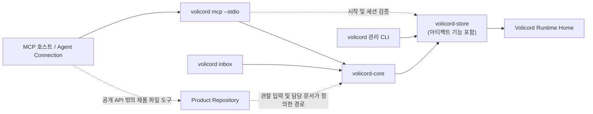

# 구현 아키텍처

이 문서는 로컬 Rust 워크스페이스를 위한 아키텍처 가이드의 상위 개요입니다.
가이드 수준의 운영 경로, 워크스페이스 형태, 의존 방향, 오래 유지될 구현 경계,
집중 세부 담당 문서로 가는 경로를 담당합니다.

이 문서는 소스 지도, 작업 흐름 추적, 테스트 전략, 변경 가이드, 제품 계약이
아닙니다. 학습 경로가 필요하면 [아키텍처 가이드](README.md)에서 시작합니다.
정확한 동작은 집중 [참조 색인](../reference/README.md)을 봅니다. 아래 표에서
구현 질문에 맞는 아키텍처 가이드 문서로 이동할 수 있습니다.

Volicord는 AI 지원 제품 작업을 위한 로컬 작업 권한 기록입니다. Core는 Volicord
상태를 위한 로컬 기준 기록입니다.

이 체크아웃은 이 저장소가 유지하는 Volicord 소스 저장소이자 Rust
워크스페이스입니다. 구현 크레이트, 테스트, 문서, 검증 도구, 저장소 설정을
담습니다. Volicord 설치는 배포된 실행 파일과 필요한 런타임 리소스의 부분집합이므로
이 워크스페이스 개요는 설치 매니페스트가 아닙니다.

직접 열 수 있는 코드와 테스트 경로는 저장소 루트 기준으로 씁니다.

## 운영 경로

아래 그림은 최초 릴리스의 세 진입 경로인 관리형 stdio MCP, 관리 CLI, CLI
받은 편지함 `User Channel`을 구분합니다. 실선은 주된 호출 또는 저장 방향을
나타냅니다. 점선은 검증, 관찰된 입력, 공개 메서드 실행 밖에서 일어나는 작업을
나타냅니다.

`volicord-mcp` 어댑터 라이브러리는 시작 검사, Agent Connection 맥락, binding 검증,
요청 시점 project routing을 위해 Store를 직접 사용할 수 있습니다.
이 직접 Store
사용은 공개 Volicord 메서드 의미를 구현하는 다른 경로가 아닙니다. 공개 메서드
실행은 Core를 통과합니다.

`Product Repository`는 별도의 제품 파일 경계로 남습니다. 공개 Volicord 메서드는
담당 문서가 정의한 호환성, 관찰, 판단, 증거, 아티팩트 링크를 기록합니다. 제품
파일 쓰기 자체는 공개 메서드 실행 경로 밖에서 Agent Connection, 로컬 도구, 또는
명시적인 관리 통합 경로가 수행합니다.

## 워크스페이스 형태

| 워크스페이스 멤버 | 가이드 수준 역할 |
|---|---|
| `crates/volicord-types` | 공유 요청, 응답, 스키마 형태, 값 집합, MCP 도구 이름, 식별자, 정규 해시, 호스트 기능 구현 타입과 내장 Codex 지원 카탈로그 parser, 외부 증거를 포함하지 않는 릴리스 증거 parser. |
| `crates/volicord-store` | 정규 SQLite 저장소, Runtime Home, 부트스트랩, 프로젝트 Store, 아티팩트 저장소, 검사, 변경 불가능한 호스트 검증 영수증, 내보내기 스냅샷, 저장소 오류 구현. |
| `crates/volicord-core` | 어댑터와 독립적인 Core 서비스, 공유 요청 파이프라인, 메서드 계획, 정책 점검, 응답 구성, Store 조율. |
| `crates/volicord-cli` | 설정, 프로젝트 등록, CLI 받은 편지함 명령, Codex Agent Connection 설치·검증·복구·제거, 관리형 stdio MCP 프로세스 인계를 위한 로컬 `volicord` 관리 바이너리와 재사용 명령 모듈. |
| `crates/volicord-platform-fs` | 플랫폼 고유 파일시스템 이름 공간 연산과 Store 소유자 검증 및 로컬 어댑터가 공유하는 읽기 전용 정규 Git common-directory/worktree snapshot을 위한 내부 안전 파사드. 관리 파일 정책이나 공개 제품 동작을 담당하지 않습니다. |
| `crates/volicord-mcp` | 시작 검증, 도구 목록, `tools/call` 디코딩과 디스패치, 관리형 표준 입출력 프레이밍, Core 호출을 위한 MCP 어댑터 라이브러리. |
| `crates/volicord-test-support` | 구현 테스트가 공유하는 폐기 가능한 Runtime Home과 Product Repository 설정, Store 검사, Core 요청 빌더, Agent Connection 설정, 기타 도우미. |
| `tests/conformance` | Core 쪽 API와 공유 픽스처를 통한 기준 범위 교차 메서드 시나리오. |
| `tests/integration` | MCP, Core, Store, Agent Connection 바인딩, 작업 범주, 공개 스키마 스냅샷을 가로지르는 테스트. |
| `tests/release-validation` | 기준 target 다섯 개/셀 여섯 개 릴리스 계약, 변경 불가능한 빌드 아티팩트와 게시 입력의 연속성 점검, 외부 릴리스 증거 경로, 공유 릴리스 시나리오, 카탈로그 교차 점검, 정확한 target/environment Codex 릴리스 셀. 운영 런타임 동작을 담당하지 않습니다. |
| `xtask` | 문서 검증을 위한 저장소 유지보수 도구. Volicord 런타임 아키텍처 밖에 있습니다. |

## 의존 경계

오래 유지될 의존 방향은 아래와 같습니다.

- `volicord-types`는 공유 타입 경계에 있으며 내부 제품 크레이트 의존성이 없습니다.
- `volicord-store`는 공유 타입과 저장된 소유자 경로 검증에 쓰는 읽기 전용 정규 Git
  layout primitive에 의존하고 지속 저장 메커니즘을 담당합니다. Core, CLI, MCP 어댑터
  크레이트에는 의존하지 않습니다.
- `volicord-core`는 Store와 공유 타입에 의존합니다. Core 쪽 코드는 CLI와 MCP
  어댑터 크레이트에서 독립적입니다.
- `volicord-cli`와 `volicord-mcp`는 어댑터 또는 로컬 오케스트레이션 계층입니다.
  각자의 설정, 시작 검증, 처리 경로, 호출 책임을 위해 Core, Store, 공유 타입에
  의존할 수 있습니다.
- `volicord-platform-fs`는 내부 제품 크레이트에 의존하지 않습니다. Store와 로컬
  어댑터는 플랫폼 고유 파일시스템 이름 공간 연산을 위해 이 크레이트의 안전
  파사드와 같은 읽기 전용 Git layout identity primitive를 사용할 수 있습니다.
  검증, 계획, 소유권, 권한 비교, 복구, 진단 책임은 각 호출자에게 남습니다.
- 테스트 지원 크레이트와 테스트 패키지는 폐기 가능한 픽스처와 계층 간 검증을
  위해서만 구현 크레이트를 조합합니다.
- `xtask`는 저장소 유지보수 도구로 격리되며 내부 제품 크레이트 의존성이 없습니다.

정확한 Cargo 의존 간선은 Cargo 매니페스트가 담당합니다. 정확한 소스 배치는 소스
지도가 담당합니다.

## 정규 릴리스 경계

경계 어댑터는 정확히 지원되는 외부 계약을 하나의 정규 내부 모델로 디코딩합니다.
Core와 Store는 외부 형식 버전, 호스트 설정 문법, 셸 문법, 생성 wrapper,
플랫폼 명령 문자열에 따라 분기하지 않습니다. Store는 매니페스트와 정규 SQL
digest가 현재 릴리스 계약과 일치하는 데이터베이스만 엽니다. Codex 어댑터는 관리
설정과 아티팩트 검증을 담당하고 타입이 지정된 검증 영수증을 Core에 제공합니다.

정확한 descriptor, 실패, 저장소, Agent Connection, 릴리스 셀 계약은
[외부 계약](../reference/external-contracts.md),
[실패 모델](../reference/failure-model.md),
[저장소 버전 관리](../reference/storage-versioning.md),
[Agent Connection](../reference/agent-connection.md),
[호스트 릴리스 증거](../reference/host-release-evidence.md)가 담당합니다.

## 오래 유지될 구현 경계

| 경계 | 개요 책임 | 세부 사항과 계약 경로 |
|---|---|---|
| Core와 어댑터 | Core는 어댑터와 독립적인 공개 메서드 처리를 담당합니다. CLI와 MCP 어댑터는 Core 주변의 프로세스, 설정, 전송, 처리 경로, 렌더링 경계를 담당합니다. Core는 어느 어댑터 계층에도 의존하지 않습니다. | [요청 생명주기](request-lifecycle.md), [구현 설계 패턴](design-patterns.md), [Core와 어댑터 의존 경계](decisions/core-adapter-boundary.md), [API 메서드](../reference/api/methods.md), [MCP 전송](../reference/mcp-transport.md), [관리 CLI](../reference/admin-cli.md). |
| Runtime Home과 Product Repository | `Volicord Runtime Home`은 저장소/런타임 담당 문서가 정의하는 Volicord 런타임 기록과 아티팩트 데이터를 담습니다. `Product Repository`는 사용자 제품 파일과 담당 문서가 허용하는 명시적 통합 파일을 담습니다. | [저장소와 트랜잭션](storage-and-transactions.md), [Runtime Home과 Product Repository 분리](decisions/runtime-home-and-product-repository.md), [런타임 경계](../reference/runtime-boundaries.md), [보안](../reference/security.md). |
| Store 커밋 경계 | Core 메서드 계획 코드는 읽기 전용, 효과 없음, dry-run, 스테이징, 커밋 분기를 고릅니다. Store는 정상 커밋된 Core 변이를 트랜잭션 경계에서 적용하고, 아티팩트 스테이징을 정상 Core 변이 커밋과 분리합니다. Core 권한 의미는 Core 담당 문서에, 정확한 저장소 기록과 효과는 저장소 담당 문서에 남습니다. | [저장소와 트랜잭션](storage-and-transactions.md), [요청 생명주기](request-lifecycle.md), [Core 모델](../reference/core-model.md), [저장소](../reference/storage.md), [저장 효과](../reference/storage-effects.md). |
| MCP 어댑터 경계 | `volicord mcp --stdio`가 공개 전송 진입 경로입니다. `volicord-mcp`는 Runtime Home과 Agent Connection 맥락을 해석하고, 시작 및 세션 정보를 검증합니다. 연결 모드에 맞는 도구를 노출하고 허용된 프로젝트를 선택합니다. `tools/call`을 디코딩하고 로컬 호출 정보를 도출한 뒤 Core를 호출하며, Core JSON을 MCP 콘텐츠로 감쌉니다. | [요청 생명주기](request-lifecycle.md), [소스 지도](source-map.md), [MCP 전송](../reference/mcp-transport.md), [Agent Connection](../reference/agent-connection.md). |
| 관리 CLI와 Codex 어댑터 | CLI는 Codex 설정 탐색, 관리형 binding 설치, 검증 영수증, 복구, 제거, 플랫폼 환경 검사, stdio MCP 실행을 담당합니다. Core는 Codex 설정이나 프로세스 문법을 이해하지 않고 타입이 지정된 영수증과 정규 binding identity만 소비합니다. | [CLI 작업 흐름](cli-workflows.md), [소스 지도](source-map.md), [관리 CLI](../reference/admin-cli.md), [Agent Connection](../reference/agent-connection.md), [보안](../reference/security.md). |
| Codex 릴리스 검증 | 공유 시나리오는 게시 target 다섯 개를 모두 포괄하는 서로 독립적인 target/environment 셀 여섯 개에서 실행됩니다. 각 셀은 정확한 target, Codex 아티팩트, 환경, capability 집합에 결속되며 누락된 셀은 다른 셀에서 추론하지 않고 미실행으로 남습니다. 운영 crate는 테스트 패키지 아티팩트를 런타임 신뢰 입력으로 사용하지 않습니다. | [호스트 릴리스 증거](../reference/host-release-evidence.md), [테스트 전략](testing-strategy.md), [검증](../maintain/validation.md). |
| 플랫폼 파일시스템 파사드 | `volicord-platform-fs`는 플랫폼 고유 이름 공간 기본 연산과 정규 읽기 전용 Git common-directory/worktree 탐색을 안전한 Rust 결과 뒤에 격리합니다. 이 primitive를 공유해 저장된 소유자 검증, integration 배치, Core 호출 binding이 같은 worktree 정의를 사용합니다. 어떤 파일을 관리하는지, 교체나 쓰기가 승인되었는지, 연산 후 상태가 유효한지, 복구와 진단이 무엇을 뜻하는지는 결정하지 않습니다. 그 책임은 Store, 호출하는 adapter, Core, 집중 Reference 담당 문서에 남습니다. | [소스 지도](source-map.md), [CLI 작업 흐름](cli-workflows.md), [관리 CLI](../reference/admin-cli.md), [런타임 경계](../reference/runtime-boundaries.md), [시스템 요구사항](../reference/system-requirements.md). |
| 테스트와 검증 | 구현 테스트는 담당 문서가 정의한 사실을 적절한 계층에서 검증합니다. 테스트, 픽스처, 생성 스냅샷, 문서 점검은 제품 계약 담당 문서가 되지 않습니다. | [테스트 전략](testing-strategy.md), [검증](../maintain/validation.md). |

## 세부 경로

| 필요 | 경로 |
|---|---|
| 정확한 소스 경로, 모듈 책임, CLI 하위 모듈 경계, 어댑터 모듈, 테스트 지원 경로 | [소스 지도](source-map.md) |
| 크레이트, 진입 심볼, 구현 흐름을 처음 읽는 순서 | [코드베이스 둘러보기](codebase-tour.md) |
| 설정, 연결 프로비저닝, 상태 조회, 검증, doctor, guard, 호스트 및 guard 통합의 실행 흐름 경계 | [CLI 작업 흐름](cli-workflows.md) |
| 대표 MCP/Core 요청 흐름, 분기 차이, 메서드 추적, Store 상호작용, 응답 래핑 | [요청 생명주기](request-lifecycle.md) |
| Store 트랜잭션, 효과 경로, 재실행, 아티팩트 스테이징, 커밋 경계, 실패 경계 | [저장소와 트랜잭션](storage-and-transactions.md) |
| 테스트 계층 선택, 픽스처, 생성 출력 변경 점검, 오래 유지될 테스트, 검증 책임 | [테스트 전략](testing-strategy.md) |
| 변경 분류, 담당 경로 지정, 소스 경로 지정, 검증 명령 선택 | [구현 가이드](change-guide.md) |
| 오래 유지될 아키텍처 근거, 결과, 비목표, 구현 영역, 테스트, 담당 경로 | [아키텍처 결정](decisions/README.md) |

## 결정 경로

집중 결정의 결과와 비목표는 결정 기록에 있습니다.

| 경계 | 집중 결정 |
|---|---|
| Agent Connection, 호스트 처리 경로, 명시적 Connection Project 멤버십 | [Agent Connection과 호스트 라우팅](decisions/agent-connection-routing.md) |
| 외부 정확한 최종 아티팩트 호스트 릴리스 게이트와 독립 audit | [외부 호스트 릴리스 증거 게이트](decisions/host-release-evidence-gate.md) |
| Core가 MCP와 CLI 어댑터에서 독립적임 | [Core와 어댑터 의존 경계](decisions/core-adapter-boundary.md) |
| 정상 커밋된 Store 변이 전 메서드 계획 | [원자적 변이 커밋 전 계획](decisions/plan-and-atomic-commit.md) |
| 런타임 데이터와 제품 파일 분리 | [Runtime Home과 Product Repository 분리](decisions/runtime-home-and-product-repository.md) |
