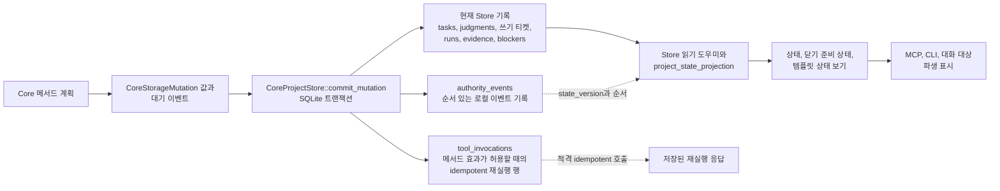

# 저장소와 트랜잭션

이 가이드는 현재 구현에서 Runtime Home 저장소, 프로젝트 Store 접근,
메서드 계획, 저장소 변이 값, 원자적 커밋, 재실행 기록, 아티팩트가 어떻게
분리되는지 설명합니다. 이 문서는 저장소 계약이 아닙니다. 정확한 저장
효과, 기록 의미, DDL, 아티팩트 생명주기 규칙, 버전 관리 동작은 저장소
참조 담당 문서가 맡습니다.

정확한 동작이 필요하면 저장소 담당 문서 묶음의 시작점인
[저장소](../reference/storage.md), 메서드 분기 효과를 다루는
[저장 효과](../reference/storage-effects.md), [저장소 기록](../reference/storage-records.md),
[저장소 DDL](../reference/storage-ddl.md), [아티팩트 저장소](../reference/storage-artifacts.md),
[저장소 버전 관리](../reference/storage-versioning.md)를 사용합니다.

## 저장소 형태

`Volicord Runtime Home`은 Volicord 소유 기록과 아티팩트 데이터를 위한 로컬
런타임 데이터 위치입니다. `Product Repository`는 사용자의 제품 파일 작업
공간입니다. 구현은 이 위치를 분리합니다.

- Runtime Home 경로 처리는
  [`crates/volicord-store/src/runtime_home.rs`](../../../crates/volicord-store/src/runtime_home.rs)에
  있습니다.
- registry와 프로젝트 부트스트랩은
  [`crates/volicord-store/src/bootstrap.rs`](../../../crates/volicord-store/src/bootstrap.rs)에
  있습니다.
- SQLite 열기, 검증, 트랜잭션 도우미는
  [`crates/volicord-store/src/sqlite.rs`](../../../crates/volicord-store/src/sqlite.rs)에
  있습니다.
- canonical schema SQL과 초기화 도우미는
  [`crates/volicord-store/src/schema.rs`](../../../crates/volicord-store/src/schema.rs)와
  [`crates/volicord-store/src/schema/`](../../../crates/volicord-store/src/schema/)에 있습니다.
- 프로젝트 로컬 Core Store 접근은
  [`crates/volicord-store/src/core_pipeline.rs`](../../../crates/volicord-store/src/core_pipeline.rs)의
  `CoreProjectStore`에서 시작합니다. 열기 처리는
  [`core_pipeline/open.rs`](../../../crates/volicord-store/src/core_pipeline/open.rs),
  재실행 조회는
  [`core_pipeline/replay.rs`](../../../crates/volicord-store/src/core_pipeline/replay.rs),
  원자적 커밋 트랜잭션은
  [`core_pipeline/commit.rs`](../../../crates/volicord-store/src/core_pipeline/commit.rs),
  변이 작성기는
  [`core_pipeline/mutation_apply.rs`](../../../crates/volicord-store/src/core_pipeline/mutation_apply.rs),
  공유 지속 값 검증은
  [`core_pipeline/validation.rs`](../../../crates/volicord-store/src/core_pipeline/validation.rs)에
  있습니다.
- 아티팩트 스테이징과 영구 아티팩트 본문 검증은
  [`crates/volicord-store/src/artifacts.rs`](../../../crates/volicord-store/src/artifacts.rs)에
  있습니다.

registry 데이터베이스는 Runtime Home 수준 등록을 추적합니다. 프로젝트
데이터베이스는 프로젝트 로컬 상태를 담습니다. 이 페이지는 테이블 배치나
컬럼 정의를 다시 쓰지 않습니다. 그런 세부사항은 저장소 참조 담당 문서를
사용합니다.

## Store, 이벤트, 상태 보기

이 구현 지도는 메서드 계획이 현재 Store 기록, 이벤트, 재실행 행, 읽기 시점의 상태
보기로 이어지는 방식을 보여 줍니다. 실선 화살표는 구현 안의 일반 데이터 흐름입니다.
점선 화살표는 순서나 재실행 관계를 보여 줍니다. 이 그림은 저장소 계약, 상태 보기 권한
계약, 테이블 관계도가 아닙니다. 정확한 의미는 [저장소 기록](../reference/storage-records.md),
[저장 효과](../reference/storage-effects.md), [저장소 버전 관리](../reference/storage-versioning.md),
[상태 보기와 템플릿 표시 경계](../reference/projection-and-templates.md)가 담당합니다.

현재 Store 기록은 일반 읽기의 출처입니다. `authority_events`는 커밋된 Core 변이 순서와
로컬 이벤트 사실을 보존합니다. `tool_invocations`는 저장 효과가 그 재실행을 정의하는
메서드 분기에 대해서만 idempotent 재실행을 지원합니다. 읽기 시점 상태 보기와 렌더링된
표시는 호출자가 상태를 보는 데 도움을 주지만, 표시만으로 권한, 쓰기 티켓, 증거, 수락,
닫기 준비 상태를 만들지 않습니다.

## 부트스트랩과 스키마 경계

관리 설정은 공개 메서드 실행이 가능해지기 전에 Store 부트스트랩과 검사
경로를 사용합니다.

1. `volicord-cli`는
   [`crates/volicord-cli/src/connection_command.rs`](../../../crates/volicord-cli/src/connection_command.rs)와
   [`crates/volicord-cli/src/registration.rs`](../../../crates/volicord-cli/src/registration.rs)의
   등록 메타데이터 도우미를 통해 관리 설정을 계획합니다.
2. Store 부트스트랩과 Agent Connection 등록 도우미는
   `initialize_runtime_home`, `register_project`, `ensure_agent_connection`,
   `add_connection_project`로 Runtime Home 메타데이터를 초기화하고 프로젝트와
   Agent Connection 관계를 등록합니다.
3. 빈 registry/project 상태 데이터베이스는 canonical SQL에서 초기화하고,
   기존 상태는 SQLite 도우미가 현재 스키마 형태와 저장소 프로필을 검증한 뒤에만 엽니다.
4. 이후 공개 메서드 호출은 CLI 설정 코드를 거치지 않고
   `CoreProjectStore::open`으로 프로젝트를 엽니다.

이 구조는 로컬 관리 준비와 Core 메서드 의미를 분리합니다. 정확한 CLI
동작은 [관리 CLI](../reference/admin-cli.md)가 담당합니다.

## 읽기와 계획 흐름

정상 공개 메서드 실행은 지속 효과 전에 두 구현 단계를 거칩니다.

1. [`crates/volicord-core/src/pipeline.rs`](../../../crates/volicord-core/src/pipeline.rs)의
   공유 Core 사전 점검이 요청 래퍼, 어댑터 바인딩, 커밋 효과 요청 래퍼
   요구사항, 요청 해시, 프로젝트 상태, 검증된 연결 맥락, 재실행 가능성,
   Task 요구사항, 최신성, operation category을 검증합니다.
2. [`crates/volicord-core/src/methods/`](../../../crates/volicord-core/src/methods/)의
   메서드 모듈이 메서드별 계획을 수행하고 `OwnerPipelineBranch`를
   반환합니다.

읽기 전용 메서드와 dry-run은 Core 변이 커밋 없이 반환할 수 있습니다.
커밋 분기는 결과 필드, 이벤트 데이터, `CoreStorageMutation` 값 목록을
제공합니다.

## 변이 값

`CoreStorageMutation`은 메서드 계획과 Store 지속 처리 사이의 명령값처럼
기능합니다. 메서드 계획 코드는 `InsertTask`, `InsertWriteTicket`,
`InsertRun`, `PromoteStagedArtifact`, `LinkArtifact`, 판단 업데이트 같은 값을
만듭니다. Store는 활성 커밋 트랜잭션 안에서 `ProjectMutation`을 통해 그
값을 적용합니다.

이 구조는 구현을 명확히 나눕니다.

- Core 메서드 계획 코드는 메서드별 의도 효과를 결정합니다.
- Store는 그 의도 효과를 프로젝트 로컬 저장소에 적용하는 방법을
  결정합니다.
- 참조 담당 문서는 그 효과의 정확한 제품 의미를 결정합니다.

## 커밋 입력과 원자적 커밋

정상 커밋된 Core 변이에서 Core는 프로젝트 ID, 메서드 이름, 선택적
idempotency key, 정규 요청 해시, 검증된 재실행 맥락, 선택적 예상 상태
버전, 대기 중인 이벤트로 `CommitMutationInput`을 만듭니다.

[`core_pipeline/commit.rs`](../../../crates/volicord-store/src/core_pipeline/commit.rs)의
`CoreProjectStore::commit_mutation`은 원자적 Store 경계입니다. 이 함수는
아래 순서를 수행합니다.

1. 커밋 입력과 대기 중인 이벤트를 검증합니다.
2. 즉시 SQLite 트랜잭션을 시작합니다.
3. 트랜잭션 안에서 현재 프로젝트 상태를 읽습니다.
4. 새 변이를 적용하기 전에 적격 재실행, 재실행 맥락 불일치,
   idempotency 충돌, 오래된 예상 상태 결과를 처리합니다.
5. 새 커밋 변이에 대해 `project_state.state_version`을 전진시킵니다.
6. 메서드가 제공한 `CoreStorageMutation` 값을 `ProjectMutation`으로
   적용합니다.
7. 권한 이벤트를 추가합니다.
8. 응답 JSON을 만들고 검증합니다.
9. 커밋 호출에 idempotency가 있으면 재실행 기록 행을 저장합니다.
10. 트랜잭션을 커밋하거나 오류 시 전체 시도를 롤백합니다.

이 경계를 보호하는 구현 테스트에는
[`crates/volicord-store/src/core_pipeline.rs`](../../../crates/volicord-store/src/core_pipeline.rs)의
`transaction_replay_returns_stored_response_before_stale_expected_state`,
`transaction_replay_hash_conflict_rejects_without_effect`,
`transaction_replay_context_mismatch_precedes_request_hash_conflict`와
[`crates/volicord-core/src/pipeline.rs`](../../../crates/volicord-core/src/pipeline.rs)의
Core 파이프라인 테스트가 있습니다.

## 상태 버전과 재실행

정상 커밋 경로는 새로 커밋되는 Core 변이에 대해 프로젝트 상태를 한 번
전진시키고, 그 결과 state version을 가진 해당 `authority_events` 행이나
담당 문서가 정의한 이벤트 배치를 저장합니다. 재실행은 적격 idempotency
호출에 대해 또 다른 변이를 적용하지 않고 저장된 원래 응답을 반환합니다.

재실행에 쓰는 요청 해시는 타입 지정 요청 디코딩 뒤
[`crates/volicord-types/src/canonical.rs`](../../../crates/volicord-types/src/canonical.rs)의
`canonical_request_hash`에서 나옵니다. 이 방식은 JSON 속성 순서와 포맷에
흔들리지 않는 비교를 지원하면서 의미 차이는 보존합니다.

정확한 상태 버전과 재실행 동작은 [저장소 버전 관리](../reference/storage-versioning.md),
[API 오류](../reference/api/errors.md), 관련 메서드 담당 문서로 보냅니다.

## 아티팩트 경계

아티팩트 스테이징은 일반 Core 변이 커밋 경로와 의도적으로 분리되어
있습니다.

- `CoreService::stage_artifact`는 메서드 사전 점검을 사용한 뒤
  `CoreProjectStore::create_artifact_staging`을 호출합니다.
- `create_artifact_staging`은 일시적 스테이징 핸들 행과 안전한 스테이징
  바이트를 만듭니다.
- 이 경로는 `CoreProjectStore::commit_mutation`을 사용하지 않고,
  `project_state.state_version`을 증가시키지 않으며, `authority_events`나
  재실행 기록 행을 만들지 않고, 영구 `artifacts` 행도 삽입하지 않습니다.

영구 아티팩트 승격은 적용되는 담당 문서가 허용하는 경우 `record_run` 같은
메서드 계획 Core 변이를 통해 일어납니다.

관련 테스트에는
[`crates/volicord-core/src/methods/tests/mod.rs`](../../../crates/volicord-core/src/methods/tests/mod.rs)의
`stage_artifact_creates_transient_handle_without_core_commit`,
`stage_artifact_dry_run_creates_no_handle_or_storage`,
`record_run_promotes_staged_artifact_and_updates_evidence`, 그리고
[`tests/conformance/baseline.rs`](../../../tests/conformance/baseline.rs)의
`artifact_lifecycle_promotes_valid_handles_and_rolls_back_invalid_ones`가 있습니다.

## 실패 경계

구현은 효과 경로별로 실패 경계를 나눕니다.

- 사전 점검과 검증 거부는 Core 커밋 없이 반환합니다.
- 읽기 전용, 효과 없음, dry-run 분기는 `CoreProjectStore::commit_mutation`을
  호출하지 않습니다.
- Store 커밋 결과는 committed, replayed, replay-context mismatch,
  idempotency conflict, stale expected-state 사례를 구분합니다.
- Store 트랜잭션 중 오류가 나면 커밋 시도 전체를 롤백합니다.
- 아티팩트 스테이징에는 별도의 트랜잭션과 파일 정리 경계가 있습니다.
- 직접 Product Repository 파일 쓰기는 공개 Volicord API 경로 밖에 있습니다.

이 내용은 구현 경계이며 수락, 보안, 닫기 준비 상태 주장이 아닙니다.
정확한 메서드 효과는 메서드 담당 문서와 [저장 효과](../reference/storage-effects.md)로
보냅니다.
