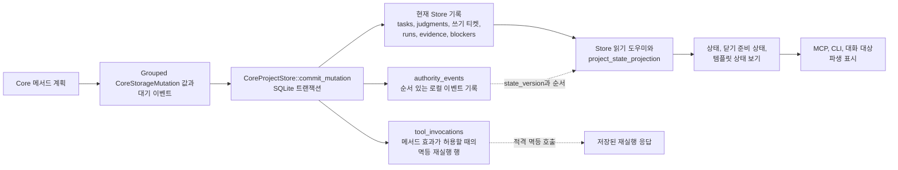

# 저장소와 트랜잭션

이 가이드는 현재 구현에서 Runtime Home 저장소, 프로젝트 Store 접근,
메서드 계획, 저장소 변이 값, 원자적 커밋, 재실행 기록, 아티팩트가 어떻게
분리되는지 설명합니다. 이 문서는 저장소 계약이 아닙니다. 정확한 저장
효과, 기록 의미, DDL, 아티팩트 생명주기 규칙, 버전 관리 동작은 저장소
참조 담당 문서가 맡습니다.

정확한 동작이 필요하면 저장소 담당 문서 묶음의 시작점인
[저장소](../reference/storage.md), 메서드 분기 효과를 다루는
[저장 효과](../reference/storage-effects.md), [저장소 기록](../reference/storage-records.md),
[저장소 DDL](../reference/storage-ddl.md), [아티팩트 저장소](../reference/storage-artifacts.md),
[저장소 버전 관리](../reference/storage-versioning.md)를 사용합니다.

## 저장소 형태

`Volicord Runtime Home`은 Volicord 소유 기록과 아티팩트 데이터를 위한 로컬
런타임 데이터 위치입니다. `Product Repository`는 사용자의 제품 파일 작업
공간입니다. 구현은 이 위치를 분리합니다.

- Runtime Home 경로 처리는
  [`crates/volicord-store/src/runtime_home.rs`](../../../crates/volicord-store/src/runtime_home.rs)에
  있습니다.
- 레지스트리와 프로젝트 부트스트랩은
  [`crates/volicord-store/src/bootstrap.rs`](../../../crates/volicord-store/src/bootstrap.rs)에
  있습니다.
- SQLite 열기, 검증, 트랜잭션 도우미는
  [`crates/volicord-store/src/sqlite.rs`](../../../crates/volicord-store/src/sqlite.rs)에
  있습니다.
- 기준 스키마 SQL과 초기화 도우미는
  [`crates/volicord-store/src/schema.rs`](../../../crates/volicord-store/src/schema.rs)와
  [`crates/volicord-store/src/schema/`](../../../crates/volicord-store/src/schema/)에 있습니다.
- 프로젝트 로컬 Core Store 접근은
  [`crates/volicord-store/src/core_pipeline/`](../../../crates/volicord-store/src/core_pipeline/)에서
  시작합니다. `CoreProjectStore`는 프로젝트 데이터베이스 facade로 유지됩니다.
  Connection과 프로젝트 identity는
  [`facade.rs`](../../../crates/volicord-store/src/core_pipeline/facade.rs)가 담당하고,
  읽기 전용 및 변경 가능 진입점은
  [`open.rs`](../../../crates/volicord-store/src/core_pipeline/open.rs)가 담당합니다.
  각 aggregate 모듈은 자신의 grouped mutation type, 저장 표현 검증과 적용 SQL,
  필요할 때의 typed 적용 사실, 읽기 projection, row 및 JSON decoding, facade
  메서드, 집중 테스트를 소유합니다.
- 아티팩트 스테이징과 영속 아티팩트 본문 검증은
  [`crates/volicord-store/src/artifacts.rs`](../../../crates/volicord-store/src/artifacts.rs)에
  있습니다.

레지스트리 데이터베이스는 Runtime Home 수준 등록을 추적합니다. 프로젝트
데이터베이스는 프로젝트 로컬 상태를 담습니다. 이 페이지는 테이블 배치나
컬럼 정의를 다시 쓰지 않습니다. 그런 세부사항은 저장소 참조 담당 문서를
사용합니다.

### 프로젝트 Store 모듈 소유권

Facade는 두 번째 Store 추상화를 추가하지 않고 inherent `CoreProjectStore`
메서드를 각 모듈에 분산합니다.

| 모듈 | 현재 구현 소유권 |
|---|---|
| `facade.rs`, `open.rs` | 프로젝트 데이터베이스 handle, 유지되는 Runtime Home 및 프로젝트 identity, 읽기 snapshot, 읽기 전용 또는 변경 가능 열기. |
| `project_state.rs`, `enforcement_profile.rs`, `clock.rs` | 프로젝트 header와 enforcement profile 읽기, 엄격한 저장 값 decoding, 프로젝트 UTC floor. |
| `tasks.rs` | Task 및 수락 mutation 입력과 SQL, Task row, 수락 기준, 증거 주장, Task revision. |
| `change_units.rs`, `write_tickets.rs`, `runs.rs` | Typed Change Unit, Write Ticket, Run mutation 입력과 SQL, 비공개 물리 row, 폐쇄형 값·JSON·timestamp·Product Repository 경로를 엄격하게 decode한 typed 읽기와 Run observed-change projection. `write_tickets.rs`만 물리 Write Ticket을 담당하며 일반 읽기와 transaction 범위 읽기에서 정규 row projection, decoder, 영속 불변 조건 validator 하나를 공유합니다. |
| `evidence.rs`, `artifacts.rs` | 증거 및 artifact mutation 입력과 SQL, 증거 요약과 관찰 읽기, artifact staging record, 영속 artifact record, artifact link, 읽기 시 artifact 본문 검증. |
| `user_actions.rs`, `continuity.rs` | User Action 및 continuity mutation 입력과 SQL, 물리 JSON 및 저장 scalar를 typed 요청·해결 레코드로 엄격하게 decoding하는 읽기, 유효 상태 읽기, 프로젝트 continuity row와 한도 있는 page. |
| `replay.rs` | 비공개 tool invocation row, typed identity와 replay context의 엄격한 decoding, 변경 불가능한 operation-result projection, Core 소유 의미 replay를 위해 유지하는 정확한 메서드 응답 byte. |
| `reconciliation.rs`, `blockers.rs`, `events.rs`, `agent_sessions.rs` | 엄격하게 decode한 typed 제품 쓰기 관찰 후보와 경로, 활성 blocker reference, event identity 조회, 프로젝트 로컬 Agent Session 진입점. |
| `record_refs.rs`, `inspection.rs` | 공유 저장 record reference와 검증 경로에서 사용하는 무효과 저장소 counter. |
| `mutations.rs` | 각 최상위 mutation group에서 aggregate 담당 모듈로 이어지는 얇은 정적 dispatch와 transaction 범위 적용 context. |
| `commit.rs` | Aggregate 간 transaction 조율: replay 및 최신성 gate, 순서 있는 위임, 정규 state-version 전진 한 번, event와 replay 영속화, 응답 구성, commit 또는 rollback. |
| `validation.rs` | 현재 Store 담당 모듈이 공유하는 저장 값 및 mutation 입력 검증. |

프로젝트 workflow policy record 읽기와 쓰기는
[`workflow_records.rs`](../../../crates/volicord-store/src/workflow_records.rs)에
남아 있습니다. 이 담당 모듈은 물리 policy row를 비공개로 유지하고 현재 schema,
폐쇄형 값, 정규 byte, fingerprint, source, timestamp를 검증한 뒤 typed policy
record를 반환합니다.
Policy mutation이 활성 Write Ticket binding을 평가할 때
`workflow_records.rs`는 Write Ticket aggregate가 만든 집중된 typed authority
view를 받습니다. Ticket 테이블을 query하거나 ticket JSON을 parse하지 않으며,
검증된 view에 현재 workflow policy 의미만 적용합니다.
일시적 artifact staging과 영속 artifact 본문 경로 연산은
[`artifacts.rs`](../../../crates/volicord-store/src/artifacts.rs)가 계속 담당하고,
프로젝트 facade의 artifact 읽기 쪽은 `core_pipeline/artifacts.rs`가 담당합니다.

## Store, 이벤트, 상태 보기

이 구현 지도는 메서드 계획이 현재 Store 기록, 이벤트, 재실행 행, 읽기 시점의 상태
보기로 이어지는 방식을 보여 줍니다. 실선 화살표는 구현 안의 일반 데이터 흐름입니다.
점선 화살표는 순서나 재실행 관계를 보여 줍니다. 이 그림은 저장소 계약, 상태 보기 권한
계약, 테이블 관계도가 아닙니다. 정확한 의미는 [저장소 기록](../reference/storage-records.md),
[저장 효과](../reference/storage-effects.md), [저장소 버전 관리](../reference/storage-versioning.md),
[상태 보기와 템플릿 표시 경계](../reference/projection-and-templates.md)가 담당합니다.

현재 Store 기록은 일반 읽기의 출처입니다. `authority_events`는 커밋된 Core 변이 순서와
로컬 이벤트 사실을 보존합니다. `tool_invocations`는 저장 효과가 그 재실행을 정의하는
메서드 분기에 대해서만 멱등 재실행을 지원합니다. 읽기 시점 상태 보기와 화면에 표시된
내용은 호출자가 상태를 보는 데 도움을 주지만, 표시만으로 권한, 쓰기 티켓, 증거, 수락,
닫기 준비 상태를 만들지 않습니다.

## 부트스트랩과 스키마 경계

관리 설정은 공개 메서드 실행이 가능해지기 전에 Store 부트스트랩과 검사
경로를 사용합니다.

1. `volicord-cli`는
   [`crates/volicord-cli/src/connection_command.rs`](../../../crates/volicord-cli/src/connection_command.rs)와
   [`crates/volicord-cli/src/connection_command/service.rs`](../../../crates/volicord-cli/src/connection_command/service.rs)를
   통해 연결 구성을 계획합니다.
2. Store 부트스트랩은 Runtime Home 메타데이터를 초기화하고 프로젝트를
   등록하며, Agent Connection Store 도우미는 연결 기록과 Connection Project
   멤버십을 만듭니다.
3. 빈 레지스트리와 프로젝트 상태 데이터베이스는 기준 SQL에서 초기화하고,
   기존 상태는 SQLite 도우미가 현재 스키마 형태와 저장소 프로필을 검증한 뒤에만 엽니다.
4. 이후 공개 메서드 읽기는 `CoreProjectStore::open_read_only`를 사용하고, 커밋
   경로는 caller가 유지하는 활성 `RuntimeHomeMutationContext`와 함께
   `CoreProjectStore::open_for_mutation`을 사용합니다.

이 구조는 로컬 관리 준비와 Core 메서드 의미를 분리합니다. 정확한 CLI
동작은 [관리 CLI](../reference/admin-cli.md)가 담당합니다.

모든 일반 Runtime Home writer는 변경에 의존하는 읽기 전에 `SharedWriter`를 획득하고
빌린 permit에서 target에 결합된 Store context 하나를 만듭니다. 쓰기 가능 Registry와
project database helper는 Store 내부 전용이며 그 context를 요구합니다. Setup은
대신 하나의 `ExclusiveSetup` permit에서 context를 만들고 중첩 획득 없이 bootstrap,
checkpoint, publication 확인, rollback에 전달합니다. 충돌하면 transaction, artifact
staging, observation 효과 전에 `runtime_home.mutation.setup_in_progress`를 반환합니다.

Core 구성도 이 경계를 따릅니다. `CoreService::for_read_only(path)`는 읽기 전용 경로
binding을 유지하고, `CoreService::for_mutation(context)`는 별도 경로를 받지 않은 채
context의 `CanonicalRuntimeHomePath`를 유지합니다.
`CoreProjectStore::open_for_mutation(context, project_id)`도 같은 typed identity를
유지합니다. 변경 권한 검사는 유지된 Core와 Store identity를 직접 비교하며 읽기 전용과
승인된 binding의 혼용 또는 다른 Runtime Home을 거부합니다. 어느 경로도 다시
canonicalize하지 않습니다. 승인된 Registry와 setup helper도 두 번째 경로를 받지 않고
context에서 Runtime Home을 파생합니다.

새 프로젝트에서 bootstrap은 SQLite 현재 UTC로 `project_state.created_at`과
`project_state.updated_at`을 초기화합니다. 기존 프로젝트를 다시 등록하면 정확한
`updated_at` 정규 시계 하한을 검증하고 보존하며 등록 upsert는 담당 문서가 허용한 등록
데이터만 바꿉니다. 기존 하한의 형식이 잘못되면 쓰기 전에 실패하고, 올바른 미래 시각
하한을 실시간 또는 호스트 시각으로 초기화하지 않습니다.

## 읽기와 계획 흐름

정상 공개 메서드 실행은 영속 효과 전에 두 구현 단계를 거칩니다.

1. [`crates/volicord-core/src/pipeline.rs`](../../../crates/volicord-core/src/pipeline.rs)의
   공유 Core 사전 점검이 요청 래퍼, 어댑터 바인딩, 커밋 효과 요청 래퍼
   요구사항, 요청 해시, 프로젝트 상태, 검증된 연결 맥락, 재실행 가능성,
   Task 요구사항, 최신성, `operation_category`를 검증합니다.
2. [`crates/volicord-core/src/methods/`](../../../crates/volicord-core/src/methods/)의
   메서드 모듈이 요청별 분기와 응답을 조율합니다.
   [`identity.rs`](../../../crates/volicord-core/src/identity.rs),
   [`artifact.rs`](../../../crates/volicord-core/src/artifact.rs),
   [`continuity/`](../../../crates/volicord-core/src/continuity/),
   [`write_ticket/`](../../../crates/volicord-core/src/write_ticket/),
   [`close_readiness/`](../../../crates/volicord-core/src/close_readiness/) 같은
   집중 Core 담당자가 typed fact에 대한 재사용 가능한 의미 계획을 수행합니다.
   그 뒤 메서드가 `OwnerPipelineBranch`를 반환합니다.

의미 담당자는 공개 메서드 응답을 구성하거나 Store 실패를 매핑하지 않습니다.
[`method_execution.rs`](../../../crates/volicord-core/src/method_execution.rs)는 공유
실행 메커니즘을 담당하고,
[`error_boundary/`](../../../crates/volicord-core/src/error_boundary/) 아래의 집중
모듈은 메서드 응답 경계에서 typed Store 또는 의미 담당자 실패를 변환합니다.

공통 preflight 뒤 계획까지 진행하는 요청은 프로젝트 범위 정규 Core UTC 시계에서
`operation_now`를 정확히 하나 얻습니다. `SystemClock`에서 Store는 SQLite 실시간 UTC,
영속 `project_state.updated_at`, Store handle이 이미 받아들인 더 늦은 샘플 중 최댓값으로
이 시계를 샘플링합니다. 메서드 계획은 모든 현재 시각 판단과 의미 있는 동작 timestamp에
`operation_now`를 다시 사용합니다.

`SystemClock`은 SQLite에서 실시간 후보를 얻습니다. 주입 Clock은 이 후보를 대신할 수
있지만 `CoreService` 경계는 계속 영속 하한 및 같은 handle 샘플과의 최댓값을 취합니다.
이 합성은 저장 담당 timestamp를 다시 쓰지 않습니다. 미래 시각 행은 해당 담당자가 그
값을 invalid로 정의한 경우에만 닫힌 상태로 실패합니다. TTL 파생은 분기가 커밋될 수
있기 전에 checked 덧셈과 정규 RFC 3339 UTC 표현 가능성을 사용합니다. 같은 구성 후보
선택을 커밋에도 적용합니다. `SystemClock`은 transaction 안에서 SQLite 현재 UTC를
샘플링하고, 주입 Clock은 이 SQLite 후보에 더하는 것이 아니라 그 후보를 대신해 자신의
실시간 후보를 제공합니다. 정확한 선택은
[저장소 버전 관리](../reference/storage-versioning.md#canonical-core-utc-clock)가 담당합니다.

읽기 전용 메서드와 `dry-run` 미리보기는 Core 변이 커밋 없이 반환할 수 있습니다.
`OwnerPipelineBranch<F>`는 읽기 전용, 효과 없음, dry-run, 커밋 분기를 선택하는 동안
typed 메서드 필드 담당 타입을 유지합니다. 커밋 분기는 이벤트 데이터와
`CoreStorageMutation` 값 목록도 제공합니다. 파이프라인은 분기의 공통 결과 사실이
확정된 뒤에만 `F`에서 완전한 메서드 결과를 구성합니다.

## 효과 경로 경계 요약

이 문서는 효과 경로에 대한 구현 수준 Store 경계를 담당합니다. 정확한 메서드 결과와
공개 저장 효과 계약은 메서드 담당 문서와 [저장 효과](../reference/storage-effects.md)에
남습니다.

| 효과 경로 | Store 경계 |
|---|---|
| 계획 또는 커밋 전 거부 | `CoreProjectStore::commit_mutation`을 호출하지 않고 반환합니다. Core 변이를 위한 Store 트랜잭션은 시작하지 않고 더 늦은 시계 하한도 영속화하지 않습니다. |
| 읽기 전용 결과 | Store 읽기를 사용하고 Core 변이 커밋 없이 반환합니다. 현재 프로젝트 시각 샘플은 읽었다는 이유만으로 영속화하지 않습니다. |
| 효과 없음 결과 | 정상 Core 변이 커밋 경로를 호출하거나 영속 하한을 전진시키지 않고 유효한 메서드 결과를 반환합니다. |
| `dry-run` 미리보기 | 생성된 영속 참조, 권한 이벤트, 재실행 행, 스테이징 핸들, 아티팩트, 상태 버전 변경, 더 늦은 시계 하한을 저장하지 않고 미리보기 데이터를 만듭니다. |
| 정상 커밋된 Core 변이 | `CoreProjectStore::commit_mutation`을 실행하며, 이 함수는 메서드가 제공한 `CoreStorageMutation` 값과 대기 이벤트를 정규 커밋 timestamp 하나로 한 transaction 안에서 적용합니다. |
| 일시적 아티팩트 스테이징 | 정상 Core 변이 커밋 경로 대신 아티팩트 스테이징 도우미를 사용합니다. 자체 transaction에서 `state_version` 변경 없이 프로젝트 시각 하한을 staging `created_at` 이상으로 전진시킵니다. |
| 등록된 evidence-capture fulfillment | Receipt, 일시적 staging, source claim을 함께 만들고 하한을 receipt `created_at` 이상으로 전진시킵니다. Core event, replay 행, state-version 증가는 없습니다. |
| 로컬 User Channel token 발급 | 요청 결속 token을 삽입하고 하한을 token `created_at` 이상으로 전진시킵니다. Core event, replay 행, state-version 증가는 없습니다. |

## 변이 값

`CoreStorageMutation`은 메서드 계획과 Store 저장 처리 사이의 명령값처럼
기능합니다. 최상위 variant는 Task와 수락, Change Unit, Write Ticket, Run,
증거, artifact, User Action, continuity, workflow policy mutation을 묶습니다.
각 group은 입력, 저장 표현 검증, SQL 적용, commit 조율에 필요한 typed 결과
사실을 정의하는 aggregate 담당 모듈의 정적 enum입니다. `mutations.rs`는 활성
transaction 안에서 순서 있는 목록을 각 담당 모듈에 위임합니다.

이 구조는 구현을 명확히 나눕니다.

- Core 메서드 계획 코드는 메서드별 의도 효과를 결정합니다.
- Store는 그 의도 효과를 프로젝트 로컬 저장소에 적용하는 방법을
  결정합니다.
- 참조 담당 문서는 그 효과의 정확한 제품 의미를 결정합니다.

## 커밋 입력과 원자적 커밋

정상 커밋된 Core 변이에서 Core는 프로젝트 ID, 메서드 이름, 선택적
멱등성 키, 정규화된 요청 해시, 검증된 재실행 맥락, 선택적 예상 상태
버전, 대기 중인 이벤트, 커밋 시계 하한인 준비된 `operation_now`로
`CommitMutationInput`을 만듭니다.

[`core_pipeline/commit.rs`](../../../crates/volicord-store/src/core_pipeline/commit.rs)의
`CoreProjectStore::commit_mutation`은 원자적 Store 경계입니다. 이 함수는
아래 순서를 수행합니다.

1. 커밋 입력과 대기 중인 이벤트를 검증합니다.
2. 즉시 SQLite 트랜잭션을 시작합니다.
3. 트랜잭션 안에서 현재 프로젝트 상태를 읽습니다.
4. 새 변이를 적용하기 전에 적격 재실행, 재실행 맥락 불일치,
   멱등성 충돌, 오래된 예상 상태 결과를 처리합니다.
5. 구성된 Clock 분기에 따라 정규 `committed_at` 하나를 선택합니다.
   - Production `SystemClock`에서는 `operation_now`, transaction 안에서 샘플링한 SQLite
     현재 UTC, 영속 프로젝트 시각 하한, 같은 handle이 받아들인 더 늦은 샘플의
     최댓값을 사용합니다.
   - 주입 또는 custom Clock에서는 `operation_now`, 그 Clock의 주입 실시간 후보, 영속
     하한, 같은 handle이 받아들인 더 늦은 샘플의 최댓값을 사용합니다. 주입 후보는
     SQLite 현재 UTC를 보충하지 않고 대신합니다.
6. 새 커밋 변이에 대해 `project_state.state_version`을 전진시킵니다.
7. 메서드가 제공한 grouped `CoreStorageMutation` 값을 목록 순서대로 각
   aggregate 담당 모듈에 위임합니다.
8. `project_state.updated_at=committed_at`을 쓰고
   `created_at=committed_at`인 권한 event를 추가합니다.
9. typed 메서드 필드와 최종 공통 결과 사실을 결합한 뒤 완전한 응답 JSON을
   만들고 검증합니다.
10. 커밋 호출에 멱등성 키가 있으면 그 완전한 응답을
    `created_at=committed_at`인 재실행 기록 행에 저장합니다.
11. 트랜잭션을 커밋하거나 오류 시 전체 시도를 롤백합니다.

Mutation application이 생성하는 적용 가능한 Store transaction metadata인
`created_at`, `updated_at`, `retired_at`, `promoted_at`은 정확히 같은
`committed_at`을 사용합니다. 담당 문서가 정의한 의미 있는 동작 시각인
`requested_at`, `resolved_at`, `closed_at`, `recorded_at`, `consumed_at`과
`observed_at`, `started_at` 같은 관찰 사실은 준비된 동작 샘플 또는 검증된 원천 시각을
유지합니다. 커밋 timestamp는 `operation_now`보다 늦을 수 있지만 이런 의미 사실을
다시 쓰지 않습니다.

이 경계를 보호하는 구현 테스트에는
[`crates/volicord-store/src/core_pipeline/`](../../../crates/volicord-store/src/core_pipeline/)의
`ordered_multi_aggregate_commit_is_versioned_replayable_and_durable`,
`intermediate_aggregate_failure_rolls_back_every_commit_effect`,
`transaction_replay_returns_stored_response_before_stale_expected_state`,
`transaction_replay_hash_conflict_rejects_without_effect`,
`transaction_replay_context_mismatch_precedes_request_hash_conflict`와
[`crates/volicord-core/src/pipeline.rs`](../../../crates/volicord-core/src/pipeline.rs)의
Core 파이프라인 테스트가 있습니다.

## 상태 버전과 재실행

정상 커밋 경로는 새로 커밋되는 Core 변이에 대해 프로젝트 상태를 한 번
전진시키고, 그 결과 상태 버전을 가진 해당 `authority_events` 행이나
담당 문서가 정의한 이벤트 배치를 저장합니다. 재실행은 적격 멱등
호출에 대해 또 다른 변이를 적용하지 않고 저장된 원래 응답을 반환합니다.
반환 전에는 Core가 저장된 완전한 결과를 현재 메서드 결과 타입으로 엄격하게
decode합니다.

`state_version`과 영속 UTC 하한은 서로 독립된 좌표입니다. 전자는 권한 상태 전이의
순서를 정하고 후자는 이후 시간 확인에서 더 이른 프로젝트 시각을 관찰하지 못하게
합니다. Replay, 충돌, 거부, dry run, 읽기 전용 결과는 `state_version`을 증가시키거나
더 늦은 하한을 영속화하지 않습니다. 여러 상태 버전이 감소하지 않는 UTC 값 하나를
공유할 수 있습니다.

재실행에 쓰는 요청 해시는 형식화된 요청을 디코딩한 뒤
[`crates/volicord-types/src/canonical.rs`](../../../crates/volicord-types/src/canonical.rs)의
`canonical_request_hash`에서 나옵니다. 이 방식은 JSON 속성 순서와 형식에
흔들리지 않는 비교를 지원하면서 의미 차이는 보존합니다.

정확한 상태 버전과 재실행 동작은 [저장소 버전 관리](../reference/storage-versioning.md),
[API 오류](../reference/api/errors.md), 관련 메서드 담당 문서로 보냅니다.

## 아티팩트 경계

아티팩트 스테이징은 일반 Core 변이 커밋 경로와 의도적으로 분리되어
있습니다.

- `CoreService::stage_artifact`는 메서드 사전 점검을 사용한 뒤
  `CoreProjectStore::create_artifact_staging`을 호출합니다.
- `create_artifact_staging`은 일시적 스테이징 핸들 행과 안전한 스테이징
  바이트를 만듭니다.
- 이 경로는 `CoreProjectStore::commit_mutation`을 사용하지 않고,
  `project_state.state_version`을 증가시키지 않으며, `authority_events`나
  재실행 기록 행을 만들지 않고, 영속 `artifacts` 행도 삽입하지 않습니다. 자체
  transaction은 `project_state.updated_at`을 staging 행의 `created_at` 이상으로
  전진시킵니다. 다른 writer가 이미 더 늦은 하한을 만들었다면 두 값이 정확히 같을
  필요는 없습니다.

영속 아티팩트 승격은 적용되는 담당 문서가 허용하는 경우 `record_run` 같은
메서드 계획 Core 변이를 통해 일어납니다. Record Run에서는
`crates/volicord-core/src/recording/artifact.rs`가 typed staged 또는 기존 artifact
fact를 검증하고 `RecordRunArtifactPlan`을 반환합니다. `recording/plan.rs`는 typed
승격 및 link mutation을 `RecordRunMutationPlan`에 넣고 최종 projection만 이 폐쇄형
plan을 Store mutation carrier로 변환합니다. 공개 메서드는 staging record를
검사하거나 artifact 영속 값을 조립하지 않습니다.

관련 테스트에는
[`crates/volicord-core/src/methods/tests/stage_artifact.rs`](../../../crates/volicord-core/src/methods/tests/stage_artifact.rs)의
`stage_artifact_creates_transient_handle_without_core_commit`,
`stage_artifact_dry_run_creates_no_handle_or_storage`,
[`crates/volicord-core/src/methods/tests/record_run.rs`](../../../crates/volicord-core/src/methods/tests/record_run.rs)의
`record_run_promotes_staged_artifact_and_updates_evidence`, 그리고
[`crates/volicord-core/src/recording/tests/artifact.rs`](../../../crates/volicord-core/src/recording/tests/artifact.rs)의
Record Run artifact 검증 및 staging 행렬,
[`tests/conformance/baseline.rs`](../../../tests/conformance/baseline.rs)의
`artifact_lifecycle_promotes_valid_handles_and_rolls_back_invalid_ones`가 있습니다.

## 그 밖의 저장소 소유 시계 하한 writer

등록된 evidence-capture fulfillment는 일반 Core mutation commit 밖에서 실행됩니다.
receipt 하나, 일시적 staging 행과 bytes, 모든 source claim을 원자적으로 삽입하면서
하한을 receipt `created_at` 이상으로 전진시킵니다.

이 경로는 `state_version`을 증가시키거나 authority event 또는 replay 행을 만들지
않습니다. Transaction이 실패하면 소유 행과 하한 갱신이 함께 rollback됩니다.

## 실패 경계

구현은 효과 경로별로 실패 경계를 나눕니다.

- 사전 점검과 검증 거부는 Core 커밋 없이 반환합니다.
- 시계 또는 TTL overflow와 표현 불가능한 파생 timestamp는 행이나 하한 효과 없이 커밋
  전에 거부됩니다. Store도 쓰기 경계에서 timestamp 열을 다시 검증합니다.
- 읽기 전용, 효과 없음, `dry-run` 분기는 `CoreProjectStore::commit_mutation`을
  호출하지 않습니다.
- Store 커밋 결과는 커밋, 재실행, 재실행 맥락 불일치, 멱등성 충돌,
  오래된 예상 상태 사례를 구분합니다.
- Store 트랜잭션 중 오류가 나면 상태 버전과 정규 하한 변경을 포함해 커밋 시도 전체를
  롤백합니다.
- 아티팩트 스테이징에는 별도의 트랜잭션과 파일 정리 경계가 있습니다.
- Product Repository 파일 직접 쓰기는 공개 Volicord API 경로 밖에 있습니다.

이 내용은 구현 경계이며 수락, 보안, 닫기 준비 상태 주장이 아닙니다.
정확한 메서드 효과는 메서드 담당 문서와 [저장 효과](../reference/storage-effects.md)로
보냅니다.
