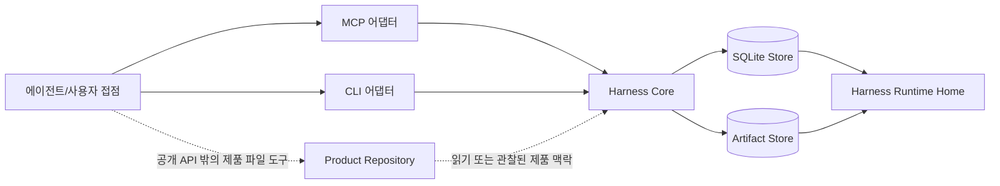

# 구현 아키텍처

이 가이드는 계획된 로컬 Rust 구현을 위한 오래 유지될 저장소 아키텍처 읽기 경로입니다. 이 문서는 계층 분리, 크레이트 배치, 담당 문서 경로를 찾기 위한 보조 설명만 다룹니다.

이 문서는 공개 API 동작, 요청 또는 응답 필드, 스키마 의미, 저장 효과, DDL이나 테이블 컬럼, 보안 보장, 런타임 집행, Core 권한 의미, 제품 계약을 정의하거나 덮어쓰지 않습니다. 그런 질문은 [구현 가이드](implementation-guide.md)와 적용되는 참조 담당 문서를 따릅니다.

하네스는 AI 지원 제품 작업을 위한 로컬 작업 권한 제품이자 시스템입니다. Core는 하네스 상태를 위한 로컬 기준 기록입니다.

## 담당 경계

| 이 가이드가 설명할 수 있는 것 | 이 가이드가 다른 담당 문서로 보내는 것 |
|---|---|
| 가이드 수준의 구현 아키텍처. | API 메서드 동작과 지원되는 공개 메서드. |
| 어댑터, Core, 저장 계층, 런타임 데이터, 제품 파일 사이의 가이드 수준 계층 분리. | 요청 필드, 응답 필드, 공유 스키마, 값 의미. |
| 구현자를 위한 보수적인 Rust 워크스페이스 형태. | 저장소 기록 레이아웃, 저장 효과, 아티팩트 생명주기 세부사항, DDL. |
| 집중 담당 문서를 찾기 위한 읽기 지원. | 보안 보장 표현, 접근 경계 주장, Core 권한 의미, 제품 계약. |

## 계층 모델

실선 경로는 구현 호출 경로로 읽습니다. 에이전트나 사용자 접점은 MCP 또는 CLI 어댑터를 통해 Core에 도달하고, Core는 `Harness Runtime Home` 아래의 저장소 쪽 구현을 사용합니다. 점선 경로는 경계 알림입니다. `Product Repository`는 별도의 제품 파일 경계이며, Core는 담당 문서가 정의한 입력을 통해 그 내용을 읽거나 관찰할 수 있습니다. 실제 제품 파일 도구는 공개 Harness API 밖에서 실행됩니다.

이 다이어그램은 구현 가이드입니다. 저장소 레이아웃, 보안 경계, 메서드 계약, 어떤 런타임이 존재한다는 증명이 아닙니다.

## 계층 책임

| 계층 | 가이드 수준 책임 | 담당하지 않는 것 |
|---|---|---|
| 에이전트/사용자 접점 | 사용자나 에이전트에게 하네스 맥락을 보여 주고 지원되는 어댑터를 호출합니다. | Core 권한, 저장소 권한, 보안 보장, 제품 파일 권한. |
| MCP 어댑터 | MCP 전송을 Core 쪽 호출로 바꾸고 담당 문서가 정한 형태의 결과를 돌려줍니다. | Core 의미, 메서드 동작, 스키마 의미, 저장 효과. |
| CLI 어댑터 | 명령줄 입력과 출력을 Core 쪽 호출로 바꿉니다. | Core 의미, 메서드 동작, 스키마 의미, 저장 효과. |
| Harness Core | 담당 문서가 정의한 권한 결정을 평가하고 저장소 쪽 인터페이스를 조율합니다. | 어댑터 전송, DDL, 아티팩트 본문 바이트 생명주기, 보안 보장 표현. |
| SQLite Store | 저장소 담당 문서에 따라 Core 뒤의 기록 저장 계층을 구현합니다. | API 동작, Core 의미, 이 가이드 안의 테이블 세부사항. |
| Artifact Store | 아티팩트 담당 문서에 따라 스테이징된 아티팩트와 영구 아티팩트 저장소 지원을 구현합니다. | 이 가이드 안의 아티팩트 생명주기 계약이나 스키마 필드. |
| `Harness Runtime Home` | 런타임과 저장소 담당 문서가 정의하는 하네스 런타임 데이터를 담습니다. | `Product Repository`, 기본 서버 설치 저장소, 그 자체만으로 성립하는 보안 경계. |
| `Product Repository` | 공개 API 경로 밖에서 읽거나 관찰하거나 바뀔 수 있는 사용자의 제품 파일을 담습니다. | 하네스 런타임 상태, Core 기록, 아티팩트 권한, `Harness Runtime Home`. |

Core는 참조 담당 문서가 정의한 권한 결정을 담당합니다. 어댑터는 전송만 변환합니다. Core 쪽 코드는 CLI와 MCP 어댑터 계층에 의존하지 않아야 하며, 어댑터는 Core 쪽 인터페이스에 의존할 수 있습니다.

## Rust 워크스페이스 형태

Rust 구현을 도입할 때는 기준 워크스페이스를 좁고 계층적으로 둡니다.

| 크레이트 | 가이드 수준 내용 |
|---|---|
| `crates/harness-types` | 담당 문서가 정의한 스키마를 반영하되 스키마 담당 문서가 되지는 않는 공유 Rust 타입, 식별자, 결과 enum, 직렬화 보조 도구. |
| `crates/harness-store` | SQLite 기반 기록 저장소 인터페이스, 아티팩트 저장소 연결부, 마이그레이션, 저장소 담당 문서로 경로가 이어지는 저장소 테스트 보조 도구. |
| `crates/harness-core` | 담당 문서가 정의한 전이, 권한 점검, idempotency 호출, 저장소 조율을 적용하는 Core 쪽 서비스. |
| `crates/harness-cli` | Core 쪽 서비스를 호출하고 사용자에게 보이는 출력을 형식화하는 CLI 어댑터 명령. |
| `crates/harness-mcp` | MCP 요청을 Core 쪽 서비스로 연결하고 담당 문서가 정한 형태의 응답을 돌려주는 MCP 어댑터 접점. |
| `crates/harness-test-support` | 구현 테스트를 위한 픽스처, 폐기 가능한 런타임 홈 보조 도구, 공유 검증 도우미. |

크레이트 이름과 모듈 경계는 구현 배치 지침입니다. 공개 메서드 이름, 스키마, 저장 효과, 값 의미는 계속 참조 담당 문서에서 나옵니다.

## 런타임 홈과 제품 저장소

`Harness Runtime Home`과 `Product Repository`는 서로 다른 경계입니다. 런타임 홈은 저장소와 런타임 담당 문서가 정의할 때 하네스 소유 기록, 메타데이터, 아티팩트 데이터를 두는 곳입니다. 제품 저장소는 사용자의 제품 파일 작업 공간입니다.

두 위치가 로컬 파일시스템에서 가까이 있을 수는 있지만, 위치가 두 의미를 합치지는 않습니다. Core가 어떤 제품 파일을 관찰했다는 이유만으로 그 파일이 Core 기록이 되지 않습니다. 어떤 런타임 기록이 제품 경로를 가리킨다는 이유만으로 제품 파일이 되지 않습니다. 문서화된 하네스 계약 밖에서 직접 로컬 변경을 하더라도 유효한 Core 기록, 증거, 수락, 잔여 위험 수락, `Write Authorization`, 아티팩트 권한은 생기지 않습니다.

공개 Harness API는 제품 파일을 직접 편집하지 않습니다. 연결된 접점이나 로컬 도구가 공개 API 경로 밖에서 제품 파일 쓰기를 수행할 수 있습니다. 하네스는 담당 문서가 정의한 API 흐름을 통해 쓰기 호환성과 관찰된 결과를 기록합니다.

## 쓰기 준비와 실행 기록

가이드 수준에서 쓰기 경로는 아래처럼 읽습니다.

1. `harness.prepare_write`는 의도된 제품 파일 쓰기 시도 하나가 담당 문서가 정의한 현재 상태와 호환되는지 Core에 평가를 요청합니다. 메서드 담당 문서가 허용할 때 Core는 `Write Authorization` 권한 기록을 만듭니다.
2. 실제 제품 파일 편집은 연결된 접점이나 로컬 도구를 통해 공개 Harness API 밖에서 일어납니다. 이 가이드는 파일 쓰기 방식을 정의하지 않으며 보안 보장을 만들지 않습니다.
3. `harness.record_run`은 사후에 관찰된 작업을 기록하고, 담당 문서가 지원하는 증거, 차단 사유, 아티팩트 링크, 아티팩트 승격을 기록할 수 있습니다. Run 기록은 누락된 권한을 사후에 보충하지 않으며, 담당 문서가 정의한 기록 사실을 넘어 쓰기 발생을 증명하지 않습니다.

정확한 동작은 메서드 담당 문서를 사용합니다. 지속 효과는 저장소 담당 문서를 사용합니다. 권한 의미는 Core 모델을 사용합니다.

## 담당 문서 경로

| 구현 질문 | 담당 경로 |
|---|---|
| Core 권한 개념, `Write Authorization`, 사용자 소유 판단, 증거, 수락, 잔여 위험 경계 | [Core 모델](../reference/core-model.md) |
| `Product Repository`, `Harness Runtime Home`, `Harness Server`, 런타임 위치 분리 | [런타임 경계](../reference/runtime-boundaries.md) |
| 지원되는 공개 메서드와 메서드별 동작 | [API 메서드](../reference/api/methods.md), 그다음 메서드 담당 문서 |
| `harness.prepare_write` 동작 | [`harness.prepare_write`](../reference/api/method-prepare-write.md) |
| `harness.record_run` 동작 | [`harness.record_run`](../reference/api/method-record-run.md) |
| 저장소 담당 문서 읽기 순서 | [저장소](../reference/storage.md) |
| 저장 효과 | [저장 효과](../reference/storage-effects.md) |
| 기록 레이아웃 | [저장소 기록](../reference/storage-records.md) |
| 아티팩트 저장소 생명주기 | [아티팩트 저장소](../reference/storage-artifacts.md) |
| 버전 관리, 재실행 기록, 잠금, 마이그레이션 | [저장소 버전 관리](../reference/storage-versioning.md) |
| 접점과 커넥터 경계 | [에이전트 통합](../reference/agent-integration.md) |
| 보안 보장과 비주장 | [보안](../reference/security.md) |

이 페이지는 코드를 배치하고 경계를 눈에 보이게 유지할 때 사용합니다. 동작을 결정할 때는 집중 담당 문서를 사용합니다.
