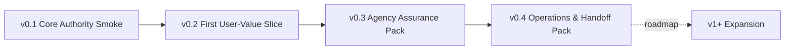
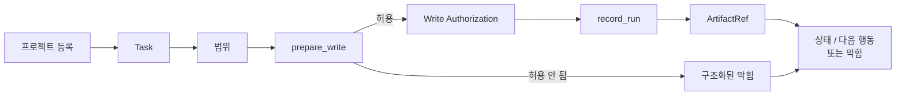

# Build: 단계별 전달 계획

## 이 문서로 할 수 있는 일

이 문서는 넓게 잡혀 있던 초기 단계 범위를 더 작은 staged delivery 계획으로 다시 정리합니다. v0.1은 Core가 권한 상태를 소유한다는 내부 smoke slice인 v0.1 Core Authority Smoke입니다. v0.2는 첫 사용자 가치 조각인 v0.2 First User-Value Slice입니다. 즉 사용자가 평범한 작업을 시작하거나 이어 가며 범위, 판단, 근거 요약, 막힘, 다음 행동, 잔여 위험을 볼 수 있는 최소 경로이지 full assurance, QA, Eval, reporting, operations, dashboard 시스템이 아닙니다.

이 문서는 구현 계획 문서입니다. 문서 수락과 별도의 구현 계획 준비 결정 전에는 runtime/server 구현, 생성된 운영 파일, 실행 가능한 fixture, fixture 파일, 런타임 데이터를 만들라는 뜻이 아닙니다. Conformance fixture 문서는 향후 적합성 검증 계획이며, 현재 문서 전용 저장소에는 runnable Harness Server conformance test가 없습니다. 첫 실행 목표는 v0.1 Core Authority Smoke이며, 커널 스모크(Kernel Smoke)는 좁은 future smoke-check 작성 label입니다. 첫 사용자 가치 목표는 v0.2 First User-Value Slice입니다. 에이전시 보증 팩(v0.3 Agency Assurance Pack)과 운영과 인계 팩(v0.4 Operations & Handoff Pack)은 agency assurance, operations, handoff 동작을 단계적으로 단단하게 만듭니다. v1+ Expansion은 담당 문서가 승격하고 증명하기 전까지 로드맵 범위에 둡니다.

문서 수락과 별도의 구현 계획 준비 결정 이후 무엇을 만들지 계획할 때 이 문서를 사용합니다. 정확한 contract는 Reference 문서를 사용합니다.

## 읽는 경우

- 첫 내부 권한 증명과 첫 사용자 가치 조각을 분리해야 할 때.
- 첫 implementation batch를 키우지 않으면서 단계별 전달 범위를 검토해야 할 때.
- 구현 순서를 storage, schema, fixture, template detail과 분리해서 보고 싶을 때.

## 먼저 읽을 것

[구현 개요](implementation-overview.md)와 그 [문서 수락 상태](implementation-overview.md#문서-수락-상태)를 먼저 읽은 뒤 이 단계 계획을 사용합니다. v0.1 구현 순서는 [첫 실행 가능한 조각](first-runnable-slice.md)을, request-to-close runtime path는 [Runtime Walkthrough](runtime-walkthrough.md)를 사용합니다.

정확한 계약은 [Reference 색인](../reference/README.md)에서 지금 필요한 질문의 owner를 골라 확인합니다. v1+ Expansion 후보와 승격 기준은 [로드맵](../roadmap.md)을 사용합니다.

## 핵심 생각

하네스의 가치는 단지 write authority loop가 있다는 데 있지 않습니다. 하네스는 범위, 사용자 소유 판단, 근거 참조, 닫기 준비 상태, 수락 경계, 잔여 위험을 로컬 권한 기록에 보존해야 합니다. 그래서 초기 전달에는 두 단계가 있습니다.

- v0.1 Core Authority Smoke은 가장 작은 내부 Core 권한 루프를 증명합니다.
- v0.2 First User-Value Slice는 사용자가 평범한 말로 tracked work를 시작하거나 이어 가고, 범위와 판단 경계, 근거 요약, 막힘, 다음 행동, 잔여 위험 표시를 볼 수 있음을 증명합니다.

첫 조각은 의도적으로 좁게 유지합니다. 로컬 프로젝트 등록 하나, active Task 하나, scoped boundary 하나, `prepare_write` 권한 경로 하나, 한 번만 쓰는 Write Authorization 하나, 기록된 Run 하나, artifact/evidence 참조 하나, 구조화된 상태/막힘 응답 하나를 증명합니다. 이것은 제품 MVP가 아닙니다. v0.2는 일반적인 작업을 scope, non-goals, success criteria, 사용자 소유 판단, evidence summary, 닫기 막힘, residual-risk visibility로 바꾸고 민감 동작 승인, 작업 수락, 잔여 위험 수용을 혼동하지 않게 만드는 첫 사용자 가치 단계입니다.

읽기용 요약(Projection) 템플릿 다듬기, 상세 보고서, dashboard 또는 hosted workflow UI, index, broad connector ecosystem 또는 marketplace, team workflow, surface-specific connector automation, metric, parallel orchestration, broad automation은 authority record와 user-facing value path가 존재한 뒤 유용해질 수 있습니다. 첫 조각의 요구사항은 아닙니다.

초기 output model은 의도적으로 작게 둡니다.

- v0.1은 Core state에서 오는 최소 상태/막힘 출력만 필요합니다. 전체 읽기용 요약 renderer는 필요하지 않습니다.
- v0.2는 Core에서 파생한 간결한 상태 카드(compact status card)와 최소한의 사용자 읽기용 요약만 필요합니다. 그 요약에는 현재 작업 상태, 다음 output, 사용자 판단 요청/기록, 근거 요약, 닫기 막힘 요약, residual-risk visibility, 민감 동작 승인 / 작업 수락 / 잔여 위험 수용의 분리 표시가 들어갑니다. 이것은 full projection/reporting system이 아닙니다.
- Journey Card, Journey Spine, Run Summary, TDD Trace, Module Map, Interface Contract, Export, detailed Evidence Manifest, detailed Eval output은 담당 profile이 명시적으로 승격하지 않는 한 Future/diagnostic projections 또는 다른 later-profile scope로 남습니다.

## 단계별 전달 계획

| 단계 | 전달 목표 | 증명하는 것 | 아직 증명하지 않는 것 |
|---|---|---|---|
| v0.1 | v0.1 Core Authority Smoke | 로컬 프로젝트 등록 하나, active Task 하나, scoped boundary 하나, `prepare_write` 권한 경로 하나, 한 번만 쓰는 Write Authorization 하나, 기록된 Run 하나, artifact/evidence ref 하나, 구조화된 상태/막힘 응답 하나로 구성된 첫 실행 가능한 내부 Core 권한 루프. | 사용자 대상 제품 가치, natural-language intake, full Discovery, full Decision Packet, full Evidence Manifest, Eval, Manual QA, Acceptance, residual-risk acceptance, full close semantics, projection rendering, conformance runner, operations/export/recover, dashboards, connectors. |
| v0.2 | v0.2 First User-Value Slice | 사용자가 평범한 말로 tracked work를 시작하거나 이어 가고 Core에서 파생한 scope, non-goals, success criteria, 판단 분리, status/next output, evidence summary, 닫기 막힘, residual-risk visibility, 민감 동작 승인 / 작업 수락 / 잔여 위험 수용 분리 표시를 볼 수 있습니다. | Active profile이 요구하지 않는 full detached verification independence, full Manual QA matrix, full waiver machinery, polished Journey/Spine/reporting, detailed Eval, TDD Trace, Module Map, Interface Contract, Export/Recover, broad connectors, operations suite, dashboard. |
| v0.3 | 에이전시 보증 팩(v0.3 Agency Assurance Pack) | v0.2 user-value path를 verification, QA, residual-risk, work-acceptance, stewardship profile로 단단하게 만듭니다. | Operator recovery/export completeness, release handoff, broad operations coverage, roadmap automation. |
| v0.4 | 운영과 인계 팩(v0.4 Operations & Handoff Pack) | 같은 Core model로 doctor/readiness, recover/export, artifact integrity, release handoff, 더 넓은 conformance coverage를 지원합니다. | Dashboard, hosted workflow UI, broad connectors, Browser QA Capture automation, Cross-Surface Verification automation, Context Index, team workflow, orchestration. |

단계 지도 요약: 단계별 전달은 좁은 Core authority smoke loop에서 첫 사용자 가치로, 그다음 assurance와 operations/handoff로 확장됩니다. v1+는 promoted roadmap scope로 남습니다.

커널 스모크(Kernel Smoke)는 v0.1 Core Authority Smoke을 위한 좁은 향후 작성 label로 남습니다. 이 label은 v0.1이 제품 MVP라는 뜻이 아니며, 전체 conformance suite, conformance runner, 향후 fixture catalog가 있어야 내부 Core 권한 경로를 확인할 수 있다는 뜻도 아닙니다.

Conformance fixture 검증 프로파일은 같은 stage boundary를 따릅니다. Core Authority Smoke fixture 프로파일은 v0.1 Core Authority Smoke에, First User-Value Slice fixture 프로파일은 v0.2 First User-Value Slice에, Agency Assurance Pack fixture 프로파일은 에이전시 보증 팩(v0.3 Agency Assurance Pack)에 대응합니다. Operations & Handoff Pack fixture 프로파일 또는 승격된 v1+ Expansion 후보 fixture 프로파일은 운영과 인계 팩(v0.4 Operations & Handoff Pack)과 승격된 v1+ Expansion 후보에 대응합니다.

이 fixture profile 이름들이 conformance label로 남습니다. 강화된 로컬 기준 목표(hardened local reference target)는 에이전시 보증 팩(v0.3 Agency Assurance Pack)과 운영과 인계 팩(v0.4 Operations & Handoff Pack)을 거쳐 도달하는 종합 목표일 뿐, profile name이나 별도 delivery stage가 아닙니다.

### 보안 guarantee 단계 구분

Build staging 자체가 security guarantee를 올려 주지는 않습니다. Security wording은 [보안 위협 모델의 단계별 guarantee level](../reference/security-threat-model.md#단계별-guarantee-level)을 따릅니다.

| 단계 | 계획할 guarantee posture |
|---|---|
| v0.1 Core Authority Smoke | 지시 기반/협력적 behavior에 제한된 탐지 가능 behavior가 더해진 수준입니다. Core는 invalid state change를 거부하고 구조화된 막힘을 반환할 수 있지만, reference path가 기본으로 arbitrary local process를 멈추거나 tool을 격리하지는 않습니다. |
| v0.2 First User-Value Slice | 사용자에게 보이는 막힘, MCP availability, evidence gap, close readiness, 정직한 보장 표시를 갖춘 cooperative/detective behavior입니다. |
| v0.3 Agency Assurance Pack | Verification, 수동 QA, residual risk, 작업 수락, Approval, stewardship 주변의 더 강한 분리와 탐지 가능 assurance입니다. |
| v0.4 Operations & Handoff Pack | Doctor/readiness, recover/export, artifact integrity, projection freshness, release handoff 주변의 탐지 가능 operations입니다. |
| v1+ Expansion | Owner docs가 exact covered operation 또는 real isolation boundary를 정의하고 승격하며 conformance가 증명한 뒤의 preventive 또는 isolated candidate만 포함합니다. |

### Stage별 API surface

MCP API reference는 문서화한 모든 method의 정확한 schema를 정의합니다. Staged delivery는 method/profile이 언제 active인지 결정합니다. API [Stage Profile Manifest](../reference/mcp-api-and-schemas.md#stage-profile-manifest)를 owner table로 사용하고, artifact와 owner-ref enum validation에는 [stage-specific active value sets](../reference/mcp-api-and-schemas.md#stage-specific-active-value-sets)를 사용합니다. Later-profile field는 해당 profile에서 exact하게 남지만 더 이른 stage exit에 들어가지 않습니다.

| Stage | Active API surface | Stage exit에 넣지 않을 later-profile fields |
|---|---|---|
| v0.1 Core Authority Smoke | Minimal `harness.status` status/blocker read, `harness.prepare_write`, `harness.record_run`, owner-valid active Task/scope setup path 하나, optional minimal `harness.next` 또는 narrow `harness.close_task` blocker smoke. | Natural-language intake, full Discovery, full Decision Packet, Evidence Manifest, Eval, Manual QA, Acceptance, residual-risk acceptance, full close semantics, projection rendering, conformance runner, reconcile, export/recover, broad operations. |
| v0.2 First User-Value Slice | User-facing intake/start/resume behavior, work-shape classification, `harness.status.next_actions`와 optional `harness.next`, minimal `harness.request_user_judgment` / `harness.record_user_judgment` 또는 successor naming, `harness.record_run`을 통한 evidence summaries, `harness.close_task`를 통한 닫기 막힘 summaries, Core-derived 간결한 상태 카드(compact status card). | Active profile/user request/task type/risk profile이 요구하지 않는 full detached verification independence, full Manual QA matrix, full waiver machinery, Approval hardening, detailed Eval, TDD Trace, Module Map, Interface Contract, export/recover, broad operations. |
| v0.3 Agency Assurance Pack | `harness.launch_verify`, `harness.record_eval`, `harness.record_manual_qa`, judgment method의 assurance/waiver/approval/risk profiles, `harness.record_run`의 evidence/feedback/TDD profiles, ValidatorResult-emitting assurance paths. | Operator recover/export completeness, broad projection/reconcile operations, release handoff. |
| v0.4 Operations & Handoff Pack | API response의 projection freshness, reconcile judgment profile, Operations가 담당하는 operator readiness/recover/export/artifact-integrity/conformance surfaces. | Dashboard, hosted workflow UI, broad connectors, automation, team workflow, orchestration은 later promotion 전까지 제외합니다. |

### Stage별 read-only MCP resources

MCP resource는 읽기 전용이며 public tool과 같은 staged delivery boundary를 따릅니다. Resource를 읽는 행위는 Task record, decision, projection job, reconcile item을 만들거나 상태 변경을 일으키면 안 됩니다.

| Stage | Stage 범위의 resource | Stage exit에 넣지 않을 것 |
|---|---|---|
| v0.1 Core Authority Smoke | Current state, blocker, write authority, 최소 Run/artifact/evidence ref를 위한 `harness://project/current`, `harness://task/active`, `harness://task/{task_id}`, optional `harness://task/{task_id}/summary` / `harness://status/card`. | Journey, Spine, Decision Packet storage, Evidence Manifest, bundle, report, design/domain map, module map, interface contract, projection job, full projection rendering. |
| v0.2 First User-Value Slice | v0.1 resource에 더해 현재 작업의 최소 user-judgment context. Evidence summary, 닫기 막힘 요약, work-acceptance display, sensitive-approval display, residual-risk visibility는 status/card 또는 task summary output 안에 나타날 수 있습니다. | Detailed Evidence Manifest resource, profile-required가 아닌 detached verification/QA resource, report, bundle, Journey/Spine polish, design map, module map, interface contract, export/recover. |
| v0.3 Agency Assurance Pack | Evidence/assurance support가 켜졌을 때 `harness://policy/sensitive-categories`, `harness://task/{task_id}/evidence-manifest` 같은 profile-gated assurance read. | Operator report/export completeness와 넓은 operations resource. |
| v0.4 Operations & Handoff Pack | Connector freshness, report, export, recover, handoff profile이 범위에 있을 때 broad `harness://project/surfaces`, `harness://task/{task_id}/reports/latest`, `harness://task/{task_id}/bundle/current` 같은 operations read. | Dashboard, hosted workflow UI, broad connector automation, later promotion 전 roadmap resource. |
| Future/diagnostic | Owner가 승격한 `harness://task/{task_id}/spine`, `harness://task/{task_id}/journey`, `harness://task/{task_id}/change-unit-dag`, `harness://design/domain-language`, `harness://design/module-map`, `harness://design/interface-contracts` 같은 read. | Diagnostic resource를 v0.1 또는 minimum v0.2 요구사항처럼 취급하는 것. |

### 단계별 운영자 surface

Operator command는 예시적인 구현 선택지입니다. Stage boundary는 최종 command spelling이 아니라 동작입니다.

| Stage | 범위에 들어오는 운영자 동작 | Stage 밖에 남기는 운영자 동작 |
|---|---|---|
| v0.1 Core Authority Smoke | 최소 local connect/register, 기본 상태 또는 진단 읽기, 첫 조각이 그 boundary를 요구할 때만 local API/MCP exposure. | Projection refresh, reconcile, recover, export, artifacts check, conformance runner, release handoff, broad doctor/readiness. |
| v0.2 First User-Value Slice | 같은 최소 surface에 더해 현재 작업, 사용자 판단, 근거 상태, 닫기 막힘, residual-risk visibility, 민감 동작 승인 / 작업 수락 / 잔여 위험 수용 분리 표시를 위한 user-facing status/next diagnostic입니다. | Assurance operations, recover/export, release handoff, broad projection/reconcile operations, full conformance run, broad operations coverage. |
| v0.3 Agency Assurance Pack | Owner path를 통한 verification, Manual QA, residual-risk, 작업 수락, stewardship, context-hygiene behavior의 assurance-profile support. | Operator recover/export completeness, release handoff, broad projection/reconcile operations, full operations conformance. |
| v0.4 Operations & Handoff Pack | Full local operations support입니다. Doctor/readiness, projection refresh, reconcile, recover, export, artifacts check, 담당 문서가 정의한 release handoff, runtime suite가 materialized된 뒤 conformance run을 포함합니다. | Remote/shared operations, dashboard, hosted workflow UI, broad connector automation, team workflow, orchestration은 later promotion 전까지 제외합니다. |
| v1+ Expansion | Owner docs가 exact contract, guarantee level, fixture, fallback behavior를 정의한 뒤 승격한 roadmap operations만 포함합니다. | 승격되지 않은 roadmap candidate는 staged delivery 밖에 남습니다. |

### 단계별 전달 이후의 경계: v1+ Expansion

v1+ Expansion은 로드맵 범위이며 Build가 소유하는 staged delivery phase가 아닙니다. Dashboard, hosted workflow UI, Browser QA Capture automation, Cross-Surface Verification automation, Context Index, broader connectors, metrics, team workflow, orchestration 같은 후보는 담당 문서가 future item을 명시적으로 승격하고 증명하기 전까지 v0.1부터 v0.4 밖에 둡니다.

## v0.1 Core Authority Smoke

v0.1은 구현자 확신을 위한 내부 Core authority smoke slice입니다. 하네스가 chat memory나 generated Markdown이 아니라 로컬 권한 기록임을 보여 주는 가장 작은 coherent loop만 증명해야 합니다. 사용자 가치 검증 단계가 아니며 제품 MVP라고 부르면 안 됩니다.

v0.1은 다음을 증명해야 합니다.

- local project registration 하나
- Core가 소유한 상태 안의 active Task 하나
- intended change를 위한 scoped boundary 하나. Reference 계약상 필요한 경우에만 Change Unit 소유자 형태로 표현된다.
- `prepare_write` allow/structured-blocker path 하나
- 지속적이며 한 번만 쓸 수 있는 Write Authorization 하나
- 그 authorization을 consume하는 `record_run` 하나
- Core/API contract가 소유하는 registered `ArtifactRef` 또는 equivalent evidence reference 하나
- missing scope, missing write authority, 또는 missing artifact/evidence support를 위한 구조화된 상태/막힘 응답 하나

이에 맞는 storage profile은 [Storage와 DDL: Core Authority Smoke schema](../reference/storage-and-ddl.md#core-authority-smoke-schema)입니다. 이 profile이 v0.1 minimum입니다. User-facing Decision Packet table, Approval record, Evidence Manifest, Manual QA, Eval, residual-risk acceptance record, projection job, reconcile item, validator run, Journey record, diagnostic/stewardship table은 profile owner가 명시적으로 승격하기 전까지 later-profile storage로 남습니다.

v0.1은 natural-language intake, full Discovery, full Decision Packet, full Evidence Manifest, Eval, Manual QA, Acceptance, residual-risk acceptance, full close semantics, detached verification, product/UX judgment와 architecture judgment의 presentation, stewardship, feedback-loop policy, projection rendering, conformance runner, operations/export/recover, dashboards, connectors, 넓은 operator entrypoint, 향후 fixture catalog, release handoff를 증명하면 안 됩니다. 이것들은 이후 단계 또는 roadmap 범위입니다.

v0.1 Kernel Smoke candidate는 Core state, 그 루프에 필요한 owner record, artifact/evidence refs, structured blocker를 통해 minimal authority loop만 확인해야 합니다. 읽기용 요약 다듬기, detailed template, renderer output, 넓은 fixture catalog는 first-slice conformance truth가 아닙니다.

이 시점에 implementer는 Core가 최소 상태를 소유하고, scoped write가 허용되거나 구조화된 막힘으로 거부되며, authorization 하나가 한 번 소비되고, artifact/evidence ref가 기록된 Run에 연결되며, 상태/막힘 출력이 구조화된 막힘을 반환할 수 있음을 관찰할 수 있습니다. 이것은 구현자 확신이지 사용자가 Harness 가치를 경험했다는 증명이 아닙니다.

### 계약 필드 단계 구분

Reference schema에는 관련 capability가 범위에 들어올 때만 필요한 field도 포함됩니다. Build는 field requiredness를 다시 정의하지 않습니다. 어떤 capability가 어느 stage에 들어오는지만 말합니다. Field는 owner contract와 active stage를 함께 보고 읽습니다.

| Stage | Build 읽기 규칙 | 적용할 owner contract |
|---|---|---|
| v0.1 Core Authority Smoke | 좁은 authority loop와 [Core Authority Smoke schema](../reference/storage-and-ddl.md#core-authority-smoke-schema)를 증명하는 데 필요한 owner-defined field만 사용합니다. 넓은 checklist를 만족하려고 future-profile record를 만들지 않습니다. Minimal seeded blocker가 owner ref를 사용한다면, profile별 user-facing Decision Packet 품질이 아니라 그 owner path의 valid shape만 적용합니다. | [커널 참조](../reference/kernel.md), [MCP API와 스키마](../reference/mcp-api-and-schemas.md), [Storage와 DDL](../reference/storage-and-ddl.md), [Conformance Fixtures 참조](../reference/conformance-fixtures.md#kernel-smoke-authoring-queue). |
| v0.2 First User-Value Slice | 사용자가 현재 work shape, scope/non-goals/success criteria, 대기 중인 사용자 판단, evidence summary, 닫기 막힘, residual-risk visibility, 민감 동작 승인 / 작업 수락 / 잔여 위험 수용 분리 표시를 이해하는 데 필요한 field와 display summary를 추가합니다. 작업 수락과 잔여 위험 사실은 관련 있을 때 distinct하게 남지만 최소 요약 안에 들어갑니다. | [MCP API와 스키마](../reference/mcp-api-and-schemas.md), [커널 참조](../reference/kernel.md), [읽기용 요약(Projection) 참조](../reference/document-projection.md), [Template 참조](../reference/templates/README.md). |
| 에이전시 보증 팩(v0.3 Agency Assurance Pack) / 운영과 인계 팩(v0.4 Operations & Handoff Pack) | Verification, QA, 잔여 위험, 작업 수락, stewardship, projection/reconcile, operations, export/recover, artifact-integrity, release-handoff profile은 담당 문서가 정의한 곳에서만 추가합니다. | [설계 품질 정책](../reference/design-quality-policies.md), [운영과 Conformance](../reference/operations-and-conformance.md), [Conformance Fixtures 참조](../reference/conformance-fixtures.md), [향후 Fixture Catalog](../reference/future-fixture-catalog.md), [Storage와 DDL](../reference/storage-and-ddl.md). |

따라서 API schema에서 required라는 말은 해당 tool call, record, profile이 활성 상태이거나 사용될 때 required라는 뜻입니다. 그 자체로 future-profile field가 가장 작은 runnable slice의 일부가 되지는 않습니다.

### 서버 코딩 전 필요한 구현 결정

이 섹션은 maintainer review나 첫 runtime batch planning에서 발견되는 구현 시작 전 결정을 기록하는 open decision ledger입니다. 큰 구현 선택을 흩어진 `TODO_DECISION`이나 막연한 follow-up으로 남기지 않습니다.

| 결정 기록 항목 | 현재 상태 | 결정 조건 |
|---|---|---|
| Simplified judgment model and naming | Open. 현재 문서는 user-facing judgment category와 internal route 방향을 제시하지만, v0.2 API/DDL 코딩 전 최소 모델을 확정해야 합니다. | v0.2 record 이름, required field, display label, later full Decision Packet semantics와의 관계를 결정합니다. |
| `request_user_decision` vs `request_user_judgment` | Open. 현재 문서는 주로 `harness.request_user_judgment`를 사용하지만 public API 이름은 유지보수자 수락이 필요합니다. | Method name과 migration path를 고르거나, `harness.request_user_judgment`를 v0.2 public name으로 명시 수락합니다. |
| `harness.next` separate method vs `status.next_actions` | Open. v0.1/v0.2에 둘 다 필요한지 아직 확정되지 않았습니다. | v0.2 next action을 별도 method로 둘지, `harness.status` field로 둘지, 둘 다 두되 canonical source를 하나로 정할지 결정합니다. |
| v0.2 storage minimum | Open. v0.2에는 minimal user judgment, status/card, evidence summary, blocker, acceptance display, residual-risk visibility가 필요하지만 later assurance table이 기본 요구사항은 아닙니다. | 최소 table/field를 수락하고 later-profile storage를 명시적으로 미룹니다. |
| Local access error taxonomy | Open. MCP/Core unavailable, local access denied/untrusted, stale state, unsupported surface의 API error와 사용자 표시가 안정되어야 합니다. | v0.1/v0.2 error code, precedence, display wording을 수락합니다. |
| Compact status card scope | Open. v0.2에는 Core-derived compact card가 필요하지만 field와 freshness rule이 아직 수락되지 않았습니다. | Required field, omitted field, stale/unavailable behavior, resource인지 status payload인지 또는 둘 다인지 결정합니다. |
| Small direct change evidence requirement | Open. Small direct work도 authority를 우회하면 안 되지만 최소 evidence expectation은 stage decision이 필요합니다. | Small direct change에 어떤 evidence summary/ref가 필요한지, missing ref가 언제 close를 막는지 결정합니다. |
| Acceptance and residual risk minimal records | Open. v0.2는 sensitive approval, work acceptance, risk acceptance를 분리해 보여 주지만 최소 record shape가 필요합니다. | v0.2가 minimal records를 만들지, display-only derived state로 둘지, later acceptance/risk record의 staged subset을 사용할지 결정합니다. |
| 구현 준비 판단 | 수락되지 않았습니다. | Maintainer가 구현 준비 조건이 충족되었거나 남은 blocker가 재분류되었다고 판단한 뒤 [구현 개요: 문서 수락 상태](implementation-overview.md#문서-수락-상태)를 의도적으로 갱신해야 합니다. |
| 문서 drift | 기본적으로 server-coding decision이 아닙니다. | Docs-maintenance finding이 실제 owner-contract decision이나 stage blocker를 드러내면 stage impact와 함께 이 기록으로 승격합니다. 그렇지 않으면 문서 작성 가이드 tracker로 routing합니다. |

확인된 결정이 추가되면 다음을 기록합니다.

- 담당 문서 또는 담당 section
- 영향을 받는 behavior, field, table, fixture semantics, guarantee level, stage boundary
- 영향을 받는 stage
- 검토한 option
- server code나 DDL 변경 전에 필요한 결정
- 이 항목이 문서 수락, 구현 계획, 서버 코딩, 또는 이후 stage만 막는지

### 구현 준비 체크리스트

이 체크리스트는 아직 수락되지 않았습니다. 첫 runtime batch planning이나 server coding 전에 maintainer가 각 항목을 수락하거나 stage impact와 함께 명시적으로 미뤄야 합니다.

- v0.1 API subset accepted.
- v0.1 DDL accepted.
- State transitions accepted.
- Write Authorization lifecycle accepted.
- Artifact/evidence ref shape accepted.
- Structured blocker shape accepted.
- Local access posture accepted.
- v0.2 promotion criteria accepted.

### Core Authority Smoke 흐름

Core Authority Smoke 요약: 이 계획 흐름은 project/Task setup, scope, `prepare_write`, Write Authorization, `record_run`, artifact/evidence ref, structured status/blocker output으로 이루어진 하나의 authority loop를 검토하기 위한 것입니다. 이 저장소에 구현된 runtime flow를 뜻하지 않습니다.

정확한 state와 blocker behavior는 [커널 참조](../reference/kernel.md)가, public tool shape는 [MCP API와 스키마](../reference/mcp-api-and-schemas.md)가, active-path fixture body/assertion mechanics는 [Conformance Fixtures 참조](../reference/conformance-fixtures.md#conformance-fixture-format)가 담당합니다. Later-profile scenario와 shorthand catalog는 [향후 Fixture Catalog](../reference/future-fixture-catalog.md)에 남고 이 흐름에 requirement를 추가하지 않습니다. 이 흐름은 pack gate, projection renderer requirement, fixture body requirement를 추가하지 않습니다.

향후 smoke 작성 순서는 [커널 스모크(Kernel Smoke) Authoring Queue](../reference/conformance-fixtures.md#kernel-smoke-authoring-queue)를 사용합니다. 이 queue는 candidate check를 이 내부 조각에 매핑하지만 executable fixture file이 이미 존재하거나 v0.1에 전체 conformance suite가 필요하다고 암시하지 않습니다.

## v0.2 First User-Value Slice

v0.2는 첫 사용자 가치 조각입니다. 전체 제품 MVP, assurance system, QA matrix, Eval harness, reporting suite, operations suite, dashboard가 아닙니다. 사용자가 평범한 말로 작업을 시작하거나 이어 가고, Harness가 scope, user-owned judgment, evidence summary, 닫기 막힘, residual-risk visibility를 Core-owned local state에 보존한다는 것을 볼 수 있는 가장 작은 경험으로 정의합니다.

이 조각은 다음을 보여야 합니다.

- ordinary-language start/resume of tracked work가 Harness vocabulary 없이 가능하다
- work shape classification이 있고 small direct change와 tracked work를 구분한다
- scope, non-goals, success criteria summary를 제공한다
- Codebase-answerable 또는 state-answerable fact는 사용자에게 반복 질문하기 전에 확인된다
- Clarification은 긴 questionnaire를 쏟아내지 않으면서 다음 safe action을 unblock할 만큼 충분히 묻는다
- product/UX judgment와 중요한 technical architecture judgment가 서로 분리되고, 민감 동작 승인, 작업 수락, 잔여 위험 수용과도 분리되어 제시될 수 있다
- minimal user judgment request와 record가 있다
- 작은 변경과 tracked work가 서로 다른 procedural budget을 가지되, small-change label이 authority를 우회하지 않는다
- Ambiguous feature request는 premature implementation이 아니라 clarification으로 들어간다
- status와 next-output이 현재 scope, missing judgments, evidence state, 닫기 막힘, residual-risk visibility, safe next action을 설명한다
- evidence summary가 있다
- required evidence 또는 required user-owned judgment가 없으면 닫기 막힘 요약을 보고한다
- 알려진 close-relevant risk가 있으면 acceptance와 close 전에 residual risk가 보인다
- 민감 동작 승인, 작업 수락, 잔여 위험 수용이 분리되어 표시된다
- chat이나 rendered Markdown이 아니라 Core state에서 파생된 간결한 상태 카드(compact status card)가 있다
- "go ahead" 또는 "looks good" 같은 ambiguous consent는 ambiguous judgment route를 해소하거나, evidence를 waive하거나, residual risk를 accept하거나, out-of-scope work를 authorize하지 않는다
- MCP/Core unavailable status는 authority state를 만들어내지 않는다
- Projection/template output은 derived 상태로 남고 state가 될 수 없다
- verification은 active profile, user request, task type, risk profile이 요구할 때만 필요하다
- verification waiver는 required verification을 일부러 건너뛸 때만 필요하다
- readable summary 또는 card가 현재 작업 상태, 사용자 판단 요청, 근거 요약, 닫기 막힘을 보여 주지만, template polish가 source of truth가 되지는 않는다

근거 기록, 읽기 쉬운 요약, projection 최신성은 이 경험을 지원합니다. 이것들이 단계의 정체성은 아니며, compact user-readable path를 넘어서는 projection polish는 범위 밖에 둡니다.

v0.2는 active profile이 요구하지 않는 full detached verification independence, full Manual QA matrix, full waiver machinery, polished Journey/Spine/reporting, detailed Eval, TDD Trace, Module Map, Interface Contract, Export/Recover, broad connectors, operations suite, dashboard, stewardship validators, feedback-loop policy, release handoff, detailed Evidence Manifest, Browser QA Capture, Cross-Surface Verification automation, Context Index, metrics, team workflow, orchestration을 명시적으로 제외합니다.

v0.2를 통과했다는 것은 사용자가 하네스가 authorization wrapper 이상임을 볼 수 있다는 뜻입니다. Work의 scope, judgments, evidence summary, 닫기 막힘, 작업 수락 경계, risk visibility가 로컬에서 inspectable하게 유지됩니다.

## 에이전시 보증 팩(v0.3 Agency Assurance Pack)

v0.3은 v0.2 user-value path를 강화하여 로컬 reference path가 검증, QA, 잔여 위험, 작업 수락, stewardship을 정직한 경계 안에서 route할 수 있게 합니다.

중점:

- profile별 Decision Packet 품질과 user-judgment routing
- sensitive-action Approval, Decision Packet, Write Authorization, 작업 수락, 잔여 위험 수용 분리
- same-session verification guard behavior를 포함한 분리 검증 독립성
- 수동 QA 정책 매트릭스, 수동 QA 막힘 조건, 유효한 QA 면제 판단
- 잔여 위험 수용 close의 전체 의미
- stewardship validators와 codebase stewardship coverage
- policy가 요구하는 TDD trace behavior
- policy가 요구하는 feedback-loop policy
- context-hygiene validators와 현재 상태/오래된 context 경계
- Core state, events, artifacts, projection/freshness facts, errors를 통해 judgment, QA, verification, 잔여 위험, 작업 수락의 분리를 증명하는 Agency Assurance Pack conformance fixtures

이 pack을 통과하면 user-value path가 agency-preserving하고 policy-aware하며 검증, QA, 잔여 위험, 작업 수락, stewardship 경계를 정직하게 다룬다는 뜻입니다. v1+ Expansion automation을 staged delivery로 승격하지는 않습니다.

## 운영과 인계 팩(v0.4 Operations & Handoff Pack)

v0.4는 같은 Core state model 위에서 로컬 운영 증명을 완성합니다.

중점:

- 하네스 런타임 홈, project state, artifact store, reference surface, MCP availability, projections, reconcile, validators/checks, agency/stewardship/context에 대한 doctor/readiness categories
- interrupted 또는 drifted operational state에 대한 recover handling
- state snapshots, report projection snapshots, artifact refs, redaction status, omitted-secret notes, retained/expired/unavailable artifact status에 대한 export behavior
- artifact integrity checks
- 담당 문서가 정의하는 release handoff report/export profile
- v0.4 operations profile에 대한 operator smoke. 여기에는 connect, doctor, serve MCP, 읽기용 요약 refresh, reconcile, recover, export, artifacts check, conformance run이 포함되며, 초기 단계는 더 작은 subset만 유지합니다
- export/recover, artifact integrity, release handoff, operator readiness, 그리고 담당 문서가 정의하고 증명한 higher guarantee level에 대한 operations/future fixture coverage
- 별도로 증명하고 승격하기 전까지 roadmap item을 v1+ Expansion에 두는 later-boundary checks

Operator command를 위한 두 번째 state model을 만들면 안 됩니다. Operator는 같은 Core state model 위에서 diagnose, repair, export, fixture run을 수행합니다.

Docs-maintenance는 별도의 읽기 전용 문서 profile로 남습니다. Documentation drift를 보고할 수 있지만 v0.1 Core Authority Smoke도, v0.2 First User-Value Slice도, Agency Assurance Pack 또는 operations runtime conformance도, 구현 준비 상태 신호도 아닙니다.

## Roadmap 범위의 v1+ Expansion 후보

아래 항목은 향후 계획이 담당 문서를 통해 [로드맵 단계 승격 조건](../roadmap.md#단계-승격-조건)을 만족시켜 승격하기 전까지 staged delivery 밖에 둡니다. 승격하려면 사용자 소유 판단을 보존하고, Core 권한을 우회하지 않으며, 단계에 맞는 보안 보장 표현을 사용하고, 근거/검증/QA/작업 수락/잔여 위험에 미치는 영향을 밝히며, v0.1부터 v0.4까지의 범위를 부풀리지 않아야 합니다. 또한 필요한 능력 프로필, 정확한 계약, redaction/secret/PII 정책, 런타임 접점 캡처 시 아티팩트 보존 규칙과 test environment 규칙, fixture 또는 적합성 목표, fallback 동작, 읽기용 요약을 기준 상태로 삼지 않는다는 조건을 담당 문서가 정의해야 합니다.

| 후보 | 단계 경계 |
|---|---|
| 대시보드, 호스팅된 작업 UI, 아티팩트 대시보드, 풍부한 카드 확장 | 상태를 표시할 수는 있지만 권한, 구현 준비 상태, 닫기 준비 상태, 작업 수락, 잔여 위험 수용이 되면 안 됩니다. |
| 넓은 커넥터 시장 또는 접점 생태계 | 나중에 접점을 확장할 수 있지만 첫 Core 권한 루프 증명을 대체하거나 MCP 노출을 기본적으로 넓히면 안 됩니다. |
| 브라우저 QA 캡처 자동화 | 승격 뒤 수동 QA를 보조할 수 있지만 사람의 QA 판단, 작업 수락, profile-required detached verification을 대체하면 안 됩니다. |
| 여러 접점 검증 자동화 | 승격 뒤 evaluator routing을 자동화할 수 있지만 Core 소유 반환 기록과 active profile이 요구하는 독립성 의미 없이 Eval 또는 assurance를 충족하면 안 됩니다. |
| 예방적 가드 확장, 네이티브 후크, 고급 사이드카 워처 | 증명된 pre-tool blocking 또는 관찰 경로가 있을 때 접점을 강화할 수 있지만 label만으로 주장하면 안 됩니다. |
| 맥락 색인, 로컬 파생 지표, 장기 지표 | 읽기 전용 검색이나 진단을 제공할 수 있지만 write를 authorize하거나, gate를 충족하거나, 읽기용 요약을 refresh하거나, Task를 close하면 안 됩니다. |
| 팀 작업 흐름, 권한, 오케스트레이션, 병렬 lane | 향후 작업을 조율할 수 있지만 staged delivery나 single-project local authority의 필수 요소가 되면 안 됩니다. |
| 배포, canary, rollback, merge, production monitoring | 향후 통합 작업이 될 수 있습니다. Release handoff는 담당 문서가 더 많은 권한을 승격하기 전까지 report/export boundary로 남습니다. |

구현 중 향후 기능이 유용해 보이더라도 담당 문서가 권한 경로를 정의하고 증명하기 전까지는 읽기 전용 표시, 메타데이터, 아티팩트 후보, fixture 후보로 유지합니다. Build 문서는 단계별 전달을 소유하고, 로드맵은 후보 예시만 추적합니다.

## 단계별 종료 기준

문서 수락과 별도의 구현 계획 준비 결정 이후 향후 런타임 계획을 위한 구현자가 읽을 수 있는 점검 목록으로 사용합니다. 이들은 staged exit을 다시 말할 뿐이며 schema, fixture, DDL, new runtime requirement를 추가하지 않습니다. [문서 수락 상태](implementation-overview.md#문서-수락-상태)가 첫 런타임 배치 계획을 막고 있는 동안 구현을 허가하지 않습니다.

### v0.1 Core Authority Smoke 종료 점검 목록

- local project 하나가 등록된다.
- active Task 하나가 Core-owned state 안에 존재한다.
- scoped boundary 하나가 intended change boundary를 이름 붙인다.
- Compatible scope 없는 product write는 Core가 구조화된 막힘으로 거부합니다. 이것은 기본 도구 실행 전 보안 차단이 아닙니다.
- Out-of-scope intended write는 Core가 구조화된 막힘으로 거부합니다. 이것은 기본 도구 실행 전 보안 차단이 아닙니다.
- 허용된 `prepare_write`는 지속적이며 한 번만 쓸 수 있는 Write Authorization을 만든다.
- Compatible `record_run`은 authorization을 한 번 consume한다.
- 두 번째 distinct product-write Run은 consumed authorization을 재사용할 수 없다.
- Artifact/evidence ref 하나가 등록되어 Run 또는 minimal owner relation에 연결된다.
- 상태/막힘 출력이 상태를 변경하지 않고 현재 상태 또는 blocker를 반환한다.
- Structured blocker/status response가 missing scope, missing write authority, 또는 missing artifact/evidence support를 보고한다.

### v0.2 First User-Value Slice 종료 점검 목록

- 평범한 사용자 언어가 Harness vocabulary를 요구하지 않고 tracked work를 시작하거나 resume할 수 있다.
- User-facing path가 work shape를 분류하고 small direct change와 tracked work를 구분한다.
- User-facing path가 scope, non-goals, success criteria, evidence expectations, close readiness, judgment boundaries를 summary로 보여 준다.
- Codebase-answerable 또는 state-answerable fact는 사용자에게 반복 질문하기 전에 확인된다.
- Clarification quality가 다음 safe action에 충분하다. 얕은 질문 하나에서 멈추지 않고, 긴 questionnaire를 쏟아내지 않으며, blocking question과 useful-but-not-blocking question을 분리하고, user-owned judgment에는 choices와 consequences를 준다.
- Product/UX judgment와 중요한 technical architecture judgment를 서로 분리하고, 민감 동작 승인, 작업 수락, 잔여 위험 수용과도 분리해 제시할 수 있다.
- v0.2 decision을 위한 minimal user judgment request와 record가 있으며 full Decision Packet machinery를 요구하지 않는다.
- Small direct changes와 tracked work가 write authority, evidence, 필요한 사용자 판단을 우회하지 않으면서 서로 다른 procedural budget을 사용한다.
- Ambiguous feature request는 premature implementation이 아니라 clarification으로 들어간다.
- Status/next output이 현재 scope, missing judgments, evidence summary, residual-risk visibility, 닫기 막힘, next output, 안전한 다음 행동을 설명한다.
- Required evidence가 없으면 닫기 막힘 요약이 막힘을 보고한다.
- 필요한 사용자 판단이 missing 또는 unresolved이면 close가 막힘을 보고한다.
- 알려진 닫기 관련 위험이 있으면 작업 수락 또는 close 전에 잔여 위험이 보인다.
- "go ahead", "looks good", "좋아", "진행해" 같은 ambiguous consent phrase는 ambiguous route를 해소하거나, evidence를 waive하거나, residual risk를 accept하거나, out-of-scope work를 authorize하지 않는다.
- MCP/Core unavailable status는 authority access가 없음을 보고하고 Task state, Write Authorization, evidence, approval, acceptance, close readiness를 만들어내지 않는다.
- 사용자의 작업 수락이 sensitive-action Approval과 잔여 위험 수용과 별도로 기록되거나 표현된다.
- 잔여 위험 수용을 지원하는 경우, 이것이 작업 수락과 뚜렷하게 구분되어 보인다.
- Compact status card는 Core record에서 파생되며, template polish를 기준 권한으로 만들지 않고 v0.2 path에 충분하다.
- Projection/template output은 state가 되지 않는다.
- Detached verification은 기본 요구사항이 아니다.
- Verification은 active profile, user request, task type, risk profile이 요구할 때만 필요하다.
- Verification waiver는 required verification을 일부러 건너뛸 때만 필요하다.

### 에이전시 보증 팩(v0.3 Agency Assurance Pack) 종료 점검 목록

- Decision Packet quality와 user-judgment routing이 fixture로 증명된다.
- Sensitive-action Approval이 Decision Packet, Write Authorization, 수동 QA, verification, 작업 수락, 잔여 위험 수용을 대체하지 않는다.
- 분리 검증 독립성과 same-session verification guard behavior가 fixture로 증명된다.
- Policy가 요구하는 곳에서 수동 QA 정책 매트릭스와 QA blocker가 fixture로 증명된다.
- 위험 수용 close는 담당 semantics에 따라 accepted Residual Risk refs를 인용한다.
- Policy가 요구하는 곳에서 stewardship validators, feedback-loop policy, TDD trace behavior, context-hygiene behavior가 cover된다.
- Agency conformance가 Journey visibility, user-judgment routing, Autonomy Boundary respect, distinct judgment categories/routes, 잔여 위험 처리를 증명한다.

### 운영과 인계 팩(v0.4 Operations & Handoff Pack) 종료 점검 목록

- Doctor/readiness가 하네스 런타임 홈, project state, artifact store, reference surface, MCP availability, projections, reconcile, validators/checks, agency/stewardship/context category를 보고한다.
- Recover는 recovery artifact를 successful completion proof로 취급하지 않으면서 interrupted 또는 drifted 운영 상태를 처리한다.
- Export는 state snapshot, report projection snapshot, artifact refs, redaction status, omitted-secret notes, retained/expired/unavailable artifact status를 포함한다.
- Artifact integrity check는 missing 또는 mismatched artifact를 기존 diagnostics로 보고한다.
- Release handoff report/export behavior는 deployment, merge, rollback, production authority를 가져오지 않고 담당 profile을 따른다.
- Operations/future fixture coverage가 export/recover, artifact integrity, release handoff, operator readiness, 승격된 higher guarantee level을 prose가 아니라 exact-shape fixture로 증명한다.
- 후속 경계 확인은 담당 문서가 승격하고 증명하기 전까지 v1+ Expansion item을 staged delivery 밖에 둔다.

## 단계별 관찰 가능 항목

| 단계 | 사용자 또는 operator가 볼 수 있는 것 |
|---|---|
| v0.1 Core Authority Smoke | Implementer는 로컬 Task 하나가 scoped work boundary, `prepare_write`, Write Authorization, `record_run`, artifact/evidence ref, 구조화된 상태/막힘 출력을 통과하는 것을 볼 수 있습니다. |
| v0.2 First User-Value Slice | 사용자는 평범한 작업이 scope, non-goals, success criteria, user-owned judgment, evidence summary, 닫기 막힘, 작업 수락 display, residual-risk visibility로 정리되고 required evidence 또는 필요한 사용자 판단이 없으면 close가 막힘을 보고하는 것을 볼 수 있습니다. |
| 에이전시 보증 팩(v0.3 Agency Assurance Pack) | Local path가 verification, 수동 QA, 잔여 위험 수용, 작업 수락, stewardship, TDD, feedback, context hygiene, close behavior를 Core record와 fixture로 설명합니다. |
| 운영과 인계 팩(v0.4 Operations & Handoff Pack) | Operator는 같은 Core state 위에서 diagnose, recover, reconcile, export, artifact check, conformance run, release handoff 준비를 수행할 수 있습니다. |

단계별 전달 이후에는 promoted roadmap item이 담당 문서가 exact contract와 fixture coverage를 정의한 뒤에만 authority loop를 읽고, 표시하고, 감싸고, 확장할 수 있습니다.
