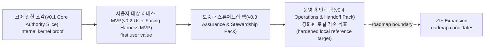
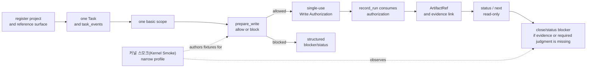

# Build: MVP 계획

## 이 문서로 할 수 있는 일

이 문서는 MVP 범위를 구현 가능한 staged delivery 계획으로 바꿉니다. 첫 실행 가능한 커널 조각과 첫 사용자 대상 MVP를 분리해, "MVP"라는 이름을 단순히 권한 루프가 존재하는 단계가 아니라 사용자가 하네스의 가치를 경험할 수 있는 단계에만 사용합니다.

이 문서는 구현 계획 문서입니다. 문서 세트가 구현 계획에 사용할 수 있다고 승인되기 전에는 runtime/server 구현, 생성된 운영 파일, 실행 가능한 fixture 파일, runtime data를 만들라는 뜻이 아닙니다. 첫 실행 목표는 코어 권한 조각(v0.1 Core Authority Slice)이며, 커널 스모크(Kernel Smoke)는 이 조각을 위한 좁은 conformance authoring profile입니다. 첫 제품 MVP 목표는 사용자 대상 하네스 MVP(v0.2 User-Facing Harness MVP)입니다. v0.3과 v0.4는 assurance, stewardship, operations, handoff 동작을 단계적으로 단단하게 만듭니다. v1+ Expansion은 owner 문서가 승격하고 증명하기 전까지 roadmap 범위에 둡니다.

문서 승인 이후 무엇을 만들지 계획할 때 이 문서를 사용합니다. 정확한 contract는 Reference 문서를 사용합니다.

## 읽는 경우

- 첫 runnable kernel proof와 첫 user-facing product MVP를 분리해야 할 때.
- 첫 implementation batch를 키우지 않으면서 staged delivery 범위를 검토해야 할 때.
- 구현 순서를 storage, schema, fixture, template detail과 분리해서 보고 싶을 때.

## 먼저 읽을 것

[구현 개요](implementation-overview.md)의 [문서 승인 상태](implementation-overview.md#문서-승인-상태), [첫 실행 가능한 조각](first-runnable-slice.md), [Runtime Walkthrough](runtime-walkthrough.md)를 먼저 읽습니다. 정확한 API contract는 [MCP API와 스키마](../reference/mcp-api-and-schemas.md)를 사용합니다. Storage detail과 DDL은 [Storage와 DDL](../reference/storage-and-ddl.md)을 사용합니다. Design-quality gate와 validator behavior는 [Design Quality Policies](../reference/design-quality-policies.md)를 사용합니다. Conformance fixture semantics는 [Conformance Fixtures 참조](../reference/conformance-fixtures.md)를 사용합니다. Operator procedure와 conformance run overview는 [운영과 Conformance](../reference/operations-and-conformance.md)를 사용합니다. v1+ Expansion 후보와 승격 기준은 [로드맵](../roadmap.md)을 사용합니다.

## 핵심 생각

하네스의 가치는 단지 write authority loop가 있다는 데 있지 않습니다. 하네스는 범위, 사용자 소유 판단, 근거, 닫기 준비 상태, 잔여 위험을 로컬 권한 기록에 보존해야 합니다. 그래서 초기 전달에는 두 단계가 있습니다.

- 코어 권한 조각(v0.1 Core Authority Slice)은 가장 작은 내부 커널 루프를 증명합니다.
- 사용자 대상 하네스 MVP(v0.2 User-Facing Harness MVP)는 사용자가 하네스가 work를 clarify, budget, block, accept, risk-explain하는 방식을 경험하는 첫 MVP입니다.

첫 조각은 의도적으로 좁게 유지합니다. 로컬 project 하나, Task 하나, scope 하나, write authority path 하나, recorded Run 하나, evidence link 하나, structured blocker/status response 하나를 증명합니다. 이것은 MVP가 아닙니다. 일반적인 work를 scope, judgment, evidence, close-readiness, residual-risk language로 바꾸고 approval, acceptance, risk acceptance를 혼동하지 않게 만드는 단계가 MVP입니다.

Projection template polish, dashboard 또는 hosted workflow UI, index, broad connector ecosystem 또는 marketplace, team workflow, surface-specific connector automation, metric, parallel orchestration, broad automation은 authority record와 user-facing value path가 존재한 뒤 유용해질 수 있습니다. 첫 조각의 요구사항은 아닙니다.

## 단계별 전달 계획

| 단계 | 전달 목표 | 증명하는 것 | 아직 증명하지 않는 것 |
|---|---|---|---|
| v0.1 | 코어 권한 조각(Core Authority Slice) | 로컬 project 하나, Task 하나, scope 하나, write authority path 하나, recorded Run 하나, evidence link 하나, structured blocker/status response 하나로 구성된 첫 runnable 내부 kernel loop. | 사용자 대상 MVP 가치, full intake/discovery, full Decision Packet 품질, residual-risk semantics, Manual QA, detached verification, projection completeness, operations readiness. |
| v0.2 | 사용자 대상 하네스 MVP(v0.2 User-Facing Harness MVP) | 사용자가 하네스가 scope, user-owned judgment, evidence, close readiness, final acceptance, residual-risk visibility를 로컬 권한 기록에 보존한다는 것을 경험합니다. | Full agency hardening, detached verification independence, Manual QA matrix, stewardship policy suite, feedback-loop policy, export/recover, release handoff. |
| v0.3 | 보증과 스튜어드십 팩(Assurance & Stewardship Pack) | MVP path를 assurance, QA, verification, stewardship, design-quality, context-hygiene, TDD, feedback-loop profile로 단단하게 만듭니다. | Operator recovery/export completeness, release handoff, broad operations coverage, roadmap automation. |
| v0.4 | 운영과 인계 팩(Operations & Handoff Pack) | 같은 Core model로 doctor/readiness, recover/export, artifact integrity, release handoff, 더 넓은 conformance coverage를 지원합니다. | Dashboard, hosted workflow UI, broad connectors, Browser QA Capture automation, Cross-Surface Verification automation, Context Index, team workflow, orchestration. |

커널 스모크(Kernel Smoke)는 코어 권한 조각(v0.1 Core Authority Slice)을 위한 좁은 conformance authoring profile로 남습니다. 이 profile 이름은 v0.1이 제품 MVP라는 뜻이 아니라 내부 kernel path를 증명한다는 뜻입니다.

### 단계별 전달 이후의 경계: v1+ Expansion

v1+ Expansion은 roadmap 범위이며 Build가 소유하는 staged delivery phase가 아닙니다. Dashboard, hosted workflow UI, Browser QA Capture automation, Cross-Surface Verification automation, Context Index, broader connectors, metrics, team workflow, orchestration 같은 후보는 owner 문서가 future item을 명시적으로 승격하고 증명하기 전까지 v0.1부터 v0.4 밖에 둡니다.

## 코어 권한 조각(v0.1 Core Authority Slice)

v0.1은 내부 구현 milestone입니다. 하네스가 chat memory나 generated Markdown이 아니라 로컬 권한 기록임을 보여 주는 가장 작은 coherent loop만 증명해야 합니다.

v0.1은 다음을 증명해야 합니다.

- project registration과 reference surface 하나
- current state와 `task_events`를 가진 Task 하나
- intended change를 위한 basic scope 하나
- `prepare_write` allow/block path 하나
- durable single-use Write Authorization 하나
- 그 authorization을 consume하는 `record_run` 하나
- Core/API contract가 소유하는 registered `ArtifactRef` 또는 equivalent evidence link 하나
- selected claim에 대한 support 또는 insufficiency를 보고할 수 있는 minimal Evidence Manifest 또는 evidence relation
- current Core state에서 오는 read-only status/next response 하나
- missing evidence, missing scope, 또는 seeded required user judgment를 위한 structured blocker/status response 하나

v0.1은 full natural-language intake, full Discovery, full Decision Packet quality, product/UX judgment와 architecture judgment의 presentation, residual-risk display, final acceptance, residual-risk acceptance, Manual QA, detached verification, stewardship, feedback-loop policy, export/recover, release handoff, projection/template completeness를 증명하면 안 됩니다. 이것들은 이후 단계의 범위입니다.

이 시점에 implementer 또는 operator는 Core가 state를 소유하고, scoped write가 허용되거나 차단되며, authorization 하나가 한 번 consume되고, evidence가 recorded Run에 연결되며, read가 state를 바꾸지 않고, close/status output이 structured blocker를 반환할 수 있음을 관찰할 수 있습니다.

### 코어 권한 조각 흐름

정확한 state와 close behavior는 [커널 참조](../reference/kernel.md)가, public tool shape는 [MCP API와 스키마](../reference/mcp-api-and-schemas.md)가, projection rule은 [문서 Projection 참조](../reference/document-projection.md)가, fixture semantics는 [Conformance Fixtures 참조](../reference/conformance-fixtures.md#conformance-fixture-format)가 담당합니다. 이 flow는 pack gate나 fixture body requirement를 추가하지 않습니다.

실제 fixture 작성 순서는 [커널 스모크(Kernel Smoke) Authoring Queue](../reference/conformance-fixtures.md#kernel-smoke-authoring-queue)를 사용합니다. 이 queue는 v0.1 fixture candidate를 이 내부 조각에 매핑하지만 executable fixture file이 이미 존재한다고 암시하지 않습니다.

## 사용자 대상 하네스 MVP(v0.2 User-Facing Harness MVP)

v0.2는 첫 제품 MVP입니다. 더 긴 component checklist가 아니라 사용자가 경험하는 가치로 정의합니다.

MVP는 다음을 보여야 합니다.

- 평범한 사용자 요청이 scope, user-owned judgment, evidence, close-readiness language로 정리된다
- product/UX judgment와 material technical architecture judgment가 분리되어 제시될 수 있다
- 작은 변경과 tracked work가 서로 다른 procedural budget을 가지되, small-change label이 authority를 우회하지 않는다
- status와 next-action output이 current scope, missing decisions, evidence state, close blockers, safe next action을 설명한다
- required evidence가 없거나 required user judgment가 missing이면 close가 block된다
- acceptance와 close 전에 residual risk를 표시할 수 있다
- final user acceptance가 sensitive-action Approval, residual-risk acceptance와 구분된다
- readable projection 또는 card가 user-facing path를 보여 주기에 충분하지만, template polish가 source of truth가 되지는 않는다
- prose만이 아니라 Core state, events, artifacts, projection/freshness facts, structured errors로 conformance를 증명할 수 있다

v0.2는 특정 user-facing MVP scenario가 최소 display 또는 blocker hook을 요구하지 않는 한 detached verification, full Manual QA policy matrix, stewardship validators, feedback-loop policy, export/recover, release handoff를 staged profile로 남겨 둡니다. Browser QA Capture, Cross-Surface Verification automation, dashboard, broad connectors, Context Index, metrics, team workflow, orchestration은 MVP 밖에 둡니다.

v0.2를 통과했다는 것은 사용자가 하네스가 authorization wrapper 이상임을 볼 수 있다는 뜻입니다. Work의 scope, decision, evidence, acceptance, risk boundary가 로컬에서 inspectable하게 유지됩니다.

## 보증과 스튜어드십 팩(v0.3 Assurance & Stewardship Pack)

v0.3은 MVP path를 harden하여 local reference path가 assurance, policy, stewardship을 정직한 경계 안에서 route할 수 있게 합니다.

중점:

- full Decision Packet quality와 user-judgment routing
- sensitive-action Approval, Decision Packet, Write Authorization, final acceptance, residual-risk acceptance separation
- same-session verification guard behavior를 포함한 detached verification independence
- Manual QA policy matrix, Manual QA blockers, valid QA waivers
- residual-risk accepted close full semantics
- stewardship validators와 codebase stewardship coverage
- policy가 요구하는 TDD trace behavior
- policy가 요구하는 feedback-loop policy
- context-hygiene validators와 current-state versus stale-context boundaries
- Core state, events, artifacts, projections, errors를 통해 behavior를 증명하는 agency conformance fixtures

이 pack을 통과하면 user-facing MVP path가 agency-preserving하고 policy-aware하다는 뜻입니다. v1+ Expansion automation을 staged delivery로 승격하지는 않습니다.

## 운영과 인계 팩(v0.4 Operations & Handoff Pack)

v0.4는 같은 Core state model 위에서 local operational proof를 완성합니다.

중점:

- runtime home, project state, artifact store, reference surface, MCP availability, projections, reconcile, validators/checks, agency/stewardship/context에 대한 doctor/readiness categories
- interrupted 또는 drifted operational state에 대한 recover handling
- state snapshots, report projection snapshots, artifact refs, redaction status, omitted-secret notes, retained/expired/unavailable artifact status에 대한 export behavior
- artifact integrity checks
- owner 문서가 정의하는 release handoff report/export profile
- connect, doctor, serve MCP, projection refresh, reconcile, recover, export, artifacts check, conformance run에 대한 operator smoke
- 강화된 로컬 기준 목표(hardened local reference target)를 위한 더 넓은 fixture suite coverage
- 별도로 증명하고 승격하기 전까지 roadmap item을 v1+ Expansion에 두는 later-boundary checks

Operator command를 위한 두 번째 state model을 만들면 안 됩니다. Operator는 같은 Core state model 위에서 diagnose, repair, export, fixture run을 수행합니다.

Docs-maintenance는 별도의 읽기 전용 문서 profile로 남습니다. Documentation drift를 보고할 수 있지만 코어 권한 조각(v0.1 Core Authority Slice)도, 사용자 대상 하네스 MVP(v0.2 User-Facing Harness MVP)도, hardened runtime conformance도, 구현 준비 상태 신호도 아닙니다.

## Roadmap 범위의 v1+ Expansion 후보

아래 항목은 future plan이 owner 문서를 통해 capability profile, exact contracts, redaction/secret/PII policy, runtime surface capture 시 artifact retention과 test-environment rule, fixture 또는 conformance target, fallback behavior, no projection-as-canonical dependency를 갖춰 승격하기 전까지 staged delivery 밖에 둡니다.

| 후보 | 단계 경계 |
|---|---|
| Dashboard, hosted workflow UI, artifact dashboard, rich card expansion | State를 표시할 수는 있지만 authority, implementation readiness, close readiness, acceptance, risk acceptance가 되면 안 됩니다. |
| Broad connector marketplace 또는 surface ecosystem | 나중에 surface를 확장할 수 있지만 reference surface proof를 대체하거나 MCP exposure를 기본적으로 넓히면 안 됩니다. |
| Browser QA Capture automation | 승격 뒤 Manual QA를 보조할 수 있지만 human QA judgment, final acceptance, detached verification을 대체하면 안 됩니다. |
| Cross-Surface Verification automation | 승격 뒤 evaluator routing을 자동화할 수 있지만 Core-owned return record 없이 Eval 또는 assurance를 충족하면 안 됩니다. |
| Preventive guard expansion, native hooks, Advanced Sidecar Watcher | Proven pre-tool blocking 또는 observation path가 있을 때 surface를 강화할 수 있지만 label만으로 주장하면 안 됩니다. |
| Context Index, Local Derived Metrics, long-term metrics | Read-only retrieval 또는 diagnostics를 제공할 수 있지만 write를 authorize하거나, gate를 충족하거나, projection을 refresh하거나, Task를 close하면 안 됩니다. |
| Team workflow, permissions, orchestration, parallel lanes | Future work를 조율할 수 있지만 staged delivery나 single-project local authority의 필수 요소가 되면 안 됩니다. |
| Deployment, canary, rollback, merge, production monitoring | Future integration work가 될 수 있습니다. Release handoff는 owner 문서가 더 많은 권한을 승격하기 전까지 report/export boundary로 남습니다. |

구현 중 향후 feature가 유용해 보이더라도 owner 문서가 권한 경로를 정의하고 증명하기 전까지는 읽기 전용 표시, metadata, artifact 후보, fixture candidate로 유지합니다.

## 단계별 종료 기준

문서 승인 이후 future runtime planning을 위한 implementation-readable checklist로 사용합니다. 이들은 staged exit을 다시 말할 뿐이며 schema, fixture, DDL, new runtime requirement를 추가하지 않습니다. [문서 승인 상태](implementation-overview.md#문서-승인-상태)가 first runtime-batch planning을 막고 있는 동안 implementation을 authorize하지 않습니다.

### 코어 권한 조각(v0.1 Core Authority Slice) exit checklist

- 프로젝트 하나와 reference surface 하나가 등록된다.
- Task 하나를 만들고, 읽고, 최소한으로 advance하고, `task_events`에 나타낼 수 있다.
- Scope record 하나가 intended change boundary를 이름 붙인다.
- Compatible scope 없는 product write는 block된다.
- Out-of-scope intended write는 block된다.
- 허용된 `prepare_write`는 durable single-use Write Authorization을 만든다.
- Compatible `record_run`은 authorization을 한 번 consume한다.
- 두 번째 distinct product-write Run은 consumed authorization을 재사용할 수 없다.
- Artifact 또는 evidence ref 하나가 등록되어 Run 또는 evidence relation에 연결된다.
- Minimal evidence state가 selected claim에 대해 support, partial support, insufficiency를 보고할 수 있다.
- `status`와 `next`는 state를 변경하지 않고 current state를 반환한다.
- Structured blocker/status response가 missing scope, evidence, 또는 required seeded user judgment를 보고한다.

### 사용자 대상 하네스 MVP(v0.2 User-Facing Harness MVP) exit checklist

- 평범한 사용자 언어가 Harness vocabulary를 요구하지 않고 tracked work를 시작하거나 resume할 수 있다.
- User-facing path가 scope, non-goals, acceptance criteria, evidence expectations, close readiness, judgment boundaries를 clarify한다.
- Product/UX judgment와 material technical architecture judgment를 분리해 제시할 수 있다.
- Small direct changes와 tracked work가 write authority, evidence, required user judgment를 우회하지 않으면서 서로 다른 procedural budget을 사용한다.
- Status/next output이 current scope, missing decisions, evidence state, residual-risk display, close blockers, next safe action을 설명한다.
- Required evidence가 없으면 close가 block된다.
- Required user judgment가 missing 또는 unresolved이면 close가 block된다.
- Known close-relevant risk가 있으면 successful acceptance 또는 close 전에 residual risk가 보인다.
- Final user acceptance가 sensitive-action Approval과 residual-risk acceptance와 별도로 기록되거나 표현된다.
- User-facing projection 또는 card는 Core record에서 파생되며, template polish를 authoritative하게 만들지 않고 MVP path에 충분하다.

### 보증과 스튜어드십 팩(v0.3 Assurance & Stewardship Pack) exit checklist

- Decision Packet quality와 user-judgment routing이 fixture로 증명된다.
- Sensitive-action Approval이 Decision Packet, Write Authorization, Manual QA, verification, acceptance, residual-risk acceptance를 대체하지 않는다.
- Detached verification independence와 same-session verification guard behavior가 fixture로 증명된다.
- Policy가 요구하는 곳에서 Manual QA policy matrix와 QA blocker가 fixture로 증명된다.
- Risk-accepted close는 owner semantics에 따라 accepted Residual Risk refs를 인용한다.
- Policy가 요구하는 곳에서 stewardship validators, feedback-loop policy, TDD trace behavior, context-hygiene behavior가 cover된다.
- Agency conformance가 Journey visibility, user judgment, Autonomy Boundary respect, distinct user judgments, residual-risk handling을 증명한다.

### 운영과 인계 팩(v0.4 Operations & Handoff Pack) exit checklist

- Doctor/readiness가 runtime home, project state, artifact store, reference surface, MCP availability, projections, reconcile, validators/checks, agency/stewardship/context category를 보고한다.
- Recover는 recovery artifact를 successful completion proof로 취급하지 않으면서 interrupted 또는 drifted operational state를 처리한다.
- Export는 state snapshot, report projection snapshot, artifact refs, redaction status, omitted-secret notes, retained/expired/unavailable artifact status를 포함한다.
- Artifact integrity check는 missing 또는 mismatched artifact를 기존 diagnostics로 보고한다.
- Release handoff report/export behavior는 deployment, merge, rollback, production authority를 가져오지 않고 owner profile을 따른다.
- 더 넓은 fixture suite coverage가 prose가 아니라 exact-shape fixture로 강화된 로컬 기준 목표(hardened local reference target)를 증명한다.
- Later-boundary check는 owner 문서가 승격하고 증명하기 전까지 v1+ Expansion item을 staged delivery 밖에 둔다.

## 단계별 관찰 가능 항목

| 단계 | 사용자 또는 operator가 볼 수 있는 것 |
|---|---|
| 코어 권한 조각(v0.1 Core Authority Slice) | Implementer/operator는 local Task 하나가 scope, `prepare_write`, Write Authorization, `record_run`, artifact/evidence link, read-only status/next, structured blocker를 통과하는 것을 볼 수 있습니다. |
| 사용자 대상 하네스 MVP(v0.2 User-Facing Harness MVP) | 사용자는 ordinary work가 scope, judgment, evidence, close readiness, acceptance, residual-risk language로 정리되고 evidence 또는 user judgment가 없으면 close가 block되는 것을 볼 수 있습니다. |
| 보증과 스튜어드십 팩(v0.3 Assurance & Stewardship Pack) | Local path가 verification, Manual QA, stewardship, TDD, feedback, context hygiene, acceptance, residual-risk acceptance, close behavior를 Core record와 fixture로 설명합니다. |
| 운영과 인계 팩(v0.4 Operations & Handoff Pack) | Operator는 같은 Core state 위에서 diagnose, recover, reconcile, export, artifact check, conformance run, release handoff 준비를 수행할 수 있습니다. |

단계별 전달 이후에는 promoted roadmap item이 owner 문서가 exact contract와 fixture coverage를 정의한 뒤에만 authority loop를 읽고, 표시하고, 감싸고, 확장할 수 있습니다.
