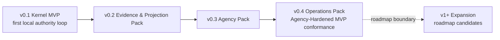
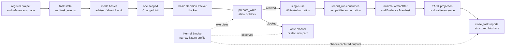

# Build: MVP 계획

## 이 문서로 할 수 있는 일

이 문서는 MVP 범위를 구현 가능한 staged delivery 계획으로 바꿉니다. 전달 순서는 storage schema, DDL, projection template body, operator command syntax, executable fixture contract와 분리해 둡니다.

이 문서는 구현 계획 문서입니다. 문서 세트가 구현 계획에 사용할 수 있다고 승인되기 전에는 runtime/server 구현, 생성된 운영 파일, 실행 가능한 fixture 파일, runtime data를 만들라는 뜻이 아닙니다. 첫 제품 MVP 목표는 v0.1 Kernel MVP이며, Kernel Smoke는 이를 좁게 실행하는 conformance profile입니다. 즉 모듈을 가진 로컬 프로세스 하나로 권한 루프 하나를 증명합니다. v0.2부터 v0.4까지는 Agency-Hardened MVP reference conformance target으로 가는 staged pack이고, v1+ Expansion은 owner 문서가 승격하고 증명하기 전까지 roadmap 범위에 남습니다.

첫 실행 가능한 조각 이후 무엇을 만들지 계획할 때 이 문서를 사용합니다. 정확한 contract는 Reference 문서를 사용합니다.

## 읽는 경우

- v0.1 Kernel MVP 또는 그 뒤 pack을 계획할 때.
- 첫 구현 batch를 키우지 않으면서 staged delivery 범위를 리뷰해야 할 때.
- 구현 순서를 storage, schema, fixture, template detail과 분리해서 보고 싶을 때.

## 먼저 읽을 것

[구현 개요](implementation-overview.md)의 [문서 승인 상태](implementation-overview.md#문서-승인-상태), [첫 실행 가능한 조각](first-runnable-slice.md), [Runtime Walkthrough](runtime-walkthrough.md)를 먼저 읽습니다. 정확한 API contract는 [MCP API와 스키마](../reference/mcp-api-and-schemas.md)를 사용합니다. Storage detail과 DDL은 [Storage와 DDL](../reference/storage-and-ddl.md)을 사용합니다. Design-quality gate와 validator behavior는 [Design Quality Policies](../reference/design-quality-policies.md)를 사용합니다. Conformance fixture semantics는 [Conformance Fixtures 참조](../reference/conformance-fixtures.md)를 사용합니다. Operator procedure와 conformance run overview는 [운영과 Conformance](../reference/operations-and-conformance.md)를 사용합니다. Post-MVP 후보와 승격 기준은 [로드맵](../roadmap.md)을 사용합니다.

## 핵심 생각

단계별 전달 계획은 full agency-hardened platform이 아니라 실제 Kernel MVP에서 시작합니다. v0.1은 첫 local authority loop만 증명합니다. 이후 pack은 첫 목표를 바꾸거나 roadmap automation을 승격하지 않으면서 evidence/projection depth, agency hardening, operations/conformance coverage를 더합니다.

첫 계획의 중심은 Core state, `task_events`, scoped write authority, artifact refs, minimal Evidence Manifest, blockers, 그리고 이를 실행하는 데 필요한 minimal reference surface와 MCP reachability입니다. 초기 구현 가정은 여전히 모듈을 가진 로컬 프로세스 하나입니다. Projection template polish, dashboard 또는 hosted workflow UI, index, 넓은 connector ecosystem 또는 marketplace, team workflow, surface-specific connector automation, metric, parallel orchestration, 넓은 automation은 이 경로가 존재한 뒤 유용해질 수 있습니다. v0.1 Kernel MVP의 첫 build target은 아닙니다.

## 단계별 전달 계획

| 단계 | 전달 목표 | 범위 경계 |
|---|---|---|
| v0.1 | Kernel MVP | 첫 local authority loop만 증명합니다. 첫 제품 MVP 목표이며 Kernel Smoke fixture를 통한 첫 runnable conformance target입니다. |
| v0.2 | Evidence & Projection Pack | Kernel loop가 존재한 뒤 evidence, projection, reconcile behavior를 더 깊게 만듭니다. |
| v0.3 | Agency Pack | User judgment, Manual QA, detached verification, residual risk, stewardship, TDD, feedback policy에 대한 Agency-Hardened MVP behavior를 다룹니다. |
| v0.4 | Operations Pack | Operator readiness, recover/export, artifact integrity, release handoff, 더 넓은 conformance suite coverage를 다룹니다. |

Kernel Smoke는 v0.1 Kernel MVP의 conformance authoring profile로 남습니다. "Smoke"라는 이름은 fixture profile이 좁다는 뜻이지, 첫 제품 목표가 sub-target이라는 뜻이 아닙니다.

### 단계별 전달 이후의 경계: v1+ Expansion

v1+ Expansion은 roadmap 범위이며 Build가 소유하는 단계별 전달의 일부가 아닙니다. Dashboard, hosted workflow UI, Browser QA Capture, Cross-Surface Verification, Context Index, 넓은 connector, metrics, team workflow, orchestration 같은 후보는 owner 문서가 향후 항목을 명시적으로 승격하고 증명하기 전까지 v0.1 Kernel MVP와 Agency-Hardened MVP 밖에 둡니다.

## v0.1 Kernel MVP

v0.1은 하나의 local project, 하나의 reference surface, 하나의 Task에 대한 첫 local authority loop만 증명합니다. 모든 behavior를 Core state, `task_events`, artifact, projection freshness 또는 enqueue, structured blocker를 통해 관찰할 수 있을 만큼 작아야 합니다.

v0.1은 다음만 증명해야 합니다.

- project registration
- Task state와 `task_events`
- direct/work/advisor mode basics
- scoped Change Unit 하나
- 필요한 decision을 request, record, expose, block할 만큼의 basic Decision Packet lifecycle
- `prepare_write` allow/block behavior
- durable single-use Write Authorization 생성
- compatible authorization 하나에 대한 `record_run` consumption
- minimal `ArtifactRef`
- minimal Evidence Manifest
- evidence 또는 required decision이 없을 때 blocked close
- mutation 없는 `status`와 `next` read
- minimal `TASK` projection 또는 durable projection enqueue
- Kernel Smoke queue를 통한 basic Core fixture execution

v0.1은 full detached verification independence, Manual QA policy matrix, residual-risk accepted close semantics, stewardship validators, TDD trace, feedback loop policy, release handoff, full export/recover behavior, large fixture suite를 증명하면 안 됩니다. 이들은 later pack 작업입니다.

이 시점에 사용자나 operator는 작은 완결 루프를 볼 수 있어야 합니다. Current Task status, mode basics, active Change Unit, basic Decision Packet state, scoped write block/allow, durable Write Authorization 생성과 consumption, artifact와 Evidence Manifest link, projection freshness 또는 enqueue, next-action guidance, structured close blocker가 그 루프입니다.

### Kernel MVP pack flow

이 diagram은 v0.1 pack의 implementation order sketch입니다. 눈여겨볼 점은 첫 proof가 single local authority loop라는 것입니다. Deeper evidence, full projection behavior, agency hardening, operations coverage는 later staged pack에 남고, broader automation은 owner 문서가 승격하고 증명하기 전까지 v1+ Expansion에 남습니다.

정확한 state와 close behavior는 [커널 참조](../reference/kernel.md)가, public tool shape는 [MCP API와 스키마](../reference/mcp-api-and-schemas.md)가, projection rule은 [문서 Projection 참조](../reference/document-projection.md)가, fixture semantics는 [Conformance Fixtures 참조](../reference/conformance-fixtures.md#conformance-fixture-format)가 담당합니다. 이 flow는 pack gate나 fixture body requirement를 추가하지 않습니다.

실제 fixture 작성 순서는 [Kernel Smoke Authoring Queue](../reference/conformance-fixtures.md#kernel-smoke-authoring-queue)를 사용합니다. 이 queue는 v0.1 runtime fixture candidate를 이 stage에 매핑하되 exact fixture body shape를 바꾸지 않습니다.

Kernel Smoke pass/fail은 runtime fixture가 Core 또는 operator action을 실행하고 captured state, `task_events`, artifacts, projections, primary errors를 비교해서 결정됩니다. Status prose, Journey Card text, close prose, scenario description은 관찰 가능한 context일 뿐입니다. Exact fixture body와 assertion rule은 [Conformance Fixtures 참조](../reference/conformance-fixtures.md#conformance-fixture-format)가 담당합니다.

## v0.2 Evidence & Projection Pack

v0.2는 kernel loop 위에서 evidence와 readable output을 더 완전하게 만들되 projection은 계속 Core record에서 파생됩니다.

중점:

- v0.1 minimal loop를 넘어서는 evidence manifest coverage
- owner 문서가 이미 정의한 sufficient, partial, stale, blocked, unsupported, not-applicable evidence reporting
- evidence와 projection display에 필요한 artifact relation, redaction, integrity check
- source record가 존재할 때 Reference-required projection renderer
- Reference-required `ProjectionKind` value 전반의 projection freshness와 failure isolation
- human-editable proposal area와 managed-block drift에 대한 reconcile behavior
- Kernel Smoke를 넘어서는 projection/evidence fixture coverage

Projection template polish나 renderer-first 작업이 Task, Run, evidence, verification, close design을 이끌게 하면 안 됩니다. Reference-required projection support는 staged/reference support이지 v0.1 requirement를 뒤늦게 넓히는 말이 아닙니다. v0.1은 최소 `TASK` projection 또는 durable projection enqueue로 제한됩니다. `ProjectionKind` value와 API-owned tiering은 [MCP API와 스키마](../reference/mcp-api-and-schemas.md#shared-schemas)가 담당합니다. [문서 Projection 참조](../reference/document-projection.md#template-tiers)는 authority boundary, source-record rule, freshness rule, template tier presentation을 담당합니다. [Template 참조](../reference/templates/README.md)는 rendered template body와 display card를 담당합니다.

## v0.3 Agency Pack

v0.3은 Agency-Hardened MVP를 첫 구현 scope가 아니라 later reference conformance target으로 보존합니다. 이 pack은 local reference path가 user-owned judgment, assurance, risk를 정직한 경계 안에서 route할 수 있도록 kernel을 harden합니다.

중점:

- Decision Packet quality와 user-judgment routing
- sensitive-action Approval, Decision Packet, Write Authorization separation
- Manual QA policy matrix와 Manual QA blockers
- same-session verification guard behavior를 포함한 detached verification independence
- acceptance와 close 전 residual-risk visibility
- residual-risk accepted close full semantics
- stewardship validators와 codebase stewardship coverage
- policy가 요구하는 TDD trace behavior
- policy가 요구하는 feedback loop policy
- distinct Approval, Manual QA, verification-waiver, acceptance, residual-risk-acceptance judgments
- Core state, events, artifacts, projections, errors를 통해 behavior를 증명하는 agency conformance fixtures

이 pack을 통과하면 local reference path가 agency-preserving work를 명확한 경계로 처리한다는 뜻입니다. v1+ Expansion automation을 staged delivery로 승격하지는 않습니다.

## v0.4 Operations Pack

v0.4는 같은 Core state model 위에서 local operational proof를 완성합니다.

중점:

- runtime home, project state, artifact store, reference surface, MCP availability, projections, reconcile, validators/checks, agency/stewardship/context에 대한 doctor/readiness categories
- interrupted 또는 drifted operational state에 대한 recover handling
- state snapshot, report projection snapshot, artifact refs, redaction status, omitted-secret notes, retained/expired/unavailable artifact status에 대한 export behavior
- artifact integrity checks
- owner 문서가 정의하는 release handoff report/export profile
- connect, doctor, serve MCP, projection refresh, reconcile, recover, export, artifacts check, conformance run에 대한 operator smoke
- Agency-Hardened MVP reference target을 위한 large fixture suite coverage
- Dashboard, hosted workflow UI, Browser QA Capture, Cross-Surface Verification, Context Index, parallel orchestration, team workflow, broad connector automation, native hook 또는 sidecar expansion, derived metrics, preventive guard expansion을 별도로 증명하고 승격하기 전까지 v1+ Expansion에 두는 later-boundary checks

Operator command를 위한 두 번째 state model을 만들면 안 됩니다. Operator는 같은 Core state model 위에서 diagnose, repair, export, fixture run을 수행합니다. 정확한 command name과 flag는 달라질 수 있습니다. Contract는 Core state, `task_events`, artifacts, projections, existing errors 또는 diagnostics 위의 command-independent behavior입니다.

Docs-maintenance는 별도의 읽기 전용 문서 profile로 남습니다. Documentation drift를 보고할 수 있지만 v0.1 Kernel MVP도, Agency-Hardened runtime conformance도, 구현 준비 상태 신호도 아닙니다.

## Roadmap 범위의 v1+ Expansion 후보

아래 항목은 향후 계획이 owner 문서를 통해 capability profile, exact contracts, redaction/secret/PII policy, runtime surface capture 시 artifact retention과 test-environment rule, fixture 또는 conformance target, unsupported surface fallback behavior, no projection-as-canonical dependency를 갖춰 승격하기 전까지 roadmap 범위의 v1+ Expansion에 둡니다.

- dashboard, hosted workflow UI, local metrics를 authority, implementation-readiness, close-readiness surface로 사용하는 것
- reference surface 하나를 넘어서는 broad connector marketplace 또는 surface ecosystem
- Browser QA Capture를 required automation 또는 acceptance replacement로 사용하는 것
- Cross-Surface Verification을 required assurance path로 사용하는 것
- proven pre-tool blocking path 없는 preventive `T4` guard expansion
- concrete reference-surface capability를 넘어서는 native hook expansion 또는 Advanced Sidecar Watcher
- Context Index를 authority 또는 read/write prerequisite로 사용하는 것
- deployment, canary, rollback, production monitoring automation
- parallel orchestration과 concurrent lane scheduling
- team workflow, permissions, team profile export/import
- Local Derived Metrics 또는 long-term operational metrics를 staged-delivery-critical state로 사용하는 것

구현 중 later feature가 유용해 보이더라도 owner 문서가 권한 경로를 정의하고 증명하기 전까지는 읽기 전용 표시, metadata, 기존 owner path를 위한 artifact 후보, fixture candidate로 유지합니다. v0.1 Kernel MVP, Agency-Hardened MVP, close-readiness claim의 전제 조건이 되어서는 안 됩니다.

## 단계별 종료 기준

문서 승인 이후 future runtime planning을 위한 implementation-readable checklist로 사용합니다. 이들은 staged exit을 다시 말할 뿐이며 schema, fixture, DDL, new runtime requirement를 추가하지 않습니다. [문서 승인 상태](implementation-overview.md#문서-승인-상태)가 first runtime-batch planning을 막고 있는 동안 implementation을 authorize하지 않습니다.

### v0.1 Kernel MVP exit checklist

- 프로젝트 하나가 등록된다.
- Reference surface 하나가 honest guarantee level로 등록된다.
- Task 하나를 만들고, 읽고, advance하고, `task_events`에 나타낼 수 있다.
- Direct, work, advisor mode basics가 full policy coverage를 암시하지 않고 관찰된다.
- Change Unit 하나가 product write를 scope한다.
- Basic Decision Packet lifecycle이 required decision을 request, record, expose, block할 수 있다.
- Active compatible Change Unit 없는 product write는 block된다.
- Out-of-scope intended write는 block된다.
- 허용된 `prepare_write`는 durable single-use Write Authorization을 만든다.
- Compatible `record_run`은 authorization을 한 번 consume한다.
- Minimal artifact registration은 `ArtifactRef`를 반환한다.
- Minimal Evidence Manifest는 Run과 artifact support를 연결한다.
- `status`와 `next`는 state를 변경하지 않고 current state를 반환한다.
- `TASK` projection이 current이거나 durable하게 enqueued된다.
- Required evidence 또는 required decision이 없으면 `close_task`가 block된다.

### v0.2 Evidence & Projection Pack exit checklist

- Evidence state가 v0.1 이후 필요한 owner-defined sufficient, partial, stale, blocked, unsupported, not-applicable case를 cover한다.
- Artifact relation, integrity, redaction metadata가 evidence와 projection display를 support한다.
- Source record가 존재할 때 Reference-required pre-verification projection이 enqueue 또는 render된다.
- Projection failure는 Core state failure와 분리된다.
- Managed Markdown edit 또는 proposal section은 reconcile item을 만든다.
- Evidence와 projection fixture가 fixture body shape를 바꾸지 않고 Kernel Smoke를 확장한다.

### v0.3 Agency Pack exit checklist

- Decision Packet quality와 user-judgment routing이 fixture로 증명된다.
- Sensitive-action Approval이 Decision Packet, Write Authorization, Manual QA, verification, acceptance, residual-risk acceptance를 대체하지 않는다.
- Detached verification independence와 same-session verification guard behavior가 fixture로 증명된다.
- Policy가 요구하는 곳에서 Manual QA policy matrix와 QA blocker가 fixture로 증명된다.
- Close-relevant residual risk가 successful acceptance 또는 close 전에 보인다.
- Risk-accepted close는 owner semantics에 따라 accepted Residual Risk refs를 인용한다.
- Policy가 요구하는 곳에서 stewardship validators, feedback loop policy, TDD trace behavior가 cover된다.
- Agency conformance가 Journey visibility, user judgment, Autonomy Boundary respect, distinct user judgments, residual-risk visibility를 증명한다.

### v0.4 Operations Pack exit checklist

- Doctor/readiness가 runtime home, project state, artifact store, reference surface, MCP availability, projections, reconcile, validators/checks, agency/stewardship/context category를 보고한다.
- Recover는 recovery artifact를 successful completion proof로 취급하지 않으면서 interrupted 또는 drifted operational state를 처리한다.
- Export는 state snapshot, report projection snapshot, artifact refs, redaction status, omitted-secret notes, retained/expired/unavailable artifact status를 포함한다.
- Artifact integrity check는 missing 또는 mismatched artifact를 기존 diagnostics로 보고한다.
- Release handoff report/export behavior는 deployment, merge, rollback, production authority를 가져오지 않고 owner profile을 따른다.
- Large fixture suite coverage가 prose가 아니라 exact-shape fixture로 Agency-Hardened MVP를 증명한다.
- Later-boundary check는 owner 문서가 승격하고 증명하기 전까지 v1+ Expansion item을 staged delivery 밖에 둔다.

## 단계별 관찰 가능 항목

| 단계 | 사용자 또는 operator가 볼 수 있는 것 |
|---|---|
| v0.1 Kernel MVP | Local project와 Task가 첫 authority loop를 통과합니다. Mode basics, Change Unit scope, Decision Packet blocker, `prepare_write`, Write Authorization, `record_run`, artifact, Evidence Manifest, status/next, `TASK` projection 또는 enqueue, close blocker가 보입니다. |
| v0.2 Evidence & Projection Pack | Evidence state, artifact-backed support, projection freshness, projection failure isolation, reconcile item이 owner record에서 보입니다. |
| v0.3 Agency Pack | Decision quality, Approval separation, Manual QA, detached verification, residual risk, stewardship, TDD, feedback, acceptance, close behavior가 work를 진행하거나 닫을 수 있는지 설명합니다. |
| v0.4 Operations Pack | Doctor, recover, reconcile, export, release handoff, artifact integrity, conformance fixture가 같은 Core state를 증명하고 later automation을 roadmap 범위의 v1+ Expansion에 남겨 둡니다. |

단계별 전달 이후에는 promoted roadmap item이 owner 문서가 exact contract와 fixture coverage를 정의한 뒤에만 authority loop를 읽고, 표시하고, 감싸고, 확장할 수 있습니다.
