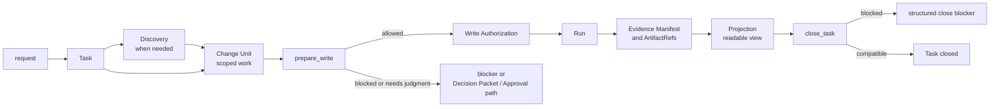

# Build: Runtime Walkthrough

## 이 문서로 할 수 있는 일

사용자 요청에서 close outcome까지 Harness work item 하나가 어떻게 지나가는지, 모든 엄격한 contract를 먼저 읽지 않고 따라갈 수 있게 합니다.

이 문서는 Build 문서입니다. Implementer와 reviewer를 위해 runtime path를 요약하지만, 문서 세트가 구현 계획에 사용할 수 있다고 승인되기 전에는 runtime/server 구현, 생성된 운영 파일, 실행 가능한 fixture 파일, runtime data, 새 schema를 만들라는 뜻이 아닙니다. 첫 제품 MVP 목표는 v0.1 Kernel MVP이며, Kernel Smoke는 이를 좁게 실행하는 conformance profile입니다. v0.2부터 v0.4까지는 Agency-Hardened MVP reference conformance target으로 가는 staged pack이고, v1+ Expansion은 owner 문서가 승격하고 증명하기 전까지 roadmap 범위에 남습니다.

## 읽는 경우

- Reference contract에 들어가기 전에 runtime 관점의 mental model이 필요할 때.
- 요구사항이 어떻게 scoped work가 되는지 확인할 때.
- state, artifact, projection, close blocker의 차이를 설명해야 할 때.
- 첫 Kernel MVP path를 키우지 않고 리뷰할 때.

## 먼저 읽을 것

구현 맥락은 [구현 개요](implementation-overview.md)와 [첫 실행 가능한 조각](first-runnable-slice.md)을 읽습니다. 정확한 동작은 [커널 참조](../reference/kernel.md), [런타임 아키텍처 참조](../reference/runtime-architecture.md), [문서 Projection 참조](../reference/document-projection.md), [MCP API와 스키마](../reference/mcp-api-and-schemas.md), [Storage와 DDL](../reference/storage-and-ddl.md), [운영과 Conformance](../reference/operations-and-conformance.md)를 사용합니다.

## 핵심 생각

Write-capable tracked work에서는 Harness가 Task, 필요한 Discovery 또는 decision, 첫 scoped Change Unit을 알게 된 뒤에야 요청이 안전한 product work가 됩니다. 제품 파일 쓰기는 그다음 `prepare_write`를 통과해야 하며, 이때 one-attempt Write Authorization이 만들어질 수 있습니다. Run은 그 권한을 consume하고, evidence와 artifact는 claim을 뒷받침하며, projection은 state를 사람이 읽을 수 있게 만들고, `close_task`는 structured blocker를 반환하거나 Task를 닫습니다.

## 한눈에 보는 walkthrough

눈여겨볼 점은 이 diagram이 reader path이며 두 번째 source of truth가 아니라는 것입니다. Discovery와 projection은 work를 shape하거나 읽는 데 도움을 주지만, write authority는 `prepare_write`, execution 기록은 `record_run`, completion 판단은 `close_task`가 담당합니다. 정확한 state와 gate behavior는 [커널 참조](../reference/kernel.md)에 있고, public call은 [MCP API와 스키마](../reference/mcp-api-and-schemas.md)에 있습니다.

## 단계별 runtime path

### 1. Request -> Task

사용자는 평소 말로 원하는 일을 설명합니다. Tracking이 유용한 경우 Harness intake가 task shape를 분류하고 Task state를 만들거나 갱신합니다.

엄격한 동작: Task lifecycle, mode, state transition은 [커널 참조](../reference/kernel.md#lifecycle-and-transitions)가 담당합니다. Storage layout은 [Storage와 DDL](../reference/storage-and-ddl.md)이 담당합니다.

### 2. Task -> Discovery

요청이 모호하거나, 위험하거나, 여러 단계이거나, 제품 표면에 닿거나, 사용자 소유 판단이 필요할 가능성이 있을 때 Discovery를 사용합니다. Discovery는 goal, non-goal, acceptance criteria, assumption, technical/product choice, security/privacy concern, QA expectation, scope boundary를 구체화합니다.

엄격한 동작: Discovery는 shaping input입니다. Approval, Write Authorization, evidence, verification, QA, acceptance, residual-risk acceptance, close, 새 authority path가 아닙니다. Decision routing은 [Decision Packet](../reference/kernel.md#decision-packet)과 [MCP API와 스키마](../reference/mcp-api-and-schemas.md#harnessrequest_user_decision)의 public decision call이 담당합니다.

### 3. Discovery -> Change Unit

첫 안전한 Change Unit은 요청을 scoped implementation unit으로 바꿉니다. 무엇이 바뀔 수 있는지, 무엇이 범위 밖인지, agent가 그 scope 안에서 어떤 판단을 직접 할 수 있는지를 이름 붙입니다.

엄격한 동작: Change Unit과 Autonomy Boundary 의미는 [커널 참조의 Change Unit](../reference/kernel.md#change-unit)과 [Autonomy Boundary](../reference/kernel.md#autonomy-boundary)가 담당합니다. Change Unit은 work를 scope하지만, 그 자체로 write를 authorize하지 않습니다.

### 4. Change Unit -> `prepare_write`

제품 파일을 쓰기 전에 agent는 intended operation에 대한 write authority를 Core에 요청합니다. Core는 current state, Change Unit scope, Autonomy Boundary, baseline freshness, sensitive-action Approval, Decision Packets, applicable design policy, surface capability를 확인합니다.

엄격한 동작: `prepare_write`는 [커널 참조](../reference/kernel.md#prepare_write)가 담당합니다. Public request/response shape는 [`harness.prepare_write`](../reference/mcp-api-and-schemas.md#harnessprepare_write)가 담당합니다.

### 5. `prepare_write` -> Write Authorization 또는 blocker

확인이 통과하면 Core는 specific attempt 하나에 맞는 Write Authorization을 만들거나 반환합니다. 통과하지 못하면 response는 blocker, state conflict, sensitive-action Approval path, Decision Packet path로 이어집니다.

엄격한 동작: Write Authorization 의미는 [Write Authorization](../reference/kernel.md#write-authorization)이 담당합니다. Approval과 Decision Packet의 non-substitution rule은 [Judgment route boundaries](../reference/kernel.md#judgment-route-boundaries)가 담당합니다.

### 6. Write Authorization -> Run

Implementation 또는 direct write가 일어난 뒤 `record_run`이 실제로 일어난 일을 기록합니다. Product-write Run은 compatible, unexpired, unconsumed Write Authorization 하나를 consume합니다. 범위 밖 observation은 prose로 정상화되지 않으며 repair, recovery, blocker handling으로 라우팅됩니다.

엄격한 동작: Run recording과 authorization consumption은 [record_run](../reference/kernel.md#record_run)이 담당합니다. Guarantee level enforcement는 [런타임 아키텍처 참조](../reference/runtime-architecture.md#보장-수준-강제-지도)에 요약되어 있습니다.

### 7. Run -> Evidence와 artifact

Evidence는 completion claim 또는 acceptance criteria를 supporting owner records와 registered artifact refs에 매핑합니다. Raw artifact는 durable evidence bytes를 보관하고, artifact record와 ref는 identity, integrity, redaction, retention, owner relation을 담습니다.

엄격한 동작: evidence와 gate 의미는 [Evidence Manifest](../reference/kernel.md#evidence-manifest), [Evidence Gate](../reference/kernel.md#evidence-gate), [Artifact](../reference/kernel.md#artifact)가 담당합니다. Artifact storage와 DDL detail은 [Storage와 DDL](../reference/storage-and-ddl.md)이 담당합니다.

### 8. Evidence -> Projection

Projector는 state record, event, artifact ref에서 readable Markdown과 card를 렌더링합니다. Projection freshness는 readable view가 current인지 판단하는 데 도움을 주지만, Markdown이 state 또는 evidence authority가 되지는 않습니다.

엄격한 동작: projection authority, managed block, human-editable section, freshness rule은 [문서 Projection 참조](../reference/document-projection.md)가 담당합니다. Rendered template body는 [Template 참조](../reference/templates/README.md)에 있습니다.

### 9. Projection -> close blocker 또는 close

완료에 가까워지면 `close_task`가 close-relevant state를 확인하고 Task를 닫거나 structured blocker를 반환합니다. Close Readiness는 그런 blocker의 user-facing summary이지 새 gate가 아닙니다.

엄격한 동작: completion check는 [`close_task`](../reference/kernel.md#close_task)가, close result wording은 [Close result semantics](../reference/kernel.md#close-result-semantics)가, public error precedence는 [MCP API와 스키마](../reference/mcp-api-and-schemas.md#primary-error-code-precedence)가 담당합니다.

## 첫 구현 경계

v0.1 Kernel MVP에서는 path를 좁게 유지합니다. 하나의 local project, 하나의 reference surface, 하나의 Task, 하나의 scoped Change Unit, basic Decision Packet behavior, `prepare_write`, `record_run`이 consume하는 Write Authorization 하나, minimal artifact와 Evidence Manifest support, minimal `TASK` projection 또는 durable enqueue, status/next read, structured close blocker가 범위입니다.

Staged order와 Kernel Smoke boundary는 [MVP 계획](mvp-plan.md)에 요약되어 있습니다. Exact fixture body shape와 assertion rule은 [운영과 Conformance](../reference/operations-and-conformance.md#conformance-fixture-format)에 둡니다.
